# 从推理服务的角度看语言模型：token 的一生、Megakernel 与 Parcae

这堂课是 Dan Fu 的客座讲座，讲模型训练完成之后的那一侧：推理系统如何服务请求、生产流量长什么样、KV Cache 与 prefill/decode 分离、Megakernel 如何加速 decode，以及循环架构 Parcae 如何稳定训练并改变缩放规律。

## 开场与动机：从训练到推理

非常感谢大家来听。我觉得你们这门课非常酷。当然也要感谢 Percy 邀请我来做这次报告。在这门课上，你们主要讨论的是训练，如何训练这些语言模型，走到今天这一步——让模型可以反过来跟我们对话。今天我想讲一点另一侧的事情：一旦你有了这样一个模型，实际去服务它、做推理（inference）是什么样子，怎么把电变成 token、再变成智能；以及从那个角度看，有哪些有趣的研究问题和研究可以做。

*[00:52](https://www.youtube.com/watch?v=9EEm4iMAF5s&t=52)*

我先从一些高层的动机开始。有一件事对我们所有人来说都越来越清楚：我们正在经历一场几乎可以称为新工业革命的变化，背后就是这些模型及其能力。这些幻灯片是我两年前找工作演讲时做的，所以具体例子会显得有点老，但你可以做人类水平的文本生成、代码生成——Cursor、Claude Code、GPT 5.5，不只是 4。你还可以生成图像和视频，或者理解图像和视频并处理它们。你开始能理解新的模态。我们也开始看到一些应用，以及生物、健康、DNA 模型等科学领域的东西。有件事驱动我研究很久了：是什么让这些进步成为可能，下一代我们又怎么改进？

*[01:52](https://www.youtube.com/watch?v=9EEm4iMAF5s&t=112)*

一个很丰富的驱动力就是规模。这个图现在看已经比较老了，但这些模型确实以巨大的方式扩展了。2018 年，我博士刚开始的时候，最大的模型是数亿参数，我们还觉得天哪，这些东西太疯狂了。到 2019 年，我们觉得它们太危险不能发布，那就是 GPT-2。我想在这门课上，你们可以训练出一个 GPT-2 质量的模型；我不确定你们做没做，如果足够努力，是可以的。今天当然有开源的万亿参数甚至更多参数的模型，前沿大概在 5 到 10 万亿参数。这很令人兴奋，随之而来的是聊天、写代码、分析复杂文本、帮你做作业等一堆新能力。

*[02:38](https://www.youtube.com/watch?v=9EEm4iMAF5s&t=158)*

真正值得注意的是，这个转变发生得比我们想的更快，至少比我自己博士刚开始那几年想的快。有一个很贴切的类比，而且日期巧合得很有意思。1902 年，曼哈顿有 13 万匹工作马——不是养着玩的，而是真的承担关键角色的马。它们每天产生大量粪便，乘以 13 万，就是一个真实的马粪问题。事实上，当时有整个学术会议就是聚在一起讨论：这些马产生的粪便怎么办？1898 年纽约就开过这样一个会，结论是：马粪问题无解，你只能捏着鼻子忍。十年后，到 1912 年，曼哈顿的汽车数量已经超过了马。那个十年的转变里，存在了几个世纪的东西开始被汽车取代。

*[03:37](https://www.youtube.com/watch?v=9EEm4iMAF5s&t=217)*

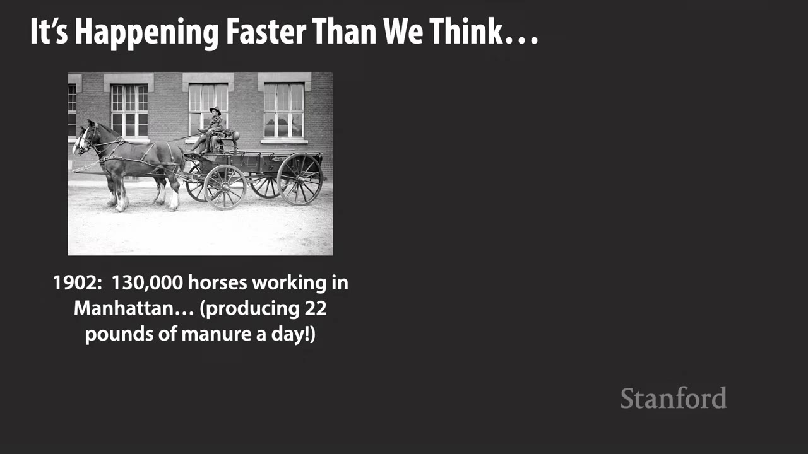

对我们、对语言模型来说，我们做的很多事情，那个 1912 时刻可能就是去年。至少对我而言，去年我开始用语言模型写大部分代码。我团队里大多数人也是。我告诉所有学生也这么做，除了做作业的时候。这是一个我们正在经历的非常令人兴奋的转变。

*[04:28](https://www.youtube.com/watch?v=9EEm4iMAF5s&t=268)*

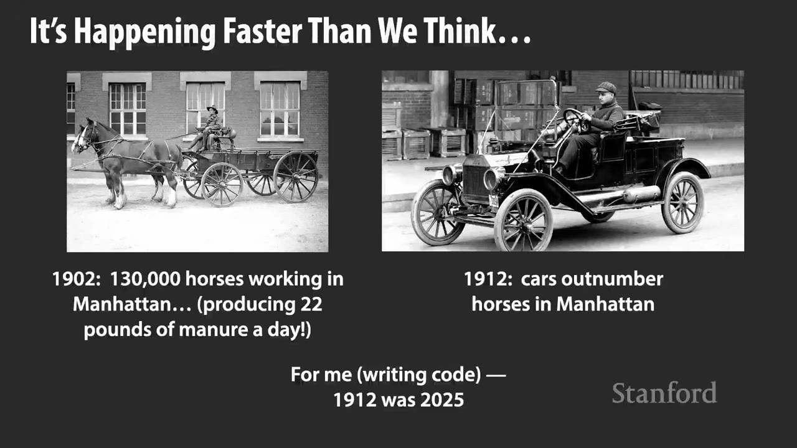

推动这一切的很多东西是规模，而规模又由 GPU 驱动。所以可以说，GPU 是新的石油。这又是一个比较老的宣布，但你看到数千亿美元甚至更多投资进入 GPU。历史以有趣的方式押韵，有些国家、有些主权财富基金把这件事作为自己投资组合的重要部分。

*[04:58](https://www.youtube.com/watch?v=9EEm4iMAF5s&t=298)*

有一件事非常清楚：推理才是关键那一块。你可以把推理看作把电变成智能的引擎。就像石油只有在一辆车里、有一个引擎把油变成有用的动能时才有用；推理引擎、GPU kernel，这些才是真正把 GPU——像 Percy 说的，从沙子——变成我们今天能用的东西。如果你想一想，机器学习模型其实就是操作的 DAG（有向无环图），是某种存在于以太里的数学对象。推理引擎、GPU kernel 这些部件，才是你实际要编程、把它们映射到 ML 操作上的东西。我想你们这门课做了一些这样的工作，比如实现 Flash Attention，那是训练侧。但推理侧有一整个世界的复杂性。

*[05:50](https://www.youtube.com/watch?v=9EEm4iMAF5s&t=350)*

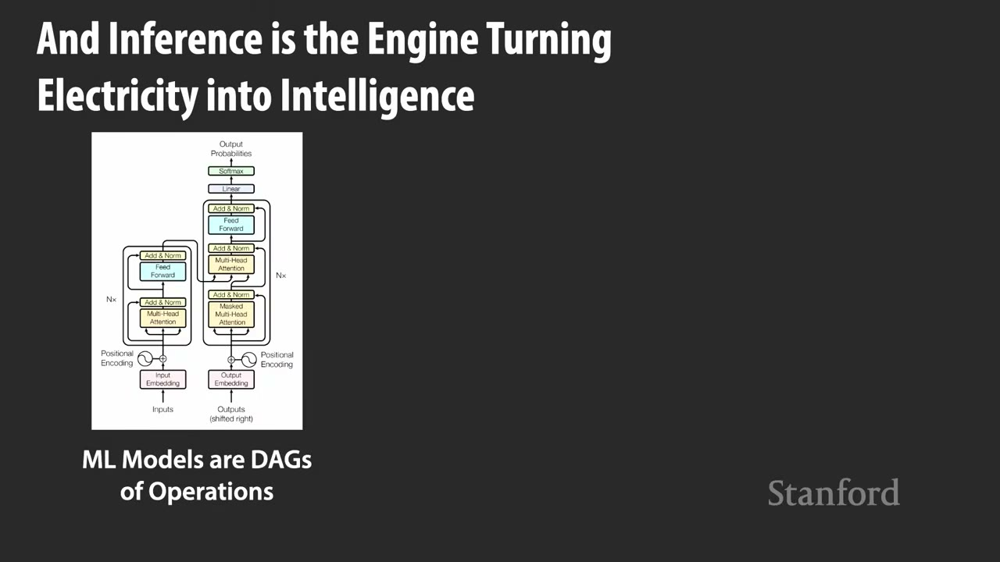

如果今天的讲座你什么都没记住，我希望你记住一件事：如果你理解推理、理解推理引擎、理解支撑很多核心技术的 GPU kernel，你就能在机器学习算法上实现全栈创新。

*[06:24](https://www.youtube.com/watch?v=9EEm4iMAF5s&t=384)*

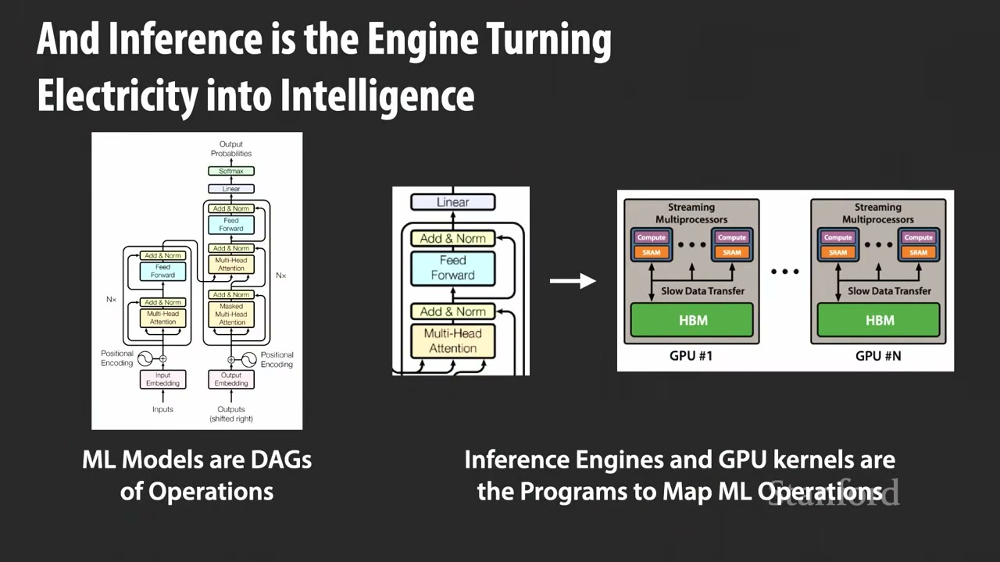

今天我会先给一个高层次的概览，讲 token 的一生。当你向这些模型发一个请求时，这个请求会发生什么，它如何穿过整个推理服务，你必须做哪些有趣的选择。然后我会深入讲两个研究项目，看看如果你拿出这个系统的某些部分，可以问什么问题、可以做哪些事情。

*[06:54](https://www.youtube.com/watch?v=9EEm4iMAF5s&t=414)*

在进入技术细节之前，我快速做个介绍。我代表两个组织。一个是 UCSD，我在那里有一个小实验室，今天部分工作来自那里。另一个是 Together，今天很多工作也来自那里。Together 是一个 AI 云，做 GPU、推理、微调等等，有很重的研究背景，包括 Percy——我不确定你们能不能看到我的鼠标，但他就在屏幕上。我们背后有很强的研究存在，今天很多内容也来自那里。

*[07:31](https://www.youtube.com/watch?v=9EEm4iMAF5s&t=451)*

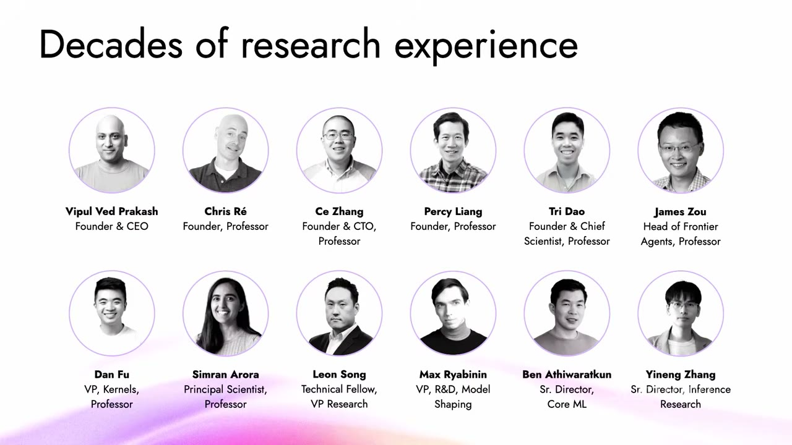

## token 的一生：请求进入推理引擎后发生什么

好，我先给一个高层次的概览，讲 token 的一生。当你向一个推理系统发请求时，会经过哪些不同部件？这些幻灯片借鉴了我的学生 Austin 在 Together 的经验做的一个报告。我要说明一下，所有幻灯片都是 Nano Banana Pro 完全 AI 生成的，但它们还不错，只要你不仔细看技术细节。高层上一切都是对的，如果你看得很仔细，会看到一些非常错的东西。

*[08:10](https://www.youtube.com/watch?v=9EEm4iMAF5s&t=490)*

这是推理引擎所有部件的总览。我大致描述一下它怎么工作。你收到一个请求。第一件事是请求被调度到不同的 GPU 上。你可能把 prefill 和 decode 分离（disaggregated prefill and decode）到不同机器。然后你会拿这个请求去查 KV Cache，看看我以前见过这个请求或它的某个版本吗？有没有可以省下来的计算？接下来你开始执行核心的机器学习代码：这里有新 token，有需要计算的新操作。你可以做各种优化，把计算切分到不同机器，跨节点并行，或者在节点内跨不同 GPU 并行——取决于你的模型大小、取决于你怎么切分。我觉得一件令人兴奋的事是，随着硬件发展，我们会开始看到更多不同的选择。但一旦你做完所有选择、执行完代码，最后你得到 token，你可以问：Chad，Percy 说的线性回归是什么意思，我那天逃课了。然后你得到整个端到端体验。

*[09:33](https://www.youtube.com/watch?v=9EEm4iMAF5s&t=573)*

有一件事我觉得值得开始思考：这些不同的工作负载长什么样？它们差别很大。这是那种你仔细看会发现有些 5 变成了 S 的图。你要想的一件事是，当你实际服务生产流量时，它不一定像训练时看到的 token，也不像你脑子里随便编出来的一个流量工作负载。

*[10:15](https://www.youtube.com/watch?v=9EEm4iMAF5s&t=615)*

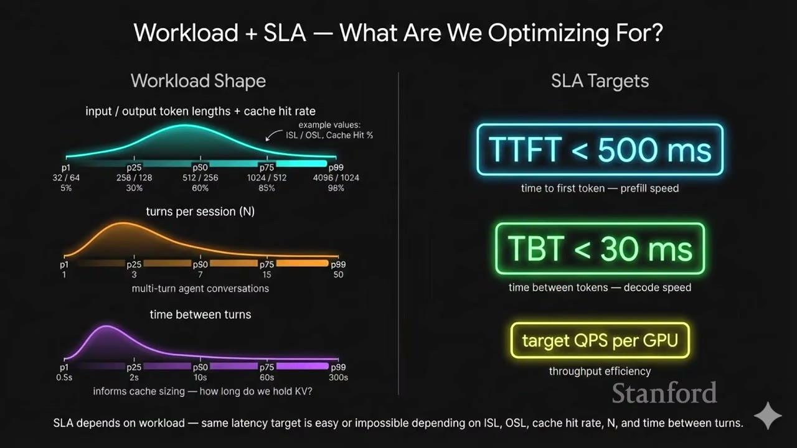

我们通常看到的是什么样？对某个特定工作负载，你会看到特定的输入和输出 token 分布。举个编码工作负载的例子。假设你是 Cursor 这样的产品，整个代码库对 agent 可用，你在上面问问题。通常会有很长的输入，数万个输入 token。然后取决于你的模型怎么训练，模型可能输出一些思考 token，或者输出一些短内容。这会随工作负载变化，也会随模型变化。

*[10:53](https://www.youtube.com/watch?v=9EEm4iMAF5s&t=653)*

编码工作负载和摘要工作负载、叙事摘要工作负载看起来非常不同。如果你的工作是把整本书粘贴到聊天窗口里，然后来回对话搞清楚发生了什么，那和标准聊天非常不一样。如果你只是打开聊天说，嘿，给我解释一阶微积分或者随便什么，那工作负载形状也非常不同。

*[11:21](https://www.youtube.com/watch?v=9EEm4iMAF5s&t=681)*

我们今天使用语言模型的方式，有很多是回合制的 agentic 工作流。写代码时，你和编码 agent 来回说：做这个；不，我不是那个意思，做那个。你的编码 agent 本身可以对语言模型迭代很多次。它可能调用一些工具，说在我的代码库里 grep 搜索某个东西，然后把结果喂回模型。它可能去做一次互联网搜索，查用户问的事情。所以通常，你们的对话会有很多轮。

*[11:59](https://www.youtube.com/watch?v=9EEm4iMAF5s&t=719)*

另一个有趣的点是，不同应用有不同的时间节奏。如果你在一个快速、交互式的聊天循环里，或者你在手机上用 ChatGPT 语音模式，你可能希望响应相对快。另一方面，如果你组织了一个 agentic 工作流，说：去帮我做这个，我会不管你，你自己迭代，那节奏就不一样。如果某个时刻你的 agent 卡住了，说：嘿，帮帮忙，我需要建议，而你没注意到，那么回合之间又会有另一个间隔。所有这些事情开始定义你的工作负载长什么样：每次有多少新 token？你要生成多少 token？我的会话有多长？我是一个很粘的用户，一直和我的 Claude Agent 来回聊，还是我只问一个问题，然后离开，第二天再回来？当然还有回合之间间隔多久。比如我有一个 ChatGPT agent 聊天，聊我该怎么安排每周锻炼，我每两周才和它交互一次。那是非常不同的流量模式。

*[13:12](https://www.youtube.com/watch?v=9EEm4iMAF5s&t=792)*

当然，取决于你的应用，目标也不同。如果是交互式应用，你可能会说：我希望第一个 token 在不到一秒内回来，这样 agent 可以说：嘿，我在想，然后说 blah de blah de blah。或者我可能说：我知道我要生成 500 个 token，我希望整个响应在某个时间内回来，让用户能足够快地读完。所有这些部件都会影响你的目标。

*[13:39](https://www.youtube.com/watch?v=9EEm4iMAF5s&t=819)*

当请求进来的时候，有几个基本部分。我先稍微放一放 prefill 和 decode 的部分。假设你有一段文本进来，第一件事是 tokenize 它。我想你们都熟悉这个。然后你就进入一个有点复杂的调度机制，因为你必须问：我之前见过这些 token 吗？我能直接从缓存里查一些激活吗？

*[14:17](https://www.youtube.com/watch?v=9EEm4iMAF5s&t=857)*

然后你基本上进入机器学习计算的两大块：prefill 和 decode。它们是非常不同的野兽。prefill 意思是，假设你有 1 万个从未见过的 token，你想计算激活和 logit 应该是什么。1 万 token 进，1 个 token 出。那是非常计算受限（compute bound）的操作，看起来和你们训练时看的东西很像。训练时你有大量 token，写 Flash Attention kernel，跑训练循环。prefill 非常类似，只是不跑反向传播。然后有 decode。decode 是你之后一次只生成一个 token。你把这 1 万个 token 传进去，说：这是我的代码库，告诉我函数 ABC 是做什么的。模型会处理整个 prompt，然后开始一次生成一个 token，如果你有 speculative decoding 工作，可能一次三四个。

*[15:00](https://www.youtube.com/watch?v=9EEm4iMAF5s&t=900)*

如果你想想那个操作：每生成一个新 token，你都要把它再跑一遍模型。算一下，其实需要计算的 flops 并不多。所以它是相对轻的计算，但又非常受内存带宽限制（memory bandwidth bound）。这意味着，你为了生成一个 token，必须把整个模型加载一遍。在模型 pass 结束时，你得到一个代表 token 的数，然后把它变成字符串。你可能还会做一点处理，比如找停用 token、做安全检查，看用户是不是想以坏方式黑进系统等等。最后你得到 token。推理引擎其实一直在这个循环里运行，等待请求进来。也就是说，它跑着这个调度、执行、token sampling 的循环，然后重复。

*[16:20](https://www.youtube.com/watch?v=9EEm4iMAF5s&t=980)*

## 连续批处理、KV Cache 与模型并行

现在我们可以再深入一步，看看当一个系统同时处理很多不同请求时是什么样子。我们有这个叫连续批处理（continuous batching）的技术。读这个图的方式是：时间向下流动。随着你往下走，有新请求进来。假设第一步，你有一些长请求：一个用户在要求分析一份长文档，引擎正在生成一堆 token。可能另一个请求进来，开始占用一些资源。这些资源首先是计算资源，你得同时跑多个请求。如果 KV Cache 被填满，它们也可能是内存资源。所以你会看到多个请求同时发生。一步之后，那个短请求可能完成了，一个新请求进来，可能跑几步。如果另一个请求进来，也许又是一个很长的请求，那就是第四步里橙色那个。但也许你没有足够的 GPU 内存——你需要把所有 KV Cache 存在 GPU 上——也许你用完了，于是可能开始排队。等那个长请求完成后，你可以开始新请求，然后继续看它跑。所以已经能看到，当很多不同请求活在一个系统里时，复杂度是什么样的。

*[18:02](https://www.youtube.com/watch?v=9EEm4iMAF5s&t=1082)*

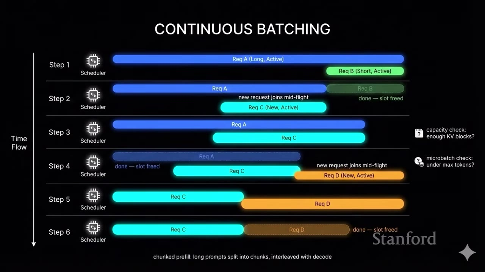

有一个非常重要的部件叫 KV Cache。可以这样想：你有很多用户说：嗨 ChatGPT，或者嗨 Claude。理论上你不需要为每个用户都重新计算新激活再跑一遍。或者如果用户传进来一本长书，你只对那本书跑一次 prefill，然后下一次你收到这个请求的补充，也就是对话的下一轮，你不需要把整个东西再算一遍。所以我们有 KV Cache 这种机制，用 prefix sharing，说：我有一组新 token 进来，用一个很传统的数据结构，比如基本的树，看看哪些 token 我以前见过、哪些是新的，然后基本上查一下那些激活会是什么。

*[19:00](https://www.youtube.com/watch?v=9EEm4iMAF5s&t=1140)*

一旦计算真的在 GPU 上跑起来，有各种切分方式。我不确定你们有没有讲过这个，但假设你有一个万亿参数模型，跑在 280 GB 的 GPU 上，你不可能把整个模型放进每张 GPU。所以有各种切法。你可以把每个 tensor 切成四份，放到四张 GPU 上，这叫张量并行（tensor parallelism）。或者今天有很多最先进的模型是混合专家（mixture of experts）模型，你有一个个专家，根据不同的 token 被选择性激活，你可以把它们切到不同 GPU 上。你在这里做的选择会决定瓶颈是什么：你需要多少 GPU 来跑模型？你同时能服务多少会话？

*[19:58](https://www.youtube.com/watch?v=9EEm4iMAF5s&t=1198)*

一个很大的事情是，我们倾向于把 prefill 和 decode 分到不同 GPU、不同机器上。这是因为它们的计算瓶颈和计算特征非常不同。prefill 看起来很像你们训练时做的事情：你直接跑，非常 flop 密集，可以真正把 GPU 用到极致。decode 则是非常内存带宽密集，因为你没有做那么多计算，但仍然必须同时加载所有模型权重。它们花的时间也不同。prefill 通常比单个 decode 步长很多，但你会跑多得多的 decode 步，因为一个 prompt 跑一次 prefill，每生成一个 token 跑一次 decode。所以一个很基本的优化，几乎所有人都开始采用：prefill 在一组 worker 上跑，decode 在另一组 worker 上跑，这样你可以把这两个计算专门化到栈的不同部分。

*[20:46](https://www.youtube.com/watch?v=9EEm4iMAF5s&t=1246)*

结果发现，这种分离能带来很多创新。有些事你们可能听说过：NVIDIA 收购了 Groq。NVIDIA 是 GPU 之王，却买了这个新的推理芯片。原因之一就是 decode 工作负载和 prefill 工作负载太不同了，如果你看代码，你完全可以用非常不同的芯片。比如下一代硬件里，NVIDIA 计划用它的 GPU 做 prefill，用这些 LPU Groq 芯片做 decode。Cerebras 也有类似的事。OpenAI 和 Cerebras 有计算合作，那是另一种更擅长 decode 的芯片。还有 SambaNova 等公司，也在押注这个空间的不同部分。

*[21:47](https://www.youtube.com/watch?v=9EEm4iMAF5s&t=1307)*

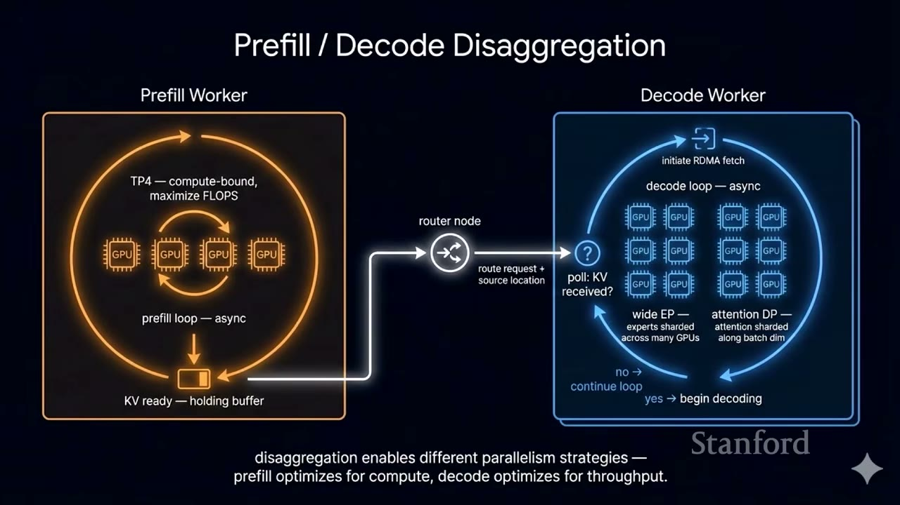

## 大规模部署中的诡异 bug 与 KV Cache 分层

这里有一个有趣的例子。当你真正大规模部署推理引擎、开始每天服务数万亿 token 甚至更多时，你会遇到一些相当讨厌的 bug。这是一组 bug，大部分发生在去年底的一些开源推理引擎里。大规模系统的一个特征就是：在小规模能工作得很好的东西，在大规模必然开始坏。我们说的是发生概率 0.001% 甚至更低的事件。有些是 NaN。有时候你有一个 kernel 有非常轻微的错误，但触发条件非常罕见。你会看到一些 logit 在计算中途变成 NaN。当这种情况发生时，我们发现模型会开始输出同一个 token。我记得某个模型输出开始变成：hi, hi, hi, hi，或者开始输出感叹号，然后你陷入这些循环。

*[23:09](https://www.youtube.com/watch?v=9EEm4iMAF5s&t=1389)*

另一个模型，有人在某个时候改了工具调用的处理方式。工具调用是模型说：嘿，我想做一次互联网搜索之类的事情。模型会说去做互联网搜索，然后你的外部 harness 必须用老式代码去做搜索。某个时候，其中一个引擎里这些工具调用不再被正确处理。症状是补全长度暴涨，因为模型会说：嘿，做一次互联网搜索，然后它通常会——当模型行为正确时——说：嘿，做一次互联网搜索，我完成了，返回给用户，去做吧。但在这个情况下，它没有正确返回。所以它会说：嘿，做一次互联网搜索。嘿，做一次互联网搜索。嘿，我不知道为什么没有搜索发生。它就这样陷入非常长的 doom loop，持续数万个 token。

*[24:03](https://www.youtube.com/watch?v=9EEm4iMAF5s&t=1443)*

还有一个 bug 很有趣，因为它同时干掉了几家保险提供商。它实际上被归咎于量化问题。但真正发生的要微妙得多：模型会突然、随机地开始输出中文字符，而它完全没有理由这么做。对某些模型，有时会有猜测说：哦，它们一定是在中文模型上微调过，因为我的模型突然——我用英语问它，它开始用中文回我。实际上发生的是，某个 kernel 里有一个 off-by-one 错误，是一个非常微妙的 bug。有时你会从 GPU 读到一些额外的未初始化内存，把它跑过 retention，然后在整个过程结束时，你得到一个随机中文字符。然后模型会想：我为什么突然开始用中文思考？一定是用户在问中文问题。然后它就一路偏到中文去了。所以有时这是因为模型真的被训练成用中文思考，有时只是别人代码里的一个 off-by-one bug。

*[25:31](https://www.youtube.com/watch?v=9EEm4iMAF5s&t=1531)*

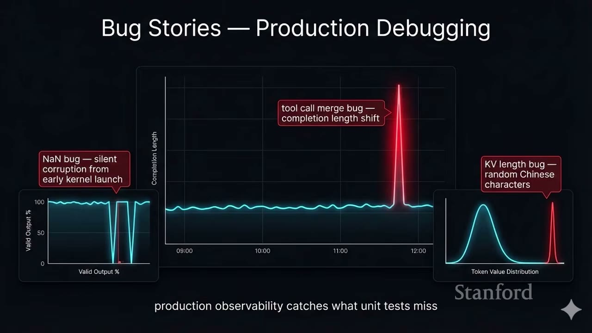

在更先进的推理栈里，开始出现一些有趣的事情。运行大型生产系统的一个重要部分，是你要有尽可能大的 KV Cache。最好能缓存来自很多不同用户、或同一用户很多不同会话的请求，并运行尽可能多的会话。你一开始把 KV Cache 存在 GPU 上，然后很快 GPU 内存就不够了。接下来你可以开始存到 CPU DRAM。如果你关注 Jensen 的主题演讲，他最近开始非常关注 CPU 性能。原因之一是上一代 CPU 实际上很慢，结果瓶颈了很多重要工作负载。于是你开始注意：如果你 50 万美元的机器被上面插的 1000 美元 CPU 卡住，那可不是什么好位置。这会发生的原因之一，就是你可能把 KV Cache 存在 CPU 内存里，于是你非常关心把 KV Cache 读回来的速度。再下一步，你可能把更多 KV Cache 放到磁盘上，然后你开始关心 SSD 和 SSD 空间。

*[27:08](https://www.youtube.com/watch?v=9EEm4iMAF5s&t=1628)*

你可能也听到过这些风声：OpenAI 买下全世界的 SSD、全世界的 DRAM。部分原因就是这种事——你想在 KV Cache 里存尽可能多的东西。然后当你实际构建引擎时，有一个复杂的舞蹈：这些 token 我有一阵子没见了，也许我把它驱逐掉，送到 CPU，或送到磁盘，或送到某个全局存储。当我收到一个新请求，我得去看，得等它们回来，取回来，加载进我的东西，然后我们高兴了。

*[27:39](https://www.youtube.com/watch?v=9EEm4iMAF5s&t=1659)*

有人问：这种 CPU offloading 是不是特定类型的工作负载？对于快的东西，你不想这么做，因为访问 SSD 的时间非常长。这里其实回到一些非常经典的操作系统调度问题。你可以把这张图——除了右边那些 GPU 部分——做得和你在 70 年代或 80 年代操作系统教材里看到的图一模一样。因为我们以前也有这个问题：如果你在电脑上打开太多应用，CPU 内存会不够，然后你不得不把那些应用放到磁盘上。这是完全一样的工作负载。其实左边这里，Nano Banana 幻觉出了 evictions for least recently used，而 LRU 实际上是一个相当不错的启发式。某处应该有一篇 OS 论文说 LRU 在最优解的两倍以内。当然，最好的做法是，如果你能预测未来，你就会知道：哦，我马上会收到某种请求，让我预取那块内存。预测未来可能真的有可能。比如你打开聊天应用，翻出一个一个月前的旧对话，这是一个很强的信号，说明你接下来要问关于它的问题。你也许就想把它加载到 GPU 上。但在完美世界里，你预测未来；如果不能预测未来，你就用各种启发式。真正的问题是，你想往 GPU footprint 上放多少流量。我从没和任何人聊过，说他想往 GPU 上放更少的流量。所以，受制于我们开头列出的那些 SLA，你想服务尽可能多的流量。

*[29:54](https://www.youtube.com/watch?v=9EEm4iMAF5s&t=1794)*

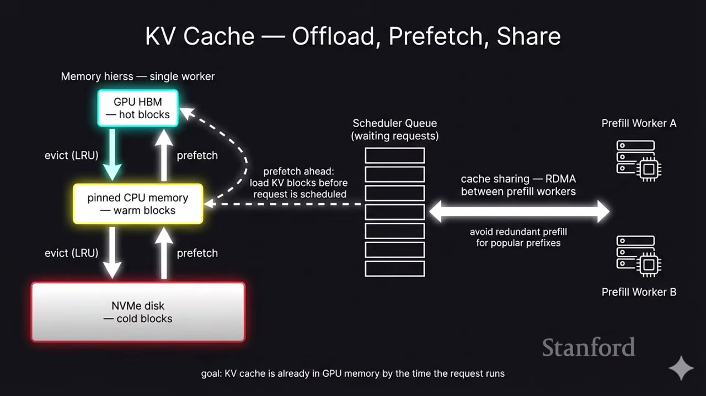

最近开始出现一些有趣的事。在上一代 Blackwell GPU 里，NVIDIA 开始推出叫 NVL72 Grace Blackwell 的新 GPU。那是 72 张 GPU，用非常快的互联连在一起。于是你开始想：我怎么把万亿参数模型切到全部 72 张 GPU 上？这有意义吗？它给我买来了什么？会发生什么？我怎么开始考虑容错？这些东西可能因为各种原因频繁失败。一个原因是连接器很脆弱，它们是塑料做的，不是金属做的。如果你插得太用力，线缆会把东西弄弯一点，然后你就得到非常不稳定的 NV link，这本身就是一整套问题。但还有一个问题：假设我把模型切到 64 张 GPU 上，我在用生产流量服务数百万用户、数万亿 token，当一张 GPU 挂掉时我怎么办？有没有办法让它容错？这里面有很多有趣的事可以想。当然，你也开始看到这些模型有上百万上下文甚至更多。你实际怎么处理？你把上下文切到很多不同 GPU 上吗？你怎么做这些事情？

*[31:24](https://www.youtube.com/watch?v=9EEm4iMAF5s&t=1884)*

## 一个系统级优化：cache-aware prefill-decode disaggregation

我想非常简短地强调一组优化，是当你从系统层面看整个过程时可以做的。这是几个月前我们做的一项工作，叫 Cache-aware Prefill-decode Disaggregation。它是一个非常简单的优化，在路由层两行代码，但能带来很大差别。基本想法是：你有所有这些进来的请求，大多数会是对话里一轮一轮的请求，某人已经开始了对话。假设你平均对话持续 10 轮，然后用户离开，那意味着 10% 的请求会是全新的、非常新的请求。当一个新请求进来，它会有数千 token，看起来非常不同，计算起来贵得多。你不一定想把那个 prefill 放到一个正在进行中的短对话上。比如有人粘贴一本书进来说：嘿，跟我聊聊这本书。你不想让它和另一个人中途的对话同时跑，那个人在问：chat，解释一下为什么 1+1=2。chat 说：1+1=2 因为数字什么的。你说：哦，我不懂。你不想那个非常短的问答和非常长的请求在同一时间、同一批 GPU 上发生。

*[33:00](https://www.youtube.com/watch?v=9EEm4iMAF5s&t=1980)*

所以你可以做一个非常简单的 router，说：好，如果我们收到一个新请求，cache hit rate 非常低，把它发到一组 GPU，让它们一起处理；然后把所有其他 warm 请求发到另一组 prefill 节点。结果发现，如果你这么做，用这个非常简单的优化，最多能快 40% 地服务。

*[33:24](https://www.youtube.com/watch?v=9EEm4iMAF5s&t=2004)*

所以我会这样描述我们在这些技术和研究上的位置：我们非常早期。这是那种 10 年、20 年后人们回头看会说：哦，为什么这些人在讨论这个？这不已经很明显了吗？但真正的原因是，我们刚开始在生产中以新的方式看到这些东西，以新的方式看到这些新的流量。

*[33:56](https://www.youtube.com/watch?v=9EEm4iMAF5s&t=2036)*

## Megakernel：把 decode 压进一个 kernel

好，以上是推理和 kernel 的一生的概览。现在我要讲两个有趣的研究项目，它们非常受我们在服务中看到的东西启发。第一个讲语言模型 decode，以及怎么用所谓 megakernel 让它快很多。这是 Stanford 和 Together 的合作。

*[34:32](https://www.youtube.com/watch?v=9EEm4iMAF5s&t=2072)*

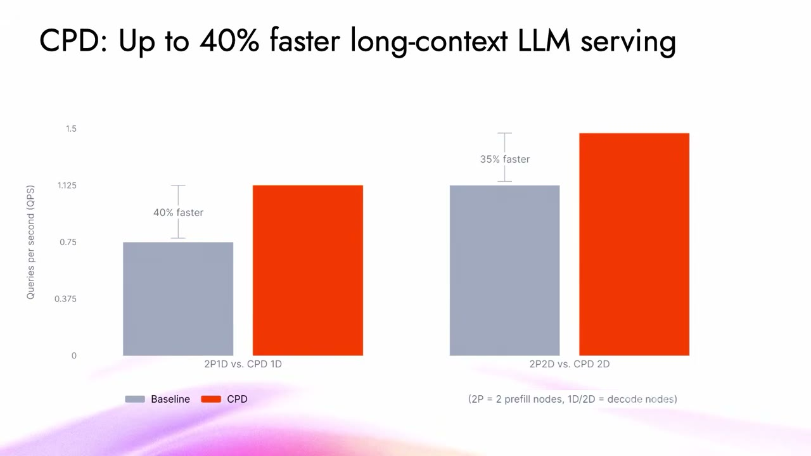

运行 decode 时的根本挑战是：decode 的过程是你已经处理完 prompt，现在一次生成一个 token。根本挑战是你必须跑整个模型来生成一个 token。这意味着，你不再像 prefill 或训练时那样使用 GPU 的大规模并行，你把这个大规模并行系统变成了一个基本上是美化过的内存加载器。让这件事更困难的是，我们通常写 kernel、跑模型的方式是一次一个操作。你们大概能理解为什么这样：kernel 很难写。我相信你们写 Flash Attention 时都玩得很开心。但这也意味着，通常我们会看语言模型里所有不同操作，然后一次为那个操作写一个 kernel。这样编程容易多了，因为你只要写 norm kernel、matmul kernel、attention kernel。但最终你会在系统里引入很多空闲时间。

*[35:36](https://www.youtube.com/watch?v=9EEm4iMAF5s&t=2136)*

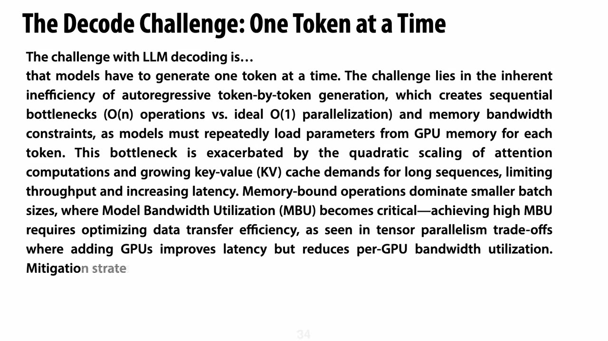

这是你运行推理时可能的样子。这显然是卡通图，但例子来自某个 attention 推理 kernel。读法：x 轴是时间，从左到右流动；y 轴是 GPU 上所有不同的 streaming multiprocessor。H100 上有 132 个，B200 上有 148 个，等等。这些条表示有用的工作。当这里有根条时，GPU 上的某个处理器真的在工作；空白就是在等待。你在等其他操作结束，好让别的东西能跑。基本上你会陷入这种情况：无论你试图把 kernel 写得多好，GPU 里总会有空闲。你会看到 kernel launch 和 kernel teardown，就是红色和黄色里那些大空隙。你还会看到所谓 tail effects。就像你有一个短 prompt 和一个非常长的 prompt 一起处理，同样的事情会一直降到最基本的 attention 操作。如果你处理一个 batch 输入，一个输入很短，一个输入很长，你得等很长的输入完成。然后因为你跨多个 kernel 运行，这些 kernel 之间的空隙会开始累加。

*[36:53](https://www.youtube.com/watch?v=9EEm4iMAF5s&t=2213)*

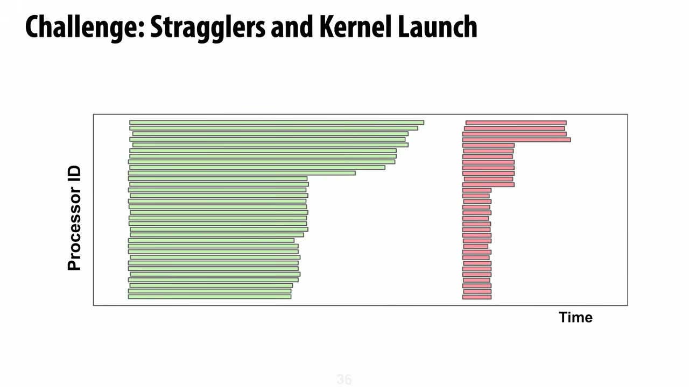

我们为此做的东西叫 Megakernel。基本意思是：不要把模型里每个操作当成自己的操作、为它写一个 kernel，而是写一个 kernel 一次覆盖多个操作。这类似于你在 Flash Attention 里看到的融合，只是更激进，跨更多东西。特别是，它把 GPU 从单设备、单操作，变成让你把 GPU 想成一个大规模分布式系统，然后说：好，我有所有这些要做的工作，有些依赖其他东西——那块红色的东西依赖一些绿色的条——我怎么调度它？我怎么分发工作来最大化 GPU 利用率？如果你只对 attention 推理 kernel 这么做，就能得到 30% 到 70% 的加速。好处是你可以把这件事做到整个模型上。

*[38:31](https://www.youtube.com/watch?v=9EEm4iMAF5s&t=2311)*

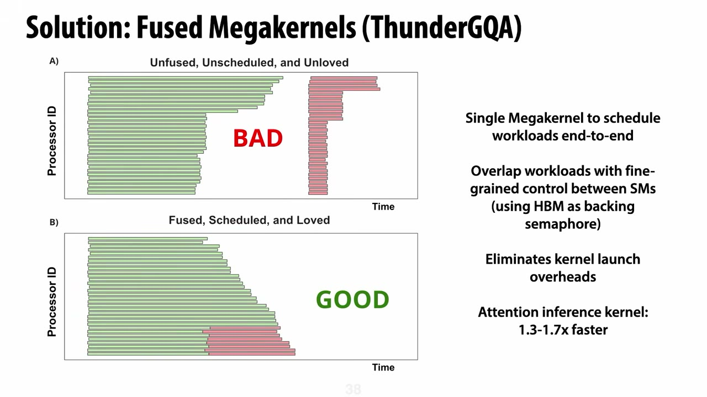

这是 Llama-1B 模型的一层。这里我们基本上把整个层放到一个 kernel 里。如果你看这些不同的条，你会看到它们以非常奇怪的方式重叠。那是因为我们现在开始把下一层的权重加载与 attention 重叠，或者在 attention 操作结束前就开始跑一部分 reduction。

*[39:03](https://www.youtube.com/watch?v=9EEm4iMAF5s&t=2343)*

这里有一个有趣的例子。现代 LLM 里，你有 attention 层，有 QKV 投影，然后加上一些 rope scaling，那就是这些蓝线。蓝线是 QKV 加 rope。橙色线是 attention 的开始。一个洞察是，你可以在 QKV 还没完成时，就开始把 KV Cache 加载进 attention，尤其是在 decode 时。所以这些带圆圈的橙色条，是在 QKV 加 rope 还在跑的时候就开始 KV Cache load。然后一旦 QKV 完成，你有了新的 query token，就可以跑 attention 的其余部分。所以当你对 GPU 有这种细粒度控制时，你可以在一个操作结束前就开始另一些操作。再举一个。橙色是 attention 计算的第一部分。红色是 attention 之后的 O projection。你可以在 attention 操作结束前就开始加载 O projection 的权重。

*[40:15](https://www.youtube.com/watch?v=9EEm4iMAF5s&t=2415)*

我们把这个东西放在一个相对复杂的 CUDA 框架里，基本上是基于指令的抽象，每个子 kernel 可以实现在自己的文件里，然后有一个大的虚拟化共享内存系统来编排这些操作的运行。为了做到这个，我们做了一个叫 ThunderKittens 的库，这是一个 kernel 编写库。你可以把它想成几乎像 Triton，但更底层，对很多事情有更细粒度的控制。回报是你得到接近光速的解码推理。

*[41:00](https://www.youtube.com/watch?v=9EEm4iMAF5s&t=2460)*

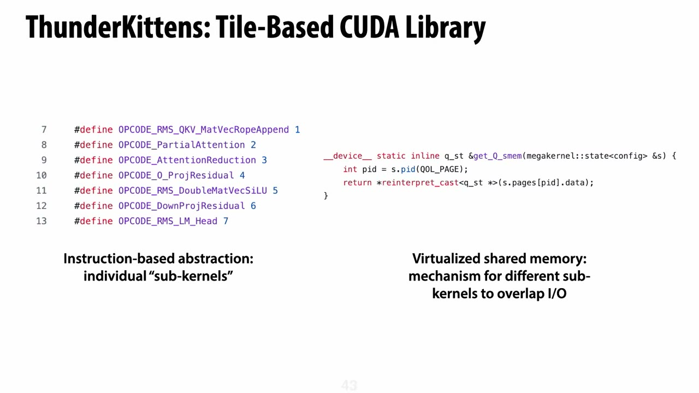

这些数字现在实际上更好了。Megakernel 是青色条，你可以看到它比一些其他最先进的引擎快很多。在 H100 上，它达到 72% 的带宽利用率，接近 GPU 上的光速。也就是说，如果你忽略我们在这里做的一切复杂性，只问 GPU 物理上最快能多快做这个操作，我们相当接近那个光速的 72%。

*[41:32](https://www.youtube.com/watch?v=9EEm4iMAF5s&t=2492)*

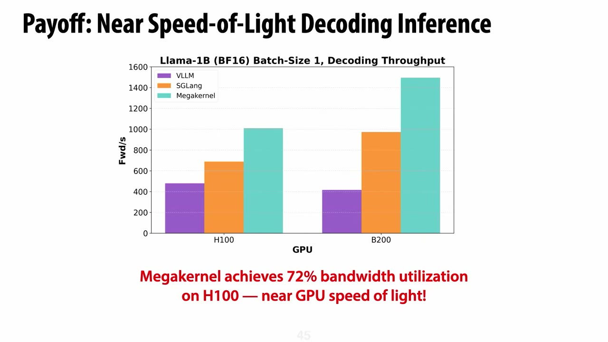

那一节的一个 takeaway 是：如果你对 kernel 有非常深的控制、对硬件有很深的理解，你就能开始实现非常不同的计算范式。所有这些，只有当你深度玩推理时才能看到。

*[41:51](https://www.youtube.com/watch?v=9EEm4iMAF5s&t=2511)*

## Parcae：循环 Transformer 与稳定化

现在我要讲一个稍微新一点的东西，进入新架构的领域。我要讲这个叫 Parcae 的新模型。这是来自我 UCSD 实验室的工作，由 Hayden 领导，也和 Zachary、Taylor 两位合作。回到开头，我说所有这些新能力之所以出现，是因为你开始扩展模型、参数和数据。用 Parcae，我们想问另一个问题：这是唯一必须的扩展方式吗？还是可能有别的东西、别的路能得到这种质量？Parcae 基本上是我们对 loop transformers 这项技术的做法：你拿 transformer 的一些块，让它们循环运行。

*[42:32](https://www.youtube.com/watch?v=9EEm4iMAF5s&t=2552)*

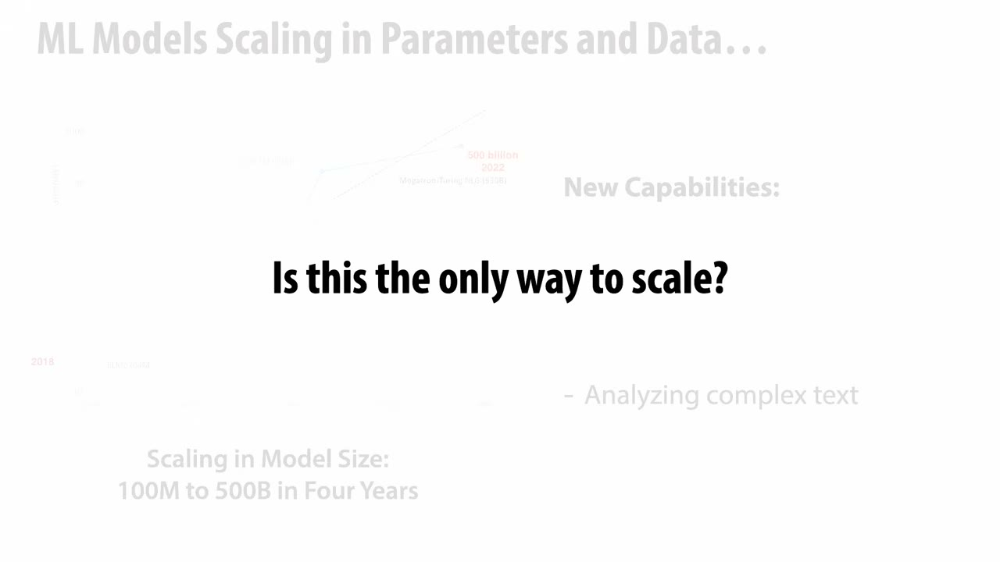

不是让 token 一次一层地穿过模型，而是在某个时候你说：嘿，你经过的时候，再送回那个循环里跑一次。这里有几个部分。一个是我们用了一些状态空间模型（State Space Model，SSM）理论来稳定这个操作。如果朴素地跑、让它训练，我们之前看到它会爆炸。另一件事是我们开始看到一些有趣的缩放规律，表明当你增加数据时，你应该扩展这些循环模型的 recurrence。为了最好地利用你的参数，你实际上想要在一定程度上重用它们。

*[43:19](https://www.youtube.com/watch?v=9EEm4iMAF5s&t=2599)*

首先我讲一点动机，为什么我们觉得循环这个问题很有趣。基本想法是：假设你有某个激活穿过模型的一部分，在某个点它碰到这些 loop blocks，它就会把同一个激活、同一层跑若干次。那个紫色块就是 recurrent block。最后你得到返回的东西。这样做有一些优势。你可以保持参数量不变，但它给了你一个调节旋钮来增加你的浮点运算量。所以如果你认为更多 flops 等于更高质量，那这是一种不付更高参数成本就能提升质量的方法。

*[44:12](https://www.youtube.com/watch?v=9EEm4iMAF5s&t=2652)*

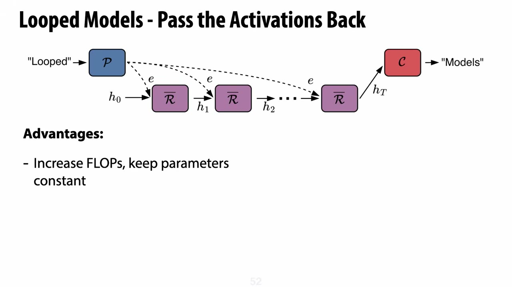

另一件事是，有一项早期工作——早期是个相对说法，几年前——表明你实际上能获得更高的表达力。有些东西你无法在相同参数量下表达，而在这些循环模型中你可以表达。我们驱动性的问题之一是：每个参数的最佳质量是什么？每个参数的最佳智能是什么？或者说每参数、每数据量的智能？这些东西能让你做到什么？有一些有希望的初步结果。这是马里兰大学 Tom Goldstein 组的一篇论文，表明这个东西可能比 transformer 更好。这些是在 ARC 任务上的一些结果。而且还有一堆 Twitter 上的炒作，因为在我们发布 Parcae 大约一周前，OpenAI 的某个人说 Claude mythos 是一个循环语言模型。我认为这不对，我觉得他只是在编造。但结果是，它真的在 Twitter 上炸开了。最终他不得不写一篇博客文章，说：我的错，我只是编造的，这些都不是真的。但它足够有趣，值得一看。我们在这次 Twitter 炒作之前就在研究它，但我觉得这里有一些有趣的东西，值得一看。

*[45:38](https://www.youtube.com/watch?v=9EEm4iMAF5s&t=2738)*

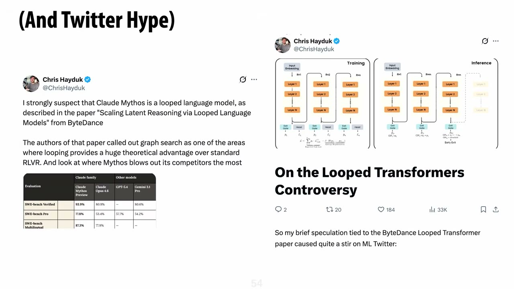

现在，这些循环模型的一个问题是：如果你看其中任何一个，并且试着训练它们，然后你改了训练算法的任何东西——比如把学习率改一点点——你就会突然看到这些模型爆炸。如果你做一件简单的事，比如学习率 sweep，你会看到 10 次里有 9 次，这个模型就是不会收敛，它会爆炸。你会得到 NaN，得到大的 loss spikes。于是我们说：嘿，这看起来有什么地方不对。如果你在训练模型、实际 scaling，然后看到这些大的 loss spikes，那说明你的训练过程出了很严重的问题，你应该更深入看一看，试着搞清楚发生了什么。以前的工作有一些 hack，比如每层都放 norm 来搞清楚发生了什么，或者干脆只选 2e-4 的学习率，别选其他任何学习率。但我们在想：这些 loss spikes 的存在说明背后可能有更深的东西。

*[46:39](https://www.youtube.com/watch?v=9EEm4iMAF5s&t=2799)*

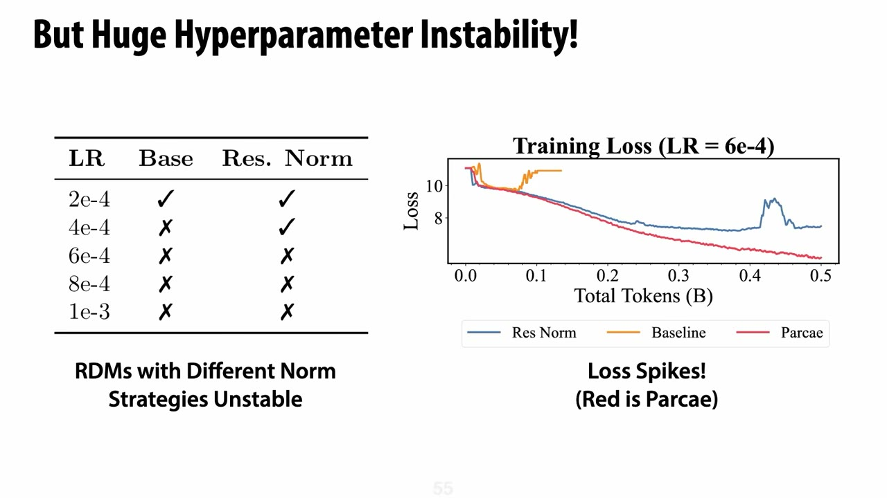

于是我们在稳定化问题上采用了一种有点数学、状态空间模型式的做法。我们的基本洞察是：你可以看这个过程。实际上，如果你看这个过程，试着解析地分析它，会非常复杂，因为这个大的 R 块有大量参数，有各种非线性，有 Softmax、GELU、RoPE 等等。所以解析分析相当复杂。我们的洞察是：我们就看看这个东西的 residual。这个激活从块到块是怎么变化的？我们第一个经验观察是：它其实变化不大。每个 residual 块只把向量改变一点，但并没有巨大的影响。

*[47:37](https://www.youtube.com/watch?v=9EEm4iMAF5s&t=2857)*

于是也许我们可以真的建模它，更深入地看发生了什么。我们所做的是，写下一个关于这个 residual 的动态系统。当我们写下来，我们意识到这里有几个部分，从你写模型的方式看可能相当 benign，但实际上最终影响很大。我们所做的是：好，这里有所有非线性东西，有 attention，有 GELU，有大的带中间层的前馈网络，我们把这些全放进一个盒子里，就叫它 R。这个 R 是一个大的非线性东西，但我们把它放到一边。剩下的是这些 A 和 B 矩阵。B 矩阵是对初始向量的一些变换，也就是循环开始前第一个向量是什么。A 矩阵是你在每个循环里怎么变换这个 residual。我们所做的是：这个简单的东西，如果你把 transformer 的所有复杂性放到一边，你就有了一个相对简单的方式来看之前所有 loop transformers。在之前的例子里，人们确实做了一些相当正常的决定。一个例子里，你直接把它当成 identity，只是加东西。另一个例子里，它是一个完全可学习的矩阵。

*[48:50](https://www.youtube.com/watch?v=9EEm4iMAF5s&t=2930)*

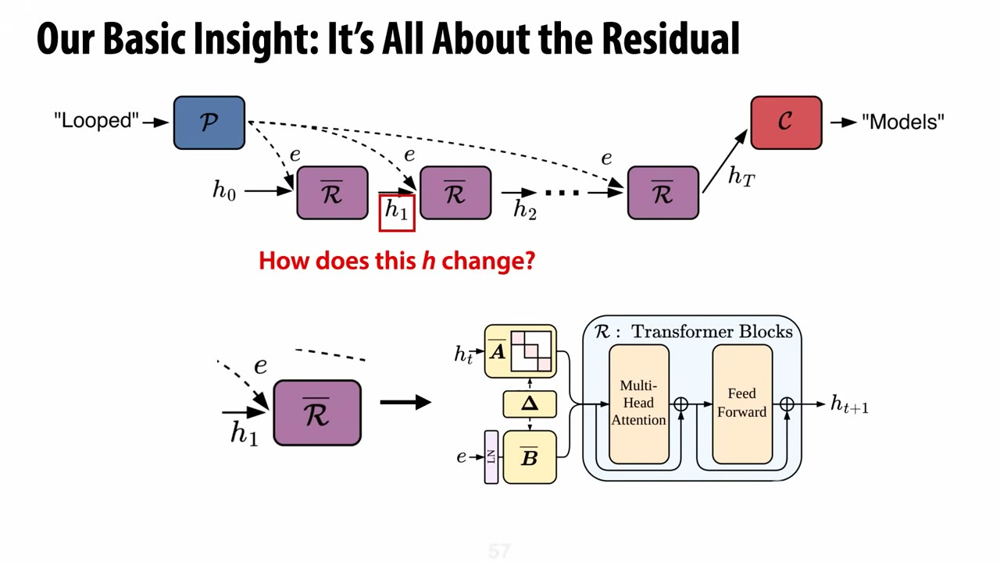

然后我们说：好，如果我们看这个 residual，我们经验观察到 A 和 B 矩阵实际上主导了这个方程的幅度。如果你把那个复杂的非线性部分丢掉，会得到什么？你实际上得到一个相当简单的系统，用高中微积分就能解出来答案。这是闭式解。给定初始激活是什么、初始注入是什么，你实际上可以算出第 T+1 步的激活长什么样。你会注意到几件事。这个东西由这些 A 矩阵主导，尤其是你把 A 矩阵幂到很大的次数。从这里我们意识到，有一个量叫 A 的谱半径（spectral radius）。谱半径基本上是范数的另一个说法。你可以这样看：你拿这个矩阵，把它幂到很大的次数。如果这个矩阵能学成某个东西——假设矩阵是 2，T 是 16，你就把这个激活放大到 2 的 16 次方，非常大。这就开始解释那些大的 loss spikes。特别是我们发现，以前论文里人们对 A 和 B 矩阵的选择，要么是边际稳定，要么是不稳定、让系统不稳定。

*[51:05](https://www.youtube.com/watch?v=9EEm4iMAF5s&t=3065)*

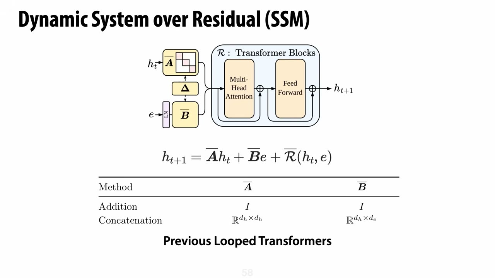

所以在 Parcae 里我们说：好，我们已经想清楚了，如果你这样看它，让 A 和 B 随便学，你会得到真正爆炸的东西。如果我们约束 A 和 B，使得从数学上它们不会爆炸呢？对 A，我们所做的是：我们实际上把 A 矩阵做成一个负对角矩阵。这样如果你把它幂起来，这一项最终会趋向零，所以不会爆炸。这个 B 矩阵，我们给它加一个非常简单的线性 norm，因为 B 矩阵实际上只应用一次，不会真的爆炸。谱半径现在会小于 1，现在它会是一个稳定系统。现在如果你去训练这个模型，我们看到你实际上会看到稳定的 loss 曲线。Parcae 就是这样一个稳定化的东西，我们重新参数化了 A 和 B。你可以看到，即使使用 6e-4 这个对其他模型非常糟糕的学习率，你最后也得到一个稳定的模型。而且你会看到，这样做可以自然地约束激活的状态范数。

*[52:22](https://www.youtube.com/watch?v=9EEm4iMAF5s&t=3142)*

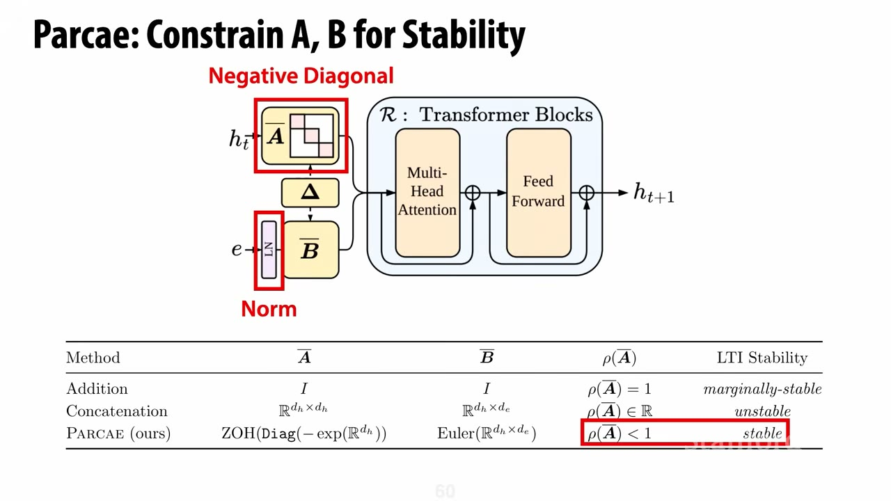

这里有两个部分。橙色基线是一个完全无约束的模型，你可以看到它爆炸到 10 的 19 次方。蓝线是一个对它施加了 norm 的模型。这里发生的是：模型实际上试图扩张激活，因为它说：哦，有更多空间，我就能更好地表示不同的东西。我可以把这些不同概念放得离彼此更远。然后你对它施加 norm，把这个试图扩张的大东西压回 1。于是你有这两种压力互相打架，表现为 loss spikes。所以即使右边你的 norm 很好，你没有看到激活真的爆炸，你确实看到 loss 会做一些相当糟糕的事。所以基本上，激活里一个相当简单的改变就能稳定训练、稳定这些循环。

*[53:22](https://www.youtube.com/watch?v=9EEm4iMAF5s&t=3202)*

它不仅是一个更稳定的系统，你实际上还得到更高质量的模型。这是一张表，我们把 Parcae 模型和之前一个叫 Recurrent Depth Model 的 loop transformer 比较。你可以看到在各种应用上性能更高。Parcae 超过之前的模型，也超过很强的 transformer 基线。这个 transformer 是 nanochat 之一，很多人正试着让它学得尽可能快。而这些 Parcae 模型，如果你拿同样的基础 transformer 架构，开始循环它，然后稳定它，你得到更好的困惑度、更好的端到端质量。

*[54:13](https://www.youtube.com/watch?v=9EEm4iMAF5s&t=3253)*

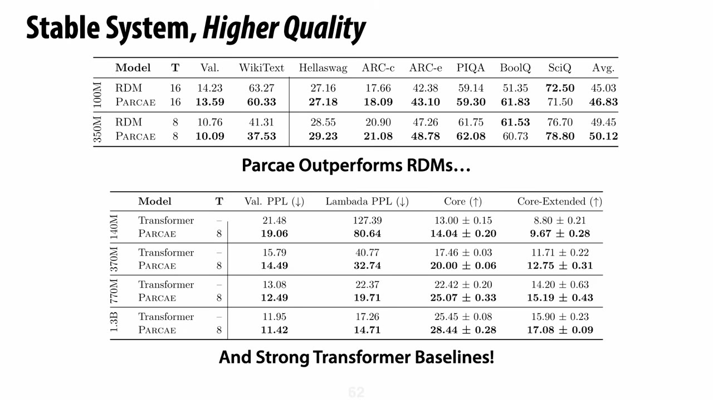

## Parcae 的缩放规律：数据、参数与循环一起扩

然后我们开始跑一些非常基础的缩放规律。这里我们的问题是：好，这个循环很可爱，你可以用它让东西更好。但你真的应该吗？有没有证据说明这里有某种东西让我们想更激进地循环？这里我退一步。几年前，当我们开始进入想扩展所有这些模型的阶段时，一个自然的问题是：我应该把模型做大，还是应该用更多数据训练？所以几年前，人们开始问：这两个量应该怎么一起扩展？我应该扩展模型参数还是扩展数据？我们做出了一堆非常复杂的幂律曲线，全都长这样。它们很漂亮，有很多颜色。你要看的是：如果曲线向右下倾斜，说明你应该同时扩展数据和参数。如果它直着往下，那意味着只要增加训练数据，不需要增加参数。如果它是平的、直接往右，那意味着根本不要增加数据，只增加参数。但你看到它向右下倾斜，意味着你应该同时扩展数据和参数。现在你看到这个：你训练一个 1 万亿参数模型，用 35 万亿 token，质量更好。所以我们的问题是：循环放在哪里？

*[55:44](https://www.youtube.com/watch?v=9EEm4iMAF5s&t=3344)*

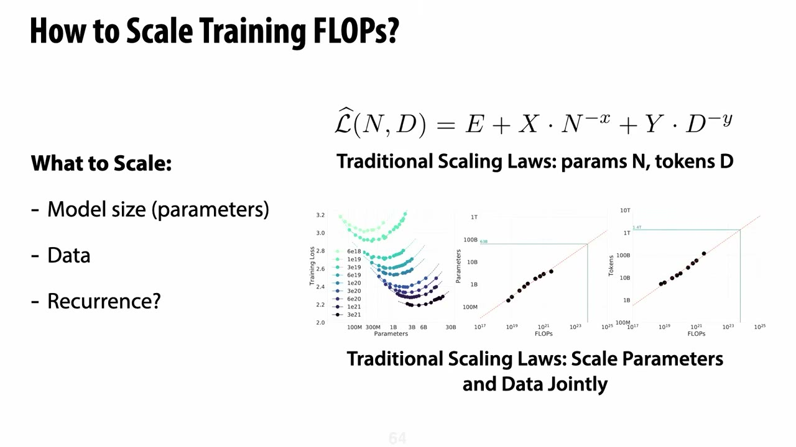

有几种可能性。比如你可能得出结论：你永远不该跑循环，最好保持同一个单一循环模型。你也可能得出结论：你应该做大量循环，或者也许只做少量循环。我们这里展示的是，至少在这些初始缩放规律里，所有曲线都是等距的、等参数、等 FLOP 的（isometric, ISO-param, ISO-FLOP）。每条曲线是一个模型。左边和右边参数数量相同。当你往下走、改变颜色时，我们通过增加数据来增加训练模型使用的 flops。这里我们变化数据，也变化循环次数。我们发现，在两个模型里，你又看到向右下倾斜的趋势。这暗示，对于这些固定参数训练，当你增加数据量时，你实际上也应该增加循环次数。

*[57:00](https://www.youtube.com/watch?v=9EEm4iMAF5s&t=3420)*

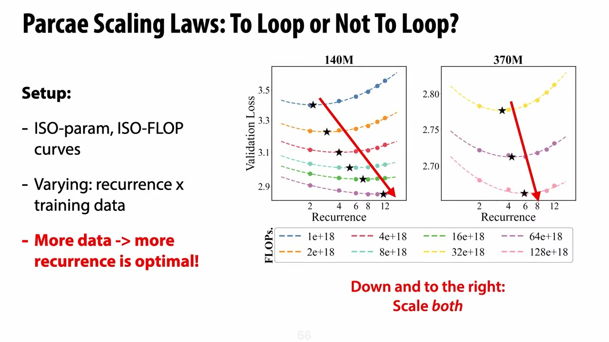

我们发现这些循环遵循一些相当经典的幂律。你实际上可以开始预测质量，当你联合扩展循环次数和 token 数时。有人问固定模型大小下的循环，以及联合扩展怎么样？我们有一个非常复杂的三维图，显示循环、数据、参数，也指向向右下以及同时向那个方向。如果你相信那张图，它暗示你应该三个一起扩展。但那张图真的很难看，因为是三维的、很奇怪。这些幂律表明，当你增加数据时，你应该增加循环。然后还有别的幂律表明，当你增加数据时，你应该增加参数。所以显然，它暗示如果可能，你应该三个都增加。但这里有一点：如果你要固定模型大小，并且要增加数据量，你也应该增加循环次数。这很有趣，因为据我所知，我们今天所有模型都没有循环。它们都在这些曲线的最左边，而且都有大量数据。这暗示我们在训练这些模型时，也许可以做一点稍微更好的事情。

*[57:44](https://www.youtube.com/watch?v=9EEm4iMAF5s&t=3464)*

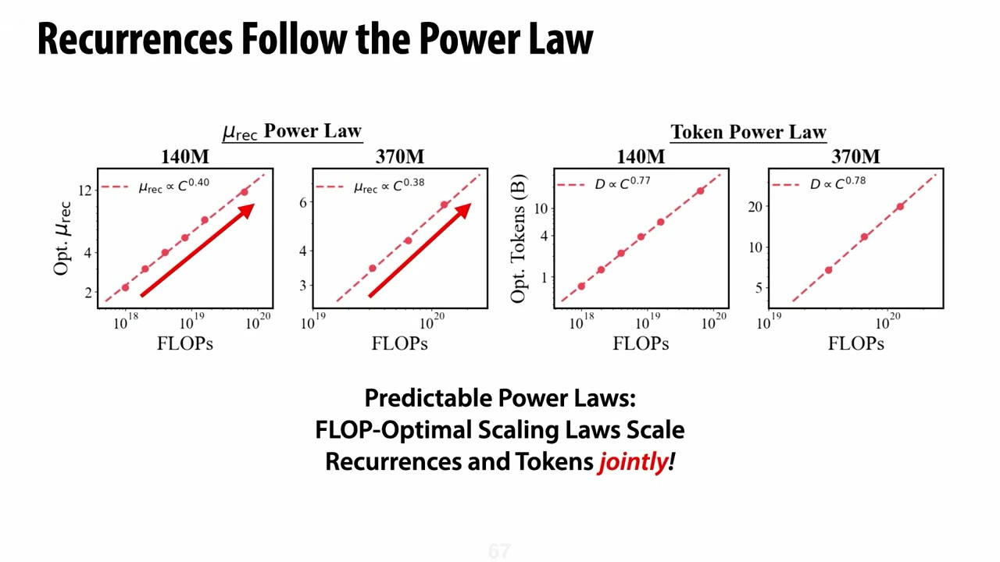

这里还有一个实验，换一种方式看。橙色曲线是固定模型大小——这里我们固定模型大小。橙色曲线是固定深度模型，就像传统 transformer。蓝色曲线是固定 FLOP 预算时，循环模型会落在曲线哪里。这里橙色和蓝色点用同样数量的 FLOPs 训练，但数据量不同，模型大小相同。当你通过增加循环次数而不只是增加数据来到达那个 FLOP 数时，你开始得到更小的验证 loss。这再次暗示，我们也许应该把所有大型预训练都循环起来。

*[59:30](https://www.youtube.com/watch?v=9EEm4iMAF5s&t=3570)*

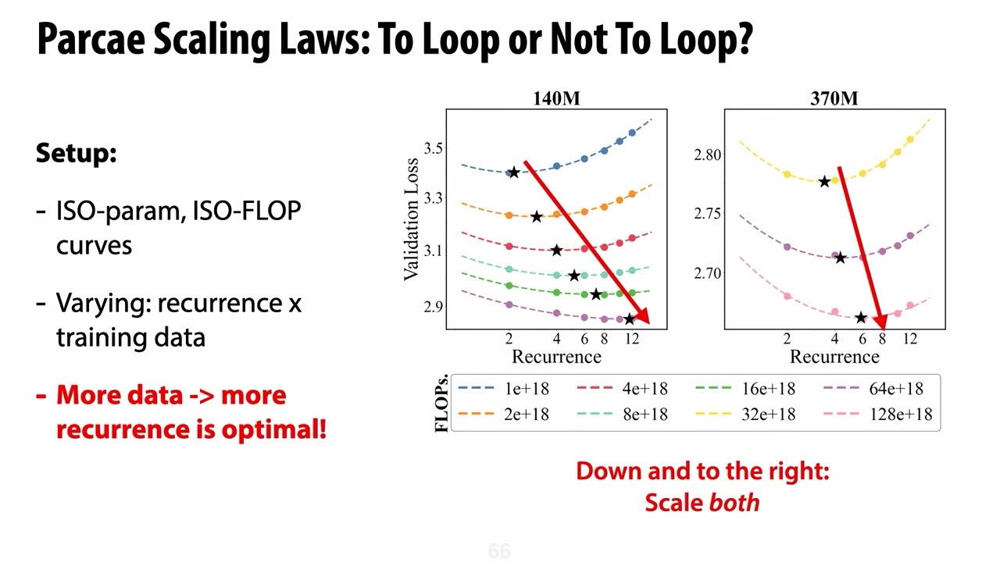

## 总结与问答

这就是 Parcae。如果我退一步，回到整个讲座的大 takeaway：我希望今天给了你们一点感觉——如果你理解这些模型的推理，理解 GPU kernel，理解参与其中的所有部分，你就能真正实现全栈创新和机器学习算法。无论是通过一个新的路由算法让你服务更多流量、以不同方式服务流量；还是新 kernel 让你系统的某部分跑得快很多；还是新架构，说如果你参数少很多，你可以用不同方式把它们放进 GPU 的一个子集，减少通信量。这些都是我们今天看到的研究问题的不同部分。希望我至少启发了在座某一位去更深入地看其中一些东西。谢谢。

*[60:31](https://www.youtube.com/watch?v=9EEm4iMAF5s&t=3631)*

我们有大约 5 到 10 分钟提问。有问题的话请举手。第一个问题：Parcae，你们是从头在循环上训练吗？我猜我想知道，能不能用预训练模型做点什么？

*[61:04](https://www.youtube.com/watch?v=9EEm4iMAF5s&t=3664)*

好问题。所以问题是：用 Parcae，我们是从头训练吗？有没有什么可以用预训练模型做的事情？几个月前有一个人发了一篇很钓鱼的博客文章，大概说：嘿，我没有训练任何东西就赢了一个排行榜比赛。他做的是，他实际上循环了 Qwen 模型中的两三层，然后发现它在一些数学任务上开始有更高的质量。所以我们有一些工作正在研究这个，可能很快就会出来。但可能有些模型，如果你对预训练模型做一点点循环，你就能得到更高质量的东西。这真的很奇怪。这让我感到不安。我不知道为什么会这样。但是的，我们对此非常感兴趣。我想我们会研究它，希望如果我能说服 Hayden，他会盯着激活——盯着实际的权重，去弄清楚为什么当你循环它时，它会变得更好。

*[61:58](https://www.youtube.com/watch?v=9EEm4iMAF5s&t=3718)*

这里就这个问题追问一下：你谈到了循环模型的计算最优性，你能谈谈推理方面的影响以及内存，以及它如何能让你跑得更快吗？是的。所以其中一个让我个人对这些循环东西非常兴奋的原因是，服务推理的一个大瓶颈实际上是 GPU 内存。所以如果你有更少的参数量，你可以装下更多 KV Cache，或者你可以做更少的通信，因为你只需要把模型分布到更少的 GPU 上，诸如此类。所以更小的模型实际上能给你很多灵活性。我还有一个梦想：如果你能把循环块做得足够小，你实际上可以写一个小 megakernel，用一个小小的、非常快的 megakernel 循环来做那个循环。到目前为止，我们还没能把那些块做得足够小。但我觉得这很有趣。当然，随着下一代 LPU、Groq 芯片与 NVIDIA 的东西一起到来，它们有 250 兆字节左右的内存。所以你能放进它们的东西会非常非常小。但也许你可以设计出某种东西，实际上能放进去，然后你就可以把权重一直留在内存里，尽可能快地跑激活。所以如果你能跨过其中一些门槛，就能得到非线性的收益。我希望我们能很快达到。

*[63:25](https://www.youtube.com/watch?v=9EEm4iMAF5s&t=3805)*

好。下一个问题：Megakernel 的 trade-off 是什么？问题是，我的 kernel 的 trade-off 是什么？trade-off 是人们的血汗和眼泪。Megakernel 是非常劳动密集的。给你们一点背景：一个全职的有才华的 kernel 工程师，在一年时间里，可能能为一套硬件、两三个模型、batch size 1 到 16 写出 megakernel。到了 batch size 17，他就说不行，得从头来，再来一次。所以它们非常非常难写。在 Together，我们正试着做一些编译器来自动化其中一些过程。但我会说，这是一件非常有挑战性的事。我觉得 megakernel 的基本想法在过去几十年 GPU 编程里有过高峰和低谷。但如果你能做，它会超级快。你永远不可能更快，但它要花很多能量和很多努力。

*[64:44](https://www.youtube.com/watch?v=9EEm4iMAF5s&t=3884)*

也许我可以问一个问题。我们能多聊聊协同设计（co-design）吗？特别是你提到推理侧这些新硬件，比如 Groq 和 Cerebras。如果你在设计一个模型，而那个硬件就是服务平台，你应该怎么改变你的架构？是的，我觉得有几件事你应该看。一个是，你首先会最受内存约束。如果你知道你要拿一个模型，把它服务在某个特定的 Cerebras 芯片上，你就想去看 Cerebras 的 wafer，弄清楚你有多少内存，然后调整你的模型大小，让它能放进去，并且留够 KV Cache 或其他东西。如果你仔细看中国出来的模型，他们开始做一些有趣的选择，暗示他们可能在考虑华为出来的芯片。你会看到人们做的量化选择。比如，如果你有一个打算服务在 NVIDIA GPU 上的模型——NVIDIA 发布的新 Nemotron 模型就是例子——你会用 NVFP4 训练那个模型。这是 NVIDIA 芯片专有的 FP4 格式。如果你不打算在 NVIDIA 芯片上跑，如果你是 AMD，那你会用另一种叫 MXFP4 的格式。它们各有优劣。你会基于你选择的硬件做这些微妙的选择。

*[66:14](https://www.youtube.com/watch?v=9EEm4iMAF5s&t=3974)*

那边有一个问题。我想知道，如果你只关心计算最优训练，有没有可能循环比增加参数更优，还是说它主要是一个降低推理成本的技巧？问题是，对于 Parcae，你会不会选择循环而不是增加参数？计算最优的诀窍总是：给定某个 FLOP 预算，弄清楚你想达到什么。从这个意义上说，它几乎有点人为，因为如果你想要更高质量的模型，你就应该直接增加 FLOP 预算。如果你已经决定了模型大小，那就训练更久。或者如果你受模型大小限制，那就循环更久。或者如果你数据用完了，那就选一个你认为能尽量过训练——尽量训练充分的模型大小。所以我觉得有选择。当然，你做所有这些选择时都要考虑：我认为它会被采用吗？我打算怎么服务它？如果你要开源，人们今天能在你的笔记本上服务多大的模型？所以所有这些选择都会进入你决定训练多大模型的决策。我觉得如果你只是把模型变大、用更多数据训练，它总是会更好。但我认为这真的取决于那些设计点。

*[67:44](https://www.youtube.com/watch?v=9EEm4iMAF5s&t=4064)*

也许再问一个关于协同设计的问题。你开头提到不同用例，比如 agentic coding 和批量数据处理。那么在不同用例之间，你看到的最戏剧性的最优架构差异是什么？当然，最后模型开发者必须选一个，尽量在很多用例上都合理。这是个好问题。我觉得一个很大的差异是：当你有这些 agentic 循环工作流时，很重要的一点是你要让 KV Cache 尽可能热。如果你在做大批量处理，每个文档你只看一次，然后翻译它，那 KV Cache 就不一定那么重要。如果你看像 DeepSeek MLA attention 这样的东西，它是对 KV Cache 的激进压缩，和另一个模型会有的 KV Cache 相比。或者如果你的模型能用 FP8 或 FP4 处理 KV Cache，那些都是很大的偏离，如果你对 agentic 工作流敏感，你会去看 KV Cache 的大小。然后当然，最大的一个是因果 attention 还是非因果 attention。如果你只是做大批量处理工作流——比如很长时间里 Google 搜索一直用 BERT 模型，我想现在可能还在搜索里用 BERT——那是因为你并不真的需要在另一端生成一堆 token。你只要做一次大的双向 attention，得到你的向量，然后把它放进数据库，随便你怎么用。而聊天工作流，那些处理总是会有 decode 部分。我觉得也有一些中间产物，比如 T5 曾经是人们做双向处理、同时也做一些生成的选择。

*[69:59](https://www.youtube.com/watch?v=9EEm4iMAF5s&t=4199)*

好，也许最后一个问题。哦，是的。问题大概是关于把所有东西放进一个 kernel，以及你之前讲的东西。我想知道，当你在多台计算机之间有通信、要扩展成本时，那会怎么工作？好问题。问题是：当你有多个 GPU 在循环里通信时，Megakernel 怎么工作？我们有一些非常早期的初步工作。结果发现，如果你设置正确，你也可以把 NCCL 调用融合进 Megakernel。我觉得我们还没有找到真正很好的杀手级用例，因为有时候你只是受 NCCL 调用本身的延迟限制。所以这些也是你可以融合的东西。当 DeepSeek 4 出来时，DeepSeek 4 发布了一个针对混合专家推理层的 Megakernel，可以只为那个层运行，他们实际上融合了其中一些通信。所以我觉得我们开始看到越来越多的是：当你到更多这些模型时，你会为计算的一部分做一个小 Megakernel，但你不一定会为整个模型做一个 Megakernel，除非你付出那个血汗和眼泪的代价，然后真的把整个东西跑起来。好，我想时间到了。让我们再次感谢 Dan。非常感谢你们邀请我。

*[71:31](https://www.youtube.com/watch?v=9EEm4iMAF5s&t=4291)*
