# 推理：从算术强度到 KV Cache 缩减

这堂课讲推理为什么越来越重要、如何用 TTFT／延迟／吞吐量衡量它、Transformer 推理的算术强度分析，以及减少 KV cache、量化、剪枝、推测解码和动态批处理等加速方法。

## 推理为什么越来越重要

上节课 Tatsu 讲了 scaling laws，这节课我们暂时离开那个话题，来讲推理。推理的问题本身很简单：你已经训练好一个模型，给定一个 prompt（提示），你想要尽可能准确、尽可能快地产生回复。推理只占一讲，但它正变得越来越重要，出现在很多地方。训练完模型之后，你不会只是把它放在那里；如果你在写论文，可以在论文里放一张图说明模型效果如何，但对其他人来说，模型是要拿来用的。

*[00:45](https://www.youtube.com/watch?v=EfM546A79aM&t=45)*

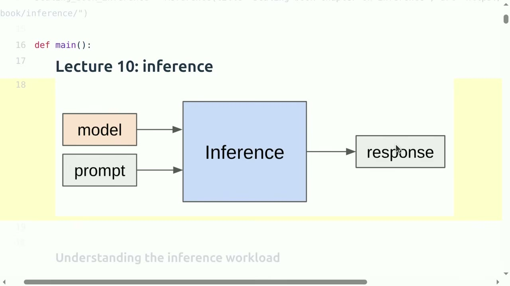

用模型意味着什么？可能是和 AI 助手或聊天机器人对话，可能是做代码补全。现在 agent（智能体）非常流行，而 agent 需要推理。还有批量数据处理，也用它。评估也需要推理，尤其是需要生成的评估。推理还出现在训练内部：如果你做强化学习，你需要有一个模型，生成 rollout，给它们打分，然后相应地更新权重。所以推理到处都是。

*[01:28](https://www.youtube.com/watch?v=EfM546A79aM&t=88)*

效率在这个课上一直是主题，而在推理这里比以往更重要。从实际使用角度看，训练是一次性成本，可以非常昂贵，确实非常昂贵，但训练完之后就结束了。推理是重复发生的成本，你每天都要 incur 这些成本。有估计说 OpenAI 每天产生 8.6 万亿个 token。作为参照，今年早些时候发布的 DeepSeek-V4 是在 32 万亿个 token 上训练的。也就是说，不到四天，OpenAI 必须产生的 token 数量——以及相应的计算量——就至少等于 DeepSeek-V4 的训练量。当然，前沿模型也可能在更多 token 上训练，但推理生成的 token 数量会更高。

*[02:40](https://www.youtube.com/watch?v=EfM546A79aM&t=160)*

而且我认为推理的重要性在过去一年增长了。以前我们把语言模型主要看作聊天机器人或助手：你输入一个 prompt，得到一个回复，人的目标是读这个回复。但现在我们越来越进入 agentic 的世界：一个查询进去，agent 会做一堆事情——它会思考、推理、调用工具、内省，最后才产生一些给人读的输出。所以 agent 产生的 token 大部分其实不是给人读的。你应该把生成的 token 数量真正看作计算支出。这是没有上限的：如果你有一个足够宏大的问题，你就需要更多计算和更多 token。在聊天机器人世界里，推理到某个点之后可能就够快了，因为人阅读速度有限。但对 agent 来说，从推理中榨取更多价值是没有上限的。

*[04:00](https://www.youtube.com/watch?v=EfM546A79aM&t=240)*

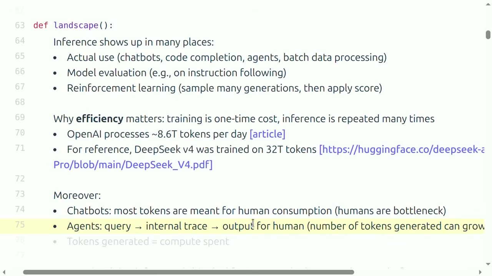

商业侧有很多人在做推理。所有闭源 API 提供方都必须服务他们的模型，所以推理对他们来说是大事。还有一些提供方服务开放权重模型，也提供推理。在开源社区里有很多软件包。vLLM 可能是最流行的，是大家默认会用的。SGLang 是另一个，特别适合 agentic 工作负载，但可能还没有那么流行。还有 NVIDIA 的 TensorRT，它非常快，但适用范围更窄。如果你想在 CPU 上跑推理，llama.cpp 是一个流行的包。

*[04:50](https://www.youtube.com/watch?v=EfM546A79aM&t=290)*

我希望已经论证了推理非常巨大。如果你能让推理快一倍，甚至只快 10%，那都是大事。那么问题来了：快是什么意思？

*[05:02](https://www.youtube.com/watch?v=EfM546A79aM&t=302)*

## 衡量“快”的三个指标

有几个指标可以刻画“快”。它们适用于不同场景，有不同的权衡。一个指标是 time to first token，也就是 TTFT（首 token 时间）。这基本上就是用户在生成开始之前要等多久。你把一个查询输入 ChatGPT，过去一些毫秒，然后第一个 token 出现，从开始到那一刻的时间就是 TTFT。这对交互式应用通常很有用，因为你在等待、什么都不做的那段延迟——它越长，用户体验越差。而一旦 token 开始进来，它们不一定需要那么快，因为如果你要读它，你本来也读不了那么快。

*[06:00](https://www.youtube.com/watch?v=EfM546A79aM&t=360)*

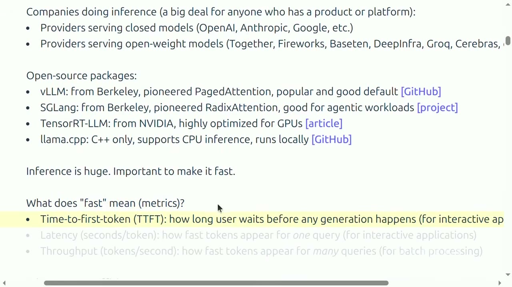

第二个指标是 latency（延迟）。这是从单个用户的角度看：对于一个查询，token 出现得有多快？这对交互式应用也很重要。基本上，这就是 token 流出的速度。

*[06:17](https://www.youtube.com/watch?v=EfM546A79aM&t=377)*

与之相关的第二个概念是 throughput（吞吐量），衡量每秒多少 token。这是从多个查询的角度看，token 出现得有多快。延迟和吞吐量显然非常相关，通常是对齐的。一般来说，很多干预会让延迟和吞吐量同时变好。但正如我们后面会看到的，这里实际上存在权衡。吞吐量在批量处理时很有用：你有一 PB 数据，想用语言模型处理它，你只是想让这个任务完成，不在乎某一个查询是更快、更早还是更晚回来。

*[07:04](https://www.youtube.com/watch?v=EfM546A79aM&t=424)*

## 训练与推理的根本差异

那么，这些指标所衡量的推理效率，是由什么决定的？高层要点如下，这也是这堂课也许最该记住的一点：训练的时候，你一次看到所有 token，因为做监督微调时你看到所有 token，可以沿序列并行。回想 Transformer 里 attention、MLP 的计算，序列只是一个维度，是一个大张量相乘。所以你本质上是一次处理所有 token。推理时你不能这样做。因为推理是自回归的，你必须一个接一个地顺序生成 token。这就是为什么推理是非常不同的工作负载：你不能沿序列维度并行。因此，正如后面会看到的，推理更难获得高算术强度，也更难充分利用计算。

*[08:15](https://www.youtube.com/watch?v=EfM546A79aM&t=495)*

先预告一下这堂课的内容。首先我会做一些数学，理解 Transformer 的算术强度、吞吐量和延迟，怎么去思考它们。然后我会讲各种降低成本的技术：把 KV cache 变小、量化、模型剪枝，最后讲推测解码，以及一些实际考虑。

*[08:55](https://www.youtube.com/watch?v=EfM546A79aM&t=535)*

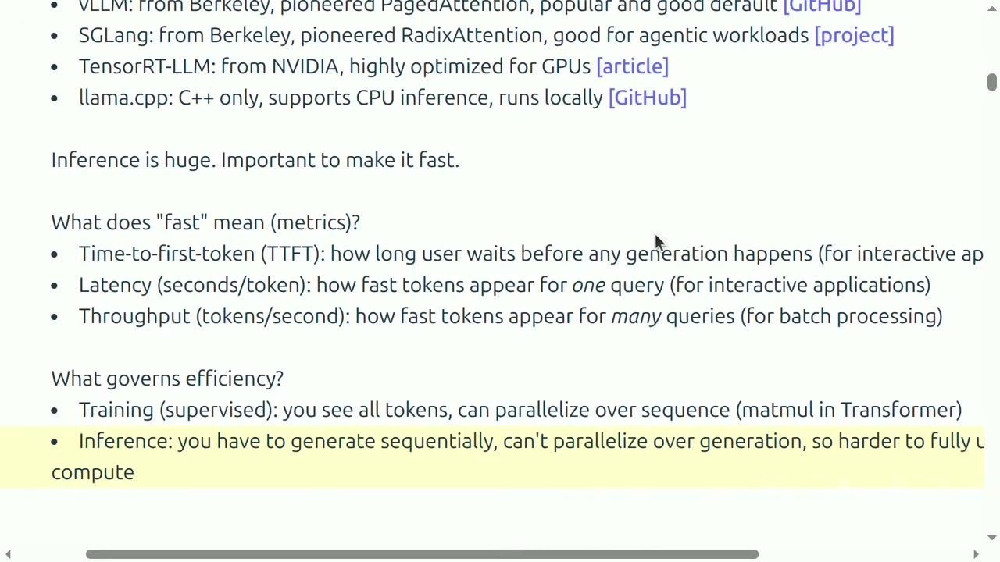

## 符号约定与 Transformer 的张量表示

接下来这部分有点复习性质，主要是统一符号，确保我们在记号上一致。这堂课很多内容基于 Google 的 scaling book 中关于 Transformer 和推理的章节，我推荐大家去看，写得很好。一些图也慷慨地从那本书里借用了。

*[09:13](https://www.youtube.com/watch?v=EfM546A79aM&t=553)*

先建立一点记号，理解这个图。我们用 einops 里那种符号来表示维度，同时也表示长度。B 是 batch 维度，也是序列数量。T 是序列维度，也是 token 数量。D 是模型维度，H 是 head 维度。如果我写一个维度为 B,T 的张量和另一个维度为 D,H 的矩阵相乘，得到 B,T,H。这里有些维度标成红色，表示它们会被收缩（contract）。这些维度同时出现在两个操作数中，并且从结果中消失。还有一些黑色常规维度只出现在一个操作数中，保留在结果里。这是通用形式。另一种情况是蓝色维度，表示它们会广播（attach），同时出现在两个操作数中，但保留在结果里，不被收缩或归约。

*[10:40](https://www.youtube.com/watch?v=EfM546A79aM&t=640)*

解释一下：对每个序列和 token 位置，你有一个向量，想乘以一个矩阵。而这里你基本上是在两个张量之间做一堆点积。

*[10:58](https://www.youtube.com/watch?v=EfM546A79aM&t=658)*

带着这些记号，这个图就是 Transformer block 的完整描述。它看起来有点像电路图，细节很多，但我认为这是对 Transformer 最清晰的定义。你看到很多对 Transformer 的描述，坦白说很多很难理解到底发生了什么。这个图基本上告诉了你张量的精确形状，让你能推理依赖关系。对于 Transformer block，你取 X——某一层的激活——先送进 attention，然后送进 MLP。

*[11:44](https://www.youtube.com/watch?v=EfM546A79aM&t=704)*

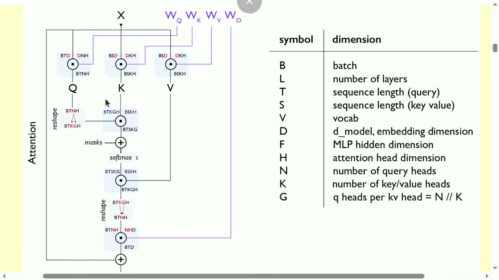

快速复习一下：你用 query 矩阵、key 矩阵和 value 矩阵做投影。你会看到这里有 N，是 head 数量，H 是每个 head 的维度。query 矩阵的形状是 batch 乘序列乘 head 数乘 head 维度。K 和 V 那里，不是 N，而是 K，我们后面会看到，这是可能更少的 key-value head 数。然后是 attention 操作，注意这里有 batching 维度：B 同时出现在两边。我们在 head 维度上做收缩。我们后面会回到为什么这个 B 同时出现在两边会让推理变难，为什么 attention 在那里会成为瓶颈。先记住这一点。

*[12:43](https://www.youtube.com/watch?v=EfM546A79aM&t=763)*

MLP 非常简单直接。你做一些矩阵乘法。这是 gating 矩阵，这是上投影，这是一个下投影。谢谢大家，我已经实现过这些，所以不想再赘述，只是把记号统一一下。按照惯例，我们假设 MLP 把 D 维的模型维度上投影到四倍，所以看到 F 就把它想成 4D。模型维度被分到 N 个 head 上，所以模型维度总是等于 head 数乘 head 维度。然后 head 数在 group query attention 的情况下又被分成组数和每组 head 数。最后有两个变量 S 和 T，都表示序列维度。区别是 S 表示输入 token 数，T 表示输出 token 数。训练时这两个相同，因为我们预测的输入和输出一样。推理时 T 会等于 1，S 是输入长度。

*[14:22](https://www.youtube.com/watch?v=EfM546A79aM&t=862)*

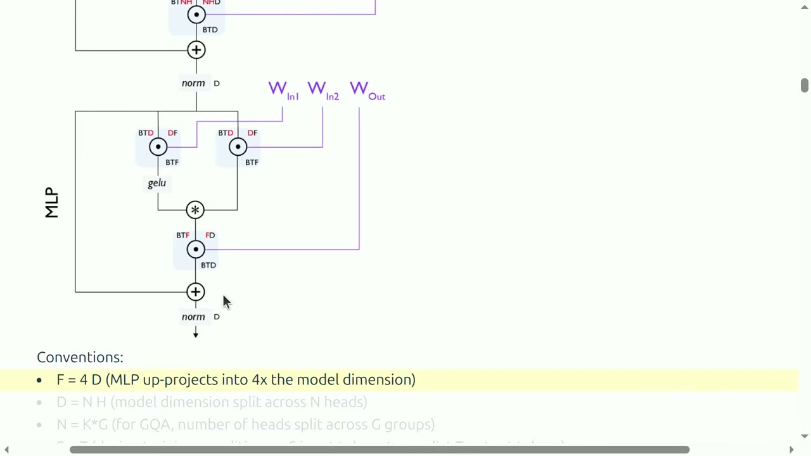

## 算术强度复习：矩阵乘法与 H100 阈值

另一个复习是算术强度（arithmetic intensity）。我在第二讲讲过。先热身：假设我要乘两个矩阵，一个 B×D 矩阵和一个 D×F 矩阵。直觉上，B 是 batch 维度，D 是隐藏维度或模型维度，F 是 MLP 里的投影维度。记住，算术强度是什么？我要数 FLOPs，还要数搬运了多少内存。

*[14:47](https://www.youtube.com/watch?v=EfM546A79aM&t=887)*

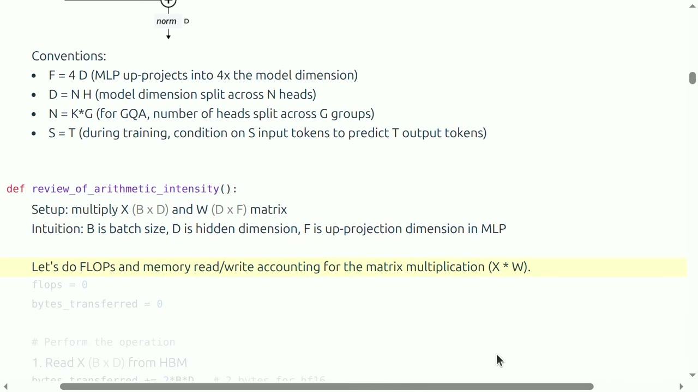

我们可以这样做。要把这两个矩阵相乘，记得系统课的内容：你要从 HBM 读 X。如果一切以 bf16 存储——推理就是这种情况——那就是 2×B×D。你还要读 W，又是 2×D×F。然后做 matmul，FLOPs 是 2×B×D×F。然后写回结果。每次读和写基本上就是条目数，有点像二次项，而 matmul 是三次项。记住，这很重要，因为这就是你获得高算术强度的方式。总 FLOPs 是三次项，传输的字节数是读和写的总和。

*[15:38](https://www.youtube.com/watch?v=EfM546A79aM&t=938)*

算术强度就是每传输一个字节做多少计算，我们希望它高。强度等于 FLOPs 除以传输字节数。我用符号表示这些，而不是具体数字，因为这样更容易看清和操作。一个简化是假设 batch 维度远小于 D 和 F，那么可以简化。具体说，这相当于令 D 等于 C 乘 D，F 等于 C 乘 B，让 C 趋于无穷，这样 D 和 F 都很大，而 B 较小，强度就化简为 B。所以结论是，记得我们之前算 matmul 的算术强度大概是 N/3，这里是类比，只不过不是方阵，而是非方阵。

*[16:51](https://www.youtube.com/watch?v=EfM546A79aM&t=1011)*

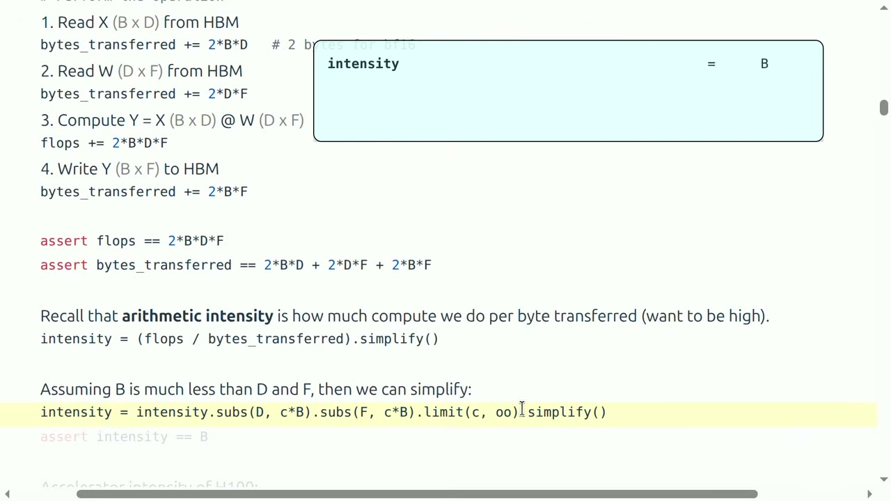

比较一下：硬件的加速器强度，是看 spec sheet 里的每秒 FLOPs，再看内存带宽，即内存在 HBM 之间搬运有多快，相除得到加速器强度。然后你把计算的强度和加速器强度比较。如果计算强度更大，就是 compute bound，这是好的；如果更小，就是 memory bound，这是坏的。在这个例子里，对 H100、对这个 matmul 操作，如果 batch size 大于 295，你就是 compute bound。

*[18:03](https://www.youtube.com/watch?v=EfM546A79aM&t=1083)*

这里有个极端情况。假设你只有一个样本。那么你的算术强度就是 1。这会是 memory bound。你能看到发生了什么：你在读这个 D×F 矩阵，但 B 只有 1。所以你实际上只做了 2×D×F 次 FLOPs。而这基本上就是你在推理中会看到的工作负载。你不会得到完整的矩阵，你得到的是非常薄的矩阵或张量。

*[18:45](https://www.youtube.com/watch?v=EfM546A79aM&t=1125)*

有同学对 Transformer 图里 K 和 g 的含义提出疑问，老师确认：K 应该是组数，g 是每个组里的 head 数，并说之后会改。

*[20:23](https://www.youtube.com/watch?v=EfM546A79aM&t=1223)*

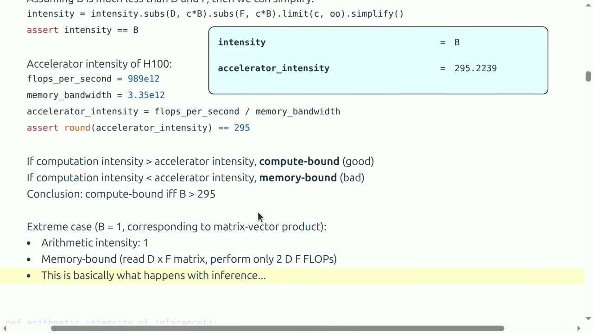

## 推理的算术强度：朴素生成与 KV cache

我们再谈谈推理的算术强度。先看朴素做法。假设有一个 prompt，我把它送进 Transformer。Transformer 生成 keys、values 和激活，最后生成输出词表上的 logits。你采样一个 token，把这个 token 和 prompt 拼接起来，然后再做一遍。你生成一个新 token，把它附到 prompt 上，如此反复。这是最朴素的做法。如果你有一个黑盒，它接收序列并输出 token 分布——这正是 Transformer 做的事——你就可以反复应用它。

*[21:28](https://www.youtube.com/watch?v=EfM546A79aM&t=1288)*

这样做能工作，但非常糟糕。因为每次生成一个 token，你实际上要花大约 T² 的时间，其中 T 是到目前为止已经生成的 token 数。所以生成 T 个 token 实际上是 T³，因为 attention 已经是 T²，而你要对每个 token 做一次。这很糟糕。但观察是：你其实不必这样做。很多工作可以在不同前缀之间共享。比如你在生成 "network" 和生成 "up" 时，实际上为 "never going to give" 计算了很多相同的 key、value。这些 token 不应该改变。

*[22:24](https://www.youtube.com/watch?v=EfM546A79aM&t=1344)*

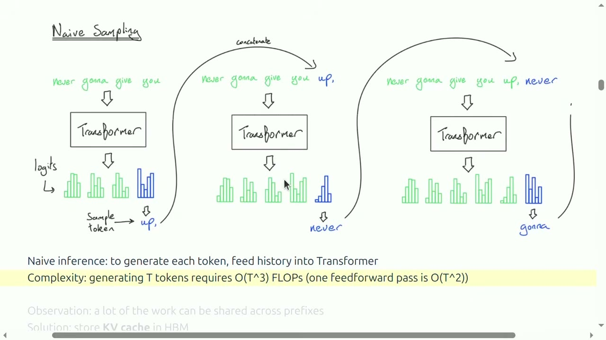

这是因为它是因果 Transformer。如果是双向的，那么附加一个 token 后所有东西都会变。但如果是因果的，这里的激活不会因为你附加了什么 token 而改变。有了这个观察，第一件显而易见的事就是把 KV cache 存在 HBM 里，这样在连续生成 token 之间可以复用 KV cache。这意味着当你生成一个 token 时，你其实不必重新计算之前所有 token 的 keys 和激活。

*[23:10](https://www.youtube.com/watch?v=EfM546A79aM&t=1390)*

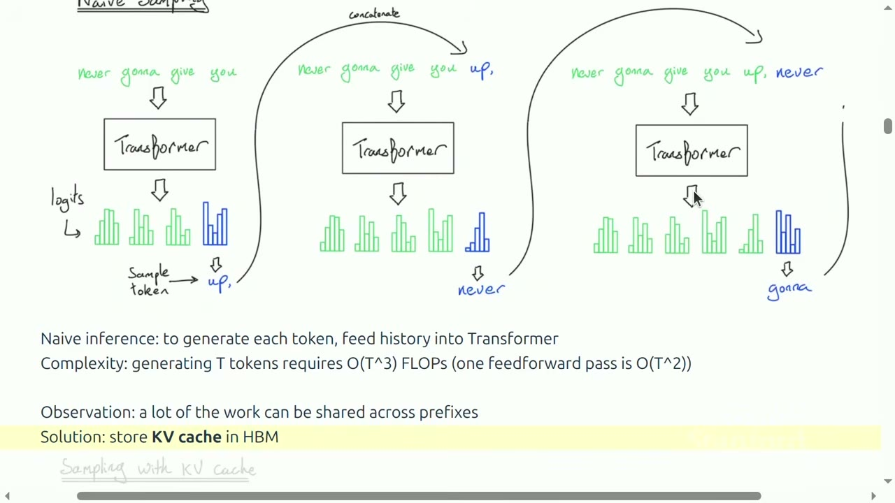

带 KV cache 的流程是这样的。有两个阶段：prefill（预填充）。你拿到 prompt，填充 KV cache——也就是 Transformer 计算出的 key-value 对——然后生成 logits，和之前一样的计算。现在你有了 KV cache，以及一个分布，从中采样一个 token。然后把这个 token 送进 Transformer，它使用这个 cache，产生下一个 token 的分布，同时产生新的 KV，基本上是对应这个新 token 的激活。然后这个被加进 KV cache。于是你有了更新后的 KV cache，从这个 logits 采样，再送进 Transformer，输出下一个 token 的分布以及新 token，加入 KV cache，如此反复。

*[24:19](https://www.youtube.com/watch?v=EfM546A79aM&t=1459)*

KV cache 的公式是：对每个序列——有 B 个；对每个 token——有 S 个；对每一层和每个 head，你存一个 H 维向量。再强调一下，推理有 prefill：给定 prompt，你把 prompt 编码成这些向量。这一步可以像训练一样并行，因为你看到整个 prompt，可以计算 KV cache。然后在 generation 阶段，你顺序生成新的回复 token。但至少你不必为已经看过的 token 再付生成 KV cache 的代价。

*[25:08](https://www.youtube.com/watch?v=EfM546A79aM&t=1508)*

## MLP 与 Attention 的 FLOPs 和内存 I/O

接下来算 MLP 和 attention 层的 FLOPs 和内存 I/O。记住 S 是我们作为条件所依赖的 token 数，T 是我们要生成的 token 数。我们先抽象地算，之后再具体到 prefill（T 等于 S）和 generation（T 等于 1）。对于 MLP 层，整个过程我只看 matmul，因为 matmul 才是真正需要大量工作的地方。其他东西 FLOPs 不多，而且也可能被融合进 matmul。

*[26:06](https://www.youtube.com/watch?v=EfM546A79aM&t=1566)*

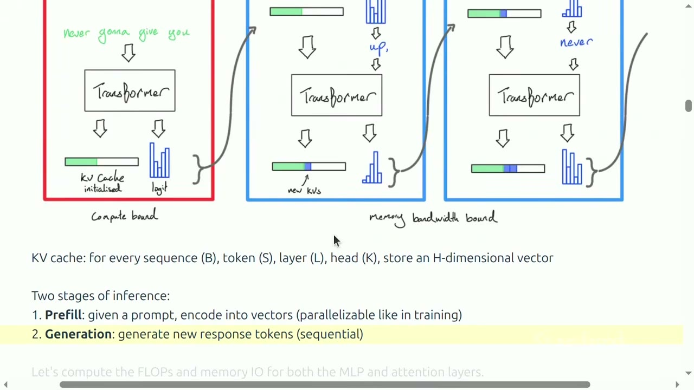

这个计算和矩阵计算一样。我不逐步讲每个细节，形式是：你从高带宽内存读 X，读所有参数，计算上投影，写到 HBM；计算 gate，写到 HBM；然后计算下投影，写到 HBM。FLOPs 取决于 B、T、D、F，即 batch size、序列长度、模型维度和前馈维度（MLP 维度）。传输字节数是这个表达式。然后你可以算算术强度，也就是 FLOPs 除以传输字节数。

*[27:22](https://www.youtube.com/watch?v=EfM546A79aM&t=1642)*

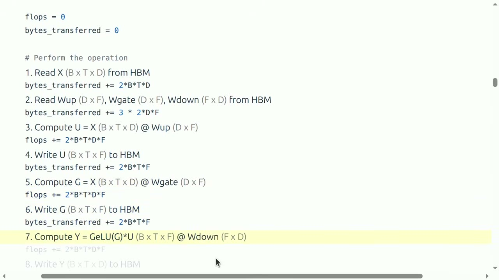

我们假设和之前一样，B×T 远小于 D 和 F。这样强度就是 B×T。这和单纯的 matmul 情况类似：矩阵更多、维度更多，但本质相同。这也合理，因为 MLP 基本上就是一个大 matmul。而且 batch 维度和序列长度维度是独立的，对 MLP 来说它们不交互。所以只要在 prefill 中让 B×T 足够大——大 batch、长序列——就没问题。

*[28:19](https://www.youtube.com/watch?v=EfM546A79aM&t=1699)*

现在看 generation。generation 有两个问题。一是 T 等于 1，你一次只生成一个 token。这意味着你的算术强度是 B，而 generation 中的 B 是并发请求数。如果你在批处理场景下，可以控制它。但如果你在服务聊天机器人，并发请求数基本上就是同时有多少用户，可能高也可能低，不太可预测，还会随时间变化。这是我们后面讲连续批处理要解决的问题。总体来说这不算太糟，因为只要 batch 够大，序列长度并不会帮你，但大 batch 就没问题。

*[29:18](https://www.youtube.com/watch?v=EfM546A79aM&t=1758)*

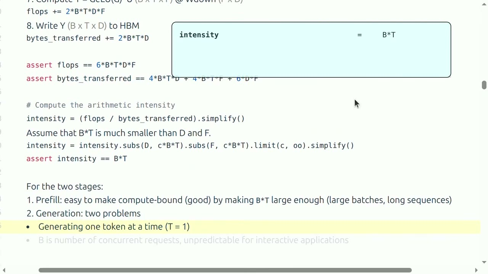

现在看 attention 层。S 是之前已经生成的 token，T 是你要生成 logits 的 token 数。在 attention 中，你从 HBM 读 QKV 矩阵，计算 attention，计算 softmax（这不太重要），计算 value 矩阵，然后把结果写到 HBM。FLOPs 是 B×S×T×D，传输字节数是这个表达式。一切都是 matmul。所以 FLOPs 应该总是比传输字节数高一阶多项式，因为它是 matmul。唯一的问题是那个因子长什么样。对 attention，这个因子是 S×T/(S+T)。

*[30:21](https://www.youtube.com/watch?v=EfM546A79aM&t=1821)*

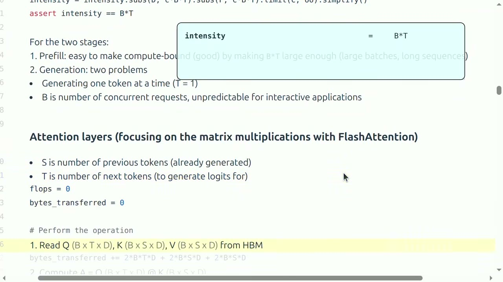

看 prefill。prefill 意味着当 T 等于 S 时，强度是 S/2。这很好，因为只要 attention 的序列长度够长，你就能维持高算术强度。注意这里没有出现 batch 维度，我后面会解释为什么。但对 generation，这是坏消息。generation 的强度是 S/(S+1)，小于 1，或者就把它叫做 1。记住，算术强度为 1 很糟糕。我们希望它达到 H100 的 295 左右才能打满计算。所以这真的是瓶颈。

*[31:24](https://www.youtube.com/watch?v=EfM546A79aM&t=1884)*

我们做了 MLP、attention、prefill、generation 这些分析，发现 attention generation 是一个瓶颈。为什么？和 MLP 不同——MLP 在 generation 时其实还好，只要 batch 够大。问题在于：每个序列都命中相同的 MLP 权重，这些权重不依赖 B。而在 attention 层，每个序列有自己的 KV cache，这些都依赖 B。你可以这样想：在 MLP 情况下，B 大实际上有帮助，因为你只需加载一次 MLP 权重，然后用于所有序列。这就是高算术强度的来源——简化地说，加载一次，做所有批处理，这很好。而在 attention 中，这些都依赖 B，所以增大 B 没有帮助。对每个序列，你基本上都在做一个 matmul，它们都是独立的。做更多 matmul 并没有帮助。

*[33:21](https://www.youtube.com/watch?v=EfM546A79aM&t=2001)*

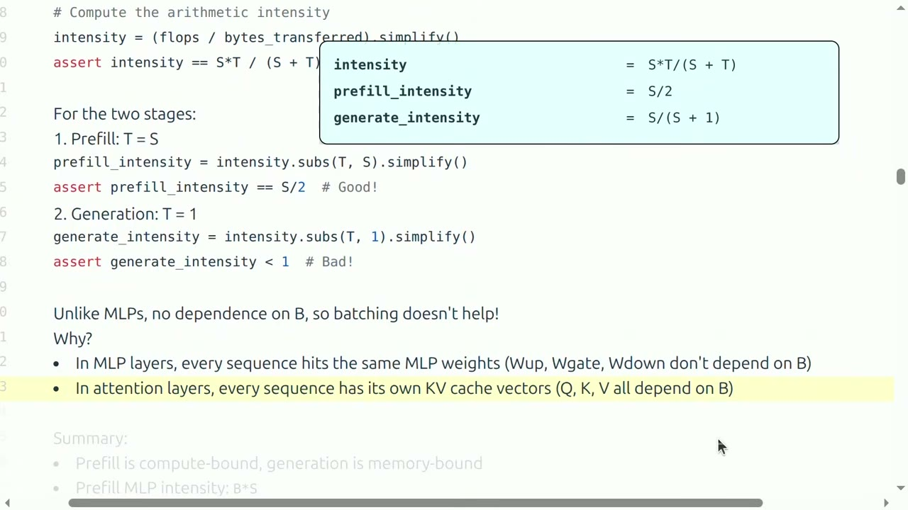

如果你记得最开头我展示的例子，那个算术强度也很差。它不是 matmul，因为我们本质上是在按一个坐标做 batching。这基本上和做点积一样，而点积的算术强度非常糟糕。记住，在 attention 中，这个蓝色的 B 就是 attention 算术强度不随 B 增长的原因，也是它成为瓶颈的原因。总结一下：prefill 是 compute-bound，generation 是 memory-bound。prefill 的 MLP 强度是 B×S，很好；prefill 的 attention 强度是 S/2，没那么好但可用；generation 的 MLP 强度也可用，但需要大量并发请求。真正根本的瓶颈是 generation 的 attention 强度。如果你坚持用 Transformer，你没法真正改善这一点。

*[34:43](https://www.youtube.com/watch?v=EfM546A79aM&t=2083)*

## 用 Llama 2 13B 算延迟、吞吐与 Batch Size 权衡

所以以后当人们说“推理是 memory bound”时，你就知道为什么了。

*[35:07](https://www.youtube.com/watch?v=EfM546A79aM&t=2107)*

现在用这些直觉和计算来思考推理指标：吞吐量、延迟，还有 TTFT。推理是 memory bound。某种程度上这简化了很多事情，因为当我们思考某件事要花多久时，你只需要看需要传输多少内存。假设你重叠了通信和计算，瓶颈就只是你要处理的内存量。这有好处，因为它更简单。但另一方面也令人沮丧：你的加速器坐在那里什么都不做。

*[36:00](https://www.youtube.com/watch?v=EfM546A79aM&t=2160)*

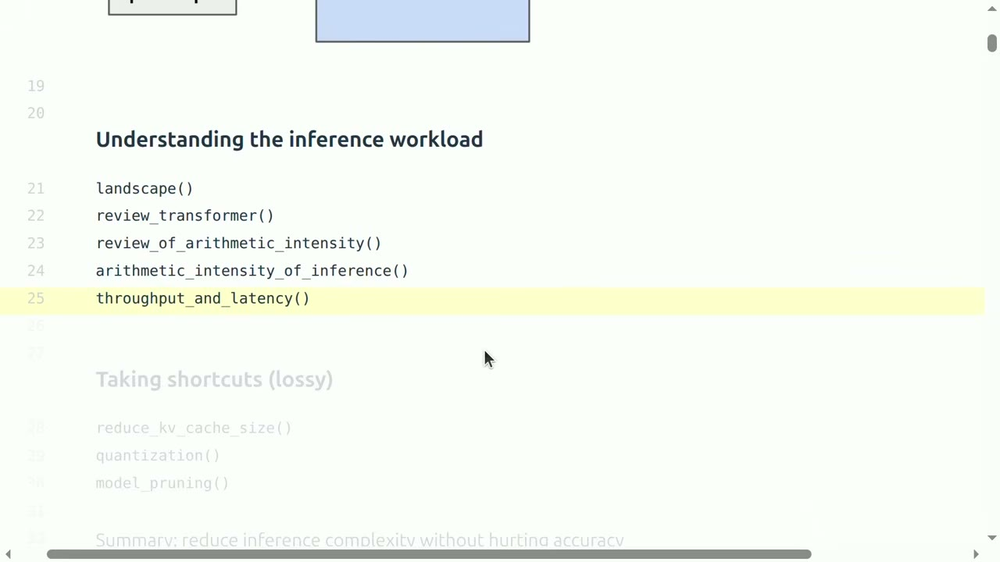

我们走一个例子。Llama 2 13B 在 H100 上。它的延迟和吞吐量是多少？记住 Llama 2 13B 有特定形状：序列长度、模型维度、前馈维度、query head 数、key-value head 数。这里没有 GQA，所以 N 等于 K，还有 head 维度、层数、词表大小，以及 H100 的内存带宽。

*[36:41](https://www.youtube.com/watch?v=EfM546A79aM&t=2201)*

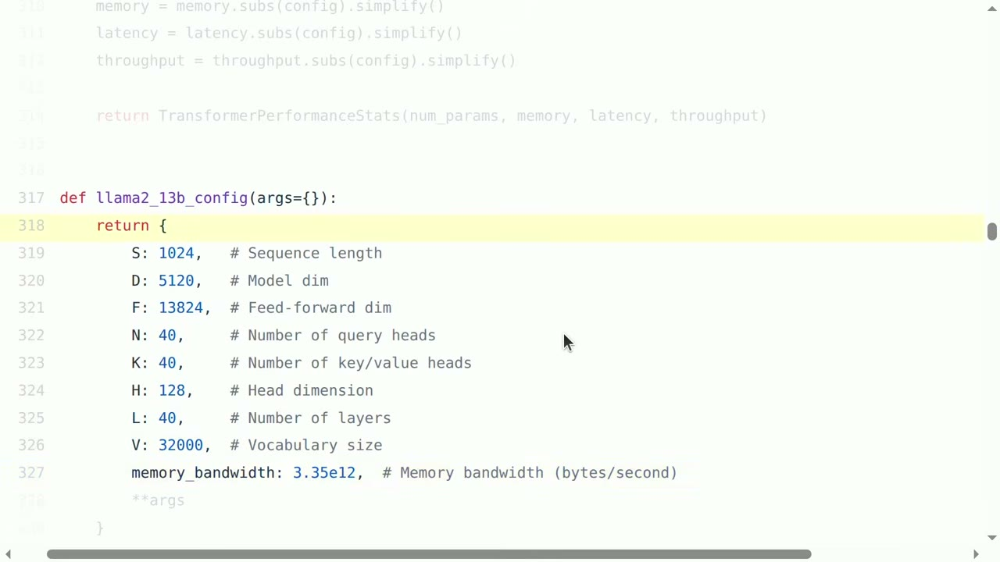

用这个配置，我们来计算 Transformer 的性能统计量。这些是输入。我要计算的统计量是：参数数量、内存使用、延迟和吞吐量。首先，什么占内存？参数占内存。我们计算参数数量。你看 embedding、MLP 层、KQV 投影。最后得到某个参数数量。假设我们用 bf16——推理总是这样——那么参数占这么多字节。

*[37:49](https://www.youtube.com/watch?v=EfM546A79aM&t=2269)*

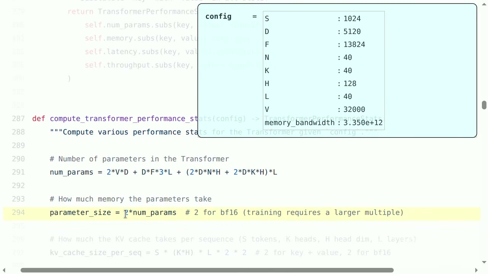

内存里还有 KV cache。KV cache 是序列中的 token 数乘 head 数和 KV head 数，乘 head 维度，乘层数。key 有一个，value 有一个，然后 bf16 还要乘 2。这就是 KV cache 的大小。总内存使用是——对每个序列，有 B 个序列，所以是 B 乘那个，加上参数大小。这就是你需要的内存量。

*[38:32](https://www.youtube.com/watch?v=EfM546A79aM&t=2312)*

那延迟呢？延迟由内存 I/O 决定。因为推理是 memory bound，假设你重叠了通信和计算，所有内存基本都花在 HBM 和 SRAM 之间来回搬运参数上。所以耗时就是搬运内存的时间。吞吐量是延迟的倒数，但我们是并行生成 B 个 token。所以这是每秒 token 数。这是每个 token 的秒数，这是每秒 token 数，并且还要乘 B，因为你处理的是 batch size 为 B 的一批。

*[39:27](https://www.youtube.com/watch?v=EfM546A79aM&t=2367)*

现在对这个配置计算实际值。参数数量是 130 亿。这是一个很好的 sanity check——它被宣传为 130 亿参数模型。内存是这一项，大约是 8.38 亿乘 B。所以它基本上是 B 的线性函数加上另一项。这是 KV cache，随 B 增长；这是参数，是参数数量的两倍。延迟只是这个乘以内存带宽，所以形式和内存一样。吞吐量是 B 除以那个。注意，当 B 增加时，延迟增加，因为 KV cache 增长。为了处理数据，你必须把 KV cache 来回拷贝。吞吐量更有意思：随着 B 增加，吞吐量确实改善，但有上限。吞吐量改善是因为你把成本摊到更大的 batch 上。但你处理的速度显然也在增加。所以它会渐近。吞吐量不可能趋向无穷。

*[41:06](https://www.youtube.com/watch?v=EfM546A79aM&t=2466)*

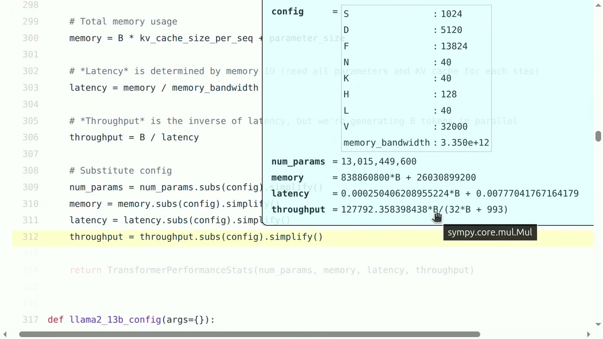

关于这部分有什么问题吗？基本上，你只要记住延迟是 B 的线性函数，常数项是 KV cache 大小和参数数量。吞吐量正比于 B 除以 B 加某个东西。

*[41:35](https://www.youtube.com/watch?v=EfM546A79aM&t=2495)*

现在把几种情况实例化。如果 batch size 为 1，你会得到：延迟是每 token 0.008 秒，吞吐量是每秒 124 个 token。如果你增大 batch size，延迟会上升，但吞吐量也会上升。所以延迟变差，但吞吐量改善。这很有意思，因为我们想“让它变快”，但“快”在这里有两个含义，取决于你在意哪个，它们完全相反。如果你想调 batch size，它会真正决定你想要延迟还是吞吐量。

*[42:33](https://www.youtube.com/watch?v=EfM546A79aM&t=2553)*

如果我们真的想要高吞吐量，因为要处理很多文档，那就继续增大 batch size。延迟变得更差，吞吐量变得更好。但主要问题是你的内存会不够，因为存储 KV cache 的内存会超过 H100 的内存。如果你有 B200，可以把 batch size 增得更大，但最终会撞到某个限制。所以你能提升的吞吐量有限。你永远不会到达渐近线，因为你会先撞到内存。而且吞吐量的收益也在递减。

*[43:30](https://www.youtube.com/watch?v=EfM546A79aM&t=2610)*

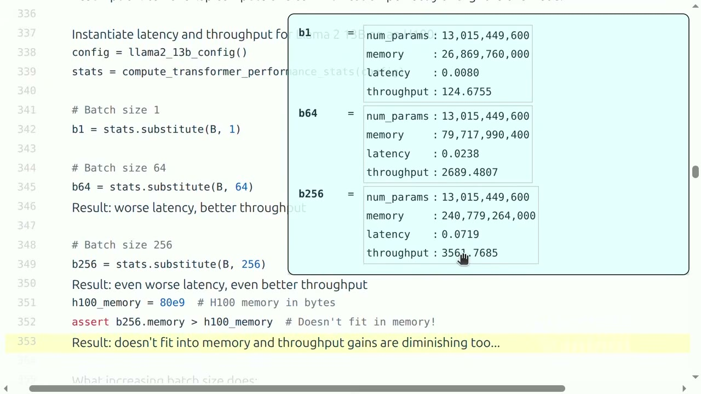

增大 batch size 会恶化延迟，因为现在有更大的 KV cache 要读写。记住，它是批处理的。如果你是一个单独的查询，你必须等所有人结束。所以你基本上在等一辆公交车，延迟很高。你等待，然后走。而公交车的吞吐量很好，因为可以一次运所有人。吞吐量随 batch size 增加而改善，因为参数是共享的，你加载一次到内存里，然后可以处理很多序列。延迟和吞吐量之间的权衡是：较小的 batch size 有更好的延迟但更差的吞吐量；较大的 batch size 有更好的吞吐量但更差的延迟。

*[44:29](https://www.youtube.com/watch?v=EfM546A79aM&t=2669)*

我不打算多讲并行化。推理还有另一个维度：你可以把模型分片到多个设备上。想了解更多可以看 scaling book 的推理章节。举个很简单的例子：如果你启动 M 份模型副本，延迟不变，吞吐量增加 M 倍。还有一个我们没有谈的指标是 time to first token。这基本上是做 prefill 所需的时间，因为 prefill 结束后你才能开始生成。如果你想要更快的 TTFT，应该用更小的 batch size；而你想要更大的 batch size 来提升吞吐量。

*[45:37](https://www.youtube.com/watch?v=EfM546A79aM&t=2737)*

## 减少 KV Cache：GQA 与 MLA

现在我们有了概念框架，可以用算术强度、吞吐量、延迟来思考推理效率。接下来试着让它更快。怎么让推理更快？有很多不同的技术，从改变模型架构到系统优化，介于两者之间。推理在某种意义上是相当丰富的跨领域主题。

*[46:13](https://www.youtube.com/watch?v=EfM546A79aM&t=2773)*

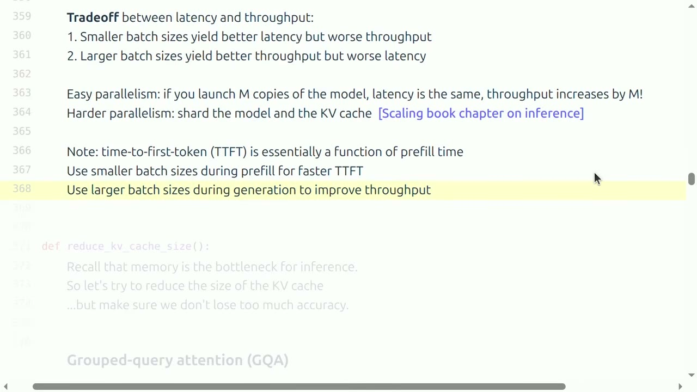

hindsight 来看最明显的一件事——希望你们已经牢记：内存是推理的瓶颈，而 KV cache 占很多内存。在足够大的 batch size 下，它甚至可能比参数数量还大。所以我们来减小 KV cache 的大小。但你必须小心，不能在这个过程中损失太多准确率。

*[46:56](https://www.youtube.com/watch?v=EfM546A79aM&t=2816)*

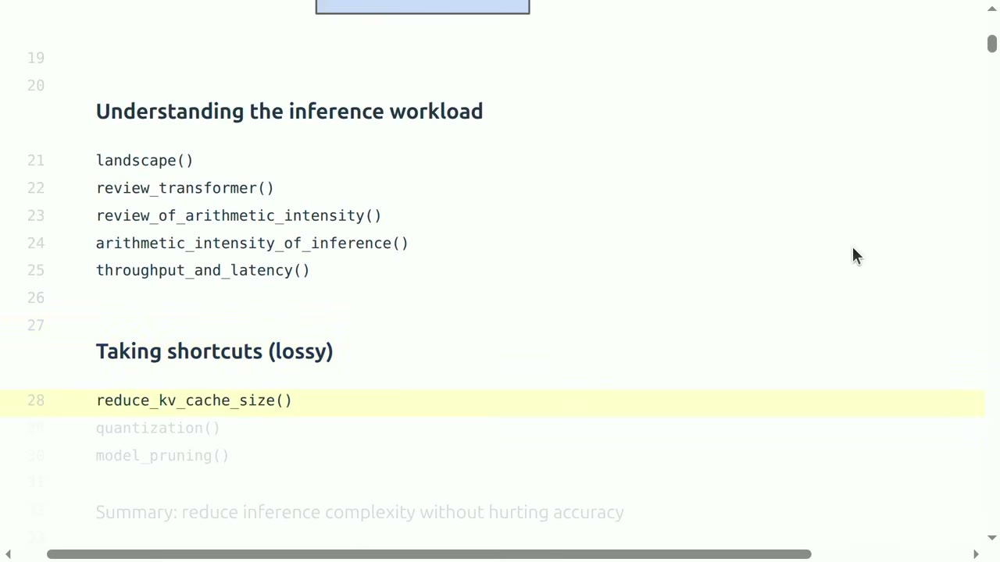

有一件事你已经可以做，我们之前谈过，就是 grouped query attention（GQA，分组查询注意力）。提醒一下：多头注意力基本上对每个 token 都有一个 key、一个 value 和一个 query。如果你做 grouped query attention，你计算的 query 数量相同，但只有更少数量的组，每组计算 key 和 value。所以 K 是组数。在多头注意力中 K 等于 N，没有减少。还有一种叫 multi query attention（MQA），没人用，因为效果很差，K 等于 1。介于两者之间的某个地方，希望能找到准确率和速度的平衡。

*[47:54](https://www.youtube.com/watch?v=EfM546A79aM&t=2874)*

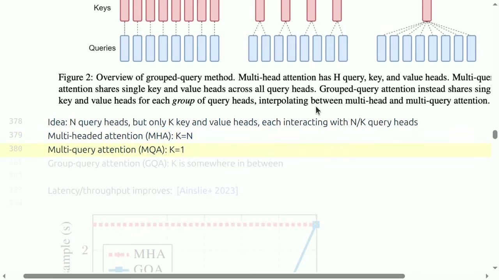

这是 2023 年提出 GQA 的论文。他们展示，如果看每个样本的时间——这与延迟和吞吐量都相关——你会看到 MHA（Multi-Head Attention，多头注意力）完整注意力的时间很高。而如果 K 等于 1，就快得多。然后你可以继续增大 K 到 8，效果仍然不错。最终时间会上升不少。

*[48:39](https://www.youtube.com/watch?v=EfM546A79aM&t=2919)*

为什么 GQA 能改善延迟和吞吐量？因为它把 KV cache 减少了 N/K 倍。友好地提醒一下，减少内存使用会带来加速，因为我们是 memory bound。我们回到熟悉的 Llama 模型。初始配置里我们用 K 等于 N，也就是多头注意力，没有减少 key 和 value 的数量。对这个配置，记住用 batch size 64，我们得到这个吞吐量和延迟。现在如果你用 GQA，比如放入稀疏度为 1/5，这大幅减少了内存，进而改善延迟，也提高吞吐量。所以延迟和吞吐量并不总是互相矛盾。如果你减少内存量，它会同时改善两者。这主要是 batch 维度允许的。那是紧张的焦点。

*[50:01](https://www.youtube.com/watch?v=EfM546A79aM&t=3001)*

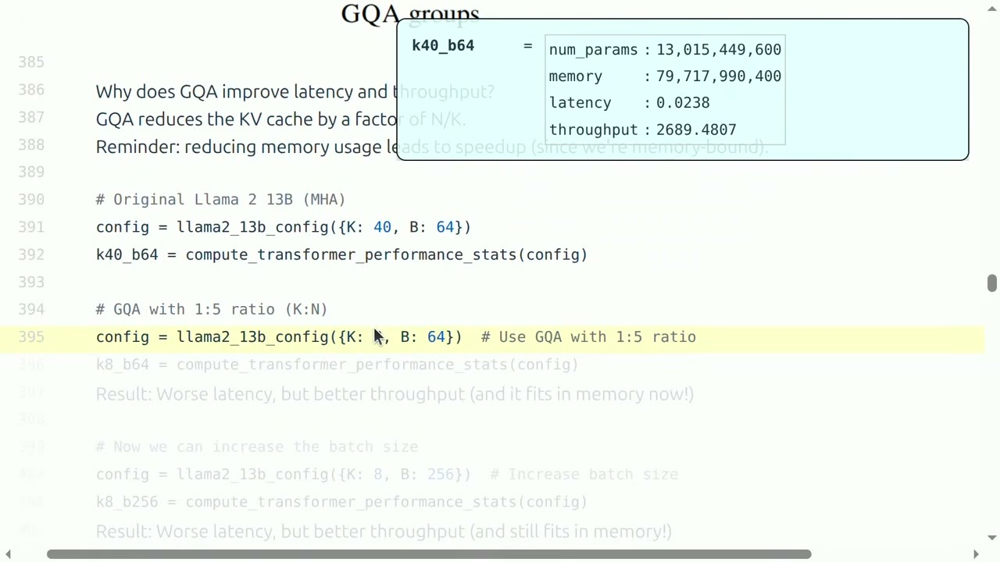

这很好。我们实际上把 batch size 增加到更大看看。之前如果 batch size 为 256，我们会内存不足。但现在它能装进内存了。我们看到延迟受到一些影响，因为我们增加了 batch size，但吞吐量成比例上升。所以有时你要联合调整这些参数。你可以减少 KV cache，但那允许你增加 batch size，并允许做出其他权衡。最后你必须做的是，每当你做一些有损的改变时，你要确保准确率不会下降。这篇论文表明，对于 GQA，时间更好，但在一系列评估中基本上运行良好。现在有了这些准确率值，我认为你总是要持保留态度，因为这是针对特定模型的。后来 DeepSeek 论文表明它实际上确实会有损害。所以我想，把所有不只是数学的东西都持保留态度吧。

*[51:32](https://www.youtube.com/watch?v=EfM546A79aM&t=3092)*

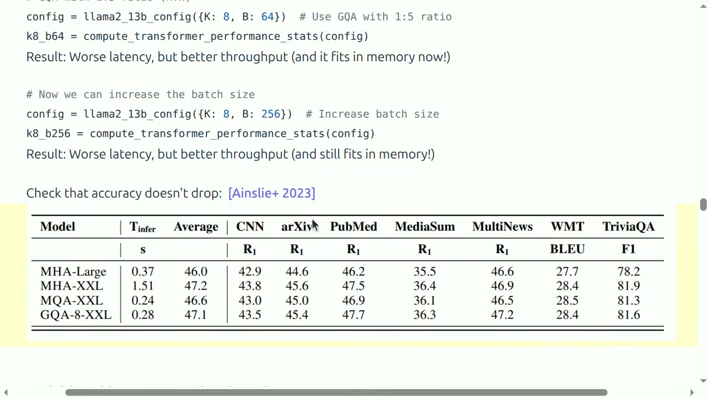

说到 DeepSeek，这里有另一个减少 KV cache 的想法。主题是减少 KV cache，延迟和吞吐量就会改善。这是多头注意力，每个 token 的 query、key、value 数量相同。GQA 中，我们减少了每个 token 的 key 和 value 数量——抱歉，不是每个 token，我们基本上减少了 key 和 value 的数量。现在 DeepSeek 的 multi-latent attention（MLA，多潜在注意力）说，我们实际上会让每个 token 的 key 和 value 数量保持不变，但我会把它们参数化、压缩。

*[52:21](https://www.youtube.com/watch?v=EfM546A79aM&t=3141)*

通常你怎么计算 key 和 value？你有激活，乘以某个矩阵得到 K，乘以另一个矩阵得到 V。这些通常是 N×H 维，像模型维度那么大。MLA 说，我要把这些激活投影到 C 维。DeepSeek-V2 把它从 16000 降到 512，所以是相当激进的压缩。然后我从这个压缩表示计算 K 和 V。现在我可以只存 C，这要小得多。当我需要 key 和 value 时，再物化出来。

*[53:07](https://www.youtube.com/watch?v=EfM546A79aM&t=3187)*

这里有一个小问题：MLA 与 rope（旋转位置编码）不兼容，因为 rope 直接作用在 key 和 value 上。所以他们增加了额外维度来处理 rope。但或多或少，它仍然是一个很大的缩减。延迟和吞吐量的改善就是简单的数学：KV cache 越小，速度越快。几乎接近线性，直到某个点。然后记住，你需要检查模型是否准确。

*[53:56](https://www.youtube.com/watch?v=EfM546A79aM&t=3236)*

首先，这个结果与 GQA 论文有些矛盾或有张力。他们展示 GQA 其实并没有那么好。这是 MHA，这是 GQA，这些数字比这些数字小。但他们展示他们的方法 MLA 甚至比 MHA 略好一点。我们就说它差不多吧。所以这一列和这一列比另一边好很多——我想这个表里没有 GQA，你得在那边比较。

*[54:47](https://www.youtube.com/watch?v=EfM546A79aM&t=3287)*

有同学问：这和减小模型维度相比如何？这是个好问题。这些消融没有展示这一点。我的猜测是，减小模型维度只会让事情更糟，因为你在不加区分地削减一切。我认为所有这些技巧的诀窍是找到模型中可以压缩的地方。这个先验，我不认为你能确切知道。你必须做一堆实验，看什么有效。

*[55:30](https://www.youtube.com/watch?v=EfM546A79aM&t=3330)*

## 跨层注意力、滑动窗口与混合模型

这里还有一个减少 KV cache 的想法，叫 cross-layer attention（跨层注意力）。通常每一层都有 KV、K 和 V。但假设我们不这样做，只为一小部分层计算 KV。然后对于这一层，我直接使用之前层的 KV cache。这是另一种共享方式。就像 GQA 在 head 之间共享 K，现在我在层之间共享 KV。经验上，这篇论文表明这样做改善了 Pareto 前沿。这些模型每一个都更好——给定一种方法，你总是可以通过改变 K 和 head 维度来调整 KV cache 大小，我猜这有点像你提到的改变模型维度的观点。但如果你做这种 CLA 跨层注意力，它会更好。

*[56:53](https://www.youtube.com/watch?v=EfM546A79aM&t=3413)*

继续快速浏览不同的减少 KV cache 的技术。有局部或滑动窗口注意力（sliding window attention）。这是一个相当古老的想法，也非常自然。如果你看完整的注意力矩阵，它是 N 的平方。而不是那样做，如果你要生成一个 token，你只看最后 K 个 token。所以你本质上有一个滑动窗口。对于你生成的每个 token，你只依赖最后 K 个。如果你这样做，有效的 KV cache 现在与序列长度无关。它只是 batch size 乘其他变量，这很棒。这对长上下文尤其棒。现在，由于层数，有效上下文长度实际上大于所声明的上下文长度，因为如果你沿着层向下走，信息可以传播得更远。

*[58:05](https://www.youtube.com/watch?v=EfM546A79aM&t=3485)*

你可以做更花哨的事情。你可以不做密集的层选择，但可以把它间隔开。你也可以做全局加滑动窗口，其中你对固定的不同 token 点网格有注意力，加上一个局部滑动窗口。所以你可以做各种事情。问题是这实际上仍然损害准确性。所以这降低了表达能力。这里没有免费的午餐，或者至少这是一顿昂贵的午餐。

*[58:41](https://www.youtube.com/watch?v=EfM546A79aM&t=3521)*

人们想出的解决方案是把局部注意力与全局注意力交错。这些混合模型对某些层有完整注意力，对其他一些层有局部注意力。你基本上总是在试图——这样你可以减少一点 KV cache。你总是在准确率和速度之间平衡。

*[59:12](https://www.youtube.com/watch?v=EfM546A79aM&t=3552)*

有同学问：混合模型中，使用线性时不变（LTI）和滑动窗口的权衡有什么区别？老师回答：我不打算讲线性注意力。但很快地说，有一堆方法，不是存 KV cache，而是基本上计算所有历史的某种压缩表示。线性注意力最朴素的形式就是把 KV 值加总成一个向量。那肯定与序列长度无关。你可以做更花哨的，比如 gated net、delta net 和 Mamba，它们试图压缩但不要忘记太多。问题是它们相比如何？它们也被用来替代滑动窗口注意力，人们得到了不错的结果。你也可以组合完整注意力、滑动窗口注意力和线性注意力，因为它们捕捉不同方面。如果你关心局部高分辨率的东西，滑动注意力更好。如果你只想要过去的宽泛摘要，其他线性注意力可能更好。

*[62:14](https://www.youtube.com/watch?v=EfM546A79aM&t=3734)*

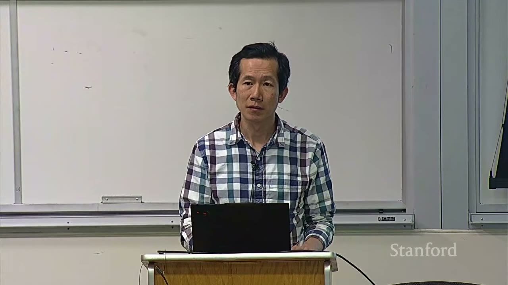

有同学问：对长上下文句子，线性注意力会是更好的设置吗？老师回答：没有免费午餐。假设你有很长的上下文，在解决大海捞针问题。如果你必须把整个历史压缩到一个小上下文里，你就会丢失信息，可能根本无法检索到。有同学继续问：似乎人们总是用混合架构，总需要一些长注意力，但我想理解滑动窗口和 Mamba、delta net 层之间的权衡。用 delta net 层总是比滑动窗口更好吗？实际的代表性权衡是什么？老师回答：也许我会说，Mamba 和 delta net 比滑动窗口更强大。你可以把 Mamba 看作可以表示滑动窗口注意力的某些方面，因为在做递归时它可以看最后的状态。所以，也许你可以把线性注意力或其扩展看作更好。它们有更多空间。一旦你做滑动窗口注意力，你就被限制住了，没有别的可做。

*[62:17](https://www.youtube.com/watch?v=EfM546A79aM&t=3737)*

## 量化、剪枝与蒸馏

我快速过一下这个。强调一下 DeepSeek。DeepSeek 继续创新不同类型的注意力机制。记住，他们提出了 multi-latent attention，压缩 key 和 value。现在他们有 compressed sparse attention、DeepSeek sparse attention，以及 heavily compressed attention。我从来记不住所有这些缩写和它们的含义，但让我们看这个图。通常你有 KV token 和 query token。压缩注意力基本上把每 M 个 token 合并成一个 token。然后还有 DeepSeek 稀疏注意力，它基本上是选择其中的一个子集来保留。选择子集的方式是你实际上计算一些 LiDAR 权重查询和键，然后你做一次更小的注意力来得到这些索引分数，这样你就知道要保留什么。所以一个闪电般快速的方法来找出你需要保留哪些 token。然后你使用那些。然后还有一些更多的压缩发生。

*[63:40](https://www.youtube.com/watch?v=EfM546A79aM&t=3820)*

为了节省时间，我继续往下讲。本节的目标是减少 KV cache，因为 KV cache 与内存相关。我们看到推理是内存受限的。所以这直接转化为吞吐量和延迟的改进。关键在于做到这一点而不损害准确率。所以你可以跨层做更低维度的 KV cache，跨头和跨 head 维度。你可以做局部注意力。你可以做线性注意力，之前讨论过，还有更多。还有扩散模型，这是一种非自回归的生成方式，可以快得多。

*[64:28](https://www.youtube.com/watch?v=EfM546A79aM&t=3868)*

量化更像是一种系统视角，而不是架构，关于如何让东西更小。关键思想就是降低数字的精度。更少的内存意味着更高的延迟和吞吐量——抱歉，更少的延迟和更高的吞吐量。显然，你必须担心准确率。量化这里有很多选项，从 bf16 一直到 int4。

*[65:11](https://www.youtube.com/watch?v=EfM546A79aM&t=3911)*

你可以做的一件事，如果你担心量化会搞砸你，就是训练模型时考虑量化。这是 quantization-aware training（QAT，量化感知训练）。训练时的前向传播过程中，你进行量化和反量化，基本上在训练时模拟这些量化误差。所以一般来说，现在权重会朝着量化方向适配，效果会更好。但缺点是它需要昂贵的大规模训练。所以通常人们的做法是先训练模型，然后再事后量化。

*[65:53](https://www.youtube.com/watch?v=EfM546A79aM&t=3953)*

这就是 post-training quantization（PTQ，训练后量化）。它通常便宜得多。有一种朴素做法：对每一层或张量，你基本上为每个张量确定缩放因子和零点，然后分别量化它。这通常效果不太好。你可以使用一种叫 GPTQ 的方法，它利用一些 Hessian 信息来逐层量化，逐层进行。然后你跟踪那些传播到未量化权重中的误差，这样就能让你校正这些误差。

*[66:37](https://www.youtube.com/watch?v=EfM546A79aM&t=3997)*

而 activation-aware weight quantization（AWQ，激活感知量化）是一种更复杂的方法，其观察是某些激活通道很大，那些与这些通道交互的权重更重要。所以让我们给这些权重分配更多精度。我们看这张图。通常，如果你取一个 fp16 权重矩阵，然后量化它，比如量化到 int3。但你要做的是找出哪些是活跃的。这些可能是激活通道。其中一些激活通道很大。所以如果它们总体上很大，那么你基本上为这个通道分配，比如说，fp16。其余的都保持为三。对于少数重要通道，你使用更高精度。

*[67:39](https://www.youtube.com/watch?v=EfM546A79aM&t=4059)*

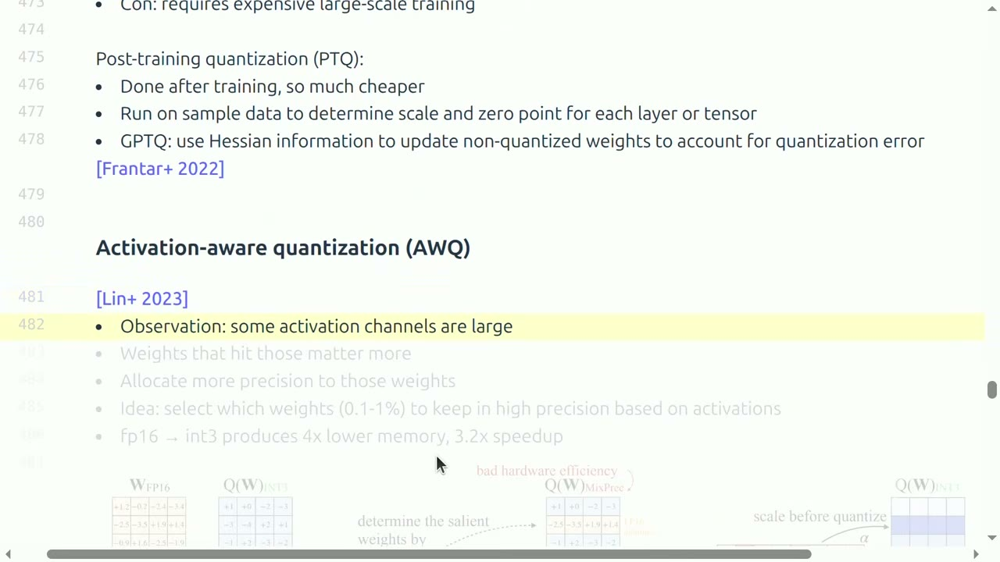

另一个想法是做模型剪枝（model pruning）。你拿一个大模型，把其中一些部分撕掉，然后修复它。这很粗暴，但事实证明有效。这是 NVIDIA 的一篇论文。你首先必须估计模型不同部分的重要性，选择最重要的部分。然后你基本上移除不同的隐藏单元，甚至不同的层。现在你得到一个模型，它不会很好。所以你要做的是后训练它。你在你关心的数据或任务上再训练它，来愈合它。所以这在某种意义上是减少 KV cache 的训练方法，但你是用好的模型的一部分来初始化它。

*[69:16](https://www.youtube.com/watch?v=EfM546A79aM&t=4156)*

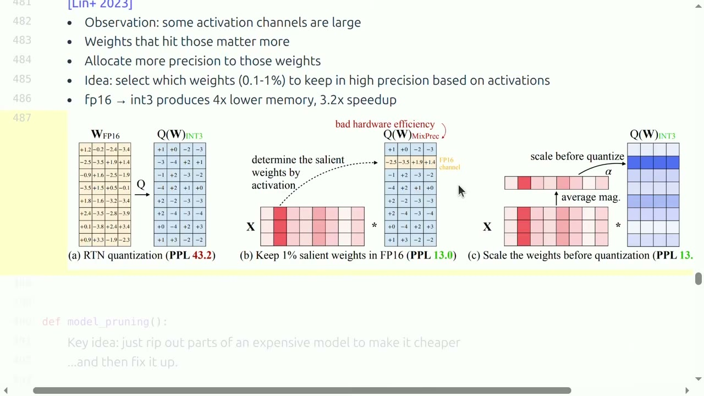

这似乎效果很好。他们能把一个 15B 模型减少到 8B 模型，而且准确率没有下降太多。用于训练模型或经过这个过程的量要少得多。总结一下，游戏是减少推理复杂度而不损害准确率。你可以把这看作主要是减少参数数量或 KV cache。你可以定义一个更快的模型架构来训练它，或者定义一个更快的模型架构，从原始模型初始化权重——原始模型可能有不同架构，你只是做出这个 Frankenstein 一样的东西，然后用蒸馏修复这个更快的模型。

*[69:53](https://www.youtube.com/watch?v=EfM546A79aM&t=4193)*

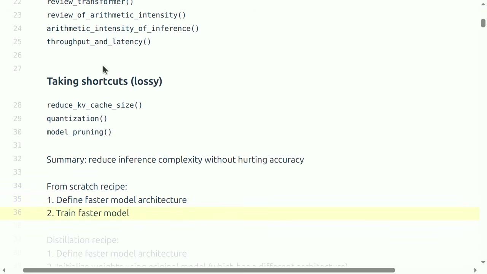

有同学问：你怎么区分重要层和不重要层？老师回答：一般来说，你有一个校准集，把输入通过模型。你基本上看激活的幅度。其中一些，特别是如果它们是死单元，会接近 0。而大的那些，你想保留。这是高层想法。有同学继续问：为什么激活高就重要？它可能只是总是很高？如果所有激活都高呢？老师回答：一般来说，这是一个经验观察：某些通道会比其他高很多。如果这不是真的，这些技术就不一定有效，但事实如此，因为这些模型最终就是这么训练出来的。然后你可以利用这一点。

*[71:43](https://www.youtube.com/watch?v=EfM546A79aM&t=4303)*

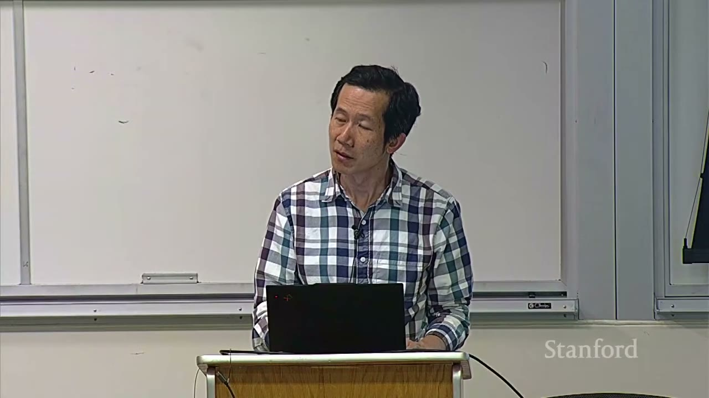

有同学问：假设一个神经元在所有样本上总是值 100，这一定意味着它有意义吗？还是只是训练的伪影？老师回答：如果它总是 100，你不能直接移除它，因为那样一切都会坏掉。如果它均值高、方差低，也许有另一种方法，基本上把偏置并进去。

*[71:43](https://www.youtube.com/watch?v=EfM546A79aM&t=4303)*

## 推测解码

让我快速过另一个想法。到目前为止，我们看的都是有损方法，它们确实压缩了 KV cache，但可能损害准确率。这是一个非常优雅的无损方法，叫 speculative sampling（推测采样）或 speculative decoding（推测解码）。记住，如果你做 prefill，你可以并行编码所有 token。这也会给出概率。这很快，是 compute-bound，各种好处。而在 generation 中，一次一个。所以检查比生成快。如果我给你一个序列，你告诉我它有多好是很快的，比一次一个生成快得多。你可以利用这种不对称性，用下面的想法。

*[72:26](https://www.youtube.com/watch?v=EfM546A79aM&t=4346)*

我们要用一个便宜的 draft model（草稿模型）来从猜测中生成几个 token，比如四个。然后我们用真正关心的模型——目标模型 Q——来审查这些 token，接受或不接受。事情被设计成平衡的。draft 模型更小更便宜，所以即使它是 memory bound、必须一次生成一个，也不会太糟。而目标模型又大又贵，但我们让它并行处理一批 token，所以它也不会太糟。

*[73:11](https://www.youtube.com/watch?v=EfM546A79aM&t=4391)*

这里有一个视频展示它如何工作。如果你用大模型一个 token 一个 token 地生成，会相当慢。但如果你做推测解码，你可以看到小模型生成一堆 token，然后大模型基本上批判它们。然后你基本上得到一串 token 的爆发，然后可能又一串 token，如此反复。

*[73:51](https://www.youtube.com/watch?v=EfM546A79aM&t=4431)*

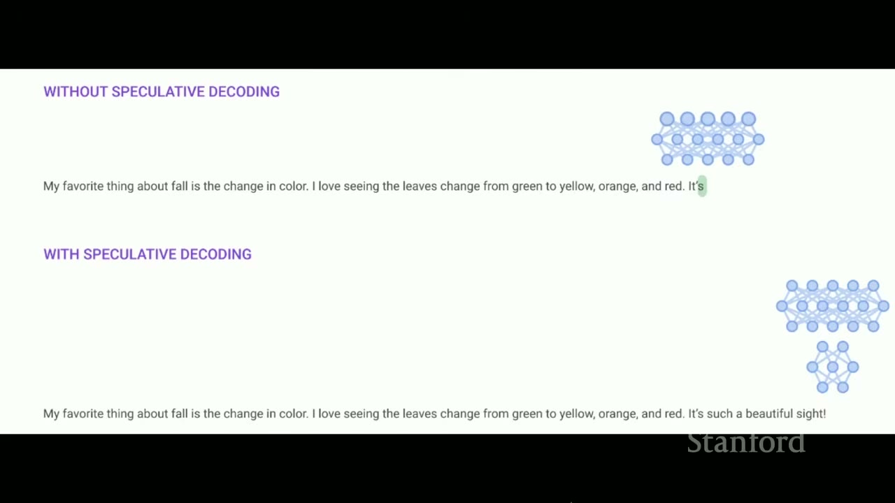

这是推测解码的算法。有几篇论文差不多同时提出。这是其中一篇。想法是：为了生成，我们先从 draft 模型生成 K 个 token。p 是 draft 模型，我们采样 K 个 token。然后并行地用 q 计算这些 draft token 的 logits。然后我们必须决定接受还是不接受。这里你要做一点数学、概率和统计。你基本上以概率 min(1, q/p) 接受。所以如果 q 比 p 大得多，q 越大，你越可能想接受它。否则你从残差分布中采样并退出。所以这基本上是拒绝采样，但拒绝采样有时拒绝后什么都得不到。而这里我们总是保证得到目标模型的精确样本。我会跳过这个简单证明。它基本上和拒绝采样的论证一样，证明它给出目标模型的精确概率。

*[75:20](https://www.youtube.com/watch?v=EfM546A79aM&t=4520)*

最初的论文表明这很快。一般来说，如果 draft token 太少，你没有真正利用目标模型侧的批处理。如果太多，你就会更频繁地拒绝。所以有一个甜点，在这个例子里大约是 3 或 4。一般来说，draft 模型比目标模型小得多。理想情况下，你希望 draft 模型尽可能接近目标，这意味着你想蒸馏它。这意味着我们刚才谈的很多想法也适用于推测解码。基本上，想法是：让我们通过各种手段减少 KV cache。如果你最终得到一个满意的模型，就服务它。如果你不满意，它至少可以当 draft 模型，你可以用主模型来修正。现在有一大堆关于推测解码的文献，改进原始方法，我暂时跳过。

*[76:48](https://www.youtube.com/watch?v=EfM546A79aM&t=4608)*

## 动态工作负载：连续批处理、选择性批处理与 PagedAttention

现在很快讲动态工作负载。用例是你服务一个实时网站，用户来和你的模型聊天。请求在不同时间到达。它们有不同的共享前缀，也有不同的长度。所以很乱。它远不像训练那样，你有一批相同 token 数的块，一次全来。这种情况你怎么办？

*[77:29](https://www.youtube.com/watch?v=EfM546A79aM&t=4649)*

有一个系统叫 Orca，它很早就引入了 continuous batching（连续批处理）的想法。想法是你收到一堆请求，看起来像这样：这是第一个请求的前缀，你生成这个 token；这是第二个；这是第三个、第四个。它是锯齿状的，因为每个前缀长度不同。我们要做的是逐步解码。每一步你为所有序列解码一个 token。下一步，你为所有序列再解码一个 token。然后如果某个序列结束了，就把它弹出。随着新请求到达，你把它放进 batch，然后继续。这就是为什么叫连续批处理，因为这个 batch 被动态更新，旧的已完成序列被驱逐，新的进来。

*[78:34](https://www.youtube.com/watch?v=EfM546A79aM&t=4714)*

现在有一个问题：我们看到的批处理都要求所有序列维度相同。你有张量，每个切片维度相同。但这里请求长度不同，怎么办？有一个想法叫 selective batching（选择性批处理）。假设你有长度 3、长度 9 和长度 5。在 attention 计算中，你无法真正做什么，因为 attention 依赖序列长度。如果你有 3×3、9×9 的计算，你无法有效共享张量。但对于非 attention 的部分，MLP 层，它们占很多 FLOPs，你可以把所有序列拼接在一起，形成一个 mega sequence，然后处理它。

*[79:34](https://www.youtube.com/watch?v=EfM546A79aM&t=4774)*

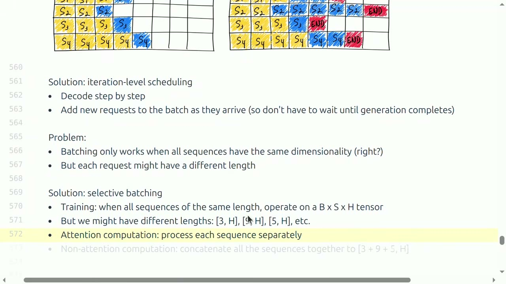

最后一个想法是 paged attention（分页注意力）。这是 PagedAttention 论文提出的。当然，PagedAttention 现在还有很多其他功能，但这是当时的核心想法。问题是 KV cache 怎么存？如果请求进来，你必须把它们放在内存某个地方。一般来说，会有碎片化问题。这就像你的硬盘以前会发生的事情。以前你得给硬盘做碎片整理。有两种碎片。一种是内部碎片：你必须分配足够的缓冲区，因为你不知道什么时候停止。你可能最大 token 限制是 1024，所以你必须分配所有这些内存。但你不能在里面放别的东西，因为你会一直生成到最大 token，这非常浪费。这就是内部碎片。还有外部碎片：不同请求之间可能有空间，那个空间可能太小，无法有效利用，所以只是浪费空间。

*[80:52](https://www.youtube.com/watch?v=EfM546A79aM&t=4852)*

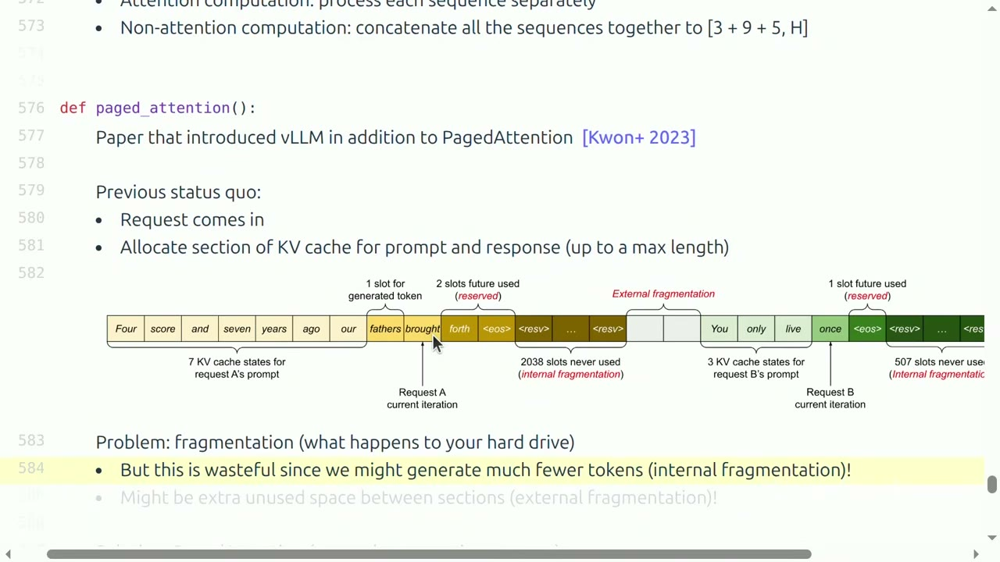

解决方案是：这些是系统人，他们懂操作系统。他们说，这个问题我们以前解决过，让我们用同样的想法。我们把一个序列的 KV cache 分成非连续的块。比如你有序列 "four score and seven years ago our fathers brought forth"，我们把它切成大小为 4 的块。块放在哪里不重要，但它们按块对齐。所以有一定的一致性。当两个请求共享相同前缀时，它们实际上可以共享相同的 KV cache。

*[81:58](https://www.youtube.com/watch?v=EfM546A79aM&t=4918)*

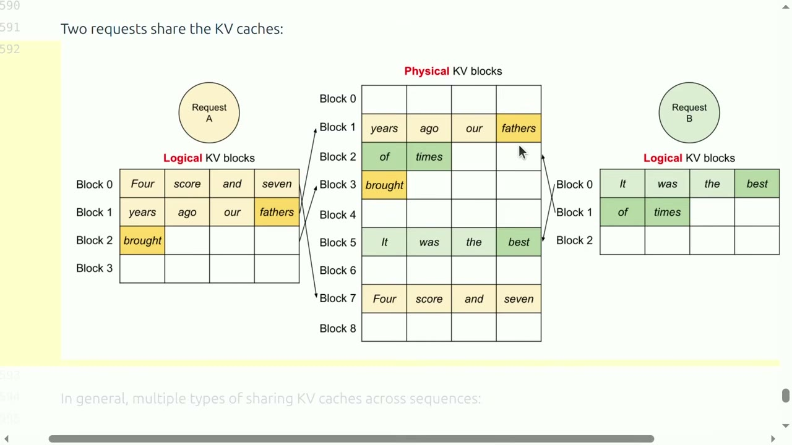

你可能有一个块和另一个块。这个块可能放在这里和这里，那个块可能在那边。它们是散布的。但只要你掌握索引，追踪每个东西在哪里，就没问题。特别是如果你有 system prompt，你可以把 system prompt 的 KV cache 缓存一次。这对所有查询都有用。这非常有用，因为如果很多人使用相同的 system prompt，你就不必为每个请求计算 cache。还有很多应用有相同的 prompt，你实际上想生成多个回复。那样你也可以共享 prompt 的 KV cache，只让不同的回复产生。

*[82:42](https://www.youtube.com/watch?v=EfM546A79aM&t=4962)*

举个例子，假设你要从 "score and seven years ago are, blank" 生成多个续写。这里会发生的是，你会有 "score and seven"，然后开始有 "years ago or our"。这叫 copy on write（写时复制）语义。你保留这个，然后有两个样本。如果它们碰巧采样到同一个 token，你就继续。但如果它们采样到不同 token，你就拆开这个块，然后在各自那里继续。所以你基本上尽可能共享前缀 cache。

*[83:28](https://www.youtube.com/watch?v=EfM546A79aM&t=5008)*

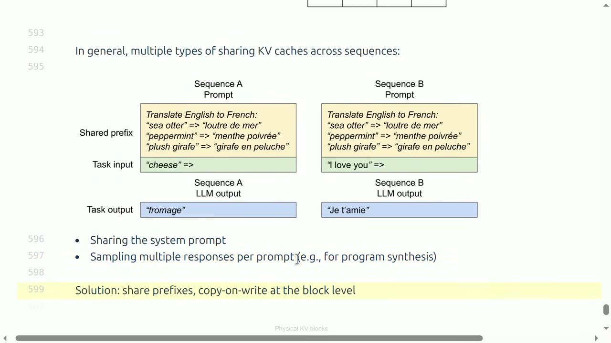

还有一些其他优化，比如 kernels，我没时间讲了。但总体想法是，你使用这些操作系统隐喻来管理你的推理。

*[83:46](https://www.youtube.com/watch?v=EfM546A79aM&t=5026)*

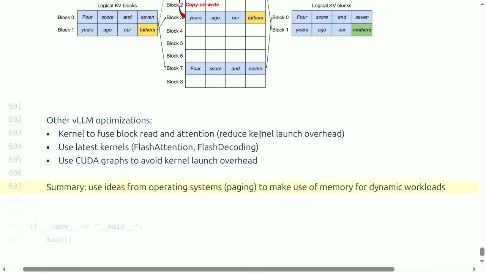

## 总结

总结一下：推理真的非常重要。它和训练非常不同。尽管是同一个模型，但你要求模型做非常不同的事，结果是非常 memory bound。如果你在实时聊天机器人用例中，它还是动态的。我们看到了各种改善推理的技术。你可以量化，可以提出新架构，可以剪枝和蒸馏，也可以用推测采样。但所有这些都由同一个原则驱动：减少 KV cache，但不要损害太多准确率。然后还有来自系统的想法，比如分页和推测执行，可以用于实际的实时推理服务器。

*[84:40](https://www.youtube.com/watch?v=EfM546A79aM&t=5080)*

有一件事我们没真正来得及谈，只是简单提过：我认为新架构实际上有巨大改进潜力，比如状态空间模型、线性注意力或扩散。在某种程度上，KV cache 和 attention 的构建方式从根本上使它成为一种对推理不友好的架构。所以如果你能提出一种为推理设计的新架构，而 Transformer 不是这样设计的，这可能会解锁很多东西。我在这里停下。下节课 Tatsu 会回来讲 scaling laws 第二部分。

*[85:21](https://www.youtube.com/watch?v=EfM546A79aM&t=5121)*

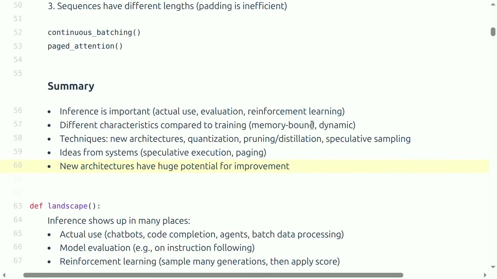
