# 从 Chinchilla 到前沿开源模型：scaling law 的实践、超参数与优化器

这堂课讲如何把 scaling law 用到真实模型训练中，涵盖 MiniCPM、DeepSeek 等开源模型的 scaling 经验，学习率、batch size、优化器和 muP 初始化。

## 从经典 scaling law 到前沿开源模型

我们继续 scaling 之旅。今天内容有点杂，主要讲 scaling laws 更高级的细节，以及实践中如何扩大语言模型。我们会问：两讲前讲的 scaling law 东西，在真实构建开源模型规模上真的有效吗？如果能优化其中一些就好了。很多学习率技巧和其他做法，你们作为了解如何构建语言模型的人都应该知道。我们会讲这些优化细节。最后还要讲，扩大规模时有些东西更难调；优化器和优化器行为对 scale 相当敏感。因此初始化、学习率、batch size 都需要作为 scale 的函数仔细考虑。我们会讲如何仔细思考这些。

*[01:15](https://www.youtube.com/watch?v=vTfEyOyzV9E&t=75)*

到目前为止，我们讨论的大多是我所谓的经典 scaling law 正典：Kaplan、Hestness，以及 Chinchilla 论文。我们的认知大概停留在 2022 年。自那以后，训练大模型的人发表了不少 scaling 论文；不过近年来这类论文数量减少了，而且大多来自中国开源社区。今天我想讲几篇我挑选出来的论文，让你们感受一下前沿、至少是开源前沿的 scaling 是什么样：这些人关心或担心什么，以及要从 Chinchilla 一路速通到比如 Kimi K2 这样最近发布了 scaling 细节的模型，需要做什么。这是 lecture 的第一部分。

*[02:15](https://www.youtube.com/watch?v=vTfEyOyzV9E&t=135)*

我们会过几篇论文的细节。第二部分讨论优化器和初始化。记住，我两讲前花了相当多时间讲 batch size 选择，那是个重要因素；思考如何调学习率也很重要。这些非常敏感，调对非常关键。事实上人们投入了大量努力把这些搞对，我们会讲一些技术。这些甚至可能对你们日常训练各种语言模型有用，因为会让你们了解在扩大或缩小规模时如何改变超参数和实验。

*[02:58](https://www.youtube.com/watch?v=vTfEyOyzV9E&t=178)*

我会特别花不少时间讲两篇论文。它们不是最新的，也不一定是最——其实 DeepSeek 那篇可能是最详细的 scaling 论文之一。但它们处在一个 sweet spot：两篇都是来自构建相当高性能模型的人所做的严肃 scaling 研究，而且重要的是，它们对今天要问的一些关键问题采取了很不同的方法。所以它们能很好地引出 lecture 的其余部分。第一篇是 MiniCPM，2024 年的高性能小语言模型；第二篇是 DeepSeek，你们现在都很熟悉了，我不用再解释为什么讲它。我们先从 MiniCPM 开始。我很喜欢这篇论文，尤其刚出来时，感觉很新鲜、前沿。即使到 2026 年，CPM 团队做的很多事情对我们仍有启发。

*[04:03](https://www.youtube.com/watch?v=vTfEyOyzV9E&t=243)*

但后来我也注意到，很多经典 scaling 东西——如何设学习率、如何做 Chinchilla——现在被当作理所当然，每个人都假设你会做，所以论文里不再怎么谈。这也是讲这些旧论文的好处。MiniCPM 是一群产业界和学术界合作者在中国开源社区做的高性能、偏小的语言模型。当时它基本上是 1 到 2 亿参数区间的 SOTA。现在 Gemma 和其他 2B、3B 模型性能更高，但按 2024 年标准，这些是很有竞争力的训练良好的模型。

*[04:58](https://www.youtube.com/watch?v=vTfEyOyzV9E&t=298)*

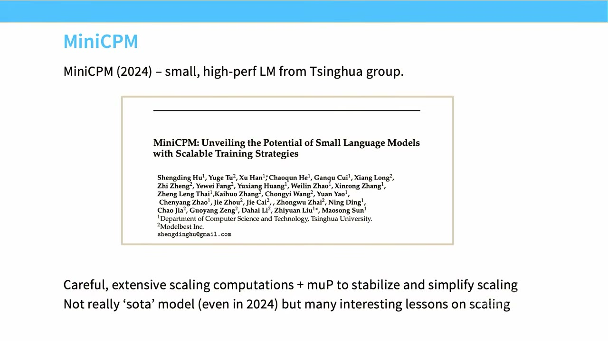

## MiniCPM：muP、batch size 与 WSD 学习率

怎么训练这些模型？如之前所说，必须把一些 scaling 参数搞对。今天我会反复强调的一点是：初始化非常重要。初始化重要，是因为它们能让某些超参数不那么依赖 scale。MiniCPM 论文里第一个技术是一类特殊初始化，叫 muP（Maximal Update Parametrization，最大更新参数化）。muP 的整个要点是：我想确保最优学习率在放大和缩小时保持不变。我两讲前简单提过，你们应该还记得一点。这是我们要讲的第一个真正实例。具体是什么样？MiniCPM 论文有一个很好的清单：他们缩放 embedding 输出；用层数的平方根缩放残差连接；用 fan-in、fan-out 比缩放所有矩阵形状张量的初始化；缩放张量的学习率——你们要注意这一条，因为如果你不熟悉 per-parameter 学习率，这很 exotic；他们还缩放 LM head。我们会讲为什么做这些，或者如何推导这组缩放。总之，你会稍微改变初始化和学习率，希望稳定学习率。

*[06:26](https://www.youtube.com/watch?v=vTfEyOyzV9E&t=386)*

当然，这里训练的是小模型，但仍然想要好的 scaling 策略。这项研究的一部分要点不是暴力训练一个 1.5B 模型、比如训几百个，而是想第一次就把超参数调准。所以你会训练很多更小的模型，然后建一个 scaling ladder，一直爬到目标大小的 5 倍左右。他们 ladder 上最大的模型和最终发布的模型之间大约差 5 倍。目标是把大多数人认为敏感的参数确定下来，比如最优 batch size、学习率，以及 Chinchilla 里讲过的 token 与模型大小的比率。他们也想复现 Chinchilla 分析，这对我们现在、可能对你们即使要训练也没那么重要，但我还是会讲，因为他们做这事的方式里有一点很有启发性、很有用。

*[07:26](https://www.youtube.com/watch?v=vTfEyOyzV9E&t=446)*

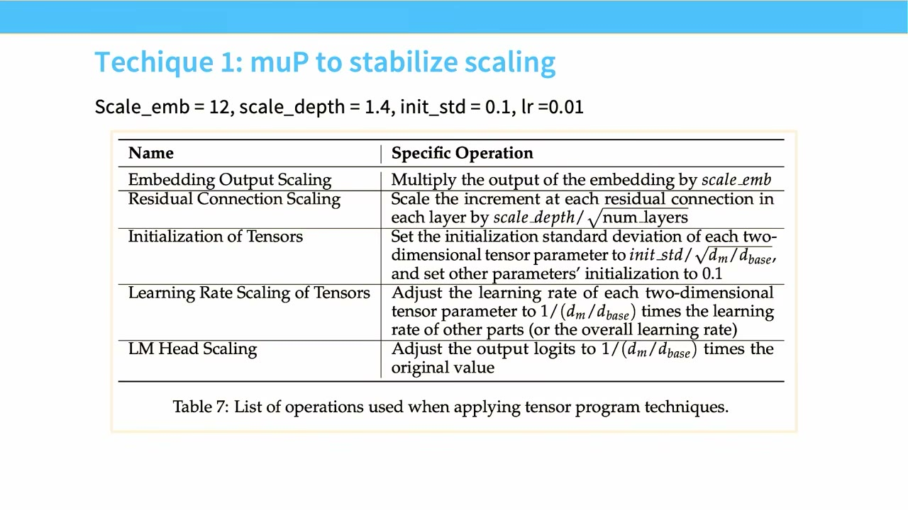

如我所说，走一遍这个奇怪的非标准初始化 muP，整个目的就是让最优学习率稳定。它做到了吗？至少在 MiniCPM 案例中，答案是肯定的。实际上实验非常干净。他们在多种模型上扫学习率，每条线是一个模型大小，最小 loss 基本就在 10 的负 2 次方附近。最小模型的极小值稍微偏移了一点，但即使那样也很接近最小值。所以这是 muP 方法的一个成功案例。我们还会讲其他几个模型和论文使用 muP。这不是唯一的方法，但是一种有效方法。如果你能得到这样的结果，就移除了调学习率的需要。

*[08:16](https://www.youtube.com/watch?v=vTfEyOyzV9E&t=496)*

但当然，即使有一个好的参数化把学习率固定到单一最优值，你的最优 batch size 仍然不会相同。batch size 实际上会随数据集大小和模型大小变化。在他们的案例中，他们跑这些模型训练。图上的每一列点是一次训练：固定 batch size，增加处理的 token 数，大概从下到上。然后他们问：我们做了很多这样的训练，把这些二次曲线拟合到每条线上、这条等 loss 等高线上，最优 batch size 是多少？他们发现最优 batch size 随处理 token 数 scaling，并且跨不同模型大小做这件事。鉴于 Kaplan 论文里关键 batch size 的漂亮 scaling，你可能不会惊讶。但最优 batch size 对目标 loss 确实有幂律结构。所以我们看到完全 Kaplan 式的分析：左边 loss 更低，batch size 就应该更大，关键 batch size scaling。给定一个从 scaling law 反推出来的 loss 目标，你基本可以设定最优或关键 batch size，得到最佳权衡。趋势很干净，能让你很容易、很精确地设 batch size。

*[09:48](https://www.youtube.com/watch?v=vTfEyOyzV9E&t=588)*

所以这两个——batch size 和 learning rate scaling——会反复出现。它们可以说是做 scaling law 最重要、最敏感的参数。但 MiniCPM 论文里还有最后一件事我想讲，我认为很重要。记住，做 Chinchilla 需要训练很多不同模型。比如做 IsoFLOPs：固定 FLOPs 预算，改变 token 数和模型大小之间的权衡。为此，比如增加训练数据量，也就是增加序列数量。但当你增加序列数量时，记住每一个都会得到不同的学习率调度。你们都在用余弦学习率训练。余弦学习率看起来不太一样。你需要知道最终的总预算，才能用余弦调度来训练。这就引出一个烦人的事实：你得一直重新训练你的模型。如果你想训练一个 800 万序列的模型，你不能从 400 万序列模型的末尾重新开始。你必须从头开始，因为你的学习率调度从根本上就不同。这真的很烦人。从某种意义上说，这像二次方成本，因为你得一直从起点重新开始你的运行。

*[11:04](https://www.youtube.com/watch?v=vTfEyOyzV9E&t=664)*

这看起来很浪费，我想很多其他人也这么觉得。我认为 MiniCPM 论文中一个不错的解决方案就是现在所谓的 WSD（warmup-stable-decay）学习率。或者这是它的流行叫法。它基本上就是一个大梯形。你有一个预热阶段。预热阶段通常被定义为一个恒定的步数，而不是你训练目标的一个比例。所以这与你的训练时长无关。然后你有一段相当长的运行，在这期间保持学习率恒定，这就是稳定阶段。最后，你会相当快速地衰减到 0，这就是衰减阶段。一般来说，衰减阶段大约是你整个训练运行的 10% 到 20%。所以你会在绝大部分训练运行期间保持稳定，然后做一个非常快速的衰减，通常衰减到最大学习率的 10% 左右。这就是非常典型的 warmup、stable、decay 学习率。

*[12:03](https://www.youtube.com/watch?v=vTfEyOyzV9E&t=723)*

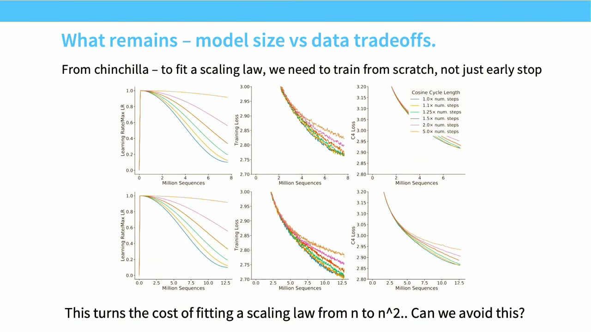

为什么这么做？做 WSD 是因为现在我们可以在稳定阶段结束后的任意点重启一次运行。如果我想重用一次运行并训练更久，我只要把训练回滚到最后一个稳定 checkpoint，然后继续跑稳定学习率，最后把模型衰减到 0。这提供了一种非常简单的方式，让我们做 data scaling 实验，而不必不断重跑实验。你确实每次都要重新 decay，但那大约只占总成本的 10%。反复 decay 比反复重跑预训练运行好得多。这是很多地方使用的常见技巧。

*[12:48](https://www.youtube.com/watch?v=vTfEyOyzV9E&t=768)*

我会展示一个性能比较。有很多这种形式的图。最近可能是 Martin Jaggi 等人在 ETH 对 WSD 性能做了广泛研究。很多论文也展示了类似的东西：你有一条调好的余弦学习曲线，就是这边橙色线。然后有各种 WSD 曲线。WSD 曲线看起来总是有点怪，因为直到进入衰减阶段之前，它看起来表现差很多，然后突然把所有增益收回来，匹配甚至有时超过余弦学习率性能。轶事上，如果你和很多训练网络的人聊，很多人会说余弦在很多情况下略好。但 WSD 在很多其他情况下基本一样好。它是一个非常通用的默认学习率。如果你想继续运行，它不一定需要重跑。不过看到学习率衰减带来的影响有多大，还是很酷的——如果你以前没玩过这个的话。学习率衰减这部分对于最终退火、把训练收尾，极其重要。

*[14:06](https://www.youtube.com/watch?v=vTfEyOyzV9E&t=846)*

有了 WSD 这种 SGD 风格学习率，Chinchilla 式分析实际上非常容易。你要做的基本上是跑一次长训练，然后倒回 checkpoint，反复 decay。这样就能得到数据维度上的 sweep。然后你也可以沿模型维度做 sweep。你可以做 FLOPs 或任何你喜欢的分析。MiniCPM 作者不知为何选择复现方法 1 和方法 3，我觉得这是 Chinchilla 方法中最不可靠的两个。但他们确实得到了相当好看的 scaling 曲线。看 MiniCPM 的 Chinchilla 方法 1，他们看到漂亮的下包络，看起来基本线性，这很好。方法 3 在大多数情况下，计算与非 embedding 参数的权衡也得到平滑 scaling。所以看起来他们大多得到合理、像 Chinchilla 的拟合。我要指出一点：他们整体联合拟合的指数和 Chinchilla 很不同。论文中声称这意味着他们应该用比 Chinchilla 多得多的文本训练。我高度不确定这是不是真的，还是他们的 Chinchilla 拟合相对 Chinchilla 论文有点奇怪。

*[15:33](https://www.youtube.com/watch?v=vTfEyOyzV9E&t=933)*

我先停一下，万一有人对 MiniCPM 有问题。主要要点可能是：第一，使用 muP 是一个有用技巧，用来稳定学习率如何随 scale 变化；第二，记住 WSD 学习率，这是非常常见的技巧，你们都应该知道这个学习率，这是基本知识。

*[15:55](https://www.youtube.com/watch?v=vTfEyOyzV9E&t=955)*

## DeepSeek：用 scaling law 拟合最优学习率和 batch size

好，然后我继续讲 DeepSeek。这是原始的 DeepSeek 论文，在他们开始谈 MoE（Mixture of Experts，专家混合）和其他很酷的东西之前。我觉得即使在第一篇 DeepSeek 论文里，你也能看出这些是非常严肃的人，因为 DeepSeek LLM 即使现在也是开放世界里执行得更好的 scaling 分析之一。我觉得他们在实验上很有品味。所以在 R1 等出来之前，就已经很明显这些人会有所作为。

*[16:25](https://www.youtube.com/watch?v=vTfEyOyzV9E&t=985)*

DeepSeek 采取了和 MiniCPM 以及其他几个模型非常不同的 scaling 策略来优化超参数。他们不太做 muP，不做这些有趣的 scaling 调整。相反，他们试图拟合一个 scaling law 来估计最优 batch size 和最优学习率。我们知道学习率和 batch size 确实应该随 scale 变化。但如果它们变化的方式是可预测的，就像 scaling law，那我们就没问题，不用太担心。所以他们做的是在不同 scale 上跑大量网格搜索，试图找到最优。这是他们所做事情的一个例子：扫学习率、扫 batch size，看处理特定数量 token 时的 terminal loss。固定 compute，然后变这两个。跨几个不同 scale 做，然后找出最低 loss，也就是最浅的颜色，在那里放一颗小星星，再跨 scale 做。如果跨足够多 scale，就会得到一张像这样的图。

*[18:03](https://www.youtube.com/watch?v=vTfEyOyzV9E&t=1083)*

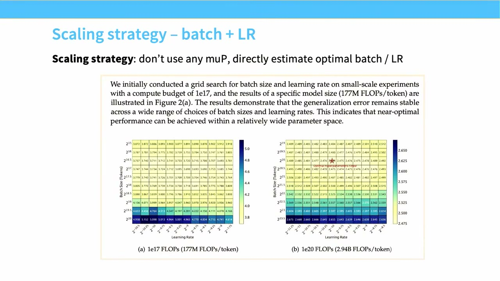

这张图说的是：好，我让 non-embedding training FLOPs 在一定范围内变化。你可以看到这些灰点。随着变化，我的最优 batch size 会变。记住，最优 batch size 是通过看这些大网格并找最小化者得到的。我会得到看起来像一条线的东西。最优 batch size 应该随 non-embedding FLOPs scaling。最优学习率也一样：在 non-embedding FLOPs 范围内得到一堆灰点，然后可以拟合一条线来估计最优学习率应该是什么样。这相当不错。我要指出一点：他们的完整运行在星星上，这些是他们选择的运行。在更高 FLOPs 下，他们有高得多的 batch size 和低得多的学习率。星星是他们实际为大运行跑的东西。batch 的拟合看起来合理，确实像一条线。学习率那个——我不太确定那是不是我一生中见过最好的线性拟合，但我想它能用，大概没问题。模型确实训练了，确实得到了合理结果。我觉得这是学习率方法的一个缺点：不太清楚的是，如果你做这种网格搜索，除非网格正好在正确位置，否则会有很多量化误差，然后你就得不到很好的 scaling law 拟合，最后得到看起来像任意线性关系的东西。

*[19:30](https://www.youtube.com/watch?v=vTfEyOyzV9E&t=1170)*

哦对，有人问：为什么同样数量的训练步数，你会得到多个数据点，而且最优值范围很大？为什么不同训练 FLOPs 下最优学习率范围很大？这是问 y 轴吗？是的。我认为原因是因为模型大小的变化等等。2024 年的时候，我觉得每个开放模型构建者都在复现整个 scaling law 栈。所以 DeepSeek 也补充了学习率分析，基本上就是 Chinchilla 复现。为此他们也和 MiniCPM 一样，遵循 WSD 风格学习率。他们有一个奇怪的小变体：做两个 decay 阶段而不是一个。我不太确定为什么，后来这也没有流行起来，但他们确实这么做。不管怎样，这里的要点是：WSD 是有效方法，可以用它复现 Chinchilla。DeepSeek 的 scaling 曲线比 MiniCPM 好得多，因为他们选择做 IsoFLOPs。所以他们得到非常干净、漂亮的 sweep，跨固定 FLOPs 范围；也得到相当干净、漂亮的 Chinchilla 式权衡。

*[21:05](https://www.youtube.com/watch?v=vTfEyOyzV9E&t=1265)*

这让他们基本复现 Chinchilla 结果，并得到类似的数据模型 scaling law。我展示这个的真正要点只是说：看，Chinchilla 定律已经被其他人在较大计算范围复现了。所以那个分析总体是可靠的。最后，我觉得这是——我有点难过这种图现在在开源发布论文里有点罕见了，但这真的是很多 scaling law 工作的最终 punchline。你训练一堆小型的、精心挑选的模型，在较小计算范围，然后画出幂律。最后，如果你外推足够远，会得到和现实相当接近的东西。所以两颗星星是他们实际训练的模型，灰点是 scaling law 拟合。他们对星星的预测相当好。虽然可以更好，但一点也不差。所以他们能够在真实训练的开源模型上得到相当准确的 scaling law 预测。

*[22:08](https://www.youtube.com/watch?v=vTfEyOyzV9E&t=1328)*

我在这里停一下。如果对 DeepSeek 的东西有问题，尽管问。我一句话总结这里：这是处理敏感超参数的另一种方法。你可以尝试稳定它们，或者你可以直接用 scaling law 拟合它们，然后按 scaling law 来。DeepSeek 代表的是更偏向拟合 scaling law 的方法。

*[22:32](https://www.youtube.com/watch?v=vTfEyOyzV9E&t=1352)*

## 更多开源模型的 scaling 实践

好。还有其他模型，更近的模型，有不错的 scaling law。但如我之前所说，我认为很多这类工作现在——怎么说——所有人都知道了。所以没人再把很多东西放进论文的大章节里。比如看 Qwen 2.5，他们会说：我们需要调一些最优超参数，比如 batch size 和学习率，所以我们做一堆 scaling 实验找出最优，然后有 scaling law，预测最优，甚至对 MoE 也能这样做。所以这基本和 DeepSeek 分析一样，Qwen 2.5 在讲。Qwen 3 也一样。到 Qwen 3 时他们说：我们在 Qwen 2.5 已经搞清楚怎么做了，现在完全一样。所以这已经成为非常标准 recipe 的一部分，用来确定最优学习率和 batch size。

*[23:34](https://www.youtube.com/watch?v=vTfEyOyzV9E&t=1414)*

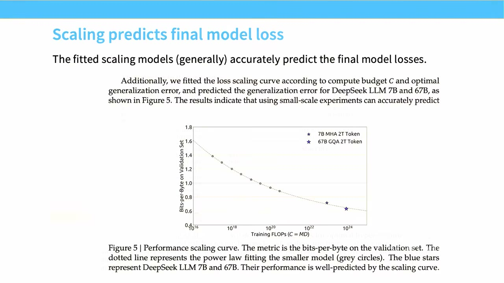

Kimi K2 可能是我要讲的一系列论文里最新的。到这里我快速过几篇论文，给你们一个概览：开源模型发布中人们在 scaling 工作上做什么。Kimi K2 和其他几个聚焦 MoE scaling laws。现在是 2026 年，大多数人都知道怎么做 Chinchilla scaling law，甚至学习率 scaling law。有什么新东西？很多公司现在转向 MoE，完全转向 MoE。如果做 MoE，你真的很想知道：我训练的活跃参数量对吗？所以他们做比如变化 FLOPs，看 loss；对不同稀疏度做这件事，从而搞清楚稀疏度如何帮助或伤害 loss。结论当然是：看不同稀疏度，网络越稀疏，给定 FLOP 下验证 loss 越好——不意外。但能定量知道稀疏度和 loss 的关系，意味着可以更理性地决定模型里放多少稀疏度。他们看了之后说：我们要用 48 的稀疏度，因为到那个点 scaling loss 开始收益递减。所以你可以看到这类分析如何用来 justify 不同开源发布中的架构决策。

*[25:04](https://www.youtube.com/watch?v=vTfEyOyzV9E&t=1504)*

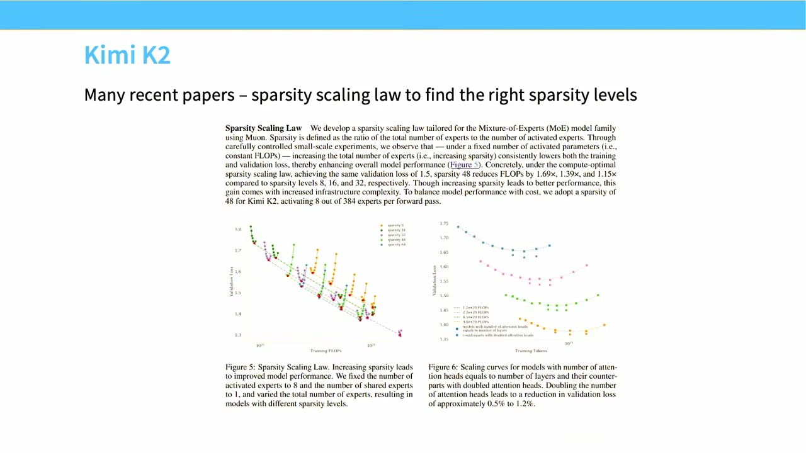

Hunyuan 是几年前另一个开源 MoE，他们做非常类似的事。我觉得每个公司一旦转向 MoE，都必须做这种 MoE scaling law，来搞清楚激活参数量或稀疏度如何改变训练 loss。然后他们会重做很多这类分析。比如 Hunyuan 的情况，他们最终得到每活跃参数 96 个数据点的比率。他们固定稀疏度水平，所以那不是他们搜索的东西。LLaMA 3 也有一些不错的 scaling laws，不幸的是不是特别有用。他们做 IsoFLOP 式 scaling，得到略有不同但类似的 token 与模型比率。LLaMA 3 在 scaling 方面最有趣的是右边这张图：左面板是通常的 scaling law，说的是如果我有更多 compute，那么 benchmark 答案上的 logprob 会持续衰减。右边显示：如果你有更好的 log loss，下游准确率也会上升。所以他们基本在说：我们可以对这些紫色点拟合一个 sigmoid，这可能让我们了解不同模型有多好。你可以看到它们系统性地偏离曲线。所以我不确定我是否会相信这条曲线是唯一真相，但你可以肯定它和从 loss 到准确率的 sigmoidal scaling 映射一致。这很有用，因为我们之前只谈 log loss，但在一些情况下、很多情况下，log loss 和下游准确率之间有紧密耦合。

*[26:53](https://www.youtube.com/watch?v=vTfEyOyzV9E&t=1613)*

最后我要讲的一篇 scaling 论文是去年的 MiniMax-01。他们有一组很好的 scaling 实验，做的正是我两讲前说过的 scaling 的有用 affordance：架构变体。他们想理解：我有 lightning attention，某种线性注意力架构；我有 softmax 版本，也就是 full attention；还有混合版本。这些东西如何 scaling？如果放大，会不会其中一个变得差很多？你可以看到，他们基本复现 Kaplan 图：随着 FLOPs 增加，学习曲线如何变化；不同架构在不同 compute 水平下需要的参数量是否不同。答案大体上是否定的：hybrid、lightning 和 softmax 大体可比，需要相似的模型大小。这组图被用来 justify 他们在实际部署系统中使用混合架构。所以这正是你会基于 scaling law 做的决策。

*[28:09](https://www.youtube.com/watch?v=vTfEyOyzV9E&t=1689)*

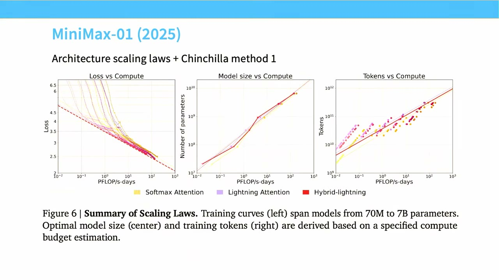

这基本就是我想讲的近期各公司 scaling law recipe。如之前所说，DeepSeek recipe 的关键是 batch 和学习率的 scaling 分析，这是 scaling-based 方法。MiniCPM 更偏向 muP 风格方法，试图获得不变性。然后我们看到一些趋势：Kimi、Qwen、Hunyuan 等在转向 MoE 时做 MoE scaling 实验；MiniMax 做架构工作；还有几个其他模型复现 IsoFLOPs 分析。回到之前的点：我认为很多公司现在细节更少，因为核心 scaling 机器，比如做 Chinchilla 或学习率 scaling，现在每个人都相当理解了。所以对这些发布来说，展示这些实验不一定有额外价值。或者至少这是我猜为什么发布里这类实验少了很多。

*[29:12](https://www.youtube.com/watch?v=vTfEyOyzV9E&t=1752)*

好，我休息一分钟，然后停下来让你们消化并问一两个问题，如果这部分有问题的话。有人问：所有这些覆盖的都是预训练阶段。我的问题是，当 post-training 成为模型开发的标准流程后，什么会变，什么不会变？这个问题是关于 post-training 时这些东西会怎么变，或者广义上你怎么考虑 post-training。我认为这仍然是一个大开放问题。没有很好的方法做完全整合的、把 post-training 考虑进去的 scaling，因为 post-training 有时真的会改变你应该做什么预训练。我能想到最接近考虑 post-training 的，是一些关于理解预训练中 coverage 或 diversity 概念的工作，用来预测 post-training 会发生什么，但仍然很早期。我不认为对“如何与 post-training 协同”这个问题有好的答案。

*[30:25](https://www.youtube.com/watch?v=vTfEyOyzV9E&t=1825)*

## 超参数 scaling：StepFun 的大规模网格搜索

好，现在讲另一部分。我认为 lecture 剩下的两部分干净地对应两个例子。我会讲一类方法，关于学习率、batch size 和优化器的 scaling laws。这对应 DeepSeek 看待世界的方法。然后我会讲 muP 的东西，那是 MiniCPM 看待世界的方法：我们能不能重新参数化一切，让我们不必担心 scale？现在先讲 DeepSeek 方法：如何正确地 scale 学习率。这里有一个超参数部分和一个优化器选择部分。我会大量引用 StepFun 最近的一篇预印本。我不认为有一篇非常可靠、稳健的超参数研究，尤其是学习率，但这篇可能接近了。StepFun 训练可信的大模型并发布，他们在这项 scaling law 研究里烧了大量 compute 做超参数空间网格搜索。我会过一遍，展示一些有趣的经验现象：学习率、batch size 等如何影响下游 loss。

*[31:51](https://www.youtube.com/watch?v=vTfEyOyzV9E&t=1911)*

很多人谈过很多不同的、大致作为 compute 函数来 scaling 学习率和 batch size 的方式。StepFun 这篇超参数调优论文——不是 survey 论文——有一个很好的表格总结了很多。我要指出几点。有些我们已经知道。最上面一行是 OpenAI scaling law，来自 Kaplan。看 batch size 那列，写着 2e18 乘 L 的指数。那是关键 batch size，基本是说：你应该把 batch size 作为 terminal loss 的函数来 scaling。很好。DeepSeek 我们刚看过，这是基于 compute 的 scaling law，对学习率和 batch size。还有其他人提出各种 scaling，包括我们讲过的 MiniCPM。另一个重要点是：这些学习率和 batch size 公式甚至没有相同的输入。人们似乎都不同意哪些变量应该影响学习率。OpenAI 那个是 terminal loss，而 StepFun 的人声称正确的 batch size scaling 是数据的函数。所以关于超参数 scaling 的本质有很多分歧。我讲的时候会说：即使最后一行也不要当作 gospel。很多东西在很多方面很脆弱，但实验和现象是你可以很好学习的。

*[33:28](https://www.youtube.com/watch?v=vTfEyOyzV9E&t=2008)*

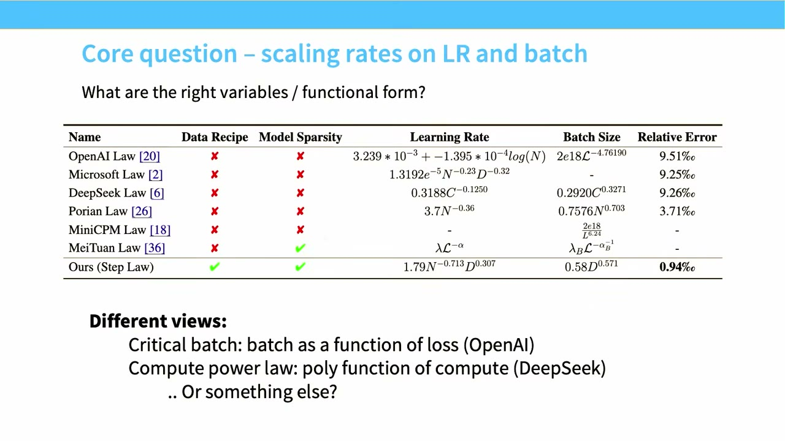

这篇论文的设计和 DeepSeek 很像。他们训练大量模型，网格化学习率空间和 batch size 空间，跨一系列模型大小和数据集大小。这样做，他们希望能饱和小模型的超参数空间，然后确定最优是什么。和 DeepSeek 设计很像，网格化空间后——这个案例里他们有一个等高线图。底层对象只是：跑一堆模型，最小化 loss。等高线图很好看，我觉得可视化很好。他们跑了相当高分辨率的网格。多亏如此，我们可以看到他们能画出超参数空间相当高分辨率的等高线。这个案例是 1B 参数和 100B token 的一个切片，我想。右边你可以看到那个曲面就是超参数 landscape：作为 batch size（一个轴）和学习率（另一个轴）的函数，固定总数据量和模型，loss 如何变化。我们看到每个切片，如果固定 batch size 或固定学习率，都相当凸，甚至几乎平滑。这很好，因为这意味着你可以相当好地搜索最优超参数，可以确信最小值不会太远。如果很锯齿，你可能会严重怀疑这种网格化空间的项目是否可行。这也应该给你一些关于超参数空间平滑性的直觉。

*[35:20](https://www.youtube.com/watch?v=vTfEyOyzV9E&t=2120)*

我认为这里其实有一个非常有趣的一般 scaling 趋势。看这个主题的其他相关论文，我不确定是否见过相反证据。我觉得一件非常有趣、也是这项工作的关键 takeaway 是：看最优 batch size，似乎唯一依赖的是你训练用的总数据量。看右边这张图。x 轴是训练数据量。不同颜色的点是不同模型。注意不同颜色的点似乎遵循大致相同的趋势线，相当可预测。这是 log-log scale，所以你应该预期某种作为 D 的函数的幂律。左边面板是学习率的依赖。我们看到非常不同的行为。从蓝色一直到右边粉色，更大的模型有更小的最优学习率。更大量的数据有更高的最优学习率，这实际上反直觉。所以这可能有点脆弱。有其他论文认为对 D 的依赖应该反过来。但这里的趋势至少在这个实验中很清楚。

*[36:45](https://www.youtube.com/watch?v=vTfEyOyzV9E&t=2205)*

最后我想指出，学习率实际上相当稳健。我认为这被很多人的经验和实验支持。人们大概有一种感觉——其实可以做个小调查，大家知道好的超参数是什么吗？如果你明天被要求训练一个语言模型，会是 1e-3 还是 1e-4？我觉得我们大致有感觉，实际上学习率的这个范围通常是一个好的起点。这大致是真的。所以他们得到的 scaling law 在某种程度上也能迁移到 MoE。黄色星星可能有点难看清，是他们的 scaling law 预测。红色叉是直接在 MoE 上推导出的最优值。所以你切换到 MoE，只要大致控制活跃参数，不会得到非常不同的 scaling law。一个似乎更潜在 dicey 的事情是：当你改变训练数据，最优学习率和最优 batch size 确实会稍微移动。这意味着所有这些现象都可能是 contingent 的。这些 scaling law 里的具体数字，可能比其他东西更依赖你训练的数据。

*[38:04](https://www.youtube.com/watch?v=vTfEyOyzV9E&t=2284)*

在我继续之前，我想再闪回一下。最后你会得到一些简单的 scaling law：batch size 可能大约应该是数据量的平方根乘某个常数；学习率应该随 batch size 上升，或随数据上升，但随模型大小下降。这是个令人惊讶的效果，但也许不疯狂，因为这些实验常常假设 Chinchilla 式 scaling，那样的话这两者会抵消。随着 compute 增加，学习率应该下降。希望那个 Chinchilla 评论是清楚的。我的意思是，当你按 Chinchilla 缩放时，N 和 D 都由 compute 驱动。随着 compute 上升，你预期学习率下降。所以你最终会得到像 DeepSeek 定律那样的东西：学习率随 compute 下降，batch size 随 compute 上升，尽管指数和 DeepSeek 定律不同。

*[39:03](https://www.youtube.com/watch?v=vTfEyOyzV9E&t=2343)*

好。某种意义上，这是 DeepSeek 分析的最新、最大规模版本。如果你走 scaling-law 风格方法，这就是你处理拟合学习率问题的一种方式。超参数故事就到这里。如果有人有问题，随时打断我。然后接下来，我会讲优化器。我想这是我在架构讲座里没时间讲的东西。那节课已经很满了。但如果我不讲优化器，那是一种失职。优化器是 scale 依赖的，所以这是讲它们、讲最新最伟大的优化器发展及其与 scale 关系的好地方。

*[39:55](https://www.youtube.com/watch?v=vTfEyOyzV9E&t=2395)*

哦，有人问：我试图理解怎么解释这个。这是不是意味着我们应该直接拿已有的 scaling law 来用，而不是自己跑网格搜索？问题是——哦对不起，我得为线上的人重复一下——是我们应该直接拿 scaling law 来用，还是自己跑网格搜索？这取决于你有多少 compute 预算，以及你需要调得多准。我确实认为，比如 StepFun 定律——如果你处在合适的 compute regime，接近他们跑网格的地方，这些可能是很好的默认值。我会赌这些，而不是我凭空想出来的东西。话虽如此，如果你做自己的大预训练，你可能有小差异。有人可能说：我真的很相信我们应该有大 weight decay。我的架构有大 weight decay。我们不一定知道这些东西会同样 scaling。所以你可能想重新做很多。这就是为什么我给你们看的很多报告都在重做 Chinchilla、重做所有这些东西，因为有足够多的小差异，人们想检查并确保他们与这些结果大致一阶一致。我觉得这会在接下来优化器部分再次出现。我之前和 [MUTED] 聊过这个：scaling law 有一种很科学的感觉，像是拟合这些线并外推。但最终，scaling law 很大一部分仍然是 vibes。就是，我真的相信这个 StepFun survey 的实验设置和我的足够相似，能迁移吗？我们不可能完全知道。总有微小差异。

*[41:39](https://www.youtube.com/watch?v=vTfEyOyzV9E&t=2499)*

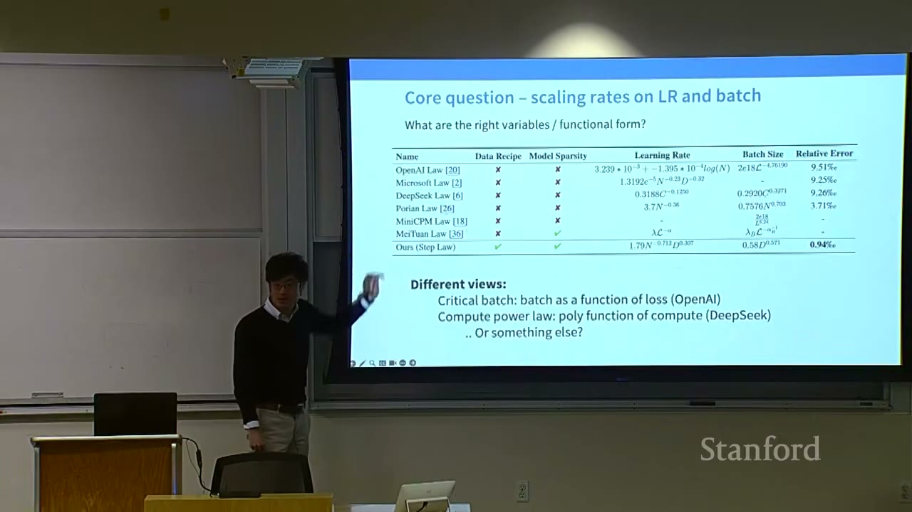

## 优化器：小规模增益能否外推？

好，现在讲优化器。我觉得 LLM 优化器，甚至一般深度学习优化器，过去一两年有一些非常激动人心的发展。所以现在讲它们是很激动的时候。我想从一个故事开始，这个故事也许能引出这一小节，就是这边的比较，或者我们先看左边面板。这来自 NanoGPT speedrun，启发了我们的作业 1。在那里你有一个非常小的模型，训练时间相当短，你想尽快达到 3 点几的 loss。很多人在这个 benchmark 上爬山。我认为这个 benchmark 上更引人注目的一件事是，一个叫 Muon 的 benchmark——不对，叫 Muon 的方法，紫色这边，相对 Adam 蓝色取得了非常显著的增益。就在绿线下面。你可以只看绿线和紫线之间的差距。你会说，哇，仅仅把优化器换成 Muon 就有很多大增益。而且它甚至不比 Adam 慢，比 Adam 慢得多。那太好了。但然后有个问题：这东西在大规模上真的好吗？然后你跑一些 scaling 研究，也许它们不那么好。这是研究里非常棘手且重要的一部分。我们有一个小规模实验，有一个肯定 scale 依赖的东西，比如优化器。我们在小规模看到很大增益。大规模怎么办？比起提供坚实、具体的处方，我更想提供一个故事，让你了解我们能做什么，以及哪些东西我们不一定能知道。

*[43:27](https://www.youtube.com/watch?v=vTfEyOyzV9E&t=2607)*

其实，在我讲下一张幻灯片之前——这种事一直在发生：你小规模想出很棒的东西，大规模可能就不行了。所以区别是什么？我会花几张幻灯片讲 Kaiyue、Tengyu、Percy 和 David 的论文，基本是做大模实验比较优化器，试图更好地做这个比较。从那里可以学到很多关于 scaling 和其他东西，但也有很多标准深度学习的东西。有很基本的事情：不同模型的超参数不同。所以如果你扩大规模，它们甚至可能有不同的 scaling 指数。所以你必须把 Adam 调得很好。如果你调得不好，会得到更暗的棕色线。你会说，哇，这东西比左边所有其他算法差多了。但然后你把学习率改一点，你会说，哇，其实我所有增益都没了。右边类似：你可能把学习率调好了，但还有其他东西比如 weight decay 没调到最优。如果你用同样的 weight decay，那么对于绿线你肯定会得到差很多的结果。如果你选这个小 weight decay，绿线会比选最优 weight decay 差很多。所以有各种相当棘手的事情在发生，技术上不是 scaling 问题，但是非常重要的一般经验机器学习问题，我想指出来。

*[44:53](https://www.youtube.com/watch?v=vTfEyOyzV9E&t=2693)*

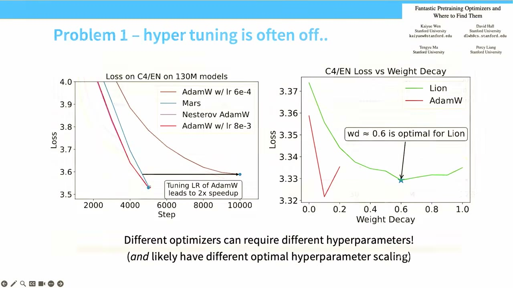

但也许对现在课堂讨论更相关的是这些东西的 scale 依赖。我觉得这是一个很好的案例研究，展示如何真正把算法开发当作 scale 的函数来思考。因为对我来说，思考 scale 时总是有两个变量很重要，这篇论文在很大程度上暴露了两者。一个轴是 compute。如果你固定模型大小与数据比率，两者耦合在一起，那么这里 x 轴基本就是 compute 轴。所以任何时候你做研究，基本就是扩大 compute，看趋势作为 scale 的函数。我们在这里看到，如果看 Adam（按定义是 1.0）和其他替代方案之间的相对加速，Muon 在小规模非常好，增益随着 scale 增加而减小。这不完全是你想看到的图景。另一个轴，如果你做算法开发，应该始终保持警惕，另一个是 Chinchilla ratio。Chinchilla ratio 可以认为是数据量和模型量之间的比率。这是一个非常非常重要的参数，因为有些算法在过参数化情况下工作得好：模型比数据大得多。也许你的算法增加了一些隐式正则化；或者它数据效率低，但由于 compute 原因工作得好。所以有些算法可能在小 Chinchilla ratio 情况下工作得好。相反，其他算法可能在大 Chinchilla ratio 情况下工作得好：每单位参数有很多数据，因为你可以更高效地把知识打包进参数。所以这是一个很大的 confounder。即使我认为在模型大小轴做 scaling 实验卫生很好的论文，也常常忽略、或者没有 compute 去研究 Chinchilla token 与参数比率。结果这经常意外地重要。在这个案例里不重要。这个案例里，你看优化器增益相当一致，不同 Chinchilla ratio 下所有线之间的比率相同。但这不是总是如此。你总是要对这两个 scaling 因素保持警惕。这很重要。

*[47:23](https://www.youtube.com/watch?v=vTfEyOyzV9E&t=2843)*

然后我还要指出，如果你有一个新算法或新设置，建立 scaling 是相当非平凡的。这是我从 Will Held 与 Marin 的工作中拿来的，Marin 是 Percy 的开源语言模型训练项目。他们在那里基本试图证明一组特定超参数。这甚至像是一个新算法：Cautious AdamC，一个 Adam 变体，sqrt batch size scaling 和其他一些看起来标准的东西。他们做的基本是你们在其他论文里见过的 Chinchilla 分析。但因为这不一定是一篇论文，而是一群人在做实验，你不会只发布成功的那个。他们有好处：发布了失败运行。这里的例子是，他们做的基本是标准 Chinchilla 东西，看起来很棒。如果你看这条虚线垂直线，在 10 的 20 次方左右，这是一个看起来非常漂亮的 scaling loft。然后随着 scale 上去，嗯，有点更差；差多了；然后，哇，现在这个运行不再好了。所以它完全爆炸了。这里的要点是：即使看起来很好的 scaling 趋势，跨越很多数量级，也可能突然咬你。它可能偏离线性，然后立刻爆炸。在他们案例中，修复方法是选更仔细的 muP 风格参数化，改优化器，换一种优化器，然后在更多数量级上得到更好的 scaling。但要点是：当我回到这里说，好，你们都该做 scaling 实验，你们应该 scale 所有学习率等等，那并不容易。相当一部分时间你会得到这种图，一切都很糟，你不太确定哪里出了问题。

*[49:18](https://www.youtube.com/watch?v=vTfEyOyzV9E&t=2958)*

## Muon：矩阵优化器与 Kimi K2

好。然后最后我想讲一下 Muon，以及 Muon 故事的收尾。我觉得我必须比之前更详细地讲一下 Muon，因为它开始被整合进大规模模型训练运行。这是很多新研究课题的入选标准：它有没有进过大训练？Muon 现在满足这个条件。它也是一个有趣的算法，所以我会讲几分钟然后继续。在梯度下降里，我们通常有一个相当简单的事情。暂时忽略第 5 行。然后你会得到大致标准的基于动量的优化器。我取梯度，加到 B_t。这是动量步，所以我从之前以参数 mu 继续动量。然后基于这个动量梯度更新参数。非常标准的动量梯度。但然后我觉得真正有趣、至少对我来说有点跳出框框的想法是：梯度有一个性质，它对待所有参数都一样。但我们知道语言模型、甚至深度神经网络里，不是所有参数都一样。有些参数是向量参数，属于 RMS norm。有些参数是矩阵参数，比如 attention 或 MLP 的。矩阵参数可能和向量参数不同。这是这个想法的起点，我觉得很有意思。

*[50:58](https://www.youtube.com/watch?v=vTfEyOyzV9E&t=3058)*

你可以对矩阵参数做的一件事是看它们的谱。它们是矩阵。矩阵有特征值和奇异值。所以你可以对奇异值做事情。Muon 里做的就是相当简单的想法：计算梯度，做动量步。现在我取更新 B_t。不是直接在 line 6 把它应用到参数，而是做 Newton-Schulz 这个操作，具体是 Newton-Schulz 5。它会把 B_t 矩阵正交化。我把操作写在下面。假设我取 B_t，写成奇异值分解 USV^T。然后让所有奇异值变成 1。如果奇异值很大，就缩回单位；如果很小，就扩大到单位。然后取 UV^T，这就是我要应用的新更新。如果你想要直觉，而你已经有类似 Adagrad 或其他、甚至 Adam 的直觉：在 Adagrad 或 Adam 里，你会除以梯度的大小，所以每个坐标大致同样大小。在 Muon 里，你是在谱范数里操作，所以每个方向都变成单位大小。注意这只对矩阵有意义。我只能对矩阵值的 B_t 定义奇异值分解这个概念。所以 Muon 有趣之处在于它是矩阵优化器，你把它应用到矩阵值参数。对于向量值参数，你可能仍然用 AdamW 之类，因为它们和 Newton-Schulz 项没有交互。而且 Newton-Schulz 是那个操作的近似，只用矩阵乘法，所以系统高效，不是精确正交化。

*[52:48](https://www.youtube.com/watch?v=vTfEyOyzV9E&t=3168)*

但好，为什么我花这么多时间讲 Muon？首先，它对 NanoGPT speedrun 这类东西非常强大。它就是在这些场景中被发现的。所以你可能认为它工作得好。如上一张幻灯片所说，有一些 scaling 研究认为 Muon 的增益随着 scale 增加而减小。但然后我想收尾这个故事：刚开始出来时，我想，哇，Muon 很有趣，不知道有没有人会 scale 它。然后 [INAUDIBLE] 等人 scale 了 Muon。他们说，也许它工作得不是特别好。我以为故事到这里就结束了。我想，也许这事完了，没人会花大 compute 把这个东西 scale 到完整预训练规模。然后 Kimi K2 出来了，整个模型都用 Muon 训练，完全用 Muon，加了一些 bells and whistles 防止 Muon 爆炸。他们发现了一堆不稳定问题。但 Kimi K2 是一个极其好的模型，非常好的模型，训练曲线看起来合理。所以这真正说明：Muon 在大规模上可行。它比 Adam 好吗？Kimi K2 当然没有 ablation，所以我们不知道那个规模下如何。但它肯定是一个有效且可行的方案。

*[54:11](https://www.youtube.com/watch?v=vTfEyOyzV9E&t=3251)*

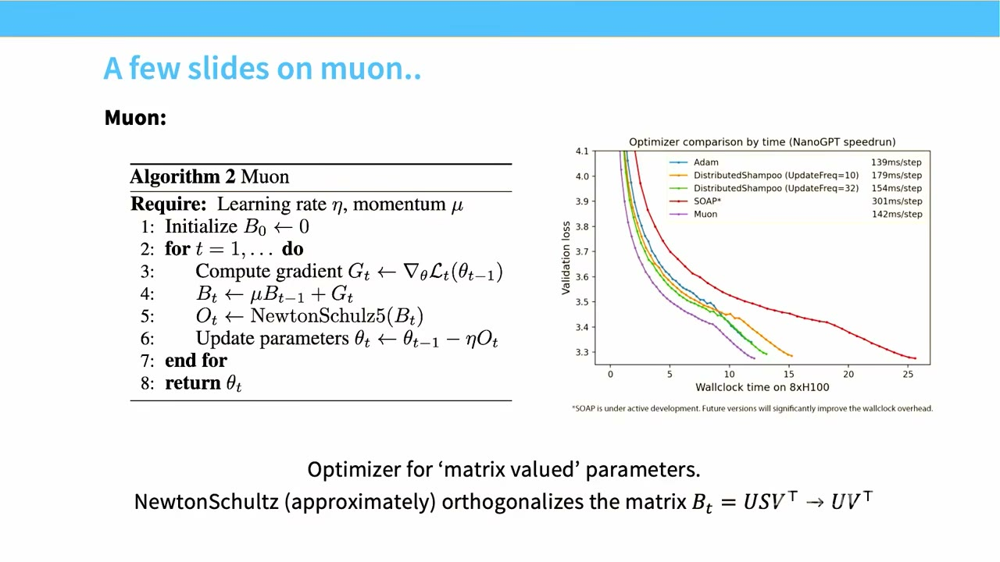

所以这个故事的意义是什么？是说真的很难判断某个东西是否在大规模上有效。非常非常难。但到目前为止，很多小规模实验并把它们转移到大规模，是我们做科学的方式。所以你仍然想尊重 NanoGPT speedrun 这类东西。我们从那里学到不少，得到好想法。然后最终它们会进入大模型。我们会看人们是否继续在大规模做 ablation，真正确定 Muon 是否优于 AdamW 等等。这些是有趣的问题，我们还没有答案。

*[54:44](https://www.youtube.com/watch?v=vTfEyOyzV9E&t=3284)*

好，我在这里暂停一下。这是优化器部分的结束。我想确保大家没问题，尤其因为我讲的是 Muon，这是一整罐新虫子，之前没怎么讲过。有人问：SVD 在 GPU 上快吗？SVD 在 GPU 上不快，但他们不做 SVD。他们做的是 Newton-Schulz。Newton-Schulz 是一个只用矩阵乘法的有限迭代算法，近似正交化矩阵的过程。所以这里有几点聪明之处：一是把它当作矩阵本身来处理的想法；二是正交化的想法；三是用 Newton-Schulz 做这件事的系统层面。这些都是重要、有趣的部分。后面还有人问：非平凡的超参数是否不同？这里的超参数——不，它们是不同的。我认为有几个人在做 Muon 风格的工作。其中一个比如 Jeremy Bernstein，我理解他一直在说：其实每一层都应该有自己的学习率。我觉得终极极限是——甚至说每一层都应该有自己的优化器。终极极限是说，transformer 里每个参数都不同，为什么不对每个参数用不同的优化器？那你也得为每个参数调超参数，这可我不想做。但那也许是优化的未来。还有人问：关于学习率和 batch size，你只考虑这两个，选最好的，然后用它调其他东西。但这些会相互作用吗？我理解的版本是：很多人只调学习率和 batch size，在网格上做。但大概这些东西会和很多其他超参数交互。你不担心吗？总的来说，是的，你担心超参数交互。但现实中它们指数增长，你不能网格化整个空间。所以人们通常做的是网格化最令人担心、最敏感的东西。学习率非常重要。如果你调东西，学习率是最重要的。所以他们会很激进地调学习率。然后像 weight decay，之后可能做单变量 sweep，使其局部最优。

*[57:19](https://www.youtube.com/watch?v=vTfEyOyzV9E&t=3439)*

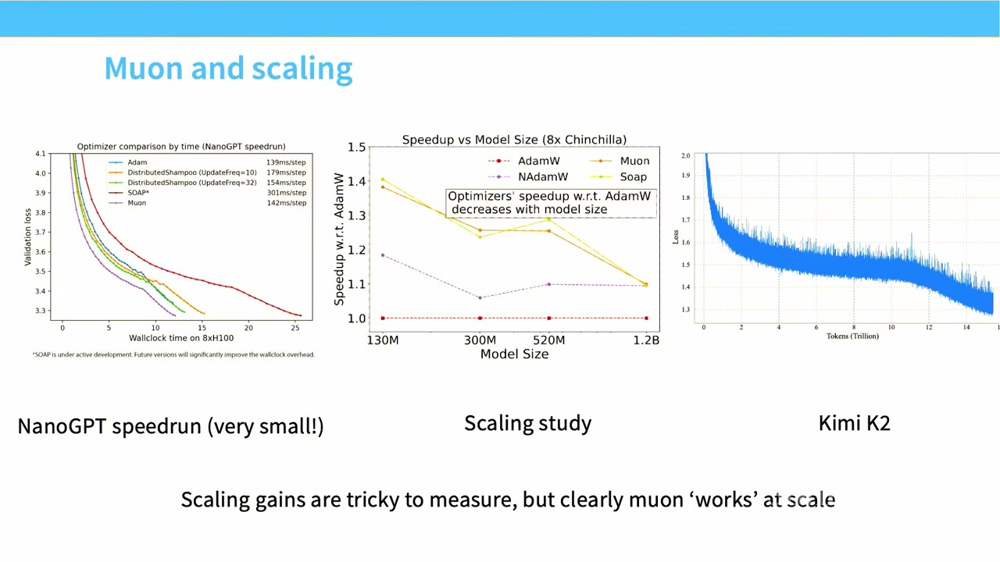

## muP：让最优学习率不随规模漂移

好，lecture 最后一部分是讲 muP。muP 有点神秘。即使有很多论文，甚至很多实现，我不认为他们都同意底层数学是什么，或者底层实现应该是什么。但有一组核心思想是共享的，而且看起来总体有效。所以我会讲我对整个 program 的解释。目标 hopefully 很清楚。这张图就是目标：如果我们增加模型大小，这里只是宽度，我们的最优学习率通常会偏移。但理想情况下，我们希望最优学习率无论怎样都相同。这就是我们想玩的游戏。我愿意调的旋钮是：我愿意逐层改初始化；我愿意逐参数改学习率；然后我有时愿意根据模型大小缩放残差连接之类的东西。这就是我想玩的游戏。

*[58:27](https://www.youtube.com/watch?v=vTfEyOyzV9E&t=3507)*

它在实践中效果如何？有几篇论文相当广泛地研究了这些。Cerebras 是一家真正的芯片公司，也拥有一个语言模型训练部门，由 Hestness 运营，他因 scaling laws 论文而闻名。我觉得他们做的事情很有趣，因为他们现在正在写大量关于语言模型 muP scaling 的论文。他们几年前就有了 Cerebras GPT，当时他们用通常的 Chinchilla 配方训练 0.1 到 13B 模型，但也包括 muP 变体，用来尝试更有效地调优超参数。我认为其中一个好处是，他们发现如果使用 muP 参数化，那么他们的 scaling law 拟合通常更稳定。他们预测的 muP 趋势对于实际模型几乎完全准确。而我认为他们的非 muP 模型在损失预测方面波动要大得多。所以他们的主张是：OK，muP 可能是一个非常好的想法。所以这在大规模上得到了验证。你看到了 MiniCPM 等。很多人用 muP 变体训练了模型。

*[59:51](https://www.youtube.com/watch?v=vTfEyOyzV9E&t=3591)*

我也可以谈很多关于训练或用 muP 训练的模型的例子。但我觉得也许对我来说更有趣的是现在实际谈 muP 的概念基础和数学。如果你对此感兴趣，并且想读一篇相对易懂的论文，我会推荐这一篇。这是我认为对我最清晰的论文。有几篇论文。Greg Yang，他开始了这个研究项目，有一系列论文，我称之为张量程序（tensor programs）。我觉得它们有些难以理解。Jeremy Bernstein，他也参与了 Muon 相关工作，写了这篇不错的——不是回顾论文，像是一篇综述论文，把它放进了不同框架中，我认为这非常易懂。还有一些物理学家写的论文，在解释 muP 是什么方面也很有趣。Cerebras 的人也做了一些。但不管怎样，回到这篇论文，muP 的核心思想基于两个断言。这是一种非常物理学的思考方式。

*[60:36](https://www.youtube.com/watch?v=vTfEyOyzV9E&t=3636)*

如果我把网络做大——假设现在只改宽度。我把网络宽度做大。我会断言两个不变量在 scaling limit 下应该成立。第一，初始化时的激活——如果我初始化模型，输入一些随机数据，激活应该大致保持相同大小，作为网络的函数。如果它们随网络大小爆炸或缩到 0，我就选错了参数化。这有道理。我的激活应该大致保持相同 scale，不管网络多大。第二，经过一次梯度步后，激活的变化应该是 O(1)。这就是人们所说的特征学习（feature learning）。特征学习意味着如果我走一步梯度，网络里的东西会发生显著变化，而且这个变化量应该是网络宽度的固定函数。如果你们有人是理论家，可能熟悉神经正切核（neural tangent kernels）。神经正切核会有非常不同的行为。那些情况下，激活的变化实际上会随网络宽度消失。你不想要那样，因为你确实想让网络变化、学习特征、做事，即使在大神经网络极限下。所以这两个是不变量。它们有道理。它们基本是在说，激活和激活的变化应该随网络宽度大致保持相似。注意，我有时会在单个激活和范数之间来回切换：如果每个激活大致 O(1)，整个激活向量的范数应该是该层隐藏单元数的平方根。

*[62:29](https://www.youtube.com/watch?v=vTfEyOyzV9E&t=3749)*

好，这是主要东西。muP 有趣的地方在于，它从一组非常简单、可接受的假设开始。你们可能都同意这是合理的事情。然后我们会做很多额外强假设。但最后，我们会得到一组非常简单的 scaling 规则。记住，我们想要确保初始化时激活大致是单位。那怎么做？如果我们有一个简单的深度线性网络，把所有初始化为 sigma 平方缩放的 Gaussian，那么这个矩阵的谱范数是什么？你可以写下来。我不会要求你们验证，但那是随机高斯矩阵算子范数的标准矩阵集中论证。然后注意，在某些 regime 下，fan-out 我认为不比 fan-in 大很多时，你会得到层输出类似层输入乘算子范数。这总是一个上界，但在某些高维 regime 下是近似。现在如果这是真的，我们能做什么？我们可以解出 sigma，试图让激活在所有层、所有宽度下保持一致。想象在层 L-1，我有 sqrt(L-1) 激活。记住，这符合这个记号：至少对整个向量，我应该有 sqrt n_L。这是归纳的基准情况。然后归纳步骤说，记住我在层 L 有这个算子范数，它是 fan-in 和 fan-out 的函数。所以如果我选一个特定 sigma，这就会等于这个。假设这是 ansatz。我假设这是答案，然后看归纳会发生什么。如果我选这个作为假设，把它代入 sigma，注意我得到算子范数的比率是这个，fan-out 比率除以——对不起，sqrt fan-out 除以 sqrt fan-in。然后把它代回这里。然后我会得到输出范数等于我层里单元数的平方根加上一些低阶项，我不打算追踪。所以这个 sigma 从哪来——我是从帽子里抽出来的。但我们可以验证，如果把这个噪声初始化代入公式，那么基本上在每一层，激活大小大致等于该层隐藏单元数的平方根。这里有一些假设，比如这个近似等于。但这大体上是一组合法的假设。

*[65:15](https://www.youtube.com/watch?v=vTfEyOyzV9E&t=3915)*

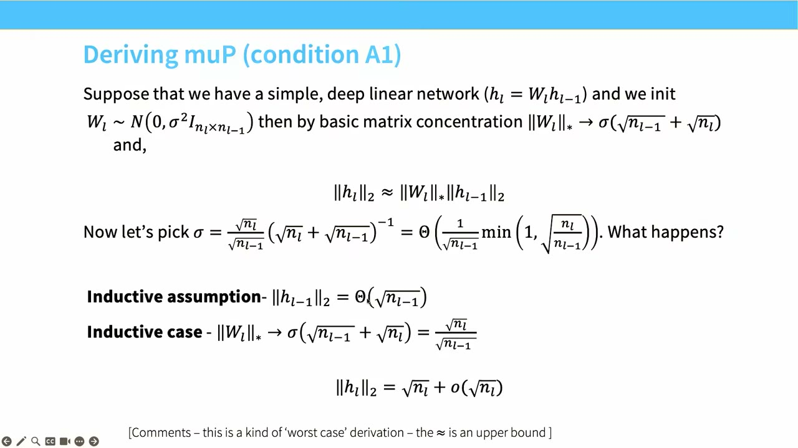

条件 A1 相当简单。条件 A2 说实话更麻烦一些。我们现在需要处理更新。我只考虑 SGD 对线性神经网络、深度线性网络的单样本批次情况。这会是什么样？对于特定层 L，权重变化——如果你想想它会怎样，会是 loss 梯度和激活之间的 rank 1 更新。这是因为反向传播的行为。前向是 rank 1 乘法，反向会是 rank 1 外积。所以这是权重变化。那么那一层激活的变化是什么？激活变化——我取 h = W 乘 h_{L-1}，展开它，展开成这个公式。这正好是层 L 激活的变化。它会有两项：一项是来自层 L-1 激活变化的直接项，另一项某种交叉项，是因为我的权重变了，而不仅仅因为上一层激活变了。所以更新有两项。这是层 L 激活的变化。现在我要做的是逐个看这三项。我希望这三项都有相同数量级，我希望那个数量级是 sqrt n_L。为什么？记住，如果我回到两页前，A2 想要的条件是：经过一次梯度步后，激活变化应该是 O(1) 或 omega(1)。所以如果我想让那成立，那么那个层的范数应该是 sqrt n_L。为此，我希望这三项每一项都有那个数量级。如果这是真的，而且没有抵消，那么这就会是正确数量级。你可以看到 sketchy 的部分在累积。我们假设没有抵消等等，但这给了我们一些有趣的方式来思考每个对象的量级。

*[67:25](https://www.youtube.com/watch?v=vTfEyOyzV9E&t=4045)*

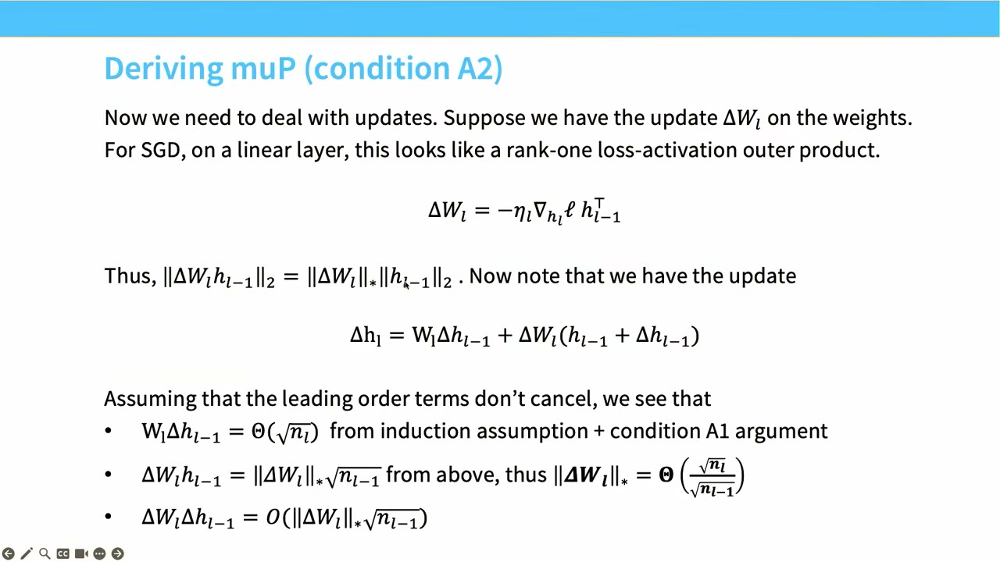

到这里，正确的思考方式不是“Tatsu 坐在这里做严格数学”。我在这里做的基本是追踪所有项的所有数量级。我在说，给定我们的假设，这些大致应该有多大。这是物理学家的数学。没有冒犯物理学家的意思。这就是物理学家这样发展出来的。好，现在——对不起，回退一页让这一切清楚。第一项几乎来自假设。这是归纳假设。我们假设 delta h of l-1 有正确数量级。所以这是免费的。其他两项更棘手。我们有这些项，乘权重变化的算子范数，再乘 sqrt L-1。因为这两项就是这两项的数量级，我们知道这个 delta L 需要多大。我们可以解出这个，因为我们知道左边需要是 sqrt L。然后我们有这一项，所以解出算子范数。这正是这个量。所以这是下一张幻灯片的目标。我想弄清楚什么样的学习率会给我一个更新，大致按 sqrt fan-out 除以 sqrt fan-in 缩放。那就是目标。如我所说，选好学习率后，这大致应该成立。

*[68:49](https://www.youtube.com/watch?v=vTfEyOyzV9E&t=4129)*

那我们怎么做？我们会再做另一个假设。这可能是最不可接受的假设，在我看来：我们假设 loss 更新会按单位缩放。换句话说，我们假设模型实际上随 scale 做出了某种可观的、非平凡的进展，而且这大致相似。我不太确定这对我来说是否可接受，但这是另一个假设。我们把它扔进去。但现在这个假设的要点是：如果这是真的，剩下的数学会非常干净地解出来。因为 loss 的变化是梯度和权重变化量的乘积。这是泰勒近似。然后因为这是 rank 1，我可以把这个东西重写成 Frobenius 范数和算子范数。所以这个右边现在允许我们得到我们想要的。这是 O(1)。这一项我们想要 sqrt n / sqrt l-1。就是右边这一项。最后我有这个梯度 L 项。这会是 sqrt N_{L-1} / sqrt n_L。然后现在我需要什么 eta？我需要的 eta 是解这个量，也就是这两个东西的比率，即 n_L / n_{L-1}。所以我们做了一个假设，左边是 O(1)。然后我们解出了所有量，最后得到层的学习率的 fan-out 除以 fan-in 比。一个旁注：对 Adam，由于其中一些变化，你会得到 1 / n_{L-1} 的 scaling，我会在这里提一下。

*[70:24](https://www.youtube.com/watch?v=vTfEyOyzV9E&t=4224)*

所以我走了一遍一堆希望看起来直观的 scaling 论证，针对各种组件。但最后，也许你感兴趣的是：这意味着什么？这对我有什么用？这意味着我们会稍微改变设置初始化和学习率的方式。所以我们的初始化看起来会像——对于 muP，蓝色框是我们要做的。我们的初始化会是 1 / sqrt n_{L-1} 乘一个组件，这个组件是 1 / sqrt fanout/fanin。如果这个比率是 1，那么这等价于通常的初始化。这是标准参数化。但如果这个比率不比 1 小，你会得到基本不同的东西。你会得到更接近 sqrt fanout/fanin 的东西。学习率通常你会设成常数，作为模型大小的函数，但你会想把它设为 fanout 和 fanin 的比率。也许更有趣的是，对 Adam，整个东西有点不同。我甚至不打算碰那个推导，你会去掉 1/n_L 项，得到 1/fanin 作为层特定学习率。所以基本上，对 Adam，fanin 大的层得到更小的学习率。这让你拥有这些层自适应学习率，相当有趣。

*[71:44](https://www.youtube.com/watch?v=vTfEyOyzV9E&t=4304)*

这就是 muP 的推导。我讲了很多细节。我确实想谈谈它的高层要点是什么。高层要点是：muP 作为一个论证非常有趣。不仅里面有实际有用的东西。你到达算法的方式本身也很有趣，因为它是一种非常不同的数学：你说，好，我要对我的网络取 scaling limit。然后我断言一些关于网络的不变量，然后做额外假设。然后我试图找出对超参数的约束是什么。这些约束本质上也会给你的超参数某些 scaling limit。所以这是一个一般原则，用来提出不同种类的算法或超参数 scaling。我觉得这可能和你们在 CS 或 ML 训练中习惯的非常不同。

*[72:35](https://www.youtube.com/watch?v=vTfEyOyzV9E&t=4355)*

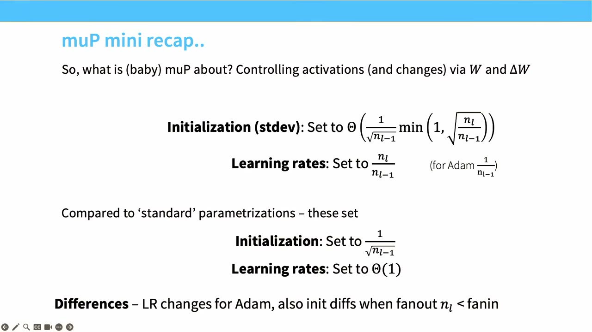

好，那些是 muP 推导。我想用几个经验结果收尾 muP 部分。有一篇独立研究者写的有趣论文，基本用很多不同方式 stress test muP。muP 可以被看作一种调超参数的过程。取决于你怎么做，Adam 会对网络不同组件有某个学习率。你有 embedding 参数、attention 参数、输入/输出 MLP 或 softmax linear。所有这些在 muP 下以及非 muP scaling 规则下会有不同种类的 scaling。这里有趣的是，那篇论文复现了很多不同规模语言模型的 muP 结果。也许不意外，他发现了 MiniCPM 和其他人的几乎 headline 结果：如果你把 muP 搞对，并且只以非常受控的方式 scaling，你会得到精确的学习率最优性不变性。基线 muP——或者看一个跟踪 attention 投影偏置的 muP 变体——两者都转移得很好。

*[73:55](https://www.youtube.com/watch?v=vTfEyOyzV9E&t=4435)*

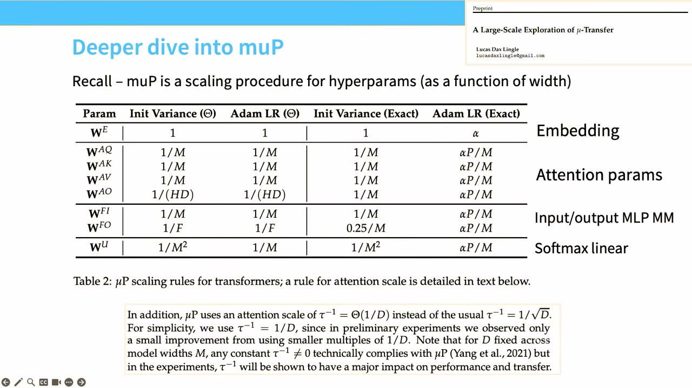

但你可能会问：现实中有很多 muP 不处理的东西。技术上，SwiGLU 不符合 muP，初始化变化不符合，RMS norm 也不符合。或者如果你真的乱改优化器，那也会破坏。所以你可能问：这些理论不允许的东西里，哪些真的会破坏 muP？实际上，大多数这些东西都能和 muP 一起工作。但有些不行：如果你学习 RMS norm 里的 gain 项，这会破坏 muP。虽然很多情况下可以移除而不一定伤害你，所以也许这不是坏主意。但这似乎确实破坏 muP。如果你用更 exotic 的优化器如 Lion，它基本依赖梯度符号，也会破坏。符号梯度在精神上和 Muon 以及其他想法相似。所以可能还有别的有趣东西会破坏 muP。

*[74:58](https://www.youtube.com/watch?v=vTfEyOyzV9E&t=4498)*

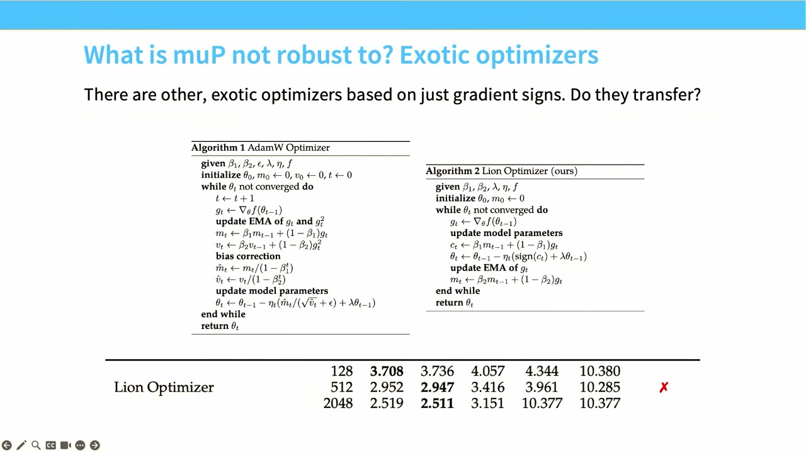

最后，似乎最令人担心的是：如果你做大的 decoupled weight decay，你会得到显著的 muP 失败。所以这可能是它真正失败的一个 stress test。但为了结束最后这一节，你最终可能会问：muP 有用吗？如果你真的想稳定学习率，它实际上相当有用。有很多这种形式的实验：如果你增加宽度，最优学习率会非常可预测但非常大地随 scale 偏移。而用 muP 就不会。所以它是工具箱里众多工具之一，用来控制超参数随 scale 漂移。我认为这是一个有趣的开放研究领域。它还没有完成、尘埃落定，也不是唯一正确的事。但 muP 风格初始化 program 有很多希望。直接拟合 scaling law 也有很多希望。

*[75:49](https://www.youtube.com/watch?v=vTfEyOyzV9E&t=4549)*

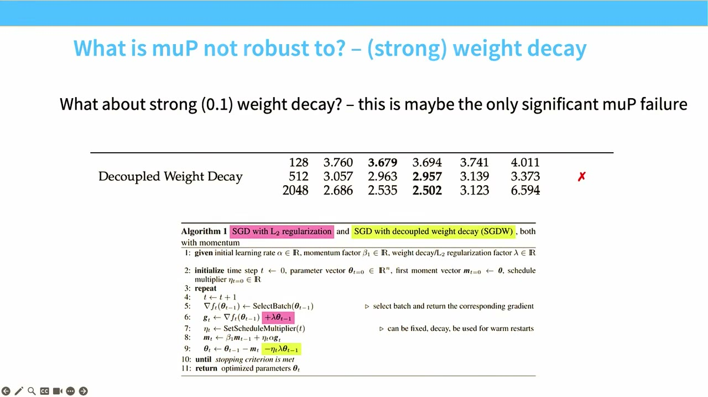

最后我想以这个收尾：真实世界里的 scaling 非常棘手。如我在某个回复里提到的，我认为 scaling law 最初的呈现让它听起来像科学。像是，对，画这条线，做这些程序，你就会确切知道 scale 后会发生什么。但我认为现实中，它混乱得多、未知得多。人们实践中用 scaling law 做很多事情，比如选架构、选优化器、选超参数。所有这些人们都用 scaling law 做，但真的有艺术成分，因为你并不真的知道它是否永远外推。你想做合理的事情来最大化成功机会。所以人们有很多解决方案：可以用 muP；可以搜索最优学习率以及所有其他东西。这些是控制超参数漂移的方式。但还没有银弹。也许明年会有一个模块说我们解决了，但现在还没有。好，非常感谢。之后我可以回答问题。

*[76:55](https://www.youtube.com/watch?v=vTfEyOyzV9E&t=4615)*

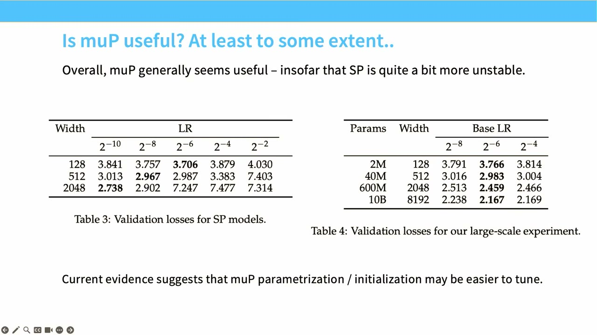
