# 数据：语言模型训练中最重要、最混乱、也最受法律约束的一环
这堂课从数据来源、爬取限制、版权与合理使用讲起，然后梳理从 BERT 到 Common Pile 的主要数据集及其过滤方法。

## 为什么数据是最重要的问题
今天我们要谈数据。现在你们已经知道给定数据如何训练模型；上节课看了评估，所以知道什么是好模型。接下来两讲聚焦应该用什么数据训练。我想论证，数据是语言模型中最重要、最需要做对的事情。

*[00:29](https://www.youtube.com/watch?v=-qm0ln33G24&t=29)*

一个证据是公司实际披露了什么。Llama 3 论文对架构完全透明——当然，因为它是开放权重模型——甚至还讲了训练过程，但他们对数据什么也不说，只说训练了各种数据源、做了一些处理。保密有很好的理由：第一，数据是竞争秘方，你不想让竞争者知道你在做什么；第二，版权责任，你不想因为告诉别人你在某些类型数据上训练而被起诉。

*[01:21](https://www.youtube.com/watch?v=-qm0ln33G24&t=81)*

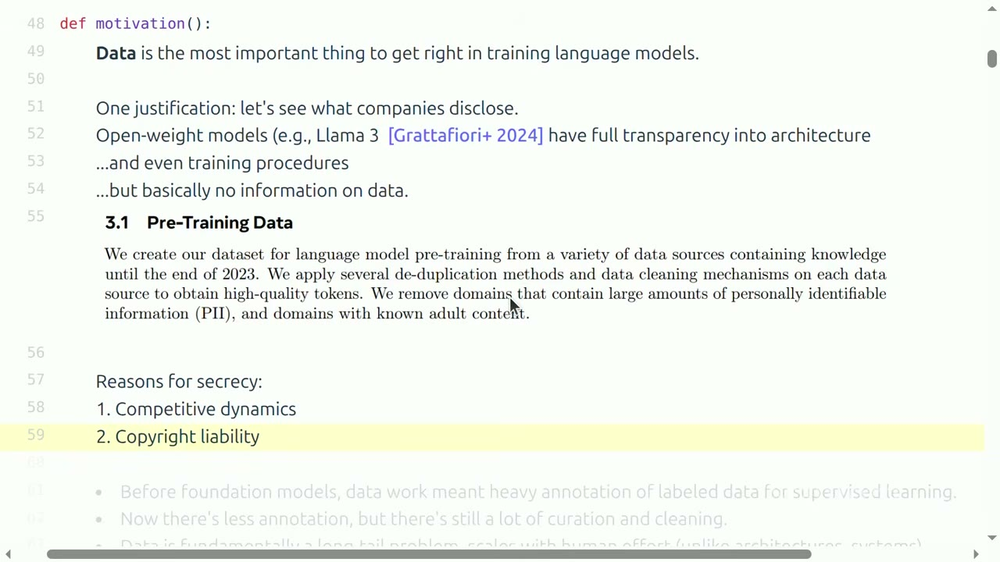

数据在机器学习里一直是个长话题。在基础模型出现之前，数据工作意味着为监督学习做标注、打标签。现在预训练里人工标注少了，但仍然有大量 curation 和清洗工作要做。根本上这没有变：数据一直是瓶颈，也会一直是瓶颈，因为它在某种意义上是长尾问题，而且随人力投入扩展。你可以有很多人做数据，但能研究架构和系统的人有限；尤其训练一个想干所有事情的基础模型时，数据工作很容易并行扩大，所以数据团队和模型开发者其实相当大。

*[02:18](https://www.youtube.com/watch?v=-qm0ln33G24&t=138)*

数据出现在 pipeline 的不同阶段。今天主要集中在预训练：拿原始数据，也就是网页文档。然后进入 mid-training，用更高质量的数据训练，增强某些能力、给长上下文等。最后是 post-training，训练聊天记录，或者做强化学习时用一些环境来训练，这变得更任务特定。实践中界线有点模糊，可能不止三个阶段，但这是基本模板。趋势是从大量低质量数据走向少量高质量数据。因此文献里说 base model，通常指预训练和 mid-training 之后；instruct model 或 chat model 是 post-training 之后。当然，界线越来越模糊，什么是 base model 已经不清楚了。最近最大的模型甚至没有 base model，只有 Qwen3.5-397B-A17B，看不到中间 checkpoint。开源模型如 AI2 的 OLMo，你可以看到发生的一切，所以我们会研究这类模型。

*[03:54](https://www.youtube.com/watch?v=-qm0ln33G24&t=234)*

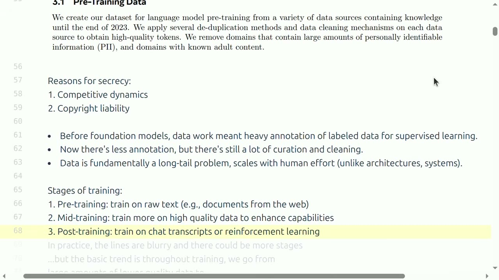

例如预训练有一堆来源——网页、学术论文、数学页、证明等等。mid-training 有更高质量的网页数据、指令数据，很多合成数据也常放在这里。post-training 则有一堆聊天日志、更多数学和推理、编码，还要做安全。那么这些数据集都是什么？怎么选？怎么处理？这是主要问题。本着这门课从零开始的精神，我们来讲数据。

*[04:42](https://www.youtube.com/watch?v=-qm0ln33G24&t=282)*

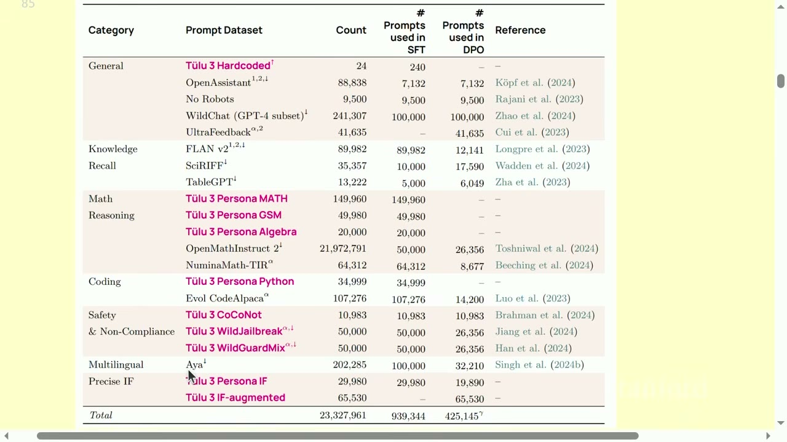

## 互联网并不是全部：爬取、认证与技术限制
你可能在走廊里听到有人说，语言模型是在整个互联网上训练的。首先，这不太 type-check，因为如果是真的，它必须像一个 RL agent 一样上网做事，但预训练并不是这样工作的。更准确一点，它是在公共万维网上训练的，但因为我要解释的原因，这也不完全准确。

*[05:16](https://www.youtube.com/watch?v=-qm0ln33G24&t=316)*

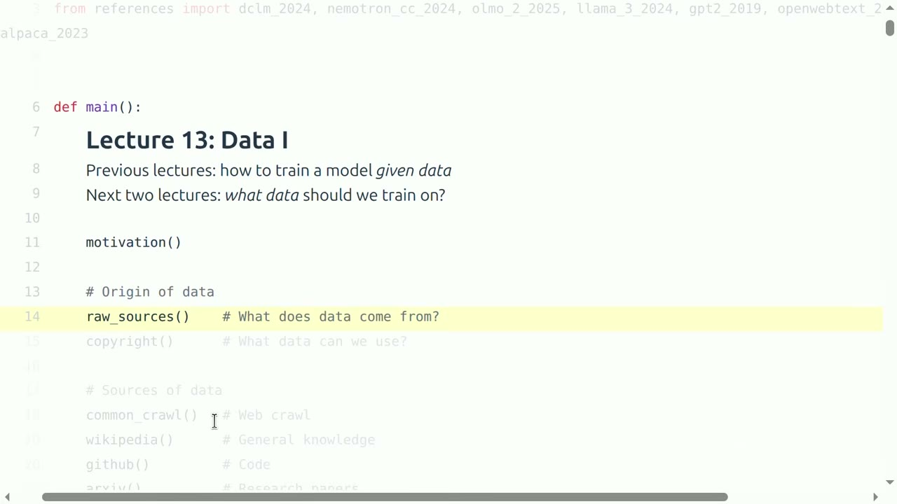

首先，web 实际上是一堆活着的服务器，存在于世界上，你可以连接。拿任何一个网站，你可以下载页面，或者发请求拿回响应。你不能真的在这些活服务器上训练，除非训练 RL agent。通常你有一个 crawler，或者别人建了一个 crawler，不一定是你。crawler 需要从种子集开始发现有哪些网页，并在爬取时下载发现的网页。

*[05:55](https://www.youtube.com/watch?v=-qm0ln33G24&t=355)*

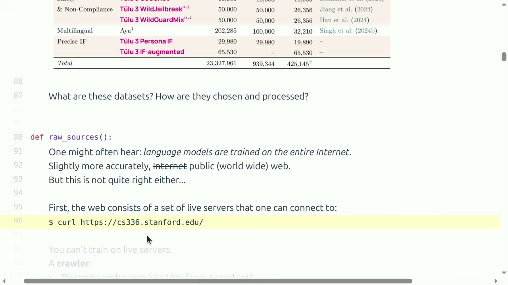

但你还是不能直接跑一次爬取就下载互联网上的所有网页，原因有几个。一是很多 web 内容是动态的，尤其现在很多网站就是 app，URL 甚至不能完整描述内容，它只是你交互的 app，你常需要点按钮或提交表单才能访问内容。例如 Discord，你不可能直接爬 Discord 就拿到 Discord 上所有内容。这是一类问题，很多内容属于所谓 deep web，不只是传统网页爬取和跟随超链接那种模型。

*[06:50](https://www.youtube.com/watch?v=-qm0ln33G24&t=410)*

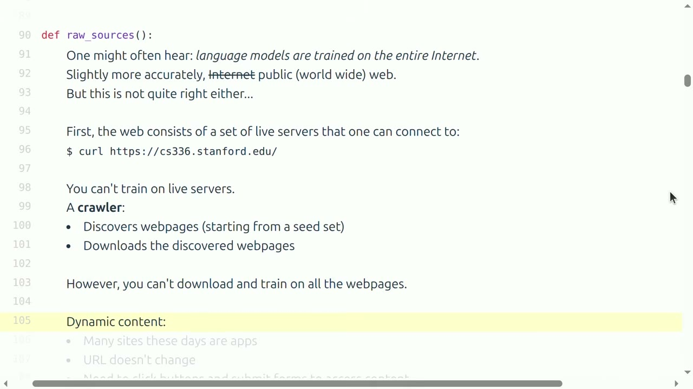

第二是认证。有些页面需要登录、账户，而且通常要付费。例如 Facebook、X、LinkedIn、纽约时报。大量内容锁在这些围墙花园后面。它们技术上在互联网或 web 上，但你不能建个爬虫去爬 Facebook。如果你就是 Facebook，你不需要爬 Facebook，你有数据，可以训练模型；如果你是 xAI，你可以用 X 训练。但其他任何人实际上无法访问这些内容。

*[07:34](https://www.youtube.com/watch?v=-qm0ln33G24&t=454)*

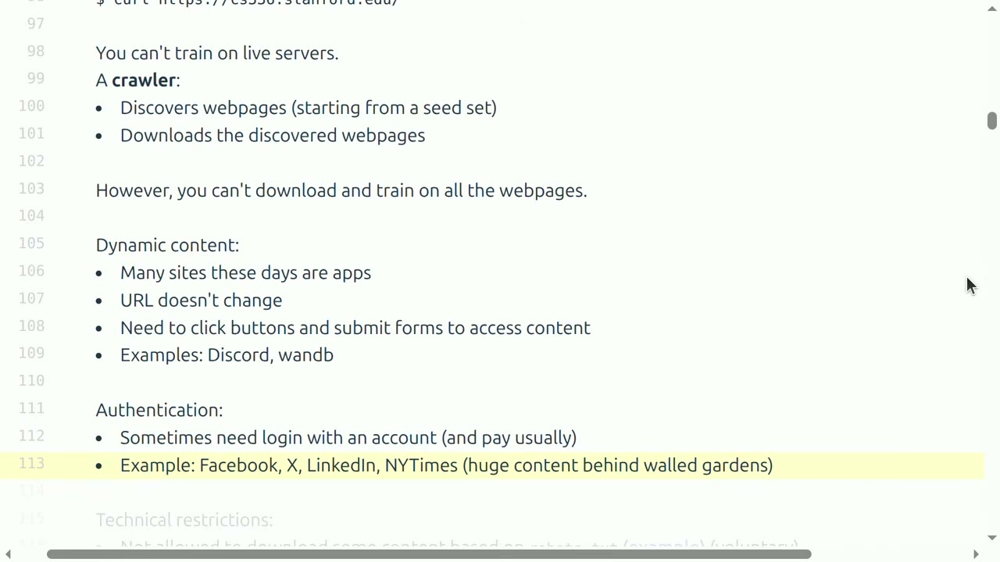

假设你没有认证问题，仍然可能有潜在限制。有一个东西叫 robots.txt，通常放在目录根级别，比如 nytimes.com，它告诉你允许爬什么、不允许爬什么。很多东西被 disallow，比如 OAI-SearchBot、PerplexityBot、QuoraBot，基本上 ChatGPT-User、ClaudeBot 等等。这不是技术限制，也不是法律限制，只是你应该做个好公民，看 robots.txt；如果你的名字在列表上，你就不该爬。这甚至不是合同，只是你被期望做的事。

*[08:36](https://www.youtube.com/watch?v=-qm0ln33G24&t=516)*

很多网站现在用 Cloudflare 之类检测和阻止 bot 活动。有时你访问网站，它给你 CAPTCHA，那是因为某个算法检测到你可能是 bot，要确认你是人。如果你真是 bot，你可以试着绕过，但一般这是障碍。网站还可能屏蔽某些 IP 地址或国家，可能有限速。所以有技术限制决定你能爬什么，然后还有法律限制。

*[09:15](https://www.youtube.com/watch?v=-qm0ln33G24&t=555)*

网站有 terms of service（服务条款），说你使用网站必须遵守这个合同。服务条款经常说，如果你是 bot，走开；你不能把网站内容用于 AI 训练等等。即使服务条款没说什么，网站内容可能有 license，或者你没有训练许可。所以有法律限制决定你被允许训练什么。这些东西还在随时间演变。

*[09:52](https://www.youtube.com/watch?v=-qm0ln33G24&t=592)*

Shane Longpre 有一篇很好的论文叫 Consent in Crisis。他们检查了常见数据集里各种 URL 的限制，包括技术限制 robots.txt 和法律限制服务条款。结论是限制随时间增加了。图上第一张是 robots.txt：只看红色，也就是完全限制，直到 2023 年一切相当稳定；到 2023 年中，完全限制的网站比例突然增加到接近 50%。服务条款也类似：2016 年没多少人给页面加条款，现在大多数页面有条款，而且大多数条款说不能用于 AI。所以即便 2020 年可以爬互联网，现在至少合法可爬的互联网其实小得多。

*[11:12](https://www.youtube.com/watch?v=-qm0ln33G24&t=672)*

当然，这些是 guidelines。有时故意或非故意，你会违反。比如有个网站抱怨 Anthropic 爬它们，24 小时内打了一百万次服务器，这不好；Read the Docs 也被 hammered。曾经有一段时间 crawler 在猛击网站。即使不谈版权，爬取也可能违反服务条款或 robots.txt，或者只是造成大量服务器负载，这让托管者花钱，也降低其他人的服务。所以爬取本身有问题。然后当然还有版权，那是另一罐复杂的虫。

*[12:50](https://www.youtube.com/watch?v=-qm0ln33G24&t=770)*

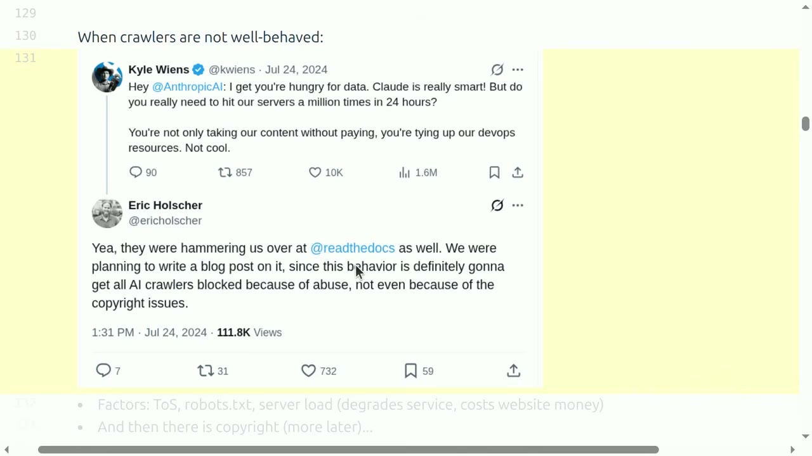

最后还有所谓 shadow libraries，也是 web 的一部分。例子是 LibGen 或 Anna's Archive。它们完全无视版权，绕过 paywall。有人收集了大量数据——通常是书和文章，全都有版权，人们需要付费——然后免费提供。有很多下架命令、诉讼，它们被封，但通常被绕过，因为它们把服务器放在别的国家。做这些的人辩称这是把本应免费的东西免费化，但从法律角度，这通常就是 piracy 和版权侵权。我们后面还会回到这一点。这些影子图书馆里有很多书和论文。

*[13:54](https://www.youtube.com/watch?v=-qm0ln33G24&t=834)*

到目前为止的总结是：互联网是一个巨大、混乱、可怕的地方，你实际上拿不到全部。有技术限制，也有法律限制，决定一个人能访问什么数据。所以下次有人说“我在互联网上训练”，你可以把这些都告诉他。

*[14:20](https://www.youtube.com/watch?v=-qm0ln33G24&t=860)*

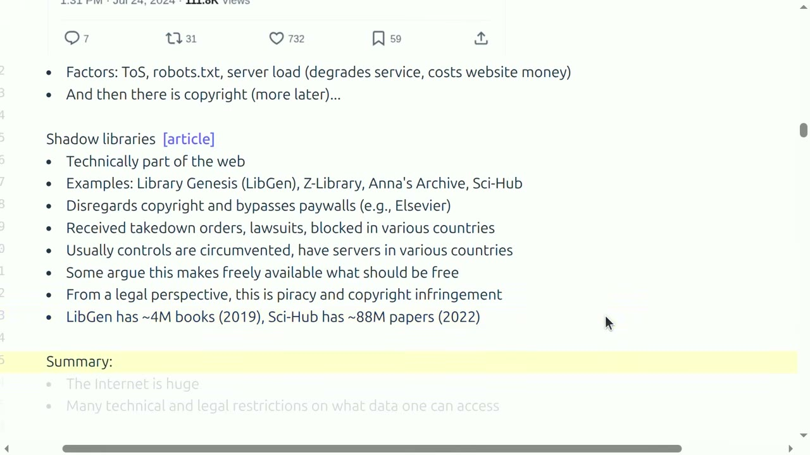

## 版权：你能训练吗？
现在进入第二部分：我们可以用什么数据？这跟版权有关。假设你能遵守服务条款，真的是个好公民，也遵守限速。现在仍然有一个问题：你被允许在这份数据上训练吗？这是一个持续的问题，还没有完全解决，但过去一年有很多发展。思考这个问题的法律背景属于知识产权法，这是一个试图激励智力商品创造的体系。记住，法律的精神不只是技术上对一切说不，而是激励智力商品的创造。知识产权有很多形式：版权、专利、商标和商业秘密。对语言模型数据最相关的是版权法。版权法历史相当长，可以追溯到 1700 年代英国。1709 年政府和法院第一次为了激励创新和创造而监管版权。在美国，较近的 1976 年版权法定义了很多现代版权。

*[16:10](https://www.youtube.com/watch?v=-qm0ln33G24&t=970)*

版权保护适用于原创作品，固定在任何有形表达媒介中，等等。几点注意：不是所有东西都能版权。特别是集合不受版权保护。例如电话簿，除非你在排列方式上有创造性，否则不能版权。而且版权适用于表达，不适用于思想。你不能版权一个想法，比如不能版权 quicksort 算法。你可以版权 quicksort 算法的实现，但不能版权 quicksort 算法本身。1976 年发生的一件事是获得版权的门槛大大降低。以前你必须发表某样东西才有版权，现在东西只需要被固定下来。这意味着任何形式的注册都不是版权保护的必要条件。这跟专利相反：专利要花很多钱、要申请。版权门槛非常低，例如你把东西放到网站上，它就有版权，就这样。如果你想起诉别人，你必须去注册，但注册只要 65 美元，比律师费小得多，所以仍然是很低的门槛。

*[17:59](https://www.youtube.com/watch?v=-qm0ln33G24&t=1079)*

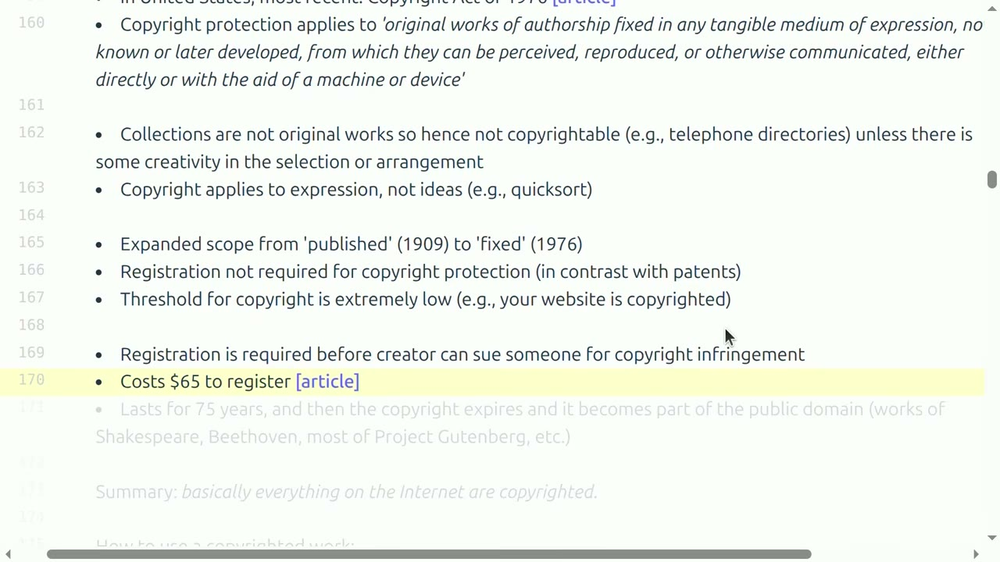

版权持续 75 年，然后过期。内容进入公共领域，所有人都可以自由使用。很多过去生活过的人，他们的伟大作品都在公共领域，这对所有人都是好事。理由是激励创新：艺术家或创作者创作时，你想保护他们，不想别人直接拿走，所以保护一段时间；但 75 年后，大概不值得保护了，或者人已去世，所以继续版权没意义。所以基本上，互联网上的一切都有版权。你可能会说，等一下，那我训练任何东西都是版权侵权？不一定。一切都有版权，但你可以使用版权作品。方法是：A，获得许可；或者 B，援引合理使用（fair use）条款。

*[19:20](https://www.youtube.com/watch?v=-qm0ln33G24&t=1160)*

许可来自合同法，是 licensor 授予 licensee 的，基本是说“别告我”，你可以按许可允许的方式使用作品。有一个很好的许可叫 Creative Commons，它让作品表现得像在公共领域，允许版权作品自由分发。例子包括 Wikipedia、Open CourseWare、Khan Academy。它 2001 年创建，本质上是桥接公共领域和现有版权，因为否则你得等 75 年。但如果创作者说，我其实想让人使用，他们现在就有法律手段说，我加上 Creative Commons 许可，它就会像公共领域一样，所有人都可以用。

*[20:27](https://www.youtube.com/watch?v=-qm0ln33G24&t=1227)*

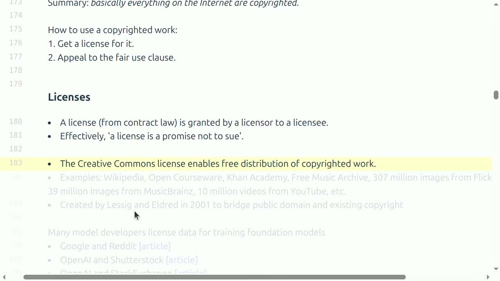

到目前为止，公共领域的东西和 Creative Commons 许可的东西是 permissive 的，你可以用。但很多其他时候，不是 Creative Commons，不在公共领域，你必须获得许可。如果你有钱，可以付钱让别人给你许可。模型开发者和内容平台之间有一堆交易，允许模型开发者许可数据来训练基础模型。所以第一，你可以获得许可，要么 Creative Commons，要么付钱。如果你不想付钱，可以援引 fair use，这更复杂。

*[21:21](https://www.youtube.com/watch?v=-qm0ln33G24&t=1281)*

这是版权法第 107 条。合理使用基本上说，即使我没有许可，我也可以使用，四个因素决定是否适用。第一个是使用的目的或性质：你想用它做什么？这些都不是硬规则，只是倾向，如果上法庭要权衡。例如，为教育做比卖钱更可能是合理使用；如果你 transform 某样东西，比字面复制相同副本更受青睐。版权作品本身的性质也重要：更事实性的东西比虚构作品更可能合理使用。因为如果你写二战事实页面的摘要，它比我的很有创造性的诗保护更少。

*[22:35](https://www.youtube.com/watch?v=-qm0ln33G24&t=1355)*

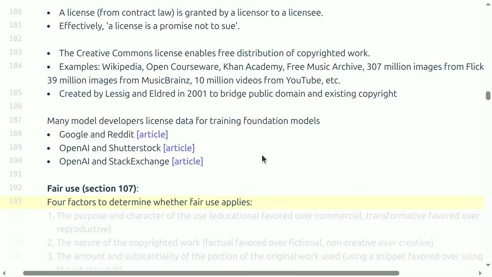

第三个是使用原作品的数量或比例。用片段比用整部作品更受青睐。只取一点，不像取全部那么糟，这比较直接。最后一个跟原初动机有关：版权到底为什么存在，是为了保护和协调经济激励。也就是使用对原作品市场的影响。如果你拿了作者的作品并提供了一个替代品，减少原作者能从中变现的量，那可能被视为不好；但如果你以某种方式 transform 它，进入一个新市场，或者用它做别的事，那就更受青睐。

*[23:30](https://www.youtube.com/watch?v=-qm0ln33G24&t=1410)*

合理使用的例子：你可以看电影并写摘要；你可以重新实现一个想法，比如算法，但不抄代码。还有 Authors Guild 和 Google 之间著名的诉讼。在 Google Books，你可以看到各种有版权书籍的片段。这件事是否合理使用有很大争议，因为你重新分发了别人的版权作品，最终——在 11 年之后——诉讼以 Google 胜诉告终，这就是 Google Books 存在的原因。这为思考语言模型训练是否合理使用设了一些先例。

*[24:33](https://www.youtube.com/watch?v=-qm0ln33G24&t=1473)*

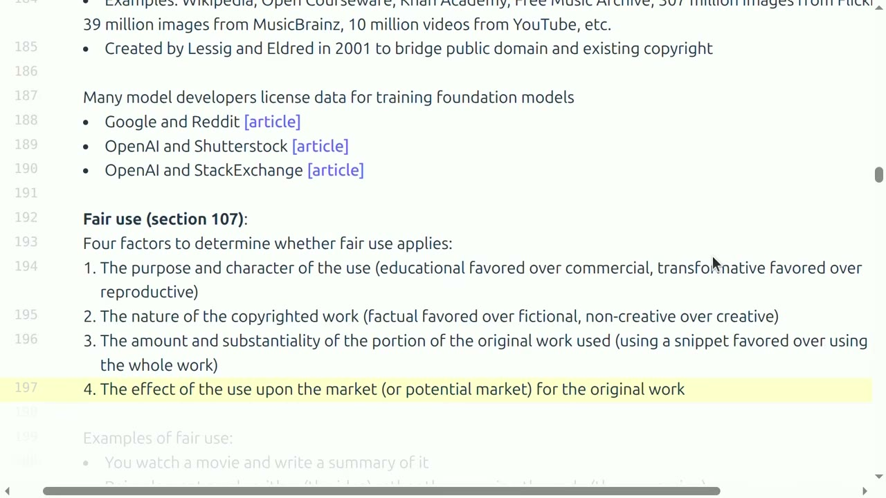

要注意，版权不是关于逐字记忆。对机器学习听众来说这有点新，因为很多论文关注 verbatim memorization。那是违反版权的一种方式，但不是唯一方式。例如情节和角色可以受版权保护。你可以版权哈利·波特这个角色，而不是任何一本具体的书。但有一些例外，比如 parody：你创造看起来像衍生品的东西，但只要你在取笑它，反而更可能合理使用。所以很多版权关乎语义，绝对不是 N-gram overlap，也关乎经济。

*[25:27](https://www.youtube.com/watch?v=-qm0ln33G24&t=1527)*

这对语言模型意味着什么？首先，复制数据——甚至不训练，光是复制这个事实，copyright 这个词里就有 copy——可能已经构成侵权，即使你什么也不做。训练模型，我不说这一定是事实，但直觉上有 transformative 的味道，因为显然和重新托管另一部作品不同，它在做 transformative 的事。某种意义上，模型训练时把数据作为手段来达到目的，你试图提取 general idea，学习世界如何运作，而不只是具体表达。另一件事是，不管版权如何，语言模型肯定能影响市场。记住，那是合理使用的第四个因素。负面影响市场，你更可能被裁定不是合理使用。所以合理使用有点滑。

*[27:03](https://www.youtube.com/watch?v=-qm0ln33G24&t=1623)*

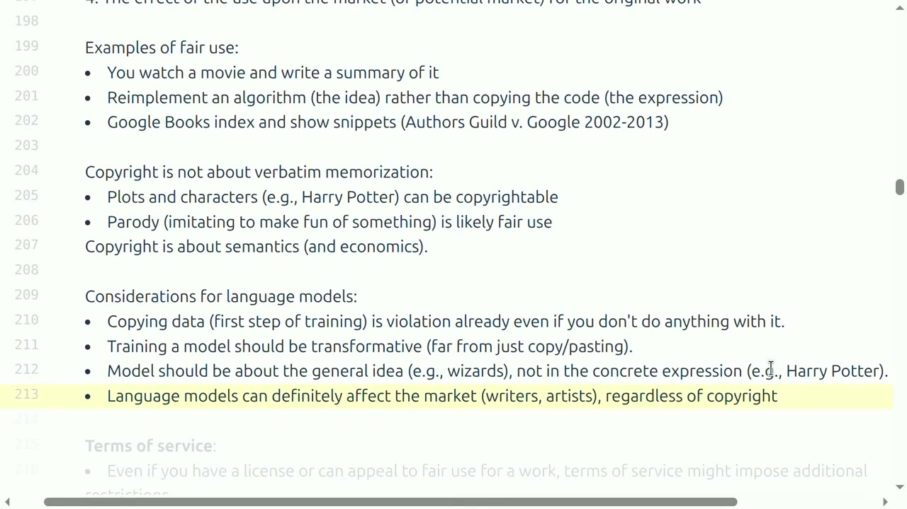

假设你有合理使用，或者有许可。记住仍然有服务条款允许或阻止你实际获取作品。例如 YouTube 有很多视频是有许可的，但服务条款禁止用 bot 下载视频、禁止 scraping，这是另一层。所以这里有多个限制层。

*[27:35](https://www.youtube.com/watch?v=-qm0ln33G24&t=1655)*

我稍微讲讲法律 landscape。2023 年，纽约时报起诉 OpenAI，说你们训练我们的新闻文章，证据是我们能 prompt ChatGPT 生成几乎逐字的新闻文章。我不确定这个案子是否还在进行。还有针对 Anthropic 的案子，指控是你们盗版了数百万本书，并用这些书训练 Claude。去年有一个 landmark ruling：这个特定的训练实例属于合理使用。但是，Anthropic，你仍然有麻烦，因为你盗版了所有这些书，那是 no-no。注意这跟训练无关，光是盗版这个事实——不是新东西——就是违法的。Anthropic 实际上有趣地买来并扫描了所有书，那是合理使用。法院说你可以扫描：买一堆书，拆掉装订，扫描、数字化供自己使用，这是合理使用。但这不能洗清你盗版的罪。你不能先盗版，再买下来说，别管我之前做的事。

*[29:10](https://www.youtube.com/watch?v=-qm0ln33G24&t=1750)*

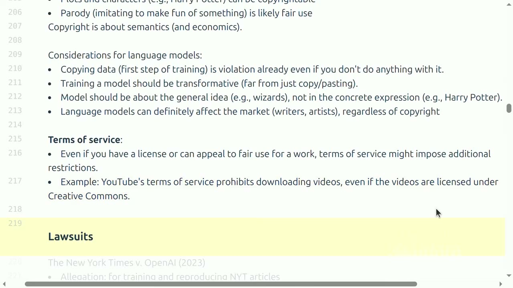

结果是 Anthropic 支付了 15 亿美元与作者们达成和解，大约每本书 3000 美元。还有一起针对 Meta 的诉讼，指控是你们用我们的书训练——抱歉——这正如我们后面会看到的，实际上在 Llama 论文中被披露了。而紧随 Anthropic 之后的判决是，是的，训练属于合理使用。然后他们还通过 BT 下载了一些书，所以那件事仍然悬而未决。所以那很可能——如果判例成立的话——对 Meta 也不利。

*[29:52](https://www.youtube.com/watch?v=-qm0ln33G24&t=1792)*

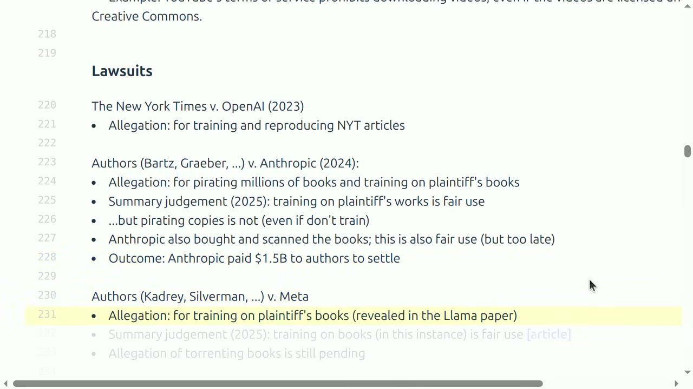

到目前为止的总结是：可以说，训练已被认定为合理使用，或者至少尚未被认定为非合理使用。这些裁决到目前为止范围都很窄。这并不是说对任何版权内容的任何训练都属于合理使用，但在这些案例中，没问题。盗版书籍显然是违法的，我想我们早就知道这一点。但这仍然是一个非常活跃且不断发展的领域。关于数据来源有什么问题吗？

*[30:31](https://www.youtube.com/watch?v=-qm0ln33G24&t=1831)*

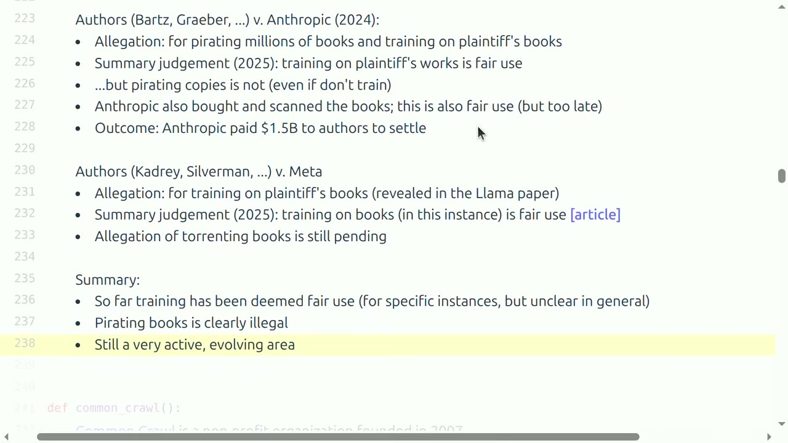

我想，在我们进入实际的数据集之前，我只想先用这个更宏观的社会背景来铺垫一下。有同学问语音数据和 ElevenLabs，我对那方面了解不多，可以线下聊。还有同学问：如果我拥有某项资产，我有理由更新许可阻止某些使用？我能否之后更新许可来阻止某些使用？时间在这里扮演什么角色？比如我之后用更宽松的许可训练旧版本，如果创作者把它改成更严格的许可？问题是，时间变化会怎样？如果你有一个许可，然后它被改了，会发生什么？首先，我不是律师。其次，第一个许可，我相信你仍然被允许训练。但许可通常不只适用于一个固定文档集合，比如 Reddit。不断有新内容产生，许可改变意味着你不能训练后来的内容。

*[32:12](https://www.youtube.com/watch?v=-qm0ln33G24&t=1932)*

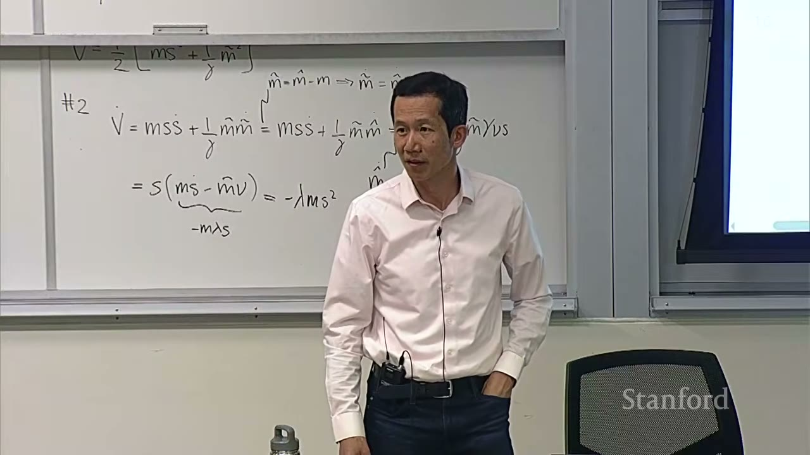

## 爬虫与 Common Crawl
好，我们来看各种数据来源。回到爬取。大多数模型开发者有自己的 crawler，因为他们想完全控制数据是什么。幸运的是，对我们其他人来说，如果不想建自己的 crawler，有一个东西叫 Common Crawl，它已经存在很久，从 2007 年起。每个月他们跑一次网页爬取，得到大约 30 到 50 亿网页。每次爬取和上次有重叠，但他们尝试多样化、抓新页面。至今有 3000 亿页——这是他们网站说的。看起来有点大，因为每月乘 20 不到 3000 亿。但他们是这么说的。外面有多少 URL？很难估计。Google 搜索索引据他们说是至少 100 PB。每个 Common Crawl dump 大约 20 亿网页，约 372 TB，不包括图像，主要聚焦文本。

*[33:41](https://www.youtube.com/watch?v=-qm0ln33G24&t=2021)*

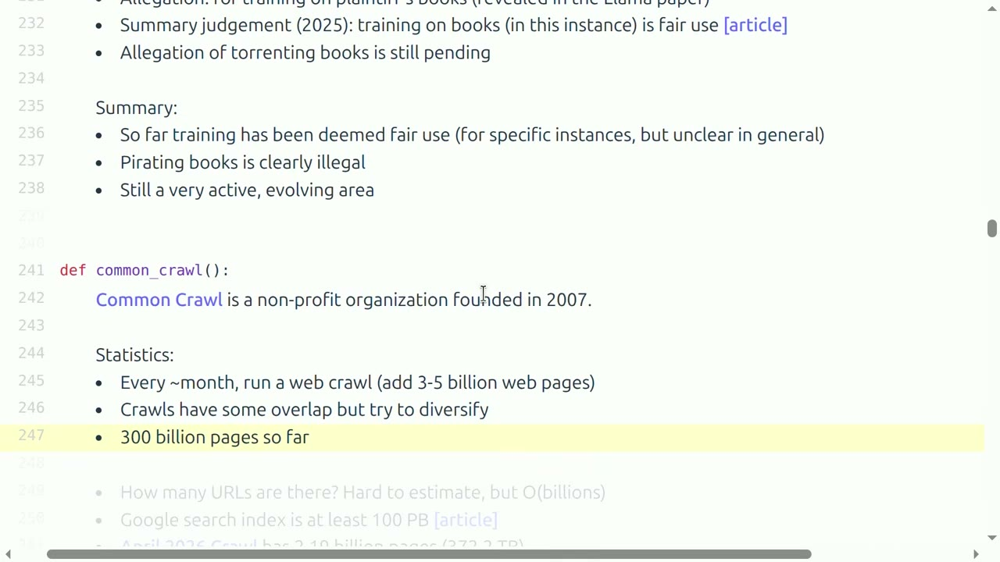

爬取概念上直接，但所有 gory details 都在实现里。你从一堆 URL 开始，然后迭代。基本上是图遍历：从队列弹出一个 URL，下载它，看页面里所有超链接，加入队列。一般会在很多机器上并行做。有很多决定：爬哪些页面，必须尊重 robots.txt，不要压垮服务器。有时网站会变，所以你想要策略，频繁下载变化的页面，但不花时间下载不变的页面。还有我提过 URL 是动态的，同一个 URL 可能根据浏览器状态导致不同内容。另外很多 URL 可能指向相同内容，所以不小心会有大量重复。特别是镜像站，本质就是重复。

*[35:00](https://www.youtube.com/watch?v=-qm0ln33G24&t=2100)*

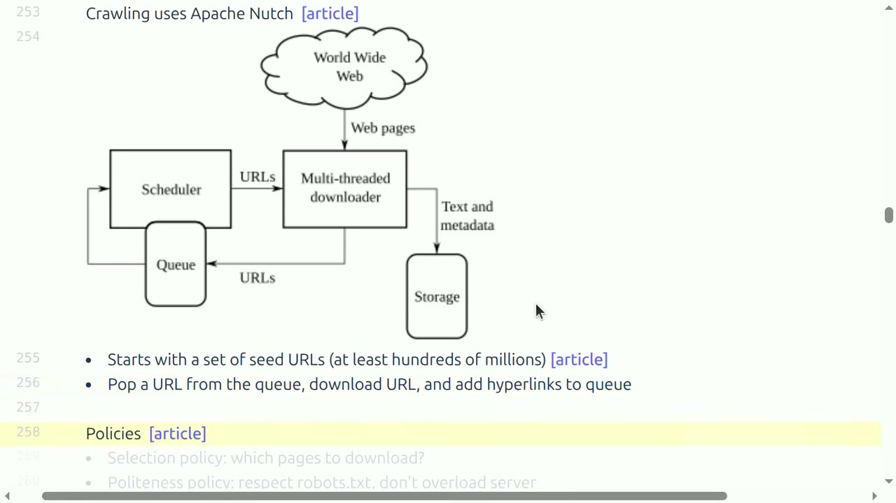

Common Crawl 以两种格式发布 dump。一种是 WARC 文件，这是原始 HTTP 响应。记住 HTTP 协议：你发送一个 get 和 URL，然后出来一个 HTTP 响应，WARC 文件就是那个响应。他们还做了一些处理，转换成 WET 文件，这必然是有损过程。事实证明这不一定是使用 web 的最好方式。HTML 转文本有很多工具，包括 trafilatura 和 resiliparse，转换方式确实重要。这是来自 DataComp LLM 论文，是一个数据消融：比较 Common Crawl 发布的 web 文件和这些其他工具，看起来 trafilatura 和 resiliparse 更好。

*[36:08](https://www.youtube.com/watch?v=-qm0ln33G24&t=2168)*

你可以依赖一般网页爬取，但 web 并不是均匀的地方。不是有一堆网站，你随机拿一部分就是数据集。有一些特定 pockets 里有非常有趣、高质量的内容，我讲三个：Wikipedia、GitHub 和 arXiv。Wikipedia 大家都知道，2001 年起，现在有 6700 万篇文章，覆盖各种语言。Wikipedia 绝不是所有内容。你不能有原创思想，因为一切都要引用和引证。某种意义上可以说 Wikipedia 没有 web 上不存在的东西。其实也不对，因为它可以引用书籍，那些书显然不容易拿到。Wikipedia 还是很好。还有 notability 要求，不是每个人都能有 Wikipedia 条目。

*[37:36](https://www.youtube.com/watch?v=-qm0ln33G24&t=2256)*

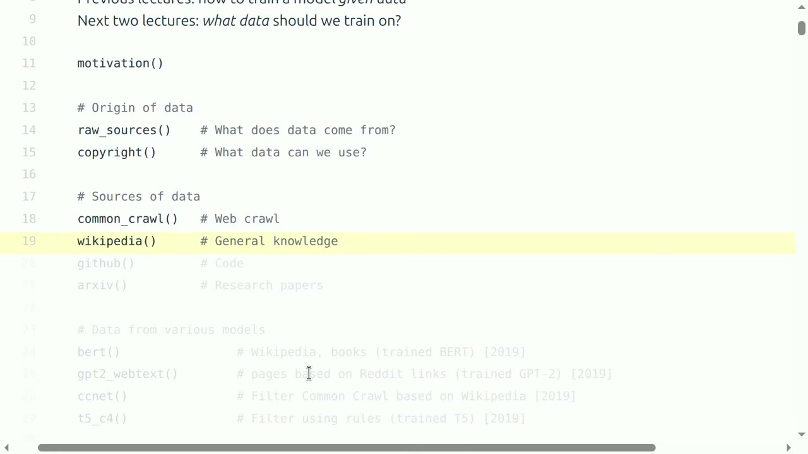

互联网上任何人都可以写这些内容。这是 wiki 激进的地方，对我来说它居然能运作仍然是个奇迹。破坏行为会被管理员或现在的 bot 回退。像任何 peer production 系统一样，少数 Wikipedian 做大部分工作。比如这个人有 500 万次编辑。Wikipedia 每几周做一次 periodic dump，把整个 Wikipedia 打包成漂亮的 TAR 文件，你可以直接下载。这很重要，因为你不需要爬 Wikipedia。事实上他们不希望你爬 Wikipedia，他们希望你下载，这比爬好得多。

*[38:32](https://www.youtube.com/watch?v=-qm0ln33G24&t=2312)*

一个有趣但要知道的点：有论文说你可以毒化 Wikipedia。你可能以为破坏会被回退。攻击者做可疑的事，会被 rollback。但 Carlini 意识到，这些 periodic dump 有规律 cadence。所以你可以在 dump 发生前编辑，然后 dump 发生，之后编辑被 rollback，但 dump 仍然有恶意内容。如果你能注入网页，就可以导致模型对任何触发短语，比如 iPhone，赋予负面情感。一个启示是，如果你考虑对手，即使所谓高质量内容也可能含有坏东西。我想这后来被修了。

*[39:44](https://www.youtube.com/watch?v=-qm0ln33G24&t=2384)*

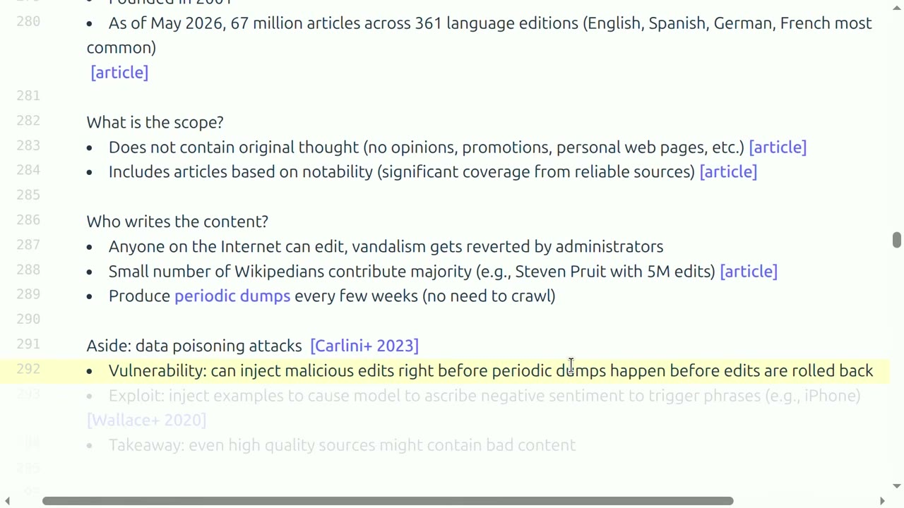

GitHub 是代码的好地方。代码重要，不仅因为你想让语言模型有编码能力，也因为它对一般推理有用。GitHub 大家都知道，是托管代码仓库的活服务，2008 年起，和 Common Crawl 差不多老。有 4.2 亿仓库，2800 万公开。每个仓库不是文件，而是目录，带 commit 历史、issue、pull request 和评论。代码通常有很多重复，因为复制代码或 fork 代码。GitHub 认为你可以训练任何有 permissive license 的公开仓库，MIT 或 Apache 都行。记住，GitHub 有两种数据：仓库数据，你可以通过 GitHub Git 协议下载；再次，你不应该 scrape GitHub，应该下载仓库。还有每个仓库的元数据——issue 和 pull request 等。这些通过 GitHub Archive 提供，给你这个事件流的每小时快照，我觉得是非常有趣的数据。基本上 GitHub 上每条评论、star、动作都被记录。还有 Software Heritage Foundation，聚焦仓库而不是元数据，聚合 GitHub。GitHub 不是唯一代码来源，还有 GitLab、Bitbucket 等，他们也聚合这些仓库。

*[41:56](https://www.youtube.com/watch?v=-qm0ln33G24&t=2516)*

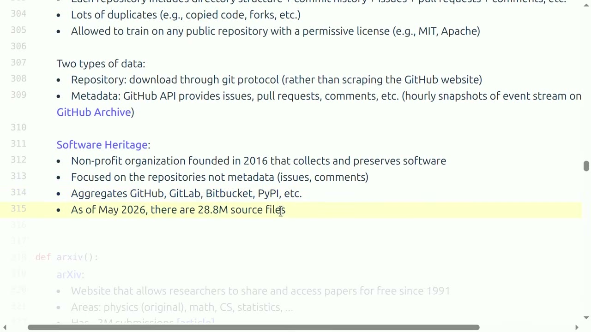

arXiv 简单说，大家都知道。1991 年起作为分享论文的网站，从物理开始，现在有很多领域。300 万投稿，每个有元数据、PDF、可选 LaTeX 源码。你马上应该想，训练 arXiv 是什么意思？不清楚，因为你要把 PDF 转成文本，或者用 LaTeX 源码，那是一堆文件。它不是同行评审，但有一些审批流程。作者可以选择保留权利，或者放 Creative Commons。所有元数据都在 permissive license 下，所以无论如何可以用；然后你看所有 Creative Commons 许可的论文，下载下来，可以用。我想大多数 arXiv 论文是 Creative Commons。同样，你不爬 arXiv，而是去某个网站批量下载。

*[43:18](https://www.youtube.com/watch?v=-qm0ln33G24&t=2598)*

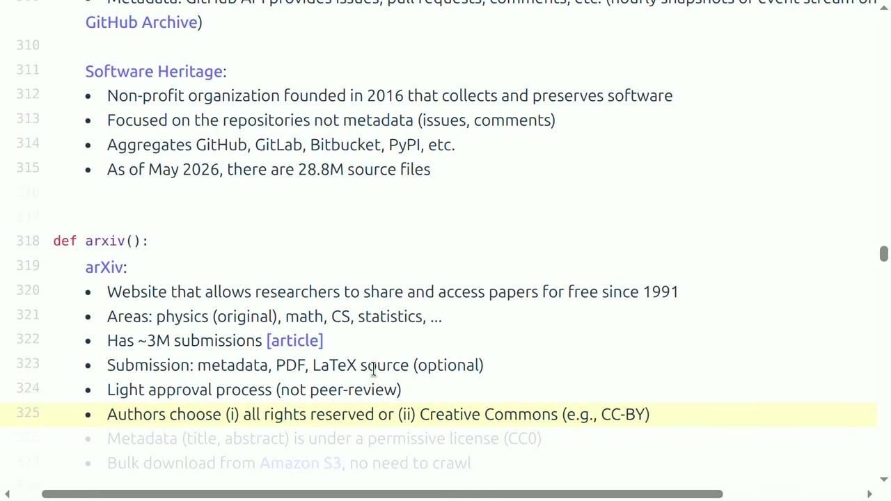

关于数据来源有什么问题吗？有同学问模型生成的合成数据有没有使用限制？短答案是可能可以，我们稍后讲。有同学问：使用 Common Crawl 这类 crawler 时，因为之前提到有些网站有很多盗版书，你怎么确保这类网站不出现在 crawl 里？问题是，有很多盗版书网站。如果你只是网页爬取，你没法看所有网站。所以怎么保证一切 kosher？这就是困难的一部分：你不能。Common Crawl 里很可能有版权书籍和内容，你不该训练，但你可以援引合理使用。记住，一切都有版权。书和你的网站没有本质区别，两者都有版权。书作者如果上法庭，可能更能保护，因为它是出版的，但仍然。后面我会讲，如果你真的非常小心，可以做我之后展示的事情。

*[45:07](https://www.youtube.com/watch?v=-qm0ln33G24&t=2707)*

## 数据集：从 BERT 到 GPT-2
现在我要讲实际用于构建模型的各种数据集，一直回到 2019 年。我们已经谈了数据起源和来源，所以你对整体数据 landscape 有感觉。从 BERT 开始。BERT 是 2018 年的，当时他们只训练 Wikipedia 和 books。这个 books 是什么？有一个网站叫 Smashwords，它允许任何人上传电子书出版，2024 年大约有 50 万本书。2015 年有篇论文直接抓了 Smashwords——抱歉，拿了免费书，做了一个 corpus。那是在天真的日子里，没人注意这些。这个 books corpus 在学术社区存在很多年。后来它被下架，因为它违反了服务条款。免费能拿到，不代表法律允许。

*[46:50](https://www.youtube.com/watch?v=-qm0ln33G24&t=2810)*

关于 BERT 要注意一点，序列是文档而不是句子。在此之前所有语言模型研究都聚焦句子。2019 年 GPT-2 出现。他们想要高质量 web 内容。当时人们知道 Common Crawl，但 Common Crawl 数据太乱。所以他们想出一个聪明主意：看 Reddit 帖子中 karma 大于三的外链页面，好的帖子一定链接到好网站。抓这些页面，得到 40 GB 文本，800 万页。他们从未发布这个数据，但有一个 OpenWebText 开放复现，人们用得很多。

*[47:47](https://www.youtube.com/watch?v=-qm0ln33G24&t=2867)*

CCNet 是当时 Facebook 开发的。目标是创建大规模高质量预训练数据集，他们特别感兴趣低资源语言。所以他们不想要只适用于英语的非常手工化流程。他们做了很多事情：去重，以及语言识别，训练分类器检测语言，只保留你要的语言。质量过滤方面，他们想保留看起来像 Wikipedia 的文档。Wikipedia 当时被认为有价值、高质量，他们用在 Wikipedia 上训练的语言模型，给新文档打分得到概率，衡量它有多像 Wikipedia。他们没有用指向 Reddit 的外链，而是在 Wikipedia 上使用语言模型。他们表明，因为你可以获得多得多的数据，你实际上可以超越仅在 Wikipedia 上训练的效果。这是一个之后会出现在其他一些论文中的工具。

*[49:29](https://www.youtube.com/watch?v=-qm0ln33G24&t=2969)*

这是另一项工作，来自 Google 2019 年，叫 C4。这篇论文实际上更出名的是 T5 模型，它推动把世界上所有 NLP 任务都视为文本到文本。但论文的一大贡献，这是一份非常长的报告，就是 C4 数据集。以及这个观察：在当时非常清楚，Common Crawl 对自然语言来说大多没什么用。当时有这种想法：你有这些小数据集，质量很高，或者你有 Common Crawl 一团糟。任何试图在 Common Crawl 上训练的做法，都只会带来垃圾结果。所以人们在想，怎么才能从 Common Crawl 中获取更大但高质量的子集？于是我们看到了 Reddit 思路，也看到了类似 Wikipedia 的语言模型思路。C4 用了不同思路：定义一堆规则。结果这些规则相当有效。基本上，他们保留以标点结尾、且包含五个以上单词的行，删除少于三个句子的页面，删除包含任何脏词的页面，删除诸如使用条款、样板文字之类的内容。有趣的是，删除花括号，这过滤掉了很多代码——当时他们显然没考虑代码模型——并且过滤掉了所有非英语内容。最终你有 1560 亿个 token，也就是 800GB 文本。这比 GPT-2 数据集大得多，后者只有 40GB 文本。

*[51:32](https://www.youtube.com/watch?v=-qm0ln33G24&t=3092)*

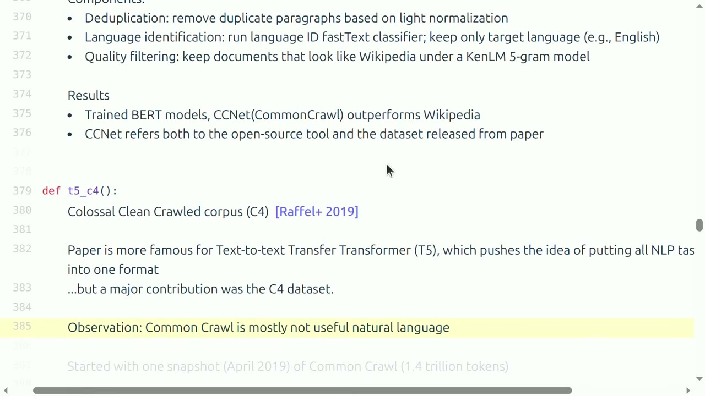

稍后有人在 C4 上做了一些分析，显示当时涵盖的网站。你有一堆 Wikipedia，专利也是很常见的内容。他们还发布了一个类似 WebText 的文档。他们也使用 Reddit 帖子中链接的思路——来自 karma 大于三的 Reddit 帖子，并过滤到那些页面。所以他们用这种方法，使用 12 个 Common Crawl 转储得到 17GB 文本。记住，WebText 是 40GB，这意味着 Common Crawl 可能是不完整的，或者并不包含所有内容，因为如果它包含所有内容，你应该能达到 40GB。他们展示了在当时你可以用这些数据提升一系列 NLP 基准的表现。

*[52:36](https://www.youtube.com/watch?v=-qm0ln33G24&t=3156)*

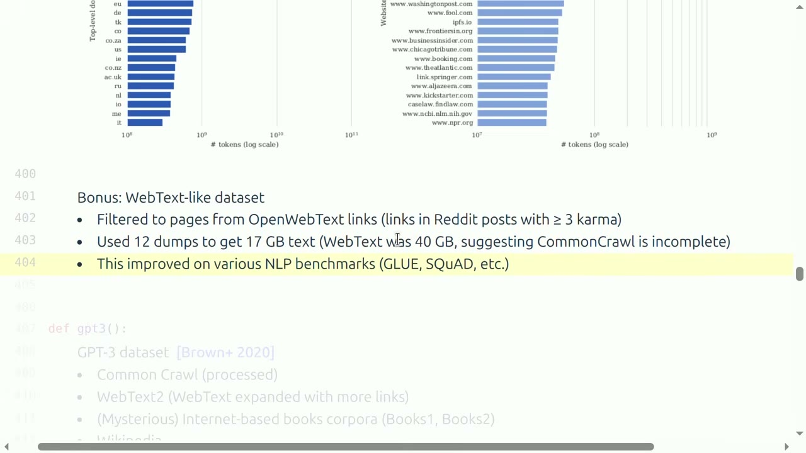

所以我们看到了使用规则、看起来像 Wikipedia、Reddit 链接。现在讲 GPT-3。GPT-3 的数据集：他们用 Common Crawl，自己做处理。还有 WebText，本质上是 GPT-2 数据集但扩展了。注意有重叠。Common Crawl 确实和它重叠，但这在某种意义上是更 targeted 的分布。论文里还描述了 Books1 和 Books2，这是基于互联网的书籍语料，到底具体是什么仍然是个谜。还有 Wikipedia。结果大约 500GB 文本，4000 亿 token。为了做 Common Crawl 处理，他们训练了一个质量分类器，区分他们认为是高质量的东西和其余，还做了模糊去重，因为 WebText 和 Common Crawl 有重复。这篇论文遵循了用分类器做质量分类的思路。

*[53:54](https://www.youtube.com/watch?v=-qm0ln33G24&t=3234)*

GPT-3 出来后，这是个大事件。有很多努力试图在开放环境做事情。最初的努力之一是 The Pile，来自 EleutherAI 的草根 effort。他们在 Discord 里有一堆人一起搞，找出高质量来源。最后列出这个清单。今天这仍然相当有趣和多样。它有 Common Crawl、PubMed、Books3（我们后面会讲）、ArXiv、GitHub、Wikipedia、IRC、另一个 BooksCorpus、Philosophy Papers 等等。他们还包括 Enron Emails 数据集。Enron 在 2002 年破产，所有邮件被发布，这是我们少数邮件数据集之一，我觉得对邮件来说分布很奇怪，但这就是你得到的。

*[55:23](https://www.youtube.com/watch?v=-qm0ln33G24&t=3323)*

说说书。Project Gutenberg 1971 年启动，只包括获得版权 clearance 的书，大多是公共领域。还有把 Gutenberg 打包成 PG-19，就是 2019 年之前的 Gutenberg，我猜是大多数，因为要进入公共领域得等 75 年。Books3 是出现在 The Pile 里的有趣数据集。它被描述为来自 shadow library Bibliotik 的 20 万本书，包含你最喜欢作者的所有书。当时——再次，2020 年——没人在意。人们用它训练模型，后来它被下架。所以你现在不能、也不应该再用 Books3。我们后面还会回到 Books3。

*[56:45](https://www.youtube.com/watch?v=-qm0ln33G24&t=3405)*

Stack Exchange 你可能用过不少，不过现在因为 AI 可能用得少了。有一堆用户贡献的问答，2008 年开始。这个数据集有趣的一点是它是 Q&A 格式，相当接近真实应用。通常你以为预训练数据就是 Wikipedia 文章那种原始文本。但 web 有些部分实际上看起来像监督数据，像你想问语言模型的东西。我觉得这可能帮助模型学习某些问答行为。不是所有东西都超级神奇地 emergent，而是这种数据确实存在于 web 上。这个数据还有元数据，比如投票数，有助于过滤。同样，数据以 dump 发布，你可以直接下载而不爬取。

*[58:05](https://www.youtube.com/watch?v=-qm0ln33G24&t=3485)*

现在到 2021 年。DeepMind 有另一篇论文。他们训练了一个叫 Gopher 的模型，从未发布，实际上被 Chinchilla 取代了。但数据的描述我觉得非常好。你应该读这篇论文，因为他们在描述数据处理方面非常彻底，除了有些地方不告诉你数据里有什么。他们创建了 MassiveWeb，还有 C4，记住那是我们之前看过的 Google 数据集。他们训练 books、news、GitHub 和 Wikipedia。他们不说怎么得到那些的。对于 MassiveWeb，他们保留英语、去重，质量过滤也基于手工规则。部分原因是他们对此有更多控制。所以你可以看到，有人想用规则，有人想用分类器。他们得到了名字所说的海量文本，但模型只在这个数据集很小一部分上训练。

*[59:40](https://www.youtube.com/watch?v=-qm0ln33G24&t=3580)*

2022 年 Llama 1 出来，这里的数据集——这其实是一篇很好的论文，详细描述了数据处理。这可能是最后一批非开放但完全公开谈论数据处理的模型之一。他们用 CCNet 处理 Common Crawl。分类是页面是否为 Wikipedia 的 reference，而不是它是否实际是 Wikipedia 文章。想法是，Wikipedia 文章可能太 stylized，而 Wikipedia 引用了很多其他文章，那些大概好，所以称那些为好网站。他们有 C4，对 GitHub 做处理保留 permissive license，Wikipedia。他们训练 Books3 和 Project Gutenberg。Books3 真的给他们惹了很多麻烦，因为他们向世界宣布，嘿，我在这个数据集上训练了。你回头看，这来自哪里？来自 The Pile。来自 shadow library。所以人们不再想谈自己的数据了。他们看了 arXiv，实际上用 LaTeX 做处理，Stack Exchange，得到 1.2 万亿 token。他们没有发布这个数据集，但描述足够，后来被 Together 的 RedPajama V1 复现，然后被用于其他来源。如你所见，RedPajama V1 最初也包含 Books3，现在已被剥离。早期关于版权的各种决定实际上影响很大。

*[61:53](https://www.youtube.com/watch?v=-qm0ln33G24&t=3713)*

## RefinedWeb、FineWeb、Dolma、DCLM、Nemotron
讲讲 RefinedWeb。这篇论文试图说明 web 数据就是你需要的一切。web 在某种意义上是全部。我们谈过所有专门来源，GitHub、arXiv、Stack Exchange。他们说，如果我们只用 web 会怎样？他们做好了 HTML 到文本的转换。他们用 Gopher 规则过滤，基本上保留像英语的东西。他们当时明确说避免 ML-based filtering 以避免 bias，不想找到 web 中过于狭窄的子集。他们做去重，得到 5 万亿 token，发布了约 6000 亿。

*[62:51](https://www.youtube.com/watch?v=-qm0ln33G24&t=3771)*

Hugging Face 的 FineWeb 是 RefinedWeb 的复现，但改进了。他们取了当时所有 Common Crawl dump，做过滤——同样用手工规则避免注入 bias——去重，做 PII removal，得到 15 万亿 token。你可以看到这些数据集的规模增长相当多。

*[63:26](https://www.youtube.com/watch?v=-qm0ln33G24&t=3806)*

然后有 AI2 的 Dolma 数据集。这包括他们自己处理的 Common Crawl、The Stack（我们后面讲）、C4（你知道）、以及一堆其他东西。Reddit 数据来自一个叫 PushShift 的项目。当时你还能拿到这些数据，在事情被锁死前可以训练。AI2 有自己的学术论文 crawl，叫 Semantic Scholar，所以他们基于那个派生了一个数据集。看他们的 Common Crawl 处理：他们用语言识别，这是 model-based，但质量过滤仍然避免 model-based filtering。然后用规则和分类器移除 toxicity。他们从中得到 3 万亿 token。

*[64:37](https://www.youtube.com/watch?v=-qm0ln33G24&t=3877)*

DCLM 也许是 model-based quality filtering 开始真正成为 norm 的节点。DataComp 最初的动机是定义 pipeline，让人们用标准方式尝试不同数据方法并展示结果。但我认为人们主要用它发布的数据集来训练模型和做其他事。他们处理 Common Crawl 产生 DCLM-pool，完全未过滤，240 万亿 token。这可能比任何人真正训练用的 token 都多。但很多质量很低。然后他们有 pipeline 过滤：只保留英语，用规则缩小，去重，然后做 model-based filtering，最终得到 1.4%。这个数据集我们后面会看到效果相当好。模型过滤训练分类器：他们用 OpenHermes，本质是 GPT-4 生成的指令数据，还有 ELI5，一个问答 subreddit。这些是 ELI5 里的问题类型。总之你懂思路。有点奇怪，但不知怎么有效。负例来自 RefinedWeb，记住那只是非常松散过滤的 web，基本上就是 web，有 3.8 万亿 token。他们训练一个 fastText 分类器——把它想成线性分类器。然后他们展示这个神奇的质量分类器击败了他们尝试的很多其他东西。DCLM 有一段时间在开放社区成为质量过滤的 gold standard。

*[67:26](https://www.youtube.com/watch?v=-qm0ln33G24&t=4046)*

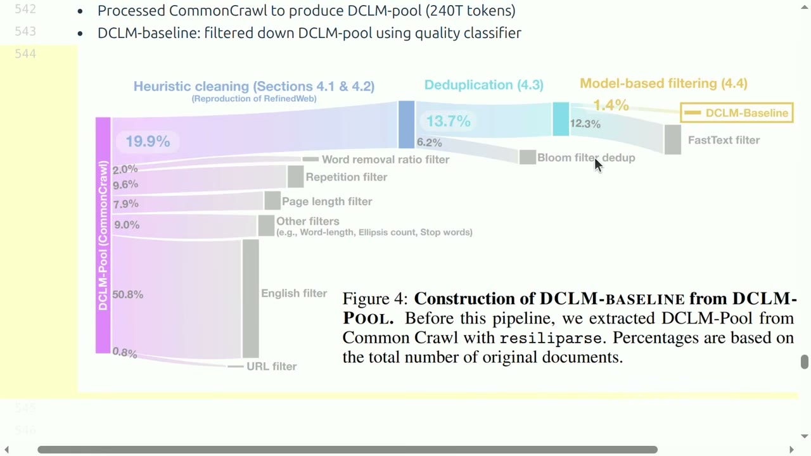

接着讲 Nemotron。这是 NVIDIA 的。他们说 DCLM 过滤太激进，移除了大部分数据。记住他们只得到 3.8 万亿 token。所以我们需要更多 token。怎么办？我们做更 elaborate 的事。我们提示现有模型根据教育价值给 FineWeb 文档打分。所以提示语言模型，问这个是否有教育价值？得到一堆标注，训练一个 fastText 模型，这就是一个分类器。另一个分类器直接用 DCLM 分类器。我们会用这些分类器。我们还会使用合成数据。这大概是其中之一——我不知道是不是第一个，但它是真正倾向于用合成数据进行预训练的主要数据集之一。对于低质量数据，按照这些分类器的判定，你用一个语言模型改写它，让它更像 Wikipedia。对于高质量数据，我们用一个语言模型生成各种任务。例如，给定一篇 Wikipedia 文章，我可以生成问答，或者生成“请总结这份文档、从中提取关键信息”等等。所以他们构建出一个包含 6 万亿 token 的数据集。这比 DCLM 大得多。作为参考，这在某些标准来看仍然很小。Llama 3 是在 15 万亿 token 上训练的，Qwen3 是在 36 万亿 token 上训练的。虽然有这个——不清楚这些去重后的 token 有多大，因为看语言建模论文里的 token 计数时，有些是重复的。比如你跑两个 epoch，就是 token 数量的两倍，所以看这些数字时必须小心。他们表明这个数据集更好。他们的高质量子集超越了之前的数据集。

*[70:07](https://www.youtube.com/watch?v=-qm0ln33G24&t=4207)*

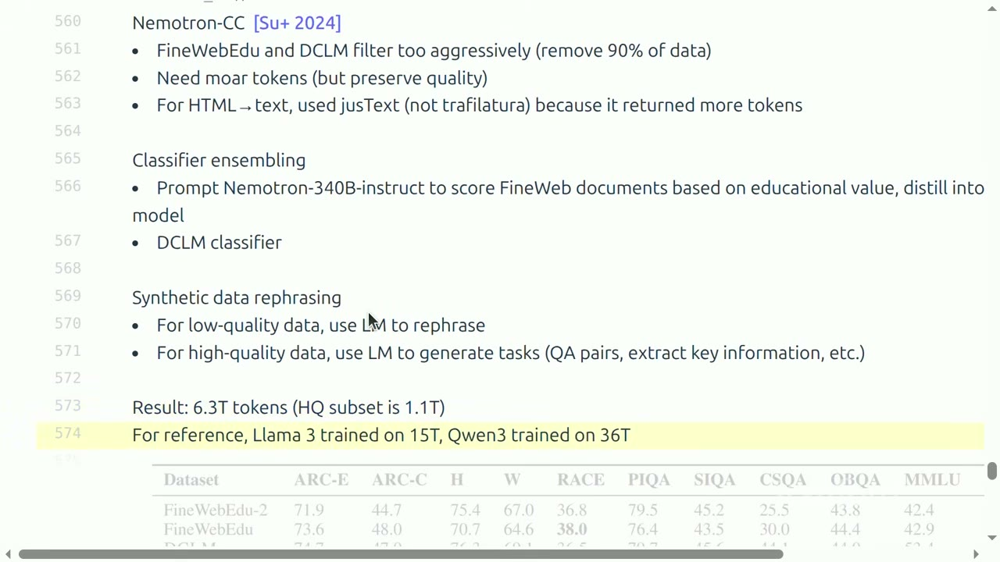

到目前为止，我们看到了各种不同的过滤方法。我觉得所有这些在某种程度上看起来都很相似。你进行一次网页爬取，可以选择我要用规则过滤，或者我要用模型。如果我要用模型，那么我必须判断什么样的数据看起来是好的，然后尝试训练一个分类器，对我所有文档分类，然后筛选。似乎存在一种权衡：你可以使用大量 Common Crawl——如果你想要，可以得到 240 万亿 token，但那可能是非常低质量的数据。或者你可以得到一万亿 token，两者之间存在某个最佳平衡点。

*[70:55](https://www.youtube.com/watch?v=-qm0ln33G24&t=4255)*

## 代码数据：The Stack 与 Stack V2
让我谈最后两件事。代码，回到许可问题。The Stack 是一个非常好的项目，它试图构建非常好的代码数据集，因为到 2022 年已经很清楚代码将变得非常重要。他们在最初版本中克隆了 137 个仓库。保留采用 permissive license 的仓库，移除近似重复，最终得到——抱歉——3TB 代码。然后在 2024 年更新。这里他们更多利用元数据，比如 GitHub 上的 issue、评论和 PR，以及来自 Software Heritage 的仓库，我们之前讨论过。他们还从各种网站抓取文档，通过爬取这些网站。他们做了大量处理。GitHub 仓库中有二进制文件，你可能不想用它们训练。其中有恶意软件，要清除掉。GitHub 上很多内容，尤其是 PR，是 bot，所以必须过滤。去重，做 PII 脱敏。有大量 pull request 之类的东西，他们基本进行子采样以保持代表性，让数据集可管理。

*[72:24](https://www.youtube.com/watch?v=-qm0ln33G24&t=4344)*

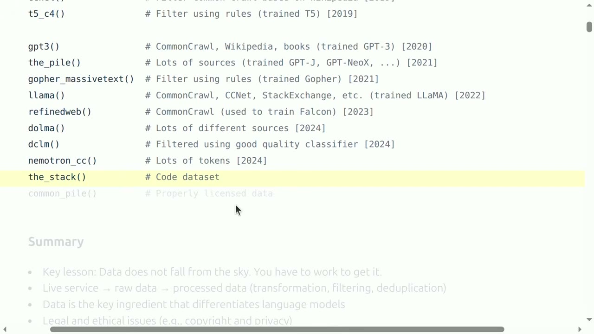

他们还做了这件事，我觉得很好：外面有很多编程语言。Python 很多，C 很多，但低资源语言如 Nim——我之前甚至没听过——不常见。所以他们把代码编译成低级中间语言 LLVM，所有像 C 编译器都能编译成它，然后把低资源语言和中间表示并置。这样语言模型可以学习共享低层表示之间的映射，而共享低层表示有很多数据，它数据少的语言则没有。为了好玩，你还加入所有其他好东西。Stack V2 主要是代码，加上用于训练他们编码模型的其他东西。关于 pull request 的一点是，PR 和所有元数据本质上不是线性序列。所以必须采取步骤把它线性化。一个重要决定是提供多少上下文。例如，一个事件可能只是我改了一行代码。那可以只是一行，但要学习它，你可能想提供一些上下文，也许周围几行，也许那个 diff 周围的整个文件。这些是线性化的设计决定。最终他们训练的 token 看起来像 XML 结构数据：你有 PR，然后一堆 diffs。对于评论，你有基本事件：发布了评论、PR 的 review 状态是什么，等等。所以不只是学习生成代码，还学习代码周围的软件开发过程。

*[74:44](https://www.youtube.com/watch?v=-qm0ln33G24&t=4484)*

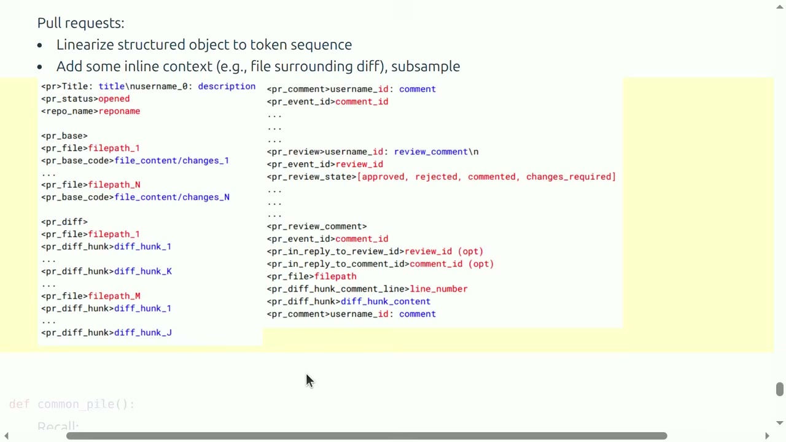

## Common Pile 与总结
最后讲 Common Pile。回忆一下，互联网上几乎所有数据都有版权。有些是 permissive licensed，有些甚至在公共领域。虽然你可以援引合理使用说“我还是要训练”，但这还没完全 settled。所以如果你非常非常风险厌恶，你会说，如果我不知道它是否 OK，那就是不行。如果你采取这种态度，Common Pile 就是这样做的。你能只用 permissive licensed 数据训练好模型吗？或者说，能走多远？这个项目搜遍互联网，找所有可能值得训练、且 permissive licensed 的不同类型数据。它包括代码的 Stack V2。事实证明很多政府 proceedings 其实是 permissive licensed，wikis、web 上一些东西——有些新闻网站其实 permissive licensed，学术论文、在线论坛、公共领域的东西、教育资源等等。最后有 8 TB 数据，对 permissive 数据来说其实相当不错。

*[76:29](https://www.youtube.com/watch?v=-qm0ln33G24&t=4589)*

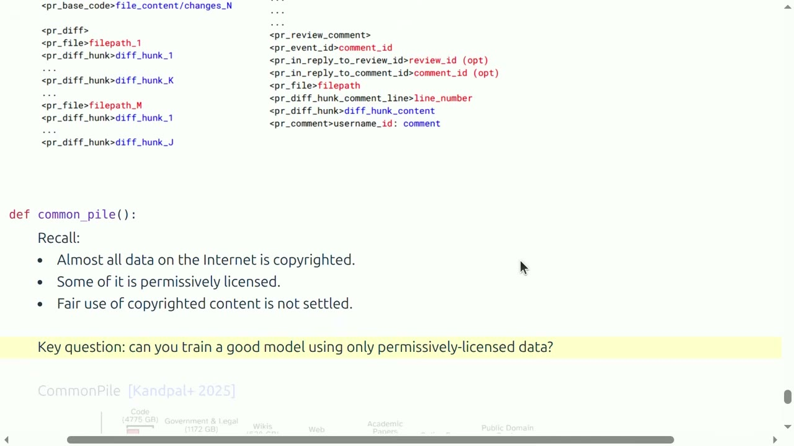

做这个项目实际上比听起来难得多。不是简单看 license，哦 Apache 或 CC，好。有一些微妙之处，比如 license laundering。人们对 license 很粗心。有人可能拿版权作品，直接贴上 CC BY。任何人都能在互联网上写这个，很难判断是否真实。还有常见做法，比如 Dolma 是 permissive 的。记住 Dolma 是 AI2 的集合。但集合许可证并不延伸到单个作品。这个集合是——首先，集合是否可版权是个问题——我认为集合可以受版权保护，但你可以给任何东西加许可证。但单个作品不一定没问题。所以你不能只看 Hugging Face 上的数据集，而且你——你在 Hugging Face 上看到的许多数据集有 permissive 许可证。但如果你深入挖掘，实际上在单个层面上并不是 permissive 许可的。他们还决定放弃训练任何合成数据，因为在未授权数据上训练语言模型是不明确的。所以可能没问题，因为从技术上讲，这些是 MIT 许可证的开放权重模型。你可以做任何事。你可以随心所欲使用它们，但这些语言模型想必也训练在未授权数据上。所以如果你真的诚实，这有点像数据洗白。

*[78:36](https://www.youtube.com/watch?v=-qm0ln33G24&t=4716)*

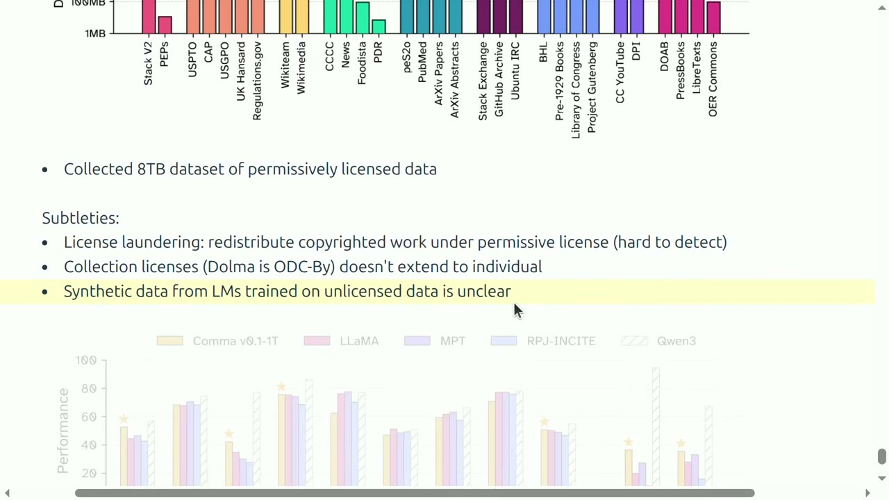

用这些数据，他们将其与一堆其他模型比较，比如第一个 Llama、MPT 和 Qwen。在一堆基准测试上，他们表明这还不错。我会说它肯定不如 Qwen 模型，但它肯定胜过那些非常老的——这是 2023 年的，我猜。所以相当老的模型。我会说，这里的结论是你可以做得相当不错，但我认为不做更多 token 仍然很难竞争。但我不认为这是最终定论，而且我认为如果你尝试，可能可以从 permissive 数据中榨取更多。

*[79:29](https://www.youtube.com/watch?v=-qm0ln33G24&t=4769)*

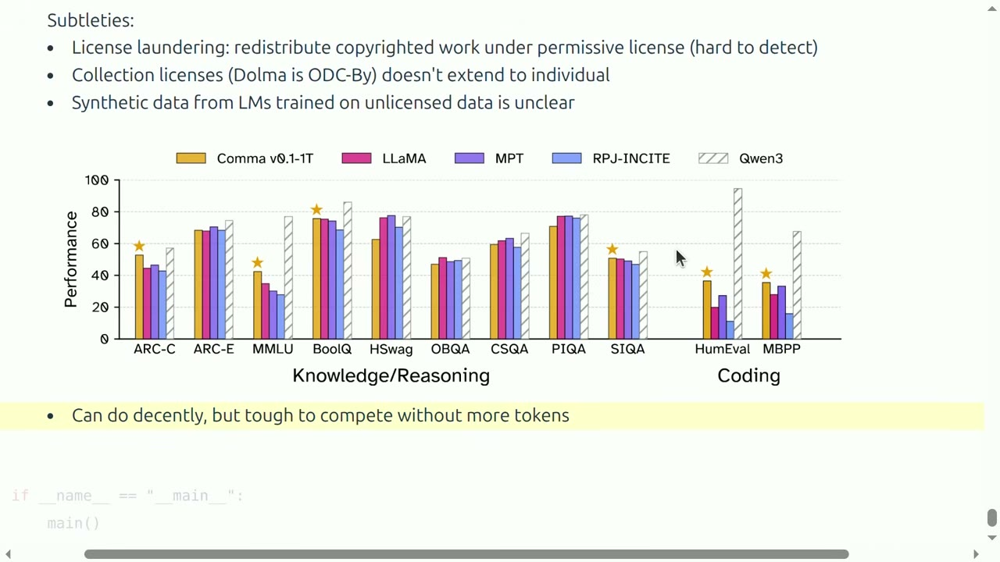

总结这堂课。希望现在我已经让你 appreciate 数据是一个非常丰富的主题。数据不是从天上掉下来的，也不是你去 Hugging Face 下载一个数据集就完了。数据必须来自某处。而且数据还有技术和社会背景，因为在最上层，互联网是一堆活服务。必须有人做生产原始数据的工作，无论是网站给你 dump，还是有人建 crawler 之类。然后必须有人决定如何把它处理成可用形式——过滤、转换、去重，所有这些都影响最终语言模型的质量。注意过滤大概是最重要的事情之一。你怎么从 200 万亿 token 到少于 3 万亿 token？我认为这显然是巨大缩减，值得很多关注。数据在某种意义上是区分语言模型的关键成分。很多语言模型大致是同样的 Transformer 架构，但数据取决于你怎么处理，能造成很大差异。数据周围有大量法律和伦理问题，超过我在这堂课能讲的范围。而且这个过程非常 messy。不像这门课其他部分可能更基于第一原理，数据处理至少现在很多是基于你设定的 vibes。你定义这个分类器，定义这个规则，设一些阈值。所以有很多改进机会。做作业四时，也许想想有没有更好的方法，这可能是一个研究方向。今天就到这里。下次我会继续讲数据，讲一点 post-training 数据，以及更多关于过滤的内容。

*[81:52](https://www.youtube.com/watch?v=-qm0ln33G24&t=4912)*

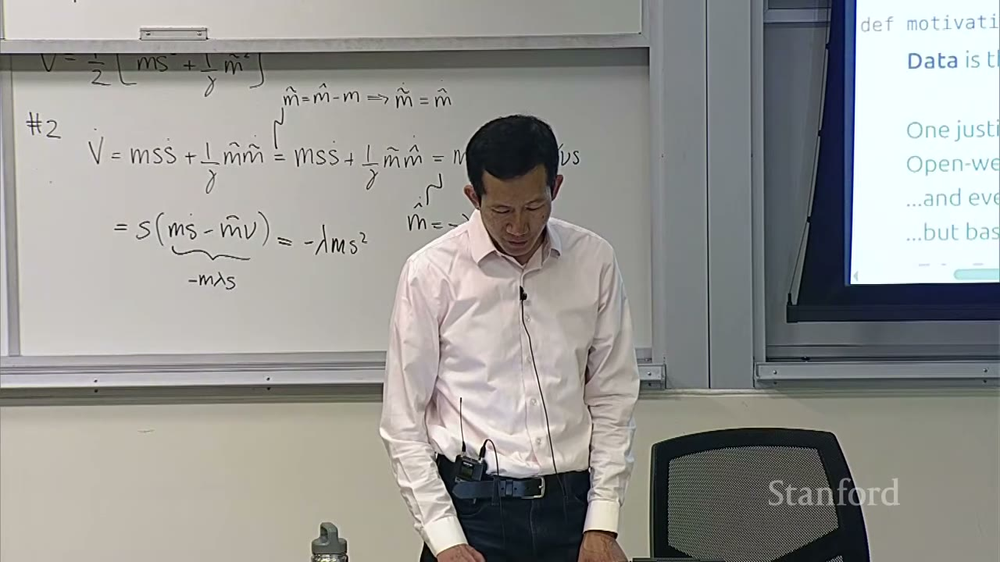
