# 从原始网页到后训练数据：变换、过滤、去重与混配

这堂课接续上一讲的数据主题，讲预训练数据流水线中的变换、过滤、去重、混配，并概览后训练数据尤其是合成数据的使用。

## 从上一讲继续：今天的数据流水线路线

好，我们开始吧。今天是数据部分的第二天。上次我们讲到，数据并不是真的从天上掉下来的，你必须认真思考它从哪里来。一般来说，互联网由各种在线服务组成，这些服务上的数据要么被导出，要么被爬取，然后还有额外一步：你必须处理这些数据。我们还谈到了各种社会层面的考虑，比如服务条款、版权；你要么获得许可，要么主张合理使用。所以数据这件事本身包含很多复杂性。

今天我们要更多关注数据流水线，从变换数据、过滤数据，到去重和混配。最后我们会加一点后训练数据的内容，特别是现在大家如何使用合成数据。第一部分主要讲预训练，你应该带着这个背景来听。

*[01:14](https://www.youtube.com/watch?v=5sxHosTLPF8&t=74)*

## 原始数据并不是文本：HTML、PDF 与 GitHub

我们已经谈过一点数据变换，但这里再提醒一下。原始数据并不是以文本形式出现的，即使你爬取到了一些东西。如果你看过 Common Crawl 里面，它不是文本，而是 HTML；有时候是 PDF，或者在 GitHub 的情况下是目录结构。所以变换数据的大部分注意力都花在处理 HTML 上，因为大部分网页都是 HTML。这个处理过程很多是启发式的：去掉样板内容，比如导航和广告；提取内容，也就是页面的主要部分。关于什么算内容，还有不少微妙之处。

通常你会去掉页脚、页眉，也许还有菜单这些东西，然后尝试提取内容。但你可以想象，在某些情况下，一些导航元素可能有助于模型学习网页长什么样。所以什么是内容、什么不是内容，并不总是很清楚。还有，网页里的图片和表格怎么办？本质上，这是一个有损过程，因为你需要把 HTML 线性化成一个 token 序列，而 HTML 至少是层级化的，或者从渲染输出来看是视觉化的。表格尤其难处理：简单表格可以用 Markdown 渲染，但如果你有嵌套表格，那就相当有挑战性。某个时候你不得不放弃，或者做近似。

*[03:07](https://www.youtube.com/watch?v=5sxHosTLPF8&t=187)*

所以，通常 HTML 到文本的处理是基于规则的。原因是基于规则的处理非常快，而且你在这里并不想做得太多，不需要太多智能，所以基于规则的方法一般够用。我认为现在也许有理由引入基于模型的干预，但它们必须非常快，并且必须做更智能的事情。不过如果你看过数据，你会注意到数据里有很多不完美之处，因为任何基于规则的处理都有一定的失败率。就像我们上次展示的，准确率确实重要，取决于你选择哪个工具。如果你用 Resiliparse 或 Trafilatura，那么——我猜 Resiliparse 在这些扩展的 DCLM evals 上比其他的工作得更好。

*[04:14](https://www.youtube.com/watch?v=5sxHosTLPF8&t=254)*

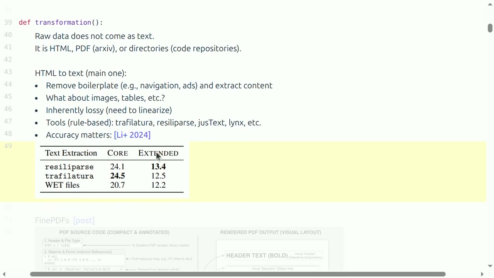

## PDF 的价值、截断与 OCR 成本

我也会简单谈谈 PDF。Hugging Face 有一项工作，发布了一个叫 FinePDFs 的数据集。如果你不是用 PDF 阅读器打开 PDF 文件，它看起来像这样，需要被渲染。PDF 可以在互联网网页上找到，Common Crawl 里确实有一些 PDF。一般来说 Common Crawl 聚焦文本，但有时候你只拿到一个 URL，在抓取之前甚至不知道它是不是 PDF，如果它没有扩展名的话。

如果你读这篇博客文章，里面有很多细节，我就不展开了。比如，Common Crawl 里的很多 PDF 是截断的，因为 PDF 很大，所以这就要求重新爬取。然后还有一个问题：一旦你有了 PDF 文件，你怎么把它转成文本？有些 PDF 可能只是扫描件，本质上就是图像。这篇论文试了一堆工具，但大部分涉及使用 VLM 做 OCR。这显然比我们之前处理文本要昂贵得多。幸运的是，或者说 unfortunately，PDF 只占整个互联网很小一部分。

*[05:45](https://www.youtube.com/watch?v=5sxHosTLPF8&t=345)*

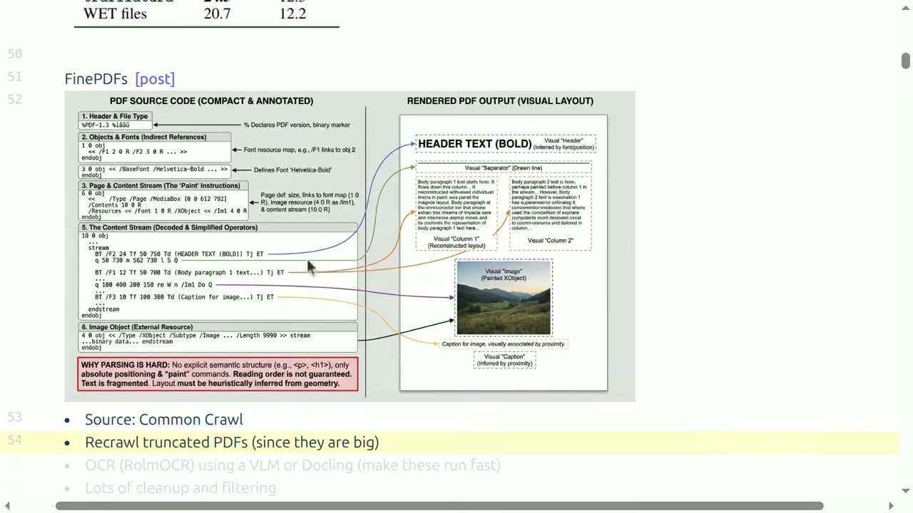

但它们非常有价值，因为一般来说，如果你费劲做了一个 PDF，那说明你可能有值得说的东西，而不是随便一个网页。所以平均而言，PDF 的质量通常比 HTML 文件高。这里有很多清理和过滤工作。而且 PDF 比网页更严重的一点是，大量布局信息丢失了。因为在 HTML 里你有 h1、p 等各种标签，能给你一些语义信息；而 PDF 从设计上就是关于布局的，所以你不一定能保留语义结构。

*[06:34](https://www.youtube.com/watch?v=5sxHosTLPF8&t=394)*

## 过滤的抽象框架：目标数据、原始数据与评分函数

到这里，已经做了很多变换。你现在有文本了，但还没完，远远没完。下一步是过滤。我会稍微抽象地讲讲过滤是什么。这里有一个基本构件。假设你有一些想要得到的目标数据，通常是一小部分高质量数据；还有大量原始数据，这是从上一个步骤变换来的新鲜 token 货物。目标是找到原始数据的一个子集，使它和目标数据相似。这就是过滤的一般骨架，几乎所有类型的过滤都落在这个模式里。

过滤有很多理由。如果你想训练一个英语语言模型或德语语言模型，你可能想识别语言，并过滤掉不匹配的语言。过滤的主要理由是质量过滤：你想找出高质量的东西，而不是低质量的东西；你不想要垃圾，你想要百科式信息。另一个应用是毒性过滤。当然，互联网有大量恶劣内容，也许你不想在这些内容上训练语言模型。对于一个过滤算法，你希望它从目标数据中具有一定的泛化能力，因为你已经有目标数据了；你不希望只得到目标数据本身，而是希望泛化出去。同时你还希望它极其快，因为你必须在整个互联网上运行它。这可能是 100 万亿 token 的数据。所以一般来说，过滤之后你最终只保留整个数据的很小一部分，个位数百分比。

*[08:49](https://www.youtube.com/watch?v=5sxHosTLPF8&t=529)*

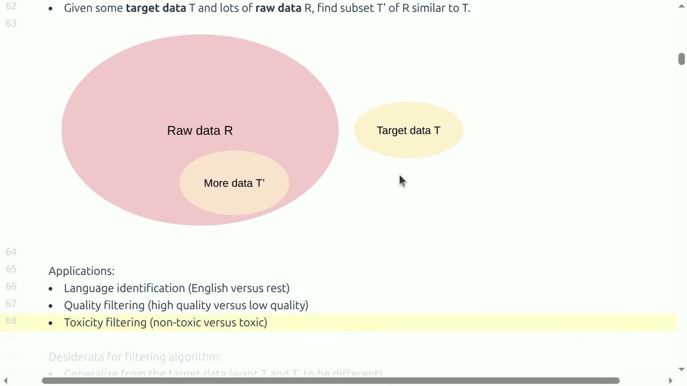

记住这个一般框架：给定目标数据和原始数据，你要找一个子集。一般方案是基于 R 和 T 估计某个模型，推导出一个评分函数，然后根据分数保留 R 中的样本。通常有两类分类器。一类是生成式模型：你有目标数据，你可以直接估计目标数据的模型。记住这必须便宜，所以你可能不会训练一个大语言模型；一般来说，KenLM 就是说我训练一个 5-gram 模型。更常见的是训练一个分类器。分类器说，我要预测正标签，比如属于目标 T；负标签是原始数据 R 中但不在 T 中的东西。基本上，T 是正例，从 R 中随机取一个子集作为负例，也许做平衡，然后训练一个分类器。

大家一般用的工具是 fastText，因为它快。一般来说它就是一个线性分类器，词袋模型。一旦你有了这个模型，对每个新文档你都可以打分，然后根据你的质量门槛设置合适的阈值，保留样本。有时是随机保留，有时不是。这就是一种非常基于模型的过滤方法。

*[10:41](https://www.youtube.com/watch?v=5sxHosTLPF8&t=641)*

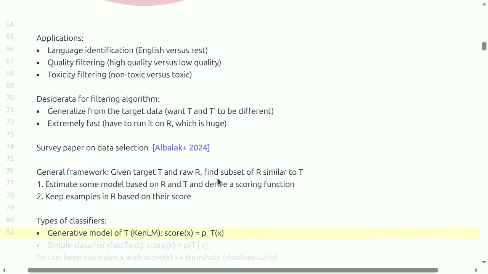

## 为什么现在几乎人人都在做模型式过滤

记得上一讲提到，很多几年前的数据库没有使用基于模型的过滤，因为他们不想让数据偏差太大。现在我觉得基本上每个人都会做一定程度的基于模型的过滤。除非你算力非常充裕——那样你可能不需要做那么多过滤，可以直接在所有数据上训练。但大多数人是算力贫穷的。你必须非常聪明地做过滤，否则你只是在低质量内容上浪费 FLOPs。

*[11:21](https://www.youtube.com/watch?v=5sxHosTLPF8&t=681)*

## 语言识别过滤

好，我来讲几个过滤的具体实例。记得我提到过语言识别。目标就是：给一段文本，检测它是不是某种语言。Meta 训练了一组 fastText 语言识别模型，通常你可以开箱即用。它支持 176 种不同语言，是在一堆多语言网站上训练的。比如 Wikipedia 有很多语言，还有翻译网站和不同语言的网站。语言 ID 一般相比我们处理的许多其他任务来说是相当容易的问题，是一个简单分类器。你看几个词就能判断它是西班牙语还是日语。

当然也有微妙之处，比如代码切换（code-switching）和文本中的方言。所以我不会说这个问题被绝对解决了，但这并不是训练一个好语言模型的瓶颈。一旦你有了分类器，你只要选一个阈值。这通常相当启发式。

*[12:39](https://www.youtube.com/watch?v=5sxHosTLPF8&t=759)*

## 定向找数学数据：OpenMathText

过滤还能做的一件事是：假设你在找某种类型的数据。比如你想在数学上变得很强，所以你想去找一堆数学数据。OpenMathText 是 2023 年的一篇论文，目标是创建一个大型数学文本语料库。这个流水线包含几步，不是训练单个分类器。首先，你用一些规则过滤，比如它是否包含 LaTeX 命令。他们还用了 KenLM，这是一种生成式方法，在 ProofPile 上训练，也就是一个已知的数学数据集，如果困惑度低于某个阈值就保留。

然后他们还训练一个 fastText 分类器，预测它是不是数学写作。这里有两个不同的阈值：如果文本里有 LaTeX，门槛——抱歉——门槛更低；如果没有 LaTeX，门槛更高。结果他们得到了 150 亿 token，用来训练模型。有论文表明，这种更有针对性、精心策划的数据收集，训练出的模型在数学上比那些在 20 倍数据量上训练、但没有这样过滤的模型更好。

*[14:07](https://www.youtube.com/watch?v=5sxHosTLPF8&t=847)*

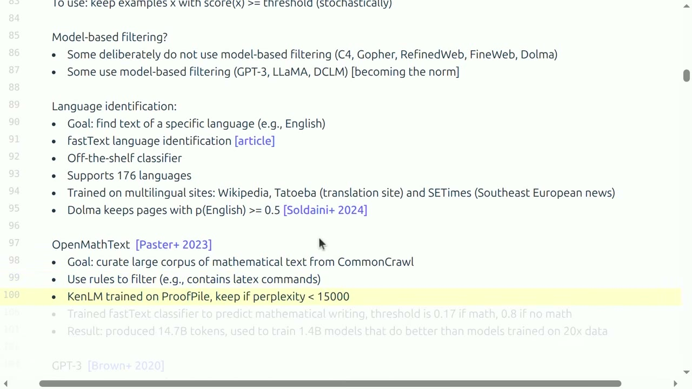

## 质量没有普适定义：GPT-3、LLaMA 与 phi-1

所以质量过滤，再想一次，把它当作一个工具。你可以按自己的意愿定义质量。没有普遍的质量概念。如果你想定义质量为数学，那你就可以去抓数学数据，然后模型在数学上会更好。GPT-3，我想上次提过，但放到这个框架里看：正例是 Wikipedia、WebText，也就是从高赞 Reddit 帖子链接出去的页面，还有一些书；负例一般从网上采样。他们训练一个线性分类器，如果分数足够高就保留文档。第一版 LLaMA 论文里，正例是 Wikipedia 引用的页面，不是 Wikipedia 文章本身。也是同样的思路。

*[15:02](https://www.youtube.com/watch?v=5sxHosTLPF8&t=902)*

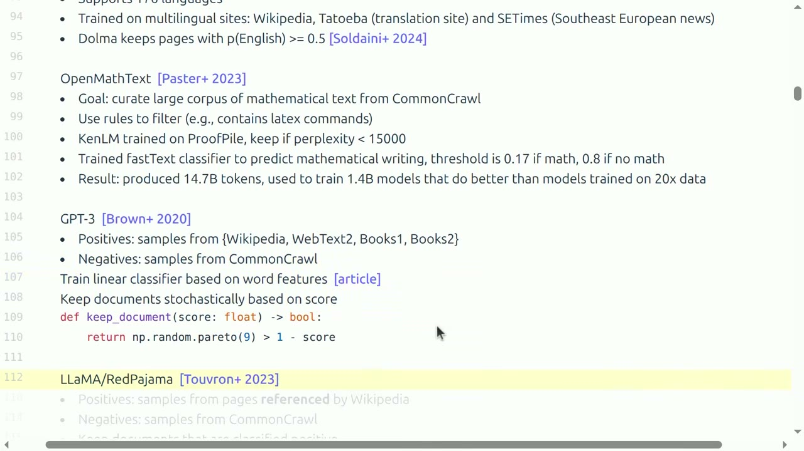

微软的 phi-1 也很有意思地落在这个框架里。他们从原始数据开始——原始数据并不是已经存在的 The Stack 的 Python 子集，记住这全是代码。他们定义了一个 prompt，用来决定教育价值。然后用 GPT-4 以这个 prompt 对 R 的一个 10 万子集分类，被判定为正的保留下来，称为目标数据。所以这里的目标其实是昂贵分类器的输出。然后你训练一个更便宜的分类器，他们用的是随机森林，但其实也可以用 fastText。接着你选择被这个分类器判为正的数据。他们还展示了，用这个数据集比只用原始数据效果好得多，性能能在更少步数内上升到更高值。

*[16:25](https://www.youtube.com/watch?v=5sxHosTLPF8&t=985)*

## 毒性过滤

毒性过滤也是同样的方式。有一个数据集叫 Jigsaw Toxic Comments，来自一个项目，目标是帮助人们在网上更好地讨论。这里的数据是 Wikipedia 的讨论页，对于有争议的话题，讨论可能相当激烈。这些数据被标注了是否存在有毒评论。你可以类似地定义正例和负例，然后训练分类器。现在我想你已经有了工具，或者一些例子和灵感。你可以识别你想要的一种特定数据，为它构建分类器，然后去 Common Crawl 里过滤出这种数据。

*[17:22](https://www.youtube.com/watch?v=5sxHosTLPF8&t=1042)*

## 过滤阈值取决于模型和训练 token 数

我想谈一个微妙之处：你想要什么样的数据，实际上取决于你想训练什么模型。特别是，它取决于你训练时用多少 token。所以不存在一个最优阈值。之前看分类器时，它给你一个分数；你不能说 0.9 就是最好的，因为这取决于你想做什么。直觉上，如果你要训练更长时间，那么你可以容忍质量较低的数据；如果你训练更短，那么一般来说你想要更高质量的数据。当然，如果你能挥魔法棒，训练更久时你也想要更多高质量数据，但这不是你能选择的。数据池就那么大。

*[18:20](https://www.youtube.com/watch?v=5sxHosTLPF8&t=1100)*

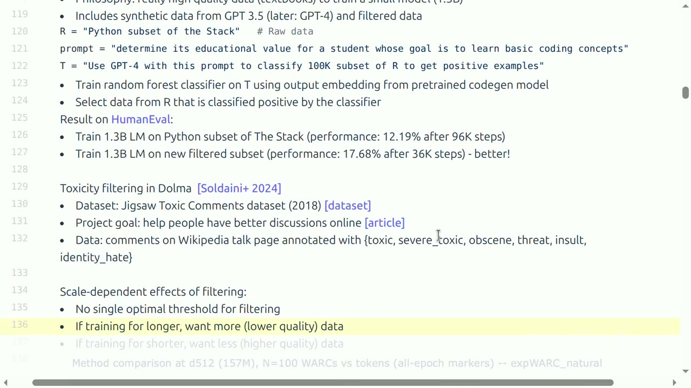

## 一个初步实验：高质量数据与低质量数据的训练曲线

这里是 Michael Ryan 做的一个初步实验。这个图展示的是一个 1.57 亿参数的模型。我们取一个非常小的池子，比如 100 个 works，是 Common Crawl 的一小部分，然后随着时间训练更久。我们看蓝色曲线。蓝色曲线是 dclm。损失从这里开始，然后下降。每条线对应一次在数据上的 epoch。这是第一个 epoch，下一条蓝线是第二个 epoch，以此类推。数据不多，所以最终你必须重复数据。损失继续下降，因为第二次看数据时你还在学东西。到了某个点，你开始过拟合。

而如果你看 Resiliparse，这基本上是没有过滤。这里一开始差很多。但当你继续、继续训练，到某个点你也开始 epoch，它开始下降得更慢。所以你看到这个趋势：在你还没有 epoch 的区间里，高质量数据更好；但一旦到了很多很多 token，高质量数据就不再那么好了。当然，用高质量数据你不想进入这个区间，因为你在过拟合——你可能会在这里停下。但即使在这个点，它也比用低质量数据训练更久要差。

*[20:09](https://www.youtube.com/watch?v=5sxHosTLPF8&t=1209)*

## 关于重复训练和置信区间的问题

有学生问：每个点对应一次训练运行，对吧？做这些重训练实验时，需不需要做置信区间，还是跑一次就够了？老师说，问题是每个点是一次训练运行，应不应该重复多次得到置信区间？理想情况下这是好做法。你经常会在论文里看到这些点很稀缺，因为每次训练都相当昂贵。但实际上，当我们做这些实验时，它一般还算稳定，至少对预训练来说是这样。

*[21:04](https://www.youtube.com/watch?v=5sxHosTLPF8&t=1264)*

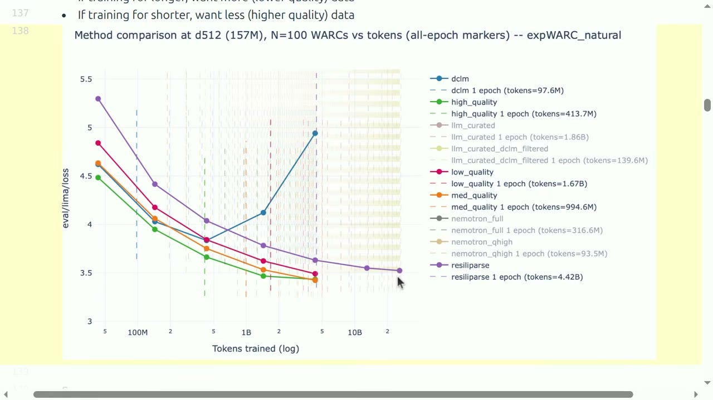

## 高质量数据练更久会不会收益递减

学生又问：你提到训练更久和高质量数据，难道我们不考虑这个组合吗？如果我们在这个高质量数据上训练更久，它相对于用高质量数据训练更久，会不会有递减回报？老师说，问题是，如果你能获得更高质量数据并训练更久，它是否仍然会有递减回报？每个数据集最终都会有递减回报，因为它是有限的。但它可能会在这里，就在下面，然后继续往下走。

*[21:46](https://www.youtube.com/watch?v=5sxHosTLPF8&t=1306)*

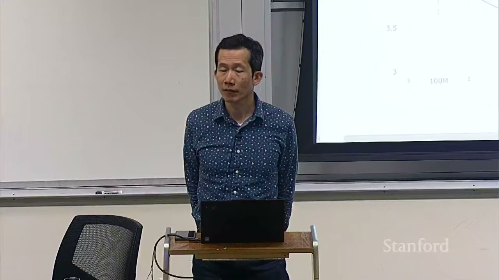

## 过滤小节总结

好，我们继续。总结一下：过滤对于构建好模型相当关键，尤其是像我们大多数人这样算力受限时。技术上，如果你有无限算力，你不需要过滤，可以在所有数据上训练，模型会很大。但现实中每个人都必须过滤。这里的配方是：弄清楚好数据长什么样，然后训练一个分类器，它会外推到其余数据。好数据怎么找？你可以说，啊，外面有这么一个我特别喜欢的数据集，我只想要更多；或者你可以给语言模型构造一个 prompt，用它先过滤一个大池子，然后用这些高质量数据训练一个更小的分类器，再外推到其他所有数据。

*[22:49](https://www.youtube.com/watch?v=5sxHosTLPF8&t=1369)*

## 去重：精确重复、近似重复以及为什么有害

好，接下来讲去重。到这一步，我们已经过滤了数据集，只剩下我们认为是高质量的数据。但数据里经常还有重复。有两种重复。一种是精确重复。比如镜像网站，镜像的全部意义就是它是重复的。有时候网页爬虫不够聪明，不知道这个镜像就是那个镜像，于是它爬了很多网站，你就得到了完全相同的内容。还有，当你 fork 一个仓库时，这也是重复，即使你做了修改。你可能只改了几个文件，仓库 99% 可能都一样。所以重复很丰富。有时候还有近似重复，它们不是镜像或衍生品，只是碰巧文本相同，差几个 token。通常这可能来自复制，或者来自某个共同来源。

*[24:13](https://www.youtube.com/watch?v=5sxHosTLPF8&t=1453)*

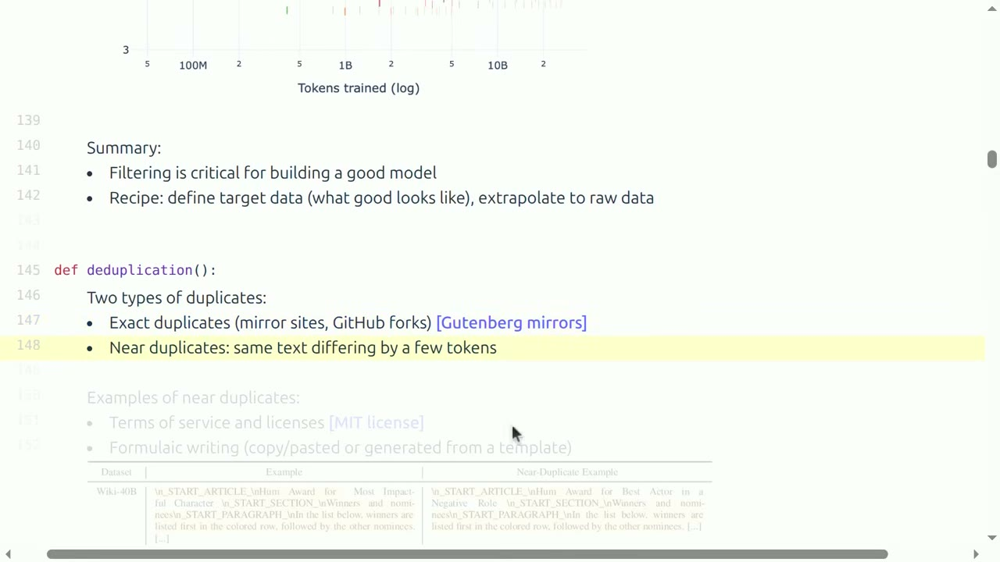

## 近似重复的例子：许可证、页眉页脚、模板

这里是一些近似重复的例子。比如服务条款和许可证。我猜 MIT 许可证可能出现在很多地方。很多情况下它是完全相同的副本，但只是那个许可证相同，除非有人复制时打错字。而许可证所在页面的其余部分可能不同。我们还谈过很多网站有相同的页眉和页脚，那些也是重复。还有这些例子，来自 LM1B，也就是 10 亿词基准。有些文章只是排版差异：一个版本有逗号，一个版本没有逗号。我真的不知道为什么，但确实会发生。有时候你看到模板，这可能是低质量内容，看起来像广告之类，有人把它模板化，然后把 Canada 替换成 USA。

*[25:27](https://www.youtube.com/watch?v=5sxHosTLPF8&t=1527)*

如果你在这种数据上训练，而且训练的是不同实体、不同变体，那就是在浪费 GPU。还有更极端的例子。这就是为什么看数据很重要。对 C4 数据集的审计发现，某个产品描述在数据集里出现了 61,000 次。如果你追溯——这真的很奇怪，我不知道为什么——这是某个防毒面具的描述，就这样在 Common Crawl 的这个数据集里出现了 61,000 次。所以，网络是很奇怪的。

*[26:12](https://www.youtube.com/watch?v=5sxHosTLPF8&t=1572)*

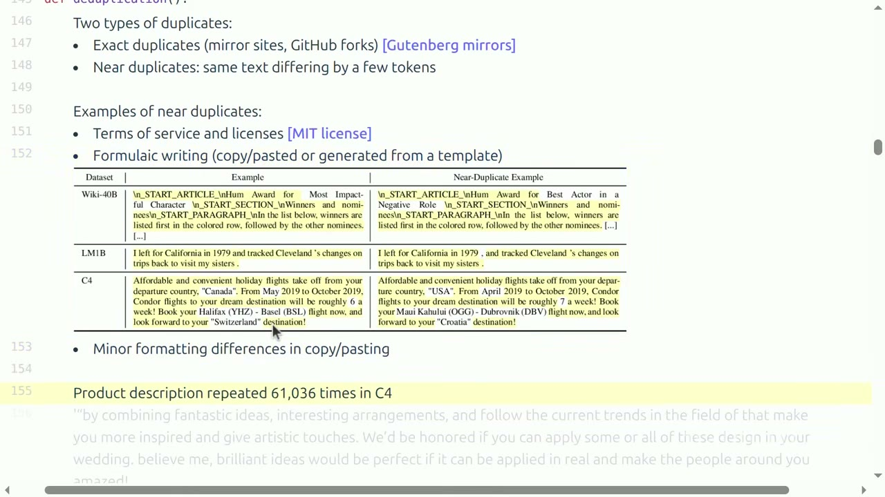

## 为什么去重：省算力、避免记忆和去污染

为什么要去重？第一个想法很清楚：你想更高效地训练。去重减少了数据集大小，但并没有真正丢失信息，因为你只是去掉重复。它还有一个好处是避免记忆化，这篇论文谈到了这一点。比如，如果你有一些重复很多的版权内容，那么你在上面训练就会记住它；还有隐私问题。但大多数情况下，我认为只是确保你不浪费 FLOPs。和去重相关的是去污染（decontamination），这可以说更重要。道理一样：你要确保测试集不在训练集里。

*[27:06](https://www.youtube.com/watch?v=5sxHosTLPF8&t=1626)*

## 去重的设计空间与线性时间挑战

那怎么去重？这里是需要思考的设计空间。首先，你去重的项目是什么？是句子级、段落级，还是文档级？你如何确定匹配？是精确匹配？是存在共同子项？还是对于近似去重来说，共同子项的比例？然后，一旦你在两个页面之间发现重复，你怎么办？是删除所有实例，还是除了一个之外全部删除？关键的算法挑战是：去重本质上是把项目和其它项目进行比较。

通常，如果你做过滤，那是关于单个项目的：这个项目好不好？这可以并行化，是线性时间，这很好。即使在线性时间里，我们也试图通过基于规则或非常小的模型来让它快。但去重显然不能做 n 平方的事情，把每个东西和每个东西比较。你需要线性时间算法来扩展，尤其是在这种网络规模下。

*[28:26](https://www.youtube.com/watch?v=5sxHosTLPF8&t=1706)*

## 哈希函数：密码学哈希与哈希表哈希

所以，通常去重文献使用哈希函数来绕过这个问题。我们会展开一些这些想法。这些是算法社区贡献的很好的想法。我想每个人都知道哈希函数是什么。它取一个值，比如字符串，映射成另一个东西，比如字符串或整数。哈希值比项目小得多。哈希碰撞是指两个不同的项目映射到同一个哈希。看哈希函数时，有非常花哨的、密码学性质的哈希函数，它们抗碰撞，被用在密码学和比特币之类的地方。还有更快的哈希函数，用于哈希表，那里哈希碰撞并不是世界末日。我们会用这些。取一个字符串，把它映射到一些值，这就是哈希函数做的事。

*[29:34](https://www.youtube.com/watch?v=5sxHosTLPF8&t=1774)*

## 精确去重和 C4 的三句跨度做法

精确去重在概念上非常简单。你取一个字符串，看是否有精确匹配，然后除了一个之外全部删除。这里你有一堆元素，你哈希它们，然后去重。精确去重很好，非常清楚发生了什么。但对于混乱的网页数据来说，这还不够好，因为经常有近似重复。注意，实现方式有很多种。这里是有点 MapReduce 风格的写法，更容易并行化和扩展。

*[30:24](https://www.youtube.com/watch?v=5sxHosTLPF8&t=1824)*

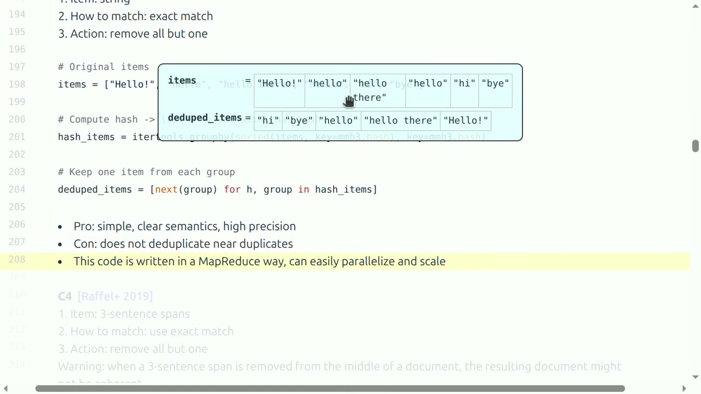

C4，也就是 T5 论文里处理 Common Crawl 的那篇，做了精确去重。他们操作的项目是三句跨度（three-sentence spans）。你做精确匹配，然后除了一个之外全部删除。如果你仔细想，会发现这里有点奇怪：你是在看三句跨度。如果你找到两个文档有三句跨度，然后除了一个之外全部删除，那意味着你会从这个文档里抽掉三句话，这有点奇怪，因为它破坏了连贯性。但这就是他们做的。这就是精确去重。

*[31:21](https://www.youtube.com/watch?v=5sxHosTLPF8&t=1881)*

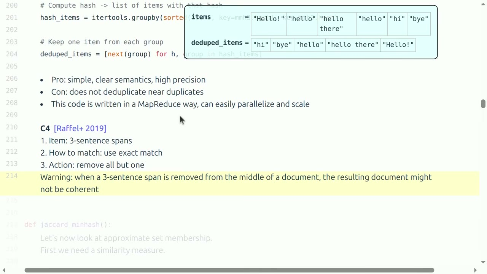

## 近似去重与 Jaccard 相似度

那怎么做近似去重？首先，我们必须定义这里的近似匹配是什么意思。为了做到这一点，我们定义所谓的 Jaccard 相似度，这是一个相当标准的概念。两个集合的 Jaccard 基本上是交集大小除以并集大小。给定两个集合——{1,2,3,4} 和 {1,2,3,5}——计算 Jaccard 时，交集是 {1,2,3}，并集是 {1,2,3,4,5}，相除，Jaccard 是 0.6。Jaccard 是 0 到 1 之间的数。0 表示不相交，1 表示完全相同。这是一个很自然的概念。我们会说，如果两个文档的 Jaccard 相似度高于某个阈值，比如 0.99，它们就是近似重复。现在问题是：如何在线性时间里找到近似重复？

*[32:31](https://www.youtube.com/watch?v=5sxHosTLPF8&t=1951)*

## MinHash：让碰撞概率等于 Jaccard

幸运的是，这是一个已经解决的算法问题。答案是使用 MinHash。好吧，第一步是使用 MinHash，但那不是最终答案。MinHash 是一个随机哈希函数，使得哈希碰撞的概率正好是 A 和 B 的 Jaccard。这是一个很好的性质，因为哈希有利于使事情变成线性时间，而 Jaccard 是我们想要的度量，我们现在在期望意义上把这两者连起来了。

有趣的是，通常你希望哈希函数让不同元素哈希到不同地方，你不想要碰撞。但这里你实际上想要碰撞——不是任意碰撞，而是你想以某种方式控制碰撞，让它与相似度对齐。所以相似的东西你希望它们比不相似的东西碰撞得更多。

*[33:40](https://www.youtube.com/watch?v=5sxHosTLPF8&t=2020)*

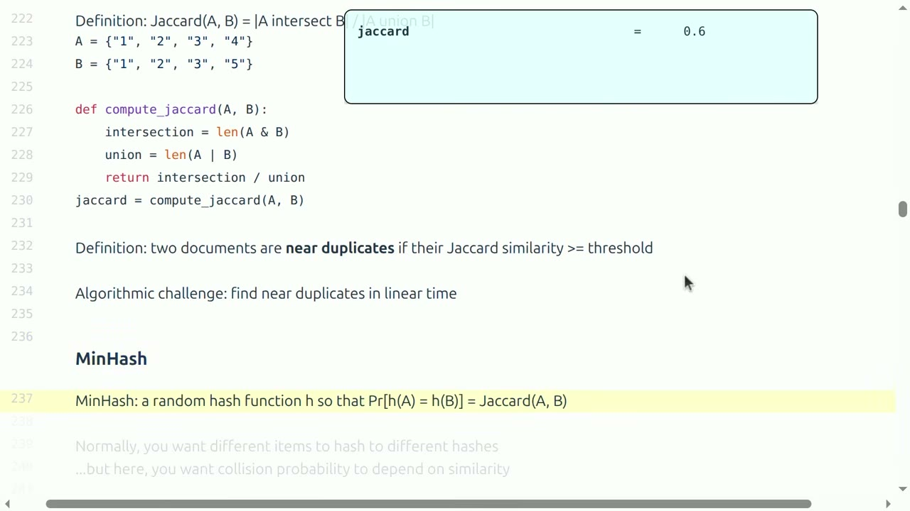

## MinHash 的直觉演示

MinHash 本质上——我们看看。它相当简单。你取一个集合，对集合中每个元素做哈希，然后取最小的元素。如果你第一次看到这个，可能会觉得有点奇怪。为什么要取最小值？你也可以取最大值，其实无所谓。这只是打破平局的一种方式。你脑子里应该有这个图景。如果 A 包含 1、2、3、4，B 包含 1、2、3、5，这是两个集合的特征矩阵表示。随机哈希函数做的是在项目上诱导一个排列。它可能是 4、3、1、5、2，或者别的。然后你看在这个排列下，A 中哪个项目排第一，B 中哪个项目排第一。每个项目排第一的概率相同。

所以如果随机哈希函数把 1 放在第一，那么 A 中的第一和 B 中的第一相等；如果是 2 第一，也一样；如果是 3 第一，也一样。但如果随机排列把 4 放在第一，那么 A 中的第一元素就会和 B 中的第一元素不同，5 也一样。看这个表示，基本上随机哈希函数说选这些行中的一个作为第一。然后最小值只是在告诉我——A 的最小值是否等于 B 的最小值，基本上是在告诉我那一行是否相同。

*[35:58](https://www.youtube.com/watch?v=5sxHosTLPF8&t=2158)*

## MinHash 的证明直觉与代码演示

好，这就是为什么这个性质成立的证明思路：在随机选择哈希函数的期望下，碰撞概率就是你想要的相似度度量。好，我们在代码里检查一下。我生成 100 个不同的哈希函数。每个哈希函数由一个种子给定。我检查 MinHash 是否等于 MinHash，以及估计的 Jaccard。我看匹配的比例，得到 0.6。MinHash 的关键是我不必做 n 平方的事情。我可以计算 A 的 MinHash、B 的 MinHash，以及另一个集合的 MinHash，然后只找碰撞。

*[37:10](https://www.youtube.com/watch?v=5sxHosTLPF8&t=2230)*

关于 MinHash 有什么问题吗？现在我们可以给项目哈希了，但还没完，因为碰撞并不能告诉我们 Jaccard 高于某个阈值，而这才是我们想要的。我们想找到 A 和 B，使得 Jaccard 大于 0.99。我们已经做的只是说，如果发生碰撞，两件事碰撞的概率是 Jaccard。但这本身并不那么有用。它是随机的，我没法得到可靠的结果。所以下一个想法是局部敏感哈希（locality-sensitive hashing, LSH），它基本上解决了这个问题。这是理论计算机科学里非常经典的思想，而且很好。这里的想法是，A 和 B 以等于 Jaccard 的概率碰撞。确实，更相似的项目会更频繁地碰撞，但这很随机，方差很大。我们的目标是让 A 和 B 在 Jaccard 大于某个阈值时碰撞。所以我们在某种意义上必须锐化这些概率。概率不能只是字面上等于 Jaccard。解决方案是使用更多哈希函数，这些哈希函数将是独立的。这部分有点技术性，但我们会过一遍。

*[39:01](https://www.youtube.com/watch?v=5sxHosTLPF8&t=2341)*

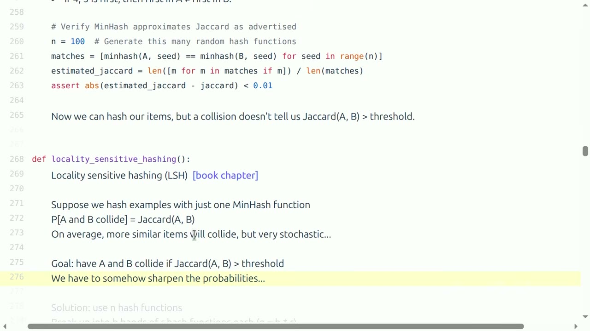

## 局部敏感哈希（LSH）：用 bands 和 r 锐化阈值

你把 n 个哈希函数分成 b 个 band，每个 band 有 r 个哈希函数。如果你有 12 个哈希函数，你有三个 band，每个 band 有 4 个哈希函数。这里一个 band 是 h1 到 h4，第二个 band 是 h5 到 h8，第三个 band 是 h9 到 h12。我们要做的是——每个哈希函数给我们碰撞或不碰撞。每个哈希函数都有一个碰撞概率。关键在这里：我们要计算 A 和 B 碰撞的概率。我们说 A 和 B 碰撞，如果对某个 band，它的所有哈希函数都返回相同的值。

所以如果 h5、h6、h7、h8 都返回相同值——抱歉——如果 h5(A)=h5(B)，h6(A)=h6(B)，等等，那就意味着这个 band 被触发，然后我说它们碰撞。或者这个 band 全部一致，或者这两个。但你不必让所有哈希函数都返回相同值。这里有一个与或结构在做提升。我们看看为什么这有用。

*[40:57](https://www.youtube.com/watch?v=5sxHosTLPF8&t=2457)*

## 计算碰撞概率

现在假设你有 A 和 B 的某个 Jaccard，按照这个定义，它们碰撞的概率是多少？我们可以算。假设 Jaccard 相似度是 0.8，我们有五个 band，每个 band 有 10 个哈希函数。那么一个固定 band 匹配的概率是 0.8 的 r 次方。因为每个 band 有 r 个哈希函数，所以它们全部匹配的概率是 0.8^r。所以一个固定 band 匹配的概率一般相当低，它随 r 指数下降。那么现在碰撞概率就是某个 band 匹配的概率。那就是 1 减去——这是一个 band 不匹配的概率。把它提高到 b 次方——有 b 个 band——这是所有 band 都不匹配的概率。然后 1 减去它，就是某个 band 匹配的概率。所以碰撞概率是 0.4。你预计它会更高，因为你有 b 次机会去获得匹配。

*[42:37](https://www.youtube.com/watch?v=5sxHosTLPF8&t=2557)*

## S 形曲线与阈值相变

如果你画这个函数，就是这个样子。横轴是相似度，我们看 0.8，纵轴是碰撞概率。我们预计如果相似度是 0，它应该是 0；如果是 1，它应该是 1。但注意这是一条有趣的 S 形曲线，这很好，因为这是我们想要锐化的。我们想基本上说，如果相似度低于某个阈值，我们希望匹配概率尽可能低；如果相似度高于某个阈值，我们希望它尽可能高。所以我们试图让它像一个相变。如果你把这个函数画成相似度的函数，就得到这个。

*[43:45](https://www.youtube.com/watch?v=5sxHosTLPF8&t=2625)*

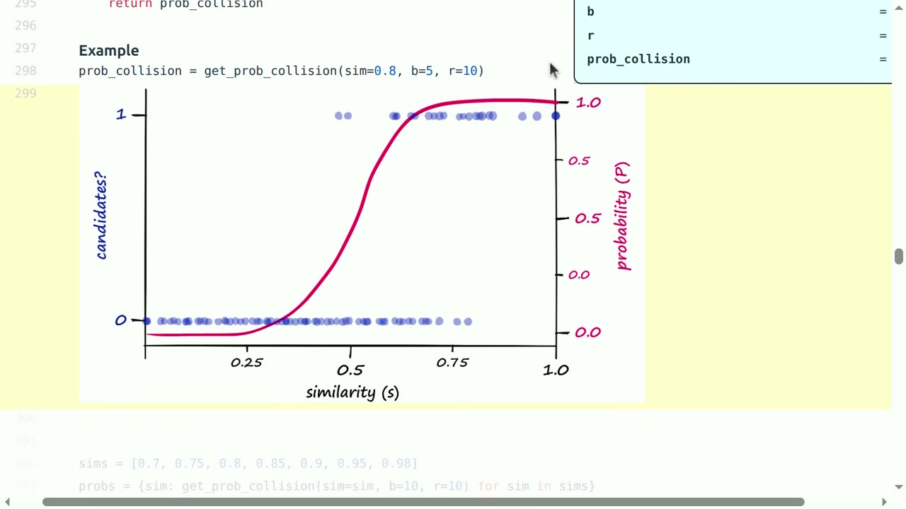

## 调整 r 和 b

我们看一些例子。具体来说，相似度从 0.7 到 0.98。我们看 b=10、r=10。按照我们的定义看碰撞概率，它给出的范围是 0.25 到 1。如果你要设阈值，这不算太糟。我们可以设在这里。这些仍然会有一些概率——它们仍是假阳性，因为即使它们低于阈值，比如 0.9，它们仍然可能碰撞。但如果我们愿意，可以把它们过滤掉。而高于阈值的那些大部分会被保留。

那么增加 r 会怎样？记住，r 是桶内哈希函数的数量。当你增加 r，阈值会变得更尖锐，曲线向右移动。一切都变得更难匹配，因为桶里有更多哈希函数，锐化了那个指数。所以你看到的概率更尖锐，现在所有东西都向右移。现在如果某个东西 Jaccard 很低，它匹配的可能性相当小。之前是 0.25，现在是 0.008。我们在锐化概率。而增加 b 的效果是把曲线向左移。它让匹配更容易。b 是 band 的数量。某个 band 必须匹配。如果你有更多 band，就有更多匹配机会。所以你看这个前后对比。现在——之前 0.9 时只有 0.72，现在是 0.92。当然这个也增加了，但没那么多。你可以通过增加 b 和 r，让这些相变变得尽可能尖锐。当然，如果你把 b 和 r 增加太多，它会变得更昂贵。

*[46:33](https://www.youtube.com/watch?v=5sxHosTLPF8&t=2793)*

## 真实设置中的参数与阈值公式

我们看一个更真实的设置。在这篇去重论文里，他们用了 b=20 个 band，r=450。这让你感受一下这些数字的量级。一般来说，相变发生在一个阈值处，这个阈值是 (1/b)^(1/r)。所以如果你想基于 Jaccard 大于 0.9 来过滤，那你基本要设 b 和 r，使得这个等于 0.9。然后通过改变 b 和 r，你可以让那个相变更尖锐。记住，固定 band 匹配的概率是 1/b。如果你在这个阈值处，那么 A 和 B 碰撞的概率大约是——它是一个常数。碰撞概率是 0.64。这很合理。基本上，如果你有一个相变，相变的中心是 0.64。随着 b 和 r 增加，低于它的应该趋近 0，高于它的应该趋近 1。

*[48:02](https://www.youtube.com/watch?v=5sxHosTLPF8&t=2882)*

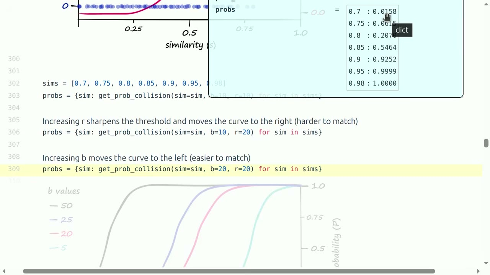

## MinHash LSH 与去重范围

关于 LSH 有什么问题吗？这个方法叫 MinHash LSH，因为 LSH 实际上适用于任何哈希函数。对于语言模型处理中的去重，我们用的是 MinHash，它近似 Jaccard。所以基本上这就是你应该用的。关于去重有问题吗？

还有一个关于去重的注意事项：经常，正如我们将看到的，数据集会进来。有时候去重会在一个数据集内部进行。但你实际上必须在整个数据集范围内做去重，因为数据集之间经常是冗余的。有时候人们没这么做，但应该这么做。

*[49:14](https://www.youtube.com/watch?v=5sxHosTLPF8&t=2954)*

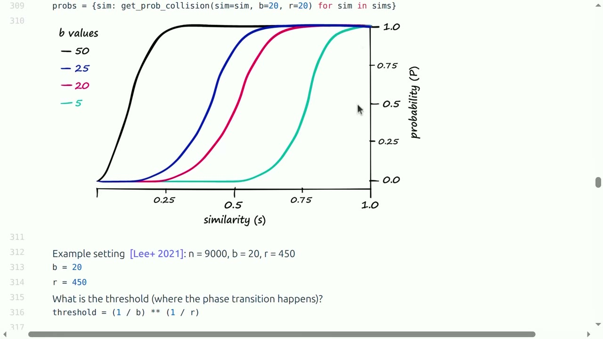

## 数据混配：多个来源与权重

我们进入下一个主题：数据混配。到目前为止，我们把数据从原始 HTML 或 PDF 转换成了文本。我们过滤了高质量数据。我们去重了，所以得到了一组更小的高质量文档。这通常是在给定数据源内部进行的。但语言模型是在多个数据源上训练的。在 Marin，目前这个网站追踪了下一个模型会训练的不同数据源。你可以看到有一堆东西：有 Nemotron，有我们谈过的 FinePDFs，有一些机构书籍，还有一些代码，等等。你有所有这些不同来源。问题是，你怎么组合它们？

*[50:29](https://www.youtube.com/watch?v=5sxHosTLPF8&t=3029)*

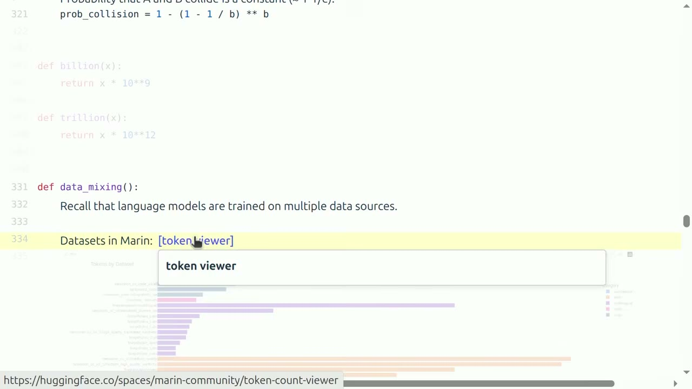

## 混配的直觉方法：拍脑袋、均匀、按比例

如果你看一篇旧论文 The Pile，这是他们当时拥有的一组来源。他们基本上给每个组件分配一个特定权重。所以基本上，你有一个来源上的分布。那这个权重从哪里来？简单直接地说，假设你有三个来源。你想找到一个数据混配，而数据混配就是来源上的一个分布。如果你只是从第一性原理来想这个问题——好吧，不是第一性原理，而是从你可能怎么做来想。凭感觉，我猜这是第一性原理的反面：你基于某种直觉手动设置，这比你想象中更常见。所以我认为这肯定相当凭感觉。

甚至更近的论文，你只是看——也许你用某种方法，然后微调。你也可以做均匀采样，就是在来源上放均匀分布，每个 chunk 都采样，你只是采样一个来源。你也可以做按比例混配，就是按照某个来源的 token 数量比例采样。所以如果一个数据集 token 更多，你就给它更高权重。这通常也是合理的做法。但你可能会担心，如果你有一个巨大的低质量数据集，它会吃掉你很多 token。所以这似乎也不是很优。

*[52:31](https://www.youtube.com/watch?v=5sxHosTLPF8&t=3151)*

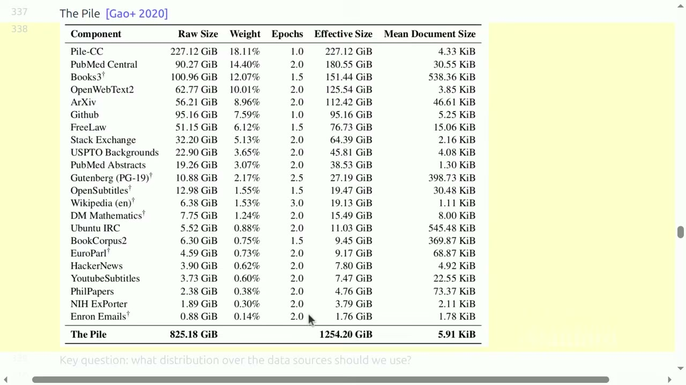

## 高质量来源、多样性与来源有限性

直觉上，你应该提高高质量来源的权重。但有两点很重要。第一，你确实想保证多样性。来源之间经常不可比，比如文学、代码和论文。你不能说这篇论文比这段代码质量更高，因为它们可能是不可比的对象。如果你想让语言模型做得好，你不希望把所有质量都放在论文上。第二点，我会多讲一点，每个来源实际上是有限的。所以如果你在一个小来源上放太多权重，你基本上会用完那个来源，然后你就得在它上面 epoch，也就是不断训练完全相同的 token。这会是坏的，原因我们后面会看到。

*[53:35](https://www.youtube.com/watch?v=5sxHosTLPF8&t=3215)*

## 具体例子：低质量 10T、高质量 10B 与 50 个 epoch

我们把最后一点更具体地展开。想象你有两个来源：一个低质量来源，有 10 万亿 token；一个高质量来源，有 100 亿 token。一般来说，高质量来源更小。如果你做一个朴素的数据混配。我们就做均匀。一半高质量，一半低质量。然后我要训练 1 万亿 token。当我说训练 1 万亿，并不意味着唯一 token，它只是说训练那么多步除以 batch size，或者乘以 batch size。

然后我们看这个，低质量数据集中某个特定元素被训练了多少次。也就是某个数据点被训练的 epoch 数。p_low 乘以训练 token 数，就是我想从这个低质量来源请求的 token 次数，再除以低质量来源的总数。它小于 1。所以基本上，这意味着这个低质量数据集中只有 5% 的 token 我会碰一次并训练。然后如果你看高质量，你会看到 epoch 数是 50，因为我这里只有 100 亿 token。如果我一半一半，那意味着 5000 亿 token——我需要训练 5000 亿高质量数据 token。但我没有 5000 亿 token 的数据，所以我必须把每个数据点重复 50 次。这其实非常重要。一些大模型训练搞砸了这件事。你不能只是天真地看着数据集，定义一个分布，然后采样，因为如果你只看质量，只看数据，你会忽略那里到底有多少数据点。

*[55:57](https://www.youtube.com/watch?v=5sxHosTLPF8&t=3357)*

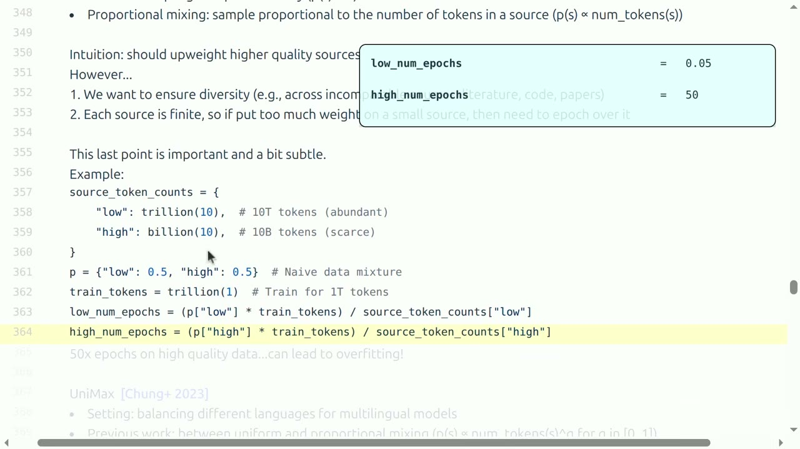

## 为什么会出现 50 个 epoch

这有意义吗？也许停下来提问。这是一个重要的点。有学生问：对于高质量数据，为什么你需要 50 个 epoch？它在少得多的水平上不就达到可比性能了吗？老师说，问题是为什么需要 50 个 epoch？我想重点是，你不需要 50 个 epoch。最坏情况下，它是在浪费算力；抱歉，最好情况是浪费算力，最坏情况是你在过拟合。之所以是 50，是因为如果你直接进去定义这个数据混配，你最终会在没有意识到的情况下做 50 个 epoch，除非你非常仔细地关注。所以这基本上——教训是，看看你实际上在数据上做了多少个 epoch。

*[57:07](https://www.youtube.com/watch?v=5sxHosTLPF8&t=3427)*

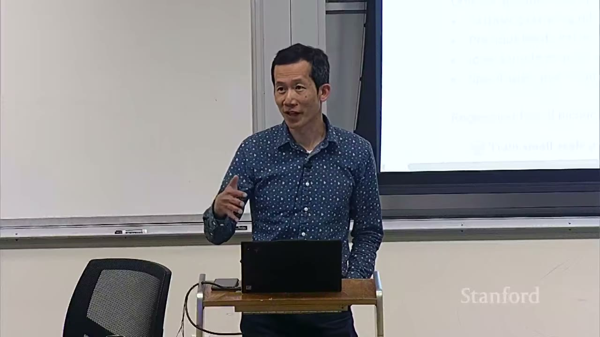

## 训练时混配怎么实现

有学生问：训练时混配是怎么体现的？你是每一步切换，比如训练 10 步，说我要做 10 步 Python 代码、10 步文章，因为我觉得——这里有什么直觉吗？老师说，好问题。问题是训练时混配如何实现。一般来说，你就是采样。你要填满一个 batch。你可以为每个元素采样它来自哪个混配组件，然后用来自那个混配组件的序列填满 batch。通常每个序列来自一个混配组件。你不是按 token 采样。所以每个 batch 都应该是混合的。所以混配假设是在 batch 层面的，然后你训练。并不是说一步是——代码在一步里是——是的。一般来说你想减少方差。你想训练多个——batch 应该有一些混合。

*[58:19](https://www.youtube.com/watch?v=5sxHosTLPF8&t=3499)*

## UniMax：均匀采样加轮数硬上限

好，这个问题很久以前就被注意到了。在这篇论文里，他们提出了 UniMax。当时他们在训练多语言模型。很明显，有些语言资源非常少，所以你必须对此做点什么。在这篇论文里，他们注意到，之前一些工作基本上会把按比例混配的概率提高到某个幂，来把分布展平。但这篇论文的想法是，让我们更明确一点。让我们均匀采样来源，但对 epoch 数量加硬上限。这是关键想法。

在这里，你说我最多在一个特定数据源上做 20 个 epoch。如果你已经做完了，那对不起，你拿不到更多 token，你继续下一个。所以这在某种意义上是安全网。特别是，如果看这个数字：分配给一个来源的概率乘以训练 token 数，应该小于等于上限。有一个简单过程可以在满足这个约束的情况下实际确定混配。

*[59:54](https://www.youtube.com/watch?v=5sxHosTLPF8&t=3594)*

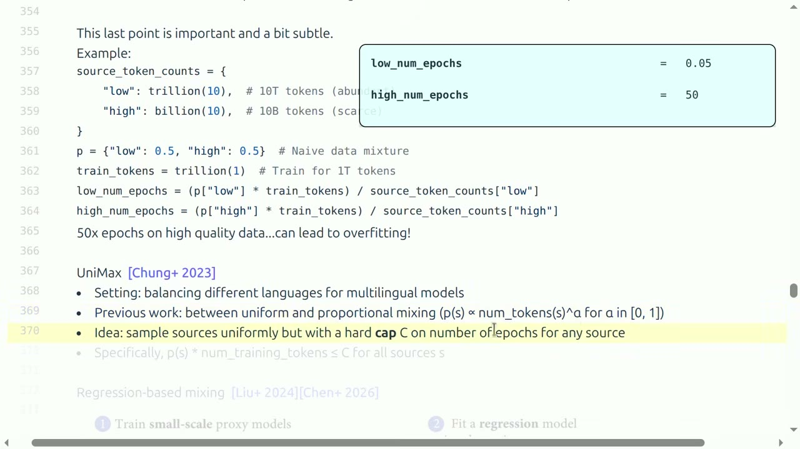

## 回归式混配：在小模型上试不同 mixture

我们换一下话题，谈谈一开始怎么定义混配，因为如果你有 50 个来源，你就有 50 个数字要填。我们注意到按比例混配还不够。也许你可以尝试估计某个质量指标，然后按比例采样，但这也同样是启发式的。所以最有原则、也最容易理解发生了什么的方法，是这些基于回归的混配方法，比如 RegMix、Olmix 和类似论文。这里的想法相对简单。

首先，假设你想训练一个大模型。你先去小规模，比如 3 亿参数，尝试不同的数据混配。假设你有三个组件，你尝试不同混配。然后你训练这些小模型。你训练一群小模型。每个模型给你某个目标指标上的损失。它可以是某些下游指标，可以是困惑度，随你。然后你用这些数据点拟合一个回归，回归模型把这些输入——也就是数据混配权重——映射到损失。

*[61:27](https://www.youtube.com/watch?v=5sxHosTLPF8&t=3687)*

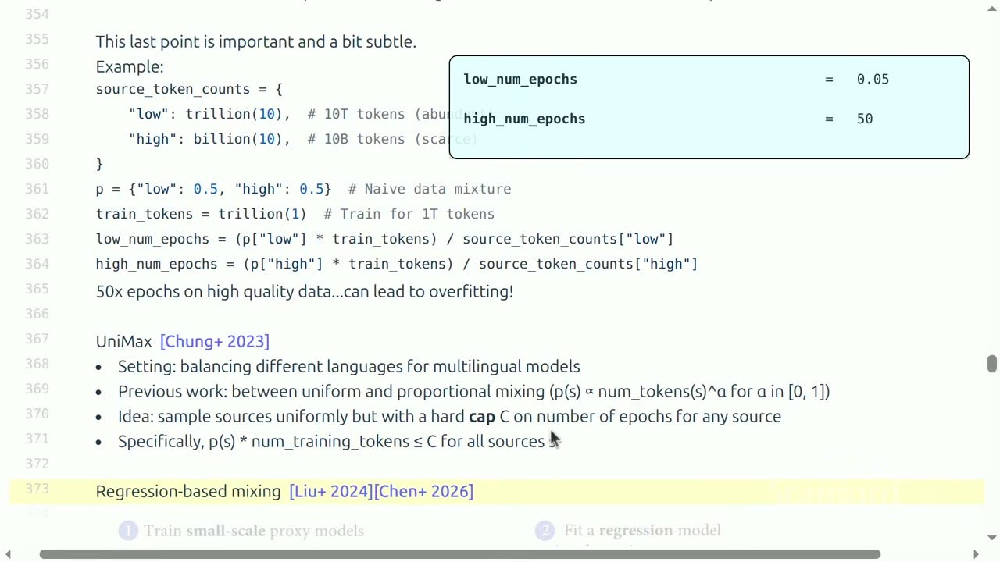

## 优化代理函数并迁移到大模型

现在你基本上有了一个非常便宜的模型，它告诉你：如果我在这个混配上训练，我会得到什么损失？然后你基本上可以优化那个数据混配——抱歉——优化那个函数，找到最优数据混配。然后那就是你用来训练大模型的数据混配。这就是简单过程。你会注意到它和 scaling laws 有相似之处：你做一些便宜的计算来得到一些答案，然后再放大。

*[62:13](https://www.youtube.com/watch?v=5sxHosTLPF8&t=3733)*

## 回归式混配的设计选择与过拟合风险

这里有几个设计决策。一，你要尝试哪些混配？你需要一个分布上的分布。所以人们经常用某种 Dirichlet 分布。你还必须定义回归方法。人们试过线性模型或提升决策树。你还必须确定目标。这通常基于下游 evals。但你必须非常小心不要过拟合，因为我们做的是预训练。按理说，预训练应该训练一个通用模型，我们不是要拟合某个下游 evals。如果你不小心，比如你有一堆代码 evals，那么，猜猜怎样？你会提高所有代码数据的权重。这不是火箭科学。如果你之后说我想生成一些诗，你可能会意识到自己过拟合了。所以你必须非常小心。

按比例混配和均匀混配没有这个问题，因为你没有看下游 evals。最后一个设计决策是，小规模和大规模之间差多少？这是成本和准确率的权衡。当然，如果你训练非常非常小的模型，这可能不代表性。但如果你为了做这件事训练大模型，那做这些就没意义了，你直接训练就好了。你基本上是在最大规模上做超参数调优，那太贵了。

*[63:50](https://www.youtube.com/watch?v=5sxHosTLPF8&t=3830)*

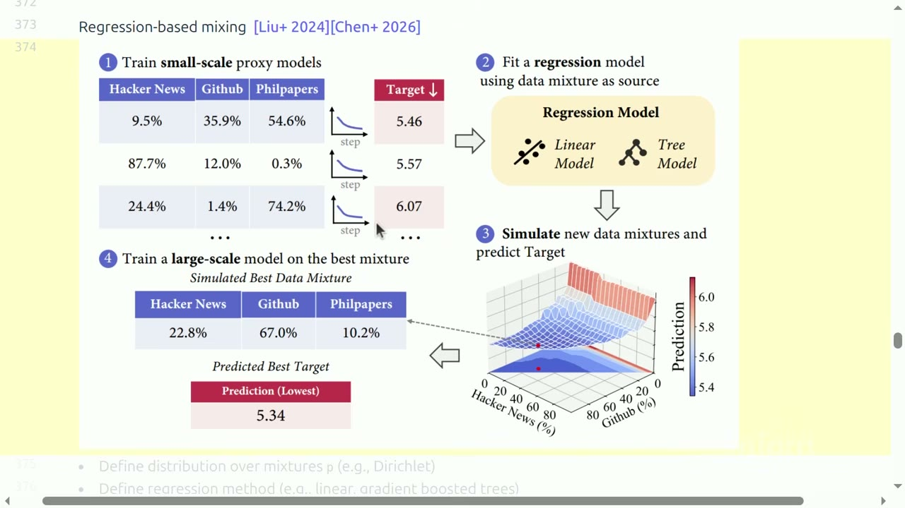

## Olmix 表格中的代理模型、采样分布与回归模型

Olmix 这篇论文有一张很好的表，展示了许多不同方法，它们都落在这个框架里。代理模型的规模：一般来说是几千万参数。你采样多少个混配？这里的 m 是你混配中参数的数量——抱歉——是 domain 的数量。你可以用 Dirichlet，也可以用指数分布。然后回归模型，你可以拟合一个对数线性模型，它往往效果不错。然后你可以用不同方法求解这个优化问题。

*[64:45](https://www.youtube.com/watch?v=5sxHosTLPF8&t=3885)*

## 两个需要警惕的假设

这里有两个信念跳跃，你必须非常小心。第一，回归模型是在一堆小的代理运行上训练的，而你现在在优化它。所以希望是，在最小值处，也就是你最优的数据混配处，那个回归模型仍然准确。这有点——你必须非常小心，因为如果你采样一个随机混配，你可能会没事，因为经典泛化。你采样一个混配，拟合一个函数，它应该能在分布内预测。但当你优化时，你本质上试图去潜在的那些极端，那里可能没有太多覆盖。所以这是要注意的一点。

第二，最优数据混配，你只能希望它从小规模迁移到大规模。一般来说，至少在开放社区工作的规模上，这似乎是真的，或者至少不是明显假的。但显然存在尺度相关效应。想想上一张关于过滤的幻灯片：如果你训练更多 token，那么低质量数据可能没问题。所以显然最优值并不相同，但你只能希望一切顺利。

*[66:20](https://www.youtube.com/watch?v=5sxHosTLPF8&t=3980)*

## 尺度相关的轮数问题

等等，有一个我们已经谈过的尺度相关效应，需要在这里处理。想象我们有很多低质量数据，10 万亿 token，以及 100 亿高质量数据。如果我们在低 token 数上训练一个小模型，你还记得吗？会发生的是——这是一个编造的例子——你可能会把大量权重放在高质量数据上，因为低 token 数时你没有 epoch。所以就像：哦哇，Wikipedia 太棒了，我们就在 Wikipedia 上训练吧。

但如果你之后在这个混配上训练大模型，你最终会在这些高质量数据上做很多 epoch，然后过拟合。这肯定是坏的。

*[67:20](https://www.youtube.com/watch?v=5sxHosTLPF8&t=4040)*

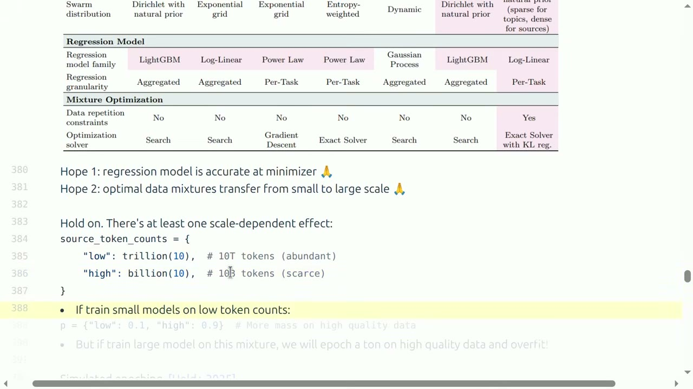

## 修复方法：限制轮数或模拟轮数

修复方法之一，Olmix 论文里做了，就是限制 epoch 数量。这是一个解决方案。还有另一个解决方案，可能有多个名字，但其中一个叫模拟轮数（simulated epoching）。原则是让你的小规模看起来像你的大规模。这是本课程的一个普遍主题。我们讲 muP 时见过。你参数化你的模型，让超参数可以迁移。同样的原则也适用于这里。天真的缩放的问题在于，你不能在小规模不 epoch，然后在 large scale 又 epoch，因为那样它们是对数据集在性质上不同的操作。

*[68:18](https://www.youtube.com/watch?v=5sxHosTLPF8&t=4098)*

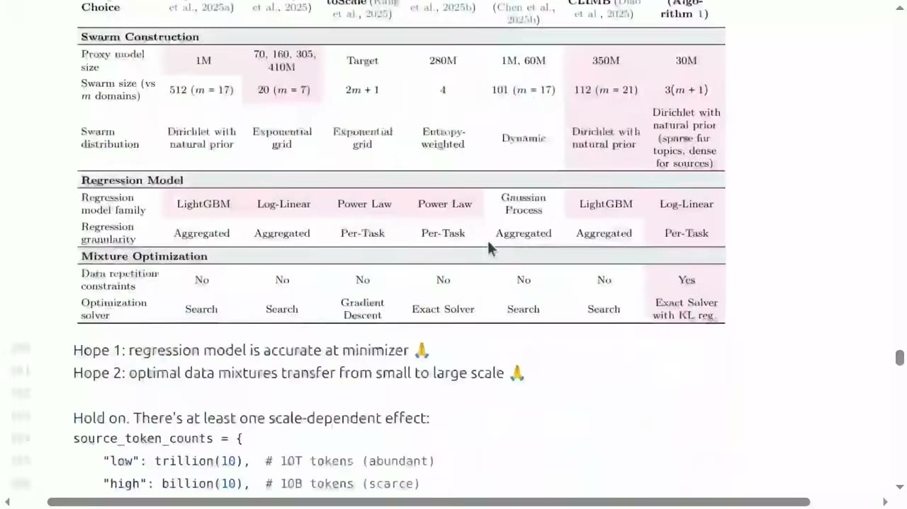

## 下采样来模拟数据稀缺

处理方式是按比例下采样你的来源。如果你的小运行是 100 亿 token，大运行是 1 万亿 token，那么你有 1/100 的下采样。然后你基本上使用下采样后的混配。想法是，如果你有下采样数据，那个解决方案就不会看起来很好，因为你不能训练所有——你不能只训练 Wikipedia。你只会训练 Wikipedia 的一小部分，然后你会意识到，哦，实际上我会做很多 epoch，那会有很差的损失，这意味着在优化中你会寻找更平衡的方法。所以你是在小规模上模拟你在高区间会遇到的数据稀缺。

*[69:27](https://www.youtube.com/watch?v=5sxHosTLPF8&t=4167)*

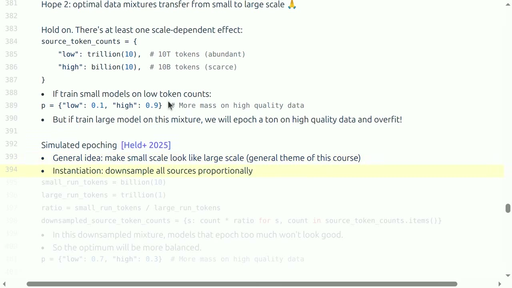

## 混配小节总结

总结这一节，问题是如何给不同来源加权？Wikipedia、Common Crawl、代码、你从某处抓来的数学数据。你怎么平衡它们？基于回归的混配是一个很好的框架。你在小规模估计一个函数形式，把混配权重映射到损失，优化它，然后泛化到大规模。你必须非常小心，因为轮数和过拟合问题。你要么用限制轮数，要么模拟轮数。这里的一个教训是，如果你想优化任何东西，你必须非常小心，因为你有优化错东西的危险。

*[70:31](https://www.youtube.com/watch?v=5sxHosTLPF8&t=4231)*

## 关于下采样过小的问答

在我们继续之前，关于数据混配有问题吗？有学生问：当你下采样后，会不会有东西太小，以至于无法很好地泛化？老师说，问题是，如果你下采样，是否有风险，可能得到太小的数据集？是的，绝对有。我想你可能会遇到 token 太少的情况。我想那时会发生的是，你的最优解会给它一个非常小的权重。当你放大时，也许你会得到正确的 token 集合。原则上应该可行。

但可能有舍入误差，导致你最终不是在这个数据集上训练一次，而是意外地训练了零次。但你可以绕过这些，只要——那你总是至少在这个数据上训练一次。

*[71:35](https://www.youtube.com/watch?v=5sxHosTLPF8&t=4295)*

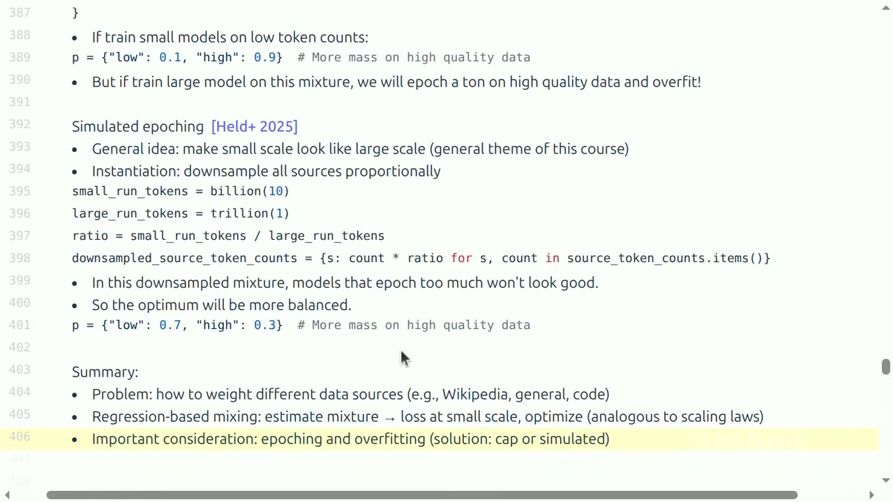

## 是否在数据源内部做混配

有学生问：在数据混配里，这些来源刚好对应不同主题。但你会不会取一个多样化的数据集，然后在其内部做数据混配？老师说，问题是，你把数据混配应用到哪里？不同领域，还是甚至在一个数据集内部？实际上我忘了提这个，很高兴你提出来。在 Nemotron 论文里，他们其实也做了类似的划分。你基本上想，比如我只给你 Common Crawl。你其实可以把它拆开，按领域分组。IT 那边有 web organizer，所以你可以分组成主题。

但你也可以做质量过滤。于是你有一个二维网格，有领域，也有质量。每个格子都是你会做数据混配的东西。这是自动确定领域的一种方式。然后在此基础上，你再加上人们手动给你的额外来源。

*[72:53](https://www.youtube.com/watch?v=5sxHosTLPF8&t=4373)*

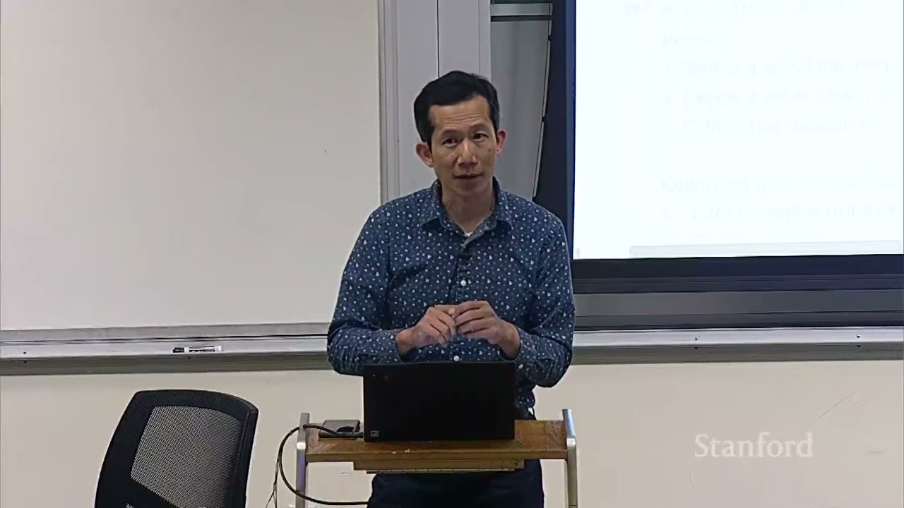

## 后训练数据：任务依赖与合成数据

接下来我快速过一下后训练数据。到目前为止，这基本上是预训练，或者也许是中期训练数据。它一般相当任务无关，除了 RegMix 那部分你是在最小化损失。但数据本身仍然相对任务无关，你是在发展基本技能。当你看到后训练时，很多数据变得非常任务依赖。

*[73:27](https://www.youtube.com/watch?v=5sxHosTLPF8&t=4407)*

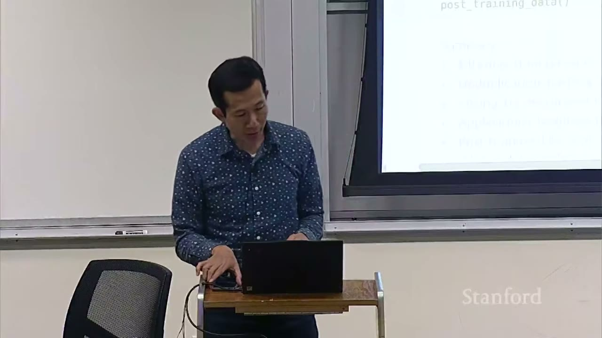

## 后训练数据的通用配方

我不会做全面综述。我只想指出一些最近发布的有趣后训练数据集，特别是代码方面的，因为现在这非常受关注。通用配方是：你定义一组环境。在这种情况下，想代码，可能是 GitHub 仓库。你定义一组任务或 prompt，然后从一个强模型或教师模型收集回答。所以隐含地，至少在开放社区，几乎所有后训练数据、大部分后训练数据，都是合成生成的。你也可以用人类替代强模型，但那很慢，而且花很多钱。

但如果你在前沿——几年前，你必须付很多人很多钱来给你回答。现在即使在前沿，你也可以做人类-AI 混合的事情。但无论如何，重点是有一个教师在外面给你回答。

*[74:49](https://www.youtube.com/watch?v=5sxHosTLPF8&t=4489)*

## OpenThoughts：数学、科学与代码推理数据

好，我讲几个工作。一个是 OpenThoughts。这个想法——它出现的时候，是 o1 发布时，大家对推理非常关注，主要是数学和科学。我们怎么为这个获得非常好的后训练数据集？他们最终用这个教师模型做出了 120 万个例子。步骤是：首先，有一堆——环境、任务和问题是什么？他们从很多不同来源抽取。有人类来源，比如 Stack Exchange 或 NuminaMath，也有一些合成来源。这些只是编码类的一个子集，还有更多数学和化学的。这是一个大项目，涉及很多人的贡献。

*[75:58](https://www.youtube.com/watch?v=5sxHosTLPF8&t=4558)*

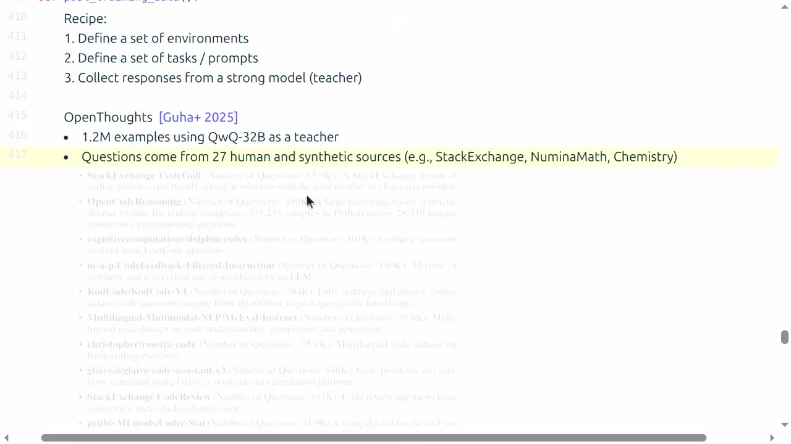

## OpenThoughts 的细节与发现

你可以看到有些是编程练习。有些是更现实的东西，出现在——我猜 CodeGolf 不现实，但这里有一些更现实的例子。比如代码审查，这可能更现实。他们对给定这个数据集如何生成回答做了相当全面的分析。他们表明，用少数几个来源实际上比试图用所有来源更好。采样多个生成结果有帮助，比如 16 个。

一个有趣的事情是，更好的模型不一定是更好的教师。比如 QwQ-32B，现在是一个非常老、非常小的模型，却比 DeepSeek-R1 是更好的教师，而 DeepSeek-R1 当时可能是最强的开放模型之一。他们还发现基本的答案过滤没有帮助。整个数据流水线看起来像这样：有一堆来源进来，然后去重，随机采样。我猜这是对问题下采样，然后生成多个答案，进入最终数据集。所以 120 万是例子数，但除以 16 才是实际问题数。

*[77:40](https://www.youtube.com/watch?v=5sxHosTLPF8&t=4660)*

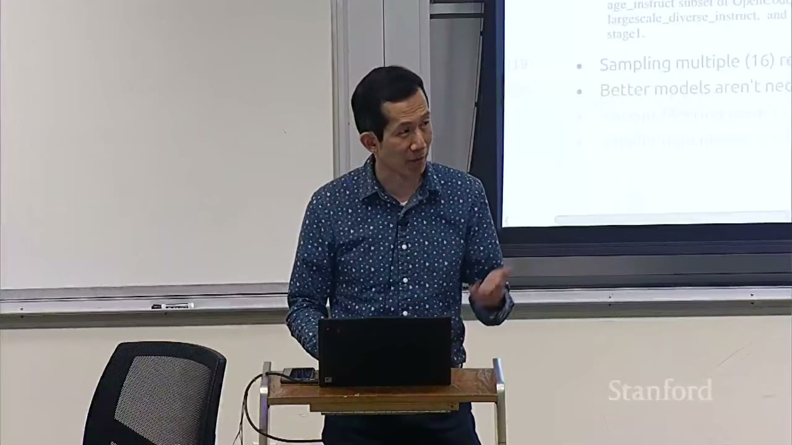

## agentic coding 与 SWE-smith

那是数学、科学和一些代码。我想最近大家对开发特别是 agentic coding 模型有很多兴趣——不只是能生成代码的模型，而是实际上能做软件开发的模型。SWE-smith 这篇论文的想法是：给你一个仓库，你使用语言模型自动生成任务。他们有一个 agent，拿到一个仓库，实际上让它变得可用，比如安装依赖等等。然后你生成任务，一般是以某种方式修改代码，也许引入一些 bug。这些任务会被验证，然后你得到任务实例。这些是合成任务，但你得到 5 万个，这在当时，也就是去年，相当大。

*[78:51](https://www.youtube.com/watch?v=5sxHosTLPF8&t=4731)*

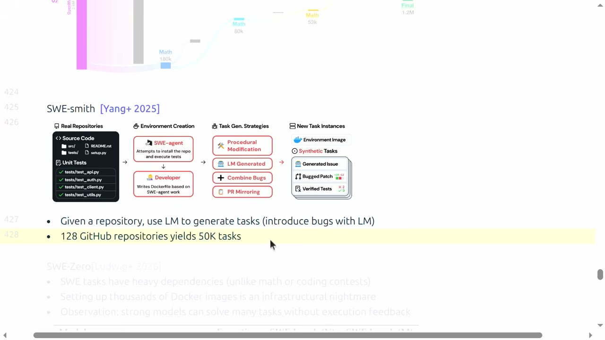

## SWE-Zero：不依赖执行反馈

从那以后，还有一堆其他工作，我会提到。有 NVIDIA 的 SWE-Zero 论文，它有一个——其实，好，我也会讲那个。这是一个有趣的想法，观察是：和数学不同，SWE 任务有很多重依赖。大多数 GitHub 仓库甚至跑不起来。你必须安装所有依赖。它们过时了，尤其是如果你回滚到 PR 刚提交的时候，简直一团糟。这简直是噩梦。他们在想，我们怎么才能真正获得所有仓库的数据集？

他们没有为每个仓库做特定的 Docker 镜像，而是注意到模型实际上已经足够好，可以在没有执行反馈的情况下解决很多这些任务。如果你看一些模型，如果允许执行，你得到 80；如果不允许执行，你得到接近 70，对于不能执行代码来说不算差。所以不知何故，这些模型对代码有一些内部语义理解。

*[80:19](https://www.youtube.com/watch?v=5sxHosTLPF8&t=4819)*

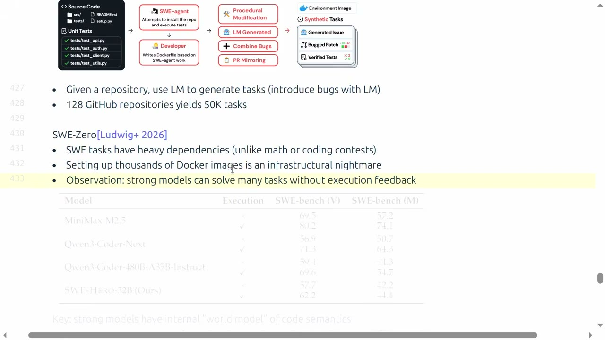

## SWE-Zero 的数据细节与训练

他们能够生成 30 万条 agent 轨迹。所有这些是真实的 GitHub PR，所以在 SWE-smith 例子之上是真实的。他们使用 OpenHands scaffold。有很多关于防止 agent 作弊的细节。通常你给 agent 指令：你探索、测试、实现。SWE-Zero 版本基本上说你不能运行 Python 代码。你只能做 set、grep 这些基本操作。

然后他们从大的 Qwen 模型蒸馏并过滤，因为有时候 Qwen 模型会忽略这些指令，仍然试图执行。然后他们展示了——哦，他们还有 1.3 万条确实需要执行反馈的 agent 轨迹。所以他们训练模型时，先在这些 SWE-Zero 例子上微调，然后再在这些 SWE-Zero 例子上微调。他们能够——我猜前沿仍然相当高，但他们在这里取得了一些进展。

*[81:41](https://www.youtube.com/watch?v=5sxHosTLPF8&t=4901)*

## SWE-rebench：抓取大量 PR 并扩展到 1200 万条轨迹

我快速过一下 SWE-rebench，它本质上是另一次尝试，抓取大量 PR。所有这些看起来都是：拿一堆 GitHub 仓库，试着安装仓库，大多数可能失败，然后更努力地试。然后你用语言模型给你回答。这些其实今天刚出来。所以你可以拿 SWE-Zero 的想法，现在扩展到 1200 万条 agent 轨迹。SWE-Zero 的一个好 benefit 是它非常轻量。这里，他们使用 SWE-rebench 任务。在这个里面，记住他们试图让东西执行。他们只有 32,000 个能执行，还有 120 个不能执行。但 SWE-Zero 不在乎。你可以用所有数据。这是一个非常小的模型，因为——现在这个数据集相当大。所以我想，如你所见，数据集正变得越来越复杂。你从数学这类无环境的东西，走到现在的编码。现在编码数据集增长得相当快。

*[83:09](https://www.youtube.com/watch?v=5sxHosTLPF8&t=4989)*

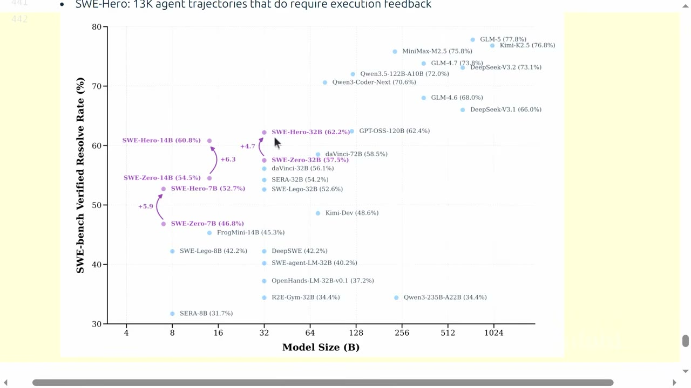

## 后训练数据的取舍总结

但总体想法是，你有这些 prompt，其中有取舍。你可以完全合成。你可以半合成，也就是真实环境加合成任务。或者你可以用真实的。回答一般来自有能力模型，但它们也需要是好的教师。代码环境很痛苦。还有很多过滤和其他细节，我们没时间讲。

*[83:42](https://www.youtube.com/watch?v=5sxHosTLPF8&t=5022)*

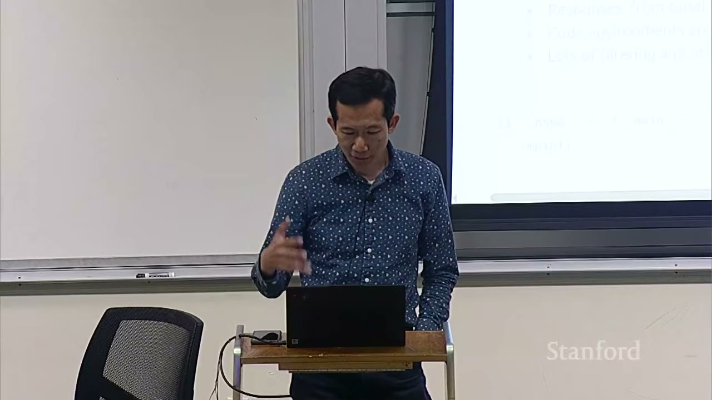

## 全课总结

好，总结这堂课。我们讲了过滤。定义好的数据长什么样，然后训练一个轻量分类器。遍历你的网页爬取数据，你就能得到匹配你目标的一小部分。去重很重要，可以避免过拟合并节省 FLOPs。混配：在小规模尝试混配，再外推到大模型。然后我们看了一些后训练数据。不过我要说，很多数据工作可能非常脏。它非常领域特定，需要看具体例子来制作这些高质量数据集。所以这堂课并不真正代表数据工作的样子，但希望给了你一个关于外部数据 landscape 的概念。好，今天到这里。

*[84:36](https://www.youtube.com/watch?v=5sxHosTLPF8&t=5076)*
