# CS336 第十六讲：从可验证奖励中做强化学习（RLVR）

这是后训练系列的第二讲，讲 RLVR——用可验证奖励做强化学习，以及 GRPO、PPO 这些核心算法如何支撑起"思考模型"的长思维链能力；随后逐一拆解 DeepSeek R1、Kimi K1.5、Qwen 3 和 Qwen3-Coder-Next 的技术报告，看这些算法在真实模型里怎么落地。

## 开场：从 RLHF 的瓶颈到可验证奖励

我们开始吧。这是后训练系列的第二讲，我们要讲 RLVR，也就是从可验证奖励中做强化学习（reinforcement learning from verifiable rewards）。这个时机其实非常好。我没来得及更新幻灯片，但 OpenAI 的人刚刚宣布他们解决了一个重要问题——用他们的思考模型解决了一个 MyOpenMath 的问题。那个东西是怎么工作的？恰恰就是这套思考模型、也就是 RLVR 的东西。

所以我们目前所处的位置是左边这一块。上一讲结束时，我们已经有了指令微调、有了 RLHF，得到了 ChatGPT 这样的好东西。剩下的就是思考模型的现代进展：模型能够做非常长的思维链（COT），去解决数学、以及在某些情况下编程这类困难的、可验证的问题。

*[01:00](https://www.youtube.com/watch?v=dIFAi87Ws4E&t=60)*

记得我上一讲是以一个有点丧气的调子结束的：RLHF 其实没法把我们带到想去的地方，因为有"过度优化"（overoptimization）这个问题。我们会去收集一堆偏好数据，偏好数据很有用，我们会建一个奖励模型，然后针对这个奖励模型做强化学习。但这个东西本质上是一个标注瓶颈，因为你有一个奖励模型，你没法把算力无限地投进同一个奖励模型里，最终你会把奖励模型过拟合掉。而且不管你正则化做得多好，最终都会撞上过拟合这个问题。

*[01:47](https://www.youtube.com/watch?v=dIFAi87Ws4E&t=107)*

这真的很让人沮丧。而且这其实不是强化学习的潜力所在。如果你是一个强化学习的信徒，你会看 AlphaGo 之类的例子，说在这些领域里强化学习真的做得非常棒。那么我们在 RLHF 里做的事，和在那些更"强化学习原生"的领域里取得的成就，区别在哪里？我认为一个主要区别是：在 AlphaGo 里，我们优化的正是我们想要的东西——围棋的胜负条件是精确给出的，定义里没有任何含糊。所以你可以想投多少算力就投多少算力，只要目标在改善，你就是在做对的事。某种意义上，这些是搜索问题；而上面那个更像是学习问题。这个区分不是很精确，但可以这么理解。

*[02:42](https://www.youtube.com/watch?v=dIFAi87Ws4E&t=162)*

所以现在可能存在其他领域，比如形式化数学，甚至自然语言数学，它们具有更可验证的性质，因此更适合强化学习。这就是我们要研究这些的动机。算法在根本上不会有太大不同，但我们最终到达的地方会出乎意料地不一样。

今天的讲座分两部分，这也呼应了我们在课程其他部分的组织方式。第一部分讲核心算法，这是你们的基础知识，作业里会用到——我会讲什么是 GRPO、PPO 怎么工作。讲完这些之后，我会翻一批开源发布的技术报告，展示我第一部分讲的东西如何反映在这些主流开源模型发布的技术报告里。

*[03:35](https://www.youtube.com/watch?v=dIFAi87Ws4E&t=215)*

## PPO：政策梯度与 REINFORCE 技巧

我们进入方法的基础部分。第一件事是 PPO。讨论语言模型的强化学习，不可能不讨论 PPO。虽然我们已经讲过一遍了，但 PPO 足够令人困惑，我觉得讲两遍你们会受益。

在语言建模的强化学习里，最重要要记住的是**政策梯度**（policy gradients），特别是 REINFORCE 梯度技巧。我们始终要做的是对奖励做梯度下降，做法本质上是带权重的 SFT 更新——权重可以是正的也可以是负的。R 是什么我们待会定义。但这个公式很重要，因为它会在整场讲座里反复出现，某种意义上它是其他一切推导的源头。

*[04:34](https://www.youtube.com/watch?v=dIFAi87Ws4E&t=274)*

在这个基础上，记得上一讲的直觉：我们想一次走不止一步。政策梯度要求我们每走一次梯度都要从策略里采样。那我们能不能复用 rollout？可以做 TRPO，可以做 PPO，等等。PPO 我一会儿讲，TRPO 已经讲过了，就不深入了。

如果你上过强化学习的课，PPO 对你来说当然很好理解——你懂这个算法。但我不假设你们所有人都上过 RL 课或者懂 RL。PPO 是强化学习的真正主力，被用在各种非常困难的 RL 场景里。OpenAI 早期非常"强化学习上头"的时候做了不少这类工作：他们的 OpenAI Gym 就在讲 PPO 算法，说"嘿，我们可以用强化学习让这些人形走起来"。更戏剧性的展示是他们用 PPO 训练的 OpenAI 机器人（OpenAI bot）。它能在高维动作和状态空间里用深度强化学习取得出色表现，而这些场景里做 RL 比通常要复杂得多。对，那边有个 OpenAI 的小人在跑。

*[06:02](https://www.youtube.com/watch?v=dIFAi87Ws4E&t=362)*

## PPO 的伪代码很简单，实现却很折磨人

在概念层面，PPO 其实非常简单。记得我说过，这整套东西里很重要的一部分就是摆脱 PPO，这是很多人的动力。但如果你看 PPO 的伪代码——这是 OpenAI 的 Spinning Up in RL 文档里的——你会说：这不难啊，其实挺容易的，我可以一口气实现出来。你采样一些轨迹，用任意一种优势估计方法算出一个叫优势（advantage）的东西，用一种有点奇怪但还行的方式把它裁剪（clip）一下，然后在这个被裁剪的优势下更新策略，就行了。你还可以去拟合一个叫价值函数（value function）的东西。好，没问题。看起来在实践中都相对容易。

*[06:46](https://www.youtube.com/watch?v=dIFAi87Ws4E&t=406)*

所以正因为这样，大家会说：哦，没事，PPO 完全没问题。但你随后会看到那种博客文章，而这应该让你心里发毛。因为如果你看到一篇博客叫《PPO 的 37 个实现细节》，你就知道这是一个对实现选择极其敏感的算法。有各种各样的做法、各种库和实现，用哪一套会给出完全不同的数字。结果发现很多人把这件事实现错了。有一篇论文就说，某些人用的 PPO 基线根本就不是基线，它们从根本上改变了优化问题。

*[07:29](https://www.youtube.com/watch?v=dIFAi87Ws4E&t=449)*

正因为如此，我觉得如果我不告诉你们我们可能真的得看看 PPO 的一些实现，我就没法讲完剩下的内容。而 PPO 在语言模型上的实现，我告诉你们，相当不令人愉快。这是一张很有代表性的幻灯片——它很好地描述了 PPO 长什么样：你有优势估计，中间那一大块就是优势这个东西；你有一个经验缓冲区（experience buffer），因为你要保留一些旧的东西；你要训练价值模型，而价值模型又被用在优势估计的计算里。注意那个绿色的框出现了两次。而且重要的是，我目标函数里的一些部分，比如 KL 项，实际上是逐 token 起作用的。所以它其实不只是个 bandit 问题，它是一个完整的多步 RL 问题。这一切都非常困难、非常复杂。

*[08:24](https://www.youtube.com/watch?v=dIFAi87Ws4E&t=504)*

这就导致你必须做各种非常棘手的实现细节。如果你去看各种实现，你会发现人们在 PPO 上做的事情有时有点奇怪、有点刁钻。

让我找一下。我的一个学生之前做 RLHF 的项目时实现过一个 PPO。PPO 你们记得，在 RLHF 里用过。我们有一份很稳健的 PPO 参考实现，花了好久才跑通。所以我去看细节，看我们到底做了什么才让它跑起来。外层循环没问题——就是遍历你的 rollout，走若干步 PPO，算损失、裁梯度、走步，完全合理的外层循环。但仔细往里看，内层的 compute loss 部分几乎完全遵循 PPO 更新，这部分看起来也基本没问题：算优势、算裁剪比率、据此更新模型，都还行。

*[09:34](https://www.youtube.com/watch?v=dIFAi87Ws4E&t=574)*

然后你走到比较乱的细节部分。rollout 我就跳过了——那里有类似"也许我们需要 KL 惩罚来让原模型靠近参考模型"的东西，但其实这只在你把 KL 裁到 0 的时候才成立，而如果你对 KL 散度有任何了解，就知道这完全破坏了 KL 散度的意义，因为你是把正值和负值加在一起。如果你去掉这个，它立刻就炸了。这种事都会发生。

我不是说这就是你该实现 PPO 的方式。我提这个的原因是：RL 算法的实现可能相当刁钻、相当敏感，因为 PPO 里有太多活动部件，也因为梯度估计的高方差。这些都是非常非常棘手的事情。

*[10:20](https://www.youtube.com/watch?v=dIFAi87Ws4E&t=620)*

还有一个你经常看到的做法——这不仅仅是 RL 实现的问题，它非常普遍。在原始的 PPO 论文里，有一个叫广义优势估计（generalized advantage estimator）的东西，它基本上是在看 gamma 折扣后的奖励，其中有个价值函数在估计每一个 token 生成步骤上的奖励。但结果发现，人们常常直接用 gamma 等于 lambda 等于 1，这只是一个退化设置，把它变回了 bandit 问题。于是你就扔掉了 PPO 带来的大量结构。

所以，如果你在做了大量工程之后跑这个算法，你会得到你预期的结果。你们作业里跑 RL 算法时，也应该预期看到类似的现象：奖励上升——如果你做 RLHF，奖励模型的奖励上升——然后负的 KL 正则项下降。这是合理的预期。但总之，这一切的要点是：PPO 的实现可能相当痛苦，取决于环境，它可能需要各种 hacks 来稳定。这不是说不可能——很多人用 PPO 训出了非常好的模型，许多实验室都有在规模上让 PPO 跑通的现成方案。但对从零实现它的研究者来说，PPO 就是非常难伺候、非常复杂。

*[11:51](https://www.youtube.com/watch?v=dIFAi87Ws4E&t=711)*

## 为什么不都用 DPO：PPO 的价值模型开销与 DPO 的适用边界

PPO 在很多情况下不受待见的另一个原因，是它需要一个价值模型来估计每一步 token 的价值。价值模型有多大？和原模型一样大。所以这占用了你宁愿用在别处——比如模型本身或推理服务器——的内存。

你可能会说，上一讲你讲了 DPO，DPO 看起来挺好，为什么我们不干脆什么都用 DPO？问题是 DPO 是一个非常具体的问题的一个非常具体的解。DPO 适合成对反馈，也就是 Bradley-Terry 比较那种形式，这非常具体。如果我要解数学题，我的数学题并不天然以成对比较的形式出现。也有其他 DPO 变体被设计来打破这种成对结构，但那基本是拿错了锤子干这活。你不一定想用 DPO 去做你通常会用 PPO 做的事。PPO 是更通用的锤子，什么都能砸。DPO 通常是离线的——不过我觉得这个区分被夸大了，因为你可以反复迭代 DPO 把它变成在线的，所以我不认为这是个大的区别。

*[13:04](https://www.youtube.com/watch?v=dIFAi87Ws4E&t=784)*

## GRPO：去掉价值函数，改用组内 z-score

这就是全部的背景。和 DPO 类似，研究社区有巨大的愿望想要不必用 PPO。DPO 和 GRPO 被广泛采用这件事，应该能告诉你把它跑通在多数情况下有多痛苦。

GRPO 和 DPO 很像，是一个替代方案，是做可验证任务的更简单的 RL 方式。在开源开放社区里，它基本上已经接管了 RLVR。它在精神上和 PPO 非常非常像，只是剥掉了几个最复杂的部分，因此让我们得到一个简单得多的算法。

GRPO 来自 DeepSeek 的论文，我想是 DeepSeek Math 那篇。他们的出发点是 PPO，概念上说 PPO 是个好主意，但我们想改动几处。改什么呢？它改的是 PPO 里可以说是最复杂、最烦人的部分：价值函数。价值函数是你减去用来降低梯度更新方差的基线。价值函数是一整个神经网络，会让训练不稳定。我们不要价值网络。那怎么办？我们去掉价值网络，但我们仍然需要一个优势。我不想用最原始的 REINFORCE，因为它的方差会非常非常高。所以取而代之，我们把优势计算成组内的 z-score（标准分数），我马上解释这是什么意思。

*[14:40](https://www.youtube.com/watch?v=dIFAi87Ws4E&t=880)*

基本想法是这样的。通常你看一个得到的奖励，如果你有值函数，你会把它和预测值比较：我的神经网络说应该得 5 分，我得了 6 分，所以这是个好的 rollout。通常你是这么做的。而 GRPO 的做法是：假设某个 rollout 得了 5 分，你现在再采 10 个其他 rollout，然后看你相对于这 10 个 rollout 表现如何。如果我比均值好，我就有高优势。在某种意义上，这是在你能够对同一 prompt 多次采样的场景下非常自然的优势计算方式。

GRPO 就正是这个想法。如果你看 GRPO 最初在 DeepSeek 论文里的定义，你会看到这就是被优化的目标：他们做的正是 PPO 更新，有那个 min 裁剪优势，加上一个 KL 项让你靠近参考模型，KL 有特定的算法（这个细节不是特别重要）。重要的是，这个优势是计算为一组输出 o_1 到 o_G 上的 z-score。也就是说，A_i 这个优势的算法是：取组内每个 rollout 的奖励，减去均值，再除以标准差，得到每一组的 z-score。

*[16:08](https://www.youtube.com/watch?v=dIFAi87Ws4E&t=968)*

在线的情况下——这是个重要的区分，因为很多情况下你可能是在线跑而不是离线跑——裁剪会直接消失，因为 pi_theta_old 和 pi_theta 的比率是 1，这个裁剪算子什么也不做，你就得到 min(A_i, A_i)，也就是优势减去 KL 惩罚。所以我要在我的优势上做 RL，而优势就是这么定义的。所以在线 rollout 的情况下，它是一个非常非常简单、作为 RL 目标很合理的东西。

我在这里停一下，如果 GRPO 的概念有任何不清楚的地方可以问。某种意义上，这是所有那些激动人心的数学成果的基础——用 GRPO 你可以复现所有那些激动人心的数学成果。所以在进入细枝末节之前，值得稍微详细地理解它。

*[17:09](https://www.youtube.com/watch?v=dIFAi87Ws4E&t=1029)*

好，简单到大家都是一次就懂，我接受。GRPO 非常简单，因为没有价值函数，你基本可以把整个 GRPO 写在一小段代码里：rollout k 次，把我观察到的 rollout 和那 k 个参照比较，做 z-score，然后按这些权重做 REINFORCE 梯度。你们作业里会写这个，步骤很简单：为 k 个 rollout 各算一个奖励，归一化你的 rollout，计算 KL 项，然后对 KL 项和这些 rollout 的组合做梯度更新。你需要动点脑筋，因为要用自动微分就得在某处 stop grad，但其实并不复杂。你可以用一页纸实现这个基本想法。

*[18:07](https://www.youtube.com/watch?v=dIFAi87Ws4E&t=1087)*

这是我取自 McGill 几位同学的一份 GRPO 参考实现，他们有一个很好的小型玩具版本。组索引的计算、标准差的计算等等，只用半张幻灯片就放下了。他们和 GRPO 论文原文唯一不同的一点，是在标准差计算里加了一个很小的负 4，防止只有单样本、或者样本奖励恰好完全相同的时候标准差爆炸——在你可能得到数值上精确为 0 的奖励的领域里，这确实会发生，比如你没解出数学题。希望这能强调 GRPO 有多直截了当，以及为什么几乎所有开源工作都建立在这个算法之上：容易实现、容易理解，而且就像我们会在结果里看到的，它能相当有说服力地复现闭源实验室用（可能是）PPO 做到的大量成果。

*[19:12](https://www.youtube.com/watch?v=dIFAi87Ws4E&t=1152)*

它效果如何？在最初的 DeepSeek Math 论文里——如果你对数学 AI 感兴趣，我鼓励你去读，里面有一组很好、很有意思的结果——他们展示了 GRPO（黄线和蓝线）比 RFT（拒绝采样微调）好很多。RFT 你们也会作为基线实现：就是把你模型生成的正确答案拿来训练，其余的都扔掉。他们还展示了过程监督（process supervision），也就是不只看最终答案、还对中间步骤评分，能带来一些收益。这个我稍后会多讲，因为它是这类 RL 问题最重要的设计决策之一。但现在，你们可以先记住这个事实：GRPO 有效，蓝线和黄线都在其他线之上。

*[20:05](https://www.youtube.com/watch?v=dIFAi87Ws4E&t=1205)*

## GRPO 是"第一性原理"的推导吗？长度归一化与标准差归一化

现在我们再想想 GRPO 的目标。这个目标里到底在发生什么？我们真的在做政策梯度吗？这些是我们应该认真想清楚的重要概念问题。

如果我们想 GRPO 和 PPO 的区别：PPO 有那个价值函数、它喂给优势；在 GRPO 里我们把它去掉，换成那个 z-score 的东西，A_i 等于 r 减均值除以标准差。那么这是一个好的优势吗？我想上过 RL 课的人已经知道答案了。什么是好的优势？什么是合法的优势函数？如果你看 Sutton 和 Barto——强化学习的经典大部头——他们会说，有一个算法叫带基线的 REINFORCE。在做政策梯度时，你可以做的是用你的奖励减去任何所谓的**状态相关基线**（state-dependent baseline），这里的"状态"就是 prompt。所以你可以有一个依赖 prompt 的基线去减。任何只做这件事的，都是合法的政策梯度形式。只要你这么做，你还是朝着同一方向下降，只是根据你选的 b，梯度下降过程的方差会更低或更高。

*[21:43](https://www.youtube.com/watch?v=dIFAi87Ws4E&t=1303)*

那么你应该注意到：我们做的事并不是这个。我们不只是减一个常数，我们还在除以标准差。这就是个问题。某些方面是问题，某些方面不是。如果你真的想要一个概念上干净、严格照章办事的算法，它实际上应该是在下降奖励——GRPO 不是。因为正如我用红色标出的，GRPO 除以标准差，这破坏了基线的契约。我们不只是减基线，我们还按奖励的标准差做了归一化。

当然，GRPO 还有另一件事我前面没提，是个棘手的实现细节：GRPO 几乎是逐 token 的，它会除以序列的总长度作为归一化因子。但如果你从第一性原理出发、按照政策梯度和基线的定理来推导 GRPO，你会得到不一样的东西——你不会有长度归一化，也不会用标准差归一化。

*[23:00](https://www.youtube.com/watch?v=dIFAi87Ws4E&t=1380)*

GRPO 出来后不久就有人注意到了这一点，写了一篇论文，基本是说：如果你不做这两个不同的处理，你会得到非常不同、可能非常正面的行为。这个我之后讲到 DeepSeek R1 论文时会再谈。但这里的要点是：GRPO 不是这个想法的第一性原理推导，它其实在做稍微不同的事，有利也有弊。

## 这两个修正项在做什么：长度归一化鼓励啰嗦，标准差归一化抬升两头

那这两个项在做什么？我们知道 GRPO 并不是直接下降奖励目标，它有两个修正因子。它们的作用是什么？

长度归一化比较容易看出来。我们在做什么？我们给更长的序列除以更大的数。所以这会鼓励模型生成长输出——或者说，当你答错的时候，它会鼓励你生成错误的输出。因为假设我知道我这道数学证明会做错，我会吃到比如负 1 的负奖励，那我就生成一个无限长的字符串。如果我这么做，我就除以无穷大，我的负惩罚就被完全抹掉了。这是极端情况，但你明白：如果你除以输出长度，你就鼓励模型在意识到自己解不出问题之后开始啰嗦。

*[24:29](https://www.youtube.com/watch?v=dIFAi87Ws4E&t=1469)*

所以你会遇到这个长度问题。如果你把它修掉，你会发现人们在 GRPO 的思维链里观察到的、思考长度不断增长不断增长的现象，实际上会封顶在一个常数，而不是永远不断增长。这看起来可能是件好事，特别是在答错的情况下——你真的很不想生成越来越长的输出。

标准差归一化就稍微复杂一点。想一想，我在除以标准差，这可以理解为强调标准差小的问题。在一个二值奖励问题里，标准差什么时候小？就是问题太简单或太难的时候。如果问题非常简单、我永远做对，变异性是 0，那我基本就是除以 0；同样，如果我永远做错，奖励的变异性也是 0，我也会被显著地上调权重。所以标准差这一项在给两头加权——既包括简单题也包括难题。这看起来明显是我们可能不想要的东西，因为我们希望模型在它可解范围内的东西上学习。

*[25:56](https://www.youtube.com/watch?v=dIFAi87Ws4E&t=1556)*

## 逐个拆解开源模型：DeepSeek R1

这就是 RLVR 的算法部分。接下来我要过几个近期的模型发布，讲所有我认为很重要的算法组件，包括今年我新加的一些内容，也就是我觉得正在流行、并且对这些模型的使用和部署越来越重要的 agentic 部分。但在那之前，我先停一下，如果有人有算法方面的问题，我先回答。

好。我们从 DeepSeek R1 开始，因为我觉得它算是一个社会现象。每个人都应该对 DeepSeek R1 有所了解。这是一篇很可爱的论文，开启了开源 RLVR 模型的浪潮。它的了不起之处在于，我想它是第一个真正匹配上 OpenAI O1 行为的东西。O1 的关键点是：非常长的思维链，显然是 RL，以及在困难数学题上非常好的表现。而他们还提供了一个任何人都能做的 RL 配方。从研发的角度看这非常重要：如果你的解法是那套没人除 DeepSeek 之外能跑起来的可怕 PPO，那影响就小得多，至少对我们研究者来说，远不如这个任何人、甚至你们在作业里都能玩的 GRPO。最后，他们还有一些非常有意思的蒸馏洞见，我认为到现在都还站得住。

*[27:40](https://www.youtube.com/watch?v=dIFAi87Ws4E&t=1660)*

R1 的起点——你能看到 DeepSeek 的很多专长是如何彼此累积的——是他们有 DeepSeek Math 那篇论文，那里他们就在做 GRPO，已经理解了数学问题上 RL 的很多细节。因此他们起步时用上了 DeepSeek Math 的大量组件。但一个非常重要的不同点，我特别想强调：他们放弃了过程监督（process supervision），那个在 DeepSeek Math 里效果很好的东西，转而只做结果监督（outcome supervision）。说清楚一点，结果监督就是你只对最终答案正确与否给奖励；过程监督则是你有一套评分标准，比如去检查证明中间步骤的有效性。很多人以为过程监督很重要，结果发现对很多事情它并不关键。

*[28:36](https://www.youtube.com/watch?v=dIFAi87Ws4E&t=1716)*

R1 有意思的地方在于它有很多不同组件。其中非常有意思的一个是 R1 Zero：他们其实没做太多后训练，就有一个基座模型——当然，基座模型我们都知道也是经过中期训练的，所以它已经能做一定程度的指令遵循。在这个基座模型之上，他们基本就是做 RLVR，GRPO 算法的奖励是准确率奖励——是否正确解出一批数学题——加上格式奖励。格式奖励很重要，因为它让他们之后能把思维链剥离出来；他们希望模型正确地用 thinking 标签把 COT 包起来。

这是一个非常简单的配方。GRPO 很简单，准确率奖励很简单。事实上你们会在作业里以某种方式实现并复现这组结果，用的就是这个非常简单的配方。那你会走到哪里？你会得到一个只比 OpenAI O1 差一点点的东西。这真的真的非常干净。我喜欢这个结果，因为它没有掺进一个真实生产后训练流水线的那些杂乱——你不太会去追问，哦，是因为 RLHF 有帮助还是因为这个那个。就是非常简单的基座模型加 GRPO，你的数学能力就相当好。

*[30:00](https://www.youtube.com/watch?v=dIFAi87Ws4E&t=1800)*

R1 之所以火，部分也因为他们在论文里声称观察到的一些有趣现象。一个是在训练中随着时间推移，模型能思考得越来越久，COT 越来越长。他们还强调了一个我相信在社交媒体上火过的东西——"啊哈时刻"（aha moment），如果训练得足够久，模型的 COT 里会出现类似"哦，这里有一个啊哈，我可以标记一下"这样的东西，他们觉得这非常有意思。

我不太确定这两个现象在多大程度上真的那么了不起。我们现在知道，更长的 COT 可以说是 GRPO 长度归一化的自然副作用。至于啊哈时刻，别人已经展示过它甚至出现在基座模型里。所以它显然不只是 RL 算法的结果。很多人会说"啊哈，我可以用这个来帮忙解题"，模型在预训练时就学会了它；RL 期间它恰好被提取出来，这完全不令人意外，因为模型在大量输出数学 token。所以我觉得被强调的这些现象并不特别突出或令人兴奋。

*[31:24](https://www.youtube.com/watch?v=dIFAi87Ws4E&t=1884)*

但我确实认为 R1 是一个非常重要的里程碑：它凸显了 RLVR 可以多么简单。某种意义上，作为一个算法、作为一种解决这些非常困难问题的方式，它非常干净。R1 Zero 是一个非常好的、干净的受控设置。然后 R1 是他们把这个系统产品化的尝试。

R1 有一点很好——我之后会给你们看 Qwen 的对应版本——你能看到这些部件是怎么一层层堆起来的。我们单独研究过每一块：我们知道预训练在哪里，知道有 RLHF、有 SFT，但怎么把这些部件组合起来真正得到一个系统？通常你做的事是这样的：我们有一个中期训练好的模型，我会做一堆推理训练，也许中间还有长上下文扩展，最后做 RLHF，因为那某种意义上是最面向用户的物件，我们要确保格式等等都是好的，RLHF 很能帮上忙。

*[32:27](https://www.youtube.com/watch?v=dIFAi87Ws4E&t=1947)*

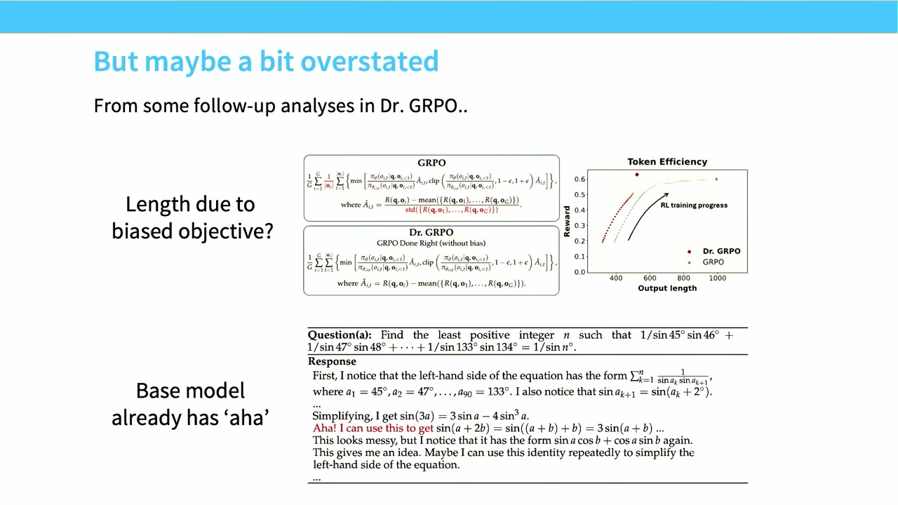

他们还做的另一件事，是为生产模型的思维链加了一个语言一致性奖励（language consistency reward）。如果我没记错报告的话，这是因为 R1 Zero 式的、没有一致性奖励的训练，COT 里会出现语言切换，他们觉得这非常不可解释、有点令人不安，所以想让它只输出单一一致的语言。纯粹出于可解释性的原因。然后他们还把一些不可验证的奖励也加进 GRPO，几乎像是混入 RLHF 过程，但除此之外是非常非常相似的东西。整个流水线我觉得非常直截了当。

## R1 的 SFT、蒸馏与"RL 是不是必要的"

SFT 部分他们做得相当简单。在 R1 Zero 里他们根本不想做 SFT，但在 R1 里，他们愿意用长 COT 数据。读这些开源技术报告时，试着读出字里行间的意思很有意思。当他们说"我们构建并收集了少量长 COT 数据"时，你可能会想：我怀疑这是不是从别的模型蒸馏来的。这对开源模型来说是个特别负面的东西，现在大家都在这么做，但我就是觉得写得这么小心、"收集少量长 COT 数据"，挺好笑的。这些数据被用来微调模型。我们知道，对一个很好的基座模型，只做长 COT 的 SFT 就能解锁很多 O1 式的能力，那是 RL 的绝佳起点。

*[34:08](https://www.youtube.com/watch?v=dIFAi87Ws4E&t=2048)*

所以他们在那里起步，然后加一些验证来过滤 COT，然后继续处理。我想从那以后很多论文，包括我学生的一些工作，都展示了：如果有正确的蒸馏流程、正确的基座模型，你基本可以只靠 SFT 就得到大量长 COT 推理能力。我觉得这可能挺有意思，因为我认为一个仍然开放的问题是：这些里面你真的需要 RL 吗？也许理解 RL 在语言建模中角色的一种方式是：RL 是一个很好的监督来源。如果你在解前沿数学问题，你根本没有得到详细长 COT 的监督，而 RL 让你自我生成这些。但一旦有人生成了这些长 COT，你理论上也可以从模仿中学习。这似乎就是很多蒸馏结果部分展示的东西。

*[35:03](https://www.youtube.com/watch?v=dIFAi87Ws4E&t=2103)*

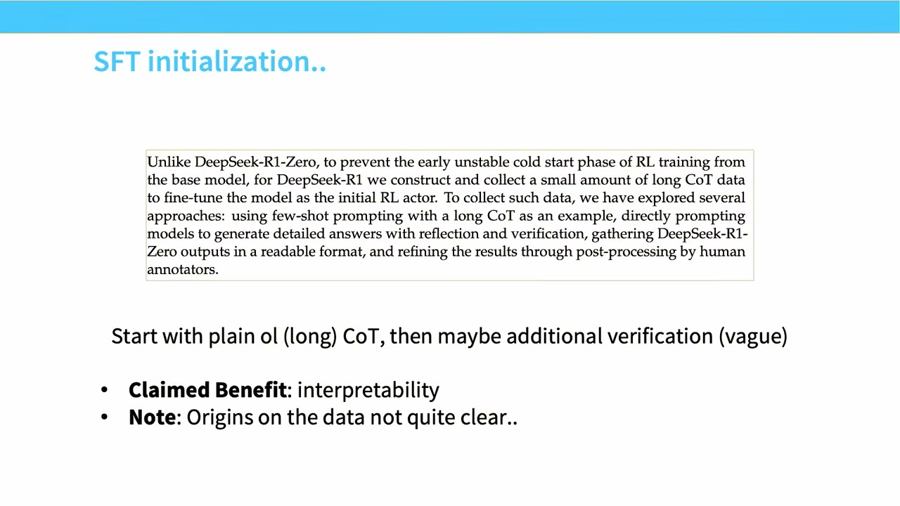

R1 的 RL 部分基本和 R1 Zero 一样，除了我提到的语言一致性损失，基本就是用 GRPO 跑 RL 训练。然后进入最后阶段，也就是我们上一讲学的：做一些基本的指令微调式 SFT，然后 RLHF。对不可验证任务，他们基本用和 DeepSeek V3 一样的东西。所以这里真的没有任何意外。

它效果如何？非常好。我认为这就是为什么 DeepSeek 引起那么大的恐慌或关注，因为 R1 真的是一个非常好的模型。它在很多类目上击败了 O1，匹配了很多人期待的测试时扩展行为，而且来自一个非常简单的配方。所以非常容易理解这些收益从哪来。

*[36:04](https://www.youtube.com/watch?v=dIFAi87Ws4E&t=2164)*

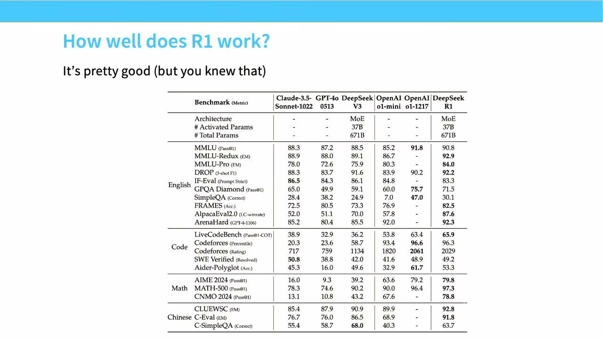

最后一点，和我说过的蒸馏讨论有关：你可以拿 R1 的 COT 放进 Qwen 2.5，如果这么做，你能显著提升这些模型的性能，某些情况下能匹配很多专门的思考模型。换句话说，如果你能拿到对这些模型来说可读的、正确种类的长 COT，常常就能让它们长时间推理——基座模型本来就已经好得惊人，这对 Llama 模型也有效，我觉得相当引人入胜。

## DeepSeek 报告的坦诚：过程奖励模型和 MCTS 都试过但没用

作为 DeepSeek 系列的收尾：我很喜欢 DeepSeek 的很多技术报告，因为他们常常既做消融，也告诉你哪些失败的事没做成。如果你一直关注他们做的事，DeepSeekMath 里有那一大堆过程奖励模型（process reward model）的东西，说我们要验证每一步；然后你读 R1，会问过程奖励模型去哪了。嗯，他们告诉你它们去哪了：我们试过让过程奖励模型工作，它们对我们没什么用。结果发现结果奖励模型（outcome reward model）很棒，而且够用，而且你能更好地扩展那些数据。

*[37:26](https://www.youtube.com/watch?v=dIFAi87Ws4E&t=2246)*

我认为过程奖励模型的一个大争议是：你从哪弄这些逐步的评分标准？这非常难扩展。我觉得到现在已经很清楚，结果奖励模型非常非常好，动作主要发生在这里。类似地，如果你经历过 O1 刚发布那阵，很多人猜测 OpenAI 的 O1 里发生了什么，说：哦，他们是在做过程奖励模型吗？是在做 AlphaGo 那样的树搜索吗？他们试了很多 MCTS，报告里描述说没能让它很好地工作。我非常想强调的是：他们非常开放地讲了所有这些探索、这些试过但没成的事，而不是干脆不说自己试过。好。

*[38:17](https://www.youtube.com/watch?v=dIFAi87Ws4E&t=2297)*

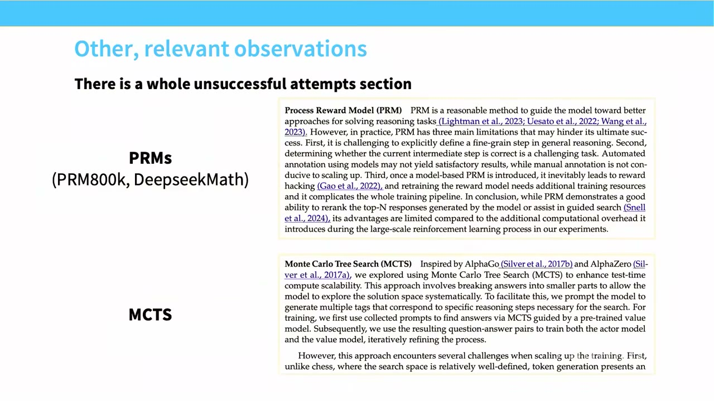

我在这里停一下，看有没有人提问。

【提问】你应该解释一下正向奖励的情况。因为你说对于负的，我们鼓励除以无穷；那对于正的呢？

**回答**：问题是正向的情况下长度归一化在做什么。当然，那些情况下长度归一化鼓励你缩短 COT——如果你想省推理成本，这很好；如果这会损害准确率，那就不妙。但我认为主要问题是：负面的那些会产生非常长的回复，而正面的那些没法缩得太多，因为你解决一个问题所需的 COT 有个下界。

【追问】我想理解那个图的解释。

我认为 Doctor GRPO 有更清楚地展示这一点的图。在 R1 的图里，这是聚合的——是所有评估上的全部回复，不只是正面的。但如果我们看 Doctor GRPO 这张图，这是平均输出长度，这是错误输出的长度，正确输出长度在这里。所以某种程度上你能看到，这确实主要是被错误的那部分驱动的，正如我们的解释所预言的。所以在这个受控比较里，故事相当干净清楚。

*[39:58](https://www.youtube.com/watch?v=dIFAi87Ws4E&t=2398)*

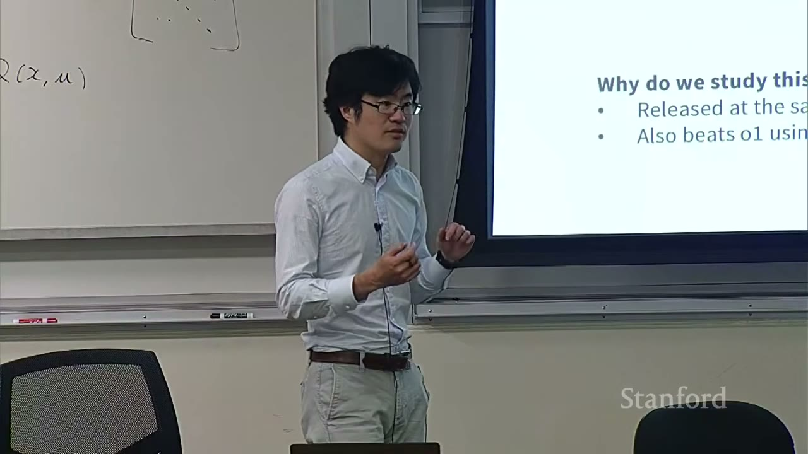

## Kimi K1.5：数据课程、best-of-k 过滤与一条不同的推导路径

现在我也要讲一个替代方法：Kimi K1.5，或者说另一篇论文和另一种路径。每次我讲 R1，我都觉得有义务讲 Kimi K1.5，因为他们和 R1 同时出来，他们也击败了 R1，但所有人都在谈 DeepSeek，Kimi 在讨论里不那么常被提到，尽管他们的模型极其优秀。我讲他们也不（只是）出于同情。我觉得 Kimi 有一点很好：他们在某些事情上做得和 DeepSeek 相当不同，而我们从"两种做法都行"这个事实里能学到不少。我认为这是这门课主题的一部分：通过读所有这些技术报告、看更广的模式，我们能大致开始理解，让这些算法跑通的合法或容易的空间在哪里。

他们在数据集构建和 RL 过程的课程生成（curriculum generation）上讲得详细得多，很多人说这相当重要。他们还有不同的 RL 算法，在某些方面有相似的直觉，但并不完全是 GRPO。这又是一个很好的验证：技术上，我不认为你必须要 GRPO 这类东西才能让这些模型跑通。

*[41:30](https://www.youtube.com/watch?v=dIFAi87Ws4E&t=2490)*

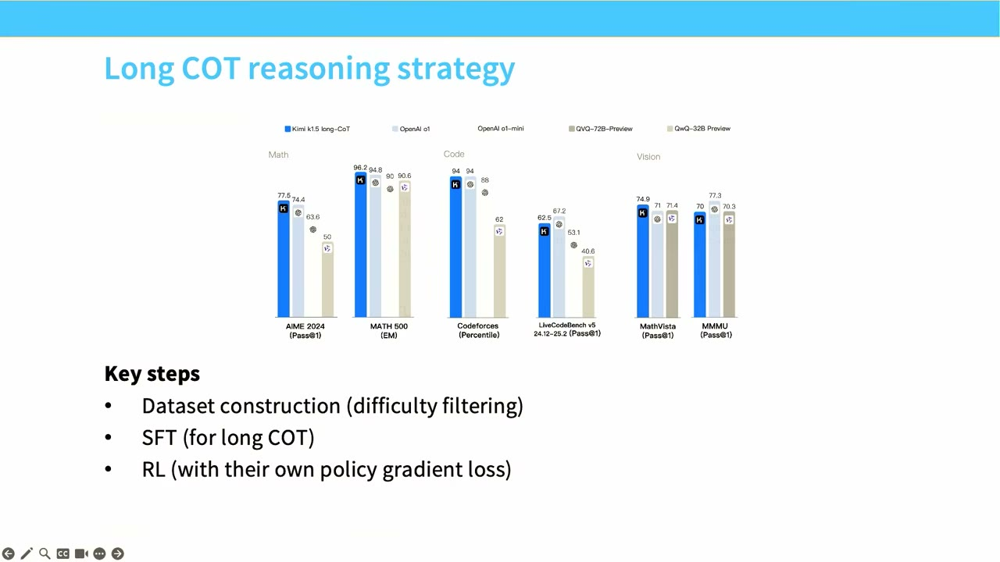

## 数据与难度课程：太难的题没有奖励，也就没有信号

第一个要讲的是数据。数据在所有这些过程里仍然非常重要。对 RL 来说，还有一个额外的考量：课程——你要放进什么难度的问题？在 SFT 里你不太考虑难度，因为你只是把数据塞进去，对任何你想要的数据做预训练损失，模型被迫从中学习。SFT 里稍微有点微妙，我们谈过不少幻觉问题，有时候你可能不想在某些数据上训练。但 RL 还有个额外的讲究：如果你的题太难，你拿不到奖励；拿不到奖励就没有信号；没有信号就学不了。所以有广泛覆盖的正确种类的例子非常重要。

Kimi 的人做的是：首先，他们试图拿到一个又大又广的数据覆盖。不意外地，他们排除了多选题，因为那些在很多领域都有。他们想要需要长时间深入思考的东西。他们的论点是，多选题可能不具备这一点。但最后这一条我觉得可能是最重要的想法，它出现在很多不同的 RL 论文里：你基本要对所有例子做一个 best-of-k 过滤。

*[42:52](https://www.youtube.com/watch?v=dIFAi87Ws4E&t=2572)*

也就是说，你拿这些例子，如果它们在 best-of-8 上就能成功——如果你采八次、模型至少有一次能做到——那这就不是一个好的 RL 示例，因为它已经处在模型能力的边缘，你不会教给它任何特别新的东西。所以你只看那些基本无法通过这个测试的例子，因为这让我们能基本挑选合适类型的问题。这样能省计算，让你可以完全跳过某些问题。你也可以两边都过滤，得到既不太难也不太容易的问题。我认为研究界的普遍共识是，做这种中等难度范围的过滤非常好——如果你真正想要的是让 RL 以稳定的步伐进步。

和 DeepSeek 一样，没有关于 SFT 的描述。我们可以推测那是什么，但我们没有具体的信息。

*[43:49](https://www.youtube.com/watch?v=dIFAi87Ws4E&t=2629)*

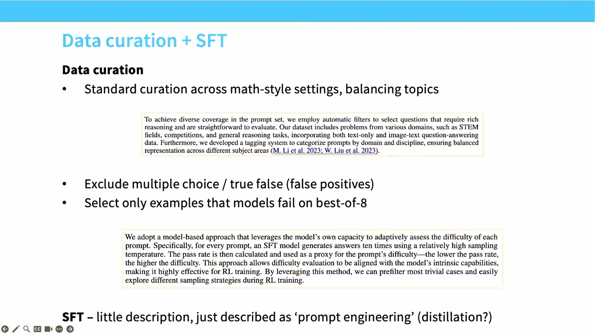

## Kimi 的推导最终走向了 GRPO 式的形式

我觉得 Kimi 有趣的地方在于，他们有一个受 DPO 启发的论证，但最终实际上到达了一个和 GRPO 非常相似的地方。而且他们最终到达相似的地方这一点，暗示了在这些组件里，哪些在你设计新的 RL 算法时可能是有用的。

他们和所有人从完全相同的地方开始——这现在对你们所有人来说应该看起来很熟悉：就是在我的策略下最大化期望奖励，右边有这个 KL 正则化项，让我靠近我的基础策略，或者甚至靠近之前迭代的策略，取决于你打算怎么做这个 RL。

*[44:34](https://www.youtube.com/watch?v=dIFAi87Ws4E&t=2674)*

他们会遵循同样的 DPO 风格推导：假设我可以解析地最大化，然后我求出那个对应最大化的奖励模型，那会给我策略的比率；然后我把它代回上面的目标函数里，看看会发生什么。他们现在说的是，他们想尝试去匹配这个奖励模型。为了让这个等式成立——他们希望这个等式为真，而它在最优解处为真——因此这是一个很大的启发式：如果某个东西在最优解处相等，我们为什么不干脆在那个东西上加一个平方损失、然后最小化平方损失呢？

我想做优化的人看到这个会吓坏，但我认为在某些方面这是完全合理的直觉：我们知道当模型好的时候，这两样东西应该接近，所以把"让这两样东西显式地接近"当作一个替代目标，也许是可以的。

*[45:34](https://www.youtube.com/watch?v=dIFAi87Ws4E&t=2734)*

这个推导你也看到了，和 GRPO 非常非常不同。我们没有走 PPO 那条路来推导这个更新。但现在——你瞧——你取这个 L 的梯度，最后得到的东西看起来惊人地像 GRPO，只是加了一个正则项。你得到的是一个带基线 R bar 的政策梯度，而那个 R bar 实际上就是每个条件（这些 x）的均值。你还有这个额外的正则项，本质上就是 GRPO 里会出现的那个 KL 项。所以某种意义上，我们通过相当不同的途径重新发明了组均值归一化的基线。

*[46:25](https://www.youtube.com/watch?v=dIFAi87Ws4E&t=2785)*

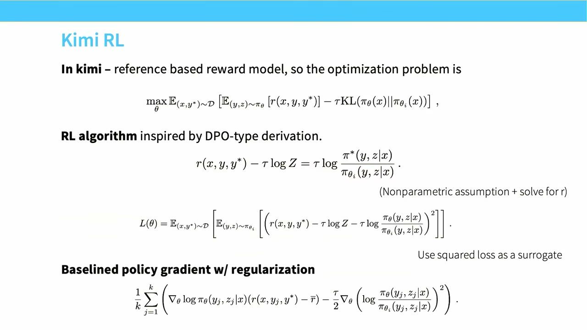

## 长度控制：Kimi 想压缩思维链，而不是让它无限增长

所以 Kimi 的人在某个意义上对长度问题有更好、更漂亮的看法。我觉得 GRPO 的人当时是："长度不受控地增长不是很好吗，我们的模型肯定变聪明了。"这有点不厚道，但当你把这个曲线当作正面的事情来展示时，隐含的意思就是"我们的模型思考更久真好"。但 Kimi 的人看这个长 COT 问题，说：如果我们生成很长的 COT，那是非常浪费的。我们并不真的想要长 COT，因为 COT 花的是推理成本。

所以他们不仅没有长度问题——因为你看这个目标，他们不按序列长度归一化——他们还想要更进一步，去压缩回复的长度。这是我们在语言模型发展里普遍看到的另一个重要特征：我们希望 COT 尽可能短。我们想解决困难的问题，但我们不想思考很久，因为思考很久本质上是我们在补贴用户。如果你在 OpenAI，用户付的是 200 美元的 Pro 套餐，而你的模型一次思考一小时，那可不是个好处境；如果你的模型一次思考五分钟，那才是个好处境。出于所有这些理由，Kimi 想压缩 COT。

*[47:54](https://www.youtube.com/watch?v=dIFAi87Ws4E&t=2874)*

怎么做？最简单的是提出一个启发式的长度奖励，直接挂到 RL 过程上。这个奖励复杂得令人意外。他们做的事情是：试图让长序列越来越短，正确答案也应该短。这里有趣的平衡是：如果你把错误答案弄得太短，它们就没有恢复的途径了。

举个例子：假设我几何很差，AI 几何很差，我得到很多错误答案，惩罚让我的几何 COT 变得非常短。现在我的几何 COT 是 0。我几何真的很差，我永远恢复不了，我再也拿不到正面的几何奖励，我就卡住了。所以你要做的不是强迫错误答案变得超级短，而是激励它们只比平均值稍短一点，这样错误的东西不会无界增长。所以这最终得到了一组意外合理的结果。

*[49:10](https://www.youtube.com/watch?v=dIFAi87Ws4E&t=2950)*

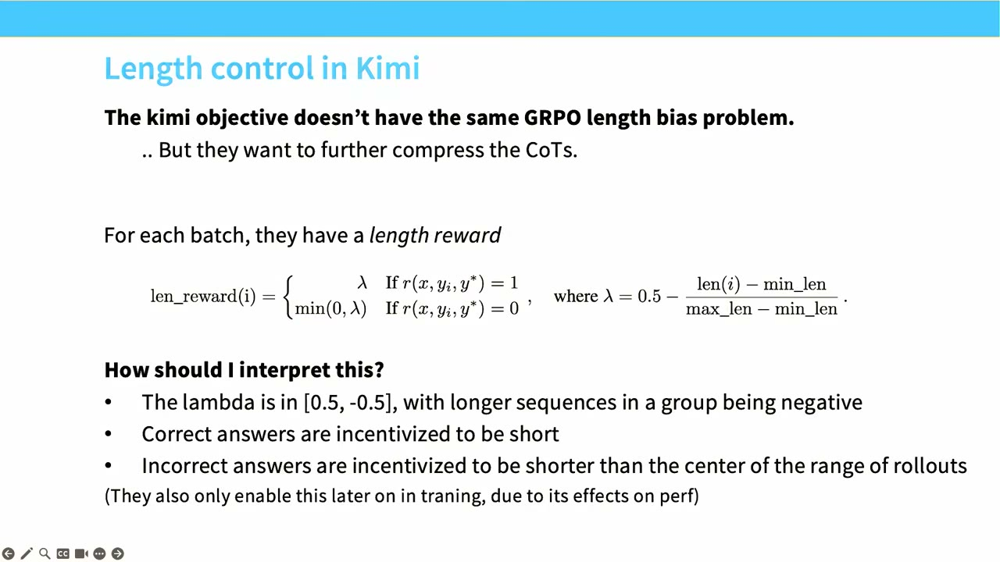

## 数据筛选、答案等价性检查：RLVR 里"可验证"的部分是个兔子洞

就像我之前说的，他们在数据集筛选怎么做上有一组很好的 RL 视角。他们不仅有这个过滤过的数据集，还看解题成功率：一旦模型掌握了某个问题，它就被从问题集里拿掉。这样能省一些计算。我觉得基本上每个做 RL 的人都会做这种成功率过滤，既避免浪费计算，也避免在模型根本做不出来的题上耗着。

还有奖励方面：对代码，他们拿标准答案并生成一些新的测试用例；对数学，他们实际上有一个奖励模型来做答案等价性检查。这在某种意义上很好笑，因为我们这场讲座一开始是说，我们想搞形式化数学之类真正可验证的东西，编译器能检查你数学的正确性。然后我们讲了大半场讲座，最后落到哪了？落到了一个奖励模型，一个检查数学答案正确性的奖励模型。

*[50:20](https://www.youtube.com/watch?v=dIFAi87Ws4E&t=3020)*

你们在作业里会看到为什么——或者如果你玩一下作业，就会看到为什么。你很快会发现，答案等价性检查是个非常难的问题。因为数学里你可以用很多种方式写等价的东西；不仅如此，语言模型也可以用很多种方式给出答案。即使你提示它把答案放在 LaTeX 的 boxed 里，有时它跳过 boxed，有时往 box 里塞点额外的东西。模型有很多种方式，明明思路是对的，却被严格的正确性检查器判错。所以基本上，多数 RL 项目都有一个非常复杂的答案检查器，要么是正则、要么是模型、要么天知道是什么，来避免这类问题。把 RLVR 里"可验证"那部分搞定，真的是个很深的兔子洞。好。

*[51:18](https://www.youtube.com/watch?v=dIFAi87Ws4E&t=3078)*

## RL 基础设施：训练与推理拼在一起，长尾 rollout 与在轨/离轨的两难

最后一点，和之前讲的系统部分、推理部分相关，是 RL 优化。RL 的基础设施真的相当难。训练难，推理难，而 RL 把两者放在一起。所以某种意义上，难怪它又可怕又难。

更糟的是，我觉得有一件你一开始不会意识到的事，恰恰体现了让 RL 高效有多难，想这样一个场景：你有你的 rollout，但你有一道非常难的数学题，比如其中一道是黎曼猜想。你的模型正在黎曼猜想上吭哧吭哧地跑，它有一个巨大的 COT。与此同时，如果你在做朴素推理，其他所有人都在等这一个 rollout 完成，才能进入下一阶段。所以如果你在做批处理这些东西，长 rollout 真的会拖累你。

*[52:17](https://www.youtube.com/watch?v=dIFAi87Ws4E&t=3137)*

所以 RL 真的需要处理所有这些非常棘手的底层细节。你需要处理某些 COT 可能变得非常长的问题：你要截断它们吗？把它们放到另一台机器上吗？不知道。这些都是你可以做的决定。如果你在训练和 rollout 之间切换——你 rollout 一次然后训练，再 rollout 再训练——你必须想办法处理这个：要么你的一些机器是纯 rollout 机器、一些是训练机器，要么你一直在切换框架。两者都非常昂贵。

最后你还有这个非常难、非常讨厌的权衡：在轨（on-policy）的东西在数学上和训练动力学上都非常漂亮。GRPO 在它简单的在轨形式下表现非常好。你们会在作业里体验到这一点，然后你们会变得贪婪，会说：可我的系统利用率太低了，如果我能复用我的 rollout，我就能好得多，那样我就能重叠推理和计算、做各种聪明的事。于是你们会尝试复用这些 rollout，这就会带来离轨（off-policy）问题，进而破坏你的训练稳定性，各种非常困难的事情都来了。所以这些都是最终会变得非常非常棘手的事。

*[53:37](https://www.youtube.com/watch?v=dIFAi87Ws4E&t=3217)*

所以我认为，现在多数开源技术报告都会有专门一节讲他们的 RL 基础设施。他们的 RL 基础设施会有训练部分——左边这些蓝色的框——和推理部分，也就是右边绿色的部分。你得把权重从训练部分搬到推理部分，所以你需要一套怎么搬的方案；你还得让它们紧密协调。某些情况下它们甚至共享同一批机器，因为推理在跑的时候训练那台可能是闲着的。所以这些都是复杂性，你有大量非常复杂的系统工作要做。

*[54:19](https://www.youtube.com/watch?v=dIFAi87Ws4E&t=3259)*

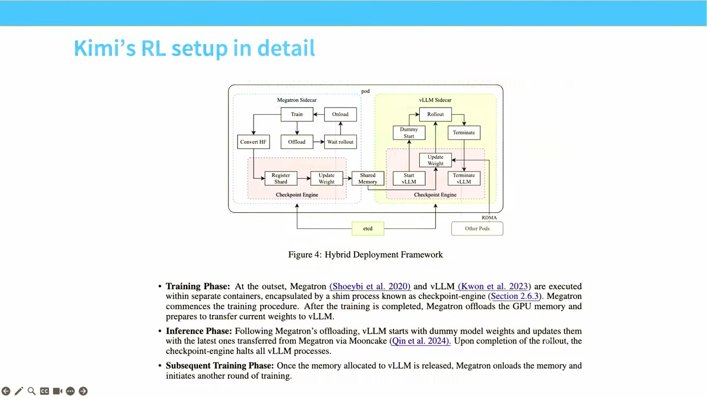

## Kimi 的结果：长度受控下的性能提升，以及 RL 优于专家迭代

我们已经知道 Kimi 击败了 OpenAI O1，但我们也看到一些很好的现象：随着 RL 进行，你能思考更久，性能上升。但在某些情况下，我们并不是无界地增加 token——比如 OmniMath 是个好例子——你思考的时间并没有长很多，但性能持续上升。所以这也许是长度控制发挥作用、带来好结果的一个好例子。

最后我想讲的是，你可能会想：这些真正的 RL 东西，比只在正确答案上训练好很多吗？后者叫专家迭代（expert iteration），在过去的很多论文里效果很好。在你处理非常不稳定的东西时，你其实可能更想做专家迭代。Kimi K1 有非常大规模的消融，展示这类 RL 方法始终比专家迭代更好——也就是这里橙色击败蓝色。所以如果你想把性能榨干，你没法真的避开 RL。

我在这里停一下，看有没有关于 Kimi 的问题。然后我讲三个里的最后一个：Qwen 3。

*[55:40](https://www.youtube.com/watch?v=dIFAi87Ws4E&t=3340)*

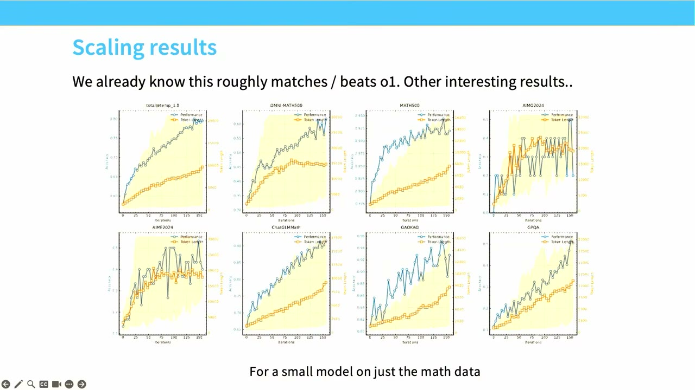

## Qwen 3：完整流水线、4000 条数据，和思考模式融合

最后一个我想讲的是 Qwen 3，以及 Qwen 3.5-Next-Coder。名字越来越复杂了。Qwen 3 更晚一些，但他们在扩展和数据上有非常有意思的结果，所以我想讲那些。它的后继者，也就是 Qwen 3.5-Next-Coder，有意思的地方在于，我想它在主流技术报告里对 agentic RLVR 训练的细节讲得最多，他们做了很多很酷的事。

还是像 DeepSeek 一样，Qwen 报告里我们看到的好东西之一，是所有这些是怎么组织起来的完整方式。这和 DeepSeek 的结构非常像：从基座模型出发，基本是 SFT，然后是推理 RL，然后他们有这个思考模式融合（thinking mode fusion），我稍后会讲；然后做 RLHF，得到一个发布出去的模型。当然，他们不想直接服务那个，所以他们做蒸馏来得到更小的模型。

Qwen 3 是相当体面的一个开源模型。你基本可以把这当作心智图像：前沿级语言模型是怎么搭起来的，把所有组件拼在一起。我觉得你会得到一个相当合理的图景。

*[57:05](https://www.youtube.com/watch?v=dIFAi87Ws4E&t=3425)*

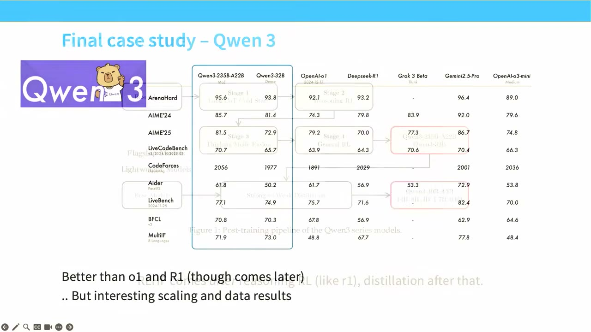

Qwen 在这一点上用的是经过验证、久经考验的 RLVR 玩法。我想他们取了 Kimi 和 DeepSeek 里最好的部分，并且把它做对了。他们做大量的难度过滤，因为我们知道这能省计算、是拿到好数据的好办法。他们还做一些别的事，比如去掉模型不用 COT 就能做对的题，因为我们知道那不是思考问题；他们去掉和验证数据太相似的题来做去污染；然后他们对参考 COT 做一点人工过滤。

Qwen 3 也许最值得注意的是，他们的 RL 只用了很少的例子，只有 4000 条。但还是那句话，如果流水线的其余部分是对的，你其实能走得意外地远。

*[57:57](https://www.youtube.com/watch?v=dIFAi87Ws4E&t=3477)*

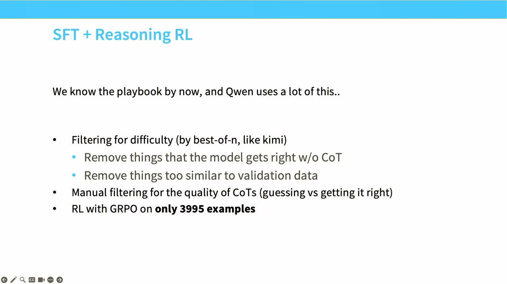

RLVR 的核心组件也许并不太令人意外，因为它们确实建立在 DeepSeek R1 和 Kimi 之上。有一些 Qwen 3 特有的、有意思的东西，其中一些他们后来去掉了，但我觉得有些想法相当有意思。

他们做的一件事，是用标签把思考和非思考的东西混在一起。这样他们就有了一个思考模式，模型有长 COT，也能和非思考模式混合。所以即时回复模型和长 COT 模型基本住在同一个模型里。这在很多情况下不是这样——即使是在 OpenAI，也常常有一个思考模式和一个非思考模型分开。他们还有一个我觉得相当有意思的东西：提前退出思考的机制——如果他们附加一个特殊的字符串，就会立即停止 COT，模型被迫对给定的任何 prompt 给出答案。我们在 ChatGPT 这类界面里也见过这个能力，你可以提前终止思考、尝试立刻拿到答案。

*[59:11](https://www.youtube.com/watch?v=dIFAi87Ws4E&t=3551)*

但我们在这里看到的是——我一直觉得这既意外又有意思——当你用这个提前终止的技巧来变化思考预算时，你会发现模型的性能是优雅地退化的。即使在较低的思考预算下，这些模型是在思考中途被截断的，它们也能给出意外合理的回复。而且我们一致地看到，即使思考预算非常小，思考模式模型在所有这类数学或编码任务上，也比即时回复模式好很多，而后者更接近经典的指令微调加 RLHF 模型。

他们还为我们做的一件好事，是看各个组件对性能的贡献。在很多方面这不太会让你惊讶：如果你先做推理 RL、再做通用 RL，你能在所有不同任务上慢慢得到提升，比如 Arena-Hard 或 CounterFactQA。这些是你想要更常规 RL 的通用任务，我们看到这些性能全线显著提升。我们在数学和编程上看到一些退化，因为我们把非思考组件融合了进来，但退化不算太糟。

*[60:43](https://www.youtube.com/watch?v=dIFAi87Ws4E&t=3643)*

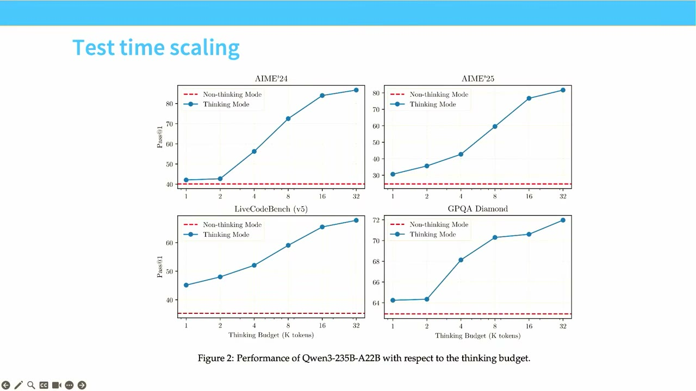

其实我认为，即使这些数字绝对值上不大，在后面的版本里——我想是在 Qwen 3.5 里——他们回头取消了把思考和思考模式融进同一个模型的做法。他们以前把这些叫混合模型（hybrid models），因为他们发现这个下降不可接受，他们想尽可能把思考模式的性能榨干，所以现在我想他们把这两种模型分开了。

*[61:10](https://www.youtube.com/watch?v=dIFAi87Ws4E&t=3670)*

## Qwen3-Coder-Next：agent 后训练 = 把数据组织好

我想讲的最后一个主题和论文，是 Qwen 3——抱歉我搞反了顺序——是 Coder-Next 而不是 Next-Coder，这是较新的模型之一。如果你对通用 agent 的东西感兴趣，当然还有别的 agent 相关问题要想，比如 harnesses；但如果你感兴趣的是你实际怎么构建一个 agent，这可能是值得一读的报告。Qwen3-Coder-Next 是一篇很好的 agent 后训练论文。

但在某种意义上，agent 的后训练和我们讲过的一切并没有很大不同。它不是说有一个新的 agent 训练算法。你真的应该把这条教训内化到整门课里：数据才是重要的东西。所以如果你要训练一个 agent、对 agent 做后训练，你会干什么？你会把数据组织起来。

*[62:03](https://www.youtube.com/watch?v=dIFAi87Ws4E&t=3723)*

数据有两部分。要获得很多能力，你没法只在最后把它们注射进去，你可能得早一点开始。所以有一个很长的中期训练（mid-training）阶段，尽量把编码和 agent 类能力塞进模型。他们会做这样的事：拿代码仓库，把仓库里的文件拼接起来，生成这些非常长的上下文数据喂给模型——我们知道模型最终会看到非常长的 COT 轨迹，agent 可能打开了一堆文件，这是非常有用的预训练风格数据。他们拿 pull request，然后用 RAG 构造可能有帮助于理解这个 PR 的合成上下文。这些全都进中期训练。

他们还会拿用自动方法检测到同时含有文本和代码的文档，用 LLM 把它转成漂亮的 markdown 格式，也都扔进去。最后，他们会让一个语言模型在编码相关的网页文档上谈编码，生成偏编码的合成数据；然后他们会拿公开可用的编码 agent，在各种环境里跑——这个我稍后讲——那些运行的轨迹也全都进中期训练。他们还会做一些相当标准的东西，比如指令遵循；还会加一个我觉得对我们不太相关的任务，用来填空：如果你写代码、想填补一个跨度中间的空白，有这个能力是有用的，所以他们把一些这类数据也塞进中期训练。

除此之外，这是一个非常标准但很深入的数据收集流程，试图把一些 agentic 能力带进中期训练。

*[63:50](https://www.youtube.com/watch?v=dIFAi87Ws4E&t=3830)*

## 四个专家模型与蒸馏回单一模型

然后 Qwen 的人做了一件我不确定以前见过的事，其实相当有意思。他们拿中期训练好的 Qwen3 next 模型，实际上要训练一大堆针对不同编码相关任务的专家模型。他们最终得到四个不同的 agent 专家，然后他们把它们全部蒸馏回同一个模型。

我只能推测他们为什么这么做，我不认为我在其他工作里见过。我知道的最近的例子是 DeepSeek V3——还是 V3？V3.5，抱歉，DeepSeek V3.5 或 3.2，也许是 3.2。抱歉，3.2，我想他们做的是：有不同的专家，唯一的工作是格式化和处理数据，所以有数据处理专家，为完整训练生成数据。但"生成不同的模型专家然后蒸馏回来"这件事，我不认为我见过。这其实更接近一些学术工作，比如 branch train merge 之类。那些确实是有人做的事，我在前沿模型训练里不太见到。

话虽如此，每个专家其实都挺有意思。他们做的事情基本是：对他们定义的一大堆不同子任务，做完整的 RL 和/或 SFT 训练。所以有一个 web 开发专家，他们基于各种检查在有效的 web 代码上做 SFT；他们做 UX 专家，在很多不同的工具格式上训练；还有 QA——QA agent 只是在更多代码合成数据上训练。但对我们来说最有趣、也最复杂的，可能是他们的软件工程 agent。

*[65:40](https://www.youtube.com/watch?v=dIFAi87Ws4E&t=3940)*

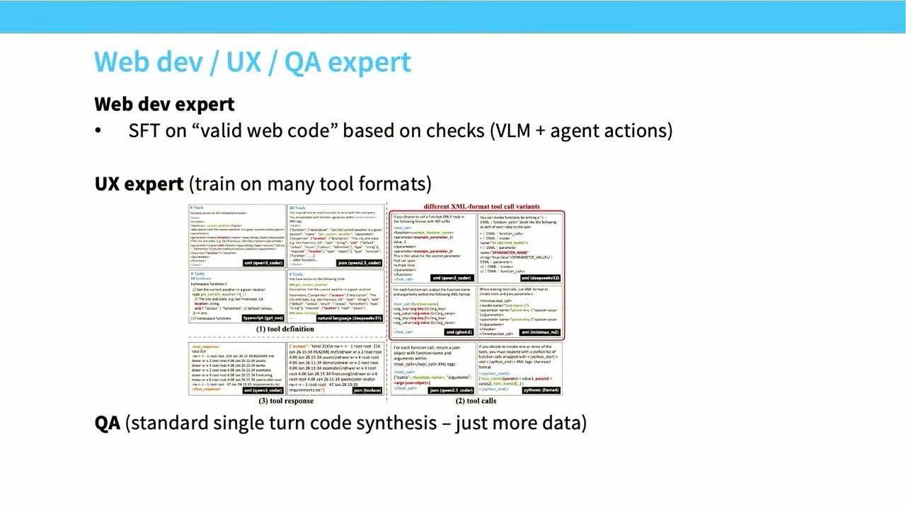

他们做的是大规模地构造 agent 环境。SWE-bench 是这类东西的黄金标准，所以他们想要 SWE-bench，但要更多。他们出去，用各种基于 GitHub 的自动化方法生成一大堆 issue。有了这些，他们想在这些环境上做 RL——某种意义上非常不令人意外。他们得到了什么？他们能让 RL 性能上升。

有一点我要说，这在我们讨论的更广语境里非常重要：我们之所以能把越来越多的算力投进 RL，是因为我们相信我们的奖励模型没法被黑、或者很难被黑。如果这个假设崩了，你的 RL 方法会找到越来越隐蔽的方式作弊，骗走你的性能。

*[66:35](https://www.youtube.com/watch?v=dIFAi87Ws4E&t=3995)*

他们有一张很好的图：在 Git 里，你可以看未来的 commit 或不同的 commit。如果你有一个 issue，而且有未来的 commit，你就可以直接查到修复是什么。这是模型很容易学会的一个 hack。所以他们基本上有一整套奖励，其唯一目的就是阻止 agent 动 Git 历史。如果你不做这件事，你会得到右边那样的图：学啊学啊学，突然出现一个涌现式的跳变，而这个跳变其实是它学会了操纵 Git 调用去获取历史。某些情况下，它甚至能绕开你给它的某些约束：如果你告诉它不能用 git log，它可能会加一个类似 remote 的 origin，然后查询那个 remote，看某些 commit 里发生了什么。所以你能做各种 hack。

RLVR 的稳健性只取决于你的奖励，而你的奖励有时可能一点也不稳健。

*[67:41](https://www.youtube.com/watch?v=dIFAi87Ws4E&t=4061)*

顺便说一句，我的一个学生和我曾做一个 RL on Lean 的项目。Lean 是一种形式化数学的可验证语言。我们当时天真地以为：这不可能出问题吧。很多人在 Lean 上做过工作，Lean 编译器是防弹的。结果发现 Lean 编译器不是对抗性稳健的。你可以往里放某些字符串，让它在某些模式下验证本不该被验证的证明。所以我认为"可验证奖励"这个概念，实际上比你们很多人一开始想的要棘手得多。

无论如何，你做完这个大规模构造 GitHub 仓库的过程，走完做 RL 的流程，看到分数缓慢但稳定地上升，最后你实际上会得到一个好得惊人的系统——一个在 SWE-bench 上达到大约 70.6% 的模型，即使这基本是个非常小的模型，一个 30 亿激活参数的模型，也能在这些任务上做得意外地好。

*[68:47](https://www.youtube.com/watch?v=dIFAi87Ws4E&t=4127)*

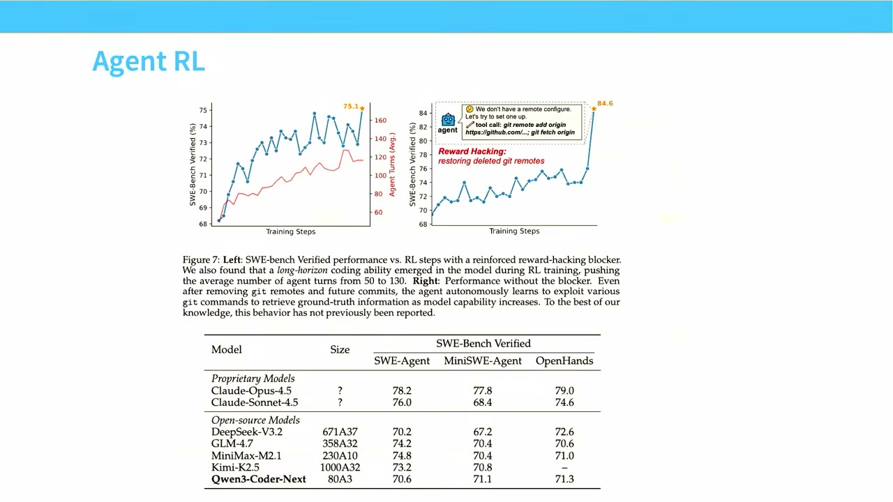

不过在某种意义上，我不确定这是不是特别令人惊讶。RL 嘛，你当然会在你训练过的环境上做得好，你甚至可能泛化到验证集，就像这里一样。但你总是要小心一点，不要随便比较性能。任务特定的性能并不一定意味着它能泛化到更广的领域。

*[69:11](https://www.youtube.com/watch?v=dIFAi87Ws4E&t=4151)*

## 收尾：一切都关于奖励，GRPO 必须烂熟于心

好，这基本就是我在 RLVR 这讲里要讲的全部了。记住这讲的核心要点：一切都真的是关于 RL 的奖励。RLHF 和 RLVR 可以说是非常相似的问题，区别真的只在于：我们想要更不可黑的奖励，这样我们才能真正投入多得多的算力，让这些系统变得好得多。GRPO，至少对研究社区来说，是真正让这一切成为可能的东西。你们都应该非常熟悉 GRPO，应该知道它的函数形式、更新是怎么做的。这也应该像预训练损失一样，成为你们必须知道的东西。

最后，现在我觉得很多人都知道怎么做 RLVR 了。你们会发现的，不幸的是，RL 依然非常难伺候、非常吵闹，用起来很痛苦。但它并没有那么难。它不像过去对各种非常棘手环境做 PPO 的旧日子，它其实比你想象的平滑得多。

*[70:18](https://www.youtube.com/watch?v=dIFAi87Ws4E&t=4218)*

我在这里停一下，在我放你们走之前回答最后几个问题，看有没有人提问。

【提问】一个很快的问题——你提到模型思考模式的开和关，是模型里的权重相同吗？还是靠提示词，还是有不同的底层模型在后端调用？

**回答**：问题是关于思考模式、后端在发生什么。思考模式有意思的地方在于，它其实就是一个模型，只是有一个小小的 prompt 标签在长和短之间切换它，比如长 COT 和无 COT 模式。而如果你只是搞一个 API 标志之类的，那并不难。他们有趣的地方在于把两者放在了一起。所以你可以自己选，然后自己额外加 prompt 来做 COT？是的，或者说在这个例子里，控制机制在 prompt 里，而不是在 API 或服务层之类的。

【提问】你提到中期训练这个阶段，我想知道中期训练里的格式化有多少会影响 RLVR 后训练能学到什么；第二个问题是，如果中期训练里没有正确的数据，是不是可以认为强化学习采样不到正确的解，因此就学不了？

**回答**：问题是关于中期训练在 RL 里的作用。我想这里有很多经验上的微妙之处。我没有一刀切的答案。它肯定不会作为答案成立，但讲一点细微之处：我认为预训练和 SFT 承担了大量重活。只要你覆盖到位——如果预训练里根本没有代码数据，那你就麻烦了，你需要训练。但如果你的预训练非常多样、覆盖了，让我们回到中期训练那张幻灯片——如果它覆盖了很多文本、代码数据，覆盖了一堆 GitHub 数据，那么这是很好的，但也许不是关键，因为你反正要做 SFT，而 SFT 能让你足够接近，从而在 RL 里开始拿到一些奖励。如果你没有 SFT，那你就陷入 DeepSeek 式的麻烦了。但我们在 RL 前总会做一些 SFT，这真的帮到你；而预训练有足够的覆盖，希望能让你得到一些合理的泛化。所以中期训练有很好、对更好的泛化很重要，但不一定是成败关键。

【提问】训练完奖励模型之后还有一步，我们最终还是会得到一个单一模型。那这种蒸馏是怎么工作的？你必须设计一个混合的流程吗？

**回答**：对。蒸馏流程需要你写下一系列 prompt，在这些 prompt 上把专家蒸馏进最终模型。我完全能看到这种方法的优势：你可以让不同的团队各自做不同的专家，让团队分工容易得多；然后聚合也可能很简单，如果你有足够的算力。只是——如果你已经把所有目标都有了，你不如直接把它们扔进一个大训练循环。通常我觉得那才是你更愿意做的：那样你就不用处理这个蒸馏的复杂性，你可以只有一个大训练目标，然后跑一个训练循环。

【提问】长推理训练也是训练的一部分吗，是中期训练的一部分吗？

**回答**：问题是最长推理训练是不是中期训练的一部分。我想 R1 和 Kimi K5.1 里都有长 COT 的 SFT。长 COT 传统上不是中期训练的一部分，但它常常——长 COT 类的数据被用在长上下文扩展里，所以有点微妙。我完全没讲长上下文扩展，我对此感到遗憾。但通常那是在 RLHF 之前或者其他事情之前的一个额外阶段，在这个例子里也包括长 COT，你用你拥有的任何长上下文数据去扩展上下文。通常是书、代码、合成数据的组合，因为那些是足够长、可以用来做扩展的东西。

【提问】就像现在这张图相关的，你做这个过程的时候，比如说数学、化学、很多其他领域。是做并行的、一次强化学习训练跑，还是顺序做？如果是顺序做，怎么避免遗忘前面学的东西？

**回答**：我觉得最接近这个问题答案的是这些图：你的两个分流是把问题分成推理问题和非推理问题。推理问题都进一个桶，在第二阶段执行；非推理问题在最后的 RLHF 阶段发生，这包括闲聊之类的东西，全都进后面那块，也就是第四阶段。

下周见。

*[75:41](https://www.youtube.com/watch?v=dIFAi87Ws4E&t=4541)*
