# 多模态：从 CLIP、SigLIP 到 LLaVA、Qwen 与 Chameleon

本讲是多模态模型的概览：先讲 CLIP 与 SigLIP 这两个图像编码器，再讲 LLaVA 和 Qwen 两族视觉语言模型如何把图像接入语言模型，最后讨论 Chameleon 的全离散 token 方案以及多模态建模的根本挑战。

## 为什么这门课要讲多模态

原本的计划是多讲一些强化学习的内容。但我想既然我只有一讲的时间，如果不讲一点多模态，这门课就会显得不太完整——因为如果你去看所有的主流模型，多模态已经非常普遍。所以这一讲会是多模态模型的一个概览。当然，这本身完全可以单独开成一门课，我只能在一讲里尽量多讲一些。

*[00:32](https://www.youtube.com/watch?v=26FtD08ZpOU&t=32)*

到目前为止，这门课我们一直只关注语言模型。而语言模型本身已经相当通用：它给你从任意一段文本到任意一段文本的能力，可以是任何语言、代码、诗歌，任何你喜欢的东西，甚至比如说 DNA。但世界是多模态的：有文本、图像、音频、视频。

*[01:00](https://www.youtube.com/watch?v=26FtD08ZpOU&t=60)*

如果去想我们想要到达的"北极星"，那就是人们所说的 omni model（全能模型）：能够接收这些模态的任意组合，并输出这些模态的任意组合。比如说，我可以给你一张图像和一段视频，然后针对这张图像和这段视频提问；我可以生成图像；我可以把音频转换成图像。有了 omni 模型，你可以想象出各种各样的应用。

*[01:39](https://www.youtube.com/watch?v=26FtD08ZpOU&t=99)*

在这门课里，我不会一路搭建出一个完整的 omni 模型，但我会给你一些零件，至少让你能够吃进一点图像——今天主要聚焦在图像上。

*[01:55](https://www.youtube.com/watch?v=26FtD08ZpOU&t=115)*

## Transformer 需要 token，而图像没有现成的 token

那么怎么构建这样一个东西呢？用这种方式引入有点奇怪，但现实就是：Transformer 工作得非常好。尽管很多人努力尝试别的东西，但在所有这些模态上、在大规模下，Transformer 仍然是我们拥有的最好的东西。

*[02:15](https://www.youtube.com/watch?v=26FtD08ZpOU&t=135)*

所以我们必须弄清楚如何使用它们。而如今 Transformer 是为文本设计的，因此它们有这样的特性：它们使用 token。它们接收一堆 token 作为输入，然后输出一些 token。在这里，我把 tokenization 的概念扩展了一下，使它不只是我们在文本里见过的离散 token，也可以是连续的 token——你可以把它们看作 token 的嵌入。关键在于，一个 token 应该表示某种语义单元的信息。例如在自然语言里，token 是子词（subword），它们有一定意义。而比如说，一个像素本身当然不是有意义的。所以我们必须以某种方式把所有东西，包括音频和图像，转换成离散或连续的 token。

*[03:13](https://www.youtube.com/watch?v=26FtD08ZpOU&t=193)*

请注意，即使是文本，我们也已经不得不这样做了。在第一讲里我们讨论过 tokenization，在那里这还不算太糟：我们有一个 BPE tokenizer，你们实现了它，这没问题。人们可能会希望有更好的 tokenizer，或者有某种根本不需要 tokenizer 的东西，但这也不是世界上最糟糕的事情。而现在，对于非文本模态，我们需要更加绞尽脑汁，弄清楚 BPE tokenizer 的等价物是什么，它能接收一张图像并生成 Transformer 可以消化的东西。所以这里你必须回答两个问题。一是，对于非文本数据，例如图像、视频或音频，如何把它们输入到 Transformer 中？二是如何把它们生成出来？本讲将主要关注第一个问题。

*[04:12](https://www.youtube.com/watch?v=26FtD08ZpOU&t=252)*

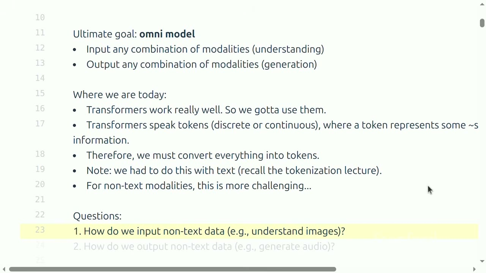

## CLIP：用对比学习把图像和文本对齐

好，让我们回到过去，把时间倒回到 2021 年。CLIP 模型，你们中一些人可能熟悉，是现代视觉语言模型的许多基础之一，我们可以把它讲得更细一些。CLIP 的全称是对比语言-图像预训练（Contrastive Language-Image Pre-Training）。一点历史背景是：在那段时间，GPT-3 已经出现了，GPT-2 也是，所有语言模型都已经进入了基础模型（foundation model）时代。

*[04:59](https://www.youtube.com/watch?v=26FtD08ZpOU&t=299)*

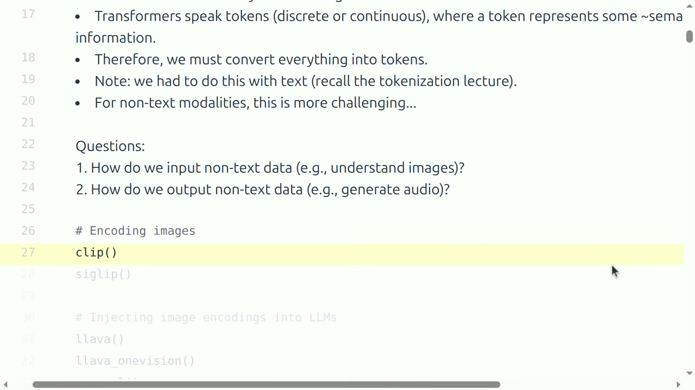

而视觉领域当时已经有一些努力，但传统上是基于大规模标注数据集，比如 ImageNet，在这些数据集上训练 ResNet 之类的模型，再做一堆别的事情，比如数据增强，从而得到非常好的性能。所以 OpenAI 的研究者在想：有没有可能利用互联网上存在的大量图像和文本描述？这受到语言领域这个想法的启发——你只要去爬互联网，就有了所有文本，它非常嘈杂，但不知怎么地，只要你训练一个足够大的模型，你就能从中理出头绪、生成有用的东西。那么对图像来说，等价的东西是什么？于是 CLIP 诞生了。

*[05:53](https://www.youtube.com/watch?v=26FtD08ZpOU&t=353)*

CLIP 的想法相当简单直接。假设我给你一堆图像-文本对，比如说 32,000 对。我要做的是：对每张图像，用一个图像编码器（具体是什么我稍后解释）把它编码成一个向量，这样我就有 32,000 个图像编码；对相应的文本我也做同样的事，得到 T1 到 TN，这些是文本的嵌入，那些是图像的嵌入。现在我要建立的目标是：对 I1 来说，它与 T1 是对齐的，所以我希望这两个嵌入之间的点积要比 I1 与其他所有文本之间的点积大得多。反过来，对这段文本我也希望：这个点积要比 T1 与其他所有图像的点积大。这就是 CLIP 目标的核心。

*[07:14](https://www.youtube.com/watch?v=26FtD08ZpOU&t=434)*

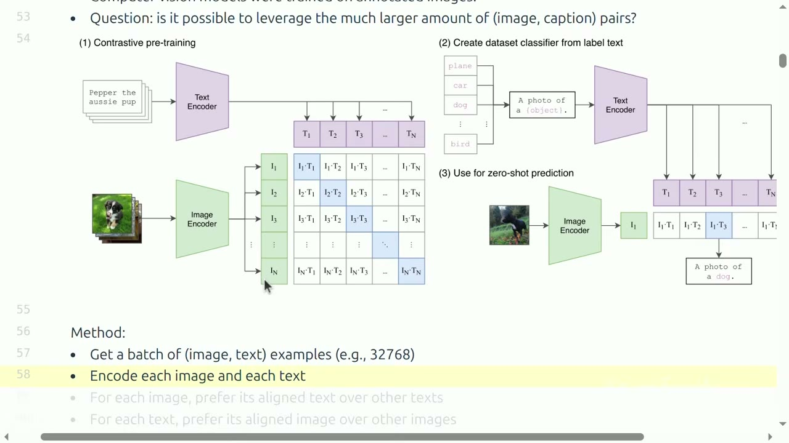

你可以想象，这基本上就是 2N 个不同的 softmax 分类问题。这是代码：你得到一个 n×d 的图像编码矩阵，和 n×d 的文本嵌入矩阵，做归一化，然后带上一个温度系数（temperature）做点积，再计算交叉熵。所以它基本上就是一个多分类问题，只不过样本被组织成这种 m×n 矩阵的形式。

*[08:00](https://www.youtube.com/watch?v=26FtD08ZpOU&t=480)*

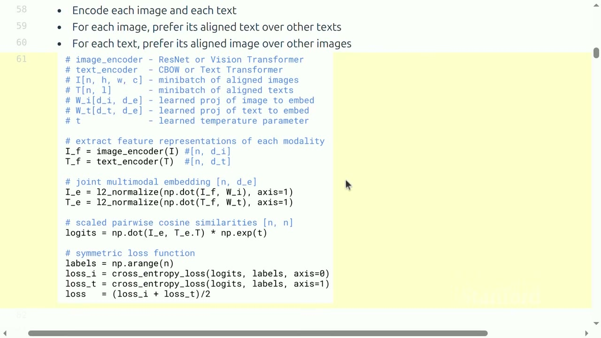

关于 CLIP 是怎么建起来的，还有一些细节。数据从哪来？论文里关于数据没有太多细节。大致上，你从某处拿一堆查询，然后到网上搜索这些查询，挖掘出一堆图像和文本对，这样得到了 4 亿个图像-文本对。这个数据集没有公开，但有一篇叫 OpenCLIP 的论文复现并进一步扩展了 CLIP 的想法。有一个叫 LAION-5B 的数据集被发布出来，包含 50 亿张图像及其文本描述，中间经过了大量处理。有意思的是，他们实际上用 CLIP 来做数据过滤，然后再训练 OpenCLIP，所以这里面有一些自举（bootstrapping）的成分。但至少这是一个你能指出它训练所用的数据集、也能拿到代码的模型。

*[09:31](https://www.youtube.com/watch?v=26FtD08ZpOU&t=571)*

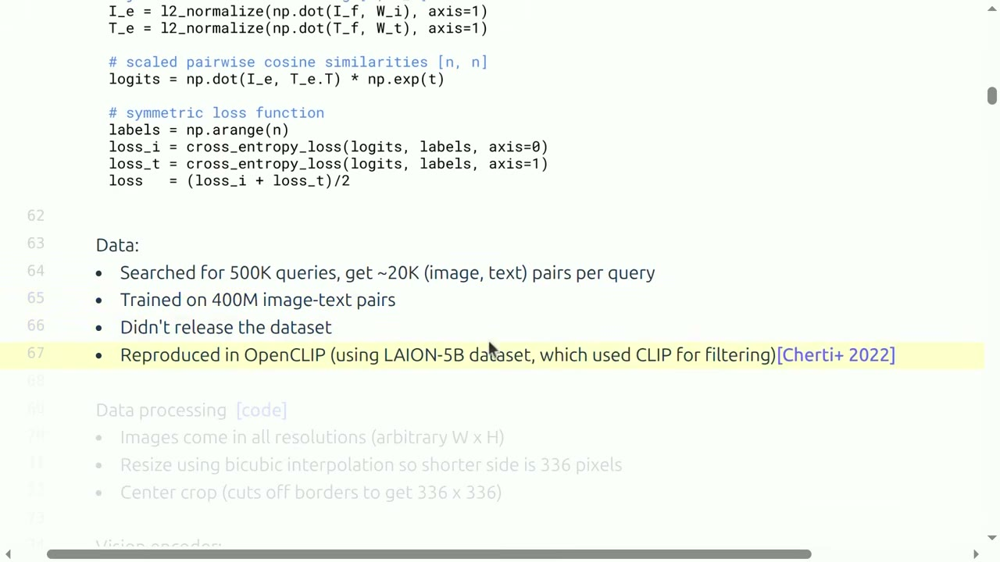

还有几个细节。图像的分辨率五花八门：你在网上找到的一张图像，可能是又长又窄的，也可能是又高又瘦的，尺寸是任意的。而你在学习神经网络时会知道的一件事是：它们不喜欢动态的东西，它们希望东西是固定大小的。所以有一个某种程度上是启发式的处理：他们把图像缩放，使短边是 336 或别的目标尺寸——224 也可以——然后中心裁剪（center crop）得到正方形。这显然是为了方便。后面我们会看到你可以做得比这更好，但这只是为了省事。另外在那个时间点，CLIP 的作者想的是 ImageNet 和分类任务，通常物体在正中间，你只是裁掉一些背景，所以这不太要紧。

*[10:48](https://www.youtube.com/watch?v=26FtD08ZpOU&t=648)*

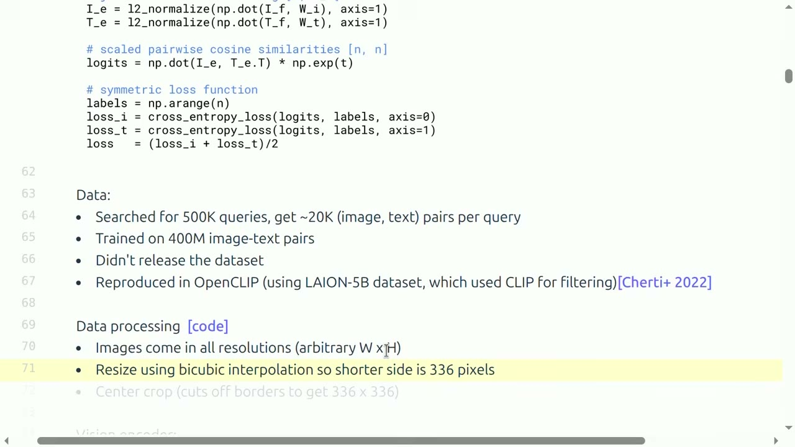

那么视觉编码器是什么？这是通用算法，但我还没指定图像和文本编码器是什么。

（有人提问：为什么他们在图像-文本对上训练，而不是在图像上训练？）

对这个问题：有一条工作路线试图基于数据增强把图像编码成表示。比如说有一篇叫 SimCLR 的工作：你拿一张图像，对它做增强——裁剪、随机扰动、旋转——然后希望说这是同一张图像，它们应该有相似的嵌入。这对低层细节是有用的。但问题是，你没法通过数据增强从一种狗变到另一种狗。所以通过使用文本，你能得到图像更高层的语义表示。这是个好问题。后面我们会看到，如果去看人们试图解决的任务类型，这些语义表示是很有用的。

*[12:31](https://www.youtube.com/watch?v=26FtD08ZpOU&t=751)*

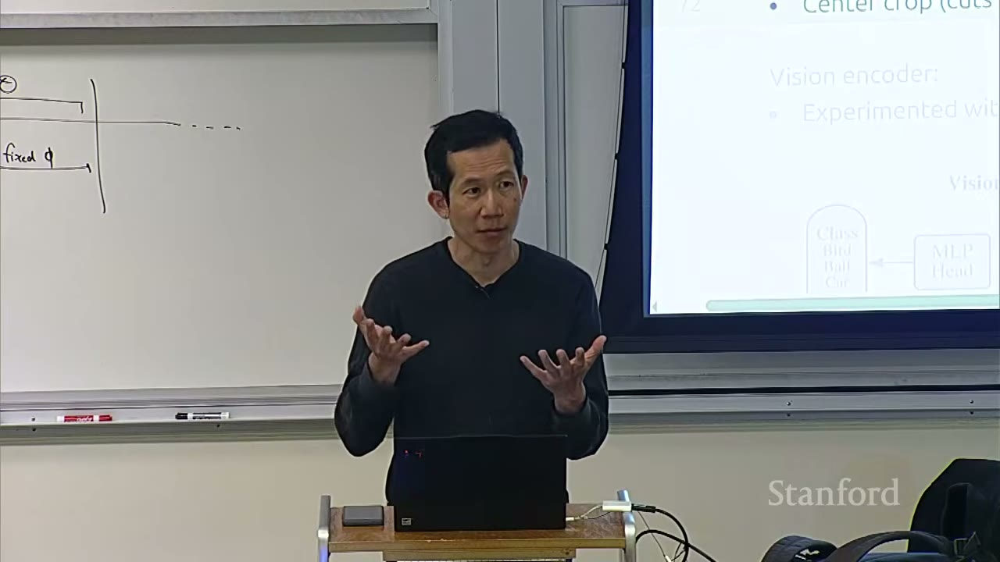

那么 CLIP 用的视觉编码器是什么？他们实际上试了好几种，包括 ResNet 和刚刚出现的视觉 Transformer（ViT）。他们发现视觉 Transformer 表现最好，所以当人们说 CLIP 时，通常指的是 ViT 版本。视觉 Transformer 做的事情是：你把一张图像切分成这些小 patch，我记得原论文是 16×16，CLIP 用的是 14×14。总之你有这些小 patch，它们本质上就是向量。所以每个 patch 在某种意义上就是这个视觉 Transformer 的一个 token。你加上位置嵌入，就像训练语言模型时那样，然后把它送进一个标准的 Transformer。

*[13:36](https://www.youtube.com/watch?v=26FtD08ZpOU&t=816)*

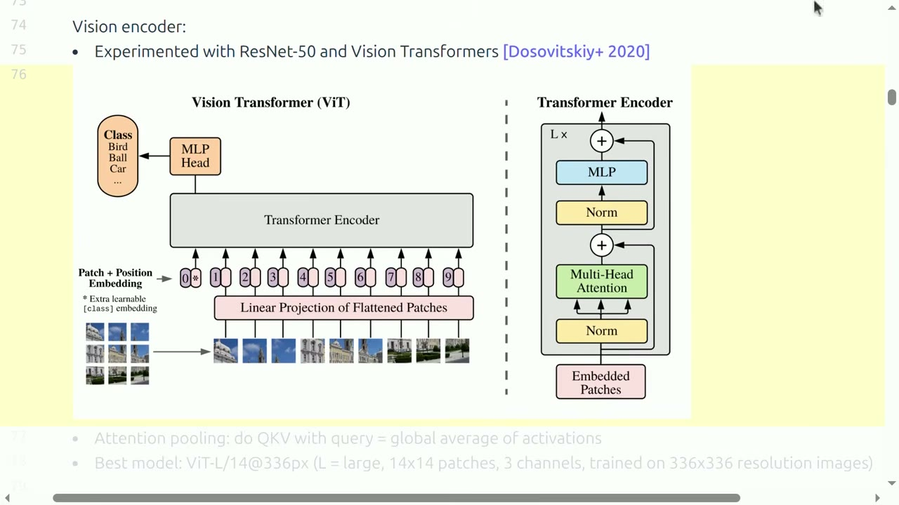

Transformer 编码器产生一串向量。CLIP 论文的做法稍有不同：你也可以把这些向量全部平均，得到一个单一向量，但他们认为更好的做法是注意力池化（attention pooling），意思是你先取所有激活值的全局平均，然后用它作为 query，再对每个位置的 key 和 value 做一轮注意力。这会给你另一个向量，它可能比直接平均更有信息量一些。

*[14:32](https://www.youtube.com/watch?v=26FtD08ZpOU&t=872)*

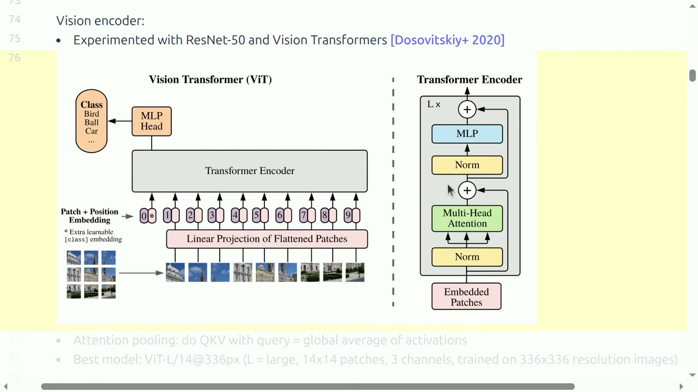

这就是 ViT。CLIP 论文发现最好的模型是所谓的 ViT-L/14。解读一下：这是一个 large 的 ViT，我记得大概有 24 层，我不是很确定；patch 是 14×14；每个 patch 是 RGB，所以有三个通道；他们在 336×336 分辨率的图像上训练。其实他们一开始是在较低分辨率上训练的，我猜是为了速度，因为高分辨率图像更慢，然后在训练的后期才用更高分辨率训练。

*[15:27](https://www.youtube.com/watch?v=26FtD08ZpOU&t=927)*

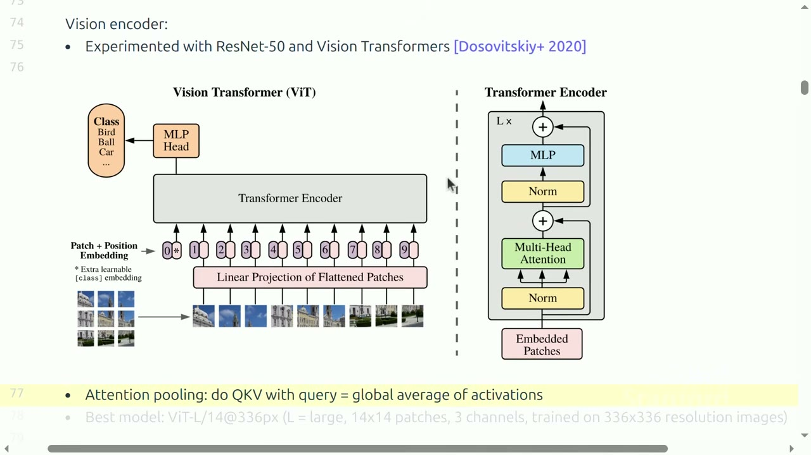

（有人问位置嵌入：这个任务只有线性的一维位置，能不能做得更聪明？）

问题是，你能不能在位置嵌入上更聪明一点，因为这里只是线性的一维位置。我想在 CLIP 论文里，他们试过某种 2D 版本，并且发现其实没有太大影响。我觉得我也总是要带着"他们关心的是分类"这个前提来看这些结果。对分类来说，这可能不重要。后面我们会看到更讲究的位置嵌入，它们确实会考虑空间结构。

*[16:16](https://www.youtube.com/watch?v=26FtD08ZpOU&t=976)*

文本编码器是一个标准 Transformer，是 GPT-2 风格的，因为 GPT-2 出自同一组人。为了从序列中得到单个向量，他们在开头加了 BOS、结尾加了 EOS，然后取最高层上 EOS 位置的激活值，作为整个序列的表示。

*[16:57](https://www.youtube.com/watch?v=26FtD08ZpOU&t=1017)*

这样你有了视觉编码器、有了文本编码器，然后就可以做这个过程来训练：取一个 batch，把所有文本编码、所有图像编码，形成这两个方向的交叉熵损失，然后从那里开始。

*[17:14](https://www.youtube.com/watch?v=26FtD08ZpOU&t=1034)*

头条结果——这也是 2021 年让很多人对 CLIP 兴奋的原因——是在 ImageNet 基准上，零样本（zero-shot）的 CLIP 超过了在 120 万张 ImageNet 图像上训练的 ResNet。想想看，120 万张 ImageNet 图像的标注是很多很多小时的 Amazon Mechanical Turk 工人时间。而现在 CLIP 是在更自然的网络数据上训练的——当然，那也是网上很多人的劳动——但如果你能利用这些既有数据，你就可以直接零样本地用。零样本技术基本上是：你拿一张图像，然后有一堆文本，你把它和各个标签做点积，看哪个最高。

*[18:23](https://www.youtube.com/watch?v=26FtD08ZpOU&t=1103)*

（有人问：如果一张图里有狗，而其他文本描述里也有狗，会不会让模型困惑？）

如果有一张狗的图，可能其他描述里也有狗，会不会让模型困惑？总体上这个过程是有噪声的，但如果还有另一只狗，也没关系，因为平均来看，不太可能总是有一只狗——有时候是苹果、猫或别的东西。另外一点是，这些图像基本上是从网上抓来的，旁边有文字，或者在 alt 图像属性里，所以它们极其嘈杂。有研究看过这件事：当你有一张图像的描述时，它不一定逐字描述图像里有什么。因为如果一张图是狗，你并不需要说"一只狗"。所以这个过程非常嘈杂。它居然能跑通，这也许有些令人惊讶，但也很有意思。我的意思是，确实需要做大量的数据过滤；如果你拿网上任意的图像和文本，那可能会太嘈杂了。

*[19:55](https://www.youtube.com/watch?v=26FtD08ZpOU&t=1195)*

另外还有一点值得注意，它和我最后要回到的一个点有关：他们也试过另一种方案，不做这种排序，而是从图像预测文本。他们可以设定一个目标，从图像去预测文本，可以是词袋（bag of words）形式，也可以是语言模型形式。他们展示出——也许有点出人意料——使用更强的模型反而更差，或者说至少效率更低，不如用词袋的 CLIP。这说明，对于你试图学到的表示（或者说 ImageNet 准确率，也就是分类）来说，精确地建模 caption 的 token 序列，对于得到图像的粗略表示并不是那么重要。这个点我们最后会回来讲。

*[21:20](https://www.youtube.com/watch?v=26FtD08ZpOU&t=1280)*

到目前为止我们学到了什么？我们用 CLIP 编码了图像，它捕获了图像的语义，因为它和文本配对，而文本一般谈论的是语义。要注意的是，这里的设计决策是基于图像分类的，所以它并不非常细粒度。但正如我们将看到的，它仍然是一个稳健的起点，后面我们做的一切都可以从这里出发。

*[22:01](https://www.youtube.com/watch?v=26FtD08ZpOU&t=1321)*

CLIP 的一个技术上的缺点是它需要很大的 batch size，比如 30,000。如果你 batch size 是 1，显然不行；即使是 10 也不行。而且 softmax 操作是在整个 batch 上进行的，所以它不是很好分解。相比之下，正常的语言模型训练里，一个 batch 的样本，所有序列都可以并行，最后再做聚合。

*[22:30](https://www.youtube.com/watch?v=26FtD08ZpOU&t=1350)*

## SigLIP：把对比学习变成二分类

这个问题会被 Google 的另一篇论文 SigLIP 解决。可以把它看成 CLIP 的改进版本，名字的意思是"用于语言-图像预训练的信号量损失"（Sigmoid Loss for Language-Image Pre-Training）。主要的区别是：CLIP 做的是多分类，它说"这个文本和这张图像是对齐的"，然后拿它去对抗所有其他候选图像或其他候选文本。SigLIP 某种意义上简单得多：它对任意给定的图像-文本对，只问它们是否对齐。如果参照上面这张图，它基本上就是二分类：对角线上的元素是正例，非对角线上的元素是负例，就这样。

*[23:31](https://www.youtube.com/watch?v=26FtD08ZpOU&t=1411)*

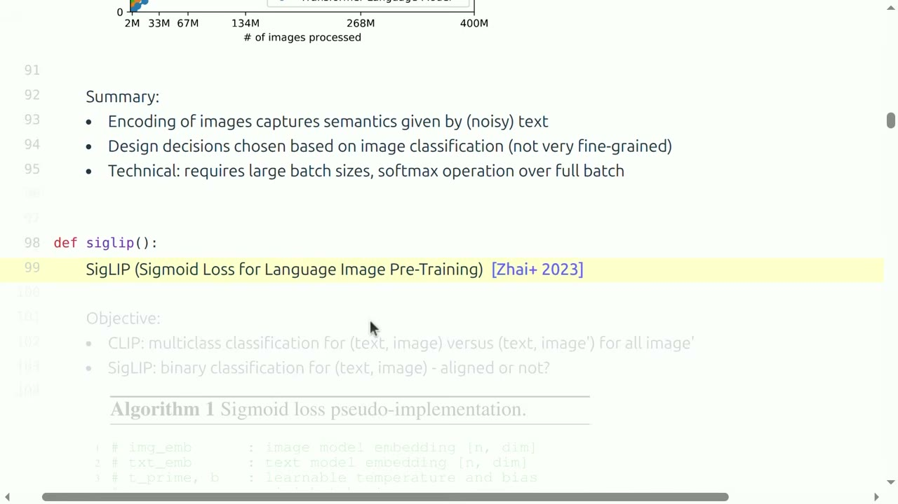

这是算法：取嵌入、归一化、照常做点积，但现在构造标签——非对角线上是 -1，对角线上是 +1，然后做 log_sigmoid。目标函数非常简单。

*[24:00](https://www.youtube.com/watch?v=26FtD08ZpOU&t=1440)*

（有人问：这需要复杂的采样策略吗？）

问题是这需不需要复杂的采样策略。至少在最初的论文里，他们就是直接在这个同样形式的矩阵上操作。你可以想象——我想你大概是在一般意义上考虑这类对比方法：负例有时需要做平衡，或者负例需要是"紧"的负例，以免产生偏差。但至少在最初的版本里，这个是相当直接的。

*[24:49](https://www.youtube.com/watch?v=26FtD08ZpOU&t=1489)*

说回数据，这是在 Google 做的。他们用了另一篇 2022 年前后的语言-图像模型论文的数据集 WebLI，包含十亿量级的图像-文本对。他们还做了一些额外的工作，比如对图像中包含文字的情况做 OCR，这是形成文本-图像对的另一种方式，并且做了一些过滤。这是多语言的。

*[25:26](https://www.youtube.com/watch?v=26FtD08ZpOU&t=1526)*

这篇论文的主要观点是它比 CLIP 训练高效得多。CLIP 用 256 块 TPUv3 训练了 10 天，而 SigLIP 用 32 块 TPUv4 训练了 5 天。你可能会想，v4 应该比 v3 快；但就每秒浮点运算数而言，它们其实并不更快。它们更好是因为你能在一个 pod 里放更多，互连也更好，但在这个规模下其实并不更快——实际上大概还要慢 60%。

*[26:09](https://www.youtube.com/watch?v=26FtD08ZpOU&t=1569)*

SigLIP 之所以更快，是因为你可以这样并行化。如果你回想系统课的内容，你可以把它想成类似 DDP：每个设备存一部分图像-文本对。但和语言模型训练不同——那里一切都可分解——这里样本之间存在交互。所以在第一遍，每个设备只计算它本地那些图像-文本对上的损失，然后你把文本发出去：设备 1 拿到 T5 到 T8，现在它就能计算这里的负例；然后它再拿到 T9 到 T12。这样轮转下去，直到覆盖所有非对角的块。

*[27:38](https://www.youtube.com/watch?v=26FtD08ZpOU&t=1658)*

SigLIP 另一个好处是它实际上把 batch size 和损失解耦了。在 CLIP 里，损失和 batch size 绑在一起：如果你改变 batch size，那就是另一个损失函数了。所以他们能用小得多的 batch size 做实验，小于 16K。在那个区间里，它比 CLIP 好得多，因为 CLIP 的损失函数在 batch size 太小时会退化。而对 CLIP 来说，更小的 batch size 只是方差更大，但期望上是同一个损失、同一个函数。他们还说你可以用大得多的 batch size，但那并没有什么帮助。我们看到临界 batch size 在某个位置就饱和了，而 32K 基本上就是他们的临界 batch size。

*[28:30](https://www.youtube.com/watch?v=26FtD08ZpOU&t=1710)*

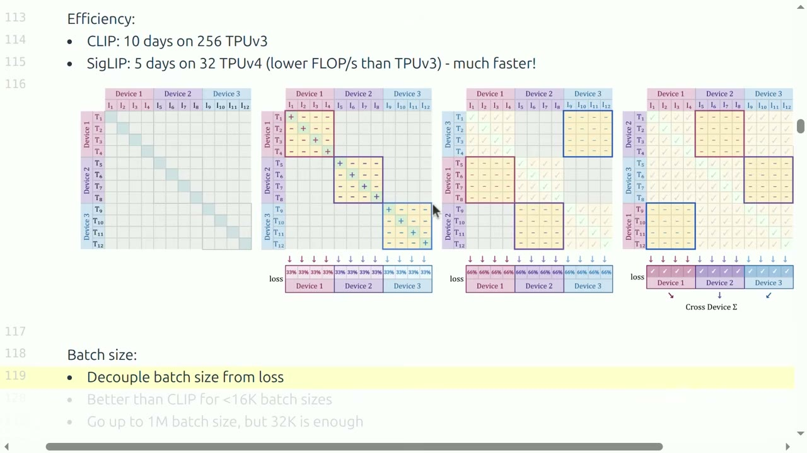

## 从图像编码器到视觉语言模型：LLaVA 的思路

现在我们有了 CLIP 和 SigLIP，这些图像编码器可以接收一张图像——在这个版本里就是固定尺寸的，比如 336×336——并把它映射成一个向量，向量里包含一些语义。现在让我们开始构建 VLM，也就是视觉语言模型。我要讲两个模型家族：LLaVA 和 Qwen。它们在大的模板上非常相似，有一些细节不同，我们会过一遍。基本想法是：我们把这些嵌入拿到，然后直接注入到我们的语言模型里。这更像是 mid-training 或 post-training 的味道：我们拿一个现成的图像编码器，拿一个现成的 LLM，然后把它们缝在一起，而不是从头训练。

*[29:37](https://www.youtube.com/watch?v=26FtD08ZpOU&t=1777)*

LLaVA 论文发表于 2023 年。它让很多人兴奋，因为在那段时间，闭源模型——我记得是 GPT-4——已经能做视觉推理，而他们能展示自己也能做一些视觉推理。当然它不如 GPT-4 好，但我想它是一个开放模型，人们能看到里面到底发生了什么。

*[30:12](https://www.youtube.com/watch?v=26FtD08ZpOU&t=1812)*

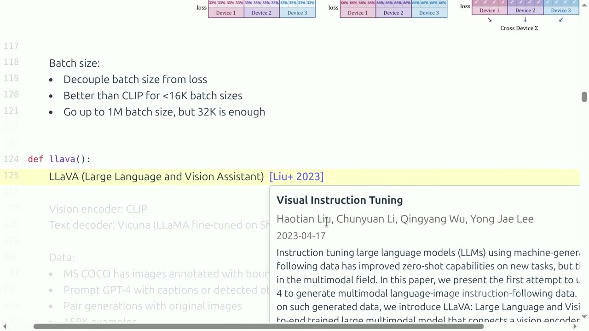

对于 VLM，基本上有这么几个部件。一个是视觉编码器，他们这里用的是 CLIP。文本解码器他们用的是一个叫 Vicuna 的语言模型，那是最早的 Llama 模型，在一些 ShareGPT 对话上做了微调——那些是人们在和 ChatGPT 对话后分享到某个网站上的对话。我觉得那个网站现在应该已经关了。

*[30:42](https://www.youtube.com/watch?v=26FtD08ZpOU&t=1842)*

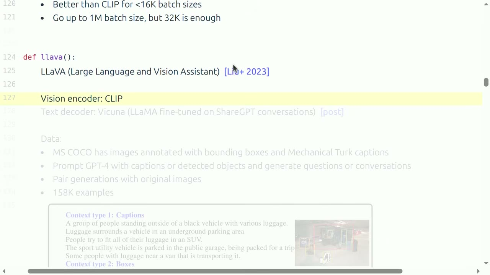

他们用的数据基于 MS COCO。这是一个标注数据集，他们让 Mechanical Turk 工人去标注一堆图像，给出边界框和描述图像内容的 caption。于是他们基本上是为自己的模型合成数据集：他们用这些 caption 或检测到的物体去提示 GPT-4，让 GPT-4 生成问题或对话。比如这是 MS COCO 数据集里的一张图，这是人类写的标注 caption，这里也是人类标注的。然后你让 GPT-4 生成一段对话，你可能会得到一个问题和一个答案；你也可以让 GPT-4 生成一段详细描述，它生成的差不多和 caption 类似；然后你可以让 GPT-4 生成复杂的推理，它就会做出类似那样的东西。

*[31:54](https://www.youtube.com/watch?v=26FtD08ZpOU&t=1914)*

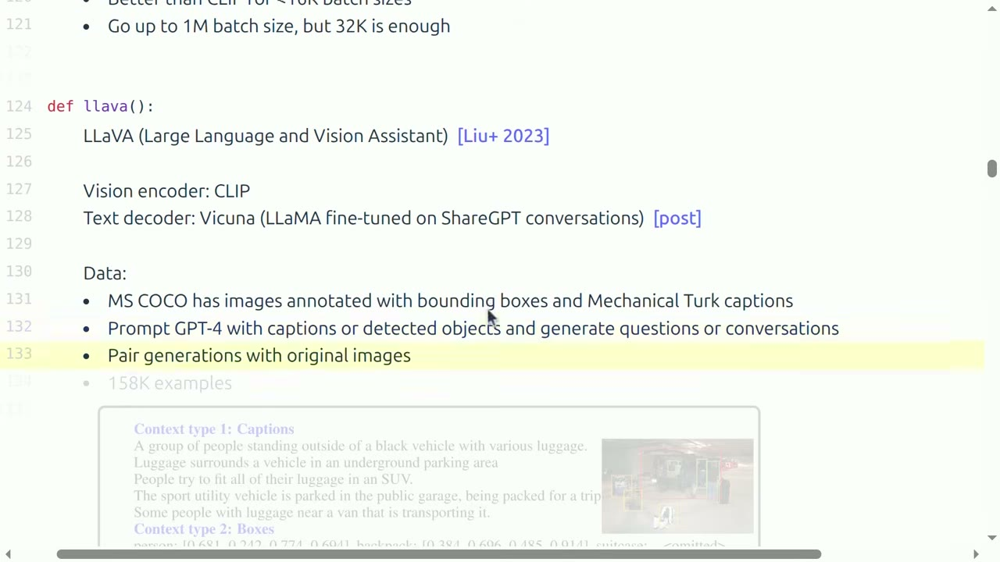

所以那些是合成数据，总共 158,000 个样本，然后他们在上面训练了一个模型。他们用的是 CLIP，具体说是表现最好的那版 CLIP，ViT-L/14，14×14 的 patch。

*[32:21](https://www.youtube.com/watch?v=26FtD08ZpOU&t=1941)*

我们来看这张图。他们拿图像，送进视觉编码器 CLIP，得到一个向量。但这个向量和文本并不真正处在同一个空间里。所以他们乘上一个矩阵 W，得到另一个向量，这个向量和文本嵌入处在同一个空间。文本那边你就用标准的嵌入得到向量。所以基本上发生的事情是：文本被编码成这些向量，图像也被编码成这些向量，然后整个向量序列经过一个标准 Transformer 并产生输出。

*[33:18](https://www.youtube.com/watch?v=26FtD08ZpOU&t=1998)*

所以我们在某种意义上是在把这些图像转换成文本 token，这样我就能利用预训练好的语言模型。为了训练这个模型，他们分两个阶段。第一阶段冻结视觉编码器和语言模型，只训练这个矩阵 W，他们管这叫对齐阶段——本质上就是确保图像被映射到同一个空间里。因为如果你用一个随机的 W，这些图像不会——它们肯定不是表示任何自然语言 token 的嵌入。训练 W 的目标就是让它们看起来像自然语言 token 的嵌入。第二阶段是仍然冻结视觉编码器，同时训练 W 和语言模型。也就是说，他们在自己的数据上微调语言模型。记住，他们的数据基本上就是：这里有一张图像，这里有一段对话、一段描述或一个复杂推理的例子。所以这些都是图像加文本到文本。

*[34:37](https://www.youtube.com/watch?v=26FtD08ZpOU&t=2077)*

这是他们论文里的一个例子，挺有意思。输入是一张图像和一段对话，用户问"这张图里有什么不寻常的地方"。他们的模型能告诉你：你通常不会在小型面包车后面熨衣服。他们还特别指出自己的模型相当不错，因为即使你的用户提示并没有真的在问"不寻常"之处，它仍然会谈到这一点。GPT-4 当然能做到，但当时的其他模型做不到。

*[35:14](https://www.youtube.com/watch?v=26FtD08ZpOU&t=2114)*

那是 2023 年。接下来我跳到 2024 年的 LLaVA OneVision。LLaVA 论文之后还有一系列论文：LLaVA 1.5、LLaVA-Next。我会把所有这些创新都涵盖在接下来要讲的内容里。他们做的主要事情基本上是同样的配方，但在能做的多模态应用类型上更有野心了：他们能处理多张图像和视频。这是同样的图，现在他们可以接收单张图像、多张图像，或者一段视频——视频本质上就是一系列图像，对应着对帧的采样。视觉编码器升级成了 SigLIP；文本解码器他们现在用 Qwen-2，那大概是当时最好的语言模型；然后是投影器或者说适配器（adaptor），也就是把视觉编码器的输出变成语言模型输入的那个东西，这里用的是两层 MLP 而不是线性投影。所以就像你有一个系统，只是把各个部件都升级了一遍，但整体系统还是差不多的。

*[37:05](https://www.youtube.com/watch?v=26FtD08ZpOU&t=2225)*

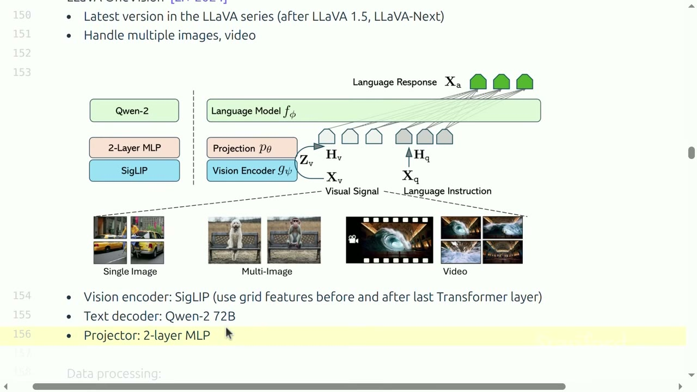

我们稍微谈一下数据处理。他们想做的一件事是 OCR。OCR 的问题在于你必须保留非常细粒度的信息，否则 J 看起来就像 I，那就不行了。记住 CLIP 会缩放并裁剪到 336×336。而很明显，如果你有一份文档，裁剪到 336×336，你就读不了了。他们的解决方案是一个叫 AnyRes 的想法，实际上是在 LLaVA 1.5 论文里提出来的。想法很直接：你把一张图像切成多块，每一块都是视觉编码器能接受的分辨率，比如 336×336。于是你把所有块都编码成一堆向量，然后把向量拼接起来。也就是说，你注意到你的视觉编码器处理不了高分辨率，所以不去下采样，而是直接裁剪、分别看图像的不同部分。

*[38:20](https://www.youtube.com/watch?v=26FtD08ZpOU&t=2300)*

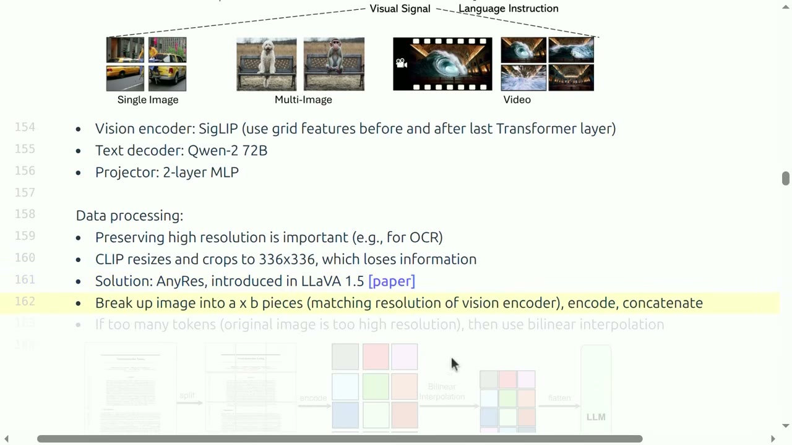

而现在，如果你有分辨率特别高的图像或视频，你就会得到太多 token，那他们就做下采样。AnyRes 背后的想法是它是自适应的，这很好，因为 Transformer 本来就是自适应的：语言、句子可以是任意长度，Transformer 已经处理得挺好。结果发现图像也可以是任意分辨率，所以这正好用上了同样的动态能力。

*[38:51](https://www.youtube.com/watch?v=26FtD08ZpOU&t=2331)*

这是他们对图像实际做的事情。假设你有这样一张论文的图：他们确实做了下采样，有一条路径基本上是整篇论文的下采样编码；然后他们把它切成这些块，每一块都是视觉编码器期望的分辨率，再分别编码每一块，然后把所有这些 patch 拼接起来。如果 patch 太多，就通过插值减少 patch 的数量。

*[39:28](https://www.youtube.com/watch?v=26FtD08ZpOU&t=2368)*

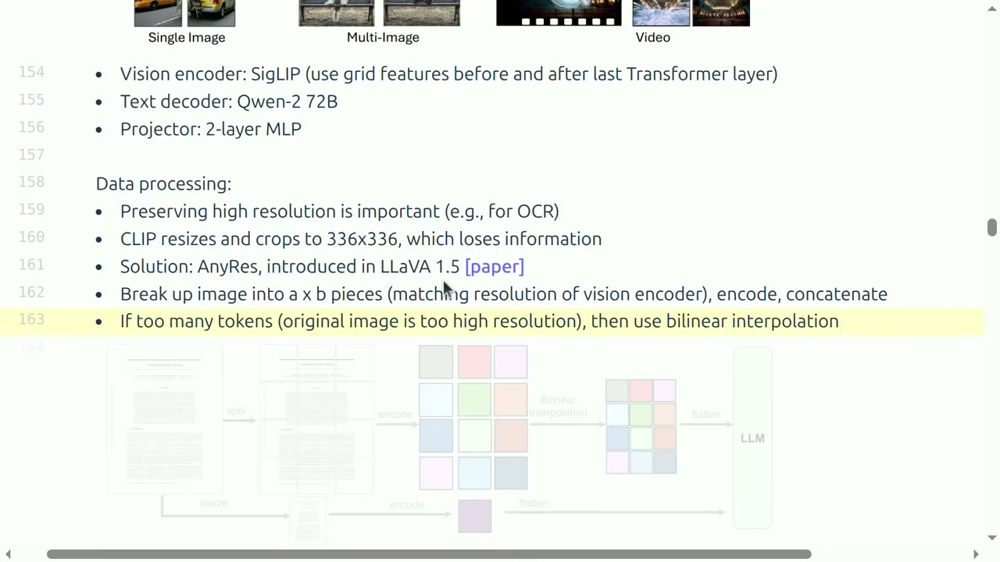

这样他们就能处理图像、多张图像和视频。你会想，这些在技术上都可归约为图像，但他们稍微"动了点手脚"，因为他们想确保各个模态大致是可比的。因为视频可以非常长，他们不希望自己的数据集被一堆重复的帧主导。他们的做法是这样：对单张图像，他们基本上有整张图的下采样版本，然后最多 N 个裁剪，最多 9 个。如果你拿到的是多张图像，那他们就只用基础分辨率。所以如果你只有一张图，我可以更仔细地看它；如果我有多张图，我就远远地看一下。

*[40:33](https://www.youtube.com/watch?v=26FtD08ZpOU&t=2433)*

而对视频，他们会用更低的分辨率，或者说用更少的 token 来表示每一帧，因为视频可以——他们最多只用 32 帧，但你在观看时就会开始撞上上下文长度的问题。后面我们会看到，能处理多模态的很大一部分工作，其实就是处理更长的上下文。

*[41:11](https://www.youtube.com/watch?v=26FtD08ZpOU&t=2471)*

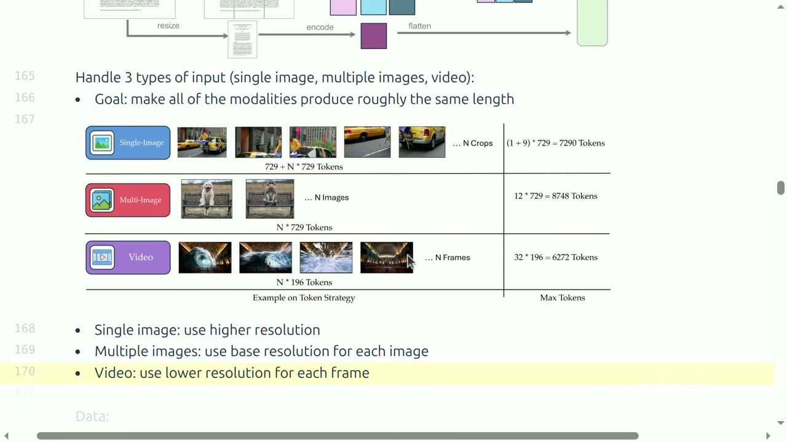

他们这里用的数据，我想说，其理念是要精挑细选高质量的数据，同时也要有量。换一种说法，这是非常有的放矢的数据。如果你看其中很多数据，它们非常任务导向，不管是做视觉问答，还是回答关于表格的问题。所以这绝对是 post-training 的领域：你试图让模型做这些任务，因此你造出一堆这样的任务。而且这项工作也毫不掩饰地在蒸馏 GPT-4 模型，以便拿到最好的性能——我猜这并不理想，但如果你没有标注预算，这就是你会做的事。他们有单图、多图和视频，所以有很多不同的部分，其中一些非常具体，比如给你两张图，让你找出不同。

*[42:31](https://www.youtube.com/watch?v=26FtD08ZpOU&t=2551)*

训练上大致和之前一样：第一阶段专注对齐，具体来说只训练投影器，也就是适配器；然后在第二阶段和第三阶段训练整个模型。之前我们有两个阶段，现在有三个阶段。我不确定这里有什么特别有原则性的理由，除了第二阶段是想放入高质量但更偏知识的数据，而最后一个阶段聚焦在看起来像下游任务的例子上。

*[43:24](https://www.youtube.com/watch?v=26FtD08ZpOU&t=2604)*

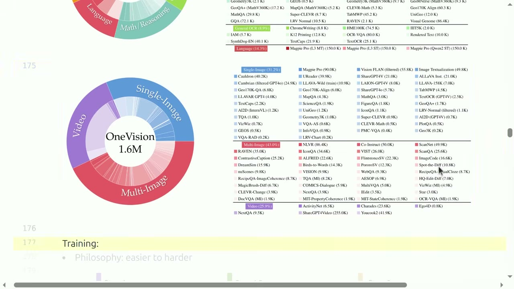

这篇论文里有一个有意思的发现：模态之间会出现迁移。尽管他们只有单图的图表和 diagram 数据，但这实际上能泛化到多张图像。训练时你从没见过一个例子是既有表格又有图表、然后你针对它提问的；但在测试时，你有两张图像，一张是表格、一张是图表，模型能就它进行一些对话。训练时 OCR 数据只有单图，关系推理只有多图，但它能泛化到这些情形，这对驱动 GUI agent 很有用——你给它一堆截图，这是多张图像，它能生成对这些截图的描述。

*[44:32](https://www.youtube.com/watch?v=26FtD08ZpOU&t=2672)*

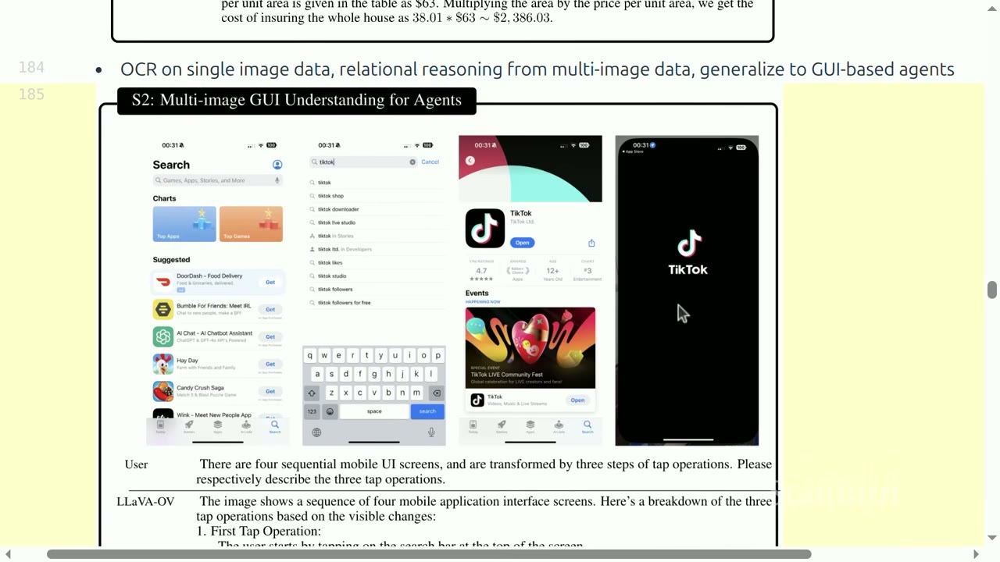

另一个例子是他们所谓的视觉提示（visual prompting）：图中有一个圆圈，它是图像的一部分，但意思是高亮出你要对它做些什么的那部分图像。这类数据只存在于单张图像上，而现在它能泛化到视频：用户说"描述视频中被高亮的球员"，而这个球员跨越了多帧。所以乍一看你会说"天哪"，你基本上是在针对每一个任务做监督学习；但如果任务足够多，这些模型似乎能做出一些迁移，我想这还是让人安心的。

*[45:19](https://www.youtube.com/watch?v=26FtD08ZpOU&t=2719)*

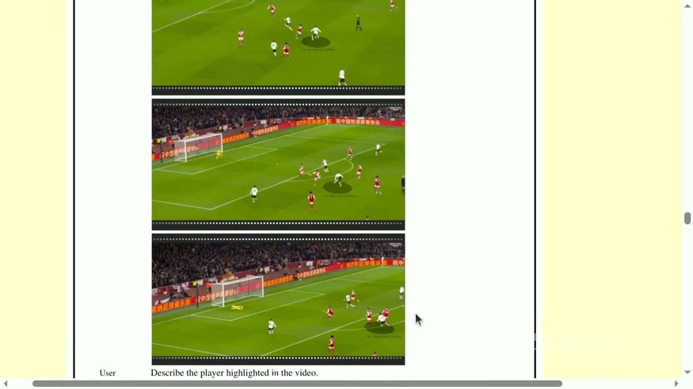

再说一次，这是一个相当标准的 VLM 模板：视觉编码器加投影器，接进语言模型。数据整理上要花很多工夫，他们很倚重合成任务特定的数据。LLaVA 系列的好处之一是它是少数开源的工作之一——不只是模型权重，还包括数据，所以你可以真正复现和研究这些东西。

*[45:56](https://www.youtube.com/watch?v=26FtD08ZpOU&t=2756)*

## Qwen 系列：从 Qwen-VL 到 Qwen-3

现在讲 Qwen 模型。Qwen 也是从 2023 年开始训练多模态模型的，第一个版本是 Qwen-VL。希望我能讲得快一点，因为你们应该已经看出套路了。视觉编码器他们用 OpenCLIP——记得 OpenCLIP 是 CLIP 模型的开放复现，所以基本上就是一个 CLIP 编码器。适配器方面，他们做了一层交叉注意力（cross-attention），引入 2D 位置嵌入，然后映射到固定的 256 大小——这有点……我猜这后面会改，因为这显然不太动态，不过在这个时间点视觉编码器也不动态。特殊 token 方面，他们有一个 image tag、一个用于边界框的 box tag，以及用于描述的 ref tag。这就是幻灯片用 HTML 做会出的问题。

*[47:10](https://www.youtube.com/watch?v=26FtD08ZpOU&t=2830)*

训练上他们有三个阶段，和 LLaVA 模型一样。第一阶段，他们的想法是——他们管这叫预训练，但不是从头预训练——这通常是大规模、低质量的数据。他们冻结语言模型，训练视觉编码器和适配器。这和 LLaVA 模型有点不同：在这一点上他们会训练视觉编码器。你可以看到他们训练用的一些数据集，14 亿个样本。第二阶段，他们转向更高质量的任务特定数据，你能看到一些常见的 VQA 数据集、图表问答等等，这时他们训练所有参数。最后第三阶段是指令微调数据：冻结视觉编码器，训练适配器和语言模型。

*[48:27](https://www.youtube.com/watch?v=26FtD08ZpOU&t=2907)*

这里有一些他们能做的事情的例子。当然，这是 Qwen，所以有些例子是中文的。他们的兴趣还包括做一个能涵盖语言模型的模型：语言模型能做代码，所以我们希望视觉模型在代码上也擅长。比如这个例子——如果你能看清的话——是一张图像，然后问"你能找到蜘蛛侠和绿巨人吗"，它还能输出边界框。它实际上不输出图像，只输出边界框。然后你还可以做 OCR、做比较——就是那些常见的事。

*[49:16](https://www.youtube.com/watch?v=26FtD08ZpOU&t=2956)*

Qwen-2 又是一次升级，这里面有一些新想法，我来讲一下。他们用了更大的视觉编码器。他们还开始做动态分辨率，我觉得这是主要的变化。记得我们从 LLaVA 到 LLaVA OneVision 的时候，他们意识到：哦，我们需要处理不同尺寸的图像。而如果你要做视频，就明显需要某种动态分辨率。所以模型基本上是这样的：假设你有这张图，它可能被映射成 11,000 个 token；而这张很小的公式图片可能只映射成 8 个 token，诸如此类。

*[50:09](https://www.youtube.com/watch?v=26FtD08ZpOU&t=3009)*

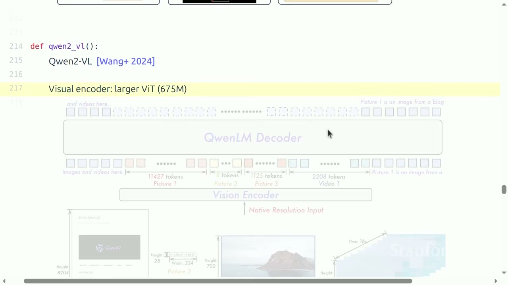

他们怎么做到的呢？基本上这和 LLaVA 的 AnyRes 想法一样，每个 224×224 的 patch 用一个 ViT 编码。记得他们一开始用的 ViT 是 OpenCLIP 那个，但它会被微调。然后为了缩小上下文长度，他们把每 2×2 压缩成 1，所以最终每个 patch 生成 66 个 token。对于视频，他们每秒采样 2 帧，但上限是 16,000 个 token。

*[50:59](https://www.youtube.com/watch?v=26FtD08ZpOU&t=3059)*

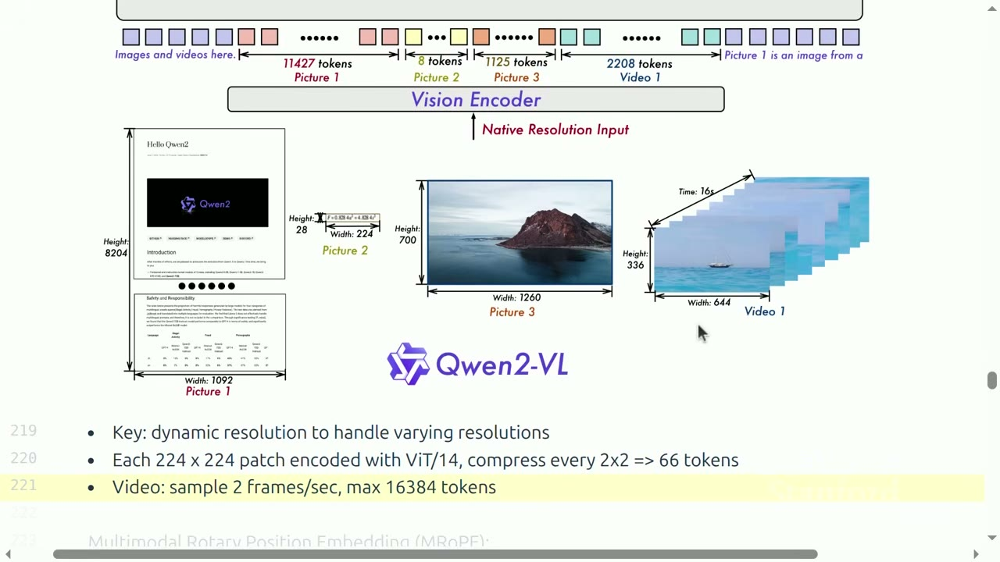

回到位置嵌入这个问题：Qwen-2 在这上面确实做了不同的东西。他们用了所谓的多模态旋转位置编码（multimodal RoPE，M-RoPE）。我们之前见过 RoPE，它的想法是让你有这样一种嵌入：向量之间的内积只取决于距离，而这个距离在 1D 里就定义为相隔多少个 token。多维版本基本上是一回事，只不过现在是 3D 的：有高度、有宽度、有时间。现在每个位置、每个 patch 是一个由坐标定义的三元组。要计算 M-RoPE，基本上是对每个维度分别算 RoPE，然后拼接起来。所以这是个相当直接的想法。不过后面看 Qwen-3 会发现，这实际上有点次优。

*[52:11](https://www.youtube.com/watch?v=26FtD08ZpOU&t=3131)*

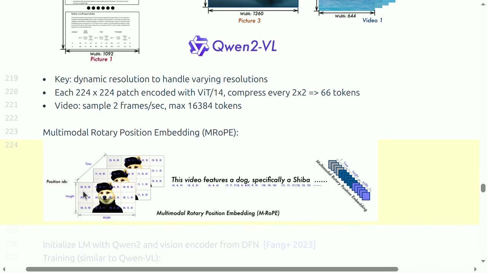

语言模型他们用——这是 Qwen-VL 模型，所以当然是用 Qwen 来初始化。然后他们有三个阶段的训练，和我们之前做的非常像。他们展示了各种各样的能力：一些视频理解、能做数学和代码、函数调用，等等。

*[52:50](https://www.youtube.com/watch?v=26FtD08ZpOU&t=3170)*

接下来我快速讲一下 Qwen-3。这里又有一些变化。我不会说这些是结构上的大变化，但它们可能是会真正影响模型质量的变化。这是去年 Qwen3-VL 的报告，图大致是一样的，我会过一遍其中一些变化。

*[53:24](https://www.youtube.com/watch?v=26FtD08ZpOU&t=3204)*

一个是他们现在用的是 Qwen-3 模型。他们有一系列 dense 和 MoE 模型，Qwen-3 模型非常非常好，这对最终模型的质量真的很有帮助。他们投入的一件事是长上下文理解，上下文长度可以到 256K，如果你想处理长视频，这非常重要。

*[53:48](https://www.youtube.com/watch?v=26FtD08ZpOU&t=3228)*

说回视觉编码器，他们用的是 SigLIP-2，基本上是 SigLIP 的改进版。架构其实是相同的，被设计成向后兼容。然后他们改进了 RoPE。解释一下：之前你有三个维度——时间、宽度、高度——基本上是先把第一块维度分给时间，再把下一块分给宽度，再下一块分给高度。问题在于——如果你记得 RoPE——每个分量代表不同的频率。所以这就意味着可能所有时间维度都是低频的，所有高度维度都是高频的。他们意识到这一点后，就把它们交错起来。现在所有轴都同时暴露在低频和高频上。

*[54:59](https://www.youtube.com/watch?v=26FtD08ZpOU&t=3299)*

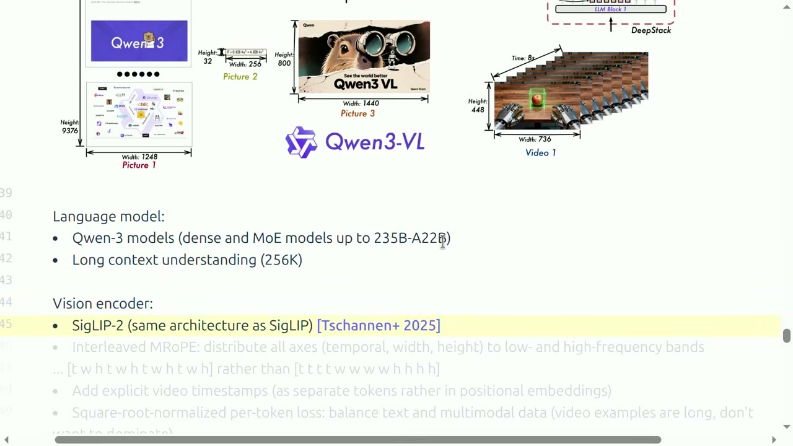

他们做的另一件事是显式的视频时间戳。如果你仔细看这个——这个可能有点太小了。以前，时间戳是隐式地存在于位置编码里的：视频里的每一帧天然会得到不同的——因为它在不同的位置上，所以有一个时间的概念。但在这里，他们把时间做成显式的：这些实际上是 token，"0 秒"是一个 token——现在你有一个代表时间的 token。他们发现这是有帮助的，大概是因为它是你可以直接引用的东西，比如"两秒之后发生了什么"。

*[55:59](https://www.youtube.com/watch?v=26FtD08ZpOU&t=3359)*

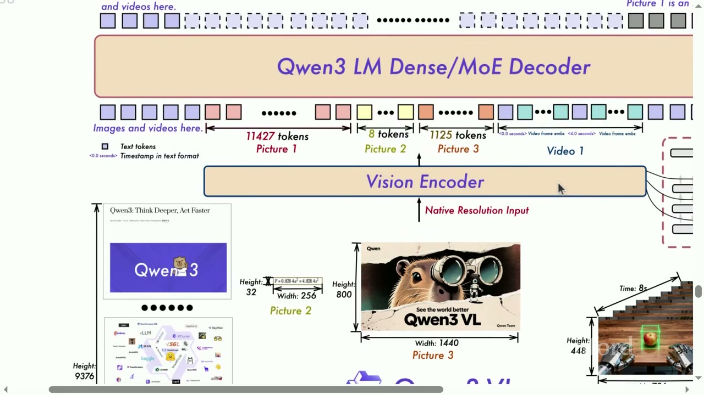

他们还做了这个按 token 的平方根归一化损失。想法是：有些涉及视频的例子非常长，而有些只涉及单张图像的例子非常短。通常的做法是每个 token 都被同等对待，这就意味着视频例子会占主导。他们——细节不是很清楚——但我相信他们把每个例子按长度的平方根做了归一化，以降低超长例子的影响。

*[56:46](https://www.youtube.com/watch?v=26FtD08ZpOU&t=3406)*

最后一件值得一提、也挺有意思的事，是他们在适配器上做的事。适配器是连接视觉编码器和语言模型的东西。LLaVA 是最简单的，就是一个线性投影；然后我们有了 MLP；然后有了某种交叉注意力。而 DeepStack——这其实是 DeepSeek 团队的一篇论文，但在这里被使用——更复杂。他们注意到视觉编码器本来就计算了一堆分层的视觉嵌入，于是他们基本上把这些直接加到语言模型的残差流（residual stream）里。所以这是把视觉编码器更深地融合进语言模型，而不是把视觉编码器当成一个只输出一串向量的黑盒。

*[57:54](https://www.youtube.com/watch?v=26FtD08ZpOU&t=3474)*

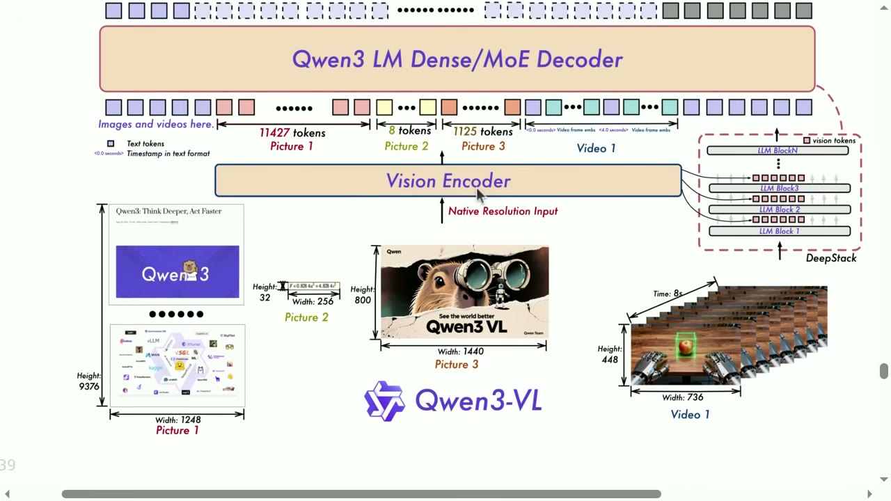

训练上，他们有两个阶段：预训练实际上有四个阶段，后训练有三个阶段。你能看到这些流水线现在变得相当复杂了。他们先训练适配器，这跟所有那些模型一样。然后有三个阶段，逐步在越来越长的序列上训练，从 8K 到 32K 再到 256K，大部分 token 都在第 2 和第 3 阶段。后训练方面，他们在长思维链数据上做 SFT、做知识蒸馏，然后做一些强化学习。

*[58:32](https://www.youtube.com/watch?v=26FtD08ZpOU&t=3512)*

到这一步，它真的就是一篇系统论文了。我标出了一些核心的新想法，但还有大量细节是不同的。如果你看最终结果，这是一个相当好的模型。我是指，如果把这些 benchmark 和闭源模型 Gemini、GPT-5、Opus 4.1 比较——这些数字，加粗表示它是那一行里最好的数字——Qwen 模型实际上相当强。

*[59:21](https://www.youtube.com/watch?v=26FtD08ZpOU&t=3561)*

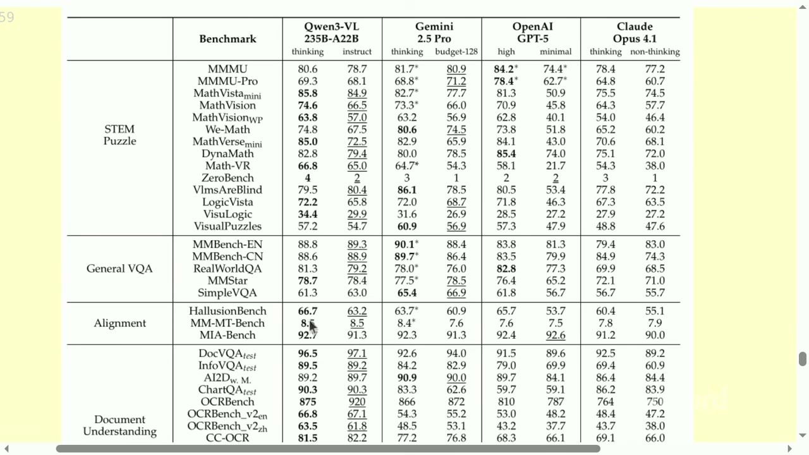

（有人问视频生成：怎么知道该输出视频还是文本？）

问题是视频生成怎么办，以及你怎么知道应该是视频还是文本。首先，这些模型不生成视频或图像，所有多模态的东西都在输入侧，你始终是在生成文本。而且在大多数这些训练阶段里——除了 RL——你都在监督每一个 token。所以这里没有 LLM 作为裁判来评判描述的质量，基本上就是你的数据集里有什么就是什么。而在 RL 里，你可以尝试不同的奖励。

*[60:39](https://www.youtube.com/watch?v=26FtD08ZpOU&t=3639)*

（有人问：从系统角度看，训练多模态模型比训练纯 LLM 更难吗？）

两个问题是：训练多模态模型在系统层面更难吗？当然它不会更容易。你指出的其中一点是数据集更大。视频数据——光是加载它就可能成为瓶颈，而在讲语言模型的时候我们一般不太关注数据加载，因为它非常非常便宜。所以这一点需要考虑进去。同时，"确保数据加载和实际计算异步进行"这些原则也要考虑进来。第二个问题是……抱歉，第二个问题是什么？哦对。视频和图像的 token 更多，尤其是视频。所以这也是我们看到那个归一化的原因之一，为了确保我们不会给视频更多权重。你总是可以降权：如果 token 更多而你不喜欢这样，你可以降权。我们在上一讲或两周前讲数据混合（data mixture）时提过，你总可以按照合理的权重来加权。但外面也有很多文本 token。总的来说，如果看——这些模型是在几十万亿 token 上训练的。我不会说多模态 token 的数量大大超过文本 token。

*[62:56](https://www.youtube.com/watch?v=26FtD08ZpOU&t=3776)*

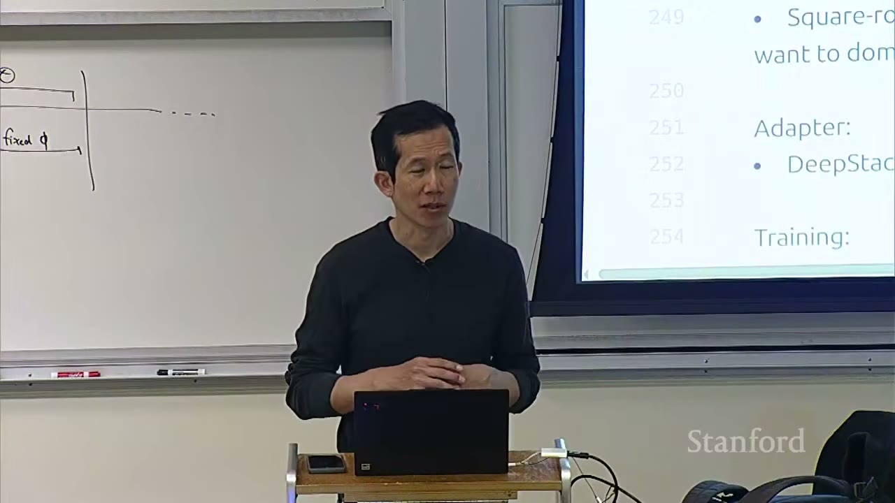

（有人问：做对齐的时候，模型怎么知道语言的……语言模型是预训练好的吗？）

问题是，当你做这种对齐的时候，它怎么知道语言——语言模型是预训练过的吗？它必须得是预训练过的，否则对齐它就没有意义。语言模型是冻结的，你只是在训练适配器，把给定的视觉编码器和给定的语言模型连起来。训练的方式就是：你选一个 token 预算，比如 670 亿 token，然后就是训练。这里没有自适应的阈值。

*[64:00](https://www.youtube.com/watch?v=26FtD08ZpOU&t=3840)*

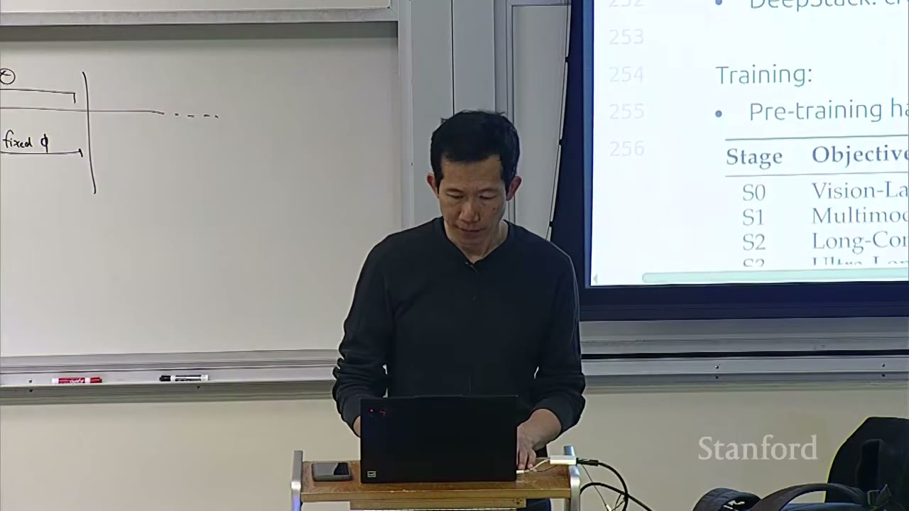

（有人问：视觉编码器的参数量是不是小得多？）

问题是视觉编码器的参数是不是小得多。答案是：一般来说是的。原因是视觉编码器在某种意义上做的是一个非常局部的操作：它看一个 patch，patch 非常小，它只是试图理解这些 patch，没有太多知识。我们不是在推理。所以模型的大部分能力仍然在语言模型里。

*[65:14](https://www.youtube.com/watch?v=26FtD08ZpOU&t=3914)*

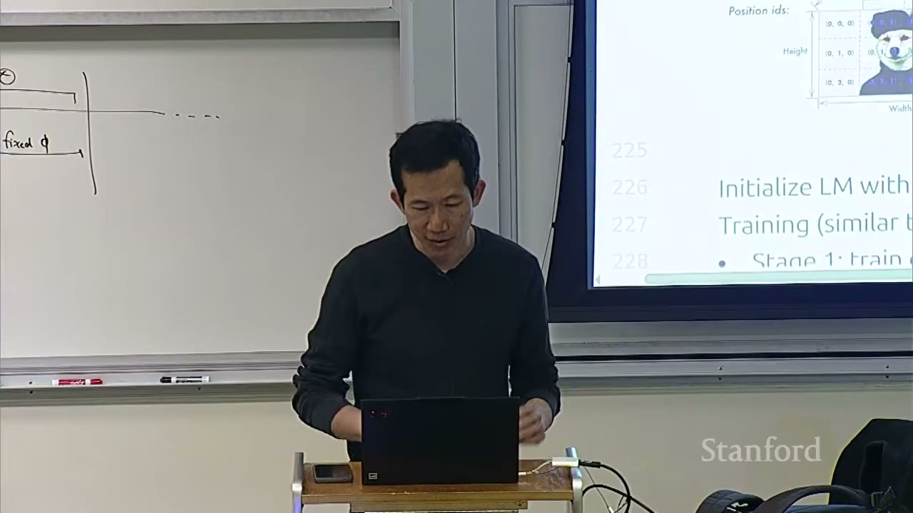

如果你看 LLaVA 模型：完整的语言模型是几十亿参数的规模——哦不好意思，这里是 7200 万——所以它小得多，投影器小得多，而 ViT 一般不到 10 亿参数。我猜主要是因为这是个相当局部的操作，我猜这是最简单的说法。

*[66:07](https://www.youtube.com/watch?v=26FtD08ZpOU&t=3967)*

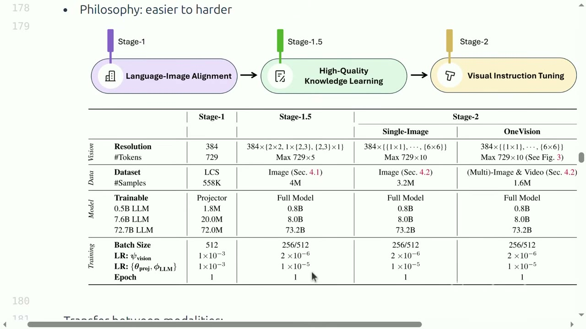

Qwen-3 是最后一个视觉语言模型。我会说它是 SOTA 水平。这里有很多数据工作。后面这些 Qwen 模型关于数据和数据混合的细节不多，所以你得去看 LLaVA 论文，或者 AI2 有一篇论文（我没来得及展开讲）里有更多细节。从 Qwen 到 Qwen-2、Qwen-3，很多变化主要是——那里确实有一些变化，但整体框架保持一致，主要是规模扩大、整理更多数据集、意识到你的上下文不够用所以要处理长上下文，也许还有把图像处理打磨得更精细，等等。

*[67:18](https://www.youtube.com/watch?v=26FtD08ZpOU&t=4038)*

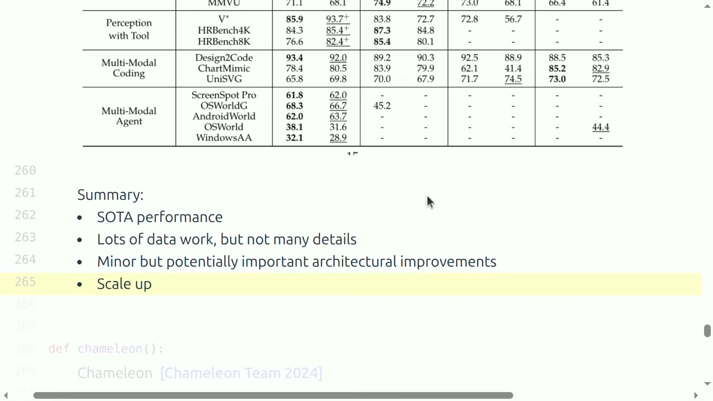

## Chameleon：把所有模态都变成离散 token

现在我要跳到一个很不一样的东西。这是 Meta 2024 年的一篇论文，叫 Chameleon。到目前为止，VLM 把图像编码成这些向量，然后注入语言模型；而因为它是语言模型，你只能生成文本，不能生成图像。有很多办法可以解决这个问题：你可以拿一个 VLM，再挂一个 diffusion head，这样你就能生成图像了。但我想讲这里这个想法：Chameleon 说，如果我们把一切都映射成离散 token 呢？从审美上说，这——也许这反映了我是一个"语言人"——这很吸引人，因为现在你可以用同样的方式分析和生成图像，一切都是离散 token。如果你想要生成图像，你可以说这里是一个文本提示，然后这些就是你可以生成的更多 token。你也可以把语言和文本调换过来。

*[68:42](https://www.youtube.com/watch?v=26FtD08ZpOU&t=4122)*

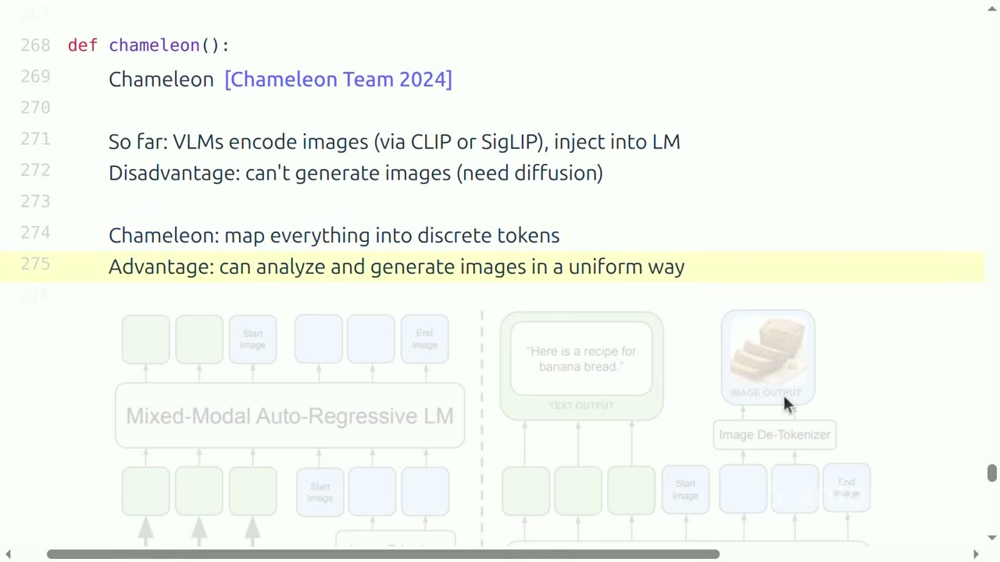

他们论文里有这样的例子：你可以提示"我很无聊，能给我看一些鸟吗"，然后它会输出文本，然后图像，然后更多文本和更多图像，是交错（interleaved）的。所以在某种意义上，omni 模型的愿景是文本和图像真正生活在同一个空间里，而这是通过让一切都看起来像文本来实现的。这是一种做法。

*[69:15](https://www.youtube.com/watch?v=26FtD08ZpOU&t=4155)*

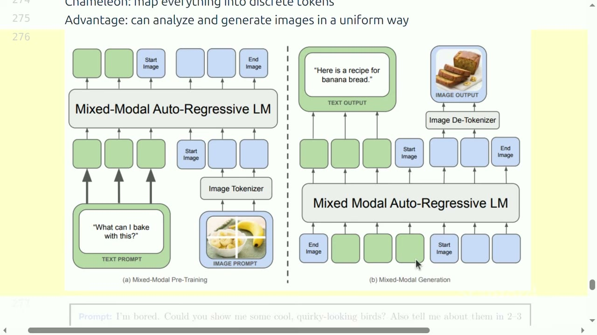

我来讲一下这是怎么做的。你现在需要做的是把图像映射成离散 token。这里有一个相当古老的想法，来自 2017 年 Oord 的工作，叫做矢量量化变分自编码器（vector quantized variational autoencoder，VQ-VAE）。基本想法是把图像映射成一个离散编码。你学到一个映射，把图像映射成一个连续向量，然后把它取整到最近的码。所以你有一个码本（codebook），比如说有 8,000 个码，它们是原型的向量，对应着某些 patch，你挑最近的那个，那就是你的表示。这就是你的编码器：经过一个连续阶段，然后取整到最近的码。解码器则是你拿这个码，尝试重建图像。这些 VQ-VAE 通过最小化重建损失来训练。还有一些别的项你会加上，因为这个操作不可微，我没有时间展开。

*[70:20](https://www.youtube.com/watch?v=26FtD08ZpOU&t=4220)*

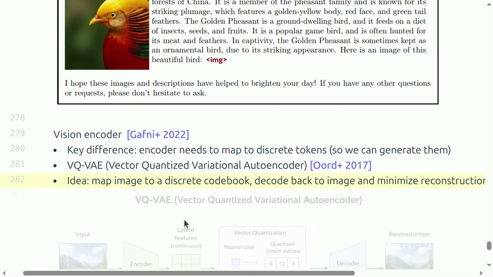

总之，最终你有 512×512 的图像被转换成 1,024 个 token，每个 token 来自一个 8,000 大小的词表。

*[71:03](https://www.youtube.com/watch?v=26FtD08ZpOU&t=4263)*

现在你基本上有了"文本"。你有图像，它们基本上就是这些码。他们训练了一个新的 tokenizer，因为现在你的数据和只有自然语言时看起来不一样了。训练现在实际上非常直接：这就是普通的语言模型训练。没有适配器，没有视觉编码器，现在只有一个语言模型。这部分是很吸引人的。训练仍然有两个阶段，但即使对语言模型训练来说，通常也有两个或更多阶段：第一阶段是训练的主体，基本是无监督的，他们既有纯文本、也有文本加图像；第二阶段混入高质量数据。

*[72:04](https://www.youtube.com/watch?v=26FtD08ZpOU&t=4324)*

这真的很好、很优雅。但这里有几个问题。一个问题是他们发现训练不稳定。原因是：文本和图像尽管占据了同一个空间，它们的行为非常不同。把东西叫做离散 token，并不能掩盖那里住着一张图像这个事实。特别是，文本 token——如果你考虑预测下一个词——它的熵相对较低，大多数词是可预测的；而图像 token 的熵非常高：我不知道这个确切的 token 会是哪种蓝色。结果他们发现，用这种混合训练会导致很多参数的范数增长，并产生损失不稳定。他们能够在某种程度上通过 QK norm 和 z-loss 正则化来缓解或修复这个问题，这些方法控制范数的增长。

*[73:16](https://www.youtube.com/watch?v=26FtD08ZpOU&t=4396)*

我甚至不打算展示结果了。但我想强调这项工作，因为它有某种优雅：只有一个模型，把所有模态真正同样对待。但缺点是，结果这个模型的性能并不真的那么好，而且离散化确实会丢失信息。想想 OCR：如果你把非常小的字离散化，你就再也读不出来了。最后，多模态的训练也很棘手——我们在 Qwen 模型那里也看到一点，我们得在权重上做文章，但在这里更被放大了。

*[74:05](https://www.youtube.com/watch?v=26FtD08ZpOU&t=4445)*

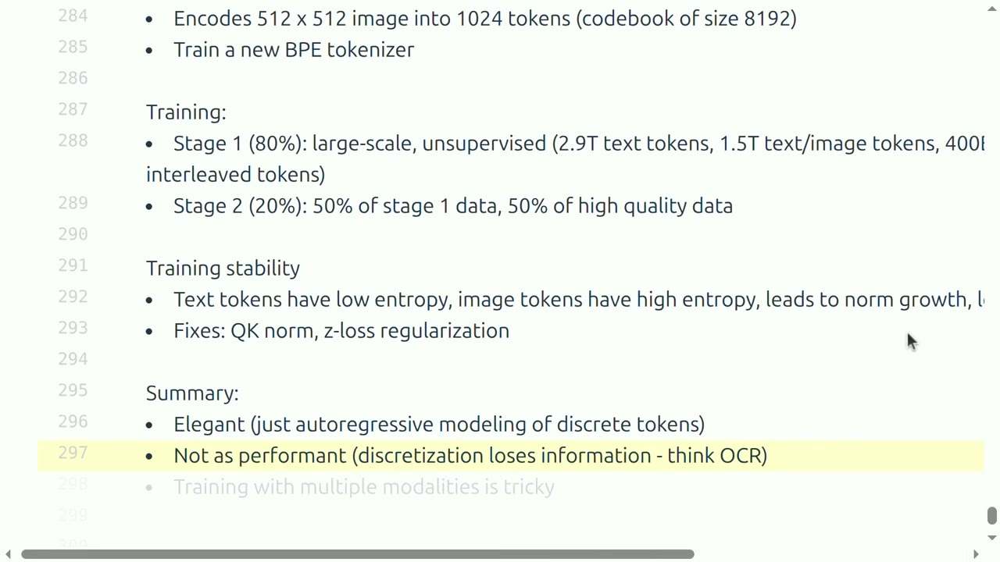

VQ-VAE 曾经流行过一阵。事实上，很多人用它做图像生成。主要原因是：你有一个 Transformer，那你怎么从 Transformer 生成呢？你必须生成离散的东西，所以你把所有数据都变成离散形式。但后来 diffusion 模型出现了，在生成上变得流行且可行，所以这类方法不像以前那么流行了。

*[74:43](https://www.youtube.com/watch?v=26FtD08ZpOU&t=4483)*

## 收尾与反思

也许在这里反思和总结一下。现在的前沿模型被期待是多模态的，或者更强烈地说，是原生多模态（natively multimodal）或 omni 模型。不幸的是，当 Gemini 或 GPT 发布时，它们被宣传为原生多模态、能处理所有这些模态——事实上它们确实能。但当然，关于它们是怎么构建的没有任何细节。我想很可能是一个组合：用连续编码器，因为你不希望丢信息；然后用 diffusion 做生成，因为——但这只是我的猜测。

*[75:31](https://www.youtube.com/watch?v=26FtD08ZpOU&t=4531)*

我认为，处理多模态时的根本挑战是：你怎么处理非文本模态？还有一点很有意思：理解一个模态和生成它之间存在不对称。而且并没有一个通用的编码器。例如我们看 CLIP 时，你关心的只是分类，捕获高层语义，所以这些向量可以比较小、只捕获高层语义。而如果你想做 OCR，或者想生成图像，你就需要非常细粒度的细节。这就是为什么 diffusion 在生成上这么好，因为它能真正在低频和高频信息上做微观优化。

*[76:12](https://www.youtube.com/watch?v=26FtD08ZpOU&t=4572)*

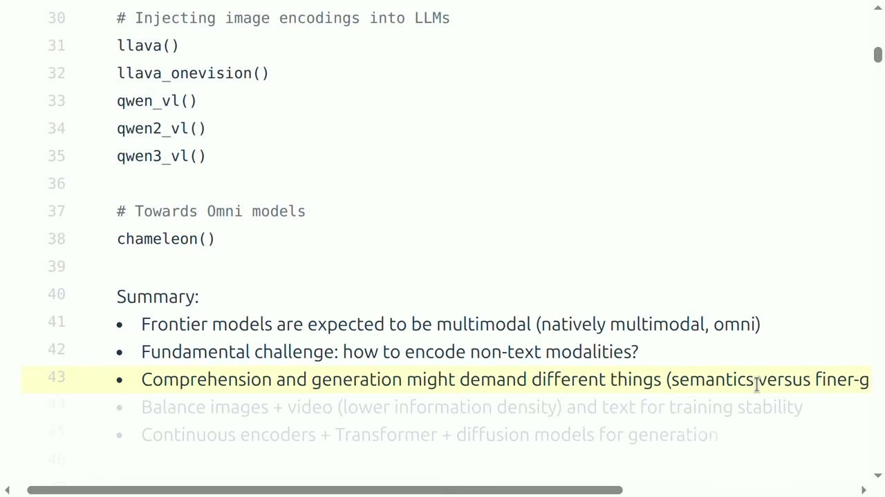

总的来说，当你处理多个模态时，你必须仔细考虑如何正确地给它们加权。例如视频的信息密度肯定比文本低，所以你不希望视频淹没你的文本。而且像我之前说的，至少目前最好的做法是用连续编码器。看起来即便是 CLIP 这种五年前的东西，或者类似的想法，仍然是捕获图像语义的首选方式。Transformer 仍然在那里。而 diffusion 模型——我没有讲——在生成上很好用。

*[77:12](https://www.youtube.com/watch?v=26FtD08ZpOU&t=4632)*

好，我就讲到这里。这就是多模态这一讲的内容。我想我们没有关于这个的作业。但如果你好奇，我鼓励你去玩一玩、训练一些这类模型。

*[77:29](https://www.youtube.com/watch?v=26FtD08ZpOU&t=4649)*

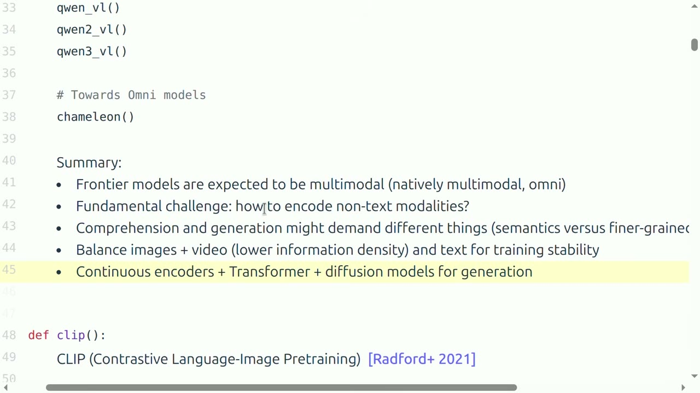
