# 资源核算：张量、精度、einops、FLOPs、算术强度与内存

这堂课从 Marin 项目 1e23 FLOPs 训练完成讲起，然后系统讲了张量与精度（fp32/fp16/bf16/fp8/fp4）、einops 的 einsum/reduce/rearrange、FLOPs 核算与 MFU、算术强度与 roofline 分析，最后落到训练中的梯度、优化器状态内存，以及梯度累积和激活检查点这两个省内存的技巧。

## Marin 的 1e23 FLOPs 训练完成了

希望大家都没被雨淋湿，我是淋到了。就像我上次提到的，Marin 项目有一个 1e23 FLOPs 的训练在跑，现在它跑完了，而且结果和预测吻合。记得我们当时在跑这些曲线，每一条本质上是一条 IsoFLOPs 曲线，也就是一堆更小的模型运行，你试图找到计算最优的点，然后拟合一个 scaling law。这就是我们预测 loss 的那个点，然后我们真的跑了模型，得到的 loss 在 0.05 以内。我觉得这挺酷的。如果你外推到 GPT-5 级别的性能，得到的 loss 就是这个。当然，这取决于这些 scaling law 的形状，你的结果可能会不一样。好，我只是想分享一下这个消息。

*[01:00](https://www.youtube.com/watch?v=kuYAsz7zspQ&t=60)*

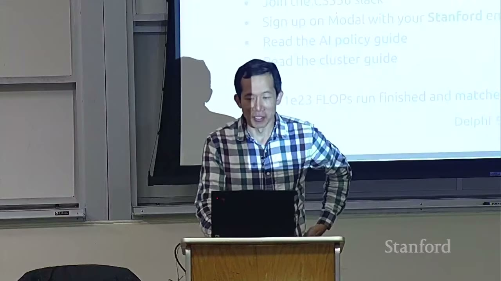

上节课我给了整个课程的概览，我们讲到了 tokenization，那会出现在第一次作业里。今天我想讲资源核算（resource accounting），这部分更偏系统这一侧。回顾一下，我们主要想做的事情是：在有限的资源下训练出最好的模型，这些资源可能是计算、内存，有时候是数据——但数据在这门课里不会真正成为限制因素。我们的目标就是最大化训练的計算效率（computational efficiency）。而在优化计算效率之前，我们需要理解一个给定计算本身的效率，为此我们需要理解它的计算特性和内存特性。

*[01:58](https://www.youtube.com/watch?v=kuYAsz7zspQ&t=118)*

给大家尝个鲜，看看这门课结束时你希望能回答的问题类型。这里有一个问题：在 1024 张——其实这里应该是 H100——上，用 15 万亿 token 训练一个 700 亿参数的模型需要多久？你怎么回答？有一个公式，我们会讲你怎么得到 FLOPs 的数量是 6 乘以参数数量乘以 token 数量。我们可以查规格表看 H100 有多快，我们有一个叫 MFU 的东西，我们会讲，取 0.5。然后你可以估算硬件每天能给你多少 FLOPs，然后就能算出天数。天数是 143 天。再看一个问题：用 AdamW 在 H100 上你能训练的最大模型是多大？你可以看，H100 每张有 80 GB 的 HBM 内存，每个参数的字节数是 2 加 2 加 4 加 4，我们会解释这是哪来的。然后你能得到的参数数量大约是 530 亿。这里有一些注意事项，我们没有计算激活值，那取决于批次大小和序列长度。所以这些都是非常粗略的信封背面计算（back-of-the-envelope）。但希望到这门课结束时你能理解这些数字是怎么来的。重点不是精确计算每一个细节，而是把握大致的形状。

*[03:43](https://www.youtube.com/watch?v=kuYAsz7zspQ&t=223)*

上次我讲过知识和你能从这门课带走的东西——mechanics，也就是东西是怎么运作的。今天这很直接：mechanics 就是 PyTorch 怎么工作、张量怎么工作，这里没有魔法。我想传达给大家的 mindset 是，资源核算会非常关键，我希望每个人养成习惯：每当你写下这样一行代码，就想想它的性能特征。最后是 intuitions，这里我们只是获得一种感觉，资源是怎么被花掉的。今天没有 ML 魔法，那留到下一讲给 Tatsu。

*[04:43](https://www.youtube.com/watch?v=kuYAsz7zspQ&t=283)*

## 从张量开始：精度、内存与数据类型

让我们自底向上地构建。最底下是什么？最底下是张量（tensor）。tensor 是存储一切的基本单元。如果你有参数、梯度、优化器状态、数据、激活，本质上一切都是 tensor。比如你可以看看 DeepSeek 3.2 模型，你会看到模型本身是一堆不同的 tensor，每个 tensor 都有一些形状，还有一些精度，我稍后会讲。如你所知，tensor 包含了向量、矩阵，并且可以推广到任意数量的维度。

*[05:33](https://www.youtube.com/watch?v=kuYAsz7zspQ&t=333)*

那我们来谈谈存储一个 tensor 需要多少开销。这取决于 tensor 的类型。一般来说我们处理的是存储浮点数的 tensor，但 tensor 也可以存储整数和其他类型。对于浮点数，通常当你说 float，我认为人们默认指的是 float32。一个 float32，如果拆开来看，有 32 位：其中一位是符号位，8 位是指数，提供了动态范围，剩下的就是尾数（mantissa）或小数部分，提供了精度。这也称为 fp32 或单精度（single precision）。"单精度"这个词来源于早期做科学计算的时候，float32 就像是基准线：如果有人给你一个 float，你会期望它至少是单精度。如果你想要更高的精度，你可以用双精度，也就是 float64。但在深度学习中我们走的是另一个方向，因为即使 32 位也很多了，我们要做的那些计算并不需要像某些数值模拟那样高的精度。

*[07:15](https://www.youtube.com/watch?v=kuYAsz7zspQ&t=435)*

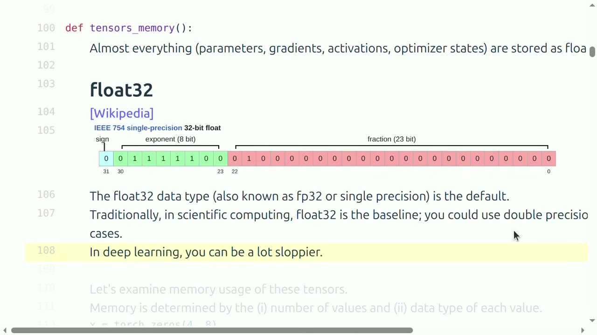

所以在讲其他类型之前，我们先看看 float32。我们构造一个 4 乘 8 的矩阵。默认情况下，你创建的 tensor 类型是 float32，如果你想要别的类型，你需要声明它。内存使用量就是元素数量乘以每个元素的大小，对 32 位数来说就是 4 字节，所以是 128 字节。给大家一个量级感：在 GPT-3 这个相当老的模型里，前馈层里的一个矩阵大约是 2.3 GB。所以这些 tensor 可以变得相当大，而且这还不是能想象到的最大那种。

*[07:59](https://www.youtube.com/watch?v=kuYAsz7zspQ&t=479)*

既然我们对效率感兴趣，我们通常想减少存储量。我们会看到，当你降低精度，你实际上省了内存，也省了时间，因为在 16 位上运算会更快，比如说快两倍——但不总是，取决于情况。而在内存方面，我们后面会看到，减少内存实际上也能省时间，这一点可能没那么显然，但希望它会变得清楚。

*[08:46](https://www.youtube.com/watch?v=kuYAsz7zspQ&t=526)*

最直接的做法是，把位数砍掉一半，于是你有了 float16。float16 有一位符号，指数只有 5 位，剩下的都是尾数。float16 挺好，除了它的动态范围很差。比如你试着构造一个 1e-8 的 tensor，那实际上就是 0。所以你既不能表示非常大的数，也不能表示非常小的数。原因就是这个指数只有 5 位，而 float32 有 8 位。所以如果你用 fp16 训练——以前人们是这么做的——你会遇到不稳定，会遇到下溢（underflow）、上溢（overflow）、NaN，相当难搞。

*[09:53](https://www.youtube.com/watch?v=kuYAsz7zspQ&t=593)*

于是 bfloat16 被发明了出来，它实际上是在 2018 年为了应对这个问题而开发的。观察是：我们不要在位数上妥协，位数和 fp16 一样，但我们把一些位从尾数挪到指数上。所以它的动态范围比 float16 更大，实际上和 float32 的动态范围一样。当然分辨率更差，因为这里没有免费的午餐。但事实证明在很多深度学习应用里，这个取舍非常值得：你希望动态范围足够，不至于上溢和下溢；而因为这些东西本来就是有点粗糙和随机的，你并不需要那么高的分辨率。

*[10:54](https://www.youtube.com/watch?v=kuYAsz7zspQ&t=654)*

总结一下对训练的含义。你完全可以用 float32 训练，如果你训练的是小模型、不想操心这些，float32 就挺好，但它每个浮点数需要 4 字节内存，可能占用很多内存。如果你用 float16 训练，那太冒险了。所以 bf16 是那个甜点（sweet spot）。即便是 bf16 也可能有风险，可能还要稍微小心一点。现在已经成为常见做法的一件事是混合精度训练（mixed precision training）。混合精度训练就是一些计算用某种精度，另一些计算用另一种精度。一般规则是：参数、激活和梯度用 bf16，优化器状态用 fp32，我们后面会再讨论一点。要启用混合精度训练，PyTorch 有一个 AMP 库，我们不打算多讲这个，但你基本上把代码包一下，库会自动帮你处理，它会尝试在安全的时候把东西转成 bf16。比如 MatMul 通常是安全的，但如果你要做指数运算，它会尽量保持 fp32。

*[13:06](https://www.youtube.com/watch?v=kuYAsz7zspQ&t=786)*

我们可以用 bf16，我想这门课大概就到这里。但如果你很想冒险，可以走得更远。fp8 是四年前提出的，它实际上已经被标准化了。看 fp8 的话，其实有两个版本，取决于你需要更大的动态范围还是更高的分辨率，所以有两个版本。我们不打算讲它，但 NVIDIA 有——transformer engine 支持 fp8。最近你甚至可以走到 fp4。去年 NVIDIA 开发了 nvfp4，每个值只有 4 位。为了让大家在同一页上：4 位并不多，我可以把所有取值写在一行里，在负 6 到 6 之间。所以精度并不高。这里其实有一点点"作弊"：如果你天真地只用这些值，你没法训练得很好。所以它实际的含义是，每个值有这 4 位的自由度，但是有 block（块），每个 block 可以相应地被放大和缩小。所以你实际上能表示更多的值，但你不能为每一个单独的值表示完整的动态范围。今年实际上发布了一个模型，Nemotron 3 Super，是用 fp4 训练的，我觉得挺酷的。

*[14:46](https://www.youtube.com/watch?v=kuYAsz7zspQ&t=886)*

这里面有些东西知道就好，有些东西你甚至碰不到。并不是你创建一个 tensor 然后叫它 fp4 就行，很多是 NVIDIA 的软件栈在底层完成的。好，这段题外话有点长，但可能有助于体会精度这里的复杂性。

*[15:14](https://www.youtube.com/watch?v=kuYAsz7zspQ&t=914)*

## 关于 fp4 block scaling 和 1-bit 的提问

在继续之前有问题吗？有。问题是，当你有一个 block，你是在按那个 block 缩放 tensor 中所有相同的东西，所以所有这些的比值仍然会处于 fp4 中。是的。所以问题是，能不能再解释一下 block。所以你有比如说一个 block，在那个 block 内，你可以在 4 位范围内变化；此外，所有这些值都可以根据你的缩放因子有多少位进行放大和缩小。所以如果你看单个值，你实际上能得到超过 4 位的动态范围。但这就像是你不能让这个值在这边很高，而相邻的值在这边很低。

*[16:08](https://www.youtube.com/watch?v=kuYAsz7zspQ&t=968)*

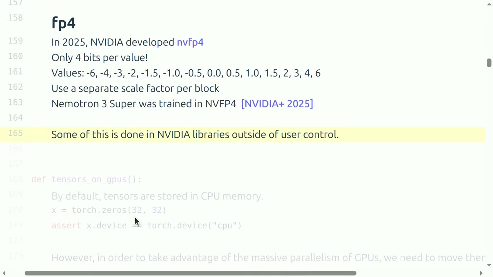

还有一个问题是关于 1 位的，因为你不能真的比那更低了。所以训练和推理之间是有区别的。很多低位的东西——我想我们稍后会谈到量化——是你在也许甚至 bf16 上训练一个模型，然后你量化到比如 1 位或 2 位。那比训练一个 1 位语言模型容易得多，而我认为没人做过——也许可能，但我不认为有人训练过任何可信的东西。好。

*[17:00](https://www.youtube.com/watch?v=kuYAsz7zspQ&t=1020)*

## einops：给维度起名字

我们继续。我们谈到了 tensor，内存计算相当简单，就是元素数量乘以每个元素占用多少内存。默认情况下，你在 PyTorch 中创建的 tensor 会在 CPU 上，当然，如果你想让事情变快，你想把它们移到 GPU 上。实际上有一点——我对幻灯片有一个小问题，它们是在我的笔记本上执行的，这意味着我没有 GPU，所以有些代码我只会展示而不会执行。这个可能没那么有趣，但我想大家都知道怎么把 tensor 移到 GPU 上，只是记得要做，否则你拿不到加速。

*[18:02](https://www.youtube.com/watch?v=kuYAsz7zspQ&t=1082)*

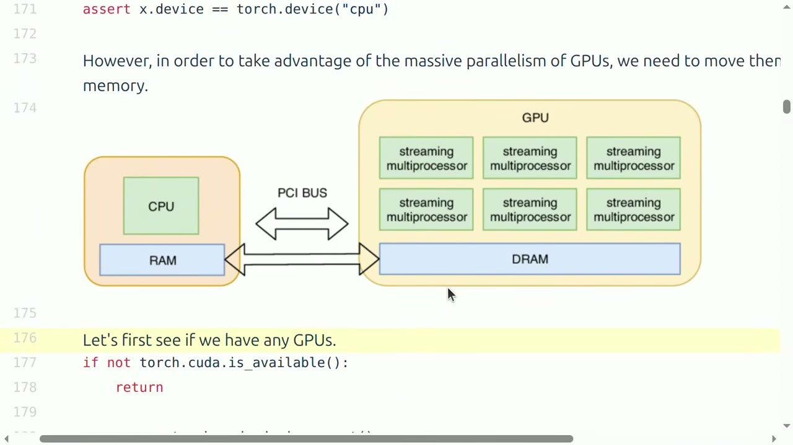

我们讲完了 tensor 的内存，这很直接。现在讲用 tensor 做计算。在讲 tensor 操作的 FLOPs 核算之前，我们先绕一小段，讲讲 einops。你们有多少人熟悉或者用过 einops？大概三分之二，好。einops 的动机，给那些还没被"洗脑"的人：看这样的代码非常容易搞错，或者说我觉得非常令人困惑。你有 x 和 y，然后你 transpose 负 2 和负 1，你试图搞清楚负 2 和负 1 是什么。所以这也许就是用变量和名字而不是用索引的动机。einops 是一个操作 tensor 的库，其中维度是有名字的，它受爱因斯坦求和约定（Einstein summation notation）启发。有一份不错的教程你可以去看，我这里只讲一些基础。

*[19:17](https://www.youtube.com/watch?v=kuYAsz7zspQ&t=1157)*

基本上，理解 einsum 的方式是：它是一种带良好记账的、广义的矩阵乘法。举个例子，我有一个 3 乘 4 的矩阵，一个 4 乘 3 的矩阵。如果我做 MatMul，这其实挺好，很容易理解。在 einops 里你基本上是说 x 有两个维度，行和列，我把它们命名为 seq1 和 hidden；y 是一个矩阵，也有行和列，我命名为 hidden 和 seq2；我要产生的 tensor——这里是一个矩阵——维度是 seq1 和 seq2。任何这里没提到的维度，比如 hidden，就会被求和消掉。它的工作方式是，我会枚举这里出现的所有变量的所有可能取值，也就是 seq1、hidden 和 seq2，然后索引 x、索引 y，把它们乘起来，累加到结果 z 的 seq1、seq2 上。你会说，这比那个容易多了，对吧？

*[20:43](https://www.youtube.com/watch?v=kuYAsz7zspQ&t=1243)*

我们来看一个更复杂的例子，就是我之前展示的那个。现在有一个 tensor，2 乘 3 乘 4，另一个 tensor，2 乘 3 乘 4。如果我用老办法，基本上我要把最后两个维度转置，然后因为 MatMul 会隐式地对不是矩阵乘维度的那些维度做批处理，你就得到答案，所以你得稍微推理一下。einops 让这件事非常清楚：它说有一个 batch 维度，有 seq1、hidden、seq2、hidden，我要产生 batch、seq1、seq2。注意这里没有 transpose，因为我某种意义上已经通过命名做了转置。如果写成 hidden 和 seq2，那就没有转置。我总是被 transpose 搞糊涂，不用去想转置这件事让我很开心。

*[21:59](https://www.youtube.com/watch?v=kuYAsz7zspQ&t=1319)*

如果你想玩点花活，你可以说，batch 我就用点点点（...）来替代。这意味着如果我有比如说一个 rank 10 的 tensor，带 8 个不同的批处理维度，我可以直接写点点点，而不用把它们全枚举出来。这在语言建模里会出现，因为你可能有一个 batch 维度、一个序列维度、一个 head 维度，你要对所有这些做矩阵操作，你可能不想管这些。好处是你因此可以写模块化的代码，写这个点点点而不用担心传进来的 tensor 的形状。

*[22:49](https://www.youtube.com/watch?v=kuYAsz7zspQ&t=1369)*

这就是 einops 库里的 einsum。还有 reduce，它是 sum、mean、max、min 的推广。比如你有这样一个 tensor，你想按维度 dim 负 1 求和，也就是沿着最后一个维度求和。同样，我不喜欢这种记法。你可以调用 reduce，基本上你说有一些批处理维度——这里是前两个——然后有一个 hidden 维度，它不出现在右边，意味着它会被求和。这里我写 sum，表示聚合归约操作是求和，但你可以把它换成 mean、max 或 min。

*[24:03](https://www.youtube.com/watch?v=kuYAsz7zspQ&t=1443)*

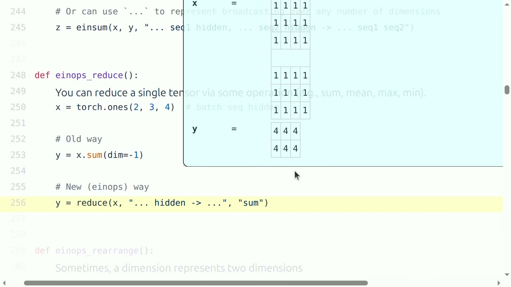

有人问这有加速吗？它基本上会归约到同样的原语操作，你可以把它看成是语法糖，所以应该是一样的。

*[24:03](https://www.youtube.com/watch?v=kuYAsz7zspQ&t=1443)*

最后我要讲的是 rearrange，我觉得这是个很强大的工具，我想它会在某次作业里出现一次。有时候你有一个维度实际上代表两个维度，而你想操作其中一个。出现这种情况的原因是，有时候你有一个矩阵然后把它展平了，然后你想拆开再展平。它的工作方式是这样的：想象我有一个 3 乘 8 的矩阵，但这个 8 维实际上代表一个 2 乘 4 的矩阵。我想把这个 2 乘 4 的矩阵乘以一个 4 乘 4 的矩阵。所以我接下来要做的就是调用 rearrange，我在这里说的是：这是一些批处理维度，这里它对应的就是这里的第一个元素；然后在这里我用括号表示这个 h 实际上代表 heads 和 hidden1 的乘积，这里显然有多种方式分解它，可以是 2 乘 4，也可以是 4 乘 2，所以我说 heads 的数量是 2，这意味着 hidden1 是 4。然后我可以把它拆成两个维度，heads 和 hidden。这样就创建了这个，之前 x 看起来像这样，现在 x 看起来像这样，我想这可能有点难看清。然后你可以对 w 执行你的变换，这就是我们之前见过的：你有一个标准的 MatMul，这里 x 有一些批处理维度，这是 hidden 乘以 hidden2。然后一旦你完成了这个变换，你就可以 rearrange 回来，这很直接，你基本上是看两个维度，然后把它们组合成一个维度。

*[27:19](https://www.youtube.com/watch?v=kuYAsz7zspQ&t=1639)*

有人问：你能把一个二维的东西塑造成一维的吗？不是有两种方式吗？比如按行主序还是列主序？问题是如果你有一个二维的东西然后把它变成一维的，你用哪种方式做？你做的方式由这里的顺序指定。好。所以有时我觉得需要一点时间来适应，但这很值得，因为一旦你有了 einsum，你就会以不同的方式思考。所有的转置和归约，所有这些都变得更流畅了。你必须更深入地思考这些更定制的原语。好，我们要用 einops，稍后我们会看到一点。

*[27:19](https://www.youtube.com/watch?v=kuYAsz7zspQ&t=1639)*

## FLOPs 核算：FLOPs 与 FLOP/s 的歧义

现在回到资源核算。我有一些 tensor，我们已经讨论过它们如何占用内存，那么它们消耗多少计算量呢？我们用来衡量计算成本的标准是 FLOPs 的数量。一个 FLOP 是一次浮点运算，我们假设它是一次基本运算，比如加法或乘法。当然 GPU 还能做其他事情，但大多数情况下我们忽略它们，因为这些才是基础，会占用你大部分时间。

*[28:03](https://www.youtube.com/watch?v=kuYAsz7zspQ&t=1683)*

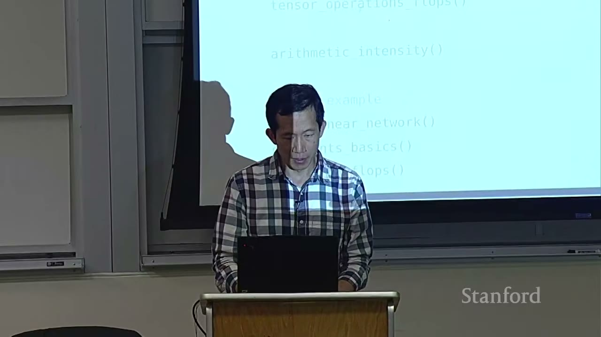

让我很在意的一点是，如果我说 FLOPs 这个词，它实际上是有歧义的。有 FLOPs，指的是浮点运算的数量，通常写作 FLOPs、小写 s，这是已完成计算量的度量。然后还有 FLOP/s，即每秒浮点运算次数，有时候也很容易混淆地写成 FLOPS、大写 S，但我会一直写 /s 来明确这是在衡量硬件的速度。所以如果你看到 H100 有 800、989 万亿次浮点运算，那是第二种；而当我说 GPT-3 用了 325 或者其他数字的 FLOPs，那是第一种。先把这一点说清楚。

*[28:58](https://www.youtube.com/watch?v=kuYAsz7zspQ&t=1738)*

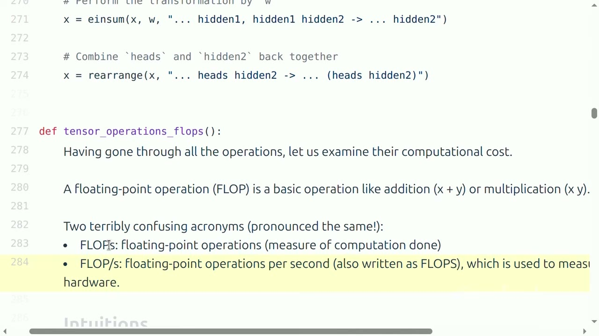

先给大家一个数量级的概念。当我说 1e22 或 1e23 或 1e25 的 FLOPs 时，这些隐式地指的是计算量，或者某些模型的规模。如果你看 H100 那份光鲜的规格表——其实不在这页上，算了。有一份规格表，我告诉你对于 bf16，FLOP/s 的数量是 1979。然后你去实际测试，你会发现等等，那并不是我实际得到的结果。然后你去读细则，有一个脚注说这是在稀疏性条件下的结果。所以稀疏矩阵和稠密矩阵都是 2，所以你总是要把这些数字除以 2，这就是为什么你看到这些除以 2。

*[30:04](https://www.youtube.com/watch?v=kuYAsz7zspQ&t=1804)*

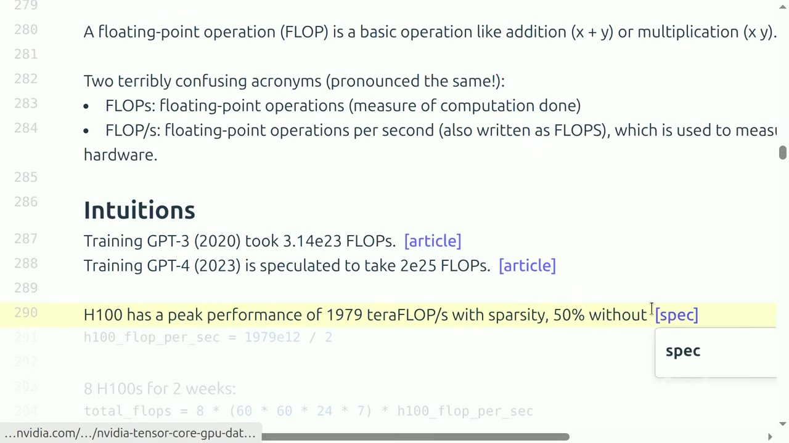

这只是为了建立直观理解，假设你有 8 块 H100，这里有一个节点运行两周——其实看起来是一周，好吧，没关系，就是一周乘以你每秒获得的 FLOPs 数，大约是 5e21。这只是为了建立关于某些类型硬件的 FLOPs 数、以及某些类型模型需要多少 FLOPs 的直观理解。这没什么复杂的，只是数学和粗略估算。

*[30:50](https://www.youtube.com/watch?v=kuYAsz7zspQ&t=1850)*

## 线性层的 FLOPs 就是 2×token 数×参数量

现在让我们做一些更机械的事情。假设你有一个线性模型。事实证明，很多计算 FLOPs 的方法实际上核心就是线性矩阵乘法，所以这其实并没有太大的通用性损失。你有 n 个点，每个点是 d 维的，我们将把每个 d 维向量映射到一个 k 维输出。B 是点的数量，D 是输入维度，K 是输出维度。让我们构造一些 x，即数据矩阵 B 乘 D，权重矩阵是 D 乘 K。当你做矩阵乘法时，问题是这有多少 FLOPs。事实证明这基本上是三个维度的乘积的 2 倍。理解这一点的方式是，我们对每个三元组有一次乘法，然后还有一次加法。有一个减 1，因为如果你不必实际相加，就像 D 减 1 次那样，但让我们忽略这一点。如果这有点快，我想还有另一种推导方法。

*[32:31](https://www.youtube.com/watch?v=kuYAsz7zspQ&t=1951)*

那其他操作的 FLOPs 呢？逐元素操作就是矩阵的大小，我想这相当清楚。加法同样需要 mn 次 FLOPs。所以一般来说，对于足够大的矩阵，你不会遇到其他操作像矩阵乘法那么贵。所以一般来说，我们就只关注 MatMul 在做什么，但有一个重要的注意点，是在我们谈内存的时候。出于好奇补充一下，还有别的做矩阵乘法的算法。有人问这是不是只针对正常做法？问题是还有别的做矩阵乘法的算法，你是指像次立方（sub-cubic）算法吗？一般来说，人们会去探索的矩阵乘法优化算法，更多是关于你怎么和系统协同设计，而不是这些更渐近的算法。有人问能不能以同样的方式考虑加法，是不是不可能比乘法更高效地做除法？按硬件构建的方式，这两者基本上是一样的。虽然直觉上似乎我加得比乘得快，但硬件的方式基本上是一样的。

*[33:59](https://www.youtube.com/watch?v=kuYAsz7zspQ&t=2039)*

所以你可以把这个 MatMul 看成：B 是数据点的数量，D 乘 K 是参数的数量。记住 x 是 B 乘 D，w 是 D 乘 K。所以这个公式的另一种理解方式是：做这个线性矩阵前向传播所需的 FLOPs，实际上是 2 乘以 token 或数据点的数量，再乘以参数的数量。事实证明这实际上可以推广到 transformer——如果你还记得 6 乘以 n 乘以 d 的公式，我们能看到它的形状正在成形。

*[34:46](https://www.youtube.com/watch?v=kuYAsz7zspQ&t=2086)*

## MFU：实际 FLOPs/s 与承诺 FLOPs/s

不幸的是这些计算不会很有意义，因为我是在 CPU 上做。但我会把代码走一遍。到目前为止我们测量的是 FLOPs，这与硬件无关，只是你的模型需要做多少次计算。现在的问题是，在硬件上实际要花多长时间？一个办法就是给它计时。这门课里，我想在接下来几讲我们会更多讲基准测试，但这里先预览一下。一般来说，当你在 GPU 上计时，你必须调用 cuda synchronize 来确保——因为 GPU 是异步运行的，你要确保有这个同步点。然后你执行操作，操作之后你也要有同步屏障。如果你省略这一步，你会发现你的计时快得惊人，因为这是个非阻塞调用，它就返回了。通常好的做法是试多次然后取平均。

*[36:11](https://www.youtube.com/watch?v=kuYAsz7zspQ&t=2171)*

实际的 FLOPs 每秒基本上就是你做的 FLOPs 数乘以你在硬件上记录的时间的倒数。记住还有另一个数字，就是 GPU 的规格表给出的那个 FLOPs 数，是 989 teraflops。所以一般来说，实际的 FLOPs 每秒会和承诺的 FLOPs 每秒不一样。直接思考这个差距的东西叫做 Model FLOPs Utilization，或者 MFU。MFU 的定义是实际的 FLOPs 每秒除以承诺的 FLOPs 每秒。这里忽略了通信和其他开销。所以你基本上取实际值除以承诺值。一般来说，你很少能得到超过——我的意思是，你永远得不到超过你被承诺的值，通常你会得到更少。一般来说，如果现代模型的 MFU 能达到 0.5，你应该对自己相当满意了。如果你只是做一个纯粹的矩阵乘法，你可能能达到 0.8 甚至更高，但你通常达不到那么高。有时候如果某件事真的出错了，你会得到像 0.1 这样的结果，这意味着你应该做点什么。

*[38:22](https://www.youtube.com/watch?v=kuYAsz7zspQ&t=2302)*

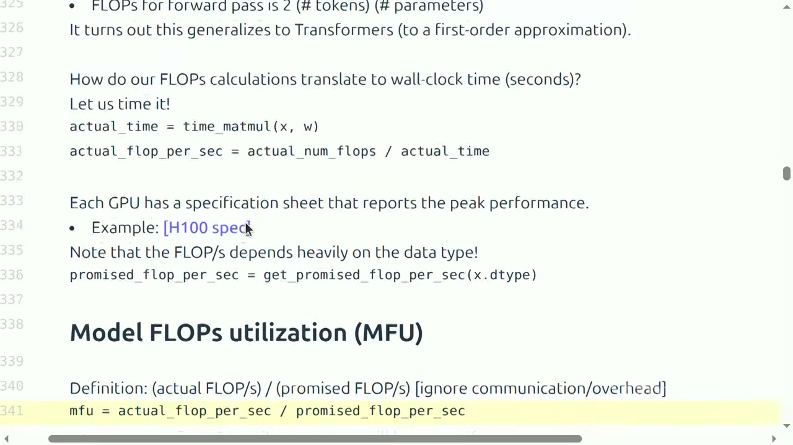

所以每当你写模型时，你可以计算。你现在知道如何通过结合计算模型需要执行的逻辑 FLOPs 数量，然后查看墙上时钟时间并基本上相除来计算 MFU。那边有问题吗？哦，是的。承诺的 FLOPs 数字是什么？那在规格表里，它已经除以 2 了，那个 989 的数字。然后在此基础上，一般来说你只能得到其中的 0.5，取决于你的计算。你问的是你得到 50% 的 MFU？是的。那么为什么你只得到 50% 的 MFU？实际上这是个好问题，我会在讨论内存瓶颈时再回来讲这个。

*[39:26](https://www.youtube.com/watch?v=kuYAsz7zspQ&t=2366)*

总结一下，矩阵乘法通常主导了计算，这是设计使然。而每秒的 FLOPs 数量取决于硬件，更好的硬件带来更多的 FLOPs；并且还取决于数据类型。这意味着如果你查看规格表，不同的数据类型会有不同的 FLOPs。如果你现在尝试使用 float32，它会非常非常慢，因为他们并没有真正为这个工作负载进行优化。而现在 bf16 或 fp8 会快得多。而 MFU——现在你知道 MFU 是什么了，它是实际的 FLOPs 除以承诺的 FLOPs。

*[40:27](https://www.youtube.com/watch?v=kuYAsz7zspQ&t=2427)*

## 算术强度：为什么 ReLU 和 GELU 一样贵

回到为什么 MFU 是 0.5 这个问题。要理解它，我得引入算术强度（arithmetic intensity）这个概念。原因是，事情并不只是做一堆 MatMul、然后做完看 MatMul 花了多久。这是我画的非常卡通的硬件样子：你有高带宽内存（HBM），然后你有计算核心所在的地方、加速器芯片所在的地方。那你怎么计算？你必须把你的输入、你的矩阵——tensor 就存在下面——从内存送到加速器，做计算，然后送回去。所以如果你想衡量这要花多久，它取决于两件事。一个是加速器的速度，就是我们刚才讲的。但另一件重要的事是你硬件的内存带宽，这个我们还没讲。看规格表的话，我们说过 FLOPs 每秒是 1979e12 除以 2，而每秒字节数，也就是内存带宽，是 3.3 TB/s。记住我们为什么要看内存、看存东西要多少空间。最明显的是，如果你的模型太大装不进内存，那可不妙。但事实证明，你需要移动这些内存，这要花时间，所以东西有多大实际上也影响速度。

*[42:27](https://www.youtube.com/watch?v=kuYAsz7zspQ&t=2547)*

我要讲一些操作，基本上计算它们要花多久，并引入算术强度这个概念。好，假设我有一个百万维的 bf16 向量，然后我要对它计算一个 ReLU。记住 ReLU 就是取 x 和 0 的逐元素最大值，作用于整个向量。我计算两件事。一是移动的字节数：我要读入 x，把它复制到加速器里，每一个是 2，因为 bf16 是每个浮点数 2 字节，乘以 n 个浮点数，所以是 2n；然后我要把 y 写回去，所以又是 2n。这就是需要移动的字节数。那么做了多少 FLOPs？每个元素，我只是拿它和零比较，就这样，所以是 n 次比较。那么通信时间，就是我需要移动的字节数除以移动的速度，这给出时间是 1e-6 秒。那计算时间呢？就是 FLOPs 除以每秒 FLOPs，所以是 1e-9。还有一个我们通常试图保持的重要假设，就是重叠通信和计算，我们会在更深入讨论 GPU 时多谈这个。但这个想法是，在这种情况下我们不会坐在这里等东西移动，一旦它们到了我们就开始计算，然后把它们移回去，所以这个移动以及计算是同时发生的。数学上，我们只是假设总时间是两者的最大值，因为我们假设可以完美地重叠它们。实践中它不会完美重叠，会有一些开销，但这对现在来说足够了。所以总时间，如我们这里看到的，是 1e-6。

*[45:05](https://www.youtube.com/watch?v=kuYAsz7zspQ&t=2705)*

那么这里的瓶颈是什么？当通信时间大于计算时间时，我们称这个算法是内存受限（memory bound）的，因为你大部分时间都在等比特到达。当计算时间大于通信时间时，那是计算受限（compute bound），因为此时你的瓶颈实际上是做计算。那在这种情况下，ReLU——修正线性单元——是内存受限还是计算受限？内存受限。很清楚，因为计算量远小于通信量。

*[45:53](https://www.youtube.com/watch?v=kuYAsz7zspQ&t=2753)*

这里有另一种看法，也是我要定义强度的地方。一个加速器的强度基本上是加速器每传输一个字节能做多少工作。对任何给定的加速器，基于规格表，你基本上就是 FLOPs 每秒除以字节每秒。所以你每移动一个字节能做多少有用的工作？是 295。这意味着每字节——你可以做 295 次浮点运算。这是一个可以记在脑子里的直观数字，大约 300。那算法的算术强度就是，这个工作负载每字节实际做了多少工作。看 ReLU 计算的话，就是 FLOPs 除以字节，实际上是——我想是四分之一，不是一半。重点是它非常小，0.25。

*[47:36](https://www.youtube.com/watch?v=kuYAsz7zspQ&t=2856)*

所以现在我们就可以用强度的语言来谈瓶颈了。如果算术强度小于加速器强度，那就是内存受限；如果大于加速器强度，那就是计算受限。这两个说法是等价的，如果你看代数，基本上你有两个分数，然后你乘一乘、除一除，把项换一下位置。在这个例子里，我们是内存受限的。一般来说我们会发现自己处在内存受限的情况，因为数据移动很贵。所以如果你能获得更高的算术强度，那是好事。0.25，如果你看到这个数字，如果有人告诉你算术强度是 0.25，你应该说，哦，这真的很糟糕。有人问典型 transformer 的算术强度大概是多少？我们会讲到。

*[48:14](https://www.youtube.com/watch?v=kuYAsz7zspQ&t=2894)*

增加算术强度的一个思路是，让我们试着每移动一单位字节做更多的事。GELU 是另一个激活函数，它长这样，某个更复杂的公式，它没有零。如果你做这个计算，来回移动的字节数仍然是 2n 加 2n，而这里 FLOPs 大约是每个逐元素标量操作 20 次 FLOPs，所以是 20n。那么算术强度就是，比如说，5，这是个粗略估计。那这种情况下我们是内存受限还是计算受限？内存受限，因为 5 仍然小于 295，小得多。所以即使 GELU 做了很多工作，比 ReLU 多得多，但按照事情的组织方式，它仍然是内存受限的。这意味着如果你只是计算 ReLU 和 GELU，你会想，GELU 那么复杂，一定很贵，但实际上它们完全一样，因为那里不是瓶颈所在。

*[49:46](https://www.youtube.com/watch?v=kuYAsz7zspQ&t=2986)*

现在看一些线性操作，比如点积。点积就是你有一个向量 x，一个向量 w，大小都是 n，你取点积。移动了多少字节？你读 x 是 2n，读 w 是 2n，然后写 y，y 是一个标量，是 2。FLOPs 是你做了 n 次乘法、n 减 1 次加法，所以是 2n 减 1。那么算术强度是多少？对这个来说大约是一半，也很糟糕。这意味着——希望你能 get 到——它是内存受限的。

*[50:33](https://www.youtube.com/watch?v=kuYAsz7zspQ&t=3033)*

那矩阵向量乘法呢？我有 x 是个向量，w 是个 n 乘 n 的矩阵，你形成这个乘积。有多少人觉得这会是计算受限的？有多少人觉得是内存受限的？我们来看。我读 x 是 2n，读 w 是 2n 平方，写 y 是 2n。FLOPs 基本上是你做 n 次点积，所以是 n 乘以做一次点积的开销。算术强度只是勉强、勉强高一点，所以这也是内存受限的。

*[51:21](https://www.youtube.com/watch?v=kuYAsz7zspQ&t=3081)*

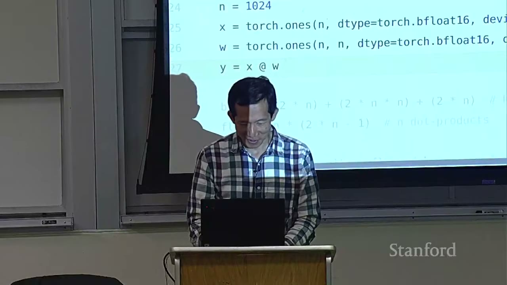

现在讲矩阵乘法，这里是事情变得有意思的地方。我有一个 n 乘 m 的矩阵，另一个 m 乘 n 的矩阵，我把它们乘起来。移动的字节数是 2n 平方加 2n 平方，然后我要把 2n 平方字节写回 y。这里的 FLOPs 是 n 平方次点积。那算术强度是多少？是 300，哇。好，340，一般来说大概是 n 除以 3。直觉上这说得通，因为你发送了 n 平方个东西，但你计算了 n 立方个东西。所以你计算的东西的数量除以你发送的东西的数量是 n 阶的。你让矩阵越大，这就越好。一般来说，这就是为什么当你听到人们说我们需要大的批次大小，或者大的矩阵，原因正是这个。如果你在算术强度之下，把事情做小其实并不会加速，全都一样；而如果你到了这个点之上，那你实际上就在饱和你的 GPU 了。

*[52:48](https://www.youtube.com/watch?v=kuYAsz7zspQ&t=3168)*

最后，这是计算受限的。所以只要我们有大的矩阵，我们就相当不错，我们在计算受限、饱和加速器的状态。之前关于 transformer 的问题呢？事实证明，我们会在你们的作业里、也会在下一讲里看到，transformer 本质上就是大的矩阵乘法，中间撒了一些东西。所以从算术强度的角度这是好消息，这是设计使然，transformer 是按某种方式设计的，让它有很高的算术强度。这里还要提一点，为推断那一讲做个铺垫：矩阵向量乘法本质上就是你在做 transformer 推理时发生的事情。因为推理时你一次生成一个 token，所以你只有一个向量去和一个矩阵做点积，正如我们看到的，那是内存受限的。而在训练时，你拿到整个序列，一次性处理所有东西。

*[53:58](https://www.youtube.com/watch?v=kuYAsz7zspQ&t=3238)*

还要注意强度取决于精度。默认情况下我们这里做的一切都是 fp16。这也能连到另一个关于 MFU 的问题：你得到低 MFU 的原因可能是，MFU 是实际值除以承诺值，如果你有非常大的内存瓶颈，那你就不会得到很好的吞吐，尽管承诺的意思是：假如你没有内存瓶颈，你只是一路把模型的所有计算都做完。

*[54:47](https://www.youtube.com/watch?v=kuYAsz7zspQ&t=3287)*

最后是算术强度和 roofline 图。有人问：一般来说这些模型在大部分计算上都是内存受限的，然而加速器 50% 并不算好，也许你能拿到 70、80 那才真的很好，这意味着加速器相对于内存带宽是超配的。为什么会这样？为什么这些加速器这么大，却只是在空转或者等内存？问题是，你能不能设计出特性更好的加速器？也许等我们讲 GPU、多理解一点它们如何工作时，我们可以谈谈为什么会这样。但如果你有答案，你应该告诉 Jensen，也许你能设计出更好的硬件。

*[56:00](https://www.youtube.com/watch?v=kuYAsz7zspQ&t=3360)*

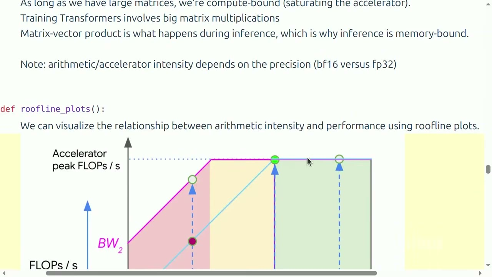

我们来可视化一下算术强度和性能之间的关系。这个图把算术强度画在 x 轴上，这里每一个切片对应一个特定的算法；然后我们有这些线，每一条线对应一个特定的加速器，也许是 H100 或 B200 之类。它展示的是——y 轴是实际实现的 FLOPs 每秒。如果你的算法算术强度低，比如 ReLU 或点积，你就落在这边，这意味着实际实现的 FLOPs 每秒不会像你加速器的峰值那么高。而当你增加算术强度，事情会变好，你能饱和你的硬件，直到某个点。过了某个点你就是计算受限的，显然你不能超过峰值 FLOPs。

*[57:10](https://www.youtube.com/watch?v=kuYAsz7zspQ&t=3430)*

## 训练的内存与计算：梯度与 6ND

现在我要回头讲训练所需的操作的内存和计算。到目前为止我们做了 tensor 操作，基本上是 MatMul，我们看到了它占多少内存、需要多少计算，以及它们之间的交互。现在我们来真正想想训练需要什么。这里是我们的固定例子。其实这不是一个线性网络，就是一个深层网络。我考虑的情况是：我有一个输入，是 B 乘 D 的输入，以及若干层，每一层是一个 D 乘 D 的 MatMul，然后产生一些预激活（preactivations），再经过逐元素 ReLU 产生第一层的激活，然后这个反复重复，输出也是同样的大小。看一下它在 PyTorch 里长什么样，基本上就是一组 block，每个 block 有一个权重矩阵。这里的参数数量是 D 平方乘以层数 L。当你在这批数据上运行模型，我们做的就是一层层走，每一层我们基本上应用线性变换，然后一个逐点 ReLU 激活，然后对所有层都这样做。这希望是很直接的、非常简单的模型。

*[59:10](https://www.youtube.com/watch?v=kuYAsz7zspQ&t=3550)*

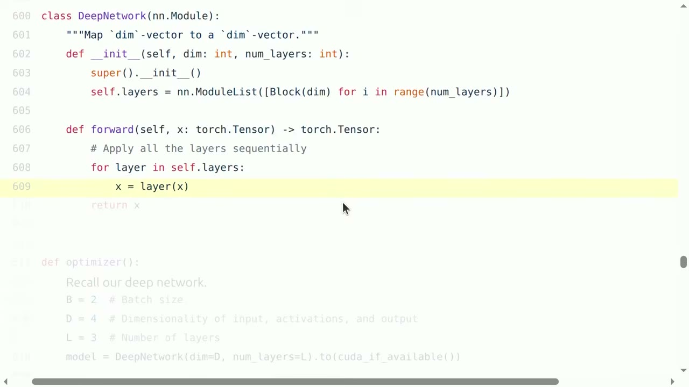

现在讲梯度。我们用一个更简单的例子，就是一个简单的线性模型回归。我们有向量 1、2、3，一个权重向量 1、1、1，我们取点积，形成 MSE loss。当你做反向传播时，在这个计算图里参与的每个变量都有一个梯度，要么被设置了，要么没被设置。w.grad 被设成 1、2、3。这就是 PyTorch 的基本机制，我想大家都很熟悉。那么问题是，计算梯度要花多少计算量？

*[60:08](https://www.youtube.com/watch?v=kuYAsz7zspQ&t=3608)*

我们来数一数计算梯度的 FLOPs。取一个简化模型，你有 x，是 B 乘 D，乘以 w1 矩阵，我们忽略 ReLU 以简化，再乘以 w2，同样是 D 乘 D 的矩阵。我用 einsum 来写，原因后面会清楚。线性网络里你做的第一件事是拿 x 和 w1，x 是 batch 乘输入维度，w1 是 in 乘 out，你得到 batch 乘 out。h2 拿 h1 和 w2，同样的故事。这些都只是 MatMul。然后你形成一个 loss，我这里就随便把它归约成一个数。那么在反向传播里会发生什么——我给它命名叫 retain gradients，为了调试目的，你们后面会看到。你在 loss 上做反向传播。问题是，那做了多少工作，是多少次浮点运算？

*[62:08](https://www.youtube.com/watch?v=kuYAsz7zspQ&t=3728)*

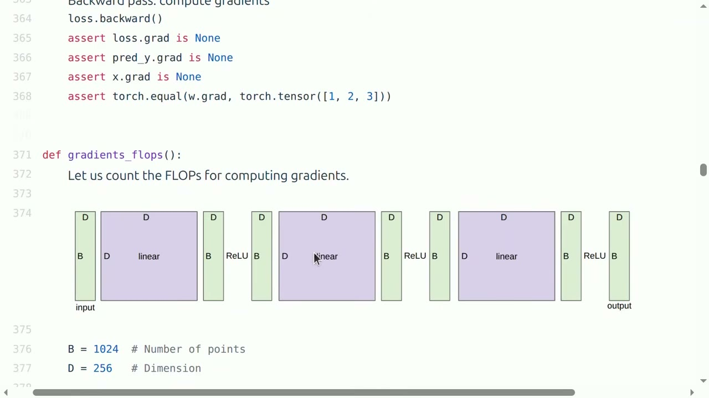

我们放大看一层，聚焦第二层。第二层拿 h1，把它乘以矩阵 w2 得到 h2，就这样。前向传播的 FLOPs 就是一个 MatMul，我们把三个维度拿出来相乘。2 是因为有一次加法和一次乘法。那么在反向传播里这看起来是什么样？反向传播里，如果你记得链式法则和反向传播算法，你要计算两件事：你要计算反向消息（backward message），也就是 loss 相对于你输入的梯度；你还要计算相对于参数的梯度。那这些梯度长什么样？这就是链式法则用 einsum 记法写出来。你拿 d loss d h2，也就是 h2 grad，那是一个 batch 乘 out 的矩阵，你把它乘以 w2，w2 是 in 乘 out，然后这给出 h1 grad，即 d loss d h1，是 batch 乘 in。我总是在这里搞混，如果你学过微积分，其中一个会有转置，我总忘记哪个顺序。einsum 我觉得让它非常清楚，因为你可以只看着标量情况记住它必须看起来像 h1.grad 是 h2.grad 乘以 w2，唯一的问题是索引怎么排。你通过看这些的形状和命名的维度来索引。在这个例子里，它就是一个矩阵乘法，你对输出维度求和。做出来之后我们可以检查：h1.grad 就是 loss.backward 算出来的东西，它确实和这里写的一样，作为 sanity check。

*[65:05](https://www.youtube.com/watch?v=kuYAsz7zspQ&t=3905)*

另一件你必须计算的是 w，相对于参数的梯度。那是 d loss d h2 乘以 h1。它是同样的反向消息回来了，但是和另一个你不是在对它求梯度的东西相乘。你把维度写出来，这里你是对 batch 维度求和。但好的地方是，如果你只看这个，我们知道它有多贵。FLOPs 的数量本质上就是所有维度的乘积，你是对哪个维度做批处理并不重要。基本上你枚举 i、j、k，然后聚合。聚合的方式不同，但 FLOPs 是一样的。注意反向传播恰好是前向传播的两倍那么贵。这是因为你要计算两个梯度：每个参数相对于参数的梯度，以及相对于输入的梯度，也就是另一个不是参数的东西。

*[65:29](https://www.youtube.com/watch?v=kuYAsz7zspQ&t=3929)*

好，刚才只是针对 w2。你需要把这个应用到网络里所有的参数上。把它们放在一起，你会看到对这个网络来说，前向传播是 2 乘以数据点的数量，也就是 b，乘以参数数量，这么多次 FLOPs。反向传播是它的两倍，也就是 4 乘以数据点数量乘以参数数量，这么多次 FLOPs。所以总共是 2 加 4 等于 6，6 乘以数据点数量和参数数量。这就是你可能在各种地方见过的 6ND 是怎么来的，它只是数前向和反向。我们是对这些深层网络做的这个推导，但事实证明这对 transformer 也是一个很好的近似——只要上下文长度不太大。如果上下文长度太大，你就会得到上下文长度的平方，那是这个核算里没有的额外 FLOPs。

*[66:47](https://www.youtube.com/watch?v=kuYAsz7zspQ&t=4007)*

## 优化器与优化器状态的内存

现在我们有了梯度，做训练的另一个部分是优化。为了不给你们直接讲作业 1 里的内容，我用 AdaGrad 优化器，这是 2011 年的，比 Adam 还早。你可以把它看成介于 SGD 和 Adam 之间的东西。基本上它就是 SGD，但你看梯度的二阶矩。Momentum 是看梯度的一阶矩，Adam 是把两者结合起来。我没有时间在这里讲优化器的细节，因为我们主要关注用法。

*[69:20](https://www.youtube.com/watch?v=kuYAsz7zspQ&t=4160)*

我们可以定义一个优化器。当你计算梯度，然后你做一个 optimizer step——如果你要定义一个新的优化器，在作业 1 里你会实现 Adam。对每个参数组，在这里就是 w1 或 w2，我们看——有一个东西叫优化器状态（optimizer state），是存储的、优化器运行时使用的。我们在 AdaGrad 中计算的是某种——梯度平方之和。这里我们从优化器状态里拿它，用当前梯度更新它，然后存回去。然后在你更新完 g2 之后，再更新参数。所以在 AdaGrad 里，基本上就是除以梯度平方平均值的平方根，或者说梯度平方之和。好。其实我可能要跳过训练循环。等等，我觉得我跳过了某些本不想跳过的内容。

*[69:29](https://www.youtube.com/watch?v=kuYAsz7zspQ&t=4169)*

那是优化器状态，现在我们来看优化器用了多少内存，或者说一般来说内存使用量是多少。对于这个网络中的参数，每层有 D 平方个参数，L 层。如果我们用 fp16 存储，每个参数占 2 字节，所以这就是参数的内存。激活是 2 乘以批次大小乘以 D 乘以层数，这是 bf16 的，每一层都有激活。还有梯度，基本上就是所有参数的一份副本，这也是 bf16。而优化器状态，对每个——其实这里应该是——我觉得这里应该是个笔误，我来修正一下：这里应该是参数数量，不是参数内存；所以是参数数量乘以 2 字节在这里，然后是 4 乘以参数数量在这里。原因是，习惯上用 fp32 存储优化器状态以保证稳定性。显然人们尝试过用 bf16，结果就是你在做平方，然后对多步求平均，这不太稳定。对于 AdaGrad，这里每个参数占 4 个字节用于存储优化器状态；Adam 会存储一阶矩和二阶矩，所以是 8 个字节。所以想想看，优化器状态实际上占了很大一部分内存。

*[71:04](https://www.youtube.com/watch?v=kuYAsz7zspQ&t=4264)*

有一点需要注意，内存有两个用途。一是你必须把这些东西存储在 HBM 中，但另一点是它必须被传输到加速器上。一般来说优化器状态并不是计算瓶颈，所以这里的实际内存大小对速度性能并不很重要，但它意味着你无法在内存中容纳大模型。

*[72:04](https://www.youtube.com/watch?v=kuYAsz7zspQ&t=4324)*

总结一下，正如我们提到的，这里的参数量是 D 乘以 D 乘以 L，而 FLOPs 数量是 D 乘以 token 数或数据点数乘以参数量。对于 transformer 来说这会稍微复杂一些，但你会在作业 1 里做这个，你会更仔细地完成它。我会跳过训练循环，这只是一个总体回顾。

*[72:10](https://www.youtube.com/watch?v=kuYAsz7zspQ&t=4330)*

## 用梯度累积和激活检查点减少内存

在结束之前我想快速讲两点。一是正如我们所见，内存确实有重要影响，既影响存储大模型的能力，有时也影响你的速度。所以一般来说你希望减少内存使用，人们通常会做两件事。一是梯度累积（gradient accumulation）。一般来说你希望使用足够大的批次大小以提升稳定性，直到达到临界批次大小（critical batch size），Tatsu 稍后会讲到这一点。正如我们所见，激活内存随批次大小增长，所以如果你的批次大小太大，在某些时候你可能会内存不足。梯度累积就是说，你有这些 micro batch，你在 micro batch 上计算梯度，然后你只是把梯度累积起来。你不清零梯度。每过 batch size 除以 micro batch size 这么多步，你更新参数并清零梯度。这实际上是一个非常简单的代码改动，让你能省下计算。

*[73:19](https://www.youtube.com/watch?v=kuYAsz7zspQ&t=4399)*

另一件我要快速提的是激活检查点（activation checkpointing）。训练时我们一般需要存储所有层的激活。这是默认做的。有意思的是，对于推理我们不需要计算梯度，所以我们只需要存当前层的激活。但对训练来说，内存使用是 B 乘以 D 乘以 2 乘以 L。问题是，你能减少这个吗？激活检查点，也叫梯度检查点（gradient checkpointing）或重物化（rematerialization），关键思想是：在前向传播中你只保留一部分层的激活，在反向传播中你从最后一个检查点重新计算缺失的激活。这就是为什么叫 checkpointing。这是系统里常见的一个通用技巧，就是做权衡：如果你想减少内存，你可以重新计算。

*[74:27](https://www.youtube.com/watch?v=kuYAsz7zspQ&t=4467)*

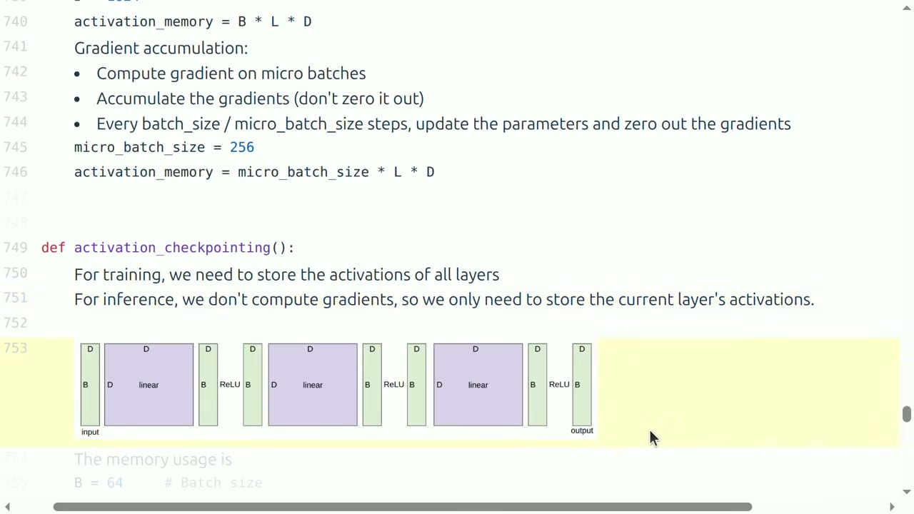

这里我们把这个操作化。实际上这相当容易。基本上你做的就是同一个模型，只不过你在某一层上加上 torch.utils.checkpoint。这意味着做这个计算，但不存储任何中间激活，只存需要的东西。这意味着如果你存储所有激活——记住在你的深层网络里，你有 ReLU 之前的东西和 ReLU 之后的东西，那是很多存储。反过来，如果在这些 block 上做激活检查点，每个 block 有一个线性层和 ReLU，你就不存 pre-ReLU 的东西，你基本上省下一半，你能用一半的内存。然后你做反向传播时需要 g3，但你可以很容易地从 h2 算出 g3。

*[75:33](https://www.youtube.com/watch?v=kuYAsz7zspQ&t=4533)*

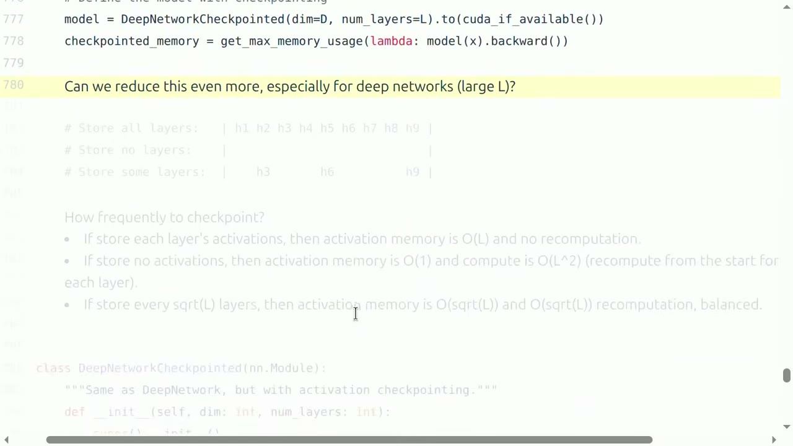

你可以走得更远。你可以说，我可以存储所有层，但在极端情况下，我可以一层都不存。那会是内存效率最高的。唯一的问题是计算量会变成 L 平方，因为对每一层你都得从头开始。也许一个甜点是，你把检查点存在根号 L 层处，那意味着你的激活内存是根号 L，你的重计算开销也是根号 L，这样就平衡了。

*[76:16](https://www.youtube.com/watch?v=kuYAsz7zspQ&t=4576)*

## 总结

总结这堂课：一切都在 tensor 上操作——参数、梯度、激活、优化器状态、数据。我们介绍了 einops，希望你们能接受它，把它作为思考 tensor 操作的方式。6 乘以数据点数量乘以参数数量这个公式，我们现在已经去神秘化了，它就是训练一步的 FLOPs 数量；其实如果这是训练步，这里应该是批次大小。然后我们讲了算术强度和 roofline 分析，它让我们能诊断一个计算是内存受限还是计算受限。矩阵乘法是计算受限的，基本上其他所有东西都是内存受限的。最后，梯度累积和激活检查点是减少内存的方法，而通过减少内存，你能使用更大的批次大小。这就是今天的内容。下周 Tatsu 会讲架构。

*[77:16](https://www.youtube.com/watch?v=kuYAsz7zspQ&t=4636)*

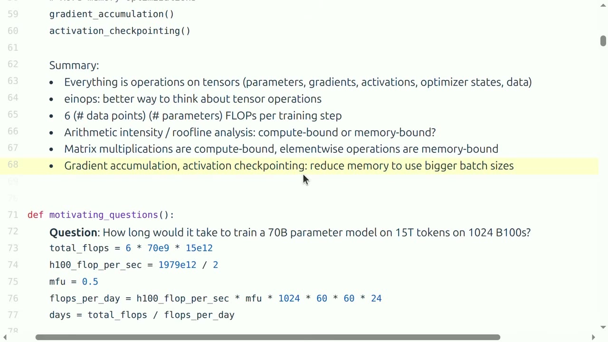
