# 从零开始的语言建模：架构
这节课从原始 Transformer 出发，系统梳理现代语言模型的架构变体、超参数选择、稳定性技巧、位置编码和注意力结构，并以大量模型为例说明哪些选择是共识、哪些仍在变化。

## 为什么架构让人头疼：用综述的方式看模型
今天我们要讲架构，至少对我来说，架构一直是个相当难以捉摸的东西。所以我采取的办法就是：把所有东西都告诉你，把现代论文都过一遍，看看大家都做了什么。我把这节课的标题叫做“所有你不想知道的架构和超参数”，因为我们当然都希望自己活在一个只需要知道 VC dimension 之类东西的世界里，只要非常简单的理论工具就够了，但现实并不是这样。

*[00:36](https://www.youtube.com/watch?v=lVynu4bo1rY&t=36)*

我们会从一种综述的视角来理解架构。最好的做法其实是你自己出去训练模型、尝试不同架构，这比听这节课还有用，这也是这门课哲学的一部分。但我们没有算力和时间覆盖所有架构的整个设计空间。所以我的看法是，第二好的做法就是从别人的经验里学习：别人都做了什么，他们在做哪些选择。通过看一个更广、更拉远的图景，也许我们能开始理解，哪些参数和选择在所有有效架构里基本固定，哪些可以变化而不影响模型性能。

*[01:29](https://www.youtube.com/watch?v=lVynu4bo1rY&t=89)*

我会讲 Transformer 的各种变体，从 Vaswani 那篇论文开始的现代 Transformer，到更近期的架构，看它们有什么共同点，然后什么是可以变的。很多人上过 NLP 课，见过 vanilla Transformer：加位置 embedding，用正弦余弦，经过 ReLU，然后 post norm。你们的 A1 会和标准 Transformer 有些不同：我们会让你把 layer norm 移到每个 Transformer block 或非残差层的前面，实现 RoPE，还实现 SwiGLU 而不是 ReLU。为什么选这些？一个原因是我们从 LLaMA 抄了很多，但别人也都这么做。真正训练自己的语言模型时，你会很快遇到“这么多选择，我到底该选什么”的问题。

*[02:57](https://www.youtube.com/watch?v=lVynu4bo1rY&t=177)*

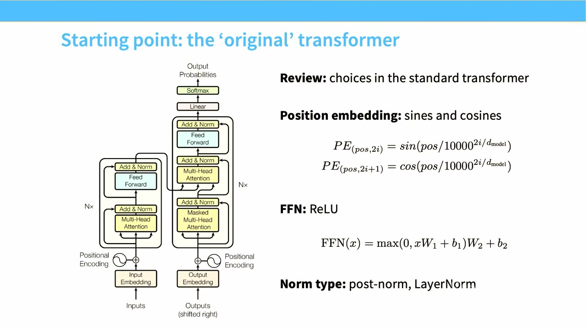

我思考架构的方式，是看人们做过的所有事情，然后问能不能从里面挑挑拣拣。Percy 总爱拿这个开我玩笑。我每年都看新模型，去年以为只有几篇论文，结果有 Qwen 2、Gemma 3、InternLM2、NeMo Tron 4 等等，居然有 19 个新的 dense 模型。今年我以为会慢下来，结果有 Qwen 3、上周四刚出的 Gemma 4、还有几乎 3，Percy 自己用 Marine 训练的 8B 模型也值得一提。模型很多，而且大多数其实是 MoE，混合专家，这个我明天再讲。因为模型多样性这么大，我们反而能相当好地看清所有可能的选择。

*[04:16](https://www.youtube.com/watch?v=lVynu4bo1rY&t=256)*

我做了个小表格，最后会回来看它。从原始 Transformer 开始，已经有很多自回归语言模型在类似的数据上训练过。你可以问：词表大小都有哪些？用什么 layer norm？用什么位置 embedding？然后会看到相当清晰的趋势。今天的目标是覆盖几件事：先是常见架构变体，也就是 Transformer 的 building blocks，比如非线性用什么、位置 embedding 用什么；然后讲超参数，比如 FF dim 是不是 hidden 的四倍、词表该多大；再讲让模型稳定训练的底层技巧。稳定性技巧和架构变化关系很密切。

*[05:34](https://www.youtube.com/watch?v=lVynu4bo1rY&t=334)*

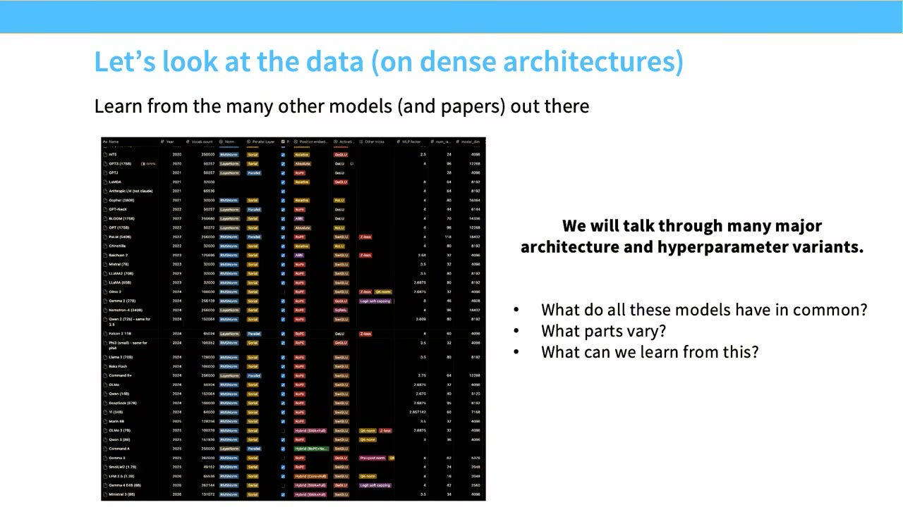

我想让你们记住，架构其实是一组非常复杂的权衡。架构要做什么？它要从数据中学习，所以要泛化；要在 GPU 上高效训练；还不能炸掉。训练到一半，如果 loss 突然爆掉，那完全不行。所以这些需求最终都被固化进了架构里。这也是为什么这些东西有点乱、有点复杂，很多地方并不优雅。

*[06:21](https://www.youtube.com/watch?v=lVynu4bo1rY&t=381)*

## 从实验时代到 LLaMA 2 之后：架构趋势
从高层看，我理解架构历史大致是这样：早期从 Transformer 到 GPT-3 左右，有大量实验，人们试各种东西，没有统一的金标准。然后 LLaMA 2 出来，大家都说 LLaMA 2 真好，我也想要自己的 LLaMA 2，于是大家开始训练 LLaMA 2-like 模型，只做小改动。去年我们看到很大差异，或者说趋势转向让训练更稳定的架构修改。今年则看到很多支持更长上下文的架构变化。所以有一些大主题在发生，LLaMA 2 是个重要节点，之后人们又开始探索。看到这些变化挺酷的。

*[07:29](https://www.youtube.com/watch?v=lVynu4bo1rY&t=449)*

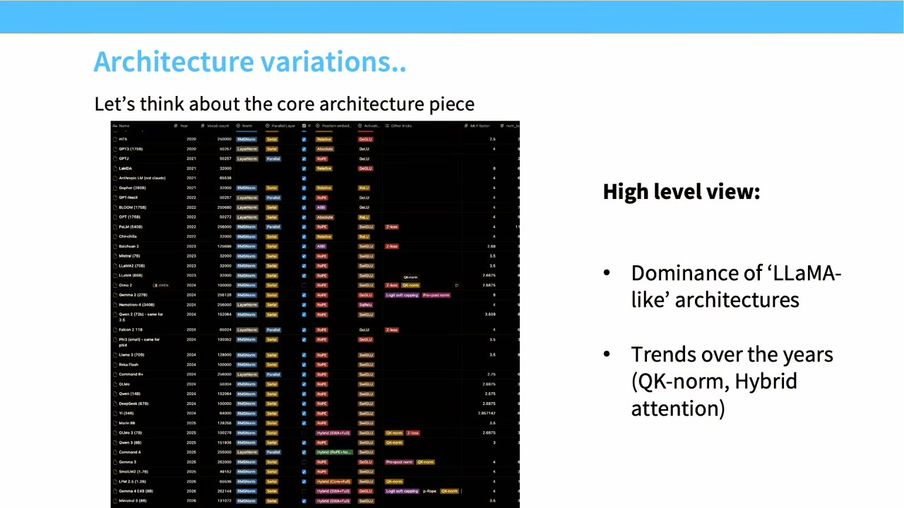

## 层归一化放在哪里：pre-norm、post-norm 与残差流
架构上人们可以争论很多，但有一件事大家基本同意：Transformer 论文大部分东西都做对了，除了 layer norm 放在哪里。原始 Transformer 把 layer norm 放在残差路径里。Transformer 有一个 residual stream，X 贯穿整个网络，每个组件产生 delta 加回残差流；为了让梯度跨层稳定，layer norm 被放在每个组件末尾。另一种做法是 pre-norm：把 layer norm 放在残差流外面，但在每个计算之前，比如 multi-head attention 之前、FFN 之前。命名会有点混乱，你可以叫它 post-norm，但我把它叫 residual norm，因为 norm 在残差层里。几乎所有现代语言模型都把 layer norm 推出残差流。

*[09:06](https://www.youtube.com/watch?v=lVynu4bo1rY&t=546)*

有一个很好笑的例外：OPT-350M。熟悉语言模型的人大概知道 OPT 本身有点乱，OPT-350M 更是如此，我也不知道为什么只有这个模型在残差流里用 post layer norm。这是大家都同意的一件事。你可能会问，为什么这件事如此统一？早期研究想的是：训练 Transformer 需要 warm-up，现在现代 Transformer 训练也仍然做 warm-up，但如果能去掉 warm-up 不是很好吗？这是最初的动机。但人们很快发现，去掉 warm-up 在稳定性和收敛上有严重问题。post norm 加 layer norm，也就是原始 Transformer 那种做法，收敛不如 pre norm；pre norm 即使没有 warm-up 也能得到好得多的收敛。

*[10:38](https://www.youtube.com/watch?v=lVynu4bo1rY&t=638)*

但人们很快意识到，把 layer norm 移到残差流外面，对加深网络和稳定性有重要影响。我觉得梯度衰减问题最清楚。做架构设计的人常说一句话：保持残差流干净。在 pre-norm 里，X 从底部进来，一路传到顶部最终输出，反向传播时梯度直接穿过，梯度传播非常简单，稳定性和信号传播都更好。pre-norm 加蓝色初始化时，梯度大小基本保持不变，因为反向传播有干净的直通路径。post layer norm 则会有复杂效应，因为每次经过 Transformer block 都做 layer norm，反向传播时梯度范数会改变。

*[12:00](https://www.youtube.com/watch?v=lVynu4bo1rY&t=720)*

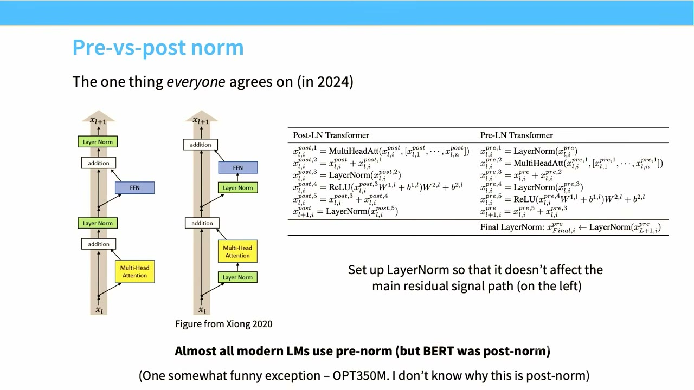

实验也表明，pre-norm 总体上提高稳定性，梯度尖峰的大小和频率都比 post-norm 好。这是 Salazar 和 UN 的图，他们比较早地仔细研究了这个现象。我认为这就是它留下来的原因：稳定性和加深能力对现代大语言模型都非常重要。所以把 layer norm 移出残差流，基本被所有人采纳了。

*[12:45](https://www.youtube.com/watch?v=lVynu4bo1rY&t=765)*

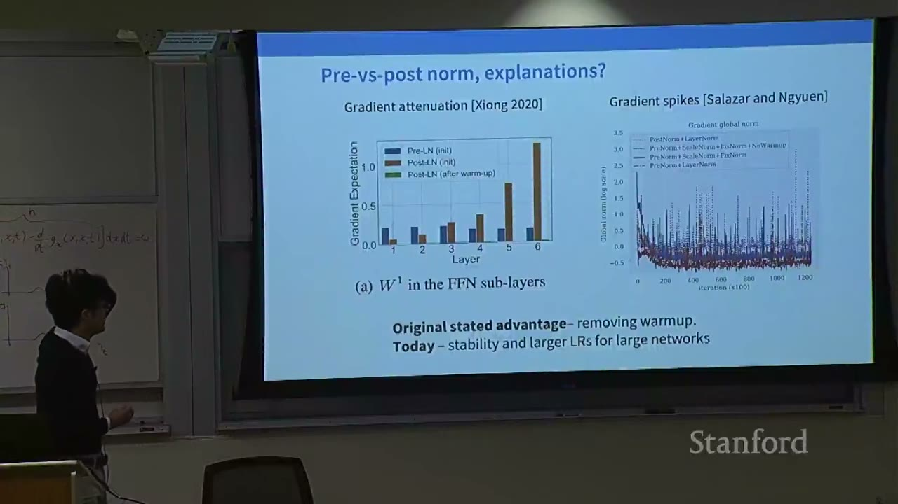

那么，如果 layer norm 放在残差流里不好，为什么它必须在开头？我们可以在计算之后放，按同样的逻辑也完全可以。很多近期模型，比如 Grok、Gemma 2、Olmo 2，就把 layer norm 移到计算之后，所以它是某种 post-norm，但在残差流之外。其他模型则到处放 layer norm，前后都放。后面讲稳定性时我会提到，一个经验是：如果遇到稳定性问题，到处撒 layer norm，一般会改善稳定性。这话说起来很荒谬，但每次人们遇到稳定性问题，都会说“那我们在 attention 里扔个 layer norm 会怎样？”结果发现也有效。这就是 post norm 或 double norm。

*[14:00](https://www.youtube.com/watch?v=lVynu4bo1rY&t=840)*

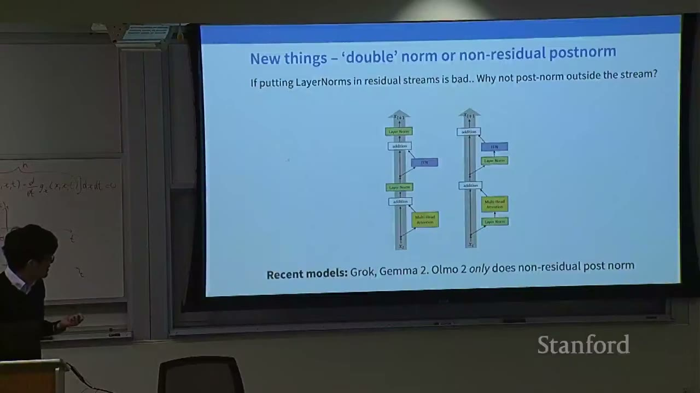

## RMS norm 与去掉 bias：系统与表达力
原始 Transformer 里的 layer norm 是：对 activation X 减均值、除方差，再缩放回来。这完全没问题，很多模型都用它成功训练。但几乎所有现代模型都用 RMS norm，它不减均值，也不加 bias，只是缩放再缩放。layer norm 在表达力上比 RMS norm 更强，所以表示上并没有理由必须用 RMS norm。但实践中 RMS norm 没有表达力损失，效果和 layer norm 一样好，而且更快。这里系统和架构协同设计就开始了：我们想让 GPU 保持繁忙，做矩阵乘法和其他高算术强度计算，不想让 GPU 来回搬小内存。所以要移除那些很小、涉及内存移动、但表达力不高的操作。如果减均值和加 bias 没什么用，那就删掉。

*[15:34](https://www.youtube.com/watch?v=lVynu4bo1rY&t=934)*

你可能会想，这有什么大不了？这只是个很小的操作，只占系统总浮点运算的 0.17% 左右。但正如 Percy 之前说的，问题不在 flops。Flops 是浮点运算，是矩阵乘法，但 runtime 要复杂得多。统计归一化，比如 layer norm，虽然只占 0.17% 的 flops，但根据负载和设置，可能占高达 25% 的 runtime。这很疯狂。在小模型上尤其明显，因为做这些操作时仍然要把大量参数在快慢内存之间搬来搬去。所以数据移动非常重要，RMS norm 也因此仍然很关键。

*[16:32](https://www.youtube.com/watch?v=lVynu4bo1rY&t=992)*

这里可以看到差异：算术强度用白色表示，flops 用黑色表示。layer norm 的算术强度非常低，正是我们最想移除的那种操作。学生问：归一化的数据移动和算术收缩相比为什么如此不成比例？因为像 tensor contraction，也就是矩阵乘法，大部分工作是乘法；而统计归一化的大部分工作是内存移动，内存移动很慢。想象一下，如果移动几乎占掉全部计算，而 activation 又很大，你就要付出很多。这里 runtime 百分比很极端，是小模型、矩阵不太符合现代负载的情况，但能让你感受到为什么这是免费优化。

*[17:31](https://www.youtube.com/watch?v=lVynu4bo1rY&t=1051)*

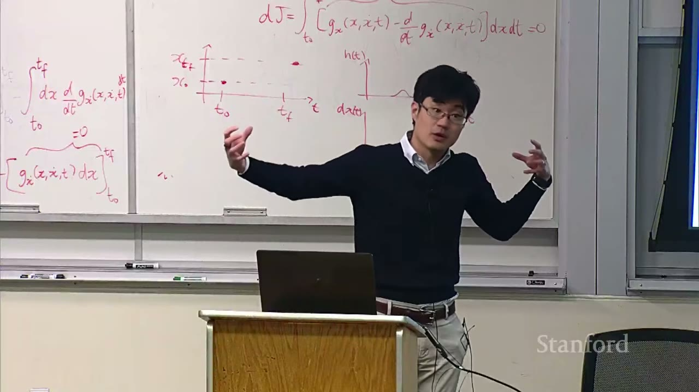

还有一篇 2020 年的论文，人们评估不同架构干预。我记得是 Google 的论文。他们展示，在一个 2 亿参数的小 Transformer 上，换用 RMS norm 后每秒步数更多，这就是第三列。而且实际上性能也更好，我不认为这是保证的，但是个不错的 bonus。所以你通过换 RMS norm 获得了免费的系统收益。于是大家基本都换过来了。

*[18:02](https://www.youtube.com/watch?v=lVynu4bo1rY&t=1082)*

更一般地，Transformer 和神经网络里的 bias 项通常不太有用。原始 Transformer 的线性层都有 bias，但大多数实现直接去掉。bias 也不是算术密集，相对更内存密集。所以干脆删掉，获得免费系统收益。顺便说，有时候 bias 也会引起稳定性问题。它们在其他方面有用，但我认为删掉它们的主要原因还是从系统角度简化。

*[18:49](https://www.youtube.com/watch?v=lVynu4bo1rY&t=1129)*

layer norm 的故事比较简单：大家做法相当标准化，我们对 layer norm 作用的理解虽然不深，但够用。所有人都把 layer norm 移出残差流，常常用 pre-norm，部分可能因为 LLaMA 2 这么做。我们大致知道怎么用 layer norm 控制梯度尖峰、保持信号传播。基本总是用 RMS norm，去掉 bias，让系统保持算术密集，同时表达力不变。架构让人不爽的一点是，你无法事先推理这些。比如我们事先并不知道删掉 bias 没问题，但通过大量实验和集体知识，我们知道在典型语言建模负载下，删掉线性和 RMS norm 的 bias 没问题。

*[20:13](https://www.youtube.com/watch?v=lVynu4bo1rY&t=1213)*

## 激活函数：从 ReLU、GELU 到门控线性单元
现在讲激活函数。激活函数有一大堆：ReLU、GELU、Swish、ELU、GeGLU、SeLU、SwiGLU、LiGLU。我读统计和机器学习时曾想，我永远不学这些东西，我会以不知道 SwiGLU 为荣。但现在我们需要对它们有一般性了解，知道名字里哪些部分对性能重要。用很 vanilla 的激活也能训练语言模型，比如只用 ReLU，Chinchilla 大概是那组里最好的模型。用 GELU，也就是高斯误差单元，区别只是底部一个小凹口，零附近的梯度变了，你可以训练 GPT-3，按现代标准不现代，但完全可用。

*[21:31](https://www.youtube.com/watch?v=lVynu4bo1rY&t=1291)*

然后到 gated linear units，比如 SwiGLU 和 GeGLU，这里才是重点。和 layer norm 类似，几乎所有可信的现代语言模型都用某种 gated linear unit。什么是 gated linear unit？看 FFN 的第一部分：标准 ReLU feed forward，X 乘 W1，逐元素在零处阈值，再乘 W2 得到输出。架构设计里常说 gating 很有帮助。把这个一般启发式用上去，你会说：除了逐元素 ReLU，为什么不再加一个 gate？第二项逐元素乘 ReLU 输出，用第二个矩阵 V。这会调制 ReLU 输出，然后其余一样。于是 XW1 被 XV 门控，再经 W2 降维。这是 ReGLU，也就是 ReLU gated linear unit。

*[23:13](https://www.youtube.com/watch?v=lVynu4bo1rY&t=1393)*

gating 是架构设计里非常有效的 primitive，在语言建模里也非常有效。GELU 加 gating 得到 GeGLU；Swish，也就是 X 乘 sigmoid，加 gating 得到 SwiGLU。这覆盖了很多现代模型：Google 的人一般用 GeGLU，比如 Gemma、T5；LLaMA 后代都用 SwiGLU，PaLM 和 LLaMA 后代都是 SwiGLU 模型。我会说 SwiGLU 可能更主导，但在 gated unit 之间其实差别不大。

*[24:10](https://www.youtube.com/watch?v=lVynu4bo1rY&t=1450)*

这里有个后面会用到的 trivia：gated 模型参数更多，因为我多了 V 这个参数。现在有三个矩阵而不是两个。做点数学就知道，应该把 feed forward dimension 缩小约 2/3，保持总参数一样。这是人们遵循的经验法则，但不是铁律。Noam Shazeer 提出这个的论文里 delta 很小，但很一致。他的很多论文都做 error bar，训练多个重复，看是否更好。GLU 变体几乎总是比非 GLU 好，而且是参数匹配比较，因为他总做这个 2/3 调整，保持总参数相同。所以这几乎是免费胜利。

*[25:29](https://www.youtube.com/watch?v=lVynu4bo1rY&t=1529)*

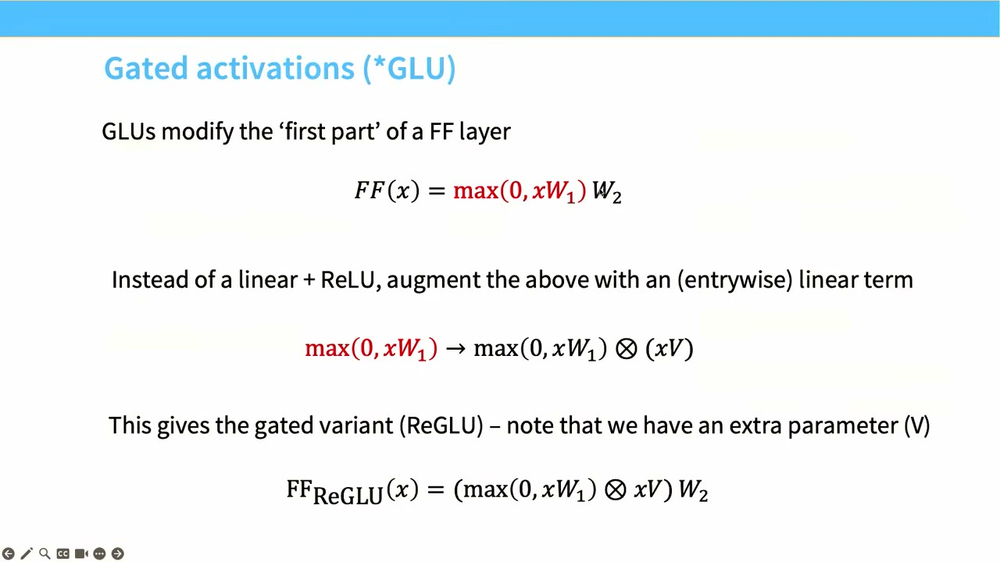

几乎所有人都用 GLU。也有更系统的比较，就是刚才说的 Noam 等人 2020 年论文。Google 在 2020 年代做了不少大规模架构比较，不过是 T5 架构，不是自回归语言模型。他们全面比较 GLU，SwiGLU、GeGLU 或一般 GLU 在 loss 或下游指标上显著更好。现在大量训练也清楚 SwiGLU 和 GLU 很好。gating 有很多变体，但真正重要的单一轴是：gating 对这些非线性很重要，计算代价不大，提升不错。

*[26:30](https://www.youtube.com/watch?v=lVynu4bo1rY&t=1590)*

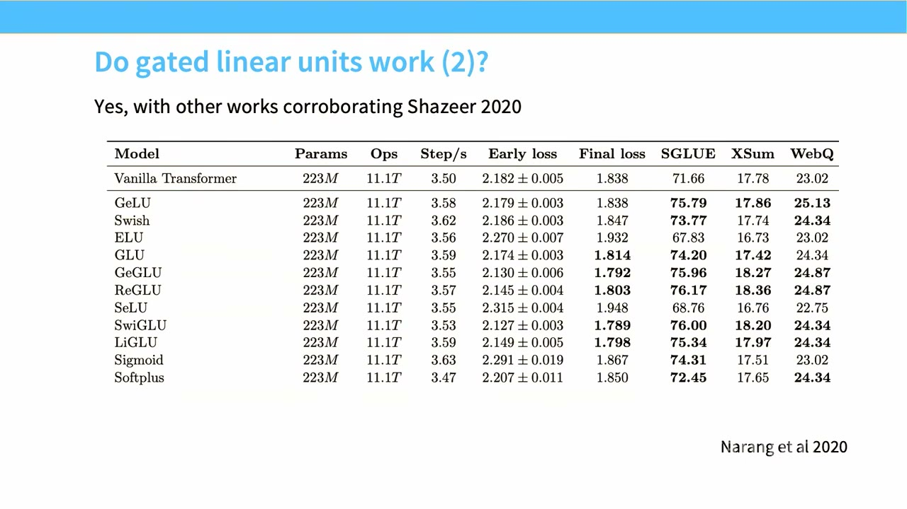

这不是说 gated linear unit 是必需的。GPT-3 就不是。NeMo Tron 340B 用了 squared ReLU，有点疯狂，但也能用。两个模型都很能打。但今天很少看到不用 gated linear unit 训练的模型。证据指向 gating 带来一致收益。

*[27:09](https://www.youtube.com/watch?v=lVynu4bo1rY&t=1629)*

## 并行 Transformer 块：一个曾经有趣但不再流行的想法
接下来这个想法我觉得很好玩，但时间已经证明它可能不那么好、不那么流行。通常 Transformer block 是串行的：先算 attention，再算 MLP，一个接一个。系统思维的人会说，这引入瓶颈，必须等一个算完才能算另一个。如果并行，也许能带来新的系统优化。所以可以问：能不能并行化 Transformer block？这最早出现在 GPT-J，也就是 GPT-3 的开源复现尝试。有意思的是，GPT-J 出乎意料地有影响力，传播了很多想法，PaLM 也是。Google 在架构上其实相当大胆。

*[28:16](https://www.youtube.com/watch?v=lVynu4bo1rY&t=1696)*

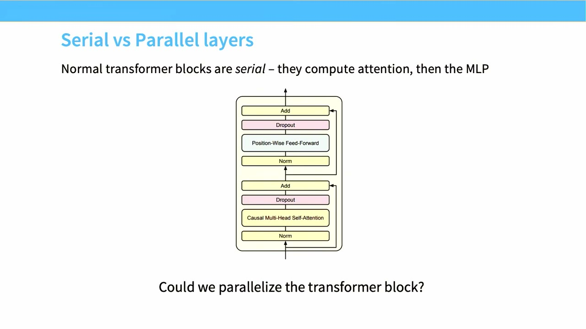

PaLM 报告里的描述是：不要像上面那样嵌套成串行，而是把 MLP 和 attention 层的输出相加，一起加回残差流。如果实现得好，可以共享很多组件，比如共享 layer norm，融合矩阵乘法，可能获得额外系统优化。受 Google 影响的人，比如 Cohere，创始人是 Transformer 作者之一，他们做很多 Google 式优化，跟随了这个架构。但其他人不多。

*[29:05](https://www.youtube.com/watch?v=lVynu4bo1rY&t=1745)*

过去两年，这个做法真的不再流行。主要因为串行形式的优化已经足够好，并行带来的系统收益不值得表达力损失。你可以认为这相当于损失了一半深度，对模型有害。

*[29:29](https://www.youtube.com/watch?v=lVynu4bo1rY&t=1769)*

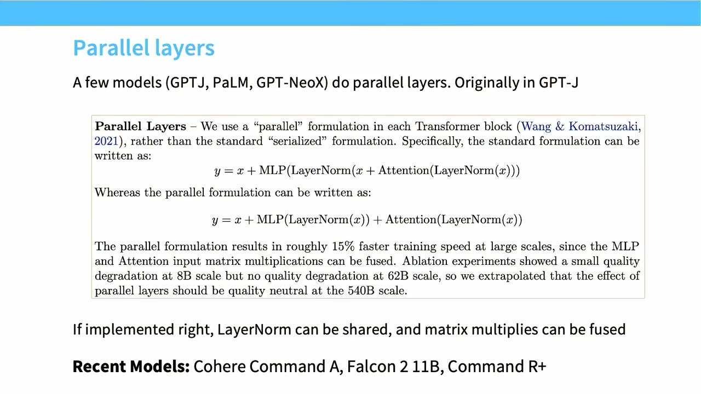

架构部分讲得这么短，其实说明原始 Transformer 公式经受了时间考验。我只改了 norm 位置、有没有 bias、MLP 要不要 gating，相比所有可能变化，这些都是小改动。有人会说，很多 Transformer 替代品改变 attention。是的，下节课讲。今天我讲核心 attention 方法，下次会加一点状态空间模型。只要还在 dense attention 领域，原始 Transformer 论文的架构和我们现在做的就很接近。

*[30:23](https://www.youtube.com/watch?v=lVynu4bo1rY&t=1823)*

回到表格：蓝色是 RMS norm 作为 layer norm，大多数现代模型是 RMS norm。串行 vs 并行层，蓝色是并行，其余串行，大多数是串行。pre-norm vs post-norm，我标 post-norm 的有些其实是 pre 和 post 都有。右边这些是 GLU，几乎都是 gated linear unit，Falcon 例外。现代模型几乎都是 GLU。所以趋势很直观。

*[31:09](https://www.youtube.com/watch?v=lVynu4bo1rY&t=1869)*

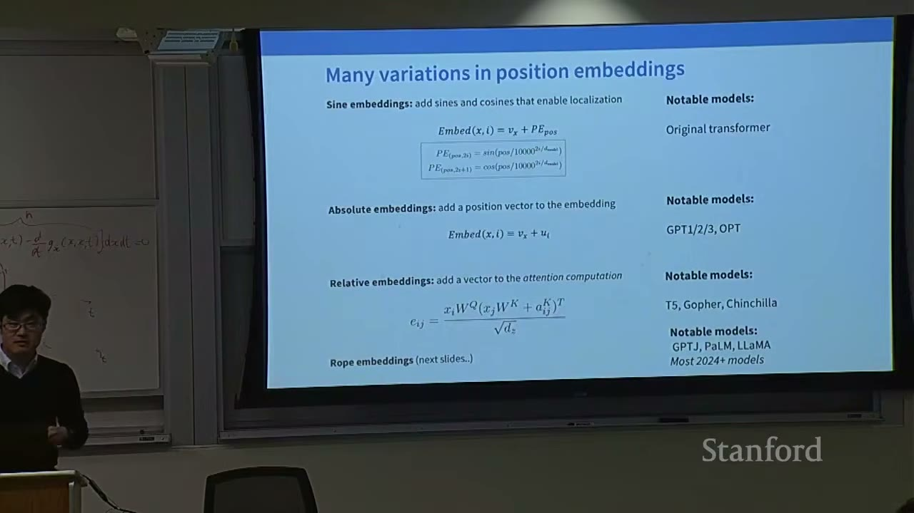

## 位置编码：从正弦余弦、绝对、相对到 RoPE
不同实现差异很大、而且我认为仍在变化的是位置依赖和从其他位置取信息，也就是核心 attention 组件。把位置编码进 Transformer 有很多方法。提醒一下，这非常重要，因为 attention 本身位置无关，只是内积，如果没有位置 embedding，打乱位置 attention 结果一样。原始 Transformer 用正弦余弦 embedding，类似傅里叶直觉，认为不管怎样都能恢复位置。之后一些大模型用绝对 embedding，每个位置有自己的 embedding。Google 一些模型喜欢相对 embedding：不是把 embedding 加到词向量里，而是加到 attention 计算里。偏移三个位置，attention 矩阵就加不同 offset。T5 和 Chinchilla 用这种。

*[32:23](https://www.youtube.com/watch?v=lVynu4bo1rY&t=1943)*

真正主导的是 RoPE，2024 年后大多数模型用它。考虑到 RoPE 某种程度是凭空出现，这很了不起。最初这也是 GPT-J 的创新，来自一个不太出名的博客和论文组合，作者在中国。RoPE 是相对位置 embedding。相对位置 embedding 有一个强观点：我不该关心任何词的绝对位置。A 和 apple 一起出现，不管在开头还是结尾，在 RoPE 里应该得到同样结果。我们有一个 embedding F，另一个 embedding F，输入词的身份 X、Y 和绝对位置 i、j，我们希望它们的内积等于只依赖相对差 j-i 的函数。之前所有 embedding 都不满足：正弦有绝对交叉项，不是相对；绝对位置按名字就不相对；相对 embedding 技术上是相对，但不是 embedding，因为只是加到 attention 矩阵，没有内积结构。

*[33:53](https://www.youtube.com/watch?v=lVynu4bo1rY&t=2033)*

于是问：有没有办法真正有相对 embedding？想法很酷，就是看角度和余弦的性质。我们希望 embedding 对绝对位置不变，而内积对任意旋转不变。所以取语义词向量，与位置无关，然后根据词出现的位置旋转每个向量，二维里就是角度。简单例子“we know”：we 在位置 0，不旋转；know 在位置 1，旋转某个角度。再看“of course we know”：we 和 know 仍然相邻，但绝对位置移动了。这里 we 在位置 2，旋转两个位置；know 在位置 3，旋转三个位置；它们的相对角度仍然相差 1。用旋转表示位置非常简单。这样任意内积都对绝对位置不变。

*[35:52](https://www.youtube.com/watch?v=lVynu4bo1rY&t=2152)*

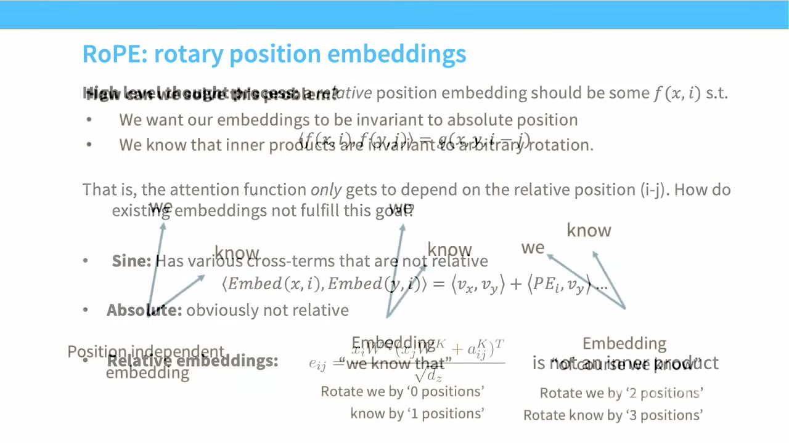

二维里容易，只有顺时针和逆时针。高维里旋转方式无穷多。D 维怎么办？做最简单的事，而且有效：反复降到二维。把 D 维向量切成二维块，每对维度旋转。旋转的 theta 不同：有些低频，转得很慢，能捕捉长程依赖；有些高频，转得很快，能捕捉是否相邻。每对向量旋转后得到最终 embedding。这就是 RoPE。论文用复数有很复杂的动机，但我觉得直觉就是降到二维、旋转每对坐标。Gemma 4 上周四刚出，他们有一种好玩的东西叫 proportional RoPE 或 P-RoPE，只旋转前两个坐标，这也是有效做法。这个空间里很多做法都有效。

*[37:35](https://www.youtube.com/watch?v=lVynu4bo1rY&t=2255)*

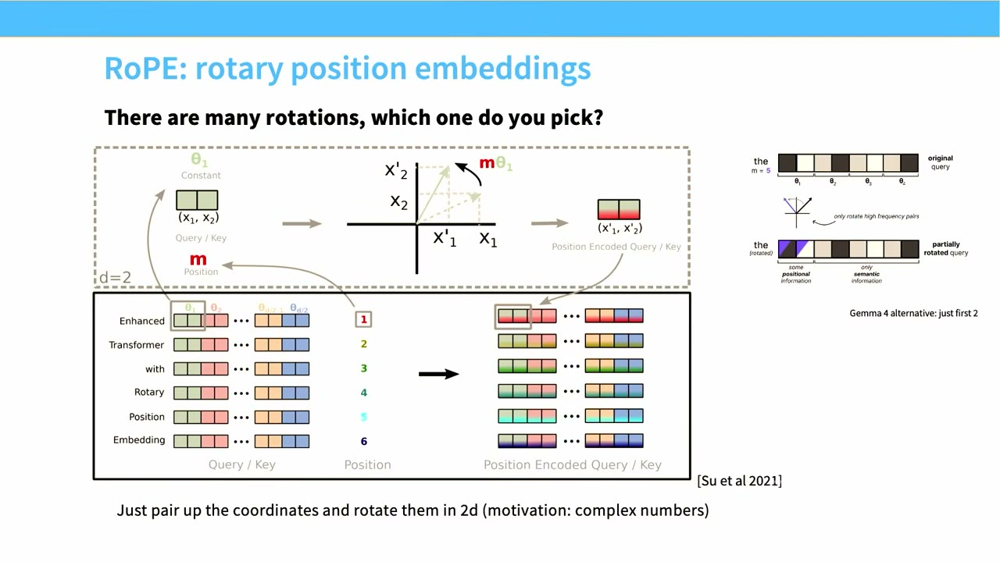

实践中，你拿向量和正弦余弦做稀疏乘法，给输入向量 X 某种旋转。X 乘 W 乘 R 得到最终 embedding。正弦余弦看起来像正弦 embedding，但关键是要相乘，而不是把它们当 embedding 加，因为这样没有 cross terms，纯粹相对，内积里不会得到绝对位置信息。如果真讲实现，你会在常规 attention 里，根据序列的 position IDs 生成余弦和正弦角度，然后把它们应用到 query 和 key 上，可以矩阵乘，也可以手动旋转。要在 attention 层做，而不是最底部，这样每次 attention 计算都强制位置不变性。RoPE 有点绕，但理解旋转几何后就很简单。

*[39:02](https://www.youtube.com/watch?v=lVynu4bo1rY&t=2342)*

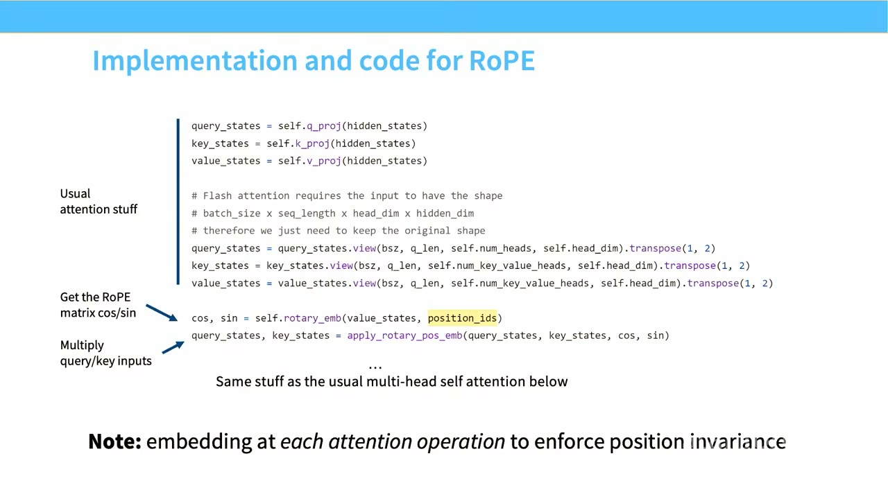

## 问答：RoPE、并行层与读论文
学生问：有没有高维旋转的论文？更高维旋转从没成功过？好问题，我想没有。高维旋转，任何二维旋转在这个空间里都只是变体。你也可以用任何闭合环的流形，但我没见过。

*[39:36](https://www.youtube.com/watch?v=lVynu4bo1rY&t=2376)*

学生问：怎么推荐蒸馏这种知识？怎么形成这种理解？好问题。我不知道除了广泛看足够多、找到模式之外的办法，这正是我在这节课里做的。另一个是小规模自己试，形成直觉和理论。读单篇论文很难，尤其现在，没有单篇论文给出语言模型所有细节。

*[40:17](https://www.youtube.com/watch?v=lVynu4bo1rY&t=2417)*

学生问并行层和串行层的准确率差异。混合。PaLM 原始论文很自信，说没有性能下降，还有 15% 系统利用率提升。只看那个你会觉得一样好。但后来很多 Google 模型不再用，这可以看作隐含信号，可能有损失。而且没人做过并行 vs 串行的受控、漂亮消融，所以精确数字难说。

*[41:25](https://www.youtube.com/watch?v=lVynu4bo1rY&t=2485)*

学生问 Eagle 和 RoPE 的区别？我不确定指什么。差别其实是旋转哪些坐标。很多坐标不旋转，因为低频部分转得不多，空间紧张时可以丢掉。这主要是 tiny models 的优化，隐藏维度少、activation 空间不够时。

*[42:02](https://www.youtube.com/watch?v=lVynu4bo1rY&t=2522)*

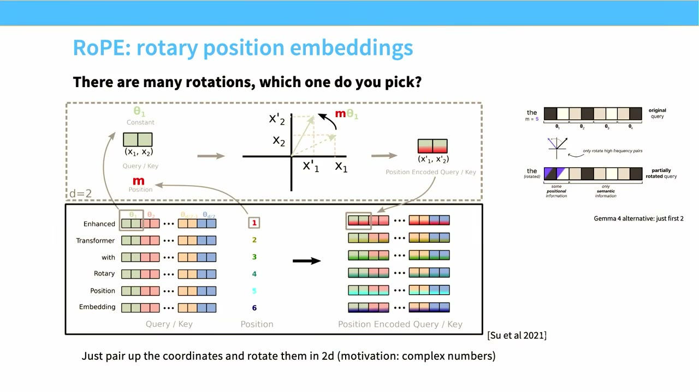

学生问相对 embedding 没有内积，是因为只应用于 keys 吗？他们 keys 和 values 都应用，所以产生相对效果。关键是不想要 cross terms。正弦余弦 embedding 不仅有原始向量，还有位置 embedding 和词 embedding 之间的交叉项，能反推出绝对位置。所以正弦余弦也不是纯相对位置 embedding。你必须接受前提：你想要相对 embedding；接受后自然会走到 RoPE 解。

*[42:57](https://www.youtube.com/watch?v=lVynu4bo1rY&t=2577)*

学生问那这个的问题是什么？它不能分解成内积。这更多是美学问题。如果你的约束是必须相对，并且必须分解为 f(xi) 和 f(yj)，那这类解里没有它。公平地说，很多 embedding 以注入 attention 矩阵的方式工作，比如 Alibi，效果也不错。只是它不是主流。

*[43:37](https://www.youtube.com/watch?v=lVynu4bo1rY&t=2617)*

## 超参数：FFN 比例、头维度与 aspect ratio
现在讲超参数。超参数是你真正要训练模型时才会关心的东西。抽象理解语言模型时不用管；一旦要实例化，你就会问：feed forward 多大？多少头？vocab 多大？weight decay 或 dropout 多少？需要正则化吗？有很多 token，还需要正则化吗？要深模型还是宽模型？没有知识时，这是很大的高维搜索空间，很吓人。但人们尝试的空间其实很小，也许可以想更聪明的搜索方式。

*[44:36](https://www.youtube.com/watch?v=lVynu4bo1rY&t=2676)*

一个共识超参数是 FFN size 和 model dimension 的比例。这是 MLP 第一个矩阵输出维度和模型维度之比，控制 MLP 的丰富度。应该是多少？不知道为什么，它可能是 hidden dimension 的四倍。这个经验法则非常有效，我会给你数据。也有例外，有趣的是极端例外后来退回去了。

*[45:18](https://www.youtube.com/watch?v=lVynu4bo1rY&t=2718)*

例外一是 gated linear unit 变体。GLU 参数更多；要同样参数，就要把 MLP 缩放 2/3，所以大多数 GLU 变体约 2.67。大家在 2.67 到 2.5 之间，这是约 2/3 修正。LLaMA 2 的人说他们用 MQA，attention head 很高效，所以可以把这个比例乘任意 1.33，得到约 3.5。LLaMA 人任意选了稍不同的比例，稍微强调 MLP。看论文，GLU 要么约 2.6，要么 3.5；非 GLU 是 4。

*[46:41](https://www.youtube.com/watch?v=lVynu4bo1rY&t=2801)*

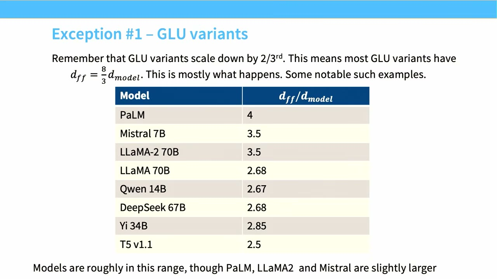

另一个例外很有趣：读技术报告，大多数人在架构上很无聊，“我们做了 LLaMA 但改了一件事”。Google 有时很大胆，T5 是我最喜欢的，因为设置很大胆。他们不用 4x，而用 64x 倍率，远大于四。他们有系统论证：矩阵乘法越大，硬件效率越高。所以把倍率做大，矩阵乘法可能更高效利用。Gemma 2 也试过更高。T5 的 64 是惊人例外，没别的模型这么高。

*[47:48](https://www.youtube.com/watch?v=lVynu4bo1rY&t=2868)*

经验上，有更受控的比较。Kaplan 2020 经典神经 scaling laws 论文里，虽然重点不是这个，但有一个 panel 扫 FFN 比例看 loss，很小模型上。他们发现，从约 1 到约 10 是一个盆地，这个超参数很好、很平，相对最优 loss 损失很小。如果搞得很错，比如超过 10 到 100，loss 开始二次上升。所以 2.6 到 4 都落在不错的盆地，选这些数字没问题。

*[49:03](https://www.youtube.com/watch?v=lVynu4bo1rY&t=2943)*

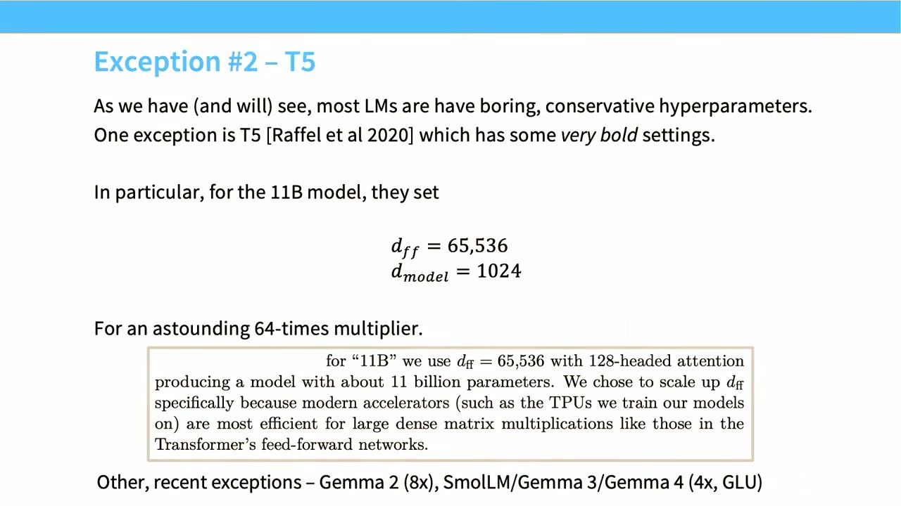

能学到什么？默认选择对几乎所有现代语言模型都有效，可以安全选。T5 原版也是好模型，所以激进选择技术上也能用，但可能计算不高效。最好笑的是 T5 后续 T5 1.1 改进版回到标准 2.5 倍率。没有明说，但显然更新 T5 时他们想回到更标准倍率。

*[49:45](https://www.youtube.com/watch?v=lVynu4bo1rY&t=2985)*

另一个共识超参数是 head dimension。多头 attention 里，经典做法是让每个 head 的维度满足：head 数 H 乘以 head 维度等于模型维度 D，即 head 维度 D/H。单头 Transformer 的维度一样。当然不必如此，可以任意改比例，但大多数模型遵循，效果很好。看各种经典和新模型，比例大约 1，T5 和 Lambda 是例外，但大家基本在 1 附近。这也是一个宽容的超参数，消融显示 1 附近有宽盆地。

*[51:20](https://www.youtube.com/watch?v=lVynu4bo1rY&t=3080)*

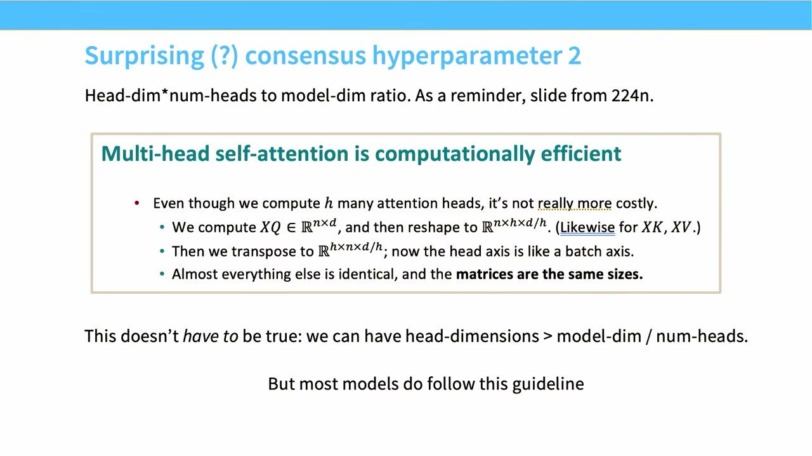

更关键、概念上更有意思的是 aspect ratio。放大或缩小模型时，通常固定 aspect ratio，即宽度与深度之比，然后整体放大。所以 aspect ratio 控制整个 depth-to-width 权衡。你可能问模型该多深。如果你关注推理等，可能觉得需要很深或很浅，确实变化比其他超参数大，但有明显 sweet spot。大多数现代模型 ratio 约 100，即 D_model 除以层数约 100，每层约 100 宽度。GPT-3、LLaMA 都如此。考虑部分是表达力与硬件的权衡。

*[53:40](https://www.youtube.com/watch?v=lVynu4bo1rY&t=3220)*

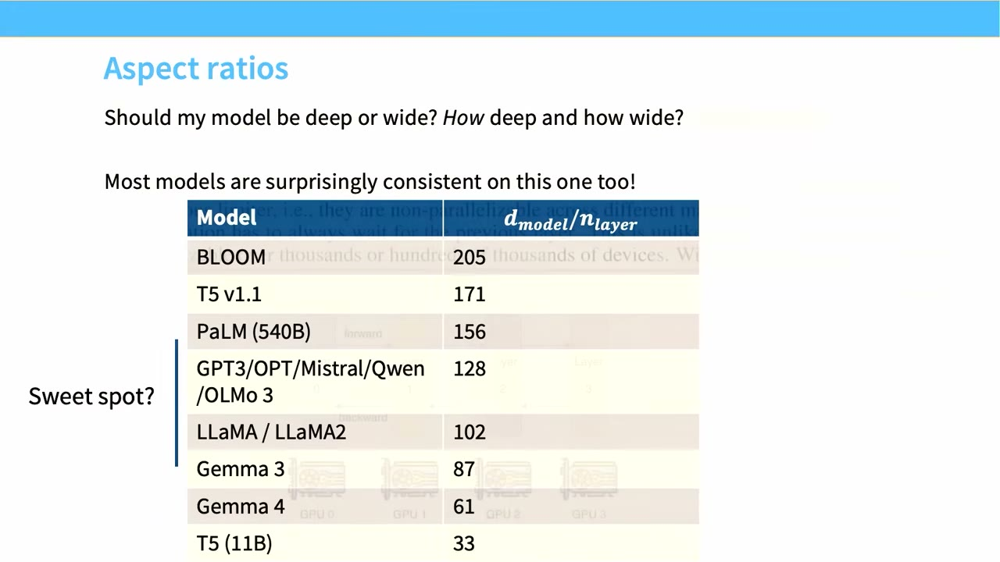

极深的模型系统上很烦。深模型怎么并行？可能要切层。切层后并行化有严重问题，pipeline parallel 大多数人不想碰。宽度容易并行，宽模型可以很容易切到 GPU 上，叫 tensor parallel，简单得多。所以系统原因偏宽，表达力原因偏深，最后落在约 100。Transformer 超参数很多看起来重要但宽容，人们已收敛到大致最优。

*[53:52](https://www.youtube.com/watch?v=lVynu4bo1rY&t=3232)*

Kaplan 等人的图扫不同大小模型的超参数，不论模型大小，最优 aspect ratio 相似，约 100，按计算方式可能略低，但接近 100 是安全赌注。还有研究者（转录里称 ETA and others）做架构变体实验，结论看上面 panel：depth-to-width 权衡很多，但扫下来真正重要的几乎只是 FLOPs。FLOPs 增加模型变好，控制大部分效应，不一定是 aspect ratio。所以出现的共识是：有一片宽容的超参数带，主要担心系统利用率，而不是难以推理的表达力。

*[55:08](https://www.youtube.com/watch?v=lVynu4bo1rY&t=3308)*

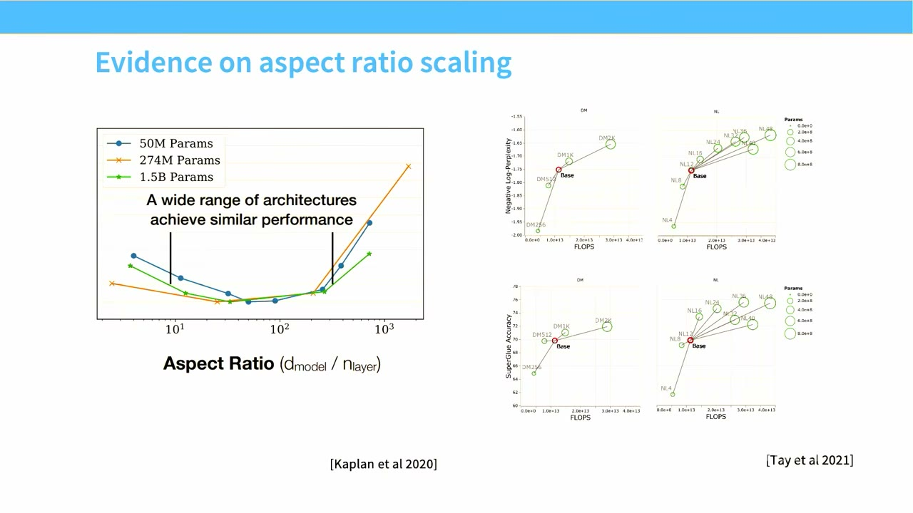

## 词表大小与 bits per byte
最后一个超参数是词表大小。有趣的是两类模型差别明显。早期开源模型训练很多是单语模型，只追求英语好，词表小，约 30,000。LLaMA 之后，很多人关注多语或生产系统，包括闭源 GPT-4，词表大得多，约 100,000 到 200,000。Google 模型词表更多。LLaMA 衍生约 100,000，单语模型约 30,000。多语模型确实需要更大词表覆盖空间。右边模型也更大。Scaling law 研究表明模型越大能处理越大词表，部分由现代 scaling 趋势驱动。现在没人训练大的单语模型了。

*[56:35](https://www.youtube.com/watch?v=lVynu4bo1rY&t=3395)*

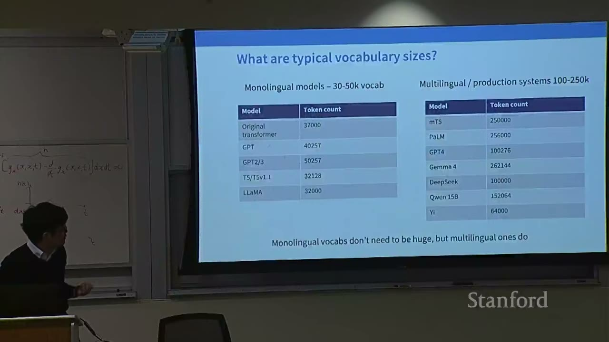

学生问多模态。取决于 token 编码方式。如果 tokenize 图像等，需要更多 token。开源发布里通常有单独的图像 tokenizer，有自己的大词表。

*[57:11](https://www.youtube.com/watch?v=lVynu4bo1rY&t=3431)*

学生问比较不同 tokenizer 的 bits per byte 是否有效？好问题。先回到正确心态：语言建模是生成建模任务，建模序列概率。只要序列固定、没改动，并给出所有字符串的概率，比较总是有效。问任意两个 tokenizer 的 bits per byte 是否有效，有两件事：第一，你有没有动序列？过去 subword 之前 tokenizer 会丢 token 或词，那比较无效；现代 tokenizer 完整，能建模任何序列，所以不是问题。第二，是否用长度归一化？bits per byte 总是用同样字节数归一化，所以总是有效比较。

*[58:34](https://www.youtube.com/watch?v=lVynu4bo1rY&t=3514)*

学生追问 perplexity 和 bits per byte 是否一回事？perplexity 和 BPD 是对偶的，是的。学生又问不同 split？我没太理解，之后聊。

*[59:17](https://www.youtube.com/watch?v=lVynu4bo1rY&t=3557)*

## 正则化与权重衰减：不是你以为的那样
我们讲到语言建模非常底层的细节，暴露了很多有趣想法。Dropout 和正则化是另一类有趣想法，也和机器学习 101 直觉相反。标准正则化论证：语言建模有很多数据，通常数据比能处理的多，可能除了 Google，互联网数据比 flops 多。所以大概率不会看同一数据两次，只对语料做单遍。有很好理由相信单遍 SGD 或其他优化器不会怎么记住数据。所以计算受限语言建模中过拟合几乎从来不是问题。有些人甚至只看训练 loss，因为他们相信单遍 SGD 不会过拟合。

*[60:35](https://www.youtube.com/watch?v=lVynu4bo1rY&t=3635)*

那么该用 dropout 或 weight decay 吗？近期模型很多根本不谈这些，技术报告不愿暴露这么底层。但看实际，很多模型两个都用。weight decay 尤其流行，即使是现代高性能语言模型。这很令人惊讶。dropout 可能失宠，但 weight decay 仍然流行。为什么？这是深度学习难、架构讲座奇怪又难的原因之一：这些因素以奇怪方式相互作用。

*[61:37](https://www.youtube.com/watch?v=lVynu4bo1rY&t=3697)*

有论文论证并展示证据：weight decay 有时不是正则化器，它与优化器交互，让优化更好。看单遍 SGD 语言模型训练在不同 weight decay 下的训练和验证 loss，没有区别，weight decay 没让验证 loss 更好，本来就没过拟合，在 x=y 线上。它不控制过拟合。但看 weight decay 结合 learning rate decay：更强 weight decay 的蓝色虚线运行显著更好，它们开始慢，但后来收敛到更好的最小值。学习率衰减时一般如此，恒定学习率时不一定，这可能更接近你的直觉。

*[62:49](https://www.youtube.com/watch?v=lVynu4bo1rY&t=3769)*

所以很难先验推理这些选择的行为。Percy 和我设计这门课让你们动手，因为你可能发现 weight decay 其实是优化干预，不是正则化干预。记住这种意外效应会在这些设置里出现。

*[63:24](https://www.youtube.com/watch?v=lVynu4bo1rY&t=3804)*

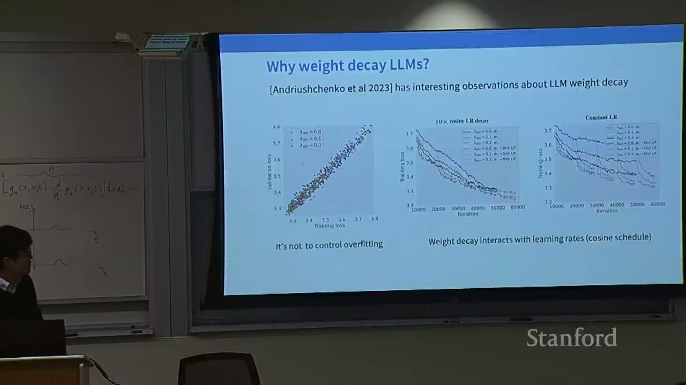

总结超参数：很多看似麻烦的超参数其实有标准选择：四倍法则；保持 head dim 和 head 数与模型维度一致；aspect ratio 约 100；正则化可以试几种，因为它和优化器交互反直觉。有些人仍做正则化，尽管不需要。

*[64:04](https://www.youtube.com/watch?v=lVynu4bo1rY&t=3844)*

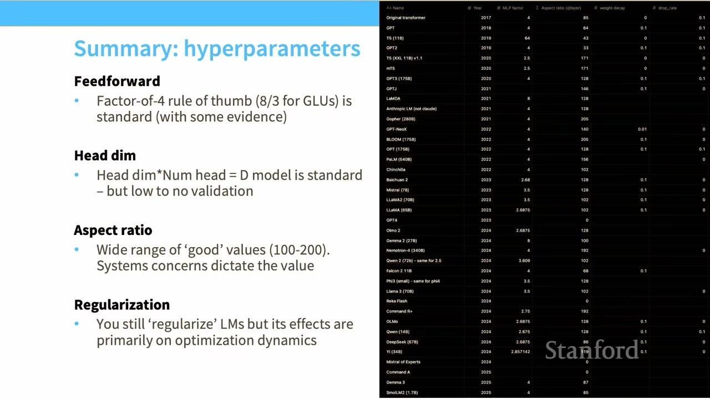

学生问扩散模型是否有显著不同？我没足够研究。训练大扩散模型的人不多。很多已训练模型是改造的，架构其实和 LLaMA-like 一样。如果问从头训练的最优架构，我一时不知道。

*[64:39](https://www.youtube.com/watch?v=lVynu4bo1rY&t=3879)*

学生问为什么正则化有时有效？不是说正则化一般影响优化。Dropout 现在没人做，因为它和优化交互不好。但 weight decay 是向零收缩，可能允许更高学习率或更快衰减。所有这些项以很多方式相互关联。

*[65:01](https://www.youtube.com/watch?v=lVynu4bo1rY&t=3901)*

## 稳定性：softmax、Z loss、QK norm 与 logit soft capping
我讲了很多如何通过看其他模型设计表达力强的模型。现在强调：过去几年重点不只是性能，还有稳定性。模型训练越来越贵，稳定性越来越重要。很多选择很宽容，大家做法类似，改这些不会有大性能差异。但如果训练中途模型炸掉，出现可怕尖峰，可能模型质量很差或不可恢复，花了几百万美元却无法继续训练。那很糟糕。我们不想要蓝色曲线那样到处都是尖峰、梯度范数很大。

*[66:13](https://www.youtube.com/watch?v=lVynu4bo1rY&t=3973)*

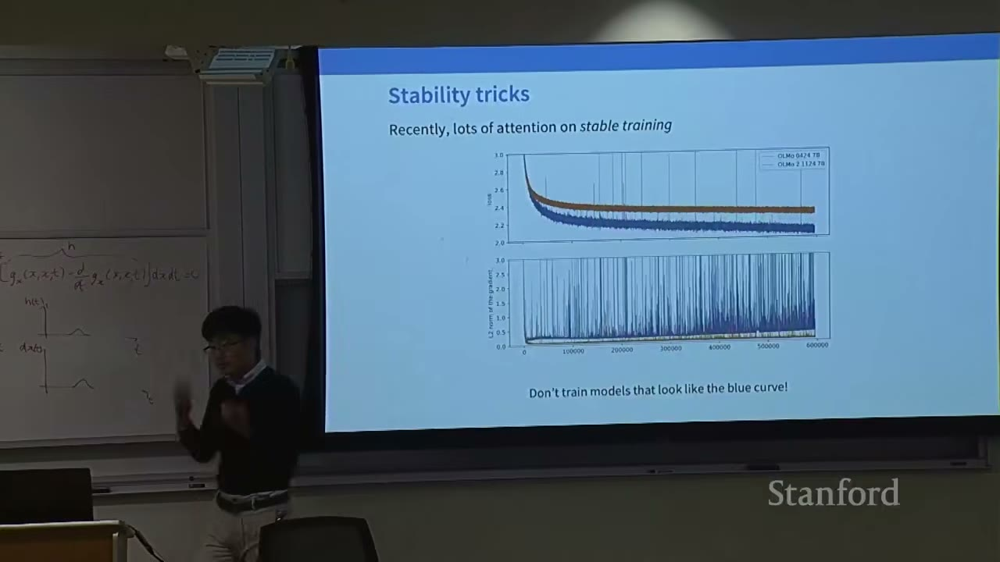

怎么修稳定性？这是核心问题。语言模型或神经网络有稳定性问题，通常几个嫌疑对象。一个是 softmax，它有两件对稳定性很糟的事：指数，容易爆；除以两个数，也很危险。语言模型里有两个 softmax：输出概率分布时一个，attention 归一化时一个。两者都是危险区，尤其 attention。

*[67:10](https://www.youtube.com/watch?v=lVynu4bo1rY&t=4030)*

先看输出 softmax。它能爆掉。可以控制 normalizer 问题。计算 log probability 来算 loss。log probability 是模型输出 U 减去 log normalizer log Z。U 很好，因为它是模型输出、残差流加总。如果 U 好，第一项 log P 就好。第二项 log Z 可能不好。Z 很大或很小，即使模型输出还好，也可能爆。Z 是指数，可能快速爆；如果为零，也会爆。两个方向都很糟。理想 Z 接近 1，log Z 接近 0。

*[68:13](https://www.youtube.com/watch?v=lVynu4bo1rY&t=4093)*

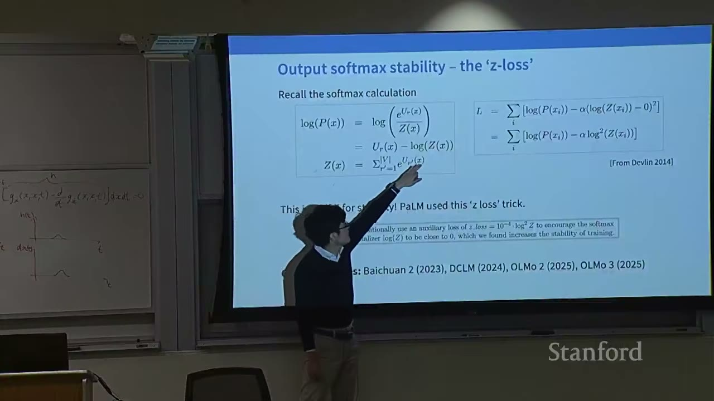

能做什么？softmax 是过参数化的。加常数到 U 可以操纵 Z 而不影响 softmax 输出，normalizer 和输出会抵消。因为这个性质，可以加正则项。这是 Jacob Devlin 2014 论文，加 log Z 的平方项，惩罚 log Z 远离零。log Z 接近零，整个表达式数值稳定。这叫 Z loss trick。很多论文用过。Devlin 等人 2014 首创，后来通过开源模型流行。Baichuan 我记得是第一个用的开源模型，然后 DCLM、Almo 等用它稳定输出 softmax。意外地有效。

*[69:27](https://www.youtube.com/watch?v=lVynu4bo1rY&t=4167)*

处理完输出 softmax，转向 attention，这是很多退化发生的地方。很多技术控制 attention 不稳定。高层说：如果有不稳定，能往里扔 layer norm 就可能控制。这是 QK norm 的设计哲学。标准 attention：pre-layer norm 后乘 QKV 得 Q、K，矩阵乘、softmax、乘 V 得加权平均，再输出。如果在 Q 和 K 相乘前加 layer norm，那么矩阵乘的输入、softmax 的输入尺度大致相同，永远约 1，因为 RMS norm 除了 Q、K 的大小。

*[70:59](https://www.youtube.com/watch?v=lVynu4bo1rY&t=4259)*

这样保持 softmax 稳定。很多模型这么做。最初来自多模态，做多模态的人发现 QK norm，Chameleon 修复并证明，然后其他开源语言模型发现同样技巧可用于稳定语言模型 attention。现在非常标准。QK norm 是大多数大模型的标准干预。很多训练显示不影响性能，但确实防止 attention 退化。我看到的是：一开始 pre-norm 有 layer norm，现在每个 block 非线性后加，现在又加到 Q 和 K 上。这就是这个领域的稳定技巧。

*[72:04](https://www.youtube.com/watch?v=lVynu4bo1rY&t=4324)*

最后一组稳定干预是 logit soft capping，不太流行，更像 Google 特有技巧。QK norm 控制 softmax 输入，希望输出表现良好。如果真想强制输出表现良好，可以拿 logits，直接进入 softmax 的东西，封顶，不能太大或太小。这是硬约束。叫 soft cap，但 tanh 有界。Gemma 模型用，Gemma 2、3、4 都用 logit soft cap。他们把 attention 层所有 logits 取出来，soft cap 到某个值。

*[73:07](https://www.youtube.com/watch?v=lVynu4bo1rY&t=4387)*

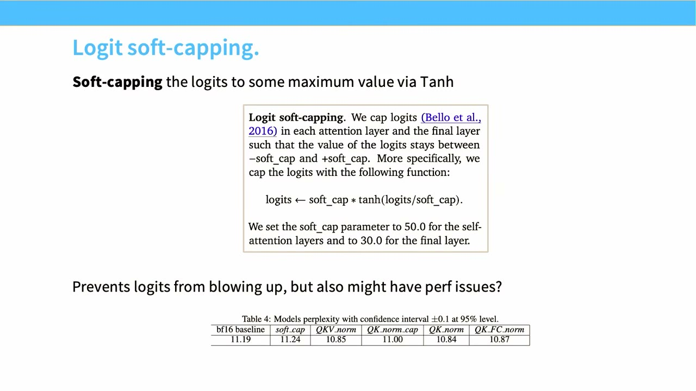

Nvidia 一些人系统比较稳定干预。从 baseline 模型可以做各种干预。QK norm 在这里，稍好，因为可以调高一点学习率。单独 soft capping 反而损失性能，有质量退化。这是很强的干预，你永远无法在 softmax 里表达超过一定点的非常自信信号。有负面影响，但非常安全地稳定 attention 输出，或说 softmax 输入 logits。

*[73:52](https://www.youtube.com/watch?v=lVynu4bo1rY&t=4432)*

## 注意力干预：MQA、GQA 与滑动窗口
今天最后讲 attention head 的各种干预。我只讲 dense、all-by-all attention。如果你对状态空间模型或线性时间 attention 感兴趣，今天不合适。今天要讲实际常用的：group query attention，通过减少 head 数节省推理成本；sparse 或 sliding window attention，最初来自 GPT-3 系列，现在被大多数做长上下文的模型采纳，除非用 SSM 等 exotic 东西。

*[75:01](https://www.youtube.com/watch?v=lVynu4bo1rY&t=4501)*

先讲 GQA/MQA。先搭建需求。训练和建模之后，考虑部署：训练大模型，服务很多用户，要付服务成本。抽象上付两种资源：flops 计算，和内存访问。内存访问也影响延迟、利用率。两者都要小。训练或 prefill 时，给定 prompt，总算术操作约 batch size × sequence length × hidden dim²，还做二次 attention 有 D²。总内存访问：batch × sequence × hidden + softmax 的 N² + 投影的 D²。算术强度不错，约 1/K，K 是 head dim；还有 1/BN，序列要够长或 batch 要够大。只要两者成立，GPU 充分利用。

*[76:56](https://www.youtube.com/watch?v=lVynu4bo1rY&t=4616)*

训练完服务用户，生成 token 发给他们。自回归生成不能并行：生成一个 token，基于它生成下一个，一个个重复。这是自回归语言模型的诅咒。高效做法是维护过去所有 keys 和 queries，叫 KV cache，然后算新内容时复用过去子矩阵，只算新的 query-key 交互填满矩阵。每个算过的子矩阵保留，只算新的。这节省计算。

*[78:02](https://www.youtube.com/watch?v=lVynu4bo1rY&t=4682)*

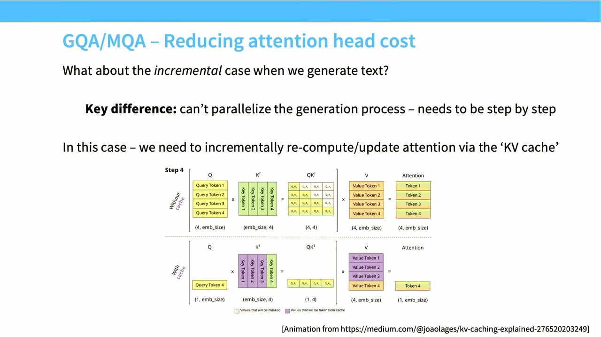

但算术强度变得不好。KV cache 方法一直读参数和 memory。每一步读参数、做点积，每步都做。总算术操作一样，还是乘同样矩阵，只是增量做。但内存访问模式变成 batch × sequence² × hidden + sequence × hidden²。第二项不好，以前只是 D²，现在是 N × D²。算术强度是两者之比，现在是 N/D + 1/B。所以需要大 batch + 短序列，或非常大的模型维度。要高效服务小模型就不好。N/D 项，序列长度除以隐藏维度，在增量计算下很难降低。

*[79:32](https://www.youtube.com/watch?v=lVynu4bo1rY&t=4772)*

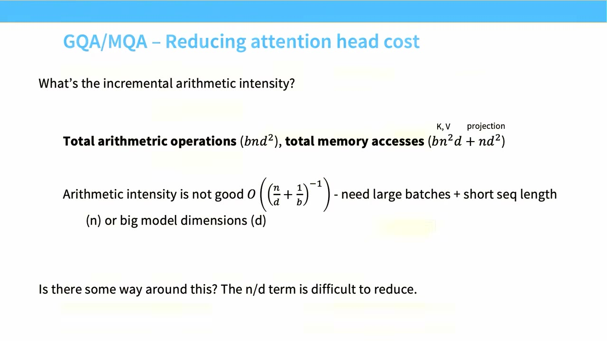

这引出 MQA，multi-query attention。通常多头 attention 有不同 key、value、query。但可以所有 head 共享 keys 和 values，只有 queries 不同。这样 KV cache 显著变小，所有 head 共享，显著减少内存访问，算术强度那个 N/D 项现在乘 H，H 大时大幅提高算术强度。系统效率显著提升。

*[80:36](https://www.youtube.com/watch?v=lVynu4bo1rY&t=4836)*

但 MQA 右边所示，所有 query 只有一个 value 和一个 key，会损失显著表达力。系统效率和表达力有 trade-off。有没有 sweet spot 避免大幅牺牲表达力和计算？这就是 GQA，grouped query attention。原始 Transformer 多头，每个 head 有 query 和 key。multi-query 所有 head 一个 key/value。grouped query 减少 key/value 数量，但保持 query 数不变。于是有一个比例可以调：key head 或 value head 的数量，同时总 head 数可以大得多。这样简单控制表达力和推理效率的 trade-off。

*[81:40](https://www.youtube.com/watch?v=lVynu4bo1rY&t=4900)*

DeepSeek-V2 还有 multi-head latent attention，下次简要提，不同分解结构、不同 trade-off。GQA 好在实践 trade-off 很有利。多头 attention 性能最好但成本很高；MQA 成本低但性能低很多；把模型变小达到性能目标也性能差。GQA 兼顾两者：推理成本低，性能几乎和完整多头一样。GQA 组结构：稍微减少 head 数就能拿到大部分收益，保留大部分表达力，同时显著改善推理。Percy 之后会讲推理机制。今天模型几乎都采用 GQA，因为推理成本关键，表达力损失不大。

*[83:14](https://www.youtube.com/watch?v=lVynu4bo1rY&t=4994)*

学生问：有这么多超参数经验法则，你还在多大程度搜索超参数 vs 利用经验法则？混合。每次训练都有关于什么可变的论点。报告里超参数通常不大动，但架构变化一次改一个。很少全改。Google 是少数真正大胆的组织。Gemma 系列做了有趣的事。最近 Gemma 4 每一层有单独 embedding，控制内存和 flops 的取舍。

*[84:16](https://www.youtube.com/watch?v=lVynu4bo1rY&t=5056)*

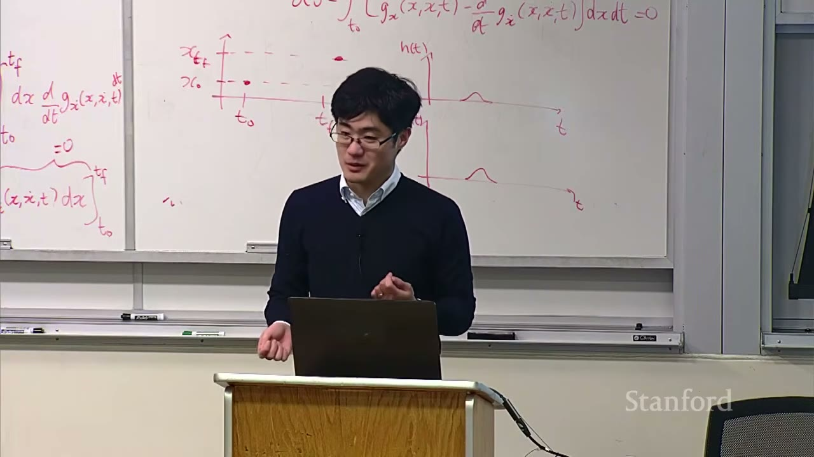

学生问训练中会实验这些参数吗？训练中，weight decay 会改，人们常和 learning rate 一起改，这是有效启发式。其他超参数我不确定是否常改，尤其架构改了训练就不兼容。所以 architecture 训练中不能改。weight decay 可能是唯一。其他通常固定。

*[84:56](https://www.youtube.com/watch?v=lVynu4bo1rY&t=5096)*

学生问 MQA 只是推理时固定吗？不是，训练时就用一定数量的 keys。训练时就用这种结构，是愉快的。

*[85:08](https://www.youtube.com/watch?v=lVynu4bo1rY&t=5108)*

## 滑动窗口注意力与混合长上下文架构
最后讲 sliding window attention，很老的想法。GPT-3 就用，论文说交替使用 full attention（每个位置 attend 所有过去）和 banded matrix 式 attention（只能看固定窗口）。OpenAI 早期也研究过不同 attention pattern。过去一年它变得非常流行。交替 full attention 和局部 attention 在长上下文性能和推理成本之间击中 sweet spot。

*[85:56](https://www.youtube.com/watch?v=lVynu4bo1rY&t=5156)*

近期开源模型复兴，我最早看到 Cohere Command A 这么做：每四层一个 full attention 看所有东西，中间三层用 sliding window attention 只看局部结构。往下走，局部信息聚合到全局。局部 attention 最后能访问更多全局信息。这样管理长上下文成本，而不用状态空间模型或更 exotic 干预。效果很好。

*[86:46](https://www.youtube.com/watch?v=lVynu4bo1rY&t=5206)*

还有创新：改变长程信息的 embedding 格式，去掉 RoPE，完全没有位置 embedding，长程几乎看 bag；短程信息仍有位置信息。人们做各种干预，涉及 embedding 和交替局部/全局结构。Attention 和长上下文成本/性能 trade-off 仍是活跃研究领域，架构工作最多。

*[87:30](https://www.youtube.com/watch?v=lVynu4bo1rY&t=5250)*

很多模型采纳这个想法。LLaMA 4、最近 Gemma 4、Olmo 3 都用 sliding window + full attention 组合，它们用 full RoPE 而不是 NoPE 作为 embedding。所以这变得非常流行。Qwen 3.5 在右边有点不同：交替一个叫 gated DeltaNet 的状态空间模型和 full attention，每四层一个 full attention。交替结构相同，但便宜层用的是状态空间模型，下次讲。这是过去一年的新主题：开源模型努力处理长上下文性能，目前方法是混合模型，不只是全局 attention，也不只是廉价 attention，而是混合。目前看效果很好。

*[88:37](https://www.youtube.com/watch?v=lVynu4bo1rY&t=5317)*

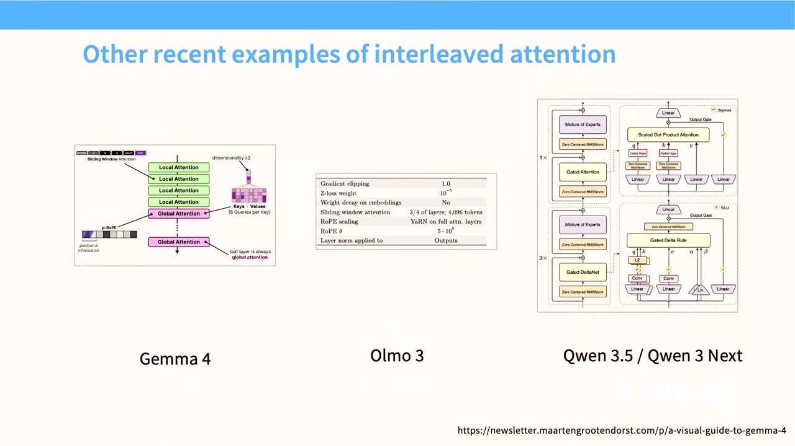

最后总结：看所有这些模型，能看到很多模式，也希望对你能做什么、什么对人们好有一般理解。我们也看到处理上下文、位置 embedding 的很多差异，甚至 tokenization 也有差异。模型之间有差异，也有共性，希望给你直觉，去做作业、玩 leaderboard。谢谢。

*[89:08](https://www.youtube.com/watch?v=lVynu4bo1rY&t=5348)*

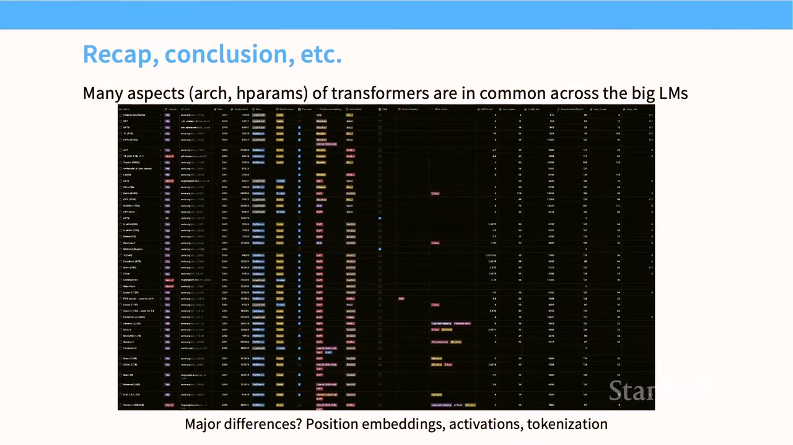
