# 注意力替代方案与专家混合：长上下文、线性注意力与 MoE
这堂课讲 Transformer 的两个高级架构方向：一是用线性注意力、混合架构和稀疏注意力降低长上下文的注意力成本；二是用 Mixture of Experts 替换 MLP，在不增加每 token 计算量的情况下增加参数量，并讨论路由、训练、系统和 DeepSeek 的设计演进。

## 课程开场：长上下文需求与注意力成本
好，我们开始。抱歉这节课的幻灯片今天早些时候还没上传，现在已经放上去了；如果你想边看边对照，可以通过课程网站获取，GitHub 上也一定有。今天我们要讲的是我认为更高级的架构想法。上一讲讲的是基础 Transformer，以及怎么调整基础 Transformer 的不同部分，得到一个现代语言模型。现在我要讲在通常 Transformer 之上更高级、更复杂的进展。今天讲两件事：第一是注意力替代方案，也就是通过架构改动走向更长的上下文，这些方法大体上让计算对序列长度呈线性依赖，而不是二次；第二是 Mixture of Experts（专家混合，MoE）的想法。第一部分修改注意力块，第二部分修改 MLP 部分。MoE 会在硬件利用率方面给我们显著更好的表现，让我们在花费的计算量相对固定的情况下拥有更多参数。这就是今天的两个部分、两个想法。

*[01:32](https://www.youtube.com/watch?v=cKSwj_qZ8Jg&t=92)*

我先从注意力开始，先把背景铺垫好。现在人们显然想要更长的上下文长度，想把很多东西塞进上下文里，让模型拥有更多知识；也许模型是一个 agent，要在很多东西上操作。如果看不同模型随时间的变化，横轴是时间，纵轴是上下文窗口大小，这里是 log 尺度，可以看到很多顶级 LLM 厂商有一个非常明显的竞赛：提供越来越大的上下文窗口，来支持这些更复杂的工作负载。右边这张图还展示了随着序列长度增加，前馈网络部分和注意力部分所花计算成本的比例。前馈网络一开始占比很大，但线性增长；注意力是不同位置之间的 all-to-all 连接，是二次的，所以随着序列长度增长，很快超过前馈网络。过去对于大模型、较短序列长度，前馈网络是主要成本；当你走向这些更长的序列长度，注意力越来越成为一个问题。

*[02:43](https://www.youtube.com/watch?v=cKSwj_qZ8Jg&t=163)*

那么控制这些成本的基本工具箱是什么？我们已经谈过其中一个，还会再谈另一个。我们可以把 local attention（局部注意力）之类的东西，用不同的混合方式组合起来，控制全局注意力的高昂成本。如果你每八层才做一次全局注意力，其他层都是非常局部的注意力，你就很好地控制了成本。另一件事是系统工程。我认为一个被严重低估的事实是，常数因子真的、真的非常重要。这门课的主题之一就是，你需要关注细节。很多受经典理论导向的计算机科学训练的人很容易说，重要的是大 O，线性还是二次。但我认为，对上下文和注意力成本来说，最大的事情之一就是 FlashAttention。等我们上系统课、做系统作业时，会更详细地讲 FlashAttention。它其实只是一种非常聪明的办法，把注意力操作重排成对系统更友好的形式，以最小化内存传输开销。这样你可以在注意力性能上得到真正巨大的提升。基础 PyTorch 是蓝色的那条，在较短的序列长度下，你可能每秒做 30 到 40 TFLOPs。然后你用 FlashAttention，它本质上是一个常数因子的系统改进，却能得到很大的提升，两倍的改进。在某些尺寸下，你甚至已经无法把注意力矩阵放进内存；但用 FlashAttention，你不再物化那些大的注意力矩阵，就能继续跑，虽然可能慢一些。它不解决任何二次成本问题，但常数因子非常强大。

*[04:48](https://www.youtube.com/watch?v=cKSwj_qZ8Jg&t=288)*

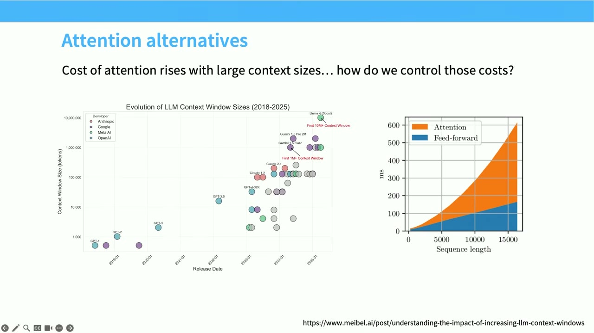

不过，如果我们要到 500 万、1000 万 token，这些技巧可能还不够。我们希望在处理长上下文的能力上获得更激进、更大的收益。所以问题就是：有没有办法让我们对序列长度有线性时间或线性依赖？这些东西会是什么样子？

*[05:08](https://www.youtube.com/watch?v=cKSwj_qZ8Jg&t=308)*

事实证明，过去很多年里很多人试过很多不同东西，也有一些错误的开始。但最近几年，我想说大约最近两年，出现了一套相当有效的线性时间注意力配方，并且已经在规模上经过实战检验。这也是为什么今年是我第一次讲线性时间注意力，因为现在已经清楚，这些东西在规模上、在生产中确实能工作。要真正解释这些有效方法，我认为你一开始只需要理解一个核心想法，然后我们再展开、在此基础上构建。这个核心想法就是乘法的结合律。

*[06:03](https://www.youtube.com/watch?v=cKSwj_qZ8Jg&t=363)*

## 线性注意力的核心：乘法结合律与 RNN 对偶
我们来想注意力怎么工作。可以用紧凑记号写成 Q、K、V 的注意力操作，矩阵维度在上面。我把 Q 和 K 拿来，让它们做 all-to-all 交互；n 个位置之间通过矩阵乘法彼此交互。然后用 softmax 按行归一化，再乘以 values V，得到注意力输出。这就是经典的 self-attention 或其他注意力操作。

*[06:38](https://www.youtube.com/watch?v=cKSwj_qZ8Jg&t=398)*

现在，先暂时忘掉注意力里的 softmax，把这个行归一化丢掉。如果没有行归一化，也许我们真的可以改变这个操作的复杂度。注意力本来是 n 平方 d_k，因为我们做 QK^T 这个乘法。但如果 rho 是恒等映射，我就可以把括号挪一挪，说：与其做 QK^T 再乘 V，不如先做 K^T V，再乘 Q。这样一重排，我们就改变了哪一部分是二次的。原来有 n 平方，这些 n 非常糟糕，因为它们是上下文长度，是几百万。现在我改成依赖 n d_v d_k。也就是说，现在乘的是 key 和 value 的维度。原则上这些也可能很大，我可以有一个大模型，但它们通常是几千、几万这个量级；没有人隐藏维度有一百万个坐标。所以相比原来的 n 平方项，这是一个有利得多的依赖项。这是你首先应该知道的事情：乘法的结合律允许我们改变对序列长度的依赖。

*[07:53](https://www.youtube.com/watch?v=cKSwj_qZ8Jg&t=473)*

现在还有一件事。如果考虑这个重排 Q K^T V，更漂亮的一点是——我认为这也引出了我接下来几页要提到的大量研究——在 self-attention 的情况下，右边这个矩阵乘法看起来就像 RNN。与其写成上面这种稠密形式，我可以增量地写：当我从左到右扫过上下文，我可以乘我的 K 和 V，更新这个状态 S，把它加到前一个状态上。这就是增量地相乘并累加 K 和 V。然后我再乘 Q 得到输出。上面这个稠密操作和这个 RNN 形式是等价的。所以我们做了什么？从左上角的线性注意力出发，最后得到了一个非常像 RNN 的东西。RNN 好在哪？RNN 在推理时很好，因为我有状态 S，它大小固定，我把它一步步往前带。RNN 对推理很好，对训练不好。线性注意力的好处是你可以两种方式都用：稠密形式适合训练，是并行的；串行形式像 RNN，适合推理。所以你得到两全其美。至少从这些对象的依赖关系看，这很好。但不幸的是，它是线性的，这并不很好。这真正是我们讨论的起点。到这里有问题吗？这其实是基础。

*[09:50](https://www.youtube.com/watch?v=cKSwj_qZ8Jg&t=590)*

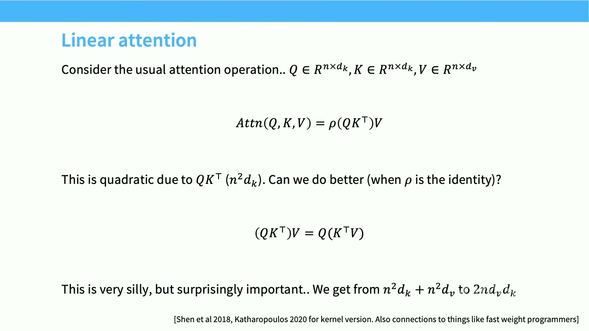

## 从线性注意力到 Mamba-2、Gated Delta Net 与混合架构
一个很酷的事情是，已经有人把这种线性注意力用进他们的注意力机制里。比如 MiniMax M1，一个相当大规模、性能很高的中国开源模型，用了 7 比 1 的混合：七个线性注意力层加一个完整的 softmax 注意力层。性能总体很强，可以和 OpenAI 的 O3、DeepSeek-R1 这类强模型比较，相当有竞争力。而且因为它是线性注意力，大部分对上下文长度的依赖是线性的；不是完全线性，因为还有那些 softmax，但依赖要温和得多。所以这是一个例子，说明即使是非常简单、容易理解的基础线性注意力，只要有些完整的二次连接，也能在规模上相当有效地使用。

*[10:59](https://www.youtube.com/watch?v=cKSwj_qZ8Jg&t=659)*

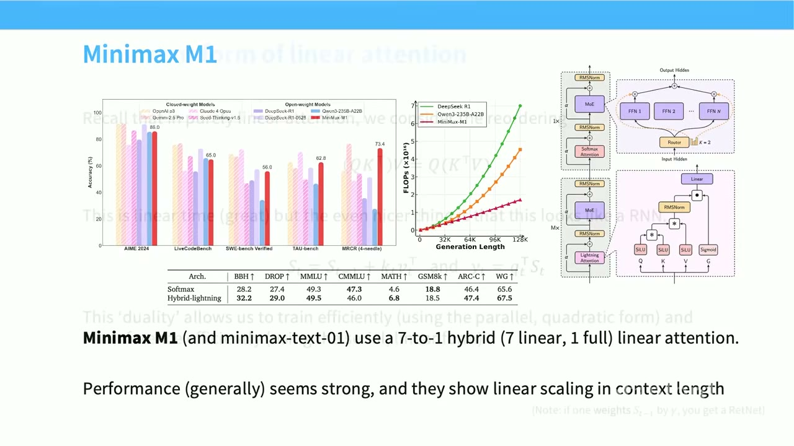

不过，到目前为止，还没有人真正在规模上证明完全线性时间的注意力机制。我接下来几页要讲的每一个东西都是混合的。

*[11:11](https://www.youtube.com/watch?v=cKSwj_qZ8Jg&t=671)*

你可能会说，线性注意力太天真、太简单，我想要更严肃、更复杂的神经网络东西发生。那么现在你可以做的事是——抱歉，我翻得太远了，看看线性注意力的 RNN 形式。我把线性注意力方程放在这里，免得来回翻。我们可以在线性注意力上做一个小扩展，得到更有表现力的更新。这样你就得到 Mamba-2。有些人可能听过 Mamba、Mamba-2，现在还有 Mamba-3。这是 Albert Gu、Tri Dao 和朋友们做的一族状态空间模型（state space models）。它们最初来自状态空间理论的观点。但如果你看实际机制，其实可以把它看作对线性注意力机制的一个非常简单扩展。想法是这样：我们从线性注意力出发。你可能会说，线性注意力的主要问题是我总是把状态往前传。我们从 LSTM 的旧时代知道，什么时候把信息往前传、什么时候不往前传、什么时候遗忘并清零，是很重要的。所以受此启发，我加一个门 gamma_t。Gamma_t 不是状态相关的，它只依赖当前输入 x_t。Gamma_t 调制我要把多少状态带到未来。你想想，状态相关的项都是这些 S；gamma 完全不是状态相关的，所以这非常容易计算。而且仍然有对偶性：Mamba-2 项既可以作为一个大的稠密矩阵乘法来算，也可以在推理时用循环形式，获得推理改进。所以这就是这个想法的核心：你可以像线性注意力一样并行用，也可以按序列用。

*[13:17](https://www.youtube.com/watch?v=cKSwj_qZ8Jg&t=797)*

人们现在已经在规模上用了它。比如 Nemotron-3，我上一讲简单提过，它把 Mamba-2 作为轻量层，然后时不时加上大的 softmax 注意力。他们用不同方式交替这些层，来管理推理成本和表达能力的权衡。Nemotron-3 相比 Qwen3 thinking、GPT OSS 等取得了相当好的性能；而且因为有这些 Mamba-2 层，在相当大的上下文长度下也有很好的吞吐。所以你能看到它是有效的。至少这些是小规模前沿模型，不是真正的大前沿模型，但是开源的、小型前沿模型。

*[14:15](https://www.youtube.com/watch?v=cKSwj_qZ8Jg&t=855)*

我们已经在这个门控想法上构建了，很酷。但你可能会说，我们能不能继续推进这个想法，把循环变得越来越复杂？这里的经验法则是：只要你在 RNN 里得到的各项只依赖输入，不依赖状态，那么你仍然会有这种很好的对偶性——并行操作用于训练，串行操作用于推理。Gated delta net 可能是现在使用最广的状态空间模型之一。我觉得它已经在不少论文里被测试过，在 3.5 里也有很好的大规模放大。

*[15:16](https://www.youtube.com/watch?v=cKSwj_qZ8Jg&t=916)*

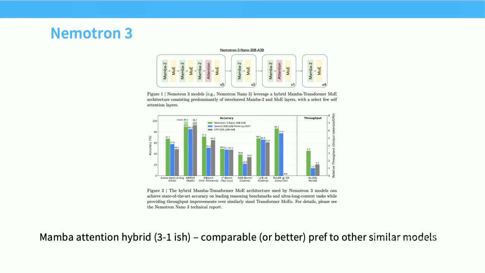

让我带你比较一下 gated delta net 和 Mamba-2。Mamba-2 就像上面这样：我们取线性循环，也就是状态更新，然后用 gamma 门控它。哦，我忘了解释这个 vt。抱歉。我为了完整性加上它。Mamba-2 还有一个修改，基本上是在 yt 更新上加一个残差层。它不是状态更新或他们论证为什么这个想法好的核心，但我为了完整性放进来，确保给出真正的 Mamba-2 更新，而不是只传达核心思想的简化版。现在你可以忽略 vt；它只是架构上的改进，不是状态更新的核心。

*[16:06](https://www.youtube.com/watch?v=cKSwj_qZ8Jg&t=966)*

Gated delta net 在某种意义上接过了这个想法，并加了第二个门 beta_t。Beta_t 做什么？我把它想成“不输入”操作的门。如果 beta_t 是 0，基本上意味着不要拿当前信息，不要把它加进我的状态。我想你们大多数人应该熟悉 LSTM。这非常像 LSTM 里的想法：你有门控制是否遗忘，是否把当前时间步的信息放进去。所以它遵循非常相似的原则，虽然当然最初推导方式很不同。

*[16:47](https://www.youtube.com/watch?v=cKSwj_qZ8Jg&t=1007)*

Gated delta net 里另一个有趣的东西，来自 delta net 而不是 gated delta net，是更新方向。你不只是门控；你也可以把它写成 1 减 beta_t。他们做的是：如果你要做一个更新，放入这个 beta，那么你要做的是试着把当前 key 方向投影出去。直觉是：我要从当前 key k_t 写入信息。做这件事时，我不只想放入新信息，我还想擦除之前已经进去的 key。这是理解更新的一种方式：不只是放东西进去，还要清掉已经进去的当前 key。所以这里有这个蓝色项，identity 减 beta_t k_t k_t^T，它本质上是一个投影器，把 k_t 维度上的东西投影出去。严格说这不完全准确，因为你没有做单位归一化之类的事情，但大致上你可以得到这个直觉。

*[17:46](https://www.youtube.com/watch?v=cKSwj_qZ8Jg&t=1066)*

我还要提一下，在我继续 beta delta net 之前，这个蓝色框里的更新、这个投影器，在各种场景里被重新发明过。如果你去解某些元学习最小二乘问题，这个更新、这个投影器就会出现。它在 fast weight programming 或 test time training 里以其他形式被重新发明；来自那些领域的研究者通过非常不同的设计原则，最后得到了完全相同的解。这里我要说的是，Qwen 3.5 和作为其前身的 Qwen Next 模型，是今天最好的开源模型之一，它们用的正是这个架构。它们用了 3 比 1 的 gated delta net 注意力混合。性能非常合理，推理特性很强，右边可以看到。随着上下文长度不断增长，Qwen Next 相对 Qwen3 有高得多的解码吞吐。中间面板比较了性能与各种闭源模型和上一代模型。这种混合架构似乎完全不怎么损害性能。

*[19:03](https://www.youtube.com/watch?v=cKSwj_qZ8Jg&t=1143)*

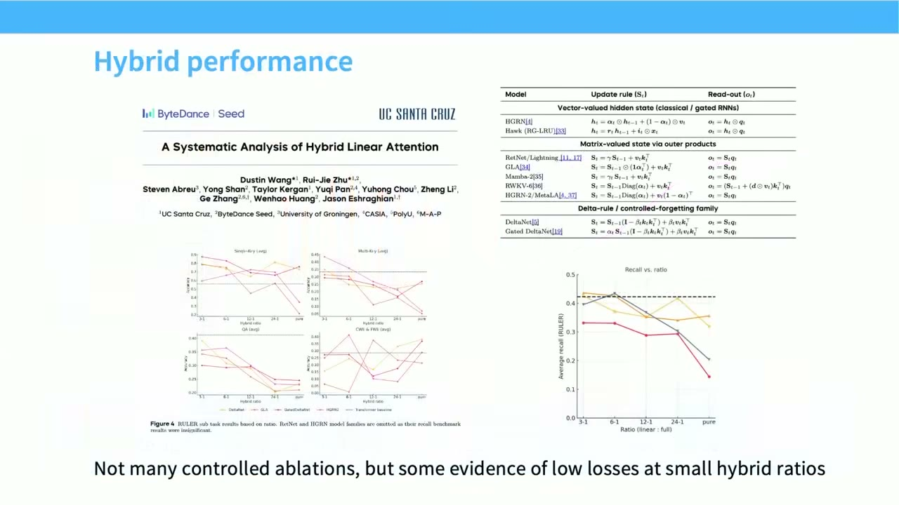

最后我要说的是，关于混合架构表现如何，还没有很多很好的受控研究。也许有一个来自 ByteDance Seed 和 UC Santa Cruz 的研究，他们比较了 Mamba-2、gated delta net 和其他架构，作为混合层数量的函数。有些结果我会说是 messy 的。但我会指出，右图这条虚线是完全注意力性能。从左到右，非完全注意力层，也就是我们叫 RNN 层的数量在增加，你会看到性能退化。但也许这里要看的是，对一些最好的架构——黄色、橙色、蓝色，这些是 gated delta net 和各种变体——在低比例时基本没有损失。一旦超过某个点，你就会看到长上下文性能更明显的退化。基本上最后，当你走向完全 RNN 时，所有这些架构都有非常明显的性能退化。在其他各种评测上也一样。单 key retrieval 是所有这些长上下文架构似乎都显式优化的任务。但如果你看 QA 性能，我们看到同样的故事：随着混合比例增加，性能相当稳定、相当清楚地下降，最终落到纯 RNN 那个点。关于线性时间注意力还有问题吗？

*[20:45](https://www.youtube.com/watch?v=cKSwj_qZ8Jg&t=1245)*

有同学问，如果并行形式和线性形式看起来数学等价，为什么性能会下降？老师说，是的；但要注意，我说的 recurrent 是指一般 RNN、任何循环形式。Gated delta net 是一种循环，它并不等于最上面这个完整 softmax 注意力。最上面这个是有行归一化 softmax 的完整注意力。第一步是有损的：我们丢掉 softmax，然后变成线性。这是所有这些方法非常、非常第一步。所以这一部分是有损的。之后，从线性形式到循环形式，这个等价才是精确的。

*[21:36](https://www.youtube.com/watch?v=cKSwj_qZ8Jg&t=1296)*

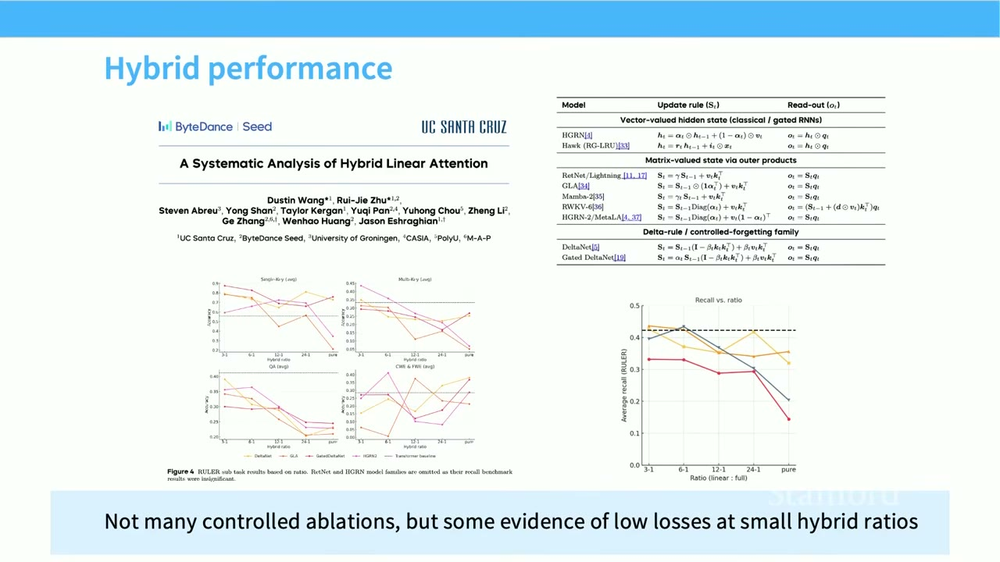

又有同学问到一个项，老师说是的，就是这一项。在线性注意力形式里，我们真正做的是拿这些 K、V，用 Q 来累加它们；在对偶形式里就是这样操作。但你可能希望输出里也保留当前时间步的一些 value。你可能觉得当前 token 的 value 对下游各种事情有用。所以这有点像残差连接，当前输入的 value 直接传到注意力输出；而 D 是另一个调制门，可以控制有多少直通。

*[22:26](https://www.youtube.com/watch?v=cKSwj_qZ8Jg&t=1346)*

好，这就是线性时间注意力。有很多非常有趣的东西。也有趣的是，很多被测试的方法最终都有这种很好、很简单的线性注意力风格的循环形式。有一些例外，但大部分最后都收敛到非常像 LSTM 的对象。

*[22:52](https://www.youtube.com/watch?v=cKSwj_qZ8Jg&t=1372)*

## 稀疏注意力：DSA 与 TopK 索引
还有另一种替代方案。我刚才讲的是线性注意力，它有很好的复杂度理论味道。我想谈另一个注意力优化，我之前没讲，但它属于这类重要的高效注意力。DeepSeek 在 DeepSeek 3.2 里用了 DSA，也就是 DeepSeek Sparse Attention。他们做的不是在所有 token 上计算注意力，而是先有一个轻量索引器（lightweight indexer）选出一批 token。你看着很长的上下文，索引器从中选出一个子集，比完整序列小得多；然后你在这个更小的子集上做完整注意力。前向传播的机制其实相当简单：你有正常的 Q 和 K，然后把它们送进索引器。索引器取 q、k 内积，过一个 ReLU，然后有从前面的 token 导出的权重，这给你每个位置的激活。然后你过一个 top k，把一些最高位置纳入注意力计算。接着你像平常一样做注意力计算，产生 key value。好处是它非常、非常稀疏。如果索引器很轻量，那么底部这个做完整注意力的项，就可以在一个很小的子集上完成。

*[24:43](https://www.youtube.com/watch?v=cKSwj_qZ8Jg&t=1483)*

DSA 和 GLM 都表明，你实际上不需要用这个来训练模型，因为用这个索引器训练可能很麻烦、很复杂。你只要训练一个正常 Transformer。当你做长上下文扩展时，再插入这个 lightning indexer，然后在一个独立于预训练的扩展阶段训练模型处理这个索引器。所以做这件事的计算成本本身也相当轻。我想强调，在 DeepSeek v3.2 提出 DSA 时，这个模型相当好。v3.2 匹配了当时其他前沿模型，比如 Claude 4.5 Sonnet 或 Gemini 3。他们还给出了一个很好的图：prefill（处理输入）和解码（生成）的扩展性都远比上一代没有用稀疏注意力的 DeepSeek 模型好。这很合理：如果你只注意一个很小的子集，做注意力的成本就会大幅降低。另一个正交验证是去年出的 GLM5。我认为 GLM5 是现有最好的开源模型之一，非常强。它也采用了 DSA 方法。他们在论文里有相当不错的消融，比较 DSA 加某种 warm up、只做 DSA、完全不做 DSA。主要展示的是，如果做完整 DSA 训练，相对完整注意力性能损失不大，即使在长上下文检索任务上也是如此，而这些任务对 RNN 风格架构来说相当难。所以这是另一种降低注意力成本的视角。

*[26:42](https://www.youtube.com/watch?v=cKSwj_qZ8Jg&t=1602)*

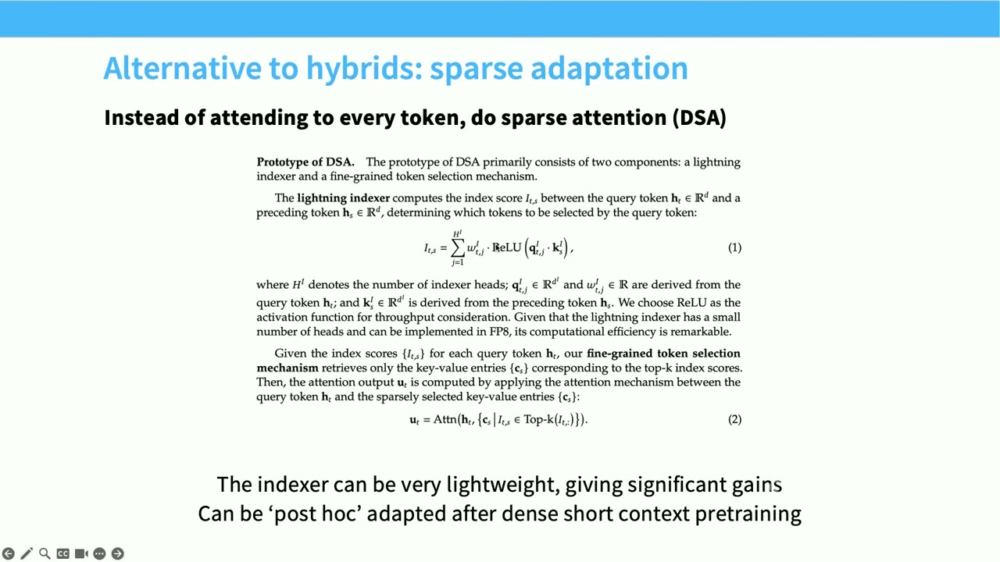

注意，回到上一页，这不是线性时间。索引器仍然要在 full all-to-all 注意力上操作，因为你有这些 q k 内积，成本不是线性的。但你可以让索引器便宜得多，比如让它更低维，或让 w 很小。所有这些都可以让成本更便宜。所以这是完全另一种视角，效果很好。我不会多讲这个。但事实证明，top k 选择这个想法会变成下一部分讲座的核心。在进入 MoE 之前，关于高效注意力还有问题吗？

*[27:24](https://www.youtube.com/watch?v=cKSwj_qZ8Jg&t=1644)*

有同学问索引器的时间复杂度是不是 n 平方？老师说是的。要知道该选什么，它必须看所有东西。这里没有巧妙的状态转移，真的是暴力内积。所以如果你遍历所有内容，后面那一步也是二次的。那怎么得到时间节省？老师说，这几乎是一个系统技巧。你把索引器做得轻量得多，有很多办法：可以用低得多的精度，他们谈到了；可以更低维，通过把 q 和 k 进一步投影，只用于索引。所以有很多技巧，但索引器会轻量得多，常数因子非常好。然后第二个步骤虽然是二次的，但它是在更短的上下文长度上二次，因为它是 top k，我们可以控制 k。所以现在这个昂贵的部分很小。这也是另一件事：有时候不要太纠结二次还是不二次。有时候常数因子真的、真的重要。

*[28:38](https://www.youtube.com/watch?v=cKSwj_qZ8Jg&t=1718)*

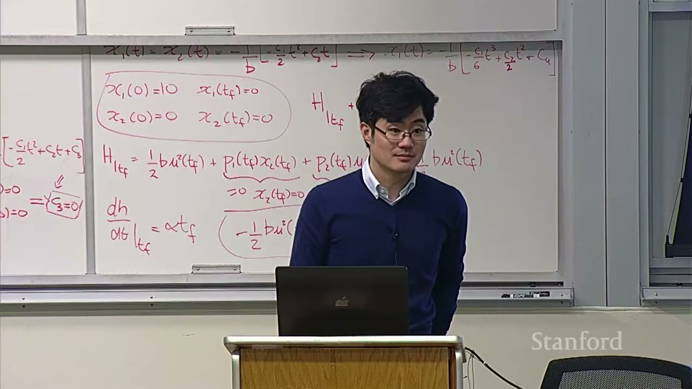

有同学问，这是不是也属于 post-training 之后的步骤？老师说，这更像是 continued pretraining 风格的东西。因为所有模型由于计算和其他原因，不会从头训练长上下文；你先训练一个较短上下文的模型，然后有长上下文扩展阶段。这里的好想法是：反正我们都要做第二阶段，为什么不把长上下文成本节省也装到同一个阶段？令人惊讶的是，它真的能工作。老实说，你可以把这样一个看起来很吓人的、TopK 的不可微对象装上去。但你会在下一部分看到，也许你不该那么害怕 TopK 选择。常规配方通常是短上下文预训练、长上下文扩展，然后 post-training。这里的 k 会选得接近短上下文性能，并且会被限制边界，不管输入多大都有界。

*[29:55](https://www.youtube.com/watch?v=cKSwj_qZ8Jg&t=1795)*

有同学问，去掉 softmax 会不会导致训练不稳定？老师说，这是个好问题。我不这么认为。我不知道有文献记录说去掉 softmax 会导致很多训练不稳定。如果有的话，softmax 通常才是各种问题的来源。所以我认为这实际上会改善架构的稳定性。

*[30:19](https://www.youtube.com/watch?v=cKSwj_qZ8Jg&t=1819)*

有同学问，能不能预测未来的注意力机制，考虑到低计算成本和低延迟的需求，高层看会有什么特征？老师说，我不知道我能不能对未来的注意力架构做出好的预测。我有点回避的回答是，很多会看起来像我们把所有技巧都扔进去。就像架构因为把所有成功配方都扔进去而变得非常复杂一样，我认为还会有一个更广、更高层的层面：用 post-training 让模型管理自己的上下文。压缩、检索，这些东西基本上都是加在上面的一层。我想很多工作会是这些不同层面的整合，因为至少线性时间注意力已经大量收敛到 LSTM 式或线性注意力式架构。我在近期不觉得这会变太多。

*[31:41](https://www.youtube.com/watch?v=cKSwj_qZ8Jg&t=1901)*

最后一个问题，能不能谈谈低精度注意力？FP4 注意力可能吗？老师说，我认为索引器部分就是被这类东西启发的。FP4 注意力肯定可能。我认为缺点是，对于 softmax 这类东西，精度损失会很重要，小的下溢、上溢之类的问题有时会相当麻烦。所以这个动机——用低精度做选择，然后再做全精度计算，因为这样 value 向量可以更精细地相加和加权——是有道理的。我不知道有没有很好的办法用 FP4 甚至更低精度做完整注意力。

*[32:32](https://www.youtube.com/watch?v=cKSwj_qZ8Jg&t=1952)*

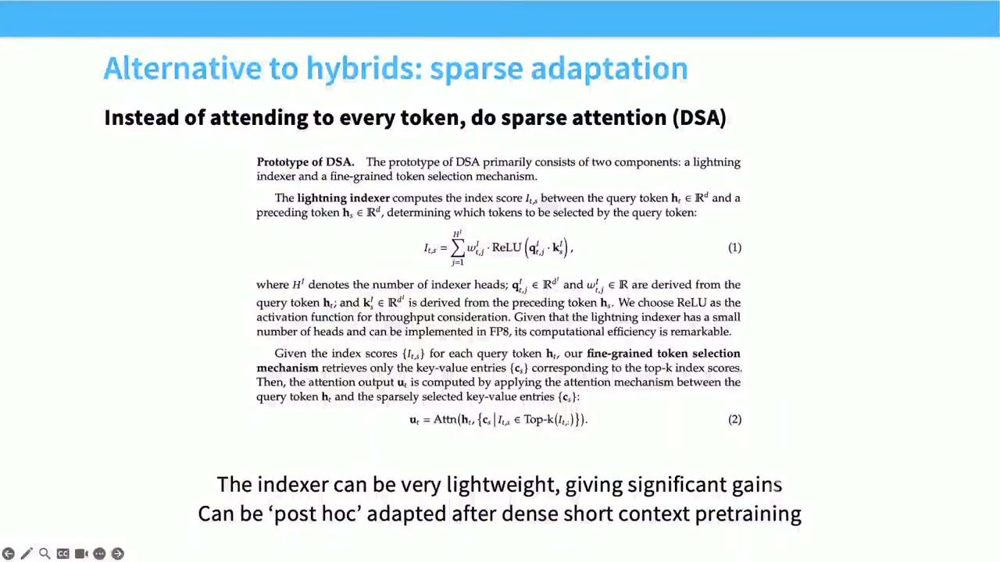

有同学问，和 Transformer、状态空间模型相比，训练更复杂的状态空间模型的缺点是什么？老师说，好问题。肯定有缺点，否则所有人都会用。缺点我认为是表达能力。softmax 注意力里的 all-to-all 连接非常强大，也很容易训练。和比如 LSTM 相比，注意力过去有一个很强优势：硬件效率，可以并行训练。我认为状态空间模型之所以流行起来，尽管和 LSTM 很像、在表示能力上有类似缺点，是因为现在有了我讲过的线性注意力带来的、被很好理解的对偶性：可以从 RNN 形式走到更稠密的矩阵乘法形式，而矩阵乘法形式允许计算效率。所以这个权衡现在被解决了。但你仍然有另一个权衡：如果你有有限状态，必须把所有东西都塞进去、带着走，相对于直接携带所有东西，你会损失信息。在状态空间里，你必须考虑上下文长度相对于状态大小的关系。如果你状态和上下文一样大，那就没问题，但你要付非常大的成本。所以关键是，没有免费午餐；如果你想要非常小的状态，就很难把大上下文里的所有信息压缩进去。也许某天可能没有权衡，但到目前为止，权衡就出现在这里。

*[34:43](https://www.youtube.com/watch?v=cKSwj_qZ8Jg&t=2083)*

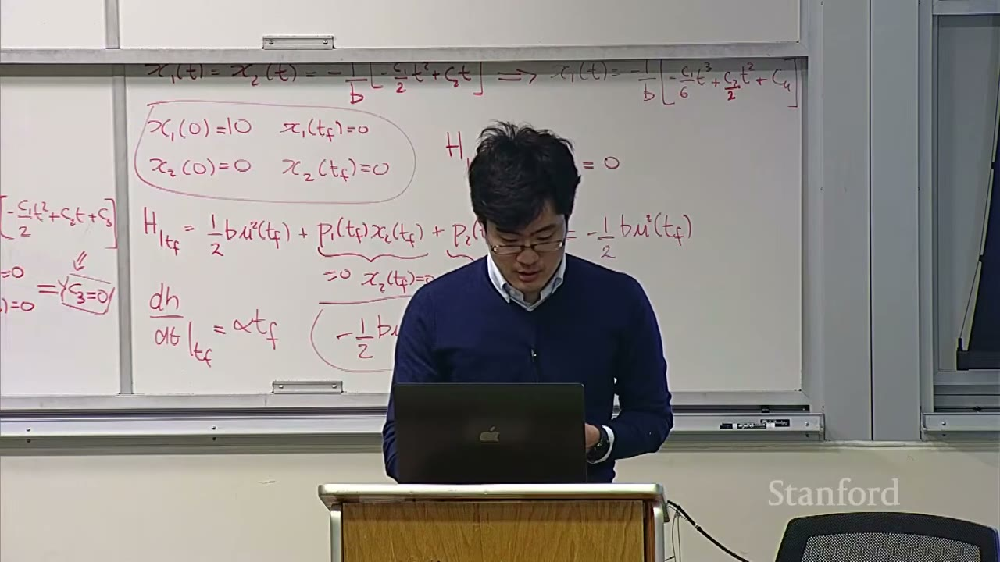

## 什么是 Mixture of Experts
好，现在我要讲 Mixture of Experts。我认为 MoE 值得讲。概念上，它们并没有真正改变游戏。理解 MoE 的一种方式是，它们只是一个更高效的 MLP。你拿出 MLP，然后不知怎么有人给你一个更高效的 MLP。这就是 MoE。但我认为你需要理解 MoE，有两个原因：一是现在每个人都在做 MoE、发布 MoE，如果你要深入理解语言模型如何工作，就应该知道它是什么；另一个原因是 MoE 实际上有一些非常有趣的机械组件。如果你看 MoE 怎么构建、用了哪些原语，你很快会在很多地方看到类似 MoE 的原语，然后你会意识到，哇，我可以用神经网络做更有趣的事情。所以 MoE 有趣、值得学，还有更广泛的原因。

*[35:26](https://www.youtube.com/watch?v=cKSwj_qZ8Jg&t=2126)*

什么是 MoE？MoE 在某些方面非常简单，它们就是替换你的 MLP。左边是 Transformer 里通常的 MLP：你有注意力，有某种归一化，然后后面有一个前馈网络。大量稠密、大的信息处理发生在这里。现在我可以做的替代方案是，假设我拿这个大的 FFN，把它切成更小的 FFN。现在我有四个前馈网络。实际上，假设我不把它们切成更小的，而是让它们和原来的 FFN 一样大。然后通过某种魔法，我有一个系统告诉我每个输入该选哪个 FFN。现在我有 4 倍参数，至少对 FFN 来说有四份 FFN 参数；但在任何前向或反向传播中，我只付一个 FFN 的成本。这很好。所以从某种意义上，MoE 最初的动机，如果你读原始论文，有一个非常参数中心的观点：如果你只是想要更多参数，因为你相信更多参数是好的；好，如果我们想要更多参数，又不想付更多参数的成本，你就需要右边这个东西。所以这是你应该有的 MoE 心智模型：在不受 FLOPS 影响的情况下增加参数量。

*[36:50](https://www.youtube.com/watch?v=cKSwj_qZ8Jg&t=2210)*

那它们为什么这么流行？现在从 Hugging Face 之类的平台拿到的模型，超过一定大小后，每个似乎都是 MoE。原因是，看起来不管为什么，如果你保持总计算量不变，只是增加稀疏参数的数量，模型总体上会变得更好。所以这可能是支持“更多参数通常就是好”的证据，即使一次只有一部分参数是激活的。我会在本讲中大量引用一些早期的 Google 论文。这一篇是 Fedus 等人在 2022 年的，我记得这是 Switch Transformer 那篇。他们展示了，当你增加专家数量时——激活参数保持不变，专家数量增加——语言建模的测试损失一直在下降、下降、下降。如果你只关心前向传播的 FLOPS，这太棒了。右边你看到类似的事情：随着训练计算量在 x 轴增加，如果在相同训练计算量下有更多专家，你就能得到更好的性能。所以对训练和推理来说，MoE 都给你免费的胜利。这非常美妙，非常棒。

*[38:18](https://www.youtube.com/watch?v=cKSwj_qZ8Jg&t=2298)*

这一点已经被很多人反复看到。左边是 Fedus 论文里同一张图。去年 AIQ 的人发了 OlMoE 论文，这是他们的开源专家混合分析和训练论文。他们也看到同样的事情。如果你看训练损失、验证损失或下游 benchmark 性能，你会看到训练时这些 MoE 模型比对应的稠密模型做得好得多，大约快两倍左右。所以你能真正看到稀疏性的好处。我认为证据就在布丁里。如果你看所有发布的 MoE，它们在激活参数方面比稠密模型强得多——如果你关心推理 FLOPS，激活参数才是关键；或者甚至从训练和服务的总成本、全包成本来看也是如此。DeepSeek v2 和更早的 DeepSeekMoE 出来时，相对其他人训练的大量稠密模型，是一个很大的转变。你看到，哇，我们激活参数少得多，MoE 性能却一样好，甚至更好。MoE 这里真的发生了很好的事情。

*[39:41](https://www.youtube.com/watch?v=cKSwj_qZ8Jg&t=2381)*

最后，为什么这重要，还有一个原因：MoE 给你另一个并行化轴。我们会在三节课左右后的系统课里讲并行化。并行化实际上是 LLM 里非常重要的事情。LLM 很大，无论训练还是推理都放不进单个设备。所以你想要很多不同的切分模型的方式，来高效服务或训练。MoE 有一个额外好处：每个 FFN 里的专家天然是不同块。每个专家是一个自然块，你可以把它们放到不同设备上，然后把激活路由到不同设备。我们后面会讲 expert parallel，也就是这个。但这给了你一个额外的系统优化点，如果你想优化服务，这非常有用。

*[40:42](https://www.youtube.com/watch?v=cKSwj_qZ8Jg&t=2442)*

在西方，我认为有几个开源发布的大而强的 MoE。大模型方面有 Llama 4 和 OpenAI 的 GPT OSS。不幸的是，西方开源模型发布大体上停滞了，所以现在发布的不那么多。但至少有两个好例子，都是各自领域的顶级模型。不过我认为 MoE 研究和训练的大量动作发生在中国。Qwen、DeepSeek，还有一些别的，比如 miniCPM，做了最早训练和推广 MoE 的工作，并且继续做非常出色的 MoE 工作。如果你看一些早期 Qwen MoE 模型，这是 Qwen 1.5 MoE。他们展示，他们那个小的 27 亿激活参数模型，比当时很多 7B 模型表现更好。我认为 DeepSeek 和 Qwen 的这些早期工作说服了开源社区其他人，这是正确的方向。

*[41:54](https://www.youtube.com/watch?v=cKSwj_qZ8Jg&t=2514)*

说到 DeepSeek——有同学问，expert parallel 不是会因为专家之间通信而产生通信瓶颈吗？老师说，是的。某种意义上，你要付把激活发过去的通信成本。我不会解释所有细节，但会给你们看一个减少通信的技巧。总体来说，你在做权衡：你得到更多聚合 FLOPS，减少内存使用，作为交换要付通信。所以这非常依赖你的拓扑和其他东西，来决定是不是净收益。

*[42:33](https://www.youtube.com/watch?v=cKSwj_qZ8Jg&t=2553)*

有人问训练时的情况。老师说，这是重要部分。训练时它们也是稀疏的。这正是 MoE 难的地方。我提前剧透几页后的关键想法：如果训练时激活所有专家，会很容易，因为那样我们就能看到哪个专家适合我的输入，就能学会路由。MoE 的难处在于训练时只有一个或 k 个专家激活，所以你不知道其他专家发生了什么，只知道激活的那些。尽管如此，你还必须学会路由。所以这个问题有 RL bandit 的味道，但我们不会用 RL 或 bandit 解决，而是用启发式和深度学习魔法的力量。有人问专家切换的粒度。粒度，也就是我们路由专家的尺度，是 token 级别的。每个 token 得到一个专家。为了让你有正确的心智模型，路由器非常朴素：它们只是输入和某个东西之间的一个矩阵乘法。所以你不会做复杂的事情。你不会知道这是不是医学问题；你只是说，哦，这个 token 看起来像日语，把它路由到专家 7。还有一个问题，MoE 模型在训练或推理时并行化有没有上限？一般来说，并行化有上限，因为当你分片到更多设备上，通信成本会爆炸。如果我们把设计作业做对，你们会在作业里处理一些这样的问题：我们会要求你想出网络拓扑之类的，让分片有意义；或者反过来，给定网络拓扑，你要想出怎么分片模型。

*[44:25](https://www.youtube.com/watch?v=cKSwj_qZ8Jg&t=2665)*

说到 DeepSeek，现在它以 DeepSeek R1 等闻名。但我真正喜欢 DeepSeek 的一点是——最初这门课原本有一版就是过一遍 DeepSeek 论文，最早那一版，因为他们在 LLM 科学研究里做了很长时间非常好的架构工作。DeepSeek 是较早展示为什么 MoE 好的工作之一。他们在消融实验方面做了大量优秀工作，比如，如果我们用稠密层会怎样？如果用哈希路由会怎样？如果用 switch router 会怎样？所有这些不同设计决策，你可以在他们早期的一些 DeepSeekMoE 论文里看到。所以如果你对架构、设计等问题感兴趣，我建议你读早期 DeepSeek 论文。从这些论文里能学到很多东西。当然，进展没有停止。DeepSeek v3、v3.2 以及 GLM 等，已经构建了这些出色、非常强大的 MoE 模型。很明显，这就是这些大模型未来发展的方向，在可预见的未来。至少我想接下来几年都会是 MoE。

*[45:33](https://www.youtube.com/watch?v=cKSwj_qZ8Jg&t=2733)*

那么现在的问题是，为什么 MoE 没有更流行？在很多方面，我觉得 MoE 被接受得相当慢。你看其中一些论文，它们是 2022 年的。Google 当时在研究并真正尝试推动 MoE。但直到 2024 年之后，MoE 才真正开始流行起来，为什么？另外，如果你做各种 LLM 研究，你很可能主要使用稠密模型，那为什么不用 MoE 模型呢，如果它们这么好？我们可以节省计算。MoE 带来了很多复杂性。训练 MoE 或使用 MoE 并不容易，做很多事情也不容易。基础设施非常复杂。刚才有几个关于并行化的问题，一般来说这是对的：很难用高效利用的方式并行化专家。MoE 有很多参数，很难放进单个设备。如果你训练它们，MoE 真的可能炸掉。你会在几页后看到为什么 MoE 真的很难处理。它们不是容易操作的对象。现在有一些好的经验法则，但并不容易。

*[46:40](https://www.youtube.com/watch?v=cKSwj_qZ8Jg&t=2800)*

我会用一页简要提一下，也有人把专家混合用在 Transformer 的注意力块里。有几篇论文，但少得多。我看到的那些，相比直接替换 FFN 或 MLP 层，不太容易驯服或跑通。所以我只讲左边这个，也就是所有大模型基本都在做的：人们大多数不是在把注意力头拆成专家。

*[47:23](https://www.youtube.com/watch?v=cKSwj_qZ8Jg&t=2843)*

## MoE 的路由设计
好，以上是关于 MoE 的广泛行业概览和现状。现在我们来谈你怎么设计 MoE、怎么思考 MoE。为此我会讲三个不同的变化轴。MoE 有哪些东西可以变？你可以改路由函数。我们知道 MoE 的核心是路由器把 token 发给专家，所以可以改这个。你可以改不同专家的大小。在给定预算下，你可能有更多专家、参数更少，或者专家更少、参数更多。最后我们会讲训练，因为训练会真的很难。一旦你开始意识到 MoE 怎么工作，你就会发现，哇，训练一个把 token 路由到不同地方的东西并不容易。

*[48:15](https://www.youtube.com/watch?v=cKSwj_qZ8Jg&t=2895)*

在所有情况下，我们都不想激活所有专家。我们只想让一部分专家激活。所以我们总是会选择某个 TopK。有不同的选择方式：你可以让 token 选专家，也可以让专家选 token；每个专家挑自己喜欢的 token，或者每个 token 挑自己喜欢的专家；或者你可以有一个非常复杂的路由器，全局决定这个 token 该去这个专家，另一个 token 该去另一个专家，试图全局优化分配。基本上几乎所有 MoE 都做 token choice TopK。也就是 token 选择专家，选 k 个不同专家进入池子。你可以看到，这是 OlMoE 论文里的图，比较 token choice 和 expert choice。你会看到 token choice 得到更低的验证损失、更高的下游 benchmark 分数，相比 expert choice。也有成功的 expert choice 模型，训练也正常。但 token choice 一般更容易跑通，并且是今天所有我们看到模型的标准。我想那四个模型里可能有一个是 expert choice。但我不认为这一定是很强的信心投票。

*[49:46](https://www.youtube.com/watch?v=cKSwj_qZ8Jg&t=2986)*

我觉得路由有很多不同做法。一种做法是，你有一个小的线性投影，说：好，我拿到输入；我的路由器计算内积；每个专家有一个向量方向；内积空间里最近的那个会被选中。这是到目前为止最常见的路由器。它用在经典 Switch Transformer、GShard 里，这两个是早期 Google 论文。它还用在 Grok、Mixtral、DBRX、DeepSeek 等。你选的 k 数量取决于你看哪篇论文。但大多数情况下，你就是取内积。

*[50:36](https://www.youtube.com/watch?v=cKSwj_qZ8Jg&t=3036)*

有一件事一直让我觉得有点神秘：很多很多论文都表明，实际上你不需要做任何学习路由。你可以直接把 X 哈希，发到不同的前馈网络。实际上这也行。这带来收益，虽然没有 TopK 那么多，但不知为什么，基于哈希的专家路由也是人们会做的。论文里常见 baseline，但部署中不用，原因很多。你也可以用 RL 学路由。你可以有一个内积路由器，然后用强化学习把这个路由器当成某种策略来学习。如果你是机器学习经典学习理论导向的人，我认为这应该是思考这个问题的自然方式。你会说，我在做什么？这是一个 bandit 问题。我从 k 个里选一个，或从 n 个里选 k 个，而且我观察不到所有。这是 bandit 问题，我会用 bandit 或 RL 算法。它在一些最早的工作里被用过，因为这是自然的思考方式，比如 Bengio 2013。但它不是常见方法。我认为原因是，做 RL 的方法会引入很多开销，包括 RL 算法本身和随机性。人们发现，有一套好的启发式、这些配方，可以应用到非常简单的经典 TopK 路由方案上，让它正常工作。所以没有理由做更复杂的事。最后我提一个我觉得很酷、也很喜欢、因为我是喜欢合理东西的人：你可以解一个线性分配问题，全局计算“这个 token 去那个专家有多好”的分数，计算所有成对分配分数，然后用线性分配精确求解专家到 token 的最优分配。它被证明在某些情况下有好处，但完全没有在规模上被看到。我认为是因为它相对其他方法极其昂贵。

*[52:56](https://www.youtube.com/watch?v=cKSwj_qZ8Jg&t=3176)*

所以就像我说的，TopK 路由基本上是共识路由机制。它怎么工作？非常简单。如果你在 DSA 那页认真听了，这看起来很像 DSA。如果你读 H-Nets 或其他论文，你也会注意到。这种东西会在很多地方出现。所以这是值得识别的一种模式。你要做的是：拿输入，过一个前馈，然后计算某种分数。分数是专家和输入 u 之间的 softmax，这个 s 就是分数。然后我选这些分数里的 TopK，作为控制每个专家的 gate。所以这就是输入，这是残差项，这是 FFN，我有 gate，gate 由 TopK 控制。这就是你想象的 TopK 路由器的方程形式。你可能在这里唯一新学到的细节是，我的 gate 怎么学？gate 就是拿每个专家的权重和输入做内积。非常轻量。所以选择 gate 的方式没有什么复杂。

*[54:20](https://www.youtube.com/watch?v=cKSwj_qZ8Jg&t=3260)*

即使在这个简单东西里，DeepSeek 和朋友们也做了创新和变化。DeepSeekMoE 开创了一个现在被广泛使用的想法，叫 shared experts（共享专家）。这非常直观：经典 TopK 路由器里，你有 n 个专家，在其中选择。但有时你可能会说，有一些非常常见的处理我想应用到所有 token。也许你不想专家每次都不同，你希望一些专家总是被应用，另一些专家才条件性地应用。所以 DeepSeekMoE 做的是：他们拿原来的专家设计，把专家切成更小、更细粒度的块，其中一部分细粒度专家作为共享专家，永远打开。它们绕过路由器，总是处理输入，然后加回输出。抱歉。这是个好想法，因为事实证明，在经典专家设计里，你其实在重复使用很多权重做常见建模。所以你可以把这部分卸载到一个共享专家，让其他专家更专门化。

*[55:43](https://www.youtube.com/watch?v=cKSwj_qZ8Jg&t=3343)*

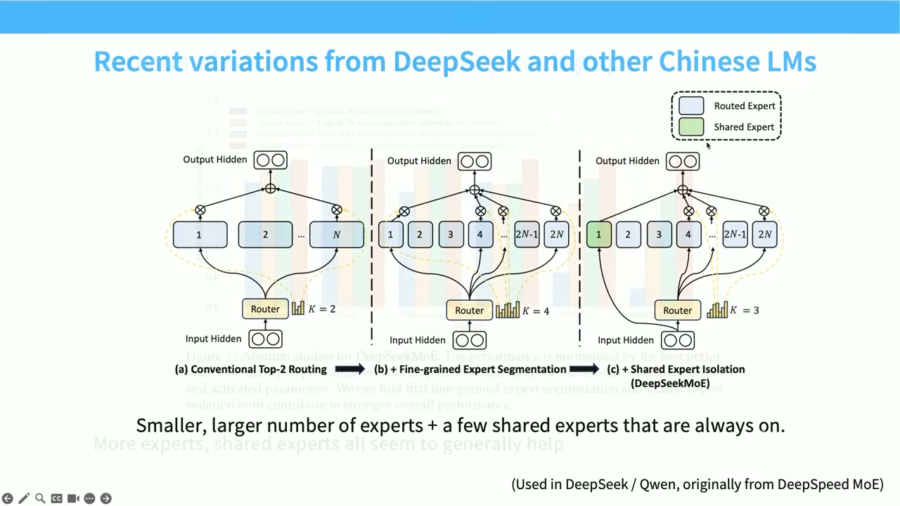

就像我说的，DeepSeek 很好，因为他们在很多论文里做仔细消融。他们有一个很好的消融：零个共享专家、大的专家、16 个路由专家，这其实是旧的 GShard Google 设计；对比非常细粒度分割的专家加一个共享专家。随着你把专家做得越来越小，并且有一个共享专家，你会从这两个干预都看到显著收益。对其中一些任务，共享专家有非常显著的提升，比如 TriviaQA、NaturalQuestions。这个蓝色到黄色的差距，就是有没有共享专家。所以更多专家、共享专家，一般似乎都有帮助。如果你想看到这些说法的更多验证，OlMoE 也显示类似结果。OlMoE 是西方仔细受控的 MoE 研究。他们做了比如共享专家有没有帮助；他们结论是共享专家帮助不大。专家数量方面，他们展示细粒度、很多专家有帮助。所以他们在共享专家这点上有些不同意，但他们也有非常好的、仔细受控的消融。很多近期 MoE 基本都遵循 DeepSeek 设计。在这之前有一些早期 MoE。前三个我一直在夸 Google 做了很多有趣事情，前三个来自 Google；Mixtral、DBRX、Grok 是西方早期 MoE 尝试。DeepSeek v1 提出细粒度和共享专家设计，然后流行起来，其他人都跟随 DeepSeek。我说过，这类似 Llama 设计成为稠密 Transformer 标准；DeepSeekMoE 和 DeepSeek v3 是人们在 MoE 方面复制的标准设计。如果你看 Qwen 3.5、GLM 或任何现代模型，你会继续看到共享专家和细粒度专家被广泛使用。所以这是经过实战检验的设计。有问题吗？

*[57:55](https://www.youtube.com/watch?v=cKSwj_qZ8Jg&t=3475)*

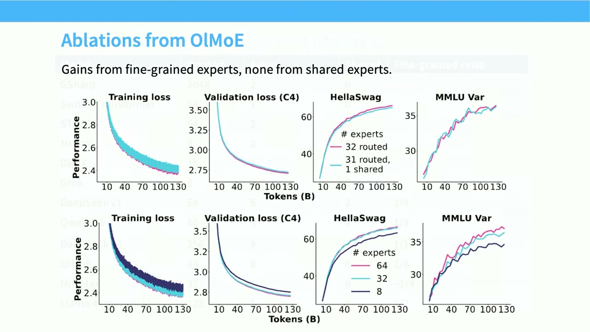

有同学问，如果有共享专家，或者有几个共享专家，并行化怎么工作？老师说，在共享专家情况下，你不会得到并行化节省。每个激活都必须经过它们。你可以复制共享专家，基本上吃掉内存节省，来降低通信成本。

*[58:26](https://www.youtube.com/watch?v=cKSwj_qZ8Jg&t=3506)*

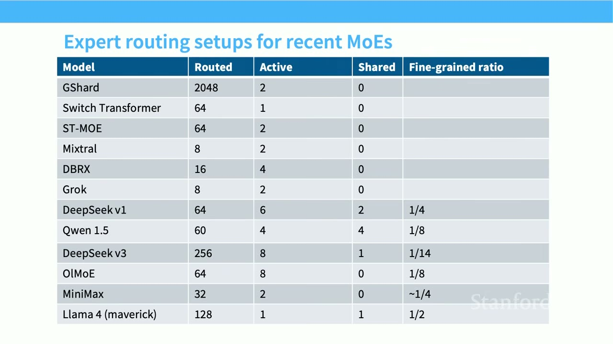

## MoE 的训练：不可微路由、负载均衡与稳定性
好，这就是路由器的设计空间。现在我想谈训练 MoE。这会进入真正令人惊讶、我会说非常深度学习的部分。我一开始学 MoE 时想，我们不可能很好或合理地训练这些东西。但事实证明，有很多技巧组合在一起，不知为什么就能工作得很好、很鲁棒。

*[58:57](https://www.youtube.com/watch?v=cKSwj_qZ8Jg&t=3537)*

就像前面问题里提到的，我们不想在训练时激活所有专家，因为如果那样，我们就要为所有专家付全额 FLOPS 成本。我们有很多专家。所以训练时为了效率需要稀疏性。但如果稀疏，门控决策就不再可微，而且我们也看不到所有本来可能选择的反事实专家。这两个都是大问题。所以有不同解决方案。我们可以用 RL 优化门控策略。我已经提过，不太流行。你可以做随机扰动之类，如果你熟悉 explore-exploit、bandit 风格的东西，可以做这些。第三种是，你可以有一大堆奇怪的启发式，来处理门控决策稀疏的事实，以平衡哪些专家去哪里。猜猜实践中人们用哪个？我一直在暗示。是第三个。它是一组非常有趣的启发式，最后能工作。

*[59:56](https://www.youtube.com/watch?v=cKSwj_qZ8Jg&t=3596)*

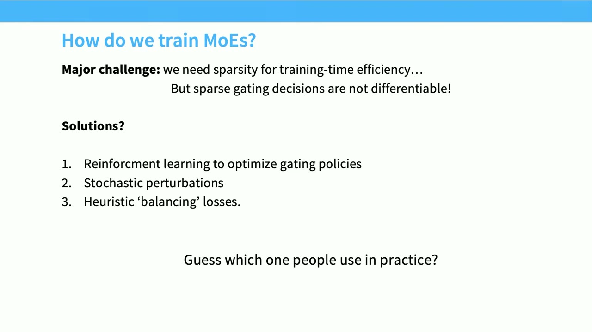

我会先讲另外两个。它们没有被广泛使用，我先把这点说清楚。但我认为知道它们有用。有些人做过研究，这是 Clark 2020，研究能不能用 RL 学路由器。它确实能工作。你可以用 RL，就是这里的绿线。那是一个 baseline 方法，效果还行。但由于梯度方差和复杂性，它并不是最优做法。甚至这篇论文里提出的一些方法，也能轻松击败用强化梯度做路由决策。

*[60:32](https://www.youtube.com/watch?v=cKSwj_qZ8Jg&t=3632)*

有一个和 RL 很接近、但更走向“写目标函数试一试”的启发式世界的想法，叫随机近似。它来自最早 MoE 论文，Noam Shazeer 等人。做法是：训练时你不真正做硬决策，而是做随机决策。你仍然有路由设置。这个 H 是你的参数和输入之间的内积，这是标准路由内积。但然后，不是直接这样，我会注入一些依赖输入尺度的噪声。这就是我的 H。然后我保留 TopK 和 softmax，就像我解释 TopK 时那样。然后这成为进入 TopK 函数的输出。你看看这是在做什么？它只是说，如果两个专家紧密并列、非常接近，那么随机地你会选一个而不选另一个。反向传播时，你会以这样的方式回传：有帮助的专家会得到高权重。所以这种扰动让你打破平局、稍微多探索。希望梯度结构是，如果一个专家有帮助，它会被更强调，总体上得到越来越高权重。所以这是你可以做的一个合理事情。它让专家更鲁棒。softmax 让你学习如何给这 k 个专家排序，而不是只做硬 TopK 选择，你用这些元素加权。

*[62:25](https://www.youtube.com/watch?v=cKSwj_qZ8Jg&t=3745)*

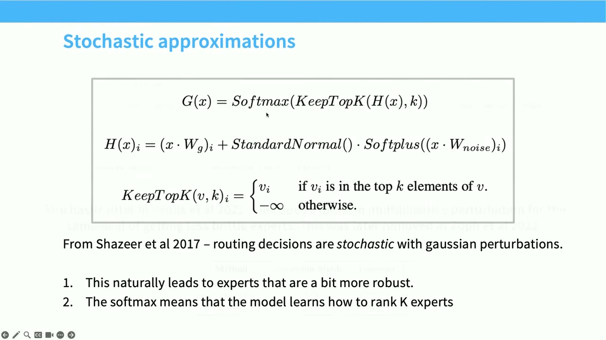

还有一个非常相关的方案，在 Fedus 等 2022 里，做的是均匀的乘性扰动。他们这么做是为了让专家更鲁棒。这是有用的事，但后来在 Google 做路由的论文里被移除了。现在并不清楚这到底是否必要。后来的消融显示，完全不做这些随机或鲁棒性技巧，实际上有助于稳定性和最终训练出的 MoE 的总体质量。所以这表明，你不一定需要这些随机探索项。

*[63:13](https://www.youtube.com/watch?v=cKSwj_qZ8Jg&t=3793)*

这把我们带到你实际会做的事：一系列启发式，最终给我们一个能工作的 MoE。其中很多本质上都和平衡有关。如果你只做普通梯度下降，忽略所有探索-利用问题，会怎样？会发生的是，你先路由 TopK 专家，然后其中最强的专家得到更多信号。反向传播会说，那个专家很好，你增加那个专家的权重，把参数往那个方向移。所以你得到富者愈富效应：被选中的专家得到很强权重，强权重意味着更常被选中，它们会跑飞，包揽一切。所以专家崩塌或专家饥饿现象是非常、非常真实的问题。某种意义上，这是你用启发式训练 MoE 时必须解决的核心问题。

*[64:12](https://www.youtube.com/watch?v=cKSwj_qZ8Jg&t=3852)*

那你做什么？你会在总建模损失上加一个启发式损失。这个损失应该平衡去不同专家的 token。一种方法，在 Switch Transformer 里，你可以看它在做什么。你有从 1 到 n 的不同专家，有一个 batch 的 token。你想让这两个内积小。这里发生了什么？F 是分派到某个专家的 token 比例。P_i 是更软版本，不只是 token 是否被分派给专家，而是路由器分配的总概率质量。你把这两项相乘。至少对我来说，这不是那种能从第一原理推导出来的东西。我认为看它在做什么的最简单方式是取这个对象的导数。如果你对它关于 P_i 求导——记住 P_i 是分配给一个专家的概率质量——导数就是分配给它的 token 比例。所以某种意义上，你可以把它看成梯度空间里的惩罚：你得到的 token 越多，得到的负梯度越大。所以这是试图按比例压低非常受欢迎专家的概率质量。这就是这个损失的作用，这就是思考方式。方程 4 本身一开始可能不清楚，但一旦你推理梯度的作用，就清楚它在做什么：压低受欢迎专家。

*[65:45](https://www.youtube.com/watch?v=cKSwj_qZ8Jg&t=3945)*

然后我们可以把这些想法拿出来，基本上重建 DeepSeek v1 和 v2 的 MoE 系统。要构建 DeepSeekMoE，你做什么？你做正常损失，直接反向传播穿过专家，忽略所有不可微和探索问题。但你会加 per expert balancing，和 Switch Transformer 一样，就是我刚展示的。你会有一个损失，乘 F（比例）和 P（总质量）。但 DeepSeek 的人非常擅长系统设计，所以他们不只平衡专家，还想按设备平衡。如果你的专家分配到一些设备上——比如这台机器有四个专家，那台机器有另外四个专家——你希望两台机器平衡，两者都全利用率运行。所以你不只想让专家均匀，还想确保设备均匀。所以这是次要目标，作用方式完全一样。你看这里的函数，不是对专家，而是对每个设备比例操作，应用次要的设备平衡损失，纯粹为了利用率。

*[67:11](https://www.youtube.com/watch?v=cKSwj_qZ8Jg&t=4031)*

在 DeepSeek v3 里，他们有一个 per expert bias 项，用在线学习技巧来平衡专家，去掉了一些辅助损失。但最终，他们还是必须加一些辅助损失，来确保极端不平衡不会发生。所以我把这个作为旁注：DeepSeek v3 和其他人开始去掉一些我认为更丑的辅助损失，但到目前为止，还没有完全摆脱它们的解决方案。

*[67:52](https://www.youtube.com/watch?v=cKSwj_qZ8Jg&t=4072)*

关于负载均衡损失，最后我要说的是，你可能会问，我必须处理这个吗？这都是一堆复杂启发式。我希望我能直接去掉负载均衡损失。但如果你去掉负载均衡损失，后果相当灾难性。这两张图都来自 OlMoE 论文，他们做了很好的消融，完全去掉负载均衡损失。如果有负载均衡损失，你得到顶部粉色线，非常正常的曲线。去掉负载均衡损失，你的验证损失显著上升，训练损失也不太好。也许更有说服力的是，如果你看哪些专家在做什么，有负载均衡和没有负载均衡，就是这些底部面板，你会看到非常、非常鲜明的差别。没有负载均衡时，几乎所有 token 都去两个专家——这里看到的黄色专家和粉色专家。而有负载均衡损失时，尽管我们有这种启发式东西，所有专家都在 token 上被使用。所以我们有很好的均匀利用。所以我们确实看到负载均衡损失做了我们期望的事。没有它，我们丢掉了一大堆参数，那些专家在大部分训练里什么都没做。

*[69:11](https://www.youtube.com/watch?v=cKSwj_qZ8Jg&t=4151)*

这就是 MoE 怎么训练。回到前面，我觉得这相当令人惊讶：你有这个不可微的东西，做 TopK 选择，老实说是个相当复杂的对象；你真正需要做的只是加这个平衡损失来让专家均匀。然后剩下的，你就把它当成可以把梯度灌进系统，模型训练得很好。我认为很大一部分原因是这个动态：如果一个专家有用，你会强化它；这是一个正反馈循环，而通过让事情均匀，它被很好地平衡掉了。这两个动态互相抵消。

*[69:50](https://www.youtube.com/watch?v=cKSwj_qZ8Jg&t=4190)*

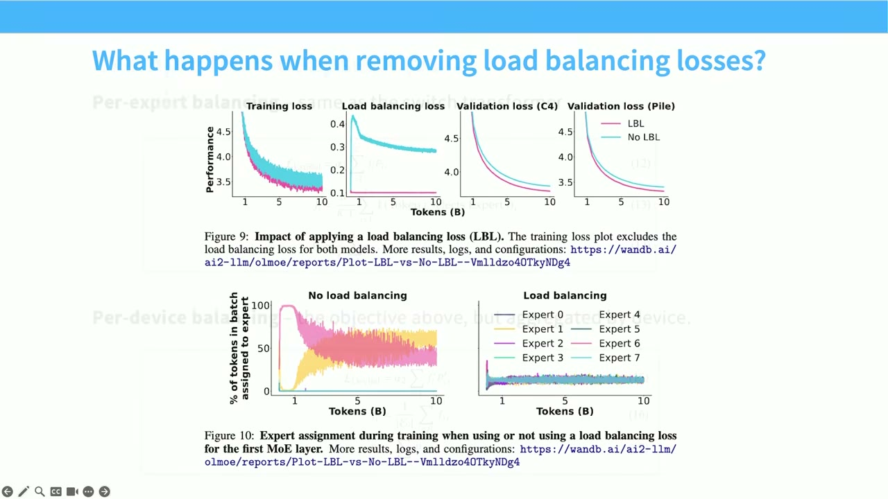

最后我要说，同样的技巧也用在 DSA 里。我们已经看到 TopK 那件事。它也用在 H-Nets 之类里，如果你熟悉那个，那是移除 tokenizer 的尝试。所以我认为未来你会更常看到这个技巧：TopK 选择，加上负载均衡或其他辅助损失，来启用这种不可微性，会成为未来架构设计的成分。

*[70:19](https://www.youtube.com/watch?v=cKSwj_qZ8Jg&t=4219)*

有同学问，MoE 像系统优化，但如果真正利用，能不能看它们？它们真的在做不同领域的事情吗？老师说，有些论文可视化哪些 token 被哪些专家激活。因为路由器非常简单，所以专家并不是智能专家。它们不是医学专家、法律专家之类的。你确实会看到某些 token 被路由到不同地方，比如标点可能被路由到一个专家，其他符号可能被路由到一个专家，非英语字符集可能被路由到另一个专家。但这不是你能看着说“哦，这是华尔街日报专家”的东西，完全不是。没有语义，也许可以这么说。

*[71:05](https://www.youtube.com/watch?v=cKSwj_qZ8Jg&t=4265)*

有同学问 per expert loss。老师说，per expert loss 原则上如果被完美执行，在专家均匀分配时也会强制 per device balancing。但至少我的解释是，你不想把 per expert loss 调得太高，达到真正完全均匀，因为那会对训练动态有害。但 per device 足够重要，所以你愿意额外加一点损失来鼓励 per device balancing。

*[71:37](https://www.youtube.com/watch?v=cKSwj_qZ8Jg&t=4297)*

## MoE 的系统实现
好，现在在收尾之前，我要讲一点系统方面。训练 MoE 会引入额外的有趣系统动态。我讲并行化时，主要讲标准的并行化形式。你可以把数据切成很多小块，把一个数据集分到很多机器上。你可以做模型并行，把模型分到不同机器上。你也可以把两者以各种方式结合。当然可以。但我觉得我们意识到，每种并行技术都有一些限制。数据并行，你的 batch size 有上限；一旦达到 batch size，就不能再按数据并行。模型大小有自然切点，你能切模型；一旦用完这些，就不能再并行。如果把它和 expert parallelism 结合，你就得到另一个额外的并行轴。当你这么做时，很多底层实现允许你利用 GPU 里已经有的稀疏矩阵乘法。

*[72:42](https://www.youtube.com/watch?v=cKSwj_qZ8Jg&t=4362)*

我还要提，如果你在一个 GPU 上有多个专家，一种想法是说，我要做多个小矩阵乘法。但这不好，因为你理想上想要更大的矩阵乘法，可以重用缓存等等。所以相反，你可以很好地利用稀疏性。块对角当然是最基本形式，但你可以用硬件原生支持的更复杂结构化稀疏，让你以非常干净、非常快的方式乘专家和输入。所以这是 MoE 好的另一个原因。如果你看 MoE 的计算模式，它们几乎对应于这类结构化矩阵乘法，硬件很容易高效支持。所以 MoE 这里发生了硬件架构协同设计。

*[73:55](https://www.youtube.com/watch?v=cKSwj_qZ8Jg&t=4435)*

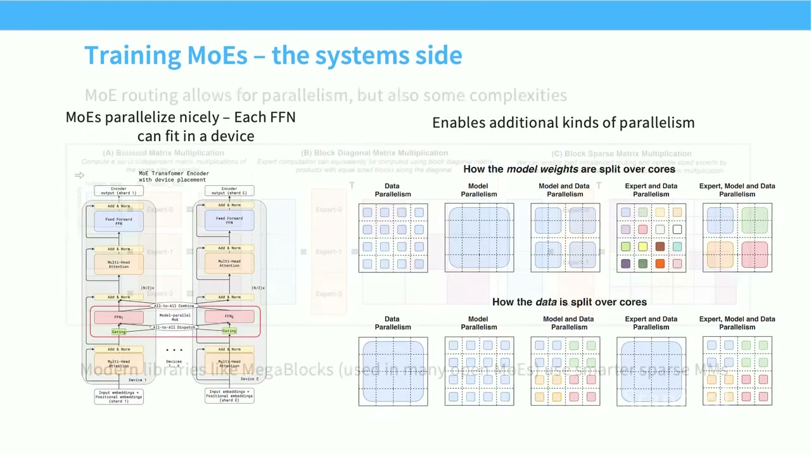

在并行化方面，我提一件事，这是非常近期的进展，来自 Nemotron-3。我忘了是谁问的这个问题。当我们做 expert parallelism 时，我们必须把激活从一个设备发到另一个设备，说，哦，你属于那个专家，我需要把你送过去。这会带来显著通信开销。人们开始思考的一件事是：我的共享专家不需要通信，可以是大维度；但我的专家需要通信这些激活，我希望它们用更小的低维向量。所以你实际上可能先把残差流降维投影，然后再决定做集合通信，把这个激活发出去。这会显著节省通信，又不用完全承担隐藏维度变小的缺点。所以你可以做这些投影技巧，很好地控制通信和 MoE 并行化的权衡。

*[75:07](https://www.youtube.com/watch?v=cKSwj_qZ8Jg&t=4507)*

最后一个 MoE 的 trivia，算是细节，我觉得很有趣，但近年已经被解决了，就是随机性。如果你朴素地做 MoE 基础设施，你会发现，除非专家在输入分布上完美平衡，否则某些专家可能比其他专家受欢迎得多。如果某个专家——比如在这个例子里专家 0 是一个非常受欢迎的专家——你实际上会开始遇到这个专家的 token 队列不断堆积、堆积。最终你会到某个点，说我的队列太长了，必须开始丢 token。早期一代 MoE 推理基础设施和代码里，很多情况下你实际上会静默地丢掉这个专家，然后继续计算，好像什么都没发生。你只是送回一个零，假装没事。这意味着你会有奇怪的随机性：如果其他用户发来的查询打到了你正在用的专家，你实际上可能得到更差的结果，因为他们把你从专家队列里挤出去了。这些非常奇怪的事情会发生。但现在，drop-less 架构已经摆脱了很多这些问题。所以这不再是真正的问题。MegaBlocks 和其他非常常见的开源 MoE 框架不再有这个问题。

*[76:35](https://www.youtube.com/watch?v=cKSwj_qZ8Jg&t=4595)*

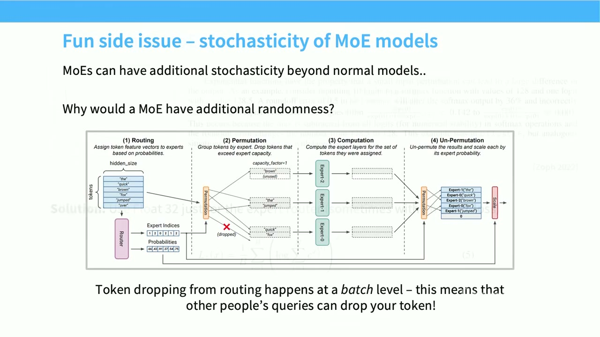

关于 MoE 设计，最后要讲的是稳定性问题。我们在上一讲架构设计时已经谈过稳定性。如果你记得我当时说的，我说指数是坏的，除法是坏的，所以 softmax 是稳定性问题的危险区。现在 MoE 做了什么？我们在路由里又引入了一个 softmax，因为我们要做 TopK，要做 softmax，然后用它路由到专家。人们早就注意到 MoE 里的 softmax 操作可能非常、非常危险。Barret Zoph 等人在 Google MoE 设计早期有一整篇论文讲 MoE 稳定性。这是他们注意到的其中一件事。我会讲一些细节。你会经常看到解决方案，用在一些更敏感、更棘手的部分。你可能最终只对专家路由器使用 Float 32。你可能还有 z-loss。我们之前谈过 z-loss，用来控制 softmax 稳定性问题。Z-loss 我认为在早期就非常流行，用来做 MoE 路由器稳定性。OlMoE，我一直在广泛讲，做了加或去掉 z-loss 的消融。从这些非常尖刺的训练损失曲线可以清楚看出，路由器上的 z-loss 相当有帮助。

*[77:58](https://www.youtube.com/watch?v=cKSwj_qZ8Jg&t=4678)*

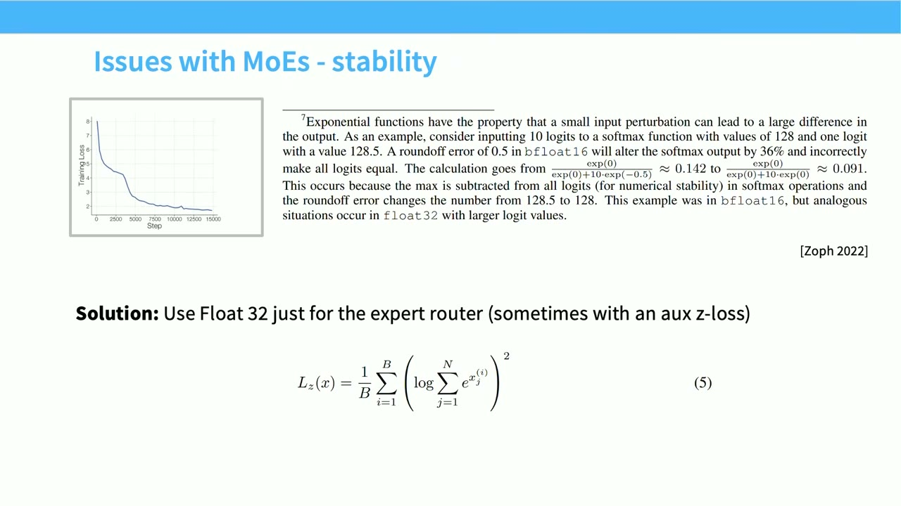

MoE 还会有其他问题。我想你们最近如果玩语言模型，可能经历过，MoE 微调起来相当烦人。它们参数太多，如果你想微调专家，实际上会非常严重地过拟合。你可以看到，稠密模型训练和验证相当接近，不会疯狂过拟合。但看稀疏模型，训练和验证的差距极大，当你微调这些模型，或者在这个例子里是下游任务。我想这是 GLUE benchmark 之一。你可以微调非 MoE 前馈层，也可以只微调注意力。这些是人们常做的干预，尤其是注意力微调，我最近在 MoE 工作里经常看到。如果你的模型有非 MoE 层，当然也可以只微调那些。常常还有人主张这么做。当然还有 bitter lesson 版本：也许你该用 140 万个例子，而不是你手头的数量。如果你有很多数据，你基本上可以在微调阶段重新训练整个 MoE，这样泛化差距就不会那么大。

*[79:39](https://www.youtube.com/watch?v=cKSwj_qZ8Jg&t=4779)*

最后一个 MoE 特定技巧是 upcycling。这实际上在过去一年变得不那么流行了。我觉得今年我还没见过一个 upcycled 模型。但这是个很酷的想法。而且早期有一些非常好的模型用了这个技巧。所以我想提。Upcycling 的想法是：如果你想要 MoE，也许你可以拿一个已经训练好的稠密模型，然后基于这个稠密模型实例化一个 MoE。做法是，你复制所有东西，包括 MLP。你从这些 MLP 复制一大堆副本。路由器随机初始化。然后你训练这个模型。因为哪些输入去哪里、到哪个 MLP 有随机性，专家会开始专门化。最后你实际上得到一个 MoE。在最早提出 upcycling 的论文里，他们展示 upcycled 方法可以得到更好的语言建模、在这个例子里是准确率性能，相比继续训练同一个模型，这是你可以展示的一件很酷的事。人们已经在规模上以很多方式验证了。MiniCPM 是另一个我很喜欢的中国模型，因为他们做很多仔细受控消融。他们有一个 MoE，把 miniCPM 2.4B 模型 upcycle 到 134 亿参数模型，得到一堆几乎免费的胜利。Qwen 也是，他们做 Qwen MoE 时，从 1.8B Qwen 模型初始化，把它 upcycle 到 Qwen 1.5-A2.7B 模型，最后得到最早、性能非常高的模型之一。我认为这是最早的大规模 upcycling 成功之一。当然，现在我觉得没人在 upcycling 了，因为你不会真的训练稠密模型再转换。你不如一开始就在 MoE 上训练你的大 hero run。所以我觉得现在不太看到这个了，但我想提，因为我认为这是 MoE 行动空间里一个重要的东西。

*[82:11](https://www.youtube.com/watch?v=cKSwj_qZ8Jg&t=4931)*

## DeepSeek MoE 的演进与收束
好，最后我想带大家走一遍 DeepSeek 模型——v1、v2、v3。我认为从 DeepSeek 模型的演进里能学到很多。而且如果你对 MoE 或架构设计感兴趣，我鼓励你读 DeepSeek 论文。我觉得它们写得很好，有很多细节值得挖掘。

*[82:33](https://www.youtube.com/watch?v=cKSwj_qZ8Jg&t=4953)*

DeepSeekMoE v1 的架构其实已经是很多现代 MoE 的原型。它有共享专家和细粒度专家结构，使用标准 TopK 路由加辅助损失平衡。某种意义上我会说，这是 MoE 模型的原型、柏拉图式理想。

*[82:55](https://www.youtube.com/watch?v=cKSwj_qZ8Jg&t=4975)*

DeepSeekMoE v2 把它放大。你有两个共享专家、更多细粒度专家。你有 device routing 组件，还有 communication balancing 组件。这两个本质上都是加辅助损失来优化系统。我认为重要的是要意识到，成功的语言模型训练不只是深度学习，还要真正尊重你的系统。所以 DeepSeek v2 真正反映了这个哲学。

*[83:25](https://www.youtube.com/watch?v=cKSwj_qZ8Jg&t=5005)*

然后在 DeepSeekMoE v3，他们仍然有共享和细粒度专家设计，但有不同的平衡方式。他们有无辅助损失的平衡不同专家的方法。他们切换到 sigmoid 加 softmax，这是给专家加权的不同方式，但大体相似。

*[83:50](https://www.youtube.com/watch?v=cKSwj_qZ8Jg&t=5030)*

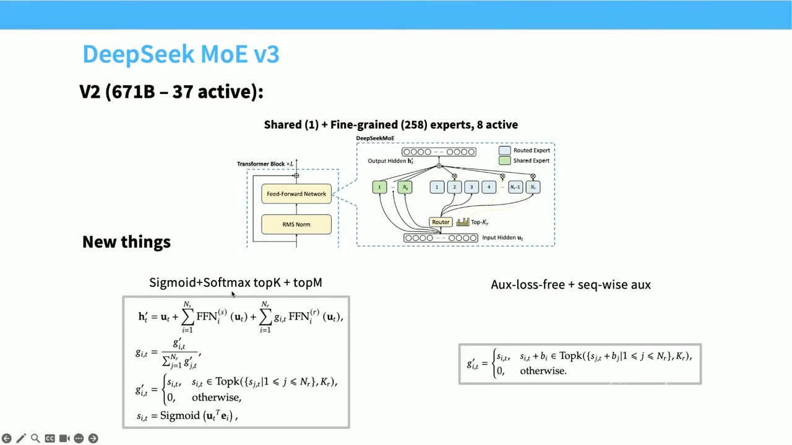

既然已经到这里，我们不妨走完 DeepSeekMoE v3 剩下的部分。他们还有很多其他很酷的东西。我很喜欢他们思考系统的方式。他们有多头潜在注意力（MLA, Multi-head Latent Attention），不是直接做 QKV，而是把它们表示为更低维的潜在 c。你有隐藏输入；不是直接产生 Q、K、V，而是先产生 c，然后基于 c 产生 Q、K、V。这让你得到显著节省。不是把所有 K 和 V 做 KV cache，我只需要存这些 c。而 c 希望是更低维的。这就是为什么叫 MLA，潜在激活：因为 c 是潜在的，是你要保存的 KV cache 量。你可能需要担心的唯一复杂性是，这和 rope 在 KV caching 时冲突。所以你必须小心如何旋转不同维度等等。技巧是，你有非潜在维度编码位置，但我不讲太多细节了。

*[85:04](https://www.youtube.com/watch?v=cKSwj_qZ8Jg&t=5104)*

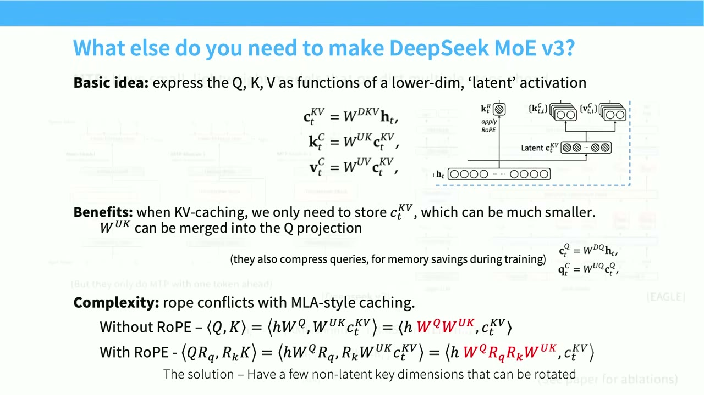

最后，我认为有一个很酷的 MoE 想法，其实来自 DeepSeekMoE v3，但没有很流行，就是 MTP，多 token 预测（Multi-Token Prediction）。不是预测一个未来 token，而是一次预测多个 token。这有统计上的理由说明为什么好，也许让你更好地预测未来。但也有很好的系统理由：你现在内置了一个 speculative decoder。Percy 以后讲推理时会讲这个。但这是一个你可以用来加速模型解码的技巧。

*[85:40](https://www.youtube.com/watch?v=cKSwj_qZ8Jg&t=5140)*

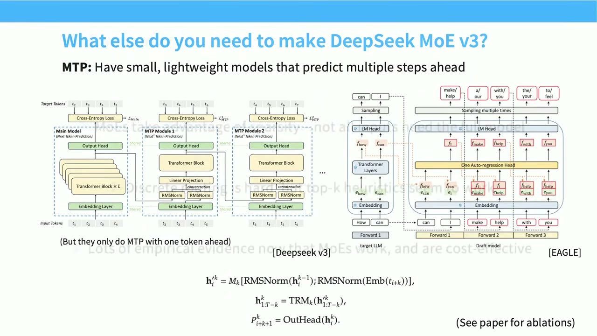

好，我们大概到时间了。把所有东西放在一起：MoE 是一个非常聪明的想法，利用稀疏性，让你拥有比你所付计算量更多的参数。你不为所有参数付计算成本，但得到参数的好处。你一开始可能觉得这种路由问题很难，但事实证明非常简单的东西在规模上也能工作。到这个时候，很明显 MoE 会留下来，所以你应该理解它们怎么工作、它们是什么。谢谢。

*[86:13](https://www.youtube.com/watch?v=cKSwj_qZ8Jg&t=5173)*
