# Stanford CS336 Lecture 5：GPU、TPU 与 FlashAttention

这堂课从 GPU 的硬件与编程模型讲起，梳理让 GPU 跑快的六个技巧，最后用 FlashAttention 把所有概念串起来。

## 从神经网络转向系统：GPU、并行与推理

现在我们要开始这门课的系统部分。前两讲我们一直在做神经网络相关的内容，接下来要进入 GPU、并行化（parallelization）和推理（inference）。系统这部分，我觉得是整条技术栈里比较讲道理的部分：你可以把所有部件都推理一遍，沿着逻辑步骤走到结果，所以它和前面很不一样，也让人很满足。但第一次接触 GPU 时，你会觉得它既像魔法，又像一台非常奇怪的设备。我不太确定该怎么形容，但确实会有这种感觉。

*[00:48](https://www.youtube.com/watch?v=izZba4UA7iY&t=48)*

我先做个课堂调查：有多少人上过任何形式的 GPU 编程课？大概四分之一，可能还少一点。这挺好。第一次和这些设备打交道时，确实有点魔法感，所以理解它们是有好处的。深度神经网络感觉像魔法，GPU 也可以这样。有时候人们会给你看这样一张图，我向你们承诺：到这节课结束时，你会理解这张图是什么，或者为什么它长这样。这张图画的是矩阵乘（matmul）的吞吐量，x 轴是维度。你可能会想，矩阵越大，工作量越多，吞吐量应该总是更高。但你会看到各种奇怪的模式：在某些尺寸下，矩阵乘会比其他尺寸慢得多。为什么？你需要理解这一点。你也需要理解一些关于 GPU 的基本心智模型，才能构建快速算法。

*[01:42](https://www.youtube.com/watch?v=izZba4UA7iY&t=102)*

即使你不是系统方向的人——我觉得你们中不是所有人，甚至不是大多数，都是系统人——但如果你在思考架构，或者一般性地推理这些事情，你也需要理解模型将要执行的硬件模型，才能做出有效的模型。回想 Percy 最初那讲，扩展（scaling）的很大一部分就是确保你有效利用资源。如果不理解系统，你就永远不可能高效利用资源。而我不是系统人，惊不惊喜。

*[02:20](https://www.youtube.com/watch?v=izZba4UA7iY&t=140)*

开始之前，我想先给你们指一些资源。我认为它们非常好、非常有用，我做这讲时也用了它们。Horace He 有非常棒的博客和对 GPU 工作原理的解释。还有一个爱好者组织叫 CUDA Mode，他们很喜欢讨论 GPU、CUDA kernel 等等。现在他们改名了，叫 GPU Mode，好吧。还有那本 TPU book，现在也成了 GPU book，是 Google 的人写的，真的是一份不可思议的资源。如果你对今天讲的任何东西感到兴奋或感兴趣，我强烈建议你去看那本书。他们还有练习可以做，你们的作业里也会有一些看起来像那些练习的东西，所以你们可以提前预览一下之后我们会发给你的内容。

*[03:15](https://www.youtube.com/watch?v=izZba4UA7iY&t=195)*

好，这节课分三部分。第一部分是 GPU 的广泛介绍性材料，讲硬件模型，讲 GPU 编程大致如何工作，因为 GPU 是一种外来设备，我想让你们从哲学上理解它和 CPU 有什么不同。理解之后，我们会讲六个重要的技巧，让 GPU 跑得快。这些只是积木，让你开始操纵代码，使它在 GPU 上高效运行。最后一部分，我们把所有东西拼起来，走一遍 FlashAttention。这会是我们的胜利一圈：到那时我们会说，我们已经理解了重新发明自己 FlashAttention、并理解所有组件所需的一切。这就是这节课要努力达到的目标。

*[04:15](https://www.youtube.com/watch?v=izZba4UA7iY&t=255)*

## 计算是货币：从 Dennard scaling 到并行扩展

我们还没讲到扩展，但从 Percy 的介绍课，或者一般性跟踪语言模型的发展，我们知道：如果有更多算力，我们就能得到更好的语言模型。计算是我们运作的货币。更快的硬件、更好的利用率、更多的芯片、更好的并行化，所有这些都能推动进步。所以某种意义上，过去几年的游戏就是：如何在训练模型时投入更多算力；而大概最近一年，则是如何在模型推理时投入更多算力。计算极其重要，系统就是其中一部分。

*[04:54](https://www.youtube.com/watch?v=izZba4UA7iY&t=294)*

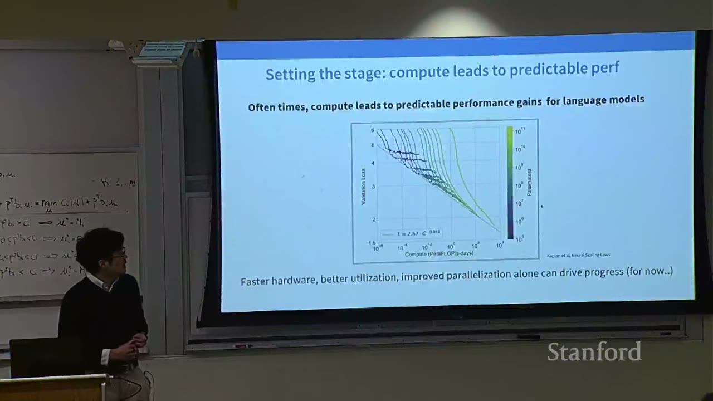

如果我们在 90 年代讨论这个问题，我们会关注时钟速度。我们会说，让计算机变快的方式，是让 CPU 串行执行指令，然后让这些指令执行得越来越快。这种晶体管变小、时钟变快的缩放，叫做 Dennard scaling，它持续了相当一段时间。但大概 2000 年代，这种缩放就走到头了。一个有趣的旁注：晶体管数量当然还在继续增长，但把晶体管做小，并不一定意味着晶体管变快。它们并不会以更高的时钟速度运行。到某个点之后，你不再继续从更小的晶体管中获得好处，这有根本性的物理原因。所以，让时钟更快、让指令执行更快的旧方法行不通了。那么，在这个不能只靠频率让东西变快的世界里，我们如何让 LLM 继续扩展？这就是 GPU 和并行扩展登场的地方。

*[05:59](https://www.youtube.com/watch?v=izZba4UA7iY&t=359)*

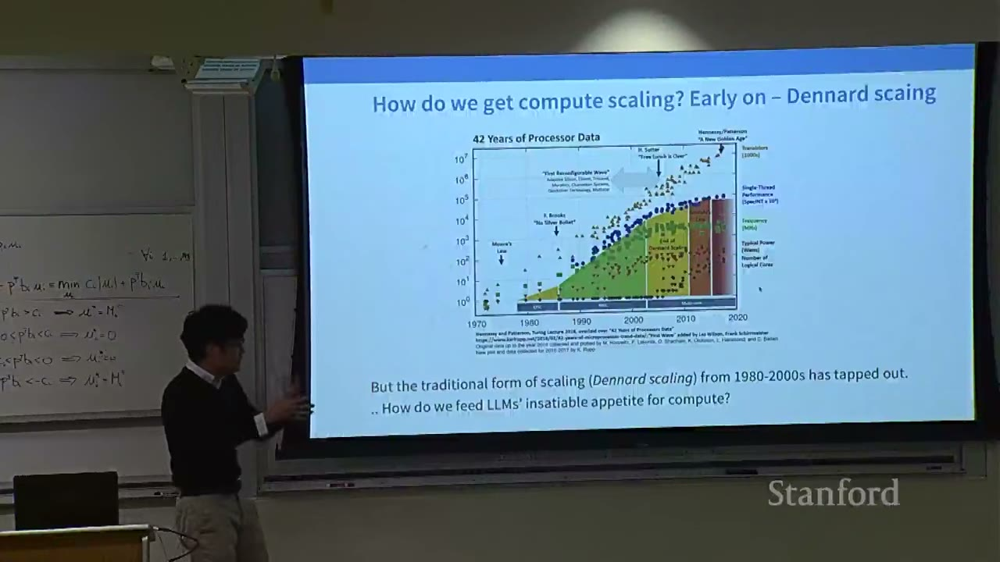

GPU 和并行化基本上属于同一个范式。与其让串行执行越来越快、时钟越来越高，不如水平扩展，让更多东西并行执行指令。这就是 GPU 的故事。这一张幻灯片，或者说这一张图，几乎总结了并行扩展的状态：在 K20、M40 的早期，FLOPs 还算体面，但以今天的标准看有点可怜。然后到 P100、V100 左右，曲线突然起飞，你得到逐年超指数的浮点运算增长。这是一张关于我们能投入多少算力的非凡图表。GPU 扩展真正驱动了我们见过的几乎所有算力扩展。我们后面会讨论这里的所有不同组件，先在这里点出来，让你们有个印象：2017 年 V100 时代，我们开始有 tensor core，这是最大的硬件创新之一。接下来几年，我们看到结构化稀疏（structured sparsity）、FPGA，以及各种低位宽数字格式，也推动着 FLOPs 前进。我们稍后会详细看这意味着什么。

*[07:25](https://www.youtube.com/watch?v=izZba4UA7iY&t=445)*

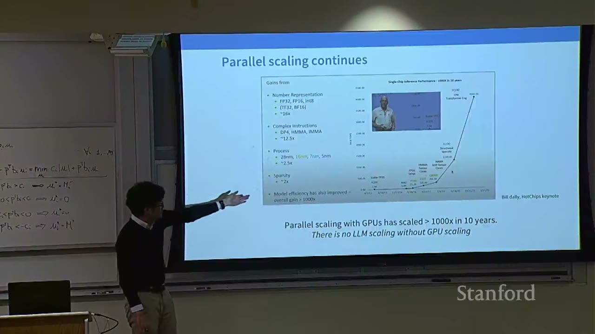

## CPU 与 GPU：低延迟 vs 高吞吐

GPU 和 CPU 有什么不同？已经接触过 GPU 的人知道，我们一会儿就进入更高级的内容。但对其他人来说，理解这个模型、某种意义上理解它们的哲学差异，非常重要。CPU 是为快速、串行执行设计的，处理复杂分支逻辑、复杂条件、复杂控制流。因此，一般说来，CPU 有很大的控制单元，以及少量能做数学或其他操作的 ALU。它追求的是尽可能快、低延迟：从拿到指令到完成指令的时间应该非常非常短。这就是 CPU 的总体设计哲学。

*[08:11](https://www.youtube.com/watch?v=izZba4UA7iY&t=491)*

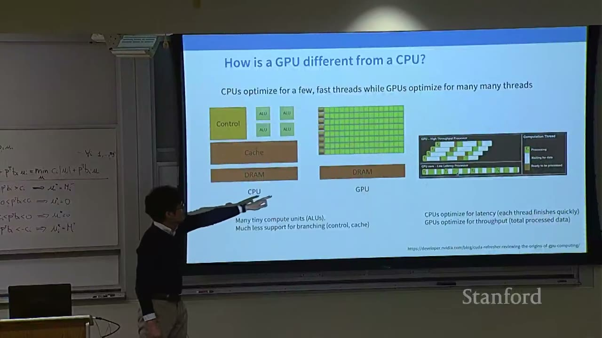

相比之下，GPU 真正关心的是吞吐。右边这张图很好地形象说明了，当你改变哲学后会发生什么。在 GPU 里，也许你派发一个任务，它要很久才完成。可能你处理一个任务，停下来，去处理另一个任务，再回来处理另一个任务。但总的来说，即使任务不会很快完成，你在所有任务上获得了巨大的聚合吞吐。实现这一点的方式，是拥有大量轻量级核心。GPU 有几百个计算单元塞进一块芯片，它们全都能并行执行。所以，和 CPU 相比，这是一种非常不同的编程和思考模式。

*[09:01](https://www.youtube.com/watch?v=izZba4UA7iY&t=541)*

我想把 GPU 去神秘化。我不希望你们把它想成 nvidia-smi 里的一堆文本。我希望你们能在脑子里可视化 GPU 的硬件。这张图通常被用来形象说明 GPU 是什么，我认为它很好地展示了 GPU 内部逻辑上在发生什么。GPU 的基本单元是 SM，即流式多处理器（streaming multiprocessor）。一个 SM 有点像核心，是一个独立的计算单元，有自己的子组件来加速计算，也能访问某些类型的内存。基于并行这个思路，每个 SM 不是单个计算单元，里面有流式处理器，可以并行执行不同线程。但 SM 是离散的计算单元。我们后面讲编程模型时会看到为什么。你可以把每个 SM 大致看成一个核心。GPU 有大量 SM。A100 有 128 个 SM。每个 SM 可以被独立编程，独立执行不同任务，并且它们可以访问外部的全局内存。

*[10:11](https://www.youtube.com/watch?v=izZba4UA7iY&t=611)*

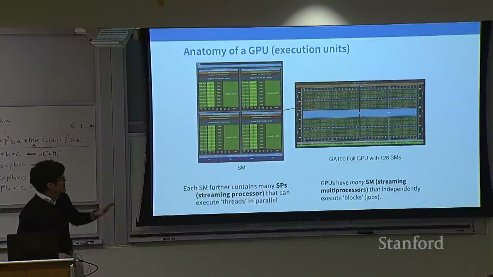

这就是 GPU 的计算故事。但我们在整节课中会看到，这个故事里非常非常重要的一部分不只是计算，还有内存。现代硬件和 LLM 优化实际上是由内存定义的。所以我们需要理解内存有哪些种类，以及它们位于哪里。谈到内存，有不同种类的缓存连在 GPU 上。有寄存器，更有限、也更快。然后有全局内存或高带宽内存。从这张表可以看到——这是有人做的基准测试，我记得是 A100 的延迟——L1 和共享内存非常快，大概 20 到 30 个周期就能读到数据。如果命中 L2 缓存，就慢得多；如果命中全局内存，那比 L1 缓存慢 10 倍。速度差异很大。全局内存就是你作为高层程序员通常认为的 GPU 内存。H200 告诉你它有 144 GB 内存时，说的是全局内存，不是共享内存或 L1 缓存。

*[11:54](https://www.youtube.com/watch?v=izZba4UA7iY&t=714)*

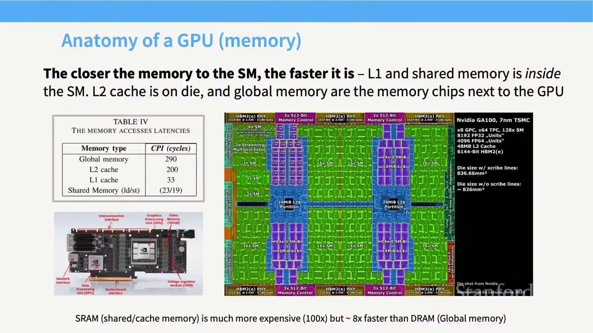

物理上这些东西在哪里？全局内存通常是计算单元之外的内存芯片，而 L2 和 L1 缓存物理上就在芯片本身里面。这是 GPU 芯片的图。你看到所有这些 SM，这些绿色块就是 SM。L2 在这里，L1 在每个 SM 内部。所以它们物理上离计算单元近得多，这就是为什么延迟好那么多。你可能会说，既然共享内存这么好，为什么不整块芯片都用共享内存造？因为它贵几百倍，而且从这些内存的制造方式看，也更耗电。所以如果你在造实用加速器，通常不会想要巨大数量的共享内存，而是需要这个内存层级，并有效使用它。Groq 最近被 NVIDIA 收购，它的设计就是有大量 SRAM。对推理这类工作负载，这很有帮助。但对大多数加速器来说，你仍然会有这个层级，必须尊重它，才能让任何东西跑得快。

*[12:51](https://www.youtube.com/watch?v=izZba4UA7iY&t=771)*

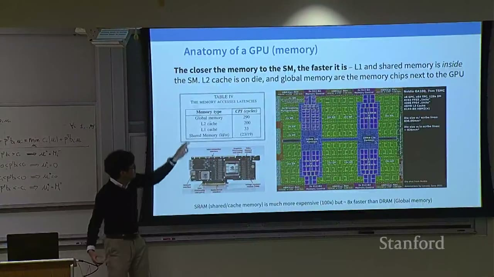

有人问：共享内存和 L1 缓存有什么区别？共享内存和 L1 缓存的操作方式不同。缓存就是缓存，它存储最近访问过的数据元素。共享内存是一个可编程元素，你会实际与它交互，可以把东西放进去、取出来。好，这就是内存存储。记住它，因为内存层级会不断回来，它是一个非常重要的对象。

*[13:19](https://www.youtube.com/watch?v=izZba4UA7iY&t=799)*

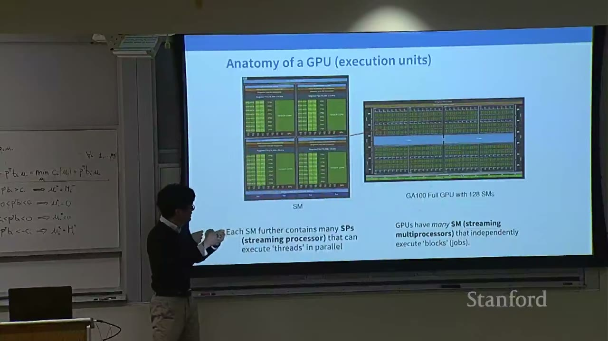

## GPU 编程模型：线程、块、warp

现在硬件心智模型已经有了。接下来讲 GPU 的软件和编程模型。GPU 执行模型里有三个重要角色。第一是线程（thread）。如果你熟悉任何多并行编程，就知道线程是什么。线程是轻量级的东西，并行运行、做工作。在 GPU 里，线程的重要之处是它们遵循 SIMT 模型（single instruction, multiple threads）。这意味着你拥有的所有线程都在执行完全相同的指令。它们有不同的输入，所以线程可以真正做不同的有用工作，但它们执行的指令必须全部相同。这对代码效率以及编程模型都有重要影响。如果线程能做各种不同的事，编程会变得非常困难。GPU 就是可编程性和效率之间的一种权衡。

*[14:21](https://www.youtube.com/watch?v=izZba4UA7iY&t=861)*

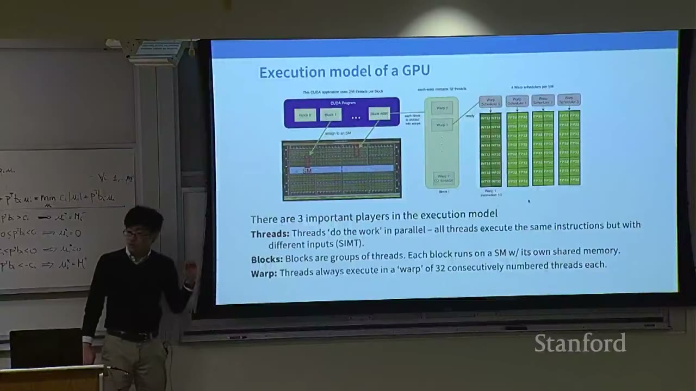

块（block）是一组线程。块之所以重要，是因为一个块保证运行在单个 SM 上。记住，一个 SM 有共享内存。所以你可以把线程看作并行做工作，而块可以访问一个共享内存池。这在后面讲 tiling 时会非常重要，因为块会重用同一块内存。最后，warp 本质上是 GPU 内部发生的调度单元。线程以 32 个连续编号的线程为一组执行，这就是一个 warp。这减少了调度器决定运行哪些线程的开销。基本上，这三个术语就是 GPU 的重要术语。我可能会说“不同 warp 在执行”，意思就是 32 个线程一起执行的基本单位。

*[15:17](https://www.youtube.com/watch?v=izZba4UA7iY&t=917)*

有人问：所有线程执行相同指令，是指一个块里的所有线程，还是一个 warp 里的所有线程？一个 warp 里的所有线程会一起执行。然后调度器决定下一条指令去哪个 warp。对，调度器决定哪个 warp 下一个执行，在什么赋值上执行等等。好。

*[15:48](https://www.youtube.com/watch?v=izZba4UA7iY&t=948)*

在 GPU 的内存模型里，设备代码可以读寄存器。寄存器是最快、最本地的东西，可能存放内存地址，比如数组的开始和结束位置。然后是本地内存，也是单个 SM 内的本地内存。然后是共享内存，可以在块内访问。所以如果你想把东西跨线程传递，或者想让信息在线程间重用，这些就放在共享内存里。当然，你也可以从全局内存读取，那是很远的 DRAM，只要愿意承担数据从全局内存过来的延迟。还有常量内存，我不太在各种编程里见过它被大量使用，但你也可以用。你甚至可以在主机内存之间来回传输。主机内存指机器上的 CPU 内存。如果你需要卸载超出 GPU 大小的数据，可以这么做。这就是内存模型里能做的事情。真正关键、最重要的部分是：一旦走出共享内存，事情就会变慢。所以把块分组，减少全局内存读取，就是整节课的重点。

*[17:13](https://www.youtube.com/watch?v=izZba4UA7iY&t=1033)*

## TPU：与 GPU 的趋同演化

接下来我用两三页幻灯片讲讲 TPU。这节课大部分讲 GPU，主要是因为如果你们出去写代码、建模型，大多数人大概都会在 GPU 上做。但我认为讲 TPU 非常重要，既因为 TPU 很酷、越来越流行，也因为 TPU 是 GPU 的另一种演化路径。你可以看到什么相同、什么不同。看 TPU 如何工作也很有意思。

*[17:55](https://www.youtube.com/watch?v=izZba4UA7iY&t=1075)*

实际上非常有趣的是，TPU 在高层和 GPU 非常相似。这是一种趋同演化。如果你想造一个节能的、做机器学习的加速器，最终会走到同一个地方。TPU 和 GPU 的核心心智差异在于：TPU 某种意义上更简单。它们更针对机器学习工作负载优化，有轻量级控制单元，以及大得多的矩阵乘单元。它们有和 GPU 相同的基本结构：有专门做矩阵乘的电路，有能做并行向量操作的组件，有某种控制系统。它们的内存结构看起来也很像：有慢内存，叫高带宽内存，还有更快的本地内存，叫 SMEM，也就是共享内存。所以这看起来和 GPU 架构非常非常像。真正的区别在于这些部件的尺寸和操作的灵活性。

*[19:02](https://www.youtube.com/watch?v=izZba4UA7iY&t=1142)*

今天我不打算深入讲的一个主要差异是这些加速器的网络。如果你在想 CPU 和 GPU 的最大区别，实际上最大的差异在网络上，而不是单个芯片，因为芯片本身其实就是为了乘矩阵而活的。这是来自 JAX book 的内容，那是一份很可爱的资源。他们有两张表，有一节讲 GPU，描述如何把 GPU 概念映射到 TPU 概念。今天我左边讲的任何东西，你都可以直接映射到 TPU。但在课的这一点上，重要的是注意到：GPU 里的每个概念，TPU 里都有对应概念，而且这个映射相当精确。GPU 里的 tensor core，也就是矩阵乘单元，几乎精确对应 MXU，即 TPU 里的矩阵乘单元。如果要讲很细的细节，它们实际上使用相同的底层电路。它们都是所谓的脉动阵列（systolic array），通过流入流出数据来做矩阵乘。所以架构非常相似。

*[19:49](https://www.youtube.com/watch?v=izZba4UA7iY&t=1189)*

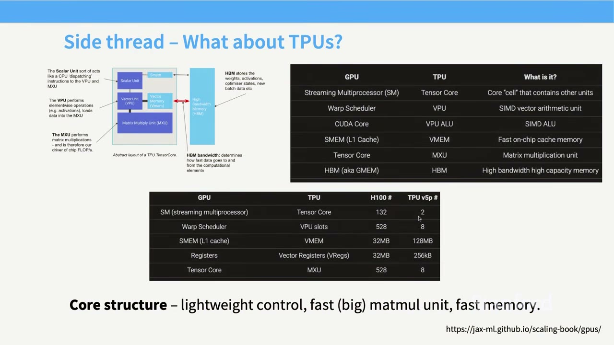

现在，它们有多少个单元？哦，对不起，先提一个非常容易混淆的事情。TPU 把它们的流式多处理器叫做 tensor core，而 GPU 把矩阵乘单元叫做 tensor core，名字完全一样。所以你必须根据上下文来区分。如果有人说 TPU 的 tensor core，那指的是处理器；如果有人说 GPU 的 tensor core，那指的是矩阵乘。如果你看一块典型 GPU，比如 A100，大概有 132 个流式多处理器，很多处理器。TPU 只有两个单元，只有两个独立单元并行运行。如果只看矩阵乘单元，GPU 有 528 个矩阵乘单元，而 TPU 只有 8 个。它们大致被缩放到看起来可比的尺寸。为什么会这样？TPU 依赖更大、更少数的矩阵乘单元，而 GPU 依赖更小但数量多得多的矩阵乘单元。你可以想象，很多小的矩阵乘单元给你更多灵活性，你可以编程让它们做这做那。而 TPU，你被锁定在大矩阵乘上。我最近写的一篇论文里有个有趣的情况：我们做 batch size 扫描，一直降到 64 就停了。为什么？因为 tensor core 拒绝接受小于 64 维的输入，必须是大矩阵乘。所以这是主要区别。

*[22:03](https://www.youtube.com/watch?v=izZba4UA7iY&t=1323)*

但如你所见，GPU 和 TPU 共享很多相似之处。它们都依赖快速内存和慢速内存之间的内存层级，都有矩阵乘单元。因此，我今天教给你们的核心概念会在 GPU 和 TPU 之间迁移。因为这些原因，基本思想总是一样的。这真的是趋同演化。成本有效地分配内存的方法只有那么几种，快速乘矩阵的方法也只有那么几种。有些设计决策不同，但除此之外，你最终会走到同一个地方。

*[22:36](https://www.youtube.com/watch?v=izZba4UA7iY&t=1356)*

## GPU 的成功与硬件趋势

好，TPU 就讲到这里。GPU 我认为极其成功，因为它让矩阵乘之类的东西容易扩展。如果你想要更多吞吐，就不断加 SM。只要你的内存带宽能撑住这些 SM，你就能得到越来越多吞吐。编程是我们不太去想的东西，但它其实容易得具有欺骗性。如果你试着写更底层的、像机器码的 PTX，实际上也可行，因为一切都是 SIMT。你不是在编程每一个线程。你说：好，这是我的指令，这是我的输入，现在在所有输入上运行它们。这有点像你们可能已经熟悉的函数式编程里的 apply 或使用方式。最后，我还没怎么讲线程。做 GPU 编程时，线程总是非常轻量。它们可以随时被停止、启动。调度器可以决定：好，我有另一个 warp 更适合运行，所以我停掉你，启动这个。切换这些工作非常快。如果某些任务卡住，或者有某种降低吞吐的性质，这就能带来高得多的吞吐。这就是 GPU 作为硬件模型的好处。

*[23:47](https://www.youtube.com/watch?v=izZba4UA7iY&t=1427)*

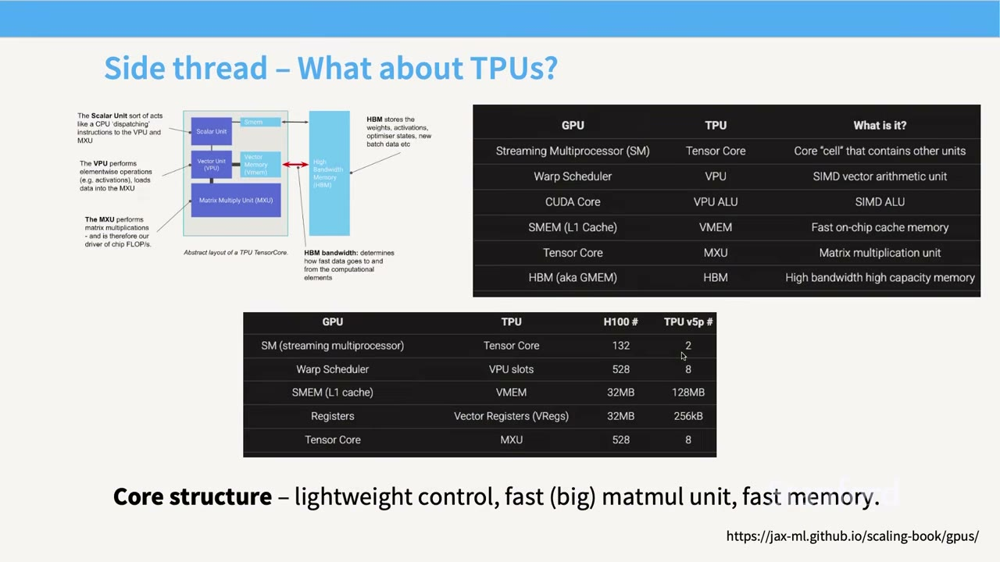

它极其成功。我认为甚至早在 tensor core 实现之前，人们就意识到，商品图形硬件的这种大规模并行，对科学计算会非常有效。这是最早用图形硬件做快速矩阵乘的论文之一。这是非常酷的黑客工作。人们发现，我们有这些 shader 被实现，但我们可以编程特定的 shader，实际上给出矩阵乘。不同的渲染设置实际上能给我们更快的矩阵乘。这是非常酷的计算机科学。但如今你不需要这么做，不需要手动编程 GPU 做矩阵乘，因为从 V100 开始，NVIDIA 决定：这里有一块硬件，会替你做矩阵乘。一旦这个硬件存在，matmul 就成为机器学习里唯一的特权操作。此时，可并行但非矩阵乘的操作，和矩阵乘能做的操作量之间，出现了巨大的吞吐差距。这也是为什么，我们未来看到的任何随算力扩展的机器学习架构，都会包含矩阵乘，因为这是唯一能真正有效获得大量计算吞吐的方式，比 GPU 上任何其他浮点操作快 10 倍以上。

*[25:27](https://www.youtube.com/watch?v=izZba4UA7iY&t=1527)*

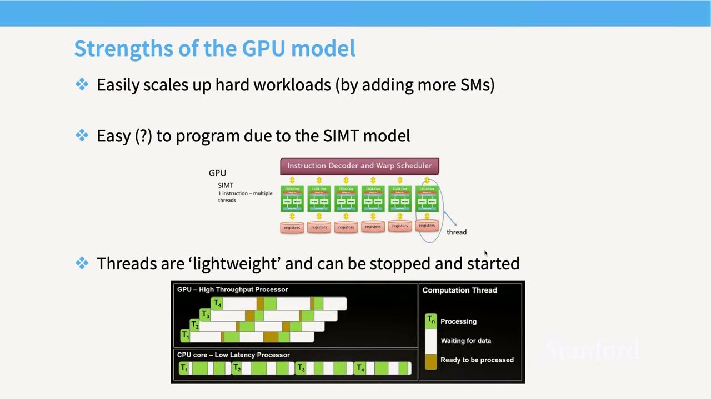

最后我要讲的硬件事情——我觉得这是这部分的最后一张幻灯片——是 GPU 的不同组件随时间以不同速率扩展。我们知道 GPU 越来越快，CPU 也一样，整体计算吞吐越来越快。这是灰线，相当快，我们总浮点运算得到越来越快的改进。绿色是内存带宽，也就是我们传输数据的速度，它增长得相对较慢。蓝色是并行性，也就是我们连接不同 GPU 设备的速度，也走得很慢。这意味着什么？意味着如果你在 GPU 编程的早期，大概不太会考虑内存，因为你的计算并不比内存传输快多少。但现在，随着我们在这张图上越来越往右，计算和内存之间的差距越来越大。这就是为什么我今天讲的很多优化都是内存优化。越往右，内存和通信瓶颈会越来越明显。要充分利用我们拥有的硬件，会需要越来越多工作。

*[26:41](https://www.youtube.com/watch?v=izZba4UA7iY&t=1601)*

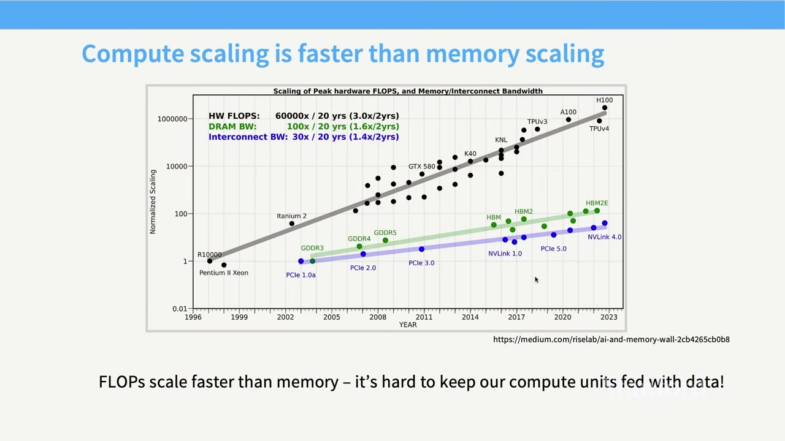

这就是对 GPU 非常基础的概览。我不可能用 20 分钟讲座就让你完全理解 GPU 硬件是什么，但希望你们有了一点感觉。心智模型应该是：GPU 大规模并行，它们同时执行指令。计算扩展非常非常快，甚至比内存更快，这意味着内存非常重要。因为内存重要，我们做的一切都必须尊重内存层级，尽量让很多东西进入共享内存而不是全局内存。如果你们有了这个理解，至少就掌握了内化下一部分所需的全部基础。好，我可以在这里暂停一下，如果大家对硬件或其他事情有问题，再进入下一部分。

*[27:33](https://www.youtube.com/watch?v=izZba4UA7iY&t=1653)*

有人问：V100 之前没有矩阵乘单元吗？对，没有专门做 matmul 的 tensor core。tensor core 是 V100 加入的。在那之前，你要手动编程。当然，你有很多 SM 和 ALU，仍然可以获得相当好的吞吐。但专门做矩阵乘的电路真正改变了游戏。另一个问题：共享内存和 L1 缓存有什么区别？缓存自己运行，你不能控制 L1 缓存。物理距离是很大一部分原因。如果我没记错，它们都是 SRAM。全局内存慢得多，物理距离和使用的互连是原因。顺便说，这不是固有的。TPU 里相当于 L2 缓存的东西要快得多，因为它们在硅片上做了不同的设计权衡，这是卖点之一。有人问：如果计算内存差距继续增长，会不会影响未来芯片布局？会。或者说未来芯片预算的划分。我本来不想讲，但你逼我讲了：推理硬件的景观其实更疯狂。人们去年开始做的一件事叫 prefill decode disaggregation，把 prefill 部分——非常重的矩阵乘——放在一块芯片上，然后把推理的 decode 部分——更受内存带宽限制——放在另一块芯片上。有些模型，我记得是 Step 1-3，一个中国开源模型，甚至尝试 disaggregate 不同层：attention 去一个为某种东西优化的芯片或加速器，MLP 去另一个加速器。所以如果这个差距继续增长，任何利用宝贵快速内存的聪明技巧都会变得非常有价值。这在推理中已经非常明显，而推理比训练更受内存限制。有人问一个块里有多少 warp？我知道吗？我不记得了，我觉得这也取决于硬件。好。

*[30:07](https://www.youtube.com/watch?v=izZba4UA7iY&t=1807)*

## 第二部分：让 GPU 跑快的六个技巧

这节课第二部分是：现在你们对 GPU 是什么、如何工作有了大致感觉。接下来讲让工作负载在 GPU 上跑快的基本技巧。这些是基本组件，可以组合起来让东西变快。为了保持动力，我这部分的一个目标是解释之前那张图。那张图很简单：x 轴是我要乘的方阵的大小，我在乘两个方阵；y 轴是我每秒处理多少项，也就是吞吐量。一般来说，越往右，吞吐量越高，因为矩阵更大、工作更多，硬件利用率更高。但这里有各种奇怪的模式。我们要理解为什么有这些奇怪模式，以及如何待在曲线顶部而不是底部。这就是第二部分要讲的。

*[31:08](https://www.youtube.com/watch?v=izZba4UA7iY&t=1868)*

Percy 已经提过 roofline model。我之前展示的图看起来有点像经典的 roofline model：有一段斜线部分，然后有一段平坦部分。这正是我们预期的。roofline model 说：到某个点之前，我们是内存受限的。内存受限时，不管你给我多少算力，我的吞吐都不会提高。到某个点，你每单位内存移动有足够多的工作，我就能让计算单元完全饱和。超过那个点，给更大单位的工作也不再有帮助，因为我已经完全饱和了矩阵乘单元。所以这是经典 roofline model 的预期：内存越快，这条线可以往上推；但存在内存受限区域，是斜线，然后是计算受限区域，是平坦的。

*[32:09](https://www.youtube.com/watch?v=izZba4UA7iY&t=1929)*

如果你想让代码在 GPU 上高效运行，真正要做的就是待在平坦部分。一旦到了平坦部分，就没什么可做的了，我们已经在最大吞吐。我们要防止自己落入斜线部分，这意味着我们要提高操作强度（operational intensity）：每次内存读取所做的计算量要足够高。这就是我们要做的。我们会讲六个技巧。实际上，第一个不是内存技巧，只有它例外。有六个技巧，可能对让 GPU 跑快都是必要的。第一个味道有点不同，但其余都会围绕一个思路：尽可能减少内存移动。

*[32:54](https://www.youtube.com/watch?v=izZba4UA7iY&t=1974)*

### 技巧一：控制分歧

第一个是 GPU 特有的东西，和我之前说的 SIMT 模型有关。在 GPU 里，每个线程执行相同的东西。那么，如果你在 GPU 上执行的代码里写了一个 if 语句，会发生什么？在 CPU 上很清晰：你会选一个分支执行，然后继续生活。在 GPU 上，你会做一件相当不同、有点反直觉的事。每个线程都必须执行相同指令。所以实际上，每个线程都会执行 if 和 else 两边。但如果你不属于 if 分支，你只会把那段计算 mask 掉，坐在那里空闲。这就是条件语句时的心智模型：一部分线程会根据 if 语句分歧。有些走底部分支，有些走顶部分支。底部分支先执行，顶部分支等待；然后顶部分支执行，底部分支等待。所以为了执行一个 if 语句，你实际上要把两个分支都走一遍，而一些线程在错误的分支上，就只能空等。

*[33:40](https://www.youtube.com/watch?v=izZba4UA7iY&t=2020)*

这叫做控制分歧（control divergence）。它在某些方面是好的，因为它简化了编程。但它不好的地方在于，你现在有了大的计算空隙，GPU 在那里什么都不做。这就是为什么你真的很不想写 if 语句。如果你看 GPU 代码，如果有一个 ReLU，你经常会发现它是乘以零或乘以 mask，而不是写 if 语句更新一半。因为乘法会一次性全部执行，而 if 语句可能实际上要等两个时钟周期，或者两个操作。这是第一点。但这是独立于所有内存东西的故事，而内存才是主要叙事。

*[34:44](https://www.youtube.com/watch?v=izZba4UA7iY&t=2084)*

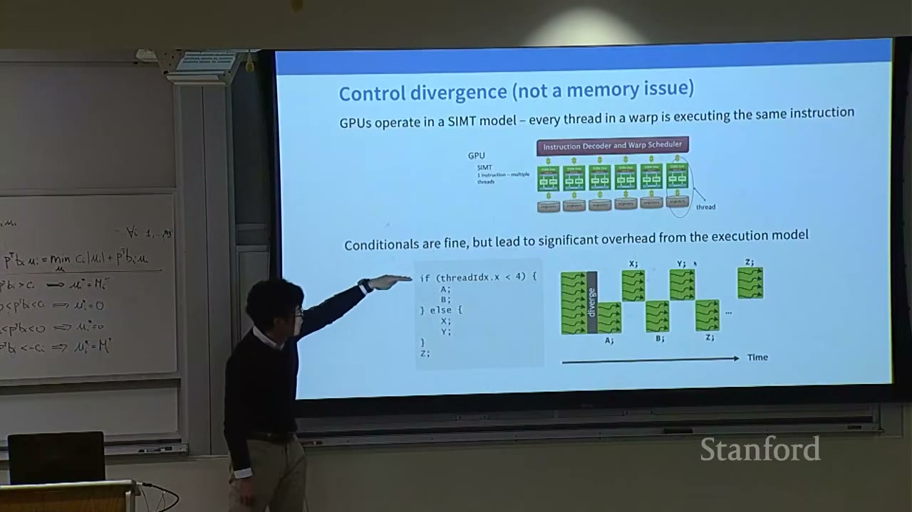

### 技巧二：低精度计算

第一个技巧你不需要做太多，但我认为它是最重要的之一，也是 NVIDIA 在硬件上投入最多的方向：低精度计算。如果你看这张图——我把 Bill Dally 又请回来了——这种超指数增长到底从哪里来？实际上，其中相当不小的一部分来自数字表示。你从 FP32 到 BF16，再到 Int8，不断降低数字精度。当然，如果位数减半，你要移动的位数也减半，内存移动就减少了，所以你至少暂时解决了内存瓶颈。

*[35:38](https://www.youtube.com/watch?v=izZba4UA7iY&t=2138)*

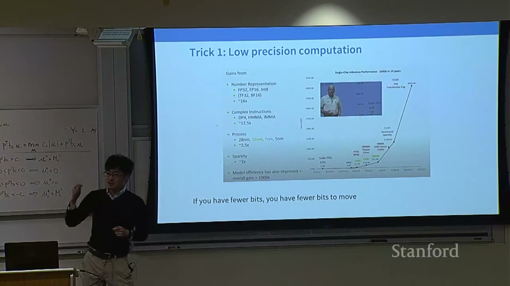

这是个很笨的例子，但我要把它真正刻进去。假设我对一个大小为 n 的向量做 ReLU。如果我用 float32，我需要读一次数字，算完 ReLU 再写一次。那就是每个操作 4 字节，总共 8 字节内存访问。我只有 1 FLOP 的操作，所以是 8 字节/FLOP。如果精度减半，每个操作的字节数减半，每个 FLOP 需要移动的字节数也减半。抱歉，这是算术强度的倒数，算术强度应该是它的倒数。

*[36:13](https://www.youtube.com/watch?v=izZba4UA7iY&t=2173)*

这个例子很简单。但实际上，低精度在现代 GPU 里如何工作非常复杂，而且取决于你怎么看酷不酷，它要么非常酷，要么非常疯狂。当你做一个矩阵乘，假设 tensor core 在低精度下运行，实际怎么工作？你实际上不会把所有东西都保持在低精度。你会在做乘积之前先 downcast。当你在矩阵乘中累加部分和时，会用全精度来做。然后你可能以 FP32 发出输出或结果。我认为低精度之所以有点像黑魔法，不是因为你可以简单降低精度——谁都会——而是你必须弄清楚哪些操作要用哪种数字格式。矩阵乘也许权重和激活都可以低精度。如果做 softmax，也许需要 FP32。如果做指数，也许也需要 FP32，或者也许 BF16 也行。所以我认为，真正让低精度训练达到今天的状态花了好几年。很多工作是缓慢、增量、经验性的，去弄清楚哪些操作可以 downcast，如何 downcast，以及如何在让训练和推理尽可能低精度的同时保持训练稳定性。

*[37:51](https://www.youtube.com/watch?v=izZba4UA7iY&t=2271)*

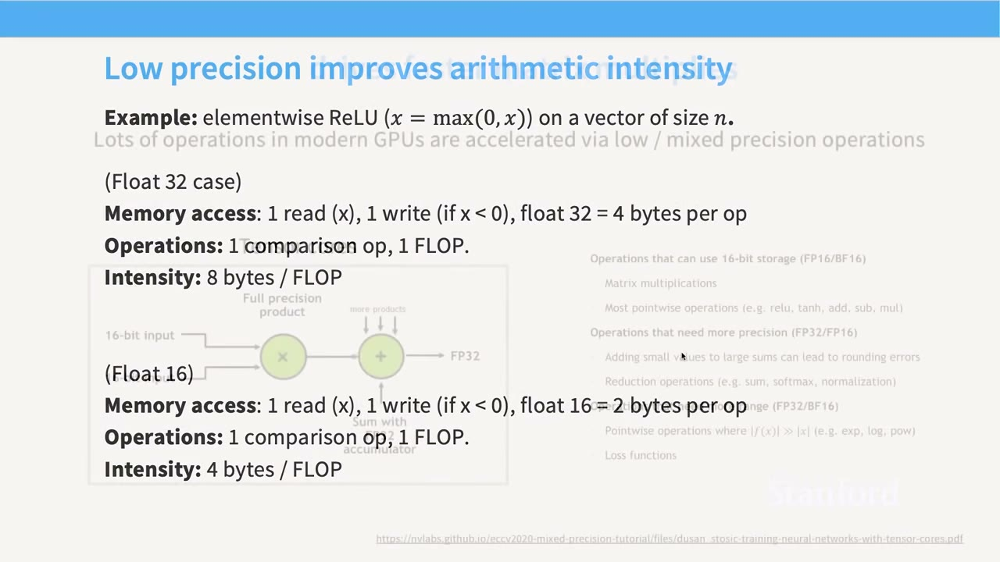

人们一直在推得更远。一旦你想到快速内存有多贵，你就会想：要是我能把精度再砍一半就好了。人们真的非常想这么做。所以 FP8 可以说是低精度的下一个前沿。一旦到 FP8，就不再有一个所有人都用的标准、规范格式。如果你用 16 位，很多时候大概用 BF16。但用 FP8 时，会有 E4M3，意思是 4 位指数、3 位尾数；或者 E5M2，指数更多、尾数更少。因为它们用在不同地方，一旦位数这么少，就没有一刀切的格式。

*[38:40](https://www.youtube.com/watch?v=izZba4UA7iY&t=2320)*

但我觉得真正有趣的是，随着新硬件出现了更先进的低精度数字格式。我会简单讲讲 MXFP8，因为它既酷，它对训练做的事又至少可以说很怪。在传统 FP8 训练版本里，假设所有激活都是 8 位，这在上面。然后你会有一个 FP32 缩放因子（scaling factor），让你能把它放大缩小。为什么需要缩放因子？因为你只有 4 位指数，这么少的指数位，你很快就会上溢或下溢。所以你需要缩放因子让你保持在正确范围内，保留一些信息。

*[39:26](https://www.youtube.com/watch?v=izZba4UA7iY&t=2366)*

但人们意识到这不是最优的，因为一个矩阵里不同部分的幅度可能非常不同。序列的一部分激活可能比另一部分大得多。所以为什么不用多个缩放因子，而不是一个？MXFP8 和这些更先进的多缩放因子格式就有很多缩放因子。每个缩放因子对应相关的彩色子矩阵。矩阵里前四个元素对应第一个缩放因子，依此类推。现在我有更多缩放因子，这些缩放因子实际上会用更低精度。它们也是 8 位，是 E8M0，只有指数位，所以都是 8 位的 2 的幂。你必须做这些权衡。MXFP8 会在元素里用更多尾数，缩放因子本身是 FP8，矩阵里每 32 个元素有一个缩放因子。

*[40:35](https://www.youtube.com/watch?v=izZba4UA7iY&t=2435)*

好，我在这里暂停一下。不要读第三点。现在想一下：这个设计有什么问题？如果你做了这么聪明的事，最大的问题是什么？最大的问题是：假设我想转置这个矩阵。这个矩阵的转置并没有和原矩阵相同的缩放模式。以前矩阵转置很简单，我只要转置，不需要重新量化，不需要做任何事。现在转置这个矩阵非常复杂，因为我现在可能必须重新量化整个矩阵，才能适配这个 1/32 的模式。所以当你实际使用 MXFP8 时，内部会发生什么——我觉得这既疯狂又酷——是在训练模型时，它实际上会为每个量化矩阵创建两份副本：一份是原矩阵，一份是转置矩阵。如果你以后想转置，转置版本已经等在那里了。这就是绕过问题的方式。我觉得这既疯狂又酷。

*[41:37](https://www.youtube.com/watch?v=izZba4UA7iY&t=2497)*

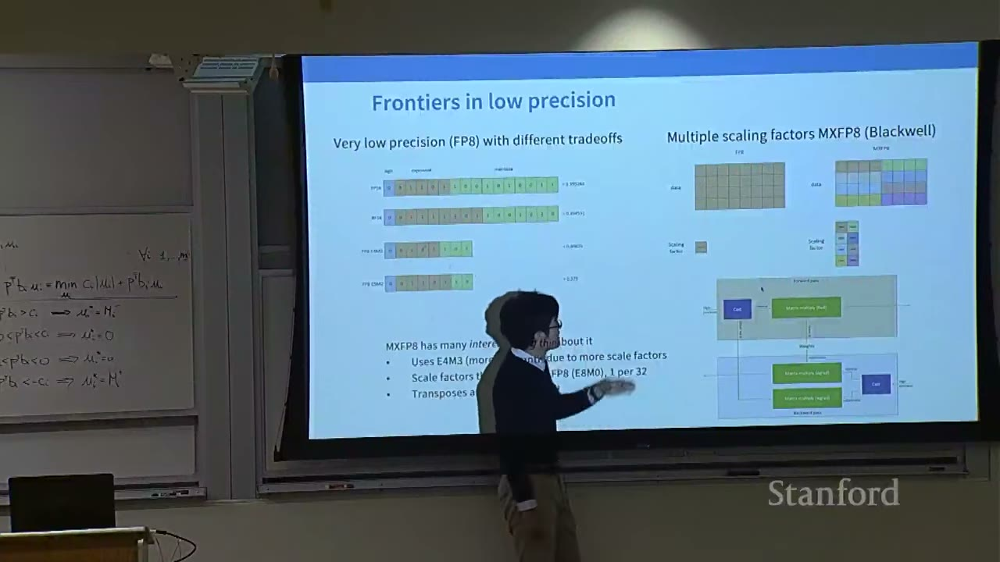

这里的重点也许不是强调 GPU 琐事，而是一旦你开始到 FP4、FP4 格式，事情就变得相当异国情调，因为指数和尾数的损失非常极端。所以你必须非常聪明地处理。就像我说的，如果你真的去训练一个 FP4 模型——我认为很多前沿实验室为了计算收益正在做——你必须非常小心。

*[42:08](https://www.youtube.com/watch?v=izZba4UA7iY&t=2528)*

这张图确实说明了我说的。每次量化时，你会以一种方式量化，然后转置再量化，所以你有两份副本。另一部分我几张幻灯片前告诉过你：你只会量化那些你认为安全的层。这是另一个试错的事情，你必须弄清楚。但一旦把这些都结合起来，训练 FP4 有很大好处：做矩阵乘时，你可能获得 20% 到 30% 的节省，甚至更多，取决于矩阵大小。不幸的是，这不会是 2 倍加速，因为你必须做所有这些量化操作，开销很大。所以它不是免费的。

*[42:47](https://www.youtube.com/watch?v=izZba4UA7iY&t=2567)*

有人提到，第一层和最后一层很难量化。对，对。我对第一层没有直觉。最后一层难量化，是因为它是一阶因子，驱动大量 loss。所以如果你试图量化最后一层，会得到不稳定和很大的 loss 增加。

*[43:11](https://www.youtube.com/watch?v=izZba4UA7iY&t=2591)*

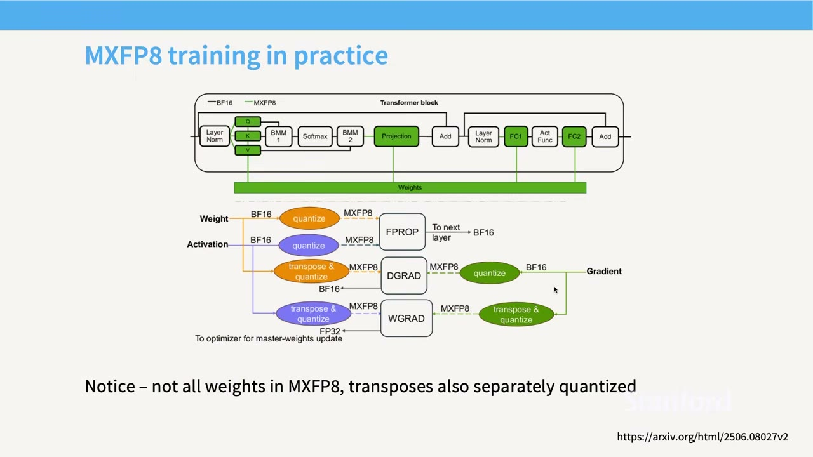

我把这个放上来，几乎是因为我觉得它太荒谬了。下一个前沿已经是 MXFP4。整个 MXFP4 可以在这张幻灯片里展示给你：从 -6 到 6，所有可能的值。但既然你理解了 MXFP8，你也能理解这个怎么工作。你会有一个结构化块，每个块是这四位之一。每 16 个数字，你有一个缩放因子，缩放因子本身是 FP8。这是 E4M3 缩放。有论文用 FP4 训练过。我没听说有人在野生的大规模、严肃模型上成功用 FP4 训练。但我认为这正在到来。下一代模型可能会是 FP4。这就是低精度。我觉得很酷的是，你可以把极限推到只剩 +6 到 -6，却仍然能用这种精度对矩阵做有趣的事。

*[44:08](https://www.youtube.com/watch?v=izZba4UA7iY&t=2648)*

有人问：这是只能用于矩阵，不能用于单个标量吗？你可以量化任何东西。比如 ReLU 之后的激活也可以量化。但没必要。像矩阵乘，如果你量化它，能获得很大吞吐提升。这就是为什么看 MXFP8 训练时，所有被 FP8 量化的都是矩阵乘。对大多数其他操作，开销可能不值得。这和硬件有关，不是矩阵乘硬件只能做这个。不是排他的。你总是可以做更低精度，减少内存移动，这是真的。但对其他东西，不太有意义。这不是硬件限制，而是硬件支持所有这些，很多是烘焙进硬件来加速的。有人问：你把它定位成内存带宽的改进，但在计算上也有好处吗？对，当然。计算上，乘量化数字基本有线性收益。但你必须量化和反量化，所以好处被稀释了。有人问：缩放因子需要训练吗？缩放因子是实现依赖的选择。不同库可能有不同的量化和反量化方式。训练是个强烈的词。你可能让量化因子扫描并选择最大最小值，或者用历史运行统计。我不太会称之为训练。推理时你可能更精确地拟合它们。所以没有梯度。推理时可能会有，训练时不会。有人问结构化稀疏？有很多工作。MOVs 我认为是人们使用的一个成功结构化稀疏操作例子。Chris Re 在这里做了很多不同结构化矩阵的工作。计算收益和表示损失之间，我认为已经抵消了。我不认为这是个坏主意，但经验上，它没有必然成功。有人问量化现状：几十年了，当前方法是什么？是训练全精度或半精度再蒸馏到量化模型吗？大概是要组合。你可能想训练更大模型再量化下去。有各种量化 scaling law 和论文，精确刻画这些权衡。我认为最先进的方法结合一定程度的量化感知训练（quantization-aware training）和模型缩放，以及各种训练后量化（post-training quantization）。有很多东西我觉得还没有完全被理解。即使我和工业界团队聊，他们也在说仍在做量化的科学。好。

*[47:43](https://www.youtube.com/watch?v=izZba4UA7iY&t=2863)*

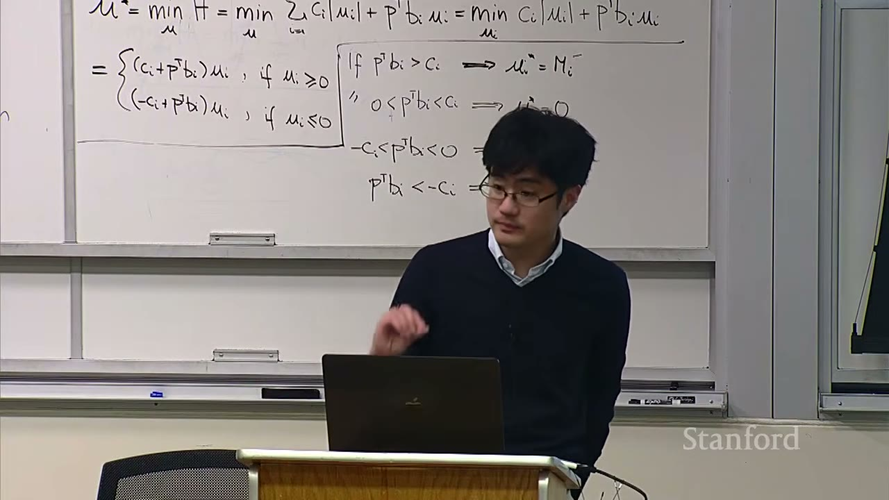

### 技巧三：算子融合

下一个技巧更像概念性的编程技巧：算子融合（operator fusion）。想法很简单，但你会惊讶它并不是自动发生的。把 GPU 想成一个工厂。你有内存仓库，有小计算工厂，还有一条小传送带来回跑。如果你扩大计算，就会被小传送带瓶颈。如果你有多个操作，会更糟。想象我有很多不同操作要做，我把原材料运到工厂再运回来，来回来回。这是大量内存瓶颈，大量双向内存带宽。现在，如果我有一个大工厂，接收所有原材料，送回来成品，不是更好吗？这样我只需要付两次内存带宽。非常简单。这就是算子融合。

*[48:39](https://www.youtube.com/watch?v=izZba4UA7iY&t=2919)*

这经常出现。如果你写一个非常简单的计算，比如 sin 平方加 cos 平方，PyTorch 计算图长什么样？它长这样：x，做 sin，做 cos，两边平方，相加，得到输出。朴素地，如果不做任何聪明事，每个操作都会是一个工厂。每次调用其中一个，你都会从全局内存读写。每次都会产生相当多内存成本。这很痛苦。

*[49:15](https://www.youtube.com/watch?v=izZba4UA7iY&t=2955)*

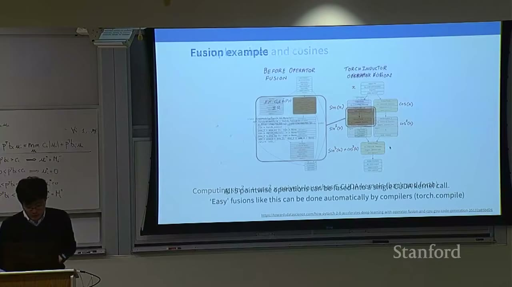

你可以想象，与其那样，不如写 GPU 代码，从全局内存读一次，在 SM 内部做完整个事情，像我之前说的那样。在 SM 内部做完了，再写回全局内存。一个 kernel 做所有这些操作。这叫做融合。像这种简单的——非常容易融合，图可以直接压成一个单元——编译器可以自动为你做。Torch compiler，PyTorch 的编译器，或者 JAX compiler，更深度集成进 JAX，两者都会把这种基本东西融成单个 CUDA 调用。后面我还会讲一点融合。高级版本有时需要手动干预，但简单版本你可以认为编译器会解决。

*[50:13](https://www.youtube.com/watch?v=izZba4UA7iY&t=3013)*

### 技巧四：重计算

第三个想法是重计算（recomputation）。我们知道在反向传播里，我们做什么？我们沿着树向上前向传播。这是来自 Percy 的 221 课。你沿着树向上，跟踪激活，存储这些激活数字。然后当我反向走时，我会用存下来的激活计算向下的反向信号。我们都多多少少知道反向传播，都知道这是什么。但现在我们不是从数学角度、如何计算梯度的角度看，而是从系统角度看：如何最小化内存？

*[50:48](https://www.youtube.com/watch?v=izZba4UA7iY&t=3048)*

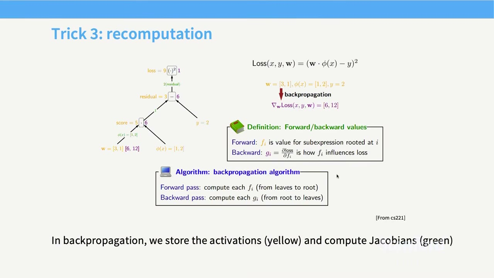

假设我有简单的东西：x 经过 sigmoid、sigmoid、sigmoid，输出。每个 sigmoid 都会在计算图里生成一个残差或激活，我需要跟踪。第一个操作后我有 S2，第二个操作后 S1。然后需要做反向时，它会消耗 S2、S1 和我的输出，或者说是输出的梯度。然后我把梯度反向推到输入的导数。如果数内存读写，前向是读一次 x，写三次 S2、S1、out；反向则反过来。总共 8 次内存读写，算术强度非常低，因为我只是堆叠了一堆 sigmoid。

*[51:36](https://www.youtube.com/watch?v=izZba4UA7iY&t=3096)*

那我能做什么？我可以把所有激活都扔掉。通常你不会这么做。为什么要重计算？但想象一个世界，计算超级超级便宜，你有充足计算，没有用满所有单元，但内存非常贵，任何读写都有很大惩罚。那你可能会更喜欢这个计算图：我读 X，然后做 sigmoid、sigmoid、sigmoid、输出。我存这个输出，必须写，因为它是图的输出。但在反向传播时，我的反向图收到 d out。然后我动态地重新前向 X，在需要的地方即时计算激活。现在这会是读 d out 和 X 两次，写 dX 一次，总共 5 次内存访问。我从 8 次总内存访问降到 5 次。所以现在我有 5/8 的总内存访问，计算相同。但我多花了一点计算，省了一点内存。这是另一个非常重要的技巧。我们通常不这么想，因为我们通常只关心计算梯度。但一旦你有系统思维，你就会开始考虑重计算。

*[52:50](https://www.youtube.com/watch?v=izZba4UA7iY&t=3170)*

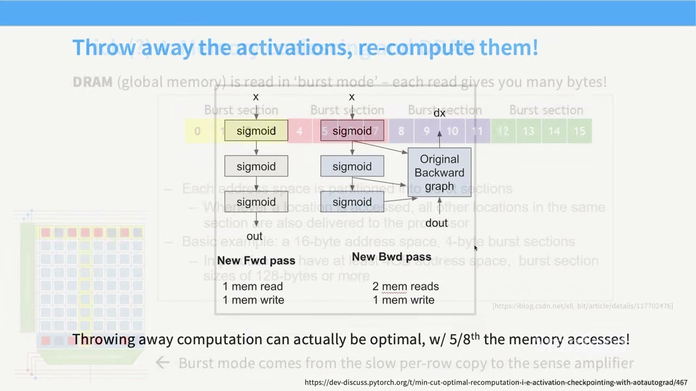

### 技巧五：内存合并

第四个技巧是另一个内存琐事，但意外地重要，也是为什么有时理解你交互的硬件模型很重要。全局内存，也就是芯片外的大内存，是 DRAM。DRAM 由于它的结构方式，实际上以 burst 方式读取。这意味着，当我访问第一个位置时，我实际上不只得到第一个值。我可以免费读取前四个值。这是因为内存单元排列方式，有这些内存单元块；当我激活一个放大器时，几乎可以免费读出所有这些。并行结构允许我读内存块。作为硬件模型，这很合理。这叫做 burst section。每当一个 section 被访问，其他位置也可以免费送达。你不会为它们付费。所以你可能有一个大约 128 字节的 burst。这意味着一次读取可能返回 128 字节数据，只要它们位于同一个连续块。

*[53:58](https://www.youtube.com/watch?v=izZba4UA7iY&t=3238)*

这意味着，如果你的读操作安排得连续、都在一起，会快得多。用术语说，这叫内存访问是合并的（coalesced）。这个词的意思是一个 warp 里所有线程都落在同一个 burst 里。也就是说，假设我有四个线程，它们都生活在同一个 burst section 里，或者从这个 burst section 读取，那么这就是合并的，因为它们用满了整个 burst section。我充分利用了 DRAM 这个非常好的性质。如果有多个 warp，就会有多个 burst section。但你可以通过分组内存读，高效地从内存读取。

*[54:59](https://www.youtube.com/watch?v=izZba4UA7iY&t=3299)*

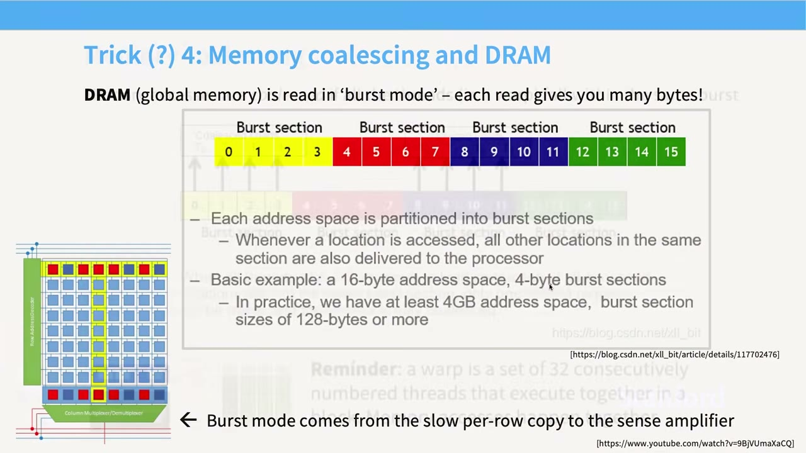

有人问：为什么内存访问有这种模式，像 T 形模式？据我理解，内存单元排列成网格，你的放大器决定读哪些单元，在列级别操作。激活电压通常需要相当长的时间。所以一旦你选中了列，读取该列内多个元素的成本相对便宜得多。如果你想读这个红色单元，我会选中这个。或者至少在这个图里，列是便宜的。但如果我试图读这个，我可能免费得到整行，因为我已经寻址了整行。你不会免费得到一个 T。好。

*[55:54](https://www.youtube.com/watch?v=izZba4UA7iY&t=3354)*

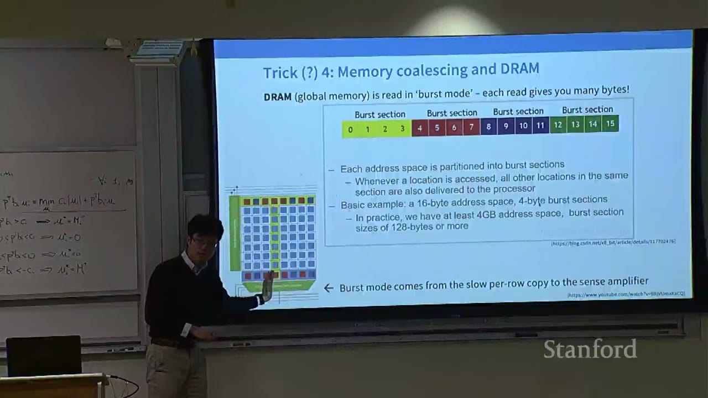

你可能会说，Tatsu，你为什么跟我讲 DRAM 琐事？我讲 DRAM 琐事的原因是：想想矩阵。矩阵经常你想读大块，因为你要做矩阵乘。而矩阵乘上某些内存访问是特权的，比其他的结构好得多。有时你可以利用这一点获得非常非常快的内存读。我记住的口诀是：如果你有线程，有一个行主序矩阵，也就是按行索引递增排序，那么线程沿着主轴移动是不合并的。为了直观，我喜欢右边这张图。想象我有一个 4x4 矩阵，行主序。按地址顺序，黄色块最先，红色块其次，等等。这是内存地址的线性顺序。这是我试图存储的矩阵。现在想象线程每个时钟周期试图读每一列。我读一列，向右移动，读一列，向右移动。第一次迭代，我命中这个元素、这个元素、这个元素、这个元素。注意每一个都落在不同的 burst 窗口。我读了整个向量，或者说整个矩阵，即使我只想要一列。现在想象反过来，如果我翻转这个矩阵，我可以读整个块。每个线程一次内存读就能拿到自己的数据。所以合并可以显著改善从矩阵这种大连续结构中的读取。这就是为什么你可能要想想行、列或其他顺序。

*[57:37](https://www.youtube.com/watch?v=izZba4UA7iY&t=3457)*

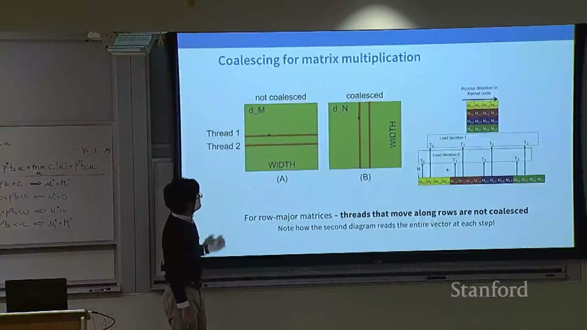

### 技巧六：分块（tiling）

最后一个要讲的，也是最大的、也许最重要的想法，我留到最后：分块（tiling）。我认为它对性能影响最大。tiling 比任何其他想法都更关乎尽量利用内存层级。我们想尽可能分组内存访问。共享内存访问应该一起做，而且应该在共享内存上做。之所以叫 tiling，是因为我要把需要的东西切碎，把空间分块。每个 tile 会加载到共享内存。一旦 tile 加载了，我就会反复从那个 tile 读取，尽可能多做。

*[58:42](https://www.youtube.com/watch?v=izZba4UA7iY&t=3522)*

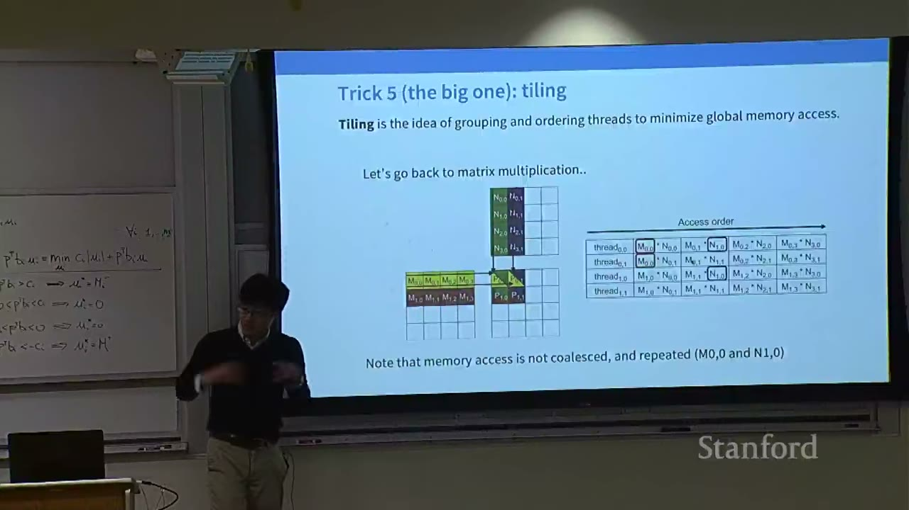

想想矩阵乘的情况。我要乘这个矩阵和这个矩阵。右下角这个矩阵是我的输出，是我写矩阵的地方。这是标准记号。如果我要做这个，朴素地，每个条目会被读多次。精确地说，在一个 N x N 矩阵乘里，每个条目会被读 N 次。所以你可能想，如果我读这个条目，比如 M0，多次，为什么我不能把所有内存访问分组，而不是每次都命中全局内存？矩阵的好处是有非常自然的分组方式。本质上就是把矩阵切成子矩阵，加载它们，然后操作。

*[59:09](https://www.youtube.com/watch?v=izZba4UA7iY&t=3549)*

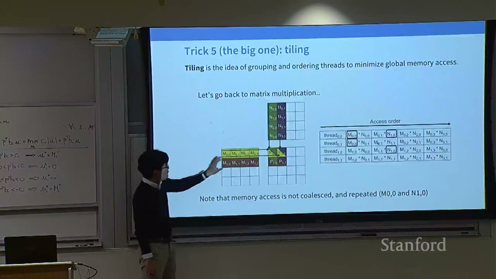

这是一个很简单的算法。我把矩阵切成 2x2 子矩阵。然后加载不同 tile。我先加载 M00 tile，左上角这个。加载 N00 tile，上面矩阵的左上角。把它们加载到共享内存。所以我只付一次从全局内存缓慢传输的成本。但一旦它们在共享内存，我就可以非常快地读写这些 tile。这个输出 tile 暂时也在共享内存。我完全在这些子矩阵上操作。乘这两个子矩阵，把部分和放进输出子矩阵。这让我能在快速共享内存里做很多读写。完成后写回去。

*[60:17](https://www.youtube.com/watch?v=izZba4UA7iY&t=3617)*

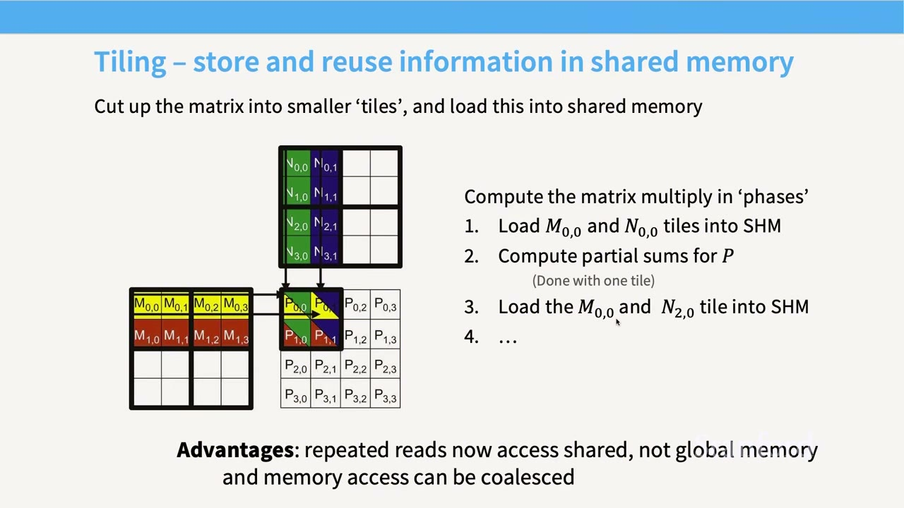

数学上呢？非 tiling 情况，我已经告诉过你，每个输入元素在大 N x N 矩阵乘里要读 n 次。如果我用 tile size T 分块，每个输入从全局内存读 N/T 次，然后在每个 tile 内读 T 次。这符合极端情况：如果 T 等于 N，我从全局内存读一次，然后在共享内存访问 N 次。这很好，因为全局内存访问减少了 T 倍。如果你有很大的共享内存 tile，你就能在矩阵乘之类东西上大幅减少全局内存访问。

*[60:58](https://www.youtube.com/watch?v=izZba4UA7iY&t=3658)*

有人问：你这样做是因为你不能把整个块放进去吗？对，对。但如果你在造那些非常花哨的替代加速器，比如 Groq 之类的，全是 SRAM，那你就可以把整个矩阵放进去。那样整个东西非常快，但非常非常贵。这也会在 GPU 层面发生，因为有上下文切换，我甚至不能把一个 tile 放进一个 SM，然后你就得不断重新加 tile。有人问这是不是在加速器层面也发生？对，这就是一个 tile。数据并行可以这样看：如果数据在一个轴，权重在另一个轴，在某个轴切，就是数据并行；张量并行可能是另一种并行。所有这些并行看起来都有点像 tiling。

*[61:58](https://www.youtube.com/watch?v=izZba4UA7iY&t=3718)*

有人问：像 PyTorch 这样的库会自动做这个吗？会。你调用的任何矩阵乘 kernel 底层都会做 tiling。如果你做某些奇异操作，可能想想要不要 tiling，你想要本地重用读取。但我要说，即使 PyTorch 也不是完美的。我们会讲一些不完美的地方。tiling 作为想法非常强大，但也很复杂。你实际上可能遇到一些非常微妙的事情。想象 tile size 是 128x128。如果矩阵是 256x256，生活很美好，四个 tile 完美切分。现在想象我把坐标大小加一。现在生成了两个非常瘦的 tile，里面几乎什么都没有。所以你意识到，tile 大小其实很复杂。根据矩阵，我可能需要调整 tile 大小，在内存带宽和巨大空白浪费之间权衡。tile 大小实际上是需要优化的东西。合并内存访问、加速器里共享内存的大小、矩阵大小，都会影响哪个 tile 最优。如果你知道 PyTorch 里的不同选项，有一个编译器选项叫 max-autotune。我不知道你们多少人用过或知道。打开那个标志，接下来 15 分钟 PyTorch 会跑无穷无尽的基准测试。你会意识到，它实际上是在你的矩阵上尝试各种不同 tile 大小，试图找出哪个更快。你会发现，优化这些东西会带来不小的好处。

*[63:55](https://www.youtube.com/watch?v=izZba4UA7iY&t=3835)*

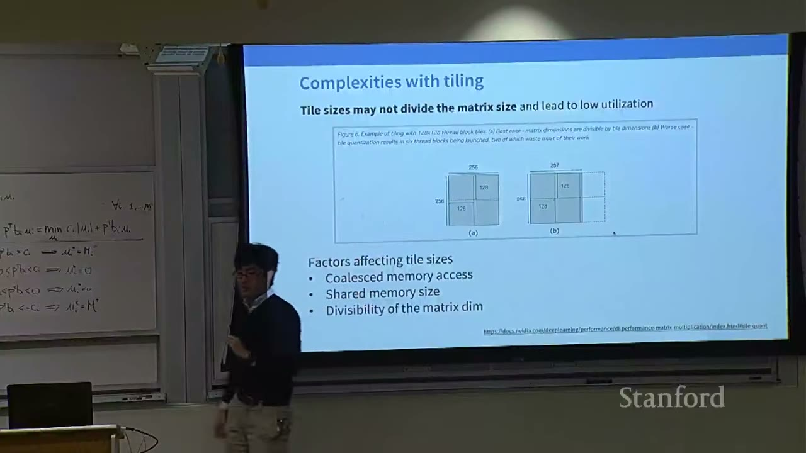

另一个和合并相关的事是：如果你的矩阵大小不对，你试图读一个 tile 时，可能会触发很多内存读。想象一个美好世界，蓝色的是行，我想读这个 tile。我的 burst section 宽度和 tile 一样。这种情况下，四次读就够了。因为 burst section，我读取整个子矩阵，所以合并带来好的内存读。现在想象我把矩阵大小偏移一个。现在第一行被推过去了，蓝色框现在在这里。我没办法通过合并一次读一个 tile，因为所有东西都参差不齐、未对齐。我至少需要读两个 tile 的量才能读出一个 tile。所以一旦你开始考虑合并和其他东西，优化 tile 读取就有很多复杂性。在这种情况下，你必须做 padding，本质上让 burst section 的边界和你有的 tile 大小对齐。

*[65:11](https://www.youtube.com/watch?v=izZba4UA7iY&t=3911)*

这就是为什么你会看到这种东西，看起来很神秘。这是我最喜欢的奇怪例子之一。Andrej Karpathy 做 nanoGPT speedrun 时说，当我把 vocab size 从 50,257 增加到 50,304，我得到 25% 加速。为了加速而 padding 有点奇怪。但一旦你意识到这些事情，也许就说得通了。Padding 可以移动行和列，让你实际上获得非常高效的读取，而其他时候则不能。有人问：通常 tile size 应该考虑多少？你不应该想 tile size 本身，因为 tile 通常应该被看作底层系统的东西，除非你自己写 kernel。但你应该想矩阵大小。你希望矩阵大小能被 tile size 整除。通常 2 的幂，最好也能被 32 整除。好。

*[66:15](https://www.youtube.com/watch?v=izZba4UA7iY&t=3975)*

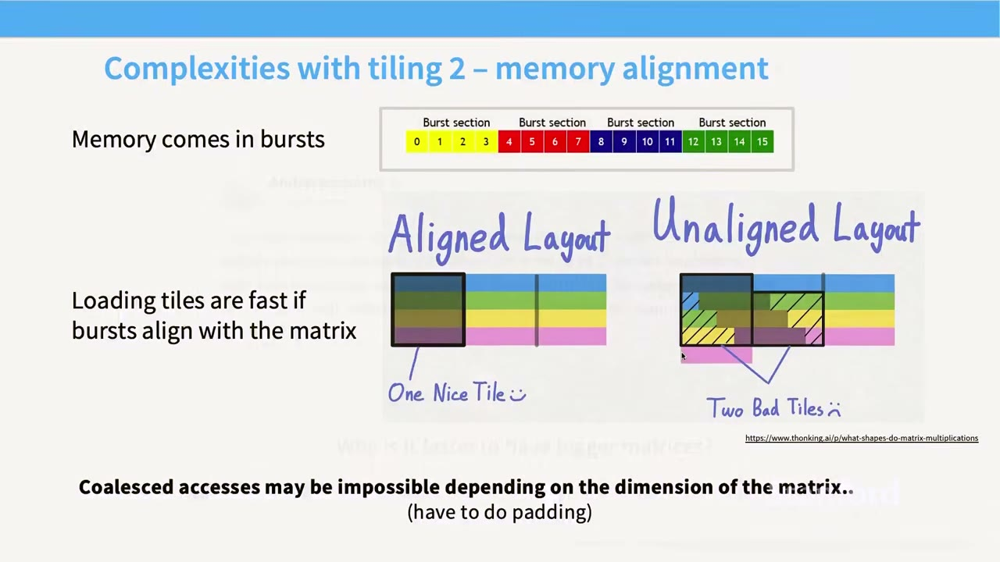

### 解开吞吐量图：tiling、对齐与 wave quantization

现在我们可以谈这个矩阵之谜了。我们基本上有了理解它所需的所有部件。我们一个个走。我们已经讲过计算强度、roofline 图。每次内存读需要有足够工作，才能饱和计算单元。这是斜线上升趋势的驱动力。这个完成了。现在讲其他的。第一个是 tiling。

*[66:40](https://www.youtube.com/watch?v=izZba4UA7iY&t=4000)*

如果看这些线，按矩阵的可整除性着色，你会发现蓝色基本只能被 1 整除，甚至不是偶数。橙色可被 2 整除，绿色 8，红色 16，紫色 32。你会看到，只能被 1 或 2 整除的那些，吞吐非常差。但一旦到更高倍数，你基本上没有惩罚。16 或 32 表现一样好。这不是因为 2 的幂有魔法，而是因为 16 和 32 足够大，有正确的 burst window 性质，能容纳整个 burst window。所以你能把整个 tile 合并读入。这对对齐有很大影响。

*[67:42](https://www.youtube.com/watch?v=izZba4UA7iY&t=4062)*

现在看剩下的，看橙色线，我们有时会看到奇怪的周期性行为，性能突然下降。这很奇怪，我只是在乘矩阵。为什么增加一个额外维度突然杀死吞吐？我认为用我们学到的所有东西走到这个终点很有趣。Percy 把这个叫 GPU 琐事。我觉得他讨厌这个，但我喜欢。为什么从这里到这里，吞吐大降？它发生在 1792 到 1793 之间。为什么？我用的 tile size 是 256 x 128。有多少 tile？1792 时有 98 个。但一旦我加到 1793，实际上两个 tile 尺寸都加了一，所以现在有 120 个 tile。之前 98 个，现在 120 个。这不好，但没这么糟。这个下降巨大。原因在于，A100 有 108 个 SM。98 个 tile 能放进 108 个 SM。但 120 个 tile 放不进 108 个 SM。所以你做完 108 个 SM，然后想，我还有 12 个要处理，大部分 GPU 空闲。所以你会看到这些非常奇怪的效果：tile 大小加一，突然你需要等另一整个周期来处理一堆 tile。这叫做 wave quantization。

*[69:20](https://www.youtube.com/watch?v=izZba4UA7iY&t=4160)*

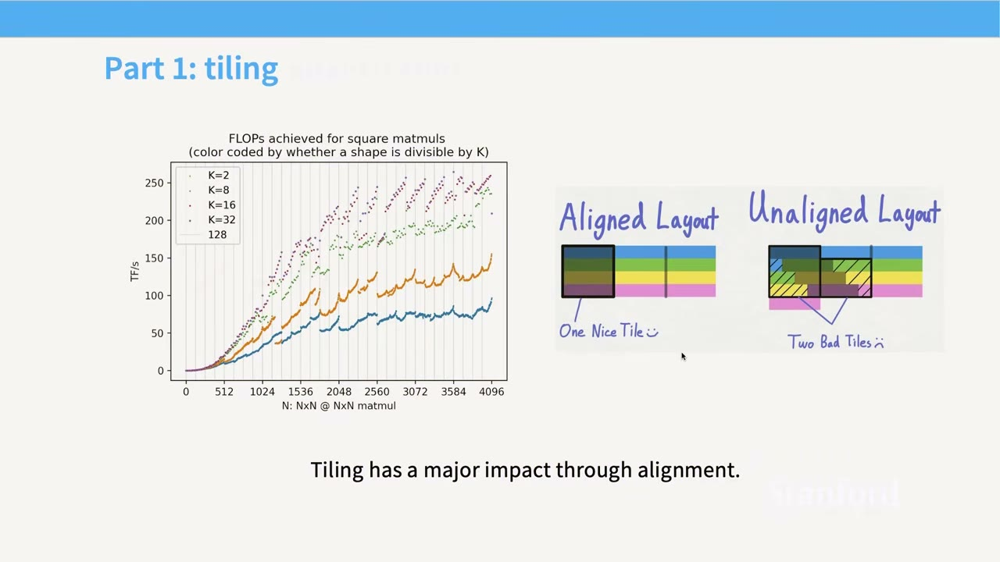

这就是第二部分。如何让机器学习工作负载在 GPU 上跑快？很多故事其实就是内存、内存、内存。如何减少必须做的内存访问？把内存读合并在一起。把操作融合在一起，这样不用读那么多。对于那些无论如何都要读的东西，重用内存，把东西移到共享内存并尽可能重用，这就是 tiling。最后，也许你可以用其他资源换内存，这就是量化和重计算。所有这些想法都和内存是瓶颈、我们如何处理它密切相关。好。

*[70:04](https://www.youtube.com/watch?v=izZba4UA7iY&t=4204)*

有人问：为什么不干脆加大 SRAM 来摆脱 DRAM？非常贵。有两个原因。一是造 SRAM 本身就贵，而且很难，因为它必须物理上很近。信号传播很难。第三个原因是 SRAM 和 DRAM 是不同存储机制。SRAM 需要一直供电才能保持值，非常耗能。所以如果你考虑总拥有成本、能耗，也许你不想造巨大的 SRAM 芯片。你真的想在需要的地方用它。有人问这些东西会不会扩展到 32 以上，或者按 64 的块操作？不。因为只要它能整除你的 burst size，就没问题。这是除数性质。有些其他现象可能从更大除数中受益，但这里不是。有人问为什么是 108？那就是 SM 的数量。你得去问 Jensen，我没有答案。有人问 GPU 和 Cerebras 晶圆级引擎？坐那边的人比我懂晶圆级。我们上节课后聊过编译有多难，因为晶圆级会有波干涉效应和各种可怕的事情。那是我不熟悉的世界，但我觉得比我们这里复杂得多。好。

*[71:50](https://www.youtube.com/watch?v=izZba4UA7iY&t=4310)*

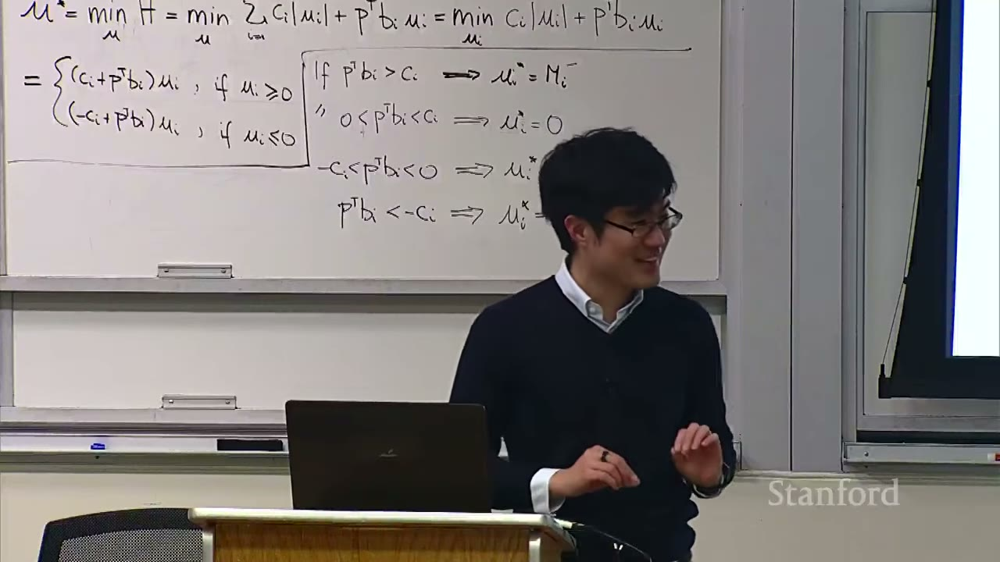

## FlashAttention：把一切串起来

现在我们可以谈某种意义上 Finale 了。我们已经学了很多 GPU 的东西。如果能把这些串起来，重现或理解一个我认为非常重要且先进的东西，那就很好，那就是 FlashAttention。FlashAttention 是注意力能力很长一段时间以来的重大改进之一。它全是系统。它从 PyTorch 朴素的注意力实现，变成一个非常巧妙的融合 kernel。这是原始论文的图。你在服务这些东西的延迟上看到巨大改善。正如我两讲前展示的，FlashAttention 是一种内存高效的注意力计算方式，所以你可以做越来越大、越来越长的注意力。你可以看到，很多收益来自从 HBM，也就是全局内存，传输的内存量的改善。

*[72:46](https://www.youtube.com/watch?v=izZba4UA7iY&t=4366)*

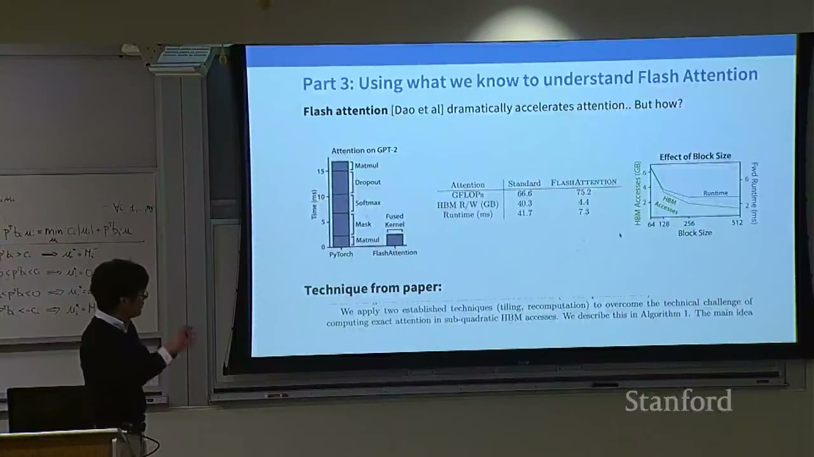

他们实际做了什么？如果读论文，他们会说，我们只做两件事：应用 tiling 和 recomputation。然后我们以一种允许内存访问亚二次（subquadratic）的方式来做。我认为我们现在理解所有这些组件了。看看实际发生了什么。记住，注意力计算有几样东西：K、Q、V。我们用 K 和 Q 做矩阵乘，最后和 V 做矩阵乘，中间有一个 softmax。所以需要处理的操作是三个矩阵乘和一个 softmax。我们有矩阵乘，现在知道怎么做了。所以我们会做 tiled 矩阵乘。论文的 Figure 1 实际上就是 tiled 矩阵乘。我们之前见过。我们拿输入 K 和 Q，切碎，然后逐块在 tile 上乘，计算完写出去。这里没什么花哨或特别。

*[73:46](https://www.youtube.com/watch?v=izZba4UA7iY&t=4426)*

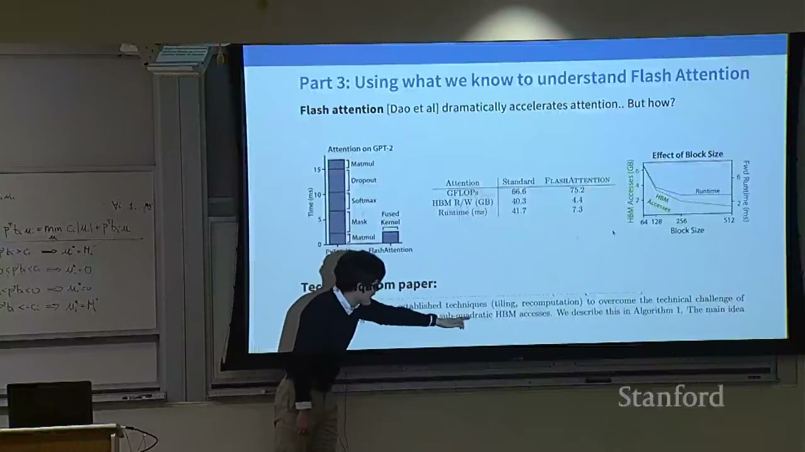

FlashAttention 的棘手之处——你在作业里也会看到——是有一个覆盖整个东西的全局 softmax。所以我们不能天真地做，因为 softmax 是全局操作，把所有东西绑在一起。它连接所有不同 tile。可能不明显如何对注意力做 tiling。关键技巧，一旦你看到它，这真的是核心想法或观察，一旦看到，剩下的就非常简单。通常计算 softmax 会像这张图一样：把所有元素指数化，为了数值稳定性减去最大值，然后归一化。这是标准 softmax。现在有一种在线计算的不同方式。一旦意识到，其实很简单：你一边走一边计算归一化 softmax。每当你遇到一个比之前见过的更大的数，你就换掉最大值。所以你有一种随着进行在线计算 softmax 的方法。唯一 tricky 的是最大值，我们处理最大值的方式是跟踪最大值，每次看到新最大值就换掉并修正。否则，这真的只是我们见过的所有东西的在线运行和。当然，最后你把所有东西除以在线计算的累加器。

*[75:08](https://www.youtube.com/watch?v=izZba4UA7iY&t=4508)*

softmax 重要的是，因为它是在线的，一块一块、一片一片地进行，我们可以逐 tile 计算。我不需要看到其余 tile 就能计算这个。我可以计算我的 tile 的 softmax，保存部分结果，也许写回全局内存，然后继续。这让我们能把所有相互作用的部件拆成更简单的东西。

*[75:37](https://www.youtube.com/watch?v=izZba4UA7iY&t=4537)*

我想这是来自 FlashAttention 2 或 3，我觉得是 2。我喜欢这个可视化，它展示了哪些部分被 tiling。虚线块是在 SRAM 中做的、tiled。蓝色框是在高带宽内存，也就是全局内存里。你看到的是：假设我们做 K、Q 内积。这些是 tiled 矩阵乘，存在 SRAM 里。我们把它们保持在 SRAM，计算指数。然后类似地，在这个 tile 里，我们计算运行 softmax。然后移动到下一个 tile，做同样的事。但现在我保留 softmax 的部分运行和。我可以把它们放在共享内存、寄存器或其他地方。需要跟踪的东西很少。最后，我计算完所有指数化量和归一化器后，很简单地再以 tile 形式乘 V，最后除。这让我能把注意力操作切成这些小 tiled 块，然后进行。

*[76:40](https://www.youtube.com/watch?v=izZba4UA7iY&t=4600)*

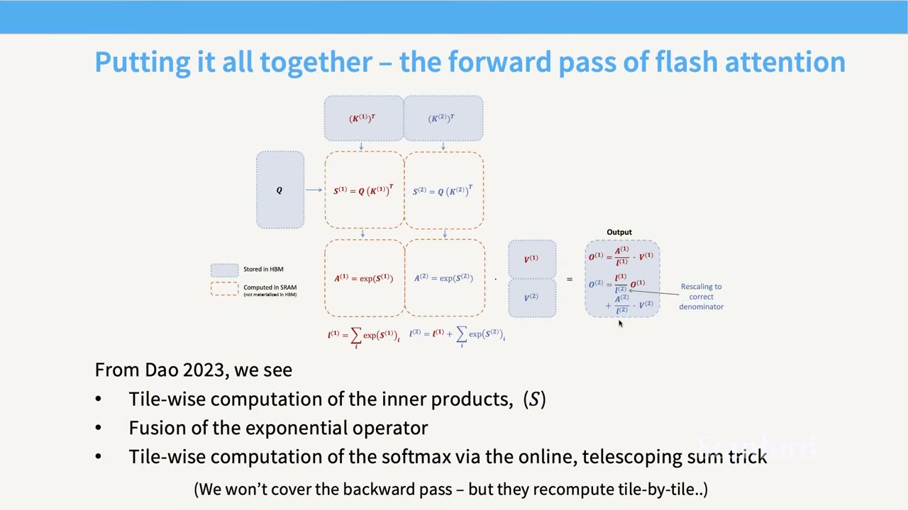

最后，还有融合。你尽量把这两件事一起做，而不来回走。我不打算覆盖或讨论这个，但你可以在反向传播中重计算你需要的一切。FlashAttention 的最后一块是：如果你保存了激活，你仍有 N 平方大小的激活需要为注意力保存。与其保存，不如全部扔掉，在反向传播时逐 tile 重算一切。所以它也有重计算的部分。这就给出了 FlashAttention。

*[77:14](https://www.youtube.com/watch?v=izZba4UA7iY&t=4634)*

现在我们已经看到所有不同技巧在行动。基本上就是这些。你看到的很多高效实现和用好 GPU 的技巧，都归结为这些想法。把它们放回一起：理解硬件很重要。硬件，在我们的例子里是 GPU，驱动规模和计算。我们需要真正理解到低层细节，才能完全掌握为什么做某些决策。我不希望你们成为那种为矩阵 cargo cult 32 倍数的人。我希望你们真正理解为什么我们做这些事。这在我看来一直深入到硬件层面。另一件事是，当前计算增长的方式意味着我们真的很需要思考矩阵乘。它们是核心操作，算术密度非常高。因为计算和内存之间的差距，我们需要非常仔细地思考数据移动。最后，像 FlashAttention 这样的东西，我觉得真的很酷。还有非常硬件感知的架构工作。做架构设计时仔细思考硬件，对未来的系统性能至关重要。谢谢。

*[78:29](https://www.youtube.com/watch?v=izZba4UA7iY&t=4709)*
