# GPU 编程模型、性能陷阱与 Triton 内核入门
这堂课延续上一节对 GPU 的概述，深入 GPU 编程模型、benchmarking 与 profiling、Triton kernel、PTX，以及 softmax、归约和 tiling matmul 等例子，并说明硬件约束如何决定性能。

## 从 GPU 内存层次回顾开始
欢迎回来。周一 Tatsu 做了一场很好的讲解，描述了 GPU 的高层概览，以及如何思考性能和 GPU 的各种怪癖。这节课是那个的延续，我们会更深入地看代码，写一些 Triton kernel，并做 benchmarking 和 profiling。先回顾一下典型 GPU 的简化图：有内存，然后有真正的 GPU 芯片。我们关注 NVIDIA GPU，从 A100、H100 到 B200。每一代 GPU 有一些流式多处理器（Streaming Multiprocessors, SM），数量大约在 100 到 200 之间，这一点变化不大。SM 内部有一组寄存器，B200 有 65,000 个寄存器，每个 SM 总共 256K 寄存器，这也没怎么变。

*[02:27](https://www.youtube.com/watch?v=xnDHaNUvHBg&t=147)*

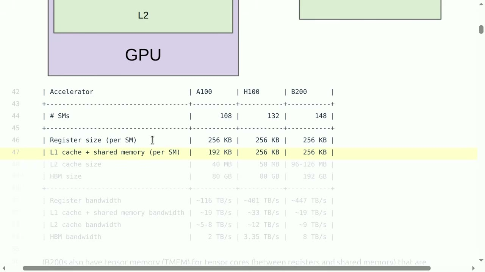

此外还有 L1 缓存和共享内存（shared memory）。记住，它们在同一块内存上，但共享内存你可以控制，L1 你不能。这是每个 SM 的。还有 L2 缓存，不属于单个 SM，而是整个芯片，稍微大一些。最后是高带宽内存（High Bandwidth Memory, HBM），很大，而且这个数字增长得相当多。除了大小，还要考虑带宽，基本上与大小成反比：寄存器非常快，L1 稍慢，L2 更慢，HBM 最慢，尽管 8 TB/s 在大局中也不算慢。这是你脑子里应该有的主要层次：大内存慢而远但大；寄存器、L1 这样的快内存位于 SM 上，局部、快，但小。这就是我们面对的环境。

*[03:18](https://www.youtube.com/watch?v=xnDHaNUvHBg&t=198)*

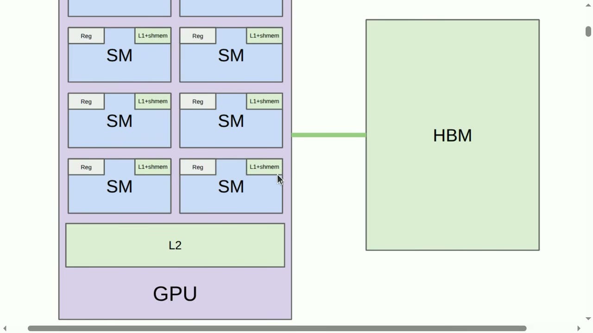

## 线程、线程块与网格
那么怎么给 GPU 编程？编程模型是这样的：有线程（thread），每个线程在一小部分数据上执行一段代码。每个箭头可以看成一个线程。线程被组织成线程块（thread block），也叫并发线程数组（Concurrent Thread Arrays, CTA）。这是一组线程。最后，一组线程块构成网格（grid）。当你启动一个 kernel 时，你基本上是在启动一个由线程和线程块组成的网格，让它们同时做计算。这是简化版，还有一些别的东西。比如 H100 和 B200 也有 thread block cluster，是线程块的集群，能实现一定程度的分布式内存。B200 还有 tensor memory，用于 tensor core，位于寄存器和共享内存之间。有些对程序员不可见，但在硬件里。不过这个入门课先不担心它们。

*[04:34](https://www.youtube.com/watch?v=xnDHaNUvHBg&t=274)*

你可能会问，为什么要有线程块？为什么不能只有线程网格，每个线程拿一块数据做事情？如果你只需要 element-wise 操作，这通常没问题。例如 GeLU（Gaussian Error Linear Unit）是逐元素激活函数，线程很自然，每个线程处理一个元素，就像 for i 遍历数据集。但对于涉及线程间通信的操作，比如 softmax 或矩阵乘法（matmul），这个视角就不够了。如果你愿意付出读写 HBM 的代价，它也能工作：比如矩阵乘法，每个线程计算输出矩阵的一个元素，只从 HBM 读写。但 HBM 很慢，所以这不是好策略。我们应该用共享内存，它位于 SM 本地。线程块让你能思考一组线程共同访问这块共享内存。因此，一个线程块会被调度到一个 SM 上，做它的事：从 HBM 读一批数据，处理，处理可能涉及通过共享内存在线程间通信，然后写回。这是关键点，后面讲 tiling 时整个游戏就在这儿。在 Triton 里，我们会原生地按线程块来思考，习惯之后会容易很多。

*[07:04](https://www.youtube.com/watch?v=xnDHaNUvHBg&t=424)*

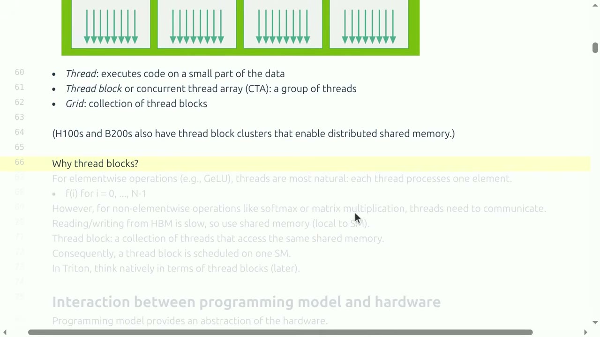

## 编程模型与硬件的张力
编程模型本身相当简单：线程、线程块、网格。它很好地抽象了硬件。写 kernel 时，你只需知道有一堆线程块，定义它们，然后定义块内线程或线程块要做什么计算。这部分写起来像写 Python，并不难。如果只关心正确性，知道这些就够了。但实践中，性能对硬件非常敏感，要获得高性能必须深入理解硬件。我们讨论 GPU 和 kernel 的全部原因，就是压榨性能。这里有两个层次：你要理解计算，这只是编程模型的一部分；但它跑多快，强烈依赖硬件。我接下来会举大约五个例子，让你感受这些考虑。有些是 Tatsu 讲过的复习，但希望能强化概念。

*[08:47](https://www.youtube.com/watch?v=xnDHaNUvHBg&t=527)*

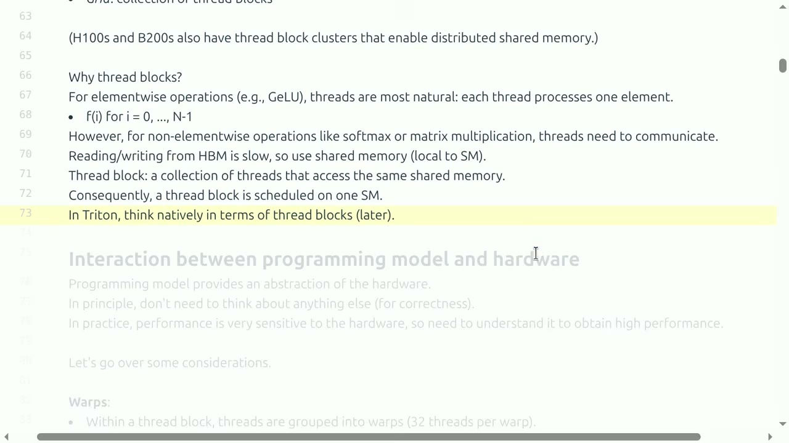

有一个东西叫 warp（线程束），我之前没讲。在简化视角里，warp 不属于编程模型那幅干净图景。你有线程、线程块、网格。技术上你也可以接触 warp，但编程时不必须。warp 是什么？每个线程块是一组线程，但这些线程实际被分组成 warp，基本上每个 warp 32 个线程。比如线程块有 64 个线程，就有两个 warp，前 32 和后 32。正如 Tatsu 上次说的，一个 warp 内所有线程必须在 SM 上锁步执行同一条指令。每个周期必须执行完全相同的指令。控制分歧（control divergence）是指同一 warp 内不同线程需要执行不同指令。比如分支 if something then A else B，你只能先让 warp 里线程做 A，再做 B，于是变成串行。这很糟、很低效，所以分支一般要避免。

*[10:14](https://www.youtube.com/watch?v=xnDHaNUvHBg&t=614)*

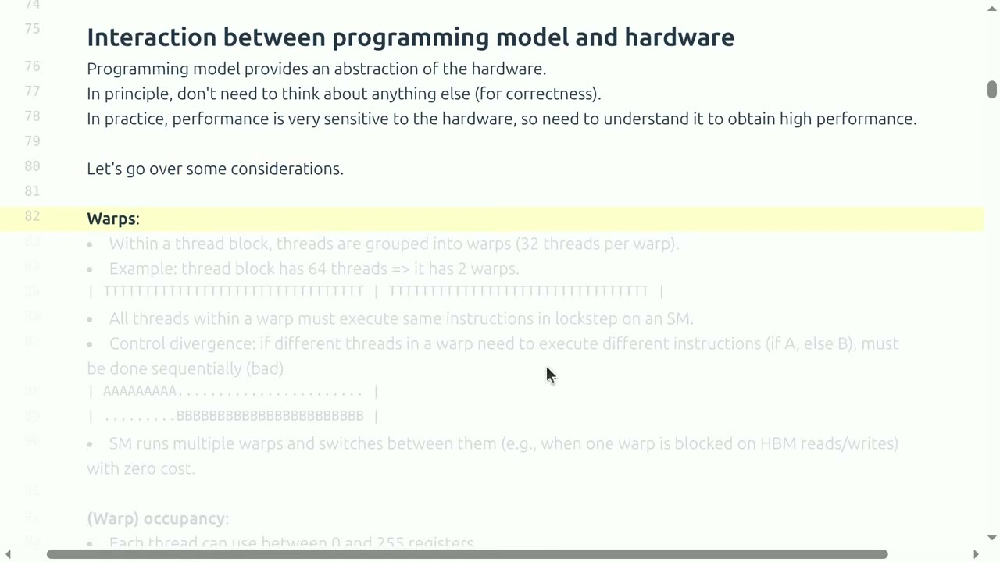

warp 很酷的一点是，一个 SM 实际运行多个 warp。有 warp 调度器，还有一批常驻 warp 准备运行。每个 warp 的线程有寄存器。SM 可以在它们之间零成本切换。这在 CPU 上通常不成立。这样设计是为了隐藏延迟。这很重要，因为某个 warp 可能正在读 HBM，而 HBM 很贵，可能要 100 个周期。你不想让这个 warp 干等，而是立刻切到另一个 warp，让它做 tensor core 运算。warp 还会引出占用率（occupancy）的概念，更准确说是 warp 占用率。硬件约束说每个线程最多用 255 个寄存器。SM 有固定数量寄存器。每个线程用的寄存器越多，能有的线程越少，这是数学。这会降低占用率。但不一定坏，因为如果线程更少但每个线程做更多工作，可能反而好。所以占用率可以测量，但不一定越大越好，还有其他权衡。一个例子是 thread coarsening：比如 element-wise 操作，可以让一个线程只处理一个元素，线程很多；也可以让每个线程处理多个元素，比如常数 8。这样线程更少，调度更容易，但每线程做更多工作。所以如果线程很轻，也许想把它们加厚一点。

*[12:47](https://www.youtube.com/watch?v=xnDHaNUvHBg&t=767)*

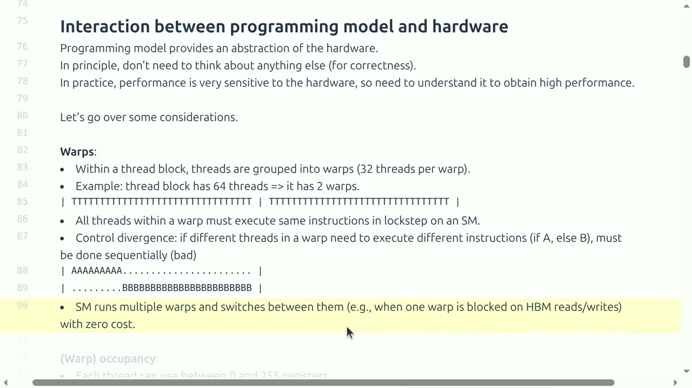

举个例子。假设一个线程块有 128 个线程，每个线程使用 160 个寄存器。硬件约束：B200 每个 SM 最多 65,000 个寄存器，并且不能同时运行超过 64 个 warp。算一下占用率。每线程寄存器数必须小于 255，这没问题。每块使用的寄存器数是每块线程数乘以每线程寄存器数，大约是 20,000。这意味着 SM 上最多同时运行 3 个块，对应 12 个 warp。最大 warp 数是 64，所以占用率是 18%。我们只运行了总 warp 数的 18%，因为每线程寄存器使用很多。这个例子说明内存/寄存器约束会限制你能做多少计算。

*[14:24](https://www.youtube.com/watch?v=xnDHaNUvHBg&t=864)*

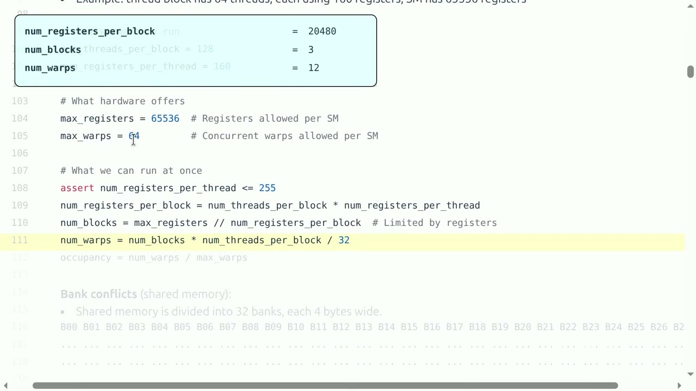

## Bank conflicts、memory coalescing 与 block occupancy
另一个例子是 bank 冲突（bank conflicts），适用于共享内存。共享内存像 L1，位于 SM 上。硬件上共享内存分成 32 个 bank，每个 4 字节宽。每个 bank 有很多元素。约束是每个时钟周期每个 bank 最多只能被一个线程访问。假设不是同一位置。比如不能同时访问这个位置和这个位置。所以多个线程访问同一个 bank 时，访问必须串行化，这叫 bank 冲突。最坏情况，想象一个矩阵这样布局，有个操作让 32 个线程都去访问第一列。你以为 32 很好，可以大规模并行，结果它们排队。这是 32-way bank 冲突，最差情况。你可能会说，那就访问行好了。但在 matmul 中不可避免，因为你必须访问一个矩阵的行和另一个矩阵的列，有时还要转置，不能总选择遍历顺序。对于 element-wise 操作没问题，任意顺序都行。但 matmul 中你不能控制每个矩阵是行主还是列主。有一些解决方案，比如 swizzling，重新排列共享内存，让遍历时避免 bank 冲突。这也是 profiling 时可以看的：bank 冲突、占用率，都能看到。

*[16:49](https://www.youtube.com/watch?v=xnDHaNUvHBg&t=1009)*

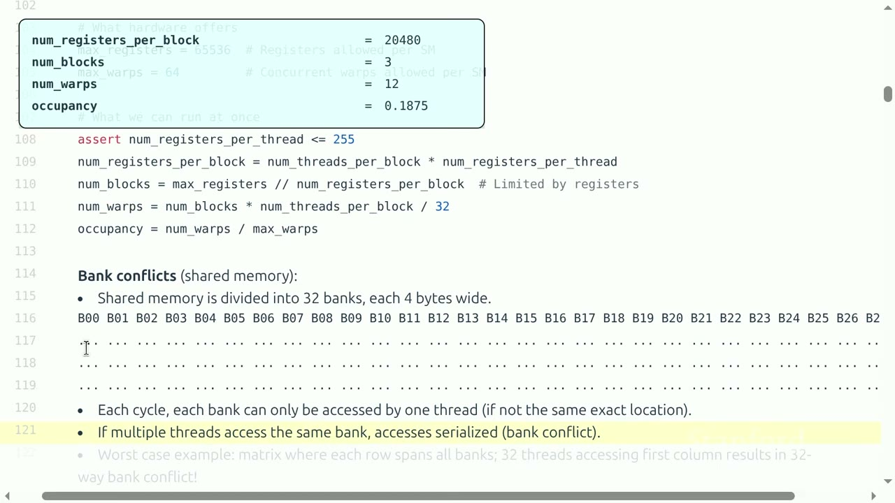

最后还有两件事。内存合并（memory coalescing），Tatsu 讲过，我快速提醒。当一个 warp 的 32 个线程访问 HBM 时，内存访问会合并成 128 字节的事务，叫缓存行（cache line），一次取回。想象内存这样布局，这是 32。最好情况叫完全合并（full coalescing），所有线程访问同一个缓存行。线程 1 访问 M00，线程 2 访问 M01，等等。这样一次抓取整个缓存行。而如果沿着列走，就会取很多后面不用的内存，第二行也一样。这感觉像 bank 冲突，但约束很不同。这个关于共享内存，那个关于 HBM。

*[18:15](https://www.youtube.com/watch?v=xnDHaNUvHBg&t=1095)*

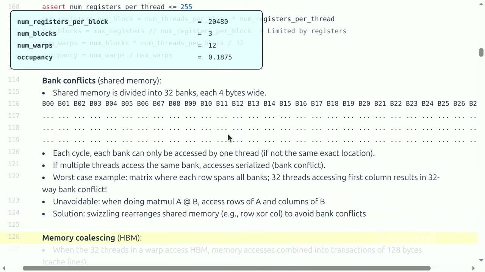

最后一个，块占用率（block occupancy）。线程块被调度到 SM 上。逻辑上你可以定义任意多线程块，但物理上芯片只有一定数量的 SM，比如 148 个。如果你启动 160 个线程块，只能先调度 148 个，等它们完成后才调度剩下 12 个。但调度 12 个时，很多 SM 什么都不做。这叫低占用率。当最后一波线程块少于最大线程块数时发生。一般来说，最好让线程块数量能整除 SM 数。总结：编程模型很优雅，有线程块网格，块内有线程。内存方面，HBM 对所有人全局，共享内存对线程块局部，寄存器对线程局部。但硬件细节——warp、bank 冲突、内存合并、占用率——真正决定性能。很多细节很难知道，profiling 会告诉很多信息，但你必须知道 SM 数量、各种尺寸。有时调度器做的事情你无法控制。所以比编程模型更乱。

*[20:19](https://www.youtube.com/watch?v=xnDHaNUvHBg&t=1219)*

这里停下来问问题。有学生问，能否让一个块共享 SM？比如 140 个 SM 和若干块，是否能让块共享 SM？回答是，如果块已经用掉 SM 上大部分 tensor core，再放一个块也不会加速。根本问题是块必须保持在一起，所以有不均匀的锯齿状问题，不能把一个块拆开铺到别处。你能做的是改变块大小，改变块的数量，避免最后那个尾巴。还有其他问题吗？

*[21:44](https://www.youtube.com/watch?v=xnDHaNUvHBg&t=1304)*

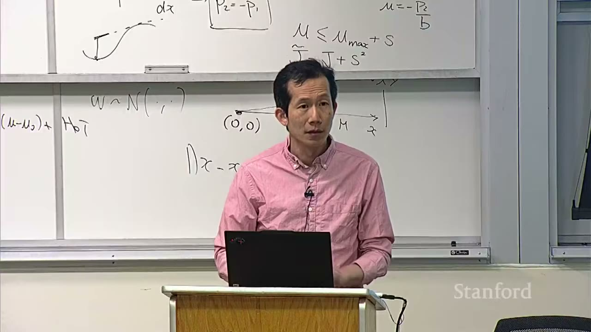

## Benchmarking 与 Profiling 哲学
好，继续。希望大家对 GPU 更熟悉了。现在讲 benchmarking 和 profiling。我可能不会讲太多内容，但想强调哲学：这是成功的配方。你 benchmark/profile 代码，做改动，再 benchmark/profile。为什么先讲 benchmarking 和 profiling，而不是更早教 Triton？因为你应该先测量代码里发生了什么，找到瓶颈，再开始写 kernel。Benchmarking 基本就是事情花多长时间，给你端到端时间。它不告诉你时间花在哪里，但仍然有用，因为最终你关心的就是运行多久。而且因为它把一个东西浓缩成一个数，你能看到随维度如何扩展。有个不错的工具做 benchmarking，但这门课是 language models from scratch，所以我从零做，主要为了强调几个坑。

*[23:21](https://www.youtube.com/watch?v=xnDHaNUvHBg&t=1401)*

假设有个操作：矩阵乘法。run_operation 是个包装器，实例化两个大小为 dimension×dimension 的随机方阵，返回一个执行操作的函数。调用 matmul 就对这两个随机矩阵做矩阵乘法。怎么 benchmark？朴素做法是开始计时，运行，停止计时。但有几件事。第一，永远记得 warm-up。我第二讲提过，但值得强调。因为有些东西是惰性编译的，warm-up 确保那部分时间不算进去。大多数时候你关心的是反复运行时有多快，初始条件不重要。第二，通常要计时多次，因为有方差。正确计时要用 CUDA events，start event 和 end event，调用 record。实际做计算，然后 end event.record。记得 synchronize 等 CUDA 线程完成，因为 GPU 上是异步的，这是同步屏障。然后记录时间。可以重复，然后取平均。如果特别讲究，可能看整个分布、P95 等，但这里取平均。Benchmarking 还可以扩大矩阵，看时间变化。矩阵乘法应该按立方增长。但注意一个缺陷：直到接近 2000 维矩阵之前，时间基本是常数。因为 GPU 是为相当大的矩阵乘法构建的，2×2 矩阵非常低效。

*[26:23](https://www.youtube.com/watch?v=xnDHaNUvHBg&t=1583)*

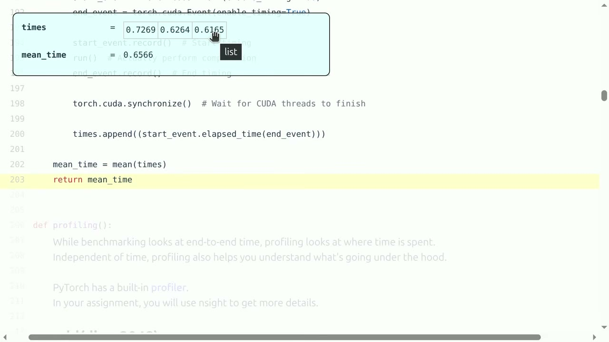

## Profiling 揭秘底层 kernel
快速讲 profiling。Profiling 告诉你时间实际花在哪里。希望大家都熟悉并在做。不那么明显的是，即使不关心时间，profiling 也能帮你弄清底层实际发生了什么。尤其用高级语言时，你写代码得到结果，有时理解底层很有好处。PyTorch 有内置 profiler。作业里会用 Nsight，给更多细节，这里为了时间跳过。举个例子，在 PyTorch 里把两个张量相加。run_operation 创建两个随机矩阵并应用操作。Profiling 时先 warm-up，然后放进 profiling 上下文，运行。看看 a+b 的 profile。平时你不会想太多，以为两个张量直接相加。底层发生了什么？看调用，有个长名字 kernel CUDA functor add。这基本就是加两个张量的 kernel。时间不有趣，因为只做加法，占 100% 时间。但它告诉你底层有 add 这个东西。

*[28:24](https://www.youtube.com/watch?v=xnDHaNUvHBg&t=1704)*

那 matmul 呢？PyTorch 里做 a @ b。类似地有个长名字描述这个 matmul kernel：Cutlass f32, f32, 64x64x16 等等。注意改变维度，比如现在做 128×128 matmul，你会得到不同的 kernel。仔细看，这个是 64x64x16，那个是 32x32x16。所以底层，PyTorch 看起来只是 a @ b，但底下可能发生各种事情。观察：你能看到实际调用哪些 CUDA kernel，通常长名字的那些。不同张量维度调用不同 CUDA kernel。名字也透露实现：Cutlass 是 NVIDIA 的 CUDA 线性代数库；SM100 对应 Blackwell 架构，说明这个 kernel 专为 Blackwell 设计；f32；64x64x16 是 tile 的形状，后面讲 tiling 时会展开。这就是 benchmarking 和 profiling，记住要做。作业会逼你做。

*[30:08](https://www.youtube.com/watch?v=xnDHaNUvHBg&t=1808)*

## GeLU 的三种实现：naive、built-in、torch.compile
把 profiling 用到另一个例子：GeLU。GeLU 激活函数是常用非线性，常用 tanh 近似，对计算机更友好。朴素地在 PyTorch 实现，就是把公式写进去，得到结果。PyTorch 也有内置的 functional GeLU。可以验证两者对随机输入结果相同。还有很多人知道的一点：你可以拿任何 PyTorch 函数，调用 torch.compile，它会生成另一个函数，做同样的事。于是这场比赛有三匹马：朴素实现、内置实现、编译实现。Benchmark：朴素约 3.75，内置快很多，编译也快很多，但可能不如内置。它们计算相同答案，但性能特征差异巨大。

*[32:19](https://www.youtube.com/watch?v=xnDHaNUvHBg&t=1939)*

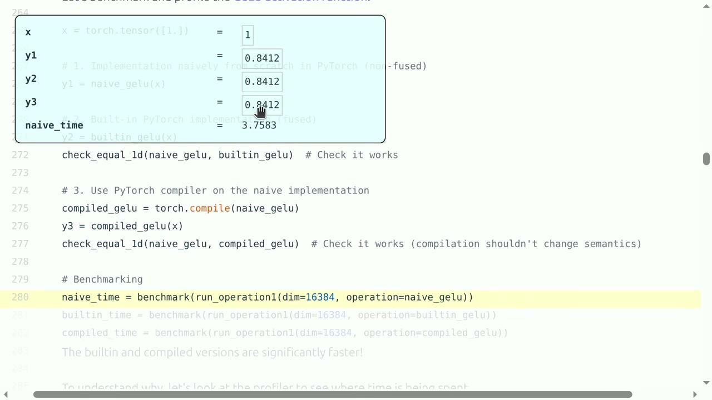

拉出 profiler 看底层。对朴素 GeLU 做 profile，看时间怎么花。有一堆不同 kernel：binary functor unary add，tanh 等。这对应 PyTorch 里写表达式时，计算图每个原语都实现成一个 kernel。为什么慢？因为启动 kernel 时，kernel 要从 HBM 读，拉到 SM，计算，写回。然后下一个 kernel 再从 HBM 读，写回，如此反复。kernel 调用之间数据必须回到 HBM，所以有大量读写。看内置实现，反而没什么有趣：一个 GeLU CUDA kernel 实现，单个 kernel 实现 GeLU。为什么存在？因为人们用 GeLU，有人写了 kernel 放进标准库，没什么魔法。

*[34:21](https://www.youtube.com/watch?v=xnDHaNUvHBg&t=2061)*

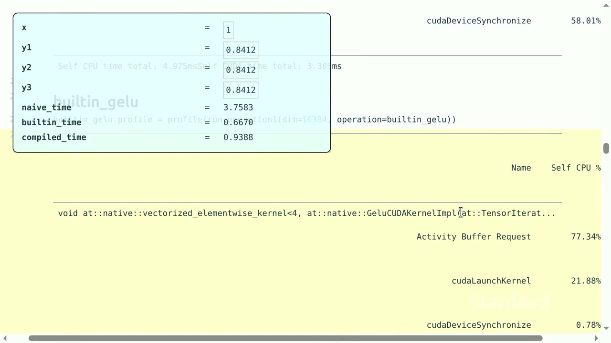

编译这里很有意思。我不细讲它怎么工作，但很吸引人。你可以拿朴素实现——它是 PyTorch，有计算图——跑一个编译器。看底层，它只是一个 kernel。因为它看懂计算图，然后把那个 kernel 用 Triton 写出来。所以这实际上是个 Triton kernel。总结：朴素实现多个 kernel，需要多次 HBM 读写，没有 kernel fusion，慢。内置和编译版本只有一个 kernel，GeLU 所有操作融合在一起，每元素只从 HBM 读一次写一次。编译 kernel 是 Triton kernel。这就自然引出 Triton 是什么。有问答：内置是 CUDA kernel 实现，有人用 CUDA 写的。为什么 Triton kernel 更快？这里其实不更快；编译版本是一个 Triton kernel，但比内置慢。去年做时更接近。这些变化且高度依赖硬件，这里都没怎么优化，只是给你大致概念。

*[36:51](https://www.youtube.com/watch?v=xnDHaNUvHBg&t=2211)*

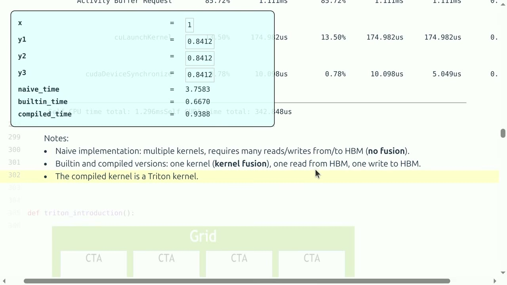

## Triton 编程模型
现在写一些 Triton kernel。回忆编程模型：一堆线程组织成线程组、线程块，线程块构成网格。如果用 CUDA 写——CUDA 最初由 NVIDIA 开发，多年来写 kernel 就是用它——心智模型是每个线程做什么。你写一段代码，带一个 ID 标识哪个线程，然后它执行。好处是贴近底层实际，细粒度控制。但缺点是所有线程在一个线程块里，有些操作需要它们通信，就必须同步。它们从 HBM 一次读，同步，计算，你要做这些簿记。如果全是 element-wise，CUDA 挺好，无所谓。但操作越复杂，Triton 的抽象价值越大。Triton 由 OpenAI 开发，现在很标准。你基本上指定每个线程块做什么。通常足够强大，尤其这门课。如果你想利用最新硬件每个新特性，可能不够灵活。但先不担心。Triton 的概念框架是：一个块把数据加载到共享内存，操作，再写回全局内存。所以这些块介于单个元素和整个操作之间。PyTorch 里你定义巨大矩阵，说乘起来，那是原子操作，你想的是怎么把东西变成大 matmul。Triton 是两者之间的混合。

*[39:44](https://www.youtube.com/watch?v=xnDHaNUvHBg&t=2384)*

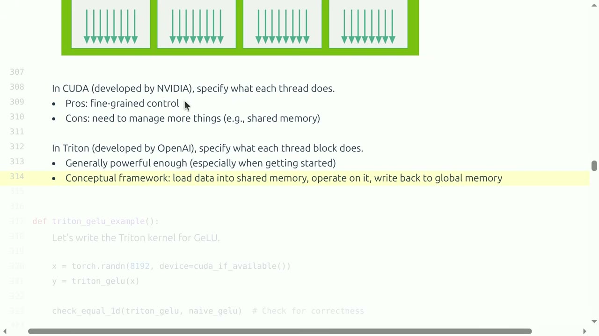

## 第一个 Triton GeLU kernel
从 GeLU 例子开始。定义 8000 维向量，开始写 Triton。Triton 基本上就是写 Python。有多少人写过 Triton？举手。不多，很好，不会无聊。先准备普通 PyTorch。没有 Triton，只是准备。把张量拿来，分配输出张量。因为在 Triton 里不再函数式思考，而是显式读写。没有返回值。分配输出张量，kernel 会写进去。这个张量可能任意大，不能全放进一个 SM，太大。所以要分块。把 x 看成数组，切成块。总元素 8000，blocksize 先设 1024，于是有 8 个块。然后调用 kernel，用这种奇怪语法：triton_gelu_kernel[(num_blocks,)]。括号里是网格形状，表示网格有 num_blocks 个块。对每个块调用 triton_gelu_kernel 函数，传入 x, y, num_elements, blocksize。

*[42:17](https://www.youtube.com/watch?v=xnDHaNUvHBg&t=2537)*

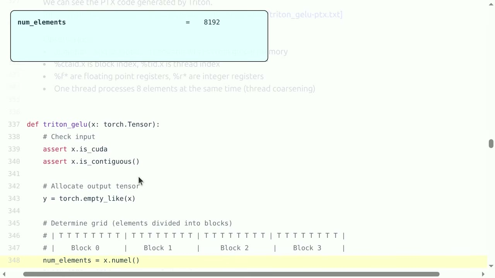

没法逐行 trace，直接看代码。这是能想象的最简单 kernel。看 triton_gelu_kernel，现在参数是 x 和 y 指针。你可以把它们看成整数，是地址。要习惯这一点。然后有 number of elements 和 blocksize，从这里传进去。每个块会调用这个函数。第一件事是块醒来问：我是谁？程序 ID（PID）标识块。比如 PID 对第一个块是 0，然后是 1,2,3。然后要弄清操作哪段数据。start = PID * blocksize。这是 x 指针的偏移。PID 为 0，start 是 0；PID 为 1，start 是 blocksize；PID 为 2，start 是 2*blocksize，依此类推。然后确定跨度：offsets = start + tl.arange(0, blocksize)。tl 是 Triton 库，概念上给出 0 到 blocksize-1 的整数。比如块 1，offsets 是 blocksize, blocksize+1 一直到 2*blocksize-1。这里 num_elements 整除 blocksize，但一般不一定，所以 Triton 代码常见 masking。假设张量只到某处，就形成一个 mask，在那之前为 true，之后为 false。非最后块则全为 1。然后做读取。这是指针算术：x 指针是 x 的内存位置整数，加上 offsets，得到前 blocksize 个元素。根据 mask，被 mask 掉的不读。然后可以把它看成向量，做正常计算，得到 y。y 和 x 同样大小。然后 tl.store(y_ptr + offsets, y, mask)。从 HBM load，做事情，写回 HBM。

*[46:12](https://www.youtube.com/watch?v=xnDHaNUvHBg&t=2772)*

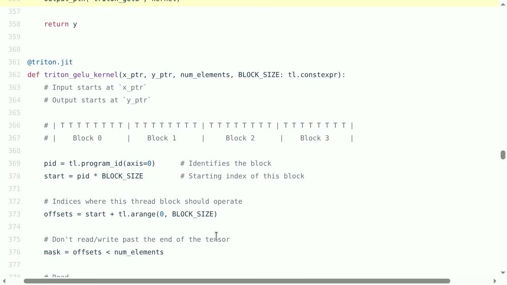

停下来问问题。有人问这个与 CUDA 的区别。对于 element-wise，看起来差不多。实际上 CUDA 更简单，因为它真的是 element-wise：线程醒来，识别线程，操作那个元素。这里只是向量化版本，有一个块，操作整个块。后面会看到，如果做的不只是 element-wise，块操作更强大，而 CUDA 会麻烦得多。另一个问题：如何用 tensor units？后面会展示代码编译成什么。简短回答：你不控制，硬件决定把东西放在哪里。还有人问，从 HBM 到 shared memory 再到 register 实际发生了什么，数据逐步流动过程。简短说，这在某种意义上是假的。不是 GPU 真的在调用 Triton 库执行这段代码。这基本上是为了让我们指定计算。编译器会接收它，后面会看到，写成一种叫 PTX 的东西，然后才真正干活。机制上就是这样。概念上，x 指针是 HBM 中的一个内存位置，指定一段内存位置，load 接收那些位置并返回关联数据。这里有个名为 x 的局部变量。实践中通常是 register 或 shared memory。Triton 决定那里怎么做，在 thread 层级上。有人问调用时是否清楚什么放 shared memory 什么放 register，还是现在才发生，太晚了。这就是所有 thread 闲置、等待内存刷入的地方。SM 上多个 warp，会切换。对，就是这样。

*[50:09](https://www.youtube.com/watch?v=xnDHaNUvHBg&t=3009)*

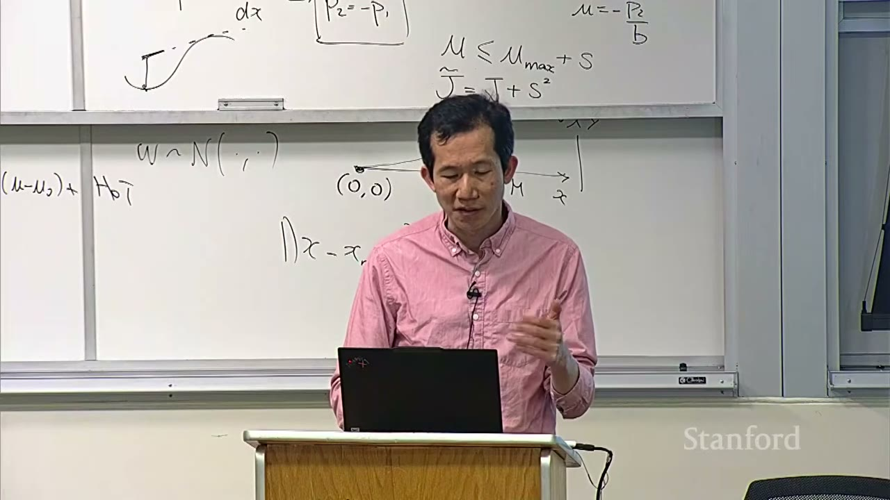

## PTX 以及线程实际执行什么
所有 kernel 都长得差不多：输入、输出，醒来，确定要看哪个索引，读取，做事情，写回 HBM。现在简单讲 PTX。写 Triton 时，编译器生成 PTX 代码，这是 GPU 的中间汇编语言。我不逐行讲，只给感觉。先观察几件事。这是线程实际在做什么，不是线程块，因为线程块已经被编译掉了。LD.global 基本上是从 HBM 加载到寄存器。寄存器用 r 表示整数寄存器，fr 表示浮点寄存器。还有 mov 0 到 r5，mov 0 到 r6 等。然后有乘法：某个寄存器乘以常数，放进另一个。这段代码会执行。底部能看到 global store，写回 HBM。这是线程实际执行的代码。Triton 是上面一层。另一个注意点：你会看到这些块，里面有 thread coarsening。这是一个线程，但处理不止一个元素，而是八个元素。编译器认为这个线程很轻，做的不多，就把它加厚一点。看 PTX 能让你体会底层在干什么。有人问这是不是为每个线程生成？这是编译一次，每个线程运行同一段代码。线程区分自己的方式是代码会传入线程 ID。CTA.x 是块索引，tid.x 是线程索引。所以这段代码运行时，知道我在哪个块，tid.x 知道我在块内哪个线程。还有其他问题吗？

*[55:51](https://www.youtube.com/watch?v=xnDHaNUvHBg&t=3351)*

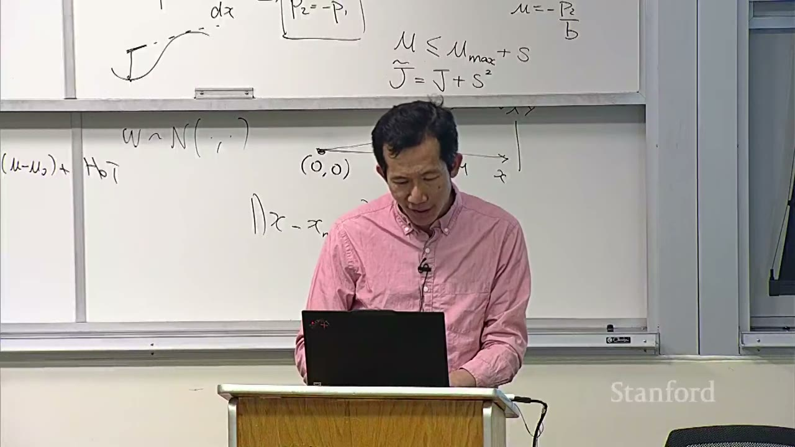

PTX 通常由编译器生成，不是你平时写的东西。看起来像汇编。有人确实写 PTX，如果你觉得自己比编译器强。NVIDIA 编译器通常很成熟，但一些不太发达的加速器可能有时需要手动多管一点。一般来说不需要。有人评论：工作被调度到 SM 上，遇到 load 几乎像 CPU trap call，等待事情发生，自己闲着，其他工作被调度过来，上传完成后重新调度继续。对，是这样。看 Triton 代码，这些 load 语句会阻塞若干周期。它运行在某个 SM 的某个 warp 的某个线程上。记住 SM 同时运行多个 warp。到那个点时，可以找另一个 warp 运行。完成后 warp 调度器再回来接管。为什么有四个 warp 调度器？我不确切知道原因。

*[57:15](https://www.youtube.com/watch?v=xnDHaNUvHBg&t=3435)*

## Softmax：行适配一个块
现在看其他例子。快速预览：还要做三个例子。GeLU 是最简单形式，虽然计算有 messiness，但只是 element-wise，概念上很简单。然后看 softmax，需要做归约，先考虑一行能放进一个块的情况。然后考虑一行放不进块的情况，再上到 matmul。到那时你就有做作业和实现 flash attention 的所有 ingredients。到目前为止看的是 element-wise。现在想聚合多个值的操作。回忆 softmax：把它看成矩阵，对每行指数化并归一化。用于 attention 和生成输出概率。先看朴素实现，跟踪发生了什么。定义 tensor，朴素实现。这大概在作业一里。有 M×N 矩阵。对每行计算 max，为了数值稳定，减去 max，然后逐元素指数化，求和，计算每行的归一化常数，再除。就这些。

*[59:38](https://www.youtube.com/watch?v=xnDHaNUvHBg&t=3578)*

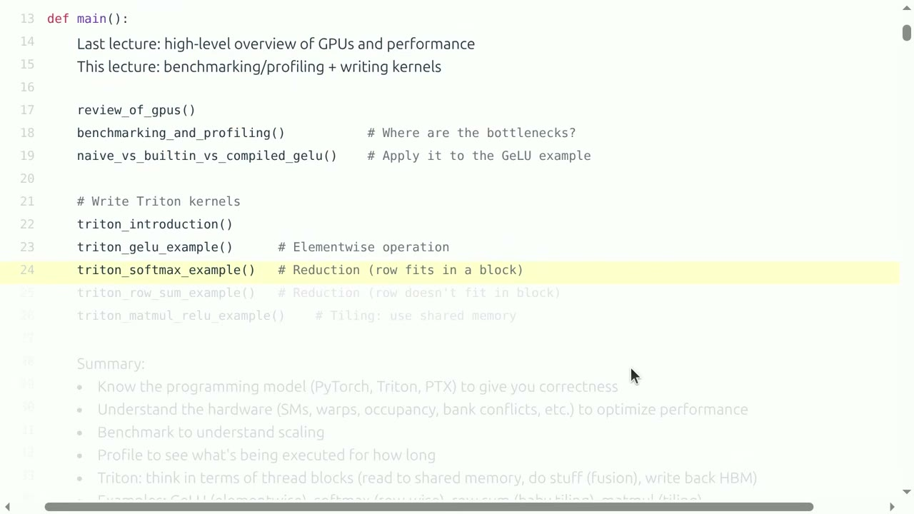

数一下读写。这是普通 PyTorch，这是不同 kernel，这是不同 kernel。除非调用 torch.compile，这些都是不同操作。每个操作都从 HBM 读写。所以有 5 MN 次读，3 MN 次写。原则上应该少得多。这段代码大家都应该熟悉 softmax 在做什么。现在写 Triton kernel。形式上很像 GeLU。做完脚手架后，核心计算看起来很像朴素版本。我们让每行一个块。为什么每行一个块？因为每行要归一化和求和，不是 element-wise，但它是 row-wise。块之间不交互，不需要跨块共享内存。所以每行内做事情。

*[61:11](https://www.youtube.com/watch?v=xnDHaNUvHBg&t=3671)*

在 Python 里分配输出张量，有 M×N 矩阵。定义 blocksize 为列数，取下一个 2 的幂。块数是行数 M。调用 kernel。有多少块？M，每行一个。每个块传入输入指针、输出指针，还传 strides，告诉往下走多远。看 softmax kernel。醒来，在特定行。offsets 给出从 0 到 blocksize 的所有列，假设这就是所有列。读取。需要确定从内存哪里读，是数据起点加上哪一行。行 stride 基本上就是列数，告诉往下走多远。x pointers 是需要加载的所有数据地址。加载。如果被 mask 掉，就放负无穷，因为对 softmax 等价于 0。然后这部分和朴素 softmax 一样：计算 max，减去，指数化，求和，除。然后写回。这是每块可以跨整行的版本。Triton 让这很容易，像写普通 PyTorch。如果都能塞进一个块，几乎可以写普通 PyTorch。问答：如果列数、行数大于 blocksize？后面会讲。一般来说行列会比 blocksize 大很多。按列做 softmax 呢？也可以，只需改 stride 来访问列，列偏移乘以行 stride。

*[65:21](https://www.youtube.com/watch?v=xnDHaNUvHBg&t=3921)*

## 行太大：分 tile 迭代归约
好，现在为 matmul 热身。假设一行放不进一个块。比如一行 4000 列，blocksize 只有 1024。怎么办？策略是把行分成 tile。这里有四个 tile。每个线程迭代 tiles 并累加和。最后做归约，把每个线程产生的部分和加起来。为了好懂，从 softmax 换成 row sum。内置 row sum 没有惊喜，就是求每行和。概念上：每个块仍负责一行。假设块 1 行 1。醒来，现在有 tiles。tile 0 是列 0 到 3，tile 1 是列 4 到 7，tile 2 是列 8 到 11。每个线程保持累加器，处理第一个 tile。然后下一个 tile，把当前元素加到累加器。比如放 3,1,4,1；第二轮加 5 得 8，加 9 得 10，2 加到 4，6 加到 1。四个线程各自累积。tile 2 再加 5 和 3 到各自累加器。最后得到一个累加器向量，再求和。

*[68:21](https://www.youtube.com/watch?v=xnDHaNUvHBg&t=4101)*

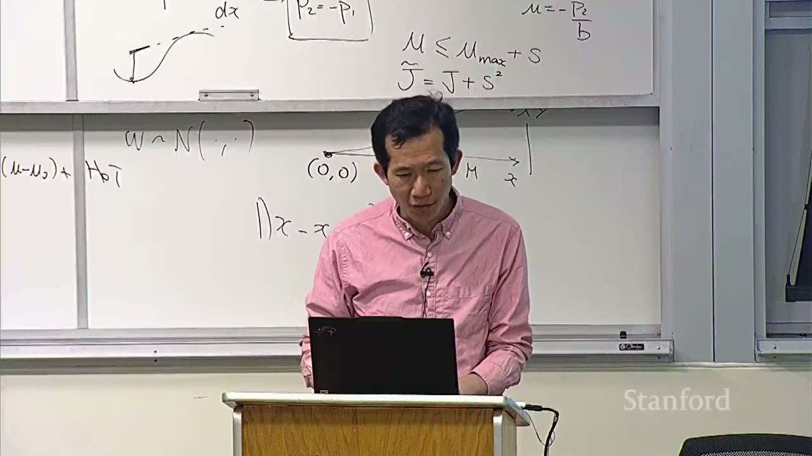

看代码。调用 row sum kernel。醒来在某一行。这是一行的样子：tile 1、tile 2、tile 3 等等。n 是那一行的元素数，blocksize 是 tile 大小。记住 blocksize 是线程数。我处理的数据比 blocksize 大，所以必须迭代。循环所有 tiles：start 从 0 到 blocksize 到 2*blocksize 等等。每次跳转，获取那个 tile 的 offsets，从 HBM 加载数据，加到累加器。累加器可能在寄存器或共享内存。循环完所有 tiles，处理完整行后，每个线程有自己累积的值。可以求和得到标量，写出去。这比以前复杂，因为线程内有 for 循环。当数据放不进一个块时这是必要的。问答：累加器放哪里？至少在这个 Triton 程序里不显式说，由 Triton 编译器决定。一般来说，如果 blocksize 足够大，必须放共享内存。还要注意 GeLU 时也把行分成 pieces，但那些是独立的块。这里不是块，是 tiles。块对应整行，块必须处理所有 tiles。所以开始不像 PyTorch，因为不是所有数据都能放进共享内存。

*[71:02](https://www.youtube.com/watch?v=xnDHaNUvHBg&t=4262)*

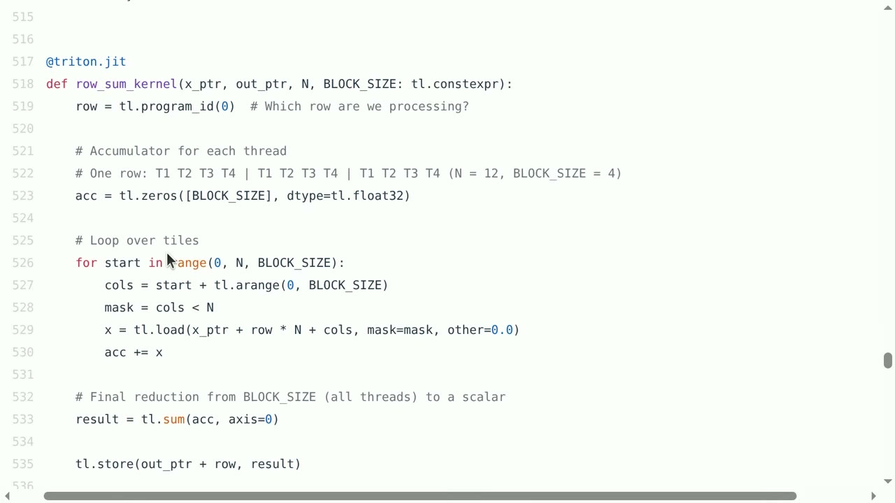

## Matmul 与 tiling
现在进入 finale：matmul。矩阵乘法是深度学习的 bread and butter，被优化到极致，非常基础。拿两个矩阵相乘。我加个小 twist：matmul 后接 ReLU，随便玩玩。这会发生，因为线性层是 matmul，然后 ReLU 激活，不算凭空。后面会展示为什么这么做。怎么构建 matmul kernel？朴素方法：A 是 M×K，B 是 K×N，C 是 M×N。固定一个输出元素，比如 C5。对每个 k，遍历 A 的行和 B 的列，从 HBM 读，乘，累加，最后写这个元素。这是有效的 matmul kernel。但问题呢？它正确，但读写数量不好。对每个 M,N,K 都要从 HBM 读，量级是 M*K*N 次读。关心的是瓶颈。第二讲说过，算术强度是操作数除以传输字节数，希望它高。操作数是 M*K*N 量级，读也是同样量级，所以算术强度是常数，不好。仔细看，有大量冗余读。计算 C4 需要读 A4,A5,A6；计算 C5 又要再读一遍。如果只读一次就省很多。用共享内存来做。

*[75:14](https://www.youtube.com/watch?v=xnDHaNUvHBg&t=4514)*

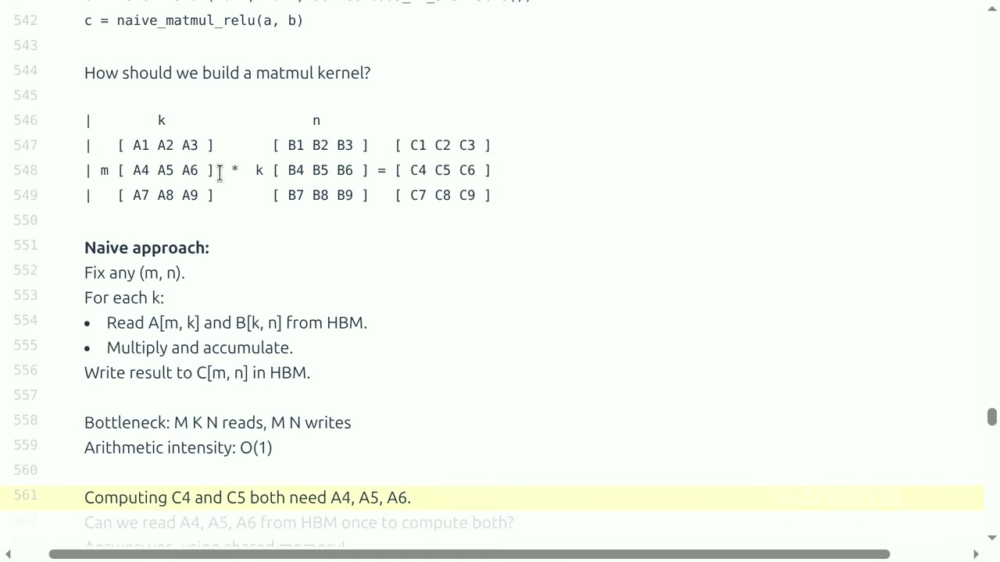

理想化方法：把 A 和 B 全部加载到共享内存，然后算 C。这样就没有立方数量的读，只有平方数量的读，算术强度达到 O(n) 量级。第二讲说这是理想情况。没有冗余读，所有东西读一次进共享内存，计算，写回。但问题是什么？A 和 B 通常太大，放不进共享内存。所以必须用经典的 tiling。想法是尽量把能放的放进共享内存。全局看像朴素方法，局部看像理想方法。图景：拿矩阵 C，朴素方法对每个元素计算，现在对每个 tile 计算。把 C 分成 tiles，每个 tile 是一个线程块，有一堆线程负责计算。不同 tile 由另一个线程块完全独立计算。在 Triton 里，我醒来，看着这个线程块。要做什么？有点像朴素方法，对 A 的每个行 tile，扫描行；对 B 的每个列 tile，加载对应的 A tile 和 B tile 到共享内存。把它们相乘，像理想方法。累积部分和，都在共享内存。完成行列扫描后，把输出 tile 写到 HBM。算术强度现在升到 O(tile size)。一般到不了 O(n)，因为那要求全部塞进共享内存，但 tile 大就还不错。bonus：既然写 kernel，如果想应用 element-wise 激活，最后加进去很容易，这叫 kernel fusion。

*[78:53](https://www.youtube.com/watch?v=xnDHaNUvHBg&t=4733)*

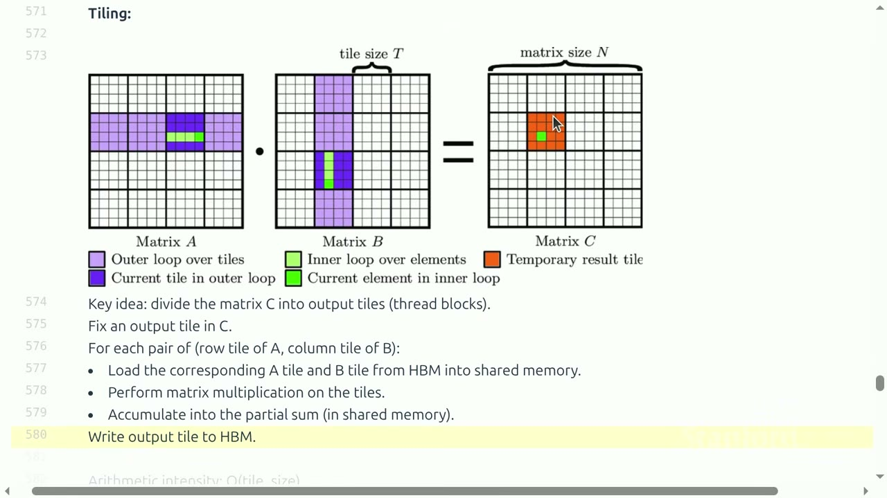

快速讲实现。先提醒 strides。张量是多维数组，但在内存里线性化。stride 告诉你如何把多维索引（如行、列）映射到实际索引：行乘以行 stride，列乘以列 stride。比如每前进一行，在内存中走 4 个位置；每前进一列，走 1 个。如果转置，就反过来。这个 kernel 长这样。启动不有趣。醒来，你在 tile M,N 上。你负责计算 C 矩阵的 M,N tile。有一堆索引操作，我快速略过，直接但要注意跟踪。这告诉你 A 的哪些行，B 的哪些列。然后是 1 到 K。得到 A 和 B 在 tile 位置的指针。设置累加器矩阵，M×N，在共享内存。然后像行归约：对所有 tiles 求和。不过现在同时沿 A 的行 tile 和 B 的列 tile。加载小 A、小 B，执行 dot。记住，东西在共享内存时看起来像 PyTorch，可以直接说 matmul，它会做。然后推进到下一个 A 行 tile 和 B 列 tile。bonus 是在写回 HBM 前，可以应用 element-wise 非线性。最后写出去。有些索引要注意，但算法形式清楚。

*[82:06](https://www.youtube.com/watch?v=xnDHaNUvHBg&t=4926)*

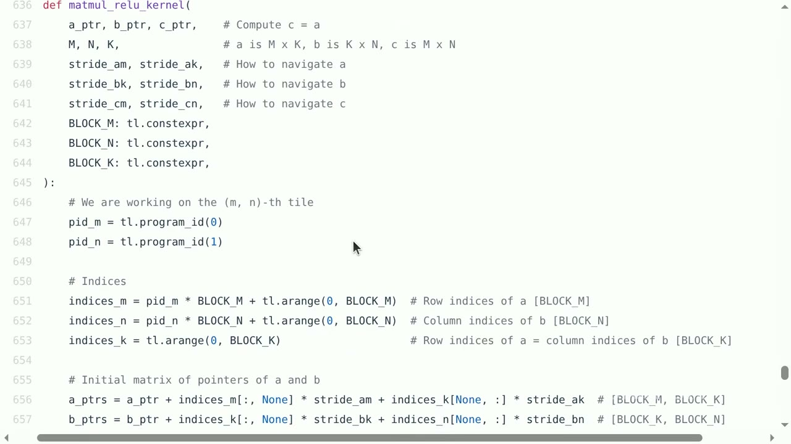

## 总结与问答
总结。今天讲了编程模型：你可以用 PyTorch、Triton 或 PTX 来谈。这是程序员能控制的。甚至 PTX，你可以写 PTX 并完全控制、特化。但这不是全貌，因为代码必须在硬件上跑，只有有限数量的 SM、bank，内存和寄存器大小都有限。你带着大矩阵和 transformer 来，必须适配硬件约束。所以 benchmarking 和 profiling 很重要，理解硬件的混乱如何转化为性能。我们讲了 Triton，它是个很漂亮的语言，让你按线程块思考。希望你现在能体会到，按线程块思考比按单个线程容易，因为不用显式同步线程或做共享内存。思考方式是：有计算，分解成线程块，块从共享内存读，做事情，写回 HBM。例子难度递增：element-wise 最容易；行归约；行放不下的归约，引入 baby tiling；matmul 是真正做 tiling 的经典例子。这就是关于单 GPU 编程的全部。下次讲多 GPU 编程。

*[84:21](https://www.youtube.com/watch?v=xnDHaNUvHBg&t=5061)*

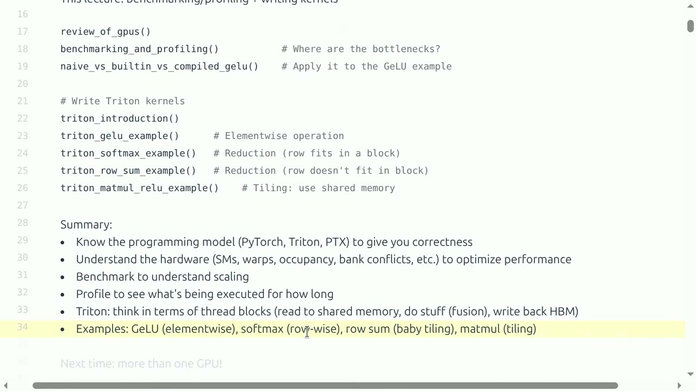

问答。有人问如果想写 kernel，有哪些替代？必须用 Triton 吗？每个选择能多接近最优？回答：替代 Triton 的有不同权衡。每种语言都有归纳偏置，让某些事容易、某些事难。Triton 是训练 transformer 的人做的，所以涉及 transformer 的东西会相对容易。极端情况下可以写 PTX，但不建议作为第一步。还有其他库，比如 ThunderKittens、CUTE，各种 DSL，它们不一定在栈上更高或更低，只是特性不同。另一个问题：高维张量处理，最佳方法是什么？是把两个张量一次性加载到很多线程或线程块上同时计算，还是像这里一样逐元素处理再写回？简短说，很难抽象回答，取决于计算的性质。可以线下聊。好，下次见。

*[86:34](https://www.youtube.com/watch?v=xnDHaNUvHBg&t=5194)*
