# CS336 第七讲：并行——集合通信原语与三种并行策略

这堂课先讲分布式通信原语和 GPU 互连的硬件层级，再用 MLP 的极简实现演示数据并行、张量并行和流水线并行三种切分模型的方式。

## 从一块 GPU 到多块 GPU：为什么需要并行

好，我们开始吧。欢迎回来，各位。今天我们要讲并行。记得上周我们介绍了如何通过写 kernel 让单个 GPU 跑得快，还深入看了 GPU 内部——有高带宽内存 HBM、L2 cache、L1 cache、寄存器，还有一堆流式多处理器（streaming multiprocessor，SM）。这周我们要讲如何利用多块 GPU，让你的代码跑得更快。你脑子里该有的图景大概是这样的：上周我们只盯着其中一个盒子，现在图景扩展了，因为你可能不止有一块 GPU，可能有四块，也可能有一千块，这些 GPU 会被连接起来——怎么连我稍后会讲——然后你得想办法利用这些算力来训练模型。

*[01:12](https://www.youtube.com/watch?v=SzpOcwdIL0Y&t=72)*

无论单 GPU 还是今天要讲的多 GPU，把镜头拉远看，情况其实很像：计算单元——算术逻辑单元、tensor core 这些——离数据很远。在单 GPU 里，“很远”意味着数据远在 HBM 那头；到了多 GPU，你需要的数据可能整整齐齐放在另一块 GPU 上，你得想办法把它挪过来。但原则是一样的，因为这场游戏的核心就是编排计算，尽量避免数据传输瓶颈。用一大堆 GPU 很容易，把它们用好很难。

*[01:57](https://www.youtube.com/watch?v=SzpOcwdIL0Y&t=117)*

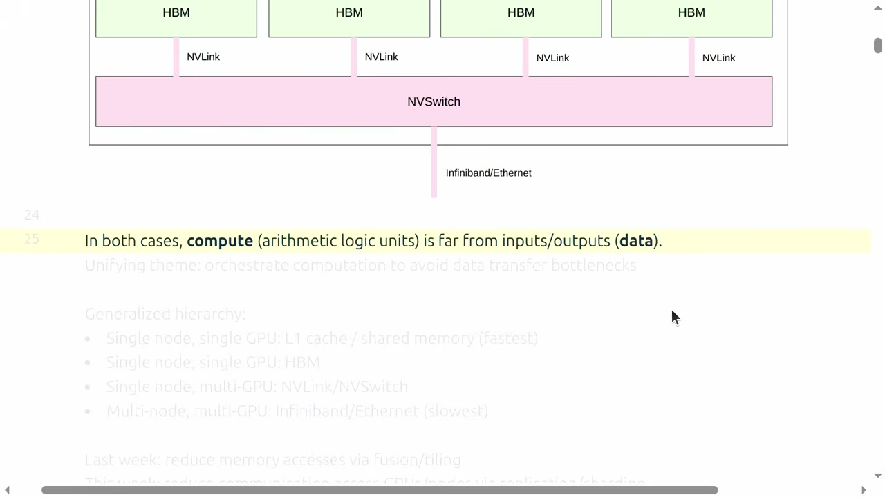

稍微自由发挥一下，我们可以想一个广义的层级结构：在最靠近 SM 的本地层面，是单节点单 GPU 里的 L1 cache 和共享内存，这是最快的；再往外是 HBM，上周我们还在抱怨它那么慢，但在这堂课里，HBM 要算快的了。接着我们要考虑单节点多 GPU 的设置，GPU 之间通过 NVLink 和 NVSwitch 连接。最后是多节点多 GPU，那就得用 InfiniBand 或者以太网，取决于你手上是什么网络。

*[02:49](https://www.youtube.com/watch?v=SzpOcwdIL0Y&t=169)*

上周我们讲了各种减少内存访问的技巧：融合（fusion）和分块（tiling），把数据读进共享内存，尽量多算一会儿，再写回去。这周我们要讲的是，如何通过恰当的复制和分片，减少 GPU 之间的通信量。

*[03:17](https://www.youtube.com/watch?v=SzpOcwdIL0Y&t=197)*

为什么要用多 GPU？最显然的答案是想要扩展规模，但说得更细一点，其实有两个原因。一是你的参数、激活值、梯度或者优化器状态装不进单块 GPU 的 HBM——B200 有 192 GB，如果你训练一个一万亿参数的模型，一块卡显然装不下。另一个原因是，即使模型能装进一块 GPU，你也可能想利用更多 GPU，把东西拆开来训得更快。所以有时候要做权衡：如果全都塞在一块卡上，核就少；摊开之后，又要付通信带宽的代价。这中间要算一算，才能决定怎么并行。

*[04:18](https://www.youtube.com/watch?v=SzpOcwdIL0Y&t=258)*

先说明一件事：到目前为止，这门课的代码都是 Python 的，你直接执行它，什么都能显示出来。但这堂课如果直接跑，它用的是 multiprocessing。我跟踪代码的时候，会把它放进一个特殊的单进程模式。如果你想看这堂课在多进程设置下的标准输出，可以点这里，我在讲的过程中会展示。只是要记住，我们一步步走这堂课的时候，并没有真的在做多进程，只是在单步执行一行行代码。

*[04:56](https://www.youtube.com/watch?v=SzpOcwdIL0Y&t=296)*

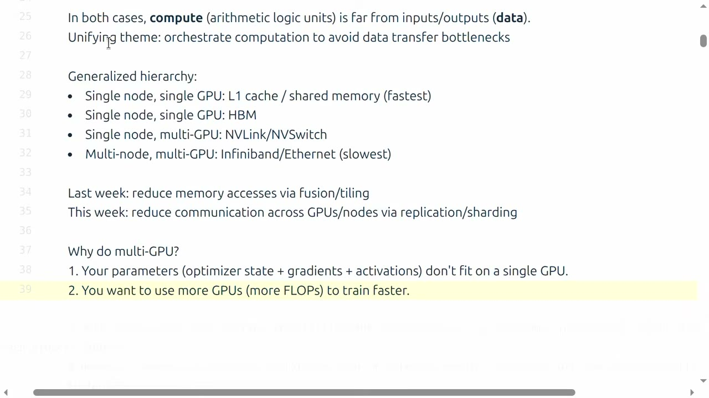

这堂课分两部分。第一部分，我们要学习分布式通信与计算的构建块，从编程模型开始，讲一点硬件，然后开始用 Torch 实现——这也是你们作业二要做的。第二部分，我们看真正的训练，看三种并行：数据并行、张量并行、流水线并行，每一种都以不同的方式切分模型。我们会用 MLP 而不是完整的 transformer 来演示，但这里展示的是核心计算。

*[05:45](https://www.youtube.com/watch?v=SzpOcwdIL0Y&t=345)*

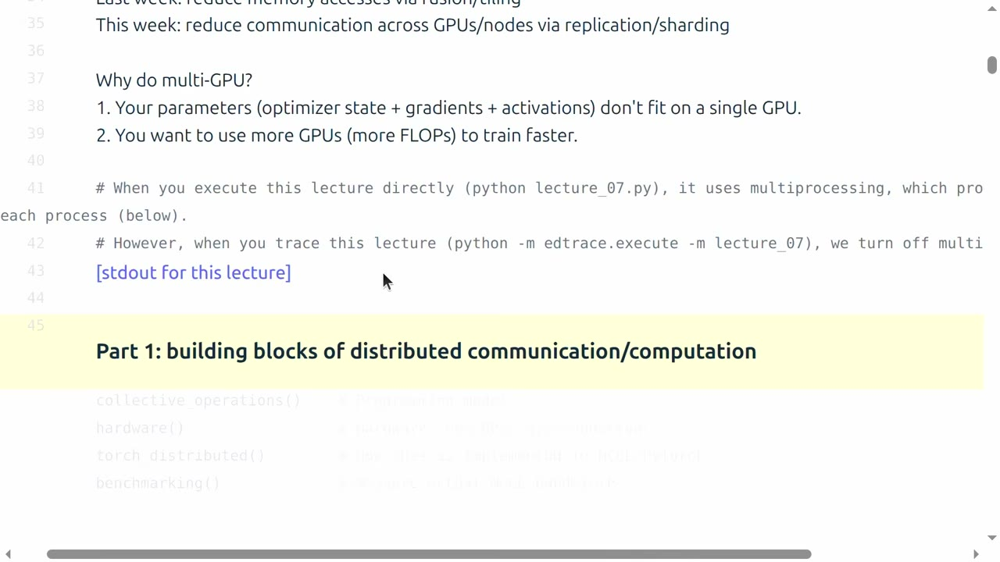

## 集合通信：来自分布式编程的老原语

首先要谈的是集合操作（collective operations）。这些是分布式编程里的原语，可以追溯到 80 年代。并行编程这个想法非常古老，它不是为 LLM 训练发明的，但直到今天，我们用的仍然是这些原语。这里 collective 的意思是：你指定的是一个跨多设备的通用通信模式或模板，而不是去点对点地管理这块 GPU 怎么跟那块 GPU 通信。这样会容易得多，系统也能替你干更多活。这是一个久经考验的接口。

*[06:44](https://www.youtube.com/watch?v=SzpOcwdIL0Y&t=404)*

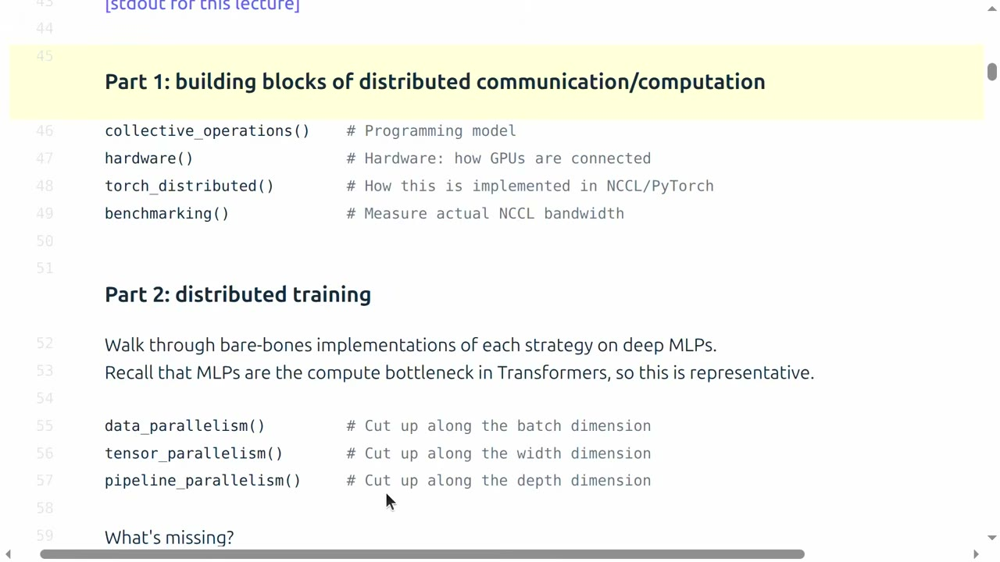

一般设置是这样的。这里的术语有点怪——我自己也觉得有点怪——但这是并行编程里的标准说法。你有一堆 rank，rank 对应一个特定的设备，在我们的情况下是 GPU，也可能是 TPU。比如这里有四个 rank，world size 对应设备数量，所以这里的 world size 是 4。

*[07:13](https://www.youtube.com/watch?v=SzpOcwdIL0Y&t=433)*

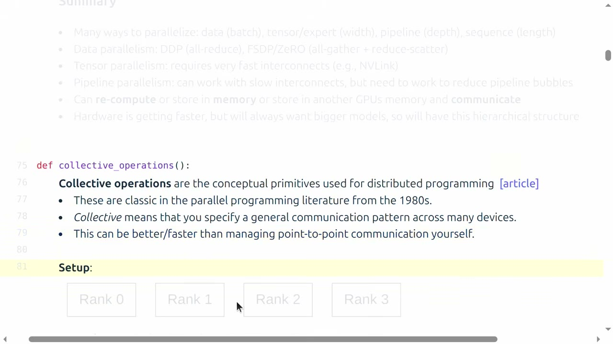

要讲的操作有：broadcast、scatter、gather、reduce、all-gather、reduce-scatter、all-reduce，还有 all-to-all。每一个操作都规定了这一组 rank 或设备如何把一定量的数据／计算传给另一组设备。前四个——broadcast、scatter、gather、reduce——算是热身，它们让你对这些集合操作怎么工作有个感觉，但它们并不是驱动训练的主力。all-gather、reduce-scatter 和 all-reduce 才是会在语言模型分布式训练里反复出现的。最后 all-to-all 我在这里提一下，它对 MoE 很重要，但这堂课不会花太多时间。

*[08:16](https://www.youtube.com/watch?v=SzpOcwdIL0Y&t=496)*

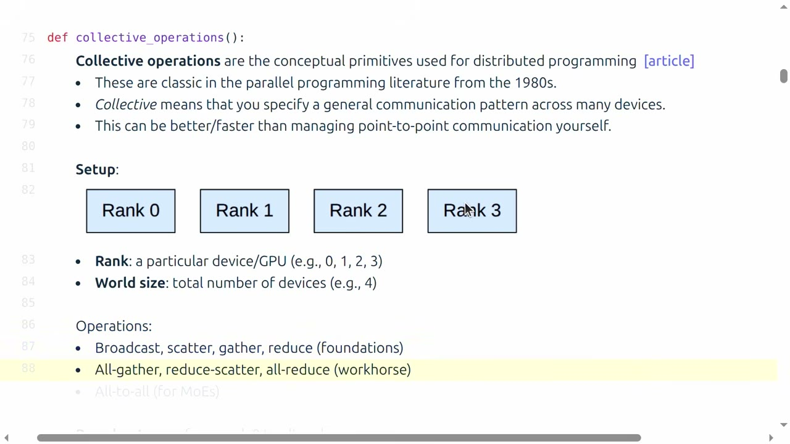

## 四个热身操作：broadcast、scatter、gather、reduce

先从最简单的操作 broadcast 开始。broadcast 里，有一个 rank 0——其实可以是任意 rank，只是举例方便选 0——它有一个张量 0、1、2、3，然后把它广播给所有 rank。操作结束后，每个 rank 上都有同一个张量。这个应该很直白。它一般不会出现在训练的核心路径上，通常用于初始化：比如你初始化一个 load、一个初始 checkpoint，然后广播给所有 rank。这种事只做一次。

*[09:10](https://www.youtube.com/watch?v=SzpOcwdIL0Y&t=550)*

第二个操作是 scatter。scatter 的意思是：rank 0 手上有一个张量，我把它切成 world size 份，散布到其他 rank 上。rank 0 拿到第 0 个分量，rank 1 拿到这个，rank 2 拿到这个，rank 3 拿到那个。它也不是直接使用的，但 scatter 是理解 reduce-scatter 的重要台阶。顾名思义，scatter 就是把某个地方的一个大张量铺开到多个地方。你能看出这为什么有用：你希望被散布到的 GPU 各自拿不同部分做本地计算。

*[10:13](https://www.youtube.com/watch?v=SzpOcwdIL0Y&t=613)*

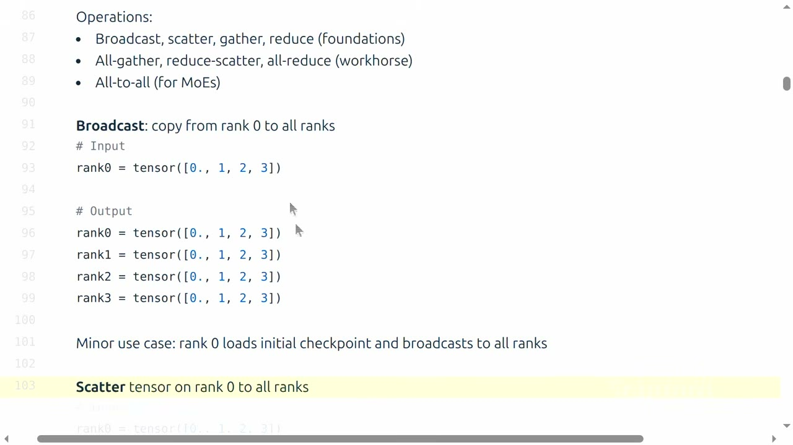

scatter 的逆操作是 gather。这应该很好预测：输入是一堆分片，各自住在某个 rank 上；做 gather 时——相对于某个特定 rank，比如 rank 0——它就把所有分片拼接起来。gather 同样不是直接用的，但它是理解 all-gather 的台阶。

*[10:45](https://www.youtube.com/watch?v=SzpOcwdIL0Y&t=645)*

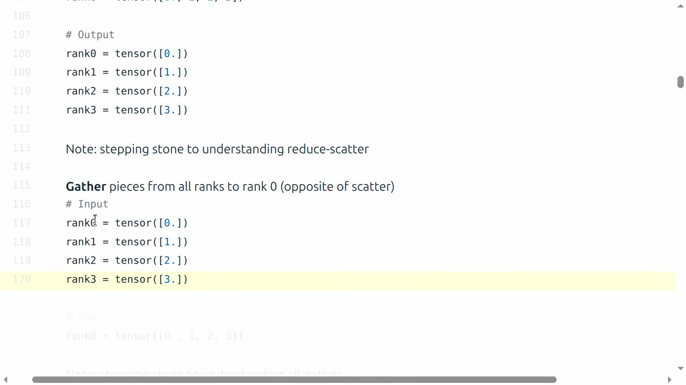

接下来是 reduce。做过函数式编程的人大概都熟悉 reduce，道理完全一样。起点和 gather 一样：数据分散在不同的 rank 上，然后你把归约操作作用在它们上面，把结果放到 rank 0。比如用求和来归约，0 加 1 加 2 加 3 就得到 6。你也可以把 gather 看成一种归约，只不过那个操作是拼接。当然，reduce 对理解 all-reduce 很重要。

*[11:37](https://www.youtube.com/watch?v=SzpOcwdIL0Y&t=697)*

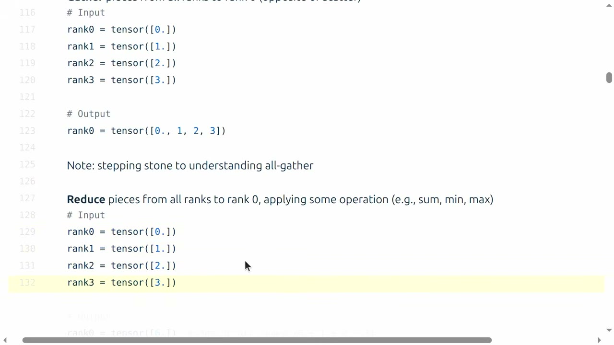

暂停一下。这些只是热身。关于集合操作是什么、broadcast、scatter、gather、reduce，有人有问题吗？有个问题问：这跟 NumPy 里的 broadcasting 有关系吗？我觉得概念上是同一个想法，一个东西变成很多个，就像 NumPy 里一个标量被广播成一个张量。但这里的实例化是为集合通信做的，所以还是有点不一样。

*[12:32](https://www.youtube.com/watch?v=SzpOcwdIL0Y&t=752)*

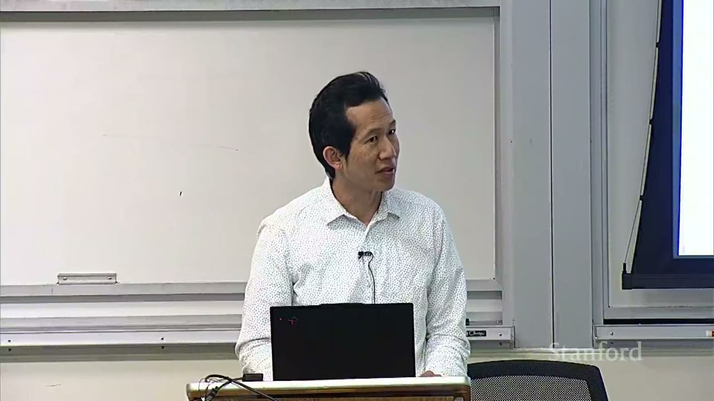

## all-gather、reduce-scatter 与 all-reduce

all-gather 做的事情，基本上就是对所有 rank 做 gather，而不只是 rank 0。回忆一下 gather 干什么：它把所有分片放到一个 rank 上，rank 0。all-gather 就是对每一个 rank 都做这件事，这就是 “all” 的意思——输出到所有 rank——而 gather 是你对所有这些 rank 做的事。

*[13:12](https://www.youtube.com/watch?v=SzpOcwdIL0Y&t=792)*

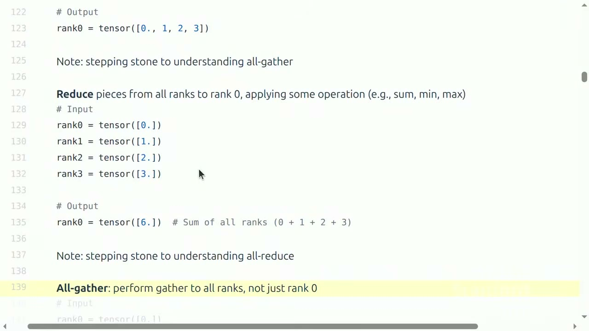

这个操作会反复出现。现在不必精确理解这句话，但后面我们会看到，每个 rank 持有参数的一部分，然后你需要把参数 all-gather 起来，得到完整参数，才能做完整的前向传播。总的来说，训练过程中我们会看到很多这样的模式：gather 一下、做点什么、再 scatter、再 gather、再 scatter。

*[13:43](https://www.youtube.com/watch?v=SzpOcwdIL0Y&t=823)*

reduce-scatter 是对每个维度做 reduce，然后散布结果。假设你有四个设备，每个上面有一个向量。之前做 reduce 时我们是 0、1、2、3 归约成 6；现在 reduce-scatter 说的是，对这个张量的每个分量分别做归约，然后把结果放到不同的 rank 上。第一个维度加起来得 6，第二个维度加起来得 10，第三个维度处理这些，第四个维度处理那些。

*[14:47](https://www.youtube.com/watch?v=SzpOcwdIL0Y&t=887)*

提前说一下这会出现在哪里：反向传播之后，你要对梯度求和。每块 GPU 处理的是不同的数据，你要做的是把来自不同分片的梯度全部加起来，然后把存储重新分布。

*[15:18](https://www.youtube.com/watch?v=SzpOcwdIL0Y&t=918)*

最后是 all-reduce。如果你理解了 all-reduce、gather 和 all-gather，那它就是先做一个、再做另一个。它的输入和前面的 reduce-scatter 一样。在 reduce-scatter 之后，6、10、14、18 分别在不同 rank 上；而 all-reduce 里的 all-gather 部分，就是把它们都放到同一个节点上。

*[15:56](https://www.youtube.com/watch?v=SzpOcwdIL0Y&t=956)*

all-reduce 某种程度上是最容易理解的：你有一堆张量，做归约——在这个例子里是求和——然后在所有节点上复制结果。这个操作我们其实会最先见到：做数据并行、对梯度求和的时候，然后复制完整参数。所以这里正是真正的起点。也许先把注意力集中在 all-reduce 上。稍后我们会看到怎么实现更复杂的东西，比如 ZeRO 或者 FSDP：我们需要把 all-reduce 拆成 reduce-scatter 和 all-gather，因为这样你才能介入进去，更好地管理这些事情。但对基本版本来说，all-reduce 就够了。

*[16:48](https://www.youtube.com/watch?v=SzpOcwdIL0Y&t=1008)*

## all-to-all 与 MoE 的动态路由

最后是 all-to-all。它在某种意义上是最通用的：你基本上就是指定每个 rank 如何把特定的消息发到另一个 rank。这里有个简单的例子，输入和之前一样。它表达的意思是：我想把 0 发到 rank 0，也就是留在自己这里；把 1 发到 rank 1，把 2 发到 rank 2，把 3 发到 rank 3。如果我是 rank 1，我想把 4 发到 rank 0，把 5 发到 rank 1，把 6 发到 rank 2，把 7 发到 rank 3。所以基本上，这里的位置就表示哪个 rank 是最终目的地。看输出的话：第一个 rank 会收到所有往第 0 列发东西的 rank 发来的内容，因为所有这些 rank 都把东西发给 rank 0；同理，rank 1 会收到所有 rank 发到这一列的内容，依此类推。

*[18:16](https://www.youtube.com/watch?v=SzpOcwdIL0Y&t=1096)*

这个操作在训练 MoE 的时候很有用。直觉是这样的：每个 rank 既持有数据的一个分片，也持有一组专家的子集。MoE 的关键思想是动态路由——你必须看你的数据，才能决定要把这些激活值路由到哪些专家。所以它最终就是一种 all-to-all 通信。

*[18:49](https://www.youtube.com/watch?v=SzpOcwdIL0Y&t=1129)*

如果一切都均衡——每个 rank 发给其他每个 rank 的字节数都一样——那么 all-to-all 你可以把它看成一次转置：把它想成一个矩阵，你做的就是把矩阵转置。但一般来说，all-to-all 也处理不均衡的拆分。我这里没有展示，但你可以配置它向任意 rank 发送任意数量的字节。不过总的来说，你还是希望拆分尽量均衡。记得 MoE 那一讲，我们做了负载均衡，就是为了让东西尽量均衡。所以理想情况下，all-to-all 最好看起来就像上面那样。

*[19:44](https://www.youtube.com/watch?v=SzpOcwdIL0Y&t=1184)*

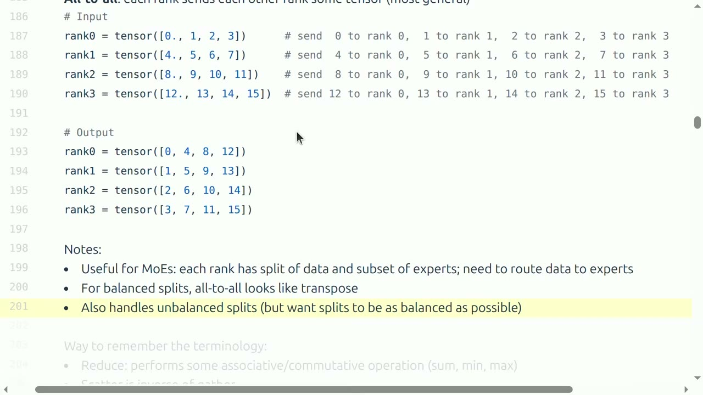

## 几个帮助记忆的总结与提问

总结一下，也给几个帮助记术语的提示，因为我刚刚一口气讲了好几个操作。reduce 就是做某种结合的、可交换的操作，可以是求和，可以是最大值，也可以是最小值。scatter 是 gather 的逆操作：scatter 分发，gather 集中。“all” 的意思是目的地是所有设备，这就解释了 all-reduce 和 all-gather。

*[21:23](https://www.youtube.com/watch?v=SzpOcwdIL0Y&t=1283)*

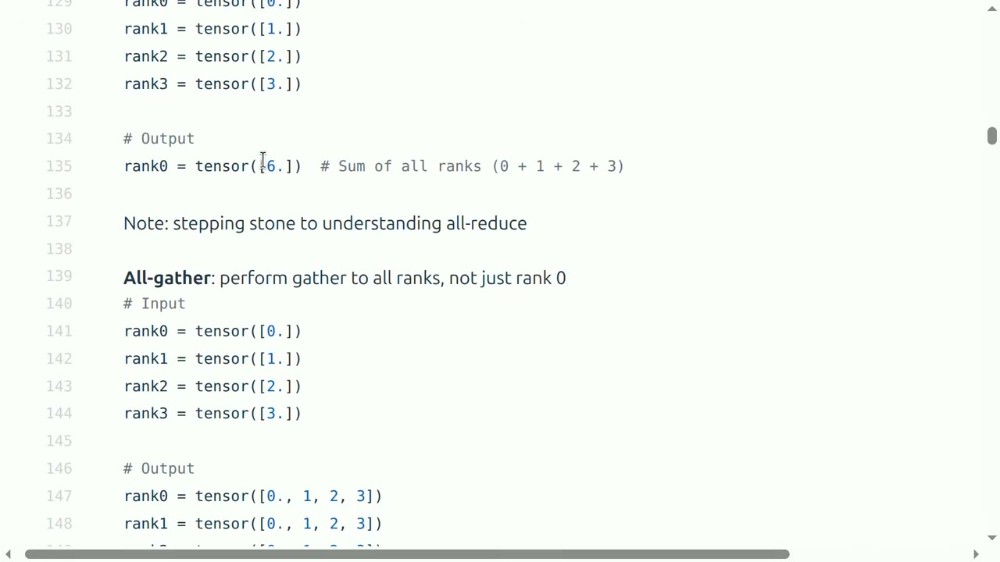

停下来看有没有关于集合通信的问题。有人问：像 gather 这种把东西集中到 rank 0 的操作，rank 0 是每次都是同一块 GPU 吗，还是可以变？回答是：我说 rank 0 的时候，后面代码里你会看到，你基本上是指定 GPU ID 或者 rank，它就发到那里。所以它不必很早就确定，但基本上执行这次调用的时候必须确定。

*[21:23](https://www.youtube.com/watch?v=SzpOcwdIL0Y&t=1283)*

另一个问题：这些只是概念的构建块吧？它们并不是真正的……这些是真正的实现吗？回答：现在展示的只是概念构建块，但我们很快就会看到它们在代码里怎么实现。

*[21:53](https://www.youtube.com/watch?v=SzpOcwdIL0Y&t=1313)*

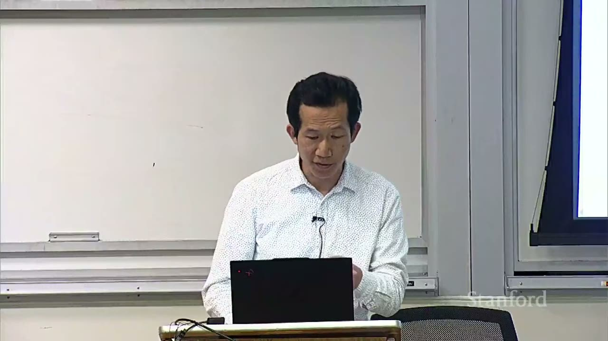

## GPU 之间怎么连：NVLink、NVSwitch、InfiniBand 与以太网

在进入代码之前，我想讲讲硬件，特别是 GPU 是怎么连接的，因为我们已经知道一块 GPU 内部有什么了。先讲一般的网络。这是一张非常经典的图，从这张很有年代感的图片你就能看出来，计算机一般来说就是这么工作的：你有一台服务器，一堆 CPU，有一条 PCIe 总线——以前像鼠标键盘这类东西就接在上面——然后有一堆 GPU 挂在这上面，还有一些 RAM；这台计算机通过以太网连到另一台计算机，如此这般。这是一个特定的设置、一个特定的拓扑。同一节点上的 GPU 用 PCIe 通信，不同节点上的 GPU 就得一路走以太网。这就像你买了块游戏 GPU，然后跟朋友连起来说“我要训个大模型”，你就得这么干。

*[22:47](https://www.youtube.com/watch?v=SzpOcwdIL0Y&t=1367)*

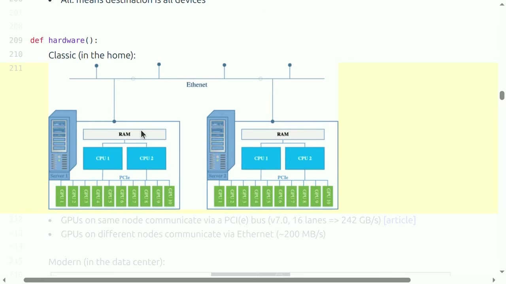

但如果你是真的认真训练，情况更像这样。这是我一开始展示过的那张图：有 GPU，还有 NVLink、NVSwitch 和 InfiniBand 这些东西。典型设置是这样的：每个节点 8 块 GPU——8 是典型数字，256 那个数是我编的——它们通过 NVIDIA 的 NVLink 连到一个交换机上。校准一下：如果用 NVLink 5，总带宽是 1.8 TB/s。记住 B200 的 HBM 是 8 TB/s，所以大概慢 4 倍。设备之间通信能到这个速度还是很快的，但显然比不过高带宽内存，而高带宽内存又比共享内存或 L1 cache 慢得多。

*[24:28](https://www.youtube.com/watch?v=SzpOcwdIL0Y&t=1468)*

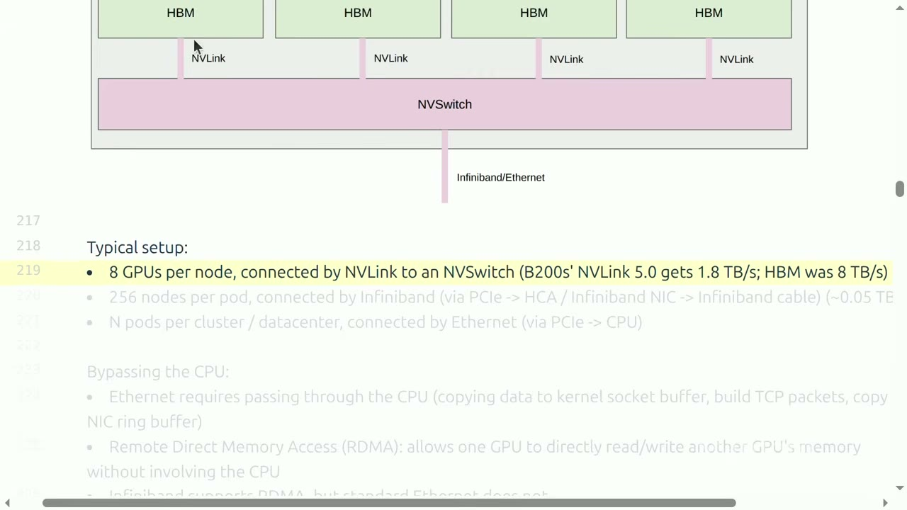

NVLink 连到交换机，这意味着从编程角度看，你可以认为任何一块 GPU 都能连到任何另一块 GPU。你从一块 GPU 到另一块，硬件负责把它传到交换机，交换机再路由。但通常你还会遇到另一个情况：GPU 数量涨上去之后，你不可能一直靠 NVSwitch 和 NVLink。于是你得把这些节点放进 pod，pod 之间用 InfiniBand 连接。InfiniBand 的工作方式是，这时候 GPU 不再直接连到另一块 GPU，它必须经过 PCIe，走一种特殊的 InfiniBand 线缆，而速度要低得多。

*[25:39](https://www.youtube.com/watch?v=SzpOcwdIL0Y&t=1539)*

再往外，如果你的 InfiniBand 也用完了、碰上这些巨大的 pod，你就得用以太网把它们连起来。走以太网要经过 PCIe，而且实际上会经过 CPU——我们后面会看到，这更慢。这跟内存的层级结构有点类似：节点越多，就越慢。NVSwitch 不可能管十万块 GPU。

*[26:18](https://www.youtube.com/watch?v=SzpOcwdIL0Y&t=1578)*

这里要提一句绕过 CPU 的事，从硬件角度讲这很重要。如果用传统的以太网，GPU 必须跟 CPU 打交道来拷贝数据：它先把数据拷到 CPU 的内核 socket buffer——这里的 kernel 不是 GPU kernel，是 CPU 传统的“内核”概念——然后构造网络包，拷到网络接口，再发出去。这通常会引入很多延迟。所以有了一项叫远程直接内存访问（Remote Direct Memory Access，RDMA）的技术，它允许一块 GPU 直接读写另一块 GPU 的内存，完全不碰 CPU。显然，在 NVLink 和 NVSwitch 的世界里是有 RDMA 的，InfiniBand 也支持 RDMA——如果你走 InfiniBand 连接，GPU 之间就能直接相连，不牵涉 CPU。但标准以太网不行。

*[27:42](https://www.youtube.com/watch?v=SzpOcwdIL0Y&t=1662)*

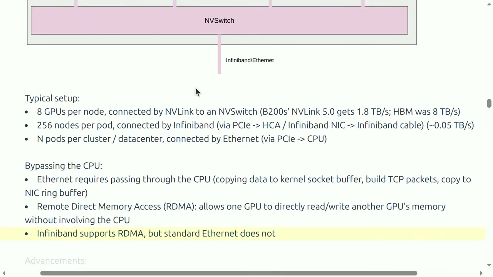

有两个值得说的进展。NVIDIA 一直在把更大 pod 的极限往前推。B200 和 B300 这一代，他们有个叫 NVL72 的东西：也就是每盘八块 GPU 的托盘，一共九盘，最终 72 块 GPU 全部通过 NVSwitch 归到一个 NVLink 域里。而 NVLink 的速度非常快。我们普通人会想：好吧，我有八块 GPU 高速互连，出了这个域就慢一大截了。但如果你钱够多，买得起这些花哨硬件，就能得到最高 72 块 GPU 的快速互连。

*[28:46](https://www.youtube.com/watch?v=SzpOcwdIL0Y&t=1726)*

另一个是我刚才说标准以太网不支持 RDMA，但以太网这边也进步了。有个东西叫 RoCE，也就是 RDMA over converged ethernet，它让以太网实际上也能绕过 CPU。这算是他们对 InfiniBand 的回应——InfiniBand 通常非常贵，很多 NVIDIA 产品也是。而用 RoCE 你也能获得相当不错的性能。Meta 有一些论文表明他们在探索这个方向；至于某个具体模型究竟是还是不是用 converged ethernet 训出来的，就不确定了。

*[29:43](https://www.youtube.com/watch?v=SzpOcwdIL0Y&t=1783)*

好，这只是一次对硬件长什么样的简要巡览：你有 GPU，它们在一个域内通过 NVLink 连到 NVSwitch，可能是 8 块，也可能是 72 块，然后从那里开始用 InfiniBand。现在我们来谈怎么对这个编程。在最底层，有一个叫 NVIDIA Collective Communications Library 的东西，也就是 NCCL，读作 “nickel”，它把 all-reduce、reduce、broadcast 这样的集合操作，翻译成 GPU 之间实际发送的底层数据包。当你用 NCCL 的时候，你基本上就是在说“我要做 all-reduce”，然后 NCCL 会去搞清楚硬件拓扑是什么样、不同 GPU 之间的路径怎么走，然后它实际上会启动 GPU kernel 来收发数据。因为归根结底，记住，在 GPU 上跑的一切都是 kernel，所以也有通信 kernel，它们真正在跟其他 GPU 通信。我们不会深入研究 NCCL，只要知道它存在就行。

*[31:04](https://www.youtube.com/watch?v=SzpOcwdIL0Y&t=1864)*

然后我们其实会转到 PyTorch。不过在这之前，关于硬件有什么问题吗？问题：能不能描述一下机架（rack）和托盘（tray）？回答：对 NVL72 来说，我不是硬件专家，但 rack 就是字面意义上的机架，你见过数据中心，就是那个。每个托盘上有两个 CPU，每个 CPU 连四块 GPU，所以每个托盘上有八块 GPU。它们叠起来，所有东西都连到这个 NVSwitch 上。

*[32:07](https://www.youtube.com/watch?v=SzpOcwdIL0Y&t=1927)*

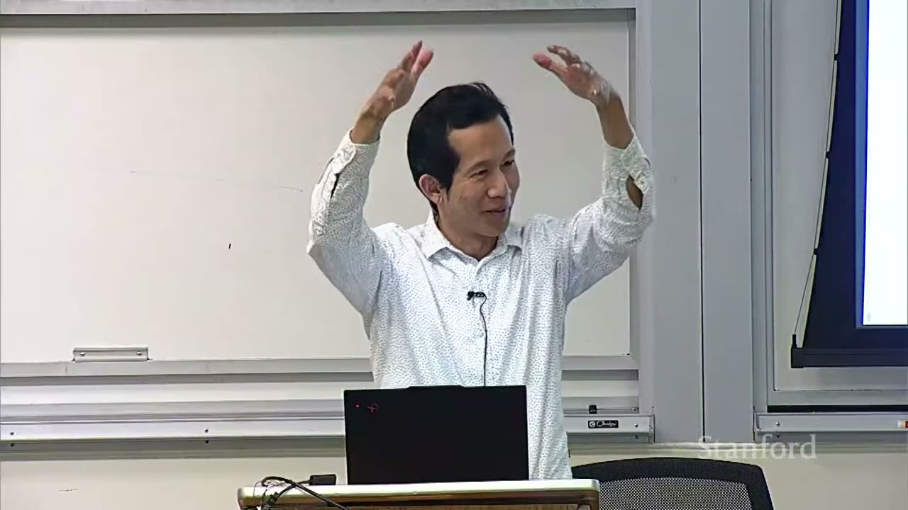

问题：RDMA 和 InfiniBand、NVLink 之间是什么区别？回答：RDMA 你可以把它理解成一个期望的性质。RDMA 意味着一块 GPU 能读写另一块 GPU 的内存，而做到 RDMA 有多种方式：一种是用 NVLink 和 NVSwitch，另一种是用 InfiniBand。所以 InfiniBand、NVSwitch、NVLink 更多是硬件，是哪些部件、哪些线缆和交换机在那儿；RDMA 更多是一种操作，是通信时发生的事情。比如 RoCE 就是做 RDMA 的另一种方式。

*[33:32](https://www.youtube.com/watch?v=SzpOcwdIL0Y&t=2012)*

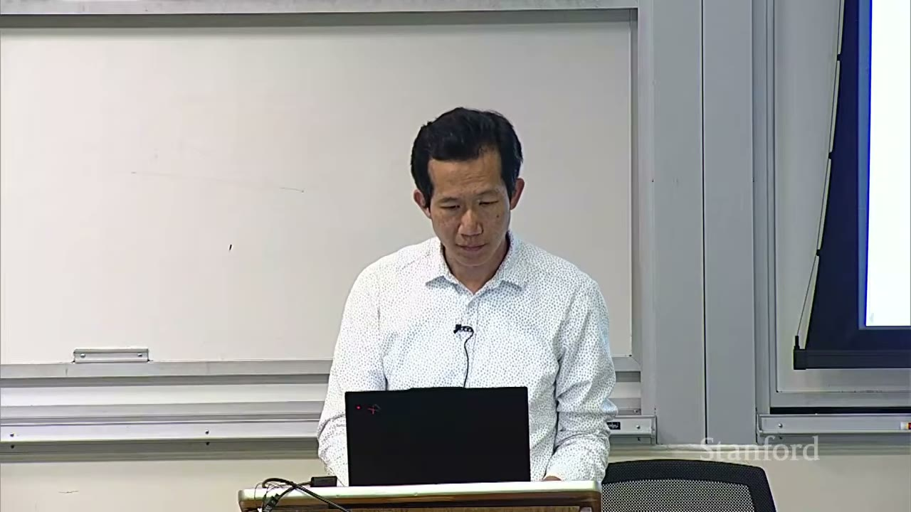

问题：NCCL 对多节点集群做过优化吗？对于基于 RDMA 的流程，NCCL 是最优的吗？回答：我不知道他们优化或没优化的细节。我只能说，NVIDIA 一直在为这些大模型的推理和训练优化他们的整个栈，因为他们的主要客户就是语言模型的主要提供方。如果说他们没有为这类工作负载考虑优化，我会很惊讶。

*[34:32](https://www.youtube.com/watch?v=SzpOcwdIL0Y&t=2072)*

问题：如果你有九块 GPU 怎么办？怎么把负载分到这九块上？回答：这要看你这九块在设置里是怎么落的。比如很多时候你是每节点八块 GPU，那第九块就在另一个节点上。如果它们之间没有 NVLink 连接，那会很糟糕，因为那个节点提供的算力不多，而且跟它通信非常昂贵。但如果你所有东西都通过 NVSwitch 连起来，那就合理多了。

*[35:33](https://www.youtube.com/watch?v=SzpOcwdIL0Y&t=2133)*

最后一个问题，然后我就往下走：这跟 TPU 有什么不同？TPU 一般是简单得多的对象。各个组件对应什么，我不是太熟悉，也许我们可以私下聊。现在让我们真正写点代码，把这些硬件的性能用起来。

*[36:16](https://www.youtube.com/watch?v=SzpOcwdIL0Y&t=2176)*

## torch.distributed：在代码里调用集合操作

PyTorch 很方便地提供了 torch.distributed 库，为这些集合操作提供干净的接口，这样你就不用显式去想 NCCL 了。事实上这个库还支持不同硬件的不同后端：如果你在 GPU 上，就用 NCCL 后端；如果你在 CPU 上，有个叫 gloo 的东西，仍然可以让你——就像我说的，并行处理在 GPU 之前就存在很久了——在 CPU 上也做这些集合操作。这个库还支持更高层的模型和算法，比如 FSDP，但这门课不会用，因为我们是从零构建。

*[37:12](https://www.youtube.com/watch?v=SzpOcwdIL0Y&t=2232)*

走一遍集合操作的基础例子。有一个叫 spawn 的函数，它接受另一个我准备调用的函数，然后说我把它复制运行四次，4 就是 world size。看看它做了什么。这其实是我写的一个 wrapper，用来绕过这堂课没法做多进程这个事实。通常你会调用 Torch 的 multiprocessing.spawn 然后调用那个函数。但我会走这个禁用分布式的分支。

*[38:02](https://www.youtube.com/watch?v=SzpOcwdIL0Y&t=2282)*

现在我在这个函数里，它本该为每个进程异步运行。记住，world size 是进程数，rank 是 0、1、2 一直到 world size 减 1。所以有 world size 个这样的函数，各自在一个进程上同时运行。我现在在 rank 0。我要做什么？先 setup，基本上就是配置 master 地址和端口。注意，这并不是 GPU 真正通信的方式，这更多是通用元数据和协调用的，实际数据会走 NCCL，否则会非常非常慢。如果你有 CUDA 可用，就可以用 NCCL 后端；我在自己的笔记本上，所以我会用 gloo 后端。

*[39:04](https://www.youtube.com/watch?v=SzpOcwdIL0Y&t=2344)*

好，现在我来这里。假设我有四个这样的进程在运行。这里有个 barrier 函数，它的用处是——它是一个同步屏障。基本上，我看到这个就会等所有进程到达这个点。你可以认为所有进程都在异步跑，我并不真正控制它们：一个进程可能完全在另一个之前跑完，它们可能以任意方式交错。所以如果我想确保某些代码在其他代码之前执行，我就会加这些同步屏障。加更多屏障的缺点是，你最终可能会不必要地等待。

*[40:01](https://www.youtube.com/watch?v=SzpOcwdIL0Y&t=2401)*

那我们试一下 all-reduce。我要创建这个张量，0、1、2、3，然后我有我的 rank。为了让它更有意思，每个 rank 会有一个不同的张量。我要打印出做 all-reduce 之前我手上有什么。现在我跳到这里，看看会打印出什么。rank 0 在 all-reduce 之前有 0、1、2、3；rank 1 有 1、2、3、4，依此类推。这跟我之前展示的例子一样。注意 print 语句是以任意顺序出现的，硬件想怎样就怎样，因为一切都是异步运行的，但所有数据都在那里。

*[40:51](https://www.youtube.com/watch?v=SzpOcwdIL0Y&t=2451)*

现在如果我做 all-reduce，你传入这个张量——这是个 PyTorch 函数——你传入这个张量，传入归约操作，也就是求和，然后我说不要异步。它做的事是调用 gloo（在这个例子里是 gloo，也可能是 NCCL，那样的话它会启动 CUDA kernel），做通信，一切都帮你处理好，然后基本上是原地写回数据。所以 all-reduce 之后，我得到的是——记得 all-reduce 是什么——每一列的和，但复制在所有 rank 上。

*[41:40](https://www.youtube.com/watch?v=SzpOcwdIL0Y&t=2500)*

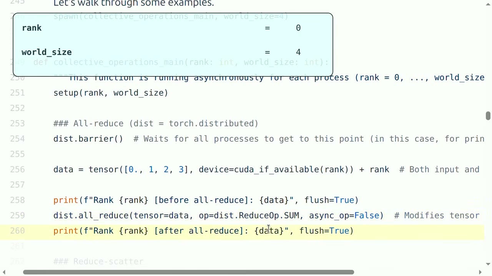

如果你想更花哨一点、做异步，那可以设 async 等于 true，但那会把这些 print 语句搞乱。所以我加的 barrier 比平时要多。有问题吗？问题：rank 就是 GPU 吗？在这门课里，rank 就是 GPU。

*[42:19](https://www.youtube.com/watch?v=SzpOcwdIL0Y&t=2539)*

再试一个例子，reduce-scatter。这里我要创建一个输入，从 0 一直到 world size。然后我要有输出，我分配输出。做 reduce-scatter 之前它长什么样？它是这样：输入是同一个，输出碰巧是零，但它本来可以是任何值。然后我做 reduce_scatter_tensor。这里不是原地写，而是有一个输出张量和一个输入张量。我说我要做求和，然后之后，输入不被改动，而输出得到每个分量的归约结果，写进各自的 rank。

*[43:36](https://www.youtube.com/watch?v=SzpOcwdIL0Y&t=2616)*

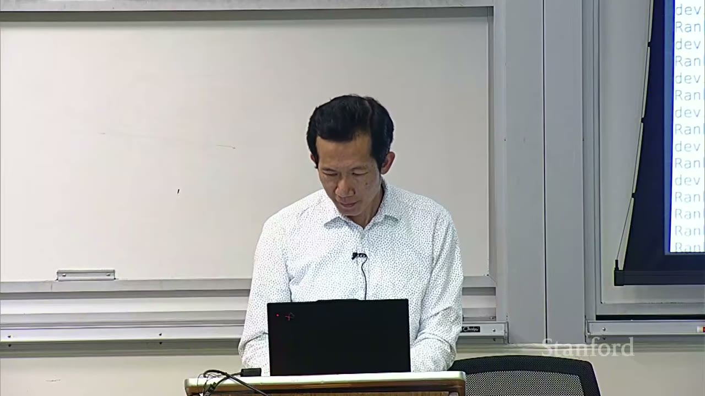

问：all-reduce 异步是怎么工作的？它基本上是一个单体操作：你说“去做 all-reduce”，它启动 CUDA kernel，做通信。记住 CUDA 相对于进程来说本来就是异步的，而现在我们所有进程也都是异步的。重点是这段代码会直接返回，然后你就可以去做别的事情。一个典型做法——这门课不会讲——是重叠计算和通信：比如你可以做这个操作，然后去加载下一步要用的数据，这个数据和这个操作是独立的。等你需要确保它真的做完了，就调一个 wait 或者 barrier。

*[45:03](https://www.youtube.com/watch?v=SzpOcwdIL0Y&t=2703)*

最后做 all-gather。到这里我觉得你已经明白思路了。这里我把 reduce-scatter 的输出设为输入，然后分配一个输出。all-gather 之前长这样：reduce-scatter 的结果在这里，输出只是刚分配，碰巧里面有些值，别管它。然后我做完 all_gather_into_tensor 之后，所有不同的输入就都聚集到了所有不同的 rank 上。你可以看到，这算是用例子证明了：all-reduce 等于 reduce-scatter 加 all-gather。

*[46:20](https://www.youtube.com/watch?v=SzpOcwdIL0Y&t=2780)*

最后收个尾，就像我开始时做的 setup 一样做清理，清理是个好习惯。这就是你的第一个 Torch 分布式程序。

*[46:49](https://www.youtube.com/watch?v=SzpOcwdIL0Y&t=2809)*

## 通信有多快：基准测试与有效带宽

我们来做一些基准测试。这个会很快，因为我想真正进入第二部分。通信到底有多快？做一个 all-reduce。这里我要对一亿个元素做 all-reduce。哎呀，抱歉，我这里弄错了。所以是 all-reduce。我要创建这个张量，包含这么多元素。记住，就像之前做基准测试一样，我们首先要预热。这里我要调用 CUDA synchronize，还要调用 barrier，只是想确保——因为这里有两种异步：CUDA kernel 和不同进程——我只是想确保开始计时之前，一切都不再运行并且已经完成。

*[47:41](https://www.youtube.com/watch?v=SzpOcwdIL0Y&t=2861)*

然后我执行 all-reduce，再用 synchronize 和 barrier 等待并停止计时。记住，这在每个 rank 上都会跑。如果我看输出，rank 0、2、1、3，我可能会得到不同的时间，因为它们都是不同的进程，每个进程报告一个测量值。如果你想报一个数字，可以取平均。

*[48:30](https://www.youtube.com/watch?v=SzpOcwdIL0Y&t=2910)*

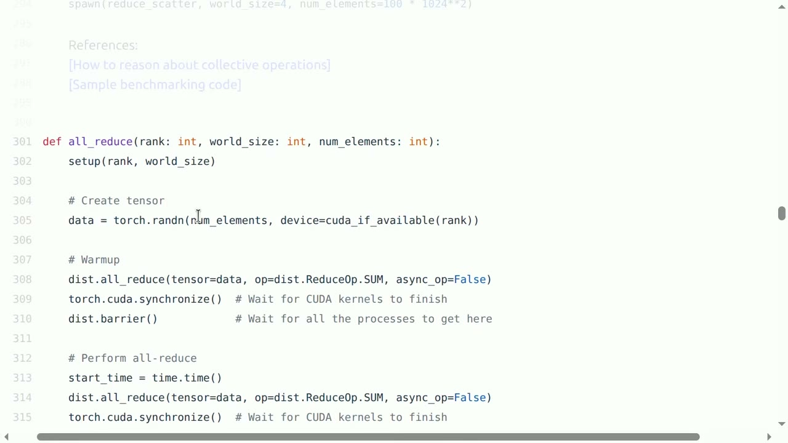

现在有件有用的事可以做，它很像我们之前算 MFU 时做的：测量有效带宽。想法是这样的：好吧，这花了 1.6 毫秒，这算好还是坏？要算有效带宽，我们要做的是计算这次计算本质上发送了多少字节，以及应该发送多少字节，然后除以总时间，就得到有效带宽。我发送的数据大小，是每个元素的大小乘以元素数量，基本上就是这个数据张量的字节数。那实际发送了多少字节？这需要拆解一下。

*[49:29](https://www.youtube.com/watch?v=SzpOcwdIL0Y&t=2969)*

对 all-reduce 来说，如果你想想——简单起见，假设你算 rank 0 加 rank 1 加 rank 2 加 rank 3——你需要迭代 world size 减 1 步，因为有 world size 减 1 次加法操作。所以有这个因子。还有个 2，因为你需要既发送又归约。然后再乘以 payload 的大小。这就是总发送字节数。总时长就是它花掉的墙钟时间。然后你还要乘 world size，因为这是所有 rank 等待的总量。带宽就是发送字节数除以总时长。这个例子里得到大约 400 GB/s。

*[50:40](https://www.youtube.com/watch?v=SzpOcwdIL0Y&t=3040)*

几点说明。第一，有效带宽这个表达式是 size 乘以 2，再乘以 (world size 减 1) 除以 world size，再除以 duration。当 world size 增大时，(world size 减 1)/world size 基本上收敛到 1，所以你最后剩下的是 2 倍的 size 除以 duration，这基本上就是带宽。注意它不依赖于 world size，这是好事：GPU 数量涨上去，带宽不变。它也独立于拓扑——NCCL 会自己弄清楚消息是走环形还是树形拓扑。

*[51:37](https://www.youtube.com/watch?v=SzpOcwdIL0Y&t=3097)*

这就是 all-reduce。reduce-scatter 非常类似。我创建输入和输出，预热，执行操作，计时。注意 reduce-scatter 的这些时间。你也可以在这里测有效带宽：输入的字节数、发送的字节数——这里没有那个 2 倍——然后除以总时长，就得到带宽。这里的带宽应该很接近，有时会有些随机性，但也在 400 这个量级。几点说明：记得我们说 all-reduce 等于 reduce-scatter 加 all-gather，所以 all-reduce 天然要搬运两倍的数据——reduce-scatter 有开销，all-gather 有开销，all-reduce 做的是两倍的活，花的是两倍的时间。但这两个正好抵消，所以你得到的是同量级的带宽。

*[53:20](https://www.youtube.com/watch?v=SzpOcwdIL0Y&t=3200)*

这就是第一部分的结尾。进入第二部分之前，还有问题吗？问题：为什么对 CUDA kernel 要做 synchronize？归根结底，我们仍然在做 CUDA 操作。我们只是有多个进程，每个进程有一块 GPU，各自做一些 CUDA 操作。而做 CUDA 操作时，记住，默认是异步的，所以当 Python 走到下一行时，那个 CUDA 操作可能还没做完。所以我们总是需要 synchronize 来确保它做完了。问：那要先 barrier 再 synchronize 吗？我不确定。我觉得一个问题是，如果你先 barrier，而 CUDA 可能还没跑完，你立刻就走到 barrier，然后各自独立地 synchronize 不同的 CUDA kernel，那其实并没有真正同步。如果那些操作就直接返回了，barrier 也做不了什么。

*[55:07](https://www.youtube.com/watch?v=SzpOcwdIL0Y&t=3307)*

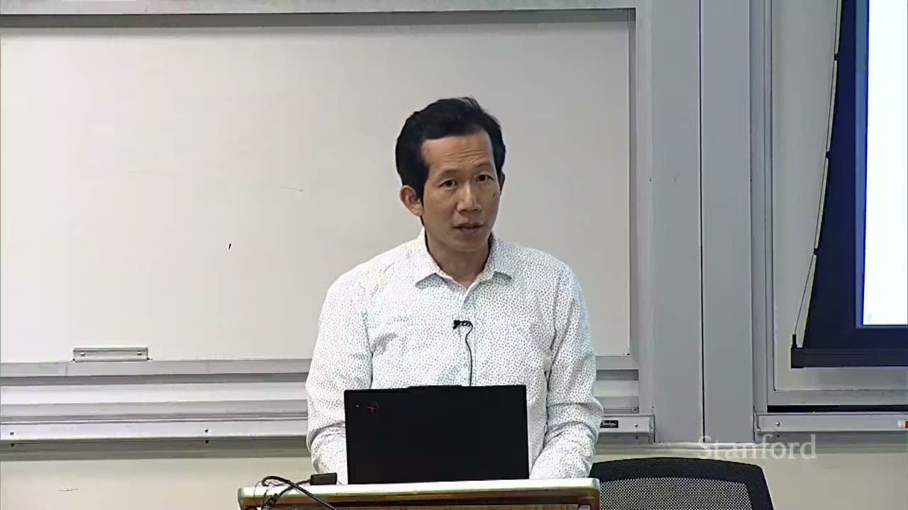

## 数据并行：DDP

好，让我继续。现在真正开始想怎么训练模型。我们会走一遍一个非常裸的 MLP 训练实现——多层 MLP（这有点冗余，多层感知机本来就是多层的）。记住，MLP 是 transformer 里真正的计算瓶颈，所以它其实很有代表性。

*[55:45](https://www.youtube.com/watch?v=SzpOcwdIL0Y&t=3345)*

数据并行、张量并行、流水线并行。我想让你脑子里有的图景是这张。这有点示意图的性质，别想太深，它更多的是让你概念化地理解你是怎么切数据和参数的。数据并行说的是：我把数据切成一片片，每块 GPU 负责一部分数据，然后我就做正常的模型训练——我要记录全部参数——然后我需要同步。

*[56:22](https://www.youtube.com/watch?v=SzpOcwdIL0Y&t=3382)*

我解释一下它是怎么工作的。先生成一些样本数据：batch size 是 128，维度数是 1024，所以这是一个 batch size 乘以维度数的数据矩阵。然后我们跳进这个数据并行。它的工作方式是：你有一个数据矩阵，我把行切成 world size 份——这里是 4 份，每个 rank 拿一份。维度数……batch size……我把 local batch size 叫做 batch size 除以 world size，也就是每块 GPU 看到的每一行，它会有 32 个数据点。这只是索引：起始 index，从 data start 到 end 就得到那片数据，然后放到那个 rank 上。这时候每块 GPU 就有了各自不同的数据张量，也就是它负责的那一部分。

*[57:52](https://www.youtube.com/watch?v=SzpOcwdIL0Y&t=3472)*

实践中，每个 rank 应该自己加载自己的数据，而不是有这样一个瓶颈，但这里只是为了说明。然后实例化 MLP。这里假设我们有一些层和层数 num layers，每一层就是一个维度数乘维度数的矩阵。我就初始化一组随机参数，然后把它喂给优化器。

*[58:39](https://www.youtube.com/watch?v=SzpOcwdIL0Y&t=3519)*

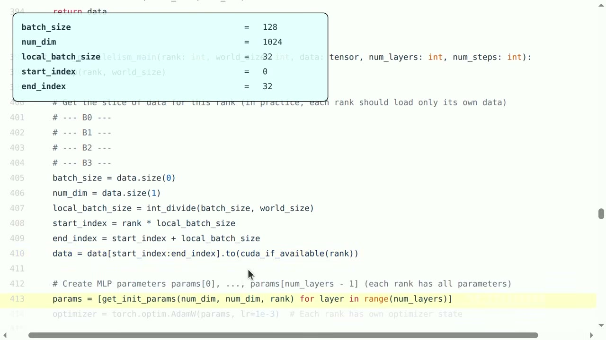

这是训练循环。前向传播里，我取数据——记住，数据不是全部数据，如果我是 rank 2，那我只拿到 B2 那部分数据。我穿过所有层做一次前向，然后做一次反向。通常到这儿就结束了。但现在记住，每个 rank 的数据不同，所以梯度也会不同。

*[59:25](https://www.youtube.com/watch?v=SzpOcwdIL0Y&t=3565)*

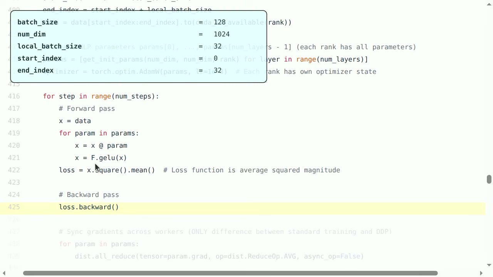

这就是让数据并行工作的关键一步：我们要在所有 worker 之间同步梯度。这是标准训练和 DDP 之间唯一的区别，其实相当优雅。基本上就是，对所有的参数，我对 param.grad 做一次 all-reduce，然后求平均。all-reduce 之后，在这个阶段，每个 rank 都有完全相同的梯度，然后我直接更新参数。我觉得这真的很优雅：它基本上就是标准训练，你把它作用在你的本地 batch 上，只是一定要在反向传播之后插入这个 all-reduce 来平均所有梯度，改一行代码，然后参数就被更新了。

*[60:36](https://www.youtube.com/watch?v=SzpOcwdIL0Y&t=3636)*

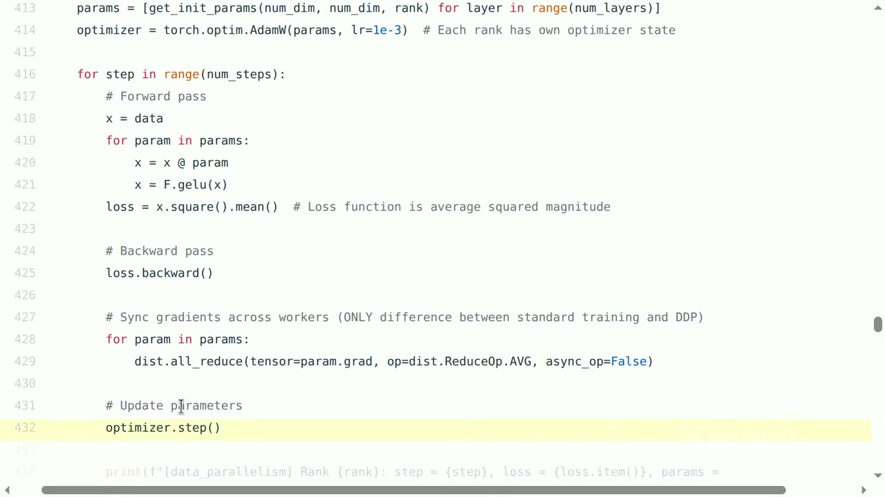

所以在你训练的时候，每个 rank 基本上都在做参数更新，就好像它拥有全部数据一样，即使它实际上只处理了一部分数据。这基本上就是 DDP，也就是第一种数据并行。关于这个有什么问题吗？问题：你只能在 batch size 大于 1 的时候这么做吗？是的，你的 batch size 至少要等于 world size 才真正合理，而且通常它应该大得多。问：batch size 应该是 world size 的倍数吗？那会更好。如果不是，你可以用零填充或者类似的办法。所以有办法，但如果它是倍数，对所有人来说都更简单。

*[61:31](https://www.youtube.com/watch?v=SzpOcwdIL0Y&t=3691)*

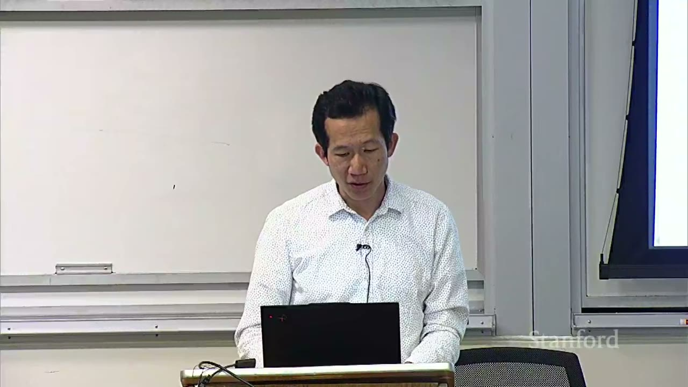

问：对基于 transformer 的模型，这会是什么样子？回答：基本上一样。DDP 有一个很好的特点，就是非常模块化。你做你的前向传播——DDP 只是在这里平均参数，它不关心你的前向传播长什么样。

*[62:08](https://www.youtube.com/watch?v=SzpOcwdIL0Y&t=3728)*

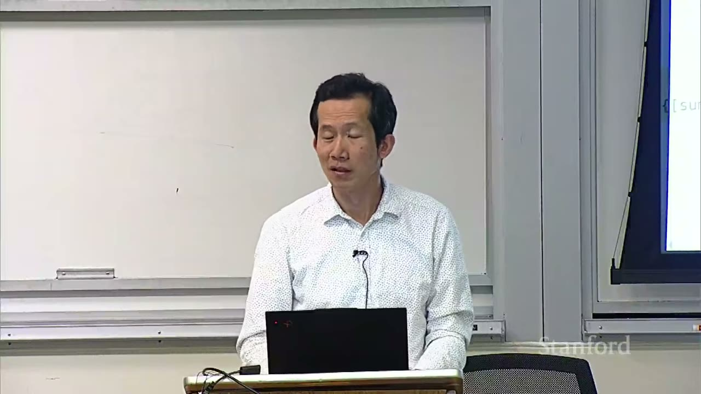

这就是 DDP。总结一下：不同 rank 上的 loss 不一样，梯度一开始也不一样，但它们被归约成所有 rank 上相同，因此参数在所有 rank 上也就保持一致。下一讲 Tatsu 会讲更花哨的数据并行，FSDP 和 ZeRO。那里的想法是——我之前也暗示过——这里我们用 all-reduce，这是一个非常简单的单体操作，但它要求把所有模型参数都放在内存里。可如果模型参数装不进内存呢？那你就得更聪明一点，这就是下一堂课的主题。

*[62:59](https://www.youtube.com/watch?v=SzpOcwdIL0Y&t=3779)*

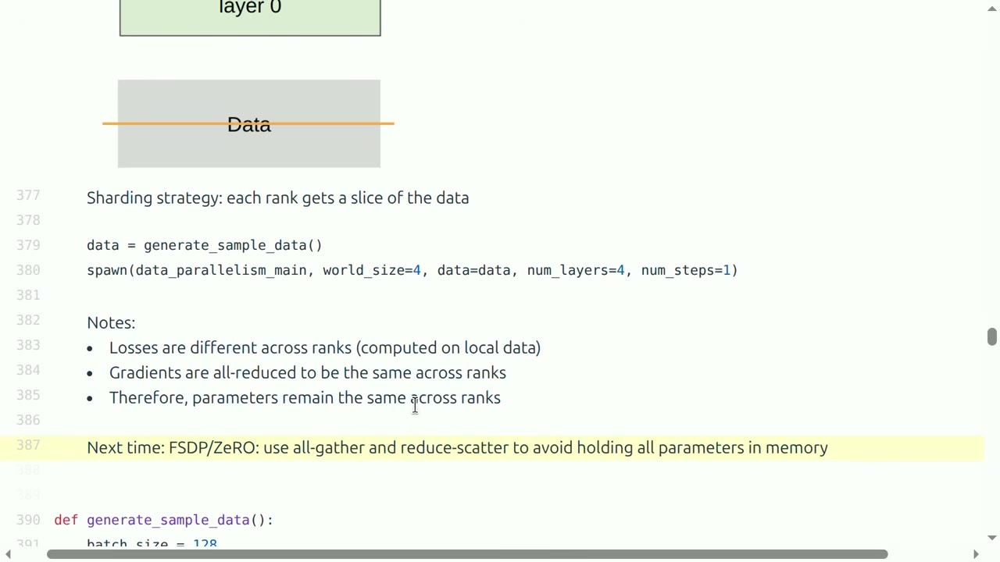

## 张量并行：按列切分模型

接下来讲张量并行。这里的想法是，我们要往这个方向切，我们不切数据，我们切的是每一层。这样每个 rank 会拿到每一层的一部分。一般来说，这意味着我们要传输多得多的数据，这个后面再讨论。

*[63:33](https://www.youtube.com/watch?v=SzpOcwdIL0Y&t=3813)*

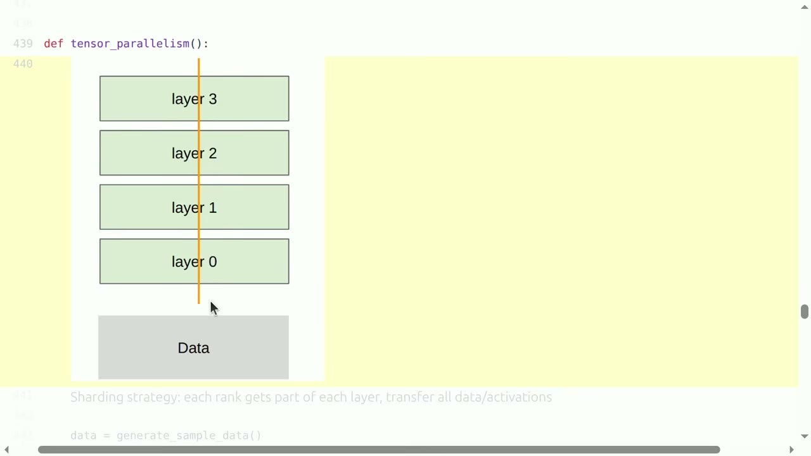

张量并行长什么样？我们就假设有这份数据——简单起见，每个 rank 都有全部数据。记住数据是 batch size 乘以维度数。然后我定义 local num dim：对这个 rank 来说，我只负责一部分维度。这里的图景是：每个模型仍然有所有层，但参数现在是维度数乘以 local 维度数。所以如果这是某一层的参数矩阵，我是在沿着列切分。这也叫列张量并行（column tensor parallel）。也可以按行切，但我们现在不讲那个。

*[64:43](https://www.youtube.com/watch?v=SzpOcwdIL0Y&t=3883)*

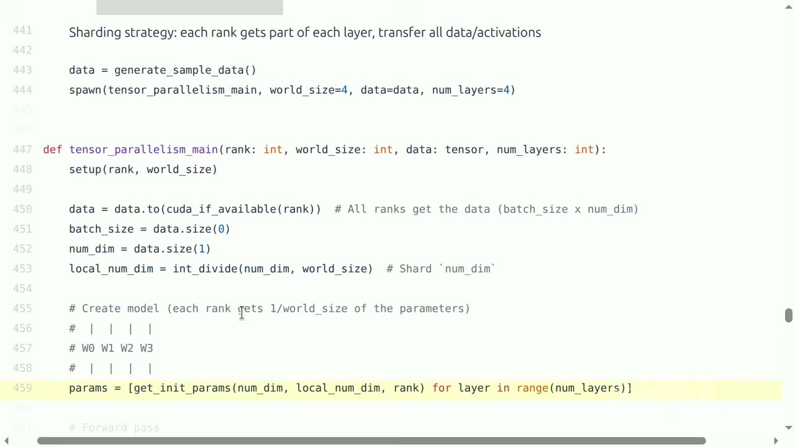

那前向传播长什么样？我穿过所有层，计算激活值。从 x 开始，也就是数据。然后我访问第 layer 层的参数。注意，这只是参数的一个切片：如果我在 rank 1，我拿到的只是这个矩阵的一部分。但我仍然可以继续。我可以应用非线性，因为这本来就是逐元素的。但现在我要做的是通信激活值。

*[65:32](https://www.youtube.com/watch?v=SzpOcwdIL0Y&t=3932)*

如果我有一个数据矩阵，比如 rank 0 拿到了矩阵这部分对应的部分激活值，rank 1 拿到另一部分，依此类推。我需要基本上把所有激活值放到所有 rank 上。但我们知道怎么做——我们介绍过 all-gather 这个集合原语。这里 batch size 乘以 local num dim，是激活的形状。然后我做 all-gather。抱歉，这里是在给激活值分配内存。x 是实际的激活部分，形状是 batch size 乘以 local num dim。all-gather 是说每个 rank 有 x，每个 rank 要分配 activations，这是一个列表，world size 那么大。all-gather 之后，x 会被拷贝到各自对应的位置 activations 里。然后一旦我把所有激活值聚齐，就把它们拼接起来，形成完整维度的 x，也就是 batch size 乘以维度数。

*[67:08](https://www.youtube.com/watch?v=SzpOcwdIL0Y&t=4028)*

关于列张量并行有问题吗？每一层都这么做。我们现在注意到一个与数据并行的区别：现在我们必须去折腾模型。数据并行很优雅，因为它是按数据切，模型被当成一个模块对待。但现在我们必须在模型本身上做文章。这强烈地利用了这样一个事实：如果你要做矩阵乘法，你可以把它拆成一组更小的矩阵乘法，在不同的 rank 上分别做，然后我们把结果聚起来。

*[67:58](https://www.youtube.com/watch?v=SzpOcwdIL0Y&t=4078)*

到了反向传播。现在的问是，反向传播里会发生什么？在反向传播里，你有你的激活值，你必须对不同的梯度做 reduce-scatter。所以在某种意义上，all-gather 和 reduce-scatter 有一种对偶性：前向你做 all-gather，反向你做 reduce-scatter。问：这是 autograd 自动做的吗？如果你只是调 .backward，它不会做这个，因为那里面没有并行。但 PyTorch 有很多这些东西是自动为你做的。问：需要改多少代码？哪些是自动的、哪些要自己做？这里我们管理得相当显式，也就是说我不做反向传播，但你得自己管理和调用 reduce-scatter。这是刻意的，因为这是 336，从零构建语言模型。实践中你大概不用自己做这些。

*[69:38](https://www.youtube.com/watch?v=SzpOcwdIL0Y&t=4178)*

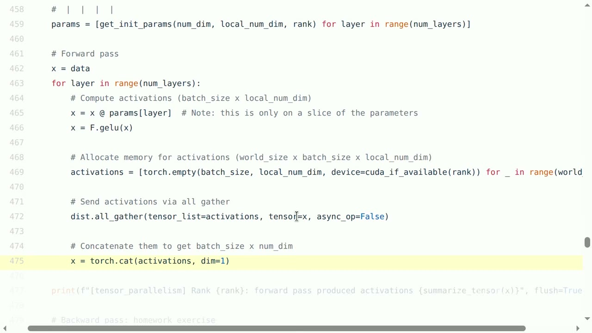

## 流水线并行与 micro-batch

好，快速讲一下流水线并行。流水线并行背后的想法是，我们把网络这样切：每个 rank 现在拿到层的一个子集。在每一层内部，它拿到所有维度，它还拿到——嗯，其中一个 rank 会拿到所有数据。每个 rank 都会以某种形式看到所有数据。

*[70:14](https://www.youtube.com/watch?v=SzpOcwdIL0Y&t=4214)*

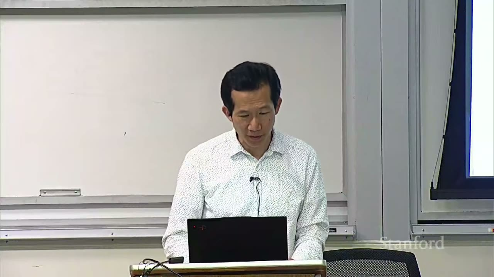

它是这么工作的。我们有全部数据，同样是 batch size 乘以维度数。然后我切分层。local num layers 就是某个 rank 要处理的层数。现在我有 local 参数，基本上只有 local 层数那么多份，但每一层内部我还是做维度数乘维度数。有一点——Tatsu 周三会多讲——是 micro-batch 这个想法。我先把它展示出来，再解释我为什么这么做。除了切分层，我还把 batch 切成若干个 micro-batch。

*[71:14](https://www.youtube.com/watch?v=SzpOcwdIL0Y&t=4274)*

如果我是 rank 0，我就拿到数据，然后把它 chunk 成若干个 micro-batch。对每一个 micro-batch，我要做的是从上一个 rank 接收它，然后只在分配给这个 rank 的那些层上做前向传播，然后发给下一个 rank。这里我其实用了 receive 和 send，它们是点对点操作。我之前没讲过这些，但它们很好解释。这基本上是说我是某个 rank，我要从这个张量……抱歉，我要从 rank 减 1 接收这个张量；这个说的是我要把张量 x 发给 rank 加 1。

*[72:28](https://www.youtube.com/watch?v=SzpOcwdIL0Y&t=4348)*

我之所以要讲 micro-batch——Tatsu 周三会多讲——是因为在流水线并行里，一个 rank 拿到数据，处理一些层，然后把它发给下一块 GPU，处理一些层，再发给下一块 GPU。这是切分深度网络非常自然的方式。但问题是，你会遇到所谓的流水线气泡（pipeline bubble）：你不处理的时候，就在那儿等着别的张量来处理，这会导致效率相当低。micro-batch 的想法就是把数据拆成更小的 batch，这样你可以快速处理完，发给下一个。这能减少流水线气泡的数量。

*[73:32](https://www.youtube.com/watch?v=SzpOcwdIL0Y&t=4412)*

另一件这个非常朴素的版本没有处理的事情，是重叠通信与计算，而这其实对流水线并行非常重要。这里给的结构基本是对的：如果你在这些前面加一个 I（isend/irecv），它就变成异步的，你得加更多东西来管理代码。核心思想是，你在计算的时候，可以同时接收数据或者发送数据。计算和通信应该重叠起来，这样就减少了真正等待的时间。

*[74:23](https://www.youtube.com/watch?v=SzpOcwdIL0Y&t=4463)*

这里还缺几样东西，希望下次能补上。一个是通信与计算的重叠，这在流水线并行里尤其关键。我在数据并行里没提，但那其实也会发生，因为我只是做了前向，最后才做这些 all-reduce；但如果你聪明的话，在反向传播里一算完梯度就可以开始发了。这会在作业二里探索，它又能让你更多地重叠通信和计算。

*[75:10](https://www.youtube.com/watch?v=SzpOcwdIL0Y&t=4510)*

我们刚才有关于通用模型的问题。我觉得这个 MLP 基本上给了你理解基础所需要的大部分东西。更大的模型需要更多的簿记工作，所以更难看清核心算法。还有一些其他类型的并行我们没有讲到：序列并行把一整个序列切成若干块，这样可以并行化注意力计算；专家并行则并行化 MoE 里的专家，这就是我提到的 all-to-all 发挥作用的地方。然后还有不同的并行化技术之间的不同组合，这些也会出现在作业里。

*[76:10](https://www.youtube.com/watch?v=SzpOcwdIL0Y&t=4570)*

## 并行策略怎么选：硬件与批量大小的约束

需要注意的一点是，你选哪种并行技术，很大程度上取决于硬件。比如张量并行，它的通信量很大，因为每一层都需要发送所有这些激活值，而它们相当大。所以张量并行通常发生在节点内，通过 NVLink，或者在高带宽的情况下；你不会跨 NVLink 域做张量并行。而流水线并行你会看到有人在用，它通常能容忍慢得多的互连。有一些去中心化训练的工作使用流水线并行，因为你的节点——GPU 分布在全世界；但在那种情况下，你不会想做张量并行。所以有时候你看这些组合，会是节点内做张量并行，然后做数据并行或者 FSDP，如果需要的话再做流水线并行。

*[77:35](https://www.youtube.com/watch?v=SzpOcwdIL0Y&t=4655)*

还有其他影响。比如如果你做数据并行，你可能可以把数据并行做得很大，但随后你会碰到一个叫临界批量大小（critical batch size）的东西：batch size 增加到一定程度，再增大就没用了，这时候你就是在浪费算力，那你还不如用张量并行。有很多这样的考虑因素，随着课程推进，我们会进一步讨论。

*[78:03](https://www.youtube.com/watch?v=SzpOcwdIL0Y&t=4683)*

最后再说一点。刚才简单提到了 TPU。需要注意的是，我们有意使用 PyTorch，而且不只是用 PyTorch，而是以非常基础的方式使用集合操作，这样你就能从机制上看到发生了什么。另一种方法，尤其是如果你在 TPU 领域，是你可以直接定义模型和分片策略，编译器实际上会处理很多关于你需要什么通信操作的事情。你基本上是告诉它，这块数据需要在这里、这里和这里，然后编译器会做一些神奇的事情去弄清楚。这很有吸引力，但显然，这会剥夺很多从零开始构建东西的乐趣。

*[79:09](https://www.youtube.com/watch?v=SzpOcwdIL0Y&t=4749)*

## 总结

总结一下，有很多种并行化的方式。你可以按数据切分，按张量或专家切分，按流水线或序列切分。我们看了数据并行，而且只做了 DDP，下次我们会讲 FSDP 和 ZeRO。张量并行，正如我提到的，需要非常快的互连；流水线并行则不那么需要，但你需要非常努力地减少流水线气泡。

*[79:44](https://www.youtube.com/watch?v=SzpOcwdIL0Y&t=4784)*

然后，也许在更高的层面上，我们看到这个模式经常出现。你可以选择重新计算，或者把它存进内存，这在讲激活检查点的时候会讲到。或者在这种情况下，你可以把这看成一种扩展：你可以把它存到不同的 GPU 上。从这个角度看数据并行，某种意义上你是在做冗余工作，因为每个 rank 实际上都在更新自己的参数、都在维护所有参数。但你这么做的原因是，你不需要把优化器状态搬来搬去。

*[80:33](https://www.youtube.com/watch?v=SzpOcwdIL0Y&t=4833)*

还有一点是，硬件一直在变快，但某种意义上我们总会想要更大的模型。所以这种层级结构的思想会一直存在。今天就到这里。下周三，Tatsu 会深入讲更多并行技术。

*[80:54](https://www.youtube.com/watch?v=SzpOcwdIL0Y&t=4854)*
