# 从零训练语言模型：并行策略的全景与实战

这堂课系统讲解大模型训练中的各种并行策略——数据并行、ZeRO/FSDP、流水线并行、张量并行、专家并行和上下文并行——以及如何把它们组合起来，在超大集群上跑满算力。

## 课程目标与两个瓶颈

上一讲 Percy 讲了并行的一些底层机制。今天我要做我最喜欢的事：讲各种关于现代语言模型训练并行如何运作的知识、细节和冷知识。我们要真正弄清楚，在超大集群上训练超大模型时涉及的许多复杂性。

*[00:20](https://www.youtube.com/watch?v=6-cXp-aOmdg&t=20)*

这里会涉及很多可以同时使用的并行策略。到最后我会讲到一张幻灯片，说“4D 并行”，因为有四种不同的事情可以同时做——实际上我会讲的还不止四种。要在最大规模上并行，你需要把它们全部或大部分都用上，我们会讨论为什么。你们作业的一部分就是：给定一个特定的网络拓扑和一个特定的模型，找出最优并行策略。最后我会走查一些近期大规模训练运行的例子，用公开的细节展示这些方法在实际中如何运作。

*[01:18](https://www.youtube.com/watch?v=6-cXp-aOmdg&t=78)*

第一部分我会讲得比较快，部分是对基本集合通信、基本网络原语的复习。之所以需要所有这些并行手段，是因为有两个瓶颈，我们要靠多机多卡来解决。一个是算力：我们需要比单芯片能提供的更多算力，解决办法就是把很多很多机器连起来。世界上最快的超级计算机有 exaflops 级别的算力，而单张 GPU 远达不到这个数字。另一个原因是显存：模型很大，我们没法把它们全部塞进一张 GPU，所以需要以某种方式把它们分片成更小的块。这就会带来很多 GPU 跨很多机器的复杂性。

*[02:06](https://www.youtube.com/watch?v=6-cXp-aOmdg&t=126)*

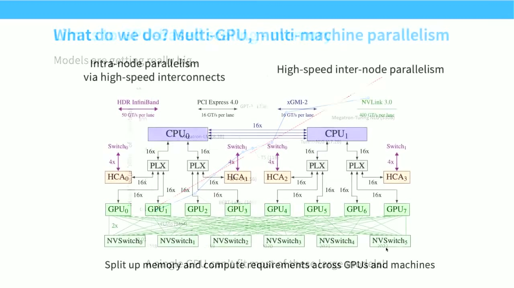

有一个重要的概念对象会贯穿今天的讲座：节点内并行与节点间并行的区别。节点内连接非常快，所以你可以做通信开销很大的事情；节点间通信则比较慢。正因为慢，我们就必须更多地使用尊重信道通信约束的方案。今天所有内容我们不会真的去发数据包，而是在集合通信原语的层面处理。当我核算通信量时，可能会说“我们要做一次 all-reduce”或者“我们要做一次 allgather”来实现某些操作。要高效实现这些，最终得深入到硬件层，但今天的讨论是算法层面的，所以我讲的所有网络原语都是集合通信这个层面的。

*[03:14](https://www.youtube.com/watch?v=6-cXp-aOmdg&t=194)*

Percy 讲过这一点，但它对今天某一部分非常重要：all-reduce 和 reduce-scatter 加 all-gather 之间的等价性。有一个算法，一边做 all-reduce，另一边做这两步不同的操作。这两者在代价上相同，意味着右边的算法可以在某种意义上“免费”完成。我们后面还会看到这一点。

*[03:44](https://www.youtube.com/watch?v=6-cXp-aOmdg&t=224)*

有人问，为什么我特别强调这个分解？是的，还有别的分解方式。这个特定的分解对后面某个算法特别有用，所以我才强调它；当然你也可以做别的分解。

*[04:19](https://www.youtube.com/watch?v=6-cXp-aOmdg&t=259)*

## 硬件底座：TPU 的环面网格与 GPU 的胖树

在进入算法之前，我还想简单谈谈底层硬件栈。今天大部分讨论是硬件无关的，理解了基本概念之后，你可以把它应用到任何硬件基底上。但硬件值得一谈，一方面因为它有意思，另一方面因为我认为它导致了不同模型训练公司采用不同的并行策略。

*[05:47](https://www.youtube.com/watch?v=6-cXp-aOmdg&t=347)*

TPU 是谷歌的加速器，我在 GPU 那讲提过，它有点像轻量级 GPU，但网络不一样。TPU 网络是所谓的环面网格（toroidal mesh）：你可以想象一个网格，然后让网格的末端互相通信。它其实更复杂一些，是一张 3D 图——Marcel 你有那个可视化，对吧？可以发到课程频道里。有一个很好玩的网页可视化，用 3D 展示环面网格。但你的心智模型大致可以就是这张图：所有芯片和邻居相连，邻居再绕回来。这让你有一个非常简单的网络拓扑，可以很简单地无限扩展：无论网络多大，每个芯片的邻居数量都一样。

*[05:47](https://www.youtube.com/watch?v=6-cXp-aOmdg&t=347)*

相比之下，GPU 的网络哲学非常不同，更像是全对全（all-to-all）。它的网络结构像一棵树，通常叫胖树（fat tree）。GPU 在最底层连接得非常快，然后一组 GPU 连成一个 pod，pod 之间可能通过脊交换机（spine switch）互相通信。这意味着随着节点数增长，树会越来越大，通信成本会更高，或者通信拓扑会变得更复杂，因为你在不断地把所有东西全对全连起来。这种哲学差异意味着：如果你只和邻居通信，TPU 很棒，性价比高，在同样功耗下每条连接可以做得很粗；但如果你要以非常随机、不可预测的方式连接，GPU 网络就更灵活。TPU 和 GPU 之间有非常不同的设计哲学，后面讲到并行时我会指出它在哪里体现出来。

*[06:49](https://www.youtube.com/watch?v=6-cXp-aOmdg&t=409)*

我上一讲把这个发到了课程聊天里，因为有人问这两者有什么区别。再举个例子支持我的观点：Bill Daley 和 Jeff Dean 谈过不同硬件各自适合什么。GPU 适合混合专家（MoE）这类通信模式不太清晰的东西，因为 token 会被路由到不同的专家；TPU 则很适合稠密模型，你可以做非常可预测的划分。我后面讲张量并行时会讲到这个想法。这些硬件适合不同的工作负载。

本来我准备就这么结束，直到今天早上谷歌宣布了 TPU8i 和 TPU8t。我备课的时候看到，心想：天哪，TPU8i？那是一棵树的拓扑，他们转向了更全对全的连接。仔细想想也合理：现代语言模型都是 MoE，服务 MoE 的时候，路由 token 到不同专家会有大量带宽在飞。推理时这些通信是真正的瓶颈，你大概确实想要更强的全对全连接。即使在训练时，TPU8t 这个训练芯片的跨机架连接看起来也更像 GPU，有一个更接近全对全风格的交换机，叫 Virgo 网络，是更高层的网络栈。所以我觉得正在发生很有趣的事情：TPU 和 GPU 出现了一点趋同演化，真正定义网络需求的是工作负载。

*[08:43](https://www.youtube.com/watch?v=6-cXp-aOmdg&t=523)*

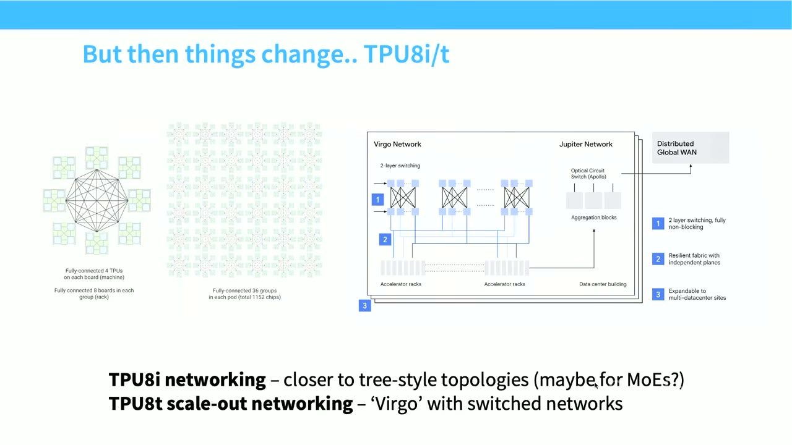

## 华为 Ascend 与硬件设计取舍

最后关于硬件，我很喜欢聊中国 AI 圈正在发生的事。GPU 那讲有人问，如果 SRAM 那么好，为什么不干脆全用 SRAM、只做 SRAM 芯片？那就是 Grok，它工作得很好。同样，你们可能有人会想：如果全对全连接好，那为什么不把所有东西都连起来，用非常快的光纤连接？那样你就会得到华为 Ascend 910。看它的规格其实很有意思：每颗芯片比 H200 差不少，矩阵乘法慢很多，很多方面都慢。但如果你愿意用一整个机架的光纤交换机去连接多得多的芯片——他们是一个大机架里 384 颗——那么也许你可以靠连接非常非常多这样的芯片，来弥补单芯片慢的问题。

*[10:33](https://www.youtube.com/watch?v=6-cXp-aOmdg&t=633)*

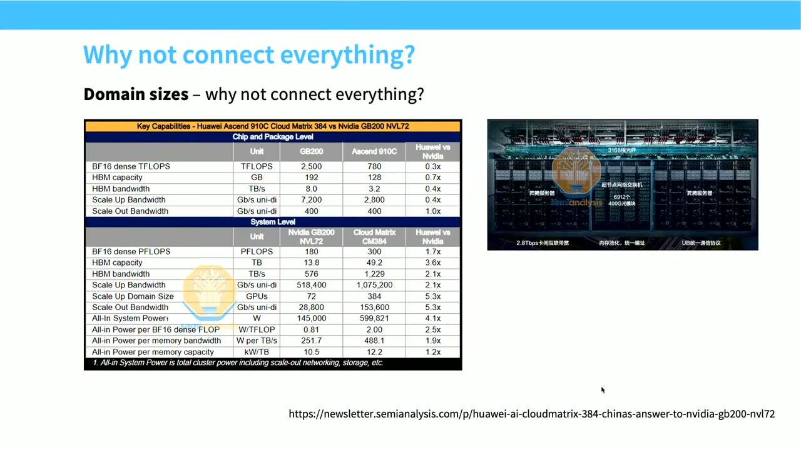

这展示了一个非常有意思的取舍。因为一旦看这个架构，你会发现它的功耗高得离谱，是同等 NVIDIA 系统的四倍。所以结论有点像：如果你愿意付出功耗代价，你可以用蛮力解决很多通信问题，更激进地扩展到 300 多颗芯片，但你要付功耗成本。这跟 SRAM 的故事类似：如果你想设计在功耗和制造上都高效的硬件，你会走到某个位置；如果你想蛮力解决问题，你会走到一个非常不同的位置。我觉得这是学习硬件设计取舍的非常有意思的地方。

*[10:33](https://www.youtube.com/watch?v=6-cXp-aOmdg&t=633)*

## 新的计算单元是整个数据中心

把这一切放在一起，你首先应该想到的是：新的计算单元不是 GPU，而是整个数据中心。我们想要几件事：能够控制使用的内存量，能够控制能调动的算力，而且希望这一切是无损的——我们想用上所有资源。接下来我们要讲的，就是通过所有这些通信原语和组件来实现这一点的算法。

*[11:05](https://www.youtube.com/watch?v=6-cXp-aOmdg&t=665)*

第二部分是今天的主要内容，也就是我们用来并行化语言模型的算法。这里有几个不同的重要想法，大致可以分组。数据并行是一组想法，本质上是把训练数据分布到不同 GPU 上，所以移动的是数据。模型并行则是把模型的不同部分切开来放到不同地方。事实证明这两者的边界有点漏，因为这里有一个算法实际上也会切分参数。但你们会看到我为什么把这些算法分到不同的框里。概念上，我们既要扩展算力，也要扩展显存，这就是为什么需要一大堆不同的技巧。

*[11:59](https://www.youtube.com/watch?v=6-cXp-aOmdg&t=719)*

## 数据并行：最简单，但只解决算力

数据并行我觉得是最容易理解的。它概念上非常简单，我认为这也是你尝试并行化 LLM 训练时标准会想到的方法。先忘掉 Adam，暂时只做朴素 SGD。我们有一个大小为 B 的批。每个更新步，我取 B 个元素，把梯度加起来，然后做更新。最朴素的并行方式就是把批 B 切到 M 台机器上；如果能整除，每台机器拿到 B/M 大小的批。然后每台机器计算梯度，我再把所有梯度同步起来得到总和。

*[12:47](https://www.youtube.com/watch?v=6-cXp-aOmdg&t=767)*

算力扩展方面这很完美，只要每张 GPU 上有足够多的样本就行。通信开销方面呢？每个批，我们基本上要通信参数量的两倍，因为我必须把梯度来回通信。显存扩展方面则完全没有：每张 GPU 都有相同的模型副本，需要同样大小的激活值，所以这个方案一点也不省显存。

*[13:21](https://www.youtube.com/watch?v=6-cXp-aOmdg&t=801)*

## 显存账单与 ZeRO 三阶段

现在问题在哪？显然我们在一定程度上解决了算力，但完全没有解决显存。来看看显存问题，做一点账。一开始看起来显存状况可能很糟，但事实证明我们的显存状况简直糟透了。原因在于，如果你做参数核算，会发现需要存很多东西。而且不仅需要存很多，实际上比参数本身还要多。粗略的经验法则是——取决于精度——我们需要大约五份权重、每个参数 16 字节来存模型。当然要存模型参数；还要有地方放梯度，也就是放进模型参数之前的累加器；可能还需要一个更高精度的累加器；如果做 Adam，糟糕的部分来了，你需要跟踪梯度的一阶矩和二阶矩，而且要随时间跟踪，所以需要两份，而且根据稳定性可能需要高精度存储。这些通常叫优化器状态。核算下来，优化器状态是做 SGD 更新时显存开销的大头。

*[15:04](https://www.youtube.com/watch?v=6-cXp-aOmdg&t=904)*

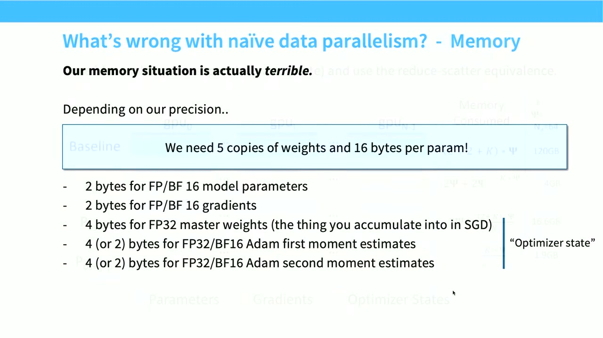

这个领域里有一件非常优雅的事情：你可以开始把需要的内存量切开来，分布到各个加速器上，而且以这种结构化的方式做，几乎能免费获得收益。优化器状态是绿色的，占大部分显存；橙色是梯度，蓝色是参数。参数和梯度大小相同，状态更大。朴素数据并行会把所有这些状态复制到每张 GPU 上，这不太好，因为你消耗了远超需要的显存，显存消耗随加速器数量线性增长。我们能不能把优化器状态分片到不同 GPU 上？这会是很大的节省。也可以把梯度分片到不同 GPU，极端情况下把所有东西都分片到不同加速器。最右边隐含的显存节省非常可观，从 120 一路降到 1.9。接下来要研究的核心是：这样做的代价是什么？天下没有免费午餐，基线肯定最快；越往下走，为了实现显存节省，就要付出很大的通信代价。但我觉得了不起的是，其中很多将是免费的。

*[16:25](https://www.youtube.com/watch?v=6-cXp-aOmdg&t=985)*

### ZeRO 第一阶段

我们从所谓的 ZeRO 第一阶段开始。对应这些步骤会有三个阶段。第一阶段最简单：我只分片优化器状态，把它分片到各 GPU 上。每个人仍然拥有参数和梯度。你可以认为每个 worker 负责更新参数的一个切片。如果我是 0 号 GPU，我的责任就是更新最前面这个切片，其他更新不归我管。

*[17:23](https://www.youtube.com/watch?v=6-cXp-aOmdg&t=1043)*

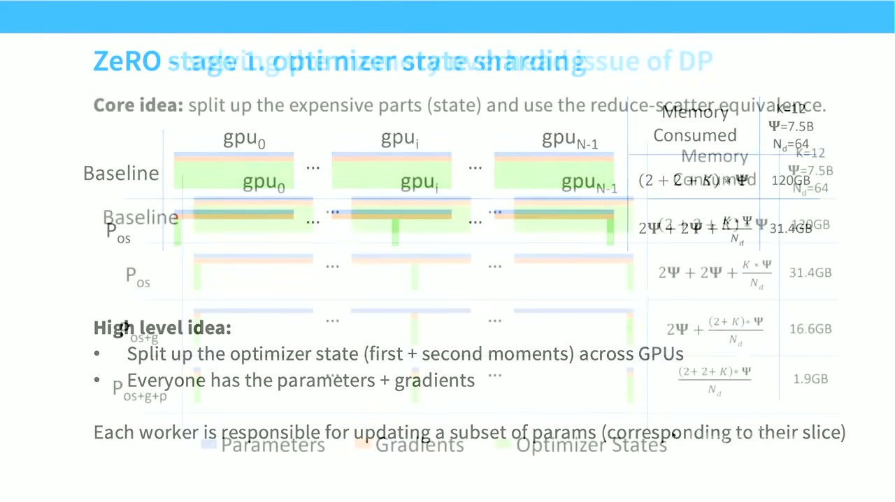

具体怎么做？每个人都计算。每个人有不同的数据项，所以先在自己的数据项上算出完整梯度。然后我把我算出的梯度 reduce-scatter 到其他机器上，因为别人需要我的梯度，但不需要全部梯度，只需要和他们要更新那部分相关的梯度。所以每个 worker 会从我这里拿到属于它那部分参数空间的梯度。这大致相当于一个参数量的通信成本，因为我把梯度切开发给每张 GPU。然后每台机器就能做更新了：它有参数、有从别人那里得到的梯度、有自己跟踪的状态；参数更新完毕，再做一次 all-gather 把它们收集回来。我负责比如四分之一的参数，就把这些更新后的参数发回给其他所有人，这是一次 all-gather。

*[18:22](https://www.youtube.com/watch?v=6-cXp-aOmdg&t=1102)*

这就是等价性有用的地方。我做了多少次操作？在朴素数据并行下，我必须做一次 all-reduce，和所有人交换所有梯度然后更新，通信成本是参数量的两倍。现在在 ZeRO 第一阶段，我做了两个操作：一个是 reduce-scatter 把梯度发出去，一个是 all-gather 收集更新后的参数。但我们已经说过，reduce-scatter 加 all-gather 等价于一次 all-reduce。所以 ZeRO 第一阶段具有和朴素 DDP 完全相同的通信特征。这是免费的显存节省。然后看显存：我们基本上把参数以及任何优化器状态都除以了 N 张 GPU。太好了。

*[19:15](https://www.youtube.com/watch?v=6-cXp-aOmdg&t=1155)*

### ZeRO 第二阶段

我们还能做更多吗？ZeRO 第二阶段说：我要把梯度也拆分开，对它做分片。这会更棘手，因为之前我依赖自己可以算出整个梯度，现在甚至无法物化整个梯度。那怎么办？这其实只是一个系统技巧。当我反向遍历网络时，不需要计算完整梯度，可以在进行过程中把梯度发送给相关 worker。关键步骤是：不再一次性物化整个梯度向量，而是沿着计算图反向走；算完一层的梯度，就立刻 reduce 并发送给正确的 worker；一旦反向图不再需要这些梯度，就立刻释放。所以你是增量地计算和发送梯度。增量做和一次性做，总量是一样的，所以没有区别。最后再 all-gather 参数。梯度在某种意义上已经被分片处理了，却没有带来额外成本。

*[20:25](https://www.youtube.com/watch?v=6-cXp-aOmdg&t=1225)*

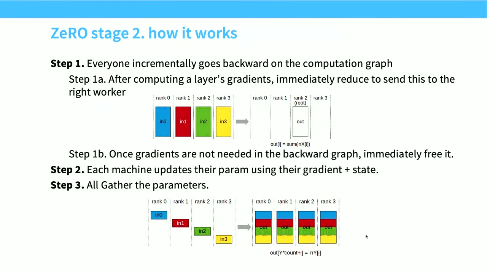

### ZeRO 第三阶段与 FSDP

最后一件最难的事——我最初学的时候觉得完全是魔法——是我们已经免费拿到了一些东西，那就继续推进：把参数也分片，一直分到所有状态上。我们用和 ZeRO 第二阶段同样的思路：增量地做。我会在计算图中前进时按需发送和接收参数。这非常棘手，因为每张 GPU 在任一时刻只能看到参数、梯度和优化器状态的一个切片。这就是 ZeRO 第三阶段，也叫 FSDP。如果你在 Torch 库里并行过任何东西，可能已经见过它。

*[21:13](https://www.youtube.com/watch?v=6-cXp-aOmdg&t=1273)*

底层的工作方式是：你会做两次 all-gather 和一次 reduce-scatter。从左到右走一遍，这就是整个更新过程。加载模型，上面和下面各有一张 GPU。首先收集这一层的权重，做这一层的前向，然后就可以释放权重，因为前向已经做完了。假设我只有一层，现在进入反向过程。做反向需要激活值（我保留着），还需要这一层的参数，可以按需 all-gather。我 all-gather 参数，做反向，拿到梯度后立刻 reduce-scatter 出去，然后释放权重。接着重复这个过程：按需取参数，做反向，把梯度发出去，重复；最后更新权重，完成。

*[22:18](https://www.youtube.com/watch?v=6-cXp-aOmdg&t=1338)*

通信成本呢？我们做了两次 all-gather、一次 reduce-scatter，多了一次 all-gather，看起来不太好。第二，看起来开销很疯狂，因为我们一直在通信，每一层都在通信。你可能觉得这极其昂贵、非常糟糕。但我觉得有一个反直觉而重要的点：ZeRO 第三阶段用了两个非常重要的想法，让它基本上没有额外开销。第一个我们已经见过，就是扫过计算图，做必要的通信，然后立刻释放显存。另一个我还没讲，就是把通信和计算重叠起来。这一点一开始很难解释。

*[23:16](https://www.youtube.com/watch?v=6-cXp-aOmdg&t=1396)*

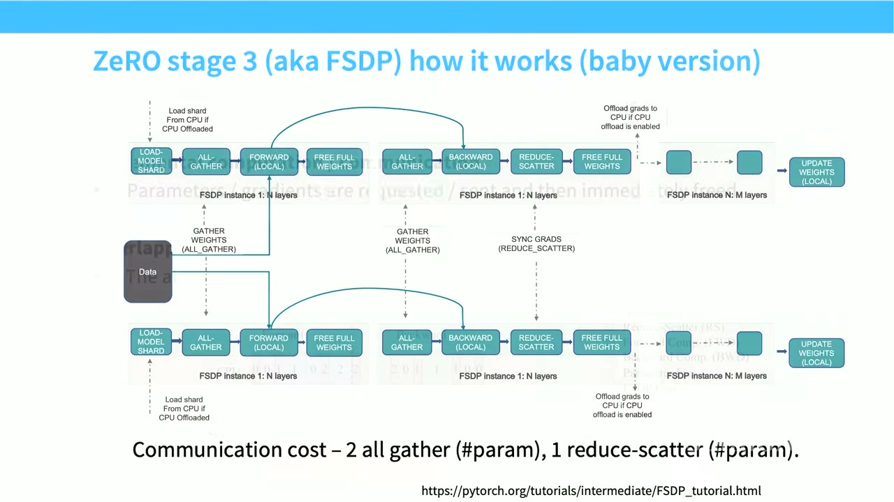

这张图是从论文里拿的，我认为它在解释 PyTorch FSDP 架构。工作方式是这样：我们有不同的流——CPU 里发生的事情、GPU 里正在进行的计算、以及最底下 GPU 里正在进行的通信。FSDP 的工作方式是：我必须先拿到参数才能计算，所以先做 all-gather 0，第 0 层。一旦 all-gather 完成，我就可以做前向。但做前向的时候，注意我在请求下一层的参数，也就是在做这个计算的同时做 all-gather 1。现在我有了 all-gather 1，就可以做前向 1，而且可以在开始这个流程的同时开始 all-gather 2。所以我把计算和通信重叠起来了。我可能花一些时间释放参数，也可能花一些时间计算另一个前向，比如复用 W0，把前向 0 复用两次。这让你能做到的是：如果你有足够的计算，而且网络足够快，通过重叠通信和计算，FSDP 基本上可以是免费的。确实会看到一些气泡，这些是开销；但如果通信非常快、计算非常大，计算可以花比通信更长的时间，你就能在几乎不付显存代价的情况下获得显存使用的巨大改善。

*[24:57](https://www.youtube.com/watch?v=6-cXp-aOmdg&t=1497)*

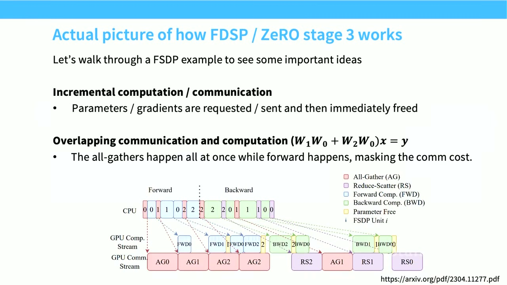

### FSDP 的总结与问答

看不同的 ZeRO 阶段：DDP，也就是朴素数据并行，成本是参数量的 2 倍，是一次 all-reduce。ZeRO 第一和第二阶段，也就是分片梯度和优化器状态，是字面意义上的免费，因为通信量和原来一样，只是利用了 all-reduce 等价于两个操作这个恒等式。ZeRO 第三阶段技术上通信量稍多一点，需要额外一次 all-gather，但没那么糟，因为库会用非常聪明的方式把通信成本藏在计算下面。所以实践中跑 FSDP，你会看到 GPU 利用率非常接近单 GPU 性能。FSDP 好得确实令人吃惊，而且概念上非常简单。你们作业里要写一个 FSDP 实现，其实可以写一个 wrapper，包住任意模块，把它变成 FSDP 版本。概念上你要做的就是一堆 all-gather、计算、释放，然后在反向传播里重复。

*[26:12](https://www.youtube.com/watch?v=6-cXp-aOmdg&t=1572)*

有人问：是不是从下一张 GPU 拿梯度来计算前一张 GPU 的梯度？你描述的更像是流水线并行。流水线并行是一层在一张 GPU 上、另一层在另一张 GPU 上；这里不是这样。在所有 ZeRO/FSDP 的情况里，每张 GPU 都会从头到尾走完整个模型，区别在于没有哪张 GPU 同时持有全部参数。所以如果我没有第 0 层，我就先按需取第 0 层的参数，做完整计算，再进入下一层。计算和朴素数据并行是一样的单 GPU 计算，只是可以理解成在每个计算操作之间请求参数、释放参数。

*[27:12](https://www.youtube.com/watch?v=6-cXp-aOmdg&t=1632)*

另一个问题：是不是每张 GPU 都拥有每一层的一部分，所以才需要 all-gather？是的。参数、梯度和优化器状态都分片在不同 GPU 上。还有人问：为什么通信成本没有乘以层数？操作数量确实乘以层数，这是对的；但每一次通信的数据量更小，因为那只是一小块 MLP 之类。拿它和 all-reduce 整个网络相比，加起来在某种意义上差不多。

*[27:51](https://www.youtube.com/watch?v=6-cXp-aOmdg&t=1671)*

实践中，如果看 A100 上能放下的最大规模：从基线出发，你连 7B 模型都放不下；到了 ZeRO 第三阶段，你可以放下 500 亿参数的模型。所以用 FSDP 来放下大模型容易多了，显存改善非常显著。有人问 8×A100 的限制换成 H100 或 H200 会怎样——我没法心算乘以 141 再除以 80，但 H200 上大概是那个数，基本上是线性的，不会改变太多数学。

*[28:24](https://www.youtube.com/watch?v=6-cXp-aOmdg&t=1704)*

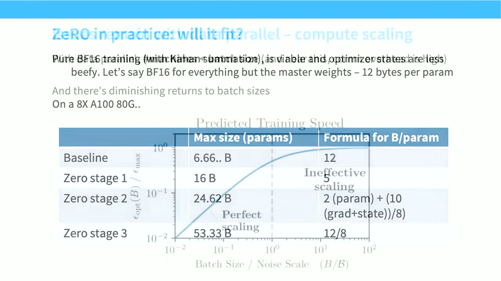

FSDP 非常干净、优雅，我很喜欢。我真希望讲座能在这里结束。但不幸的是，我们得继续进入更丑陋、更棘手的东西。有两个原因。第一个是并行化里的重要想法：数据并行在消耗一种重要资源，也就是批大小。如果你的批大小是 8，你永远不能有超过 8 个加速器。你可能会想，那就把批大小越做越大；但不行，因为存在所谓的临界批大小（critical batch size）：到了某个点，额外增加一个批元素带来的收益，还不如在单个元素上再走一步 SGD。小批大小时，增加元素完全有帮助，等同于多走 SGD 步；但到某个点后收益递减。无限大的批并不比无限多单步好无限倍。

*[30:11](https://www.youtube.com/watch?v=6-cXp-aOmdg&t=1811)*

另一个问题是显存。ZeRO 第一和第二阶段并不能真正扩展显存；ZeRO 第三阶段能切分参数显存，但还有激活显存和其他显存使用，这些并没有被切分或减少。所以我们需要更好、更细粒度的切分模型方式，才能真正把显存使用继续压下去。这就带我们进入各种模型并行。

*[30:41](https://www.youtube.com/watch?v=6-cXp-aOmdg&t=1841)*

## 模型并行总览

模型并行本质上和 FSDP 一样，是把参数拆到不同 GPU 上。但我觉得重要的概念区别在于：接下来我们要通信的是激活值。在 FSDP 里我们切分参数，但某种意义上它只是个 wrapper，我们仍然做正常计算，只是在计算前把参数发来发去，所以飞来飞去的是参数。现在我们要改成来回通信激活值。比如一层在 GPU 0 上，下一层在 GPU 1 上，我要通信的是两层之间的激活值。这就是最大的区别。这包括流水线并行（切层）、张量并行（切矩阵）和专家并行（把专家分片到不同地方）。Percy 已经讲过张量并行，所以你们大概有了一些心智模型。

*[31:49](https://www.youtube.com/watch?v=6-cXp-aOmdg&t=1909)*

## 流水线并行

我先讲流水线并行，或者说按层并行。它概念上非常简单。我最早学并行的时候觉得这太简单了：把层切开放到不同 GPU 上就行。前向传播时把激活值往前传，反向传播时把部分梯度往回传。但这么做的结果是一张非常难看的图，非常令人沮丧。四张加速器，每张处理四分之一模型。计算随时间发生，时间从左到右，不同加速器是不同行。首先最下面第 0 张加速器处理第一层，做计算，然后停下来，把计算交给第二个，然后它直到最后都无事可做。接着东西来回传递，同一时间只有一张 GPU 活跃；反向传播时也是一次只有一张 GPU 活跃。所以大部分时间 GPU 都是空闲的，利用率极其糟糕。这叫做气泡（bubble），就是流水线里你什么都不做的部分。

*[33:06](https://www.youtube.com/watch?v=6-cXp-aOmdg&t=1986)*

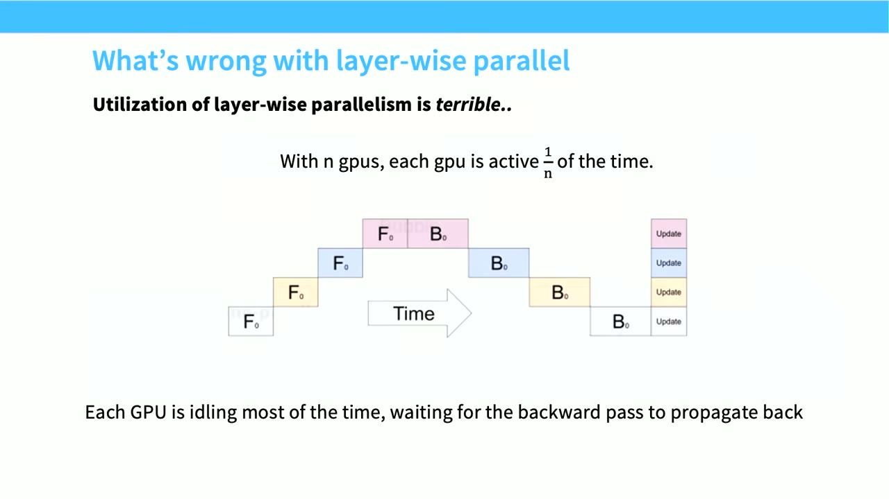

解决办法是做批处理或者流水线化。不是简单一层接一层，而是做成流水线：这张图里有四个元素要处理，你处理完一个就开始下一个，然后把已经做完的交给下一层。这样你可以把元素往上送，再往下送。要想让它合理，你需要气泡时间和有用计算时间的比例合适；利用率大致是阶段数除以微批数。所以我们需要很大的批大小来把气泡降到接近 0。气泡会随着 1/微批大小下降。这就是我说批大小是有用资源的原因：现在你可以把它花在另一个地方，也就是用更多流水线来减少流水线并行里的空闲时间。

*[34:13](https://www.youtube.com/watch?v=6-cXp-aOmdg&t=2053)*

流水线很糟糕。有句行话说，并行化代码看起来都挺合理、大家都能理解，直到你实现流水线并行。那为什么还要做？因为和 DDP 相比，流水线能省显存，因为你切了层，而且可以和数据并行组合，两者都能做。但更重要的原因是，在某些拓扑里你总会用到流水线，它的通信性质非常好，比 FSDP 和你能做的其他事情都好。它只依赖激活值，也就是 B×S×H；而且是点对点通信，不是全对全。所以根据你如何安排顺序，它可以非常高效地利用网络。实践中，流水线会放在最慢的网络链路上。如果你有多个数据中心或多个 pod，它们之间通信较慢，你就会在这些之间用流水线并行，因为这是在那种情况下通信效率最高的并行方式。

*[35:22](https://www.youtube.com/watch?v=6-cXp-aOmdg&t=2122)*

流水线性能非常依赖批大小。我会反复提到这篇论文——这是 NVIDIA 的 Megatron 论文。他们做了很多很好的参数扫描，展示不同配置下利用率如何变化。如果你有大批大小，并且选一个大的流水线规模，可以得到相当好的利用率，接近完全不做流水线并行。但你需要大批大小才能保持利用率；否则流水线并行会让你的利用率和性能迅速下降。

*[36:03](https://www.youtube.com/watch?v=6-cXp-aOmdg&t=2163)*

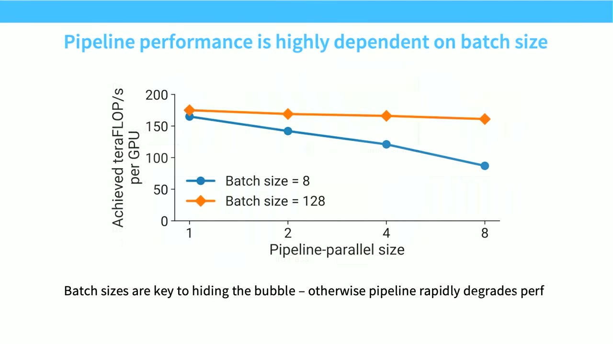

有人问：你之前说流水线通信性质好，相比 FSDP，具体机制是什么？是因为通信的数据量更小。它是批大小 × 序列长度 × 隐藏维度，几乎总是比试图通信整个参数矩阵要小。

*[36:30](https://www.youtube.com/watch?v=6-cXp-aOmdg&t=2190)*

人们试图找出更聪明的方法来减小流水线气泡。你可以用聪明的方式切分不同层或不同微批的阶段，把不同的前向元素排在反向元素之间。通过巧妙的调度，可以进一步减小气泡。这是从 DeepSeek 论文里拿来的。通过非常聪明地操纵前向和反向计算的时机，你可以在气泡大小上得到一些改善。

*[37:13](https://www.youtube.com/watch?v=6-cXp-aOmdg&t=2233)*

但更聪明的做法叫零气泡流水线（zero bubble pipelining），它其实不是关于调度的，而是仔细思考反向传播的结构。反向传播里有两件事必须发生。你在计算图里往回走，一方面要把偏导数继续往计算图下方传播——反向传播从末端开始，把这些偏导数往回传，这是必须做的；另一方面你要计算当前权重的梯度。所以在计算图每个节点上你做两件事：往回传播，以及计算权重的导数。关键洞察是，其中一件对流水线非常重要，另一件可以随时做。传播偏导数非常重要，因为下一阶段在你把信号传回来之前没法做任何事；而关于权重的导数是一个叶节点，什么时候做都行。所以聪明的做法是把这两者分开。B 是往回传播的部分，W 是计算权重导数的部分，W 可以随时发生。你尽快算 B，把 W 推迟到后面，在计算有空隙的时候做。这样你几乎可以把流水线完全填满。零气泡流水线非常复杂，比通常愿意处理的要复杂得多，但它允许你几乎完全解决流水线问题，取决于 W 和 B 的工作量比例等等。我看到这个的时候觉得太聪明了，系统层面能做出这么聪明的事情。

*[38:56](https://www.youtube.com/watch?v=6-cXp-aOmdg&t=2336)*

## 张量并行

流水线并行像深度：沿着深度维度切网络。但我们扩展有两个轴：深度轴和宽度轴。如果我们开始沿着宽度切模型呢？这就是张量并行，Percy 之前解释过。它的核心想法很简单：矩阵乘法可以切成更小的矩阵乘法，然后把部分和加回去。这其实和 tiling 是同一个想法。这个核心原语会出现很多次。

*[40:07](https://www.youtube.com/watch?v=6-cXp-aOmdg&t=2407)*

实践中这长什么样？这里是一个 GeLU。通常你有 x 作为输入，从最右边进来，然后乘以矩阵 A，应用非线性 GeLU，再乘以 B 做降维投影，输出 z。这是正常的串行计算。在张量并行里，我会把 A 切成两个子矩阵，把 B 切成两个子矩阵，并行跑计算，最后把它们收集起来。有一点很重要：前向和反向之间存在对偶性。前向里，我对 x 做的只是把它复制两份，然后往前计算，所以 f 是恒等函数；到了并行组件的末端，g 函数是一次 all-reduce，把它们合回来。但反向传播做梯度时会翻转：g 变成恒等，因为偏导数往回走；f 变成需要求和的偏导数，用来得到这个模块开始的偏导数。它们会翻转。这个对偶性对写张量并行很重要。

*[41:31](https://www.youtube.com/watch?v=6-cXp-aOmdg&t=2491)*

你可能已经注意到了：我们切分的方式有些是按列切。按列切时，张量并行发生在输入端：MLP 的输入、注意力的投影，在每个 transformer block 里按列切。对应的第二阶段则按行切：MLP 的降维投影、注意力的输出，按行切。所有小的层，比如 layer norm、非线性、MoE 里的 router，都是完全复制的，你不值得为切分它们付出开销。

*[42:19](https://www.youtube.com/watch?v=6-cXp-aOmdg&t=2539)*

什么时候做张量并行？张量并行非常吃计算：每次有 matmul，你就要通信，一次 all-reduce；反向传播里也有 all-reduce。这些是激活值大小，而且发生得非常频繁。所以它非常吃通信，你只想在节点内做。对 GPU 来说，一个盒子里的 GPU 网络连得很紧，最多八张你也许愿意做张量并行；超过之后就要跨节点，互连慢得多，性能会大幅下降。所以记住，张量并行非常吃通信，通常用在最快互连上。

*[43:23](https://www.youtube.com/watch?v=6-cXp-aOmdg&t=2603)*

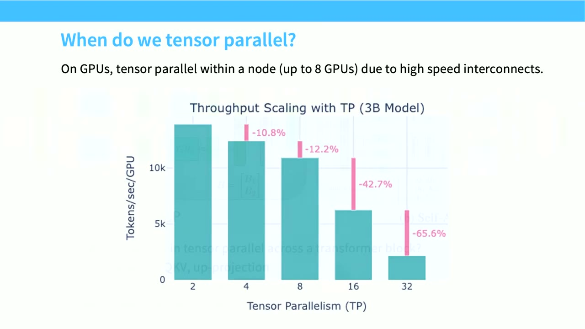

这里回到我之前说的 TPU。TPU 没有“八张快 GPU”和“下一台机器”的区别，只有一张大网格。所以 TPU 的人会告诉你的一大优势是，你可以做非常大数量的张量并行，因为他们能在这张网格上以非常规则的通信模式获得高带宽。这是并行化 TPU 和 GPU 的一个大区别。你用多少张量并行、多少流水线并行，会有很大不同。

*[44:02](https://www.youtube.com/watch?v=6-cXp-aOmdg&t=2642)*

比较这两者：它们都是模型切分策略，都能省参数和激活。张量并行的优点是未必有流水线气泡，如果网络够快可以获得满利用率，而且复杂度低，就是切一些 matmul。缺点是通信量大得多：以前是 B×S×H 的点对点通信，现在大约是 A×B×S×H 再加上一次 all-reduce 通信，不仅是点对点，而是需要全对全通信。所以张量并行适合高速互连，其他时候我们大概想用流水线并行。

*[44:53](https://www.youtube.com/watch?v=6-cXp-aOmdg&t=2693)*

## 激活显存与序列并行

接下来要更仔细地想显存。对深度学习语言模型最朴素的看法是：显存就是参数，也就是绿色那块，你需要某些比特来存参数，仅此而已。我已经讲过优化器状态，也就是黄色框，很重要。但看这张 PyTorch profiler 实际 profiling 出来的显存使用图，你会发现这不是全部。计算中还有很多动态显存：需要存所有激活值，就是这些大的红色鼓包；随着计算梯度，在反向扫描里还需要存梯度。显存最大使用点出现在最大激活点之后一点，你开始反向扫梯度，但还需要保留激活值，那通常是最大显存点。所以要减少显存，也许需要处理这个大的红色鼓包，也就是激活值。

*[45:46](https://www.youtube.com/watch?v=6-cXp-aOmdg&t=2746)*

如果看更现代的语言模型工作负载，你会发现随着参数越来越大——先别看“present work”那一列，我待会讲——只看基线列，在中等长度序列下，激活值会远远超过参数显存。所以任何省显存策略都必须考虑激活值，只处理参数显存不够。如果我们要存所有东西，一个粗略的经验法则是：需要的激活值大约是 34×S×B×H，加上 5×A×S²/H，其中 A 是注意力头数乘以序列长度再除以隐藏维度。S×B×H 这个依赖是根本性的，因为我们预期要为序列每个元素、每个批元素、每个隐藏维度存一些东西。所以我们会反复看到 SBH 这一项。那个奇怪的 5AS²/H 项来自二次注意力项，包括 dropout；如果我们做 flash attention 并重计算，可以去掉这一项。

*[47:48](https://www.youtube.com/watch?v=6-cXp-aOmdg&t=2868)*

如果用张量并行呢？我在讲模型并行时承诺过可以大幅减少激活值。张量并行会切分注意力和 MLP 里的矩阵乘法。MLP 是前面 34 里的 24，注意力头是 5AS²/H，也就是第二项。我可以用张量并行大小 T 来除这两项，这不错，因为我把大部分显存变成了随张量并行大小 T 线性缩放。但还有其他东西：layer norm、dropout、注意力和 MLP 的输入需要作为残差保留下来用于反向传播。不幸的是，这些不会随张量并行大小缩减。张量并行不切 layer norm，所以不会切分这些激活值。这很不幸，因为你本来希望如果有 1000 张 GPU 做张量并行，就能大幅减少激活值；但现实是你仍然要承受 10×SBH 的惩罚。

*[49:20](https://www.youtube.com/watch?v=6-cXp-aOmdg&t=2960)*

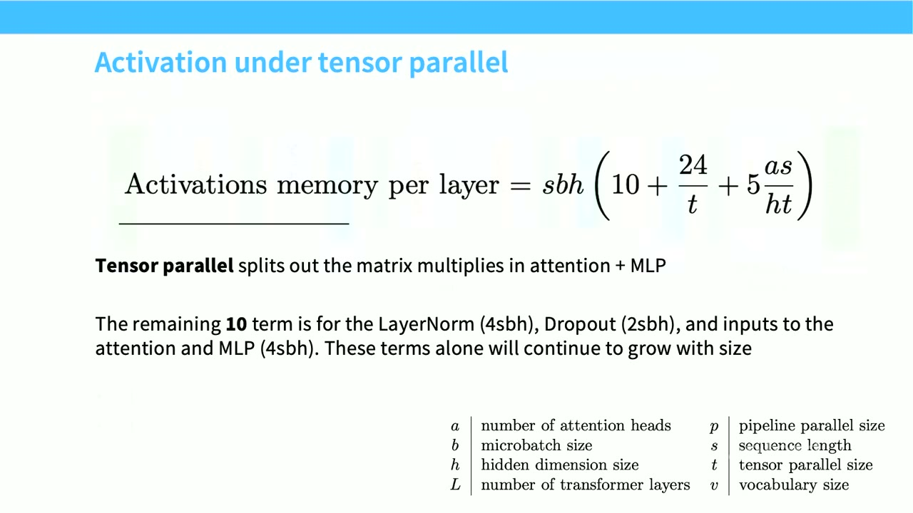

最后一个通常和张量并行组合使用的是序列并行（sequence parallel）。这个名字很有误导性，因为通常我说序列并行时，实际上有个叫上下文并行的东西更配这个名字。序列并行的想法是：我们有剩下那些 10×SBH 的项，它们很轻量，像 layer norm，没有太多计算；我要把它们沿着序列轴切分，而不是沿着隐藏轴切分。这会涉及在每次操作之前做 all-gather 和 reduce-scatter。如果你想想，这非常像 FSDP：我们需要激活值，前向时计算并保留，反向时用来求导，但现在不需要的时候就以分片形式存储，按需物化。所以概念上和 FSDP 风格很像：以分片格式存，然后需要时收集。这里也有对偶性：前向里 g 是 all-gather，g bar 是 reduce-scatter；反向里两者反过来。

*[50:57](https://www.youtube.com/watch?v=6-cXp-aOmdg&t=3057)*

现在如果做这些，得到什么？无并行时，激活显存是 34×SBH 加上注意力头部分。张量并行可以把 MLP 部分和注意力部分除以 T，但不能除其他逐点操作。如果做序列并行，我把这些也按加速器切分，只是沿序列轴，于是得到完全线性的依赖。如果做激活重计算，我甚至可以去掉第二项，因为那只是 softmax 需要存的；通过重计算可以去掉，得到 SBH×34/T。这是正常训练下激活显存能达到的合理下界，值得记住。如果你想手算模型能不能放进 GPU，这是很好的参考：至少需要这么多激活显存，再加优化器状态，再加参数和梯度，然后就能大致知道模型需要多少显存。

*[52:14](https://www.youtube.com/watch?v=6-cXp-aOmdg&t=3134)*

有人问 24/T 是 MLP 部分，MLP 不能通过重计算优化吗？你可以重计算 MLP，但列入这里的重计算在计算上非常昂贵，比如 MLP 的重计算要在反向传播里再跑一遍 MLP，你大概不想这么做。注意力的重计算通常更便宜，而且你也不想付二次代价，那很痛苦。

*[53:19](https://www.youtube.com/watch?v=6-cXp-aOmdg&t=3199)*

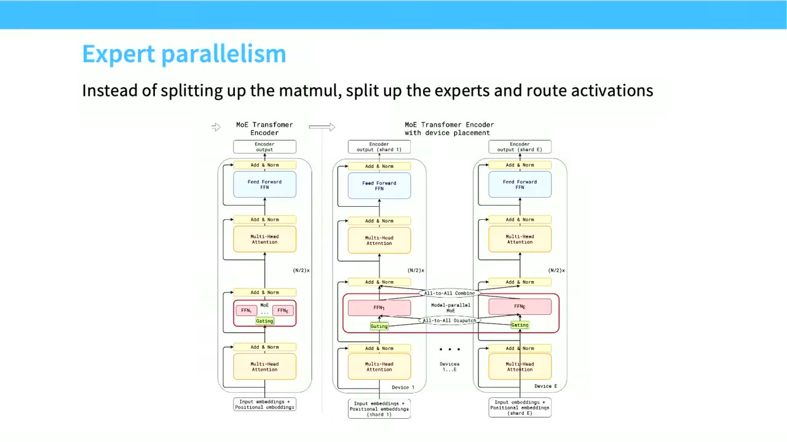

## 专家并行

现在讲标准并行工具箱里的最后一个成分：专家并行（expert parallelism）。MoE 现在是非常标准的工具，大多数大模型都是 MoE，这让我们能利用它们的一大好处，也就是专家并行。我自己把专家并行看作类似于张量并行：你取网络里的 MLP、FFN 组件，以各种方式切开，并付出通信代价，就像你切分矩阵一样，只不过这里是把 MLP 切分到不同设备上。专家并行的系统行为和张量并行也大致类似，是一个高带宽的并行原语，也能减少激活值。但有一点很重要：如果你做 MoE，几乎总是更偏好专家并行分片策略，而不是张量并行。

*[55:43](https://www.youtube.com/watch?v=6-cXp-aOmdg&t=3343)*

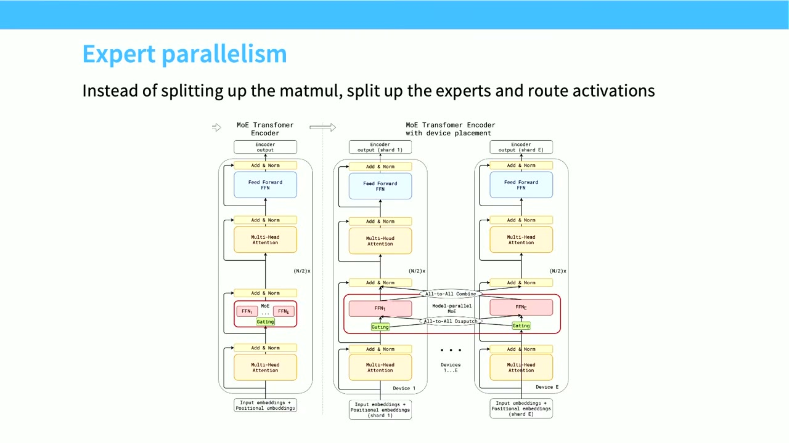

这是我从 Megatron 的并行指南里截的图，Megatron 是 NVIDIA 的并行库，非常好的库和文档。其中一条指南说，如果你要做 EP 或 TP，你应该用 EP 而不是 TP。为什么？这其实是张量并行缺点的一个好列表。如果你有一个矩阵，把它切得太细，矩阵会变得很小，GPU 利用率会受损；所以你希望 matmul 尽可能大，而张量并行会把它变小。对 MoE 层来说，路由稀疏的 token 激活比路由密集的大张量并行 matmul 激活容易得多；你可以把 token 精确路由到需要的地方，跳过一些计算或开销。既然你无论如何都要做 MoE，不如把专家数分到所有设备上。

*[55:43](https://www.youtube.com/watch?v=6-cXp-aOmdg&t=3343)*

这可能会让人觉得，EP 很棒，大家都应该一直用专家并行。不幸的是，专家并行仍然非常复杂、非常困难。我觉得 FSDP 之后我讲的所有东西——张量并行、流水线并行——系统上都相当不容易做好。我指出两个库，不是要讲它们内部的细节，而是告诉你这真的是非常复杂的事情。DeepSeek 有一个库叫 DeepEP，我觉得是 DeepSeek V3 时代我最喜欢的东西之一，基本上是他们自己做专家并行路由和 dispatch 的库，会看非常底层的 GPU 网络原语，试图把不同操作合并，或者让硬件处理某些操作，让 MoE 路由尽可能高效。NVIDIA 也有一个类似的库叫 Hybrid EP，同样是在底层硬件上高效实现专家并行 dispatch。

*[57:56](https://www.youtube.com/watch?v=6-cXp-aOmdg&t=3476)*

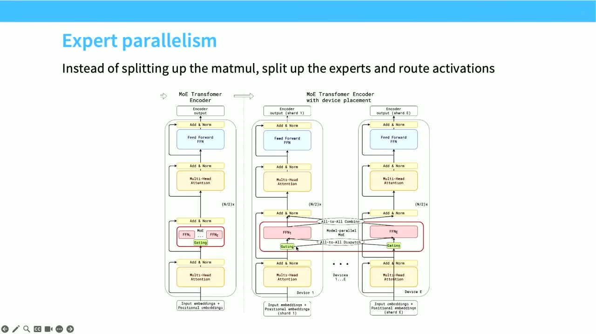

高层来看，为什么这些东西难？因为你要做大量全对全 dispatch。如果看 MoE 的通信模式，很像张量并行：每次有 MLP，你都要把 token 路由到各种地方，而且必须以非常延迟敏感的方式做，因为你的计算在等 token 到达。所以降低这种 dispatch 的延迟极其重要。关于 DeepEP 的一个有趣冷知识是：DeepSeek 的人太拼了，为了优化最后一点性能，他们找到了一些未公开的 PTX，也就是类似 GPU 机器码的东西，并学会用这些未公开指令进一步加速网络通信。要走到并行效率的前沿，你需要的就是这个层次的功夫。

*[57:56](https://www.youtube.com/watch?v=6-cXp-aOmdg&t=3476)*

## 并行策略的组合与约束

到目前为止，我都是孤立地讲各种并行原语，隐含假设是你可以像乐高积木一样把它们拼起来。对大多数其他并行策略来说确实如此：数据并行和张量并行很容易组合。专家并行则有额外约束，你需要尊重。通常朴素的数据并行加专家并行方式是——很多旧库里就是这样——DP 和 EP 的副本是一样的。比如数据并行度为 8，我把专家分片到那 8 个副本上，数据也切分到那 8 个副本上并以各种方式路由。换句话说，你按 DP 切分 GPU，EP 是这个切分的一个子集。这很自然，因为你在路由 token。但这样做，EP 能并行的程度就有上限，而且会约束 DP 和 EP 的关系。这是最后的复杂性。抱歉，专家并行在很多方面确实很乱。

*[59:21](https://www.youtube.com/watch?v=6-cXp-aOmdg&t=3561)*

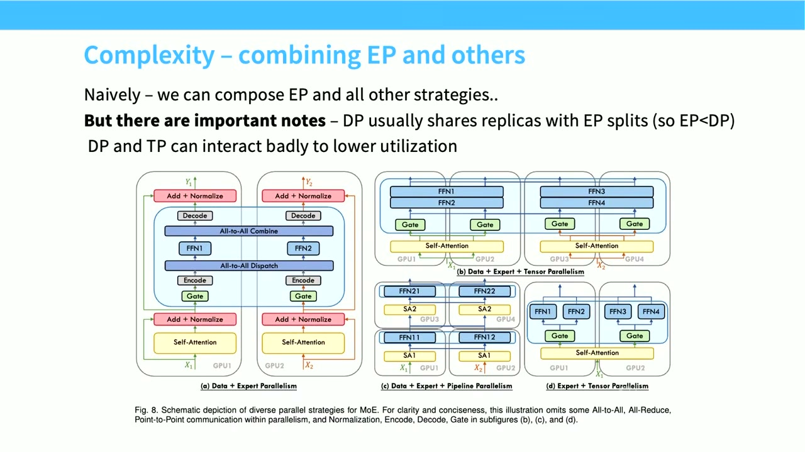

因为这些问题，有一个有趣的系统事实：MoE 只改变 MLP，完全不改变注意力。因为我们切 MLP 但不切注意力，专家并行对模型的应用是不均匀的。当我在专家层面并行时，我并行的是 MLP，但没有并行注意力。为了并行注意力，也许我还想用张量并行：我想要高张量并行来切小注意力。但这会影响 MLP，因为高张量并行加高专家并行会把矩阵切成非常小的块，利用率很差。所以有一个奇怪的取舍：注意力想要高张量并行，MLP 想要低张量并行，存在冲突。怎么办？最近几年人们做出了更复杂的系统方案，把 MLP 和注意力里的张量并行解耦：注意力层用一种张量并行，MoE 层用另一种。现在可以完全解耦并行，产生更复杂但更有效的 EP + 张量并行 + 数据并行组合。

*[60:58](https://www.youtube.com/watch?v=6-cXp-aOmdg&t=3658)*

## 上下文并行

这个领域最后要讲的是上下文并行（context parallel）。上下文并行或 ring attention 的基本想法是把很长序列里的激活值切分到不同加速器上。你可以以环状方式，沿着 TPU 的网格拓扑把激活值传给需要的设备。Ring attention 是最早做这件事的论文，展示了在 TPU 上工作得很好。上下文并行是现在做这件事的标准并行策略。两者都用在长上下文扩展阶段和模型服务中。我不打算多讲，主要是因为它概念上和我们已经讲过很多东西重叠。

*[61:51](https://www.youtube.com/watch?v=6-cXp-aOmdg&t=3711)*

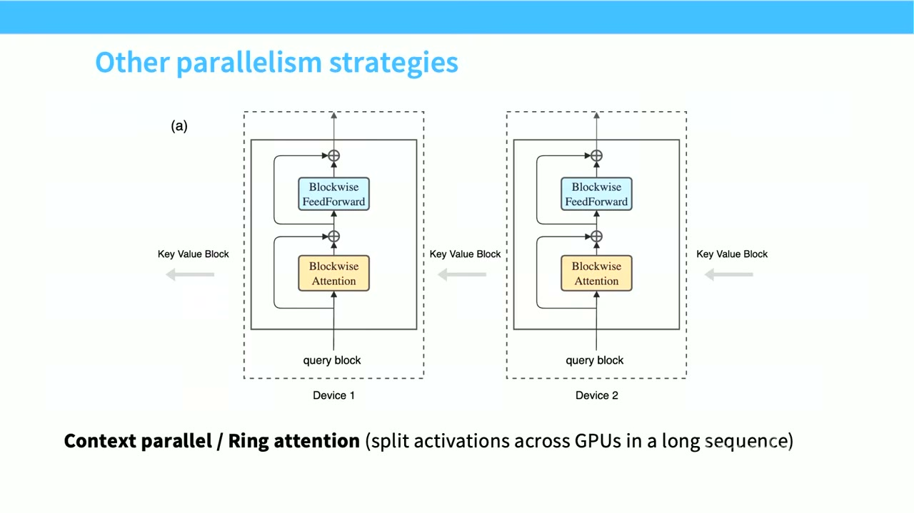

## 策略对比：没有万能解法

第二部分到此结束。把一切放在一起，我做了一张并行策略的大表，包括数据并行——最上面两行——以及下面的各种模型并行策略。我用红色标出了我主观认为各方法的缺点。标红的原因是我想传达：没有哪种并行策略严格占优，全是一堆取舍，你必须优雅地管理它们才能得到好结果。比如 FSDP 很好，但它不帮助激活值，而且消耗全局批大小来做并行，所以有局限。为了弥补，也许你想把它和别的技巧组合：也许做张量并行来减少激活显存，它也不碰全局批大小；但这样做你需要快速网络和高带宽。为了利用较慢的连接，也许你想用其他并行策略。所以你会看到，这些不同优势意味着在不是所有、但很多大规模架构里，每种并行策略都有自己的位置，你会用它们的组合。

*[63:20](https://www.youtube.com/watch?v=6-cXp-aOmdg&t=3800)*

有人问流水线和 FSDP 是否仍适用于 MoE？是的，绝对适用。标准建议是专家并行像张量并行一样，最多用到 8 或者快速连接；人们现在不一定完全遵守。但即使如此，FSDP 或一般的数据并行、流水线并行、张量并行在前沿模型里都被大量使用。

*[63:58](https://www.youtube.com/watch?v=6-cXp-aOmdg&t=3838)*

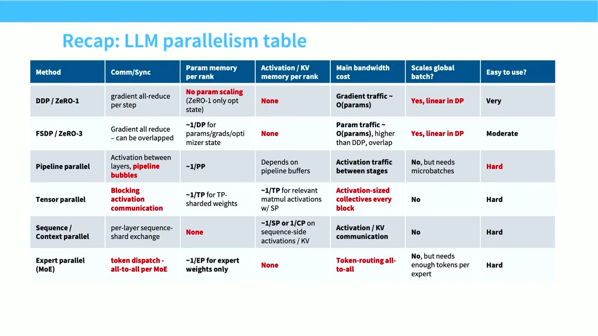

## 算一算：计算与通信的权衡

你们作业里会做这件事或类似的事情。并行化很酷的一点是你可以做数学：对每种分片策略，每层计算多少、通信多少；如果不同设备分配给不同通信策略，它们如何扩展；对一组策略组合，它们如何扩展。然后你可以画出图：给定批大小和并行策略——这里我有三种不同并行策略——GPU 利用率是多少，也就是计算时间与通信时间的比例。只要计算时间比通信时间长，原则上你就可以把通信藏在计算下面。所以可以画这样的图：最上面虚线是效率边界，上面是完全利用计算，下面是 roofline 的坏部分，你在等通信来做计算。

*[65:14](https://www.youtube.com/watch?v=6-cXp-aOmdg&t=3914)*

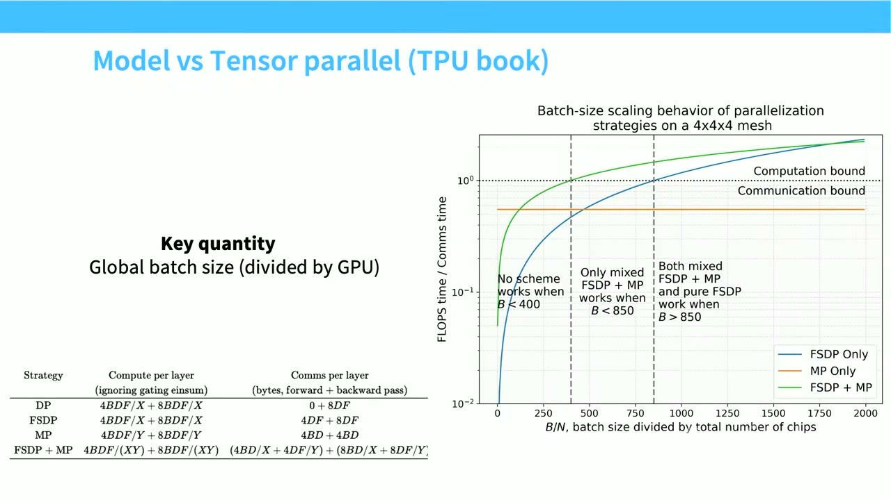

这里有趣的是——根据我讲的，你们应该觉得很直观：如果批大小足够大，只用 FSDP 就很好。如果每芯片批大小是 2000，FSDP 表现极好，完全计算受限。但重要的是，批大小下降时，只用 FSDP 会到达通信受限的点。那怎么办？为了继续压效率，必须把 MP，也就是张量并行，加进来。现在你可以把曲线往外推一点，在更小批大小下仍然计算受限。你不断加策略把曲线往外推，得到更好的结果。这就是人们说的 3D 或 4D 并行——我不认为有 5D——也就是把所有策略放在一起，在不同通信拓扑下让计算单元保持满利用率。

*[66:19](https://www.youtube.com/watch?v=6-cXp-aOmdg&t=3979)*

## 一套简单的处方

有一个非常简单的处方。到目前为止我讲得比较一般，可能感觉复杂。但我觉得并行化策略其实很简单：只要模型还放不下，你就用任何必要手段切分模型；切分时，在快速互连上用张量并行或专家并行——如果每台机器 8 张 GPU，就用 8 路张量/专家并行；然后用流水线并行或 ZeRO-3（也就是 FSDP）把剩下部分切到能放下。一旦模型放下了，剩下就用数据并行。如果批大小太小，可以用梯度累积来提升 GPU 利用率。非常简单。

*[67:08](https://www.youtube.com/watch?v=6-cXp-aOmdg&t=4028)*

这在真实的大规模并行训练库里也得到印证。我放了 Megatron 关于并行化 MoE 的指南链接，但这个想法对稠密模型也适用。你会看到我刚刚说的，只是顺序反过来。指南第一条是：最小化模型并行，最大化数据并行——尽可能用大多数 GPU 来切分数据。如果你用 GPU，保持在 NVLink 内，也就是一个盒子内；把专家并行和张量并行保持在一个盒子内。如果要多节点，用流水线并行。如果是 MoE，优先专家并行。最后如果做长序列，用上下文并行，也就是 ring attention。这正是我整堂课想传达的，只是以实践者形式写在这里。

*[68:05](https://www.youtube.com/watch?v=6-cXp-aOmdg&t=4085)*

## 问答：循环 Transformer 与序列并行

有人问上下文并行是不是比序列并行更好的名字？是的。序列并行通常只是随张量并行一起做，用来减少激活值，更像是一个附加组件，很多情况下不是独立的东西。

*[69:36](https://www.youtube.com/watch?v=6-cXp-aOmdg&t=4176)*

有人问，如果怀疑是循环 Transformer 之类，会让事情更容易还是更难？我不太确定我有多相信循环 Transformer 的传闻。那会很有趣。回到系统结构会如何变化这个问题，这是个好问题。我猜它可能影响像 FSDP 这样的东西：你不能真正丢弃权重。不过它也有优势，就是你不需要一直重新获取权重，参数效率高得多，所以也许很多模型并行的东西就不会那么重要。对很多 FSDP 风格的东西来说，肯定会很不一样，因为 FSDP 策略建立在获取权重、丢弃权重、获取权重、丢弃权重之上；而在循环里，你什么都不丢弃。

*[69:36](https://www.youtube.com/watch?v=6-cXp-aOmdg&t=4176)*

## 从论文看并行策略如何随规模变化

这是一篇老论文，但它实际上可能是最好的资源之一。网络基础知识并没有改变那么多，所以我认为这里的经验今天仍然非常相关。这是 NVIDIA 和斯坦福的人——不幸的是现在不在斯坦福了——Matei 和 Deepak 写的论文。他们做了大量大规模并行训练运行，覆盖许多不同配置，基本上是为了告诉你，当你扩展规模时，并行化策略应该如何随规模变化。

*[70:57](https://www.youtube.com/watch?v=6-cXp-aOmdg&t=4257)*

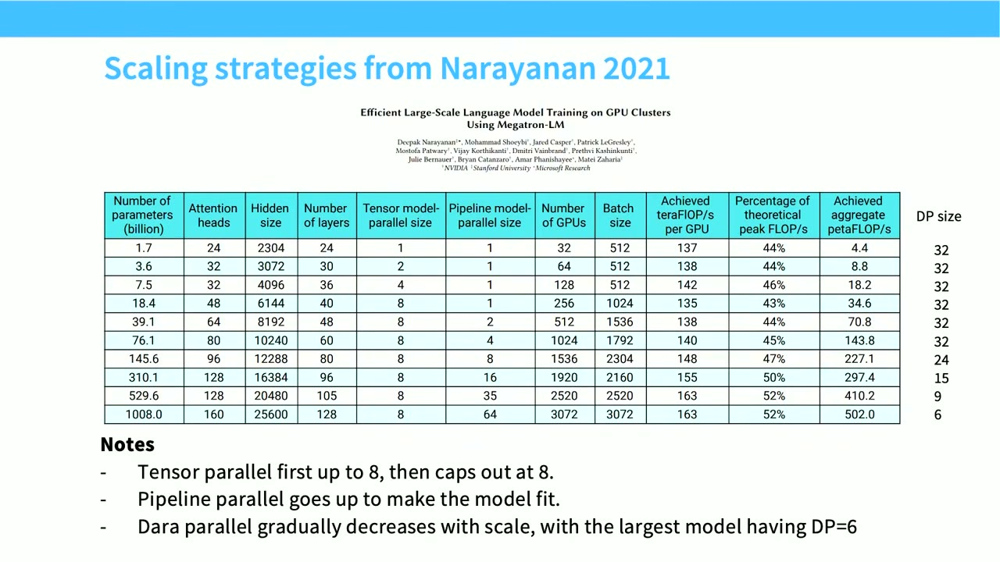

你会看到正是我一直在讲的处方：数据并行先拉满，然后张量并行增加直到 8，然后停止，因为你不想再高了；从那之后，流水线并行不断增加。在足够大的规模下，数据并行会减少，最后 DP 是 6。这是因为你需要这么多张量并行和流水线并行来放下东西，剩下的预算用在数据并行上。把它们放在一起，即使 GPU 数量大到离谱，利用率也保持非常平坦、非常好。这就是为什么你会看到这些巨大的数据中心建设：人们想出的并行策略太有效了，通信硬件太好了，即使有巨大数据中心甚至跨数据中心训练，你也能在不同区间获得很好的利用率。

*[70:57](https://www.youtube.com/watch?v=6-cXp-aOmdg&t=4257)*

他们还有很好的定量证据：对不同批大小、张量并行，正确的停止点在哪里？很明显张量并行大小是 8；超过就会出问题。流水线并行也需要大批大小才能有效利用机器。这就是为什么橙色和蓝色之间有缺口，那是流水线并行；流水线并行越大，橙色和蓝色之间的缺口越大。

*[72:26](https://www.youtube.com/watch?v=6-cXp-aOmdg&t=4346)*

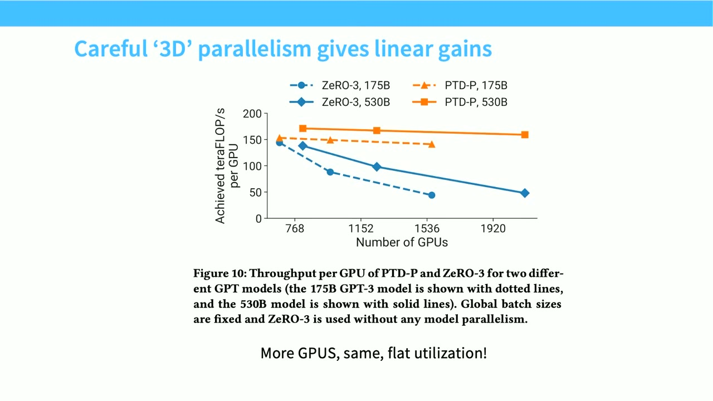

另一个你可能已经从 flash attention 里内化、但也可能没有的点是：你应该做大量激活重计算。如果你非常聪明地做激活重计算，就能得到更大的批大小，而更大的批大小又让你获得更好的利用率。这个观察一开始非常反直觉：你实际上应该通过重计算做更多计算，以便最终获得更好的利用率，因为它让你省显存，而显存可以换成批大小。

*[72:26](https://www.youtube.com/watch?v=6-cXp-aOmdg&t=4346)*

## 真实训练案例

最后我想看几个训练运行，从中感受现代并行在实践中如何使用、如何演化。Olmo 是 AI2 的 7B 开源模型，在 Dolma 数据集上训练，细节在 Dolma 论文里。它是一个 7B 模型，完全用 FSDP 在大量加速器上训练，具体多少我记不清了。这是 FSDP 扩展得出奇好的例子，即使到很多很多 GPU 也行。只要你训练小模型，FSDP 其实是相当好的并行策略。我认为很多 7B 级别的模型完全用 FSDP 训练。

*[74:50](https://www.youtube.com/watch?v=6-cXp-aOmdg&t=4490)*

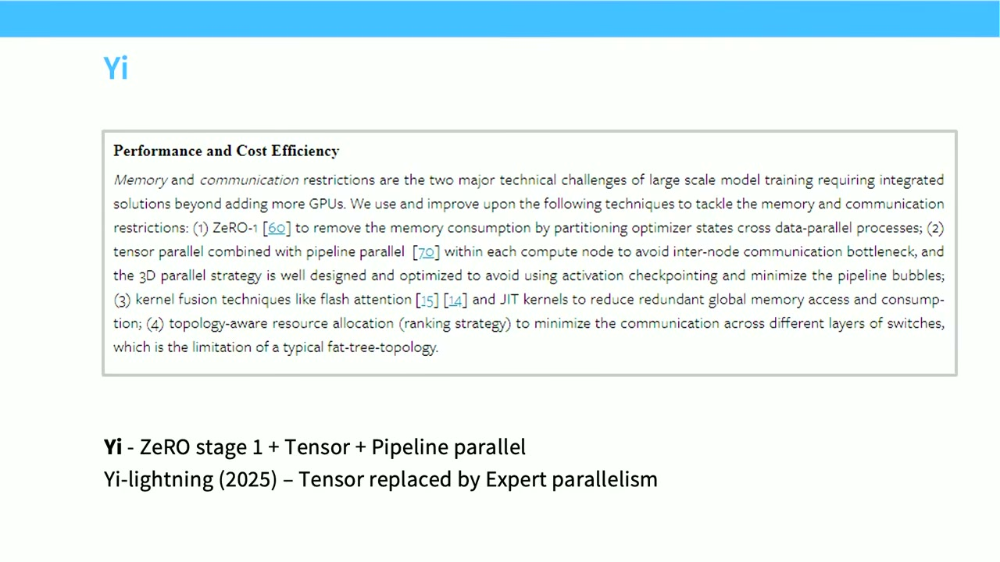

DeepSeek 因为他们的系统能力，做了一些相当异国情调且有用的东西。DeepSeek V1 只用了数据并行 ZeRO 第一阶段，加上张量、序列和流水线并行，就像我之前讲的。DeepSeek V3 是 MoE 模型，所以不仅有流水线并行，还用专家并行代替张量并行。他们的专家并行有点异国情调，有 64 路并行：把八台机器分一组，作为专家并行域。为了支持这么大的专家并行，他们基本上用了流水线并行里的技巧，确保专家并行没有低利用率时期。这是相当复杂的技巧，用来得到非常大的专家并行切分。还有 Yi，中国开放权重训练场景，也用 ZeRO 第一阶段加张量并行和流水线并行。这非常合理，是经典的数据并行、张量并行、流水线并行组合。一旦进入 MoE，就用专家并行替代张量并行，它们服务相似目标，但专家并行更高效一点。

*[74:50](https://www.youtube.com/watch?v=6-cXp-aOmdg&t=4490)*

另一个极端是很大的稠密模型 Llama3。Llama3 报告我很喜欢，因为它是少数几份报告之一，真的给出了完整的并行策略分解，不只是抽象描述，而是跨越所有阶段。你可以看到有一个 pre-pre-training 阶段，一开始的小热身，第一行可以忽略；然后中间行是主要预训练阶段，是非常标准的并行策略：张量并行 8、上下文并行 1、流水线并行 16、数据并行 128，很大的数据并行切分。最后，因为他们想要长上下文模型，做长上下文扩展，这时把上下文并行调高，把数据并行降低，用这种方式并行化这个非常吃显存的阶段。注意这里用的是张量并行，不是专家并行，因为 Llama3 405B 是巨大的稠密模型，不是 MoE。

*[76:24](https://www.youtube.com/watch?v=6-cXp-aOmdg&t=4584)*

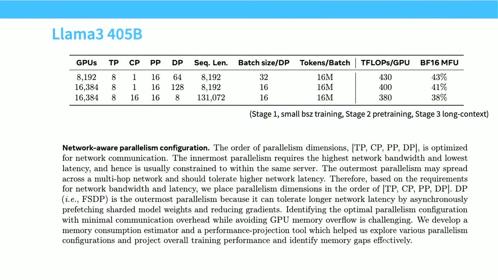

顺便说一句，我不怎么讲但如果你成为这些公司的 infra 工程师就会注意到：GPU 一直在坏。Llama3 405B 训练期间，GPU 据称坏了 148 次。所以你不只需要快速并行，还需要冗余，才能应对训练中可能发生的可怕事情。这也是一个分布式系统挑战。

*[76:24](https://www.youtube.com/watch?v=6-cXp-aOmdg&t=4584)*

Gemma 2 是谷歌开源模型，用 FSDP 加张量并行和序列并行，只用这两种策略。我提 Gemma 2 是因为据我理解，这基本上是谷歌那个说法的实现：对 TPU，你其实不需要做流水线，只要拿一张很大的环面网格，在那张大网格上做张量并行就行。这能否永远扩展下去不太清楚，我一直觉得不太清楚；但至少在 Gemma 的规模上确实如此。

*[77:04](https://www.youtube.com/watch?v=6-cXp-aOmdg&t=4624)*

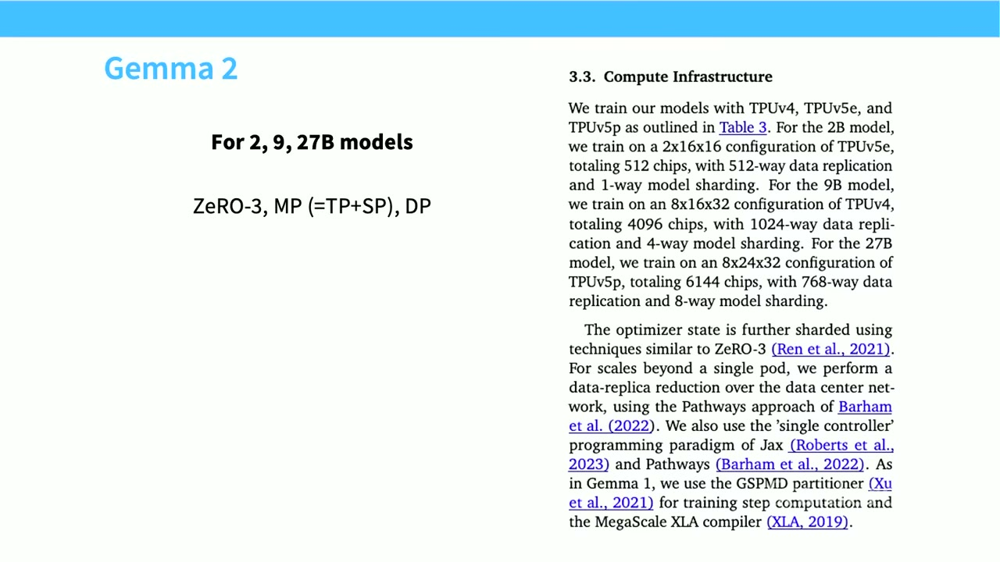

最后我看了今年训练的一些模型，比如 Mistral 8x22B。调查时我发现，如果你对模型训练和实际中的并行配置感兴趣，NVIDIA 有一个仓库叫 Megatron Bridge，发布了很多不同模型规模和设置的推荐训练配置。你可以看他们认为 8x22B MoE 或 DeepSeek V3 建模的合适配置是什么。对 Mixtral，他们用专家并行 8、流水线并行 4，再加张量并行 4，张量并行是给注意力层的。这遵循了处方：专家并行大致保持在 8 左右。Nemotron 3 Super 跟随 DeepSeek V3 模型，用了不少专家并行以及上下文并行，因为至少在这篇文章里他们在做扩展。最后一个我想讲的是 Qwen 3，它跟随 DeepSeek 配方，用了相当大的专家并行 32，还有流水线并行 8、张量并行 2，用来切分注意力矩阵之类的东西。

*[78:49](https://www.youtube.com/watch?v=6-cXp-aOmdg&t=4729)*

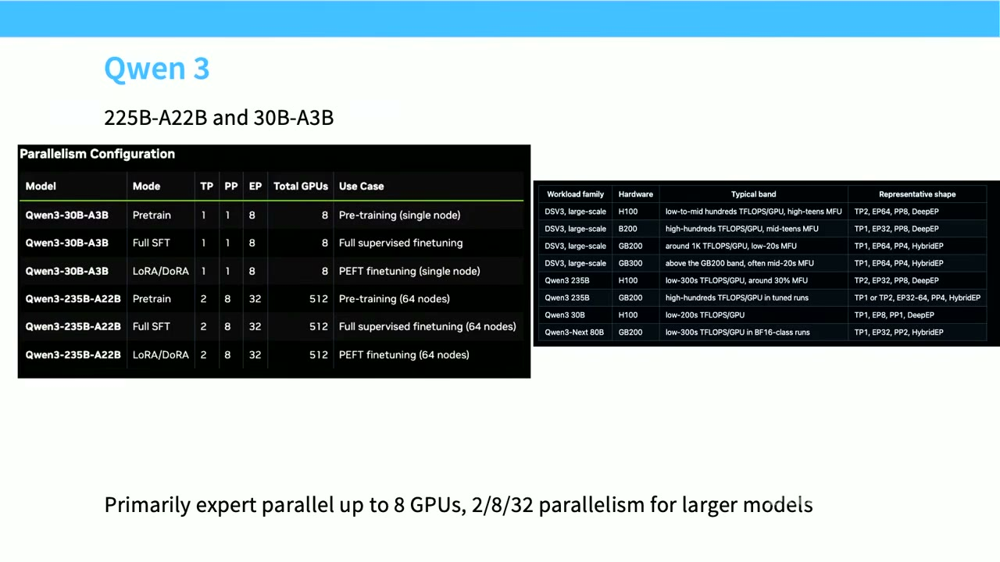

另外看 NVIDIA 的人为并行化不同模型做的各种 benchmark 也很有意思。不过多讲细节，这些在 NVIDIA bridge 仓库里，想看去那里看。即使在张量并行内部，也有各种不同配置可以选，会显著影响性能。所以系统集成相当重要。

*[78:49](https://www.youtube.com/watch?v=6-cXp-aOmdg&t=4729)*

## 总结

把一切放在一起，我做了一个概览。真正共同的一点是：所有模型都尽可能用数据并行，尽可能最大化数据并行域。张量并行几乎总是保持在 8 以下。专家并行现在有时可以很大，我认为部分是因为 DeepSeek V3 以及他们为大规模专家并行训练构建的基础设施。

*[79:37](https://www.youtube.com/watch?v=6-cXp-aOmdg&t=4777)*

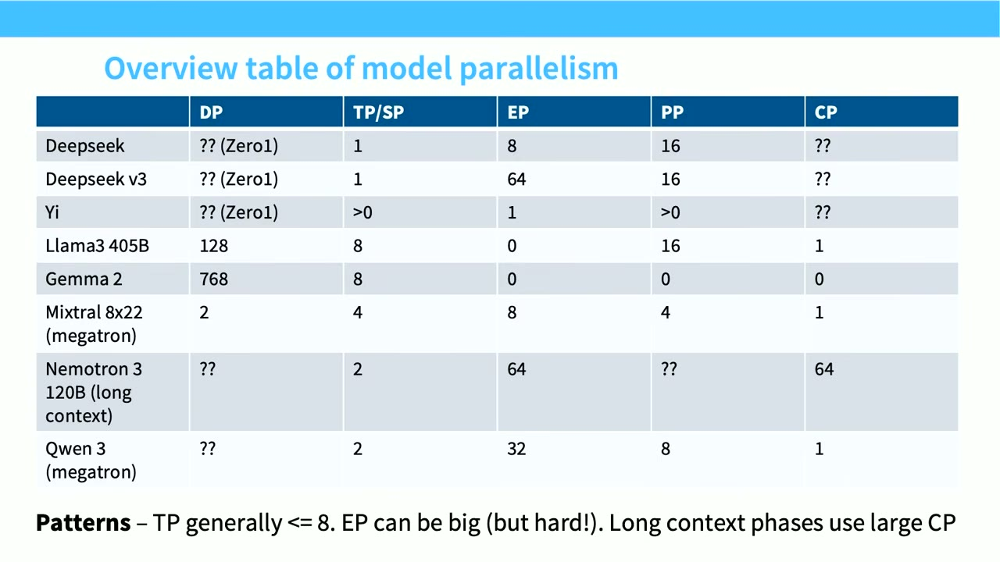

最后把一切放在一起：这堂课最高层的要点是，我们需要考虑多 GPU、多节点、甚至多数据中心的并行。要在这种规模下考虑效率，我们需要把所有方法都用上，因为你有快链路、慢链路，有批大小等各种资源，你都想要尽可能多地消耗。但尽管有这一切，事实证明把不同并行形式组合起来有相当简单的经验法则，最终能有效地让计算硬件满利用率。下周我们讲 scaling laws。

*[80:01](https://www.youtube.com/watch?v=6-cXp-aOmdg&t=4801)*
