# 语言模型缩放定律基础：从数据幂律到 Chinchilla 算力最优
这堂课从缩放定律的历史和工程动机讲起，依次讨论数据缩放、数据混合与重复、架构与优化器比较、临界批量大小、学习率，以及 Kaplan 与 Chinchilla 的分歧和算力最优训练。

## 课程安排：今天讲缩放定律的基础
我们暂时离开系统部分，来讲一些更深度学习的内容。接下来会有两讲讨论缩放定律以及和缩放定律相邻的现象。今天是基础：讲比较基本的缩放定律、一些经典工作，以及缩放定律的基本想法如何和你可能在机器学习入门课里知道的东西联系起来。两讲之后，我们会进入更高级的缩放定律版本，去讨论一批现代开放模型技术报告、muP 和其他参数初始化，今年我还会加入一些优化器相关的内容，尽量贴近最前沿。今天先从最基础的东西开始。

*[00:54](https://www.youtube.com/watch?v=Q15rhEWZPQ4&t=54)*

由于排课限制，下一讲会是推理，所以你会来回切换：先缩放定律，再推理，再回到缩放定律。

*[01:06](https://www.youtube.com/watch?v=Q15rhEWZPQ4&t=66)*

## 为什么需要缩放定律：一次昂贵训练前的工程问题
缩放定律对应的其实是这样一个场景，或者说你很快就会遇到这个场景。你有一位非常有钱的朋友，给了你 10000 张 B200 用一个月，并请你构建一个非常好的开源语言模型，希望这些 B200 能产出一些东西。你已经组建了基础设施团队，也有了不错的预训练数据集——这本来是下一讲的作业，但假设你已经有了。然后你要训练一个大模型，可是训练大模型有很多选择：架构用什么、超参数怎么设。这些决策很可怕，因为一次运行可能花费数百万美元。所以，你怎么才能真正严肃地对待“扩展”这件事？怎么保证你的大训练运行真的成功？

*[02:06](https://www.youtube.com/watch?v=Q15rhEWZPQ4&t=126)*

这些选择里，有些你可以直接照抄文献；我早些在架构讲座里讲的那些，基本是被广泛采用的最佳实践，你可能从帽子里随便抽几个就行。但假设你在前沿，想做出比今天最好模型更好的东西，你就必须真正优化这些选择，不能只是复制别人的决定。那就要求我们认真面对缩放这个概念。

*[02:45](https://www.youtube.com/watch?v=Q15rhEWZPQ4&t=165)*

缩放定律一直是非常强大的工具，你也可以把它叫作一种范式。如果你和真正在大实验室做缩放工作的人聊，缩放定律几乎是一种生活方式、一种信念。你会看到为什么缩放定律有时是相当棘手的东西。但它本质上是简单的预测规则：从小规模模型的表现和行为，外推到大尺度行为。

*[03:19](https://www.youtube.com/watch?v=Q15rhEWZPQ4&t=199)*

训练模型最天真的做法是：我有一个大预算，就在这些大运行上做多次训练，并在大运行上调超参数。但这非常浪费。相反，我想在小尺度上完成所有优化，然后用一条简单规则把小尺度行为外推到大尺度行为。如果小尺度和大尺度之间由某种非常简单、稳健的联系——比如某种规律性——连接起来，你就会有信心用这种新的缩放方法来优化系统。这就是今天要讲的内容：一种工程视角下的缩放定律。

*[04:04](https://www.youtube.com/watch?v=Q15rhEWZPQ4&t=244)*

## 缩放定律的经典根源：从泛化界到数据缩放
开始之前我要讲一点背景。缩放定律很有意思：它既是最新的范式，很多模型就是按它设计和思考的；同时它又紧密连接着非常经典的想法。如果你是机器学习理论研究者，你会在某些方面感到很熟悉，比如经验样本复杂度。然后我会讲一类缩放定律的历史，说明这并不是全新事物，它实际上有相当多的历史和研究积累。

*[04:40](https://www.youtube.com/watch?v=Q15rhEWZPQ4&t=280)*

我真的很需要在幻灯片里放一些数学。一个非常有趣的事情是，长期以来机器学习理论都在问：我的模型表现会有多好？我有一个模型类，它会有多好？泛化界是理论家的回答：在一个有限假设类上，你的误差最多比模型在训练集上的表现差多少。这是经典的泛化界。你也可以把它写到更复杂的类上，比如平滑密度等。重要的是，这些界不仅告诉你性能，还常常依赖于样本量。所以它给出了损失值作为训练集增长函数的一个理论上界。某种意义上，这和数据量增大时会发生什么的问题非常接近。

*[05:47](https://www.youtube.com/watch?v=Q15rhEWZPQ4&t=347)*

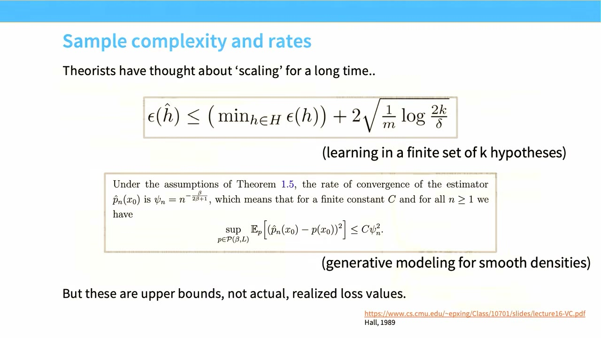

如果你问最早的缩放定律论文是哪一篇，其实可以回到很久以前。你可以回到贝尔实验室，Corinna Cortes 和 Vladimir Vapnik 等人，他们当时在做非常严肃的机器学习理论工作，并问：在非常大的数据集上训练分类器通常很贵，我们想避免这样做；能不能只在小样本上拟合分类器，拟合误差率衰减曲线，然后用它估计性能？这几乎就是 1993 年的一条数据缩放定律。所以至少可以说，思考模型性能如何随数据集大小变化，是一个非常经典的想法，有很多工作支持。

*[06:29](https://www.youtube.com/watch?v=Q15rhEWZPQ4&t=389)*

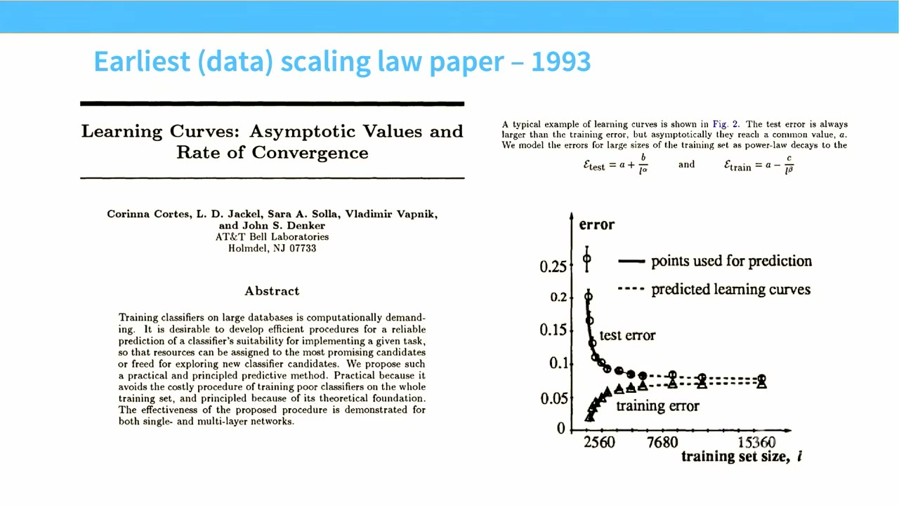

我想把这些和更老的想法联系起来，这样你就不会把缩放定律看作纯神经网络的、非常新的东西。它在经验机器学习里有很多根源，也和理论机器学习有联系。如果你看这段历史，会有很多人说：也许我们不该把钱花在算法开发上，而应该去收集更多数据，因为如果把系统性能随数据量的变化画出来，它们全都以可预测的方式改善。Banko 和 Brill 是关于数据量和扩展如何成为有效提升系统性能方式的经典 NLP 参考文献之一。

*[07:34](https://www.youtube.com/watch?v=Q15rhEWZPQ4&t=454)*

还有 Kolachina 等人在 2012 年的 NLP 工作。这是较早研究缩放定律不同函数形式的工作之一。他们同样增加训练数据量，这里是机器翻译系统和 BLEU 分数，并问：模型性能随数据量增加的正确函数形式是什么？他们最终——可能令人惊讶，也可能不令人惊讶——得到了和我们今天使用的同样的幂律，也就是 pow 3 和 pow 4。接下来的讲座里，你会不断看到这些多项式函数，pow 3 和 pow 4。

*[08:17](https://www.youtube.com/watch?v=Q15rhEWZPQ4&t=497)*

我们在 2010 年代就已经知道很多这类函数形式可以很好地预测模型扩大后的行为。最后我特别想提一篇论文：不管什么原因，Hestness 等人 2017 年的工作没有得到应有的引用。神经缩放定律的起源，我会追溯到 Hestness 2017。那篇工作非常有前瞻性，为各种系统构建了作为数据集大小函数的缩放定律，包括不同语音识别系统、机器翻译系统、语言模型，并展示了这些系统在大量领域中遵循漂亮的多项式趋势。

*[09:02](https://www.youtube.com/watch?v=Q15rhEWZPQ4&t=542)*

它在 2017 年远远超前于 2020 年代早期的 OpenAI 缩放定律等工作。他们还讨论了今天我们会讨论的东西，比如涌现：模型可能突然展现出某些能力，因为准确率是比损失更不连续的度量；而按计算量缩放时，如果有系统能可预测地扩展到大规模训练数据，计算量确实会变得很重要；最后，既然按计算量缩放，速度和系统优化会转化为准确率。所以从某些方面说，我们今天看到的很多事情，比如系统缩放现象，我在 2017 年本可以知道——如果我当时读并认真思考了那些缩放定律论文。

*[09:54](https://www.youtube.com/watch?v=Q15rhEWZPQ4&t=594)*

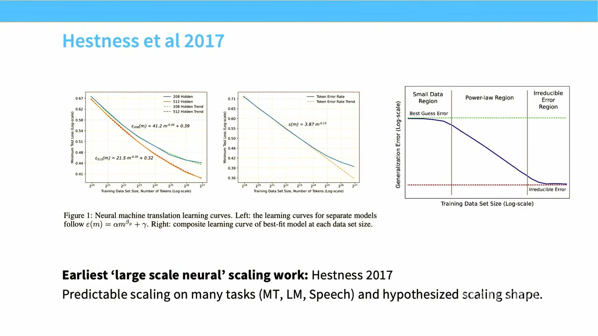

所以我每场缩放定律讲座都会提到那篇论文，是为了说明：很多这些现象在现代语言模型时代之前就早已为人所知；我们本来可能在见到这些大型语言模型之前，就已经知道我们所处的状态。知道这一点很酷。关于这段半历史性的部分有什么问题吗？

*[10:17](https://www.youtube.com/watch?v=Q15rhEWZPQ4&t=617)*

有同学问：这些缩放定律只是纯粹经验上的，还是有什么方法可以证明它们的合理性？你问的是这些缩放定律从哪里来。它们是纯粹的曲线拟合练习。我会稍微讲一下缩放定律可能从何而来，以及为什么多项式可以说是非常自然的一类缩放定律，但并没有金科玉律说它们只能是这些。理论提供了一个很丰富的地方，缩放定律的函数形式可以从中而来，因为理论经常思考误差率如何作为各种对象的函数衰减，它会给你各种候选函数形式。物理学家也很擅长这个，因为他们思考极限，比如极限如何表现。那会给你不同的缩放定律函数形式。

*[11:12](https://www.youtube.com/watch?v=Q15rhEWZPQ4&t=672)*

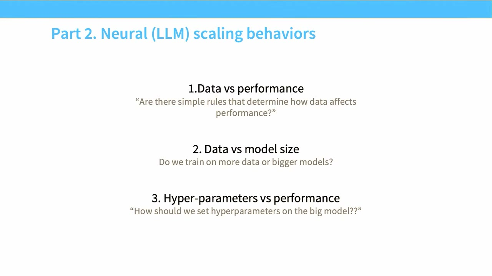

## 数据缩放定律：幂律、对数-对数与估计问题
现在我们开始讲更现代的神 经语言模型缩放，先从数据缩放定律开始，因为对我来说它们最简单、最自然。讲数据缩放定律也能让我一步步带你猜缩放定律的函数形式可能是什么，以及为什么多项式形式是自然的。然后我会讲超参数、架构和其他更奇特的对象，它们更难从直觉上证明，但仍然表现出很好的缩放定律行为。

*[12:00](https://www.youtube.com/watch?v=Q15rhEWZPQ4&t=720)*

这种缩放定律风格的分析有一个显著之处：这些幂律关系似乎对大量不同因素都成立。预训练里常见的基本因素就是今天要讲的。常见做法是把计算量放在 x 轴——这是 log 计算量；抱歉，x 轴是计算量的 log，y 轴是测试损失的 log；或者 x 轴是数据集的 log，y 轴是损失的 log；或者 x 轴是参数量的 log，y 轴还是损失的 log。所以你可以有多种 x 轴，它们可以看作对数轴上的资源，而它们都能把 log 测试损失线性化。

*[12:43](https://www.youtube.com/watch?v=Q15rhEWZPQ4&t=763)*

你还能看到更奇特的缩放定律，比如下游基准上等价的缩放定律。在那些情况下，你预期看到作为计算量或类似量的函数的 sigmoid 形式。最近也有很多预测方面的工作，人们把日期放在 x 轴。奇怪的是，至少在这些图里，曲线的上包络常常在多种能力形式上呈线性。没有理由说下面这些更奇特的缩放定律必须成立，但事实是，语言模型性能作为规模和资源的函数，常常比最初看起来更规律。

*[13:33](https://www.youtube.com/watch?v=Q15rhEWZPQ4&t=813)*

首先从数据缩放定律开始。数据缩放定律是一种非常简单的单变量关系。在这个世界里，我们固定模型训练过程。一般来说，除非我另有说明，模型会比数据集大。然后我以规则的方式增加数据集大小，看误差如何下降。我们预期什么？一般来说，如果超参数调得好，它会大致单调，因为更多数据应该帮助我们在任务上做得更好，误差应该下降。如果你在做分类，甚至下一个词预测，你应该从随机猜测走向某种类似熵的对象，在那里你不能比任务的不可约误差做得更好。那就是噪声地板。所以这里会有一个类似 sigmoid 的对象。

*[14:31](https://www.youtube.com/watch?v=Q15rhEWZPQ4&t=871)*

我们先从一个经验观察开始，你们自己也会做出来。在作业 3 的某些部分，你会做出大致像这样的东西：如果我们有一个非常大的模型，比数据集大得多，然后增加数据集大小，把数据放在 log 轴上，y 轴是 log 测试损失，你会发现你画出的点会形成一条非常清晰的线性趋势。我从 Kaplan 2020 年的论文里取了这张图，会反复引用它——这是 OpenAI 的《神经缩放定律》论文。他们做了很多漂亮的消融和大量漂亮的数据。

*[15:13](https://www.youtube.com/watch?v=Q15rhEWZPQ4&t=913)*

现在，这个关系——我在对数-对数图上画了一条线——是一个无尺度或幂律关系。那意味着什么？如果某个东西在对数-对数图上是线性的，意味着我的误差是多项式衰减的。而且这通常意味着我离渐近线还很远；一旦接近渐近线，我会逐渐变缓，而不是保持一条直线。

*[15:45](https://www.youtube.com/watch?v=Q15rhEWZPQ4&t=945)*

让我们看一个例子，展示缩放定律如何非常自然地出现在一个非常简单的估计问题里。暂时忘掉语言模型。这是一门语言模型课，但现在它是统计课，接下来一两张幻灯片，也许是三张。在这个情况下，我想从一堆数据中估计均值。我有一个输入，从高斯分布中抽取，我要估计这个对象的均值，写下经验均值。然后你可以写下误差是多少，期望误差是多少。每个都是高斯分布，mu hat 也是高斯分布，所以我可以写下误差，它将是 sigma 平方除以 n。

*[16:26](https://www.youtube.com/watch?v=Q15rhEWZPQ4&t=986)*

如果你看这个，这就是一个缩放定律。我写下了误差，而误差如果我取对数，就是 log n 的函数，log n 是 log x 轴。一般来说，如果你能得出某个本质上是 1/n^alpha 加上常数的东西，把它画在 log-log 图上，减掉常数项，你就会得到一条缩放定律。所以任何这种形式——误差多项式衰减——都会给你一条缩放定律。在参数估计如均值估计或回归中，你当然预期多项式速率，不会真的预期别的。

*[17:08](https://www.youtube.com/watch?v=Q15rhEWZPQ4&t=1028)*

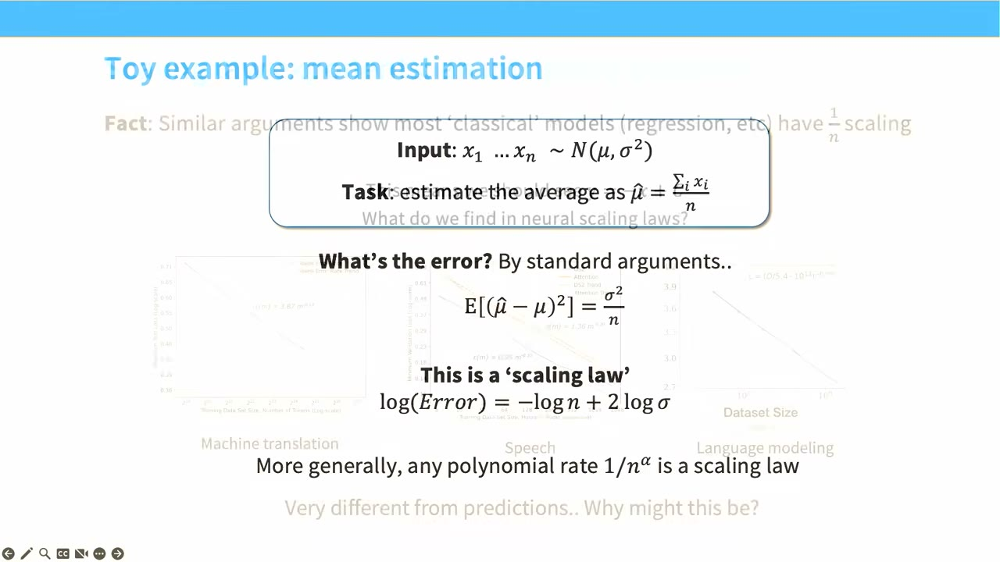

如果你上过统计估计课程，你知道所有经典模型都预期有 1/n 缩放。如果你拟合回归，可能会得到 D/n 之类的。所以如果这是真的，而这正是缩放定律的起源，那么画线时我们大致应该看到斜率是 -1，因为 x 的指数是 -1：y 等于 -x 加 C。但如果我们拟合神经缩放定律，会发现指数相当不同。这些指数——左边两个来自 Hestness，右边来自 Kaplan——大约是 -0.1、-0.3、-0.1，粗略地说。

*[17:51](https://www.youtube.com/watch?v=Q15rhEWZPQ4&t=1071)*

这意味着什么？这意味着这比估计均值或线性回归慢得多。这是慢得多的收敛速率，仍然是多项式，但慢得多。这很有趣：我们得到漂亮的多项式速率，但指数并不好，是 -0.1。你可能从哪里得到这样的估计速率？如果模型更非参数，就会得到这种速率。

*[18:19](https://www.youtube.com/watch?v=Q15rhEWZPQ4&t=1099)*

我保证这是本讲最后一张统计幻灯片。假设我现在想估计的不是均值，而是一个任意光滑函数。如果我在做回归问题，有输入 x1 到 xn。假设它们在单位盒子里，有一点高斯噪声，有一个未知函数 f 要估计。一个平凡的估计器是：把空间切成小格子，边长大约是 n 的负 1/4 次方；会有 sqrt(n) 个盒子，每个盒子得到 sqrt(n) 个样本，误差大约是 1/sqrt(n)；一般 D 维时误差约为 n^{-1/D}。所以缩放会是 y = -(1/D)x。

*[19:25](https://www.youtube.com/watch?v=Q15rhEWZPQ4&t=1165)*

所以现在这些更灵活的函数——比线性类更灵活的函数——它们的缩放律速率不只是 1，而是 1/D。一个心理模型是：前面幻灯片里的神经网络表现得像 10 维的非参数回归器，像 10 维里的最近邻或其他估计器。这大致就是它们从数据中学习的速率。只看缩放定律就能知道这一点，很酷。

*[19:46](https://www.youtube.com/watch?v=Q15rhEWZPQ4&t=1186)*

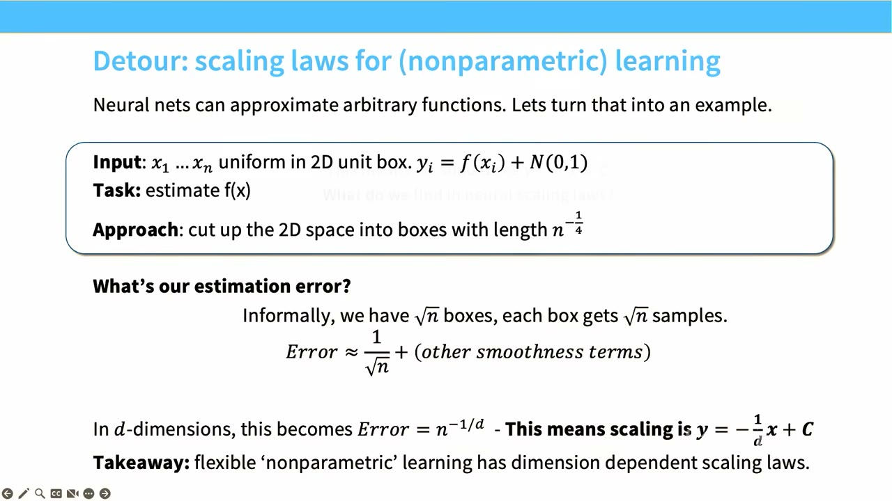

一些人更强地论证了这一点。Bari 等人和其他缩放定律理论研究者认为，缩放定律的指数实际上直接告诉我们，神经网络表现得像非参数平滑器，诸如此类。这是一组有趣的论证，你可以按自己的意愿接受这个直觉。我自己并不完全确定有多相信这个论证；有些证据可能有点可疑，它依赖于内在维度的估计器。但思考这些指数告诉我们神经网络到底学得多快，是很有意思的。

*[20:24](https://www.youtube.com/watch?v=Q15rhEWZPQ4&t=1224)*

这里我暂停一下。这基本上就是单分布数据缩放定律的基础：从一个分布采样，然后从中学习。例子都清楚吗？有同学问：当我说模型总是比数据集大时，是指参数量和 token 数量一比一吗？好问题。我的意思是，当模型相对于数据变小时——比如数据远多于模型大小——你会进入不可约误差区域。你基本上已经按模型类把数据拟合到最好，不管再加多少数据都不能更好。所以在思考缩放定律时，我们通常想处在幂律区域，这是更简单的情形；或者你显式拟合渐近线然后校正。我说模型比数据大，可以是任何比数据大的量，只要还在幂律区域，通常是数据的 10 倍之类。

*[21:35](https://www.youtube.com/watch?v=Q15rhEWZPQ4&t=1295)*

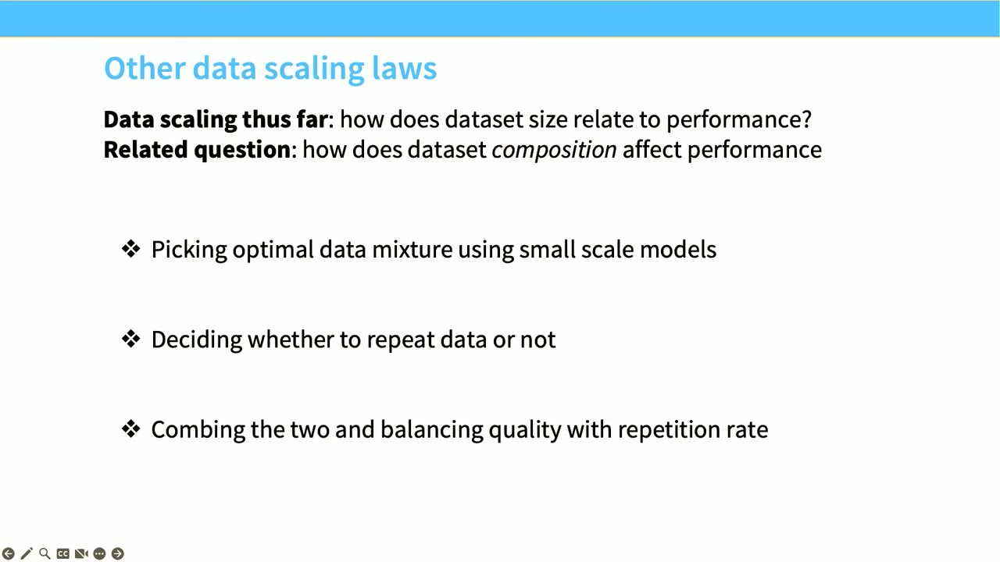

## 数据工程：混合、重复与过滤
现在回到其他数据缩放定律。数据缩放定律本身没有你希望的那么有用，它只告诉你模型学得多快。这对预测有些用，但其他用途不大。如果你想做工程，你大概率关心别的问题：最优数据混合是什么？怎么为模型选择训练数据？要不要重复数据，还是不要重复、把算力省下来做别的？也许我应该重复高质量数据，不重复低质量数据。我可以在数据上做很多工程决策。缩放定律怎么帮我们做这些决策？

*[22:28](https://www.youtube.com/watch?v=Q15rhEWZPQ4&t=1348)*

一个有趣的点是，如果我们想想经典模型的行为：数据缩放定律，如果把它的起源看作泛化界的经验版本，它告诉我们，对很多模型来说，数据集的组成实际上影响的是缩放定律的偏移，而斜率由模型类决定，不由分布本身决定。所以斜率可能保持不变，只有截距变化。而截距的形状可能非常有趣。

*[23:00](https://www.youtube.com/watch?v=Q15rhEWZPQ4&t=1380)*

这是一个玩具模型：线性回归，有两种可以采样的数据。如果你只得到一种数据，误差无论怎样都很高。你其实想要两者的混合。所以如果你写下截距如何变化，就会得到一些非常有趣的洞见：数据多样性非常有帮助。但这在实践中意味着什么？实践上，你可以在混合数据上拟合数据缩放定律，这能帮助你做预训练数据优化。

*[23:37](https://www.youtube.com/watch?v=Q15rhEWZPQ4&t=1417)*

假设为了简单，有两个数据源：新闻和维基百科。用多少新闻、多少维基百科？你可以用非常小的模型、非常少的数据训练，然后拟合不同混合比例如何影响性能的函数。你可以随着模型一点点变大，看趋势如何变化，然后像外推数据缩放定律一样把它外推。然后你可以问：如果扩展到完整训练运行，哪个会最优？这是一个非常简单的想法：在小计算量上拟合函数形式，找到最小值，然后外推。

*[24:24](https://www.youtube.com/watch?v=Q15rhEWZPQ4&t=1464)*

这是一篇数据混合损失论文。但不幸的是，如果你和做过很多数据混合工作的人聊，他们会告诉你现实比这个理想世界嘈杂得多。据我所知，很多情况下实际发生的是：你训练一堆小模型，选小模型上最好的数据混合，然后直接放大那个混合，不需要缩放定律。DataDecide 是这类数据混合的大规模经验研究。他们发现，如果你不拟合缩放定律，而是直接选小尺度上最好的数据混合，效果就很好。这和“截距不同但斜率不变”的论证一致，因为如果斜率不变，小尺度上最好的混合在大尺度上也是最好的。

*[25:20](https://www.youtube.com/watch?v=Q15rhEWZPQ4&t=1520)*

另一个我会在数据语境下提到的有趣问题是重复。现在越来越常见的情况是计算量在增长，而我们拥有的数据量没有增长。所以很多人关心：当你越来越多次重复数据时会发生什么？几年前有一项很好的研究，叫《Scaling Data-Constrained Language Models》。他们大致表明：用标准训练配方，最多四个 epoch，你完全不会受损；但超过这个点，你实际实现的缩放定律——深色曲线——会比有新鲜数据时投影的缩放定律差很多。那条虚线就是投影。你也可以写下一个修改后的函数形式，通常能预测重复下的缩放行为。

*[26:14](https://www.youtube.com/watch?v=Q15rhEWZPQ4&t=1574)*

我们还可以把这个想法推到极端。这是最近和 Percy、以及我们共同指导的一位学生做的工作。我们问：如果把这个想法推到极端，考虑无限计算量，允许你任意多次 epoch，甚至无限次，你能从这个系统中得到的最好结果是什么？事实证明，你不能只是一直重复数据，也不能一直把模型变大，那些都有递减回报。所以你会转向其他东西，比如把模型集成起来，试图从数据中榨出更多。但真正有趣的一点是：这里红色的标准数据缩放定律，随着数据增加，性能有非常好、可预测的改善。我们做各种干预，比如正则化和加集成，性能会提升，但斜率看起来惊人地相似。

*[27:05](https://www.youtube.com/watch?v=Q15rhEWZPQ4&t=1625)*

这是你开始自己拟合缩放定律后会学到的一课：很多时候你的斜率不会变。你做的干预通常只改变缩放定律的截距。

*[27:19](https://www.youtube.com/watch?v=Q15rhEWZPQ4&t=1639)*

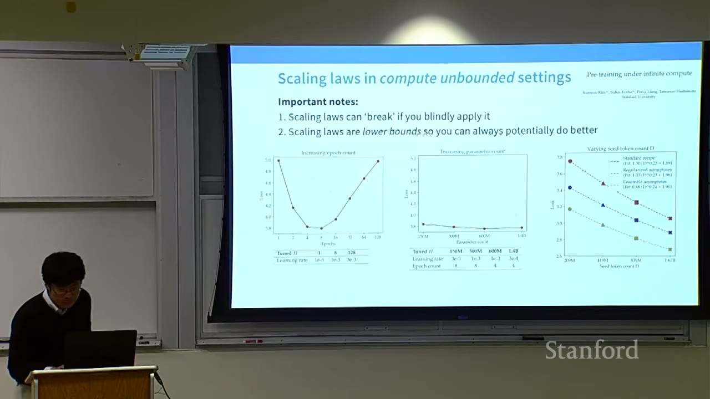

最后我要提一篇论文，因为我很喜欢它在缩放定律和一般缩放语境下的意义：我们关心的很多数据现象实际上是强烈依赖规模的。一个例子是数据过滤。如果你或我明天决定为正在训练的模型过滤一些数据，我们可能会过滤得非常激进，只保留最高质量的东西，因为你和我都没有很多计算量。反正不能在全互联网上训练，不如过滤到最高质量。另一方面，如果你有很多计算量，你会想在越来越多东西上训练，因为你不希望重复那些非常高质量的数据。所以随着计算量增加，你的过滤器会越来越松，可能开始在质量越来越低的东西上训练。

*[28:07](https://www.youtube.com/watch?v=Q15rhEWZPQ4&t=1687)*

所以很多我们经常静态思考的东西，比如数据过滤或数据质量，实际上是更动态的。随着规模增加，你必须思考：剩下的数据从哪里来？过滤器不能作为一个固定函数保持不变，最优过滤器显然也不是固定不变的，而是随规模变化。

*[28:28](https://www.youtube.com/watch?v=Q15rhEWZPQ4&t=1708)*

好，数据缩放定律就讲到这里。这是我认为最容易理解的部分。即使作为统计/机器学习思维的人，这些东西对我来说也非常简单直接：增加数据，性能以非常可预测的方式变好。我认为这没有争议。对于这么大的模型，它多项式地变好仍然很酷，但没什么真正疯狂的。

*[28:52](https://www.youtube.com/watch?v=Q15rhEWZPQ4&t=1732)*

有同学问：在这张无限计算量下预训练的幻灯片里，右边的图在 loss 和数据集大小上都是线性的，而我之前给的例子是对数-对数，为什么两边都线性？对，这是一个不好的坐标轴。Herman 和我就谈过这种不好的坐标轴。这实际上是在倍增，所以看起来线性，但实际上是 log 尺度。现在改好了。这里的 y 轴看起来不像 log，但范围太小，线性与 log 基本一样。你看这里拟合的函数形式，仍然是多项式；我们拟合的是同样的函数形式，画出来的也是那些。还有一个点我最后会讲：如果你只有很小一段计算量范围，你很难非常明确地区分某个东西是按多项式缩放还是指数缩放。因为泰勒近似确实存在。只要放大得足够多，一切看起来都是线性的。所以它究竟是多项式还是其他函数形式，你总是要小心和保持怀疑。

*[30:13](https://www.youtube.com/watch?v=Q15rhEWZPQ4&t=1813)*

## 架构与优化器的缩放比较
好，这就是关于数据的缩放定律，很多方面都很直接。现在我想谈更奇特的缩放形式，以及各种模型工程的缩放定律。现在我们要设计大型语言模型。也许你是个激进派，相信 LSTM 才是未来：为什么我不能用 LSTM 代替 transformer，把 B200 算力花在 LSTM 上？或者你是另一种激进派，想用 SGD 训练：为什么不能用 SGD？如果你的资源有限，你有不同分配方式：也许训练更久，也许训练更大模型，也许收集更多数据。总是有各种权衡，而缩放定律给了我们定量的方式来做这些权衡。

*[31:10](https://www.youtube.com/watch?v=Q15rhEWZPQ4&t=1870)*

我要从一些简单的超参数问题开始，比如如何选择架构或优化器——这些我在第二讲讲过的内容。在那里我给了你一种视角：也许你可以研究别人怎么做。现在我要试着用第一性原理、用稍微不同的权衡视角来回答这些问题。所以在这堂课里你必须相信缩放定律；但只要你相信，你就可以自己尝试并发现答案。

*[31:37](https://www.youtube.com/watch?v=Q15rhEWZPQ4&t=1897)*

第一个问题可能是：Transformer 真的比 LSTM 好吗？LSTM 也能工作得还行，它们能拟合分布。随着 Mamba 等出现，我们知道 SSM 也能工作。那它们更好吗？暴力回答这个问题的方法是训练一个大的 LSTM，达到 GPT-3 或更大模型级别。缩放定律的方法是训练一堆小模型：在一个计算量范围上训练 transformer，再用不同层数的 LSTM 在另一个计算量范围上训练。这显示了什么？LSTM 明显有不同的截距，甚至可能有不同的斜率。因此，你大概不会选 LSTM。这张图会证明应该扩展 transformer 而不是 LSTM。

*[32:34](https://www.youtube.com/watch?v=Q15rhEWZPQ4&t=1954)*

如果你看今天的很多架构论文，比如 Mamba 论文或 gated delta net 论文，它们总会有这样一张图：vanilla transformer，以及我们很酷的模型。我们很酷的模型通常在线上方或下方，因为那才能证明你的模型更好。你当然不想要斜率更差的模型，因为那意味着规模越来越大时，你的模型最终会更差。这是不训练巨型模型就能推理架构的一种方式。

*[33:08](https://www.youtube.com/watch?v=Q15rhEWZPQ4&t=1988)*

最近我没有看到那么多又好又新的架构缩放定律论文。我比较喜欢的一篇相对近期的工作是 Google 的 Ek 等人做的，当时他们还在发表这类工作。他们对 T5 风格模型做了一大堆缩放研究，训练越来越大、各种不同架构的 T5 变体。我觉得很酷、也是我仍然提这篇论文的原因之一是：它们恰好捕捉了我们今天在前沿模型中实现的架构变化。比如 performer，那是一种高效注意力，它的扩展不好，我们今天不实现它。我们实现的是 gated linear unit，红线在整个缩放趋势中都比绿线好。Switch transformer——我不知道他们最大运行发生了什么，但一般来说缩放趋势不错。我差点忘了，还有 mixture of softmaxes；其实我们今天不再这么做了，但给定缩放趋势，它可能是一个有效干预。

*[34:15](https://www.youtube.com/watch?v=Q15rhEWZPQ4&t=2055)*

所以你看，通过这些缩放趋势，尽管很多论文运行的计算规模比我们今天小得多，它们仍能看出当时驱动前沿模型发展的架构趋势。我想这也是为什么很多人把缩放定律当作一种几乎范式化的方式，说：如果一个干预没有出现在缩放定律里，它就不是好干预。因为某种方式上，过去很多工作捕捉到了我们今天看到的东西。

*[34:47](https://www.youtube.com/watch?v=Q15rhEWZPQ4&t=2087)*

好，超越架构，我们可以把这种分析扩展到各种其他想理解的东西。我们可以问：SGD 比 Adam 更好还是更差？如果做缩放定律分析——这是 Hestness 的工作——你会看到非常清晰的趋势。这再次是那个非常神秘的事情：截距不同，但斜率非常相似。如果你固定数据和模型，斜率往往非常非常相似。我每次看到都很惊讶，但它非常真实。即使干预大到从 SGD 换到 Adam，也很少得到不同的斜率。如果你是训练的人，你会觉得这是巨大的变化；但缩放趋势保持大致相同。这里是一个用 recurrent highway net 做语言建模的例子。

*[35:38](https://www.youtube.com/watch?v=Q15rhEWZPQ4&t=2138)*

类似地，在第二讲我讲过 aspect ratio：如何选择深度和宽度的权衡？我告诉你，你可以随便选一个大致合理的数，比如四倍合理乘数。但如果你做这种缩放分析，你可以更精确地知道发生了什么。首先你可以看缩放趋势作为层数的函数，你会立刻看到层数极少非常非常糟糕。如果只有一层，你哪儿也去不了，那是可怕的缩放趋势。大于一层后，其实竞争性出人意料地强，尽管你会看到在每个计算量水平上，至少在这个例子里，更多层更好。

*[36:21](https://www.youtube.com/watch?v=Q15rhEWZPQ4&t=2181)*

如果你能做更细粒度的研究——Kaplan 论文就这么做了——你可以试着找出所谓的规模不变量，比如 aspect ratio。层数不是规模不变量：模型变大时，你确实想要更多层。但模型变大时，最佳 aspect ratio 也许应该保持不变。这个是规模不变的。所以看 aspect ratio，我们会看到不同模型大小下，基本上在每层大约 100d 处有相同的极小值，也许稍微少一点。它确实会稍微右移，更深模型的最优 aspect ratio 会更小一点，但大多数情况下极小值位置大致相似。

*[37:07](https://www.youtube.com/watch?v=Q15rhEWZPQ4&t=2227)*

你可以对注意力头维度等做类似分析。如果你看 Kaplan 论文，他们在这方面做得很好。这是让你对自己的缩放策略有信心的方式。如果你的缩放策略是“我固定 aspect ratio，然后扩大规模”，你可以画这样的图，说服自己我们大概没问题，因为优化没有随模型越来越大而移动太多。

*[37:34](https://www.youtube.com/watch?v=Q15rhEWZPQ4&t=2254)*

## 参数计数、MoE 与“缩放定律是工程出来的”
有一件重要的事，这是一个巨大的潘多拉魔盒，大到我会用好几张幻灯片讲：并非所有参数都是平等的。因为并非所有参数平等，你的缩放定律会看起来好或坏，取决于你如何定义一个参数。在 Kaplan 论文里，他们观察到：如果他们画深度缩放定律时把嵌入参数算进去，就会得到形状很奇怪的缩放定律。他们说，这完全不行，完全不行。因为完全不行，他们决定排除所有嵌入参数，只计算非嵌入参数，因为你可以为自己辩护说，这些才是做计算的参数。我们后面会看到，这对某些结果的有效性有非平凡的影响。

*[38:28](https://www.youtube.com/watch?v=Q15rhEWZPQ4&t=2308)*

这里的重点是：缩放定律不是魔法。Percy 喜欢强调这一点：缩放定律以及所有这些跨规模的可预测性是被工程化出来的，不是自动发生的。我们需要选择正确的 x 轴，需要确保超参数设置正确，只有在这些条件下，才能在多个数量级的计算量上得到可预测的缩放。这就是很多缩放定律研究者做的事情：思考什么才是获得非常可预测缩放的正确方式。

*[39:01](https://www.youtube.com/watch?v=Q15rhEWZPQ4&t=2341)*

与此相关，我认为最近有一些关于 mixture of experts 缩放的很有意思的论文。MoE 可以说是训练大模型的主导方式，所以思考在这个参数量和活跃参数量解耦的新世界里，参数的价值是什么、什么算一个参数，非常重要。Apple 和 MIT 的一些人做了一个很干净的分析，展示了作为参数量和活跃参数量函数的缩放趋势。很酷的一点是：当你训练越来越大的模型时，如果你在 x 轴上增加总参数量，并想最小化损失，你最终会得到越来越稀疏的模型。看颜色变得越来越深。类似地，这里活跃参数量随着 MoE 稀疏度增加而减少。

*[40:03](https://www.youtube.com/watch?v=Q15rhEWZPQ4&t=2403)*

你会得到一个我觉得有点直观的结果：你可以画出这些曲面。对每个计算量，你可以问：我宁愿把计算花在活跃参数上，还是想要多少稀疏度？我可以在不真正改变计算量的情况下改变稀疏度。给定这一点，你可以问：如果我增加更多空参数，活跃参数不变，但总参数更多，会怎样？当你从图的后面移到前面，损失会改善。换句话说，MoE 中不活跃的参数仍然帮助你降低损失，这很酷。你可以写下这些函数形式。我不展开细节，但重点是：我们在优化 MoE 时关心的所有这些量，都有可预测的缩放和规律性。

*[41:03](https://www.youtube.com/watch?v=Q15rhEWZPQ4&t=2463)*

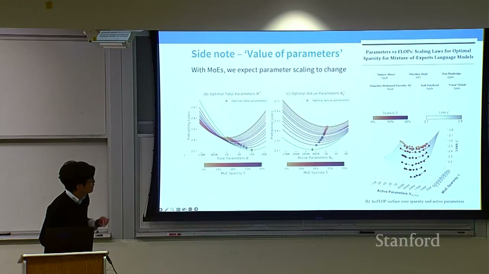

## 批量大小：临界批量大小与噪声受限/偏差受限
我现在想谈两件事。当你训练一个新的大模型时，其实我讲的很多东西都已经固定了。你们大概不会激进到切换到 LSTM，大概会选一个 DeepSeek-V4 启发的 MoE 之类，选经过验证的架构选择，不会把一切推翻。但有两件事你确实必须重新发明：批量大小和学习率。如果你训练过深度学习模型，你知道必须非常小心批量大小和学习率的组合。改变一个，就得改变另一个。

*[41:43](https://www.youtube.com/watch?v=Q15rhEWZPQ4&t=2503)*

批量大小从上一讲看还有另一个原因很棘手：我们希望批量尽可能大，因为大批量给我们并行化机会。记住，数据并行需要大批量。所以真正想要知道的是：批量能开多大，才开始受损？这是相关的系统问题。你还想知道这如何随模型大小变化。

*[42:14](https://www.youtube.com/watch?v=Q15rhEWZPQ4&t=2534)*

有了这个前言，有一个非常重要、在很多论文里被使用、也经常被讨论的想法，叫临界批量大小（critical batch size）。临界批量大小大致是这样一个想法：在某一点之前，当你开始得到递减回报之前，增加批量有完美回报。我可以把这叫作噪声受限区域。在噪声受限区域，你放进批量的每一个额外元素都会减少 SGD 步中的梯度噪声。因为你是方差受限的，方差的减少非常非常有帮助，会带来大回报。所以这是完美缩放的区域：你处理额外样本时，做得差不多和你可能做到的一样好。

*[42:57](https://www.youtube.com/watch?v=Q15rhEWZPQ4&t=2577)*

当你到达某一点，达到了梯度的噪声尺度，你就不再是方差受限，而是偏差受限。这是什么意思？记住，在梯度下降中，你看的是目标的局部结构，没有全局视角知道最小值在哪。所以不管噪声多低，我只能指向这里浅蓝色的方向。我的局部下降方向和全局最优之间总有分歧。因此到某一点，我会得到递减回报，因为限制因素不再是方差，而是偏差项。过了这一点，我就受偏差限制。

*[43:44](https://www.youtube.com/watch?v=Q15rhEWZPQ4&t=2624)*

所以临界批量大小是一种经验法则，或者说方便的权衡点：从这里开始，我们从完美缩放区域跨入低效缩放区域。它给你一个好规则：如果你想让批量尽可能大而又不遭受巨大效率损失，批量应该设在哪里。希望这个想法很清楚。

*[44:08](https://www.youtube.com/watch?v=Q15rhEWZPQ4&t=2648)*

临界批量大小是个奇怪的对象，它来自对目标局部二次近似的一堆复杂计算。但我会给出实际用来估计这个量的机械步骤。你首先选一个目标损失，比如你想达到的某个数值。你的目标是尽可能快地达到这个目标损失。接下来我会扫过所有不同批量大小，写下达到目标损失所需的步数，以及达到目标损失所需的样本数。当然，这两者通过批量大小因子相关：步数乘以批量大小等于样本数。

*[45:01](https://www.youtube.com/watch?v=Q15rhEWZPQ4&t=2701)*

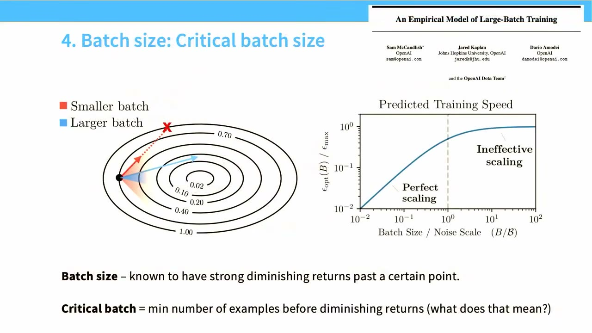

通过一些计算，OpenAI 的 McCandless 等人认为，我们应该遵循大致这样的函数形式：所需步数和所需样本数成反比，并带有最小可能步数和最小可能样本数这两个估计，对两个量做归一化。所以这两者之间有权衡：如果你想最小化样本数，你会有很多步；如果你想最小化步数，你需要很多样本。这是很自然的权衡。如果你增加或减少批量大小，权衡会偏向一边或另一边。

*[45:48](https://www.youtube.com/watch?v=Q15rhEWZPQ4&t=2748)*

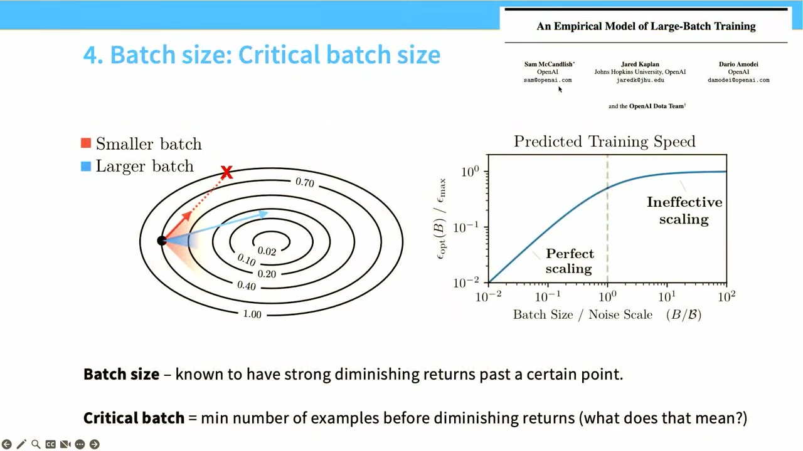

他们主张，目标应该是平衡这两边。我想确保步数项和样本数项大致平衡。如果你求解，会得到这个解：临界批量大小等于我需要的最小样本数除以我需要的最小步数。这两个量通过拟合观测数据估计。这会平衡方程两边：它会给我比最优稍多一点的步数，比最优稍多一点的样本，但平衡了两边。你可以把这看作优化收敛速率，同时不使所需步数爆炸。

*[46:37](https://www.youtube.com/watch?v=Q15rhEWZPQ4&t=2797)*

还有一个附加点，我不详细展开，因为更深入细节：你应该读临界批量大小论文。他们的一个论点是，估计这个量相当复杂；你也可以通过看梯度协方差与梯度平方范数的比值来估计。

*[46:56](https://www.youtube.com/watch?v=Q15rhEWZPQ4&t=2816)*

那么，这为什么在缩放讲座里？到目前为止这和缩放没什么关系。原因是：首先，临界批量大小是一个合理的批量大小选择，它平衡收敛速率和批量大小。如果我想把批量设成临界批量大小，你可能会问：这个东西如何随目标损失缩放？目标损失可以看作计算量。如果我想要越来越好的模型，应该用什么批量大小？

*[47:33](https://www.youtube.com/watch?v=Q15rhEWZPQ4&t=2853)*

这也是它属于缩放讲座的原因：当损失下降、规模变小时，临界批量大小会增加。而且它以非常可预测的方式增加，又是一个幂律。这是他们主张的关系，大致是批量的逆多项式。给定这一点，这很好，因为这说明如果你有一个非常大规模的训练运行，一直走到图的右边，你的批量可以相当大。这说得通：当你越来越接近最小值，方差减少的价值增加，因为你在优化越来越细粒度的对象，当你最小化非常非常小的差异时，噪声更重要。

*[48:22](https://www.youtube.com/watch?v=Q15rhEWZPQ4&t=2902)*

## 学习率如何随规模变化
这就是批量大小的故事。另一方面，你始终要调的两个量是批量大小和学习率。学习率这边的故事也有一点复杂。我会在高级缩放讲座里讲更多细节。学习率一般会移动。对于标准世界，我觉得一个好的心理图像是：假设你有一个 MLP，一个标准神经网络，我不做深度缩放，只做宽度缩放。如果做宽度缩放，模型越大，学习率应该越小。原因是我有更多参数，一次改变更多东西，也许我应该移动得更少。这说得通。

*[49:13](https://www.youtube.com/watch?v=Q15rhEWZPQ4&t=2953)*

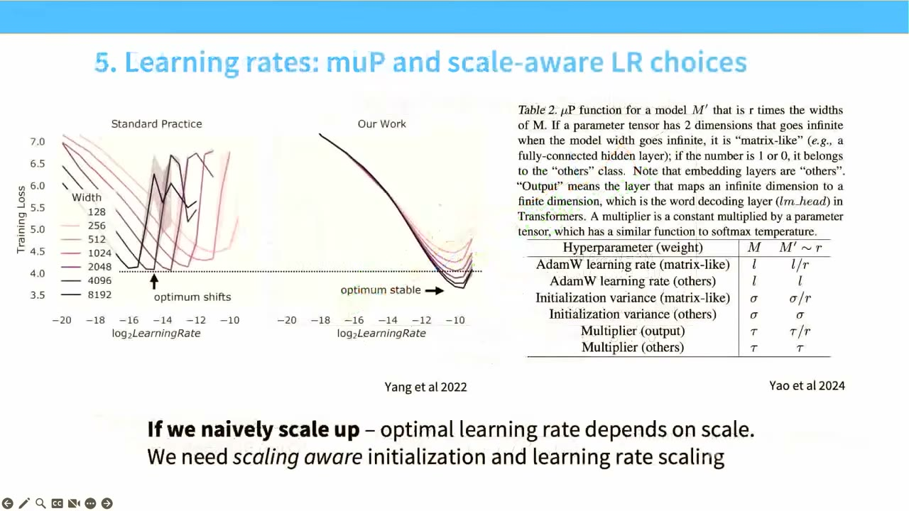

事实上，有一个经验法则：你可能想按 1/宽度 缩放。这是一个很常见的经验法则：随宽度规则地减小学习率，这会给你一个缩放学习率的规则。还有另一个学派或另一组技巧：人们也会用各种方式重新缩放网络，改变初始化大小，改变优化器对不同部分的步长，以迫使模型在不同规模下有相同的学习率极小值。这个想法叫 muP 及类似方法。一些人报告了很大成功，另一些人报告成功较少。

*[50:08](https://www.youtube.com/watch?v=Q15rhEWZPQ4&t=3008)*

为大规模运行设置学习率的两种方式基本都体现在这张图里。一种方式是估计这些极小值是什么，并预测你的极小值会在哪；极小值变化的方式相当可预测，所以这不是疯狂的想法。另一种方式是重新参数化模型，尽量保持学习率极小值不变，然后选你最好的学习率直接开跑。这是选择学习率的两种哲学。两者都在大规模上成功应用过，都有大规模训练运行用过。据我非正式观察，似乎更多人偏向缩放定律方法，但两者肯定都可行。下一讲我会详细讲这两种。

*[50:55](https://www.youtube.com/watch?v=Q15rhEWZPQ4&t=3055)*

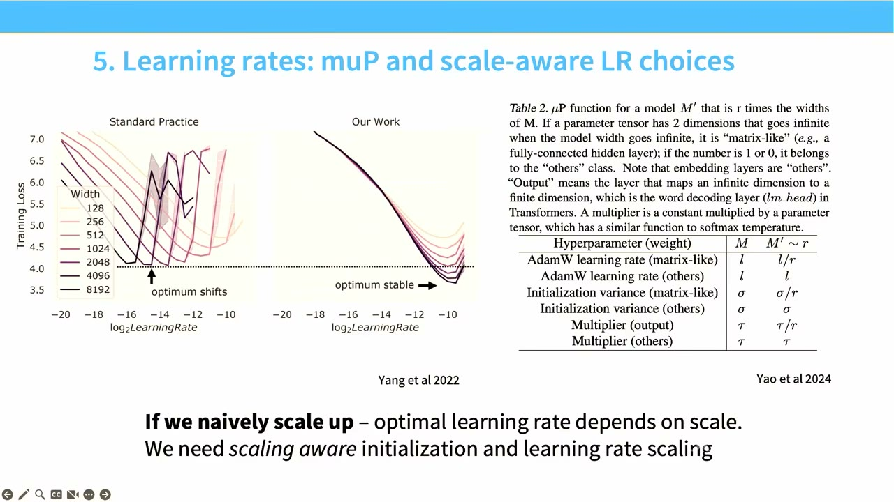

## 上游困惑度不等于下游表现
在进入本讲最后部分之前——我想讲一些不完全是陷阱，而是缩放定律各种细节的东西——我想用这个想法结束这一节：上游和下游表现可能相当不同。如果你看 log 似然之类，这是 Yi Tay 架构论文里的图，你会发现困惑度和负困惑度（在这个例子里）与参数非常相关：参数越多，模型越好，非常可预测。这是一条非常漂亮的线性趋势。

*[51:35](https://www.youtube.com/watch?v=Q15rhEWZPQ4&t=3095)*

然后你会说，好，现在我们要发布最好的模型 NL12。结果 NL12 并不是最好的模型，实际上是 NL32XL，它在困惑度上差得多。这是非常常见的事情。上游和下游经常相关，但这可能是我见过的最差的上游到下游相关性之一。我认为非常重要的一点是：缩放定律通常是应用在困惑度这边的对象，它们非常干净、非常规律、非常可预测；但从困惑度到下游的迁移比最初看起来要不那么确定。这是你需要非常谨慎的地方。

*[52:09](https://www.youtube.com/watch?v=Q15rhEWZPQ4&t=3129)*

作为一个轶事，我有以前的学生去各个地方做后训练，他们总是抱怨：那些预训练的人把模型交给你，说困惑度很好，现在都是你的问题了。但问题往往从预训练那边就开始了。所以你不要成为那种人。你要真正思考迁移，而不只是关注困惑度。

*[52:36](https://www.youtube.com/watch?v=Q15rhEWZPQ4&t=3156)*

## 拟合缩放定律的实际流程与方差
这也许令人惊讶，也许不。但我想在这里强调：在你做大训练运行之前，你应该大致知道你会看到什么，不只是知道它能不能训练。事实上，如果你做缩放定律，你应该能相当精确地预测数值，几乎能预测你的运行会有多好。如果我选一个优化器而不是另一个，收益会是多少？你应该能预测。所以基于缩放定律的流程是：训练一堆小模型，在 log-log 图上拟合这些线，建立缩放定律。如果拟合足够好，我就有信心这个差距会持续，然后把它部署到大规模训练运行上。这是缩放定律流程的朴素版本，但我认为它相当准确地反映了实践中你可能怎么思考。不然你还能怎么办？凭空部署一次运行？大概不行。

*[53:35](https://www.youtube.com/watch?v=Q15rhEWZPQ4&t=3215)*

我可以在这里暂停，进入最后部分前回答问题。有同学问：缩放定律上每个数据点，你如何考虑方差？做多少次运行？聚合通常是平均，还是根据情况取最小或最大？在我看来，大多数情况，如果不是所有情况，那些都是单次运行。原因是当你看困惑度时，困惑度非常非常干净。如果你重新运行，方差可能在第二位小数左右，因为训练数据非常同质，数据量很大，评估集很大，你真的把方差压得非常低。但如果你做学习率或临界批量大小缩放，你会看到一些非常可怕的东西。我认为人们确实做了一些方差减少，但实际上没有应该的那么常见。

*[54:41](https://www.youtube.com/watch?v=Q15rhEWZPQ4&t=3281)*

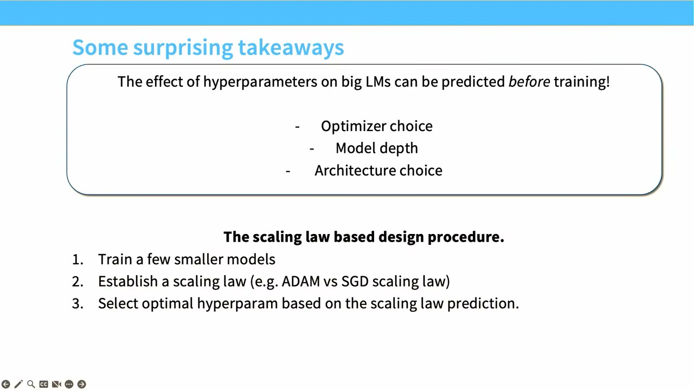

有同学问：人们会直接用下游指标而不是困惑度做缩放定律吗？会，人们直接在下游指标上做缩放定律，但那有同样的问题。我认为思考缩放定律的方式是：至少可靠地建立一个东西。比如，如果我看到这样的图，我强烈相信 transformer 这条线会继续，这是非常规律的趋势。它可能有一点弯曲，但我们确实认为这里可能有规律性。但相反，想象这是一条非常嘈杂、锯齿状的线，你就不知道发生了什么；你会说，我可能相信它会继续，但也许它是直线，也许它是曲线。所以如果我试图解释这套哲学，就是：从低方差测量开始，在那里建立缩放规律性，然后依赖某种关于迁移的信念，或者在别处建立迁移，试图表明它会迁移到下游。

*[55:43](https://www.youtube.com/watch?v=Q15rhEWZPQ4&t=3343)*

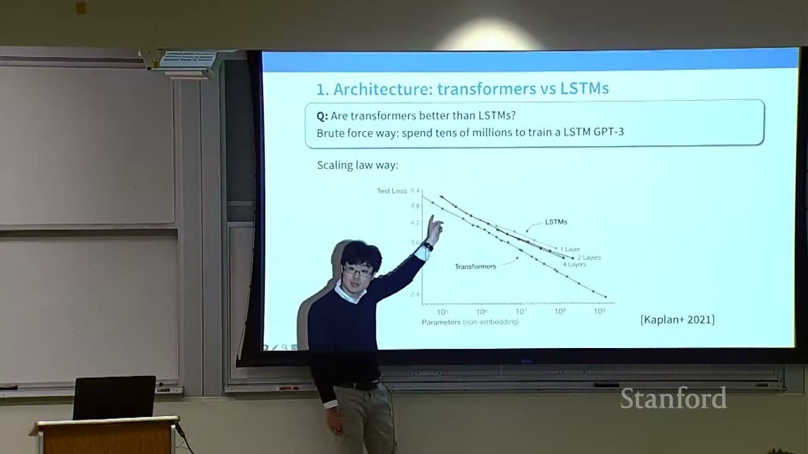

有同学问：这里有些是测试损失，有些只是训练损失？什么时候用哪个？当你做好的科学实践时，比如 Kaplan 2021，你会拟合测试损失。但现实地说，除了极少数模型，比如无限计算量那个和重复那个，除非你在做那些，否则你都是在做单遍 SGD。所以所有这些模型的泛化差距非常非常小，训练和验证非常相似。我见过一些预训练代码库甚至没有验证损失，因为如果你做单遍，很可能训练和验证非常接近。这也是为什么很多图会交换这两个，因为它们都在单遍区域。不过这是个好问题。

*[56:36](https://www.youtube.com/watch?v=Q15rhEWZPQ4&t=3396)*

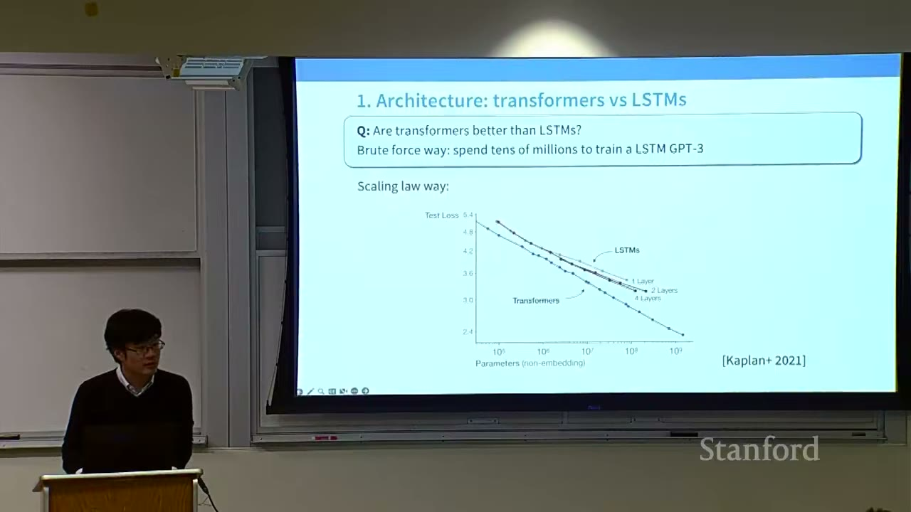

## 数据还是模型：Kaplan、Chinchilla 与算力最优
好，我们继续。现在我要讲缩放定律最著名的用途之一。即使你个人可能不用，你也一定在某个时候用过这个经验法则。而且我认为这组内容会告诉我们一些关于缩放定律实际执行的有趣事情。动机问题是：我想要更多数据还是更大模型？你拥有的资源是计算量。有人会隐喻性地给你一定量的 FLOPs。你要把这些 FLOPs 花掉；如果记得 Percy 的第一讲，大致是数据乘以参数量约等于 FLOPs，对它线性。所以我想要更多数据还是更多模型？

*[57:32](https://www.youtube.com/watch?v=Q15rhEWZPQ4&t=3452)*

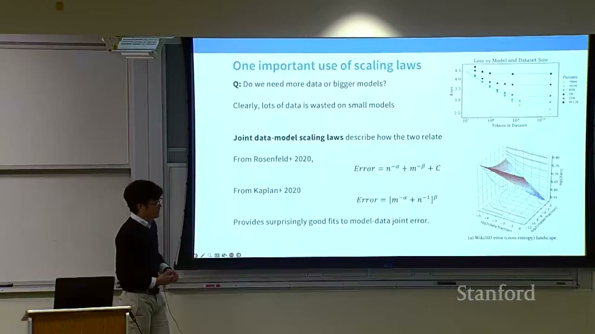

我们知道，如果拿一个极小模型，往里灌大量数据，那只会浪费。这是最上面那条深紫色线。我拿了一个很小的语言模型，喂了巨量数据，它很长时间都是平的。这是完全浪费计算量。在同样计算量下，你宁愿训练那个大的黄色模型到同样多的 token，甚至更早。

*[58:01](https://www.youtube.com/watch?v=Q15rhEWZPQ4&t=3481)*

现在，如果你能理解数据量和模型大小如何共同决定性能，如果你理解这个关系，你就可以非常精确地优化。所以有更高级的缩放定律，关联对象的联合行为。几乎同时，Kaplan 和 Rosenfeld 都提出了这些函数形式，它们大致等价，描述了模型大小和数据量如何与误差相关。Rosenfeld 非常简单，真的就是两个逆项相加：两条缩放定律加在一起。Kaplan 稍微复杂一点，但大致是同样的想法。

*[58:52](https://www.youtube.com/watch?v=Q15rhEWZPQ4&t=3532)*

如果你看极限，这非常直观。如果我有无限数据，那么这一项趋于 0，你基本上受模型大小限制，变成纯粹的模型大小缩放定律。如果我把模型大小送到无限，那么我受数据限制，得到纯粹的数据缩放定律。所以取这两个的极限是合理的。如果有人告诉你一条缩放定律，取所有变量的极限来理解系统行为，通常是个好主意。

*[59:21](https://www.youtube.com/watch?v=Q15rhEWZPQ4&t=3561)*

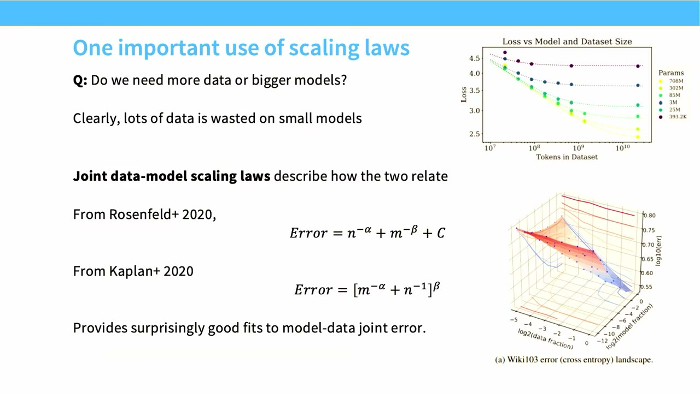

很酷的是，Rosenfeld 和许多其他提出这种联合缩放定律的人表明，这些东西拟合得很好，即使外推也很好。你会做的是：在这些绿色点上拟合，这是低计算量和低数据区域；你从没看到高数据或高模型大小的东西。然后你可以基于这个角落里的小运行，外推到高计算量或高数据、高模型大小区域。你可以基于预测非常准确地预测误差。预测很好。

*[59:58](https://www.youtube.com/watch?v=Q15rhEWZPQ4&t=3598)*

一旦有了这个，你现在可以说：我有固定量的 FLOPs，在 FLOPs 约束下最小化这个。这是一个简单的非线性优化问题。你可以解出来。Kaplan 和 Rosenfeld 都提供了这种形式的方程。他们说了什么？如果你看 Kaplan，解这个方程，他们会说类似这样：数据量应该是 C 的 0.73 次方，模型大小应该是 C 的 0.27 次方。是不是反了？我觉得反了，抱歉。N 应该是参数量，D 应该是数据量。所以 tokens per parameter 随 C 下降。也就是说，随着计算量增加，Kaplan 的方案告诉你要训练越来越大、越来越大的模型。

*[60:56](https://www.youtube.com/watch?v=Q15rhEWZPQ4&t=3656)*

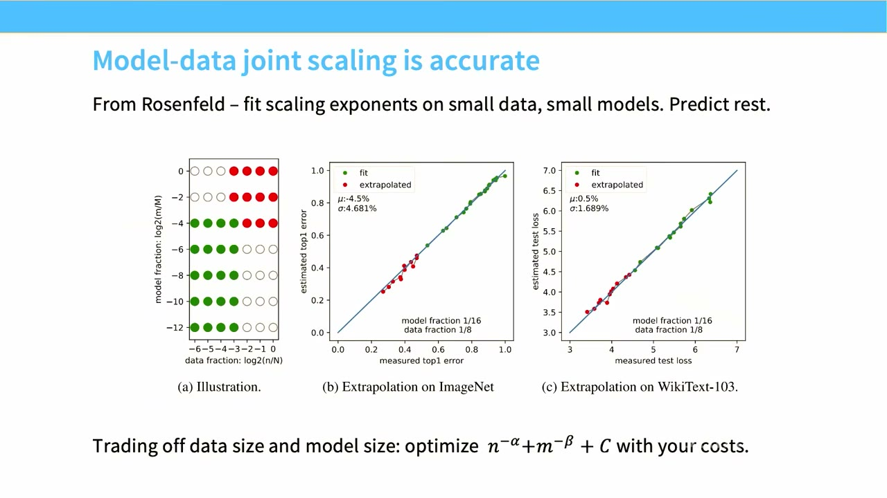

如果你在 GPT-3 时代待过——想到有些人不在那个时代让我有点震惊——你会知道有一段时间大家都在训练这些巨型模型，比如数千亿参数、万亿参数稠密模型等等。部分就是被这个驱动的。他们看到 GPT-3，看到 Kaplan 的预测，说：哇，我要在巨大的模型上做大训练运行。

*[61:24](https://www.youtube.com/watch?v=Q15rhEWZPQ4&t=3684)*

但几年后，2022 年，DeepMind 的 Hoffman 等人进来说：其实这些预测全都错得离谱。你们一直在训练这些巨型模型——这里的三个星号——但它们其实太大了。我们应该训练的是一条非常不同的趋势，这里蓝线，应该训练这个蓝绿色星号，是更好的模型。所以他们主张我们应该训练比这个小得多的模型。当然，你们很多人或所有人大概都知道 Chinchilla 论文，知道 token 乘数：每个参数 20 个 token。

*[62:02](https://www.youtube.com/watch?v=Q15rhEWZPQ4&t=3722)*

但我认为详细讲这个过程很有用，因为 Chinchilla 和 Kaplan 的分歧告诉我们一些重要的事情：我们应该如何思考缩放定律。它不是转一下曲柄就能得到答案的东西，而是需要小心、敏感，必须尊重过程。所以我要走一遍 Chinchilla 论文。走完之后，我会讲为什么 Kaplan 和 Chinchilla 论文有分歧，以及这对你意味着什么。

*[62:30](https://www.youtube.com/watch?v=Q15rhEWZPQ4&t=3750)*

Chinchilla 作者提出了三种不同的拟合缩放定律的方法。我非常喜欢这一点，因为这是一种对建模假设做稳健化的方法。每一种实际上都是估计模型大小和数据权衡的不同方式。除了方法 3 稍有不同，它们大多一致。方法 1 和 2 都同意数据和模型大小的系数大致相同：0.5、0.5，0.49、0.51。方法 3 确实不同，0.46 和 0.54，但我们稍后会谈为什么。Kaplan 等人当然两者差别很大，这就是为什么他们在很大计算量下训练大模型。

*[63:17](https://www.youtube.com/watch?v=Q15rhEWZPQ4&t=3797)*

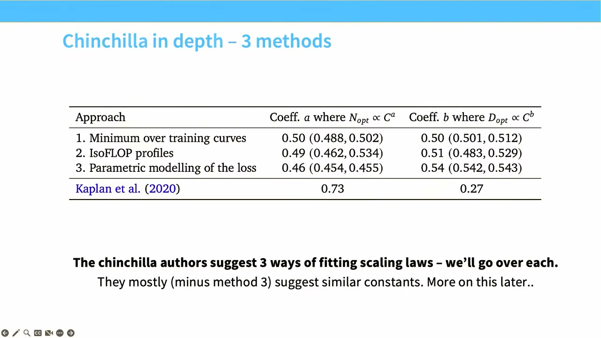

Chinchilla 的方法 1 可以叫下包络方法。Kaplan 也部分使用了这种方法来确定正确的缩放。做法是：取所有训练运行。这里每条彩色线是一条训练曲线。你想取这些训练曲线的下包络。因为下包络上的点意味着对某个 FLOP，这是我在任何训练运行中达到的最好损失。所以我可以取高计算量区域最底部的所有下包络点，然后画出这些点对应的模型有多大。因为每个点是一次带模型大小的训练运行。如果散点画出来，会得到漂亮的线性趋势。这给我一种估计 FLOP 到参数最优权衡的方法。它给出一个答案：在他们的计算预算下，应该训练 670 亿参数模型。这简单漂亮，但定义下包络之类的东西很棘手。

*[64:28](https://www.youtube.com/watch?v=Q15rhEWZPQ4&t=3868)*

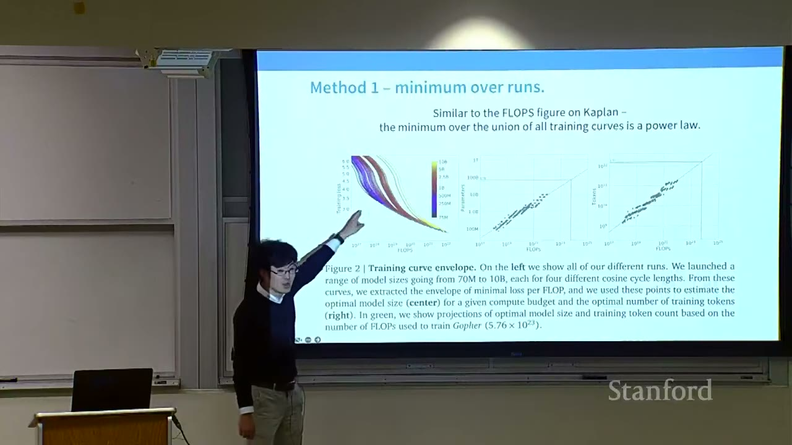

方法 2 是 IsoFLOP。现在非常流行，也非常容易、非常稳健。这大概是我个人最喜欢的方法。做法是：选一堆不同的 FLOPs 预算，比如以 3 的因子变化。对每个 FLOP 预算，你扫过空间。这里有一个变量：参数与数据的权衡。对每个 FLOP 预算，我固定 FLOPs，扫过参数到数据的权衡：数据翻倍，模型减半，等等。这会生成一串训练运行，其最终损失会扫出一条曲线。所以每组彩色点是一个固定 FLOP 运行，每个点扫过不同参数，当然也隐式扫过数据。

*[65:20](https://www.youtube.com/watch?v=Q15rhEWZPQ4&t=3920)*

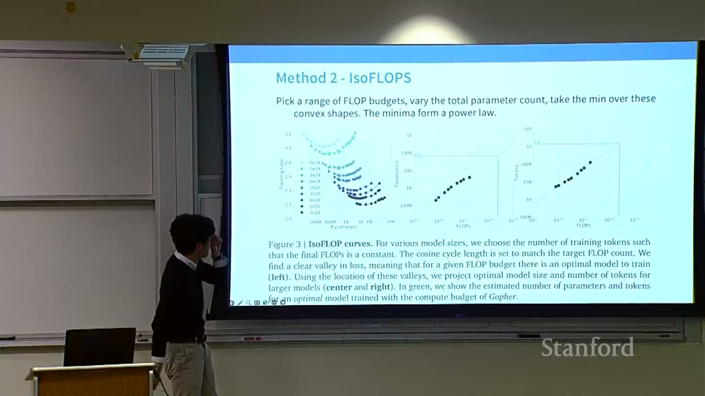

现在好的是，我可以取每个运行的最小值，或者拟合二次曲线并取二次曲线的最小值，然后画一条线穿过所有二次曲线的底部，或者取底部并作为 FLOP 到参数的函数画出来。这给出另一个预测，非常接近：在我的计算预算下是 630 亿参数。

*[65:47](https://www.youtube.com/watch?v=Q15rhEWZPQ4&t=3947)*

最后一种方法其实可能是最自然的，Rosenfeld 和 Kaplan 都建议过，因为他们都提出了模型大小和数据如何与损失相关的假设函数形式。所以如果你有这样的联合函数形式，你可以取一大堆已经做过的训练运行，拟合你的损失景观——也就是你假设的函数形式——然后直接做曲线拟合来估计缩放定律的系数。这是最暴力的方式：你有一个损失、数据量和模型大小之间的假设关系，训练一堆模型，做曲线拟合。希望这相当直接。当然，如果你用这种方法，如何进行曲线拟合非常重要。你在拟合这些曲面，有很多变量，这有点棘手。它也有像方法 1 一样的棘手之处。所以它不像 IsoFLOP 那样直接。

*[66:53](https://www.youtube.com/watch?v=Q15rhEWZPQ4&t=4013)*

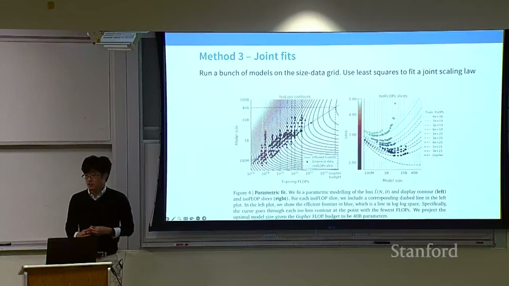

## Chinchilla 方法、Kaplan 的不一致及其原因
现在我们已经讨论了 Chinchilla 做了什么。它看起来和 Kaplan 做的没有本质区别。并不是 Kaplan 做了什么疯狂的事，然后 Chinchilla 作者做了更聪明的事，你说：哇，为什么我们不从一开始就这么做？他们都做了相当合理的事情。但如果我们看他们的缩放预测，它们非常不同。事后看来，我们通常倾向于同意 Chinchilla 作者有更多正确的缩放。如果你做自己的 Chinchilla 风格分析，你会发现缩放可能更接近 Chinchilla。那么，为什么会有这么大差异，既然他们都在拟合这些联合缩放定律？

*[67:34](https://www.youtube.com/watch?v=Q15rhEWZPQ4&t=4054)*

这就是我认为我们进入缩放定律如何制定的混乱现实的地方。缩放定律真的会变化，取决于你实现缩放定律的精确方式、你使用的超参数设置，甚至 x 轴是什么。有一篇非常好的论文——哦不，我把作者遮住了，我之后可以把它粘贴到课程 Slack 里——叫《Resolving Discrepancy to Compute-Optimal Scaling of Language Models》。Yair 是最后一位作者，他曾是这里的学生。他们首先用大致 Kaplan 的设置复现了 Kaplan 的结果。然后他们说，好吧，让我们改变参数的计数方式。这会让曲线稍微移动一点。然后让我们改变学习率预热的方式。这会让曲线稍微移动一点。然后让我们再稍微调一调优化器。然后他们就得到了和 Chinchilla 完全一致的结果。

*[68:31](https://www.youtube.com/watch?v=Q15rhEWZPQ4&t=4111)*

所以他们的论点是：这里存在一系列看起来非常微小的决定，最终在 Kaplan 缩放定律和 Chinchilla 缩放定律之间造成了这么大的差距。我会解释这些步骤各自是什么，并不是说这是最重要的单一因素，而是也想向你强调，这里的细节有多么重要。

*[68:53](https://www.youtube.com/watch?v=Q15rhEWZPQ4&t=4133)*

所以第一个箭头，从 Kaplan 到蓝线，是参数的计数方式。记住，在 Kaplan 中，我说过，如果他们算入嵌入参数，就会看到奇怪现象，所以他们排除了嵌入参数。这通常可以接受。但他们还做了一件真正搞砸的事：他们也排除了最后一层的参数，也就是 softmax 那些。因为在许多模型中，嵌入层和最后一层线性层互为对偶，形状相同。嵌入矩阵是词表大小乘以隐藏维度，输出矩阵是隐藏维度乘以词表大小。因为它们形状相同，他们说，那就两个都排除吧。结果，算入还是排除这些对缩放定律形状有重大影响。

*[69:40](https://www.youtube.com/watch?v=Q15rhEWZPQ4&t=4180)*

他们还发现——这更像疏忽，而不是真正的意见分歧——Kaplan 中训练的很多模型非常小。事实上，它们小到学习率预热结束时还没有真正收敛，所以学习率设置得非常次优。因此模型没有完全收敛。最后，他们发现 Kaplan 等人固定了一个大批量大小，而这些大批量对较小模型来说是次优的。因此，如果你正确调整，使用变化的批量大小，你最终会得到和 Chinchilla 完全一致的结果。

*[70:20](https://www.youtube.com/watch?v=Q15rhEWZPQ4&t=4220)*

所以我认为这些差异每一个看起来都很小，但如果你改变这些真正微小的差异，就能让缩放定律发生大偏移。我想强调的一点是：缩放定律在某种意义上是下界。它们像是在说，如果我继续这个配方并扩大它，我就会得到这个。但如果你扩大的配方本身就不该被扩大，比如预热很奇怪、批量大小很奇怪，你就会得到糟糕的缩放定律。所以你希望尽可能接近正确的完整运行。

*[70:54](https://www.youtube.com/watch?v=Q15rhEWZPQ4&t=4254)*

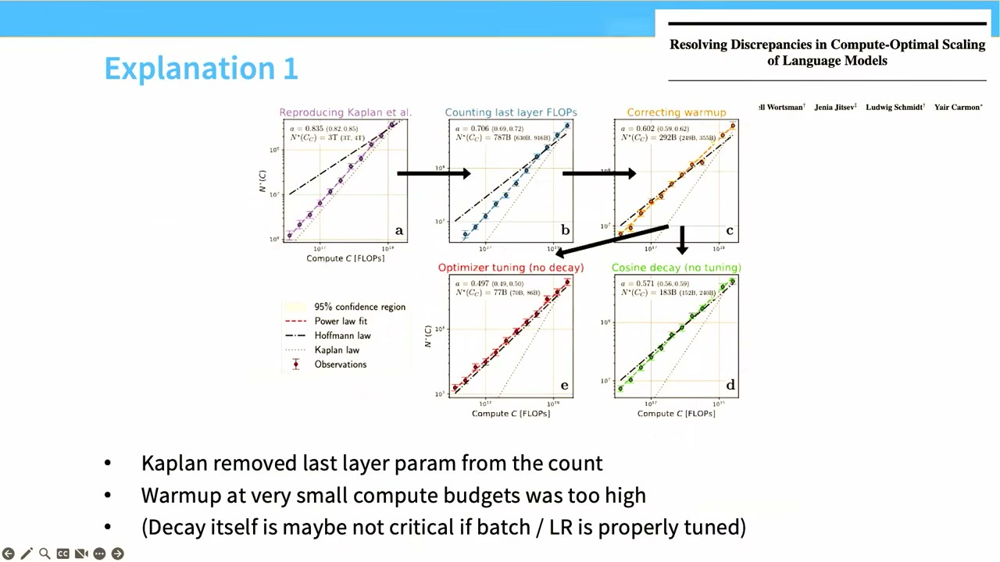

还有另一篇论文用另一种非常有趣的方法研究 Kaplan 和 Chinchilla 缩放定律的差异。是 Pearce 和 Song 的工作。他们的做法很聪明：不训练任何模型。他们只取 Chinchilla 训练曲线，或者说 Chinchilla 训练曲线隐含的函数形式。他们画出来，然后说，基于这些完全从 Chinchilla 模拟出的隐含训练曲线，生成如果忽略嵌入参数并大幅缩小规模，Kaplan 的隐含训练曲线会是什么样；如果改用总参数量，又会怎样。他们发现两个效应。

*[71:30](https://www.youtube.com/watch?v=Q15rhEWZPQ4&t=4290)*

一个效应是 Kaplan 运行在低得多的计算尺度上，所以他们对小变化非常敏感；忽略非嵌入参数是一个足够大的变化，足以让结果相对于 Chinchilla 出错。所以他们的论证和 Yair 等人略有不同：在这里，实际上是计算尺度大小加上非嵌入参数带来的轻微非线性，导致了这个分歧。这真的开始进入细节了。但我希望你能体会到关注细节的重要性。我认为，建立可靠缩放定律的很多工作，就是弄清楚正确的区域是什么，以便你能在计算尺度上得到可靠的缩放。

*[72:17](https://www.youtube.com/watch?v=Q15rhEWZPQ4&t=4337)*

最后一件事，这更多是我觉得有趣，而不是别的：Chinchilla 这篇论文某种程度上推翻了 Kaplan 论文，像是在说，你们错得很厉害。但还留下一个谜：Chinchilla 方法 3 从未与 Chinchilla 方法 1 和 2 一致。数字看起来很小，作者也很淡定，但我认为影响相当不平凡。如果你看这个，方法 1 和 2 基本上说参数量和数据量应该一起缩放，所以两者之间应该有固定比例。这就是 Chinchilla 因子 20 的来源。如果你看方法 3，指数不同。这意味着如果你扩大计算量，最终你会有比参数量多得多的 token。所以渐近上，它会得出和其他方法非常不同的缩放结论。

*[73:09](https://www.youtube.com/watch?v=Q15rhEWZPQ4&t=4389)*

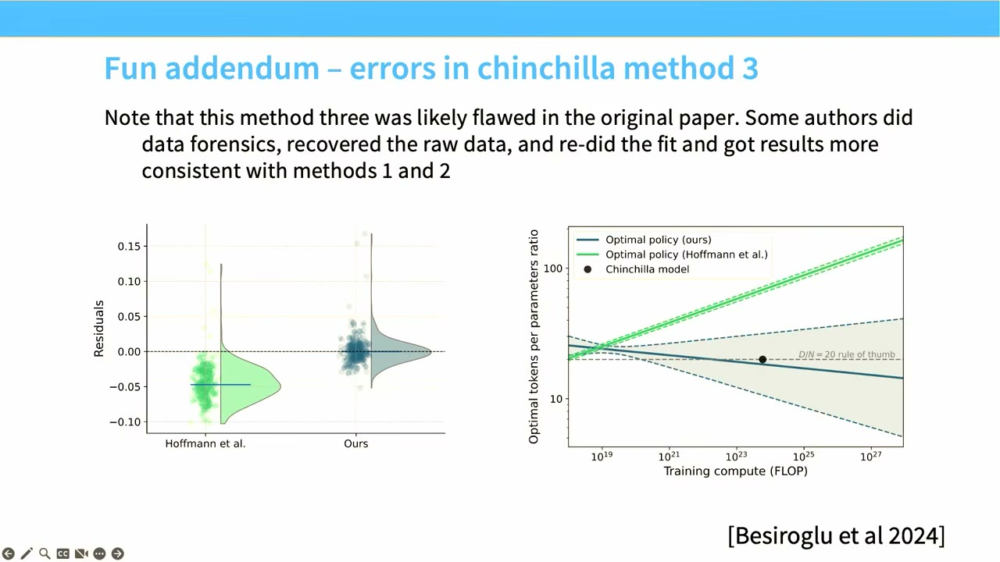

结果，我肯定不是唯一一个对此感到不安的人，但 Epoch AI 的一些人不仅不安，还做了点什么。他们拿不到原始数据或代码，所以他们从论文图中提取数据，重新拟合方法 3 的回归。他们从论文中提取数据，给定数据，拟合提出的那个二维或三维曲面。然后他们表明，原论文一定是对原始数据欠拟合了。如果他们重新做曲线拟合，可以得到比 Chinchilla 论文提出的缩放定律低得多的损失。事实上，如果你遵循重新拟合的模型，你几乎正好得到 D/20、每个参数 20 token 的经验法则。这真是一个有趣的结论：作者们比他们自己知道的更正确。实际上他们犯了一个错误，这才是方法 3 与方法 1 和 2 不一致的唯一原因。所以知道这个方法最终还是稳健的，是个不错的结论。

*[74:21](https://www.youtube.com/watch?v=Q15rhEWZPQ4&t=4461)*

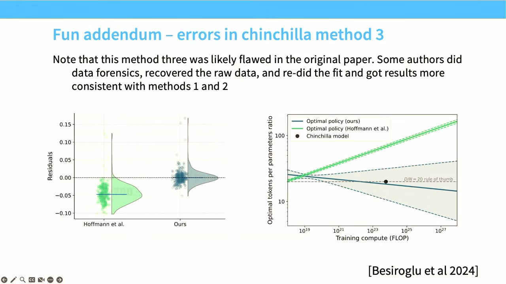

## Chinchilla 比例、过训练与 IsoFLOP 的持久价值
好，Chinchilla 传奇某种程度上到此结束。但我会用这一点结束这一节：你大概不想要 Chinchilla 因子。到这个时候，我认为这是相当常识的事情。如果你在训练生产模型，你大多不太关心节省训练计算量。你可以看各种外部调查，看前沿实验室如何花计算量。大部分计算量不是花在训练运行上，而是花在研发和服务上。尤其是服务，你想要小而能干的模型。你不想要又大又臃肿、服务成本很高的模型，即使那最小化训练成本。所以你真正想要的是所谓的“过训练”模型。我加引号是因为，实际上过训练才是我们想要的，那才是正确的训练量。

*[75:14](https://www.youtube.com/watch?v=Q15rhEWZPQ4&t=4514)*

如果你看早期发布的所有模型，比如 GPT-3，它肯定是训练不足的：每个参数 3 个 token。Chinchilla 达到现代比例：每个参数 20 个 token。然后有一段时间人们都在每个参数 20 个 token。我认为这个时代没有太多模型服务；模型很酷，但没有大规模服务。然后当你开始进入服务变得非常真实的时代，你就会过训练这些模型，进入 MoE，做各种权衡来优化推理服务。所以我认为 Chinchilla 重要，不是因为我认 20:1 是唯一黄金比例——如果你做研究，它可能是——而是因为它告诉我们很多关于应该如何拟合缩放定律、如何思考缩放定律的事情。

*[76:02](https://www.youtube.com/watch?v=Q15rhEWZPQ4&t=4562)*

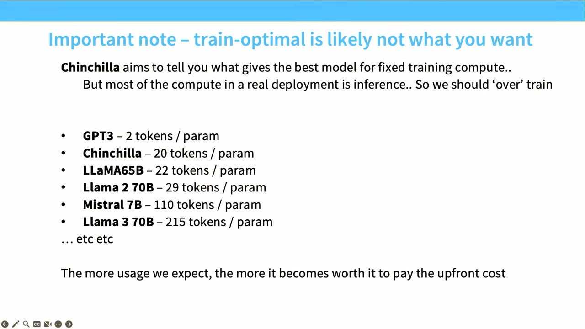

最后关于 Chinchilla 和一般缩放，我要说的是 IsoFLOP 作为一种研究工具留存了下来。IsoFLOP 很容易执行：你固定一个 FLOPs 预算，然后扫过所有其他自由度，看曲面长什么样。一般来说，这能给出相当可靠的读数，说明不同参数如何随自由参数变化。人们已经把它用于——实际上我的一位学生把它用于扩散模型。我讲过的 MoE 研究也是 IsoFLOP 式设计。如果你在任何情况下需要决定这些权衡，IsoFLOP 总是一个好的默认选择。

*[76:47](https://www.youtube.com/watch?v=Q15rhEWZPQ4&t=4607)*

## 总结
好，总结今天的一切：有一个想法是，我们在投入的资源和得到的性能之间存在对数线性规律。它延伸到各种各样的东西：模型参数、计算量、MoE 稀疏度。这让你能把前面说的很多任意选择，变成更有证据驱动的选择。这让我们能够在大规模上做工程，而不必显式依赖做大的模型训练运行。希望你们记住这里的各个组成部分：数据缩放是非常自然的对象，只是指数有点奇怪；模型缩放让你做各种很酷的工程事情；最后，缩放是一个非常酷、稳健的预测器，用来在大规模上做工程。

*[77:37](https://www.youtube.com/watch?v=Q15rhEWZPQ4&t=4657)*

谢谢。下一讲我想会是 Percy 讲推理。之后我们会回到更高级、更小众的缩放主题。

*[77:47](https://www.youtube.com/watch?v=Q15rhEWZPQ4&t=4667)*

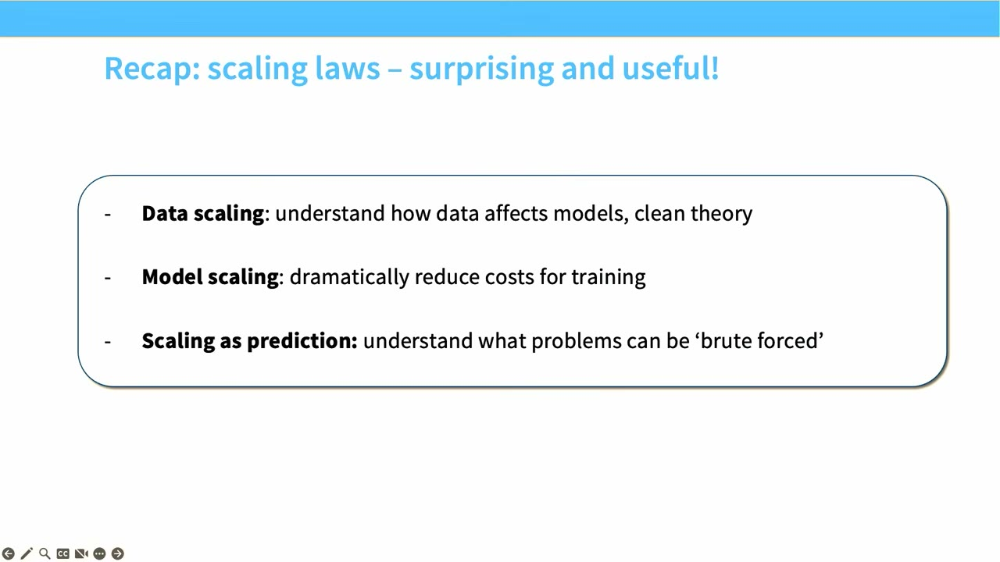
