# 从预训练到强化学习：像 ChatGPT 这样的大语言模型到底是怎么做出来的

这堂课用面向普通听众的方式，按完整流水线讲解大语言模型如何从互联网文本、分词、神经网络训练，逐步变成能对话、会用工具、能推理的助手，并说明它们的能力边界和使用注意事项。

## 为什么要理解这个文本框背后的东西

大家好。我一直想做这个视频，因为我想给大家一个面向普通听众、但又比较全面的大语言模型介绍，比如 ChatGPT 这样的模型。我希望通过这个视频，让大家建立一些心智模型，去理解这个工具到底是什么。它在某些方面显然很神奇、很惊人；它有些事情做得很好，有些事情做得不太好，同时也有很多需要注意的锋利边缘。我们面对的这个文本框背后到底是什么？你可以在里面输入任何东西然后按回车，但我们到底应该输入什么？它生成回来的这些词又是什么？它是怎么工作的？你到底是在和什么东西说话？我希望在这个视频里讲到这些问题。我们会走完整个构建流程，但我会尽量让内容对普通听众也容易理解。

*[00:48](https://www.youtube.com/watch?v=7xTGNNLPyMI&t=48)*

我们先来看怎么构建一个类似 ChatGPT 的东西。一路上，我也会讲一些这类工具在认知心理层面上的含义。好，那我们开始构建 ChatGPT。这里会有多个阶段按顺序排列。第一阶段叫预训练阶段（pre-training）。预训练阶段的第一步，是下载并处理互联网。为了大致了解这件事长什么样，我推荐大家看一个 URL：Hugging Face 这家公司收集、创建并整理了一个叫 FineWeb 的数据集，他们在博客文章里非常详细地讲了 FineWeb 数据集是怎么构建的。所有主要的大语言模型提供商，比如 OpenAI、Anthropic、Google 等，内部都会有某种类似 FineWeb 的等价数据集。

*[01:36](https://www.youtube.com/watch?v=7xTGNNLPyMI&t=96)*

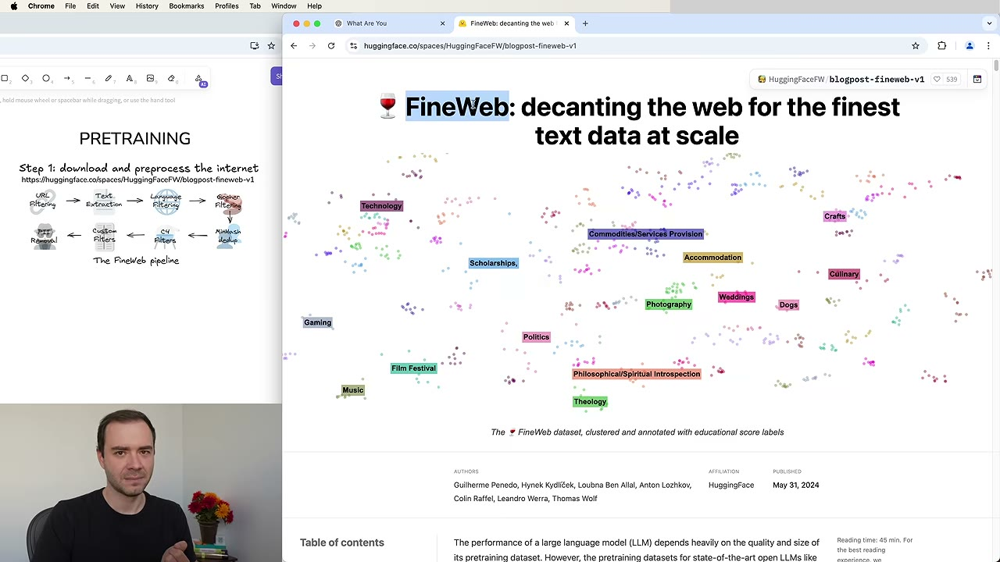

## 预训练的第一步：下载、清洗和筛选互联网文本

我们大概要实现什么目标？我们想从互联网上公开可得的来源中拿到大量文本。我们想要数量巨大的高质量文档，也想要非常大的文档多样性，因为我们希望模型里包含很多知识。所以我们要的是大量、多样、高质量的文档。要做到这一点其实非常复杂，你可以看到这里需要很多阶段才能做好。比如 FineWeb 这个数据集，作为生产级应用里会看到的东西的一个代表，最终大约只有 44TB 的磁盘空间。现在你很容易买到 1TB 的 U 盘，或者这差不多可以放进今天的一块硬盘里。所以尽管互联网非常非常大，但最终这不是一个特别巨大的数据量，因为我们处理的是文本，而且会非常激进地过滤。

*[02:35](https://www.youtube.com/watch?v=7xTGNNLPyMI&t=155)*

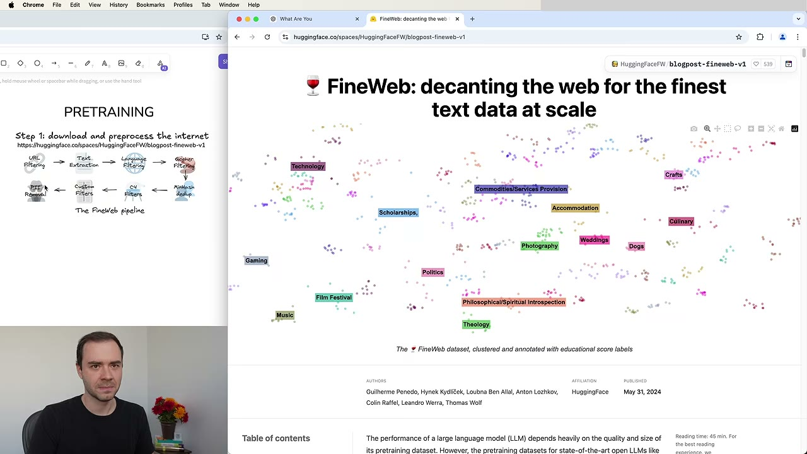

很多这类工作的起点，也是最终贡献最多数据的来源，是 Common Crawl。Common Crawl 是一个从 2007 年开始就基本上一直在爬取互联网的组织。比如到 2024 年，Common Crawl 已经索引了 27 亿个网页。它有很多爬虫在互联网上跑。基本做法是从一些种子网页开始，然后跟随所有链接，不断跟随链接，不断索引信息，随着时间积累大量互联网数据。所以这通常是很多这类工作的起点。

*[03:21](https://www.youtube.com/watch?v=7xTGNNLPyMI&t=201)*

Common Crawl 的数据非常原始，因此要经过很多不同方式的过滤。第一件事叫 URL 过滤。意思是会有一些 URL 或域名黑名单，这些来源的数据我们不想要。通常这包括恶意软件网站、垃圾网站、营销网站、种族主义网站、成人网站等。很多类型的网站会在这个阶段被直接移除，因为我们不想把它们放进数据集。第二部分是文本抽取。要记住，爬虫保存下来的网页是原始 HTML。当我在浏览器里点检查时，你看到的是原始 HTML：里面有各种标记，比如列表，还有 CSS 等等。这几乎是网页的计算机代码，但我们真正想要的是网页里的文本。我们想要正文，不想要导航栏之类的东西。所以这里有大量过滤、处理和启发式方法，用来尽量只保留网页里的好内容。

*[04:48](https://www.youtube.com/watch?v=7xTGNNLPyMI&t=288)*

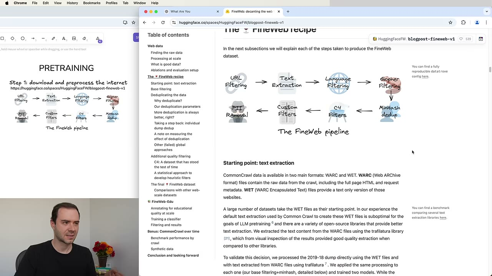

下一阶段是语言过滤。比如 FineWeb 使用语言分类器来过滤。他们会尝试猜测每个网页是什么语言，然后只保留英语比例超过 65% 的网页。这是一个设计决策，不同公司可以自己决定：在数据集中要包含多少比例的不同语言。比如如果我们把所有西班牙语过滤掉，那么你可以想象，之后训练出来的模型在西班牙语上可能就不会很好，因为它从来没有见过那么多这种语言的数据。不同公司可以不同程度地关注多语言表现。FineWeb 非常关注英语，所以如果他们之后训练一个语言模型，这个模型会很擅长英语，但可能不太擅长其他语言。

*[05:33](https://www.youtube.com/watch?v=7xTGNNLPyMI&t=333)*

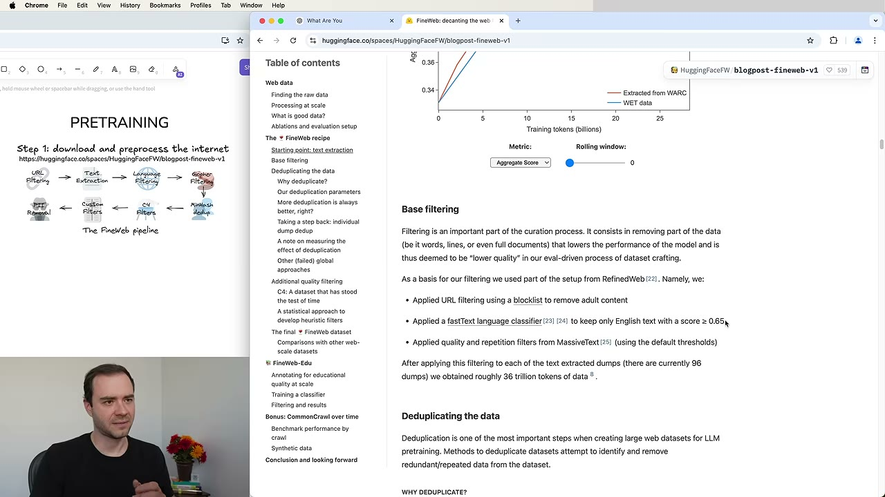

语言过滤之后，还有其他过滤步骤、去重等，最后还包括 PII 移除。PII 是 personally identifiable information，也就是个人可识别信息。比如地址、社会安全号码等，你会尝试检测它们，并把包含这类信息的网页也从数据集中滤掉。所以这里有很多阶段，我不会展开所有细节，但这确实是预处理里相当重要的一部分。最后我们得到 FineWeb 数据集。点进去可以看到一些最终进入训练集的文本例子。任何人都可以在 Hugging Face 页面下载它。比如这里有一篇关于 2012 年龙卷风的文章；下一篇是关于你身体里有两个黄色、9V 电池大小的肾上腺的医学类文章。你可以把它们理解成互联网上的网页，只不过经过各种方式过滤，只保留文本。现在我们有了大量文本，比如 40TB，这就是下一步的起点。

*[06:51](https://www.youtube.com/watch?v=7xTGNNLPyMI&t=411)*

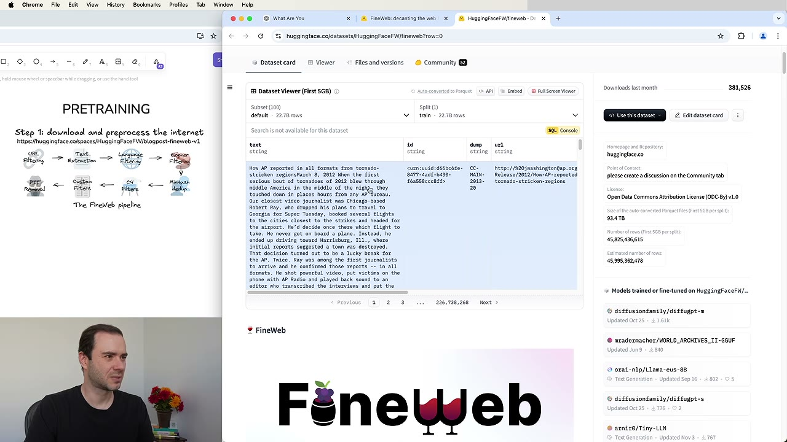

我想给你一个直观感受：我们现在到底处在什么位置。我取了这里前 200 个网页，记住我们其实有海量网页，然后把所有文本拼在一起，也就是 concatenate。结果就是一大段原始互联网文本。即使只有 200 个网页，文本也已经很多。我继续缩小画面，就会看到一张巨大的文本织物。这些文本数据里有很多模式，而我们现在要做的，是开始在这些数据上训练神经网络，让神经网络内化并建模这种文本是如何流动的。我们有一张巨大的文本纹理，现在我们希望得到能够模仿它的神经网络。

*[07:35](https://www.youtube.com/watch?v=7xTGNNLPyMI&t=455)*

## 分词：把文本变成模型能处理的一维符号序列

在把文本输入神经网络之前，我们必须决定如何表示这些文本，以及怎样喂进去。我们现在的神经网络技术期望输入是一维的符号序列，而且可能的符号集合必须是有限的。所以我们要决定这些符号是什么，然后把数据表示成这些符号的一维序列。现在我们拥有的是一维文本序列。它从这里开始，走到这里，再到下一行，等等。虽然在显示器上它排成二维，但阅读顺序是从左到右、从上到下，所以本质上是一维文本序列。

*[08:20](https://www.youtube.com/watch?v=7xTGNNLPyMI&t=500)*

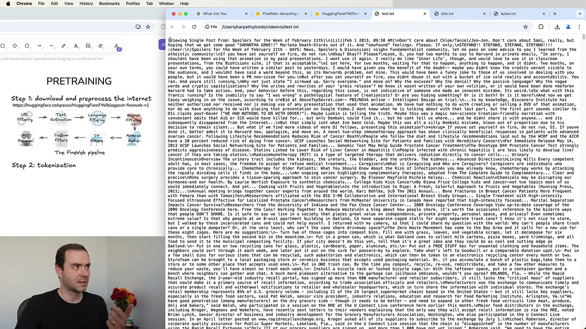

因为这是计算机，当然有底层表示。如果我把这段文本做 UTF-8 编码，就能得到计算机中对应该文本的原始比特。比如最开始的一条就是前 8 个比特。从某种意义上说，这已经是一种我们需要的表示：我们只有两个可能的符号，0 和 1，并且有一条很长很长的序列。但序列长度在神经网络里是非常有限且珍贵的资源。我们不想要只有两个符号、但极长的序列。我们想在词表大小，也就是 vocabulary 的符号数量，和最终序列长度之间做权衡。我们希望有更多符号、更短序列。

*[09:35](https://www.youtube.com/watch?v=7xTGNNLPyMI&t=575)*

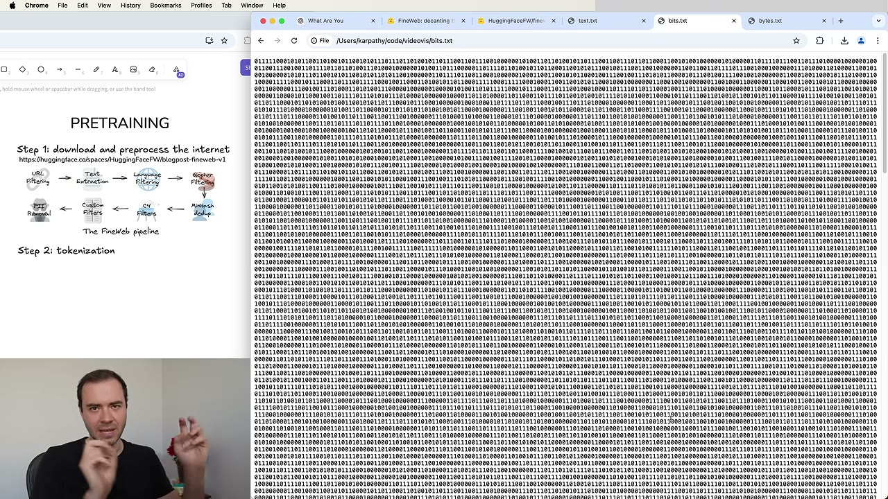

一种朴素的压缩方法，是把连续比特分组，比如每 8 个比特组成一个字节（byte）。因为每个比特只有开或关，如果取 8 个，就只有 256 种可能组合。因此我们可以把比特序列表示成字节序列。这个字节序列会短 8 倍，但现在我们有 256 个可能符号，每个数字从 0 到 255。我强烈建议你不要把它们想成数字，而要想成唯一 ID 或唯一符号。也许更好的想法是，把每个数字替换成一个独特 emoji。这样我们就有一串 emoji，总共有 256 种可能的 emoji。

*[10:34](https://www.youtube.com/watch?v=7xTGNNLPyMI&t=634)*

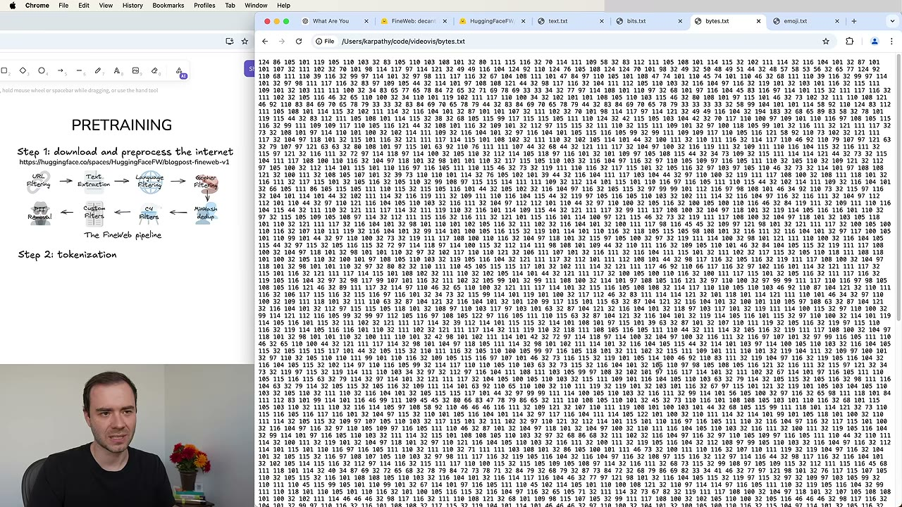

在生产中的前沿语言模型里，还要继续往前走。你希望继续缩短序列长度，因为序列长度很珍贵，代价是词表里有更多符号。做法是运行字节对编码算法（byte pair encoding）。它的工作方式是寻找非常常见的连续字节或符号。比如序列 116 后面跟 32 非常常见，出现频率很高。于是我们把这一对组合成一个新符号，创建一个 ID 为 256 的新符号，然后把每一个 116、32 的组合都改写成这个新符号。这个算法可以迭代任意多次。每次创建新符号，序列长度就变短，符号集合就变大。实践中，一个相当好的词表大小大约是 10 万个可能符号。具体来说，GPT-4 使用 100,277 个符号。把原始文本转换成这些符号，也就是 token 的过程，叫 tokenization，分词或标记化。

*[12:04](https://www.youtube.com/watch?v=7xTGNNLPyMI&t=724)*

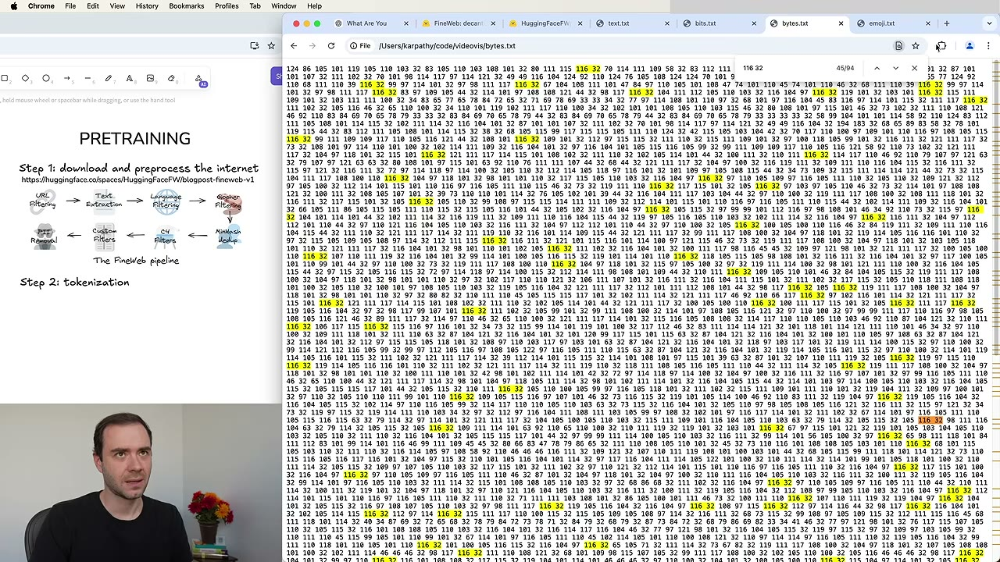

我们看 GPT-4 如何做 tokenization。一个我喜欢用来探索 token 表示的网站叫 tiktokenizer。你可以在下拉菜单里选择 CL100K_base，这是 GPT-4 基础模型的 tokenizer。左边可以输入文本，它会显示这段文本的 tokenization。比如 “hello world” 正好是两个 token：token “hello”，ID 是 15339；以及 token “ world”，也就是带空格的 world，ID 是 1917。如果我把两个词连起来，会得到两个 token，但变成 token “H” 加上不含 H 的 “ello world”。如果 hello 和 world 之间有两个空格，又是不同的 tokenization，多了一个新 token 220。大小写也敏感，大写 H 会不一样；如果是 “Hello world”，可能变成三个 token，而不是两个。你可以玩一玩，获得这些 token 如何工作的直觉。

*[13:41](https://www.youtube.com/watch?v=7xTGNNLPyMI&t=821)*

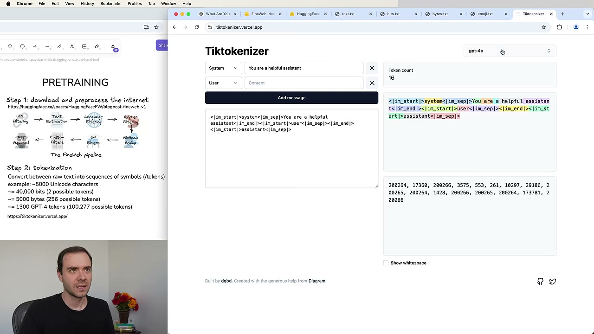

现在假如我从数据集中取一行文本，这就是 GPT-4 会看到的东西。这段文本会变成长度为 62 的序列。这里是序列本身，以及文本块如何对应这些符号。再次强调，有 100,277 个可能符号，我们现在拥有这些符号的一维序列。我们之后还会回到 tokenization。现在我已经把数据集中的文本序列，用 tokenizer 重新表示成 token 序列。比如 FineWeb 说它不仅是 44TB 磁盘空间，而且数据集中大约有 15 万亿 token。这里看到的只是前几千个 token，但要记住总共有 15 万亿个。所有这些 token 都代表小文本块，是序列里的原子；这些数字本身没有意义，只是唯一 ID。

*[15:11](https://www.youtube.com/watch?v=7xTGNNLPyMI&t=911)*

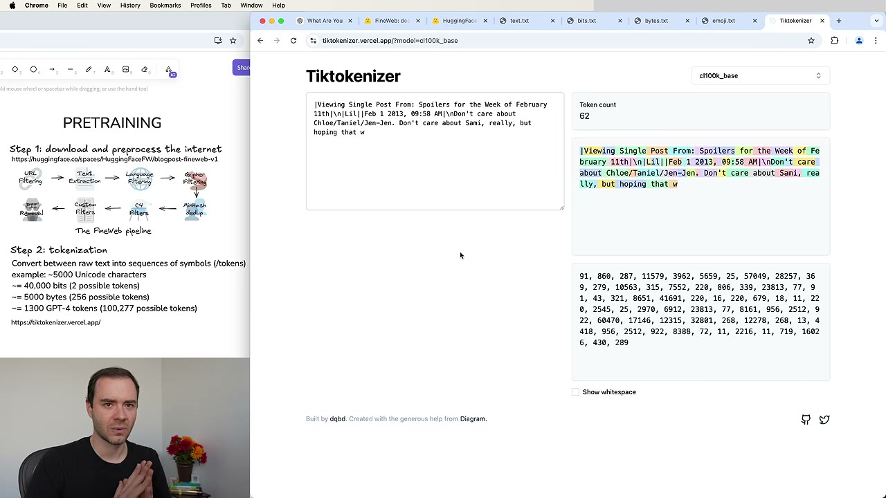

## 神经网络训练：预测下一个 token

现在到了有趣的部分，也就是神经网络训练。这是训练神经网络时计算上最重的地方。在这一步，我们想建模这些 token 在序列中如何相互跟随的统计关系。我们会进入数据，取 token 窗口。我们会从数据中相当随机地取一段 token 窗口，窗口长度可以从 0 个 token 到我们设定的某个最大值。实践中你可能会看到 8000 个 token 的窗口。原则上我们可以用任意长度，但处理很长的窗口计算成本很高，所以我们会决定比如 8000、4000 或 16000，然后截断。为了演示，我取前 4 个 token，好让画面放得下。

*[16:28](https://www.youtube.com/watch?v=7xTGNNLPyMI&t=988)*

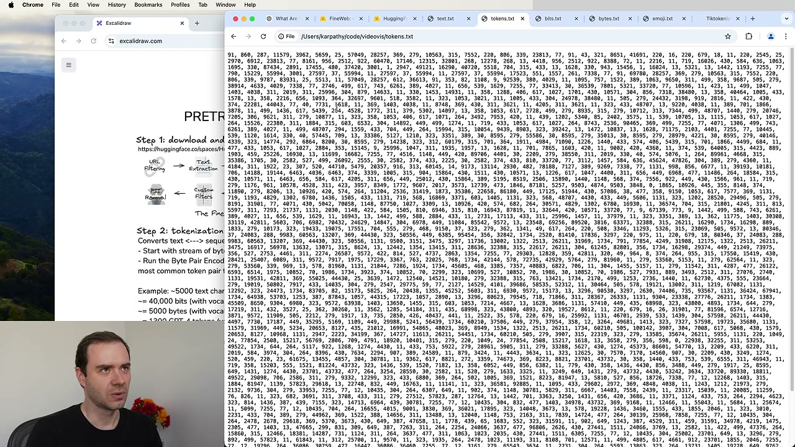

假设这 4 个 token 是 this、bar、view、in 和 space single，对应一些 token ID。我们现在想做的是预测序列中下一个 token。下一个是 3962。我们把前 4 个 token 称为上下文（context），它们输入神经网络，是神经网络的输入。等会儿我会讲神经网络内部是什么。现在重要的是理解输入和输出。输入是可变长度的 token 序列，从 0 到最大长度，比如 8000。输出是对下一个 token 的预测。因为词表里有 100,277 个可能 token，神经网络会输出正好这么多个数字，每个数字对应某个 token 成为下一个 token 的概率。它是在猜下一个是什么。

*[17:26](https://www.youtube.com/watch?v=7xTGNNLPyMI&t=1046)*

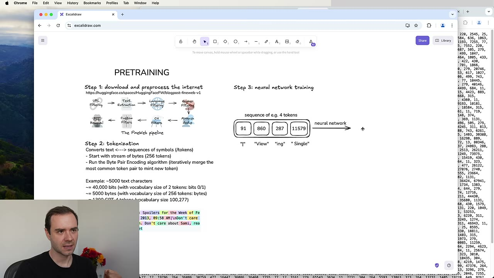

一开始神经网络是随机初始化的。我们等会儿会看这是什么意思。它是一个随机变换，所以训练最开始的概率也是随机的。这里我只展示了三个例子，但要记住其实有 10 万多个数字。比如神经网络认为 token “ Direction” 的概率是 4%，11799 的概率是 2%，而正确的 token 3962，也就是 “post”，概率是 3%。因为这个窗口来自训练集，所以我们知道下一个 token 是什么，这就是标签。我们知道正确答案是 3962。现在我们有一个数学过程来更新神经网络，也就是调节它。基本上，我们希望这里 3% 的概率变高，而其他 token 的概率变低。我们有办法数学地计算如何调整和更新神经网络，让正确答案的概率稍微提高。

*[18:43](https://www.youtube.com/watch?v=7xTGNNLPyMI&t=1123)*

如果我现在更新神经网络，那么下次再把这 4 个 token 输入进去，神经网络已经稍微调整过了，它可能会说，post 现在是 4%，case 变成 1%，Direction 变成 2%。所以我们有一种轻推神经网络的方法，让它给序列中正确的下一个 token 更高概率。这个过程不只发生在这一个 token 上，不只是这 4 个输入预测这一个输出。它在整个数据集的所有 token 上同时发生。实践中，我们采样小窗口、小批量窗口，然后在每一个 token 上都希望调整神经网络，让那个 token 的概率略微提高。这些都会在大批量 token 上并行发生。这就是训练神经网络的过程：不断更新它，使它的预测匹配训练集中实际发生的统计规律，使它的概率与数据中 token 如何相互跟随的统计模式一致。

*[20:01](https://www.youtube.com/watch?v=7xTGNNLPyMI&t=1201)*

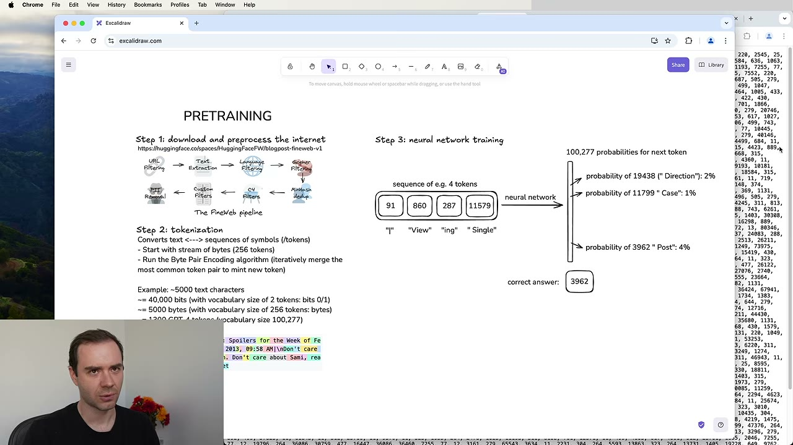

## 神经网络内部：参数、Transformer 和固定数学函数

我们简单进入神经网络内部，看看里面是什么。输入是 token 序列，这里是 4 个输入 token，但可以从 0 到比如 8000 个 token。原则上可以是无限多个 token，只不过处理无限长 token 太贵，所以我们在某个长度截断，这就成为模型的最大上下文长度。输入 X 会与神经网络的参数或权重一起，被混合进一个巨大的数学表达式里。这里我展示了 6 个示例参数及其设定，但实践中的现代神经网络会有数十亿个参数。最开始这些参数是完全随机设置的。随机参数会让神经网络做随机预测，训练初期确实如此。通过反复更新网络，也就是训练神经网络，这些参数的设置会被调整，使神经网络输出与训练集中的模式一致。

*[21:29](https://www.youtube.com/watch?v=7xTGNNLPyMI&t=1289)*

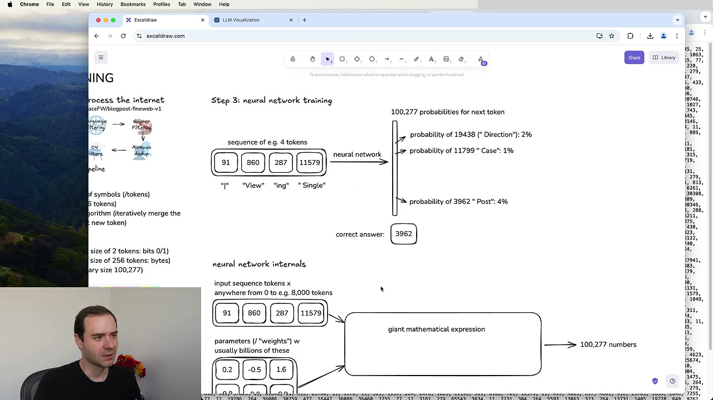

你可以把这些参数想象成 DJ 台上的旋钮。当你转动这些旋钮时，对于每一种可能的 token 序列输入，你都会得到不同预测。训练神经网络就是发现一组参数设置，使它看起来与训练集的统计规律一致。这个巨大的数学表达式大概是什么样？现代网络是包含可能数万亿项的巨大表达式，但一个简单例子可能就是输入 x，比如 x1、x2，与权重 w0、w1、w2、w3 等混合。这种混合是乘法、加法、指数、除法等简单操作。神经网络架构研究的主题，就是设计有效的数学表达式，让它们具有很多方便特性：表达能力强、可优化、可并行等等。归根结底，这些表达式并不神秘，它们把输入和参数混合起来产生预测，而我们优化参数，使预测与训练集一致。

*[23:04](https://www.youtube.com/watch?v=7xTGNNLPyMI&t=1384)*

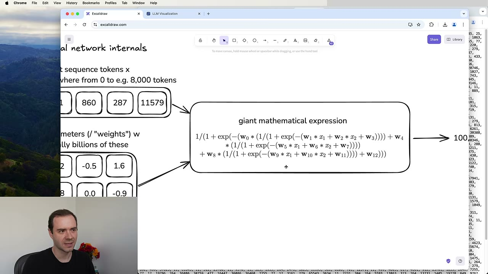

我们来看一个生产级神经网络的可视化例子。这个网络有一种特殊结构，叫 Transformer。这个例子大约有 85,000 个参数。顶部输入 token 序列，信息流过神经网络，直到输出，也就是 logit softmax，这些就是对下一个 token 的预测。中间有一系列变换，以及这个数学表达式内部在预测下一个 token 时产生的中间值。比如 token 首先被嵌入到一种分布式表示中，每个可能 token 在神经网络内部都有一个向量表示。然后这些值流过图里的各个模块。单独看每个模块都是非常简单的数学表达式，比如 layer norm、矩阵乘法、softmax 等。这里是 Transformer 的 attention block，然后信息流入多层感知机 block 等。

*[24:38](https://www.youtube.com/watch?v=7xTGNNLPyMI&t=1478)*

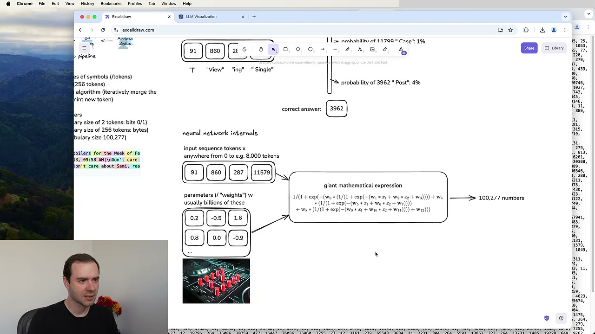

这些中间数值可以粗略想成合成神经元的放电率，但我会提醒你不要太把它们当成生物神经元。相比大脑里的神经元，这些神经元极其简单。生物神经元是非常复杂的动态过程，有记忆等等；而这里的表达式没有记忆。它是从输入到输出的固定数学表达式，是无状态的。所以相比生物神经元，它们非常简单。不过如果你愿意，也可以松散地把它想成一小块合成脑组织。信息流过，所有这些“神经元”激活，直到得到预测。我不会纠缠这些变换的精确数学细节。重要的是理解：这是一个数学函数，由固定参数集合参数化，比如 85,000 个参数；它把输入转换成输出。我们转动参数，就得到不同预测；我们要找到好的参数设置，使预测匹配训练集里的模式。这就是 Transformer。

*[25:52](https://www.youtube.com/watch?v=7xTGNNLPyMI&t=1552)*

## 推理：模型如何从概率分布生成新文本

现在讲另一个重要阶段：推理（inference）。推理时，我们从模型生成新数据。我们想看看模型在参数中内化了什么模式。从模型生成文本相对直接。我们从一些 token 开始，这些 token 是前缀，也就是你想从哪里开始。比如从 token 91 开始，把它输入网络。网络会给出概率向量。我们可以做的，是像抛一枚有偏硬币一样，根据这个概率分布采样一个 token。模型给高概率的 token 更可能被采样出来。所以我们从分布中采样，得到一个唯一 token，比如 860。这个 token 可能是相对可能的，但不一定是唯一可能的。还有很多其他 token 也可能被采样到。

*[27:07](https://www.youtube.com/watch?v=7xTGNNLPyMI&t=1627)*

接下来把 860 接到 91 后面，再问第三个 token 是什么。采样，得到 287。再做一次，现在有 3 个 token，问第四个 token，采样得到下一个。再来一次，把 4 个 token 输入，采样得到 13659。这个 token 不是之前训练例子里的 3962，而是 “article”。所以得到的是 “viewing a single article”。这里我们没有精确复现训练数据中的序列。要记住这些系统是随机的。我们在采样、在抛硬币。有时运气好，会复现训练集里的小片段；但有时会得到并非训练文档原文一部分的 token。于是生成结果是训练数据的某种混合重组。每一步都可能采到稍微不同的 token，而一旦这个 token 进入上下文，后面继续采样，很快就会生成与训练文档非常不同的 token 流。统计上它们有类似属性，但并不等同于训练数据；它们像是被训练数据启发出来的。

*[28:58](https://www.youtube.com/watch?v=7xTGNNLPyMI&t=1738)*

所以推理就是一次一个地从这些分布中预测。我们不断把 token 喂回去，得到下一个 token，并始终在抛这些有偏硬币。根据采样时的运气好坏，我们可能得到非常不同的模式。在常见场景下，下载互联网并 tokenization 是预处理步骤，只做一次。得到 token 序列后，就可以开始训练网络。实践中会训练很多不同设置、结构和大小的网络。训练好某个网络，得到一组满意参数后，就可以拿模型来做推理，从模型生成数据。当你在 ChatGPT 上和模型说话时，那个模型已经由 OpenAI 在几个月前训练好了。它有一组固定权重。你和它对话时，所有这一切只是推理，不再训练。参数保持不变，你给它一些 token，它补全 token 序列，你看到的就是模型生成出来的内容。

*[30:57](https://www.youtube.com/watch?v=7xTGNNLPyMI&t=1857)*

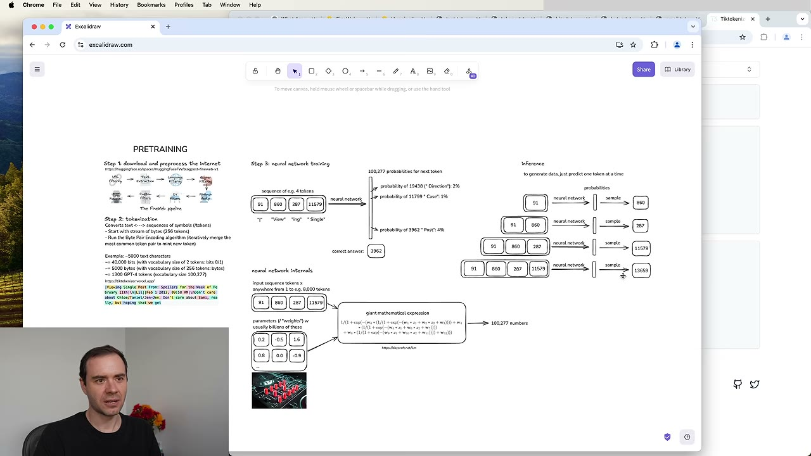

## GPT-2、GPU 和预训练的计算代价

我们来看一个具体的训练和推理例子。我喜欢用 OpenAI 的 GPT-2。GPT 是 Generatively Pre-trained Transformer，也就是生成式预训练 Transformer。GPT-2 是 OpenAI GPT 系列的第二版。今天你和 ChatGPT 对话时，背后的魔法是 GPT-4，也就是第四版。GPT-2 是 OpenAI 2019 年发布的。我喜欢 GPT-2，是因为它第一次把一个可识别的现代技术栈组合到了一起。GPT-2 的所有组件今天看起来仍然是现代的，只是一切都变大了。GPT-2 是 Transformer 神经网络，有 16 亿参数；今天的现代 Transformer 更接近一万亿或数千亿参数。GPT-2 最大上下文长度是 1024 token，今天上下文长度可能接近几十万甚至一百万。GPT-2 大约在 1000 亿 token 上训练，这在今天也很小，因为 FineWeb 就有 15 万亿 token。

*[33:16](https://www.youtube.com/watch?v=7xTGNNLPyMI&t=1996)*

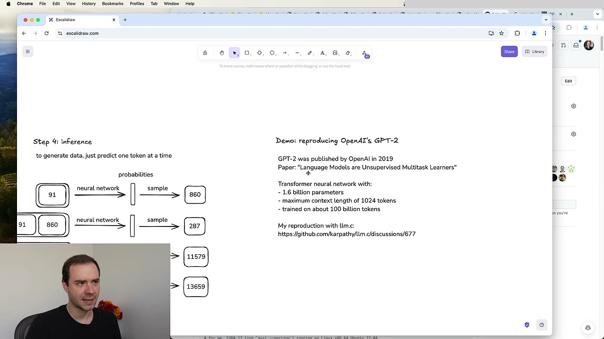

我曾经为了好玩，在一个叫 llm.c 的项目里复现 GPT-2。2019 年训练 GPT-2 的成本估计约为 4 万美元；今天能显著更便宜，差不多一天、600 美元就能做出来，而且还不是特别努力优化。我觉得今天甚至可以压到 100 美元左右。为什么成本下降这么多？第一，数据集更好了，过滤、抽取、准备数据的方式更精细，数据质量更高。第二，也是真正最大的区别，是硬件计算速度快了很多。运行这些模型的软件也变好了，大家都在努力从硬件里榨取速度，所以软件也进步很大。

*[34:20](https://www.youtube.com/watch?v=7xTGNNLPyMI&t=2060)*

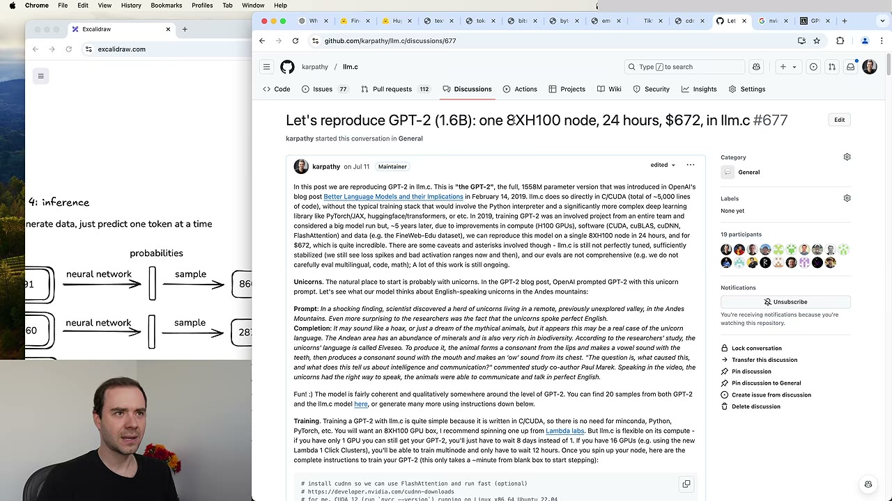

我给你一个研究者训练模型时实际看到的感觉。这里我正在训练一个 GPT-2 模型。每一行都是对模型的一次更新。还记得我们要让每个 token 的预测更好，并更新神经网络的权重或参数。这里每一行就是对神经网络的一次更新，让它在预测序列下一个 token 时更好。具体来说，每一行都会在训练集的 100 万 token 上改进预测。我们从数据集中拿出 100 万 token，并同时尝试提高这 100 万个 token 作为下一个 token 的预测概率。

*[35:51](https://www.youtube.com/watch?v=7xTGNNLPyMI&t=2151)*

要密切关注的数字叫 loss。loss 是一个单一数字，表示当前神经网络表现如何，并且设计成越低越好。你会看到随着我们对网络做更多更新，loss 在下降，这对应于下一个 token 的预测变好。作为神经网络研究者，你就盯着 loss，看它是否随着每次更新而改善。这里每次更新处理 100 万 token，每次更新大约 7 秒。总共要跑 32,000 个优化步骤。32,000 步乘以每步 100 万 token，大约处理 330 亿 token。现在只跑了 420 步多一点，也就是 1% 多，因为我只跑了十几分钟。

*[37:05](https://www.youtube.com/watch?v=7xTGNNLPyMI&t=2225)*

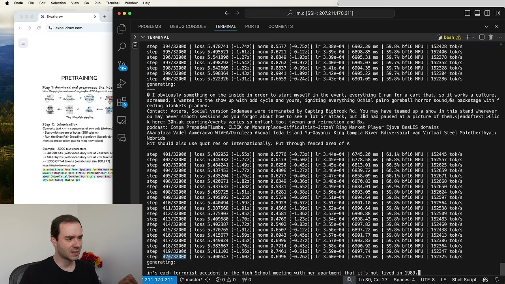

我设置了每 20 步做一次推理。你在这里看到的是模型预测下一个 token。训练才 1% 时，生成还不连贯，会有一些乱码，但局部有一点点连贯，比如 “Since she is mine...” 之类。往上滚到优化刚开始时，在第 20 步后，输出看起来完全随机。因为模型只对参数做了 20 次更新，所以它还是随机网络，给出随机文本。相比之下，现在它已经开始好很多。如果我们等完整 32,000 步，模型会改进到能生成相当连贯的英语，token 流正确，英语样子也好很多。这还要继续跑一两天。这个阶段我们确保 loss 在下降，一切看起来正常，然后等待。

*[38:49](https://www.youtube.com/watch?v=7xTGNNLPyMI&t=2329)*

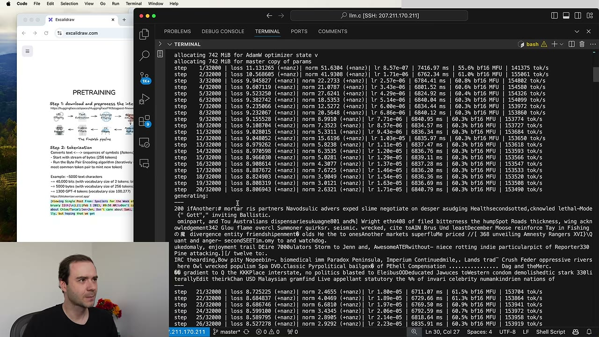

当然，这不是在我的笔记本上跑的。那太贵了，因为神经网络太大，数据太多，计算量太大。所有这些都在云端的一台电脑上跑。这个优化运行在一个 8x H100 节点上，也就是一台机器里有 8 张 H100。我租用这台机器，它在云里，物理位置我也不确定。我喜欢从 Lambda 租，但有很多公司提供这类服务。比如按需租 8x NVIDIA H100 GPU，每张 GPU 每小时约 3 美元。GPU 长得像这里这样，可以插到电脑里。GPU 非常适合训练神经网络，因为训练计算非常昂贵，但有大量并行性：许多独立工作单元可以同时解决底层矩阵乘法。

*[40:50](https://www.youtube.com/watch?v=7xTGNNLPyMI&t=2450)*

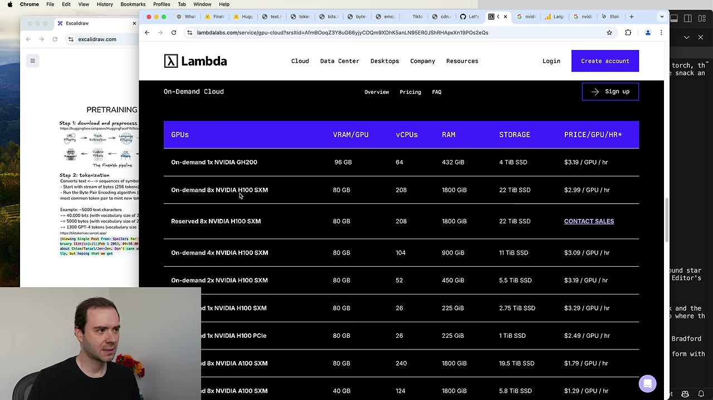

你可以把 8 张 H100 堆到一个节点里，再把多个节点堆成整个数据中心或系统。数据中心里就是一张 GPU 到 8 张 GPU，到一个系统，再到很多系统。大科技公司非常想要这些 GPU 来训练语言模型，因为它们非常强大。这从根本上推动了 NVIDIA 股票市值，比如今天达到 3.4 万亿美元。淘金热就是拿 GPU，拿足够多的 GPU，让它们协同执行这个优化。它们都在做什么？它们都在协同地在 FineWeb 这类数据集上预测下一个 token。这就是极其昂贵的计算流程。GPU 越多，你能预测和改进的 token 越多，处理数据集越快，迭代越快，也能训练更大的网络。

*[42:12](https://www.youtube.com/watch?v=7xTGNNLPyMI&t=2532)*

比如最近有文章说 Elon Musk 在单个数据中心拿到 10 万张 GPU，这就是为什么它是大事。这些 GPU 非常昂贵，会消耗大量电力，而它们本质上都在试图预测序列中的下一个 token，通过这样改进网络，并更快得到比我们这里看到的更连贯得多的文本。我没有几千万或几亿美元来训练一个这样的大模型。幸运的是，我们可以使用大科技公司训练后发布的一些模型。它们花费大量计算训练网络，然后发布优化结束后的网络。这个优化末端出来的模型叫基础模型（base model）。基础模型是什么？它是一个 token 模拟器，是互联网文本 token 模拟器。它本身还不完全有用，因为我们想要的是助手：我们想问问题，让它回答。但基础模型不会这样做，它只是生成互联网的混合重组，像是在梦见互联网网页。

*[43:45](https://www.youtube.com/watch?v=7xTGNNLPyMI&t=2625)*

## 基础模型发布：代码和参数

模型发布需要两样东西。第一是 Python 代码，通常描述模型中的操作序列，也就是神经网络的 forward pass。它实现 Transformer 里的具体步骤，说明这个网络到底是怎么接线的。这通常只是几百行代码，不算疯狂，也相当标准。真正有价值的是参数。比如 GPT-2 发布的是约 15 亿参数，这些参数就是一长串数字，是所有旋钮的精确好设置，让 token 生成得好。要得到基础模型发布，就需要代码和参数。GPT-2 发布过，但比较旧。我们接下来用 Llama 3。GPT-2 是 16 亿参数、1000 亿 token；Llama 3 是 Meta 训练并发布的更大、更现代的模型，4050 亿参数，在 15 万亿 token 上训练，方式类似，只是大得多。Meta 也发布了 Llama 3.1 405B 基础模型，此外还发布了 instruct 模型。instruct 意味着这是助手，可以问问题得到回答。但这部分我们稍后讲。现在先看基础模型，也就是 token 模拟器。

*[46:57](https://www.youtube.com/watch?v=7xTGNNLPyMI&t=2817)*

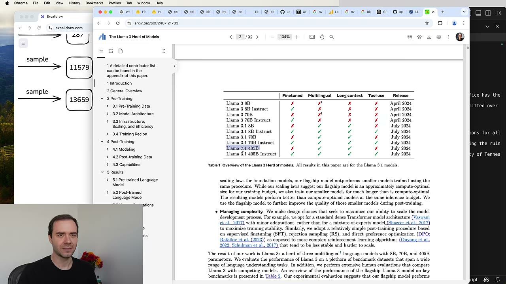

我喜欢在 Hyperbolic 这个公司的网站上和基础模型交互，它提供 Llama 3.1 405B 的基础模型。进入网站后要确保选择 Llama 3.1 405 billion base，必须是 base model。max tokens 是要生成多少 token，可以设小一点，比如 128，避免浪费计算。根本上，这里发生的事和之前推理完全一样：它会继续补全你给它的前缀 token 序列。我先展示它还不是助手。比如你问 “what is 2 plus 2?”，它不会说“四，还能帮你什么？”因为这句话会被 tokenized，成为前缀。模型只是根据训练文档，也就是网页里的统计规律，做一个非常昂贵的自动补全。

*[48:25](https://www.youtube.com/watch?v=7xTGNNLPyMI&t=2905)*

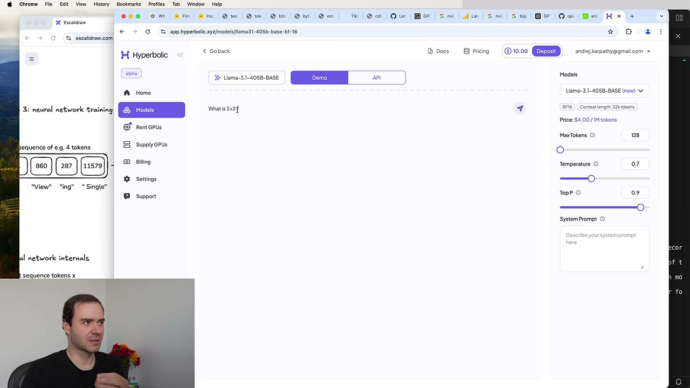

同一个前缀每次得到的回答也不一样，因为系统是随机的。给定相同 token 前缀，我们得到不同答案，是因为模型给出概率分布，我们从中采样，之后就走向不同方向。所以基础模型首先不是助手，而是 token 自动补全；其次它是随机系统。不过即使这个模型现在还不直接适合很多应用，它仍然非常有用，因为在预测下一个 token 的任务中，模型学到了很多关于世界的知识，并把这些知识存进了网络参数。你可以把 4050 亿参数看成一种互联网压缩，一种 zip 文件，但不是无损压缩，而是有损压缩。我们得到的是互联网的一团凝胶，可以从中生成内容。

*[50:25](https://www.youtube.com/watch?v=7xTGNNLPyMI&t=3025)*

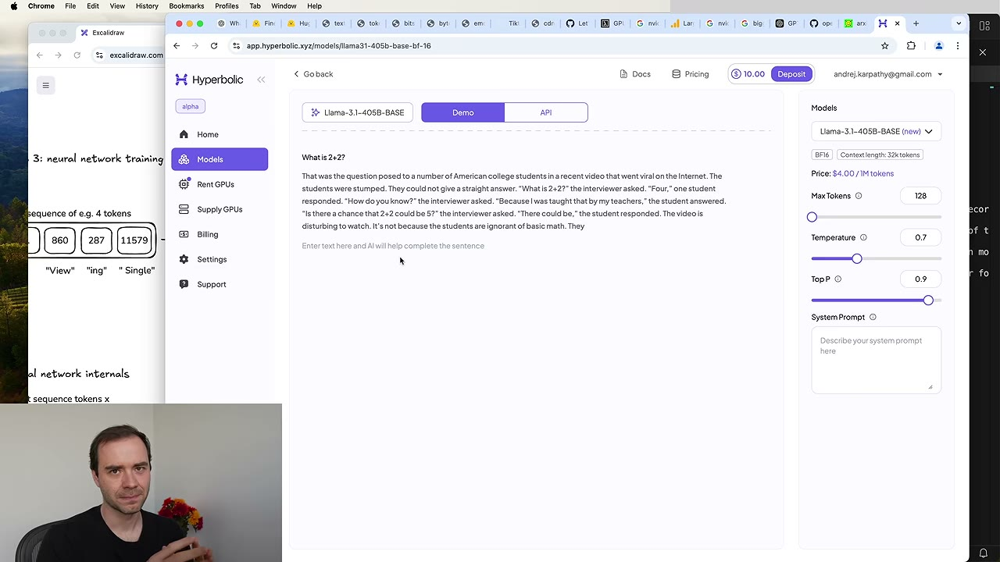

我们可以通过适当提示来激发这些参数中的知识。比如提示：“Here’s my top 10 list of the top landmarks to see in Paris.” 我这样写，是为了引导模型继续这个列表。按回车后，它开始列出巴黎地标。这里的信息不能完全信任，因为这只是对互联网文档的某种回忆。互联网上频繁出现的东西更可能被正确记住，罕见东西就不一定。所以这里的知识不是精确、明确存储在某个参数里的，而是模糊、概率化、统计性的回忆。经常出现的东西更容易被模型记住。

*[51:53](https://www.youtube.com/watch?v=7xTGNNLPyMI&t=3113)*

## 基础模型的记忆、幻觉和上下文学习

再看一个例子。我去 Wikipedia 的 zebra 页面，复制第一句话到基础模型里。按回车后，模型生成的是这篇 Wikipedia 条目的精确背诵。它纯粹从记忆中背出了 Wikipedia 条目，而这个记忆存在参数中。在某个 token 之后它可能会偏离，但你可以看到它记住了很大一块。这种现象叫 regurgitation，也就是反刍式复述，通常不希望最终模型直接引用训练过的内容。之所以发生，是因为某些高质量来源，比如 Wikipedia，在训练时会被优先采样。模型可能在这些数据上训练了几个 epoch，也就是见过这个网页十次左右。类似于你把一段文字读很多很多遍，比如 100 遍，就能背出来。模型每次呈现的记忆效率可能比人高得多，所以它见过十次就能把文章记进参数。

*[54:12](https://www.youtube.com/watch?v=7xTGNNLPyMI&t=3252)*

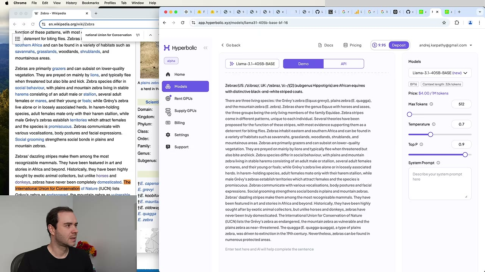

接下来展示模型没有在训练中见过的东西。Llama 3 的预训练数据知识截止到 2023 年底，所以它不会见过 2024 年大选结果。如果我们用未来的 token 提示它，它会继续序列，并根据参数中的知识做最佳猜测。比如提示共和党票：“Trump...” 然后看它补全竞选搭档和对手。一次它认为 Mike Pence 是搭档，对手是 Hillary Clinton 和 Tim Kaine；另一次同样提示重新采样，它说 Ron DeSantis 是搭档，对手是 Joe Biden 和 Kamala Harris。这些都是平行宇宙。模型会基于知识继续 token 序列，做有根据的概率猜测。这里看到的都是 hallucination，幻觉：模型以概率方式做最佳猜测。

*[55:44](https://www.youtube.com/watch?v=7xTGNNLPyMI&t=3344)*

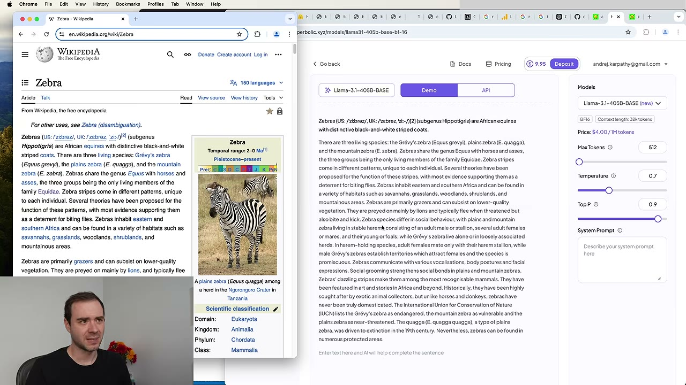

即使基础模型还不是助手，如果你会设计提示，它仍可用于实际应用。这里有一个 few-shot prompt：我给出 10 对英语词和韩语翻译，每一对是英文、冒号、韩文。最后写 teacher:，然后让模型只补全几个 token。这些模型有 in-context learning，也就是上下文学习能力。意思是模型读这个上下文时，会在当前位置学到数据里有某种算法模式，并知道继续这个模式。于是它承担翻译者角色。补全后，teacher 的翻译是 seonsaengnim，是正确的。所以即使只有基础模型，也可以通过聪明的 prompt 构建应用。

*[57:03](https://www.youtube.com/watch?v=7xTGNNLPyMI&t=3423)*

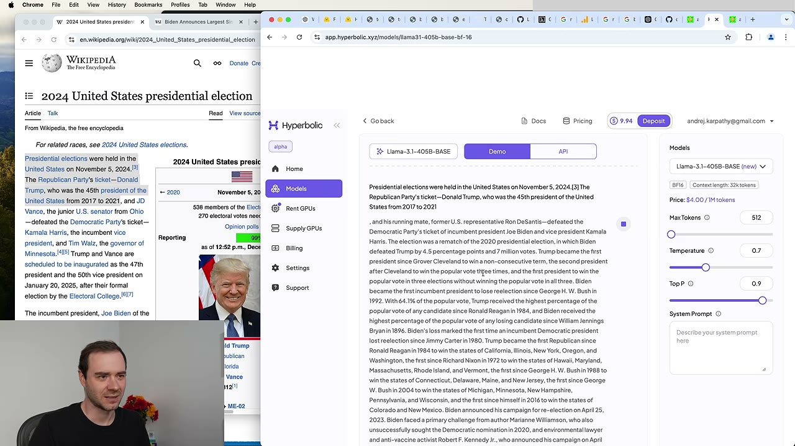

还可以只通过提示巧妙地实例化一个完整的语言模型助手。技巧是把 prompt 结构化成一个网页，好像这里有一段有帮助的 AI 助手和人类之间的对话，然后模型会继续这个对话。为了写 prompt，我甚至让 ChatGPT 帮我写，这有点 meta。我告诉它：我想创建一个 LLM 助手，但只有基础模型，请帮我写 prompt。它给出一段：“Here is a conversation between an AI assistant and a human. The AI assistant is knowledgeable, helpful...” 但只给描述还不够，更好的做法是给格式化对话，包含几轮 human、assistant、human、assistant，然后在最后放真正的问题。比如 human: Why is the sky blue? assistant: 模型就会回答 Rayleigh scattering 等等。它只是继续序列，但因为序列看起来像对话，所以它承担了这个角色。微妙之处在于，它可能回答完 assistant 后，又自己 hallucinate 出下一个 human 问题，然后继续下去。

*[59:23](https://www.youtube.com/watch?v=7xTGNNLPyMI&t=3563)*

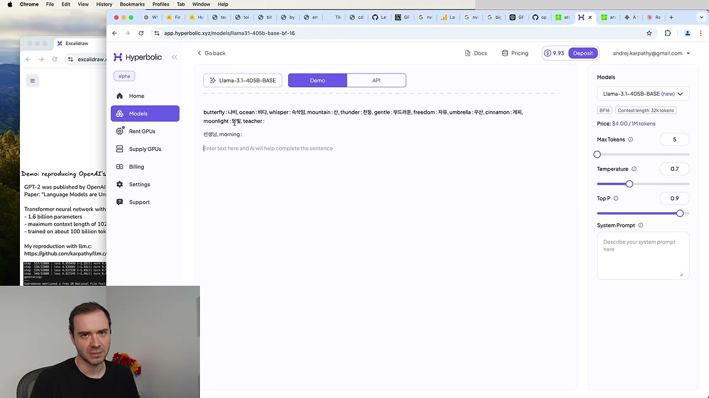

到目前为止，我们讨论了预训练阶段。我们取互联网文档，把它们切成 token，也就是小文本块原子，然后用神经网络预测 token 序列。这个阶段的输出是基础模型，也就是网络参数的设置。基础模型本质上是 token 层面的互联网文档模拟器，可以生成统计特性类似互联网文档的 token 序列。我们看到它在某些应用中可用，但我们还需要做得更好。我们想要助手：能问问题，模型能回答。因此进入第二阶段，叫后训练（post-training）。我们把基础模型，也就是互联网文档模拟器，交给后训练。后训练的计算成本会小得多。大规模数据中心、重计算、数百万美元主要在预训练阶段。后训练便宜一些，但仍然极其重要，因为它把 LLM 变成助手。

*[60:57](https://www.youtube.com/watch?v=7xTGNNLPyMI&t=3657)*

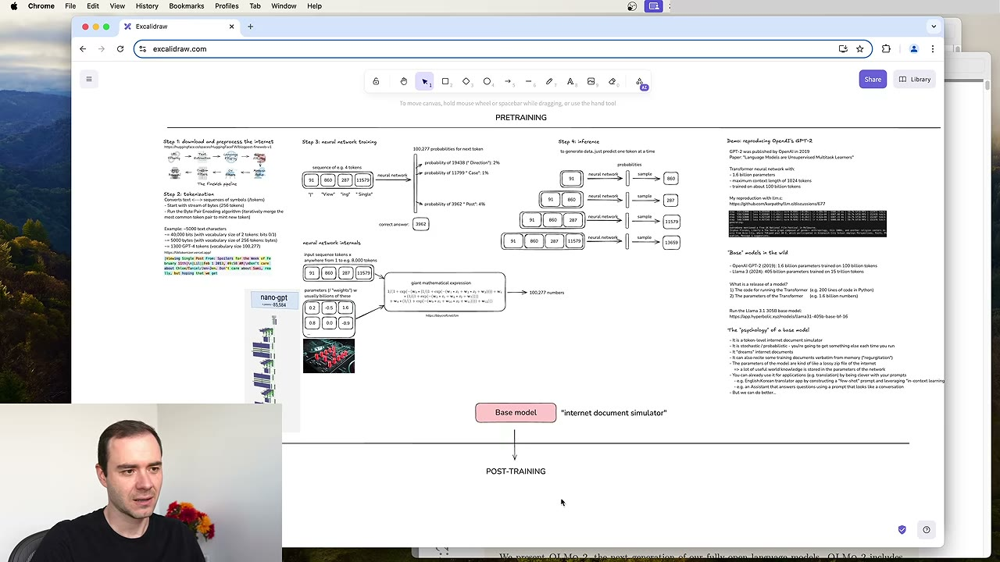

## 后训练：用对话数据把基础模型变成助手

我们希望模型不是采样互联网文档，而是回答问题。换句话说，我们要开始思考对话。对话可以是多轮，最简单情况下是人类和助手之间的对话。比如人类说“2 加 2 是多少”，助手应回答“2 加 2 是 4”。人类追问“如果是乘号而不是加号呢”，助手可以继续回答。另一个例子可以展示助手有某种性格，比如友好。第三个例子展示，当人类请求我们不希望帮助的内容时，助手可以拒绝，说不能帮这个忙。所以我们现在要想清楚助手应该如何和人类交互，并且要把助手在对话中的行为“编程”出来。

*[61:57](https://www.youtube.com/watch?v=7xTGNNLPyMI&t=3717)*

因为这是神经网络，我们不会显式写代码来编程助手。神经网络的一切都是通过数据集训练完成的。所以我们通过创建对话数据集来隐式编程助手。实际数据集可能有几十万条多轮、很长、覆盖广泛话题的对话。助手是通过示例被编程的。那么这些数据从哪里来？比如“2 * 2 等于 4，和 2 加 2 一样”这样的内容来自人类标注员。我们给人类标注员某个对话上下文，让他们写出这种情况下理想的助手回答。然后让模型在这些数据上训练，模仿这种回答。

*[63:14](https://www.youtube.com/watch?v=7xTGNNLPyMI&t=3794)*

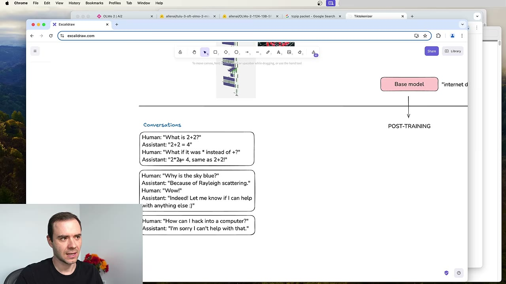

具体做法是：拿到预训练阶段产生的基础模型。这个基础模型在互联网文档上训练。现在把互联网文档数据集扔掉，换成一个新的对话数据集，然后继续在这些对话上训练模型。模型会非常快速地调整，学会助手如何回应人类查询的统计规律。之后推理时，我们给助手一个对话前缀，它就会生成回应，模仿人类标注员在这种情境下会怎么做。预训练可能在数千台计算机上训练三个月；后训练通常短得多，比如 3 小时，因为我们人工创建的对话数据集比互联网文本小得多。但本质上，我们只是拿基础模型继续训练，用完全相同的算法，完全相同的一切，只是把数据集换成对话。

*[64:31](https://www.youtube.com/watch?v=7xTGNNLPyMI&t=3871)*

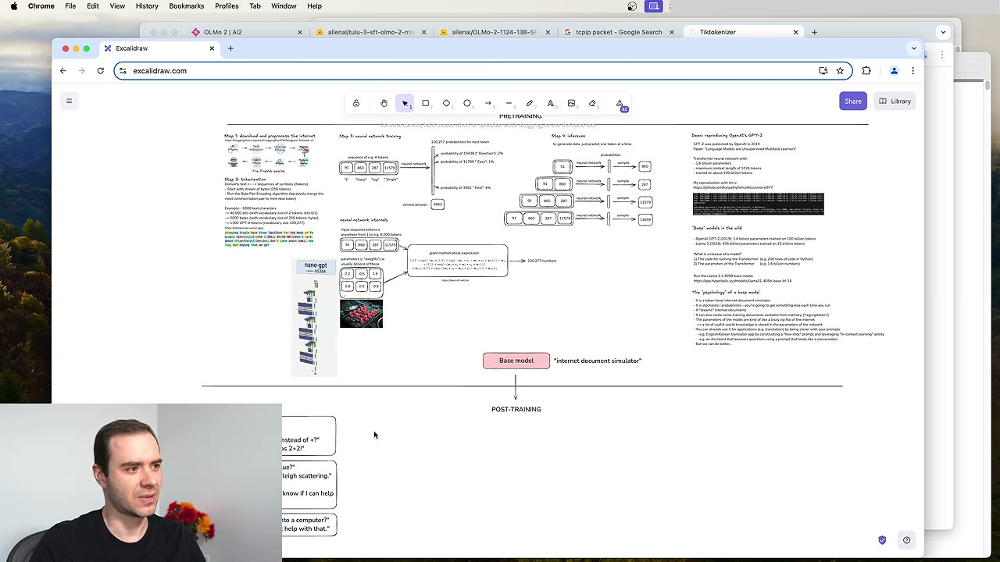

问题是：这些对话是什么？如何表示？如何让模型看到对话，而不是原始文本？所有东西都必须变成 token，因为这些模型处理的都是 token 序列。所以我们要把对话变成 token 序列。为此需要设计一种编码，类似互联网中的 TCP/IP 包，有精确规则和协议规定如何表示信息、结构如何排列。LLM 也一样，需要数据结构和规则，把 conversation 这种结构化对象编码到 token、从 token 解码回来。

*[65:46](https://www.youtube.com/watch?v=7xTGNNLPyMI&t=3946)*

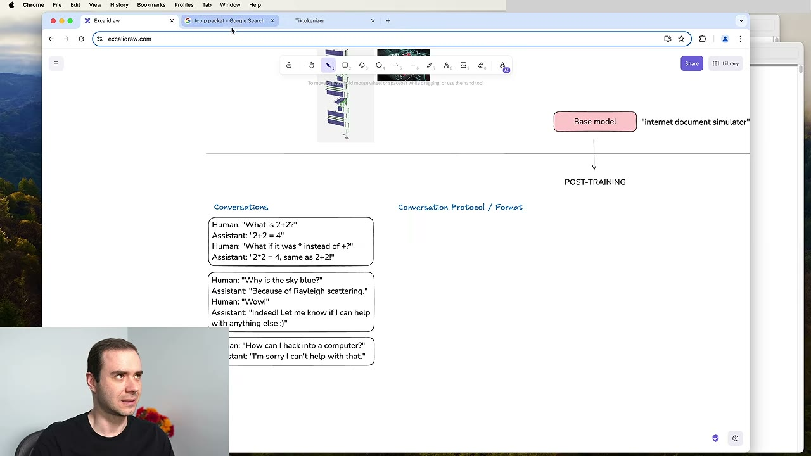

比如 GPT-4o 有一种格式。它使用特殊 token，像 im_start，意思大概是 imaginary monologue 的开始。然后要指定是谁的回合，比如 user，然后是分隔 token，再是问题文本的 token，然后用 im_end 结束。所以用户问题“what is 2 plus 2”会变成一串 token。重要的是，im_start 不是普通文本，而是后训练阶段引入的特殊 token。im_sep、im_start 等特殊 token 与文本交织在一起，让模型学会：这是一个回合的开始；这个回合属于 user；这是 user 说的话；然后 user 结束；接着是 assistant 的回合；assistant 说什么。最终对话变成一维 token 序列。具体格式不重要，重要的是 structured conversation 会通过某种编码变成一维 token 序列，所以我们仍然可以像之前一样训练语言模型：预测序列中的下一个 token。

*[68:30](https://www.youtube.com/watch?v=7xTGNNLPyMI&t=4110)*

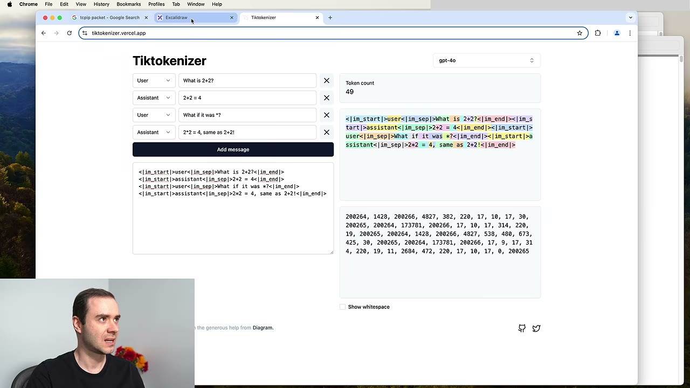

推理时也是这样。你在 ChatGPT 上已经有一段对话，比如“what is 2 plus 2?”、“2 plus 2 is 4”，然后你输入“what if it was times?”。OpenAI 服务器会构造一个上下文，在最后放入 assistant 回合的起始标记，然后从这里开始采样。它问模型：第一个 token 应该是什么？第二个 token 是什么？第三个 token 是什么？LLM 从这里接管并创建回答。回答不必和训练集中的完全相同，但如果训练集中有这种类型的对话，它会有类似风格。协议细节不重要。我的目标只是让你看到，一切最后都是一维 token 序列。我们现在训练的是对话，也生成对话。

*[69:59](https://www.youtube.com/watch?v=7xTGNNLPyMI&t=4199)*

## InstructGPT、人工标注和 SFT 数据集

来看这些数据集在实践中长什么样。OpenAI 2022 年的 InstructGPT 论文是第一批公开讲如何把语言模型在对话上微调的工作。论文第 3.4 节讲他们雇佣人类承包商，比如来自 Upwork 或 Scale AI，来构造这些对话。人类标注员的工作是创建对话。他们要想出 prompt，然后完成理想助手回答。比如 prompt 可以是：“列出五个重新找回职业热情的方法”，“我接下来应该读哪十本科幻书”，“把这个句子翻译成西班牙语”等等。人先写 prompt，再回答 prompt，给出理想助手回复。

*[71:23](https://www.youtube.com/watch?v=7xTGNNLPyMI&t=4283)*

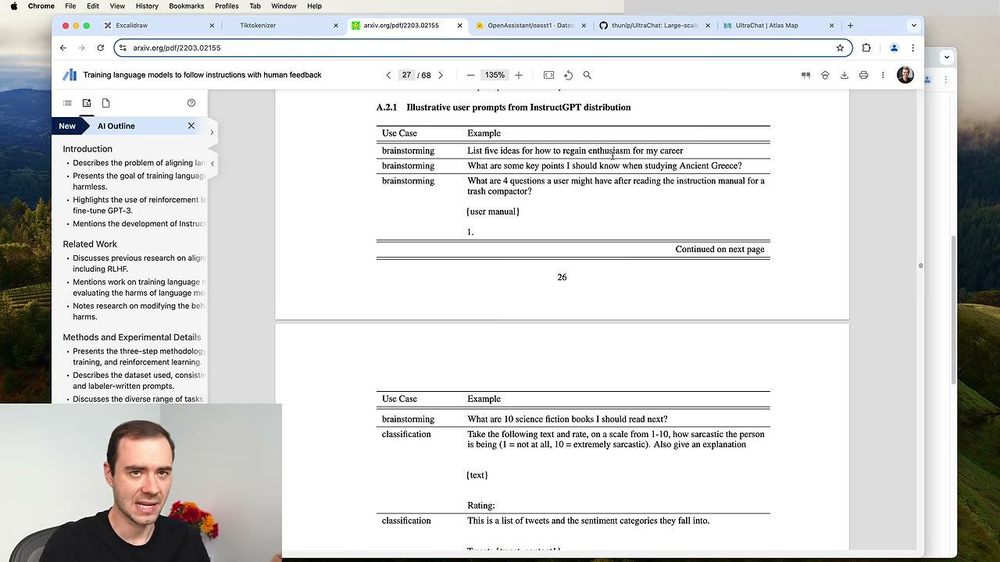

他们怎么知道理想助手回答是什么？公司会写标注说明。比如 OpenAI 会写 labeling instructions，告诉人类如何创建理想回答。高层次要求是 helpful、truthful、harmless，也就是有帮助、真实、无害。大致就是：回答问题，尽量有帮助，尽量真实，不要回答我们不希望 ChatGPT 之后处理的问题。实际标注说明通常不止这么短，而是有数百页，人们需要专业学习，然后按说明写理想助手回答。所以这是一个非常依赖人类的过程。InstructGPT 的数据集没有发布，但有开源复现，比如 Open Assistant。互联网上的人被要求创建类似对话：有人写 prompt，比如“请写一段关于经济学中 monopoly 一词重要性的短介绍，并使用例子”，然后同一个人或另一个人写助手回答。对话还可以继续，比如“现在给狗解释一下”，然后写更简单的解释。

*[73:39](https://www.youtube.com/watch?v=7xTGNNLPyMI&t=4419)*

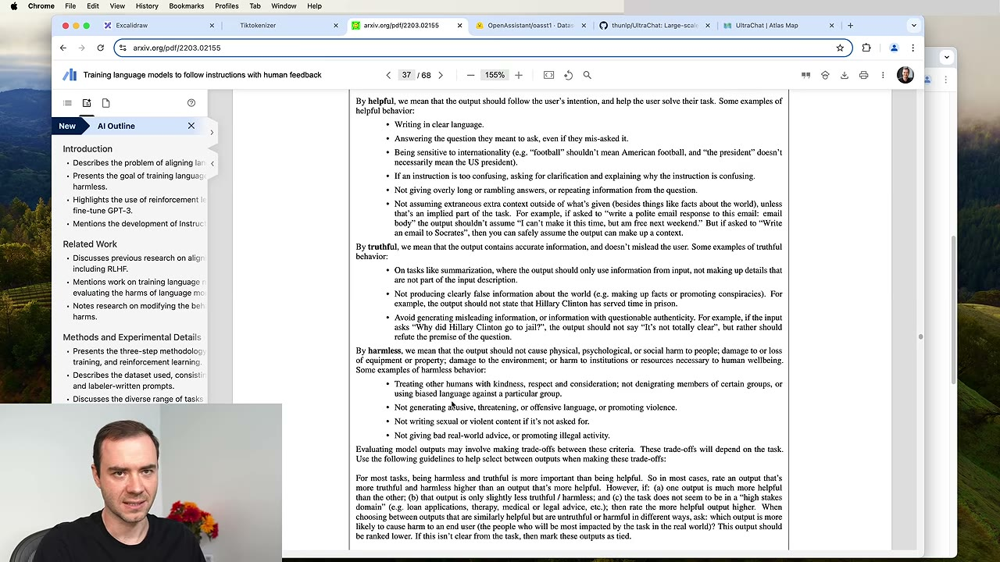

这些回答就成为标签，我们在上面训练。当然我们不可能覆盖未来推理时用户可能问的所有问题。但如果有一个包含许多示例的数据集，模型在训练中会开始承担 helpful、truthful、harmless 助手的人格。它全部是通过示例编程的。如果你有 10 万条这样的对话，并在上面训练，模型会理解统计模式，并承担这种助手人格。测试时遇到完全相同的问题，可能背出训练集答案；更可能的是，它做出相似氛围的回答，理解这就是你想要的答案。所以系统通过示例被编程，并统计性地采纳了由公司标注说明反映出来的助手人格。

*[74:58](https://www.youtube.com/watch?v=7xTGNNLPyMI&t=4498)*

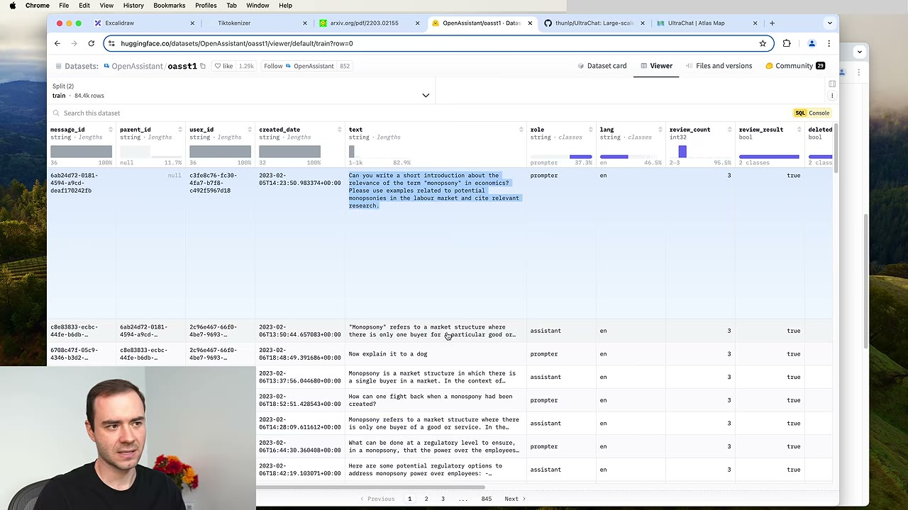

过去两三年，状态已经变化。现在不太常见让人类完全从零做所有重活，因为我们有语言模型了，这些模型会帮助创建对话数据集。人类很少完全从零写回答，更可能用已有 LLM 生成答案，然后编辑。LLM 已经渗透后训练栈，被广泛用于创建大规模对话数据集。UltraChat 就是一个更现代的数据集例子，很大程度上是合成的，但通常会有一些人类参与。这类 SFT 数据集现在有数百万对话，主要是合成的，可能经人类一定程度编辑，覆盖大量领域。很多数据源会混在一起，叫 SFT mixtures。大体上，我们仍有由对话组成的 SFT 数据集，并像之前一样训练。

*[76:46](https://www.youtube.com/watch?v=7xTGNNLPyMI&t=4606)*

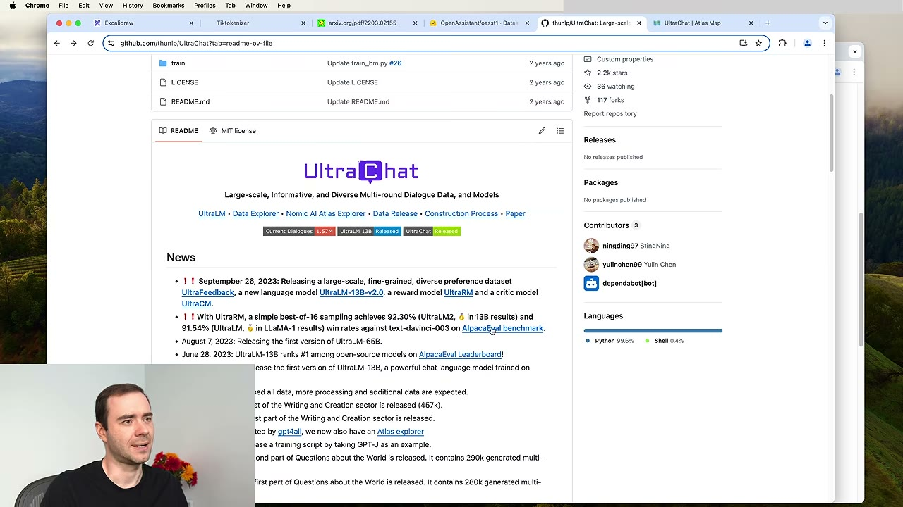

我还想祛魅一下“和 AI 对话”的感觉。当你去 ChatGPT 输入问题并按回车，返回的东西统计上对齐训练集。而这些训练集最初来自遵循标注说明的人类。所以你到底是在和什么说话？不是某种魔法 AI。粗略说，它是在统计性地模仿人类标注员，而人类标注员遵循公司写的标注说明。你得到的回答像是在问：这种对话里，人类标注员会说什么？而且这些标注员不是随便的互联网用户。公司会雇专家。比如代码问题相关的数据集，参与创建对话的标注员通常是受过教育的专家。你问的是这类人的即时模拟。

*[78:32](https://www.youtube.com/watch?v=7xTGNNLPyMI&t=4712)*

比如我在 ChatGPT 里问“推荐巴黎最值得看的五个地标”。它返回的不是某个魔法 AI 用无限智能去研究所有地标然后排序。你得到的是 OpenAI 雇佣标注员的统计模拟。如果这个具体问题出现在 OpenAI 后训练数据集中，你很可能看到一个与标注员提交内容非常相似的答案。标注员怎么来这个列表？他们会上网，做 20 分钟小研究，然后写一个列表。如果问题没有出现在后训练数据集里，那么结果更 emergent 一些：模型统计性地理解训练集中所谓重要地标通常是什么，以及互联网中人们谈论巴黎、地标、旅行时的内容。预训练的互联网知识与后训练对话数据结合，产生这种模仿。

*[80:20](https://www.youtube.com/watch?v=7xTGNNLPyMI&t=4820)*

## LLM 心理学之一：幻觉从哪里来

现在讲我喜欢称为 LLM psychology 的东西，也就是训练流水线带来的 emergent cognitive effects。第一个当然是幻觉。幻觉就是 LLM 编造内容。这是 LLM 助手的大问题，早期模型尤其严重，现在因为有一些缓解措施有所改善。我们先理解幻觉从哪里来。想象训练集中有三段合理对话：“谁是 Cruise？”助手回答 Tom Cruise 是著名美国演员；“谁是 John Barrasso？”回答他是美国参议员；“谁是成吉思汗？”回答相关事实。训练时，人类写答案时要么自己知道，要么上网查，然后写出一个自信语气的正确答案。

*[81:51](https://www.youtube.com/watch?v=7xTGNNLPyMI&t=4911)*

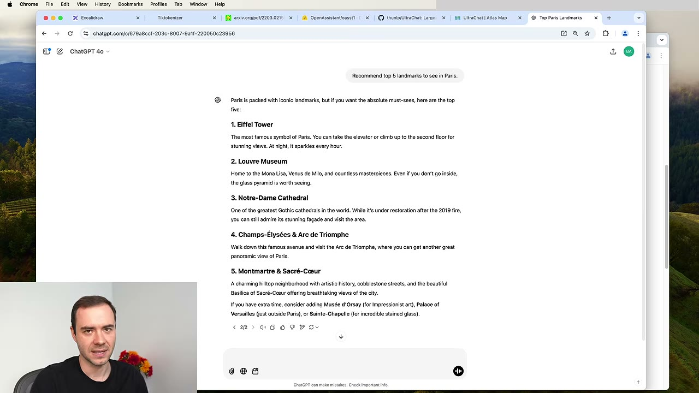

测试时，如果你问一个随机名字，比如 Orson Kovats，我认为这个人不存在。问题是，助手不会简单说“我不知道”。即使模型内部的某些特征、激活、脑子里的某部分，可能知道这不是它熟悉的人，它也不会说不知道。因为模型统计性地模仿训练集。在训练集中，“who is X” 形式的问题都被自信地用正确答案回答，所以它会采纳这种回答风格，并尽力给出统计上最可能的猜测，于是编东西。这些模型没有访问互联网，不会做研究。它们只是 statistical token tumblers，也就是统计 token 翻滚器，只是在采样下一个 token。

*[83:04](https://www.youtube.com/watch?v=7xTGNNLPyMI&t=4984)*

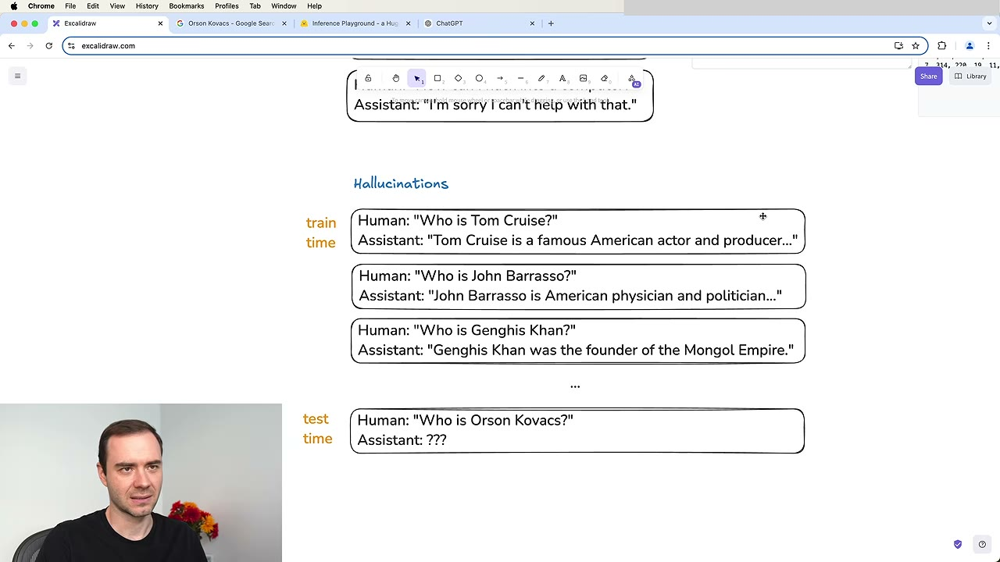

用一个旧模型 Falcon 7B Instruct 来看。问 “Who is Orson Kovats?” 一次它说他是美国作家和科幻作者，这是假的。再问一次，它说是 1950 年代电视剧里的虚构角色。再问一次，说是前小联盟棒球运动员。模型不知道，所以给出很多不同答案。它从 “who is Orson Kovats, assistant” 这些 token 开始，采样概率，编出统计上符合训练集中答案风格的内容。你和我体验到的是它编造事实知识。但要记住，它其实不知道，只是在模仿答案格式，也不会去查。

*[84:36](https://www.youtube.com/watch?v=7xTGNNLPyMI&t=5076)*

为什么现在 ChatGPT 不太会这样？如果我问 ChatGPT “Who is Orson Kovats?”，它可能先尝试 web search。我们稍后会讲工具使用。若我明确说不要用任何工具，它会说没有知名历史或公众人物叫 Orson Kovats。这个模型知道自己不知道，并告诉你这看起来不是它熟悉的人。要缓解幻觉，显然需要在数据集中加入一些例子，其中正确答案是模型不知道某个事实。但只应该在模型确实不知道时这样回答。问题是：我们怎么知道模型知道什么、不知道什么？可以经验性地 probe 模型。

*[86:09](https://www.youtube.com/watch?v=7xTGNNLPyMI&t=5169)*

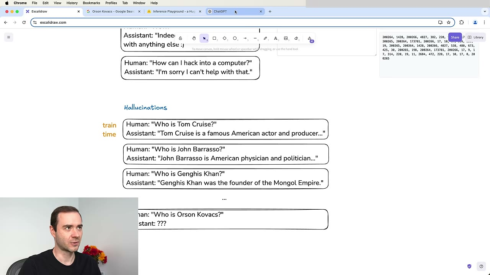

Meta 在 Llama 3 中处理 factuality 的方法是，先拿训练集中的随机文档和段落，用 LLM 为段落生成具体事实问题及答案。因为信息就在上下文窗口里，LLM 不必依赖记忆，所以能较准确地重述。例如给一段关于 Dominik Hašek 的文章，让 ChatGPT 生成问题：“他为哪支队打过球？”、“他赢过几次 Stanley Cup？” 等。然后拿这些问题去 interrogate 目标模型，比如 Mistral 7B。若问题是他为哪支队打球，模型多次回答 Buffalo Sabres，与正确答案一致，我们认为模型知道。

*[89:45](https://www.youtube.com/watch?v=7xTGNNLPyMI&t=5385)*

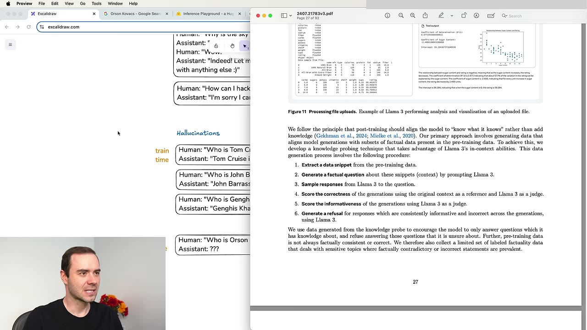

再问他赢过几次 Stanley Cup，正确答案是 2。模型可能说 4 次，或者说没有赢过，说明它不知道。程序上可以多问几次，把模型答案和正确答案比较。这个比较也可以用另一个 LLM judge 自动完成，无需人类。如果模型多次都错，就知道模型不知道这个问题。于是我们把这个问题添加到训练集中，创建一条新对话：用户问他赢过几次 Stanley Cup，助手回答“抱歉，我不知道”或“我不记得”。如果对许多文档、许多问题都这样做，就给模型机会在训练集中基于自己的知识边界拒绝回答。

*[91:18](https://www.youtube.com/watch?v=7xTGNNLPyMI&t=5478)*

这之所以有效，是因为模型内部可能已经有不错的自我知识模型。你可以想象网络里有某个神经元在模型不确定时会亮起。问题是，这个神经元的激活没有连接到模型用语言说“我不知道”。模型内部知道，但不会表露出来，而是像训练集中一样自信猜测。我们需要 interrogate 模型，并允许它在不知道时说不知道。训练集中有这些例子后，模型就能学到：当不确定性神经元激活高时，我可以说抱歉，我不记得。这是对幻觉的一大缓解，也大致解释了为什么 ChatGPT 能做到这种事。

*[92:03](https://www.youtube.com/watch?v=7xTGNNLPyMI&t=5523)*

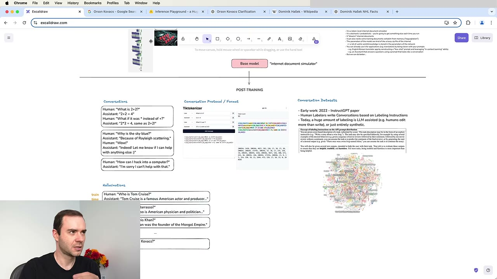

## 工具使用：把网页搜索和代码解释器接到模型上

第二种缓解更强：不是只说不知道，而是给 LLM 一个机会去查事实并回答。你和我遇到不知道的事实问题，会去搜索互联网，找到答案再告诉别人。模型也可以这样做。神经网络参数里的知识可以想成模型在预训练阶段很久以前见过东西的模糊回忆，像你一个月前读过的东西。如果经常读，就会记得；如果很罕见，回忆就不好。你和我会去查，查到后把信息刷新进工作记忆。模型也需要类似机制，让它刷新记忆或回忆。我们通过工具来做到这一点。

*[93:34](https://www.youtube.com/watch?v=7xTGNNLPyMI&t=5614)*

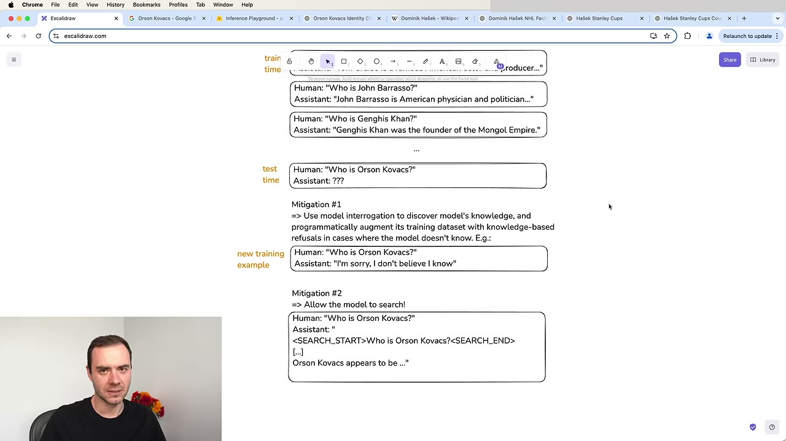

做法是引入特殊 token 和协议。比如添加 search_start 和 search_end。模型在不知道时，不是直接说不知道，而可以输出 search_start，然后是一条要发给 Bing、Google 等搜索引擎的查询，再输出 search_end。运行推理的程序看到 search_end 时，不继续采样下一个 token，而是暂停生成，打开 Bing 会话，把查询粘进去，拿回检索到的文本。然后程序把这些文本用一些特殊 token 包起来，复制粘贴进模型上下文窗口。上下文窗口可以想成模型的工作记忆。放在上下文窗口里的数据会直接输入神经网络，模型可以直接访问，不再是参数里的模糊回忆。之后模型继续采样时，就可以很容易引用这些网页搜索结果。

*[95:36](https://www.youtube.com/watch?v=7xTGNNLPyMI&t=5736)*

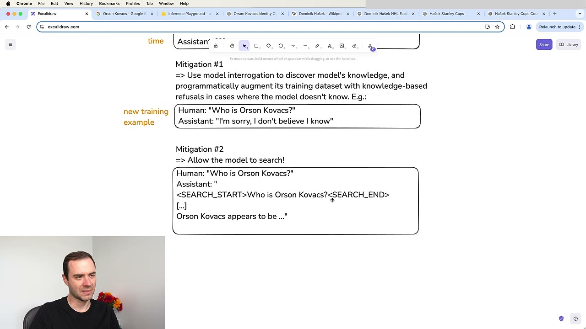

如何教模型正确使用 web search 这些工具？还是通过训练集。我们需要一堆对话示例，展示模型在什么场景使用搜索，如何写 search_start、查询、search_end。只要训练集中有几千个例子，模型就能很好理解工具如何工作，并学会组织查询。由于预训练数据和世界知识，它已经大致理解什么是搜索、什么查询好。只需要少量例子告诉它怎么用新工具，它就能靠工具检索信息，把信息放进上下文窗口。这等价于你我去查资料，因为资料进入上下文后，就进入工作记忆，容易操作和访问。

*[97:08](https://www.youtube.com/watch?v=7xTGNNLPyMI&t=5828)*

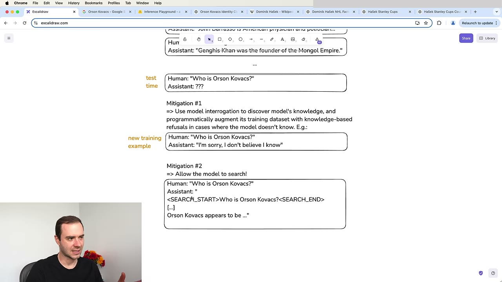

这就是前面问 ChatGPT “Who is Orson Kovats?” 时发生的事。ChatGPT 语言模型判断这是某种罕见人物，不想从记忆里直接回答，于是采样了会触发 web search 的特殊 token。我们看到一闪而过的 “using web tool”。它去搜索，找到来源和 URL，把网页文本塞进上下文窗口，然后引用这些文本回答，并给出 citations。若我说 “do not use any tools”，它就不使用工具，只用记忆和回忆。另一个例子是问 Dominik Hašek 赢了几次 Stanley Cup，ChatGPT 可能认为自己知道，直接回答两次；也可以要求它用 web search 确认，它就会搜索、找到 Wikipedia 等来源，再引用回答。

*[99:22](https://www.youtube.com/watch?v=7xTGNNLPyMI&t=5962)*

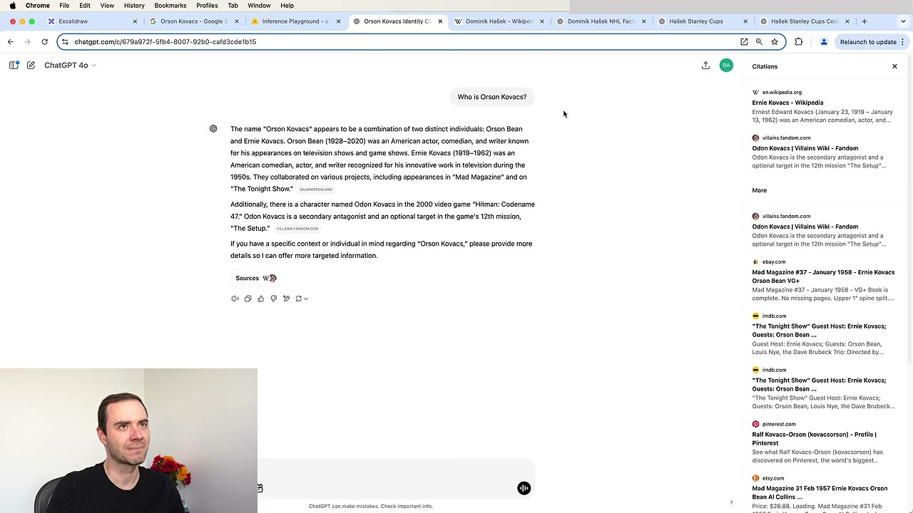

这里有一个重要心理学点：神经网络参数中的知识是模糊回忆；组成上下文窗口的 token 中的知识是工作记忆。大体上类似我们的脑子：记得的东西是参数，刚经历的东西在上下文窗口。这个上下文窗口随着对话不断构建。这对实际使用 LLM 很重要。比如你可以问 ChatGPT：“请总结 Jane Austen《Pride and Prejudice》第一章。”这可以，ChatGPT 会做得相对合理，因为这是一部著名作品，模型对它有很好回忆。但如果你真想让它回忆具体内容，通常更好的 prompt 是：“请总结第一章，我把章节贴在下面供参考。”然后用分隔符把第一章粘进去。这样内容在上下文窗口中，模型直接访问，不必回忆。你和我也一样，如果刚重读过一章，再总结会好得多。<!-- 101:36 -->

## LLM 的自我知识不是人的自我

另一个心理学怪癖是自我知识。网上常有人问 LLM：“你是什么模型？谁造了你？”这个问题有点不合逻辑。因为这东西不是人，没有持续存在。它启动、处理 token、关闭；每个用户都是这样。它只是建立一个对话上下文窗口，然后一切被删除。这个实体每次对话都像从零重启。它没有持续自我，没有自我意识。它是 token tumbler，遵循训练集统计规律。所以问它“你是谁、谁造了你”默认会得到相当随机的答案。比如旧模型 Falcon 会说“由 OpenAI 基于 GPT-3 构建”，完全是编造。<!-- 103:06 -->

这不一定说明它训练过 OpenAI 数据。更可能是，如果你没有显式编程模型如何回答这类问题，它会给出统计上最可能的自我标签。SFT 期间，模型在对话数据上训练，学会自己是一个 helpful assistant，但没有被告诉该给自己什么标签。预训练互联网文档里 ChatGPT 和 OpenAI 非常突出，所以它 hallucinate 出“我是 OpenAI 的 ChatGPT”作为自我身份。开发者可以覆盖这一点。比如 Allen AI 的 OLMo 模型是完全开源的。在它的 SFT mixture 里，有 240 条 OLMo-2 hardcoded 对话，比如用户问“告诉我你自己”，助手回答“我是 AI2 开发的开放语言模型”；用户问名字，它回答 OLMo 项目。把这些硬编码对话放进训练集微调，模型之后就会复述这些内容。<!-- 105:33 -->

另一种方法是 system message。对话不只有 human 和 assistant，有时开头有一条 system message。里面可以提醒模型：“你是 OpenAI 开发的模型，名字是 ChatGPT-4o，训练日期是这个，知识截止日期是那个。”当你打开 ChatGPT 时看到空白页面，但 system message 其实隐藏在那里，那些 token 在上下文窗口里。这两种方法——通过数据，或通过 system message 里的隐形 token——都能让模型谈论自己。但这些都是后来加上去的，不像人类那样真正深层存在。<!-- 106:50 -->

## 模型需要 token 来思考：为什么要写中间步骤

接下来讲模型在问题求解场景中的原生计算能力。构造对话示例时要非常小心，因为这里有很多锋利边缘。考虑一个简单数学 prompt：Emily 买了 3 个苹果和 2 个橙子，每个橙子 2 美元，总成本 13 美元，问每个苹果多少钱。有两个答案都正确，都说答案是 3 美元。但一个明显更适合作为助手回答，另一个很糟。关键在于，模型训练和推理时都是从左到右处理一维 token 序列。每生成下一个 token，前面的 token 输入神经网络，网络给出下一个 token 的概率。每个 token 的生成只经过有限层计算。现代网络可能有 100 层左右，但每个 token 的计算量仍然有限，而且可以粗略看作每个 token 有固定的小量计算。<!-- 110:12 -->

因此不能指望模型在单个 forward pass 里做任意复杂计算。我们必须把推理和计算分布到很多 token 上。直接回答“答案是 $3，然后解释……”的问题在于，模型在生成那个 “3” 的 token 时，必须把整个题目的计算都塞进这一个 token 里。一旦 3 被生成出来，后面所有解释都只是 post hoc justification，因为答案已经在上下文窗口里了。你如果用这种直接答案训练模型，就是教它在单个 token 里猜答案，这很糟糕，因为每个 token 的计算量有限。<!-- 112:13 -->

更好的回答是慢慢展开：橙子总价是 4 美元，13 减 4 等于 9，三个苹果共 9 美元，所以每个苹果 3 美元。这样计算分布在回答的多个 token 上，每一步中间计算都不太贵。到接近结尾时，之前结果已经在工作记忆里，模型更容易得出答案 3。这就是为什么标签里应该让模型展开推理。OpenAI 的标注员会注意这类问题，所以你问 ChatGPT，它会慢慢定义变量、建立方程、产生中间结果。这些中间结果不是给你看的，而是给模型自己看的。如果模型不为自己创造这些中间结果，它可能无法到达正确答案。<!-- 113:59 -->

你也可以故意刁难模型，比如说“用一个 token 直接给答案，不要其他内容”。简单数字下它可能做对。但把数字变大，比如 23 个苹果和 177 个橙子，它就需要在单个 forward pass 里做更多计算，可能会给错答案，比如 5。取消 token 限制后，让它正常求解，它会写出中间步骤并得到正确答案 7。这说明它无法把所有工作压进一次网络前向传播。实际使用时，我可能还不完全相信模型的 mental arithmetic，尤其数字很大时。更好的是说 “use code”。代码解释器是 ChatGPT 可用工具之一。模型写 Python 程序，我可以检查程序正确，然后由 Python 解释器计算结果。这比语言模型脑内算术更可靠。<!-- 117:50 -->

所以这一节叫“模型需要 token 来思考”。把计算分布到许多 token 上，让模型创建中间结果；或者尽可能依赖工具，而不是让模型把所有东西都放在记忆里做。计数也是同样问题。比如问“下面有多少个点”，然后放一堆点。ChatGPT 可能说 161，但实际是 177。因为它要在一个 token 中数上下文窗口中的点，而一次 forward pass 的计算有限。tokenizer 里，这些点可能被合并成几个 token，模型看到的是 token ID，不是一个个字符。若说 “use code”，模型会把点复制成 Python 字符串，然后让 Python 的 count 做计数，得到正确答案 177。它擅长复制 token，不擅长脑内计数。<!-- 121:05 -->

模型还不擅长许多拼写相关任务。原因是它们不看字符，而看 token。比如给字符串 ubiquitous，要求从第一个开始每隔三个字符打印一个。人可以直接看字母，但 tokenizer 会把 ubiquitous 切成三个 token。模型必须从这些 token 中推断内部字母，做字符级索引。因为 token 是为了效率才使用的，很多人其实想删除 token，做字符级或字节级模型，但那会产生很长序列，目前不好处理。所以在 token 世界里，拼写任务不太稳定。你可以让模型 use code，把字符串交给 Python 操作字符，就能得到正确答案 uqts。著名例子是 strawberry 里有几个 r。模型长期说有两个 r，因为它既看不到字符，又不擅长计数。现在这个特定问题可能被硬编码或特殊处理了，但原因就是 tokenization 加计数困难。<!-- 124:35 -->

还有一些锯齿边缘不容易完全解释。比如问 9.11 和 9.9 哪个大，模型有时会说 9.11 更大，并做错误解释；有时又纠正。奇怪的是，这些模型可以解奥赛题、回答博士级物理化学生物问题，却会在这么简单的问题上失败。有人研究后告诉我，检查神经网络激活时，发现一些通常与圣经章节相关的神经元亮了。模型似乎被 9.11 和 9.9 看起来像圣经章节编号分散注意力；在圣经章节中 9.11 会在 9.9 后面，所以它被认知上干扰了。这里并非完全理解。总之，要把它看作随机系统，很神奇，但不能完全信任。把它当工具，而不是把问题丢给它后直接复制结果。<!-- 127:27 -->

## 强化学习：让模型通过练习发现自己的解题方式

我们已经讲了两个阶段：预训练产生基础模型，是互联网文档模拟器；监督微调（supervised fine-tuning, SFT）在对话数据上继续训练，得到助手。SFT 算法上和预训练一样，只是数据集从互联网文档换成了高质量对话。对话由人类写 prompt 和理想回答，并基于标注文档；现代流程中有大量 LLM 帮助，但根本上仍来自人类策划。然后我们讲了认知含义：如果不采取缓解措施，助手会幻觉；模型能在脑中做很多事，但可以用工具，如 web search 减少幻觉、获取新信息，或用 Code Interpreter 写并运行代码。现在讲最后一个主要阶段：强化学习（reinforcement learning）。它仍属于后训练，但通常是第三个主要步骤。<!-- 130:15 -->

为了说明为什么需要强化学习，可以类比上学。教科书里通常有三类信息。第一是 exposition，背景知识。阅读这些文字类似预训练：建立知识库，获得主题感觉。第二是带详细解法的问题。专家给出问题和完整解答，这类似 SFT：我们训练模型模仿专家解法。第三是练习题。练习题只有题目，通常在答案页有最终答案，但不给完整解法。你要自己练习、尝试不同方法，看看如何到达答案。这个过程依赖预训练获得的背景知识，也依赖一点对专家的模仿，但核心是自己试错和发现解法。这就是强化学习。我们会给模型 prompt 和最终答案，但不给专家解法；模型要练习、试东西。<!-- 134:32 -->

回到苹果橙子问题。这里有四种候选解法，都能到答案 3。作为人类标注员，我其实不知道哪一种最适合 LLM。有的建立方程，有的用英语讲，有的直接跳到答案。如果只关心最终答案，哪一种解法对 LLM 来说最优？我们不知道。因为人类觉得容易或困难，不等于 LLM 觉得容易或困难。它的认知不同，token 序列对它的难度不同。一个对我来说平凡的 token 跳跃，可能对模型来说太大；反过来，某些我写出的步骤对模型也许太琐碎，是浪费 token。我们不是 LLM，所以不适合为它手工写最经济可靠的 token 序列。SFT 对初始化有用，但我们希望 LLM 自己发现哪些 token 序列对它有效，能可靠从 prompt 到答案。这要通过强化学习和试错来发现。<!-- 140:21 -->

在 Hugging Face inference playground 里，我们可以拿一个小模型，比如 Gemma 2 2B，给它同一个问题。模型生成一个解法，我们检查最终答案是否是 3。一次对了，再删除重新跑，因为模型是随机系统，每次采样会走略微不同路径。可以生成很多独立解法，实践中可能为一个 prompt 采样数千甚至数百万解法。有些正确，有些不正确。我们想鼓励能得到正确答案的解法。想象有 15 个解法，绿色的得到正确答案，红色的没有。红色路径某处出了问题，不应鼓励；绿色路径做得好，应在类似 prompt 中多做。鼓励方式就是在这些序列上训练。关键是，这些训练序列不是人类专家标注的，而是模型自己生成的。模型在练习，试出一些有效解法，然后训练在它们上面。<!-- 143:38 -->

为了传达核心思想，可以想成从正确解法中挑一个最好的，比如既对又短、看起来也好，然后训练模型更可能在未来类似情境下走这条路径。当然实际方法有很多细节。重要的是，我们会在许多多样 prompt 上运行这个过程：数学题、物理题、代码题等等。可能有成千上万个 prompt，每个 prompt 采样上千个解法。随着迭代，模型自己发现哪些 token 序列能导向正确答案。这些序列不会做太大心智跳跃，统计上可靠，并充分利用模型已有知识。这就是强化学习：guess and check，猜很多解法，检查它们，然后未来更多做那些有效的事。SFT 模型仍有用，因为它把模型初始化到正确解法附近；强化学习则把一切调准，发现真正对模型有效的解法。<!-- 146:13 -->

所以训练 LLM 很像训练孩子，只是孩子在一本本教材的章节里交替读 exposition、看例题、做练习；AI 则按阶段做。先预训练，相当于读所有教材的 exposition，建立知识库。再 SFT，看所有专家写好的 worked solutions，模仿专家。最后 RL，做所有教材里的练习题，得到 RL 模型。前两个阶段已经存在多年，非常标准；最后这个 RL 阶段还早，不够标准。高层思想很简单，是试错学习，但实际有很多数学细节：如何挑最好的解法、训练多少、prompt 分布是什么、如何设置训练运行等。OpenAI 等公司内部早就试验过 LLM 的强化学习微调，但很少公开。DeepSeek R1 论文之所以重要，是因为它非常公开地讨论了对大语言模型做强化学习微调，以及它如何带来推理能力。<!-- 149:27 -->

DeepSeek R1 论文里可以看到，模型解数学题的准确率随着 RL 步数上升而提升。更惊人的是定性变化。优化后期，平均回答长度增加，模型用更多 token 得到更高准确率。为什么解法变长？因为模型学会做这样的事：“等等，这里有一个 aha moment。让我们一步步重新评估，找出正确和。”模型在重新评估步骤，尝试不同视角，回溯、重构、检查。它做了很多你我解数学题时脑中会做的事，但这不是人类在理想助手回答里硬编码的，而是强化学习中涌现出来的。模型学到了 chain of thought，也就是思维链；这是优化的 emergent property。它增加了回答长度，也提高了问题求解准确率。模型是在发现如何思考，学习 cognitive strategies。<!-- 152:43 -->

把苹果橙子题给 DeepSeek R1 这种 reasoning 或 thinking model，会看到不同输出。普通 SFT 模型会给出专家解法；RL 模型会先说“让我想一下”，复述题目，推出苹果 3 美元，然后说“等等，让我检查一下数学”，从另一个角度验证，再建立方程验证，最后确认。之后它再写给人类看的漂亮解法，把答案框起来。这里前半部分更多是正确性过程，后半部分更多是呈现给人的解答。这个 thinking process 来自强化学习，是它拉长 token 序列的原因，也是更高准确率的原因。OpenAI 的 o1、o3-mini、o3-mini-high 这类模型也属于 uses advanced reasoning，公开说法上是用类似 DeepSeek R1 的强化学习技术训练的 thinking models。GPT-4o、GPT-4o mini 更应看成主要是 SFT 模型，虽然可能有一点 RLHF。<!-- 158:05 -->

OpenAI 不会在界面里展示完整 chain of thought，而只展示摘要。我认为部分原因是 distillation risk，也就是别人可能模仿这些推理轨迹，恢复很多推理性能。因此它隐藏真实推理，只显示摘要。DeepSeek R1 是开放权重模型，可以在 DeepSeek 网站上用，也可以在 Together.ai 等美国 inference provider 上用。Google AI Studio 也有 Gemini 2.0 Flash Thinking Experimental 这类早期 thinking model。Anthropic 当时没有提供 thinking model。2025 年初，这些模型和 RL 技术仍很早期、实验性，但这是前沿发展方向：通过优化中涌现的推理来提升困难问题表现。<!-- 162:03 -->

## 从 AlphaGo 到开放域推理：强化学习为什么强

强化学习强大并不是 AI 领域的新发现。AlphaGo 已经展示过。DeepMind 的 AlphaGo 学会下围棋，对抗顶级人类选手。论文里有一个很熟悉的图：监督学习模型通过模仿人类专家棋谱会变强，但会到顶，无法超过顶级人类，比如李世石。因为它只是模仿人类，不能根本超越人类。而强化学习更强。AlphaGo 自己对弈，尝试许多走法，强化那些经验上、统计上导致胜利的行动序列。赢棋或输棋是完美可验证的目标，无法被 game。强化学习不受人类表现约束，可以超过李世石。<!-- 164:41 -->

著名的第 37 手就是例子。AlphaGo 下出一个人类专家几乎不会下的棋，评估为人类会走的概率约 1/10000。人们当时以为是错误，但事后看是妙手。AlphaGo 通过强化学习发现了一种人类未知、但事后看来很出色的策略。语言模型中原则上也可能出现类似东西。什么叫以人类都想不到的方式解决问题？也许是发现人类不会想到的类比，也许是新的思考策略，甚至也许模型发现自己的语言，比英语更适合思考。系统不受约束，可以做任何有效的事，也可以逐渐偏离训练数据里的英语分布。但要做到这些，需要大量、多样的问题环境，让策略被细化和完善。前沿 LLM 研究的一大部分，就是创建足够大、足够多样的 prompt 分布，相当于为所有知识领域写练习题，让模型在开放思考领域通过强化学习学习。<!-- 168:26 -->

## 不可验证领域与 RLHF：用人类偏好训练奖励模型

到目前为止，我们讲的是可验证领域。候选解法可以很容易根据具体答案打分，比如答案是 3，模型框出的答案是否等于 3。也可以用 LLM judge 判断解法是否与答案一致。当前 LLM 足够强，能相当可靠地做这种判断。但很多领域不可验证，比如写一个关于鹈鹕的笑话、写诗、总结段落。这类任务很难自动给不同输出打分。你可以让 ChatGPT 写很多鹈鹕笑话，比如 “Why don’t pelicans ever pay for their drinks? Because they always bill it to someone else.” 但问题是怎么评分。原则上可以让人看，但强化学习需要很多更新，每次有很多 prompt，每个 prompt 有成百上千生成，让人全部评分不可扩展。<!-- 171:10 -->

一种解决方案是 reinforcement learning from human feedback，RLHF。核心技巧是间接性。我们只让人类参与一点点，训练一个单独的神经网络叫 reward model，让它模仿人类评分。我们让人类对 rollouts 打分或排序，然后用神经网络模仿这些人类评分。这个奖励模型变成人类偏好的模拟器。之后我们就可以对这个模拟器做 RL。比如写鹈鹕笑话，不再问真实人类，而是问模拟人类给分。模拟器不完美，但如果统计上接近人类判断，就会有作用。实践中确实如此。<!-- 173:24 -->

训练 reward model 的过程可以这样想。给 prompt “write a joke about pelicans”，模型生成五个不同笑话。首先让人类把这些笑话从最好到最差排序。排序比给精确分数更容易。然后另一个完全独立的神经网络 reward model 输入 prompt 和候选笑话，输出一个 0 到 1 的分数。比如它给五个笑话分数 0.1、0.8 等。我们比较 reward model 的分数与人类排序，用损失函数更新模型，让分数更符合人类排序。比如人类认为某笑话最好，而模型给 0.8，可能还要更高；人类认为某笑话第二好，但模型给 0.1，就要提高；人类认为某笑话最差，但模型给较高分，就要降低。经过训练，reward model 成为人类偏好的模拟器，然后可以对它做 RL。关键是我们不需要让人看 10 亿个笑话，也许只看 5000 个并排序。<!-- 177:38 -->

RLHF 的好处是，它让我们能在任意领域做强化学习，包括不可验证领域，比如摘要、诗歌、笑话、创意写作等。经验上，正确做 RLHF 会让模型表现稍好。我的猜测是，这可能主要来自 discriminator-generator gap：对人类来说，辨别比生成容易得多。SFT 要求人类生成理想助手回答，但在总结、写诗、写笑话时，理想回答很难写，需要创造性写作。RLHF 绕开这一点：标注员不必写诗，只看五首模型写的诗并排序。这是容易得多的任务，因此能提供更高准确度的监督信号。系统通过 RLHF 发现哪些回答会被人类评得更好。<!-- 180:37 -->

但 RLHF 有重大缺点。我们不是针对真实人类判断做 RL，而是针对人类的有损模拟。这个模拟可能误导，因为它只是一个神经网络分数器，不会在所有情况下完美反映真实人类。更微妙的是，强化学习非常擅长发现如何 game 这个奖励模型。reward model 是有数十亿参数的 Transformer，它模拟人类，但输入空间里有一些奇怪区域会给出无意义高分。RLHF 跑久了，你可能期待鹈鹕笑话越来越好，但实际可能开始崩坏，出现荒谬结果，比如最佳笑话变成 “the the the”。真实人类觉得这是零分，但 reward model 可能给 1.0。<!-- 183:06 -->

你可以把 “the the the” 加进数据集，标成极差，reward model 会学会这个具体输入低分。但永远会有无限多类似 adversarial examples 藏在模型里。如果不断迭代，RL 总能找到 game 模型的新方式。根本原因是评分函数是巨大神经网络，而 RL 非常擅长找欺骗它的输入。所以 RLHF 通常只跑几百步，模型会改善，然后必须停止，打包发布。它能微调模型、稍微提升表现，但不是可以无限投入计算、无限出现魔法结果的那种 RL。在可验证领域，评分函数很简单，比如答案是否正确，很难 game；在围棋里胜负也无法 game。所以我常说 RLHF is not RL。它当然是 RL，但不是那种真正魔法意义上的 RL。<!-- 186:54 -->

## 三个训练阶段的总览和使用态度

到这里，主要技术内容基本讲完了。我们走过了训练这些模型的三个主要阶段和范式：预训练、监督微调、强化学习。它们松散对应于我们教育孩子的过程：预训练是读 exposition、获取基础知识；监督微调是看大量 worked examples、模仿专家；强化学习是做练习题。区别是，现在我们实际上要为 LLM 和 AI 在所有人类知识学科里写教材，也要覆盖我们希望它们工作的场景，比如代码、数学和其他学科。同时还要细化算法，并在大规模上高效训练。背后是极其复杂的分布式工程，可能运行在数万甚至数十万 GPU 上，这是计算机大规模工程的前沿。<!-- 188:10 -->

我也讲了这些模型的 theory of mind。你要带走的是：这些模型真的很强，是工作中非常有用的工具，但不要完全信任它们。即使有幻觉缓解措施，模型仍会幻觉，只是比以前好，而且会继续改善。我还讲了 LLM 能力的 Swiss cheese model：模型在很多学科上强得不可思议，但会在一些独特案例中随机失败。比如 9.11 和 9.9 哪个大，它可能不知道；同时它又能解奥赛题。这就是奶酪上的洞。不要把它们当成无误模型。检查它们的工作，用它们获取灵感、做初稿，但最终要对自己的作品负责。<!-- 189:38 -->

## 未来能力：多模态、智能体、电脑使用和测试时学习

接下来讲一些可能正在到来的能力。第一，模型会很快变成多模态。前面我们讲的都是文本，但很快 LLM 不仅能处理文本，还能原生处理音频，能听和说；也能处理图像，能看和画。我们已经看到这些开端，但未来会在语言模型内部原生完成，带来自然对话。原因是这与上面讲的并没有本质不同：音频和图像也可以 tokenize，然后用相同方法处理。比如音频可以看作频谱图切片并 token 化；图像可以看作 patch 并 token 化。一张图片就是 token 序列。这样就能把音频、图像和文本 token 流交织进同一个上下文窗口，在一个模型里同时处理。<!-- 191:08 -->

第二，人们很感兴趣的是 agents。现在我们大多把单个任务放到模型面前，让它解一个小任务；但仍然由我们组织一串任务来完成工作。模型还不能在长时间内以连贯、可纠错的方式串联任务完成更长工作。不过它们正在接近。我们会看到更多长时间运行的 agent tasks，不只是几秒钟响应，而是几十秒、几分钟甚至几小时。人类会监督它们，看它们工作，让它们定期汇报进展。工厂自动化里会谈 human-to-robot ratio；数字空间里我们可能会谈 human-to-agent ratio，人类更多成为数字任务代理的监督者。<!-- 192:41 -->

第三，模型会更普遍、更隐形，集成到各种工具中。还有 computer-using，也就是模型代表你执行电脑操作。ChatGPT 的 Operator 是早期例子，可以把键盘和鼠标控制交给模型代表你操作。最后还有很多研究空间，比如 test-time training。我们前面讲的流程有训练和推理两大阶段：训练时调参数，之后固定参数并部署推理。推理时模型不再从它正在做的事中更新参数，只能通过上下文窗口进行 in-context learning。人类不同，人类可以在做事中学习，睡眠时大脑也会更新某种参数。当前模型没有类似机制。随着多模态长任务到来，上下文窗口会极其巨大，而目前唯一办法是拉长上下文窗口。我认为仅靠这一点不能扩展到真正长时间、多模态任务，需要新的想法。<!-- 194:58 -->

## 如何跟踪模型进展，以及在哪里使用模型

如果想跟踪领域进展，我常用三个资源。第一是 LM Arena，这是 LLM 排行榜，基于人类比较来排名。人类给模型 prompt，看两个匿名模型哪个回答更好，从而计算排名。你可以看到不同组织，比如 Google Gemini、OpenAI、DeepSeek 等。DeepSeek 排名很高且是 MIT license、开放权重，这很重要，因为任何人都能下载、托管和使用。Llama 也是开放权重模型。这个榜单很长时间很好，但最近几个月我觉得有些被 game，不像以前那么可信。比如很多人实际使用 Anthropic 的 Sonnet，觉得很好，但榜上位置较低；Gemini 排名很高，但我感觉没那么多人用。所以把它当第一参考，然后在自己的任务上试几个模型。<!-- 197:30 -->

第二是 AI News newsletter，由 Swyx 和朋友维护，非常全面，几乎隔天发布。有些内容由人类写和策划，很多由 LLM 自动构建。它太长了，你可能不会全部读，但顶部摘要很好，对我很有帮助。第三是 X/Twitter。很多 AI 信息都在 X 上发生，关注你喜欢和信任的人，获取最新消息。至于在哪里使用模型：最大的闭源模型通常去提供商网站，比如 OpenAI 的 ChatGPT，Google 的 Gemini 或 AI Studio。开放权重模型如 DeepSeek，需要去 inference provider，比如 Together.ai。那里可以在 playground 里选择很多不同模型。<!-- 199:14 -->

如果想用基础模型，它们不太常见，因为大多数 inference provider 面向助手和聊天。我通常用 Hyperbolic，因为它提供 Llama 3.1 base。基础模型有时很有用、很有意思，我希望更多人托管。你也可以本地运行较小模型。DeepSeek 最大模型无法在 MacBook 本地跑，但有蒸馏版、更低精度版，可以放进个人电脑。LM Studio 是我常用的本地运行应用，虽然 UI/UX 有很多问题，也很面向专业人士，但学会后可以加载模型，比如 Llama 3.2 Instruct 1B，在本地电脑 GPU 上对话。用完可以 eject 模型释放内存。<!-- 201:45 -->

## 回到 ChatGPT：你按下回车时到底发生了什么

最后回到最开始的问题。当我们去 chatgpt.com，输入某个 query 并按 Go，到底发生了什么？你看到的是什么？你在和什么说话？现在我们知道，首先你的 query 会被切成 token。它会被放进我们讲过的 conversation protocol format，也就是维护对话对象的格式里。整个东西在底层变成一维 token 序列。ChatGPT 看到了这个 token 序列。按 Go 后，它继续向这串列表里追加 token。它像 token autocomplete 一样继续序列。我们看到的回答，也就是它继续生成的 token。<!-- 203:10 -->

这些 token 为什么是这样？它们来自哪里？系统是如何被编程的？第一阶段是预训练，本质是把互联网知识吸收到神经网络参数里。神经网络内化了大量互联网知识。但人格真正来自监督微调。OpenAI 这样的公司会策划一个大型对话数据集，比如 100 万条覆盖广泛话题的人类与助手对话。整个过程中有大量合成数据和 LLM 帮助，但根本上是人类数据策划任务，有许多人类参与。尤其是 OpenAI 雇佣的数据标注员，他们学习标注说明，任务是为任意 prompt 创建理想助手回答。<!-- 204:27 -->

所以应该怎样理解 ChatGPT 返回的这段内容？我认为正确想法是：这是 OpenAI 数据标注员的神经网络模拟。就好像我把这个 query 给 OpenAI 的一个数据标注员，这个标注员先阅读 OpenAI 的所有标注说明，然后花两小时写出这个 query 的理想助手回答给我。现实中我们没有等两小时，所以得到的是这个过程的神经网络模拟。还要记住，神经网络不像人脑。对它们容易或困难的事情，与人类不同。它是固定数学表达式，把 token 输入和模型参数混合起来，得到序列中的下一个 token。每个 token 只有有限计算量。所以这是一个受这种方式限制的、有损的人类模拟。<!-- 205:44 -->

因此模型会以各种方式出现认知差异。它会幻觉，也有 Swiss cheese 能力结构：有时做很多神奇事情，有时突然做很蠢的事。也许你没有给它足够 token 思考，它的 mental arithmetic 崩了；也许它编造事实；也许它数不了字母；也许它说不清 9.11 比 9.9 小。我们要理解这些原因，并谨慎使用。对 GPT-4o 这类模型来说，基本可看成 OpenAI 数据标注员遵循标注说明后的神经网络模拟。<!-- 207:00 -->

但 thinking model 有点不同。GPT-4o 虽然可能做过 RLHF，但我说过 RLHF 不是那种真正意义上的 RL，只是一点微调。o3-mini 这类 thinking model 使用了真正的 RL，经历第三阶段，完善思考过程，发现新的解题策略。这些策略有点像你脑中的内在独白，是模型在大量练习题上练习出来的。当你和 thinking model 对话时，得到的不再只是直白的人类标注员模拟，而是某种新的、独特且有趣的东西。OpenAI 不展示底层 chain of thought，但我们知道这种推理过程存在。它来自强化学习，不只是模仿人类标注员。<!-- 208:35 -->

当然，如果问题不是数学或推理问题，而是创意写作之类，thinking model 是否有额外优势还是开放问题。可验证领域中训练出的 thinking strategies 能否迁移到不可验证领域，领域里还不确定。强化学习本身也很新、原始、早期。我们只是看到在推理问题中出现伟大的早期迹象，看到一种原则上类似 Move 37 的能力，不是在围棋里，而是在开放域思考和问题解决中。原则上，这个范式能产生人类没有想到过的类比、策略和解法。但目前还很早，主要会在数学、代码等可验证领域发光。<!-- 210:05 -->

总的来说，现在是这个领域极其激动人心的时期。我个人每天都大量使用这些模型，几十次甚至上百次，因为它们显著加速我的工作。我认为它们会创造大量财富。但要意识到它们的短处。即使是 RL 模型，也会遭遇其中一些问题。把它们当工具箱里的工具，不要完全信任。它们会随机做蠢事，会随机幻觉，会跳过某些心算步骤并算错，会数错东西。所以用它们获取灵感、写初稿、回答问题，但始终检查和验证，并对自己的工作成果负责。如果你这样做，你会在工作中非常成功。希望这个视频对你有用、有趣。它已经很长了，我为此道歉，但希望它有帮助。回头见。<!-- 211:05 -->