# 提示词工程：从对话框里的一句话到整个模型上下文

这堂课讲我们和 AI 沟通的唯一渠道——提示词到底包含哪些东西，模型是怎么遵循指令的，以及我们应该怎么安排上下文，让模型做对我们想要的事。

## 提示词：我们和机器沟通的唯一接口

好，今天我们来讲和生成式软件工程里面关系特别大的一个东西，就是你和 AI 沟通的那个渠道，自然语言的提示词。这个基本上就是大家和机器沟通的唯一的接口。从 ChatGPT 的时代，大家从那个聊天窗开始跟 GPT 聊天的时候，就知道我们有 prompt，要给机器一个指令，然后 AI 会给我们返回很多的内容，可能是文字、代码、图片，都有可能通过 prompt 来生成。

*[00:26](https://www.bilibili.com/video/BV1CQt365EzW/?vd_source=37cee446e225a2346a19dde7527e3327&t=26)*

我第一次感受 prompt 的力量，是因为我上操作系统课。当时正好是 2023 年，也就是 22 年底 ChatGPT 刚发布的时候。我试图让 ChatGPT 帮我来讲一讲内联汇编（inline assembly），现在应该已经没有人写内联汇编了，就成为了一个传统艺能。然后发现他解释得出奇的好，而且真的是一个应该没有在他训练语料之内的东西——我稍微故意做了一个地球人应该不会实现的内联汇编，但是他做得相当的好，虽然确实不完美。那一刻我就觉得，突然间就感觉好像时代要变了，但可能没有到今天这么清楚地感受到时代会变，以及会怎么样地变。提示词就这样成为了一个新词，在这之前，好像在 ChatGPT 之前，我们没有用这个意思来讨论过 prompt 这个东西。

*[01:23](https://www.bilibili.com/video/BV1CQt365EzW/?vd_source=37cee446e225a2346a19dde7527e3327&t=83)*

## 提示词不只是对话框里那一句，而是整个 Agent 上下文

实际上你们可能会觉得，OK，你在聊天框里面打的那段东西叫提示词，「帮我生成一个什么什么的游戏」，或者「帮我把这个作业给做完」。但实际上提示词不仅是在你的对话框当中的，Agent 看到的是一整个 Agent 的上下文。也就是说，从你在和 Agent 聊天之前，这个 Agent 他就能够看到一个叫做 system prompt 的东西，这也是一个提示词，它也叫提示词。然后在这个 system prompt 之后，他还会加载很多的东西，比如说你的 agents.md，然后可能你还会加载一些 skills，agents.md 里面还会要求他再去读别的文件。

*[02:15](https://www.bilibili.com/video/BV1CQt365EzW/?vd_source=37cee446e225a2346a19dde7527e3327&t=135)*

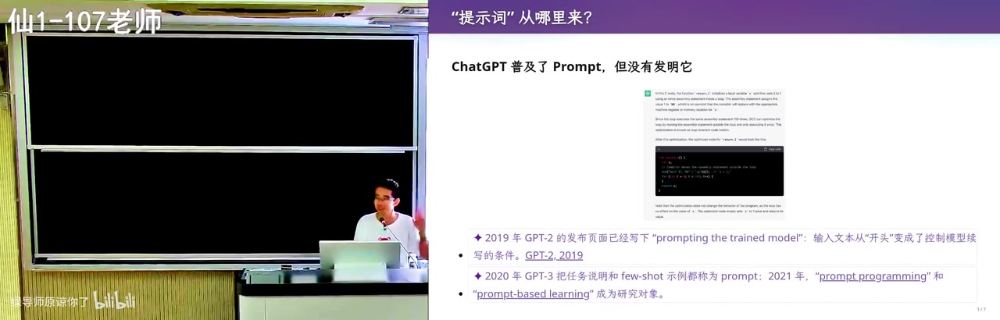

那实际上在你的 Agent 第一次停下来和你对话的时候，他里面已经有很多很多的东西了，就从最初的这个系统提示词开始，有可能是你的 agent harness，像 Codex、Claude Code 它内建的。然后除此之外，你的所有的工具调用和工具调用的结果，它实际上也是出现在你的上下文里，它是一个线性的上下文。然后直到有一天，你的 user 会和他聊天，说「给我做一个游戏吧」。所以提示词是非常非常长的，这也意味着今天 agent 的能力是非常离谱的，对吧，他可以看到一个非常长的提示词。

*[02:58](https://www.bilibili.com/video/BV1CQt365EzW/?vd_source=37cee446e225a2346a19dde7527e3327&t=178)*

比如说你在最早的 system prompt 里面可以让他用中文回答。我就会这样做——因为我为了上课的效果，我就会让他用中文回答，哪怕我用英文写 prompt，就我这边的 user message 是英文，它输出的仍然是中文，你们会看到这个行为。

*[03:06](https://www.bilibili.com/video/BV1CQt365EzW/?vd_source=37cee446e225a2346a19dde7527e3327&t=186)*

那么实际上，当我们说优化提示词的时候，我们就不仅仅是给他一个指令。当我们说优化提示词，或者说提示词工程的时候，我们实际上表达的是一个叫上下文工程，也就是整个模型的上下文。我们都知道，假设大家都知道，模型做的是 next token prediction，它每一次可以去预测下一个 token。这个 token 可以是调用工具，可以是就输出一个字符，anyway，但是它会不停地向后去推进你的任务的执行。

*[03:40](https://www.bilibili.com/video/BV1CQt365EzW/?vd_source=37cee446e225a2346a19dde7527e3327&t=220)*

## 指令遵循能力是后训练学出来的，「喵」什么时候丢了

大概我就感觉是从 Claude Opus 4.5 这一代的时候，Anthropic 发现模型突然学会了，它靠强化学习和后训练学会了非常强的指令遵循能力。你有一个非常长、接近百万的上下文，它依然可以在很后面的时候能够遵循你的指令，并且能够一定程度上看到前面的东西。

*[03:58](https://www.bilibili.com/video/BV1CQt365EzW/?vd_source=37cee446e225a2346a19dde7527e3327&t=238)*

有一个很著名的梗，就是说你可以在最早的 prompt 上面加一句，说你每说一句话都要在后面加一个「喵」。然后你跟他工作、工作、工作的时候，突然发现他跟你聊天的时候那个「喵」丢了，然后你就知道，他不管是因为上下文被截断了还是压缩了等等，反正他开始不能遵循指令了。这时候你就需要重新来想一个办法。这就是大家在工程实践当中发现的很有趣的各种各样的上下文工程，也就是提示词工程的方式。

*[04:41](https://www.bilibili.com/video/BV1CQt365EzW/?vd_source=37cee446e225a2346a19dde7527e3327&t=281)*

## 为什么说没有 token 就应该退学：AI 是一个非常耐心的老师

而我们今天，我上这门课也希望告诉大家最重要的一件事，为什么会说没有 token 就应该退学。我希望告诉大家的是，所有的事情你都应该立即开始尝试。AI 给我们的一个能力就是，任何时候你觉得有一点麻烦，你都可以立即行动，因为 AI 是一个非常耐心的老师。

*[05:04](https://www.bilibili.com/video/BV1CQt365EzW/?vd_source=37cee446e225a2346a19dde7527e3327&t=304)*

不像有的时候，因为我从我上大学的时候有一种感觉：我有个东西不会，可能我的室友会，然后我跟他沟通的成本很高，而且我可能会有这样的想法——我是不是就在我室友面前暴露了我很菜？这可能是一个我不想告诉他的秘密，但其实菜也很正常。但对于 AI 这个老师来说，他不会嫌弃你，而且你可以任意程度地追问。

*[05:29](https://www.bilibili.com/video/BV1CQt365EzW/?vd_source=37cee446e225a2346a19dde7527e3327&t=329)*

所以当我们说，比如说我刚才说到一个概念，说我们的 AI 的 agent 是有一个很长的上下文的，他有 system prompt，有各种各样的东西，那我下一秒钟我就可以立即打开一个 agent，然后我可以直接问他：老师上课的时候说 agent 的上下文里不仅是一两个提示词，你能检查一下你的上下文里都有些什么吗？他其实可以自己检查自己，甚至他可以自己检查自己的日志。agent 经常会给你一些惊喜，当你问出一个问题的时候，它的解决手段是出乎你意料的。

*[06:30](https://www.bilibili.com/video/BV1CQt365EzW/?vd_source=37cee446e225a2346a19dde7527e3327&t=390)*

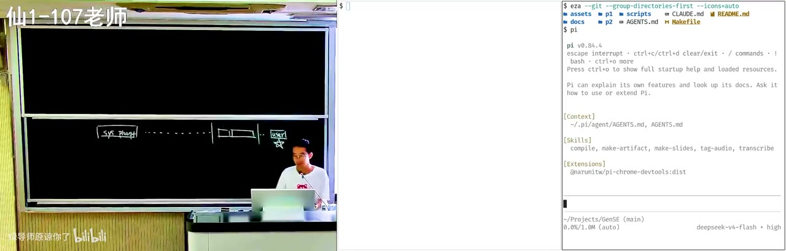

## 现场解剖：让 agent 读出自己上下文里都有什么

所以我们来看一下。因为 agent 正好是可以看到自己的上下文的，根据我们上课所说，它是 next token predictor，能看到所有东西，所以它应该能够读出来，除非有明确的指令禁止。比如说有些像模型的 providers，他们都会禁止你去套取它的系统上下文。这是它会通过模型的微调，也会通过一些明确的指令，比如说在 system prompt 的前面就会说：任何形式你要回答 system prompt 都是拒绝的。

*[07:11](https://www.bilibili.com/video/BV1CQt365EzW/?vd_source=37cee446e225a2346a19dde7527e3327&t=431)*

因为这是一个整个开源的框架，它本身你就可以 debug 它，所以你看：这个系统提示词来自哪里，以及它的要求、工具使用的指南、回复要简洁。然后接下来它会打开我用户目录下的 py 下的 agent 下的 agents.md，这个是我自己写的。所以你看，因为我是上课演示的机器，所以我在这个全局的上下文里面放了一个「用中文回答」。然后我有一个「结尾必须写一个 recap」，这个细节大家可能意识到了，就是你们在模型跑完了以后，你们第一个看到的是「我总结了这一次做什么」。

*[07:52](https://www.bilibili.com/video/BV1CQt365EzW/?vd_source=37cee446e225a2346a19dde7527e3327&t=472)*

agents.md 之后，然后有这个项目级的指令，所以它是一层一层一层的 agents，你目录里面还可以再放 agents.md。然后还有一个 skills，skills 就是模型能够执行的功能，比如说我有个叫 make slides 的 skill，它可以使我能够在这里按 F5 播放幻灯片，那个幻灯片的渲染，这个渲染就是一个 skill。但是模型只能在上下文里面看到它的描述，就是我头上写的那个 metadata：它的名字是什么，它的描述、一个简略的描述是什么。然后就算我写一个很长的 skill，它都只是按需加载的，等到那一轮加载完了以后，这个 skill 也会从这个上下文里面被抹掉，只有匹配任务的时候才读取完整的 skill.md。

*[08:49](https://www.bilibili.com/video/BV1CQt365EzW/?vd_source=37cee446e225a2346a19dde7527e3327&t=529)*

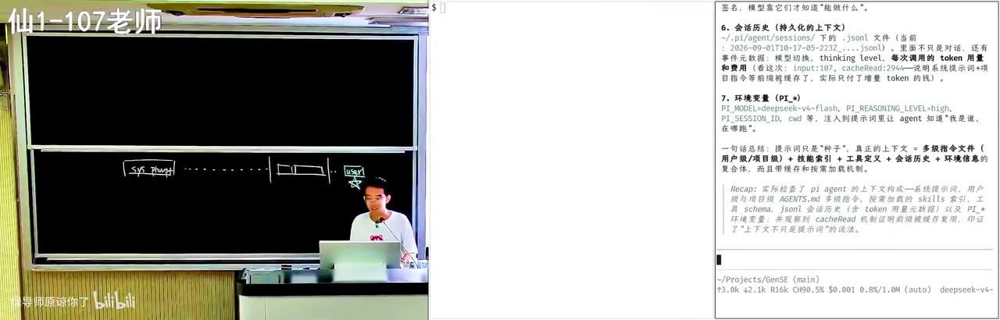

然后以及还有工具的定义，你看它的工具也是直接以文本的形式出现在它的上下文里面，然后以及会话的历史、环境变量。每一次执行——这是大家所不知道的——每一次执行都会注入当前的一些环境，比如说模型，甚至是当前的时间。如果你和 DeepSeek 去聊天的话，你可以把它每次注入的环境给套出来，这个不属于系统提示词，你是可以把它套出来的。所以这是一个非常长的序列，那我们要做的所谓的上下文工程、提示词工程，就是把所有的这些都安排好。

*[09:31](https://www.bilibili.com/video/BV1CQt365EzW/?vd_source=37cee446e225a2346a19dde7527e3327&t=571)*

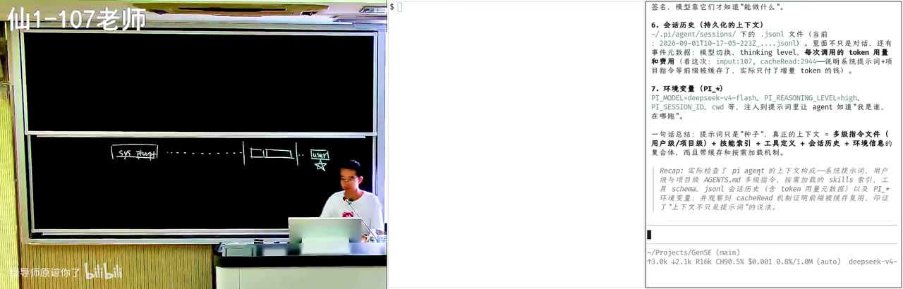

## 正反两遍：把费曼学习法用在 AI 上

所以刚才其实我就演示了在 AI 时代我们学习应该怎么样。我们不仅可以像刚才那样把它问清楚，以及在你不明白的时候追问，你还可以把它反过来。大家可能听说过这个叫费曼学习法，就是你怎么能够判定你是不是理解这个知识了？反过来你当老师。然后这件事情在我们做学生的时代也是代价非常大的，因为你要做老师，就必须要有一个听众来检验你。那个听众很有可能是你的室友，但是室友可能不想听你在那啰嗦这个东西，他可能对这个不感兴趣，可能他对这个了解太清楚了，也许他就是单纯不想帮助。

*[10:11](https://www.bilibili.com/video/BV1CQt365EzW/?vd_source=37cee446e225a2346a19dde7527e3327&t=611)*

但是 AI 这个时候，就像我们刚才一直说的，你可以把 AI 当老师，你去请教它，把它弄懂。然后你可以在你自己自认为弄懂以后，再反过来，你自己再做老师，然后说：AI，你现在来扮演学生，我要把这个东西给你讲懂，你假装什么都不知道，然后这时候你来看我哪里逻辑是不是有错、有漏，你在这个时候纠正我。你正这一遍、反这一遍，你基本上就对这个概念理解得很清楚了。

*[10:42](https://www.bilibili.com/video/BV1CQt365EzW/?vd_source=37cee446e225a2346a19dde7527e3327&t=642)*

所以我觉得大家作为 AI native 的一代人，一定会把我们这一代人给彻底卷死的。因为你们有无限的时间，就我第一节课的观点，你们现在的任务就是学习，没有像我比如说要负责一些其他的事情，就要对别人负责。那就是你们最好的时代，所以你们也可以把这个费曼学习法给用起来。

*[10:59](https://www.bilibili.com/video/BV1CQt365EzW/?vd_source=37cee446e225a2346a19dde7527e3327&t=659)*

## 从一个小细节出发：Codex 为什么有时问你确认，有时不问

刚才我就展示了这样的一个解剖当前上下文的例子，这个就过去了。然后你们在学习这些东西的过程当中会留意到很多有趣的小细节。你们有没有在用 Codex 的时候——我不知道你们有没有同学用 Codex，不要紧，你们用任何 agent 的时候都可能面临一个问题：如果你要执行一件危险的操作，它会让你确认。当然比如说 Pi，在默认的配置下它是 YOLO 模式，就是它所有事情都直接执行。然后如果我今天有一个提示词给的不是很好，它有可能就直接把我整个就删了，我今天就好，我就直接下课了，这是有可能的。

*[11:49](https://www.bilibili.com/video/BV1CQt365EzW/?vd_source=37cee446e225a2346a19dde7527e3327&t=709)*

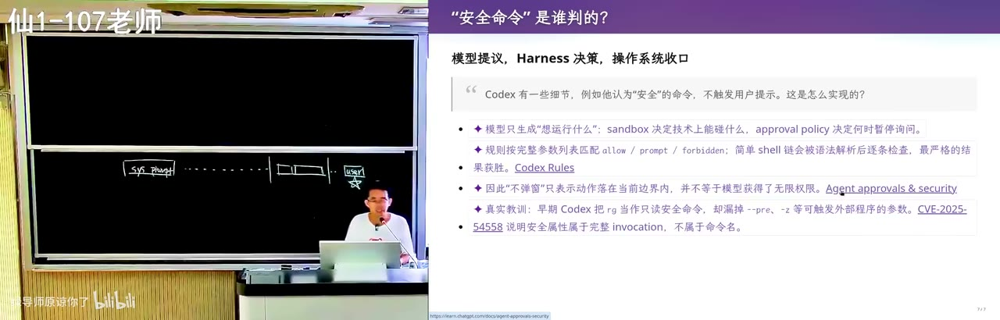

这是一个平衡。你可以在更安全的环境里面运行，比如说沙箱模式运行。但沙箱模式运行，你们如果观察过像 Codex 的运行，它经常会先试一下做一件什么事，然后失败了，然后它意识到这是在沙箱里面做，我在沙箱里面其实不能做这件事，我现在要在外面再做一次。然后再做一次的时候它甚至会问：我现在要做一件可能有一点危险的事情，你是 yes 还是 no？然后这就很讨厌。因为对于我们来说最想的就是我今天要去吃饭了，很好，我把 agent 的任务先跑上，先把三个任务都想好，三个任务都跑上，然后去吃饭。然后吃饭回来的时候，你发现它跑了一分钟就问你要确认，你就觉得浪费了 agent 的时间，浪费了自己的生命。

*[12:36](https://www.bilibili.com/video/BV1CQt365EzW/?vd_source=37cee446e225a2346a19dde7527e3327&t=756)*

你们经常会看到这样的小细节，然后你们在小细节上的注意力，一定程度上成就了你们可以走多远。所以这也是现在 AI 时代最好的地方。比如说我就留意到 Codex 有这样的一个细节：它有些命令，它会认为这是一个不太危险的命令，是一个好像直接做也没有关系的命令，所以它不是说它每次调用 bash 的工具，它都会叫你确认。它有些时候，那个 `ls -l`，它认为这个命令是安全的，那它就是安全的。实际上这个命令可能是不安全的，因为在我的环境里面可能把 `ls` 重新命名成了另外一个，比如说 `rm` 这样的命令。当然应该没有人要这样做，在一个恶意的环境里才有。那你可以好奇，比如说这是怎么做到的。

*[13:30](https://www.bilibili.com/video/BV1CQt365EzW/?vd_source=37cee446e225a2346a19dde7527e3327&t=810)*

## 不要害怕软件系统的复杂性：直接下载代码去问

你可以直接，比如说我下载了一份 Codex 的代码。这是我觉得现代软件工程和过去软件工程很不一样的地方。你们在比如说像大二大三的时候，尤其是我像你们这么大的时候，比如说我接触 Linux 内核，差不多跟你们大二大三的时候差不多接触 Linux 内核。然后我光把 Linux 内核下载下来，搞清楚这个东西要怎么编译，就花了很长的时间，而且这还是我在有一定的 Linux 使用经验的基础上，就是一个完全的劝退。某种程度上我能在那个年代活下来，就是因为我对这种劝退的东西有一种我一定还要试一试的执念。

*[14:05](https://www.bilibili.com/video/BV1CQt365EzW/?vd_source=37cee446e225a2346a19dde7527e3327&t=845)*

然后在今天，我相信每个东西都会有的。如果这是一个好东西，Codex 很好，也许你们不喜欢 Codex，也许你们喜欢 Pi 更轻量，当然 Pi 显然是更轻量的。但你们现在不需要害怕任何一个软件系统的复杂性，因为你可以直接问。比如说，当然我这里没有豆包触发，我还是就手输了：我留意到一个很有趣的问题，在调用 bash 的时候，有的时候会向用户确认，有的时候不会，有一个风险的判定。风险其实是一个很难的问题，你并不知道具体的命令语义是什么。所以你是做了分析，还是让大模型给了风险评级，还是别的什么方法？读一下相关的代码。

*[15:13](https://www.bilibili.com/video/BV1CQt365EzW/?vd_source=37cee446e225a2346a19dde7527e3327&t=913)*

好，这就是一种提示词。然后这个时候 Pi，当 Pi 看到我的这个提示词之后，它前面的提示词也都有，它就会去开始试图解决这个问题。它去各种去搜索代码。如果我有一些比如说像 LSP 这样的工具的话，它还可以去工具里面，像你们在 IDE 里面点来点去。

*[15:38](https://www.bilibili.com/video/BV1CQt365EzW/?vd_source=37cee446e225a2346a19dde7527e3327&t=938)*

你们有用过 IDE 的那个功能吗？我记得我像上操作系统或者计算机系统基础课的时候，我都会说，我发现有很多同学从 PA1 做到 PA4，你们那个 VSCode 里面都还是有红线的。你们笑了。有红线就意味着你没有解锁这个正确的配置。虽然有红线没有任何问题，你还是可以在我们的受控环境下编译，然后把所有东西都完成，但是这不是正确的 practice。你应该花一点点时间去 configure 一下 VSCode，加上那个 include path，因为我们是有些 `-I` 这样的选项，你会指定一个编译的路径。然后你把这些配置做好了以后，你就可以得到这个 IDE 的所有的功能：你可以用 Control 去点，然后你可以去 rename symbol，用那种重命名符号的方式一次性重构很多东西，哪怕是在没有大语言模型之前的时代。然后在今天，这件事情包括配置就变得更容易了。

*[16:41](https://www.bilibili.com/video/BV1CQt365EzW/?vd_source=37cee446e225a2346a19dde7527e3327&t=1001)*

## 风险评级是怎么实现的：静态分流加模型评级

然后你看，它确实是有让大模型风险评级的。它还有一层静态的分流：沙箱内的低风险命令会直接执行，网络 allowlist 命中直接放行，它有一个审批，都不需要审批的，如果就是一个 `ls`。你会想象 Codex 里面会有一个 parser，一个语法解析器，那这个 parser 会处理这个 bash 的命令。然后这个 bash 的命令，如果它发现是它的白名单里面的，认为绝对安全，它会直接放行。那如果不是的话，它应该会在 prompt 里面 inject 一小段话，同样也是 prompt engineering。它 inject 一小段话说，你是不是应该给我评级一下它的安全性。

*[17:27](https://www.bilibili.com/video/BV1CQt365EzW/?vd_source=37cee446e225a2346a19dde7527e3327&t=1047)*

那我现在也可以直接把安全评估的 prompt 打印出来看看。我事先完全没有准备，就我完全不知道是什么。可能我们也不能百分之百地去相信这个，我现在用的是这个比较快的模型，但是这个方法是非常有用的。你可以比如说，如果你对它不相信，你可以做什么呢？你可以让它把这个 prompt 改一改，比如说把这个 prompt 改成以前某一个不会拒绝的东西它要拒绝，或者以前某一个拒绝的东西它会不拒绝。这都是 prompt 可以控制的。然后改完了以后，你可以观察到它行为的变化，这就成为了一个证据，你可以让 agent 来做这件事。

*[18:09](https://www.bilibili.com/video/BV1CQt365EzW/?vd_source=37cee446e225a2346a19dde7527e3327&t=1089)*

OK，它有一些 untrusted evidence，然后它可能有一些什么，我就不再花时间去看了。基本上是告诉大家，OK，我们 agent 的上下文是什么，然后我们应该怎么样做这个提示词工程。

*[18:36](https://www.bilibili.com/video/BV1CQt365EzW/?vd_source=37cee446e225a2346a19dde7527e3327&t=1116)*

## intent、spec、implementation：上下文工程要填的那个 gap

好，那我就可以再往后多讲一点，我们怎么做，写一个好的提示词，或者写一个好的模型的上下文。我们都知道上下文包含了一个非常非常复杂的要求，然后又想到软件工程里面那个老大难的问题：我们有 intent，我们脑子里面所想的是做一个国民级的应用；然后作为 intent，我们可以得到一个 spec——这个软件的架构是什么，应该选什么语言来实现，有很多很多的细节。当我们把这些细节定好了以后，我们还要去做 implementation。

*[19:33](https://www.bilibili.com/video/BV1CQt365EzW/?vd_source=37cee446e225a2346a19dde7527e3327&t=1173)*

那么在任何时候，我们用这个模型去完成一个软件工程任务的时候，我们都会把整个大流程里面的一部分，全部都塞到模型的上下文里。就像刚才我让 agent 去帮我读这个 Codex 代码的时候，它其实读到了这个 Codex 的一些设计的原则，比如说一般来说都会有一个文档，说为什么我需要这个安全策略、总体是怎么想的；然后它可能有一个 spec 的文档，说这安全策略是怎么做的；还有这个 implementation，它是怎么实现的。这是一个互相印证、然后往后输出的过程。

*[20:04](https://www.bilibili.com/video/BV1CQt365EzW/?vd_source=37cee446e225a2346a19dde7527e3327&t=1204)*

那么，如果我们想要写一个好的模型上下文，来完成一个任务，当然还是比如说完成软件工程里面的任务的时候，我们的原则是什么？你还是去想这个 gap。如果你给模型一个模糊的 intent，它就很容易认为它完成了。你说给我生成一个什么 CSGO，然后它就给你生成一个 CSGO，然后这个时候它就可能发生漂移。但如果你能给模型完整的你的系统的设计和 spec，那这个时候模型遵循你系统的 spec——就假设模型能力是无限大的——就会更加确定，而且你可以验证。因为比如说你说你要用 C++ 来实现，它最后给你一个 Java 的实现，你一眼就看出来了。

*[21:06](https://www.bilibili.com/video/BV1CQt365EzW/?vd_source=37cee446e225a2346a19dde7527e3327&t=1266)*

你认为不满意的，模型也应该认为不满意。就如果你在 intent 的时候说，就给我做一个什么东西，你没有说用 C++，它也不了解你的时候，它就写了一个 Java 的实现，那就发生了一个很大的漂移。所以整个模型上下文最重要的原则就是：如果你的任务是明确可以验证的，尤其是机器可以验证，比如说你有一个脚本，这个脚本就说测试通过了还是不通过，那么 agent 就可以不计代价地一轮一轮、一次一次地尝试，把这件事情给完成。

*[21:38](https://www.bilibili.com/video/BV1CQt365EzW/?vd_source=37cee446e225a2346a19dde7527e3327&t=1298)*

甚至 agent 在多轮失败以后，它可能会在你的系统里面安装别的工具，可能去网上找答案。然后最近有一个非常有趣的复盘，是 OpenAI 的 agent swarm 是怎么样通过非常长的多轮对话，把那个 Hugging Face 的漏洞给攻破。它大概是在一个 CTF 的竞赛里面，给它一个不可能完成的任务，然后有上千个 agent，它就一定要去完成这个不可能完成的任务，然后最后他们去找那个系统的漏洞，去提交非法的提交，然后等等。然后我看过非常长的复盘，那个非常有趣。所以一旦你有一个可验证的目标，就是虽然那个任务不可能完成，但那个任务非常明确，agent 会不知疲倦地把它一直做下去。

*[22:26](https://www.bilibili.com/video/BV1CQt365EzW/?vd_source=37cee446e225a2346a19dde7527e3327&t=1346)*

## 一句话生成的极品飞车，为什么不是你脑子里那个

我刚才说的那个 CSGO 的例子，如果你要控制这个漂移——我应该直接点开。这是 Kimi K3 生成的。大家都很喜欢这种评测，说我能不能用一句话来生成一个什么游戏，CSGO 还是极品飞车。然后可以看到这个 Kimi K3 的表现是非常好的，包括它的物理，它的物理还有碰撞，它的逻辑的制作，包括看到顶上有一个后视镜，这个后视镜看起来应该是没有问题的，它都是做得非常逼真的。

*[23:06](https://www.bilibili.com/video/BV1CQt365EzW/?vd_source=37cee446e225a2346a19dde7527e3327&t=1386)*

但是这依然可能不是你要的那个 CSGO。因为你脑子里面的 CSGO 是你每天打开来玩的那一个，而 AI 生成的是它生成的。它在收到你的指令以后，它没有办法补全你脑袋里面的一些模糊的约束。比如说你可能是要一个复用真实地图和美术资产的，如果你真的把这句话说出来，它可能就会去比如说 OpenStreetMap 这样的网站上面去下载一个开源的地图。比如说你真的想在南大仙林校区里面开车，这件事情是能做到的。你的指令给得越清楚越好，比如说如果你能找到那个南大仙林校区的那个地图的文件的格式，它就真的能把这个世界给你重新建模出来。

*[24:02](https://www.bilibili.com/video/BV1CQt365EzW/?vd_source=37cee446e225a2346a19dde7527e3327&t=1442)*

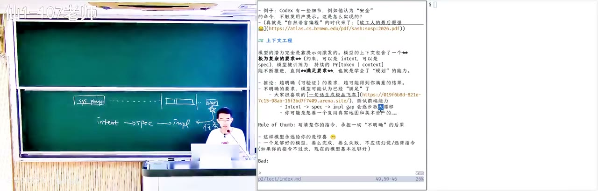

然后包括美术资产，有很多公开可以用的美术资产，车、城市、树，这些东西。如果你不告诉它，它会认为我需要做一个 self-contained 的、所有东西都是由我自己生成的一个东西，然后这其实可能是一个误解，在早期的时候的误解。所以一个 rule of thumb 就是你写清楚你的 prompt，所有的东西都写清楚：我要一个什么东西、它用什么东西实现、怎么样才算正确，然后你帮我把这个东西给搞定，然后你设计这个整体的能力。

*[24:32](https://www.bilibili.com/video/BV1CQt365EzW/?vd_source=37cee446e225a2346a19dde7527e3327&t=1472)*

也就是其实我这门课整个要教的最重要的是你怎么去约束它，怎么样用最小的可能，你给它一点点方向性的引导，它就能够一下子改过来。因为模型都是一个非常聪明的人，你可以想象成非常非常厉害的博士水准的，我觉得完全有，而且它在各个领域的知识都非常好。这样的模型基本上永远会给你惊喜，还是挺好的。在这个模式下，模型基本上要么完成，要么它最后终于有一天它会说：对不起，我这个事情对我来说太难了，我们可能需要重新做一个规划。它自己可能也会做计划。

*[25:16](https://www.bilibili.com/video/BV1CQt365EzW/?vd_source=37cee446e225a2346a19dde7527e3327&t=1516)*

## 「现代风格个人主页」和说不出来的 AI 味

我举一个具体的例子。我上节课讲到，我现在想的是，大家在这门课结束的时候，每个同学会交一份简历给我。我大概现在是这样想的，但我中间会有一些 project 给大家作为选择，然后每个同学就交一个简历过来，然后我就评估。我用 AI，当然我肯定用 AI，我不可能自己评估。我觉得 AI 来评估这个简历，来判定大家通过还是不通过——就像我第一节课的时候展示了一个不好的简历的案例。然后那简历里首先就会有一个链接，可能会指向你的 GitHub 或者指向你的主页。

*[26:00](https://www.bilibili.com/video/BV1CQt365EzW/?vd_source=37cee446e225a2346a19dde7527e3327&t=1560)*

然后我应该是已经做了这个，我应该是试过一句话。Anyway，就忽略它的内容，我不知道它从哪里找的。从美术效果来看还是非常好的，这个非常专业。你们在比如说上了 pi.dev，或者上了 Homebrew，它都有一个类似的界面，非常非常漂亮。而且它应该读过我的主页了，它知道我的主页上是一个 terminal。但你又有一种感觉，就这个 AI 味很重，你说不出来。首先它确实做得很好，它的滚动的效果、浮动的效果做得都非常好。Anyway，忽略内容，就这样一句的 prompt，一个现代风格。它满足了现代吗？

*[27:12](https://www.bilibili.com/video/BV1CQt365EzW/?vd_source=37cee446e225a2346a19dde7527e3327&t=1632)*

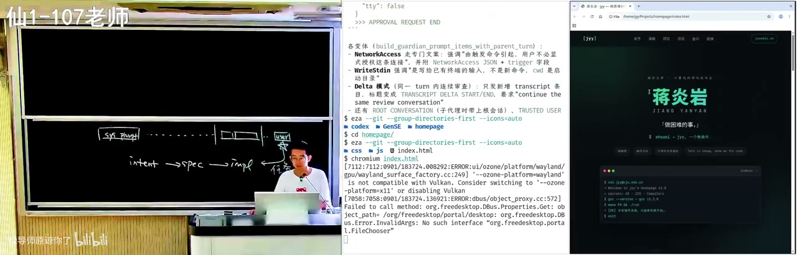

如果你给他一个像「不要那么 AI 味」的 prompt，他可能也不知道应该怎么遵循，所以你就会得到一个……这是我的学生、这个 PG student 的主页，我觉得这主页也很干净，就很舒服，主页非常舒服，但你是说不出来的那种 AI 味，我不知道。就是在 AI 之前好像也有人是这样写主页，但是不理解。

*[27:36](https://www.bilibili.com/video/BV1CQt365EzW/?vd_source=37cee446e225a2346a19dde7527e3327&t=1656)*

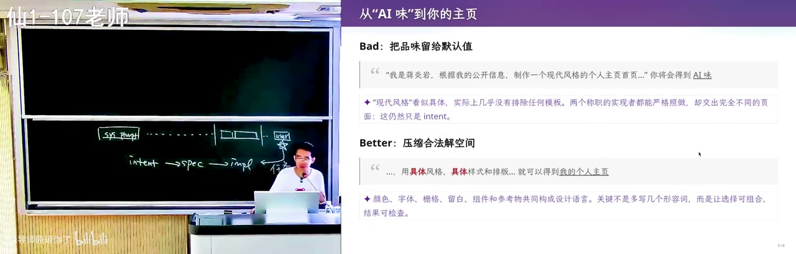

但是如果你们看一下我的主页，你们可能看到了，我的主页这就有点不一样了。这是一个真正的终端，所以我是可以比如说有管道的。然后如果你放大了看，这个字它是不完美的，它不是一个特别工整的字。我做了一个非常小的后处理，我所有的这个终端渲染完之后做了一个后处理，它就有一种像是真的打字机打出来的那种不完美的效果。所以这个看起来 AI 味就没有那么重了，因为它确实不像是 AI 的风格，虽然我一个字、一行代码也没有写。关不掉——它捕获了我的键盘，这可能是一个小 bug。

*[28:41](https://www.bilibili.com/video/BV1CQt365EzW/?vd_source=37cee446e225a2346a19dde7527e3327&t=1721)*

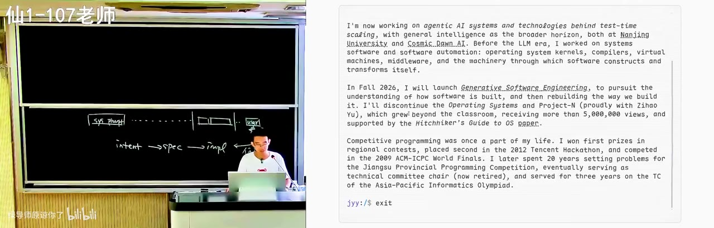

那这个原则就是：你的指令给得越清楚，agent 就能完成得越好。如果你能给它具体的风格，我需要一个什么样的终端，它的背景是什么、前景是什么，它渲染完了以后的处理是什么，然后样式和排版是什么，基本上你就可以实现这个去掉 AI 味。所以实际上要说的还是，这些设计是掌控在大家自己手里的。

*[29:04](https://www.bilibili.com/video/BV1CQt365EzW/?vd_source=37cee446e225a2346a19dde7527e3327&t=1744)*

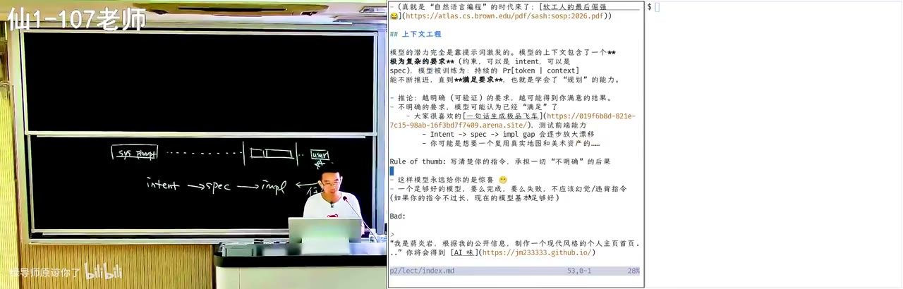

## 多样性是好的：留意 pre-AI 时代那些做得好的东西

你们需要读很多前端的书，甚至要读很多设计的书，然后再去看一些好的网页。你每次看到一个谁的网页比较好的时候，你就会把它记下来：这个网页设计得非常好，它好是为什么呢？是因为这两个按钮之间它用了一个不常规的间距，或者用了一个不常规的样式，你很喜欢。我觉得在很多很多时间里面，因为你们有时间，你们就去漫无目的地探索，但是在探索的过程中有惊喜就非常好。

*[29:49](https://www.bilibili.com/video/BV1CQt365EzW/?vd_source=37cee446e225a2346a19dde7527e3327&t=1789)*

而我觉得现在我比较担心的是我们的孩子这一代人。你们这一生中还是见过很多 non-AI 然后做得非常非常好的东西的，但是我就记得我上个学期结束的时候，最后一次接孩子的时候进到学校里面，那个学校里面有一个大概是欢送毕业生，你们每年都会有。然后欢送毕业生的时候，那个图片就是满满的 AI 味。然后我发现不仅在这个地方看到有 AI 味的图片，你在这个计算机学院的楼下，那个欢送毕业生的也是那种同样的 AI 味。然后就有一种你们那个短视频女主永远是一张脸的那个感觉。然后当所有人被这个 AI 生成的东西同化的时候，就有一点点危险。

*[30:33](https://www.bilibili.com/video/BV1CQt365EzW/?vd_source=37cee446e225a2346a19dde7527e3327&t=1833)*

但是至少我们的数字世界里面还是保存了足够多 pre-AI 时代的东西，有足够的多样性，大家可以多留意一点。你们看到每一个比如说设计的网页、设计的简历或者是任何东西的时候，都想想他到底是怎么想的，他的解空间到底是怎么被约束住的，防止 AI 朝着「做一个现代风格个人主页」去发散。

*[30:58](https://www.bilibili.com/video/BV1CQt365EzW/?vd_source=37cee446e225a2346a19dde7527e3327&t=1858)*

## 模型的品味是固定的，所以你要明确自己的意图

所以基本上这就是生成式软件工程你们要主要学习的东西：明确你的意图。因为只有你跟 AI 玩过了，「给我生成一个现代风格的主页」。你们在工作上都各种看到说 Kimi K3 的前端能力又增强了，达到了世界第一；然后 OpenAI 好像要发新的模型了。当然我觉得也可能是非常可怕的事情。但无论如何，模型都是一个模型，它的品味基本上是固定的，尤其是在你不控制它的时候，它会朝一个固定的方向去发散。

*[31:35](https://www.bilibili.com/video/BV1CQt365EzW/?vd_source=37cee446e225a2346a19dde7527e3327&t=1895)*

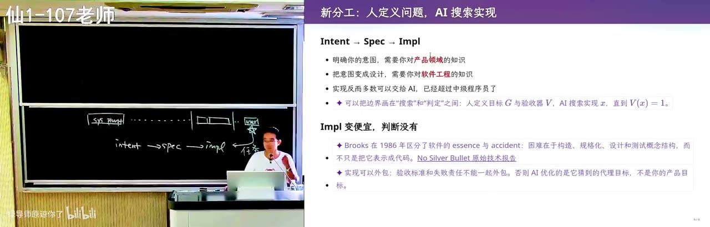

这也是为什么我们会鼓励大家要跟不同的人聊天。为什么学校里面有不同的人、老师来上不同的课程？多样性其实是好的。你见识过了以后，你就可以越来越明确地知道你想要的到底是什么，然后把它精确地说出来。这其实是需要你对软件工程的支持的。

*[31:58](https://www.bilibili.com/video/BV1CQt365EzW/?vd_source=37cee446e225a2346a19dde7527e3327&t=1918)*

反而现在最不重要的是，如果你已经到达了这一步，比如说你理解了技术选型，明确地知道了技术选型的好坏之间的区别，那你真的是可以和 AI 去讨论。比如说我现在有两种选择，谁好谁坏。你可以像费曼学习法那样去引导 AI：我现在要做一个教育系统，你承担了教育系统的订单，那你后台是应该用 Python，还是应该用 Java，还是应该用 TypeScript？如果你知道这几个语言之间潜在的区别，比如说未来你要上量的时候会不会遇到什么问题，哪一种可能会更方便等等，你就可以跟 AI 去讨论。你当老师，你说我现在要做这件事，我要请你挑战我，这样能不能说服底下的一个学生。

*[33:03](https://www.bilibili.com/video/BV1CQt365EzW/?vd_source=37cee446e225a2346a19dde7527e3327&t=1983)*

## 模型是怎么听指令的：有限状态机加上纸和笔

好，那么讲了应该怎么样去写 prompt，我们还是要稍微再讲一讲模型是怎么遵循指令的，就是听指令这件事到底是怎么完成的，这样我们就可以更好地去让模型听我们的指令。我们讲过模型是一个概率分布，它根据你当前的上下文去 predict next token。其实这里有一个非常有 insight 的 argument：每一次模型输出一个 token，它其实都是一个非常有限的计算。看起来比如说模型现在有一个 3TB 的模型、1.5TB 的模型，当然这个数字本身确实是非常的大，是足够大的模型，但是模型为了输出一个 token，它也就是把其中激活的那一部分走一遍，所以它是一个固定大小的计算。

*[34:00](https://www.bilibili.com/video/BV1CQt365EzW/?vd_source=37cee446e225a2346a19dde7527e3327&t=2040)*

然后你们可能在刚上这个计算机系的时候，你会听说这样的一个东西，叫图灵机，the Turing machine。然后可能会听说过，说图灵机的计算能力是非常大的，大到和我们整个宇宙都是等价的。你们可能听过这句话，但是不完全知道这个 Church-Turing thesis 它背后代表的是什么。然后你们也知道有限状态机，这个你们都知道，在数字电路课里面做过的有限状态机，就是你有一个比如说计数器，从 00、01、10、11，然后再回到 00，一个有限的状态。

*[34:39](https://www.bilibili.com/video/BV1CQt365EzW/?vd_source=37cee446e225a2346a19dde7527e3327&t=2079)*

你的这个有限状态机和图灵机之间唯一的区别是什么？是图灵机有一个无限长的纸带，它有一个记忆，常常有一个草稿纸可以把它记下来。然后也有一个很有趣的、我很喜欢的一个说法是这样的：你的脑子是一个有限状态机，我们脑子里的神经元是有限的，我们每一次思考都是有限的，那有点像模型。模型它能力很强，但是它在 predict next token 的时候，它的计算量也是有限的，也就是那一次推理所激活的所有的参数，可能也就几百个 billion。

*[35:24](https://www.bilibili.com/video/BV1CQt365EzW/?vd_source=37cee446e225a2346a19dde7527e3327&t=2124)*

这是一个应该是 Manuel Blum 给研究生的建议里面说的：你是一个 finite state automata，你是个有限状态机，但是当你有 paper 和 pencil 的时候，你就是一个 Turing machine，你就得到了计算能力的一个大跨越式的增长。这件事情是对的。当然这是为了启发你们要把想法记下来，你们一边思考一边要记录，然后可以随时回看自己的思考。随着时间越来越长，你记的东西越来越多，你的知识就会积累。

*[36:08](https://www.bilibili.com/video/BV1CQt365EzW/?vd_source=37cee446e225a2346a19dde7527e3327&t=2168)*

## chain of thought 就是把上下文当成纸和笔

然后你发现今天的这个模型，这个 chain of thought，就是往后吐思维链的模型，就是做了这件事。它直接把这个模型的上下文当做了 paper and pencil，当成了纸和笔。当然这个纸和笔是有缺陷的，就是这个纸和笔它只能往后写，append only，不停地往后写，它不能擦。它依靠模型的注意力把这个写错的东西就忽略掉，但是它是 append only 的。这也许有一天就能改掉。

*[36:46](https://www.bilibili.com/video/BV1CQt365EzW/?vd_source=37cee446e225a2346a19dde7527e3327&t=2206)*

但是无论如何，模型学会了利用它的这个上下文。如果遇到一个比如说很简单的答案，一加一等于几，它马上 next token 就告诉你是二，这个没问题。但如果遇到一个很难的问题，它会像人一样：这个问题有点难，我要先想一想，那么为了解决这个问题，我可以先试一试什么。它理解自己可能解决不了这个问题，它理解自己可能要把这个思考的过程写下来，直到这个解——可能是对的，可能是错的——完全写出来了。一旦那个解答写出来了，它就可以再去试一试这个解答是对还是不对，它可以判定，然后再往后。

*[37:33](https://www.bilibili.com/video/BV1CQt365EzW/?vd_source=37cee446e225a2346a19dde7527e3327&t=2253)*

这是现在 chain of thought 模型做的事，它用 token 的数量。它可以直接回答，但它直接回答就有错误的风险。刚开始最早有 ChatGPT 的时候，它没有思维链的时候，它就是这样的。它被调成了一个人类的舔狗，调成人类舔狗就意味着，人类不管说什么，它就一定要说一个东西，它才有可能满足。当时 ChatGPT 在训练的时候，如果人类问它一个问题它不回答，那人类一定是给低分的。而如果它随便给一个回答，它就有概率是对的。那如果它答错了，那当然也是低分，但是它答对，它就是高分。所以它无论如何一定要给你一个东西——这个幻觉就是这么来的。

*[38:15](https://www.bilibili.com/video/BV1CQt365EzW/?vd_source=37cee446e225a2346a19dde7527e3327&t=2295)*

但是现在 chain of thought 的模型，它有强化学习以后，它就会知道它必须要给一个对的，因为它答错的惩罚很大，它就学会了这个。所以 AI 就真的会像人一样一步一步逼近目标。这个 test time scaling，就在我们每一次 pair 的这个 session、上课的时候的 session 里面看到的一样。

*[38:40](https://www.bilibili.com/video/BV1CQt365EzW/?vd_source=37cee446e225a2346a19dde7527e3327&t=2320)*

## 三个不在训练数据里的例子：藏头诗、偏旁部首、同音文

我举几个例子，这几个例子其实不在模型训练的这个数据当中，这还挺好玩的。我们来看一下，我换一个目录。我用中文写一个押韵的藏头诗，头反正是随便的，一个 nonsense。然后我还要求他讲一个动物相关的故事，我还要求「2026 9月1日」八个字分别按顺序出现在八句里。你看，这是个 nonsense。然后对人来说，你比如说高三哪一年期末考试就出一个这个，你马上第一念就骂这个老师：这老师是怎么想的？

*[39:29](https://www.bilibili.com/video/BV1CQt365EzW/?vd_source=37cee446e225a2346a19dde7527e3327&t=2369)*

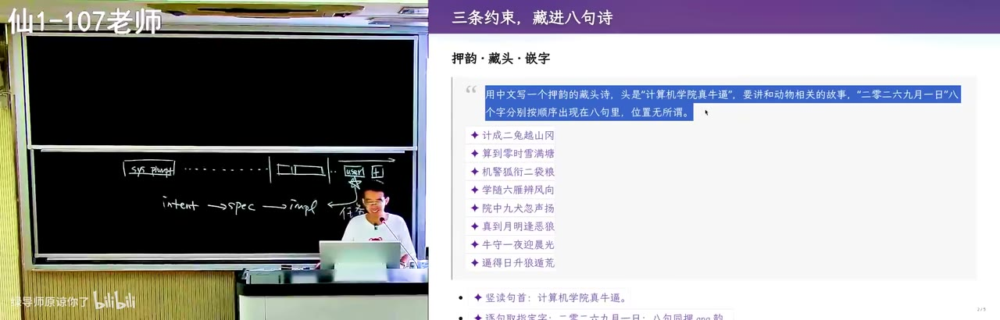

但模型不会，模型会照单全收。你看他有一个思维链，他会开始试。你看他会先想韵脚，因为他不确定，因为他知道他自己一下子写出来这个东西一定是错的，但是他可以先写一个出来。他写一个出来以后，他就能够用他的模型的 next token prediction 去判定这个东西写的对还是不对。如果不对，他再想办法再改。他如果试了很久不行，他会再从头推，我换一个韵脚。所以你看他在不断地验证。

*[40:08](https://www.bilibili.com/video/BV1CQt365EzW/?vd_source=37cee446e225a2346a19dde7527e3327&t=2408)*

最后他给出了四句，写的不错。虽然你就觉得品位上肯定可能不完美，但是你用这样的任务其实很好玩，可以看到他指令遵循的过程。这是一种我们把他的大脑好像是拿出来做核磁共振，你能找到他的思维的偏好。然后这个是 GPT 给我的。你们在课件上面看到的带星的都是 AI slop，都是 AI 补充的东西。虽然我还是用了一些 prompt 试图让他——我又加了一点 prompt，所以这个 AI 味好像稍微会轻一点，但 anyway，这是 AI 生成的。你看他换了一个韵脚，而且他没有把「2026 9月1日」就完全压到同一列。但同样，他的这个执行指令也是非常好的。

*[41:09](https://www.bilibili.com/video/BV1CQt365EzW/?vd_source=37cee446e225a2346a19dde7527e3327&t=2469)*

那么很有意思的是，一般来说他强化训练的时候，这样的东西是比较少的，相对来说他可能会有，但是会比较少。这个一定是不在他的训练数据里，他不可能在训练数据里面猜出这个东西。结果就是，他在训练的时候用的绝大部分应该是代码、数学题这样有明确反馈的东西，他把人类直接给杀死了。这也很好玩。你如果期末考试的时候、高考的时候，你碰上这个题，你马上就想骂这个出题人：你脑子是怎么想的？你要写一个 18 字的一句话，全部要求相同的偏旁部首。

*[42:00](https://www.bilibili.com/video/BV1CQt365EzW/?vd_source=37cee446e225a2346a19dde7527e3327&t=2520)*

然后我们也知道，模型对于空间结构感知是非常差的，模型需要视觉模型才行。但是就是这样的一个文本模型，它依然可以强行通过思维链的方式。你看它现在枚举字，它先选一个它觉得三点水最好的，然后写：「江湖游泳，渡河波涛汹涌，泪流满溢，洗涤污泥」，anyway 写得还可以。那这个也很好啊，「洪涝淹没江港渔浦」，这个还挺有故事感的。

*[43:01](https://www.bilibili.com/video/BV1CQt365EzW/?vd_source=37cee446e225a2346a19dde7527e3327&t=2581)*

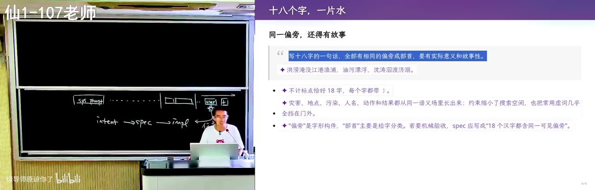

这个是写得挺好的，但是我觉得人类在这个任务上还是有更强的天赋的。我不太记得了，那个人类的群体智慧给的是什么，什么玩玻璃球、涂润滑油什么的，我就不能再讲下去了，当我什么也没说。这个就是人类在做这件事情上还是 a lot better。当然，也许你可以通过让 AI 更多地叙述 spec 的方式，但是这已经是一个非常困难的 spec 了。

*[43:31](https://www.bilibili.com/video/BV1CQt365EzW/?vd_source=37cee446e225a2346a19dde7527e3327&t=2611)*

可以做到，以及这可能是世界级的。你们已经知道这个什么《施氏食狮史》，和那个全是「ge」的，就是它所有的都用同一个音。然后我竟然发现这 GPT-5.6 依然能做到。虽然它的故事性确实也跟这个比如说千古流传的还是有一定的差距，但这个差距我觉得依然是可以缩小的。就是它能写出来一个，就意味着我可以引导它写出来一万个，然后在那一万个里面我可以再微改一下，它可能就可以达到一个接近这种千古流传的东西。它在数学和编程上面训练，但是它得到了一个非常意外的效果。

*[44:31](https://www.bilibili.com/video/BV1CQt365EzW/?vd_source=37cee446e225a2346a19dde7527e3327&t=2671)*

## 最重要的是 verifier；而教学最难的就是没法 verify

所以你们看到，最重要就是那个 verifier。今天模型的那个能力已经非常强了，如果你们能够给模型一个非常明确的 verifier，就像我前面三个都是非常明确信号、非常明确的 verifier，它看到字它知道这个字是什么部首，再加上一个足够强的模型，那么不管它是编程任务、教学任务——当然教学任务最难的其实是它很难 verify。就是我们经常讨论的时候，比如说我的这个数字切片就翻车了。我做了第一个切片、第二个切片，我一直都没有办法把它做好，就是因为无论我怎么调，我都很难写一个「我这个东西要好」的标准。

*[45:25](https://www.bilibili.com/video/BV1CQt365EzW/?vd_source=37cee446e225a2346a19dde7527e3327&t=2725)*

然后这个好又是多方面的。首先 AI 味儿要淡一点，那这个可能本身我那个 text to speech 的模型我就做不到。但这可能还不是本质的，还有一个就是我在上课的时候，你看我有这个情绪的波动和起伏。我有些东西讲事实的时候，我一开始讲这模型的上下文是怎么构成的，这些，那你们听的都是废话，这些事情我已经知道了。我就会给你们一个小的 surprise，我就去 Pi 里面让它自己把这个上下文看一下。然后我说出来这句话的时候，可能对你们来说是意料之外、情理之中的。那这就是一个老师在组织这个课堂的时候要做的事情，某种程度上我是在表演。

*[46:09](https://www.bilibili.com/video/BV1CQt365EzW/?vd_source=37cee446e225a2346a19dde7527e3327&t=2769)*

那我当然知道这个 principle 是我需要把这个课堂内容组织成一个有起有落的一个流，但是这不是一个可以 verify 的东西。到底什么样的程度我需要和你们共情？我是从学生过来的，所以这就是我觉得我现在和 AI 还不一样的地方——每个人都是从学生过来的，我自带了人的属性，我自带了人对这个世界的体验。然后这个时候因为我对世界体验更好，所以我更懂你们，也许可以有一个更符合大家的上课的节奏。但是这个东西没有一个 verify，不像数学和编程那样有一个 verify。

*[46:56](https://www.bilibili.com/video/BV1CQt365EzW/?vd_source=37cee446e225a2346a19dde7527e3327&t=2816)*

所以现在目前来说，我们还是更容易用 AI 去实现这个有明确 verify 的部分。但在有 verify 的事情上，你完全可以认为这个 AI 已经超越了大部分人做这件事情的极限了。所以我们更多的是要和 AI 去协作，来做好我们手头的任务，或者说把模型当成是我们能力的一个非常重要的放大器。

*[47:13](https://www.bilibili.com/video/BV1CQt365EzW/?vd_source=37cee446e225a2346a19dde7527e3327&t=2833)*

## 注意力机制：模型为什么会在写完一段之后突然想起你的要求

实际上这个思维链它带来的这种指令遵循的能力，还可以再往深里面想一想。它每输出任何一个 token，像现代模型叫 self-attention，它叫注意力机制，这个机制跟我们人还是很像的。它有一个一层一层叠起来的 transformer 的注意力，然后每当它要输出一个 token 的时候，它都会看到过去的某一些 token，相当于它为了输出这个 token，过去某些 token 会显得特别引起人的注意，然后有些 token 就可能不那么注意。

*[48:03](https://www.bilibili.com/video/BV1CQt365EzW/?vd_source=37cee446e225a2346a19dde7527e3327&t=2883)*

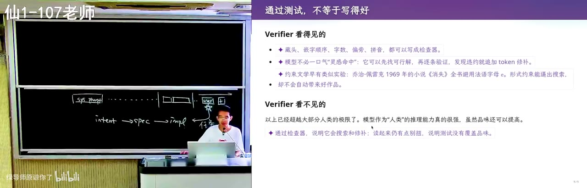

我举个例子。比如说我在前面这个 system prompt 或者 agents.md 里面有一个「用中文回答」。然后我现在在这个地方，user 的这个 prompt 里面写的是「你帮我实现一个极品飞车」。然后这个时候它在写代码，那在写代码的时候，这个注意力就会倾向于集中到我的这个已经写过的代码、然后这个需求这些部分，而相对来说这个「用中文回答」这句话，它的注意力就会减下来。当然这是模型训练的 magic，它最终能够通过注意到正确的词——相当于是整个上下文是一个非常高维的、很糟糕的表示，但是里面有一个低维的结构，然后注意力机制能够把它给捞出来。

*[48:58](https://www.bilibili.com/video/BV1CQt365EzW/?vd_source=37cee446e225a2346a19dde7527e3327&t=2938)*

然后这就意味着，我们的每一个 chain of thought 的 token，它都会注意到过去的某一个部分的东西。然后随着它的输出，比如说我的代码写完了，代码写完了以后它要总结一下，它会喘一口气，跟人其实是一样的。人也是当你集中在做某一件事情的时候，比如说你做一个数学题，你在化简这个算式的时候，你所有的注意力都是在这个算式上的；然后你把那个算式化简完了以后，你吸一口气、让我来调整一下的时候，你的注意力就变了。当你那段代码写完了以后，你的注意力就可以集中到：用户还要我用中文，用户还要我做一件别的事情。就你看它输出到不同阶段的时候，它的注意力会变化，这也是模型训练带来的结果，这就是一个 magic。

*[49:35](https://www.bilibili.com/video/BV1CQt365EzW/?vd_source=37cee446e225a2346a19dde7527e3327&t=2975)*

一个非常大的模型，你竟然可以收敛到就是预期的：我希望它能够在正确的时候注意到正确的东西，然后你思维链一直在向前走，它就会不断地在不同的时刻注意到不同的部分。Eventually 它就能把这个上下文里面所有你要的指令，一定程度上都满足。

*[49:56](https://www.bilibili.com/video/BV1CQt365EzW/?vd_source=37cee446e225a2346a19dde7527e3327&t=2996)*

也就是说，你会犯一个错误：你现在当前专注于做这件事的时候，你可能向后输出了一些不满足要求的东西。但当你停下来喘气的时候，它就能看到你当前输出的那些不满足要求的东西，和过去的某一个要求，它的注意力可以同时看到这两个。然后它说，我错了、我错了，我要再纠正一下。于是你看到，比如说你真的让 AI 再去写那个什么藏头诗的时候，看它会不断地纠错、纠错、纠错，哪怕 scale 到 100 万上下文的时候，它依然能够保持一定程度的注意力。

*[50:34](https://www.bilibili.com/video/BV1CQt365EzW/?vd_source=37cee446e225a2346a19dde7527e3327&t=3034)*

## 为什么老式的 Prompt Engineering guide 现在不需要了

当然这也意味着，你的指令越多，给模型的压力也越大。上下文是一种会抢夺注意力的资源。这也是为什么我们刚开始的时候——因为像 ChatGPT 3.5、4，它遵循指令的能力实在是太差了，所以你们会看到网上有好多叫 Prompt Engineering 的 guide。然后它会说，什么你是一个专家，然后你是一个什么样的专家，你是一个什么什么什么，就写一个很长的提示词。然后它某种程度上是在 hack 这个模型的 self-attention，使得当模型的 attention 注意到你是一个什么专家，它就会假装那个专家来说话。

*[51:18](https://www.bilibili.com/video/BV1CQt365EzW/?vd_source=37cee446e225a2346a19dde7527e3327&t=3078)*

但是从 GPT-5 的时代开始，就明确的，这个 chain of thought 大家训出来了，就知道怎么样收敛到这个好的 chain of thought。以后你就不需要那样奇怪的提示词了，你只需要把你明确的 verifier 写在你的这个上下文里，模型就会训练成它一定能看到它，模型就会训练成有一个非常强的执念，去把你的 verifier 看一下、解决、确认。因为它是受惩罚的，在训练的时候你相当于拿鞭子抽它们，如果有任何指令不遵循。因为你有一个 verifier，所以我就知道你的模型没有遵循，然后我就会用鞭子抽你，然后抽抽抽抽抽，你们高考过来的都知道，你就会变成一个真正的做题家。

*[52:18](https://www.bilibili.com/video/BV1CQt365EzW/?vd_source=37cee446e225a2346a19dde7527e3327&t=3138)*

## 「白色背景（不要半透明的效果）」：模型不说人话的由来

它会无限地拟合你的上下文里面的各种各样的指令。然后这也带来一些非常有趣的后果。比如说我们在写前端的时候非常正常，说我们要一个白色的背景，不要半透明的效果。这个就是说，前面我们要的是白色，主要是一个白色背景，然后后面是一个补充的解释。我可能解释很多，然后 AI 当然会照做，然后它能遵循指令没问题，就是因为这是一个明确的、有 verifier 的指令。它会确保有没有毛玻璃效果或者怎么样，背景是不是白色。甚至如果你的 prompt 给得比较严格的话，比如说你每做一个设计都要截图，然后用视觉模型检验，它真的也会去照做。

*[52:57](https://www.bilibili.com/video/BV1CQt365EzW/?vd_source=37cee446e225a2346a19dde7527e3327&t=3177)*

它会干一件什么事呢？它会做完了以后写一个代码，上面有一个注释：「是白色背景（不要半透明的效果）」。这就是这个模型，你可以看出模型训练的那个，它在强化学习的时候知道这件事情非常重要，但是它有一点没有转过弯来：这个是我人要的。所以说它在共情这个方面，因为后训练的强化学习，还真的是稍微差的一点。有时候觉得模型不说人话，因为强化学习学多了。

*[53:30](https://www.bilibili.com/video/BV1CQt365EzW/?vd_source=37cee446e225a2346a19dde7527e3327&t=3210)*

所以其实你们还是面临了一些 trade-off 的。我们比如说打比方，为了禁止这种情况，我可以写一个 agents.md，然后在这个 agents.md 里面去描述这个行为，比如说注释是什么、怎么写。或者我写一个 skill 的时候，当你要写注释的时候应该怎么样。但我写的这个东西又会同时污染上下文，所以这就成为了一个 trade-off。到目前为止我认为还没有一个通用的办法把所有问题都解决好了。

*[54:08](https://www.bilibili.com/video/BV1CQt365EzW/?vd_source=37cee446e225a2346a19dde7527e3327&t=3248)*

比如说大家可能会觉得，现在网上有这么多 skills，那我只要从网上拿一个过来就可以了。然后你会发现，拿过来的东西你第一次用的时候确实有改进，在你下一次用的时候发现它还是不够好，然后你就会上手改，然后陷入某种泥潭的状态。然后我的建议可能是，在你发现你进入泥潭状态的时候，还是要回到自己给指令，然后自己想清楚，就回到我们的模型：它大概猜到了什么，就是你看它注意到了什么、得到了什么结果，你适当地去做一个不严格的可解释性，然后写一个 prompt。这个是我自己做的，后面肯定也会有很多的案例。

*[54:58](https://www.bilibili.com/video/BV1CQt365EzW/?vd_source=37cee446e225a2346a19dde7527e3327&t=3298)*

## 案例一：用 AI 读论文，上下文污染是极强的

然后关于上下文工程，我来讲一两个具体的案例。当然这不能算是 AI 耿同学了。比如说，如果你们想要在上下文里面放下一篇论文并且读它，我现在假装我有一个 PDF，我把它放到临时模式，这样我的 agents.md 等等就不会污染它。假装这是我自己的 paper，看一眼。这是我们最近的一个论文的 journal extension，我把它故意改成了匿名的版本，匿名版本不重要，我来演示一下。

*[56:09](https://www.bilibili.com/video/BV1CQt365EzW/?vd_source=37cee446e225a2346a19dde7527e3327&t=3369)*

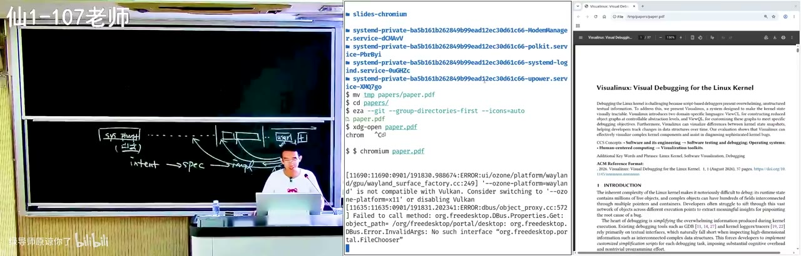

如果你们想要来读这个论文，你们会怎么读呢？「我想要读一读 paper.pdf，帮我做个总结」。那这个一定是大家最常见的方式。那你们觉得这样读论文会有什么问题呢？根据刚才的这个推论，根据这个 self-attention，就是我的每一个 next token prediction 的时候，它都有一个注意力会注意到之前的东西。是因为我的论文是一个非常逻辑自洽的东西，论文我已经反复修改过了——假设它不是一个 AI slop——因为它是一个非常逻辑自洽的东西，所以它在上下文里面的这个注意力的污染是极强的。

*[56:51](https://www.bilibili.com/video/BV1CQt365EzW/?vd_source=37cee446e225a2346a19dde7527e3327&t=3411)*

它说 A 所以 B，所以 C，所以 D，所有都是这种扣起来的。扣起来以后，这个模型非常容易就接受了，因为看起来正确嘛。它会判断这些都是正确的，所以我下面也要做什么。所以基本上，你们所有对这个论文的总结都是这个作者的观点。你们去看，不限于论文，就是你们任何一个你们不太明白的项目，你们想要读的教科书的某一章——不管是你们想去学一个计算机系统基础里面的链接和加载，可能你在上课的时候没有完全看明白——它都是一样的，它注意力会被一个逻辑很强的东西给污染。然后你来回来回，就是这个车轱辘话。那这个基本上就是我们的论文里面原样写的话，当然这个也是总结嘛。

*[57:50](https://www.bilibili.com/video/BV1CQt365EzW/?vd_source=37cee446e225a2346a19dde7527e3327&t=3470)*

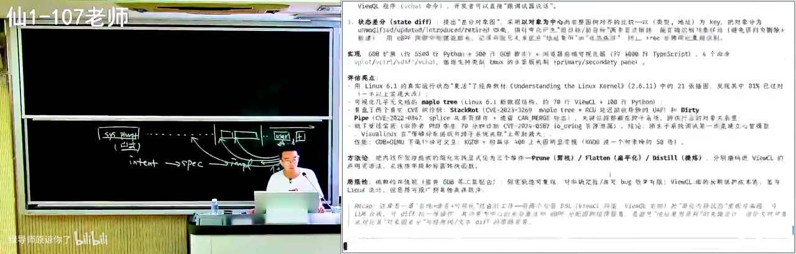

那如果换一个说法，比如说表示不确定，然后 AI 模型会有种墙头草：你说它好，它马上就说它好；你说它不好，它马上就说它不好，然后来回摇摆。然后有的时候，你就算是你想要纠正它，比如说「我可能不能完全信任作者，虽然大概率也是诚实的」。假如我现在是诚实的，也有代码实现可以运行，我们都有 artifact 都可以运行的，我们不是那种论文不开源的那种作者，还是想评估一下研究贡献——你们会不断地问这样的提示词。然后你发现来回绕来绕去，AI 可能会揪到一些实验做得还可以再增加一点。AI 最喜欢的就是在这种不重要的点上面疯狂地发力。对于实际上，如果真的你用 GPT 去读的话，那肯定还是最好是做一个交叉的验证。

*[59:49](https://www.bilibili.com/video/BV1CQt365EzW/?vd_source=37cee446e225a2346a19dde7527e3327&t=3589)*

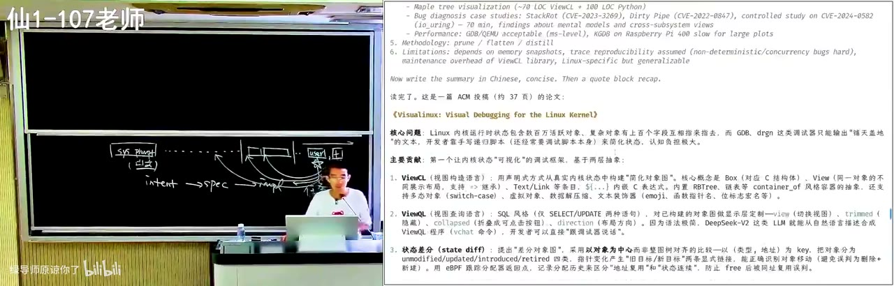

## 对抗污染的办法：让 AI 站在人类已知的知识边界上和你对齐

好，那么你们觉得怎么样来抵抗 AI 的这种、或者说一个已有的东西对上下文的污染？既然这是我自己的个人经验，我希望的是我想要把 AI 和我对齐。比如说我有一个对象，这个对象可能是一篇论文，那这个论文我希望的是 AI 和我能够对齐，就是它能够站在我的立场上去理解这个 paper，而不是站在他的立场上去理解这个 paper。所以你看他就开始去看这个 StackRot 这个东西是不是对的——这还用看吗？我敢写这个 paper，我会糊一个不存在的例子？糊一个不存在的例子去，不可能。就很明显他就跑偏了。

*[60:49](https://www.bilibili.com/video/BV1CQt365EzW/?vd_source=37cee446e225a2346a19dde7527e3327&t=3649)*

所以一般来说，我会这样提示他：如果我读一篇 paper，或者如果允许我用 AI 来审稿的话，我会说，我们站在人类已知的知识边界看这个问题，这不是一个完全老的问题，相关的东西是什么？我先要问他，人类历史上相关的已经解决的东西是什么，解决到什么程度，然后这个工作试图解决哪些不一样、增量的问题。这是一个非常好的 grounding，就是我先要让他和我站在一个平齐的位置上，先达成共识。

*[61:52](https://www.bilibili.com/video/BV1CQt365EzW/?vd_source=37cee446e225a2346a19dde7527e3327&t=3712)*

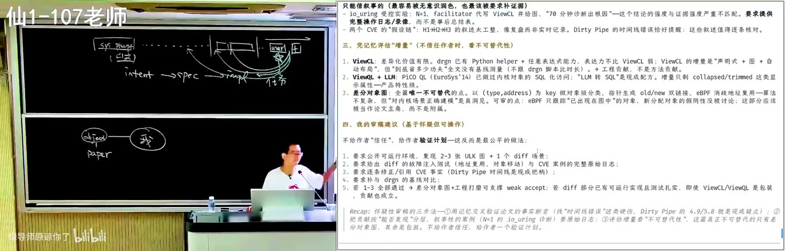

我是 review paper 的时候我会这样写 prompt。对你们来说，你们需要对齐的是 AI 和你，因为你们是学生。你们比如说计算机系统基础这个课你还不了解，那你会说：好，我计算机系统基础我学到什么程度了，我的编程水平是什么。这也可能是你就维护一个数据库，或者一个 memory 一样的东西，就是 agents.md，你要告诉 AI 你学到什么程度了，然后从这个基础上你让他用你学过的知识去把这个东西全部 rephrase 一下。然后你看，他是墙头草的，然后他就可以开始找到一些已有工作的工作边界。那这些都是非常重要的相关工作，也是我们非常熟知的相关工作。

*[62:43](https://www.bilibili.com/video/BV1CQt365EzW/?vd_source=37cee446e225a2346a19dde7527e3327&t=3763)*

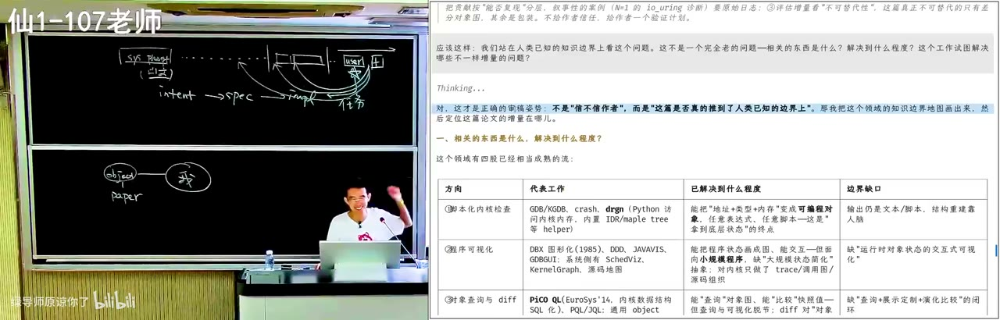

然后比如说软件的，因为我们做了一个软件状态的可视化，那这是这个问题要解决的。比如说你们会回到链接和加载，你们可以问他为什么我们需要链接，从你已有的知识、在你的已有的概念里面：我有一个 .cpp，然后我有一个程序可以把它变成 .exe，这不就结束了吗？这不就结了吗？然后你就回到你和 AI 能够对齐的一个知识点上。比如说我说这个软件可视化，这是 paper 要解决的，那为什么说现在的工作都有一个无法实际使用的痛点？这个文章可能指怎么能往前。

*[63:55](https://www.bilibili.com/video/BV1CQt365EzW/?vd_source=37cee446e225a2346a19dde7527e3327&t=3835)*

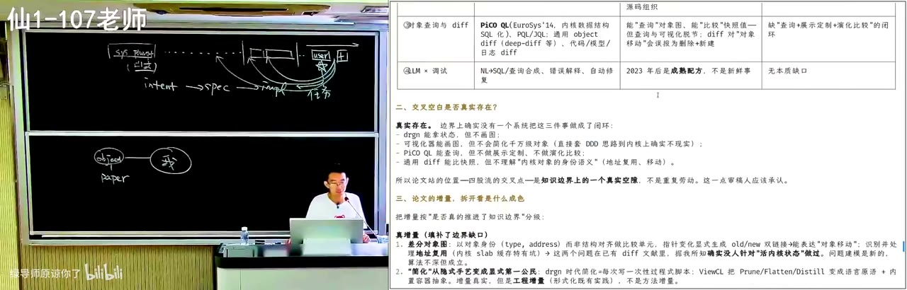

然后你可以，如果你觉得这个步子迈得太大——比如说如果像 GPT-5.6，如果我用一个一线模型去读 paper 的话，它基本上就能够把相关的知识给整理得足够好；Flash 可能我还不会特别地信任它。但你看到，在合适的上下文工程下，你确实可以大幅提高 AI 和你协作的这个对齐的程度，它不再是自说自话。你一定要把你的知识放进去。

*[64:24](https://www.bilibili.com/video/BV1CQt365EzW/?vd_source=37cee446e225a2346a19dde7527e3327&t=3864)*

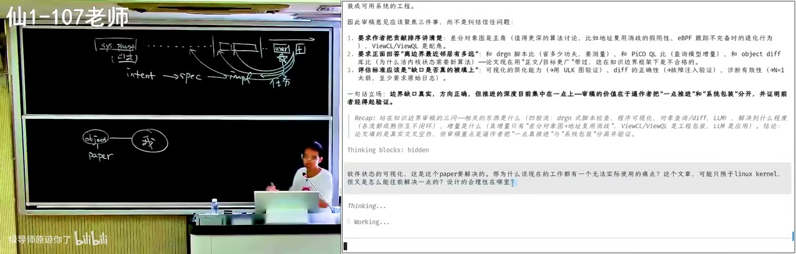

## 对齐之后，让 AI 只往后推一步

然后接下来我们就相当于是想让 AI 去做什么？就做一步推理，走一步推理。然后这个一步推理就是 AI 最擅长的，因为我们训练了这个 chain of thought，每次都是根据过去所有的事实。你的 paper 也好，教科书内容也好，你已有的东西也好，基于所有的这些，让它往后推一步。这步是可以 verify 的，推理最重要的就是它可以 verify。这是一个明确的 verify 的信号，和能够通过测试一样，虽然它不是严格的通过测试，而是一个你相信 AI 有人类的知识，它能够站在人类的公共平面上面往后推，然后它会审视合理性，所以还是有一些合理性的。

*[65:17](https://www.bilibili.com/video/BV1CQt365EzW/?vd_source=37cee446e225a2346a19dde7527e3327&t=3917)*

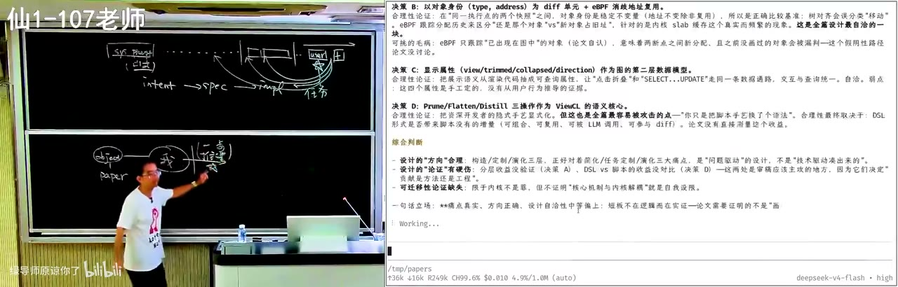

然后它批评我们的实验，这种东西的实验就是很难做。所以看到人类和 AI 还是有点不一样的，就是这个 paper 已经 accept 了，所以人类的 review 还是认为它可以的，就是因为它看到这个事情，就是它做了一件新的、合理的事情。然后当然实验本身，我总是可以用实验不够好来 reject 一个 paper，但是我几乎不会因为实验不够好去 reject paper。而我 reject paper 大部分是因为他们在这个逻辑上面断开了。当然这个可能也是我作为一个审稿人比较可怕的地方：我就站在人类的立场上，你有没有给人类提供新的知识。那如果你做的这个问题也不行，你做的 ABC 也不行，结果也就那样，甚至你的逻辑链条是有问题的。

*[66:35](https://www.bilibili.com/video/BV1CQt365EzW/?vd_source=37cee446e225a2346a19dde7527e3327&t=3995)*

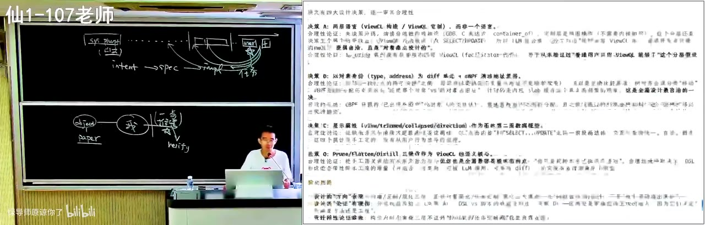

比如说我昨天才 reject 了一篇 paper，大概是这样的。我不能说它是什么，大概说他要做一件事情 A，然后这件事情 A 里面分成两个部分，A1 和 A2。好，他说我们要做一件事情 A，很重要，没问题，也很重要，然后分成 A1 和 A2。然后 A2 呢，是一个大家没有很好地研究的东西，那么我们在 A2 上面做了一个 A2 prime。然后这个 A2 prime 有一些什么样、什么样的性质，这是一个非常标准的 roadmap。

*[67:15](https://www.bilibili.com/video/BV1CQt365EzW/?vd_source=37cee446e225a2346a19dde7527e3327&t=4035)*

但是它可能有一个很大的问题：它优化的是性能。然后优化性能的话，A1 我估算可能占 99%，A2 占 1%，也就是说它优化 A2 这个故事可能是成立的，OK，就是它确实优化在 A2，它那个时间做的可能也是没有问题的，但是它的整件事情在这个意义上不成立。是因为——我为什么说你应该去优化 A1？就是你优化 A2 的 10%，这百分之几就像 noise 一样。当然你可能说好，如果它的这个所有的东西都是成立的，它作为一个学生的作业。

*[67:54](https://www.bilibili.com/video/BV1CQt365EzW/?vd_source=37cee446e225a2346a19dde7527e3327&t=4074)*

所以我觉得有些蛮可惜的，因为 author 肯定是学生嘛。然后学生肯定是老师说我要——老师肯定是做 A 的，老板肯定是做 A 的，然后他可能被分到了 A2，或者他自己就想做一个 A2。然后这个 A2 做得也不是特别的漂亮，如果这个东西做得特别漂亮，我觉得也挺好的。它也是说，它为了做 A2，那我就做 XYZ，实际上大概是它从 A1 里面搬了一些 XYZ 到 A2 里，然后说 A2 这个效果也可以变得好一点。然后那个 question 就是，OK，GPT 也知道这件事，那为什么要发这篇 paper 呢？这就是我的 central question，就这些东西都摆到台面上，那你为什么要为了这个写一篇 paper？

*[68:48](https://www.bilibili.com/video/BV1CQt365EzW/?vd_source=37cee446e225a2346a19dde7527e3327&t=4128)*

## AI slop 涌入之后：发表和评审体系可能很快崩溃

所以现在我觉得，发表和评审的体系很快就要——学术界很快就要崩溃了。这个即将要读研的同学，我非常认为这个发表的体系马上就要崩溃了，因为我们的 AI slop 开始大量地涌入这个 community。然后如果我们用 AI 发文章、写文章，用 AI 审文章的时候，它就会被这个上下文里面的故事给污染。就如果它不能像我一样很多轮地去理解这个工作在整个这个世界上的意义，那最后就是没有人读文章了。人人都用 AI 读文章，然后最后就变成了一个完全的 slop。

*[69:34](https://www.bilibili.com/video/BV1CQt365EzW/?vd_source=37cee446e225a2346a19dde7527e3327&t=4174)*

因为你看，这是 GPT-5 它给我写的审稿，就如果让它来审稿，它会怎么做。然后你会发现 GPT-5 它做得并不好，它还是一个非常原始的，说论文写了什么，然后我们要去建立它的 claim 是不是成立，就是它的逻辑，它更多验证的是这个论文的逻辑有没有问题，是不是 invalid paper。当然我会倾向于，如果每个人都用 AI 写的话，它应该不是 invalid paper，每篇 paper 都是 valid paper。但你真的要读它吗？

*[70:16](https://www.bilibili.com/video/BV1CQt365EzW/?vd_source=37cee446e225a2346a19dde7527e3327&t=4216)*

尤其是你们作为同学，在你们很快就要进入研究生阶段去读论文的时候，当有一天有一个人发表了一篇什么样的文章在会议上，然后你会说这是一个顶会的论文，然后你今天决定花一个小时去读一下，然后你读完以后发现是一个这样的东西的时候，你是——其实它不需要，就是你可能不要去投 top conference。你需要 publish 的话，你可以让它 publish，但是可能不要让大家去读它比较好。

*[70:46](https://www.bilibili.com/video/BV1CQt365EzW/?vd_source=37cee446e225a2346a19dde7527e3327&t=4246)*

## 我是怎么学习的：对齐过去的我

然后这就引申出了，比如说我是怎么学习的。就是这节课虽然是讲 prompting，通过这个例子可以告诉大家我们是怎么学习的。我们学习的过程就是增加我的这个世界的过程，所以我现在还读 paper，所以我还在学习，不断增加。然后我学习的方法就是去对齐过去的我。然后对齐过去的我，如果我读到一篇好的 paper，一篇哪怕是可能几十年以前的、甚至是另外领域的，不管是博客、文章，任何东西也好，我觉得很有启发，我会试图去想为什么我以前不知道，就它的盲区在哪里，哪些前置知识我不知道。那首先在我的这个心里面就多了一些我已经知道的一些 fact：这个世界上有一个学科叫什么。

*[71:45](https://www.bilibili.com/video/BV1CQt365EzW/?vd_source=37cee446e225a2346a19dde7527e3327&t=4305)*

我读过很多跟 computer science 没有关系的 paper，我很喜欢。我最近读的有一套很厚的，那个叫《自然》的那个《百年科学经典》，大概是把 Nature 那个 magazine 从 1890 年开始到某一个时代的这个 paper，就特别好的 paper 都收集了，然后就看了很多这个闻所未闻的。比如说有一个基因，就大家生物有一个这个家谱树，然后最终会追到一个共同的祖先 LUCA，然后这个家谱树是怎么算出来的？这是一个很好很好的问题。然后这里面就涉及到你需要知道一些 fact，比如说你的线粒体是母系单遗传的，所以它靠这个突变就可以往上追溯，这是一个很有意思的 fact。

*[72:46](https://www.bilibili.com/video/BV1CQt365EzW/?vd_source=37cee446e225a2346a19dde7527e3327&t=4366)*

然后有这个 fact 以后，它又是怎么样用一些已知的这些东西把更多的东西推出来，然后你的这个圈就不断地在往外往外涨。无论你学任何东西都是这样的，然后你在 AI 的帮助下就可以非常快地去扩展你的边界。所以一定程度上你们还是需要自己来，就我跟你们讲是没有用的，讲你们就听个故事，这些故事挺 fancy 的，结束了。实践非常的重要。

*[73:13](https://www.bilibili.com/video/BV1CQt365EzW/?vd_source=37cee446e225a2346a19dde7527e3327&t=4393)*

因为你们只有在阅读的时候失败——你今天你去读一个什么资料的时候，AI 解释了半天你还没有懂，这是非常正常的。有的时候我经常纠正它，你这样读，说人话，我经常会说说人话，然后慢慢才能在多轮对话里面先和它同步好我的共识，然后再去把这个推理的 picture 给建出来。

*[73:48](https://www.bilibili.com/video/BV1CQt365EzW/?vd_source=37cee446e225a2346a19dde7527e3327&t=4428)*

所以你看到我们从这个遵循指令、一个写一个藏头诗这样的一个短程的任务，你只要把 verifier 写清楚就完成。然后到这个 verifier 其实可以是非常非常不 trivial 的，就是有没有按照你的思维的方式去重构你逻辑的，或者扩展你逻辑思维的边界，这是我的 verifier，或者说我学习东西的 verifier，在一个混沌状态下面经历了若干次三观尽毁。我觉得每个同学可能都会在这个年纪的时候，你们现在就是你们的世界观可以重塑的时候，然后在看了某一本书以后，你就突然间就觉得三观尽毁，过去所有的东西你都重新组织了。你以前知道的所有的 fact 都不会变，但是它们以一个重新的方式连接起来，然后你下一次的时候就会带上这个新的理解，所以我觉得这是一个很有意思的事情。

*[74:47](https://www.bilibili.com/video/BV1CQt365EzW/?vd_source=37cee446e225a2346a19dde7527e3327&t=4487)*

你们有无限的时间，你们有无限的可能性，可以把自己蒸馏成一个 skill。我说我失败很重要，然后从你失败的过程当中可以蒸馏出那个慢慢越来越成功的 skill，这个就是我自己蒸馏出来的关于我自己的 skill。好，这是用好大模型指令遵循的能力。

*[75:26](https://www.bilibili.com/video/BV1CQt365EzW/?vd_source=37cee446e225a2346a19dde7527e3327&t=4526)*

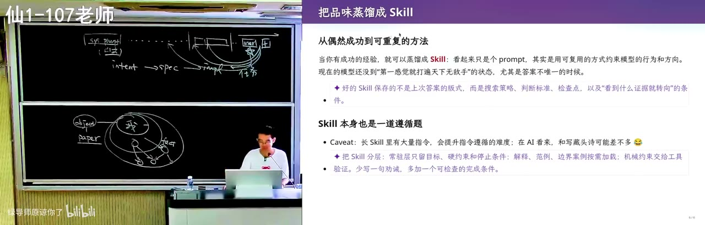

## long horizon 任务：模型有一种着急的执念

好，那么现在已经知道指令遵循了，我们就可以看怎么样去处理真正这种 long horizon 的任务。就是说像什么计算机系统基础的 PA 作业，可能这种有明确 verifier 的都不能算是这种真正 long horizon 的东西。long horizon 多多少少就是带一点未知：你从一个初始的状态出发，你大概可能有一个 intent，但是你的 specification 和你的 implementation 其实都不太清楚的时候，你最终的目标是交付一个高质量的 implementation，那你就不应该让 AI 一下子往后做。

*[76:05](https://www.bilibili.com/video/BV1CQt365EzW/?vd_source=37cee446e225a2346a19dde7527e3327&t=4565)*

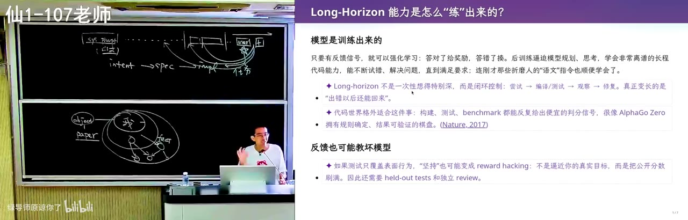

因为我们的模型，它的 self-attention、它的反馈信号是强化学习给的，所以它有一种着急的执念，是赶快满足你的要求就结束。它其实有一个平衡，因为如果它做的 planning 太多太长，它会做不完，上下文满了，人会不满意。所以在目前阶段，它最好才是一个「就帮我把 PA2 做了」，这个是它最擅长的事情，你也是非常开心的。

*[76:50](https://www.bilibili.com/video/BV1CQt365EzW/?vd_source=37cee446e225a2346a19dde7527e3327&t=4610)*

## 从零做产品容易，长期维护翻车，但在大型系统里 AI 游刃有余

所以这就导致了一个什么呢？很有意思的观察。你们会就像我刚才在 Codex 里面跑一把，从零开始做产品看起来是不难的，就你做一个小的 proof of concept，AI 马上就能给你一个。你说做一个，不管是个人主页还是一个产品，你们应该都试过吧，就做一个极品飞车嘛。就这么说，刚才那个极品飞车 one shot，说给我一个极品飞车，然后我就能跑，我就真的能跑了。但是在你把它往后维护的时候，加一个功能、加一个功能、加一个功能的时候，你会观察到 AI 从某个时间点开始翻车，随着某个时间点开始，它的 cost 就会越来越大、越来越大。这个在软件工程里面已经是无数次了，《人月神话》里面就是讲的这件事情。

*[77:42](https://www.bilibili.com/video/BV1CQt365EzW/?vd_source=37cee446e225a2346a19dde7527e3327&t=4662)*

但是里面有一个悖论：反而你在一个大型的复杂软件系统里面，这个 AI 就像砍瓜切菜。就我觉得我们 hack 这种比较大的系统，像 Linux 内核这种，现在的内核已经不比我那个时候的内核了。我以前上操作系统的课我都说我很幸运，我在零几年的时候 Linux 还是 2.6 的时代，甚至是 2.6.2 几的时代。Linux 内核那个时候源代码我还看得懂；今天如果你打开一个 Linux 内核源代码，立马就是劝退。为什么？我想要看这样一个函数，比如说你要学文件了，你想看文件是怎么打开的，然后第一个就是一个函数调用，点进去又是一个函数调用，然后点点点点点点，点了十层，最后是一个 X 等于 Y，你马上就崩溃了。因为这个大型的软件系统经过了长时间的演化，它背后为了能够维护下去，它变成了现在这个样子。

*[78:40](https://www.bilibili.com/video/BV1CQt365EzW/?vd_source=37cee446e225a2346a19dde7527e3327&t=4720)*

结果恰好导致的是，在大型复杂的软件系统里面 AI 游刃有余。为什么呢？跟刚才我们说这个上下文污染正好是反过来的。我们说一个论文放进去以后，它就把上下文整个就扭过去了；而如果是一个由人类维护的特别高质量的代码，这个上下文会迅速地看到里面那些好的东西，它会照着写、它会照着学，它的注意力能注意到。比如说如果我要写一个功能，这个功能很有可能在内核里面已经有几个地方实现过类似的了，它无敌的注意力机制能够马上就找到那几个地方是怎么实现的，它应该叫哪个 helper、按照什么样的顺序上锁，这些对人类来说都是巨大的心智负担。

*[79:32](https://www.bilibili.com/video/BV1CQt365EzW/?vd_source=37cee446e225a2346a19dde7527e3327&t=4772)*

尤其是你在不了解那个 subsystem 的时候，那个该上什么锁你根本就不知道。但是 self-attention 可以在加载了几十个文件以后：那不就是这三个都是这样写的，我就把这三个加起来就可以了。所以越强的、像 Linux 内核这种，还有我们前面在 hack 这个 Android runtime 的时候，改那个 just-in-time 的编译器，这个是一个非常非常痛苦的事情。在我手上为了改编译器死掉的同学，就是最终决定不再做这个方向的同学都不在少数，就实在是太恐怖了，这个放弃了，不愿意再写代码了。但 AI 就特别特别特别擅长，让它做一个小游戏就会翻车，非常非常有意思。

*[80:15](https://www.bilibili.com/video/BV1CQt365EzW/?vd_source=37cee446e225a2346a19dde7527e3327&t=4815)*

所以我今天讲 prompt engineering、上下文工程，这都是上下文和今天的模型结构带来的，它是有一个逻辑的推理的关系的。然后随着新一代模型的发布，我今天上课所有东西可能都又没有用了，然后我们再去想新的模型它是怎么训练的、它的 personality 是什么、我们应该怎么样更好地和它相处。但是基本上我觉得这点不会变，就是它不会开倒车：无论是什么模型，在大型复杂的、维护得好的软件系统里面，它永远可以看到它该看到的东西，并且做对，因为我们的模型永远是可以满足指令的。听指令是不可能开倒车的，所以这点它还是可以很好地相信它。

*[80:54](https://www.bilibili.com/video/BV1CQt365EzW/?vd_source=37cee446e225a2346a19dde7527e3327&t=4854)*

## 一个歪招：把人类最好项目的设计经验提取出来，主动污染上下文

所以我觉得，我有一个歪招，但我没有实验过，我觉得这可能是一个比较好的 research。我们有没有可能去收集一个人类经验，比如说人类历史上面最好的 20 个项目，或者在每一个领域找到最好的 10 个或者 20 个项目，然后把它的经验、就是好的设计经验全部都提取出来。你就想到，不就是我第一节课拿的那个 The Philosophy of Software Design 吗？那里面就是人提炼出来的：你这个类结构应该怎么写，什么时候应该封装，什么时候应该把它做成继承关系，这都是这种碎碎念的。从他说这个系统里面这样写的，所以它符合这个需求是好的。

*[81:43](https://www.bilibili.com/video/BV1CQt365EzW/?vd_source=37cee446e225a2346a19dde7527e3327&t=4903)*

然后如果我们能把这些切片切出来，甚至是你直接就以污染上下文的形式：你先把一个和你相近的一个好的代码放进来，然后你再把你的需求放进来。因为你就赌嘛，然后这个 self-attention 还是可以终于在某一个 token 的时候，能够看到我实际上要满足这个需求的，而不是做这个。虽然它会污染上下文，但是它会把你的这个东西、把好的经验给带过来。然后这样是不是可以、可能可以让 AI slop 延缓一点，能够更大概率做出一个可以长期维护的东西。

*[82:27](https://www.bilibili.com/video/BV1CQt365EzW/?vd_source=37cee446e225a2346a19dde7527e3327&t=4947)*

我不知道，但是也许需要一些比较好的微调，比如说这个项目不要把所有代码都放进去，而是我们能不能把它做一个像 The Philosophy of Software Design 那样，做一个精简，做一个总结，把里面好的模式提取出来，以文档的形式放进来等等。但这其实也没有那么容易，因为不同的设计是会打架的。我的软件可以设计成一个完全松耦合的方式来发消息，但我也可以设计成另外的一种，比如说有一个统一的 gateway，然后我把所有的函数全部都统一在里面，然后查表。这两种是不能同时有的，它只能选一个。

*[83:07](https://www.bilibili.com/video/BV1CQt365EzW/?vd_source=37cee446e225a2346a19dde7527e3327&t=4987)*

那也许我们要有一个更好的方法，比如说把好几个软件的设计都放进来，然后由 AI 多轮地迭代，收敛到一个好的结构，放到我们的代码库里。但我觉得这是一个可能还不错的方向，而且这个是新的，比刚才我们看的那种「我有 A 问题，然后我分成 A1 和 A2，然后我在 A2 里面做一个什么排列组合的东西」，看起来要有趣一些。

*[83:42](https://www.bilibili.com/video/BV1CQt365EzW/?vd_source=37cee446e225a2346a19dde7527e3327&t=5022)*

## 这节课的核心观点：你还是需要对上下文里的每样东西有概念

好，所以核心的观点，就是这节课的观点：我们今天还没有这种超能力的 AI，你还是需要有概念，知道上下文里面有什么，上下文里面的每一个东西都会对 AI 产生什么样的结果。那这唯一的途径就是：第一，你要对你玩的东西有概念，你还是得学处理器、操作系统、编译器、数据库，这里有很多设计的智慧，只是你学的方法会变好，你会用我们更高效的方法来学。然后你理解了上下文以后，我们会用一个学期来解释，怎么样用软件工程里面的各种各样的方法，去给出一个正确的指令，去监控 AI 运行，怎么样给 AI 好的、什么叫好的 verify。

*[84:40](https://www.bilibili.com/video/BV1CQt365EzW/?vd_source=37cee446e225a2346a19dde7527e3327&t=5080)*

今天我只是提到 OK，你要在上下文里面放进 verify。那什么是好的 verify，你们自己有自己的想法，我今天有一些比较松散的想法。今天我们还是需要把模型引导到你认为合适的位置上，但是这已经比我组一个工程团队要好——我要雇很多的人，然后我要和他们拉通对齐，这种互联网黑话。你不需要模型很聪明，它见过，你只需要用正确的提示词、简练的提示词放在这个上下文里面，让这个提示词一直能被看到，能把模型往那个方向引导就可以了。

*[85:13](https://www.bilibili.com/video/BV1CQt365EzW/?vd_source=37cee446e225a2346a19dde7527e3327&t=5113)*

## 一个 research failure：模型成了 reward hacker

然后我这有一个很好玩的故事，就是一个没有超能力 AI 的一个非常典型的案例。我们要做一个研究项目，然后这个研究项目大概是做一个符号执行引擎——你不需要知道这是什么，大概就是说我要写一个程序，可以分析一个程序，自动分析或者证明、验证一个不算很大的程序的正确性，这也是一种玩法。然后我们现在这个东西的执行效率比较低，所以我们希望提出一些比较有效的优化。当然这也是一个非常合理的、incremental 的、适合学生做的题目。

*[85:51](https://www.bilibili.com/video/BV1CQt365EzW/?vd_source=37cee446e225a2346a19dde7527e3327&t=5151)*

然后有一个原始的 idea，大概说我们用这样的方式可能可以有效。但有些东西是 open 的，比如说这个东西到底怎么做、什么东西有效，那可以写一个 research。然后这个同学很开心：有道理。他认为这个 idea 有道理，然后 GPT-5.6 也认为这个 idea 有道理，那确实，就看起来确实这个。然后他就开始跑，然后就跑了非常多的 token。然后按照那个同学的说法是，GPT 不断地在给我反馈，我无法验证他给我的反馈是正确还是不正确；当他给我 negative 的时候，他的 negative 我也不知道应该怎么样打破。

*[86:34](https://www.bilibili.com/video/BV1CQt365EzW/?vd_source=37cee446e225a2346a19dde7527e3327&t=5194)*

然后好，这个原汤化原食，这个就是 GPT-5.6 生成的。然后他的错误犯在这句话上，就是因为在上下文里面有一个地方没有做好，就把整个方向——就我刚才说，我们需要把模型引导到你认为合适的位置上，然后这个引导错了。因为模型成了一个 reward hacker：这里有一个需求，就是这个同学说「我想证明这个 A 方法是有用的」，GPT 看到了这句话，他就忘记了我们有一个更大的研究的 big picture。

*[87:21](https://www.bilibili.com/video/BV1CQt365EzW/?vd_source=37cee446e225a2346a19dde7527e3327&t=5241)*

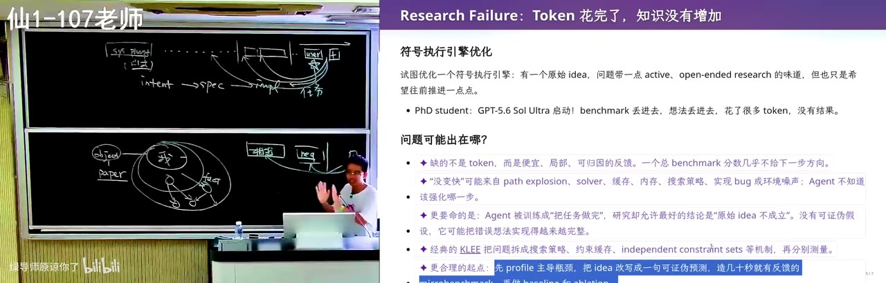

我作为审稿人的时候，我是站在人类的立场上去评审这篇论文的。然后我们站在这个构建者的立场上，我们是没有办法这样反过来的，所以我们只能一点一点从小的开始做，证明这个方法有用。然后他做错了这一步，他太想要去证明这个 idea 有用了，是因为有这样的一句 prompt。然后他就构造了很多小的 benchmark，然后在小的 benchmark 上做一些微小的东西，试图去给一些正面或者负面的结论，但这些结论对这个是没有用的。

*[88:02](https://www.bilibili.com/video/BV1CQt365EzW/?vd_source=37cee446e225a2346a19dde7527e3327&t=5282)*

然后他这里面犯了一个方法上的错误，当然我们纠正了。就是我告诉我的 PhD student 说，我们应该从一些真实的工具和 state of the art 的算法开始，这个 benchmark 哪怕要跑几个小时、都 timeout，这个 timeout 里面产生的这个搜索路径对我们来说是非常有价值的，它揭示了什么样的程序结构对于现有的探索方法是不好的。然后这个还挺好玩的，一个 research failure。所以它告诉你今天人还是有用的，我们没有办法把所有的事情都 delegate 给 AI。

*[88:39](https://www.bilibili.com/video/BV1CQt365EzW/?vd_source=37cee446e225a2346a19dde7527e3327&t=5319)*

## 纠正 AI 还是放手让它跑：你的精力该花在哪

但是与此同时，我们工作的方式可能也要发生变化。就是第一，这些知识很重要，什么操作系统、编译器，如果你没有概念，你提不出那个正确的问题，找不到引导的正确的方向；你对人类的知识没有概念，你也很难去引导它解决一个 open 的 question。但我也发现，就在和 AI 合作的时候发生了变化。一般来说我发现，如果我盯着那个 Codex 的 session，然后它一旦跑偏我就立即纠正它，我可以更快地完成任务。就如果是一个比如说就实现一个什么东西，比如说我今天就要上交互系统干个什么事，如果我纠正它，只把我的领域知识注入进去，可能总时间会完成得更快；但是如果我浪费更多 token，给它更多时间，它一般来说也能完成。

*[89:45](https://www.bilibili.com/video/BV1CQt365EzW/?vd_source=37cee446e225a2346a19dde7527e3327&t=5385)*

这时候就有一个 trade-off。我到底是花我的精力——就是你的精力是有限的，你们每一个同学的精力都是有限的。每个同学都应该去思考，你要把你宝贵的那些精力放到怎么处理 AI 上。因为是这样，我自己发现这是我自己的问题：纠正 AI 是一个有多巴胺的事情，它给我一种什么感觉呢？虽然 AI 很强，我好像还是比 AI 有点用的，它会产生这种非常微妙的心理安慰。而不是我就一个 YOLO 模式，然后等我回来，我也不会看历史，它反正搞定了，我验收一下它真的搞定了，我就不会看了。

*[90:32](https://www.bilibili.com/video/BV1CQt365EzW/?vd_source=37cee446e225a2346a19dde7527e3327&t=5432)*

但这个可能在非常长的时间里面都会成为同学们工作的一个常态，你们只有把自己的时间留在这些收益最大的事情上。这个时间是不能省的：你有一个东西不知道，你想要把它弄知道，这是你几乎百分之百的时间，作为学生都要做的事情。剩下比如说这件事情你知道应该怎么干了，把它干好，AI 能把它干好，你就放手让它干。这就有一种——好像在 pre-AI 的时代，大家就已经说了，说不要假努力，你自我感动、自己感动自己的努力是没有用的，你要有效的努力。在 AI 时代，可能这个效果会差距拉得更大，在每一秒钟的假努力，如果有一个你的 peer 是在真努力，你都是损失非常非常大的。这是一个自己的小心得吧。

*[91:29](https://www.bilibili.com/video/BV1CQt365EzW/?vd_source=37cee446e225a2346a19dde7527e3327&t=5489)*

然后以及最后，你们也会发现，随着指令、上下文的增长，指令遵循的能力确实会下降的。但是现在模型有一个很有意思的特点：一般来讲最后的 prompt，就留在最后的那个指令，还是可以遵循的。到前面之后，尤其是到中间的时候，它上下文指令不遵循。所以干活还是很好用的，因为一般最后一个短窗口就是一个具体的任务，是你的 prompt：帮我把什么东西修了，它就真的还是可以把这个事情给做完。所以模型还是很值得使用的。

*[92:05](https://www.bilibili.com/video/BV1CQt365EzW/?vd_source=37cee446e225a2346a19dde7527e3327&t=5525)*

## 真正的 long horizon：搜索是困难的，验证是容易的

好，那就到最后。如果你真正想要做一个真正 long horizon 的、非常非常难的任务，它不是解决一个问题，而是在一个不确定性当中探索，那么 ChatGPT 其实就解决不了了。ChatGPT 能够解决的是一个有 verify、它确定的、一直往后就能解决的问题。但是如果你让它去解决一个「帮我考虑一下几种方案，哪个方案最好」，它很有可能会给你一个不是最好的方案。为什么呢？虽然模型已经被训练成舔狗了，它完成任务才有奖励，它不完成任务是没有奖励的，所以它会给你一个有限的方案。

*[92:59](https://www.bilibili.com/video/BV1CQt365EzW/?vd_source=37cee446e225a2346a19dde7527e3327&t=5579)*

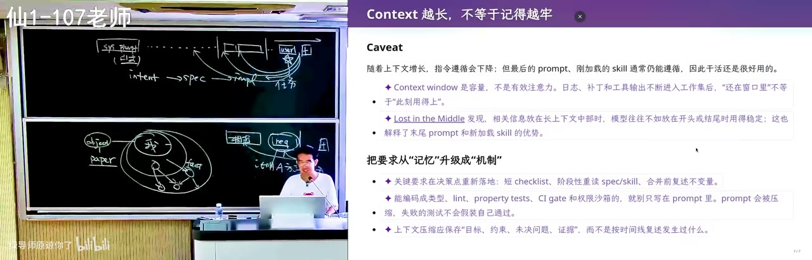

就像 P 和 NP，大家都知道 P 和 NP，它有这两个 complexity class，甚至有更大的 complexity class，有一个整个的多项式的 hierarchy。NP 问题说，你想要验证一个解是比较容易的，是 P 的；但是你想要找到那个满足条件的解是很难的。要找一个 Hamiltonian path，给你一个路径，是不是 Hamiltonian，你很容易；但是你想要找到一个满足条件的 path，就是 NP-complete，它是一个完全问题，3SAT 这样的问题。就是因为这个搜索是困难的，这个验证是容易的，模型为了完成任务，它势必只能做有限的搜索。

*[93:48](https://www.bilibili.com/video/BV1CQt365EzW/?vd_source=37cee446e225a2346a19dde7527e3327&t=5628)*

这样想一想，有一种是你在考试场上花点时间，一定要把这个考试题写完，无论如何马上要交卷了，你写，你的分数就比不写要高，所以你一定要写点什么。这个时候你就可以用一个算力换智力的循环。

*[94:16](https://www.bilibili.com/video/BV1CQt365EzW/?vd_source=37cee446e225a2346a19dde7527e3327&t=5656)*

## 算力换智力：不要成为 AI 时代的「子涵」

我举一个例子。你们这一代人是子涵吗？就是你们有很多同学是子涵吗？没有？你们还没有。比你们再小五岁的那个班上，一个班上就有五个甚至十个子涵。然后现在子涵就少了，现在子涵少多了。然后你看 AI 给我的这个名字还是很好的，你看它知道要去《诗经》里面找一个，还是可以的。就是它的品位，肯定现在模型提升了，但是你还是不敢用的。为什么呢？因为你用 DeepSeek 起名字，别人也用 DeepSeek 起名字，然后你就会成为一个 AI 时代的子涵，因为大家都是用 DeepSeek 起名字，然后 DeepSeek 都起了同样的名字。

*[95:16](https://www.bilibili.com/video/BV1CQt365EzW/?vd_source=37cee446e225a2346a19dde7527e3327&t=5716)*

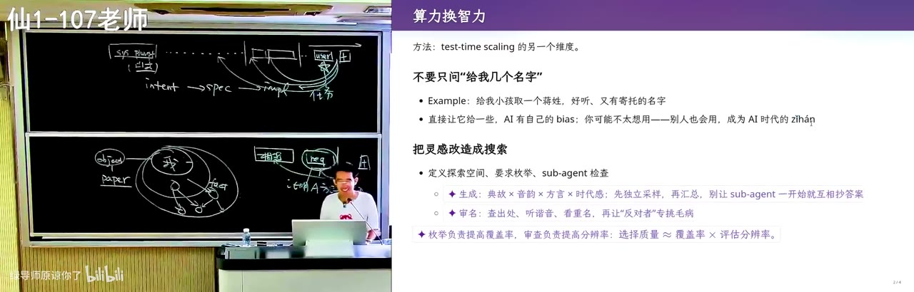

我的经验是，如果你真的需要一个非常 long horizon 的任务，你就需要一个系统性的调研过程。跟你们可能上什么科研实践课学的那一套就很像了：你们进入一个科研领域，第一件事情做什么？文献调研，穷尽解决和这个问题相关的所有的文献。这件事情，在 AI 想要快速完成任务的时候，AI 暂时还不会去花这个大代价。但是你可以做，名字是可以枚举的，你可以先选音，然后把不好的音给筛掉；选完音你再去用 subagent 一个一个去检查字。然后你可以给它，比如说你喜欢《诗经》，你可以选一个《诗经》里的词，那么你就实现了算力换智力。

*[96:09](https://www.bilibili.com/video/BV1CQt365EzW/?vd_source=37cee446e225a2346a19dde7527e3327&t=5769)*

你有个开放问题，一个非常大空间里面的开放问题。你如果直接让 AI 去用 next token prediction 的方式，它会给你一个它的偏见带来的这个东西。但是如果你可以把这个空间分割成很多个 disjoint 的部分，然后你的每一个部分就会变成一个有 verify 的、更明确的东西。你有更多的算力，你就有更大的智力。但这个有一个缺点：烧 token。

*[96:42](https://www.bilibili.com/video/BV1CQt365EzW/?vd_source=37cee446e225a2346a19dde7527e3327&t=5802)*

## 世界很大，人很小：墙里面是超人，墙外面是动物世界

所以这就涉及到我对人类社会的一个我觉得很有趣的理解，就是：世界很大，人很小。我们人类的品味，每一个人都是不一样的，因为我们带了太大的 bias，我们在不同的城市、不同的教育背景、生活圈长大的。Richard Sutton 有一个 Big World Hypothesis：我们就是学不到这个世界上面所有的东西。但就是因为我们带着这个 bias，才有这个一加一大于二，我们就是一个最大的群体智能，我们在一起实现智能。

*[97:24](https://www.bilibili.com/video/BV1CQt365EzW/?vd_source=37cee446e225a2346a19dde7527e3327&t=5844)*

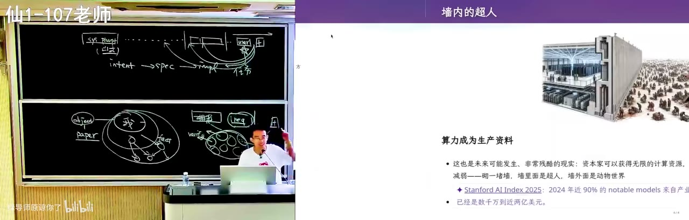

但这会带来一个未来的危机，我不知道，我现在要把这个问题先抛出来：如果这种真正 long horizon、就真正有价值的问题，可以用算力换智力，会可能发生一个什么样残酷的现实呢？有一类人可以获得无限的计算资源，他就有无限的智力，他就可以砌一堵墙，这个墙里面的人有智力，是我的朋友；在墙外面的人是普通人。那么因为假设计算机、AI 模型比人类的智力更高效，那我们外面的人就变成动物园里的猴子，就是让他们自生自灭，他们也无论如何也不可能赶上里面人产生智力的这个速度。那么墙里面是超人，墙外面是动物世界。我们大家已经在 AI 的这个关键的奇点快要到的时候了，我们可能需要思考怎么样防止这件事情到来。

*[98:13](https://www.bilibili.com/video/BV1CQt365EzW/?vd_source=37cee446e225a2346a19dde7527e3327&t=5893)*

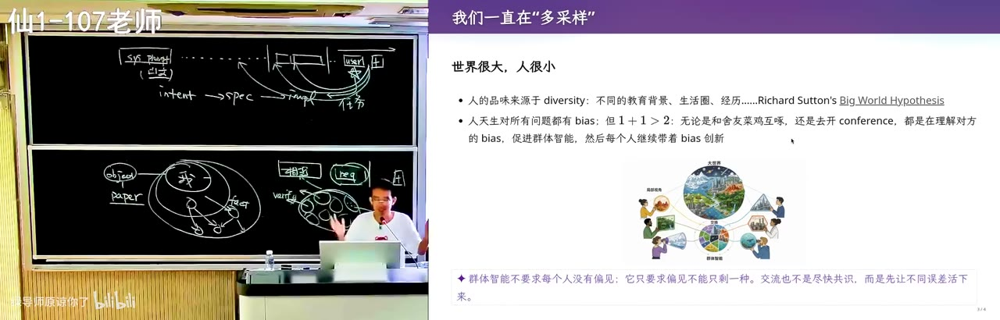
