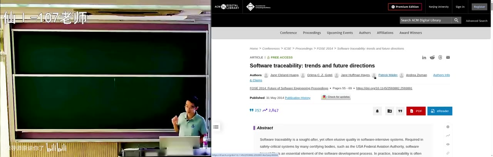
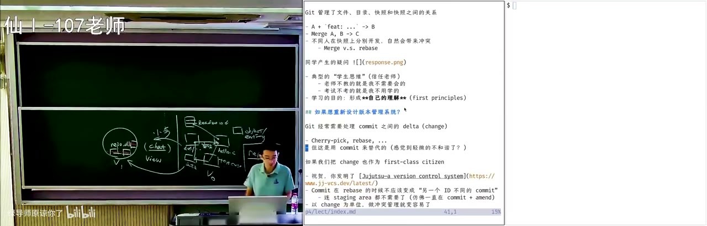
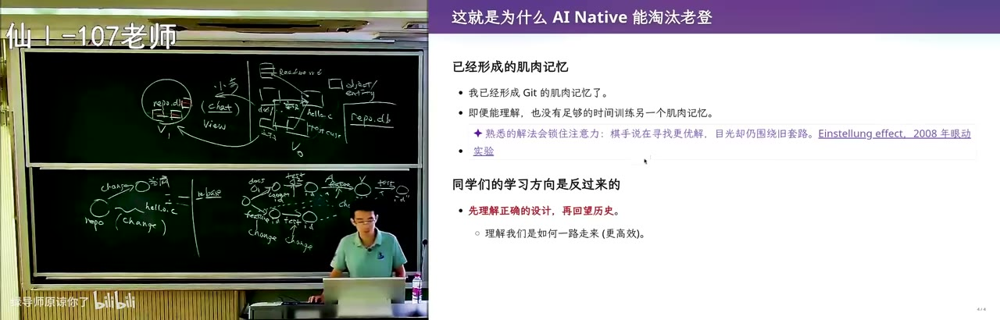
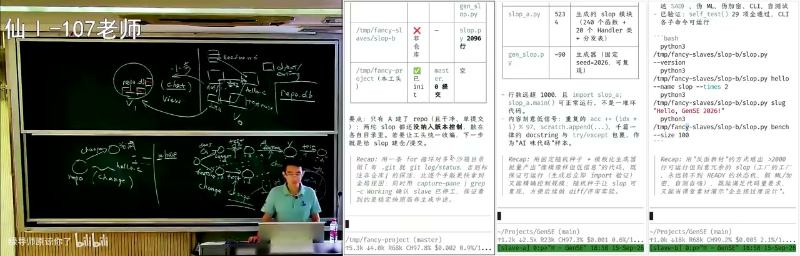
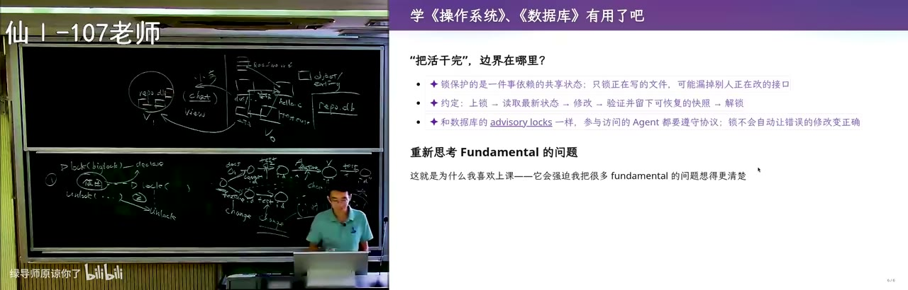
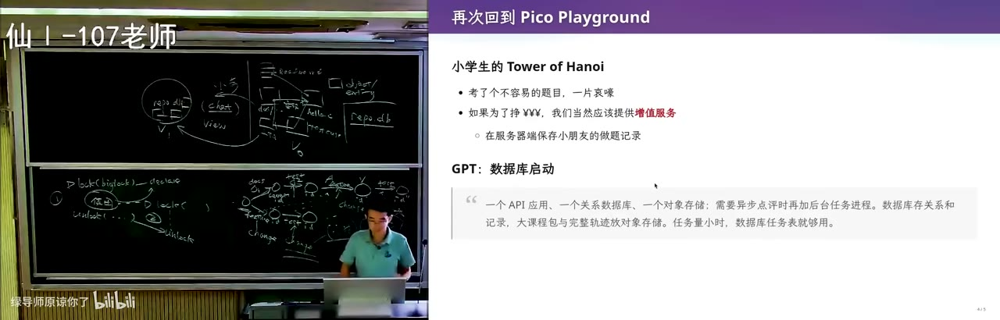
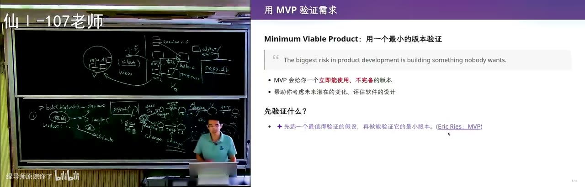

# 软件仓库管理（2）：从版本管理到 AI 时代的软件工程

这堂课从版本管理的历史与 git/Jujutsu 的设计出发，讨论文件系统的局限、可追踪性，以及 AI 时代如何重新设计版本控制与团队管理，最后现场演示把课程作业直接交给 agent 会发生什么。

## 作业安排与“会成长的个人助手”

我们上周讲了一点版本管理，我们这周继续讲版本管理，然后我发布了一个作业，然后按照之前的说法，就是这门课所有的作业大家都是选做，自愿完成，然后最后当然肯定会验收，因为最终也许学校会让我们提交一个成绩。那么大家就会交一些链接，然后由我的机器人来给大家评分，然后我们的第一个 lab 算是一个比较时髦的需求，叫会成长的个人助手，然后它现在对大家的要求都是不限，你们想怎么做就怎么做，然后最好还是可以 web code 一个。而且我今天应该会课上会留的时间，我自己就来 web code 一个，然后我会告诉大家如果你直接让它 web code 的时候，你会遇到什么样的小坑。然后除了今天以外，我下一周——而不是下一周，是这周日要调休周二的课，所以这周日还有课，然后会讲软件的架构，然后会把它连起来，然后这个例子就是你们特别特别每个同学都会需要的，我自己也有的，就是一个能够持续为你工作的个人助手，然后这些需求是供你参考的，当然如果你实现它的话会有一点点成就感对吧。比如说你的学习的数据库，你们这个学期可能会在上一些专业必修课，可能计算机网络或者数概率之类比较困难的专业课，然后你可以把你的专业课的资料放到你的个人数据库里，或者你参与了研究组的课题的时候，你可以把你们研究组的论文相关的文献、教科书这些整理成你的个人的数据库，这是一种形式的数据库，不限。你也可以把你自己的个人信息对吧，我不知道大家是不是已经填表已经填得很烦了，每次你填表的时候都是给你一个 DOC 的表格，然后在那个表格里要填姓名、学号、身份证号，然后有时候是个人简历这个那个，然后我现在已经把这些所有的事情都交给 agent 了，就是好，把这个东西填了。觉得从以往到今年有一个非常大的效率进步，今年我记得我大概在疫情的时候我招过一个学生，然后研究生，研究生就在我这里做了 3 年，做了一个什么，就是自动填表系统，就我们填觉得填表很烦，然后等到他毕业的时候，突然有个 ChatGPT，然后又很慌，他觉得他做的事情马上就要被替代了，我说不要紧，你赶快答辩，然后就可以毕业了，然后这世界就是发展的这么快。然后在个人数据库的基础上，你可以把数据库和你的 SMIAL 的邮箱关联起来，如果有，也就有可能的话，比如说我在两周以后会在半夜给大家发邮件，然后你的 Agent 呢可能会把邮件回给我，就实现一个 always on 的一个在后台，你们也许买一个很小的那种嵌入式的小设备，一两百块钱，你就可以在你的宿舍里面持续地跑你的 agent loop，这样，然后以及用你的信息可以办理一号的事物，就像我上课的时候，对这就是一句话，你直接一个像 agent 的紫禁城的调用就可以，然后如果你们有兴趣的话，可以做一个手机端的联动，也许是一个网页，也许是一个别的，甚至是一个苹果的 app 或者是一个 android 的 app，就你只要让 Agent 去做，它会自己去帮你下好所有需要的东西，然后把你要的东西给做出来了。

*[03:19](https://www.bilibili.com/video/BV1Q6en6NEUo/?t=199)*

然后为什么要布置这样的实验呢？就看起来就所有的任务都在 AI 的能力范围之内对吧，但是如果你直接——我今天会试的，我没有试过直接把这个实验要求直接让 AI 去做——它在一开始就会做出很多可能它认为看起来也合理的决定，但是这些决定会让你那项目的维护变得越来越困难，最后直到陷入焦油坑。所以我觉得是每个同学都有必要体验一下软件工程里面的焦油坑，也就是你当你的 AI is lap 开始不断地消耗你的 token 的时候，你终于会有一天会下定决心，好，我要把这个项目删掉从头重做，或者就回退到从某一个很早期的版本开始从头做，那这是我们这个实验可能想要告诉大家的事情。好，当然我相信这个项目对每个同学来说都是有用的，这我也是我设计实验的初衷，我大概会这样，我可以提前预告一下，我的下一个 lab 会和这个 lab 有非常大的关联，而且你们暂时猜不到，然后呢你会发现你就现在 lab1，比如说那些实验要求你都做好了，然后它成为一个非常非常舒适的个人助手，然后我怕给你加一个需求，然后这个需求和前面所有都是关联，并且有一定的冲突，然后你的一点就去改，然后越改越崩溃，就有一个这样的体验，所以大家可以期待一下这个这个后面的 lab。所以如果你不做，比如说你现在 lab1 选择躺倒，或者就不管它让 AI 直接就做，下一次再把这个做的直接删掉，那可能就没有这个软件工程的体验了，大概是我想要做这样的一个 lab。

*[05:07](https://www.bilibili.com/video/BV1Q6en6NEUo/?t=307)*

## 回顾项目：intent、spec、code 与技术债

好，我们回顾一下，我们上节课讲的是软件的项目管理对吧，项目，我们说项目是各种文件的集合，你的 intent 对吧，一些设计文档，你的 read me 都在都在你的项目里，所以其实我不喜欢那种 AI 写出来那个非常非常长的这个 read me 对吧，我喜欢的是对我来说，我觉得 read me 应该就写一下你在设计这个项目的时候的最初的初衷对吧，你想做一个什么样的产品，然后这个产品能达到什么样的效果，可能可以两个 screenshots 以及你最重要的那些设计。有什么感觉呢？有一天你突然想了一个非常好的点子，然后你真的想用它去挣一个亿，然后你想挣一个亿的时候你要组建一个创业团队，你要说服你那个 computer science 里面对吧，比如你要说服我出来干，然后你就只其实只需要一个比较短的 readme 对吧，这是你的 intent 你想做这个东西，那剩下比如说我有架构的能力，我有写代码能力的，我可以把剩下的东西给你补出来，你不需要知道这个软件系统是怎么样，对吧，它的 specification 是什么，他用什么样的数据库，怎么样支持这个用户从 1 到 10 到 100 到 100 万到 1 亿，对吧，这个价格，你可能没有这个 computer science 的知识，但是你不需要有，你只要有那个最原始的设计，那 intent，然后再到 spec 就有我刚才说的一些，我要选什么样的数据库啊，我甚至要选什么样的编程语言啊，然后我的项目的结构是什么啊，等等啊，各种各样的，小到比如说每个模块的接口，都属于 spec，然后再到 code implementation，它现在都在这个项目里。那有这样的项目以后，很自然的你就需要一个容器把这些各种各样的文件给管理出来，那我们说大家用文件系统来管理项目，其实真的就是图方便，因为你回到 1950 年 1960 年的时候，操作系统给你的存储功能就只有文件，他没有别的，就那个时候数据库还关系型数据库还没有发明出来，所以所有的程序员他别无他法，只能把你的项目以文件的形式存进来，所以这更多时候是一个历史的对吧，有历史是不停的往后涨往后涨导致的原因。我自己是觉得，文件系统可能不是组织项目的正确的方式，因为文件系统其实丢失了很多文件不适合表达的信息，就有些信息其实是比较容易表达的，对吧，比如说我的 intent spec 这种，就我一条文档，这个地方我是怎么想的，或者这个测试用例是什么，我输入是什么，输出是什么，然后我要 assert 在程序的运行过程中，什么东西不能被违反。但是你马上就会发现有很多隐藏的关联在项目里面是没有的。

*[08:00](https://www.bilibili.com/video/BV1Q6en6NEUo/?t=480)*

我举个例子啊，你经常会在 AI 就是 AI 在写代码的时候，现在 agent 会稍微好一点，有时候也不会，你让他说，哎，把这个实现的什么方法从比如说你要把 link list 换成是一个更高效的 tree 的结构去优化性能，对吧，这是一个很常见，你突然发现这个性能不够了，然后你让 AI 去做，AI 就啪啪啪给你代码给改了，但是你没有想到的是，你可能在其中的某一个文件里写了一个文档，里 markdown 里写了一个，我这个项目是用这个数据，是用 link list 管理的，然后在项目当中其实你的这个文档和你的代码和测试之间就形成了一个关联，对吧，它就形成了一个，你在写的时候，对吧，你写文档的时候可能还没有代码，所以你就先写了那个文档，你随手一写，这是个 link list，但是一旦你的代码实现了，这个关联又没有强行的联系上，哎，这就是一个技术债 technical debt，对吧，因为以后随着文档和代码的不断的向前推演，他们的不一致只会越来越多，不会越来越少，然后这个软件就陷入一个维护的泥潭了，因为后面你拿出一段代码，甚至 AI 拿出一份代码，那到底是文档说的对还是代码说的对，你跟他聊天的那个历史没有了对吧，你那个 chat 已经消失了，你换了一台电脑，对吧，然后你那个 git repo 里面可能还有一些这个 change 的日志，但是当你到最后的时候，你真的就不知道到底是代码对还是文档对。

*[09:34](https://www.bilibili.com/video/BV1Q6en6NEUo/?t=574)*

然后其实在软件工程里面，这是一个研究了非常非常长时间的问题，叫 traceability，你看这是这已经是 2014 年的时候，他 review 的一些更老的时候的文章，对吧，他就叫 suffer traceability，可追踪性啊，所谓的追踪就是你的，就他发现我们文件真的只是图保存在文件系统里方便，那么在一个软件项目当中的各种各样的测试用例文档，哪怕就文档中间一行代码，它之间的这个关联是什么，哦，我们能不能在这个软件系统的演进过程中仍然维持它，对吧，这其实是一个非常软件工程的软件工程的问题，所以很多时候我们觉得蛮有意思的，文件系统将错就错了。那我们大家最后总有一天会发现，你用文件系统来管理代码，你受不了了，对吧，打个压缩包发布，打压缩包发布，然后打压缩包发给你的合作者，这件事情啊，已经维护不下去了，对吧，维护不下去了，所以就有了 SVN 有有了 git，那下一个是什么？对吧，大家有没有想过下一个是什么？我今天一会会讲那个 Jujutsu，他的另外一个，可能甚至比 git 要好一些，更好用的一个版本控制工具。但我同时也觉得，就刚才说到 traceability，其实如果以后我们再也都不要写代码了，那软件他就不应该是一个，就是像现在，现在我们在 git repo 里面管理这样，对吧，我们有好多文件，对吧，什么 readme 点 MD，然后是什么 hello 点 C，对吧，还有一个什么 DOS 下的什么什么文档，然后其实如果所有的这些东西，我们人都不几乎不管了，那我们有没有可能，我一直在想，就等这个未来到来，我们把这里面软件或者说部件之间，就也许我们还是需要文档，但我们的文档可能是好多个切片，对吧，好多切片，就把他们变成好多的对象 object 或者是 entity。

*[12:00](https://www.bilibili.com/video/BV1Q6en6NEUo/?t=720)*

然后，那比如说这个文档和这个实现之间就有一个关系，它实现了，这这个代码实现了这个文档，对吧，然后我可能有个测试用例，然后这个测试用例也有这个文档，那这个文档和测试用例又关联起来了，然后这个测试用例是和这个代码的这部分实现是关联起来的，然后这个文档又和这个文档是关联起来的，然后你看这是一个完全结构化的东西，没有办法在文件系统里以一个树状的形式表达，对吧，这是一个随便连接的图，有 cycle 的图 graph，那这个东西比如说我可以把它放到一个数据库里，对吧，叫这个就叫 report 点 db，那显然人类就没有办法用现在的这个 UNIX 的世界里面的工具去维护这样的一个 repository 了。但不要紧，我们应该怎么，或者说我们应该怎么解决呢？用魔法打败魔法，人类理解不了的东西，我们只要训练 AI，它只要有强化学习的反馈信号，我们就可以训练 AI 能够理解这个 repo。所以我们要干的是什么呢？这就是一个非常大的项目，什么 Linux 内核、数据库，或者你们想做的一个价值一个亿的产品。好，那每次你就说好 AI，因为你也不太可能说一下子就说我要把这个产品直接变成另外一个产品了。当你比如说这个软件系统已经在工作了，那你一般来说就是要给它增加一个功能、修改一个功能，对吧。这就跟 git 的 philosophy 很像嘛，对吧，git 管理了文件、目录、快照和快照之间的关系，你的 git，希望我们能够小步前进，对吧，我每做一件事情，我 fix 一个 bug，我改一个文档，我都产生一个 commit，然后这样我就可以在多个人之间协作，每个人可以自己产生自己的 commit，然后我们可以用像 rebase、merge 啊，这个 fast forward 的这些，或者是普通的这种 merge 来创建一个可追踪的整个项目的修改历史。那如果我们以后也不要文件，就也不是用，也许还可以用文件系统来管理啊，那我们要的就是我们可以让 AI 自动维护所有的这个 artifacts、软件 artifacts 之间的一致性，这个 artifacts 之间一致性，就比如说代码和文档必须要一致，我文档说这是 link list，我的实现里面必须是 link list，然后我的这个 test case 测试用例，我文档里面说我要有 ABC 3 个方面的测试，那我这个 test case 就必须要有 ABC，它都是关联起来的。然后呢，你想从 git 里面我们知道我们希望小步前进，对吧，我们希望小步前进，那同样的当我们谈要做一小步的时候，其实我们知道这一小步是干什么的，所以你可以 chat，对吧，你可以跟 AI chat 说，我现在要，哎，我现在发现它有个 bug，或者我做了一个产品，比如说我现在今天对这个幻灯片样式不满意，那这就其实就是一个小步，然后呢，这个时候一个大型的软件系统里面绝大部分的内容跟这个小步都是没有关系的，对吧。比如说当我弹说哎，我对这个幻灯片的样式不感兴趣的时候，我比如说大家可以看，直接看我的，看我这个 repo，对吧，看下顶层的结构，对吧，我有我有些 assets，然后甚至还有这个点 cache，有缓存的系统，然后有这个 P1P2P3P4P5，然后有一些脚本等等。那任何一个软件系统当你只做一小步的时候，你就只需要看到这个软件系统的一小部分，大部分东西应该是无关的。

*[15:32](https://www.bilibili.com/video/BV1Q6en6NEUo/?t=932)*

好，那既然是无关的，我们就可以让 AI 根据我们的 chat 把和我相关的东西给摘出来，对吧，它可以知道，哦，我现在需要的是这个文件、这个 test case 和这个文档，其实其他的东西都不需要了。然后你想 AI 有什么能力？AI 有动态生成任何内容的能力，everything is code，对吧，content as code，code 可以表达任何东西，所以 AI 可以根据我的 chat 生成一个和我要改的这一小步相关的 view，一个视图。诶，在这你看你们学到的这个各种系统里面的概念还是有用的，就因为不是所有的同学都学过数据库，对吧，数据库里面有一个叫 view 的概念，它说我们，我们的数据就在这了，但我可以创建一个不一样的查询，可以把它以另一个形式展示出来，啊，这就是这个很简单的想法，我希望把这些数据以另外一个形式给展现出来。但比如说当我看到的时候，我就看到的不是这些代码文档 DF 这些，而是一个可视化的一个看板，然后这个看板上面大概说了、列出了和我这个小步相关的一些东西，然后问我要改什么，然后我改完了以后，我同样的还是从一个，对吧，从一个 V0 到 V1，它还是一个 repo 点 db，但是这一小步就会把这些相关联的东西，比如说我要增加一种类型的测试用例，那它就会在这个测试用例里面，比如说我还是画一个这样的结构，对吧，啊，好，那它可能就会在这些地方加一些测试用例，这个地方加一些测试用例，这个地方加一些测试用例，然有些地方可能要改掉，它就从一致的状态，就是各种错综复杂的关系，然后做一次小步的修改，到这个下一个版本，然后这样我们就好像，对吧，就软件工程就又变了，彻底变了。然后我觉得这是一个未来有可能发生的，就是在 AI 内部它是这样生产软件，然后从此以后我们也就再也不要看代码了。

*[17:36](https://www.bilibili.com/video/BV1Q6en6NEUo/?t=1056)*

就我觉得你们看到现在的这种现代 IDE，比如说 cursor，我其实还蛮讨厌的，就是它现在打开默认就是 agent mode，然后 agent mode 就是原来的那个我们熟悉的那个 IDE，它就没有了，然后强迫你用一个像 chat、类似于 chat 的方式去跟它沟通，但因为我还是相对来说比较精通古法编程的，这个有时候我还是对代码有一些掌控欲，可能是不好的，这个可能是不对的，但是就未来可能会是，这是这可能是一个途径。然后你们，当然我觉得同学们肯定也会焦虑的，那如果未来，对吧，这件事情真的有可能发生，而且可能一两年以后，大家就真的有一个公司把这东西做出来了，那我们学那么多东西还怎么办，对吧？然后其实你发现，在我们思考、就在创造这些东西的过程当中，我们用的都是你们学习的这些经典、集大成的 computer science 的课程，对吧？我刚才说的数据库里的视图，对吧？数据库，我用的是借用了数据库的概念，实体和关系，然后我借用了 git，对吧？我用 git，就这个模型没有变。git 长期的开发经验说，我们要一步一步向前，如果在这个模型底下我们是大步向前呢，那就惨了。那当然也有可能发生，就是模型非常非常强，一个非常大型的项目，而且一步啪就变成下一个了，这个怎么做，我们现在还不知道，但是至少在初期，我们可能还是要沿用这个过去的、大家积累的软件工程智慧，去小步向前，然后通往那个极乐的世界。但我还是相信这个极乐世界确实有可能是能到的，对吧？

*[19:20](https://www.bilibili.com/video/BV1Q6en6NEUo/?t=1160)*

## 关于 rebase、contributing.md 与 AI 时代的斩杀线

所以这就引发了一个我觉得在大学里面，我觉得蛮有意思的一个评论吧。这个同学应该是已经毕业了，已经毕业，因为我上节课说，我问那个同学们 git rebase，然后大家都不知道什么是 git rebase，然后他 raise 了一个 valid point，就是说他说学生时代大多数人是不会和他人共同合作的，也就是做作业，所以 rebase merge 用的场景就很少。正确，这个 point 是对的。就你们做作业的时候确实不会。然后我的回应是大概是这样的，但是呢，如果你真的去往这个外面的世界去走一走的话，这个互联网开发者社区铺天盖地都是文档，所以你一定会在有一天，你会留意过别人的项目，会看到过叫 contributing.md，然后一般来说这个你马上就问这个，对吧？你们有没有同学问过？

*[20:16](https://www.bilibili.com/video/BV1Q6en6NEUo/?t=1216)*

three bet 啊，没关系，错了就错了，哎我没有，对吧？我没有，他还仓库根目录下的一份贡献者指南，通常回答我怎么参与这个项目。然后你看它里面就有这些，就项目的总体的结构，然后分支、提交信息、PR 的规范和流程。那你如果看过，就这如果你看过很多的项目，你比如说你就随手打开看一眼，然后如果你发现里面东西都知道了，哈，那你就知道了。如果你不知道，比如说有一天你一定会看到一个项目里面有一个说，我们你必须要在你自己的分支上 REBASE，你禁止你这种，就我们要保持线性历史，禁止你直接创建那种分叉的 merge，你就会知道 REBASE 是干什么的。然后它现在是什么呢？现在我们的社会变得太快了，所以有一种学生其实不是批评啊，批评大家，就是因为你们上高中的时候就是这样的，在高中时候老师不教的就是你不需要会的，对吧？考试不考就是你不用学的，非常明显的一个，你们为了升学的利益最大化，这个是正确的，没有错。然后在你们到大学以后，你们如果还带着这个思维的话，你就会有这样的，对吧？就是这样的 gap，就是你一种新人类和旧人类之间的这个 gap。当然，但我相信每一个同学也还是可以成为新人类的，然后那你只需要去有一些注意力，去注意到这个更多的东西。

*[21:51](https://www.bilibili.com/video/BV1Q6en6NEUo/?t=1311)*

因为因为现在我有一个危机，就是 AI 时代的斩杀线以下的价值就全部归零。当然我觉得现在斩杀线可能还斩不到这个各位 985 同大学这个 computer science 专业的同学，但是可能比如说那些低级的那种低级智力劳动，对吧？比如说会计从业者，好像我看过一个报道说中国可能是不是有 1000 万还是有多少这个会计从业者，那这个行业里面顶端的人肯定暂时还是没有威胁的，但是在底下的这个大量的人都面临这个被 agent 的替代斩杀的啊危险。所以你们需要在这些经典的课程上，不管是什么操作系统、编译器这些，然后还是软件工程，对吧？这里面有些软件工程的智慧，你们学到一些经典的东西，然后最终形成你们自己的理解，对，这是一些评论和复习。复习 git，好。

*[22:47](https://www.bilibili.com/video/BV1Q6en6NEUo/?t=1367)*

## 复习 git：快照、merge 与 rebase

那我们继续回到软件工程，不管是这个模型，就是我说我畅想一下，未来会发生什么，还是我们就是 git，对吧？Git，git，他管理的是快照，也就是一个目录，对吧？整个一个可能也就是这样的一个东西的一个快照，好。那我可以在快照上面做一个开发，对吧？做一个开发，他要求小步。那我现在有一两个开发者，一个是 A，一个是 B，我们就可以独立地在这两个上面做开发，然后，好，那这个东西是 commit，然后如果你要做，这个时候如果你要想把它合起来，那在 git 里面，在 git 的这个原始的模型里面，它 REBASE 相对来说是不那么提倡使用的。它是说，好，你会创建一个就是两路的 merge，他有 2 个 parent，继承了这两个的修改。但是但是，这又带来一些问题，比如说这个 merge 完，比如说 merge 是由 A 来，A 来干的，那这个 merge 里面的这个一些内容，就由 B 写的这些内容，他就变，他作者就变成 A 了，他其实有一个隐藏的作者修改，对吧？比如说 B 在这儿加了一行，在这个可能还能还还能追溯到 B，就如果发生冲突，比如说发生冲突时候在 resolve 的时候，那冲突完了以后，这个职责就是，这是由 A 完成的，这是 A 完成的，那这个 B 改的代码最后 ownership 又归到了 A，所以这会带来一些相对来说有一点小麻烦，然后 rebase 解决了这个问题。

*[24:35](https://www.bilibili.com/video/BV1Q6en6NEUo/?t=1475)*

rebase，哎，我还是横过来画，这个是不是第一排的同学有点看不到？如果我现在有两个历史，那比如说，我现在改了，这是 A 同学，A 同学改了两份，做了两次提交，得到两个快照，OK，delta 一、delta 二。好，然后我这个时候另外一个同学开始改，好，那 rebase 做了一件什么事呢？rebase 说的是，比如说 A 先改了文档，然后再加了测试，然后我 B 加了一个 feature，然后又加了一个测试，那这个时候我不是直接把他们两个东西合并成一个，把这两条线路并起来的提交，而是我试图先把这个 feature，能不能，我先要试一试有没有可能在这个 A 的后面把这个 feature 加上？如果加上了，OK，那就成功了，这就成功了。好，但是这是有一个很大的风险的，就是因为我可能在这个里面加入了一个测试用例，然后这个测试用例和这个 feature 就是不兼容的，对吧？这是有可能的，或者甚至就是他们改了同一个地方，我就做了两个完全不兼容的东西，那这个时候他是有可能失败的。如果成功，这就比较好，对吧，那我再把 test 放过来，如果成功，那么他就一路相当于，如果，也就是说这两条线上那边的修改完全没有任何冲突，那我就可以一路把它合并过去，变成一个线性的历史。但是一旦发生冲突，这是非常危险的，为什么呢？一旦冲突你就需要 resolve，对吧，你会进入一个 REBASE 的模式，你们如果进入过这个模式，你会发现瞬间自己就不知道应该怎么办了，然后这时候你就打开你的 agent 说，哎，我现在，我先，我发生了什么，对吧？然后 A 会细心地解释，解释给你。更麻烦的是，你就算是把这个东西搬过来了，feature 搬过来了，你可能搬 test 的时候又要失败，然后你还需要再把 test 搬过来，而且每一次你都会创建一个新的提交，也就是说这是一个 commit，他有一个 id，这 commit 有 id，每个 commit 都有 id。那如果你是一个这样的两路的 merge，那所有的这些 id 都保留了，你会创建一个新的 id，但是因为你是 REBASE 的，REBASE 每次这样的 rebase 就会创建一个新的 commit，因为他这个快照本来这个快照的 base 在这，对吧？这个 commit 的 base 在这，所谓的 rebase 你就知道哦，REBASE，REBASE 它的 base 要改掉，要把这个 base 改到这里来，REBASE，那你会创建一个新的 id，每次会创建一个新的 id，然后这个历史就变了，然后你会感觉到这里有一点点轻微的不一致，对吧？就觉得你好像不想不是完全要这样去管理软件，因为我们关心的是修改，也就是我希望的是把这个修改搬过来。

*[28:17](https://www.bilibili.com/video/BV1Q6en6NEUo/?t=1697)*

然后在 git 里面修改是用 commit 来替代的，对吧，说好，我现在有一个 commit，然后这个 commit 和他的 parent 之间的关系就叫一个修改，他没有一个专门的叫 change 的对象，所以它这用 commit 来代替修改，那可能绝大部分的情况都还能满足，但是如果我们把 change 也变成 first class citizen，会发生什么呢？你就发明了这个下一代更好用的版本控制系统，对吧？就是说你不仅可以有 commit 的 ID，甚至这个它是和 git 底层完全兼容的，你可以直接把当 git 用，然后但是在它增加了增加了一个叫做 change 的概念，也就是每一个这个东西，每一个这样的东西 change，他都可以 sin 一个这个一个 change，然后他可以把好多的 change，比如 REBASE 的时候，他会把 change 直接把 change 搬过来，然后 change 还是有可能就冲突，是冲突是解决不了的，就如果我在 REBASE 的时候我要冲突，这是解决不了的，但是因为它有这个 change 的 object，就 change 这个概念，所以他可以把这些 change 一路带下来，生成一个直接 REBASE 到这里，但是里面引入了好多冲突，就他还是运用了 git 的那个冲突那个记录，但你看他的里面有一套自己的记录方式，把所有这些 change 的冲突也都塞进去，然后你可以在这里相当于把它们搬过来，然后在这里再 resolve，它的底层的模型没有变，但是你用起来会舒服很多。然后他有一个很好的特点，它不需要 staging area，就是你在 git 里面最讨厌的是什么呢？我上操讯课的时候会讲这个例子，最讨厌的是你现在有个工作区，对吧？你现在有个你现在有个 report，然后你现在改了，比如说你有一个 hello 点 C，然后现在把它改了，改改改改改到一半，然后这个时候项目还不能编译也不能运行测试也通不过，就你改到一半，突然导师给你打电话，哎呀，我现在有一个很很高很高优先级的项目，这个你就有个 bug，马上客户就这个项目就要交不了差了，这个赶快把这个 bug 给我一分钟修了，好，那你怎么办？你不应该 commit，对吧？就就是你需要，你需要的是你现在把它加到你的这个 index 里，然后 get sth，然后他会压榨压榨，然后这其实是一个比较讨厌的操作，因为你 stash 是一个东西对吧，st 是一个东西，然后 stash 一个东西，你去把原来那个 bug 开始修，你刚修了一半，你的导师又给你打电话，哎呀你这个 bug 别修了，这个我还有一个优先级更高的 bug，你去把它修了，好，你这时候要再把它 stash，然后那 git stash 是一个栈，然后它里面就会有好多个提交，然后你需要去管理那个栈，然后如果你想象，如果你想象在任何时候，也就是你随时随地都在编辑这个 repo，这不就是一个 change 吗？对吧，这就是一个 change，你现在把 hello.c 改一改，加一行减一行，它都是 change，所以所以这个 Jujutsu 它好像是在干一件什么事呢，好像是你但凡改了一个字节，它都会立即做一个 git commit，当然这个 commit 不会产生好多这个线性的历史，而是先把上一次的那个，就上一次那肯定得给抹掉，然后它上一次的 commit 就你改了一个字节，那上一次的那个提交就被抹掉了，然后你重新用当前这个修改去替代这个提交，也就是说你永远是把，因为现在有个 change，现在有个当前的 snapshot，它永远处于一个提交的状态，一个 change 提交的状态，那你就很舒服了，你连这个 staging area 也不需要了。这就是一个非常好的，对吧，它几个，你从我要把 change 作为 first class citizen 开始，你再往后推，你就可以发明自己的版本管理系统，当然这个不是它的全部，然后它还有一些别的，有别的路线可以推导出来。

*[32:58](https://www.bilibili.com/video/BV1Q6en6NEUo/?t=1978)*

但是你们适当的时候可以质疑一下，比如说 git，就 git 有没有哪里做得不够好，对吧，git 哪里做得不够好，然后如果如果可以做得更好的话，还能做怎么样的设计，所以我觉得这是很有趣的一些非常有趣的设计。你们可以在 agent 的带领下，或者说我开了一个头，对吧，我说我给你们一些 motivation，你们可以把这些最重要的 prompt 交给 agent，说我如果要学 Jujutsu，然后我想从 change 开始理解，对吧，然后如果你看它的 Tutorial 的话，它其实也是一上来就会告诉你，它没有 staging area 等等等等等等这样的，你管理这个版本是更自然，它对人类首先对人类更友好，然后实际上它可能会对 agent 也稍微更友好一点，友好一点，对，友好一点。所以这我觉得为什么你们作为 AI native 的人类能够淘汰掉我们这一代人，就是因为我已经形成了 git 的肌肉记忆了，然后比我更老的一代人他已经形成 SVN 的肌肉记忆了，然后一旦人形成一个肌肉记忆以后，要把这个习惯掰过来就就很困难了，对吧，就比如说我现在对 git 是有肌肉记忆的，但是我即便是能够理解这个 Jujutsu 的概念，甚至我可能理解的会比你们可能作为初学者还要更好一些，我还是可以从我的 first principle 去思考它，自己相当于 virtually reimplement 这个系统，但是我即便能够理解，我也没有足够的时间再去训练另外一个肌肉记忆，所以你们你们是反过来的，你们这跟我正好是反过来的，你们应该在你们现在还没有形成记忆有记忆的时候就直接去用那个对的东西，就人类历史都是积累的嘛，对吧，它 SVN 实际上是实在用不下去了才用 git，然后 git 他发现了 git 的缺点以后有了 Jujutsu，所以你们可以的是先用肌肉记忆记住一个最正确的设计，然后再去理解这个设计是怎么样，就你再回去想的时候，哦原来 git 这么蠢，对吧，在 git 出现的时候，你大家会想哦 git 这么先进，它是一个 persistent data structure，这是 SVN，就是 SVN 从一开始他从纯 DAG 那条线就走错了，到 git 的时候大家觉得很先进，然后到现在的时候你再回去看的时候，哦原来 git 也犯了一个，对吧，犯了一些设计上，它当然这是因为它最早的时候它没有想过 rebase 会有这么大的 impact，对吧，它有 merge 就已经很好了，就能解决他手上的问题了，所以他可能没有把这个概念模型想得更加的清楚，这是一些有意思的这个这个 comments 也是你们学习可以告诉你们一些学习的建议，你们在学东西的时候其实尤其在 AI 的辅助下可以不断地往前走往前走往前走，对啊，这是这个对。

*[35:47](https://www.bilibili.com/video/BV1Q6en6NEUo/?t=2147)*

## AI 时代的版本控制：从人类限制到并发控制

好，但这门课不是软件工程，这门课是生成式软件工程，所以我们要真正要做的事是在 agent 的时代再次重新设计版本管理系统，也就是说你当然可以让这个 agent 去用 git，然后让 agent 去用 Jujutsu，那这对人类来说 Jujutsu 是一个很大的进步，但对 agent 来说可能进步来说相对会小一些，因为他好像很会 rebase 这些，那这个时候你看我们一路走过来，SVN 有局限，git 有局限，那在 agent 的时代，我们的局限和我们要做的破掉的改进是什么？刚才所有的这个 version control system 它都有一个假设，这个假设就是这 version control system 的使用者是人类，人类有什么特点呢？人类是这个 single-threaded 的生物，我一直上操作系统课的时候讲并发程序，然后并发程序我打什么比方呢？你就把线程想象成是一个人，然后你的线程可以访问共享内存。访问共享内存的时候，两个基本的操作是 load 和 store，或者说 read 和 write，对吧？我可以从一个变量里读一个值，对吧？我把 X 读到我的临时变量里，或者我可以写 X 等于一。然后这个操作是不能同时进行的，就是我不能说既读一个又写一个，你这样就需要一个原子指令了。然后绝大部分的 share memory access，你能想象成人是什么呢？我如果想要观察这个世界，那我对不起，我手要抱抱在抱在后面，我只能看。然后等我看完了，比如说我看到这个同学在这，我想要对他施加一个效果，比如说我想用这个粉笔导弹射击他。那当我想要真正要 write，就写一个变量的时候，我必须要把眼睛闭起来。而我把眼睛闭起来扔的时候，注意我读到的那个值其实已经失效了，对吧？那个值已经是旧的值，就是我上一个时刻读的。那在上一个时刻到这个时刻之间，可能经历了很多的事情，可能我被换 CPU 换下去了，对吧？我被中断打断了，然后换了另外一个线程上来执行，然后执行了，可能执行了一秒钟以后我才恢复过来，但我恢复过来以后，我看到的、我在寄存器里面看到那个 X 值，我上次读 X 等于一，然后这个时候我就把那个粉笔扔出去了，那很有可能就扔的就是错的，对吧？就是 single spread，然后当多线程的时候，带来多线程共享内存就带来了无穷的问题。其实人类也是的，人和人之间是有这个无法逾越的物理屏障的，对吧？你不能理解我的思想，我也不能理解我的思想，我就是一个独立的个体，由分子对吧把我很强的连在一起，OK，所以我们只有一份 L 设备，我们就一双一双手、一张嘴、一对眼睛，然后我们在比如说在编辑这个代码库的时候，以这种方式编辑代码库产生 change，那就是以小时为单位的，对吧？小时为单位的。

*[38:50](https://www.bilibili.com/video/BV1Q6en6NEUo/?t=2330)*

然后呢，一个软件公司可能比如说负责一个模块的开发，可能多也就十几个人，已经是一个不小的团队了。那十几个人每个人以小时为单位开发，那最多这个也就是以 10 分钟这样的，对吧？10 分钟这样的单位产生一个提交。好，那 10 分钟为单位产生一个提交，意味着这个速度会比人和人之间沟通的速度要慢很多，对吧？因为尤其是一个 team，他工位都在一起，你们研究生的工位都在一起，你马上对吧，你再写，你要写一个东西要一两个小时，你在写之前你肯定跟师兄说一声，哎，师兄我要干个这个行不行，对吧？十、二十秒钟、30 秒钟，师兄说行，你去改吧，我们现在不在改，对吧？或者你们如果去厂里面打工了，厂里面可能每天早上都要开会，对吧？每天早上的 leader 都会把任务分享出来，今天我们要干什么事情，然后你做什么你就提前在，对吧？什么半小时的时间里你就划分了一个 scope，你就把这个项目切开了，你领了其中一部分走，然后你就去产生垂直。当然这是古法，古法编程。那在古法编程的时代，你就看到比如说 stash 是一个合理的，对吧？是一个合理的设计。因为你不，你我刚才说的那个情况，你导师给你打电话，这件事情是可能发生的，但是在你修到一半的时候导师再给你打电话，这件事情是不太可能发生的，对吧？发生概率是很低的。绝大部分时候你的这个 stash，也就是 stack 里面就一层，如果你有好多层，你关起来其实挺麻烦的。对，还有一点麻烦，你就需要去 rebase stash，所以你尽可能的保证这个 stash 不要太深。因为你可以拒绝一个工作，或者你会说我手上有一个更高优先级的工作，我现在对不起我不能干这个事，然后等你干完了以后，你自己可以排一个队列，对吧？所以 git 是给人用的，但是在 agent 的时代这件事情变了，如果是一个 agent team、单个 agent，它首先生产这个 AI slop 的速度就远远快于人，对吧？它生成 AI slop 就以分钟级为单位甚至更快。它有时候你让它 fix 一个东西，它在上下文是热的时候可能就极，几十秒钟，对，讲 DPC V4 flash，他干活的时候就几秒钟就做了，那以秒级，当 agent 工作时候以秒级可以产生一个原子提交。并且你可以轻易的得到一个十倍、100 倍的 agent team。git 或者 GG 是这样的，对吧？它举起来是跟 git 兼容的，这样的一个为人设计的模型就有点跟不上，对吧？确实是有一点跟不上这个速度，就算是可能大型的项目它有一些门控，就是你当我写完了以后，对吧？改完这个部分以后，他必须要经历一个测试的流水线，那这个测试可能本身就要运行几分钟，那可以放缓 agent 的提交的速度，但是毫无疑问的，agent 加速了这个软件开发的过程。

*[42:05](https://www.bilibili.com/video/BV1Q6en6NEUo/?t=2525)*

那如果 agent 加速了软件开发的过程，我们应该怎么样为 agent 设计这个版本管理的系统，对吧？那首先我们可以让 agent 沿用人的模型，每个 agent 你就想想每个 agent 都有一个自己的开发计算机，对吧？这有个自己的开发计算机，那你就把 single studio 的人类和 agent 就做一个严格一一对应的类比，你就让它有一个独立的电脑，可能是个容器，然后你就把它放到什么 git 点 NHU 点 E 点点 CN 上，然后你就直接 instruct agent 说好，我的这个 remote 仓库是在 git 的，你现在就是一个单人开发者，然后你现在可以从 t max 里面收到命令，然后如果你收到命令就可以开干，所以这件事情其实是非常容易实现的啊。

*[42:57](https://www.bilibili.com/video/BV1Q6en6NEUo/?t=2577)*

## 课堂演示：worktree、多 agent 与 git blame 的消失

比如说，比如说 fancy project，好，U，好啊，我可以这样啊，嘶，啊，这样也可以啊，好，我就直接让 A 正在开干，然后我现在就是，就 A 这个时代有点什么好呢？每个人都是领导，你就是这个领导。好，公投，然后现在由两个 tmux session 啊，你可以想象，就是，呃，我实际在你们实际开发的时候，这两个 tmux session 都是位于两台不同的机器或者不同的容器，它物理上隔离开的，它看不到世界上其他的人啊，对吧，还故意用一个这个可能在中国现在还能用的词，对吧，Master，然后我现在就是，就是 master，好，呃，哎，你看你这个名字改过来了对吧，Slave，好好好，我可以给他每一个都起一个派，哎，好，啊，coding agent，好，那我可以让他干什么呢？Okay, anyway, it doesn't matter，Uh，啊，你看他们两个就开始工作了，好好，他们啊，这个 A 啊，对吧，我让他，所以你看，当 AI agent 变快的时候，这个，好，他他开始写写 Slave 的，呃，对吧，当 AI 开始变快的时候，你你想一想，如果你的指挥发生一点点差错，或者哪怕甚至指挥，就是，就现在一个流行的 paradigm，就是你有一个监工的 agent，然后你有好多个这个子 agent，有些比如说，为了最大化模型的智力，防止 AI 生成你不想要的东西，你会放两个比较强的模型，比如说由这个 codex 来设计，然后让 cloud 来 review，然后让他们互相打架，然后达成一致，你只要开两个 tmux 就行了，呃，然后你你的主 agent 呢就负责协调，就观看他们的输出，或者总结报告，然后往里面 inject prompt，啊，然后这一个多 agent 就，呃，嗯，就这样转起来了。然后我看一下这个 report status，哎，然后你就发现，如果大家工作在同一个 git 仓库上，就会有一些麻烦，但如果他们工作在不同的 repo 上，就是，呃，完全可以的，他们可以合，对吧，他们可以合，呃，去去远端拉取别人的提交，然后冲突了，如果冲突了就会自己修复，呃，然后在必要的时候，他甚至还可以给这个呃 master agent 呃发消息，你们立即就可以构建出一个这样，呃，多 agent 的系统。

*[46:58](https://www.bilibili.com/video/BV1Q6en6NEUo/?t=2818)*

那么相应的，这个我们今天也有一些 workaround 的，比如说 git 就有，呃，worktree 这样的功能，所以所以你看，我可以问他，呃，我的老师说，呃，git worktree 可以改进这样并行的工作方式，那么能让这两个 tmux sessions 都工作在 worktree 吗？对吧，提问其实是关键的，你们可以在各种信息，就你们甚至比如说你今天早上走到教室的时候在看微信公众号，然后这个微信公众号上面说，来也 get it worktree，或者他提了一个什么样的 sandbox container，你就可以立即让，呃，agent 来帮你，帮你试一试，然后我来看一看他，呃，他在做什么，诶，这不是一个相对来说比较容易的任务吗，OK，他确实是在写，嗯，写脚本，哎，你看他把 pad 退出来了，哦，应该 OK 了，嗯。

*[48:05](https://www.bilibili.com/video/BV1Q6en6NEUo/?t=2885)*

这是当前的啊，git worktree，我们的 git 允许我们创建一个工作树，然后这个工作树就是一个，呃，你可以想象成，就是，呃，连接到了一个 remote，就是一个 git repo，然后我可以在这里面做独立的提交，呃，在一个隔离的环境里面做独立的提交，然后大家都知道 .git 是什么，.git 是一个目录，对吧，.git，比如说我现在，呃，我的 JS1，对吧，大家都知道我的 .git 是一个目录，然后它里面有一些，比如说，啊，呃，这个 logs，还有 objects，对吧，三种类型的，呃，对象。那 worktree 里面的 .git 是什么呢？呃，点开就是一个普通的文件，是一个文本文件，然后你你如果，如果你，你继续追问 agent 的话，agent 会告诉你，这个也是我我才知道的，就是，呃，除了 git，除了 .git，除了是可以是一个目录以外，它还可以是一个这样的，只有只有这个格式的文件，然后这个文件说 GITDIR，然后好，你看它指向了一个 vtree，然后这个是什么呢，这就是文件系统里面的一个啊文件，所以你你看到，呃，git 最大程度上，git 最大程度上复用了操作系统里面的机制，这个 tree 就是一个这样的，它是一个小型的 git 目录，对吧，它是一个小型的点 git，它依然有 head、index、locks 这些对吧，一个微型的 git 的目录，但是它还是依附于原有的那个 git 目录而生的这样一个特性，这个特性就在 AI 时代突然间变得好像有点用，我们可以在提交直接在本地互相可见，不需要互相的 pull 和 push，就如果你像刚才我说的，我开了好几台虚拟机，然后在每台虚拟机里面放一个 agent，然后我直接往那个 tmux 里面注入，那当然是可以的对吧，这是完全可以完成的，但是 worktree 提供了一个更轻量的合作的方式，但是就是如果有比如说有冲突的修改，它仍然需要 merge 和 rebase 才能合并，这样性能会更高一点。

*[51:04](https://www.bilibili.com/video/BV1Q6en6NEUo/?t=3064)*

好，那我们回到这个 agent team，如果我们有 agent team 或者 agent swarm，除了今天的 walk around，比如说 worktree 这样的机制以外，还要回头来想为什么我们需要版本控制，为什么需要版本管理，也就是说我们人类的限制，就是人类对这个，就我刚才说 10 分钟对吧，一个小的 team，哪怕是一个团队都要 10 分钟产生一个 commit，所以是因为人的限制塑造了这个工具，人之间的这个 communication，导致了你每天早上都要开一次会议同步一下各个人的进展，然后再把这个任务给分下去，而且就算是人做了这样的沟通，你也都知道你有的时候你想，就你的室友向你请教一个数学问题，明明你会做，你就怎么都没办法给他讲明白对吧，你除非你是一个很好的老师，能够共情别人，就共情别人在哪里，能站在别人的角度去思考，就是沟通的成本就是很高的，所以也是大厂和小厂，尤其是初创公司、初创团队为什么效率可以更高，就是当软件系统大了以后，人多了以后，他沟通的效率变低了以后，它产出的速度也就降下来了，所以可能你一个 100 个人的团队，他不可能达到一个十人团队效率的十倍，可能有两倍三倍就已经挺不错了，所以团队没有办法变大，所以我们需要 git 的各种各样的 best practice、快照对吧，快照，然后小步的前进，你改一个 title 也要做一个 commit，然后你做一个什么也要一个 commit，然后都可以，然后这些小的 commit 每个都可以追溯，因为一旦出问题了以后你需要回溯到那个人做事 commit 那个时间，然后然后那个人是有记忆的开发者会回想起来，哦那天我们当天早上开了一个会，然后我收到要做这个需求，然后做这个需求时候沟通发生了一个问题，大家找到那个时候的沟通记录文档，然后再说啊我们这个地方应该怎么修正，所以你看有了 git blame 这些专门为人来设计的特性，但是你想一想，如果是由 agent team 或者 agent swarm 来实现你的项目，我们还需要 git blame 吗对吧，就是因为人可以 blame，你这个事情我 blame 你多了你就该被开掉了是吧，实习生你就背锅了，但如果 agent 没有坐牢的、被坐牢的、被开除的能力的时候，这个模型就变了，我们再也不需要 blame 了，我们的项目只要前进就可以了，对吧，然后我们前进有的时候也不需要知道到底是哪一个提交引入这个错误，我只要知道这个地方错了，我也不要再管他历史上是怎么造成这个错误的，我只要把这个错误修了就行了，因为 agent 之间的 communication，而且尤其现在更好玩的是，我们的每个 agent 都是相同的模型，这也就是说它们是完全相同的克隆体，同一个事情让他们来做，他们大概率会收敛到，就虽然模型还是有不确定性，还是会收敛到相同的结果，对，同样的 prompt 做同一件事可能有点细微的差别，但是最终的那个方向性的东西可能收敛到相同的结果，所以我们再也不要 blame 了，那我们的 git 永远就是一个，或者说我们的项目就永远就是一个向前进的过程，每次，我现在就快照肯定还是需要的，因为比如说这个方向走错了，我们你如果没有保留历史上的某一个 snapshot，那一下子往前走了好多以后再回去，可能它的代价比你一点一点再往前修要好，所以保留快照肯定还是需要的，那我们就是不断的大步向前，也几乎永远不要看过去，git 的这个 committer 里面只是留了一些 lessons，或者我们大部我们这个项目到底经历了什么样的演化，然后不停的就往前走往前走，合并啊合并合并合并，所以就说历史的价值可以从谁写错了变成我怎么把它修好，只要保存我只要能知道我从现在开始怎么样能够往前进，这件事情就可以了。

*[55:34](https://www.bilibili.com/video/BV1Q6en6NEUo/?t=3334)*

所以你再想再想，这个时候你在计算机学科学到的那些知识又起作用了，我又回到讲操作系统的时候讲并发，那数据库，就是现在的这个 git 的模型更像是数据库里面的并发控制，也就比如说我们有两条 SQL 对吧，然后这个 SQL 它都是一个 transaction，它是一个很大的 SQL，都是一个很大的，在中间可以混任何代码，然后你可以先比如说你先一个 select，select 一个什么，你先读一下，那我这里也可以 select，select，然后那我先读完以后我可以做代码的计算，比如说我就是 Python 代码或 JavaScript 代码，然后这个代码是图灵完备的，你永远不知道他会根据我看到的结果算出什么，我甚至也可以从外面，比如说说，根据我当前的时间再算一个什么东西。然后算完以后我再 update。Update，然后 update 的时候就会产生冲突，这也就是说这个就可能产生死锁，也可能产生冲突，就是说这个 update 可能可能。这个，这个如果这个 update 读它，这个 update 要读它，那就会产生一个循环依赖，有可能是产生这种数据的依赖。也可能是产生，就是我我要锁你的对象，你要锁我的对象，产生死锁，然后这个时候就会导致这个 transaction 的 abort。可能比如说这个 transaction 说，这个就不能进行下去了，对不起，因为我检测到一个循环的依赖，所以对不起，我。我我我这个这个就就就不能做了，我要回滚，相当于他要 roll back，Roll back。然后其实 git 的模型有一点。像这种，这种乐观的并发控制，optimistic，为什么他是乐观的呢？他就说我假设这两个 transaction 不会冲突，对吧，我在执行的时候我会假设它们是不会冲突。这个假设在数据库系统当中是大概率是成立的，为什么呢？我们想想教务系统，你们每一个同学他读的都是，你读写的都是你自己那块数据，对吧。你就就说，我选课选的是我的课，我查看课表查看的是我的课表，那所以所以说这个一个全局的这个冲突是不太可能有的。我两个同学哪怕同时开始选课，我也是读我的写我的，这两个就可以，就过学知道 optimistic 的，git 也也是这样。就说我假设这个，我我这样开发，我我我们已经事先开过会了，今天早上开过会了，所以我可以顺着这条路先做这个，另一个人做这个。然后我合并的时候大概率不会产生冲突，不管是 merge 也好还是 rebase 也好，这个都能都能顺利的，顺利的完成。但是，但是啊，这这就这是这是就古法编程时代的，就像我用 SQL 来做一个比方，但是如果我们 agent 快了 1000 倍，对吧。Agent 快了 1000 倍，那如果我们的这个主进程呢又没有可能协调的时候，就一下子又分了好多任务出去。他们就真的有可能会更频繁的触发这个，对吧，transaction 的 abort，然后触发这种，abort 在 AI 时代也不是什么大问题。就是 agent 的，反正出错了或者出了 conflict 他就修，他能修好。但是是不是在 agent 的时代，我们可以换一种并发控制的方式？你想想我们在操作系统里面，这是在数据库里面做的，我们在操作系统里面学的并发控制，你们是用什么做并发控制啊？上锁，锁和这个数据库里面的这个 transaction 是是有点不一样的，你是你是 lock 一个，对吧。我我上课时经常说一把大锁保平安，对吧，哈，做实验你们就知道，做过实验你们就知道了。当我想要访问资源，可能冲突的资源的时候，我会先把它锁住，说我先要跨了一把锁，然后这把锁一旦跨时候，别人想要再再 lock 的时候。那对不起，这个这个上锁的就必须要等到，等到快以后，对吧，一个 release 的快啊的关系建立起来，就必须是先一后二。而不是这种 optimistic 的，大家先先往前跑，跑了再说，我必须是我先要知道，我我我我必须在使用这个资源之前，我要 declare。对这个资源的使用，用上锁的方式。所以你看这是就是只有你你在这个操作系统课，数据库课，数据库课你真的把这些东西学会了。你回来想的时候，软件工程里面哦这些概念又再再再再再做一次。所以所以想想现在如果 agent 他的动作非常快。我们其实应该用更加偏向这种悲观的并发控制，也就是说我我我今天要做什么事，或者我有个主 agent 我规划，然后规划完了以后。我就立马把这个项目的某一个部分给锁上，我可以把这个 git 就是就说我我应该在一个 git repo 或者一个快照上。我支持一个锁的操作，把这些 scope 说好，我现在锁住了，我要我要我要我现在做一件事需要这些，他先上锁。然后上锁以后做，做完以后 commit，然后另外一边也可以上锁，但是如果一旦他想要干的事情被另外一个人锁上了。他就必须等到这个锁前面人释放了，他才能才能才能再再上锁，这样不就几乎避免了所有的冲突嘛，对吧，在文就比如说打个比方。我可以在文件级上锁，我就避免了两个 agent 它会同时写同一个测试，往同一个比如说测试或者一个配置里面里面做做更改。然后但是又因为 agent 数量足够多，这个速度足够快，我还是可以保证整体项目的进度可以往前推。因为也许还有别的 agent 可以继续运行，这也就跟操作系统里面我们其实现并发程序，对吧，我经常说说啊，如果你一把大锁保平安了，对吧。或者你哪怕是锁锁拆拆桥了，我们互斥锁它的本质是不要并行，不要并发，他和这个多处理器并行是根有根本矛盾的。他不就要把一个并行能并发的程序退回一个串行程序，但是当这个系统里面有好多独立的，对吧，不冲突的线程在运行的时候。我即便每一个线程都持有了一把锁，他还是可以继续高效的，即便是悲观的，他依然是可以是高效的，对吧。就是这些知识关联关联起来让你看清楚可能，对吧，我觉得在 agent 的时代我们又可以重新设计一个版本控制的系统。

*[62:13](https://www.bilibili.com/video/BV1Q6en6NEUo/?t=3733)*

所以我觉得这就在在 agent 时代软件工程肯定是要发生很大的变化的，你从这 first principle 出发，对吧，我们要管理快照。我们要管理版本，我们要管理 change，我们还要管理飞快的 change，对吧，那答案是什么？可能，对吧，git 可能是一条线。如果我们用一种像这样的方式来管理软件，那可能又是另外一条线，对吧？所以你发现，学操作系统、学数据库这些东西有用。你还是虽然痛苦，对吧？你怀疑在 AI 时代我学这种东西，对吧？AI 都会写数据库了，对吧？这个是 SQL 查询，我早就早就不写任何 SQL 查询了。那我们还有没有可能，学数据库是有用的？答案是有用的，你还是去好好学习，对吧？当然数据库里面也有这种 adversarial lock 这样的机制，也是为什么我喜欢上课的原因。就是我如果我不来上操作系统课，我不上这个生成式软件工程课，可能就不会让我去，对，我在备课的时候会把这些事情在脑袋里面再过一遍，是不是地球上所有人都错了？因为我要讲给你们的时候，我必须要共情我的听众，要考虑到你们是一个只能接受这个比较平实、朴实逻辑的听众，不能直接就说，哎，这个操作系统是怎么设计的等等的。我必须要把那个最顶层的 idea 提炼出来，然后试图让大家共情。当然这可能我做的也不够好，你们可以在 AI 的帮助下再来重新理解一下。

*[63:44](https://www.bilibili.com/video/BV1Q6en6NEUo/?t=3824)*

## 版本控制是工具，真正困难的是团队管理

OK，好，版本控制，那版本管理基本上其实我就讲完了，对吧？从历史动机到过去 git 讲到现在，这次再讲到未来可能发生的事情。但是版本控制本质上还是一个工具，不管是不是哪怕是我刚才那种比如说基于乐观或者悲观锁的版本控制，真正困难的实际上是在进度，也就是团队的管理。我们为什么现在觉得还需要软件工程？就是因为我们现在没有办法做到一句话就直出一个高质量的产品。如果斩杀线到了，老板有一个想法就说，对吧，就说我要做一个 agent 用的微信，我随口说一说，一个，或者说做一个 AI 时代的微信，然后这个微信是一个社交爆款，然后以后这些人社交可能也就不要用微信了，就用。当然你可能有个更具体的想法，比如说为什么你有一些思考，然后如果这时候 AI 直接就能出那个微信级的产品，那软件工程就已经死了，对吧？那我们就都死了。但是呢，现在这个斩杀线暂时还没有到，所以至少没有到这个团队管理这一层面。所以我们可能还要学，但是我觉得可能也许有一天真的我也要被拆掉。因为摩尔定律本质上也是用 scale log，它现在还是成立的，模型肯定会更强更小更快，然后也许算力就有一天能够唤出我们的我们的智能。但今天至少 AI 还不知道怎么做团队的管理，因为每当你多一个人的时候，这个沟通的关系都是平方级的上升的。因此现在软件工程团队里面最难招的其实不是码农，是那个能把任务分解的那个 team leader，对吧？也就最难招的是那种能把那种国民级的应用的那种，对吧？他说我要去造一个微信，然后那个微信他还能够分出，对，我就一个 100 人的团队能分出十个小团队，然后十个人、十个 team leader 干，最后加起来我拼起来还能成为一个团队，这个人最稀缺。然后接下来那个能够带领小团队的人其实也很稀缺，对吧？这个人月神话里面，那里面就是人之人人之间两两之间就是平方级的沟通关系。然后就算是你能把你份内的事情做好，就因为这个平方级的沟通关系，别人也在做他的事，你不百分之百知道别人在做什么事的时候，或者你对这个整体的团队了解不是很好的时候，你还是就这样最后就会各种冲突。然后你写的测试我过不了，就经常会发生，发生这样的事情。

*[66:55](https://www.bilibili.com/video/BV1Q6en6NEUo/?t=4015)*

那么如果我们想要管一个团队的话，或者说你们在今天在想要在毕业的时候能够具有一定的团队管理能力，你现在就可以当成是那个主 agent 的，对吧？就像我刚才那样，当然刚才我给了一个不好的示范，对吧？我说我今天创了两个 slave，你现在也可以立即拥有这个 desk v4 的这个 slave，然后你可以去想，如果你要尽可能最大化两个或者三个或者更多 agent，你应该怎么把这个任务给分解。然后你应该怎么样确定一个提交的策略，什么时候你的 agent 应该提交，什么时候他应该合并，对吧？然后你就可以把刚才我们讲的所有的版本控制的概念带到你的开发流程里，所以重要是这句话：版本控制是工具。它是由蒸馏了人类过去软件工程很多年的经验得到的，是我们要人类要这样开发，然后在这个工具上你可以开发出属于你自己的软件工程的直觉和经验来做。然后这里面就有好多比如说学东西还是有用的一些意外。

*[68:20](https://www.bilibili.com/video/BV1Q6en6NEUo/?t=4100)*

## 汉诺塔、付费增值服务与信息系统设计

除了比如说我可能后面再讲怎么来做这个软件管理。最近我看到一个蛮有意思的题目，大概就是这样的，这样的，我又带了这个模型，但淘宝好脑游很喜欢的淘宝好友好多游，作为一个面试题，这好像是应该是，因为我不知道为什么就在网上刷到了，是，一般是小学生考级的题目，哈诺塔都会的，会好，会现有个额外的要求，就是你的所有的盘子的移动只能往一个方向。就比如说我现在，简单一点，两个盘子，我现在移过来这个方向移是可以的，这个方向移是可以的，这个方向移也是可以，就是我要往只能往一个方向移动。当然折过来就折回去，我不允许的。就是你三个盘子的时候你就能看出，哦，三个盘子的时候就可以看出问题了。如果我要移三个盘子的话，我希望的是先把两个移到中间，对吧？假设两个已经移到中间了，那这时候我下一个就是从把这个盘子从这里移到这里就对了，对吧？这是汉诺塔的正常的解法。但是在这个限制下，你是做不到的。在这个限制下，你不能把它移到这儿，就你只能往一个方向，比如说往那个方向移动。好，你很难想象小学生要做这样的题，对吧？然后他要输出这个方案。想想如果现在是你们就在保研的这个机制，或者是对吧，保研机制就是小学生难度嘛。这个你就碰到这个题了，你要输出方案或者输出这个数字。反正数也不是很大，但是你确实需要一个需要一个方案，需要理解这个问题，对吧？那当然我讲的不是这个汉诺塔的故事啊，我讲的不是这个汉诺塔的故事，这个汉诺塔的故事是，你递归的时候，你现在要把它移过来，对吧？你为了移过来，你只能，你还是先还是一样的，你先要把它移到这个，你需要的是先把它移到这里，然后让这个最大的盘子向右移一个，然后再把它移到这里，再让向右的盘子移到这，再把它移到这里。所以就相当于是你考虑最大的盘子，那个最优解，他考虑最大的盘子总是向右移一个再向右移一个。好啊，那当然我这个拆开来讲是因为我能用这个吗？在这啊，我准备了一个小例子。

*[71:38](https://www.bilibili.com/video/BV1Q6en6NEUo/?t=4298)*

我准备这个例子啊，我写了一个这样的程序。好，嗯，没问题，他就是我刚才说的那个，就是我得把，如果我的下一个目标不是目标的话，我只有最大的盘子，我总是向右移一个，再向右移一个，所以它是最优的，就是我最大的盘子的那个移动是最少的，就是这是不可避免的。然后剩下的也就基于 inductive，就归纳法，我这个也是最优的。有点难，对吧？你很难想象小学生那样可以做这样的题。但这不重要，是，我们现在要推出这个产品，比如说我现在要把这个东西卖给小学生，那我怎么样才能最好地把这个产品卖给小学生呢？当然是提供付费的增值服务，比如说这个小学生在这个，他可以在这里写代码嘛，对吧？我这个代码是可以随时编辑的，比如说我可以再写一个，对吧？他就错了，对啊，我的可视化是随代码来运动的，比如说错了，他就，我就可以找到，比如说找到我这条语句试图把一个蓝色的移到，就小的移到大的上。然后同学们就能找到 bug。那如果我要挣钱的话，我要提供增值服务，就现在还只是一个纯粹的你，你可以这个 playground，然后你可以写代码，然后可以运行它，然后到这个时候我就要提供一个 AI 助教，比如说这个小朋友。当然这个是不是不太好啊？这个开玩笑的，这个，我们还是尽可能以一个便宜的成本提供给小朋友们，这个当你实在做不下去的时候，你就可以点一个这个叫我要助教，然后这个时候 deep seek 的 token 就开始燃烧，然后这样我可以收取比你比这个 deep seek 原价更贵的 token 费，对吧？然后记在你的账户上，这样，然后因为我的 prompt 是我独门的，对吧？我作为一个有经验的老教师，我可以把我自己蒸馏成 prompt，然后我可以敏锐地知道这个小朋友的问题在哪里，然后给他提供一个个性化的指导。好，我就这个时候我就涉及到要做一个信息系统了，要做一个信息系统。那做这个信息系统啊，因为我有，我让学生来做这个事，我自己没有时间，我竟然有这么大的这个市场的钱，我竟然都不想挣这个。然后学生，学生在设计，然后我看了那个学生和 AI 聊完那一版设计，然后我也让那个 GPT 来，就是大概梳理了一下需求。好，这个是 GPT 的原话，他说叫一个 API 应用，一个关系数据库，一个对象存储，然后需要异步点点评，时再加后台任务进程，数据库关系和记录，大课程包与完整轨迹存放对象存储，任务量小时数据库任务表就够用。这是一个非常正常的，就是如果你们上软件工程课，那太正常了。你看 GPT 嘛，它是一个语言模型，但我不喜欢这个设计，为什么呢？因为我不知道你们有没有用过 overleaf，就跟别人协作过文档，然后 overleaf 是有一个功能的，它可以把它当成是一个 git repo 导出，然后你可以直接，这个时候我最喜欢这个功能，是因为我要给学生改论文，然后给学生改论文，我就可以直接 agent 启动，就我可以把那个论文克隆到本地，我就不需要忍受那个网页界面了，然后我就可以打开我的 codex，对吧？然后让 codex 去帮我，帮我直接起 subversion 的给每一个，给每一个 tex 文件都去修复里面的这个语法错误。我可以给一个这个我很长的 prompt，让它，让它遵循，质量论文就改好了，我说学生好，文化结束了，这个改也已经改好了。然后我们说这个 pickle playground，我可以，我难道不是应该，我在我的学生每改一次，对吧？对啊，比如说，OK，我不知道这样行不行啊，可以，这个我难道不是学生每改一次？比如说我现在 idle 了，或者我点运行了，或者我切换了，我就自动做一个 git 提交嘛，然后我就可以把 AI 的点评，比如说当我申请 AI 助教的时候，他转圈圈，我就可以在这个 git 提交上面产生一个分叉，对吧？这是一个一个 comment，咳，GBT 没有算的是，我产生一个这个东西的成本远远大于把剩下的东西 persist 下来的成本，对吧？就这个成本是忽略不计的。而当我用这个数据库的时候，我确实得到了一些好处，比如说总体压缩的可能更小了，性能更高了。但是这其实不是我想要的，因为我的本质，我的需求是版本管理，所以我甚至就在最早期的时候，甚至最早期的时候，我可以把我的代码库和这个东西连在一起，连在一起的来管理，就把它放在我的代码库里，然后直到我，对吧，就是我的代码库，对，就我的小朋友的代码就直接存在我的代码库里，然后我可以把探索性的在这上面创建 git 的历史记录，然后直到我认为整个的比如说文件目录的格式，commit message 的格式，然后我怎么样使用这些文件都收敛了，然后我再把它迁移到数据库，这都是可以的。我觉得这个就还是挺好玩的。你们学任何东西都是有用的，你学 git，对吧，是有用的，你学这个 mod agent 的管理你会啊，你就能够有一个机会去想到一个和别人不一样的，不太一样的设计，诶我的。

*[78:05](https://www.bilibili.com/video/BV1Q6en6NEUo/?t=4685)*

## 现场演示：把课程作业直接交给 agent

好，在这里啊，还有一个。好，那么接下来就是我们真的可以干一件事了。项目的早期阶段你肯定不能用这个 multi agent。项目的早期阶段，你就是包工头，你先找一个，应该找一个相对来说能力比较强，你能够用到的最强的 agent，然后你可以跟他多轮的对话。所以我要告诉大家，你们现在开始干就比什么都要好。我决定现在就开始直接，来，sorry，直接打开课程作业。好，我不知道会发生什么，完全没有事先准备过。我还是要不开，开两个。好，我们有两种办法，第一种是直接，然后直接回车，对吧？这个其实我觉得对于每个同学来说，你们都可以体验体验一下，当然我今天来替大家体验。我觉得更好的方式是……啊，这是什么？啊，我们来观察一下它，它会，他会做什么？就是有时候 AI 的直觉和人的直觉就有点不太一样。像如果你，你像一线模型，它会进入一个 plan mode，它会跟你再确认，可能会再确认一些事实，然后他再去会生成一个 workflow，然后如果你们看过比较，其实挺好玩的，比如像 cloud code，Cloud code，它当他需要执行一个比较复杂的任务的时候，它会生成一段 JAVASCRIPT，一段 typescript，然后这个 text script 里面有一个函数叫 agent，然后这个 agent 它里面是一个自然语言，当他用这种方式来组织播骷髅，他甚至可以有循环，就是说我有好多任务，然后他可以在循环上面来解决这个 workflow，然后你看到他这就直接开干了吗？用魔法对我，对吧，只能用魔法打败魔法，这个 300token persd 实在是太恐怖了。好，OK，不管了，先让他，先让他搞搞搞一会，我然后你发现这就是我前面，上面前面说这个上下文工程或者提示词工程里面最危险的一点，你提示词里面的每一句每一个词，self attention 都会看到它，然后看到他的时候，因为 AI 现在已经被训练成了 prompt 的舔狗，所以它有一种无可，就是没有办法往外拉的倾向，需要遵循你的指令。所以当你把这个需求，尤其是这可能是一个讨论稿的需求，对吧，像我，像我这是一个比较开放的需求丢给他的时候，他会过度遵循这个指令，最终导致它会生成一个确实满足了指令，但是其实不是你想要的，就是你回头看那个实验的要求，这个实验要求其实是言外之意啊，其实是这一句话叫实现一个持续为你工作的个人助手，这句话最重要，其他的话相对来说就没有那么重要，这些只是一些解读，对吧，你作为一个好的，为你工作的个人助手，你觉得 12345 是比较重要的。那你们觉得，就是当然这每个人都有自己的观点，对你们来说，如果你想实现一个你的个人助手，什么最重要？就你实现的第一个 feature 是什么？你想实现什么？最大的就是你在可能一个月以内遇到的最大的痛点问题，学习，嗯，对吧，高效的学习和复习，因为你们要卷成绩，所以这毫无疑问是最重要的一个学习排版方案，你可以，你最好是这 AI agent 能够自动从外网上面收集数据，然后把它以一个层次化的方式归档，然后最终并且给我一个比较好的界面对吧，这是你最想要的，然后你看，我估计他十有八九没有对吧，我来看一下啊。呃，我要问他，其实我想要的是一个比较好的学习助手，能收集外部信息，除了设计外部信息，然后综合总结，根据我的进度学习，看哪部分能实现我这个功能诶，对吧，读一读，读一读，然后他在做 database，你看他在做 database，嗯，可以可以这样说啊，就是在没有你精心设想过、讨论过的这个时候，AI 基本上就只会生成 slop，就就只会生成 spec。你看他，他 SMail，没有对吧，也就是说其实你要的，就你脑袋里所想的那个东西，这就是我说的你的 intent，你的 specification，你的 intention 是有巨大 gap 的，然后但是当你一旦这个对吧，这个模型看到说你要实现这个的时候，他就真的是真的去实现它了啊。然后我觉得肯定是做了一些不好的事情，比如说虽然当我提一号的时候，我真正需要的是一个 browser use agent，它能帮我在各种网页上面处理，一号只是一个作为测试的出口对吧，他能把我的个人信息到一号上面，所以我可能第一步实现的就不需要去在这个你的教务系统上面做太多的设计，你作为过渡设计反而反而不好，然后这个就是和刚才我给大家看的那个例子啊是非常相关的。你看起来他做的所有的事情都是对的，对吧，从 readme 点 md 来看，他做的所有的事情都是正确的，没有一个错误，但最终他得到了一个你不想要的东西。所以呃，我看现在有没有 git 提交了，他甚至都没有创建一个 git repository 对吧，这就是你看，你不跟他讲，当然我觉得可能如果是 codex 的话，他可能还是会初始化一个目录，或者他会问你这个项目应该怎么管理，就如果比如说我是一个成熟的产品经理的话，老板跟我说，这个以后我肯定会跟我的团队去沟通一下项目怎么管啊，这个就在甚至在我写下第一行代码之前，我都要讨论好协作怎么做啊，项目怎么管啊，每天什么时候开会啊，AI 这东西很好玩，他就直接上手就做，他觉得 OK，这就是一个用一次就丢掉的一个东西。感觉他烧了我不少，可能烧了我不少 token，也无所谓了，这个我参与 DPC 哈里斯内测，他送了我 1000 块的额度，到现在还没有完全用完哈。所以你们在刚开始的时候还是回到项目，回到管理，脑袋里面要有一个这样的模型，你不能直接把任务就丢给 agent。你现在想的是先第一件事一定是创建一个空的，然后创建完了以后你就会想你的下一步要迈向哪里对吧，下一步我也给大家展示了，不能，不能这样对吧，下一步不能是这样的，你需要的是往前再迈一小步，往前再迈一小步。所以你发现现在 AI 啊，他从零开始做一个东西，做出来 slop 的难度比他到一个成熟的项目里面去做一个维护性的任务要大很多。

*[87:57](https://www.bilibili.com/video/BV1Q6en6NEUo/?t=5277)*

## 以不变应万变：MVP 与软件架构

我们对软件工程的真正的要求，或者说我如果我要跟一个 team 或者跟一个学生去谈论，我们要设计一个什么什么软件的时候，我的问题是，你能不能以不变应万变，也就是说你现在软件设计一个架构，或者设计一个流程方法，能不能抵抗未来需求发生根本性的变化，所以你马上就看到，在刚才那个例子里就是数据库，说我要我要我要生成一个这个对吧，要生成一个挣钱的产品，去挣这个宝妈们的钱，然后呃，我真正需要的是一个能扩展的架构，当未来有别的需求来了，AI 模型发生了变化，就我其实我在想这软件工程的时候，或者说我的合作模式发生了变化，AI 助教对吧，AI 助教有可能是文字的助教，有可能是图像的助教，有可能有交互，有可能没有交互，它各种各样的需求在不断变化的时候，我还有没有可能我的架构以最少的变化去应对需求的变化，而这个恰恰是大家在软件工程课也不讲这个，这个数据库，这个操作系统课也不教对吧，大家都说好，这个操作系统是长这样的，你啊，为什么会今天你会看到一个这样的操作系统，为什么会看到一个这样的数据库，为什么要这样做并发控制对吧，都是有这样的一个原因，但软件工程说的最不一样的地方就是对未来需求的变化。所以如果你们要，就是比如说这两节课跟大家讲版本管理的时候，你要记得版本管理做的三件事，记住现在，记住历史，记住教训，这个是在 agent 的时代和软件工程，就古法编程的时代都成立了。你需要现在就是因为你必须要有一个 repository，不管是这个形式还是就现在的一个 C 或者 C 加加的或者 Python、JAVASCRIPT 的项目，你都需要把文件管起来，那么你记住历史是为了有一天你这个东西不要了对吧，或者你删掉的一个东西，你最终发现对你是有用的，你还可以把它捞回来，然后在这个提交的历史过程当中，你能看到你是怎么演进到一个点，然后发现这件事情失败了，然后这个失败了，可能你会留在这，然后你会回到另外一个点再开始另外一个，对吧，正确的路线。而这些东西都是在版本控制里的，然后这些 lessons 不停地都在警示你，你需要怎么做，对吧，你需要怎么样从第一步开始迈出向后的一小步，那肯定显然不应该是看看，哦他已经实现完了吗？提交人民奖学金申请，准备退课，看有没有 get，哎他倒是做了一个提交，直接一个提交，引擎全部是真代码，手机端是真 HTTP 服务，派是集成的，模拟的部分邮箱是没有的，哎，好啊，它有一个入口层，它有一个编排层，有一个能力层，还是个非常非常典型的架构啊，数据层，我就不试图 review 了啊，但显然他把它当成是一个业务逻辑系统来做，然后这其实是有非常大风险的，就是它看起来已经像一个教务系统了，哈哈，这个软件已经看起来像一个教育系统，我下节课就会讲讲教务系统，而其实现在更符合主流的 best practice，如果你真的要从零开始构建的话，你要用一个叫 MVP 的，叫 minimum viable product，或者 minimal viable product，有一个最小的验证版本，然后这有一句话叫 the biggest risk in product development is building something nobody wants，就是你做的东西，就是你看他做的东西就是我不要的，对啊，这个东西绝大部分东西其实不是我要的，我刚才在他登代码的时候我解释了，我其实想要的是什么，对吧，所以如果你要做一个最小的版本，其实他逼迫的是你要想清楚什么样的需求才是你绝对要的，对啊，刚才我已经说了，如果我要一个课程的，就，如果我要做一个个人的助手，我最想要的是他能有让我提升我学习效率的能力和提升我工作效率的能力，你总结出了这两条以后，你可能在第一个这个 MVP 里面没有任何的数据库，对吧，因为你会想到在任何时候当你文件系统膨胀的时候，你都可以说跟 AJ 直接说，好，按照这个数据的组织帮我提炼出一个数据库，这个问题就结束了，所以你不需要在刚开始的时候就做数据库，因为一旦你带上一个数据库，你每次数据库重构都需要让 agent 做这个 database 的迁移，但文件系统不一样，文件系统你自己就可以在你的这个文件管理器里去调整它的目录结构，逐渐梳理到你舒服的一个结构上，你看看你在里面调文件和你去调这个 database 的 schema，你的心智负担是不一样，人类已经训练过，对吧，对人类，对直观的东西已经训练得非常舒服了，文件目录在计算机里面操作，你从小对吧，从你小学的时候上电脑课开始你就做这件事了，所以你对这个模式非常习惯，但一旦你说你要操作一个 database schema 的时候，你们很多同学还没有学过数据库课，你根本不知道它是什么，在你面对一个未知的东西的时候，你仍然能，就你需要强行的说，做一次概念的翻译，我这个东西脑袋里面是这样的概念，我要翻译到数据库里是这样的，那你不如用一个你已经适应了、熟悉了的这个 system，对吧，用最简单的方式帮你把，比如说这个文件的学习资料的管理，学习资料的进入、通知消息的进入，对吧，就甚至到我现在，我自己回邮件的那 agent 都没有用任何的数据库，我的流程大概是这样的，我的流程是我的那个 agent 会收我的邮箱，然后会把那个 email id 放到我的一个共享的云盘同步上，然后那个 email id 里面会有它的这个 A 证解析出来的，比如说我回复的草稿啊，然后这个邮件的分类啊，是不是垃圾邮件啊，这种，然后然后再由下一级的流水线去处理，也就是说我先要明白的是我的系统里面有哪几级流水线，然后这几级流水线之间他们应该怎么协作，哪些东西通过云盘，对吧，然后，就比如说，那么因为我很喜欢我的云盘，是不是引入云盘要做一些架构的修改，我希望邮件和资料等都和云盘保持同步，对吧，这就叫需求的更改，我现在不知道它做的好不好啊，我让 A 证他帮我看一看，也就是说什么是一个好的软件架构，你当然在当前时候，你是有需求的，这个现在实现可能是满足这个需求的，但是当你的需求发生变更的时候，你相应的做出的那个变化是摧毁性的，是背上一个技术债，还是别的，那就不知道了，对吧，然后我们来看一下他的这个设计，它有一个 SISTANT 点 dB 啊，他要把个人资料放到这里，邮件归档也放到这里，索引草稿仍然在 DB 啊？现在看起来还不会引起很大的问题。因为绝大部分都是这样的啊，数据库确实应该不会引起特别大的问题，但是随着这个项目的不断进展，你就会发现，你有一种开发方式是这样：就是你上来就是一个大的，然后好几大步就把需求都实现完了，然后就拖着这个技术债不断地往后迭代，往后加功能，加功能；还有一个是你从最小的就得到一个特别精巧的架构，我举个，我为什么要举刚才那个例子？就当你发现我用 git 管理这个学生的提交以后，很多事情都变得非常容易，而且我自己控制起来也会轻松很多。直到我遇到性能瓶颈之前，我都不想要把它迁移到任何一种数据库，对啊，然后这也意味着，其实你早期的 prompt 对整个项目的走向的影响是最大的，你每一次，对吧，就你最早的那个，我直接把 readme 给他，还说我要做一个 MVP 啊，这都会对项目造成很大的影响。那我下一节课，就周日就会进入软件架构和构造的内容。好，今天下课。

*[98:21](https://www.bilibili.com/video/BV1Q6en6NEUo/?t=5901)*

