这堂课是 Stanford CS336《Language Modeling from Scratch》2026 年春季的第一讲，内容是课程概览、教学团队介绍、课程安排、五次作业和五个单元的总览，并在最后进入第一个单元：tokenization。

*[00:00](https://www.youtube.com/watch?v=JuoVZkPBiKk&list=PLoROMvodv4rMqXOcazWaTUHhq-yembLCV&t=0)*

## 开场与教学团队

欢迎大家来到 CS3336，Language Models from Scratch。这是教学团队。我是 Percy。这位是 Tatsu、Marcel、Herman 和 Steven。我们带来的是 336 的第三版。我们先快速做一轮自我介绍。我通常说我已经做了 20 年语言模型，但其中大部分时间其实是小语言模型。实际上，放在大格局里，这仍然算小。我想，两年前 Tatsu 和我开始教这门课时，我们并不确定会迎来什么。但我们非常惊喜地看到这么多人想学习如何从零构建语言模型，尤其是在现在这个编码智能体可能可以零样本生成一个语言模型的时代。我真的很高兴看到你们所有人来到这里，真心想学习它们是如何工作的。

*[00:49](https://www.youtube.com/watch?v=JuoVZkPBiKk&list=PLoROMvodv4rMqXOcazWaTUHhq-yembLCV&t=49)*

谢谢。我是 Tatsu，联合讲师之一。等我们讲到架构、缩放等等这些有趣的东西时，我会跟大家讲。我很兴奋。这是我在斯坦福任教以来教过的最有趣的课。每年 Percy 都会取笑我说，你必须重做你所有的讲座，因为你负责架构，而每次一切都在变。但对我来说这其实挺有趣的，这也是我第一次有这种经历。我期待和你们一起再经历一次。

*[01:18](https://www.youtube.com/watch?v=JuoVZkPBiKk&list=PLoROMvodv4rMqXOcazWaTUHhq-yembLCV&t=78)*

你好，我是 Marcel。我以前担任过这门课的 CA，这次回来是因为上次太有趣了。不过工作量的确很大。在我的研究里，我做架构、做高阶梯度、也做训练。期待和大家合作。

*[01:37](https://www.youtube.com/watch?v=JuoVZkPBiKk&list=PLoROMvodv4rMqXOcazWaTUHhq-yembLCV&t=97)*

大家好，我是 Herman。一年前，我其实不太懂 LLM 是怎么工作的。所以对我来说，token 是你在电子游戏里收集的东西，attention 是你有的那种注意力经济里的注意力。后来去年在这门课上花了很多时间之后，我现在在做 LLM 研究，我很兴奋今年能当 TA。

*[01:53](https://www.youtube.com/watch?v=JuoVZkPBiKk&list=PLoROMvodv4rMqXOcazWaTUHhq-yembLCV&t=113)*

大家好，我是 Steven。我是这门课第一次担任 CA，我非常兴奋。我觉得会很有趣。大体上，我的研究涉及语言模型、理论，以及一些数据效率方面的工作。我很期待认识大家。

*[02:15](https://www.youtube.com/watch?v=JuoVZkPBiKk&list=PLoROMvodv4rMqXOcazWaTUHhq-yembLCV&t=135)*

好，那我们进入正题。这是第三次开课。去年我们决定把所有讲座放到 YouTube 上，所以你们有些人可能看过。那有什么新东西？没有变的是从零开始的哲学。我们仍然坚信，通过从底层构建一切，你才能真正学到一切是怎么工作的。当然，我们并不是真的所有东西都从零构建，因为一个 quarter 装不下。所以过去两年我们一直在完善配方，弄清楚哪些东西从零构建最有价值。最后，正如 Tatsu 提到的，即使只过了一年，也变了很多。我想今年我们可能会在 mixture of experts 上花更多时间。当然，智能体现在很流行，所以掌握长上下文以及它需要什么会很重要。

*[03:22](https://www.youtube.com/watch?v=JuoVZkPBiKk&list=PLoROMvodv4rMqXOcazWaTUHhq-yembLCV&t=202)*

## 为什么开这门课：抽象泄漏与基础研究

那我们为什么要开这门课？我想两年前的问题是，研究人员正在与底层技术脱节。大概十年前，所有 AI 研究人员都会实现并训练自己的模型。再近一点，八年前，人们会下载 BERT 这样的预训练模型并微调它们。而今天很多时候，你只要给模型写提示词就能应付。当然，提示模型没有错。你可以用它做出很棒的事。一般来说，提升抽象层级是好事，但抽象是有泄漏的。有时候，我肯定你们都提示过模型，会遇到一种情况：你想做某件事，但就是做不到，而且没有别的办法。我想说，如果你真的对基础研究感兴趣，仅仅通过提示模型，你其实大幅限制了你所看的选项集合、设计空间。而做基础研究，你真的需要把整个栈拆开。所以我认为，完全理解语言模型如何工作，对基础研究来说是必要的。而我们获得理解的方式就是构建。这就是这门课的哲学。

*[04:49](https://www.youtube.com/watch?v=JuoVZkPBiKk&list=PLoROMvodv4rMqXOcazWaTUHhq-yembLCV&t=289)*

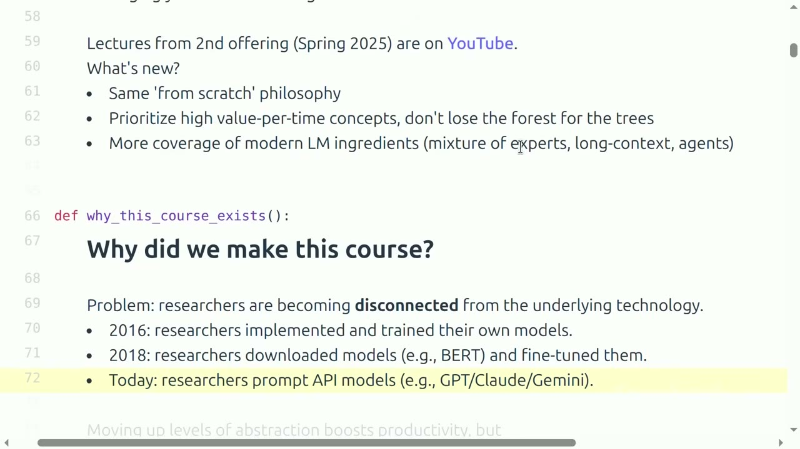

但有一个小问题，语言模型的工业化已经发生了。前沿模型非常非常昂贵。即便这是三年前，GPT-4 据说训练成本是 1 亿美元。现在成本大概是 10 亿美元量级，虽然这只是推测。所有大实验室正在建造的 GPU 数量也非常巨大。而且，这些模型是怎么构建的，没有细节。即便在 2023 年，GPT-4 论文也明确说，由于竞争格局和安全影响，我们不会分享任何关于模型如何构建的内容。所以这些前沿模型在某种意义上是我们够不着的。

*[05:33](https://www.youtube.com/watch?v=JuoVZkPBiKk&list=PLoROMvodv4rMqXOcazWaTUHhq-yembLCV&t=333)*

现在，我们可以构建小语言模型，我们也会构建小语言模型。但是要记住，它们可能并不代表真正的前沿模型。我给你们两个例子说明为什么会这样。这里有一个帖子。其实这是很久以前的，我想是 2021 年。我们之后会花更多时间数 FLOPs，看看计算花在哪里。但如果你看小规模，花在 MLP 层里的 FLOPs 比例大约是 44%。如果你扩展到 175B，它就变成 80%。所以，在大规模下你优化什么、什么重要，会和在小规模下不同。如果你在这里做了很多关于 attention 的小规模工作，你可能不会在大规模上体验到同样的收益。第二个例子是，我们知道行为会随着规模涌现。小模型，这同样是很久以前的，但即便那时，如果你看各种任务的零样本或少样本学习，基本上看起来什么都没用。只有当你达到某个临界规模，你才会突然看到很多改进。所以，同样，如果你在小规模上工作，你可能看不到某些现象，而在全规模下就能看到。

*[07:08](https://www.youtube.com/watch?v=JuoVZkPBiKk&list=PLoROMvodv4rMqXOcazWaTUHhq-yembLCV&t=428)*

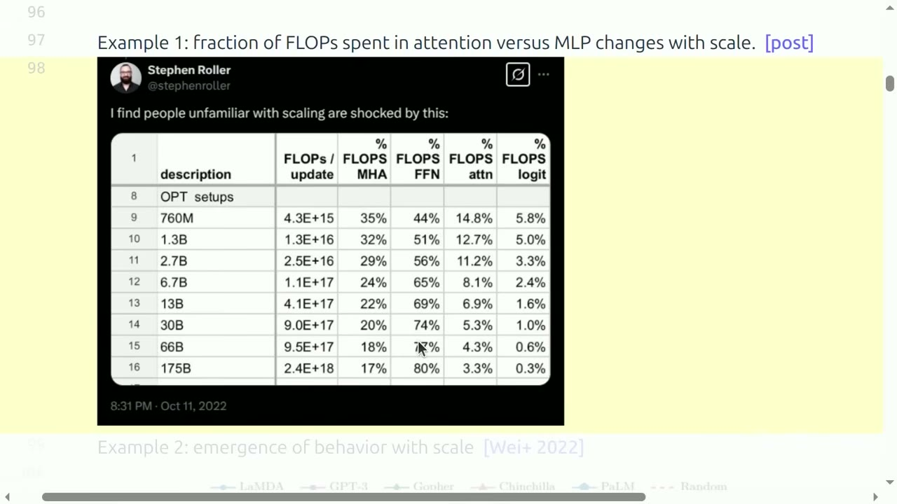

## 可迁移的知识：机制、心态、直觉

好，这可能有点让人泄气。但别怕，我们在这门课里会学到东西。问题是，我们能学到什么真正可迁移的东西？我认为把它拆成三类知识很重要。第一，是事物如何运作的机制，比如 Transformer 是什么，模型并行如何工作。第二，是心态，也就是你如何着手构建一个语言模型。我们会讲如何从硬件里榨取最大价值，认真对待缩放。最后是直觉，哪些数据建模决策会产生好的表现。现在，在这门课里，我认为我们可以很好地教授机制，也就是事物如何工作，以及心态。我们会非常强调，你要对一切做 profile 和 benchmark，并尝试优化效率。这些东西确实会迁移到更大规模。而那些关于什么建模决策、什么数据决策有效的直觉，则未必能跨规模迁移。要获得这些，你实际上得去一个能做大规模事情的地方。

*[08:16](https://www.youtube.com/watch?v=JuoVZkPBiKk&list=PLoROMvodv4rMqXOcazWaTUHhq-yembLCV&t=496)*

所以，关于直觉，值得注意的是，有些设计决策就是无法被证明合理，纯粹来自实验。而机制，你大体上可以构造性地看到并行以及 kernel 如何加速等等。但关于什么建模改动有效的直觉，我认为你只能跑实验。有一篇著名的 Noam Chomsky 论文引入了 SwiGLU 激活，我们之后会看。在结论部分，他很诚实地写了最后一句，说：我们不提供解释。我们把这些架构的成功，以及其他一切，归因于神圣的仁慈。所以在某种意义上，这是你只能从经验中获得的东西。

*[09:07](https://www.youtube.com/watch?v=JuoVZkPBiKk&list=PLoROMvodv4rMqXOcazWaTUHhq-yembLCV&t=547)*

最后提一下苦涩教训，这个说法一直在流传，人们也在谈论。我认为这里有一个常见的误解，关于它是什么意思。错误解读是：规模就是一切，算法不重要。但那不对。正确解读是：能 scale 的算法才重要。你可以很简单地想，模型的准确率基本上就是你的效率乘以资源。效率是输出除以输入，资源是输入。而效率在更大规模下其实在某种意义上更重要得多。对吧？如果你做小规模实验，你的运行花了两倍时间，也许你只是多等两倍时间，然后晚点回来。但如果你在大规模做，那可能是数亿美元。你肯定不想那样。即便 5% 的改进也可能很重要。所以事实上，效率真的非常关键。我希望把这一点烘焙进你们的心态，作为这门课的一个结果。

*[10:21](https://www.youtube.com/watch?v=JuoVZkPBiKk&list=PLoROMvodv4rMqXOcazWaTUHhq-yembLCV&t=621)*

经验上，如果你看 OpenAI 2020 年的那篇论文，它显示 2012 到 2019 年间，ImageNet 上有 44 倍的算法效率提升。硬件肯定也变好了很多。但这也伴随着算法改进。当然，当你把它们乘在一起，你就会看到效率和准确率的巨大跃升。所以，说了这么多，框架是：在一定的数据和计算预算下，你能构建的最好的模型是什么？对于预训练，我们主要会讨论计算预算，因为我们会假设我们的数据比计算多很多。但如果你处在数据受限的环境，或者你藏了很多 B200，那你可能就是数据受限的。换句话说，最大化效率。我们会在这门课里反复看到这个主题。

*[11:31](https://www.youtube.com/watch?v=JuoVZkPBiKk&list=PLoROMvodv4rMqXOcazWaTUHhq-yembLCV&t=691)*

## 语言模型简史与开放生态

好。接下来，我想花一点时间谈谈语言模型，讲一点历史，做一点背景铺垫，然后再进入更技术性的细节。语言模型已经存在一段时间了。Shannon 在 50 年代就用语言模型来测量英语的熵。很长一段时间里，n-gram 模型实际上被用在机器翻译和语音识别系统里。它们不是整个系统，但它们是确保生成流畅文本的重要部分。我会说，现代语言模型的谱系来自神经架构。所以有一堆想法，我认为对这个发展很重要。

*[12:20](https://www.youtube.com/watch?v=JuoVZkPBiKk&list=PLoROMvodv4rMqXOcazWaTUHhq-yembLCV&t=740)*

在 90 年代，有 LSTM。Joshua Bengio 其实在 2003 年写了第一篇神经语言模型论文。那其实不是 LSTM。那只是一个前馈网络，看一小段上下文。然后是 seq2seq 建模，它大胆地说我们可以把整个句子压缩成一个向量。然后是 Atom 优化器、attention 机制，它最初是为机器翻译开发的。Transformer 架构建立在它之上，也最初是为机器翻译开发的。然后扩展到 mixture of experts、模型并行。你会看到很多不同的架构，以及系统和优化器想法。这些是在 2010 年代发展起来的。

*[13:14](https://www.youtube.com/watch?v=JuoVZkPBiKk&list=PLoROMvodv4rMqXOcazWaTUHhq-yembLCV&t=794)*

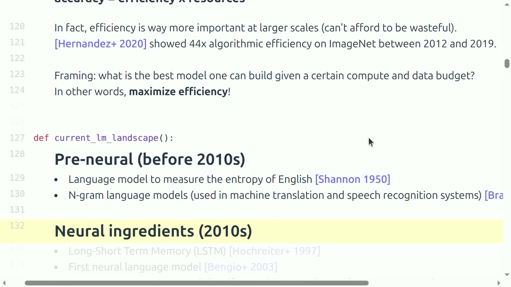

到了 2010 年代后期，我觉得事情开始变得非常有趣。出现了 ELMo 和 BERT。这些是在大量文本上训练的语言模型。然后你可以在一些下游任务上微调它们，比如问答。它会显示出巨大改进。所以那时的模式是，拿这些模型之一，然后微调。然后 Google 有一篇论文，我认为它预示了这种 prompt 和 response 的视角。真正打开闸门的，我认为是 OpenAI，他们拥抱了 scaling。所以他们在 2018 年左右有一篇 GPT 论文。他们扩展到 GPT-2。然后他们真正弄清楚，或者说拥抱了缩放定律，我们等一下会讲，这让他们能够训练 GPT-3。GPT-3 是一个大得多的模型，几乎是当时模型的 10 倍以上。它可以展示涌现行为，比如上下文学习。到那时，Google 说，好吧，我们也得做点什么。所以他们训练了一个巨大的模型。结果它训练不足。而结果发现，他们的 DeepMind，当时还没有和 Google 整合，已经弄清楚了最优的、计算最优的缩放定律。所以这一切都在发生。

*[14:48](https://www.youtube.com/watch?v=JuoVZkPBiKk&list=PLoROMvodv4rMqXOcazWaTUHhq-yembLCV&t=888)*

GPT-3 出来之后，对很多人来说，这像是一个警钟。那时有很多早期尝试，想复现它。有一个草根组织叫 Eleuther，创建了一些开放数据集和模型。它们不是很大，因为他们没有很多计算。Meta 的第一个 LLM，你能看出来是复现，因为它大约 1750 亿参数。但它不是一个很好的模型。他们遇到了很多硬件问题。然后还有一个 Hugging Face 的大科学项目。所以这些模型，我会说，不是很强。

*[15:31](https://www.youtube.com/watch?v=JuoVZkPBiKk&list=PLoROMvodv4rMqXOcazWaTUHhq-yembLCV&t=931)*

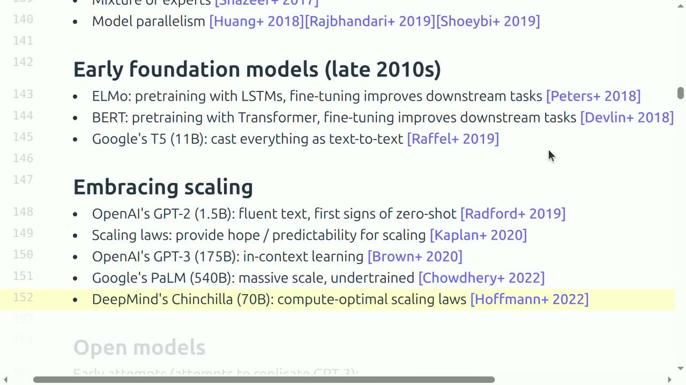

然后在过去三年里，开放模型生态变化很大。Meta 以 LLM 系列模型领路，LLM、LLM2、LLM3。Mistral 也加入进来。然后还有一整套中国模型。我想我漏了一些，比如 ByteDance 有东西。Tencent 可能也有别的东西。所以很难跟踪所有东西。但大家都听说过 DeepSeek 和 Qwen。我想我列了主要的。但我觉得有趣和兴奋的是，现在我们有开放权重模型正在接近闭源模型。取决于你问谁以及怎么 benchmark，它们可能稍微落后，或者可比。但肯定有一些非常非常可信的模型正在产业中被广泛使用。

*[16:19](https://www.youtube.com/watch?v=JuoVZkPBiKk&list=PLoROMvodv4rMqXOcazWaTUHhq-yembLCV&t=979)*

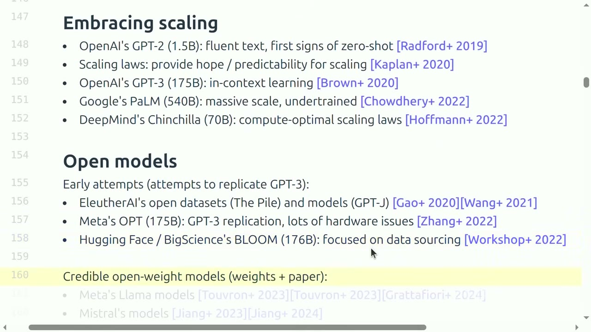

现在还有另一条工作线，不只是发布开放权重模型。AI2、NVIDIA，以及我参与的 Marin 项目。我们尝试不只提供权重，还提供论文、代码和数据，这样我们能更彻底地理解这些模型是如何构建的。为什么我这么强调开放生态？主要是因为，我认为没有这些模型，这门课不可能存在。仍然有很多论文在发表，关于这些大的 MoE 和 RL 系统如何工作。这让我们至少能窥见前沿模型是如何构建的，并尝试三角定位这些碎片。当然，即便有 Qwen 这些论文，很多细节仍然缺失，你没法复现它们。尤其是数据混合，我们不知道。但我认为，这比什么都没有要好得多，好得多。

*[17:32](https://www.youtube.com/watch?v=JuoVZkPBiKk&list=PLoROMvodv4rMqXOcazWaTUHhq-yembLCV&t=1052)*

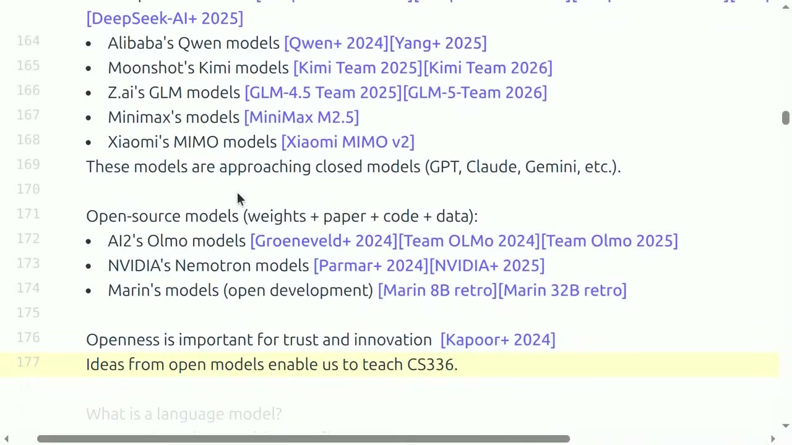

好，所以在过去十年里，我认为语言模型是什么，这个观念已经变了。过去它是你微调的东西。然后它是你提示的东西。现在在 ChatGPT 时代，它是你与之交谈、可以对话的东西。现在，好吧，我猜我没网络。没关系。现在我们处于智能体时代。如果你点这个链接，它基本上展示了一个巨大的智能体轨迹。我仍然觉得，有些模型有多强，这让人难以置信。你给它一页文本，它就能做一些非常复杂的智能体编码任务。所以，我们今天对语言模型的要求，可能超出了十年前任何人的想象。尽管如此，我认为基本面并没有变那么多。大体上我们仍然在 GPU 和 kernel 上构建。我们仍然用梯度或随机梯度之类的方法优化。我们仍然有 Transformer、attention，我们之后还会多谈一点架构。但它并没有变那么多。我认为规格不同了。现在我们需要更长的上下文长度，这意味着推理效率更加重要。所以好消息是，我们不必完全改变这门课。只需要改 Tatsu 关于最新中国架构的那一节。但基本面，我认为至少目前还会继续存在。

*[19:08](https://www.youtube.com/watch?v=JuoVZkPBiKk&list=PLoROMvodv4rMqXOcazWaTUHhq-yembLCV&t=1148)*

好。也许我先停在这里，看看有没有问题或想法。

*[19:15](https://www.youtube.com/watch?v=JuoVZkPBiKk&list=PLoROMvodv4rMqXOcazWaTUHhq-yembLCV&t=1155)*

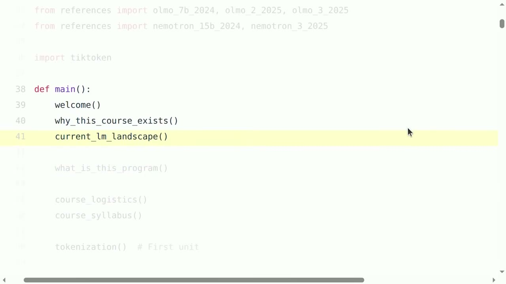

## 可执行讲义与课程信息

好，我们继续。简短插曲。这个程序是什么？这是我所说的可执行讲义。这看起来像 Python 程序，因为它实际上就是一个 Python 程序。但它被渲染出来供你观看。当我逐步走它时，它实际上在执行讲义。它让我们能够逐步走代码，希望之后这会有趣且重要。你还能看到讲义的分层结构。比如，我们完成了这个函数。我们回到 main。好，那我们谈谈课程。

*[20:02](https://www.youtube.com/watch?v=JuoVZkPBiKk&list=PLoROMvodv4rMqXOcazWaTUHhq-yembLCV&t=1202)*

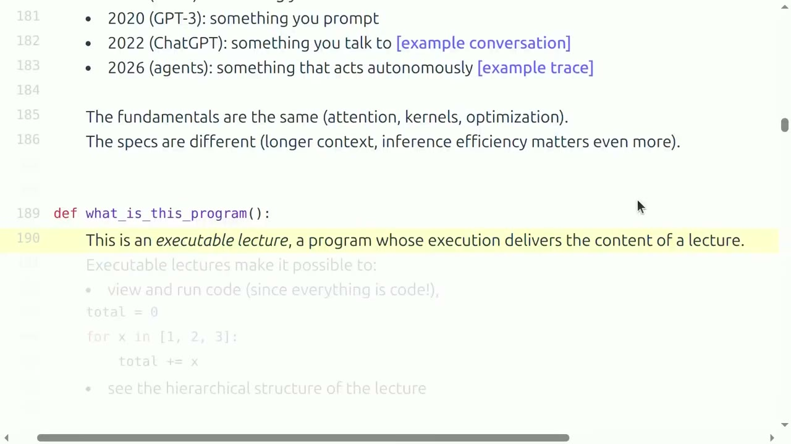

Logistics 和 syllabus，我想这会花掉相当一部分时间。好。所有信息都在网上，网站是 cs336.sanford.edu。这是一门五单元的课。我想这门课可能有点名声，所以我不需要太啰嗦。但这是，我们有五次作业。它们相当紧张。即便是第一次作业，根据某条评论，实际上相当于 CS224N 的五次作业。我也被告知，等等，这太夸张了。但我想，预估保守一点更好。那么，你为什么要修这门课？好。

*[20:53](https://www.youtube.com/watch?v=JuoVZkPBiKk&list=PLoROMvodv4rMqXOcazWaTUHhq-yembLCV&t=1253)*

首先，你像我一样有一种强迫症式的需求，想理解事物如何工作。这应该是你的首要目标。我认为就是对语言模型如何工作的纯粹好奇。然后在做这门课的过程中，你会培养出强得多的研究、工程肌肉，并有信心进入一个新环境，有能力应对出现的任何情况。我想，当我开始在斯坦福时，我创建了一门课叫统计学习理论，基本上教机器学习的理论面。那很好，因为它装备人们，让你读论文时能理解所有数学。现在，这个领域已经更多转向系统和经验的一面，所以这门课在某种意义上是类似的课，给人足够的深度，让他们觉得其他一切似乎都变得容易。

*[21:52](https://www.youtube.com/watch?v=JuoVZkPBiKk&list=PLoROMvodv4rMqXOcazWaTUHhq-yembLCV&t=1312)*

那么，你为什么不该修这门课？这很重要，因为有些理由你不应该修。第一，你实际上想在这个 quarter 做出一些研究。你可能应该和你的导师谈谈。他们应该知道你在修这门课。否则可能会有惊喜。第二，你感兴趣的是学习 AI 里最热门的新技术。我认为有很多其他很好的课程、seminar 课程、专题课程适合这个。我们不做很多这些东西。我们不做多模态。我们不深入讲智能体。所以如果你想学那些东西，这门课不对。第三，如果你进来说，我有一个应用领域，我想在上面得到好结果。那这门课可能不对，至少作为起点不对。我总是建议，先提示模型，再微调模型，然后作为最后手段，才预训练你自己的模型，因为那很痛苦，也很昂贵。但它也很有趣。

*[22:53](https://www.youtube.com/watch?v=JuoVZkPBiKk&list=PLoROMvodv4rMqXOcazWaTUHhq-yembLCV&t=1373)*

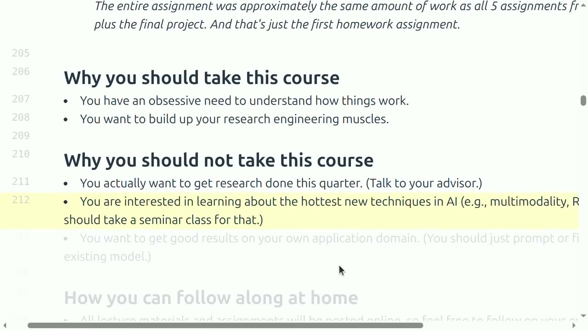

好，如果你没有修这门课，你可以在家里跟学。所有讲义材料都会发在网站上。哎呀。它们也会通过 CGOE 录制。谢谢 CGOE 这么做。之后它们会被发布到 YouTube。当然，在家跟学和看讲座很好，但你真的要通过做作业来学习。所以你得想办法激励自己去完成作业。

*[23:28](https://www.youtube.com/watch?v=JuoVZkPBiKk&list=PLoROMvodv4rMqXOcazWaTUHhq-yembLCV&t=1408)*

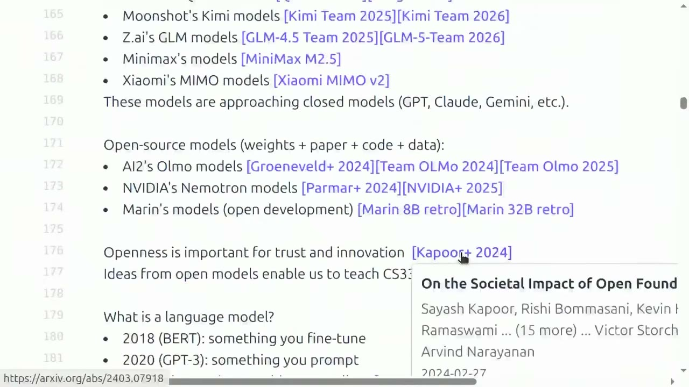

好，说到作业，我们有五次作业。作业的哲学是，我们怎么做从零开始，但不只是说，构建一个语言模型，那就是作业。我们不提供脚手架代码，但我们提供一堆单元测试，确保你构建的东西实际上是正确的。这样你就不会陷入稀疏奖励环境，交一份作业，然后它要么对要么错。我建议，作业的结构使得很多部分实际上可以在你的笔记本上本地完成。你可以实现并检查正确性。然后我们提供一个集群，这样你可以做实际训练运行，看准确率，或者拿一堆 GPU 来 benchmark 某个 kernel 的性能。然后为了好玩，我们至少会给大部分作业设置一些 leaderboard。它们会像这样：既然你已经学了这个主题，试着在某种预算下最小化 perplexity。Marcel 和 Herman 当年都是 leaderboard 大师，那是在去年还是前年。所以如果你想得到技巧，我相信他们很乐意。其实我不知道他们会不会告诉你他们的秘密，但你可以试试。

*[24:59](https://www.youtube.com/watch?v=JuoVZkPBiKk&list=PLoROMvodv4rMqXOcazWaTUHhq-yembLCV&t=1499)*

好，去年我们在想，AI 能做什么？就是说，好吧，对，每个人都可以用 AI，但尽量做到最好。我想现在，编码智能体已经变得太好，它们可以直接解决所有作业，对吧？但显而易见的是，如果你只是把 assignment one 的 PDF 喂给 Claude Code，你显然什么也学不到。同时，AI 在回答问题和辅导方面非常有用。所以我们必须找到一种利用 AI 的方式。我们决定做的是，提供一个 agents.md 文件，或者等价地，一个 prompt，要求 AI 具有教学思维。你可以在我们的 AI 政策指南里读到更多。要求是，如果你要用 AI，就用这个 prompt。这样它会回答关于代码的问题。它会澄清理解，但它不会在作业是让你实现 Transformer 时，不小心替你生成 Transformer。好。这是第一年我们尝试这样做，所以请试试，并给我们反馈它是否有效。

*[26:14](https://www.youtube.com/watch?v=JuoVZkPBiKk&list=PLoROMvodv4rMqXOcazWaTUHhq-yembLCV&t=1574)*

好。然后是计算。今年多亏 Modal，他们为我们提供了平台上的计算额度。这其实相当不错，你可以得到一些，不像去年，嗯，我猜你去年没修这门课。去年我们有一个要 SSH 进去的集群。这次更多使用 API，我一开始有点怀疑，但看下来，实际上它用起来挺愉快。所以同样，试试并反馈体验如何。我们写了一份指南，讲如何访问和使用计算。

*[27:05](https://www.youtube.com/watch?v=JuoVZkPBiKk&list=PLoROMvodv4rMqXOcazWaTUHhq-yembLCV&t=1625)*

好。关于课程 logistics 有什么问题吗？好，行。

*[27:19](https://www.youtube.com/watch?v=JuoVZkPBiKk&list=PLoROMvodv4rMqXOcazWaTUHhq-yembLCV&t=1639)*

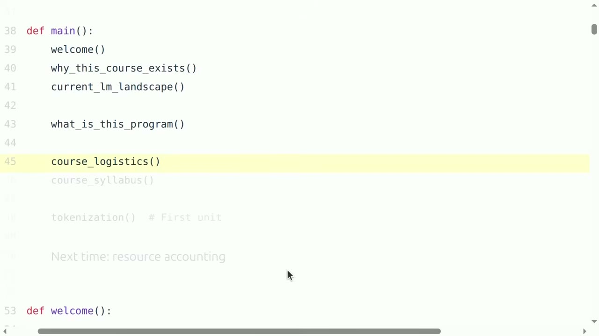

## 课程五个部分总览

那我们谈谈这门课要覆盖什么。基本上有五个部分，对应你们要做的五次作业。基础系统、缩放定律、数据、对齐。我现在会逐个部分讲，让你们尝尝会学到什么。好。

*[27:33](https://www.youtube.com/watch?v=JuoVZkPBiKk&list=PLoROMvodv4rMqXOcazWaTUHhq-yembLCV&t=1653)*

在基础部分，基本上是前两周。目标是能够训练一个语言模型，并从零构建它。这里的组件是，我们会 tokenize 数据，定义架构，然后实现优化器并训练它。好。那你会想，剩下的课是干嘛的？嗯，我们会讲到的。那我们从 tokenization 开始。

*[28:04](https://www.youtube.com/watch?v=JuoVZkPBiKk&list=PLoROMvodv4rMqXOcazWaTUHhq-yembLCV&t=1684)*

Tokenization 真正关心的是模型操作的原子是什么。形式上，一个 tokenizer 在原始输入，也就是字节，和一系列整数之间转换，这些整数代表 token。概念上，它是对文本的分割。我们会讲 byte-pair encoding，BPE tokenizer，直觉上它把输入拆成频繁出现的块。然后，记住，这门课是关于最大化效率。所以从效率角度看，tokenization 是好的，因为它把长序列，如果你只考虑原始字节流，减少成更少的 token。但更微妙、也许更重要的是，它允许你做自适应计算。所以有些地方可能实际上很多字节，但应该被压缩成一个 token，而一些更稀有或更有趣的输入部分应该被留作多个 token。好，我们会更多地谈这个。我只是想提一下，每年我都希望我不必教 tokenization。因为梦想是真正有一种端到端的方式，直接在字节上操作。已经有很多工作，包括最近有一个 H-Net 工作，看起来很有希望。但到目前为止，这些还没有扩展到前沿，而前沿模型仍然在使用 tokenizer，所以我们觉得教 tokenizer 仍然是明智的。

*[29:50](https://www.youtube.com/watch?v=JuoVZkPBiKk&list=PLoROMvodv4rMqXOcazWaTUHhq-yembLCV&t=1790)*

好，现在，在你 tokenize 输入之后，你有一堆 token。现在你在上面定义一个模型。我想每个人都熟悉最初的 Transformer。如果你上过 CS224N，NLP 课，那你就见过 Transformer。自那以来，我认为 Transformer 有很多改进或细化，我认为这些很重要。Tatsu 之后会多讲。但先过一遍你可能需要考虑的一类事情。激活函数已经演化。位置编码如何做已经演化。如何归一化不同层以防止爆炸已经演化。不是做完整 attention，有很多方法基本上减少 attention 计算，因为 attention 是 N 平方，N 是序列长度，那会变得非常昂贵。所以有一堆围绕这个的想法。如果你更有雄心，可以看状态空间模型，或者等价地线性 attention，比如 Mamba 和 gated delta net。这些在过去几年很流行。通常这些模型和 attention 的某种混合似乎效果很好。所以我们会探索一些。然后在 Transformer 的 MLP 层里，最初的 Transformer 只是一个密集 MLP。现在，mixture of experts 已经成为构建计算高效 Transformer 的主导范式。所以我们会谈这个。当然，有了 MLP、mixture of experts，不只是定义架构，我们还会看到需要不同的训练技术。最后，也许有点无聊，但一个重要问题是，你的 transformer 形状是什么？多少层？多少头？隐藏维度是多少？专家数是多少？这可能会在讲缩放定律时更多出现，但设置这些实际上，看起来几乎微不足道。它是一个超参数，但在语言模型缩放的语境下，有巨大、巨大的影响。

*[32:16](https://www.youtube.com/watch?v=JuoVZkPBiKk&list=PLoROMvodv4rMqXOcazWaTUHhq-yembLCV&t=1936)*

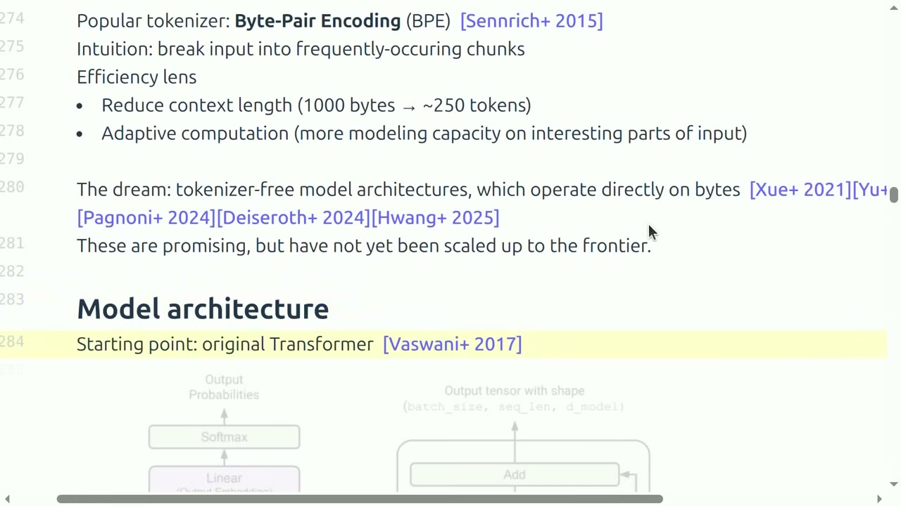

好。一旦你定义了模型架构，你如何训练模型？这里有一堆关于损失函数的设计决策。有下一个词、下一个 token 预测，这是默认的。但人们发现，预测多于一个 token 似乎有助于改进模型。还有优化器。人们过去用 Adam，但越来越多地使用 Muon，尤其是最近一些开放模型，比如 Kimi K2 模型。初始化，这同样听起来有点无聊，但事实证明对更大模型的训练稳定性和能力有巨大影响。学习率、schedule、正则化、batch size，然后还有 MoE 特定的东西。所以，你看这个列表，可能会想，这些只是超参数。我会试一堆不同选项。但事实证明，真正非常小心地、以有原则的方式设置这些超参数，会决定一个运行是爆炸、毫无用处，还是达到 state of the art。好，等我们讲缩放定律时我会回到这一点。

*[33:39](https://www.youtube.com/watch?v=JuoVZkPBiKk&list=PLoROMvodv4rMqXOcazWaTUHhq-yembLCV&t=2019)*

好，那么在 assignment one 里，你们要做的是实现 BPE tokenizer，实现 transformer、损失函数、优化器，整个训练流程。我们会让你们做一堆资源核算，让你理解你的 FLOPs 去了哪里。你会在 tiny stories 和 open web text 这些数据集上训练一些模型。然后会有一个 leaderboard，你要尽可能快地降低 perplexity。所以，如果你熟悉 nano GPT speedruns，这有点类似。好，那么到 assignment one 结束时，你应该能够离开并从头构建一个语言模型。那非常令人兴奋。如果你要一个高层 takeaway，那就是，虽然 tokenizer、建模和训练被呈现为不同的部分，但实际上一切都是关于平衡下面这些。你想要表达力强的模型，因为你想表示数据的复杂性。但同时，你训练时要稳定。我们会大量讨论如何让参数和梯度范数保持在这个金发姑娘区间，既不爆炸也不消失。事实证明，训练语言模型很多就是关于稳定性。最后是效率，这稍微更直接。你只要让它在硬件上跑得快。但你会看到有趣的事情，比如，如果我们改变架构，很多架构决策是，好吧，我们可以通过，比如说，减少投影到更低维空间来让它更快。但问题是，它效果一样好吗？所以做这些权衡，才是这里的游戏名字。

*[35:51](https://www.youtube.com/watch?v=JuoVZkPBiKk&list=PLoROMvodv4rMqXOcazWaTUHhq-yembLCV&t=2151)*

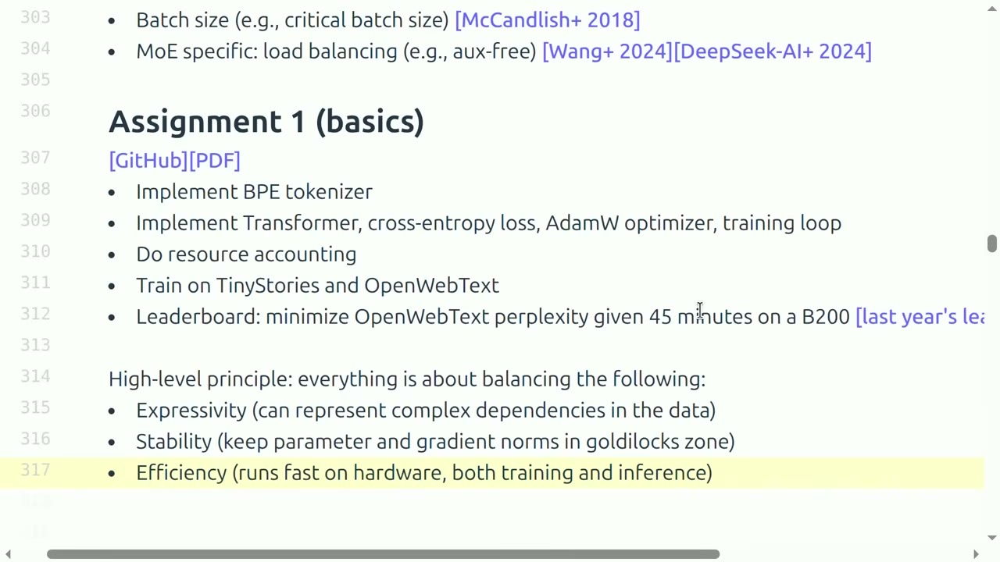

## 系统：资源核算、kernel、并行与推理

好。那么在 assignment two 里，我们会更深入地讲系统。这里的目标就是从你的硬件里榨取最大价值。我们会讲 kernel，如何在多个 GPU 上并行，以及如何做推理。所以，基础，我们实际上下一讲会开始，我提到资源核算。我想，你们可能以前都构建过模型。但这真正是关于跟踪所有 FLOPs 去了哪里。以及所有内存在哪里花掉。所以我们会花一些时间基本上做资源核算。我们会看到这个出现的公式。训练一个模型在一万亿 token 上需要多少 FLOPs？嗯，大概是 6 乘以 N 乘以 D。它从哪来？然后我们会看硬件。

*[36:52](https://www.youtube.com/watch?v=JuoVZkPBiKk&list=PLoROMvodv4rMqXOcazWaTUHhq-yembLCV&t=2212)*

这里有一张非常卡通化的图，关于硬件要 remark 什么。你的内存不在你的计算所在的地方。你必须把参数或激活从内存移到计算，做计算，再移回去。对吧？而这通常是瓶颈。所以，比如说，B200，我们会有机会玩一玩。它有每秒 2.25 petaflops，BF16，以及每秒 8 TB 的内存。所以，这意味着什么？我想，我下一讲会做这个。我们会拆解这个，用这些信息做计算，看看不同类型算法需要多长时间。我们会讲 roofline analysis，它让我们理解一个计算是受计算瓶颈还是内存瓶颈限制。一般来说，是内存。然后，讲一点 benchmarking 和 profiling。

*[38:06](https://www.youtube.com/watch?v=JuoVZkPBiKk&list=PLoROMvodv4rMqXOcazWaTUHhq-yembLCV&t=2286)*

好。这就是 DGX H200 的样子。你有 8 个 GPU，它们通过 NVLink 连接。然后，如果你有很多，如果你有 1000 个 GPU，那你会有多个这样的节点，它们通过 InfiniBand 或以太网连接。所以，接下来两个系统部分，嗯，kernel。所以，kernel 基本上是在 GPU 上运行的函数。当你只用普通 PyTorch 时，所有 PyTorch 原语实际上对应启动特定的、内置的 kernel。所以，不管你知道不知道，你已经在使用 kernel 了。但重点是，对于某些类型的计算，如果你看它，你实际上可以写自定义 kernel，让 GPU 跑得更快。主要原则是组织计算以最小化数据移动。所以，记住这张图，从内存移动数据是昂贵的，所以你要尽量减少。举一个简单例子，假设你想计算 A 和 B。通常你必须从高带宽内存 HBM 读，计算它，写回去，然后再读，计算它，再写回去。对吧？所以你基本上把数据来回送了两次。有一个想法叫 fusion，你读一次，做两个计算，然后写回去。那会省很多时间。所以，那就是 operator fusion。Tiling 是围绕同一想法的一个更复杂的变体。GPU 也变得更复杂了。我不确定我们有多少时间深入这些细节，但至少我们想让你接触一些 GPU 的特性，我会说，让你欣赏为了尽可能榨干它们需要考虑的事情类型。我们会写一些 kernel 并试试。

*[40:25](https://www.youtube.com/watch?v=JuoVZkPBiKk&list=PLoROMvodv4rMqXOcazWaTUHhq-yembLCV&t=2425)*

那么，如果你有数千个 GPU 呢？最小化数据移动的原则仍然一样。唯一的问题是，在不同 GPU 之间移动数据甚至更昂贵。我们会讲这些非常经典的集合操作，比如 gather、reduce 和 all reduce，是思考分布式训练的方式。一般来说，我们有这些模型参数，有激活、梯度、优化器状态，它们需要被 shard 或拆分到多个 GPU 上。当然，你需要把正确的数据带到正确的节点来做计算，再写回去。所以，有一整套编排，以及如何高效地做，会是这个单元的主题。有多种 shard 方式。你可以按拆分数据来 shard，拆分模型，拆分模型中的不同层，拆分序列，在专家之间拆分，我们会讲每一种的权衡。

*[41:37](https://www.youtube.com/watch?v=JuoVZkPBiKk&list=PLoROMvodv4rMqXOcazWaTUHhq-yembLCV&t=2497)*

好，最后，我们会讲推理，正如我提到的，它越来越重要。推理的目标是实际使用模型。这里一个小细节。推理当然是你在和模型聊天时需要的，但它对强化学习也有用。它对做 rollout、测试时计算、生成合成数据、评估都有用。所以，推理是语言建模工作非常关键的一部分。我们可能不会花我想花的那么多时间在这上面，因为课程已经排得很满了，但我们看看能做什么。之前有一些讨论，关于是否要让你们从零写推理，但我们看看。思考推理的方式是，有两个阶段，pre-fill 和 decode。在 pre-fill 中，你拿 prompt，然后把所有 token 前向传播并构建 key-value 对。这非常像训练中发生的事。然后在 decoding 部分，token 一次生成一个。这部分很快变成内存瓶颈，这就是推理难的原因。所以，有很多事情可以加速推理。你可以尝试通过剪枝一个大模型来使用更便宜的模型。你可以量化，可以蒸馏，可以用一种叫 speculative decoding 的技术，用一个更便宜的模型跑在前面，猜一堆 token。然后你用完整模型，它可以并行地处理那些 token，看它是否好。如果你运气好，就可以接受所有这些 token，这比一次一个 token 快得多。当然，你可以做系统优化。有一堆专门为推理设计的 kernel。然后，推理中一个有趣的事情是，如果你在运行一个服务，查询可能在不同的时间到达。然后你必须弄清楚如何把它们 batch 起来。而在训练中，你基本上已经定义好了 batch，一切都更可预测。

*[44:00](https://www.youtube.com/watch?v=JuoVZkPBiKk&list=PLoROMvodv4rMqXOcazWaTUHhq-yembLCV&t=2640)*

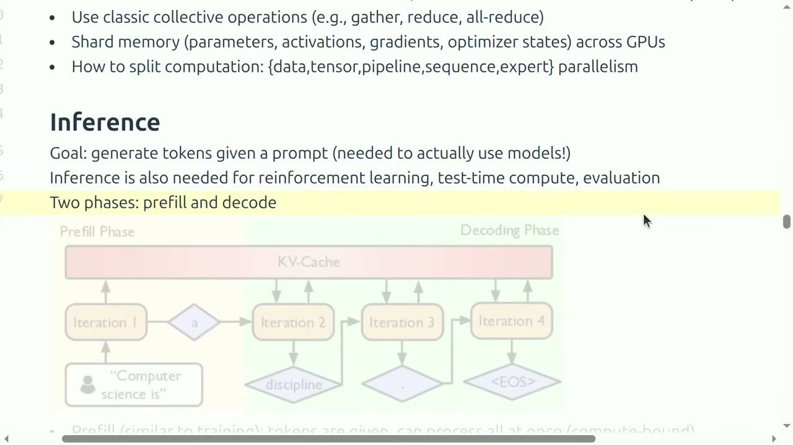

所以在 assignment two 里，会有用 Triton 实现 kernel，以及做某种并行训练。这里细节可能会变，因为 CA 们有宏大的计划要重做系统部分。所以作业可能看起来和去年有点不同，但会覆盖大致相同的材料。我要提一件事，有一本来自 Google 一些人的很棒的书叫 How to Scale Your Model。我觉得它很好地提供了 roofline analysis、transformer 数学以及概念上做 LMS 的理解。所以我强烈推荐你看看。唯一的问题是它来自 Google，所以是关于 TPU 的。但很多高层概念是相似的。现在他们有一章新内容，讲如何思考 GPU。

*[45:09](https://www.youtube.com/watch?v=JuoVZkPBiKk&list=PLoROMvodv4rMqXOcazWaTUHhq-yembLCV&t=2709)*

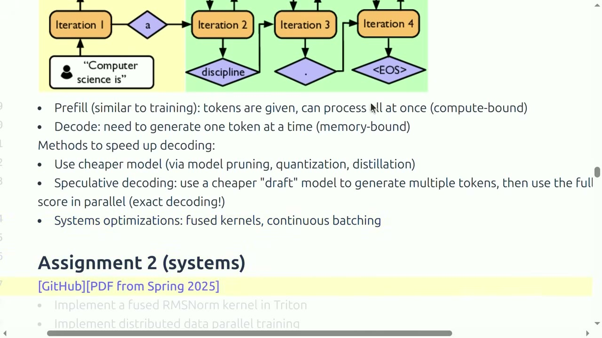

## 缩放定律与 assignment three

好。第三个作业是关于缩放定律。到这时，你已经训练了一个语言模型。你可以通过优化 kernel 和并行让它跑得很快。现在你想扩大规模。那你如何扩大规模？想象下面这个设定。如果你有 1e25 FLOPs，这是数千万美元的计算，你会训练什么模型？好。我认为这是一个令人生畏的任务，因为如果你搞砸了，那是很多钱打水漂。而且你没法在那种规模做你通常的超参数调优，因为你只训练一个模型。所以，这是你在语言模型、大语言模型训练中必须处理的关键问题，而如果你只是微调模型或做小规模事情，你就不必真的处理。所以关键的概念转变是，我们不应该想成我们在训练单个模型，而应该真正想成一个缩放配方。一个缩放配方是从 FLOPs 预算，比如 1e25 或 1e24，到一组超参数的映射，基本上是一个配置文件。对于一个给定的缩放配方，我们要做的是跑一堆实验，计算你在更小规模下得到的损失。然后你拟合一个缩放定律，这让你能预测目标规模下的损失。所以，也许你跑一些小实验，拟合缩放定律，然后预测更大规模下你会得到什么。

*[46:48](https://www.youtube.com/watch?v=JuoVZkPBiKk&list=PLoROMvodv4rMqXOcazWaTUHhq-yembLCV&t=2808)*

好，这就是基本原语。现在，利用这个，你可以做的是，现在你可以用更小规模的实验来优化目标，也就是面向更大规模的缩放配方，这很棒。第二，你可以在实际跑实验之前，预测你在理论上会达到的损失。这让你可以去，你知道，筹钱，你说，看，我跑了小规模实验，我认为我能得到一个真正的、像 GPT-5 级别的模型。请给我很多钱，让我训练那个模型。

*[47:32](https://www.youtube.com/watch?v=JuoVZkPBiKk&list=PLoROMvodv4rMqXOcazWaTUHhq-yembLCV&t=2852)*

所以，我认为还有一个可能的误解是，缩放定律不是自然定律。它们不会自动发生。你得把它们愿力般地召唤出来。这通过仔细构建一个缩放配方来实现。记住，一个缩放配方必须能外推。所以，这通常意味着你有一个超参数序列，随着规模增加，也许学习率是常数，也许它下降，也许 batch size 增加，但增加多少？这些是缩放配方必须弄清楚的事情。所以，为了得到这些可预测的缩放定律，你实际上必须考虑的一件事是，你如何参数化模型，以获得所谓的超参数迁移。意思是，你在小规模使用的超参数，要么就是你在更大规模使用的那些，要么是它的可预测函数。对吧？因为如果在每个规模下，你的学习率有时是 1e-5，有时是 1e-4，那你不可能在更大规模下神奇地猜对正确的学习率。所以，一个思维转变是，可预测性至少和最优性一样重要。你通常想，哦，我们在这里试图优化效率，我们想做超参数调优，让事情最优。是的，你确实想那样做，但你也想要这种可预测性，这样你不会在更大规模上被吓到。

*[49:12](https://www.youtube.com/watch?v=JuoVZkPBiKk&list=PLoROMvodv4rMqXOcazWaTUHhq-yembLCV&t=2952)*

好，这是舞台铺垫。我们实际要看的缩放定律相当经典。这些是，你们有些人可能见过这个想法：如果我给你一个 FLOPs 预算，你应该训练，你应该如何平衡训练一个更大的模型和训练更多 token？这就是经典的计算最优缩放定律，来自 Kaplan 等人，以及所谓的 Chinchilla 缩放定律。基本想法是，对于每个 FLOPs 预算，比如从 6E18 一直到 3E21，你在不同的模型大小上做 sweep。你选最好的那个，所以想想最小化每一个。然后你拟合一条曲线，让你基本上能根据 FLOPs 预算预测参数数量。如果你幸运，它会大致落在一条线上。如果你不幸运，它会到处都是，这意味着你不应该相信你能可靠预测。所以，这个的要点是，这很粗糙，但一个经验法则是，参数数量的 20 倍是你应该训练的数据点数量。所以，这个 1B 参数模型应该训练大约 1.4 万亿 token。当然，取决于数据集和架构，这个数字会变化。

*[50:50](https://www.youtube.com/watch?v=JuoVZkPBiKk&list=PLoROMvodv4rMqXOcazWaTUHhq-yembLCV&t=3050)*

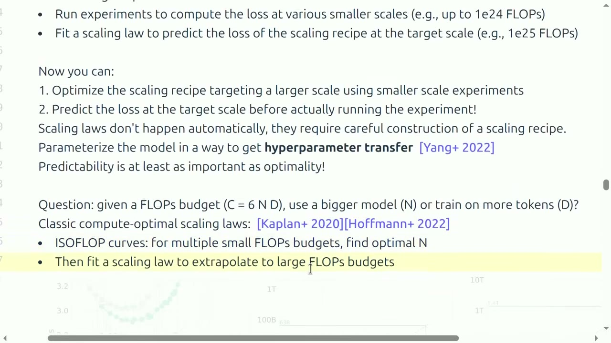

另外，这没有考虑推理成本。现在很多模型很小，但它们训练的 token 远超计算最优，因为你想要更小的模型来做推理。好，我们在 Marin 项目里一直在做的一件有趣的事是预先注册我们的结果。我们在不同计算预算下拟合一堆缩放图。我们拟合一个缩放定律，然后基本上做出预测，一直到 1E22 FLOPs。这个实际上正在训练。如果你去 Marin 网站，你可以跟进。它应该最早今晚就能完成。所以也许周三我会汇报我们做得怎么样，看看我们和预先注册的损失匹配得如何。这里的想法是，我们做了一个预测：如果我们训练这个大型模型，一个我们从未训练过的模型，如果我们能预测它会有多好，那就很好。

*[51:59](https://www.youtube.com/watch?v=JuoVZkPBiKk&list=PLoROMvodv4rMqXOcazWaTUHhq-yembLCV&t=3119)*

好，那么在 assignment three 里，我认为这是一个要么有趣，要么，其实是有趣的作业。我们就说它是个有趣的作业。我们会定义这个训练 API，基本上你给我超参数，我们给你返回损失。我们要尝试模拟如果你能做很多训练运行会发生什么。当然我们没有足够计算让每个人训练自己的 8B 模型之类的。所以基本上我们离线训练一堆模型，然后提供这个缓存，让它看起来像你在训练。你要做的是提交训练任务。你给我们一个配置，我们给你返回损失。然后你可以做任何你想做的。我们会建议你拟合这些点的缩放定律，然后外推，然后我们给你一个预算，我们基本上评估你的模型落地得怎么样。所以它的意思是，我本来要说，它意在复制高压力场景，如果你真的有一个预算，比如 1 亿美元要花。你必须非常小心你怎么花。当然这是低风险的。

*[53:20](https://www.youtube.com/watch?v=JuoVZkPBiKk&list=PLoROMvodv4rMqXOcazWaTUHhq-yembLCV&t=3200)*

## 数据：评估、获取、处理与 assignment four

好。到这时，你会训练模型，你知道怎么让它快，你知道怎么扩大规模。现在缺什么？你训练模型用什么数据？这就是数据部分的主题，它可以说是最重要的东西之一，因为数据质量基本上决定了你的模型会有多好。另一种说法是，你想让你的模型做什么？对吧？数据基本上反映你的模型想要什么。所以，你想说多种语言吗？擅长对话吗？想运行长时间智能体编码任务吗？所以其中一部分也是，我们会先讲评估，评估基本上定义了你希望模型拥有的能力。

*[54:29](https://www.youtube.com/watch?v=JuoVZkPBiKk&list=PLoROMvodv4rMqXOcazWaTUHhq-yembLCV&t=3269)*

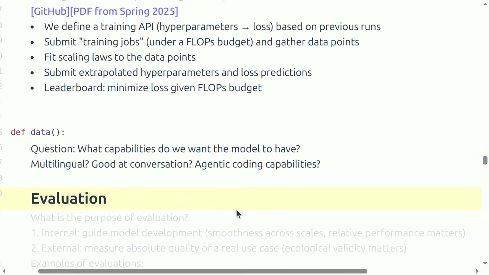

你知道，我们会讲的一件事是，评估是一个相当深的话题。不只是，不只是跑一些 benchmark。对于模型开发，有内部评估指标。这里重要的是，跨规模的平滑性，这样，记住我们希望事情可预测。相对性能很重要。你不一定关心这个在绝对意义上有多好，因为，比如说，一个 perplexity 数字，在某个 held-out 数据上 perplexity 1.2 到底意味着什么？然后还有外部指标。这些是你报告给客户、审稿人，或者任何你展示的人的东西。这里，生态效度真的很重要。我认为有时这两类东西会被混为一谈，但我认为它们服务两个不同的目的。你可以把 perplexity 看作对内部开发非常有用的东西。直到今天，perplexity 仍然是捕捉模型内在质量的一个非常好的方式，而不必担心 benchmark-maxing。现在，有一个单独的问题是你用什么来跑 eval。推荐的是，如果你有一些不在互联网上的数据，那会很好，因为你可以避免污染。

*[56:05](https://www.youtube.com/watch?v=JuoVZkPBiKk&list=PLoROMvodv4rMqXOcazWaTUHhq-yembLCV&t=3365)*

好，然后还有高级用例，它们更代表面向外部的用例。还要注意一件事，语言模型据称非常通用。对吧？所以，合适的做法是，我们确实需要非常多样化的评估集合。我总是建议有很多评估，你可以把它们平均成一个数字，但那个平均往往混淆了很多不同的东西。

*[56:39](https://www.youtube.com/watch?v=JuoVZkPBiKk&list=PLoROMvodv4rMqXOcazWaTUHhq-yembLCV&t=3399)*

好，现在在我们设置好 evals 之后，我们知道我们在构建什么。你如何获取数据？嗯，第一件事是数据不会从天上掉下来。它必须被主动地策展。通常，我认为，尤其是在课堂上，也在研究中，有时你只是被给了一个数据集，然后就是，好吧，现在我在这个数据集上做东西。但是很多语言模型，尤其如果你想收集这些大型数据集，你必须主动去看它。所以，网页是从互联网爬取的。有书，我猜这在现在有争议，但还有档案论文、GitHub 代码等等。这是 2021 年 Pile 的一个旧图。你可以看到，语言建模数据集相当多样。尤其是现在，我认为围绕用受版权保护的数据训练是否属于合理使用，有很多争议。也许有时你必须许可数据等等。所以，围绕数据有法律问题，我认为这相当重要。例如，很多 GitHub 代码没有许可证。那你怎么解释？你认为，假设它是宽松许可，还是保守地假设它不是宽松许可？

*[58:00](https://www.youtube.com/watch?v=JuoVZkPBiKk&list=PLoROMvodv4rMqXOcazWaTUHhq-yembLCV&t=3480)*

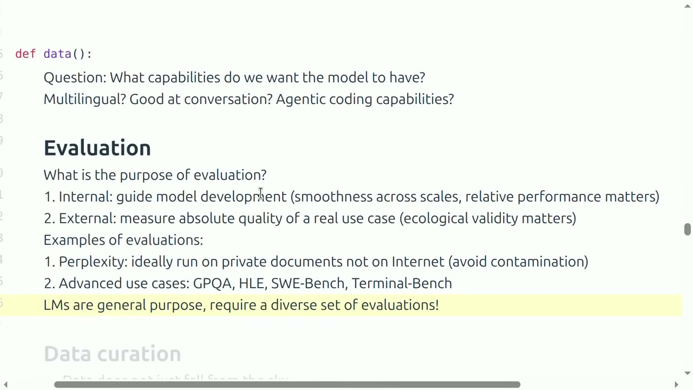

还有一点，数据甚至不是文本，对吧？它要么是 HTML，要么是 PDF，要么是代码，要么是目录。这需要处理，把它变成实际可用的文本用于训练。所以，这就是数据处理的话题。这里必须发生几个步骤。转换，把一些非文本转换成文本。过滤，只保留好的东西。如果 Common Crawl 里的随机互联网文档极其糟糕，你大概不想训练它。你想去重。有多个来源。所以，你如何组合不同来源？最后，最近有很多关于生成合成数据的工作，这可能意味着拿真实数据，把它重写成更像下游任务的东西，或者更像维基百科的东西，或者你想要的任何东西。所以，这是一个活跃的研究领域。另外，数据既可以用于预训练，也可以用于所谓的中期训练，通常是你在预训练步骤末尾放入的高质量数据。这包括长上下文数据，比如大型代码仓库或书籍。最后，还有后训练数据，也许是对话或带工具调用的智能体轨迹。

*[59:40](https://www.youtube.com/watch?v=JuoVZkPBiKk&list=PLoROMvodv4rMqXOcazWaTUHhq-yembLCV&t=3580)*

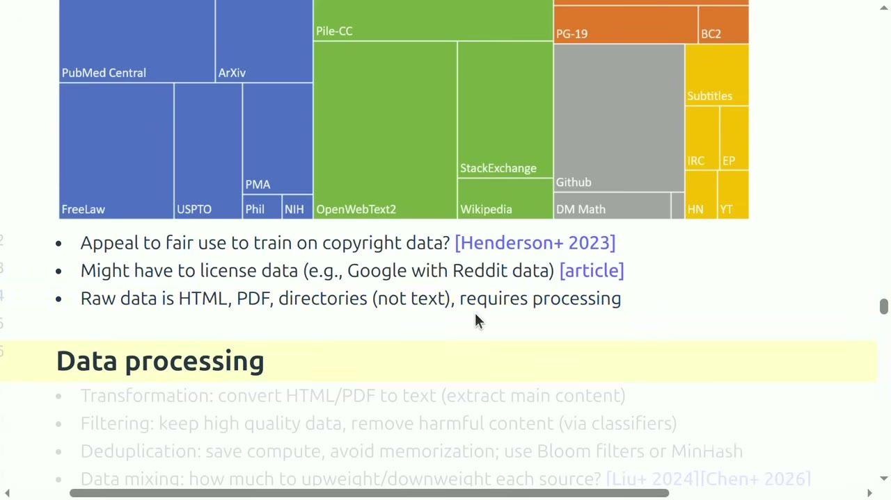

所以在 assignment four 里，我们会让你从非常原始的语料开始，比如原始网络爬取，做所有过滤、去重、让数据变干净的工作。所以，我会说，我不知道我是否会说它不好玩，但它肯定，我认为，是很多人们会称为脏活的工作。但我认为，这是从零构建语言模型的重要部分。所以，你必须获得完整体验。

*[60:19](https://www.youtube.com/watch?v=JuoVZkPBiKk&list=PLoROMvodv4rMqXOcazWaTUHhq-yembLCV&t=3619)*

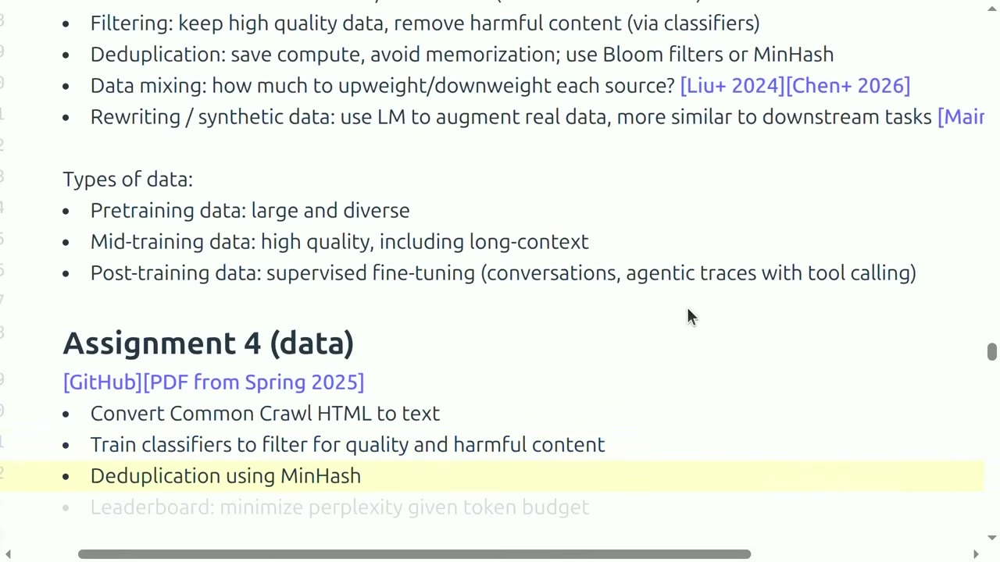

## 对齐与 assignment five

好。最后，对齐。到目前为止，我们基本上用完全监督训练了一个模型。预测下一个 token 或接下来几个 token。现在，模型应该已经不错了。但我们可以通过使用弱监督进一步改进它。为什么使用弱监督？因为有时候批评比生成更容易。所以，你不能总是有数据说，这是对这个 prompt 的正确回答，但也许你可以有某种方式指定什么是好的。所以，基本模板是，你从模型生成回答。你用人类、验证器或 LLM judge 给它们打分，然后你更新模型，让它偏好更好的回答。这可以通过各种 RL 算法实现，比如 PPO 或 GRPO，或者更简单地，如果是偏好数据，用 DPO。

*[61:22](https://www.youtube.com/watch?v=JuoVZkPBiKk&list=PLoROMvodv4rMqXOcazWaTUHhq-yembLCV&t=3682)*

所以，围绕 RL 的挑战是，RL 算法不稳定、难调。你们有些人可能从亲身经验知道。就我个人而言，我更喜欢尽可能长时间地把事情保持在完全监督的情况里，然后最后，好吧，行，我必须做 RL。但你知道，有些人，不管什么原因，喜欢做 RL。另外，我们希望今年能讲的是，如果你大规模做 RL 并尝试最大化吞吐量，实际上有很多系统挑战。你必须有一个推理服务器和一个训练服务器，然后推理服务器必须生成这些 rollout，尤其是如果你对涉及代码执行的环境做 RL。这是一整套编排游戏。然后，如果你的 worker 落后了，你就会遇到 off-policy 问题，然后你不断在 on-policy 性和最大化吞吐量的愿望之间权衡。所以，说白了，这是一个巨大而美妙的混乱，希望我们讲到那时能多谈。

*[62:33](https://www.youtube.com/watch?v=JuoVZkPBiKk&list=PLoROMvodv4rMqXOcazWaTUHhq-yembLCV&t=3753)*

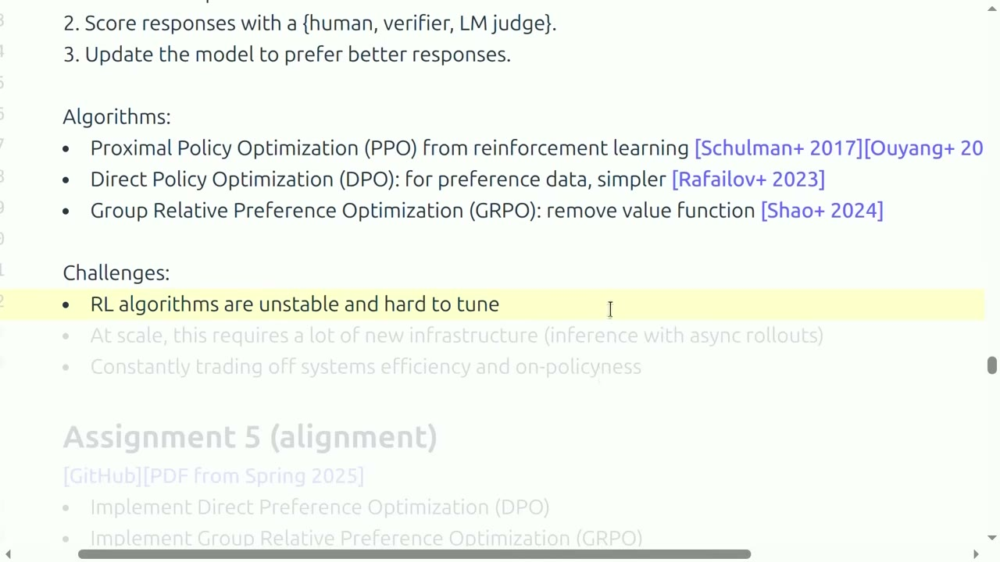

所以，assignment five。我们还在决定具体要做什么。去年是实现 DPO 和 GRPO，并让它在某个数学 benchmark 上工作。但我们会看看今年能在现实性维度上推多远。

*[62:53](https://www.youtube.com/watch?v=JuoVZkPBiKk&list=PLoROMvodv4rMqXOcazWaTUHhq-yembLCV&t=3773)*

好。再次记住，这是关于效率。效率可以是数据效率或计算效率。所以，思考方式是，你有所有这些资源。你有数据，有硬件，硬件有计算核心、内存、通信带宽。你只是在试图弄清楚，在固定资源集合下，如何根据某种评估构建最好的模型。所以，通过这个视角，我认为你实际上可以把很多这些设计决策看作是在优化这个。系统，很明显，是关于计算效率。Tokenization，正如我之前提到的，你可以直接用原始字节，但那会非常计算低效。至少用今天的模型架构是这样。所以，很多 tokenization 是在改进计算效率。模型架构，我们会看到的很多改变，动机都是减少内存或 FLOPs。事实上，很多改变受到更快推理需求的影响。数据过滤，你也可以从效率角度看：我们不想浪费时间在一堆冗余的坏数据上更新梯度。即使它可能不会伤害你，但它会伤害你，因为如果你有固定计算预算，更多时间花在坏数据上，就意味着更少时间花在好数据上。最后，缩放定律明确是关于如何在小得多的模型上做有效的超参数调优。现在，明天我们可能会变成数据受限，设计决策的算法可能会变。但我认为我们试图教你的整体心态是，思考你方法的效率。好，我停在这里。

*[64:45](https://www.youtube.com/watch?v=JuoVZkPBiKk&list=PLoROMvodv4rMqXOcazWaTUHhq-yembLCV&t=3885)*

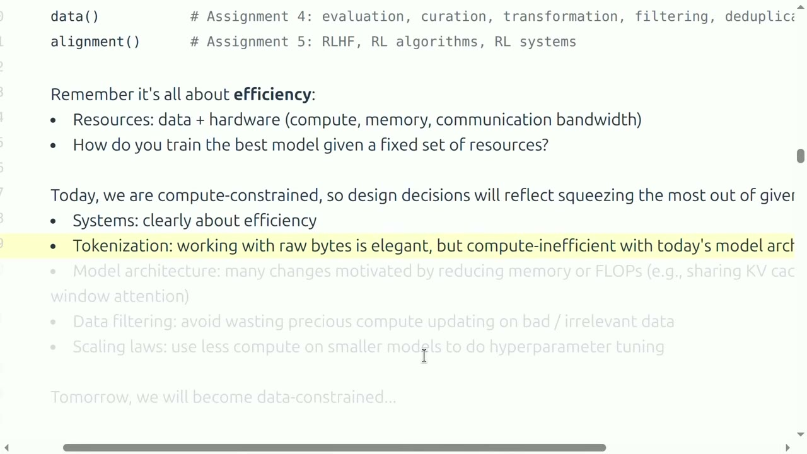

关于这些作业或主题有什么问题吗？

*[64:49](https://www.youtube.com/watch?v=JuoVZkPBiKk&list=PLoROMvodv4rMqXOcazWaTUHhq-yembLCV&t=3889)*

## Tokenization：从字符串到 token

好。那我们现在讲 tokenization。这是我们跳进的第一个单元。Andre Karpathy 有一个非常好的关于 tokenization 的视频。你应该看看。起点是，原始文本，文本是什么？它是 Unicode 字符串。另一方面，语言模型在 token 序列上放置分布，通常表示为索引。所以我们需要一个过程，把这些字符串编码成 token，也需要一个过程，把 token 解码回字符串。所以 tokenizer 基本上就是能做这个往返的东西。这里有一些例子，让你感受 tokenizer 如何工作。其实我应该早点试试联网，所以这个用不了。好。如果你去那个网站，你可以玩不同的 tokenizer。

*[66:03](https://www.youtube.com/watch?v=JuoVZkPBiKk&list=PLoROMvodv4rMqXOcazWaTUHhq-yembLCV&t=3963)*

这里有一些观察。你会体会到为什么 tokenizer 有点烦，为什么人们想摆脱它们。一个词和它与前面空格结合的版本是不同的 token。所以你会看到很多 token 实际上是空格加一个词，这没问题但有点奇怪。所以这个 hello 和这个 hello 实际上是两个完全不同的索引，彼此毫无关系。而且，有时取决于你用的 tokenizer，数字会被表示为，每几位数字一个 token。有时它是可预测的，有时不是。有些 tokenizer 试图让每个数字一个 token，但那样你会让 token 数量爆炸。所以那里有权衡。这是 GPT-5 tokenizer。你可以把这个字符串转换成这些索引。然后你可以解码回字符串，假设 tokenizer 应该往返。如果你实现 tokenizer，它不能往返，那就有问题。这里的压缩比是每个 token 的字节数。在这个例子里，这个字符串的字节数是 20。token 数是 8。20 除以 8，压缩比是 2.5。所以每个 token 2.5 字节。压缩比越大，意味着句子越短，这是好事，因为 attention 是二次的，你想确保句子更短。现在你显然可以通过增加 vocab size 来提高压缩比。但那样你会遇到稀疏性，因为 vocab 的每个元素都被当作不同元素。所以现在，tokenizer，尤其是多语言 tokenizer，有 10 万或 20 万个不同的 token。你可以查看 GPT token 词表。我想为了时间我们跳过。好。

*[68:28](https://www.youtube.com/watch?v=JuoVZkPBiKk&list=PLoROMvodv4rMqXOcazWaTUHhq-yembLCV&t=4108)*

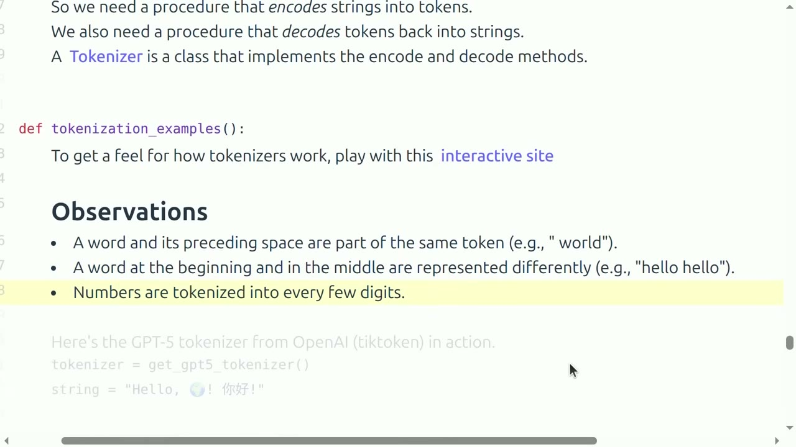

那么，你如何构建一个 tokenizer？我会快速过一遍。但你首先可能做的是，好吧，Unicode 字符串，它本身就已经是一个 Unicode 字符序列。每个字符是一个整数，你可以在 Python 里叫 ord，然后得到某个数字。这可以转换回字符。那我们就构建一个字符级 tokenizer，基本上把每个字符拆开，编码成一个 token。然后这可以解码回来。生活很美好。现在，有 15 万个 Unicode 字符。所以你的 vocab size 可以是 15 万，这，你知道，很多。我是说，也不算疯狂。但我认为更大的问题是，很多字符实际上很罕见，这意味着它真的是对词汇表的低效使用。而且压缩比，也反映了这一点，并不好。所以大多数时候，你实际上用了很多 token 来表示你的序列。而且很多索引实际上没怎么被用到。所以这不是一个很好的 tokenizer。

*[69:44](https://www.youtube.com/watch?v=JuoVZkPBiKk&list=PLoROMvodv4rMqXOcazWaTUHhq-yembLCV&t=4184)*

这里是另一个尝试。你可以把字符串变成字节。Unicode 有 UTF-8 Unicode 编码，这意味着有时像 A 这样的字符串只是一个字节。有时一个字符串是多个字节。那我们就围绕这个构建 tokenizer。我们可以把这个字符串转换成字节序列。注意，现在这是一个更长的序列。但所有数字都在 0 到 255 之间，因为这就是字节的含义。压缩比是 1，这不好。对吧？所以字节序列可能非常长。但 vocab size 很小。

*[70:42](https://www.youtube.com/watch?v=JuoVZkPBiKk&list=PLoROMvodv4rMqXOcazWaTUHhq-yembLCV&t=4242)*

好，现在，好，这两个都很糟糕。那我们试着取得一些进展。这是 NLP 里人们过去实际会做的，如果有人记得。如果你拿一个字符串，我可以直接把它分块，按空格或某个正则表达式拆开。然后我们把每个块叫做一个 token。好，这个的好处是每个 token 都有意义，因为人类发明了词，而词往往有稳定的语义含义。但你的 vocab size 是训练数据中不同块的数量，这可能很多。而且你的压缩比，我是说，相当好，但词汇表可能巨大。实际上，更糟的是，词汇表可能是无界的。对吧？因为在测试时你可能得到某个序列，你 tokenize，然后你有一个从未见过的 token。人们过去会给这些分配一个 unk token，但那真的很丑，而且会搞乱你的 perplexity 计算。所以这也不好。

*[71:55](https://www.youtube.com/watch?v=JuoVZkPBiKk&list=PLoROMvodv4rMqXOcazWaTUHhq-yembLCV&t=4315)*

好，那我们实际要做的叫 byte-pair encoding。这是很久以前为了数据压缩引入的，远在语言模型真正登场之前。它第一次被引入 NLP 是做神经机器翻译，第一篇用 BPE 做 LM 的论文是 GPT2。基本想法是，你会在原始文本上训练 tokenizer，构建一个为数据量身定制的词汇表。你还会有一个性质：一切都可以被 tokenize，如果它罕见，就拆成更小的单元，而不是有一个 unk token。常见序列会被表示为一个 token。罕见序列会被拆成多个 token。这就是想法。

*[72:54](https://www.youtube.com/watch?v=JuoVZkPBiKk&list=PLoROMvodv4rMqXOcazWaTUHhq-yembLCV&t=4374)*

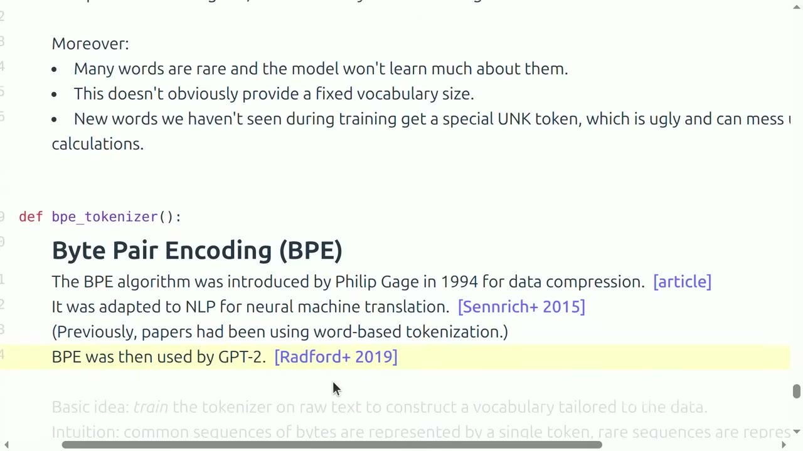

好，算法概念上相当简单。你基本上从你的语料开始。假设它是一长串序列。你得到一个字节序列。每个字节一开始是一个 token。然后我们会合并相邻 token 中连续出现最频繁的对。好，让我们走一遍这在代码里如何工作。这里有一个简单字符串，the cat and the hat。这里是 BPE 算法的实现。我们要把它变成一个字节序列。然后我们首先基本上数连续 token 出现的次数。所以 116、104 出现了两次。我们得到这个。然后我们找到出现次数最多的对。那就是 116、104。我想有几个并列，但我们就取第一个。然后我们合并那个对。通过合并那个对，我们做的是创建一个新 token。在这个例子里，它叫 token 256。它代表这个对。我们把它加入词汇表。所以 256 将代表序列 th。所以 t 和 h 被合并了。每次我们看到 th，就用 256 来表示。然后我们遍历索引，把每一处 116、104 替换成 256。所以那两个地方被替换了。然后我们迭代。下一次我们做这个时，我们会找到 256 和 101。我们合并那个。现在我们有 257。然后我们再合并一次，得到 258。所以随着时间，序列在缩短，词汇表在增长。

*[75:05](https://www.youtube.com/watch?v=JuoVZkPBiKk&list=PLoROMvodv4rMqXOcazWaTUHhq-yembLCV&t=4505)*

好。让我，这里的压缩比，我们在这个玩具例子里得到的是 1.5。好，现在你有了 tokenizer，你如何 tokenize 新文本？嗯，你拿一个新字符串，编码它。概念上发生的是，你基本上遍历你做的合并集合。然后你把合并应用到你的字符串上。好。我其实不逐步走那段代码了。那会给你一个序列。这是 Quick Brown Fox 的序列编码。然后你解码它，得到同样的东西回来。我讲得有点快，为了时间。我要说这个实现是能工作的。这是一个完整的 Python 实现。它非常慢。所以在 assignment one 里，我们会要求你们基本上让它更快。当前 encode 会遍历所有合并，这非常慢，因为你的合并数量基本上就是 vocab size 减去 256。所以你只想遍历那些重要的合并。你必须建立一些索引来做到。还有一些关于 special token 的细节。概念上不深，但对构建现代 tokenizer 很重要。另一件事是，为了简单，我把 tokenizer 呈现为，你拿整个字符串，然后尝试 tokenize 它。实际上发生的是，你把文本拆成块，然后在每个块上应用 tokenizer。那会快得多。然后尽量让它尽可能快。某个时候你可能会意识到 Python 就是不够快，如果你用你喜欢的语言实现它，Rust 或 C 之类的，那就去做吧。

*[77:28](https://www.youtube.com/watch?v=JuoVZkPBiKk&list=PLoROMvodv4rMqXOcazWaTUHhq-yembLCV&t=4648)*

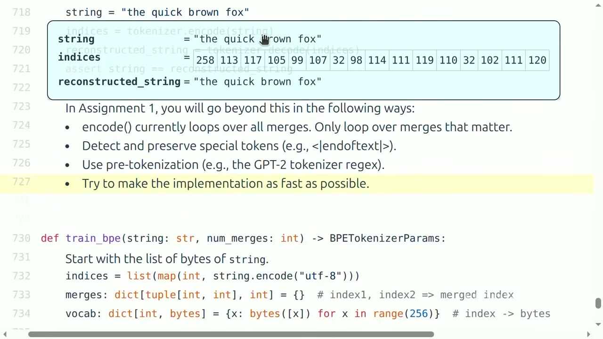

好，快速总结。Tokenizer 在字符串和 token 或索引之间转换。之前的字符基、字节基、词基都各自高度次优。所以 BPE 是一个有效的启发式方法，是数据驱动的，所以看起来相当有效。现在，像我之前说的，也许明年我就不用教这个了，但今年我们还得讲 tokenization。即便我们摆脱了 tokenization，我认为任何替代它的解决方案都必须满足以下性质。对吧？如果你有模型，Transformer 需要在序列的某种抽象上操作。如果你不仅考虑文本，还考虑视频或 DNA 序列，这一点最明显，因为单个字节或单元实际上信噪比相当低。你必须做某种抽象，把它提升到可以做建模的地方。最后，正如我提到的，块应该是可变的。你想要自适应计算。不是所有字节都生来一样。如果你不这样做，我认为你会次优。所以任何端到端解决方案，我认为也必须具备这些性质。

*[78:57](https://www.youtube.com/watch?v=JuoVZkPBiKk&list=PLoROMvodv4rMqXOcazWaTUHhq-yembLCV&t=4737)*

好。那么到这里，我就结束了。下次周三，我们会开始资源核算单元。所以那算是一个婴儿系统，我会说。然后之后，我们会回到架构，从那里继续。好。

*[79:14](https://www.youtube.com/watch?v=JuoVZkPBiKk&list=PLoROMvodv4rMqXOcazWaTUHhq-yembLCV&t=4754)*
