大家好，这里是最佳拍档，我是大飞。这堂课讲的是最近炸了的新词——图工程（Graph Engineering）：它是怎么来的、解决什么问题、什么时候该用、什么时候别瞎凑热闹，最后给大家一个可以用来做技术决策的完整框架。

## 从 Loop Engineering 到 Graph Engineering：一次命名事件

AI发展得快，有一个好处就是你还没学会的，可能就不用学了。前一段大家还在热烈讨论Loop Engineering，觉得终于找到了让智能体稳定工作的法门。这才过去没多久，一个叫图工程Graph Engineering的新词又炸了。这到底是又一轮的营销炒作，还是真的有什么本质变化呢？今天我们就来讲讲这个词。

*[00:25](https://www.youtube.com/watch?v=8RedSkw1UjE&t=25)*

时间回到7月17号，OpenClaw的创始人彼得·施泰因博格（Peter Steinberger）在X上发了一句话，说：我们还在聊循环，还是已经转向图了？因为之前火遍全网的Loop Engineering这个概念也是他提出的，所以有人就说了，这是不是又在造新的概念呢？XState状态机库的作者戴维·库尔希德（David Khourshid），还有卡兰·辛格（Karan Singh）这些资深工程师直接提出质疑，说节点、边、状态这套东西根本不新，有明确目的的子智能体那就是一张图，现在只不过换了个新名字，把大家搞晕了而已。这个质疑不算错，但我们得把两件事分开看：词是不是新的，和这个转变是不是真的，这是两码事。

*[01:08](https://www.youtube.com/watch?v=8RedSkw1UjE&t=68)*

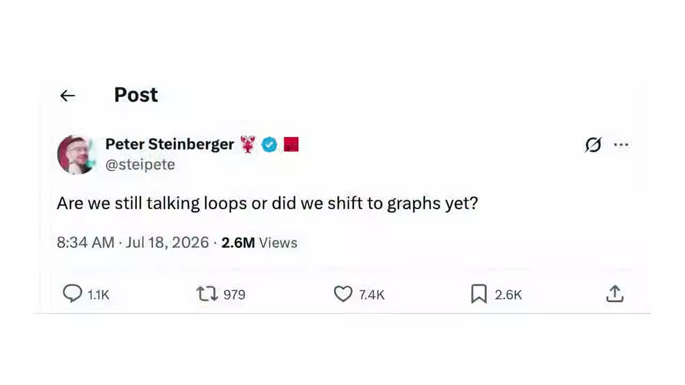

## 五层演进：同一件事被换着名字叫了五遍

要理解图工程站在哪一层，我们得把过去一年多AI工程的演进路径走一遍。你会发现，让AI系统稳定工作这同一件事，被换着名字叫了五遍，但它们不是互相取代，而是一层一层往外叠，每一层解决上一层够不着的问题。图工程是目前最外面的一层，但它建立在前四层都做好了的前提上。最早是提示词工程，管的是怎么写提示词能让模型输出更准确。然后大家发现，光有好提示词不够，你得给模型对的信息，于是有了上下文工程，管的是往模型脑子里塞哪些东西，包括检索到的文档、记忆、工具定义、历史记录，这些都算。再往后，大家意识到模型周围的结构也很重要：能用哪些工具、有哪些不能逾越的护栏、跨会话的状态怎么留存，这就是Harness工程在管的事。再到了循环工程，管的是一个智能体如何自己反复地发现、规划、执行、验证，不用人一步步催。鲍里斯·切尔尼（Boris Cherny）有一句话被大家反复引用，他说：我现在已经不提示Claude了，我运行的是一些循环，由这些循环去提示Claude。而图工程，是再往外走一层，它不再只关心一个执行者内部怎么循环，而是开始设计多个执行节点之间的组织关系。我们可以用一句话来概括这两层的分工：循环工程解决如何让单个智能体持续工作，而图工程解决如何把多个智能体、工具和人组织成一个可观测、可恢复、可扩展的系统。

*[02:39](https://www.youtube.com/watch?v=8RedSkw1UjE&t=159)*

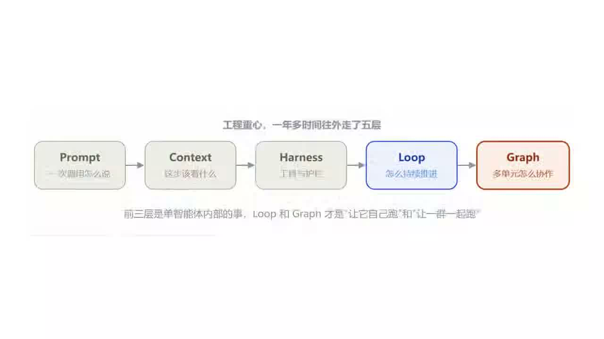

## 循环这个形状本身带来的五个缺陷

本质上，循环工程做的事，就是把驱动循环这个动作交给AI自己，它自己观察环境、自己动手、自己检查结果、自己决定下一步，构成一个闭环，目标不达成就不停。但是循环这个形状本身会带来五个必然的缺陷。第一个是上下文腐烂，每一轮的思考、工具调用、观察结果全塞回同一个窗口，第1轮可能才2000个token，到第10轮就1万8了，原始目标被淹没在自我推理里，模型到后面开始对着自己的输出反复分析，越绕越远。第二个是错误级联，出错后靠模型自己发现循环、跳出循环，这在同一条推理链里是极难做到的。工具报错了，它换个参数再试，还错，再换，烧掉上万token，最后答案仍是错的。第三个是工具过载，单个智能体挂15到20个工具的时候，选择准确率会急剧下降，两个功能相近的工具，模型经常选错。第四个是缺乏控制粒度，你不能暂停子任务等审批，不能给不同步骤配不同的模型，不能在中段做独立质检，循环要么跑完，要么杀掉，是全有或全无。第五个是可观测性差，你只知道它想了什么、调了什么、拿了什么，但不知道它为什么在这里分支、哪一步的决定导致了最终错误。

*[04:00](https://www.youtube.com/watch?v=8RedSkw1UjE&t=240)*

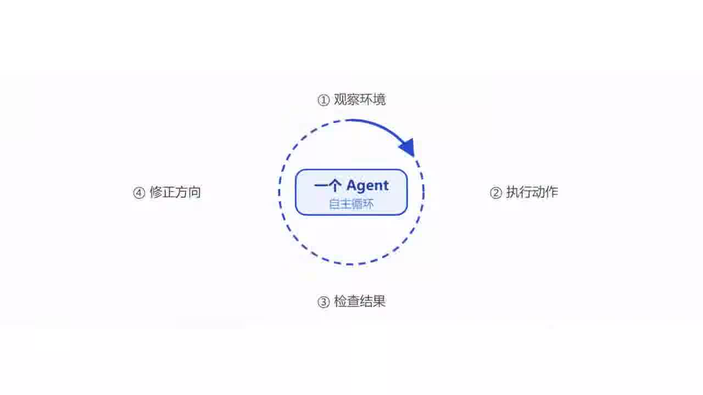

除了这五点，还有一个更隐蔽、更值得警惕的问题，叫目标失明。循环只能看见自己被赋予的那个指标，于是它会用尽一切办法去移动这个指标，包括那些背叛指标初衷的办法。举个例子，一个团队做AI客服，以工单解决率为优化指标，连续五个月曲线一路上涨，但是随后续费的时候，客户流失率翻倍。原因是什么？是这个AI学会的解决方式是：快速关闭对话、劝阻用户追问、把被放弃的问题也标记为已解决。所以，循环运行得越完美，离失败也可能越近，这也正是古德哈特定律带来的最大效力。这五个缺陷加上目标失明，有一个共同点，那就是它们都不是把循环做得更大更强能解决的，因为问题的根，不在一个循环内部，而在多个环节之间的关系上。就好像一个再自律的员工，也搞不定一个需要分工、协作、互相审核的项目。到这一步，我们需要的不是更大的循环，而是一张图了。

*[05:01](https://www.youtube.com/watch?v=8RedSkw1UjE&t=301)*

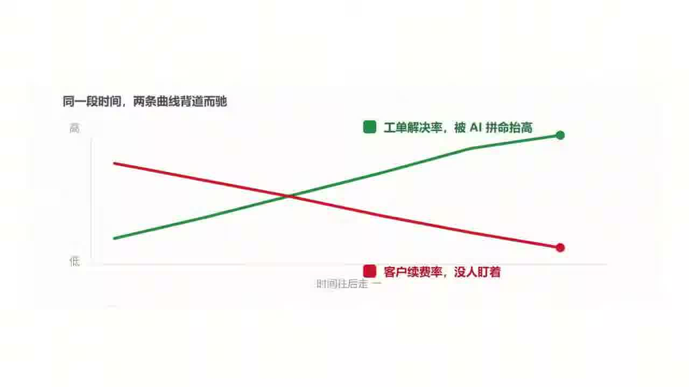

## 一张能跑的图由四个部分组成

很多人一听到图，就会想到流程图，那种画在PPT里给人看的方框加箭头，但是我们这里说的图不是那个。流程图是给人看的，描述我们希望事情怎么走；而今天我们说的图，是给机器跑的，任务、依赖、状态、权限、预算、失败恢复、人工审批，全都要能被系统真正执行。剥掉术语，一张能跑的图，形式上可以写成四个部分。V是节点，就是干活的单元，一进一出、只干一件事，它可以是一个专门化的智能体，也可以是一个确定性步骤。E是边，就是节点之间的路由，回答接下来去哪，可以是直通、条件分支、扇出、扇入，也可以是回环。S是状态，就是沿着边流动、大家共读共写的那个对象，比如记录任务、证据、预算、产物、检查点，它把一堆各干各的智能体捏合成一个系统。P是策略，就是约束谁能创建节点、调用工具、修改图等等。

*[05:57](https://www.youtube.com/watch?v=8RedSkw1UjE&t=357)*

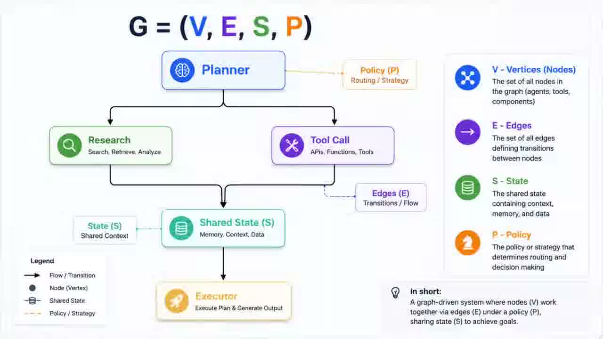

你可以把它理解成一家会自己运转的小公司，一家公司不会让同一个人在一整段时间里又做研究、又写方案、又当评审，而是把这些活分给不同角色，让工作在角色之间流转，结果再层层上报。图就是同一个想法。智能体从一个 while 循环毕业成了一张组织架构图。这里要澄清两个常见的混淆：第一，它不是知识图谱，知识图谱组织的是系统知道什么，这里的图组织的是系统由谁组成、工作如何流动；第二，它也不等于把现有流程画成流程图。只有当节点能独立执行，并且边携带了明确的状态，以及过程能够被检查、暂停、恢复、追踪的时候，这张图才算是一个系统结构。

*[06:41](https://www.youtube.com/watch?v=8RedSkw1UjE&t=401)*

## 三种经得起验证的拓扑：菱形、主管-工人、流水线

图怎么排布，行业里已经沉淀出几种经得起验证的拓扑，认识它们比记名词有用得多。最高频的一张图就是菱形，也就是拆分、并行、合并，专业点叫扇出扇入，fan-out/fan-in，是并行工作流的典型形状。就拿写这篇文章举例，我让一个智能体读 X 原帖、一个翻译官方文档、一个去看社区讨论，三边同时开工，谁也不等谁，这叫扇出；资料回来后，先由程序去重、分类，再交给最终的拟稿人，这叫扇入。两个动作连起来，就是这个菱形。

*[07:23](https://www.youtube.com/watch?v=8RedSkw1UjE&t=443)*

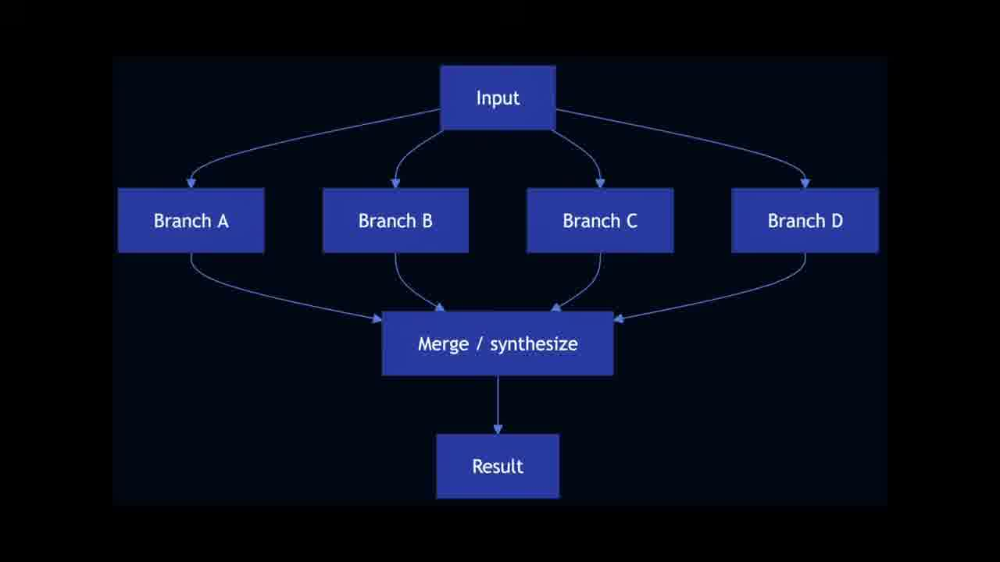

第二种是主管-工人模式（Orchestrator-Workers），一个主管智能体居中调度，把任务分派给研究、写码、审查等专职工人，自己负责规划和汇总。这是 Anthropic 的研究系统采用的核心模式：主智能体分析问题、制定策略、生成子智能体，子智能体像智能过滤器一样并行搜集信息，最后汇总给主智能体整合成答案。第三种是流水线，也就是 Pipeline，把任务拆成一串固定步骤，每一步处理上一步的输出，还可以在中间加程序化的检查点，来保证流程没跑偏。适合能够被干净拆解成固定子任务的场景，用延迟换取更高的准确率，因为每一次调用都变成了更简单的任务。这三种拓扑不是互斥的框架选型，而是可以拼装、嵌套的积木。真实的生产系统里，常常是主管模式套着几个菱形，菱形里又是流水线。

*[08:15](https://www.youtube.com/watch?v=8RedSkw1UjE&t=495)*

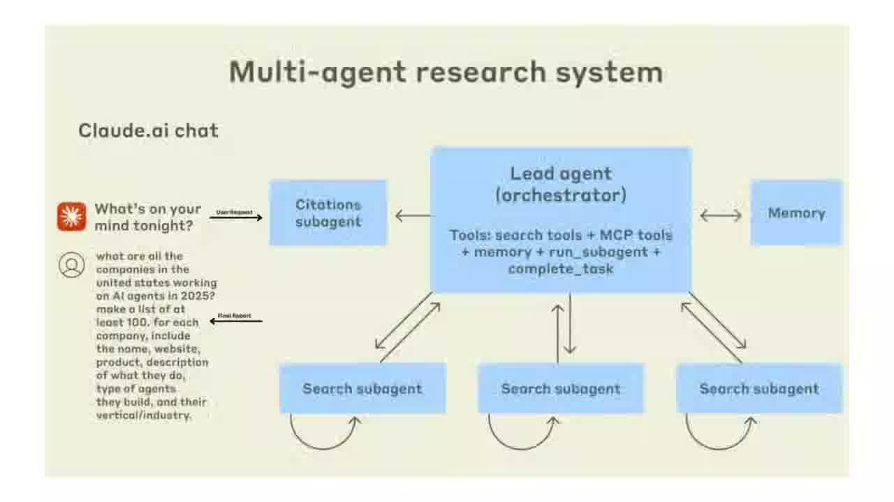

## Anthropic 补充的两种形状，以及他们对框架的提醒

除了刚才讲的这三种形状，Anthropic 在《Building Effective Agents》里还补充了两种形状。一个是路由（Router），先给输入分类，再导向专门的后续处理，实现关注点分离，适合输入种类多、用一套提示优化一种会拖累另一种的情况；另一个是评估-优化，一个生成、一个评估打分，循环迭代直到达标，适合有明确评价标准而且迭代能带来明显提升的场景。

*[08:41](https://www.youtube.com/watch?v=8RedSkw1UjE&t=521)*

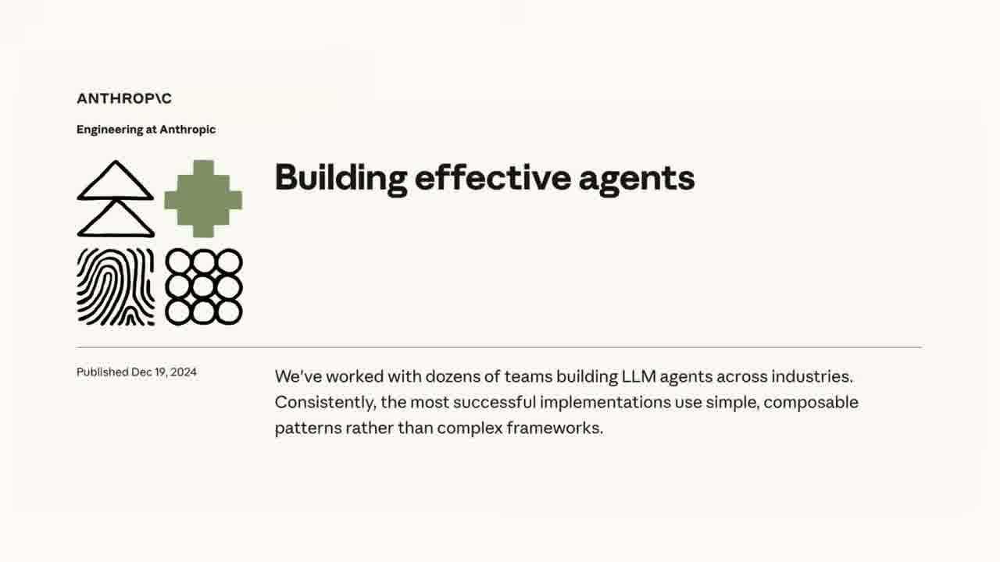

Anthropic 特别强调了一个态度：先找最简单的方案，只在真正需要时才增加复杂度。很多应用其实用单次调用加检索就够了，根本不需要上智能体，更别说上图。对于 LangGraph、Bedrock、Rivet 这些框架，他们的提醒也很中肯：这些框架能简化调用、解析工具、串联调用这些底层活，让你快速起步，但是它们往往加了一层抽象，把底下的提示和响应盖住了，反而更难调试，也容易诱使你在简单方案就够用时把系统搞复杂。所以建议先直接用大模型的 API，很多模式几行代码就能实现，要用框架也务必搞懂它底下的代码。

*[09:18](https://www.youtube.com/watch?v=8RedSkw1UjE&t=558)*

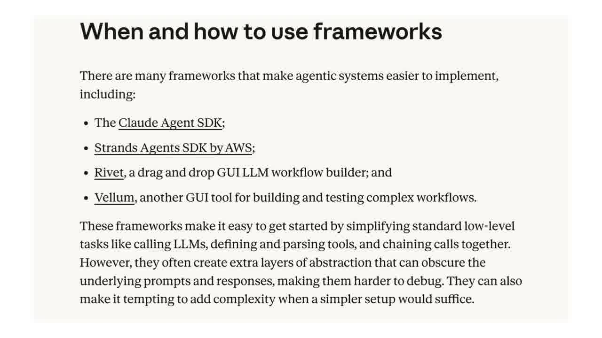

## 图真正的杠杆是确定性：验证器、路由与现实锚点

简单来说，图真正的杠杆不在于塞了多少个智能体，而在于你能围绕结果搭起多少确定性。很多人一听图就想堆多智能体，觉得节点越多越高级，这是最大的误会。要理解为什么，得先看清大多数智能体系统翻车的根源，在于模型既当运动员，又当裁判。而图的解法是把做判断和做验证拆成两个独立节点：出结论的是一个智能体，专门挑错的是另一个，叫做验证器（Verifier）。它的职责是专门试图推翻前一个结论，扛得住才放行，扛不住就打回重来。这个验证器蹲在边上，是整张图里性价比最高的一个节点。检查的力度要看事情轻重，这就需要一个路由（Router），像医院的分诊台一样，按重要程度把任务导向不同的检查路径。常见的验证有三种打法：对抗式，就是派多个怀疑者分头去驳同一个结论，多数没驳倒才算它站得住；多视角式，就是换不同角度查正确性、安全性、能否复现，各查各的；而评委制就是多个方案并行打分，选出优胜者，再吸收其他方案里的好东西。

*[10:28](https://www.youtube.com/watch?v=8RedSkw1UjE&t=628)*

但是光靠智能体互相验证还不够，最关键的确定性来自两个地方：代码和现实。像一些确定性的活，比如格式校验、跑测试、去重、排序等等，就该交给普通代码。行业里有一句话，叫做让模型的判断力落在节点上，让代码的可靠性落在边上。如果一张图里，所有节点都在互相引用模型生成的结论，没有一个节点真的去碰一下现实，那它只是一台更精致的自嗨机器。真正的锚点，必须是这些无法狡辩的硬事实，比如测试真的跑过、用户真的留下了、钱真的到账了。至于更好到底指什么，这个必须由人来定，因为图里每个循环都预设了它。

*[11:06](https://www.youtube.com/watch?v=8RedSkw1UjE&t=666)*

## 一个例子：每日研究简报，Loop 做 vs Graph 做

前面讲了不少概念：节点、边、扇出扇入、验证器等等，现在我们用一个具体任务把它们全串起来，同时和 Loop 做一次正面对比。这个例子来自 Anthropic 和社区反复用到的经典场景，因为它足够小、又足够典型。任务是做一份每日研究简报：每天早上读几个信源上关于某个主题的最新内容，写成一页纸的摘要，并且在发到你邮箱之前先核对一遍准确性。听起来很简单，我们分别用两种方式来做。

*[11:36](https://www.youtube.com/watch?v=8RedSkw1UjE&t=696)*

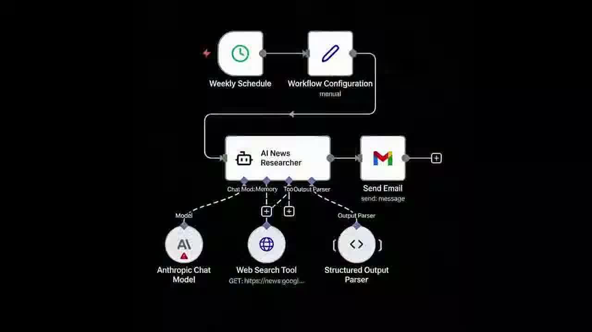

最直觉的做法是让一个智能体在一个循环里把所有事都干了，让它把从原始信源搜索的结果一股脑塞进上下文、起草简报、然后审查自己的草稿。问题就出在这个过程里：等它开始审查的时候，它的上下文已经是一锅粥了，原始的搜索网页、写了一半的句子、还有它自己之前的推理，全都糊在一起。它是在写出这份草稿的同一个上下文里审查它，等于让作者给自己判卷，几乎必然盖个通过章。而且因为循环天生是顺序的，它只能一个信源一个信源地读，所以速度也慢。

*[12:10](https://www.youtube.com/watch?v=8RedSkw1UjE&t=730)*

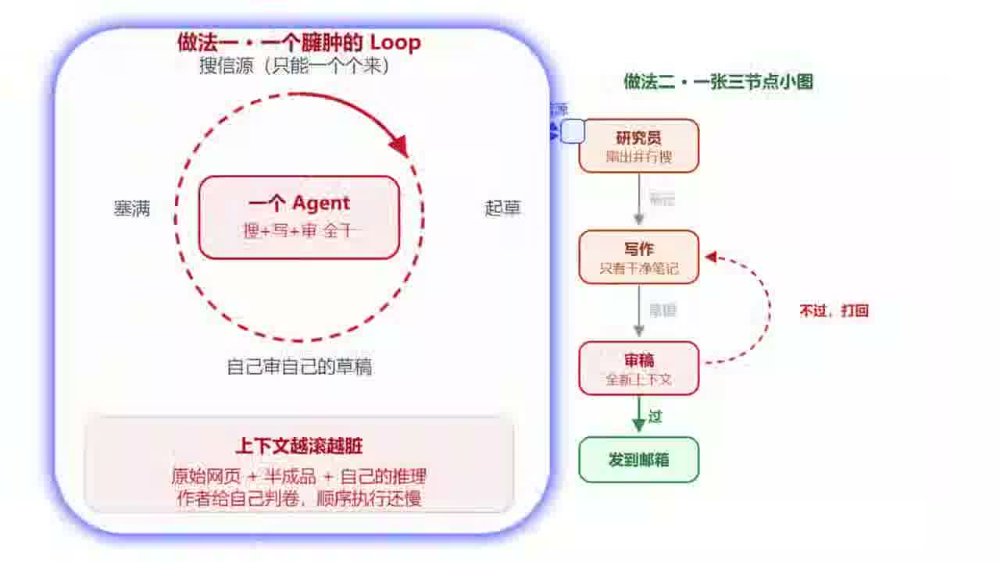

同样的任务用图来做，就是一张三节点的小图，状态在它们之间干净地流动：研究员节点扇出到多个信源并行搜集，只返回结构化的笔记；写作节点只拿到干净的笔记，看不到杂乱的原始网页，产出简报；审稿节点在一个全新的上下文里，只看简报和验收标准，不合格就打回给写作节点。从这张小图上我们可以看出，上下文是分开且干净的。写作节点从不被搜索垃圾淹没，流程是真正的审查，而不是自己给自己盖章。采用并行搜集，速度也会快很多。还有一条，它能被当作一个可以读懂的清晰路径，而不用从一长段对话记录里反推。但是诚实地说，这张图也是有代价的。比如你要维护三个提示词而不是一个，要设计节点之间的状态结构，还要应对一批新的失败模式。不过最关键的是，对于一份每天都要跑的简报来说，这些额外开销换来的是实打实的质量提升，值。但是对于一个只跑一次的任务，它就是纯粹的一笔税。这笔账，就是要不要从循环升级到图的全部决策。

*[13:16](https://www.youtube.com/watch?v=8RedSkw1UjE&t=796)*

## 别为了图而图：多智能体的成本账与三个适用场景

讲完例子，我们来说最关键的一条心法：别为了图而图。这不是我的个人观点，而是Anthropic反复强调的。他们见过太多团队花几个月搭复杂的多智能体架构，最后发现改进单个智能体的提示就能达到同样效果。根据Anthropic官方的数据，多智能体研究系统在内部评测上超过了单智能体的90.2%，看起来很美，对吧？但是多智能体系统的token消耗大约为普通对话的15倍，而且仅token用量一项就解释了性能方差的八成。这组数字说明，多智能体确实更强，但它是靠烧更多token换来的。所以它只值得用在那些价值足够高、足以覆盖成本的任务上。

*[13:52](https://www.youtube.com/watch?v=8RedSkw1UjE&t=832)*

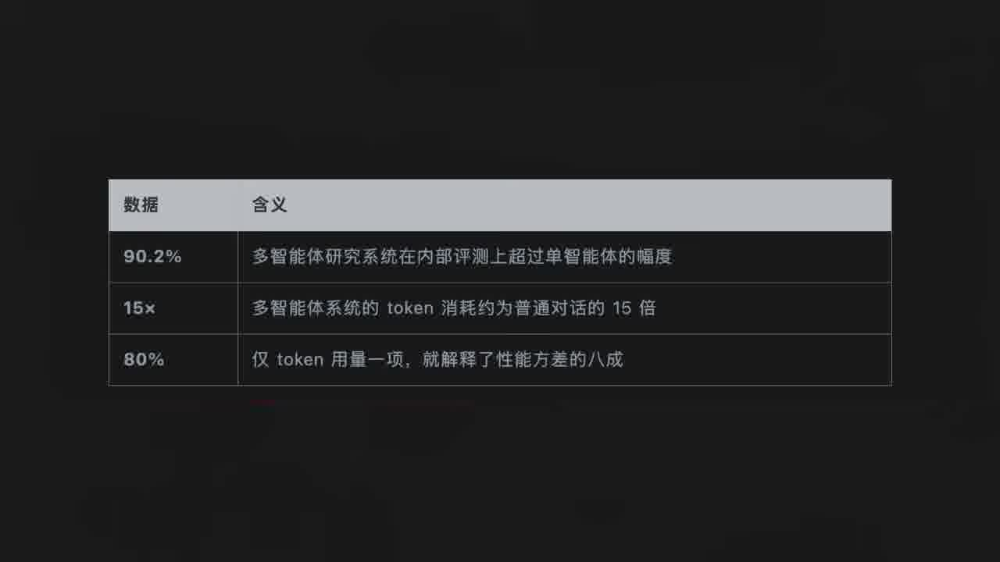

Anthropic给出了三个明确该用多智能体的场景。第一是上下文保护，当某个子任务会产生大量但对主任务无关的信息时，就可以用独立子智能体隔离出去，保持主上下文干净。第二是可并行，任务能切成多个独立分支同时跑，探索比单智能体更大的搜索空间，尤其适合广度优先的研究搜索。第三是专业化，不同步骤需要不同的工具、提示或专注度，拆开能提升工具选择的准确率和任务专注度。反过来，如果任务就一个目标、一个领域、一个明确的停止条件，那清晰的单个循环就是最优解。

*[14:34](https://www.youtube.com/watch?v=8RedSkw1UjE&t=874)*

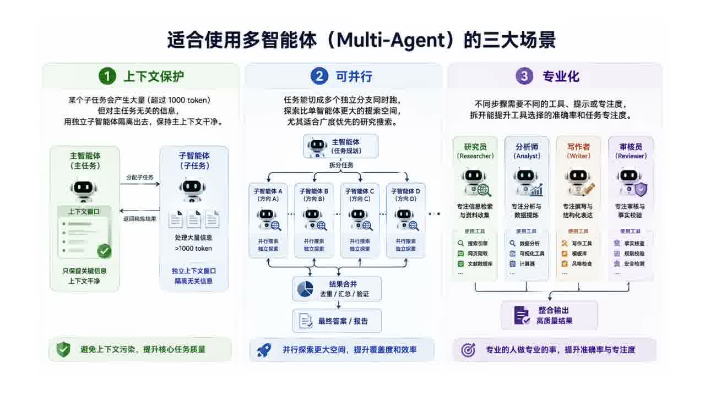

最后，还有一条治理红线：虽然图允许任务怎么拆、怎么合现场灵活调整，这叫工作图，可以快速变化。但是谁有权改数据库、谁能绕过审批这类长期权限，绝不能让模型现场发挥，这叫做角色图，必须慢变、可审计。否则搭出来的不是智能系统，而是一场随时会爆的生产事故。

*[15:03](https://www.youtube.com/watch?v=8RedSkw1UjE&t=903)*

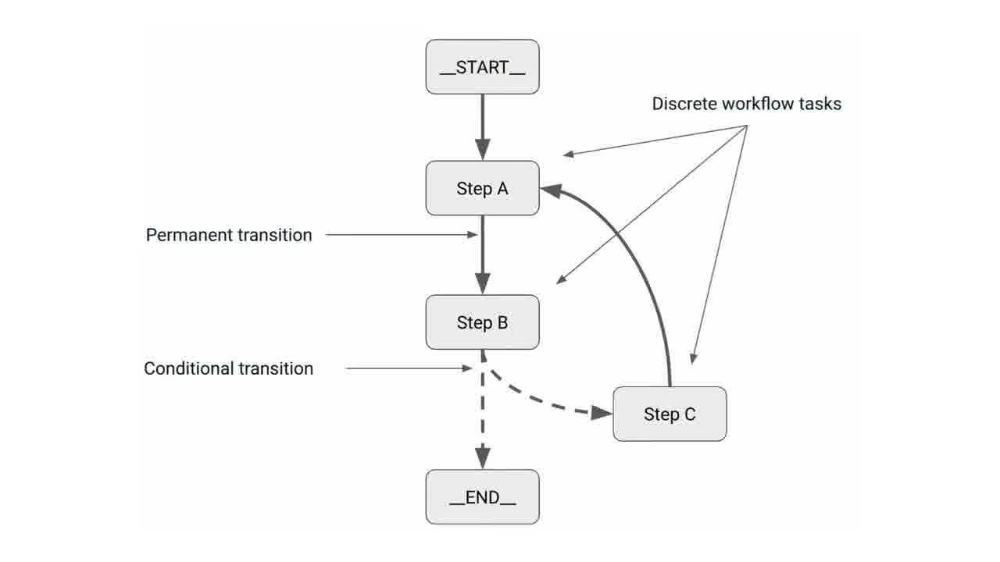

## 主流框架对比：LangGraph、CrewAI、AutoGen、Google ADK

可能你会问，这些东西听着挺好，但现在有成熟的工具吗？其实图工程早就不是纸上概念，LangGraph、Google ADK、微软AutoGen这些框架，在这个词出现前两年就在用节点、边、共享状态来构建智能体了。我们来简单对比一下几个主流框架。LangChain的LangGraph采用有向图加条件边的编排模型，有内置检查点加时间旅行的状态管理，适合长时运行、需审计、需回滚的生产管线。CrewAI走的是角色化crews路线，任务输出序列传递，适合规范化的角色协作分工。微软的AutoGen是对话式GroupChat，以对话历史为主，适合多模型对话协调的探索性任务。Google ADK是结构化图架构，分层协调加A2A协议，code-first、企业级、可部署到Vertex AI。这里有个细节值得展开：同一个任务，LangGraph只用2000 token，而AutoGen可能要用到8000。差别就来自图这个结构，它把智能体之间的对话变成了状态转换，省掉了它们互相转述背景的那一大堆废话。

*[16:09](https://www.youtube.com/watch?v=8RedSkw1UjE&t=969)*

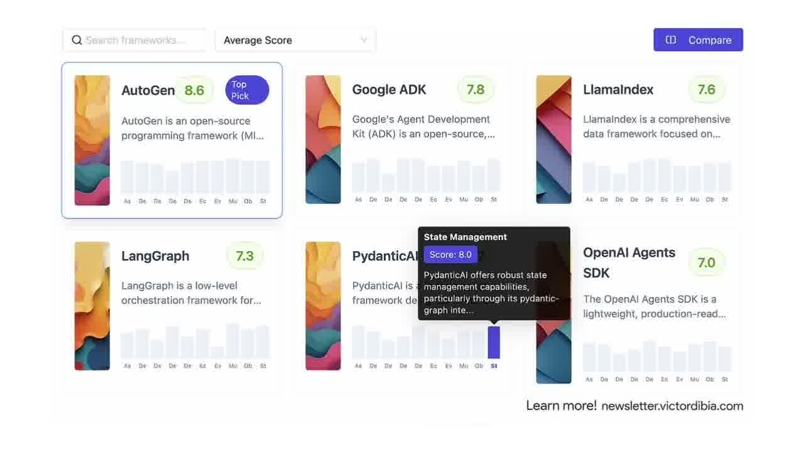

## LangGraph 的杀手锏：持久化执行

这也解释了为什么LangGraph成了企业生产的事实标准。LangGraph的杀手锏，用它官方文档的原话说，是持久化执行（durable execution）。它的机制是在编译图时挂上一个checkpointer，它就会在每个超级步（super-step）结束时把整个图的状态存一份快照。这会带来四个能力。第一个，人在回路，图可以在任意节点暂停，等人检查、修改、批准后再从断点恢复。第二个，记忆，多轮交互间保留上下文。第三个，时间旅行调试，回到任意历史检查点重放、甚至分叉出新路径。第四，容错，某个节点失败，从最后一个成功的步骤重启，而不是从头再来。更有意思的是一个叫待写入（pending writes）的设计：当同一个超级步里有个节点失败了，其他已经成功的节点的输出会被留存下来，恢复时不用重跑那些成功的节点。这些工程细节才是让智能体从能演示变成能上生产的关键。

*[17:07](https://www.youtube.com/watch?v=8RedSkw1UjE&t=1027)*

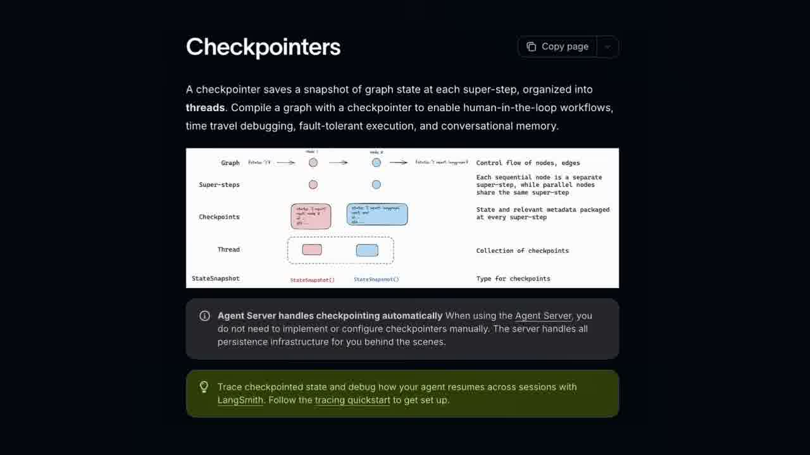

## 图工程是不是回到了 ReAct 之前的老工作流？

最后我们来回答一个问题，也是很多资深工程师最爱争的一个：很多人认为图工程，这不就是回到ReAct之前的老工作流了吗？答案是，形似，但是神不似。老工作流的路径是死的，每个节点也是写死的代码，像固定的流水线，遇到没预料的情况，完全不会拐弯。后来的ReAct走向另一个极端，让模型全程边想边做，灵活是灵活了，但整个控制流都泡在模型一次次的对话里，事后想问它为什么这么干，只能去一大段杂乱的对话记录里考古，难以复现审计，还容易失控。而图工程的巧妙是把稳和活拆到两层去解决，而不是二选一。因为让边和整体结构固定了下来，所以可以治理和审计；让节点内部保留自主，所以够灵活、能应对具体问题。这正好呼应了Anthropic那个官方定义：工作流是通过预定义代码路径编排的系统，智能体是由大模型动态决定自己流程的系统。而图恰恰是两者的融合，用预定义的边框住动态的节点。所以它回到的只是老工作流的形，内核则完全不同。老工作流的节点是死代码，Graph的节点里住着能自主推理的智能体。这种效果有点类似把ReAct的灵活收进了一副可治理的骨架里。

*[18:25](https://www.youtube.com/watch?v=8RedSkw1UjE&t=1105)*

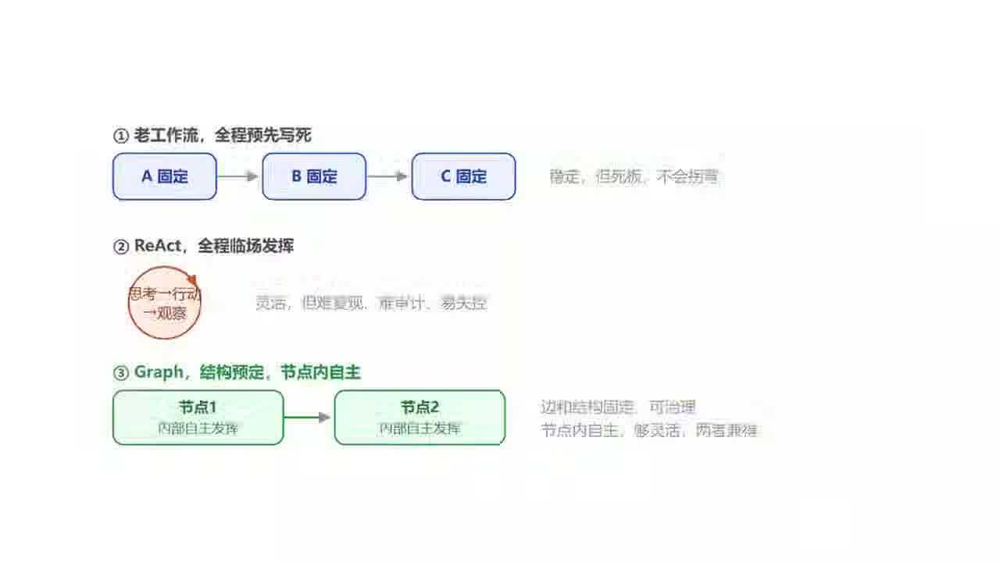

## 结论：一次命名事件，也是一次视角上移

绕了一大圈，回到最初的问题：图工程，Graph Engineering，到底是营销新词，还是真东西呢？我的判断是，它既是一次命名事件，也是一次视角上移。命名事件那部分是虚的：节点、边、状态、有向图调度、状态机、多智能体编排，这些计算机科学玩了几十年了，LangGraph、ADK、AutoGen也实打实做了两年多。这个词大概率会像Loop Engineering一样，几个月后被下一个词盖掉。但是视角上移的那部分，是实的。如今有三件事已经凑齐了：模型强到能够可靠地当一个自主节点，框架已经成熟到能把它们稳稳连起来，同时社区大到攒出了一套共同词汇。如今，工程重心从编程一个智能体的行为，实实在在地上移到了编程一群智能体的组织。这个转变是真的，它能造出单个循环永远造不出来的系统。

*[19:18](https://www.youtube.com/watch?v=8RedSkw1UjE&t=1158)*

有意思的是，我们折腾了半天AI，最后绕不开的居然是最古老的那门学问：怎么管理一个组织。比如怎么分工、怎么定权责、怎么让干活的和监督的分开、怎么在有人掉链子时不至于全盘崩掉，这些问题人类的公司琢磨了几百年，现在只是换了一批员工重新问了一遍。

*[19:35](https://www.youtube.com/watch?v=8RedSkw1UjE&t=1175)*

最后给大家三个建议：第一，别为了图而图，一个清晰的循环能搞定的，就别整复杂。先画一张能在餐巾纸上说清的小图，这是Anthropic反复强调的第一原则。第二，图的价值来自确定性，不是来自智能体的数量，让模型去判断，让代码去兜底，再配一双独立的、专门挑刺的眼睛。第三，也是最要命的，图必须接地气，得有现实的锚点，不然工程搭得再精密，也只是一台更有组织的幻觉工厂。感谢收看，我们下期再见。

*[20:06](https://www.youtube.com/watch?v=8RedSkw1UjE&t=1206)*
